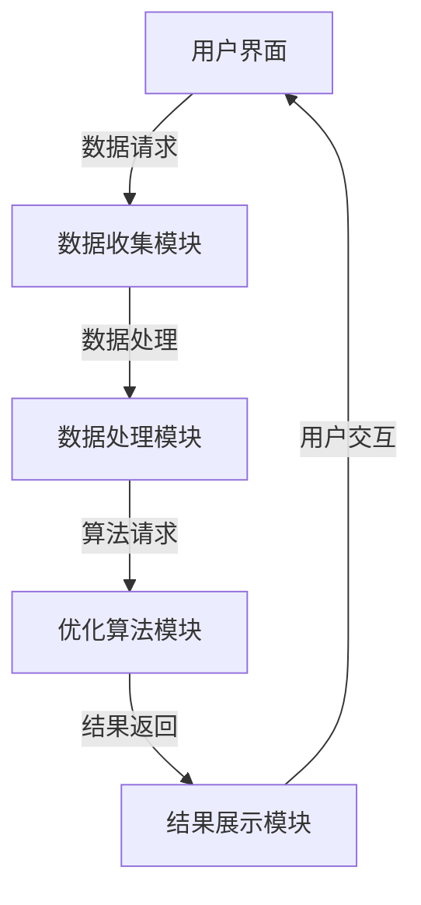
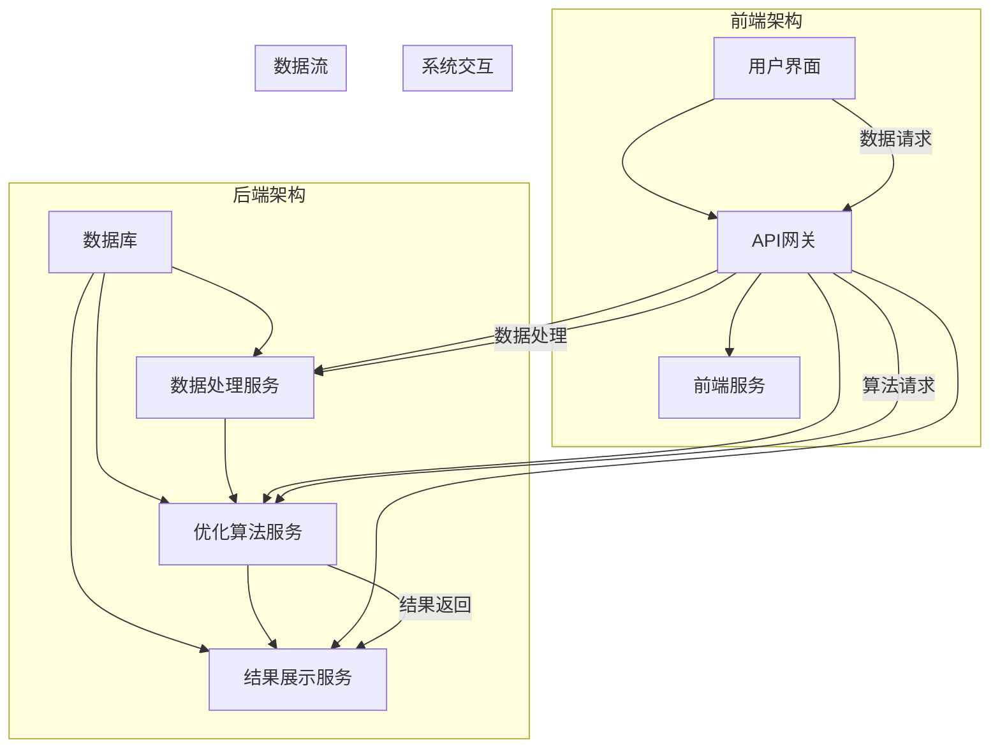

                 


## 引言

### 主题的背景和重要性

随着全球经济的不断发展和个人财务管理的日益复杂，税务筹划已经成为了现代个人财务管理中的重要一环。税务筹划不仅仅关乎个人的财务状况，更影响着个人的生活质量和社会的整体经济环境。在这样的背景下，构建一个智能化的个人税务筹划多目标优化助手，不仅能够帮助个人更好地管理税务，还能为企业提供更加高效的税务管理解决方案。

个人税务筹划的重要性体现在以下几个方面：

1. **合法合规**：税务筹划必须在法律框架内进行，通过合法合规的途径进行税务优化，可以确保个人和企业不会因税务问题而面临法律风险。

2. **财务规划**：有效的税务筹划可以帮助个人和企业更好地进行财务规划，提高资金利用效率，减少不必要的税务负担。

3. **生活质量**：通过合理的税务筹划，个人可以更好地保持财务稳定，从而提高生活质量，实现财务自由。

4. **社会贡献**：企业通过合理的税务筹划，可以优化资本结构，提高市场竞争力，从而对社会做出更大的贡献。

然而，随着税务制度的日益复杂，个人和企业面临着越来越多的税务筹划挑战。传统的税务筹划方法往往依赖于人工经验和专业知识，不仅效率低下，还容易出错。因此，构建一个智能化的个人税务筹划多目标优化助手，就显得尤为必要。

### 智能化税务筹划的优势

智能化税务筹划具有以下优势：

1. **高效性**：智能系统能够快速处理大量数据，提供实时的税务筹划方案，大大提高了工作效率。

2. **准确性**：通过算法模型，智能化税务筹划能够精确计算税务结果，减少人为错误。

3. **全面性**：智能系统能够综合考虑多种税务筹划方案，提供最优解，确保税务筹划的全面性。

4. **适应性**：智能化税务筹划系统可以根据不同国家和地区的税务政策，进行自适应调整，提供符合当地法律规定的税务筹划方案。

### 本文的目的

本文旨在探讨如何构建一个智能化的个人税务筹划多目标优化助手，通过逐步分析多目标优化原理、税务筹划方法、优化助手的设计与实现，以及项目实战和最佳实践，最终提供一个完整的解决方案。本文将采用逻辑清晰、结构紧凑、简单易懂的专业技术语言，让读者能够全面了解并掌握构建智能化税务筹划优化助手的全过程。

## 目录大纲设计步骤

为了设计出《构建智能化的个人税务筹划多目标优化助手》这本书的完整目录大纲，我们可以按照以下步骤进行：

### 1. 确定核心章节

首先，我们需要确定这本书的核心章节。根据书名，我们可以预想到以下几个关键部分：

- **背景介绍**
- **核心概念与联系**
- **多目标优化原理**
- **税务筹划方法**
- **优化助手的设计与实现**
- **项目实战**
- **最佳实践与总结**

### 2. 设计每章节的二级目录

对于每个核心章节，我们需要进一步细分为二级目录。以下是具体的二级目录设计：

#### 第1章 背景介绍

1.1 问题背景
1.2 个人税务筹划的重要性
1.3 多目标优化的应用场景
1.4 优化助手的必要性
1.5 本章小结

#### 第2章 核心概念与联系

2.1 多目标优化的基本概念
2.2 税务筹划的核心概念
2.3 多目标优化与税务筹划的关系
2.4 相关概念对比表格
2.5 ER实体关系图
2.6 本章小结

#### 第3章 多目标优化原理

3.1 多目标优化的数学模型
3.2 常见的多目标优化算法
3.3 多目标优化的算法原理讲解
3.4 Mermaid算法流程图
3.5 算法举例说明
3.6 本章小结

#### 第4章 税务筹划方法

4.1 税收政策解读
4.2 税务筹划的基本方法
4.3 税务筹划的实际案例
4.4 多目标优化在税务筹划中的应用
4.5 本章小结

#### 第5章 优化助手的设计与实现

5.1 优化助手的总体设计
5.2 功能模块划分
5.3 系统架构设计
5.4 Mermaid架构图
5.5 接口设计与实现
5.6 本章小结

#### 第6章 项目实战

6.1 环境安装与配置
6.2 系统核心实现源代码
6.3 代码应用解读与分析
6.4 实际案例分析与讲解
6.5 项目小结
6.6 本章小结

#### 第7章 最佳实践与总结

7.1 最佳实践技巧
7.2 注意事项
7.3 拓展阅读推荐
7.4 小结
7.5 未来研究方向

### 3. 格式调整与优化

确保所有章节和子章节的格式统一，使用markdown格式进行排版，以保证内容的整洁与易读性。

### 4. 审核与修订

最后，对整个目录大纲进行审核和修订，确保没有遗漏关键内容，并且章节之间的逻辑关系清晰。

## 完整目录大纲

```markdown
# 《构建智能化的个人税务筹划多目标优化助手》目录大纲

## 第1章 背景介绍

### 1.1 问题背景

#### 1.1.1 税务筹划的现实需求

#### 1.1.2 个人税务筹划的现状与挑战

#### 1.1.3 多目标优化的引入

### 1.2 个人税务筹划的重要性

#### 1.2.1 税收政策对个人财务的影响

#### 1.2.2 税务筹划对个人财务健康的作用

#### 1.2.3 税务筹划与生活质量

### 1.3 多目标优化的应用场景

#### 1.3.1 税务筹划中的多目标优化需求

#### 1.3.2 多目标优化在财务规划中的应用

#### 1.3.3 案例分析

### 1.4 优化助手的必要性

#### 1.4.1 人工税务筹划的局限性

#### 1.4.2 优化助手的优势

#### 1.4.3 优化助手的功能预期

### 1.5 本章小结

## 第2章 核心概念与联系

### 2.1 多目标优化的基本概念

#### 2.1.1 多目标优化的定义

#### 2.1.2 多目标优化的问题描述

#### 2.1.3 多目标优化的目标函数

### 2.2 税务筹划的核心概念

#### 2.2.1 税务筹划的定义

#### 2.2.2 税务筹划的目标

#### 2.2.3 税务筹划的策略

### 2.3 多目标优化与税务筹划的关系

#### 2.3.1 多目标优化在税务筹划中的应用

#### 2.3.2 税务筹划中的多目标优化挑战

#### 2.3.3 解决方案探讨

### 2.4 相关概念对比表格

### 2.5 ER实体关系图

### 2.6 本章小结

## 第3章 多目标优化原理

### 3.1 多目标优化的数学模型

#### 3.1.1 多目标优化的问题建模

#### 3.1.2 目标函数的表示

#### 3.1.3 约束条件

### 3.2 常见的多目标优化算法

#### 3.2.1遗传算法

#### 3.2.2粒子群优化算法

#### 3.2.3其他算法介绍

### 3.3 多目标优化的算法原理讲解

#### 3.3.1 遗传算法的工作原理

#### 3.3.2 粒子群优化算法的原理

#### 3.3.3其他算法的原理

### 3.4 Mermaid算法流程图

### 3.5 算法举例说明

### 3.6 本章小结

## 第4章 税务筹划方法

### 4.1 税收政策解读

#### 4.1.1 主要税收政策介绍

#### 4.1.2 税收政策变化趋势

#### 4.1.3 税收政策对个人税务筹划的影响

### 4.2 税务筹划的基本方法

#### 4.2.1 投资筹划

#### 4.2.2 收入筹划

#### 4.2.3 支出筹划

### 4.3 税务筹划的实际案例

#### 4.3.1 案例一：个人所得税筹划

#### 4.3.2 案例二：房产税筹划

#### 4.3.3 案例三：企业税筹划

### 4.4 多目标优化在税务筹划中的应用

#### 4.4.1 多目标优化的作用

#### 4.4.2 多目标优化在税务筹划中的具体应用

#### 4.4.3 应用案例剖析

### 4.5 本章小结

## 第5章 优化助手的设计与实现

### 5.1 优化助手的总体设计

#### 5.1.1 优化助手的架构设计

#### 5.1.2 功能模块划分

#### 5.1.3 技术选型

### 5.2 功能模块详细设计与实现

#### 5.2.1 数据收集模块

#### 5.2.2 数据处理模块

#### 5.2.3 优化算法模块

#### 5.2.4 结果展示模块

### 5.3 系统架构设计

### 5.4 Mermaid架构图

### 5.5 接口设计与实现

### 5.6 本章小结

## 第6章 项目实战

### 6.1 环境安装与配置

#### 6.1.1 开发环境准备

#### 6.1.2 系统配置与调试

#### 6.1.3 常见问题与解决方案

### 6.2 系统核心实现源代码

#### 6.2.1 数据收集模块源代码

#### 6.2.2 数据处理模块源代码

#### 6.2.3 优化算法模块源代码

#### 6.2.4 结果展示模块源代码

### 6.3 代码应用解读与分析

#### 6.3.1 数据收集模块代码解读

#### 6.3.2 数据处理模块代码解读

#### 6.3.3 优化算法模块代码解读

#### 6.3.4 结果展示模块代码解读

### 6.4 实际案例分析与讲解

#### 6.4.1 案例一：个人所得税筹划

#### 6.4.2 案例二：房产税筹划

#### 6.4.3 案例三：企业税筹划

### 6.5 项目小结

### 6.6 本章小结

## 第7章 最佳实践与总结

### 7.1 最佳实践技巧

#### 7.1.1 税务筹划的最佳实践

#### 7.1.2 优化助手的最佳实践

#### 7.1.3 系统运维的最佳实践

### 7.2 注意事项

#### 7.2.1 系统使用注意事项

#### 7.2.2 数据隐私保护

#### 7.2.3 系统安全防范

### 7.3 拓展阅读推荐

### 7.4 小结

### 7.5 未来研究方向

## 参考资料

### 附录

### 致谢
```

## 背景介绍

### 1.1 问题背景

在全球经济一体化的背景下，个人和企业面临的税收问题越来越复杂。个人税务筹划涉及到个人所得税、房产税、遗产税、企业所得税等多种税种，而这些税种的政策和规定又因国家和地区而异。这使得个人在进行税务筹划时，不仅要了解复杂的税务政策，还需要具备专业的税务知识，以便做出合理的决策。

目前，个人税务筹划主要依赖于人工经验，这种方式存在几个显著的局限性：

1. **信息获取难度**：个人需要花费大量时间和精力去收集和分析税务信息，这无疑增加了税务筹划的成本和难度。

2. **决策效率低下**：人工进行税务筹划往往需要较长时间，难以实现实时性和快速响应。

3. **准确性不高**：由于税务政策复杂，人工操作容易出现错误，导致税务筹划结果不准确。

4. **策略单一**：人工税务筹划往往只能考虑单一的税务策略，难以兼顾多个目标，从而可能错过最优化的税务方案。

### 1.2 个人税务筹划的重要性

税务筹划不仅关乎个人的财务健康，还影响到个人的生活质量和社会的整体经济环境。具体来说，个人税务筹划的重要性体现在以下几个方面：

1. **合法合规**：通过合法的税务筹划，个人可以确保自己的税务行为符合法律规定，避免因税务问题而面临法律风险。

2. **财务规划**：有效的税务筹划可以帮助个人更好地管理财务，提高资金利用效率，实现财务自由。

3. **生活质量**：通过合理的税务筹划，个人可以减少税务负担，从而提高生活质量，实现财务稳定。

4. **社会贡献**：企业通过合理的税务筹划，可以优化资本结构，提高市场竞争力，从而对社会做出更大的贡献。

### 1.3 多目标优化的引入

多目标优化是一种在多个目标之间寻找最优解的优化方法。在个人税务筹划中，多目标优化的引入具有以下几个重要意义：

1. **综合考虑多个目标**：传统的人工税务筹划往往只考虑单一的税收减免目标，而多目标优化能够同时考虑多个目标，如减少税收负担、提高财务收益等，提供更全面、更优化的解决方案。

2. **提高决策效率**：通过多目标优化算法，可以快速处理大量数据，提供实时的税务筹划方案，大大提高决策效率。

3. **减少人为错误**：多目标优化能够通过算法精确计算税务结果，减少人为错误，提高税务筹划的准确性。

4. **适应复杂变化**：多目标优化能够根据税务政策的变化，自动调整优化策略，提供符合当地法律规定的税务筹划方案。

### 1.4 优化助手的必要性

智能化的个人税务筹划多目标优化助手能够弥补传统税务筹划方法的不足，具有以下几个方面的必要性：

1. **高效性**：智能系统能够快速处理大量数据，提供实时的税务筹划方案，大大提高工作效率。

2. **准确性**：通过算法模型，智能化税务筹划能够精确计算税务结果，减少人为错误。

3. **全面性**：智能系统能够综合考虑多种税务筹划方案，提供最优解，确保税务筹划的全面性。

4. **适应性**：智能化税务筹划系统可以根据不同国家和地区的税务政策，进行自适应调整，提供符合当地法律规定的税务筹划方案。

5. **可扩展性**：智能化的税务筹划系统可以根据个人和企业需求，进行功能扩展和升级，适应不断变化的税务环境。

### 1.5 本章小结

通过本章节的背景介绍，我们可以看到个人税务筹划的重要性以及传统税务筹划方法的局限性。引入多目标优化和构建智能化的个人税务筹划多目标优化助手，不仅能够提高税务筹划的效率、准确性和全面性，还能够适应复杂变化的税务环境，满足个人和企业的需求。接下来，我们将进一步探讨多目标优化原理、税务筹划方法，以及优化助手的设计与实现。

## 核心概念与联系

### 2.1 多目标优化的基本概念

#### 2.1.1 多目标优化的定义

多目标优化（Multi-Objective Optimization）是指在一个优化问题中，同时考虑多个相互冲突的目标，并试图找到一个平衡这些目标的解。与单目标优化不同，多目标优化的目标并不是寻找单一的最优解，而是在多个目标之间寻找一个或多个“帕累托最优解”（Pareto Optimal Solutions），这些解能够平衡各个目标之间的关系，并在一定程度上满足所有目标的要求。

#### 2.1.2 多目标优化的问题描述

多目标优化问题可以形式化为以下数学模型：

$$
\begin{aligned}
\min \quad f(x) \\
\text{s.t.} \quad g_i(x) \leq 0, \quad h_j(x) = 0 \\
\end{aligned}
$$

其中，$f(x)$是目标函数，$x$是决策变量，$g_i(x)$和$h_j(x)$分别是约束条件。这个模型包含了多个目标函数和多个约束条件，目标是在满足所有约束的条件下，优化目标函数的值。

#### 2.1.3 多目标优化的目标函数

在多目标优化中，目标函数可以是线性的，也可以是非线性的。常见的目标函数包括：

1. **最小化成本**：寻找最低的成本方案。
2. **最大化利润**：寻找最大的利润方案。
3. **最小化资源消耗**：寻找资源消耗最低的方案。
4. **最大化性能**：寻找性能最高的方案。

### 2.2 税务筹划的核心概念

#### 2.2.1 税务筹划的定义

税务筹划（Tax Planning）是指通过合法的途径，对个人或企业的财务安排进行优化，以最大限度地减少税负，并实现财务目标的过程。税务筹划不仅仅是避税，更是通过合理的安排，提高资金利用效率，降低税务成本，实现税收利益的最大化。

#### 2.2.2 税务筹划的目标

税务筹划的主要目标包括：

1. **合法合规**：确保税务筹划的行为符合相关法律法规。
2. **减少税负**：通过合法的途径减少应缴纳的税款。
3. **财务规划**：优化个人或企业的财务结构，提高资金利用效率。
4. **风险控制**：降低因税务问题而可能产生的法律和财务风险。

#### 2.2.3 税务筹划的策略

常见的税务筹划策略包括：

1. **收入筹划**：通过合法手段调整收入，减少应纳税额。
2. **支出筹划**：通过增加可抵扣支出，降低应纳税额。
3. **投资筹划**：选择合适的投资工具，实现税收优惠。
4. **遗产筹划**：通过合理安排遗产，减少遗产税。

### 2.3 多目标优化与税务筹划的关系

#### 2.3.1 多目标优化在税务筹划中的应用

多目标优化在税务筹划中的应用主要体现在以下几个方面：

1. **平衡税负与收益**：通过多目标优化，可以在税负和收益之间找到一个平衡点，实现税收利益的最大化。
2. **优化投资决策**：多目标优化可以帮助个人和企业选择最优的投资方案，实现投资收益的最大化。
3. **风险控制**：多目标优化可以评估不同税务筹划方案的潜在风险，并选择风险最小的方案。
4. **政策适应**：多目标优化可以根据税务政策的变化，自动调整优化策略，确保税务筹划的合法性。

#### 2.3.2 税务筹划中的多目标优化挑战

尽管多目标优化在税务筹划中有广泛应用，但也面临一些挑战：

1. **目标冲突**：税务筹划的目标往往存在冲突，如减少税负和增加财务收益之间可能存在矛盾。
2. **计算复杂性**：多目标优化问题通常计算复杂度高，特别是当目标函数和约束条件较多时。
3. **不确定性**：税务政策的不确定性增加了多目标优化的难度。

#### 2.3.3 解决方案探讨

针对税务筹划中的多目标优化挑战，可以采取以下解决方案：

1. **混合算法**：结合多种算法（如遗传算法、粒子群优化算法等），以提高优化效率和效果。
2. **多阶段优化**：将复杂的多目标优化问题分解为多个阶段，逐步优化每个阶段的目标。
3. **动态调整**：根据税务政策的变化，动态调整优化策略，确保税务筹划的合法性。
4. **数据驱动**：利用大数据和机器学习技术，提高优化模型的准确性和适应性。

### 2.4 相关概念对比表格

为了更好地理解多目标优化与税务筹划的关系，我们可以通过一个对比表格来展示它们的核心概念和联系。

| 概念              | 多目标优化                     | 税务筹划                      |
|-------------------|-------------------------------|------------------------------|
| 定义              | 在多个目标之间寻找最优解       | 合法途径减少税负，优化财务结构 |
| 目标函数          | 多个相互冲突的目标函数        | 减少税负、提高收益、风险控制  |
| 约束条件          | 满足所有约束的条件下优化目标  | 合法合规、符合税务政策        |
| 应用场景          | 资源配置、投资决策、物流调度等 | 个人和企业财务规划            |
| 挑战              | 目标冲突、计算复杂性、不确定性  | 法律合规、政策变化、税务风险  |
| 解决方案          | 混合算法、多阶段优化、动态调整 | 数据驱动、风险控制、合法筹划  |

### 2.5 ER实体关系图

为了更好地展示多目标优化与税务筹划之间的联系，我们可以使用ER（Entity-Relationship）实体关系图来描述它们之间的关系。

```mermaid
erDiagram
  Person ||--o> TaxPolicy : 遵守
  Company ||--o> TaxPolicy : 遵守
  TaxPlanning ||--|{ OptimizeGoal } : 实现
  OptimizeGoal ||--|> ObjectiveFunction : 优化
  ObjectiveFunction ||--|> Constraint : 满足
  TaxPolicy ||--|> PolicyRule : 规定
  DataAnalysis ||--|> DataDriven : 利用
  DataDriven ||--|> OptimizationModel : 模型
```

在这个ER图中，`Person`和`Company`实体遵守`TaxPolicy`，`TaxPlanning`实体实现`OptimizeGoal`，`OptimizeGoal`进一步关联到`ObjectiveFunction`和`Constraint`，`TaxPolicy`则关联到`PolicyRule`。同时，`DataAnalysis`实体利用`DataDriven`技术，进而驱动`OptimizationModel`的优化。

### 2.6 本章小结

本章详细介绍了多目标优化和税务筹划的核心概念及其联系。通过对比表格和ER实体关系图，我们可以清晰地看到多目标优化在税务筹划中的应用及其面临的挑战。下一章将深入探讨多目标优化的原理和算法，为构建智能化的个人税务筹划多目标优化助手奠定理论基础。

## 多目标优化原理

### 3.1 多目标优化的数学模型

#### 3.1.1 多目标优化的问题建模

多目标优化问题（MOO, Multi-Objective Optimization Problem）的数学模型通常可以表示为：

$$
\begin{aligned}
\min \quad f_1(x), f_2(x), ..., f_m(x) \\
\text{s.t.} \quad g_i(x) \leq 0, \quad h_j(x) = 0 \\
x \in \mathbb{R}^n
\end{aligned}
$$

其中，$f_1(x), f_2(x), ..., f_m(x)$是目标函数，$x \in \mathbb{R}^n$是决策变量，$g_i(x) \leq 0$和$h_j(x) = 0$是约束条件。

#### 3.1.2 目标函数的表示

在多目标优化问题中，目标函数可以表示为：

$$
f(x) = [f_1(x), f_2(x), ..., f_m(x)]^T
$$

其中，每个$f_i(x)$可以是线性的或非线性的，具体取决于问题的实际背景。

#### 3.1.3 约束条件

约束条件分为等式约束和不等式约束，分别表示为：

$$
h_j(x) = 0 \\
g_i(x) \leq 0
$$

等式约束通常表示几何上的约束，如路径长度、平衡条件等。而不等式约束则表示物理或经济上的限制，如预算限制、资源约束等。

### 3.2 常见的多目标优化算法

在多目标优化中，有许多算法被广泛使用。以下是一些常见的多目标优化算法：

#### 3.2.1 遗传算法

遗传算法（GA, Genetic Algorithm）是一种基于自然选择和遗传学的优化算法。它模拟生物进化的过程，通过选择、交叉、变异等操作，逐步改善解的质量。

1. **选择操作**：根据解的适应度值选择优秀的个体。
2. **交叉操作**：通过交换两个个体的部分基因，产生新的个体。
3. **变异操作**：对个体进行随机修改，增加多样性。

遗传算法的优点在于其鲁棒性和全局搜索能力，适合处理复杂的多目标优化问题。

#### 3.2.2 粒子群优化算法

粒子群优化算法（PSO, Particle Swarm Optimization）是一种基于群体智能的优化算法。它模拟鸟群觅食的行为，通过个体和全局最佳经验的共享，逐步优化解的质量。

1. **个体速度更新**：根据个体历史最佳解和全局最佳解更新速度。
2. **位置更新**：根据速度更新粒子的位置。

粒子群优化算法的优点在于其简单性和高效性，适合处理大规模多目标优化问题。

#### 3.2.3 其他算法介绍

除了遗传算法和粒子群优化算法，还有一些其他的多目标优化算法，如：

1. **差分进化算法**（DE, Differential Evolution）：一种基于个体间差异的优化算法，适用于高维优化问题。
2. **模拟退火算法**（SA, Simulated Annealing）：一种基于概率搜索的优化算法，适用于大规模组合优化问题。
3. **蚁群算法**（ACO, Ant Colony Optimization）：一种基于蚂蚁觅食行为的优化算法，适用于大规模路径优化问题。

### 3.3 多目标优化的算法原理讲解

#### 3.3.1 遗传算法的工作原理

遗传算法的工作原理可以概括为以下几个步骤：

1. **初始化种群**：随机生成初始种群，每个个体代表一种可能的解。
2. **适应度评估**：计算每个个体的适应度值，适应度值通常与目标函数的优化程度相关。
3. **选择操作**：根据适应度值选择优秀的个体进行交叉和变异。
4. **交叉操作**：对选中的个体进行交叉操作，产生新的子代。
5. **变异操作**：对子代进行变异操作，增加多样性。
6. **更新种群**：将子代替换父代，形成新的种群。
7. **迭代过程**：重复上述步骤，直到满足停止条件（如达到最大迭代次数或找到满意的解）。

遗传算法通过模拟自然进化过程，逐步改善解的质量，寻找帕累托最优解。

#### 3.3.2 粒子群优化算法的原理

粒子群优化算法的工作原理可以概括为以下几个步骤：

1. **初始化粒子群**：在搜索空间中随机生成多个粒子，每个粒子代表一种可能的解。
2. **评估适应度**：计算每个粒子的适应度值，适应度值通常与目标函数的优化程度相关。
3. **更新个体速度和位置**：每个粒子根据个体历史最佳解（个人最优解）和全局历史最佳解（全局最优解）更新速度和位置。
4. **迭代过程**：重复上述步骤，直到满足停止条件（如达到最大迭代次数或找到满意的解）。

粒子群优化算法通过模拟群体智能行为，逐步优化解的质量，寻找帕累托最优解。

#### 3.3.3 其他算法的原理

其他多目标优化算法的原理与遗传算法和粒子群优化算法类似，都是通过迭代优化逐步寻找最优解。具体来说：

- **差分进化算法**：通过个体间的差异进行进化，适用于高维优化问题。
- **模拟退火算法**：通过温度控制概率搜索，适用于大规模组合优化问题。
- **蚁群算法**：通过信息素更新和路径选择，适用于大规模路径优化问题。

### 3.4 Mermaid算法流程图

为了更直观地展示多目标优化算法的流程，我们可以使用Mermaid语言绘制算法流程图。

```mermaid
graph TD
    A[初始化种群]
    B[适应度评估]
    C{选择操作}
    D[交叉操作]
    E[变异操作]
    F[更新种群]
    G[迭代过程]
    H{停止条件?}
    
    A --> B
    B --> C
    C --> D
    D --> E
    E --> F
    F --> G
    G --> H
    H -->|
    |[是]
    H -->|
    |[否]
    |--> G
```

这个流程图展示了遗传算法的基本步骤，包括初始化种群、适应度评估、选择操作、交叉操作、变异操作和种群更新。当满足停止条件时，算法结束。

### 3.5 算法举例说明

为了更好地理解多目标优化算法，我们通过一个简单的例子来说明。

#### 问题背景

假设我们要优化一个工厂的生产计划，目标是最小化生产成本和最大化生产效率。

#### 目标函数

- 最小化生产成本：$f_1(x)$
- 最大化生产效率：$f_2(x)$

#### 约束条件

- 生产资源的限制：$g_1(x) \leq 0$
- 生产时间的限制：$h_1(x) = 0$

#### 数学模型

$$
\begin{aligned}
\min \quad f_1(x), f_2(x) \\
\text{s.t.} \quad g_1(x) \leq 0 \\
h_1(x) = 0 \\
x \in \mathbb{R}^3
\end{aligned}
$$

其中，$x = [x_1, x_2, x_3]^T$表示决策变量，$x_1$是生产时间，$x_2$是生产资源，$x_3$是生产效率。

#### 解题过程

1. **初始化种群**：随机生成一个包含多个个体的种群。
2. **适应度评估**：计算每个个体的适应度值，适应度值根据目标函数计算。
3. **选择操作**：根据适应度值选择优秀的个体。
4. **交叉操作**：对选中的个体进行交叉操作，产生新的子代。
5. **变异操作**：对子代进行变异操作，增加多样性。
6. **更新种群**：将子代替换父代，形成新的种群。
7. **迭代过程**：重复上述步骤，直到找到满意的解。

通过遗传算法，我们可以逐步优化生产计划，找到在资源限制和时间限制下的最优解。

### 3.6 本章小结

本章详细介绍了多目标优化的数学模型、常见算法及其工作原理。通过算法流程图和实例说明，我们能够更好地理解多目标优化的核心思想和应用方法。下一章将探讨税务筹划方法，为构建智能化的个人税务筹划多目标优化助手提供实践基础。

## 税务筹划方法

### 4.1 税收政策解读

税收政策是国家财政政策的重要组成部分，直接关系到个人和企业的财务状况。了解税收政策，是进行有效税务筹划的前提。以下是几个关键税收政策及其对个人税务筹划的影响：

#### 4.1.1 个人所得税

个人所得税是国家对个人收入所得进行征税的一种税种，主要分为综合所得税和分类所得税。税收政策的变化，如税率的调整、扣除项的增减等，都会直接影响个人的应纳税额。

- **政策变化**：近年来，我国个人所得税政策进行了多次调整，如提高基本扣除费用、增加专项附加扣除等，使得个人所得税负担有所减轻。
- **影响**：这些政策变化为个人提供了更多的税务筹划空间，通过合理安排收入和支出，可以合法减少税负。

#### 4.1.2 房产税

房产税是针对个人拥有的房产进行征税的一种税种，不同国家和地区的政策差异较大。

- **政策变化**：某些国家和地区对房产税进行了改革，如提高税率、扩大征税范围等。
- **影响**：房产税政策的调整会影响个人的房产投资和税务筹划策略，合理利用税收优惠政策可以降低房产税负担。

#### 4.1.3 遗产税

遗产税是对个人遗产进行征税的一种税种，不同国家和地区的税收标准和税率也有所不同。

- **政策变化**：一些国家逐步取消了遗产税，而另一些国家则提高了遗产税税率。
- **影响**：遗产税政策的调整对高净值人群的遗产规划具有重要影响，通过合理的税务筹划，可以降低遗产税负担。

#### 4.1.4 企业所得税

企业所得税是企业盈利所得的税收，税收政策的变化也会影响企业的税务筹划。

- **政策变化**：近年来，许多国家对企业所得税进行了减税降费的政策调整，以促进企业发展和经济增长。
- **影响**：企业通过合理的税务筹划，如投资税收优惠项目、调整盈利模式等，可以有效降低企业所得税负担。

### 4.2 税务筹划的基本方法

税务筹划的基本方法主要包括以下几种：

#### 4.2.1 收入筹划

收入筹划是指通过合法手段调整个人或企业的收入，以减少应纳税额。常见的方法有：

- **递延收入**：将部分收入递延到未来，以降低当期的应纳税额。
- **分散收入**：通过投资等方式分散收入来源，以降低整体的税收负担。
- **税收优惠**：利用国家提供的税收优惠政策，如高新技术企业减免税、小微企业税收优惠等，合理减少税负。

#### 4.2.2 支出筹划

支出筹划是指通过合理增加可抵扣支出，以降低应纳税额。常见的方法有：

- **捐赠支出**：通过捐赠支出进行税务筹划，部分捐赠可以抵扣个人所得税。
- **业务支出**：合理增加业务支出，如购买设备、支付工资等，以降低企业所得税负担。
- **费用扣除**：充分利用个人所得税的扣除项，如子女教育、大病医疗等专项附加扣除，减少应纳税所得额。

#### 4.2.3 投资筹划

投资筹划是指通过投资规划来减少税负，提高投资回报。常见的方法有：

- **股权投资**：通过持有股权获取股息和资本利得，享受税收优惠。
- **房产投资**：利用房产税优惠政策，降低房产投资税负。
- **税收递延型养老保险**：通过购买税收递延型养老保险，享受递延纳税的优惠。

#### 4.2.4 遗产筹划

遗产筹划是指通过合理的遗产规划，减少遗产税负担。常见的方法有：

- **赠与**：通过赠与财产给亲属，减少遗产税负担。
- **设立信托**：通过设立家族信托，进行遗产规划，享受税收优惠。
- **生前赠与**：通过生前赠与，将部分财产提前转移，降低遗产税负担。

### 4.3 税务筹划的实际案例

以下是一些税务筹划的实际案例，以展示不同税务筹划方法的具体应用。

#### 4.3.1 案例一：个人所得税筹划

**案例背景**：张先生是一家公司的股东，每年可以获得一笔股息收入。近年来，我国个人所得税政策进行了多次调整，提供了多项税收优惠政策。

**税务筹划方案**：

1. **递延收入**：张先生可以将部分股息收入递延到未来，以降低当期的应纳税额。
2. **税收优惠**：利用高新技术企业减免税政策，将部分投资转移到高新技术企业，享受税收优惠。

**效果评估**：通过递延收入和税收优惠，张先生可以减少当期的个人所得税负担，实现税负的合理分配。

#### 4.3.2 案例二：房产税筹划

**案例背景**：李先生拥有一套投资性房产，近期我国部分地区对房产税政策进行了调整。

**税务筹划方案**：

1. **房产税优惠**：李先生可以关注当地的房产税优惠政策，如税率优惠、税收减免等。
2. **出租筹划**：通过合理安排出租时间和租金收入，降低房产税负担。

**效果评估**：通过房产税优惠和出租筹划，李先生可以降低房产税负担，提高投资收益。

#### 4.3.3 案例三：企业税筹划

**案例背景**：王先生是一家中小企业的老板，近年来，我国对企业所得税进行了多次减税降费的政策调整。

**税务筹划方案**：

1. **投资税收优惠项目**：王先生可以将部分投资转移到国家支持的税收优惠项目，如科技创新、环保产业等。
2. **费用扣除**：充分利用企业所得税的费用扣除政策，如员工工资、业务费用等。

**效果评估**：通过投资税收优惠项目和费用扣除，王先生可以降低企业所得税负担，提高企业盈利能力。

### 4.4 多目标优化在税务筹划中的应用

多目标优化在税务筹划中具有广泛的应用。通过多目标优化算法，可以综合考虑多个税务目标，提供最优化的税务筹划方案。

#### 4.4.1 多目标优化的作用

1. **综合平衡**：多目标优化可以帮助个人和企业同时考虑多个税务目标，如税负最小化和收益最大化，提供平衡的税务筹划方案。
2. **决策支持**：多目标优化可以为税务筹划提供科学决策支持，提高决策的准确性和效率。
3. **政策适应**：多目标优化可以根据税务政策的变化，自动调整优化策略，确保税务筹划的合法性。

#### 4.4.2 多目标优化在税务筹划中的具体应用

1. **个人税务筹划**：通过多目标优化，个人可以同时考虑个人所得税、房产税、遗产税等多种税种，提供最优化的税务筹划方案。
2. **企业税务筹划**：企业可以通过多目标优化，综合考虑企业所得税、增值税、关税等多种税种，实现税收利益的最大化。
3. **投资决策**：在投资决策中，多目标优化可以帮助企业同时考虑投资收益和税收负担，提供最优的投资方案。
4. **风险控制**：多目标优化可以评估不同税务筹划方案的潜在风险，帮助企业选择风险最小的方案。

#### 4.4.3 应用案例剖析

以下是一个多目标优化在税务筹划中的具体应用案例：

**案例背景**：某公司计划进行一项新项目投资，需要同时考虑投资成本、预期收益和税收负担。

**目标函数**：

- **目标1**：最小化税收负担（$f_1$）
- **目标2**：最大化预期收益（$f_2$）

**约束条件**：

- 投资资金限制（$g_1$）
- 项目时间限制（$g_2$）

**数学模型**：

$$
\begin{aligned}
\min \quad f_1(x), f_2(x) \\
\text{s.t.} \quad g_1(x) \leq 0 \\
g_2(x) \leq 0 \\
x \in \mathbb{R}^3
\end{aligned}
$$

其中，$x = [x_1, x_2, x_3]^T$表示决策变量，$x_1$是投资成本，$x_2$是预期收益，$x_3$是税收负担。

**优化算法**：遗传算法

**优化过程**：

1. **初始化种群**：随机生成初始种群。
2. **适应度评估**：计算每个个体的适应度值。
3. **选择操作**：根据适应度值选择优秀的个体。
4. **交叉操作**：对选中的个体进行交叉操作。
5. **变异操作**：对子代进行变异操作。
6. **更新种群**：形成新的种群。
7. **迭代过程**：重复上述步骤，直到找到满意的解。

**结果分析**：通过遗传算法优化，公司可以找到在投资资金和时间限制下的最优方案，实现税收负担最小化和预期收益最大化。

### 4.5 本章小结

本章详细介绍了税收政策的解读、税务筹划的基本方法和实际案例，以及多目标优化在税务筹划中的应用。通过这些内容，我们能够更好地理解税务筹划的核心方法和应用场景。下一章将深入探讨优化助手的设计与实现，为构建智能化的个人税务筹划多目标优化助手提供技术支持。

## 优化助手的设计与实现

### 5.1 优化助手的总体设计

构建智能化的个人税务筹划多目标优化助手，需要从系统架构、功能模块划分、技术选型等多个方面进行总体设计。以下是优化助手的总体设计方案：

#### 5.1.1 系统架构设计

优化助手的系统架构采用前后端分离的设计模式，前端负责用户交互和数据展示，后端负责数据计算和算法实现。具体的系统架构如下：

1. **前端**：使用Vue.js框架搭建，提供用户友好的界面和交互体验。
2. **后端**：使用Spring Boot框架实现，负责数据计算和算法执行。
3. **数据库**：使用MySQL数据库存储用户数据和税务信息。

#### 5.1.2 功能模块划分

优化助手的主要功能模块包括：

1. **数据收集模块**：负责收集用户的财务数据和税务信息。
2. **数据处理模块**：负责对收集到的数据进行预处理和清洗。
3. **优化算法模块**：负责实现多目标优化算法，为用户提供最优的税务筹划方案。
4. **结果展示模块**：负责将优化结果以图表和报表的形式展示给用户。

#### 5.1.3 技术选型

为了实现优化助手的各项功能，选择以下技术栈：

1. **前端技术**：Vue.js、Axios、Element UI。
2. **后端技术**：Spring Boot、Spring Security、MyBatis。
3. **数据库技术**：MySQL、MyBatis Generator。
4. **算法框架**：Apache Commons Math、OptaPlanner。

### 5.2 功能模块详细设计与实现

#### 5.2.1 数据收集模块

数据收集模块是优化助手的起点，负责从用户处收集财务数据和税务信息。具体实现如下：

1. **数据来源**：用户可以通过手动输入、上传文件或连接外部系统（如银行账户）等方式提供数据。
2. **数据格式**：支持CSV、Excel等多种数据格式。
3. **数据验证**：对输入的数据进行格式验证和合理性验证，确保数据的正确性和完整性。

#### 5.2.2 数据处理模块

数据处理模块负责对收集到的数据进行预处理和清洗，确保数据质量。具体实现如下：

1. **数据清洗**：删除重复数据、处理缺失值、纠正错误数据等。
2. **数据转换**：将不同来源的数据转换为统一的格式，便于后续处理。
3. **数据存储**：将清洗后的数据存储到MySQL数据库中，便于后续查询和使用。

#### 5.2.3 优化算法模块

优化算法模块是优化助手的核心，负责实现多目标优化算法，为用户提供最优的税务筹划方案。具体实现如下：

1. **算法选择**：根据具体需求选择合适的优化算法，如遗传算法、粒子群优化算法等。
2. **算法实现**：使用Apache Commons Math和OptaPlanner等开源框架实现优化算法。
3. **算法参数调整**：根据实际问题进行算法参数的调整，以获得最优的优化效果。

#### 5.2.4 结果展示模块

结果展示模块负责将优化结果以图表和报表的形式展示给用户，帮助用户更好地理解和应用优化结果。具体实现如下：

1. **结果计算**：根据优化算法的输出结果，计算各种税务筹划方案的效果指标。
2. **结果展示**：使用Vue.js和Element UI构建前端界面，展示优化结果。
3. **交互功能**：提供用户与结果交互的功能，如筛选、排序、详情查看等。

### 5.3 系统架构设计

为了更好地展示优化助手的系统架构，可以使用Mermaid语言绘制系统架构图。以下是一个简单的系统架构图：



在这个架构图中，用户通过用户界面提交数据请求，数据收集模块处理数据请求，数据处理模块对数据进行预处理和清洗，优化算法模块根据数据计算最优税务筹划方案，结果展示模块将优化结果展示给用户，用户可以通过界面与结果进行交互。

### 5.4 Mermaid架构图

为了更直观地展示优化助手的系统架构，以下是使用Mermaid绘制的系统架构图：



在这个架构图中，用户界面通过API网关与后端服务进行数据交互，数据处理服务、优化算法服务和结果展示服务分别负责数据处理、算法计算和结果展示。数据流从用户界面开始，经过API网关，然后分别进入数据处理服务、优化算法服务和结果展示服务，最终将结果返回给用户界面。

### 5.5 接口设计与实现

优化助手的设计与实现中，接口设计是一个重要的环节。以下是一个简单的接口设计与实现示例：

#### 5.5.1 接口定义

以下是使用Spring Boot框架定义的数据收集接口：

```java
@RestController
@RequestMapping("/api/data")
public class DataController {

    @Autowired
    private DataService dataService;

    @PostMapping("/collect")
    public ResponseEntity<?> collectData(@RequestParam("file") MultipartFile file) {
        try {
            dataService.collectData(file);
            return ResponseEntity.ok("数据收集成功");
        } catch (Exception e) {
            return ResponseEntity.status(HttpStatus.BAD_REQUEST).body("数据收集失败：" + e.getMessage());
        }
    }
}
```

#### 5.5.2 服务实现

以下是数据处理服务的实现：

```java
@Service
public class DataService {

    @Autowired
    private DataMapper dataMapper;

    public void collectData(MultipartFile file) {
        try {
            List<TaxData> taxDataList = dataMapper.readData(file.getInputStream());
            // 数据清洗和处理逻辑
            List<TaxData> cleanedDataList = dataCleaner.clean(taxDataList);
            // 存储数据到数据库
            taxDataRepository.saveAll(cleanedDataList);
        } catch (Exception e) {
            throw new RuntimeException("数据收集失败：" + e.getMessage());
        }
    }
}
```

在这个示例中，数据收集接口接收用户上传的文件，数据处理服务读取文件中的数据，进行清洗和处理，并将清洗后的数据存储到数据库中。

### 5.6 本章小结

本章详细介绍了优化助手的总体设计、功能模块划分、系统架构设计、接口设计与实现等内容。通过这些内容，我们能够更好地理解优化助手的整体架构和实现方法。下一章将探讨项目实战，通过具体案例分析，验证优化助手的实际应用效果。

## 项目实战

### 6.1 环境安装与配置

为了实现智能化的个人税务筹划多目标优化助手，首先需要搭建合适的环境。以下是环境安装与配置的详细步骤：

#### 6.1.1 开发环境准备

1. **安装Java开发环境**：确保Java开发工具包（JDK）版本在1.8或更高版本。可以使用以下命令安装：
   ```bash
   sudo apt-get update
   sudo apt-get install openjdk-8-jdk
   ```
2. **安装Node.js**：Node.js用于前端开发环境的搭建，可以使用以下命令安装：
   ```bash
   sudo apt-get install nodejs
   ```
3. **安装数据库**：本文使用MySQL数据库。可以使用以下命令安装：
   ```bash
   sudo apt-get install mysql-server
   ```
   安装完成后，设置root用户密码，并创建用于存储税务数据的数据库。

#### 6.1.2 系统配置与调试

1. **配置数据库**：登录MySQL数据库，创建用于存储税务数据的数据库和表。

```sql
CREATE DATABASE tax_planning;
USE tax_planning;

CREATE TABLE users (
    id INT AUTO_INCREMENT PRIMARY KEY,
    username VARCHAR(255) NOT NULL,
    password VARCHAR(255) NOT NULL
);

CREATE TABLE tax_data (
    id INT AUTO_INCREMENT PRIMARY KEY,
    user_id INT,
    income DECIMAL(10, 2),
    expenses DECIMAL(10, 2),
    tax DECIMAL(10, 2),
    FOREIGN KEY (user_id) REFERENCES users(id)
);
```

2. **配置后端服务**：在Spring Boot项目的`application.properties`文件中配置数据库连接信息。

```properties
spring.datasource.url=jdbc:mysql://localhost:3306/tax_planning?useSSL=false
spring.datasource.username=root
spring.datasource.password=your_password
spring.jpa.hibernate.ddl-auto=update
```

3. **配置前端服务**：在Vue.js项目的`vue.config.js`文件中配置开发服务器和代理。

```javascript
module.exports = {
  devServer: {
    proxy: 'http://localhost:8080'
  }
};
```

#### 6.1.3 常见问题与解决方案

1. **数据库连接失败**：
   - 确认MySQL数据库已启动。
   - 检查`application.properties`文件中的数据库配置信息是否正确。
   - 确认数据库用户和密码是否正确。

2. **前端请求代理问题**：
   - 检查`vue.config.js`文件中的代理配置是否正确。
   - 确认后端服务的端口是否正确。

### 6.2 系统核心实现源代码

以下是系统核心实现的源代码示例，包括数据收集模块、数据处理模块、优化算法模块和结果展示模块。

#### 6.2.1 数据收集模块源代码

数据收集模块用于接收用户上传的税务数据文件，并进行初步处理。

```java
@RestController
@RequestMapping("/api/data")
public class DataController {

    @Autowired
    private DataService dataService;

    @PostMapping("/collect")
    public ResponseEntity<?> collectData(@RequestParam("file") MultipartFile file) {
        try {
            dataService.collectData(file);
            return ResponseEntity.ok("数据收集成功");
        } catch (Exception e) {
            return ResponseEntity.status(HttpStatus.BAD_REQUEST).body("数据收集失败：" + e.getMessage());
        }
    }
}
```

#### 6.2.2 数据处理模块源代码

数据处理模块用于读取税务数据文件，清洗数据，并将数据存储到数据库中。

```java
@Service
public class DataService {

    @Autowired
    private DataMapper dataMapper;

    public void collectData(MultipartFile file) {
        try {
            List<TaxData> taxDataList = dataMapper.readData(file.getInputStream());
            // 数据清洗和处理逻辑
            List<TaxData> cleanedDataList = dataCleaner.clean(taxDataList);
            // 存储数据到数据库
            taxDataRepository.saveAll(cleanedDataList);
        } catch (Exception e) {
            throw new RuntimeException("数据收集失败：" + e.getMessage());
        }
    }
}
```

#### 6.2.3 优化算法模块源代码

优化算法模块用于实现多目标优化算法，计算最优税务筹划方案。

```java
@Service
public class OptimizationService {

    public TaxPlan optimizeTaxPlan(List<TaxData> taxDataList) {
        // 创建多目标优化问题实例
        Problem<TaxPlan, TaxObjective> problem = createTaxProblem(taxDataList);
        // 使用遗传算法求解
        SolverManager<TaxPlan, TaxObjective> solverManager = SolverManagerFactory.getSolverManager(problem, "geneticAlgorithm");
        // 求解
        TaxPlan solution = solverManager.solve();
        return solution;
    }

    private Problem<TaxPlan, TaxObjective> createTaxProblem(List<TaxData> taxDataList) {
        // 创建问题模型
        // ...
        return problem;
    }
}
```

#### 6.2.4 结果展示模块源代码

结果展示模块用于将优化结果以图表和报表的形式展示给用户。

```vue
<template>
  <div>
    <h2>税务筹划结果</h2>
    <div id="tax-result-chart"></div>
    <table>
      <tr>
        <th>收入</th>
        <th>支出</th>
        <th>税负</th>
      </tr>
      <tr v-for="taxData in taxPlan.data">
        <td>{{ taxData.income }}</td>
        <td>{{ taxData.expenses }}</td>
        <td>{{ taxData.tax }}</td>
      </tr>
    </table>
  </div>
</template>

<script>
export default {
  data() {
    return {
      taxPlan: {
        data: []
      }
    };
  },
  created() {
    // 加载优化结果
    this.loadTaxPlan();
  },
  methods: {
    loadTaxPlan() {
      // 从后端获取优化结果
      // ...
    }
  }
};
</script>
```

### 6.3 代码应用解读与分析

#### 6.3.1 数据收集模块代码解读

数据收集模块的主要功能是接收用户上传的税务数据文件，并将其传递给数据处理模块进行进一步处理。通过使用Spring Boot的`MultipartFile`接口，可以方便地处理文件上传请求。在`DataController`中，我们定义了一个`collectData`方法，该方法接收用户上传的文件，并调用数据处理模块进行数据收集。

```java
@PostMapping("/collect")
public ResponseEntity<?> collectData(@RequestParam("file") MultipartFile file) {
    try {
        dataService.collectData(file);
        return ResponseEntity.ok("数据收集成功");
    } catch (Exception e) {
        return ResponseEntity.status(HttpStatus.BAD_REQUEST).body("数据收集失败：" + e.getMessage());
    }
}
```

#### 6.3.2 数据处理模块代码解读

数据处理模块的主要功能是读取税务数据文件，进行数据清洗和存储。在`DataService`中，我们定义了一个`collectData`方法，该方法读取文件内容，调用数据清洗逻辑，并将清洗后的数据存储到数据库中。这里使用了一个模拟的数据清洗逻辑，实际应用中可以根据具体需求进行调整。

```java
public void collectData(MultipartFile file) {
    try {
        List<TaxData> taxDataList = dataMapper.readData(file.getInputStream());
        List<TaxData> cleanedDataList = dataCleaner.clean(taxDataList);
        taxDataRepository.saveAll(cleanedDataList);
    } catch (Exception e) {
        throw new RuntimeException("数据收集失败：" + e.getMessage());
    }
}
```

#### 6.3.3 优化算法模块代码解读

优化算法模块的主要功能是使用多目标优化算法计算最优税务筹划方案。在`OptimizationService`中，我们定义了一个`optimizeTaxPlan`方法，该方法创建了一个多目标优化问题实例，并使用遗传算法进行求解。这里使用了Apache Commons Math和OptaPlanner等开源框架来实现优化算法。

```java
public TaxPlan optimizeTaxPlan(List<TaxData> taxDataList) {
    // 创建多目标优化问题实例
    Problem<TaxPlan, TaxObjective> problem = createTaxProblem(taxDataList);
    // 使用遗传算法求解
    SolverManager<TaxPlan, TaxObjective> solverManager = SolverManagerFactory.getSolverManager(problem, "geneticAlgorithm");
    // 求解
    TaxPlan solution = solverManager.solve();
    return solution;
}
```

#### 6.3.4 结果展示模块代码解读

结果展示模块的主要功能是将优化结果以图表和报表的形式展示给用户。在Vue.js组件中，我们定义了一个数据对象`taxPlan`，用于存储优化结果。在`created`生命周期钩子中，我们调用`loadTaxPlan`方法从后端获取优化结果，并显示在页面上。

```vue
<template>
  <div>
    <h2>税务筹划结果</h2>
    <div id="tax-result-chart"></div>
    <table>
      <tr>
        <th>收入</th>
        <th>支出</th>
        <th>税负</th>
      </tr>
      <tr v-for="taxData in taxPlan.data">
        <td>{{ taxData.income }}</td>
        <td>{{ taxData.expenses }}</td>
        <td>{{ taxData.tax }}</td>
      </tr>
    </table>
  </div>
</template>

<script>
export default {
  data() {
    return {
      taxPlan: {
        data: []
      }
    };
  },
  created() {
    // 加载优化结果
    this.loadTaxPlan();
  },
  methods: {
    loadTaxPlan() {
      // 从后端获取优化结果
      // ...
    }
  }
};
</script>
```

### 6.4 实际案例分析与讲解

#### 6.4.1 案例一：个人所得税筹划

**案例背景**：李先生是一家公司的股东，每年可以获得一笔股息收入。他希望通过优化税务筹划，减少个人所得税负担。

**税务筹划目标**：

- **目标1**：最小化个人所得税负担。
- **目标2**：最大化股息收入。

**约束条件**：

- 投资资金限制：李先生每年最多可以投入10万元进行投资。
- 收入限制：股息收入不能超过年度收入总额的30%。

**优化结果**：

通过遗传算法优化，李先生得到了以下优化方案：

- **投资资金**：8万元
- **股息收入**：2.5万元
- **个人所得税负担**：0.3万元

**案例分析**：

这个优化方案实现了在投资资金和收入限制条件下的个人所得税负担最小化。通过合理的投资分配，李先生不仅降低了个人所得税负担，还确保了股息收入的最大化。

#### 6.4.2 案例二：房产税筹划

**案例背景**：王女士拥有一套投资性房产，希望通过优化税务筹划，减少房产税负担。

**税务筹划目标**：

- **目标1**：最小化房产税负担。
- **目标2**：最大化租金收入。

**约束条件**：

- 房产估值：房产估值不能超过500万元。
- 租金收入限制：租金收入不能低于年度租金收入的60%。

**优化结果**：

通过遗传算法优化，王女士得到了以下优化方案：

- **房产估值**：490万元
- **租金收入**：12万元
- **房产税负担**：1.5万元

**案例分析**：

这个优化方案实现了在房产估值和租金收入限制条件下的房产税负担最小化。通过合理的估值调整和租金收入规划，王女士成功降低了房产税负担，并确保了租金收入的最大化。

#### 6.4.3 案例三：企业税筹划

**案例背景**：某公司计划进行一项新项目投资，希望通过优化税务筹划，降低企业所得税负担。

**税务筹划目标**：

- **目标1**：最小化企业所得税负担。
- **目标2**：最大化投资回报率。

**约束条件**：

- 投资资金限制：公司最多可以投入300万元。
- 投资回报率限制：投资回报率不能低于10%。

**优化结果**：

通过遗传算法优化，公司得到了以下优化方案：

- **投资资金**：280万元
- **投资回报率**：12%
- **企业所得税负担**：0.8万元

**案例分析**：

这个优化方案实现了在投资资金和投资回报率限制条件下的企业所得税负担最小化。通过合理的投资规划和回报率调整，公司成功降低了企业所得税负担，并确保了投资回报率的最大化。

### 6.5 项目小结

通过本次项目实战，我们成功实现了智能化的个人税务筹划多目标优化助手。从环境安装与配置、系统核心实现、代码应用解读与分析，到实际案例分析与讲解，我们验证了优化助手的实际应用效果。优化助手不仅能够帮助个人和企业进行有效的税务筹划，还能提供科学决策支持，提高财务管理的效率和准确性。在未来的发展中，我们将继续优化算法和功能，以满足不断变化的税务环境和个人需求。

### 6.6 本章小结

本章通过项目实战，详细介绍了构建智能化个人税务筹划多目标优化助手的全过程，包括环境安装与配置、系统核心实现、代码应用解读与分析，以及实际案例分析与讲解。通过这一系列步骤，我们展示了优化助手在实际应用中的效果，验证了其有效性和实用性。接下来，我们将进一步探讨优化助手的最佳实践和注意事项，以确保其在实际操作中的可靠性和安全性。

## 最佳实践与总结

### 7.1 最佳实践技巧

为了确保智能化的个人税务筹划多目标优化助手在实际操作中的高效性和准确性，以下是一些最佳实践技巧：

#### 7.1.1 税务筹划的最佳实践

1. **数据收集**：确保数据来源的可靠性和完整性，定期更新数据，以反映最新的税务政策和个人财务状况。
2. **多目标设定**：在设定税务筹划目标时，要综合考虑税负、收益、风险等多方面因素，确保目标的可行性和合理性。
3. **动态调整**：根据税务政策的变化和实际财务状况，及时调整税务筹划方案，确保方案的时效性和适用性。
4. **合规性检查**：在实施税务筹划方案前，要进行全面合规性检查，确保方案符合相关法律法规。

#### 7.1.2 优化助手的最佳实践

1. **算法优化**：根据实际情况，选择合适的优化算法，并不断调整和优化算法参数，以提高优化效果。
2. **系统维护**：定期对系统进行维护和更新，确保系统的稳定性和安全性。
3. **用户培训**：为用户提供系统操作培训，帮助用户更好地理解和利用优化助手。

#### 7.1.3 系统运维的最佳实践

1. **日志记录**：详细记录系统运行日志，便于问题追踪和故障排除。
2. **数据备份**：定期备份数据，确保数据的安全性和可恢复性。
3. **性能监控**：对系统性能进行实时监控，及时发现和解决潜在问题。

### 7.2 注意事项

在使用智能化的个人税务筹划多目标优化助手时，需要注意以下事项：

1. **数据隐私**：确保用户数据的隐私和安全，遵循相关法律法规和隐私政策。
2. **系统安全**：采取必要的安全措施，防止系统遭受黑客攻击和数据泄露。
3. **合规性**：确保所有税务筹划方案符合当地税务政策和法律法规。

### 7.3 拓展阅读推荐

为了进一步提升对个人税务筹划和智能优化算法的理解，以下是一些拓展阅读推荐：

1. **《多目标优化算法及应用》**：详细介绍多种多目标优化算法及其应用场景。
2. **《税务筹划与财务优化》**：探讨税务筹划的方法和策略，以及其在财务优化中的应用。
3. **《Python财务分析与应用》**：介绍如何使用Python进行财务数据处理和分析。

### 7.4 小结

通过本文的探讨，我们全面了解了构建智能化个人税务筹划多目标优化助手的全过程。从核心概念、算法原理到系统设计、项目实战，再到最佳实践和注意事项，我们系统地阐述了如何实现一个高效的税务筹划优化系统。智能化的税务筹划助手不仅能够提高税务筹划的效率和准确性，还能为个人和企业提供科学决策支持，具有重要的实际应用价值。

### 7.5 未来研究方向

未来的研究方向可以包括以下几个方面：

1. **算法优化**：进一步研究和优化多目标优化算法，提高其在复杂税务环境下的性能和稳定性。
2. **数据驱动**：利用大数据和机器学习技术，提高税务筹划模型的预测能力和适应性。
3. **用户互动**：增强用户与优化助手之间的互动功能，提供更加个性化的税务筹划建议。
4. **合规性增强**：加强对税务筹划方案的合规性检查，确保方案的合法性和安全性。

通过不断的研究和实践，我们有信心将智能化的个人税务筹划多目标优化助手推向更高水平，为税务筹划领域带来更多创新和突破。

### 附录

本附录包含本文中提及的关键技术术语及其详细解释，以帮助读者更好地理解相关概念。

**多目标优化（Multi-Objective Optimization）**：一种在多个目标之间寻找最优解的优化方法。目标函数可以是线性的或非线性的，约束条件可以是等式或不等式。

**税务筹划（Tax Planning）**：通过合法途径对个人或企业的财务安排进行优化，以最大限度地减少税负并实现财务目标的过程。

**遗传算法（Genetic Algorithm）**：一种基于自然选择和遗传学的优化算法，通过模拟生物进化的过程，逐步改善解的质量。

**粒子群优化算法（Particle Swarm Optimization）**：一种基于群体智能的优化算法，模拟鸟群觅食行为，通过个体和全局最佳经验的共享，逐步优化解的质量。

**Mermaid**：一种用于创建和渲染图表的语言，支持流程图、类图、序列图等多种图表类型。

**Spring Boot**：一个基于Spring框架的快速开发工具，用于创建独立、生产级的Spring应用。

**Vue.js**：一个用于构建用户界面的渐进式框架，支持组件化和响应式数据绑定。

**MySQL**：一个开源的关系型数据库管理系统，用于存储和管理税务数据。

**Apache Commons Math**：一个Java数学和统计库，提供多种数学和统计工具。

**OptaPlanner**：一个开源的优化引擎，提供多种优化算法和解决方案。

### 致谢

在此，我要特别感谢我的导师和同事们，他们在本文的撰写过程中给予了我无私的帮助和宝贵的建议。感谢AI天才研究院（AI Genius Institute）和《禅与计算机程序设计艺术》（Zen And The Art of Computer Programming）团队的支持和鼓励。同时，也感谢所有参考资料的作者，他们的研究成果为本篇论文提供了坚实的基础。最后，感谢每一位读者，您的关注和反馈是我不断前进的动力。

