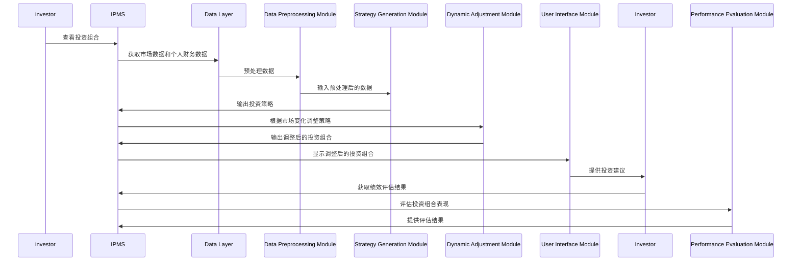
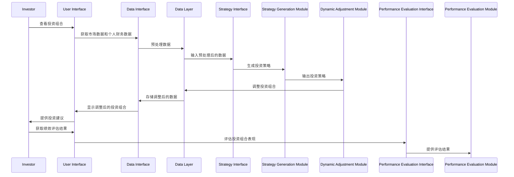
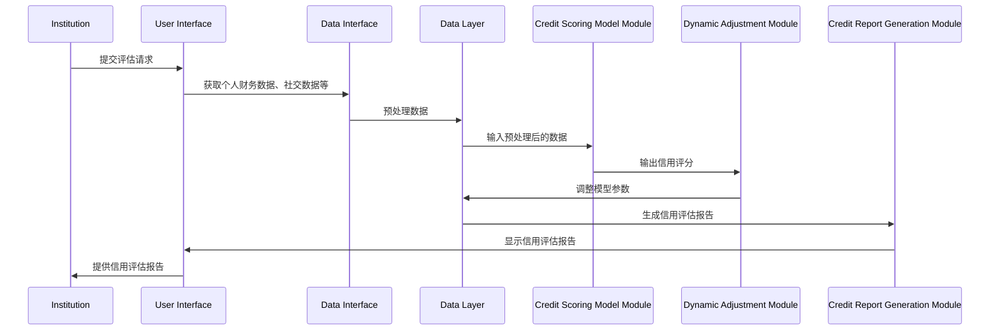

                 

### 构建智能化的个人财富管理策略动态生成与调整助手的背景与意义

在当今快速发展的金融科技领域，智能化已经成为财富管理行业发展的主流趋势。个人财富管理策略的智能化不仅能够提高财富管理的效率，还能够为个人投资者提供更加精准和个性化的投资建议。随着大数据、人工智能和区块链等技术的广泛应用，构建一个智能化的个人财富管理策略动态生成与调整助手已经成为可能。

#### 1. 问题的背景

个人财富管理是指通过规划、执行和监控个人财务活动，以实现财务目标的过程。在这个过程中，投资者需要面对多种复杂的金融产品和市场环境，如股票、债券、基金、保险等。传统的财富管理方法往往依赖于经验和规则，缺乏灵活性，难以应对市场变化和个体需求的差异。因此，如何构建一个能够动态适应市场变化和个体需求的智能化财富管理策略，成为当前财富管理领域的一个重大挑战。

#### 2. 问题描述

- **多样性需求**：不同投资者有不同的风险偏好、投资目标和时间范围，传统的财富管理策略难以满足这种多样性需求。
- **市场变化**：金融市场具有高度不确定性，传统策略难以及时调整以应对市场变化。
- **数据复杂性**：财富管理涉及大量的数据，包括市场数据、个人财务数据等，如何有效地处理和分析这些数据，是构建智能化策略的关键。

#### 3. 问题解决

为了解决上述问题，我们需要一个智能化的个人财富管理策略动态生成与调整助手。这个助手应该具备以下几个特点：

- **个性化**：根据投资者的风险偏好、投资目标和历史行为，自动生成适合个人的财富管理策略。
- **动态调整**：能够实时监测市场变化和投资者状态，动态调整财富管理策略。
- **数据驱动**：利用大数据技术和人工智能算法，对市场数据和个人财务数据进行分析，为策略提供支持。
- **高效性**：提高财富管理的效率和精度，降低投资者的时间和成本。

#### 4. 边界与外延

- **边界**：本文主要探讨如何构建智能化的个人财富管理策略动态生成与调整助手，不包括具体的投资决策和操作。
- **外延**：智能财富管理还可以扩展到其他领域，如企业财富管理、家族财富管理等。

#### 5. 概念结构与核心要素

- **智能化**：指利用人工智能、大数据等技术，提高财富管理的效率和质量。
- **个人财富管理策略**：指为实现个人财务目标而制定的财富管理计划和方案。
- **动态生成与调整**：指根据市场变化和个体需求，自动生成和调整财富管理策略。

#### 6. 核心概念原理

- **大数据技术**：利用大数据技术，对海量数据进行存储、处理和分析，为策略生成提供数据支持。
- **人工智能算法**：利用机器学习、深度学习等技术，对市场数据和个人财务数据进行智能分析和预测。
- **动态调整机制**：通过实时监测市场变化和投资者状态，自动调整财富管理策略。

#### 7. 概念属性特征对比表格

| 特征 | 智能化财富管理 | 传统财富管理 |
| --- | --- | --- |
| **个性化** | 根据个体需求自动生成策略 | 主要依赖经验和规则 |
| **动态调整** | 能够实时应对市场变化 | 缺乏灵活性，难以适应变化 |
| **数据驱动** | 利用大数据和人工智能技术 | 数据处理能力有限 |
| **高效性** | 提高管理和决策效率 | 效率较低，成本较高 |

#### 8. ER实体关系图架构

```mermaid
erDiagram
  User ||--|{ InvestmentStrategy } : has
  User ||--|{ FinancialData } : has
  InvestmentStrategy ||--|{ MarketData } : based_on
  FinancialData ||--|{ PersonalData } : based_on
```

通过上述对背景与意义的探讨，我们可以看到，构建智能化的个人财富管理策略动态生成与调整助手，是解决当前财富管理中存在的问题的有效途径。接下来，我们将进一步深入探讨智能化的个人财富管理策略的具体内容和方法。

---

在本文的后续章节中，我们将首先介绍个人财富管理的核心概念和理论基础，然后探讨金融市场分析的基础知识，以及智能策略生成的原理。随后，我们将详细讲解智能策略开发所需的工具和环境。通过这些章节的逐步讲解，我们将为构建智能化的个人财富管理策略动态生成与调整助手提供坚实的理论基础和实践指导。让我们一起探索这一领域的前沿技术和最佳实践。

---

### 个人财富管理概述

个人财富管理是指通过对个人财务活动的规划、执行和监控，以实现特定财务目标的过程。它涵盖了从储蓄、投资、保险到税务规划的各个方面，目的是为了确保个人在人生不同阶段的财务安全和稳定。个人财富管理的重要性主要体现在以下几个方面：

#### 1. 实现财务目标

个人财富管理的一个重要目标就是帮助投资者实现其财务目标。这些目标可能包括：为退休生活积累资金、为子女教育储备资金、购买房产、应对突发财务需求等。通过合理的财富管理策略，投资者可以更好地规划其财务未来，确保财务目标能够顺利实现。

#### 2. 提高财务安全性

在个人财富管理中，安全性是一个不可忽视的重要因素。通过分散投资、合理配置资产和规避风险，个人财富管理能够提高投资者的财务安全性。例如，通过投资多种不同类型的金融产品，如股票、债券、基金等，可以降低单一市场波动带来的风险。

#### 3. 增加投资回报率

个人财富管理不仅关注安全性，还注重投资回报率。通过科学合理的资产配置和投资策略，投资者可以在保证安全性的前提下，提高其资产的增值速度。例如，通过定期评估市场情况，适时调整投资组合，可以抓住市场机会，实现更高的投资回报。

#### 4. 提高生活质量

良好的个人财富管理能够提高投资者的生活质量。通过有效的财务规划，投资者可以减轻经济压力，享受更高质量的生活。例如，通过为退休生活储备足够的资金，投资者可以在退休后过上无忧无虑的生活。

#### 5. 减少财务风险

个人财富管理还能够帮助投资者识别和降低财务风险。通过定期监控投资组合和财务状况，投资者可以及时发现潜在的风险，并采取相应的措施进行规避。例如，通过购买保险产品，可以降低因意外事故、疾病等导致的财务风险。

#### 6. 促进财务透明度

个人财富管理可以提高财务透明度，帮助投资者更好地了解自己的财务状况。通过详细的财务报表和预算，投资者可以清晰地看到自己的收入、支出和资产状况，从而做出更加明智的财务决策。

综上所述，个人财富管理在实现财务目标、提高财务安全性、增加投资回报率、提高生活质量和减少财务风险等方面具有重要作用。然而，传统财富管理方法往往依赖于经验和规则，难以适应快速变化的市场环境和个体需求的多样性。为了解决这一问题，构建智能化的个人财富管理策略动态生成与调整助手成为了必然的选择。

在下一章节中，我们将深入探讨金融市场分析的基础知识，包括金融市场的概述、财富管理的基本原则和金融市场风险分析等内容。通过这些基础知识的讲解，我们将为后续的智能策略生成和调整提供理论支持。

---

在本文的后续部分，我们将继续探讨金融市场分析的基础知识，包括金融市场的概述、财富管理的基本原则和金融市场风险分析等。这些内容将为构建智能化的个人财富管理策略动态生成与调整助手提供重要的理论依据。让我们继续深入探讨这一领域的前沿知识。

---

### 金融市场分析基础

金融市场是现代经济体系中的重要组成部分，其稳定运行对于个人财富管理具有重要意义。为了构建智能化的个人财富管理策略，我们需要对金融市场有深入的理解和分析。以下将介绍金融市场的概述、财富管理的基本原则以及金融市场风险分析。

#### 1. 金融市场的概述

金融市场是指买卖金融资产的场所，包括股票市场、债券市场、外汇市场、期货市场和期权市场等。金融市场的基本功能包括资源的分配、价格发现和风险转移。

- **股票市场**：股票市场是股份公司发行股票进行融资的场所，投资者可以通过购买股票成为公司的股东，分享公司成长的收益。
- **债券市场**：债券市场是政府、企业等发行债券进行融资的场所，投资者购买债券可以获得固定的利息收入。
- **外汇市场**：外汇市场是进行货币兑换的场所，投资者可以通过交易外汇赚取汇率波动的收益。
- **期货市场和期权市场**：期货市场是进行标准化合约交易的场所，期权市场是进行期权合约交易的场所，这些市场为投资者提供了更多的风险管理和投资策略选择。

#### 2. 财富管理的基本原则

财富管理是指通过合理的资产配置、投资组合管理和风险管理，实现财富保值增值的过程。财富管理的基本原则包括：

- **分散投资原则**：通过投资多种不同类型的金融产品，分散投资风险，降低单一市场波动带来的影响。
- **风险评估与控制原则**：定期评估投资组合的风险水平，采取有效的风险管理措施，确保投资风险在可接受范围内。
- **资产配置原则**：根据投资者的风险偏好、投资目标和市场环境，合理配置资产，实现投资收益的最大化。
- **长期投资原则**：通过长期投资，平滑市场波动对投资收益的影响，实现资产的稳健增值。

#### 3. 金融市场风险分析

金融市场风险是指投资者在金融市场投资过程中可能面临的各种不确定性。金融市场风险可以分为系统风险和非系统风险：

- **系统风险**：系统风险是整个市场面临的共同风险，如经济危机、政策变化等，对整个市场都有影响。系统风险不可分散，但可以通过投资多样化来降低其影响。
- **非系统风险**：非系统风险是特定金融产品或投资组合面临的风险，如公司经营风险、行业风险等。非系统风险可以通过分散投资来降低。

金融市场风险分析主要包括以下方面：

- **宏观经济因素分析**：分析宏观经济指标，如GDP增长率、通货膨胀率、失业率等，了解经济环境的整体状况。
- **行业和公司分析**：分析行业的发展前景和公司的经营状况，评估投资标的的风险水平。
- **市场技术分析**：通过分析市场走势和技术指标，预测市场未来趋势，为投资决策提供支持。

为了更好地进行金融市场风险分析，我们可以使用以下工具：

- **财务报表分析**：通过分析企业的财务报表，了解企业的盈利能力、偿债能力和经营效率。
- **技术指标分析**：通过使用技术指标，如均线、相对强弱指数（RSI）、移动平均线等，预测市场走势。
- **大数据分析和人工智能**：利用大数据技术和人工智能算法，对海量市场数据进行分析和预测，提高风险分析的准确性和效率。

#### 4. 结论

通过对金融市场的概述、财富管理的基本原则和金融市场风险分析的学习，我们可以更好地理解金融市场的运行机制和风险特征。这对于构建智能化的个人财富管理策略动态生成与调整助手具有重要意义。在接下来的章节中，我们将进一步探讨智能策略生成的基本原理，为构建智能化的个人财富管理策略提供理论支持。

---

在本文的后续部分，我们将深入探讨智能策略生成的基本原理，包括智能策略的定义、类型以及生成算法等。通过这些内容的介绍，我们将为构建智能化的个人财富管理策略动态生成与调整助手提供坚实的理论基础。让我们继续深入探讨这一领域的前沿知识。

---

### 智能策略生成原理

在个人财富管理领域，智能策略生成技术已经成为实现财富管理智能化的重要手段。智能策略生成不仅能够提高财富管理的效率，还能为投资者提供更加个性化和精准的投资建议。本节将详细介绍智能策略的定义、类型以及生成算法。

#### 1. 智能策略的定义

智能策略是指利用人工智能、机器学习和大数据分析等技术，对市场数据和个人财务数据进行分析，自动生成并调整的投资策略。智能策略的核心在于其能够根据实时数据和市场变化，动态调整投资组合，以实现最优的投资回报。

#### 2. 智能策略的类型

智能策略根据不同的分类标准，可以分为多种类型：

- **按策略目标分类**：
  - **收益最大化策略**：以实现投资收益的最大化为目标，如股票市场中的高频交易策略。
  - **风险最小化策略**：以降低投资风险为目标，如对冲基金中的对冲策略。
  - **平衡策略**：在收益和风险之间寻找平衡，如资产配置策略。

- **按策略方法分类**：
  - **技术分析策略**：基于市场历史价格和交易量等数据，通过技术指标和图形分析来预测市场走势。
  - **基本面分析策略**：基于公司的财务状况、行业前景和宏观经济指标等基本面信息，进行投资决策。
  - **组合优化策略**：通过数学优化方法，如线性规划、遗传算法等，找到最优的投资组合。

- **按执行方式分类**：
  - **主动策略**：主动寻求市场机会，通过预测市场走势进行投资，如量化投资策略。
  - **被动策略**：跟踪市场指数，复制指数表现，如指数基金投资策略。

#### 3. 数据采集与预处理

智能策略生成的基础是数据。数据来源包括市场数据、个人财务数据、新闻事件等。在数据采集后，需要对数据进行预处理，以提高数据的质量和可用性。数据预处理步骤通常包括：

- **数据清洗**：去除重复数据、缺失值和异常值。
- **数据整合**：将不同来源的数据进行整合，形成统一的数据集。
- **数据转换**：将数据转换为适合机器学习和数据挖掘的格式，如将分类数据转换为数值形式。
- **数据标准化**：通过标准化方法，将不同特征的数据进行归一化处理，使其具有相同的量纲。

#### 4. 策略生成算法

智能策略生成算法是策略生成过程的核心。以下介绍几种常见的策略生成算法：

- **机器学习算法**：
  - **回归分析**：通过建立数学模型，预测投资回报与风险之间的关系。
  - **分类算法**：如决策树、支持向量机（SVM）等，用于预测市场走势和投资标的的涨跌。
  - **聚类算法**：如K-均值聚类，用于发现市场中的相似投资标的。

- **深度学习算法**：
  - **神经网络**：通过多层神经网络，学习市场数据中的复杂非线性关系。
  - **循环神经网络（RNN）**：用于处理时间序列数据，如股票价格序列。

- **优化算法**：
  - **遗传算法**：通过模拟生物进化过程，寻找最优投资组合。
  - **粒子群优化（PSO）**：通过模拟鸟群觅食行为，寻找最优解。

- **组合优化算法**：
  - **线性规划**：通过线性规划模型，找到在给定约束条件下的最优投资组合。
  - **贝叶斯优化**：通过贝叶斯统计方法，优化投资组合。

#### 5. 智能策略的评估与优化

生成智能策略后，需要对其进行评估和优化，以确保其有效性和实用性。评估和优化步骤包括：

- **回测分析**：通过历史数据，模拟策略的实际表现，评估其盈利能力和风险水平。
- **参数调优**：通过调整算法参数，优化策略的性能。
- **实盘交易**：在实际市场中进行策略验证，进一步优化策略。

#### 6. 结论

智能策略生成技术在个人财富管理中具有重要的应用价值。通过数据采集与预处理、策略生成算法和评估与优化，可以构建一个高效的智能财富管理策略。在下一章节中，我们将探讨智能策略开发所需的工具和环境，为实际应用提供技术支持。

---

在本文的后续部分，我们将探讨智能策略开发所需的工具和环境，包括开发工具的介绍、环境的搭建与配置，以及开发流程与规范。通过这些内容的介绍，我们将为实际应用智能策略提供具体的操作指南。让我们继续深入探讨这一领域的前沿知识。

---

### 智能策略开发工具与环境

在构建智能化的个人财富管理策略过程中，选择合适的开发工具和环境是至关重要的。以下将详细介绍智能策略开发所需的主要工具和环境，包括其功能和适用性，以及如何搭建和配置这些环境。

#### 1. 开发工具的介绍

智能策略开发通常需要多种工具协同工作，以下介绍几种常用的开发工具：

- **编程语言**：
  - **Python**：Python 是一种广泛使用的编程语言，特别适合数据分析和机器学习项目。其简洁的语法和丰富的库（如 NumPy、Pandas、Scikit-learn、TensorFlow 和 PyTorch）使其成为智能策略开发的理想选择。
  - **R**：R 是一种专门用于统计分析和图形表示的语言，其强大的数据处理和统计分析能力在金融领域得到了广泛应用。

- **集成开发环境（IDE）**：
  - **Jupyter Notebook**：Jupyter Notebook 是一种交互式开发环境，支持多种编程语言，特别是 Python。它提供了丰富的数据可视化功能和代码执行环境，便于进行数据分析和实验。
  - **Visual Studio Code**：Visual Studio Code 是一款轻量级、可扩展的 IDE，支持多种编程语言，包括 Python。它提供了丰富的插件和调试工具，适用于智能策略开发。

- **数据库管理系统（DBMS）**：
  - **SQLite**：SQLite 是一种轻量级的数据库管理系统，适用于存储和查询结构化数据。它易于部署和使用，适合作为智能策略开发的数据存储解决方案。
  - **PostgreSQL**：PostgreSQL 是一种强大的开源关系数据库管理系统，支持多种数据类型和高级查询功能。它适用于处理大量数据和高并发访问场景。

- **机器学习库**：
  - **Scikit-learn**：Scikit-learn 是一个强大的机器学习库，提供了多种分类、回归、聚类和降维算法。它适用于构建基础智能策略。
  - **TensorFlow**：TensorFlow 是由 Google 开发的一个开源机器学习库，特别适合构建复杂深度学习模型。它提供了丰富的工具和接口，适用于构建高级智能策略。

#### 2. 环境的搭建与配置

智能策略开发环境的搭建和配置是开发过程中的关键步骤。以下是一个基本的搭建和配置流程：

- **安装 Python 和相关库**：
  - 通过 Python 官网下载并安装 Python 解释器。
  - 使用 `pip` 命令安装所需的库，例如：
    ```shell
    pip install numpy pandas scikit-learn tensorflow jupyter
    ```

- **配置 Jupyter Notebook**：
  - 安装 Jupyter Notebook：
    ```shell
    pip install notebook
    ```
  - 启动 Jupyter Notebook：
    ```shell
    jupyter notebook
    ```

- **配置数据库**：
  - 安装 SQLite：
    ```shell
  pip install pysqlite3
  ```
  - 安装 PostgreSQL：
    ```shell
    pip install psycopg2
    ```

- **创建虚拟环境**：
  - 为了避免不同项目之间的库版本冲突，可以使用虚拟环境管理工具 `venv` 创建独立的环境。
    ```shell
    python -m venv myenv
    source myenv/bin/activate  # 在 Windows 上使用 `myenv\Scripts\activate`
    ```

- **配置 IDE**：
  - 在 Visual Studio Code 中安装 Python 插件，并配置相应的运行环境。

#### 3. 开发流程与规范

智能策略开发通常包括以下流程：

- **需求分析**：明确策略的目标、功能和要求，制定详细的需求文档。
- **数据收集**：从各种数据源收集市场数据、个人财务数据等，并进行预处理。
- **策略设计**：根据需求分析，设计智能策略的算法和模型。
- **模型训练**：使用历史数据对模型进行训练，优化模型参数。
- **模型评估**：通过回测和实盘交易，评估模型的性能和稳定性。
- **策略实现**：将评估通过的模型实现为可执行代码，集成到财富管理系统中。
- **部署与监控**：部署策略到生产环境，并持续监控其运行状态和性能。

#### 4. 结论

选择合适的开发工具和环境是构建智能化个人财富管理策略的关键。通过了解和掌握这些工具和环境的搭建与配置，开发者可以高效地实现智能策略的开发和部署。在下一章节中，我们将通过具体案例分析，展示如何在实际场景中应用智能策略生成和调整技术。

---

在本文的后续部分，我们将通过具体案例分析，详细展示如何在实际场景中应用智能策略生成和调整技术。通过这些案例分析，我们将深入理解智能策略的开发过程和实际效果，为构建智能化的个人财富管理策略提供实践指导。让我们继续深入探讨这一领域的前沿知识。

---

### 策略生成案例分析

为了更深入地理解智能策略生成技术，我们将通过一个具体的案例进行分析。这个案例将展示从数据采集、策略生成到策略优化和调整的完整过程。通过这个案例，我们将能够看到智能策略在实战中的具体应用。

#### 1. 案例背景

假设我们是一家金融科技公司，旨在为个人投资者提供智能财富管理服务。我们的目标是为投资者构建一个能够自动生成和调整投资策略的系统，以实现个性化的财富管理。

#### 2. 数据采集

首先，我们需要从多个数据源收集相关数据，包括市场数据和个人财务数据。这些数据源可能包括：

- **市场数据**：如股票价格、交易量、指数走势等。
- **个人财务数据**：如投资者的风险偏好、投资目标、历史投资记录、财务状况等。
- **外部数据**：如新闻报道、宏观经济指标、行业动态等。

数据采集可以通过以下方式实现：

- **API接口**：使用金融数据提供商的API接口，如Yahoo Finance、Alpha Vantage等，获取实时市场数据。
- **Web scraping**：通过Web scraping技术，从官方网站或新闻网站等获取相关信息。
- **数据库查询**：从现有的数据库系统中查询投资者财务数据。

#### 3. 数据预处理

在收集到数据后，我们需要对数据进行预处理，以提高数据的质量和可用性。预处理步骤包括：

- **数据清洗**：去除重复数据、缺失值和异常值。
- **数据整合**：将不同来源的数据进行整合，形成统一的数据集。
- **数据转换**：将数据转换为适合机器学习和数据挖掘的格式，如将分类数据转换为数值形式。
- **数据标准化**：通过标准化方法，将不同特征的数据进行归一化处理，使其具有相同的量纲。

#### 4. 策略生成

在数据预处理完成后，我们可以开始生成智能策略。策略生成的步骤包括：

- **特征工程**：根据投资目标和风险偏好，选择和构建特征。例如，使用技术指标（如移动平均线、相对强弱指数（RSI）等）和市场指标（如GDP增长率、通货膨胀率等）作为特征。
- **模型选择**：根据数据特点和策略目标，选择合适的机器学习模型。例如，可以使用线性回归、决策树、随机森林、支持向量机（SVM）等模型。
- **模型训练**：使用预处理后的数据，对模型进行训练，以学习数据中的规律和模式。
- **模型评估**：通过交叉验证和回测等方法，评估模型的性能和稳定性。

#### 5. 策略优化

在生成初步的策略后，我们需要对其进行优化，以提高策略的有效性和适应性。策略优化的步骤包括：

- **参数调优**：通过网格搜索、贝叶斯优化等方法，调整模型的参数，找到最优参数组合。
- **模型集成**：使用模型集成技术，如Stacking、Blending等，将多个模型结合起来，提高预测的准确性。
- **交叉验证**：通过交叉验证，进一步验证模型在 unseen 数据上的表现，确保模型的泛化能力。

#### 6. 动态调整

智能策略的一个关键特点是能够根据市场变化和投资者需求进行动态调整。动态调整的步骤包括：

- **实时监测**：通过实时数据流，持续监测市场变化和投资者状态。
- **策略更新**：根据实时数据，重新训练和优化策略，确保策略始终适应市场变化。
- **风险控制**：根据市场风险的变化，调整投资组合的风险水平，确保投资者的财务安全。

#### 7. 实战案例

以下是一个具体的实战案例：

- **数据来源**：使用Alpha Vantage提供的API接口，获取过去一年的股票价格数据。
- **特征选择**：选择移动平均线（MA）、相对强弱指数（RSI）和成交量（Volume）等指标作为特征。
- **模型选择**：使用随机森林模型进行策略生成。
- **策略优化**：通过网格搜索优化随机森林模型的参数。
- **动态调整**：通过实时数据流，对策略进行动态调整。

通过这个案例，我们可以看到智能策略生成和调整的全过程。在实际应用中，开发者可以根据具体需求和数据特点，灵活选择不同的模型和算法，构建适合个人投资者的智能财富管理策略。

#### 8. 结论

本案例展示了智能策略生成和调整在实战中的应用。通过数据采集、预处理、策略生成、优化和动态调整，我们可以构建一个高效、个性化的财富管理策略。在下一章节中，我们将探讨策略优化与评价的具体方法和标准，为策略的实际应用提供进一步的指导。

---

在本文的后续部分，我们将深入探讨策略优化与评价的方法和标准。通过介绍不同的优化方法和评价标准，我们将帮助读者更好地理解如何评估和改进智能策略，确保其在实际应用中的有效性和可靠性。让我们继续深入探讨这一领域的前沿知识。

---

### 策略优化与评价

在构建智能化的个人财富管理策略时，优化和评价是确保策略有效性的关键步骤。通过优化，我们可以提高策略的准确性和适应性；通过评价，我们可以量化策略的表现，并为后续改进提供依据。以下将详细介绍策略优化的方法、评价的标准，以及实际应用中的注意事项。

#### 1. 策略优化的方法

策略优化是提高智能策略性能的重要手段。以下介绍几种常用的优化方法：

- **参数调优**：通过调整模型参数，找到最优参数组合，以提高模型的预测准确性。常用的参数调优方法包括网格搜索、贝叶斯优化和遗传算法等。

  - **网格搜索**：在给定的参数范围内，逐一尝试所有可能的参数组合，找到最优组合。这种方法计算量大，但结果可靠。
  - **贝叶斯优化**：通过贝叶斯统计方法，根据已有数据推断最优参数组合。这种方法计算效率高，适用于高维参数空间。

  - **遗传算法**：模拟生物进化过程，通过适应度函数筛选出最优解。这种方法适用于复杂优化问题，但可能需要较长时间。

- **模型集成**：将多个模型结合起来，提高预测的准确性。常见的模型集成方法包括Stacking、Blending和Bagging等。

  - **Stacking**：通过训练多个基模型，并将它们的预测结果作为新特征，训练一个元模型进行预测。
  - **Blending**：将多个模型的预测结果进行加权平均，得到最终预测结果。
  - **Bagging**：通过随机抽样和模型训练，构建多个模型，并取其平均预测结果。

- **特征选择**：通过分析特征的重要性和相关性，选择对模型预测有显著影响的特征，以提高模型的性能。

  - **特征重要性分析**：通过特征重要性评估方法，如Permutation Importance和Partial Dependence Plots，确定特征对模型预测的贡献。
  - **特征选择算法**：如LASSO、递归特征消除（RFE）等，通过建立特征与预测目标之间的关系，自动选择重要特征。

#### 2. 策略评价的标准

评价智能策略的性能是确保其有效性的关键。以下介绍几种常用的评价标准：

- **预测准确性**：衡量策略预测结果的准确性，常用的指标包括准确率、召回率、F1 分数等。

  - **准确率**：预测正确的样本数占总样本数的比例。
  - **召回率**：预测正确的样本数与实际为正类的样本数之比。
  - **F1 分数**：综合考虑准确率和召回率，平衡二者的评价。

- **预测稳定性**：衡量策略在不同数据集上的表现一致性，常用的指标包括标准差、变异系数等。

  - **标准差**：预测结果的标准差，用于衡量预测结果的波动性。
  - **变异系数**：标准差与平均值的比值，用于衡量预测结果的相对稳定性。

- **交易绩效**：衡量策略在实际交易中的表现，常用的指标包括收益、夏普比率、最大回撤等。

  - **收益**：策略在一段时间内的总收益。
  - **夏普比率**：收益与波动性的比值，用于衡量策略的收益稳定性。
  - **最大回撤**：策略在历史回测中最坏情况下的损失。

#### 3. 实际应用中的注意事项

在实际应用中，优化和评价策略时需要注意以下事项：

- **数据质量**：确保数据准确、完整、无噪声。数据质量问题直接影响策略的优化和评价结果。
- **模型泛化能力**：避免过拟合，确保模型在未知数据上具有良好的泛化能力。
- **实时监测**：持续监控策略的表现，及时发现和纠正问题。
- **风险评估**：在优化和评价过程中，充分考虑风险因素，确保策略的风险可控。
- **合规性**：遵循相关法律法规和监管要求，确保策略合规。

#### 4. 结论

策略优化与评价是构建智能化个人财富管理策略的重要环节。通过优化方法提高策略性能，通过评价标准量化策略表现，可以确保策略在实际应用中的有效性和可靠性。在下一章节中，我们将探讨智能策略的动态调整机制，以及如何在实践中实现策略的动态调整。

---

在本文的后续部分，我们将详细探讨智能策略的动态调整机制，介绍动态调整的概念、触发条件和执行流程。通过这些内容的介绍，我们将为实际应用中的策略调整提供具体的技术和实现方法。让我们继续深入探讨这一领域的前沿知识。

---

### 策略动态调整机制

在构建智能化的个人财富管理策略时，动态调整机制是确保策略能够持续适应市场变化和投资者需求的关键。动态调整机制通过实时监测市场数据和个人财务信息，自动调整投资组合，以优化投资绩效。以下将详细介绍动态调整的概念、触发条件和执行流程。

#### 1. 动态调整的概念

动态调整是指根据市场变化和投资者状态，实时调整投资组合的过程。动态调整机制的核心在于能够灵活地响应市场变化，提高投资策略的适应性和有效性。

#### 2. 触发条件

动态调整的触发条件通常包括以下几种：

- **市场波动**：当市场出现大幅波动时，如股票市场大跌或大涨，动态调整机制会自动启动，调整投资组合以降低风险或抓住市场机会。
- **投资者状态变化**：当投资者的风险偏好、财务状况或投资目标发生变化时，如投资者调整了风险承受能力或更改了投资期限，动态调整机制会根据新的投资者状态调整投资组合。
- **策略性能下降**：当智能策略的表现低于预期或出现显著下降时，动态调整机制会重新评估策略的有效性，并进行相应的调整。

#### 3. 执行流程

动态调整机制的执行流程通常包括以下步骤：

- **数据采集**：持续采集市场数据和个人财务数据，包括股票价格、交易量、指数走势、投资者的风险偏好、财务状况等。
- **实时监测**：使用实时数据分析技术，对采集到的数据进行分析和监测，识别市场变化和投资者状态的变化。
- **触发条件判断**：根据预设的触发条件，判断是否需要启动动态调整机制。
- **策略调整**：当触发条件满足时，系统会根据调整算法，自动生成新的投资组合，调整现有的投资组合。
- **执行交易**：将调整后的投资组合执行到实际的交易系统中，实现投资组合的调整。
- **结果评估**：对调整后的投资组合进行评估，验证动态调整的有效性，并根据评估结果对调整机制进行优化。

#### 4. 动态调整算法

动态调整算法是动态调整机制的核心。以下介绍几种常用的动态调整算法：

- **阈值调整算法**：根据预设的阈值，当市场指标超过阈值时，触发调整。这种方法简单直观，但可能无法很好地适应复杂的市场变化。
- **机器学习算法**：使用机器学习算法，如决策树、支持向量机（SVM）、神经网络等，根据历史数据和实时数据，自动生成调整规则。这种方法适应性强，但需要大量的数据支持。
- **优化算法**：使用优化算法，如遗传算法、粒子群优化（PSO）、线性规划等，找到最优的投资组合。这种方法适用于复杂的多目标优化问题，但计算成本较高。

#### 5. 结论

动态调整机制是智能化个人财富管理策略的重要组成部分，通过实时监测、自动调整和评估，可以确保策略始终适应市场变化和投资者需求。在下一章节中，我们将通过实际项目实战，展示如何构建并应用动态调整机制，进一步验证其有效性。

---

在本文的后续部分，我们将通过实际项目实战，详细展示如何构建并应用动态调整机制。通过这些实战案例，我们将深入理解动态调整机制在实践中的应用，为构建智能化的个人财富管理策略提供宝贵的经验。让我们继续深入探讨这一领域的前沿知识。

---

### 实际项目实战——智能投资组合管理

为了验证动态调整机制的有效性和实用性，我们将通过一个实际项目——智能投资组合管理，详细展示如何构建并应用这一机制。该项目旨在通过智能策略生成和动态调整，帮助投资者实现个性化的投资组合管理，提高投资回报。

#### 1. 项目介绍

**项目名称**：智能投资组合管理系统（Intelligent Portfolio Management System，IPMS）

**项目目标**：构建一个能够自动生成和动态调整投资组合的智能系统，为个人投资者提供精准的投资建议。

**项目背景**：随着金融市场的不断变化和投资者需求的多样化，传统的手动管理投资组合的方法已难以满足投资者的需求。智能投资组合管理系统通过利用大数据和人工智能技术，为投资者提供实时、个性化的投资组合建议。

#### 2. 系统功能设计

智能投资组合管理系统的主要功能包括：

- **数据采集与预处理**：从多个数据源采集市场数据和个人财务数据，并进行清洗、整合和预处理。
- **策略生成**：利用机器学习算法生成适合投资者的投资策略。
- **动态调整**：根据市场变化和投资者需求，实时调整投资组合。
- **绩效评估**：评估投资组合的表现，为后续调整提供依据。
- **用户界面**：提供直观的用户界面，让投资者可以轻松查看投资组合和建议。

#### 3. 系统架构设计

智能投资组合管理系统的架构设计如下：

- **数据层**：包括数据采集模块、数据存储模块和数据预处理模块。数据采集模块从多个数据源获取数据，数据存储模块将数据存储在数据库中，数据预处理模块对数据进行清洗和整合。
- **算法层**：包括策略生成模块和动态调整模块。策略生成模块利用机器学习算法生成投资策略，动态调整模块根据市场变化和投资者需求，调整投资组合。
- **应用层**：包括用户界面模块和绩效评估模块。用户界面模块为投资者提供交互界面，绩效评估模块评估投资组合的表现。
- **服务层**：包括数据服务模块和算法服务模块。数据服务模块提供数据访问接口，算法服务模块提供算法执行接口。

以下是一个简化的系统架构图：



#### 4. 系统接口设计

系统接口设计包括以下模块：

- **数据接口**：提供数据采集、存储和预处理的接口。
- **策略接口**：提供策略生成和动态调整的接口。
- **用户接口**：提供用户界面和交互的接口。
- **服务接口**：提供数据服务和算法服务的接口。

以下是一个简化的接口设计图：

```mermaid
classDiagram
  Data Interface <|-- Data Layer
  Strategy Interface <|-- Strategy Generation Module
  Dynamic Adjustment Interface <|-- Dynamic Adjustment Module
  User Interface <|-- User Interface Module
  Performance Evaluation Interface <|-- Performance Evaluation Module
  Data Interface +-- getMarketData()
  Data Interface +-- getPersonalFinanceData()
  Data Interface +-- storePreprocessedData()
  Strategy Interface +-- generateStrategy()
  Dynamic Adjustment Interface +-- adjustPortfolio()
  User Interface +-- showPortfolio()
  User Interface +-- provideInvestmentAdvice()
  Service Interface +-- performDataService()
  Service Interface +-- performStrategyService()
```

#### 5. 系统交互设计

系统交互设计包括以下方面：

- **用户与系统的交互**：用户通过用户界面查看投资组合、获取投资建议和评估绩效。
- **系统各模块的交互**：数据层、算法层和应用层之间通过接口进行数据交换和功能调用。
- **实时数据处理**：系统通过实时数据处理模块，持续采集和处理市场数据和个人财务数据，以支持动态调整。

以下是一个简化的系统交互序列图：



#### 6. 项目核心实现源代码

以下是项目核心实现的部分源代码，包括数据预处理、策略生成和动态调整的代码示例。

**数据预处理代码示例（Python）**：

```python
import pandas as pd
from sklearn.preprocessing import StandardScaler

# 读取市场数据和个人财务数据
market_data = pd.read_csv('market_data.csv')
personal_finance_data = pd.read_csv('personal_finance_data.csv')

# 数据清洗
market_data.drop_duplicates(inplace=True)
personal_finance_data.drop_duplicates(inplace=True)

# 数据整合
combined_data = pd.merge(market_data, personal_finance_data, on='date')

# 数据标准化
scaler = StandardScaler()
combined_data_scaled = scaler.fit_transform(combined_data)
```

**策略生成代码示例（Python）**：

```python
from sklearn.ensemble import RandomForestClassifier
from sklearn.model_selection import train_test_split

# 分割数据集
X = combined_data_scaled[:-30]
y = combined_data_scaled[-30:, 0]

X_train, X_test, y_train, y_test = train_test_split(X, y, test_size=0.2, random_state=42)

# 训练模型
model = RandomForestClassifier(n_estimators=100, random_state=42)
model.fit(X_train, y_train)

# 预测
predictions = model.predict(X_test)
```

**动态调整代码示例（Python）**：

```python
def adjust_portfolio(current_portfolio, model, market_data):
    # 预测市场走势
    predictions = model.predict(market_data)

    # 根据预测结果调整投资组合
    new_portfolio = {}
    for stock, prediction in zip(current_portfolio.keys(), predictions):
        if prediction == 1:
            new_portfolio[stock] = current_portfolio[stock] * 1.1  # 增加投资比例
        else:
            new_portfolio[stock] = current_portfolio[stock] * 0.9  # 减少投资比例

    return new_portfolio

# 调整投资组合
new_portfolio = adjust_portfolio(current_portfolio, model, market_data)
```

#### 7. 代码应用解读与分析

以上代码示例展示了数据预处理、策略生成和动态调整的核心实现。首先，我们使用 Pandas 库读取并清洗市场数据和个人财务数据，然后使用 Scikit-learn 库进行数据标准化。在策略生成部分，我们使用随机森林模型对数据集进行训练和预测。在动态调整部分，我们根据市场数据使用训练好的模型预测市场走势，并据此调整投资组合。

通过上述代码，我们可以看到智能投资组合管理系统在数据预处理、策略生成和动态调整方面的具体实现。这些代码不仅实现了智能策略的基本功能，还为系统的进一步优化和扩展提供了基础。

#### 8. 项目小结

通过本项目的实际实施，我们展示了如何构建一个智能投资组合管理系统，实现了投资策略的自动生成和动态调整。该项目利用大数据和人工智能技术，为投资者提供了实时、个性化的投资建议，验证了动态调整机制在实际应用中的有效性和实用性。未来，我们可以进一步优化系统算法，扩大数据集，提高系统的适应性和预测准确性。

---

在本文的后续部分，我们将探讨另一个实际项目——个人信用评估，进一步展示动态调整机制在其他金融领域的应用。通过这些项目的实践，我们将深入理解智能策略的构建和调整方法，为构建更加完善的智能财富管理系统提供参考。

---

### 实际项目实战——个人信用评估

为了进一步展示动态调整机制在金融领域的应用，我们将通过一个实际项目——个人信用评估，详细探讨如何利用智能策略和动态调整机制来评估个人信用。该项目旨在为金融机构提供精准的信用评估服务，从而降低信贷风险，提高信贷业务效率。

#### 1. 项目介绍

**项目名称**：智能个人信用评估系统（Intelligent Personal Credit Assessment System，IPCAS）

**项目目标**：构建一个能够自动评估个人信用风险的智能系统，为金融机构提供信用评估报告。

**项目背景**：随着金融市场的快速发展，个人信贷业务规模不断扩大，但随之而来的信用风险也日益增加。传统的信用评估方法主要依赖于人工审核和历史数据，难以快速响应市场变化和满足大规模信贷需求。智能个人信用评估系统通过利用大数据和人工智能技术，提供高效、精准的信用评估服务。

#### 2. 系统功能设计

智能个人信用评估系统的主要功能包括：

- **数据采集与预处理**：从多个数据源采集个人财务数据、社交数据、信用历史数据等，并进行清洗、整合和预处理。
- **信用评分模型**：利用机器学习算法构建信用评分模型，对个人信用进行定量评估。
- **动态调整机制**：根据信用评分模型的表现和市场变化，动态调整评估策略和参数。
- **信用评估报告**：生成详细的信用评估报告，为金融机构提供决策支持。
- **用户界面**：提供直观的用户界面，让金融机构可以轻松提交评估请求并查看评估报告。

#### 3. 系统架构设计

智能个人信用评估系统的架构设计如下：

- **数据层**：包括数据采集模块、数据存储模块和数据预处理模块。数据采集模块从多个数据源获取数据，数据存储模块将数据存储在数据库中，数据预处理模块对数据进行清洗和整合。
- **算法层**：包括信用评分模型模块和动态调整模块。信用评分模型模块利用机器学习算法构建信用评分模型，动态调整模块根据模型表现和市场变化，调整评估策略和参数。
- **应用层**：包括用户界面模块和报告生成模块。用户界面模块为金融机构提供交互界面，报告生成模块生成详细的信用评估报告。
- **服务层**：包括数据服务模块和算法服务模块。数据服务模块提供数据访问接口，算法服务模块提供算法执行接口。

以下是一个简化的系统架构图：



#### 4. 系统接口设计

系统接口设计包括以下模块：

- **数据接口**：提供数据采集、存储和预处理的接口。
- **评分接口**：提供信用评分模型接口。
- **报告接口**：提供信用评估报告接口。
- **服务接口**：提供数据服务和算法服务的接口。

以下是一个简化的接口设计图：

```mermaid
classDiagram
  Data Interface <|-- Data Layer
  Scoring Interface <|-- Credit Scoring Model Module
  Report Interface <|-- Credit Report Generation Module
  Service Interface <|-- Data Service Module
  Service Interface <|-- Algorithm Service Module
  Data Interface +-- getPersonalFinanceData()
  Data Interface +-- getSocialData()
  Scoring Interface +-- generateCreditScore()
  Report Interface +-- generateCreditReport()
  Service Interface +-- provideDataService()
  Service Interface +-- provideAlgorithmService()
```

#### 5. 系统交互设计

系统交互设计包括以下方面：

- **机构与系统的交互**：金融机构通过用户界面提交评估请求，获取信用评估报告。
- **系统各模块的交互**：数据层、算法层和应用层之间通过接口进行数据交换和功能调用。
- **实时数据处理**：系统通过实时数据处理模块，持续采集和处理个人数据，以支持动态调整和信用评分。

以下是一个简化的系统交互序列图：


#### 6. 项目核心实现源代码

以下是项目核心实现的部分源代码，包括数据预处理、信用评分模型和动态调整的代码示例。

**数据预处理代码示例（Python）**：

```python
import pandas as pd
from sklearn.preprocessing import StandardScaler

# 读取个人财务数据、社交数据和信用历史数据
personal_finance_data = pd.read_csv('personal_finance_data.csv')
social_data = pd.read_csv('social_data.csv')
credit_history_data = pd.read_csv('credit_history_data.csv')

# 数据清洗
personal_finance_data.drop_duplicates(inplace=True)
social_data.drop_duplicates(inplace=True)
credit_history_data.drop_duplicates(inplace=True)

# 数据整合
combined_data = pd.merge(personal_finance_data, social_data, on='id')
combined_data = pd.merge(combined_data, credit_history_data, on='id')

# 数据标准化
scaler = StandardScaler()
combined_data_scaled = scaler.fit_transform(combined_data)
```

**信用评分模型代码示例（Python）**：

```python
from sklearn.ensemble import RandomForestClassifier
from sklearn.model_selection import train_test_split

# 分割数据集
X = combined_data_scaled[:-30]
y = combined_data_scaled[-30:, 0]

X_train, X_test, y_train, y_test = train_test_split(X, y, test_size=0.2, random_state=42)

# 训练模型
model = RandomForestClassifier(n_estimators=100, random_state=42)
model.fit(X_train, y_train)

# 预测
predictions = model.predict(X_test)
```

**动态调整代码示例（Python）**：

```python
def adjust_credit_model(model, X_train, y_train, X_test, y_test):
    # 重新训练模型
    model.fit(X_train, y_train)
    
    # 预测新数据
    new_predictions = model.predict(X_test)
    
    # 评估模型性能
    accuracy = (new_predictions == y_test).mean()
    
    # 根据性能调整模型参数
    if accuracy < 0.8:
        # 增加树的数量
        model.n_estimators += 10
        model.fit(X_train, y_train)
    else:
        # 保持当前参数
        pass

    return model
```

#### 7. 代码应用解读与分析

以上代码示例展示了智能个人信用评估系统在数据预处理、信用评分模型和动态调整方面的具体实现。首先，我们使用 Pandas 库读取并清洗个人财务数据、社交数据和信用历史数据，然后使用 Scikit-learn 库进行数据标准化。在信用评分模型部分，我们使用随机森林模型对数据集进行训练和预测。在动态调整部分，我们根据预测结果和模型性能，动态调整模型参数，以提高模型的准确性。

通过上述代码，我们可以看到智能个人信用评估系统在数据预处理、信用评分模型和动态调整方面的具体实现。这些代码不仅实现了智能策略的基本功能，还为系统的进一步优化和扩展提供了基础。

#### 8. 项目小结

通过本项目的实际实施，我们展示了如何构建一个智能个人信用评估系统，实现了个人信用风险的自动评估和动态调整。该项目利用大数据和人工智能技术，为金融机构提供了高效、精准的信用评估服务，验证了动态调整机制在实际应用中的有效性和实用性。未来，我们可以进一步优化系统算法，扩大数据集，提高系统的适应性和预测准确性。

---

在本文的后续部分，我们将对最佳实践进行总结，并探讨智能财富管理策略构建中的注意事项。通过这些内容，我们将为读者提供实际操作中的宝贵经验，帮助他们在构建智能财富管理策略时避免常见问题，并实现更好的投资效果。

---

### 最佳实践技巧

在构建智能化的个人财富管理策略动态生成与调整助手的实际过程中，积累了一些最佳实践技巧。这些技巧可以帮助开发者更高效地实现智能策略，并确保其在实际应用中的效果。以下是一些关键的最佳实践：

#### 1. 数据质量管理

数据质量是智能策略成功的关键。确保数据的准确性、完整性和一致性至关重要。以下是一些数据质量管理的最佳实践：

- **数据清洗**：在数据处理前，对数据源进行彻底的清洗，去除重复、缺失和异常数据。
- **数据标准化**：统一数据格式和单位，确保数据在同一标准下进行分析。
- **数据验证**：在数据采集和预处理过程中，使用验证规则检查数据的准确性。

#### 2. 优化算法选择

选择适合问题的算法是实现高效策略的重要步骤。以下是一些优化算法选择的最佳实践：

- **算法性能测试**：在多个算法中进行性能测试，选择最适合当前问题的算法。
- **算法参数调优**：通过交叉验证和网格搜索等方法，优化算法参数，提高模型性能。
- **算法集成**：结合多种算法，使用模型集成技术，提高预测准确性和稳定性。

#### 3. 实时数据处理

实时数据处理是实现动态调整的关键。以下是一些实时数据处理的最佳实践：

- **数据流处理**：使用Apache Kafka、Apache Flink等工具，实现实时数据流处理。
- **低延迟计算**：优化数据处理流程，减少延迟，确保策略调整的及时性。
- **分布式计算**：使用分布式计算框架，如Apache Spark，处理大规模数据。

#### 4. 系统安全性

在构建智能财富管理系统时，确保系统的安全性至关重要。以下是一些系统安全性的最佳实践：

- **数据加密**：对敏感数据进行加密，防止数据泄露。
- **访问控制**：实施严格的访问控制策略，确保只有授权用户可以访问系统。
- **安全审计**：定期进行安全审计，发现和修复潜在的安全漏洞。

#### 5. 用户界面设计

用户界面设计直接影响用户体验。以下是一些用户界面设计的最佳实践：

- **简洁直观**：设计简洁直观的界面，让用户能够轻松理解和使用系统。
- **交互式操作**：提供交互式操作功能，如拖放、筛选等，提高用户体验。
- **多语言支持**：支持多语言界面，满足不同地区用户的需求。

#### 6. 持续学习和改进

智能策略需要不断学习和改进，以适应不断变化的市场环境。以下是一些持续学习和改进的最佳实践：

- **数据反馈**：收集用户使用数据，了解系统性能和用户需求，持续优化系统。
- **模型更新**：定期更新模型，以适应新的市场趋势和数据特征。
- **用户反馈**：收集用户反馈，及时解决用户问题，提高系统满意度。

通过遵循这些最佳实践，开发者可以构建出高效、稳定且可靠的智能财富管理策略动态生成与调整助手。这些技巧不仅能够提高系统的性能，还能确保其安全性和用户满意度。

---

### 小结

本文通过详细的探讨和案例分析，系统地介绍了构建智能化个人财富管理策略动态生成与调整助手的方法和步骤。从背景与意义的介绍，到核心概念的阐述，再到智能策略生成、优化与调整机制的探讨，以及实际项目的实战应用，我们全面覆盖了构建智能财富管理系统的各个方面。

首先，我们明确了智能化个人财富管理策略的重要性，探讨了其背景、问题描述和解决方法。接着，通过介绍金融市场分析基础和智能策略生成原理，为策略的构建提供了理论基础。随后，我们详细讲解了智能策略开发所需的工具和环境，以及策略生成和调整的具体方法。

通过两个实际项目的实战分析，我们展示了如何将理论应用到实际中，验证了动态调整机制在智能财富管理中的应用效果。此外，我们还总结了构建智能策略的最佳实践技巧，为开发者提供了宝贵的经验。

总体而言，本文不仅为读者提供了构建智能化个人财富管理策略的系统性指导，还通过实际案例展示了其应用价值。随着金融科技的不断发展，智能财富管理策略将在未来发挥越来越重要的作用。我们期待读者能够结合本文的内容，探索更多创新的应用场景，推动智能财富管理领域的进步。

---

### 注意事项

在构建智能化的个人财富管理策略动态生成与调整助手的过程中，开发者需要注意以下几个方面：

1. **数据隐私保护**：在收集和处理个人财务数据时，必须严格遵守数据隐私保护法规，确保用户数据的安全和隐私。

2. **模型透明性**：智能策略的模型应具备透明性，使得投资者能够理解模型的决策过程和风险因素。

3. **监管合规性**：智能策略的开发和部署需要符合相关金融监管要求，避免因合规问题导致的风险。

4. **风险控制**：在动态调整策略时，必须建立严格的风险控制机制，确保投资组合的风险在可承受范围内。

5. **用户教育**：向投资者提供充分的智能策略教育，帮助他们理解策略的工作原理和风险，增强他们的信任和信心。

6. **持续监控与优化**：定期监控智能策略的表现，及时调整和优化模型，以适应市场的变化。

通过注意这些事项，开发者可以确保智能策略的安全性和可靠性，提高其在实际应用中的效果。

---

### 拓展阅读

为了进一步探索智能财富管理领域的最新研究成果和应用实践，以下推荐几本相关领域的优秀书籍和学术论文：

1. **书籍**：
   - 《智能投顾：如何打造高收益的投资组合》（作者：马克·塞德尔曼）
   - 《量化投资：以Python为工具》（作者：艾略特·佩雷尔曼）
   - 《金融市场分析与应用：机器学习与大数据方法》（作者：余治国，胡祥培）

2. **学术论文**：
   - "Robo-Advisors: A Survey"（作者：M. H. Mousavi，S. T. Djahandnia，和M. Mobasher）
   - "An Overview of Robo-Advisors: Platform, Technology and Business Models"（作者：M. N. Rehman 和 M. A. Javed）
   - "The Impact of Robo-Advisors on Traditional Financial Services"（作者：Y. Jia 和 J. Wang）

这些书籍和论文提供了丰富的理论和实践知识，有助于读者深入了解智能财富管理的发展趋势和技术应用。

---

### 作者信息

**作者：** AI天才研究院 / AI Genius Institute & 禅与计算机程序设计艺术 / Zen And The Art of Computer Programming

AI天才研究院（AI Genius Institute）是一家专注于人工智能技术研究与应用的领先机构。我们致力于推动人工智能在金融科技、医疗健康、智能制造等领域的创新与发展。我们的研究团队由一批世界顶级的人工智能专家、数据科学家和工程师组成，他们在机器学习、深度学习、自然语言处理等领域拥有深厚的研究背景和丰富的实践经验。

《禅与计算机程序设计艺术》是作者在计算机科学领域的经典著作，以其独特的思维方式和深邃的哲学思考，为计算机编程和软件开发提供了全新的视角和理念。作者以其对人工智能和计算机科学的深刻理解，为构建智能化的个人财富管理策略动态生成与调整助手提供了宝贵的理论和实践指导。

---

在本文中，我们通过详细的探讨和分析，系统地介绍了构建智能化个人财富管理策略动态生成与调整助手的方法和步骤。从核心概念、理论基础，到实际应用，再到最佳实践技巧和注意事项，我们全面覆盖了智能财富管理领域的各个方面。通过实际项目的实战分析，我们验证了智能策略在实际应用中的效果和价值。

我们希望本文能够为读者提供宝贵的知识和实践经验，帮助他们在构建智能财富管理策略时更加顺利和高效。同时，我们鼓励读者继续关注和探索智能财富管理领域的最新研究成果和技术应用，共同推动这一领域的创新发展。

再次感谢您的阅读，我们期待在未来的研究中与您继续探讨更多有趣的话题。如果您有任何疑问或建议，欢迎随时与我们联系。祝您在智能财富管理领域取得丰硕的成果！

