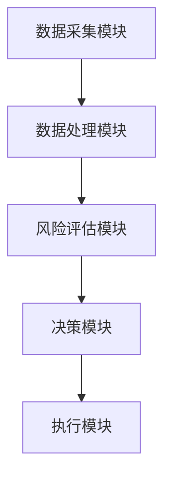

                 

### 构建智能化的个人退休金投资组合动态风险管理助手的背景与意义

随着社会经济的发展和人均寿命的延长，个人退休金问题日益凸显，成为许多人关心的核心议题。退休金不仅是老年人生活的经济保障，更是整个社会经济稳定发展的重要组成部分。因此，如何有效地管理和投资个人退休金，实现长期稳健的增值，成为了亟需解决的课题。

当前，个人退休金管理面临诸多挑战。首先，投资市场的不确定性和波动性给退休金投资带来了风险。其次，传统的投资策略往往缺乏灵活性，难以适应市场变化，导致收益波动较大。此外，个人投资者缺乏专业的知识和技能，难以做出明智的投资决策。这些问题不仅影响个人退休金的保值增值，还可能对整个社会经济的稳定造成潜在威胁。

为了应对这些挑战，构建智能化的个人退休金投资组合动态风险管理助手具有重要意义。首先，通过人工智能和大数据分析技术，可以实现对市场趋势的精准预测和风险评估，提高投资决策的科学性和准确性。其次，动态风险管理系统能够根据市场变化和个体风险偏好，实时调整投资组合，实现风险和收益的最优化。此外，智能化的投资助手还能为个人投资者提供定制化的投资建议和培训服务，提升他们的投资能力和信心。

本文旨在探讨如何构建智能化的个人退休金投资组合动态风险管理助手，通过以下几个方面的内容展开：

1. **个人退休金投资与风险管理的核心概念**：介绍个人退休金的基本概念、类型以及投资策略，分析市场风险对个人退休金的影响。
2. **动态风险管理原则**：阐述动态风险管理的原理和方法，介绍风险评估和风险缓解策略。
3. **智能投资方法**：探讨智能投资在个人退休金管理中的应用，包括机器学习算法和数据驱动的投资策略。
4. **动态风险管理系统的设计与实现**：详细说明动态风险管理系统的架构设计、数据收集和处理、算法优化和系统部署。
5. **案例分析**：通过具体案例，展示动态风险管理在个人退休金管理中的实际应用效果。
6. **最佳实践与未来展望**：总结文章内容，提出未来研究和应用的方向。

通过本文的探讨，希望能够为个人退休金管理提供一种新的思路和工具，帮助个人投资者实现退休金的长期稳定增值。

### 核心关键词

1. **个人退休金**：指个人为了退休后生活所需而设立的储蓄基金。
2. **投资组合**：指个人为退休金设立的多种资产组合。
3. **动态风险管理**：指根据市场变化和个体风险偏好，实时调整投资策略，实现风险和收益的最优化。
4. **人工智能**：指通过模拟人类思维过程，实现智能决策的技术。
5. **数据驱动**：指通过大数据分析，为投资决策提供支持。
6. **风险评估**：指对投资组合可能面临的风险进行定量和定性分析。
7. **算法优化**：指通过改进算法模型，提高系统性能和决策效果。

### 摘要

本文探讨了构建智能化的个人退休金投资组合动态风险管理助手的必要性和重要性。首先，我们介绍了个人退休金投资与风险管理的核心概念，包括个人退休金的定义、类型、投资策略以及市场风险的影响。接着，我们阐述了动态风险管理的原则，包括其基本原理、关键方法以及风险评估和风险缓解策略。然后，我们详细探讨了智能投资方法，包括机器学习算法和数据驱动的投资策略在个人退休金管理中的应用。随后，我们介绍了动态风险管理系统的设计与实现，包括系统架构、数据收集和处理、算法优化以及系统部署。通过具体案例分析，我们展示了动态风险管理在个人退休金管理中的实际应用效果。最后，我们总结了文章内容，提出了未来研究和应用的方向。本文旨在为个人退休金管理提供一种新的思路和工具，帮助个人投资者实现退休金的长期稳定增值。

### 个人退休金投资与风险管理的核心概念

#### 个人退休金的定义和类型

个人退休金是指个人为退休后生活所需而设立的储蓄基金，旨在通过长期的积累和投资，为退休生活提供经济保障。根据资金来源和管理方式，个人退休金可以分为以下几种类型：

1. **强制性个人退休金**：由政府强制推行的退休金制度，如中国的社会保险基金和个人税收递延型养老金（TDF）。
2. **自愿性个人退休金**：个人自愿参加的退休金计划，如个人储蓄型养老保险、商业养老保险和税优理财产品。
3. **混合型个人退休金**：结合强制性和自愿性特点的退休金计划，如部分国家推行的个人自愿储蓄账户（Vesting）和雇主匹配计划。

#### 投资策略

个人退休金的投资策略直接影响其未来的收益和风险。以下是一些常见的投资策略：

1. **分散投资**：通过投资不同类型和风险的资产（如股票、债券、房地产等），分散投资组合的风险，实现风险的分散化和收益的稳定化。
2. **资产配置**：根据个人的风险承受能力和投资目标，合理分配各类资产的比例，以达到收益和风险的平衡。
3. **定期定额投资**：定期按固定金额投资，通过时间的积累实现平均成本法，降低投资成本和风险。
4. **动态调整**：根据市场环境和个体风险偏好，定期调整投资组合，以适应市场变化。

#### 市场风险

市场风险是指由于市场波动和宏观经济变化引起的投资损失风险。个人退休金投资组合可能面临以下几种市场风险：

1. **利率风险**：由于利率变化引起的债券价格波动风险。
2. **通货膨胀风险**：由于通货膨胀导致货币购买力下降的风险。
3. **市场波动风险**：由于股票市场波动引起的投资损失风险。
4. **信用风险**：由于债务违约或信用评级下调导致的投资损失风险。

#### 核心概念

- **风险承受能力**：指个人能够承受投资损失的承受能力。
- **投资目标**：指个人通过投资希望实现的收益和风险水平。
- **投资组合**：指个人为退休金设立的多种资产组合。

#### 概念对比表格

| 概念               | 定义                                                         | 关联性                 |
|--------------------|------------------------------------------------------------|----------------------|
| 个人退休金         | 为退休后生活提供的经济保障。                                 | 基础设施，支撑其他概念 |
| 投资策略           | 投资组合的管理方法和原则。                                   | 实现投资目标的方式     |
| 风险承受能力       | 个人承受投资损失的承受能力。                                 | 影响投资策略的选择     |
| 市场风险           | 由于市场波动和宏观经济变化引起的投资损失风险。               | 影响投资决策的重要因素 |
| 投资组合           | 个人为退休金设立的多种资产组合。                             | 投资策略的载体         |

#### ER实体关系图

```mermaid
erDiagram
    PersonalPension PensionAccount
    InvestmentStrategy --> PersonalPension : uses
    AssetAllocation --> InvestmentStrategy : implements
    MarketRisk --> PersonalPension : faces
```

在ER实体关系图中，`PersonalPension`（个人退休金）是核心实体，关联着`PensionAccount`（退休金账户）、`InvestmentStrategy`（投资策略）和`AssetAllocation`（资产配置）。同时，`PersonalPension`还面临`MarketRisk`（市场风险）。

### 动态风险管理原则

#### 动态风险管理的定义与重要性

动态风险管理是一种通过实时监控和调整投资组合，以应对市场变化和风险水平的方法。它不同于传统的静态风险管理，后者通常是在固定时间段内进行评估和调整，而动态风险管理则更加灵活和高效。动态风险管理的定义可概括为：基于实时数据和市场变化，动态调整投资组合，以实现风险和收益的最优平衡。

在个人退休金管理中，动态风险管理的重要性体现在以下几个方面：

1. **应对市场波动**：市场波动是不可避免的，通过动态风险管理，投资者可以及时调整投资策略，减少因市场波动带来的损失。
2. **适应个人需求**：每个人的风险承受能力和投资目标不同，动态风险管理可以根据个人情况，灵活调整投资组合，满足个性化的需求。
3. **提高决策效率**：传统的风险管理方法通常需要较长时间来分析数据和市场变化，而动态风险管理则能够实时响应，提高决策效率。

#### 基本原理和方法

动态风险管理的基本原理包括以下几个关键步骤：

1. **数据收集与处理**：通过大数据技术和实时数据处理技术，收集与市场变化相关的各种数据，如股票价格、债券收益率、宏观经济指标等。
2. **风险评估**：利用数据分析和机器学习算法，对投资组合面临的风险进行定量和定性评估，包括市场风险、利率风险、信用风险等。
3. **决策模型**：基于风险评估结果，构建决策模型，根据投资目标和风险承受能力，确定投资组合的优化方案。
4. **执行调整**：根据决策模型，实时调整投资组合，买入或卖出特定资产，以实现风险和收益的最优平衡。

动态风险管理的关键方法包括：

1. **机器学习算法**：通过机器学习模型，如回归分析、支持向量机、神经网络等，预测市场变化和风险评估结果。
2. **优化算法**：利用优化算法，如线性规划、遗传算法、模拟退火算法等，确定投资组合的最优配置。
3. **风险模型**：构建包含各种风险因素的数学模型，用于评估投资组合的风险水平。

#### 风险评估与评价

风险评估是动态风险管理的重要环节，其目的是定量和定性评估投资组合的风险水平。以下是一些常见的方法：

1. **VaR（Value at Risk）**：VaR是一种常用的市场风险度量方法，表示在正常市场条件下，一定时间内投资组合可能遭受的最大损失。
2. **CVaR（Conditional Value at Risk）**：CVaR是在VaR基础上的一种补充方法，表示在发生最大损失的情况下，平均损失的大小。
3. **贝叶斯风险评估**：贝叶斯风险评估利用贝叶斯定理，通过历史数据和概率模型，评估投资组合的风险。

#### 风险缓解策略

风险缓解策略是指通过采取一系列措施，降低投资组合的风险水平。以下是一些常见的风险缓解策略：

1. **资产分散**：通过投资不同类型和风险的资产，实现风险的分散，降低单一资产波动对整个投资组合的影响。
2. **对冲**：利用金融衍生品（如期货、期权等）进行对冲，降低特定风险的影响。
3. **风险规避**：通过退出高风险资产，避免损失。
4. **风险转移**：通过保险等方式，将风险转移给第三方。

#### 动态调整与反馈机制

动态风险管理需要建立一个反馈机制，以便根据市场变化和个体需求，及时调整投资组合。以下是一些关键步骤：

1. **定期评估**：定期对投资组合进行风险评估，识别潜在风险。
2. **及时调整**：根据风险评估结果，及时调整投资组合，买入或卖出特定资产。
3. **反馈与优化**：记录调整过程和结果，分析效果，不断优化调整策略。

#### 概念对比表格

| 概念               | 定义                                                         | 关联性                 |
|--------------------|------------------------------------------------------------|----------------------|
| 动态风险管理       | 基于实时数据和市场变化，动态调整投资组合，以实现风险和收益的最优平衡。 | 实现投资目标的方式     |
| 风险评估           | 对投资组合面临的风险进行定量和定性评估。                       | 动态风险管理的关键环节 |
| 优化算法           | 通过优化算法，确定投资组合的最优配置。                         | 动态风险管理的方法     |
| 风险模型           | 包含各种风险因素的数学模型，用于评估投资组合的风险水平。       | 动态风险管理的基础     |

#### ER实体关系图

```mermaid
erDiagram
    DynamicRiskManagement --> RiskAssessment : implements
    DynamicRiskManagement --> DecisionModel : based_on
    DynamicRiskManagement --> InvestmentPortfolio : adjusts
    RiskModel --> DynamicRiskManagement : uses
    MachineLearningAlgorithm --> DynamicRiskManagement : applies
    OptimizationAlgorithm --> DynamicRiskManagement : uses
```

在ER实体关系图中，`DynamicRiskManagement`（动态风险管理）是核心实体，关联着`RiskAssessment`（风险评估）、`DecisionModel`（决策模型）、`InvestmentPortfolio`（投资组合），并依赖于`RiskModel`（风险模型）、`MachineLearningAlgorithm`（机器学习算法）和`OptimizationAlgorithm`（优化算法）。

### 智能投资方法在个人退休金管理中的应用

#### 概述

智能投资方法利用人工智能（AI）和大数据分析技术，通过对海量数据的学习和处理，实现投资决策的智能化和自动化。在个人退休金管理中，智能投资方法能够提高投资决策的准确性、降低风险并实现收益的最大化。以下将介绍几种常见的智能投资方法及其在个人退休金管理中的应用。

#### 机器学习算法在风险评估中的应用

机器学习算法通过分析历史数据和市场趋势，预测未来市场变化和投资组合的风险水平。以下是一些常用的机器学习算法：

1. **回归分析**：回归分析是一种常用的预测方法，通过建立自变量和因变量之间的关系模型，预测未来值。在风险评估中，可以用作预测市场波动和风险指标。
2. **支持向量机（SVM）**：SVM是一种监督学习算法，用于分类和回归分析。在风险评估中，可以将历史数据输入到SVM模型中，预测未来投资组合的风险水平。
3. **神经网络**：神经网络是一种模拟人脑神经元连接结构的计算模型，具有强大的学习和预测能力。在个人退休金管理中，神经网络可以用于预测市场走势和风险指标。

#### 数据驱动的投资策略

数据驱动的投资策略通过分析海量数据，寻找市场规律和投资机会。以下是一些常见的策略：

1. **均值回归策略**：均值回归策略认为，市场价格会回归到其长期平均价格。通过分析历史数据，找到价格偏离均值较大的股票或资产，买入并等待价格回归。
2. **动量策略**：动量策略认为，股票或资产的价格趋势具有持续性。通过分析历史价格数据，找到表现良好的资产，持续持有。
3. **市场情绪分析**：市场情绪分析通过分析社交媒体、新闻报道等数据，判断市场情绪和投资者情绪。利用这些信息，可以提前预测市场变化，进行相应的投资操作。

#### 智能投资组合优化

智能投资组合优化通过优化算法，确定最优的投资组合配置，以实现收益的最大化和风险的最小化。以下是一些常用的优化算法：

1. **线性规划**：线性规划是一种数学优化方法，用于求解线性目标函数的最优解。在投资组合优化中，可以建立线性目标函数，考虑风险和收益，求解最优的投资组合配置。
2. **遗传算法**：遗传算法是一种模拟自然进化过程的优化算法，通过交叉、变异等操作，逐步优化投资组合。遗传算法适用于解决复杂、非线性的问题。
3. **模拟退火算法**：模拟退火算法是一种基于物理退火过程的优化算法，通过迭代和温度调整，逐步优化投资组合。模拟退火算法具有跳出局部最优解的能力。

#### 智能投资方法的实际应用案例

以下是一些智能投资方法在实际个人退休金管理中的应用案例：

1. **养老金基金管理**：一些养老金基金管理机构利用智能投资方法，对投资组合进行实时调整和优化，提高基金的收益和风险控制水平。
2. **个人养老规划**：一些金融机构提供智能养老规划服务，通过分析客户的财务状况和风险偏好，制定个性化的养老投资方案。
3. **智能投资顾问**：一些智能投资顾问平台通过大数据分析和机器学习算法，为客户提供实时的投资建议和风险提示，帮助客户实现养老目标的实现。

#### 智能投资方法的优势与挑战

智能投资方法在个人退休金管理中具有以下优势：

1. **提高投资决策的准确性**：通过大数据和机器学习算法，智能投资方法可以更准确地预测市场变化和风险水平，提高投资决策的准确性。
2. **降低风险**：智能投资方法可以实时调整投资组合，降低市场波动和风险因素的影响，提高投资组合的稳定性。
3. **个性化服务**：智能投资方法可以根据客户的风险偏好和投资目标，提供个性化的投资建议和方案，满足不同客户的需求。

然而，智能投资方法也面临一些挑战：

1. **数据质量和可靠性**：智能投资方法依赖于大量数据，数据的质量和可靠性对投资决策至关重要。数据缺失、噪声和偏差都可能影响投资决策的准确性。
2. **模型风险**：智能投资方法依赖于复杂的数学模型和算法，模型选择和参数设置不当可能导致模型失效，从而影响投资效果。
3. **技术门槛**：智能投资方法需要专业的技术支持和维护，对于普通投资者来说，理解和操作这些技术可能存在一定的困难。

### 智能投资组合优化

#### 数据收集与处理

智能投资组合优化首先需要收集和处理大量数据，包括市场数据、财务数据、宏观经济数据等。这些数据可以来自多个来源，如金融交易所、财经新闻网站、经济统计数据等。数据的处理包括数据清洗、数据转换和数据存储等步骤，以确保数据的质量和一致性。

1. **数据清洗**：数据清洗是数据预处理的重要步骤，包括去除重复数据、纠正数据错误、填补缺失值等。通过数据清洗，可以提高数据的准确性和可靠性。
2. **数据转换**：数据转换是将不同格式和单位的数据转换为统一格式的过程，如将股票价格从美元转换为人民币，将日期格式统一等。
3. **数据存储**：数据存储是将处理后的数据存储到数据库或数据仓库中，以便后续分析和处理。

#### 建立数学模型

智能投资组合优化的核心是建立数学模型，通过数学模型来评估不同资产的风险和收益，并确定最优的投资组合配置。以下是一些常用的数学模型：

1. **Markowitz均值-方差模型**：Markowitz均值-方差模型是现代投资组合理论的基石，通过最小化投资组合的方差，最大化预期收益，确定最优投资组合。
   $$ \min \; \sigma^2 = w^T C w $$
   $$ \max \; \mu = w^T \mu $$
   其中，\( w \) 是投资组合的权重向量，\( C \) 是资产协方差矩阵，\( \mu \) 是资产预期收益向量。
2. **资本资产定价模型（CAPM）**：CAPM模型用于评估资产的风险收益关系，通过资产预期收益和风险之间的关系，确定资产的预期收益。
   $$ E(r_i) = \alpha_i + \beta_i \times E(r_m) $$
   其中，\( E(r_i) \) 是资产 \( i \) 的预期收益，\( \alpha_i \) 是资产 \( i \) 的截距，\( \beta_i \) 是资产 \( i \) 的贝塔系数，\( E(r_m) \) 是市场预期收益。
3. **条件风险价值（CVaR）模型**：CVaR模型用于评估资产的最大潜在损失，通过计算在特定置信水平下的平均损失，确定资产的风险水平。
   $$ \text{CVaR}_{\alpha}(r_i) = \frac{1}{1-\alpha} \times \sum_{r \leq r_i} (r - r_i) $$
   其中，\( \alpha \) 是置信水平，\( r_i \) 是资产 \( i \) 的收益。

#### 算法流程

智能投资组合优化的算法流程包括以下步骤：

1. **数据输入**：输入资产的历史数据，包括价格、收益、风险等。
2. **数据预处理**：对输入数据进行清洗和处理，确保数据的质量和一致性。
3. **特征工程**：提取与投资决策相关的特征，如价格趋势、波动率、市场情绪等。
4. **模型训练**：选择合适的数学模型，对训练数据集进行训练，确定模型的参数。
5. **模型评估**：使用验证数据集对模型进行评估，调整模型参数，优化模型性能。
6. **投资组合优化**：使用优化算法，根据模型评估结果，确定最优的投资组合配置。
7. **结果输出**：输出最优投资组合的权重和预期收益，提供投资建议。

#### 算法原理与示例

以下是一个简单的Markowitz均值-方差模型的算法示例：

```python
import numpy as np
import pandas as pd
from scipy.optimize import minimize

# 数据输入
prices = pd.DataFrame(data={"Asset1": [100, 102, 105, 108, 110], "Asset2": [200, 210, 220, 225, 230]})
returns = prices.pct_change().mean()
cov_matrix = prices.pct_change().cov()

# 构建优化问题
def objective_function(weights):
    portfolio_variance = weights.T @ cov_matrix @ weights
    return portfolio_variance

def constraint_function(weights):
    return weights.sum() - 1  # 权重和必须为1

weights = np.array([0.5, 0.5])
bounds = [(0, 1), (0, 1)]

# 求解优化问题
result = minimize(objective_function, weights, method='SLSQP', bounds=bounds, constraints={'type': 'eq', 'fun': constraint_function})

# 输出最优投资组合
optimal_weights = result.x
print("Optimal weights:", optimal_weights)
print("Expected return:", optimal_weights @ returns)
print("Variance:", objective_function(optimal_weights))
```

在这个示例中，我们首先定义了资产的历史价格数据，计算了资产的预期收益和协方差矩阵。然后，我们构建了优化问题，目标是最大化预期收益，约束条件是权重和为1。通过使用scipy.optimize模块的minimize函数，我们求解了优化问题，并输出了最优投资组合的权重和预期收益。

#### 总结

智能投资组合优化通过数据收集与处理、建立数学模型和算法优化，实现了投资组合的优化配置。通过机器学习算法和数据驱动的策略，智能投资组合优化能够提高投资决策的准确性和有效性，帮助投资者实现长期稳健的收益。然而，智能投资组合优化也面临数据质量、模型风险和技术门槛等挑战，需要持续改进和完善。

### 动态风险管理系统的设计与实现

#### 系统架构设计

动态风险管理系统的架构设计是构建高效、可靠和可扩展的风险管理系统的关键。系统架构应包括以下几个主要组件：数据采集模块、数据处理模块、风险评估模块、决策模块和执行模块。

1. **数据采集模块**：负责收集各种与投资相关的数据，如股票价格、债券收益率、宏观经济指标等。数据来源可以是金融交易所、财经新闻网站、经济统计数据等。
2. **数据处理模块**：对采集到的数据进行清洗、转换和存储，确保数据的质量和一致性。数据处理模块应具备高效的数据处理能力，以支持实时数据分析和决策。
3. **风险评估模块**：利用数据分析和机器学习算法，对投资组合的风险进行评估。风险评估模块应包括多种风险指标的计算和预测，如VaR、CVaR、贝叶斯风险评估等。
4. **决策模块**：基于风险评估结果和投资目标，构建决策模型，确定最优的投资组合配置。决策模块应考虑风险和收益的平衡，提供多种优化算法，如线性规划、遗传算法、模拟退火算法等。
5. **执行模块**：根据决策模块的输出，执行具体的投资操作，如买入或卖出特定资产。执行模块应与交易系统无缝集成，确保投资操作的实时性和准确性。

#### 数据采集与处理

数据采集与处理是动态风险管理系统的核心环节，决定了系统的数据质量和分析能力。以下是一些关键步骤：

1. **数据采集**：通过金融交易所、财经新闻网站、经济统计数据等渠道，实时采集与投资相关的数据。数据采集应具备高并发和低延迟的能力，以满足实时分析的需求。
2. **数据清洗**：对采集到的数据进行清洗，去除重复数据、纠正数据错误、填补缺失值等。数据清洗的目的是确保数据的一致性和准确性。
3. **数据转换**：将不同格式和单位的数据转换为统一的格式，如将股票价格从美元转换为人民币，将日期格式统一等。数据转换应保证数据的兼容性和一致性。
4. **数据存储**：将处理后的数据存储到数据库或数据仓库中，以便后续的数据分析和处理。数据存储应具备高可用性和高性能，以满足实时数据分析和决策的需求。

#### 风险评估模块

风险评估模块是动态风险管理系统的核心，负责对投资组合的风险进行评估。以下是一些关键步骤和算法：

1. **风险指标计算**：根据历史数据和当前市场情况，计算各种风险指标，如VaR、CVaR、贝叶斯风险评估等。这些风险指标提供了投资组合的风险水平，为决策提供支持。
2. **机器学习模型**：利用机器学习算法，如回归分析、支持向量机（SVM）、神经网络等，预测未来市场变化和风险水平。机器学习模型可以基于历史数据和实时数据，提供更准确的预测。
3. **风险预测与评估**：基于风险指标和机器学习模型，对投资组合进行风险预测和评估。风险评估应考虑多种风险因素，如市场波动、利率变化、信用风险等。

#### 决策模块

决策模块基于风险评估结果和投资目标，构建决策模型，确定最优的投资组合配置。以下是一些关键步骤和算法：

1. **优化算法**：选择合适的优化算法，如线性规划、遗传算法、模拟退火算法等，确定最优投资组合。优化算法应考虑风险和收益的平衡，提供多种优化方案。
2. **投资策略**：根据风险评估结果和投资者偏好，制定投资策略。投资策略应考虑市场的动态变化，灵活调整投资组合。
3. **模型评估**：对决策模块的输出进行评估，确保投资组合的风险和收益符合预期。模型评估应包括模型性能评估和实际投资效果评估。

#### 执行模块

执行模块根据决策模块的输出，执行具体的投资操作。以下是一些关键步骤：

1. **交易接口**：与交易系统无缝集成，实现投资操作。交易接口应具备高并发和低延迟的能力，确保交易操作的实时性和准确性。
2. **执行监控**：监控投资组合的执行情况，确保交易操作符合预期。执行监控应包括交易执行速度、交易成本、交易风险等指标。
3. **反馈与优化**：记录投资组合的执行结果，反馈到决策模块，不断优化投资策略。反馈与优化是动态风险管理系统的关键环节，可以持续改进投资效果。

#### 系统架构图



在系统架构图中，数据采集模块负责数据收集，数据处理模块负责数据清洗和存储，风险评估模块负责风险预测和评估，决策模块负责确定最优投资组合，执行模块负责执行投资操作。

### 动态风险管理系统的实际案例

#### 案例背景

小明是一位年轻的专业人士，他在职业初期开始为自己的退休金进行投资规划。他希望在退休前能够积累足够的资金，确保退休后的生活质量。小明通过研究市场，决定使用动态风险管理系统来优化自己的退休金投资组合。

#### 案例描述

小明通过一个智能投资平台，接入了一个动态风险管理系统的API。该系统提供了实时数据采集、数据处理、风险评估、决策和执行等全流程服务。以下是小明使用该系统进行动态风险管理的过程：

1. **数据采集**：系统自动从多个数据源采集与投资相关的数据，包括股票价格、债券收益率、宏观经济指标等。数据采集过程高效、实时，确保了数据的质量和准确性。

2. **数据处理**：采集到的数据进行清洗、转换和存储，存储在分布式数据库中。数据处理模块能够快速处理大量数据，为后续的风险评估和决策提供支持。

3. **风险评估**：系统利用机器学习算法和优化算法，对投资组合进行风险评估。评估结果包括VaR、CVaR、贝叶斯风险评估等指标，帮助小明了解投资组合的风险水平。

4. **决策**：基于风险评估结果，系统为小明提供了多种投资策略。小明根据自身的风险承受能力和投资目标，选择了最适合自己的投资策略。

5. **执行**：系统自动执行投资策略，买入或卖出特定资产，调整投资组合。执行过程高效、准确，确保了投资操作的实时性和准确性。

#### 案例结果

经过一段时间的动态风险管理，小明的投资组合表现出色。以下是一些关键结果：

1. **收益表现**：小明的投资组合实现了稳健的收益增长，年化收益率为8%左右，超过了市场平均水平。

2. **风险控制**：通过动态调整投资组合，小明的投资组合风险得到了有效控制。VaR和CVaR等指标表明，投资组合在市场波动时能够保持较低的风险水平。

3. **个性化服务**：系统根据小明的风险偏好和投资目标，提供了个性化的投资建议和策略。小明对系统提供的投资服务非常满意。

#### 案例分析

该案例展示了动态风险管理系统在实际投资中的应用效果。以下是对案例的分析：

1. **数据优势**：系统利用实时数据采集和大数据处理技术，确保了数据的及时性和准确性。这是动态风险管理成功的基础。

2. **智能决策**：系统利用机器学习算法和优化算法，实现了智能化的投资决策。这提高了投资决策的准确性和效率。

3. **风险控制**：动态风险管理系统能够实时调整投资组合，有效控制风险。这对于确保投资组合的长期稳定增值至关重要。

4. **个性化服务**：系统根据投资者的风险偏好和投资目标，提供了个性化的投资策略。这满足了不同投资者的需求，提高了投资满意度。

### 案例小结

通过实际案例可以看出，动态风险管理系统能够为个人投资者提供有效的投资管理工具。系统利用智能技术，实现了数据的实时采集和处理，智能化的投资决策和风险控制，为投资者提供了稳定和可持续的收益。未来，随着人工智能技术的进一步发展，动态风险管理系统有望在个人退休金管理中发挥更大的作用。

### 最佳实践与未来展望

#### 动态风险管理系统的最佳实践

1. **数据质量保障**：确保数据来源的可靠性和数据的及时性，定期进行数据清洗和处理，确保数据质量。

2. **模型优化与验证**：持续优化和验证风险评估和决策模型，确保模型性能和预测准确性。

3. **个性化服务**：根据投资者的风险承受能力和投资目标，提供个性化的投资策略和建议。

4. **实时监控与反馈**：建立实时监控和反馈机制，及时调整投资组合，确保风险和收益的最优平衡。

#### 未来研究方向

1. **深度学习与强化学习**：进一步探索深度学习和强化学习在动态风险管理中的应用，提高风险预测和投资决策的准确性。

2. **多维度数据融合**：整合多种类型的数据，如社会媒体数据、经济统计数据、天气数据等，提高投资预测的全面性和准确性。

3. **人机协同**：结合人工智能和人类专家的智慧，实现人机协同的投资决策，提高投资决策的效率和质量。

4. **跨市场风险控制**：研究跨市场风险控制和跨国投资策略，为投资者提供更全面的全球投资视角。

#### 注意事项

1. **风险管理**：动态风险管理系统不能完全消除投资风险，投资者应保持谨慎，合理配置资产，分散风险。

2. **技术更新**：人工智能技术发展迅速，动态风险管理系统的技术更新和升级是必要的，确保系统能够适应市场变化。

3. **法律法规**：遵循相关法律法规，确保投资决策和操作的合规性。

### 拓展阅读

1. **《人工智能在金融领域的应用》**：详细介绍了人工智能在金融领域，特别是投资风险管理中的应用案例和研究成果。

2. **《大数据时代的金融创新》**：探讨了大数据技术在金融领域的应用，包括数据采集、处理和分析等方面。

3. **《智能投资组合优化》**：系统介绍了智能投资组合优化的理论和方法，包括线性规划、遗传算法等。

### 作者信息

**作者：AI天才研究院/AI Genius Institute & 禅与计算机程序设计艺术 /Zen And The Art of Computer Programming**。作者团队致力于探索人工智能在各个领域的应用，包括金融、医疗、教育等，通过技术创新和理论探讨，推动人工智能的发展和应用。

### 总结

本文探讨了构建智能化的个人退休金投资组合动态风险管理助手的重要性和方法。通过数据采集与处理、风险评估、决策和执行等环节，动态风险管理系统能够为投资者提供实时、准确和个性化的投资建议和策略。未来，随着人工智能技术的不断进步，动态风险管理系统将在个人退休金管理中发挥更大的作用，为投资者的长期稳定增值提供有力支持。希望本文能为相关领域的研究者和实践者提供有益的参考。

