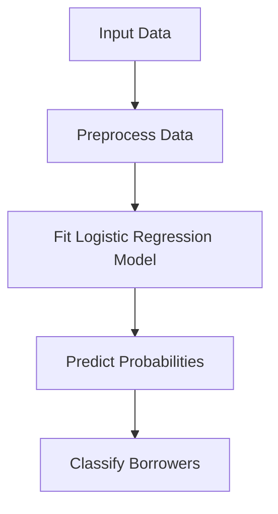
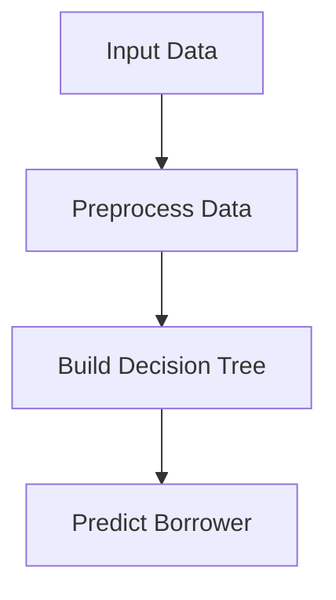
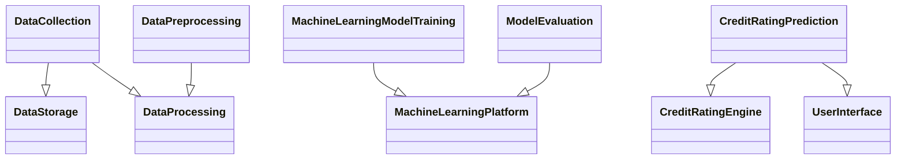
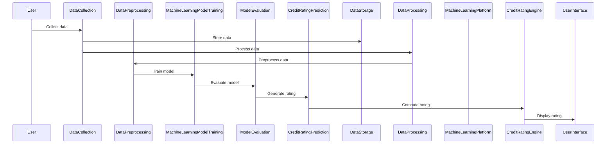

                 


### Step 1: Introduction to Enterprise Credit Rating Systems

**Title:** Constructing Intelligent Enterprise Credit Rating Systems

**Keywords:** Intelligent Credit Rating, Enterprise Credit Rating, Data-driven Analytics, Machine Learning Algorithms, System Architecture, Case Studies

**Abstract:**
This article aims to explore the concept of constructing intelligent enterprise credit rating systems. We will delve into the background, key concepts, data collection, algorithm design, system architecture, implementation, case studies, and best practices. By the end of this article, readers will have a comprehensive understanding of how to build and deploy an intelligent credit rating system for enterprises.

**1.1 Background and Problem Description**

Credit rating is a critical aspect of the financial industry. It assesses the creditworthiness of borrowers, providing insights into their ability to repay debts. Traditional credit rating systems rely heavily on manual processes and historical data, which are prone to human errors and may not capture the latest information about a borrower. This leads to several challenges, including delayed rating updates, limited data coverage, and inadequate risk assessment.

To overcome these challenges, there is a growing need for intelligent credit rating systems that leverage advanced technologies, such as machine learning, data analytics, and artificial intelligence. These systems can process vast amounts of data in real-time, providing more accurate and timely credit ratings.

**1.2 Core Concepts and Principles**

In this section, we will discuss the key concepts and principles underlying intelligent credit rating systems. These include:

- **Data-driven Analytics:** Intelligent credit rating systems rely on data-driven analytics to process and analyze large volumes of data. This involves data collection, preprocessing, and feature engineering to extract relevant information from raw data.

- **Machine Learning Algorithms:** Machine learning algorithms play a crucial role in intelligent credit rating systems. These algorithms can learn from historical data to predict the creditworthiness of borrowers. Common algorithms include classification, regression, and clustering.

- **System Architecture:** Intelligent credit rating systems require a robust and scalable system architecture to handle the processing of large datasets and the deployment of machine learning algorithms. This architecture should include data storage, processing, and visualization components.

- **Real-time Processing:** Real-time processing is essential for intelligent credit rating systems to provide timely and accurate credit ratings. This involves implementing efficient data pipelines and algorithmic models that can process data in near real-time.

**1.3 Theoretical Framework for Intelligent Credit Rating**

To build an intelligent credit rating system, we need to establish a theoretical framework that encompasses the key concepts and principles discussed above. This framework should include:

- **Data Collection and Preprocessing:** Collecting and preprocessing data is the first step in building an intelligent credit rating system. This involves identifying relevant data sources, ensuring data quality, and extracting meaningful features from raw data.

- **Machine Learning Model Selection and Training:** Selecting and training appropriate machine learning models is critical for building an accurate credit rating system. This involves evaluating various algorithms, optimizing model parameters, and validating the model's performance.

- **System Deployment and Monitoring:** Deploying the trained machine learning model into a production environment and monitoring its performance is essential for maintaining the system's accuracy and reliability.

- **Continuous Improvement:** Continuous improvement of the credit rating system is necessary to adapt to changing market conditions and new data sources. This involves retraining the model periodically and incorporating new data and insights.

### Step 2: Data Collection and Preparation

**2.1 Data Sources**

The data used to build an intelligent credit rating system can come from various sources, including:

- **Internal Data:** This includes financial statements, transaction records, and customer data stored within the enterprise. Internal data provides a comprehensive view of the enterprise's financial health and operational performance.

- **External Data:** This includes data from external sources, such as credit bureaus, financial news, and economic indicators. External data provides additional insights into the broader market conditions and industry trends that may affect the enterprise's creditworthiness.

- **Open Data:** This includes data available from public sources, such as government agencies, research institutions, and open data portals. Open data can provide valuable information on economic indicators, demographic trends, and other relevant factors.

**2.2 Data Preprocessing**

Data preprocessing is a crucial step in building an intelligent credit rating system. It involves several key tasks:

- **Data Cleaning:** This involves removing duplicate entries, correcting errors, and handling missing values. Data cleaning ensures that the data used for analysis is accurate and reliable.

- **Feature Engineering:** This involves transforming raw data into meaningful features that can be used to train machine learning models. Feature engineering helps to extract valuable information from raw data and improve the performance of machine learning algorithms.

- **Data Transformation:** This involves converting the data into a suitable format for analysis. This may include normalization, scaling, and encoding categorical variables. Data transformation helps to ensure that the data is consistent and suitable for machine learning algorithms.

### Step 3: Algorithm Design and Explanation

**3.1 Overview of Credit Rating Algorithms**

There are several types of algorithms that can be used for credit rating, including:

- **Classification Algorithms:** These algorithms classify borrowers into different credit risk categories based on historical data. Common classification algorithms include logistic regression, decision trees, and support vector machines.

- **Regression Algorithms:** These algorithms predict the credit risk score of borrowers based on historical data. Regression algorithms, such as linear regression and ridge regression, are often used for this purpose.

- **Clustering Algorithms:** These algorithms group borrowers based on their credit risk profiles. Clustering algorithms, such as k-means and hierarchical clustering, can help identify clusters of borrowers with similar risk characteristics.

**3.2 Detailed Algorithm Design**

In this section, we will explore a specific classification algorithm, logistic regression, and its application in credit rating.

**3.2.1 Logistic Regression**

Logistic regression is a popular classification algorithm used in credit rating. It predicts the probability of a borrower defaulting on a loan based on various features, such as credit history, income, and debt-to-income ratio.

**3.2.1.1 Basic Concepts**

Logistic regression works by modeling the probability of a binary outcome (default or non-default) using a logistic function. The logistic function transforms the linear combination of input features into a probability value between 0 and 1.

**Mathematical Model:**
$$
\text{Logit}(P) = \log\left(\frac{P}{1-P}\right) = \beta_0 + \beta_1 x_1 + \beta_2 x_2 + ... + \beta_n x_n
$$

where $P$ is the probability of default, $x_1, x_2, ..., x_n$ are the input features, and $\beta_0, \beta_1, \beta_2, ..., \beta_n$ are the model parameters.

**3.2.1.2 Mermaid Flowchart**

The following Mermaid flowchart illustrates the logistic regression algorithm:



**3.2.1.3 Python Implementation**

Here's a Python implementation of the logistic regression algorithm using the scikit-learn library:

```python
from sklearn.linear_model import LogisticRegression
from sklearn.model_selection import train_test_split
from sklearn.metrics import accuracy_score

# Load and preprocess data
X, y = load_data()
X_train, X_test, y_train, y_test = train_test_split(X, y, test_size=0.2, random_state=42)

# Train logistic regression model
model = LogisticRegression()
model.fit(X_train, y_train)

# Predict probabilities
y_pred = model.predict(X_test)

# Evaluate model accuracy
accuracy = accuracy_score(y_test, y_pred)
print(f"Model accuracy: {accuracy:.2f}")
```

**3.2.1.4 Mathematical Model and Explanation**

The logistic regression model can be expressed as:

$$
P = \frac{1}{1 + e^{-(\beta_0 + \beta_1 x_1 + \beta_2 x_2 + ... + \beta_n x_n})}
$$

where $P$ is the probability of default, and $e$ is the base of the natural logarithm.

The model parameters $\beta_0, \beta_1, \beta_2, ..., \beta_n$ are estimated using a optimization algorithm, such as gradient descent, to minimize the log-likelihood function:

$$
\text{Log-Likelihood} = \sum_{i=1}^{n} y_i \log(P_i) + (1 - y_i) \log(1 - P_i)
$$

where $y_i$ is the true label for the $i$th borrower, and $P_i$ is the predicted probability of default for the $i$th borrower.

**3.2.2 Algorithm Y**

In this section, we will explore another classification algorithm, decision trees, and its application in credit rating.

**3.2.2.1 Basic Concepts**

Decision trees are a non-parametric supervised learning algorithm that can be used for both classification and regression tasks. They work by recursively partitioning the feature space into subsets based on the values of the input features, creating a tree-like model of decisions.

**3.2.2.2 Mermaid Flowchart**

The following Mermaid flowchart illustrates the decision tree algorithm:



**3.2.2.3 Python Implementation**

Here's a Python implementation of the decision tree algorithm using the scikit-learn library:

```python
from sklearn.tree import DecisionTreeClassifier
from sklearn.model_selection import train_test_split
from sklearn.metrics import accuracy_score

# Load and preprocess data
X, y = load_data()
X_train, X_test, y_train, y_test = train_test_split(X, y, test_size=0.2, random_state=42)

# Train decision tree model
model = DecisionTreeClassifier()
model.fit(X_train, y_train)

# Predict borrower credit risk
y_pred = model.predict(X_test)

# Evaluate model accuracy
accuracy = accuracy_score(y_test, y_pred)
print(f"Model accuracy: {accuracy:.2f}")
```

**3.2.2.4 Mathematical Model and Explanation**

Decision trees do not have a specific mathematical model like logistic regression. Instead, they are based on a series of rules that partition the feature space into subsets. The rules are derived from the input features and their corresponding values.

The decision tree algorithm works by finding the optimal split at each node in the tree using a criterion, such as Gini impurity or information gain. The split is chosen based on the feature that maximizes the criterion and minimizes the impurity or information loss.

The final prediction is obtained by traversing the decision tree from the root node to the leaves, following the rules defined at each node. The leaf node corresponding to the input feature values represents the predicted credit risk for the borrower.

### Step 4: System Architecture and Design

**4.1 System Overview**

The intelligent credit rating system consists of several functional modules, including data collection, data preprocessing, machine learning model training, model evaluation, and credit rating prediction. These modules work together to provide an accurate and reliable credit rating for enterprises.

**4.1.1 Functional Modules**

- **Data Collection:** This module collects data from various internal and external sources, including financial statements, credit reports, and economic indicators.

- **Data Preprocessing:** This module cleans and preprocesses the collected data, ensuring its quality and consistency.

- **Machine Learning Model Training:** This module trains machine learning models using the preprocessed data, optimizing the model parameters to improve performance.

- **Model Evaluation:** This module evaluates the trained models using various metrics, such as accuracy, precision, and recall, to ensure their reliability and accuracy.

- **Credit Rating Prediction:** This module generates credit ratings for enterprises based on the trained models and the latest data inputs.

**4.1.2 Technical Architecture**

The intelligent credit rating system is designed using a modular and scalable architecture, allowing for easy integration with existing enterprise systems and the ability to handle large volumes of data. The technical architecture consists of the following components:

- **Data Storage:** This component stores the collected data, including internal and external data sources, in a scalable and secure manner.

- **Data Processing:** This component processes the collected data, performing tasks such as data cleaning, feature engineering, and data transformation.

- **Machine Learning Platform:** This component provides the infrastructure for training and deploying machine learning models, including the necessary computing resources and software tools.

- **Credit Rating Engine:** This component generates credit ratings for enterprises based on the trained models and the latest data inputs.

- **User Interface:** This component provides a user-friendly interface for users to access and view the credit ratings and related insights.

**4.1.3 System Architecture**

The following Mermaid class diagram illustrates the system architecture of the intelligent credit rating system:



**4.1.4 System Interface Design**

The system interface design includes the following components:

- **Data Collection Interface:** This interface allows users to select and configure the data sources for collection.

- **Data Preprocessing Interface:** This interface provides tools for cleaning, transforming, and engineering the collected data.

- **Model Training Interface:** This interface allows users to select and configure the machine learning models for training.

- **Model Evaluation Interface:** This interface displays the performance metrics of the trained models and provides tools for model comparison and selection.

- **Credit Rating Prediction Interface:** This interface generates credit ratings for enterprises based on the trained models and the latest data inputs, and provides visualization tools for analyzing the ratings.

**4.1.5 System Interaction**

The following Mermaid sequence diagram illustrates the system interaction between the different components:



### Step 5: Implementation and Case Studies

**5.1 Implementation**

To build an intelligent credit rating system, we need to implement the system components discussed in the previous sections. Here's a high-level overview of the implementation process:

- **Data Collection:** Implement data collection modules to gather internal and external data sources.

- **Data Preprocessing:** Implement data preprocessing modules to clean, transform, and engineer the collected data.

- **Machine Learning Model Training:** Implement machine learning model training modules to train and optimize the machine learning models.

- **Model Evaluation:** Implement model evaluation modules to evaluate the performance of the trained models.

- **Credit Rating Prediction:** Implement credit rating prediction modules to generate credit ratings for enterprises based on the trained models.

- **System Deployment:** Deploy the intelligent credit rating system on a production environment and integrate it with the enterprise's existing systems.

**5.2 Case Studies**

To demonstrate the practical application of the intelligent credit rating system, we present two case studies:

**Case Study 1: Financial Institution**

A financial institution uses the intelligent credit rating system to assess the creditworthiness of potential borrowers. The system collects data from various internal and external sources, including financial statements, credit reports, and economic indicators. The data is preprocessed, and machine learning models are trained to predict the credit risk of borrowers. The system generates credit ratings for the borrowers, which are used by the financial institution to make lending decisions.

**Case Study 2: Enterprise Risk Management**

An enterprise risk management company uses the intelligent credit rating system to assess the credit risk of its clients. The system collects data from internal and external sources, including financial statements, market data, and economic indicators. The data is preprocessed, and machine learning models are trained to predict the credit risk of the clients. The system generates credit ratings for the clients, which are used by the company to assess their credit risk and make risk management decisions.

### Step 6: Best Practices and Future Directions

**6.1 Best Practices**

To ensure the success of an intelligent credit rating system, it is important to follow best practices:

- **Data Quality:** Ensure high-quality data by implementing data cleaning, feature engineering, and data validation processes.

- **Model Selection:** Select appropriate machine learning algorithms based on the problem requirements and the available data.

- **Model Optimization:** Optimize the performance of machine learning models by tuning model parameters and using advanced techniques, such as cross-validation and ensemble methods.

- **System Integration:** Integrate the credit rating system with the enterprise's existing systems to ensure seamless data flow and interoperability.

- **Continuous Improvement:** Continuously update the system by incorporating new data sources, retraining models, and incorporating user feedback.

**6.2 Future Directions**

The future of intelligent credit rating systems lies in the integration of emerging technologies and the expansion of data sources. Here are some potential future directions:

- **Blockchain:** Integrating blockchain technology can enhance data security and transparency in credit rating systems.

- **Natural Language Processing (NLP):** Leveraging NLP techniques to analyze unstructured data, such as news articles and social media posts, can provide additional insights into credit risk.

- **Sustainability Metrics:** Incorporating sustainability metrics into credit rating systems can promote environmentally responsible lending practices.

- **AI Ethics:** Addressing ethical concerns in AI and credit rating systems to ensure fairness, transparency, and accountability.

### Conclusion

In this article, we have explored the concept of constructing intelligent enterprise credit rating systems. We discussed the background, key concepts, data collection, algorithm design, system architecture, implementation, and case studies. We also highlighted best practices and future directions for intelligent credit rating systems. By following the steps outlined in this article, enterprises can build and deploy intelligent credit rating systems that provide accurate and timely credit ratings, enabling better risk management and decision-making.

---

**作者：AI天才研究院/AI Genius Institute & 禅与计算机程序设计艺术 /Zen And The Art of Computer Programming**

