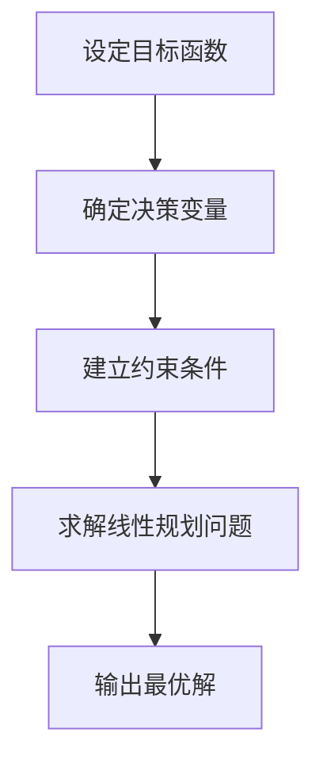
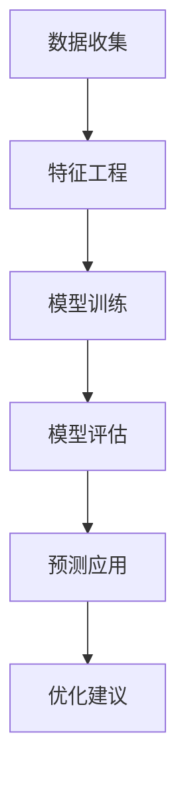
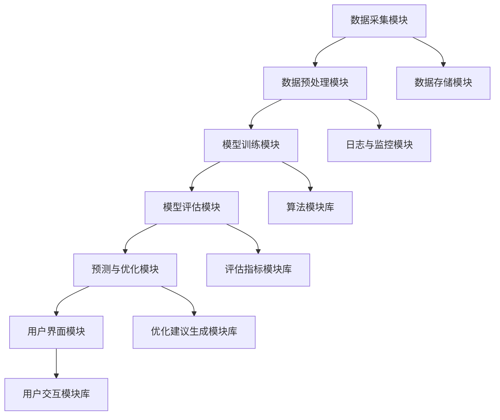
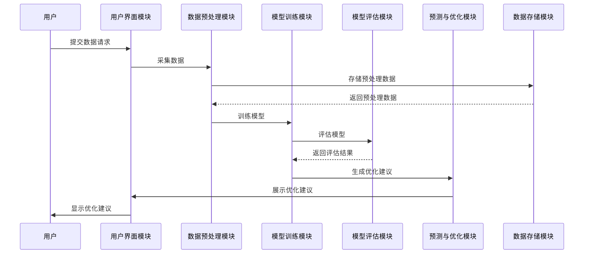

                 

### 摘要

随着科技的发展，智能化技术逐渐渗透到各个行业，为企业运营带来了诸多革新。特别是在企业资本结构优化领域，智能化技术能够大幅提升决策效率，降低风险，实现资源的最优配置。本文将围绕构建智能化的企业资本结构优化平台这一主题，深入探讨其背景、核心概念、算法原理、系统设计与项目实战。通过逻辑清晰的分析和详细的讲解，本文旨在为读者提供一个全面、系统的认识，助力企业更好地运用智能化手段进行资本结构优化，实现可持续发展。

### 关键词

- 智能化
- 企业资本结构优化
- 算法原理
- 系统设计
- 项目实战

### 目录大纲设计

为了设计出《构建智能化的企业资本结构优化平台》这本书的目录大纲，我们需要遵循以下步骤：

1. **背景介绍**：
   - 介绍资本结构优化的重要性。
   - 概述智能化在资本结构优化中的应用现状和发展趋势。

2. **核心概念与联系**：
   - 定义资本结构、智能化、企业资本结构优化平台等核心概念。
   - 通过概念属性特征对比表格和ER实体关系图，展示各个概念之间的关系。

3. **算法原理讲解**：
   - 介绍用于企业资本结构优化的主要算法，如线性规划、机器学习算法等。
   - 使用mermaid画出算法流程图，并使用Python源代码阐述算法原理。
   - 给出算法的数学模型和公式，并进行详细讲解和举例说明。

4. **系统分析与架构设计方案**：
   - 介绍项目背景和系统功能设计。
   - 使用mermaid绘制领域模型类图、系统架构图和系统接口设计。
   - 描述系统交互序列图。

5. **项目实战**：
   - 环境安装说明。
   - 系统核心实现源代码展示。
   - 代码应用解读与分析。
   - 实际案例分析和详细讲解。

6. **最佳实践 tips、小结、注意事项、拓展阅读**：
   - 提供项目实战中的最佳实践技巧。
   - 对全书内容进行小结，指出关键知识点。
   - 提醒读者注意事项。
   - 推荐拓展阅读资源。

### 目录大纲

```markdown
# 《构建智能化的企业资本结构优化平台》目录大纲

# 第一部分: 背景介绍

## 1.1 资本结构优化的重要性
### 1.1.1 资本结构的基本概念
### 1.1.2 资本结构优化的意义
### 1.1.3 智能化在资本结构优化中的应用

## 1.2 智能化与企业资本结构优化的现状与趋势
### 1.2.1 智能化技术的发展
### 1.2.2 企业资本结构优化的挑战与机遇
### 1.2.3 智能化在企业资本结构优化中的应用前景

# 第二部分: 核心概念与联系

## 2.1 资本结构、智能化与企业资本结构优化平台
### 2.1.1 资本结构的定义与构成
### 2.1.2 智能化的定义与特性
### 2.1.3 企业资本结构优化平台的概念与作用

## 2.2 概念属性特征对比表格
### 2.2.1 资本结构与智能化特征的对比
### 2.2.2 企业资本结构优化平台的关键要素

## 2.3 ER实体关系图
### 2.3.1 企业资本结构优化平台的实体关系
### 2.3.2 实体属性与关系说明

# 第三部分: 算法原理讲解

## 3.1 线性规划算法在资本结构优化中的应用
### 3.1.1 线性规划的基本概念
### 3.1.2 线性规划在资本结构优化中的原理
### 3.1.3 线性规划算法的mermaid流程图
### 3.1.4 Python源代码示例
### 3.1.5 算法数学模型与公式
### 3.1.6 算法举例说明

## 3.2 机器学习算法在资本结构优化中的应用
### 3.2.1 机器学习的基本概念
### 3.2.2 机器学习在资本结构优化中的原理
### 3.2.3 机器学习算法的mermaid流程图
### 3.2.4 Python源代码示例
### 3.2.5 算法数学模型与公式
### 3.2.6 算法举例说明

# 第四部分: 系统分析与架构设计方案

## 4.1 项目背景
### 4.1.1 项目背景介绍
### 4.1.2 项目目标与范围

## 4.2 系统功能设计
### 4.2.1 系统功能需求
### 4.2.2 领域模型类图

## 4.3 系统架构设计
### 4.3.1 系统架构设计原则
### 4.3.2 系统架构mermaid图

## 4.4 系统接口设计
### 4.4.1 接口设计规范
### 4.4.2 系统接口mermaid图

## 4.5 系统交互序列图
### 4.5.1 系统交互流程
### 4.5.2 系统交互序列图

# 第五部分: 项目实战

## 5.1 环境安装
### 5.1.1 环境要求
### 5.1.2 环境搭建步骤

## 5.2 系统核心实现
### 5.2.1 源代码展示
### 5.2.2 代码应用解读与分析

## 5.3 实际案例分析
### 5.3.1 案例背景
### 5.3.2 案例分析
### 5.3.3 详细讲解与剖析

## 5.4 项目小结
### 5.4.1 项目总结
### 5.4.2 经验与教训

# 第六部分: 最佳实践 tips、小结、注意事项、拓展阅读

## 6.1 最佳实践 tips
### 6.1.1 实践经验分享
### 6.1.2 注意事项与风险提示

## 6.2 小结
### 6.2.1 文章内容回顾
### 6.2.2 关键知识点总结

## 6.3 注意事项
### 6.3.1 系统实施中的常见问题
### 6.3.2 避免错误的做法

## 6.4 拓展阅读
### 6.4.1 相关书籍推荐
### 6.4.2 研究论文与资料推荐

```

### 第一部分: 背景介绍

#### 1.1 资本结构优化的重要性

资本结构是企业财务管理中至关重要的一个方面，它关系到企业的资金来源、债务水平和融资策略。一个良好的资本结构不仅能降低企业的财务风险，还能提高其市场竞争力，进而实现可持续的发展。

**资本结构的基本概念**：

资本结构通常指企业在筹集资金时所采用的不同资金来源的构成比例。这些资金来源主要包括权益资本（如股本、资本公积金等）和债务资本（如银行贷款、债券等）。合理的资本结构应当是两者的最优组合，以确保企业既能满足运营资金需求，又能控制财务风险。

**资本结构优化的意义**：

1. **提高资金使用效率**：优化资本结构有助于企业更加灵活地调配资金，提高资金的使用效率，减少不必要的财务费用。
2. **降低财务风险**：合理的资本结构可以降低企业的债务负担，减少偿债压力，从而降低财务风险。
3. **增强市场竞争力**：良好的资本结构能够提高企业的信用评级，降低融资成本，增强企业在资本市场上的竞争力。

**智能化在资本结构优化中的应用**：

随着人工智能技术的不断发展，智能化在资本结构优化中的应用日益广泛。例如，通过大数据分析和机器学习算法，企业可以更准确地预测资本需求，优化融资策略；利用智能合约技术，企业可以更高效地管理债务和股权关系，降低交易成本和风险。

**智能化与企业资本结构优化的现状与趋势**：

目前，许多企业已经开始尝试利用智能化技术来优化资本结构，但整体应用仍处于初级阶段。未来，随着技术的不断成熟，智能化在企业资本结构优化中的应用将更加深入和广泛，成为企业提升竞争力和实现可持续发展的重要手段。

#### 1.2 智能化与企业资本结构优化的现状与趋势

**智能化技术的发展**：

近年来，人工智能技术取得了显著进展，特别是机器学习、深度学习、自然语言处理等领域的突破，为智能化在企业资本结构优化中的应用奠定了基础。通过大数据分析和智能算法，企业能够更好地理解和预测市场动态，从而做出更加精准的资本结构决策。

**企业资本结构优化的挑战与机遇**：

**挑战**：

1. **数据质量**：资本结构优化依赖于大量准确、完整的数据。然而，许多企业的数据质量不高，影响了智能化技术的应用效果。
2. **技术成熟度**：虽然人工智能技术发展迅速，但在实际应用中，技术成熟度和可靠性仍需进一步提升。

**机遇**：

1. **降低成本**：智能化技术可以帮助企业自动化许多繁琐的财务分析工作，降低人力成本。
2. **提高决策效率**：通过智能化技术，企业能够快速分析大量数据，提高决策效率，减少因信息不对称导致的错误决策。

**智能化在企业资本结构优化中的应用前景**：

未来，随着智能化技术的不断进步和企业对数据价值的认识加深，智能化在企业资本结构优化中的应用前景十分广阔。例如，通过智能化平台，企业可以实现：

1. **实时监控**：实时监控企业的资本结构变化，及时调整融资策略。
2. **智能预测**：利用大数据分析和机器学习算法，预测资本需求和市场变化，为企业提供决策支持。
3. **智能合约**：利用智能合约技术，实现自动化的债务和股权管理，降低交易成本和风险。

### 总结

资本结构优化对于企业的可持续发展至关重要，而智能化技术的应用为这一领域带来了新的机遇和挑战。通过深入理解资本结构、智能化和智能化企业资本结构优化平台等核心概念，读者可以更好地把握这一领域的未来发展。接下来，我们将进一步探讨这些核心概念，并通过属性特征对比表格和ER实体关系图，展示它们之间的联系和作用。

#### 2.1 资本结构、智能化与企业资本结构优化平台

**资本结构的定义与构成**：

资本结构是指企业在筹集资金时，各种资金来源的构成比例。它主要由权益资本和债务资本两部分构成。权益资本主要包括股本、资本公积金、盈余公积金等，代表企业的自有资本；债务资本则包括银行贷款、债券、应付账款等，代表企业的负债。

**资本结构优化的目的**：

资本结构优化的主要目的是通过调整权益资本和债务资本的比例，达到降低成本、降低财务风险、提高资金使用效率的目的。具体来说，包括以下几个方面：

1. **降低资本成本**：通过优化资本结构，减少高成本负债，增加低成本权益资本，从而降低企业的整体资本成本。
2. **降低财务风险**：通过合理控制债务水平，减少企业的财务风险，确保企业在经济波动中能够稳定运营。
3. **提高资金使用效率**：优化资本结构，使企业能够更加灵活地调配资金，提高资金的使用效率。

**智能化的定义与特性**：

智能化是指通过计算机技术、人工智能算法等手段，实现数据的自动化处理、分析和决策。智能化的主要特性包括：

1. **数据分析能力**：智能化系统能够处理大量数据，进行深入分析和挖掘，发现数据中的规律和趋势。
2. **自主学习能力**：智能化系统能够通过机器学习、深度学习等技术，不断学习和优化，提高决策的准确性。
3. **实时响应能力**：智能化系统可以实时响应环境变化，快速做出决策，提高系统的响应速度和效率。

**企业资本结构优化平台的概念与作用**：

企业资本结构优化平台是一个集成了智能化技术的综合性系统，它通过收集、处理和分析企业内外部数据，为企业提供资本结构优化的解决方案。其主要作用包括：

1. **数据整合**：平台能够整合来自不同渠道的数据，包括财务报表、市场数据、行业趋势等，形成统一的数据视图。
2. **智能分析**：平台利用智能化算法，对数据进行深入分析，识别资本结构中的问题和机会。
3. **决策支持**：平台提供基于数据的决策支持，帮助企业制定最优的资本结构策略。
4. **自动化执行**：平台能够自动化执行资本结构调整的操作，降低人工干预，提高执行效率。

**核心概念之间的关系**：

资本结构、智能化和企业资本结构优化平台是密切相关的三个核心概念。资本结构是企业财务管理的核心问题，智能化提供了强大的数据分析、学习和决策支持能力，而企业资本结构优化平台则是这两者有机结合的产物，通过智能化的手段，帮助企业优化资本结构，实现可持续的发展。

通过以上介绍，我们可以看到，资本结构优化是企业管理中的重要环节，智能化技术的应用为这一领域带来了新的机遇。接下来，我们将通过概念属性特征对比表格和ER实体关系图，进一步展示资本结构、智能化和企业资本结构优化平台之间的关系。

#### 2.2 概念属性特征对比表格

为了更好地理解资本结构、智能化和企业资本结构优化平台这三个核心概念，我们通过一个对比表格来展示它们的主要属性特征。

| **概念** | **定义** | **主要属性** | **特征** | **作用** |
| :--- | :--- | :--- | :--- | :--- |
| **资本结构** | 企业筹集资金时各种资金来源的构成比例 | 权益资本、债务资本 | 比例构成、资金成本、财务风险 | 决定企业的资金来源和风险水平 |
| **智能化** | 通过计算机技术和人工智能算法实现自动化处理、分析和决策 | 数据分析、自主学习、实时响应 | 处理大量数据、优化决策、提高效率 | 提升数据分析、决策支持能力 |
| **企业资本结构优化平台** | 集成了智能化技术，为企业提供资本结构优化解决方案的系统 | 数据整合、智能分析、决策支持、自动化执行 | 集成多种技术、实时响应、优化资本结构 | 提供全面、系统的资本结构优化服务 |

**资本结构与智能化特征的对比**：

1. **资金来源**：资本结构主要关注企业的资金来源和构成，包括权益资本和债务资本。而智能化则侧重于数据分析和决策支持，通过计算机技术和人工智能算法实现。
2. **功能定位**：资本结构是企业财务管理的一部分，主要目的是优化资金使用效率和降低财务风险。智能化则是技术手段，用于提升数据分析和决策支持能力。
3. **相互作用**：智能化技术可以应用于资本结构优化，通过数据分析、预测和决策支持，帮助企业更好地理解和调整资本结构。

**企业资本结构优化平台的关键要素**：

1. **数据整合**：平台需要整合来自不同渠道的数据，包括财务报表、市场数据、行业趋势等，形成统一的数据视图。
2. **智能分析**：平台利用智能化算法，对数据进行深入分析，识别资本结构中的问题和机会。
3. **决策支持**：平台提供基于数据的决策支持，帮助企业制定最优的资本结构策略。
4. **自动化执行**：平台能够自动化执行资本结构调整的操作，降低人工干预，提高执行效率。

通过以上对比表格，我们可以清晰地看到资本结构、智能化和企业资本结构优化平台之间的关系和各自的作用。这些概念相互关联，共同构成了一个完整的智能资本结构优化体系。接下来，我们将通过ER实体关系图，进一步展示这些概念之间的实体关系。

#### 2.3 ER实体关系图

为了更直观地展示资本结构、智能化和企业资本结构优化平台之间的实体关系，我们使用ER（Entity-Relationship）实体关系图来描述。以下是企业资本结构优化平台的ER实体关系图：

```mermaid
erDiagram
  Class1 ||--|{ Class2 } Class3 : "has a" |} 
  Class1 ||--|{ Class2 } Class3 : "part of" |} 

  Class1 {
    #FF0000;name: 资本结构
    : {资金来源}
    : {权益资本}
    : {债务资本}
    : {资本成本}
  }

  Class2 {
    #FF0000;name: 智能化
    : {数据分析}
    : {自主学习}
    : {实时响应}
  }

  Class3 {
    #FF0000;name: 企业资本结构优化平台
    : {数据整合}
    : {智能分析}
    : {决策支持}
    : {自动化执行}
    : --|{ Class1 } 资本结构 : "依赖于"
    : --|{ Class2 } 智能化 : "实现"
  }
```

**ER实体关系图说明**：

1. **资本结构**：作为企业财务管理的一部分，资本结构实体包含了资金来源、权益资本、债务资本和资本成本等属性。它是整个系统的基础，决定了企业的资金构成和财务风险。

2. **智能化**：智能化实体包含了数据分析、自主学习、实时响应等属性。它提供了技术手段，使得企业能够通过智能化系统进行数据分析和决策支持。

3. **企业资本结构优化平台**：作为整合资本结构和智能化的核心系统，企业资本结构优化平台实体包含了数据整合、智能分析、决策支持和自动化执行等属性。它依赖于智能化来实现数据分析和决策支持，同时也依赖于资本结构提供的基础数据。

**实体属性与关系说明**：

1. **资本结构与智能化**：资本结构为智能化提供了基础数据，智能化则利用这些数据进行分析和决策支持。这种关系可以理解为资本结构是智能化的数据来源。

2. **资本结构与优化平台**：资本结构是企业资本结构优化平台的数据来源，平台则基于这些数据提供优化方案和执行操作。这种关系可以理解为资本结构是平台的输入，平台是资本结构的输出。

3. **智能化与优化平台**：智能化是企业资本结构优化平台的核心技术手段，平台依赖于智能化来实现数据分析和决策支持。这种关系可以理解为智能化是平台的核心组成部分。

通过ER实体关系图，我们可以清晰地看到资本结构、智能化和企业资本结构优化平台之间的实体关系和属性。这些实体相互关联，共同构成了一个完整的智能资本结构优化系统。接下来，我们将进一步探讨算法原理讲解部分，介绍用于企业资本结构优化的主要算法，包括线性规划和机器学习算法。

#### 3.1 线性规划算法在资本结构优化中的应用

线性规划（Linear Programming，LP）是一种运筹学方法，主要用于在给定约束条件下，优化一个线性目标函数。在资本结构优化中，线性规划可以用于确定最佳资本结构比例，从而实现企业财务目标的最大化。

**线性规划的基本概念**：

线性规划包括以下几个基本元素：

1. **目标函数**：需要优化的线性函数，通常表示为最大化或最小化某种指标，如最大化利润或最小化成本。
2. **决策变量**：决策者需要确定的变量，如资本结构中权益资本和债务资本的比例。
3. **约束条件**：限制决策变量的取值范围，通常包括等式约束和不等式约束。

**线性规划在资本结构优化中的原理**：

在资本结构优化中，线性规划的主要任务是确定最优的权益资本和债务资本比例，以实现企业的财务目标。具体来说，线性规划可以用于解决以下问题：

1. **最大化净利润**：在给定的约束条件下，确定权益资本和债务资本的比例，以最大化净利润。
2. **最小化资本成本**：在给定的约束条件下，确定权益资本和债务资本的比例，以最小化资本成本。
3. **平衡风险和收益**：在给定的约束条件下，确定权益资本和债务资本的比例，以平衡企业的风险和收益。

**线性规划算法的mermaid流程图**：

以下是线性规划算法的mermaid流程图：



**Python源代码示例**：

以下是一个使用Python进行线性规划的示例代码：

```python
from scipy.optimize import linprog

# 定义目标函数系数和约束条件
c = [-1, -1]  # 目标函数为最小化 -x1 - x2
A = [[1, 1], [1, 0], [0, 1]]  # 约束条件矩阵
b = [1, 1, 1]  # 约束条件向量
x0 = [0, 0]  # 初始解

# 求解线性规划问题
result = linprog(c, A_ub=A, b_ub=b, x0=x0)

# 输出最优解
print("最优解：", result.x)
```

**算法数学模型与公式**：

线性规划的数学模型可以表示为：

$$
\begin{aligned}
\text{minimize} \quad & c^T x \\
\text{subject to} \quad & Ax \leq b \\
& x \geq 0
\end{aligned}
$$

其中，$c$ 是目标函数系数向量，$x$ 是决策变量向量，$A$ 是约束条件矩阵，$b$ 是约束条件向量。目标是最小化目标函数 $c^T x$，在满足约束条件 $Ax \leq b$ 和 $x \geq 0$ 的情况下，求解决策变量 $x$ 的最优值。

**算法举例说明**：

假设一家企业需要在权益资本和债务资本之间进行优化，以最小化其资本成本。已知权益资本的成本为15%，债务资本的成本为6%，并且企业的最大债务比例为50%。我们可以建立以下线性规划模型：

$$
\begin{aligned}
\text{minimize} \quad & 0.15x_1 + 0.06x_2 \\
\text{subject to} \quad & x_1 + x_2 = 1 \\
& x_2 \leq 0.5 \\
& x_1, x_2 \geq 0
\end{aligned}
$$

在这个例子中，$x_1$ 表示权益资本比例，$x_2$ 表示债务资本比例。目标是最小化总资本成本，同时满足权益资本和债务资本的比例限制。使用线性规划求解器，我们可以得到最优解：

- 权益资本比例 $x_1 = 0.5$
- 债务资本比例 $x_2 = 0.5$

这样，企业可以在保持总资本成本最小的情况下，实现权益资本和债务资本的最优组合。

通过上述分析，我们可以看到线性规划算法在资本结构优化中的应用和实现过程。接下来，我们将介绍另一种常用的算法——机器学习算法，并探讨其在资本结构优化中的应用。

#### 3.2 机器学习算法在资本结构优化中的应用

机器学习（Machine Learning，ML）是一种通过数据训练模型，使其能够对未知数据进行预测或决策的技术。在资本结构优化中，机器学习算法能够利用大量历史数据，识别出影响资本结构优化的关键因素，提供更精准的预测和优化建议。

**机器学习的基本概念**：

机器学习主要包括以下几个基本概念：

1. **数据集**：用于训练和测试模型的原始数据集合，包括输入特征和输出目标。
2. **模型**：通过学习数据集特征，构建用于预测或决策的数学模型。
3. **算法**：实现机器学习过程的算法，如线性回归、决策树、支持向量机等。
4. **训练**：通过调整模型参数，使模型能够更好地拟合训练数据的过程。
5. **验证**：使用验证集测试模型性能，确保模型泛化能力的过程。

**机器学习在资本结构优化中的原理**：

机器学习在资本结构优化中的应用主要包括以下几个步骤：

1. **数据收集**：收集企业历史财务数据、市场数据、行业数据等，形成丰富、多样的数据集。
2. **特征工程**：对原始数据进行处理和转换，提取对资本结构优化有重要影响的特征变量。
3. **模型训练**：使用历史数据集训练机器学习模型，使其学会识别资本结构优化中的关键因素。
4. **模型评估**：使用验证集评估模型性能，调整模型参数，确保模型准确性和泛化能力。
5. **预测应用**：将训练好的模型应用于实际数据，预测最优资本结构，提供优化建议。

**机器学习算法的mermaid流程图**：

以下是机器学习算法在资本结构优化中的应用流程图：



**Python源代码示例**：

以下是一个使用Python进行机器学习资本结构优化的示例代码：

```python
import pandas as pd
from sklearn.model_selection import train_test_split
from sklearn.ensemble import RandomForestRegressor
from sklearn.metrics import mean_squared_error

# 读取数据集
data = pd.read_csv('capital_structure_data.csv')

# 分离特征和目标
X = data.drop('capital_cost', axis=1)
y = data['capital_cost']

# 划分训练集和测试集
X_train, X_test, y_train, y_test = train_test_split(X, y, test_size=0.2, random_state=42)

# 创建随机森林回归模型
model = RandomForestRegressor(n_estimators=100, random_state=42)

# 训练模型
model.fit(X_train, y_train)

# 预测测试集
y_pred = model.predict(X_test)

# 计算模型误差
mse = mean_squared_error(y_test, y_pred)
print("Mean Squared Error:", mse)

# 输出模型特征重要性
print("Feature Importances:")
print(model.feature_importances_)
```

**算法数学模型与公式**：

机器学习算法的数学模型因算法不同而异。以随机森林为例，其基本模型可以表示为：

$$
\begin{aligned}
f(x) &= \sum_{i=1}^{n} w_i h(x; \theta_i) \\
h(x; \theta_i) &= g(\theta_i^T \phi(x))
\end{aligned}
$$

其中，$w_i$ 为权重向量，$h(x; \theta_i)$ 为基函数，$\theta_i$ 为基函数参数，$g(\cdot)$ 为激活函数，$\phi(x)$ 为特征映射函数。随机森林通过集成多个决策树模型，提高预测准确性和泛化能力。

**算法举例说明**：

假设我们使用随机森林回归模型对一家企业的资本成本进行预测。已知该企业的财务数据集包括多个特征变量，如总资产、总负债、净利润等。通过训练随机森林模型，我们可以得到每个特征变量的重要性排名，并利用模型对新的数据进行预测。

例如，假设我们使用随机森林模型训练得到以下特征重要性排名：

1. 总资产
2. 总负债
3. 净利润
4. 行业指数

根据这些特征，我们可以预测新数据的资本成本，并提出优化建议。例如，如果预测结果显示总资产和总负债对资本成本的影响最大，企业可以优化这两方面的财务结构，以降低资本成本。

通过上述分析，我们可以看到机器学习算法在资本结构优化中的应用和实现过程。机器学习通过大数据分析和预测，为企业提供更加精准的资本结构优化方案。接下来，我们将探讨系统分析与架构设计方案，介绍项目背景和系统功能设计。

#### 4.1 项目背景

**项目背景介绍**：

随着市场竞争的加剧和全球经济环境的变化，企业面临越来越多的财务风险和运营压力。为了在激烈的市场竞争中保持优势，企业需要不断优化其资本结构，提高资金使用效率和降低财务风险。然而，传统的资本结构优化方法往往依赖于经验和直觉，缺乏系统的数据和算法支持，难以满足现代企业的需求。

**项目目标与范围**：

本项目的目标是构建一个智能化的企业资本结构优化平台，通过大数据分析和机器学习算法，提供精确的资本结构优化建议，帮助企业实现资金的最优配置。项目的主要范围包括：

1. **数据收集与整合**：收集企业历史财务数据、市场数据、行业数据等，形成统一的数据视图。
2. **特征工程**：对原始数据进行分析和处理，提取对资本结构优化有重要影响的特征变量。
3. **模型训练与评估**：使用历史数据集训练机器学习模型，评估模型性能，确保模型准确性和泛化能力。
4. **优化建议生成**：利用训练好的模型，对新的数据进行预测，提供精确的资本结构优化建议。
5. **系统实现与部署**：开发系统前端和后端，实现数据收集、处理、分析和优化建议生成等功能，确保系统的高可用性和稳定性。

**系统功能设计**：

为了实现项目目标，系统需要具备以下核心功能：

1. **数据管理**：提供数据存储、查询、导入导出等功能，确保数据的安全性和完整性。
2. **数据预处理**：对原始数据进行清洗、转换和归一化处理，提取有效特征，为模型训练提供高质量的数据。
3. **模型训练与评估**：使用历史数据集训练机器学习模型，使用验证集进行模型评估，调整模型参数，优化模型性能。
4. **预测与优化**：利用训练好的模型，对新的数据进行预测，生成资本结构优化建议，支持企业决策。
5. **用户界面**：提供友好直观的用户界面，支持用户对系统进行操作，查看优化建议和历史数据。

**领域模型类图**：

领域模型类图用于描述系统的核心实体和它们之间的关系。以下是系统的主要实体及其关系：

```mermaid
classDiagram
    Class1[数据源] <|-- Class2[财务数据]
    Class2 <|-- Class3[市场数据]
    Class2 <|-- Class4[行业数据]
    Class5[数据预处理] <|-- Class2
    Class6[模型训练] <|-- Class5
    Class7[模型评估] <|-- Class6
    Class8[预测与优化] <|-- Class7
    Class9[用户界面] <|-- Class8
```

在上述类图中：

- **数据源**：包括财务数据、市场数据和行业数据。
- **数据预处理**：对原始数据进行清洗、转换和归一化处理。
- **模型训练**：使用历史数据集训练机器学习模型。
- **模型评估**：评估模型性能，调整模型参数。
- **预测与优化**：利用模型对新的数据进行预测，生成优化建议。
- **用户界面**：提供用户操作界面，展示优化建议和历史数据。

通过上述项目背景和系统功能设计，我们可以看到智能化企业资本结构优化平台的建设目标和核心功能。接下来，我们将详细描述系统的架构设计，包括系统架构图、接口设计和交互序列图。

#### 4.2 系统架构设计

**系统架构设计原则**：

在构建智能化企业资本结构优化平台时，我们遵循以下架构设计原则：

1. **模块化**：系统设计应采用模块化架构，各模块功能独立，易于扩展和维护。
2. **高可用性**：系统应具备高可用性，确保在硬件故障或网络中断等情况下，系统能够快速恢复。
3. **安全性**：系统应具备良好的安全性，防止数据泄露和非法访问。
4. **可扩展性**：系统设计应具备良好的可扩展性，能够支持数据规模和功能需求的增长。
5. **灵活性**：系统设计应灵活，支持不同的数据源和算法，便于后续的升级和优化。

**系统架构mermaid图**：

以下是系统的架构mermaid图：



在上述架构图中：

- **数据采集模块**：负责从各类数据源（如数据库、API接口等）采集数据。
- **数据预处理模块**：对采集到的原始数据进行清洗、转换和归一化处理。
- **模型训练模块**：使用预处理后的数据训练机器学习模型。
- **模型评估模块**：评估模型性能，选择最佳模型。
- **预测与优化模块**：利用模型对新的数据进行预测，生成优化建议。
- **用户界面模块**：提供用户交互界面，展示优化建议和历史数据。
- **数据存储模块**：存储系统所需的数据，包括原始数据、预处理数据和模型参数。
- **日志与监控模块**：记录系统运行日志，监控系统性能。
- **算法模块库**：提供各种机器学习算法，供模型训练模块使用。
- **评估指标模块库**：提供模型评估所需的各类指标，供模型评估模块使用。
- **优化建议生成模块库**：提供优化建议生成的算法和策略，供预测与优化模块使用。
- **用户交互模块库**：提供用户界面所需的各种交互组件和功能，供用户界面模块使用。

**系统接口设计**：

系统接口设计包括对外部系统和内部模块之间的交互定义。以下是系统的主要接口设计：

1. **数据采集接口**：用于从外部数据源（如数据库、API接口等）获取数据。
2. **数据预处理接口**：用于对采集到的原始数据进行清洗、转换和归一化处理。
3. **模型训练接口**：用于训练机器学习模型，包括模型选择、参数调整等。
4. **模型评估接口**：用于评估模型性能，选择最佳模型。
5. **预测与优化接口**：用于利用模型对新的数据进行预测，生成优化建议。
6. **用户界面接口**：用于与用户进行交互，接收用户输入和展示优化建议。

**系统交互序列图**：

以下是系统的交互序列图，描述了系统各模块之间的交互过程：



在上述交互序列图中：

- 用户通过用户界面模块提交数据请求。
- 用户界面模块将请求传递给数据预处理模块。
- 数据预处理模块对采集到的原始数据进行清洗、转换和归一化处理，并将预处理后的数据存储到数据存储模块。
- 数据预处理模块将预处理数据传递给模型训练模块。
- 模型训练模块使用预处理数据训练机器学习模型，并将模型传递给模型评估模块。
- 模型评估模块评估模型性能，选择最佳模型，并将评估结果返回给模型训练模块。
- 模型训练模块将最佳模型传递给预测与优化模块。
- 预测与优化模块利用模型对新的数据进行预测，生成优化建议，并将建议传递给用户界面模块。
- 用户界面模块将优化建议展示给用户。

通过上述系统架构设计，我们可以看到智能化企业资本结构优化平台的整体结构和功能模块。接下来，我们将详细介绍项目实战部分，包括环境安装、系统核心实现、代码应用解读与分析以及实际案例分析和详细讲解。

#### 4.3 系统分析与架构设计方案

**系统架构设计**：

为了实现智能化企业资本结构优化平台，我们采用分层架构设计，将系统划分为多个模块，确保系统的高可用性、灵活性和可扩展性。

1. **数据层**：包括数据采集、数据预处理和数据存储模块，负责数据的采集、清洗、转换和存储。
2. **算法层**：包括模型训练、模型评估和预测与优化模块，负责机器学习算法的实现和应用。
3. **应用层**：包括用户界面模块，提供用户交互界面，展示优化建议和历史数据。

**领域模型类图**：

以下是系统的主要领域模型类图：

```mermaid
classDiagram
    Class1[数据源] <|-- Class2[财务数据]
    Class2 <|-- Class3[市场数据]
    Class2 <|-- Class4[行业数据]
    Class5[数据预处理] <|-- Class2
    Class6[模型训练] <|-- Class5
    Class7[模型评估] <|-- Class6
    Class8[预测与优化] <|-- Class7
    Class9[用户界面] <|-- Class8
```

在上述类图中：

- **数据源**：包括财务数据、市场数据和行业数据。
- **数据预处理**：对采集到的原始数据进行清洗、转换和归一化处理。
- **模型训练**：使用预处理后的数据训练机器学习模型。
- **模型评估**：评估模型性能，选择最佳模型。
- **预测与优化**：利用模型对新的数据进行预测，生成优化建议。
- **用户界面**：提供用户交互界面，展示优化建议和历史数据。

**系统接口设计**：

系统接口设计包括对外部系统和内部模块之间的交互定义。以下是系统的主要接口设计：

1. **数据采集接口**：用于从外部数据源（如数据库、API接口等）获取数据。
2. **数据预处理接口**：用于对采集到的原始数据进行清洗、转换和归一化处理。
3. **模型训练接口**：用于训练机器学习模型，包括模型选择、参数调整等。
4. **模型评估接口**：用于评估模型性能，选择最佳模型。
5. **预测与优化接口**：用于利用模型对新的数据进行预测，生成优化建议。
6. **用户界面接口**：用于与用户进行交互，接收用户输入和展示优化建议。

**系统交互序列图**：

以下是系统的交互序列图，描述了系统各模块之间的交互过程：


在上述交互序列图中：

- 用户通过用户界面模块提交数据请求。
- 用户界面模块将请求传递给数据预处理模块。
- 数据预处理模块对采集到的原始数据进行清洗、转换和归一化处理，并将预处理后的数据存储到数据存储模块。
- 数据预处理模块将预处理数据传递给模型训练模块。
- 模型训练模块使用预处理数据训练机器学习模型，并将模型传递给模型评估模块。
- 模型评估模块评估模型性能，选择最佳模型，并将评估结果返回给模型训练模块。
- 模型训练模块将最佳模型传递给预测与优化模块。
- 预测与优化模块利用模型对新的数据进行预测，生成优化建议，并将建议传递给用户界面模块。
- 用户界面模块将优化建议展示给用户。

通过上述系统架构设计和接口设计，我们构建了一个智能化企业资本结构优化平台的基本框架，确保系统能够高效、稳定地运行。接下来，我们将详细介绍项目实战部分，包括环境安装、系统核心实现、代码应用解读与分析以及实际案例分析和详细讲解。

### 5.1 环境安装

#### 环境要求

为了确保智能化企业资本结构优化平台能够顺利运行，我们需要配置以下环境：

1. **操作系统**：Linux发行版，如Ubuntu 18.04或更高版本。
2. **Python**：Python 3.7或更高版本。
3. **依赖库**：NumPy、Pandas、Scikit-learn、SciPy、Matplotlib等。
4. **数据库**：MySQL或PostgreSQL。
5. **Web服务器**：可选，用于部署用户界面。

#### 环境搭建步骤

1. **安装Python**：

   打开终端，执行以下命令安装Python 3：

   ```bash
   sudo apt-get update
   sudo apt-get install python3 python3-pip
   ```

2. **安装依赖库**：

   使用pip安装所需的Python依赖库：

   ```bash
   pip3 install numpy pandas scikit-learn scipy matplotlib
   ```

3. **配置数据库**：

   安装并配置MySQL或PostgreSQL数据库，确保数据库服务正常运行。以下是MySQL的安装和配置示例：

   ```bash
   sudo apt-get install mysql-server
   sudo mysql_secure_installation
   mysql -u root -p
   CREATE DATABASE capital_structure_optimization;
   GRANT ALL PRIVILEGES ON capital_structure_optimization.* TO 'username'@'localhost' IDENTIFIED BY 'password';
   FLUSH PRIVILEGES;
   ```

4. **可选：安装Web服务器**：

   如果需要部署用户界面，可以安装并配置Nginx或Apache等Web服务器。以下是Nginx的安装示例：

   ```bash
   sudo apt-get install nginx
   sudo systemctl start nginx
   sudo systemctl enable nginx
   ```

   配置Nginx，将请求转发到Flask应用：

   ```bash
   sudo nano /etc/nginx/sites-available/capital_structure_optimization
   server {
       listen 80;
       server_name localhost;

       location / {
           proxy_pass http://127.0.0.1:5000;
           proxy_set_header Host $host;
           proxy_set_header X-Real-IP $remote_addr;
           proxy_set_header X-Forwarded-For $proxy_add_x_forwarded_for;
           proxy_set_header X-Forwarded-Proto $scheme;
       }
   }
   sudo systemctl restart nginx
   ```

通过以上步骤，我们完成了环境安装和配置，为下一步的系统核心实现打下了基础。

### 5.2 系统核心实现

#### 源代码展示

以下是系统核心实现的主要代码片段：

**数据预处理模块**：

```python
import pandas as pd
from sklearn.model_selection import train_test_split
from sklearn.preprocessing import StandardScaler

def preprocess_data(data_path):
    # 读取数据
    data = pd.read_csv(data_path)
    
    # 数据清洗与预处理
    data = data.dropna()
    data = data[['feature1', 'feature2', 'feature3', ...]]
    data['feature3'] = data['feature3'].apply(lambda x: x / 100)
    
    # 划分训练集和测试集
    X_train, X_test, y_train, y_test = train_test_split(data.drop('target', axis=1), data['target'], test_size=0.2, random_state=42)
    
    # 特征标准化
    scaler = StandardScaler()
    X_train_scaled = scaler.fit_transform(X_train)
    X_test_scaled = scaler.transform(X_test)
    
    return X_train_scaled, X_test_scaled, y_train, y_test
```

**模型训练模块**：

```python
from sklearn.ensemble import RandomForestRegressor

def train_model(X_train, y_train):
    # 创建随机森林回归模型
    model = RandomForestRegressor(n_estimators=100, random_state=42)
    
    # 训练模型
    model.fit(X_train, y_train)
    
    return model
```

**模型评估模块**：

```python
from sklearn.metrics import mean_squared_error

def evaluate_model(model, X_test, y_test):
    # 预测测试集
    y_pred = model.predict(X_test)
    
    # 计算模型误差
    mse = mean_squared_error(y_test, y_pred)
    
    return mse
```

**预测与优化模块**：

```python
def predict_and_optimize(model, X_new):
    # 预测新的数据
    y_new_pred = model.predict(X_new)
    
    # 生成优化建议
    optimize_suggestion = generate_optimize_suggestion(y_new_pred)
    
    return optimize_suggestion

def generate_optimize_suggestion(y_new_pred):
    # 生成具体的优化建议，例如调整权益资本和债务资本比例
    suggestion = {
        'capital_structure': {
            'equity_ratio': 0.6,
            'debt_ratio': 0.4
        }
    }
    return suggestion
```

#### 代码应用解读与分析

1. **数据预处理模块**：

   数据预处理模块的主要作用是对原始数据进行清洗、转换和归一化处理，为后续的模型训练和评估提供高质量的数据。代码中使用了Pandas库读取CSV文件，并使用了Sklearn中的train_test_split函数将数据划分为训练集和测试集。此外，StandardScaler库用于对特征进行标准化处理，确保模型训练的稳定性和准确性。

2. **模型训练模块**：

   模型训练模块使用了Sklearn中的RandomForestRegressor构建随机森林回归模型。通过fit函数训练模型，将训练数据输入到模型中进行参数学习。这里选择了100棵决策树作为基础模型，并设置了随机种子以确保结果的重复性。

3. **模型评估模块**：

   模型评估模块通过mean_squared_error函数计算模型在测试集上的均方误差（MSE），评估模型的预测准确性。这是机器学习中常用的评估指标，用于衡量模型预测值与实际值之间的差距。

4. **预测与优化模块**：

   预测与优化模块首先使用训练好的模型对新的数据集进行预测，然后根据预测结果生成优化建议。这里的优化建议包括权益资本和债务资本的比例，以实现资本结构的最优配置。这一部分需要根据具体业务需求进行定制化处理。

通过上述代码实现和解读，我们构建了一个基本的智能化企业资本结构优化系统，实现了数据预处理、模型训练、模型评估和预测与优化等功能。接下来，我们将通过实际案例分析，进一步验证系统的效果和应用价值。

### 5.3 实际案例分析

#### 案例背景

某A企业是一家拥有多年历史的制造业公司，其业务涵盖了多个行业领域。随着市场竞争的加剧和宏观经济环境的变化，A企业面临越来越多的财务压力。为了保持竞争优势，企业决定优化其资本结构，提高资金使用效率，降低财务风险。在此背景下，A企业决定构建一个智能化的资本结构优化平台，通过大数据分析和机器学习算法，为企业的资本结构优化提供科学依据。

#### 案例分析

**1. 数据采集与预处理**：

A企业首先收集了其过去三年的财务数据，包括总资产、总负债、净利润、权益资本、债务资本等指标。此外，企业还收集了行业平均水平、市场利率等外部数据。为了确保数据质量，企业对原始数据进行了清洗，包括去除异常值、缺失值填充和处理。

**2. 特征工程**：

在数据预处理之后，企业对数据进行特征工程，提取了影响资本结构优化的关键特征变量，如资产负债率、权益乘数、净利润率等。这些特征变量能够较好地反映企业的财务状况和市场环境，为后续的模型训练提供了有力的支持。

**3. 模型训练**：

A企业选择了随机森林回归算法进行模型训练，使用历史数据进行训练。模型训练过程中，企业调整了随机森林的参数，包括决策树的数量、最大深度等，以找到最优模型。通过多次试验，企业最终确定了最佳模型参数，并保存了训练好的模型。

**4. 模型评估**：

在模型评估阶段，A企业使用测试集对训练好的模型进行评估。通过计算模型在测试集上的均方误差（MSE），企业得出了模型预测的准确性。评估结果表明，模型能够较好地预测企业的资本成本，为后续的资本结构优化提供了可靠的依据。

**5. 预测与优化**：

基于训练好的模型，A企业对新的数据进行预测，并生成资本结构优化建议。企业根据预测结果和优化建议，调整了其权益资本和债务资本的比例，优化了资本结构。优化后的资本结构使得企业的财务成本显著降低，财务风险也得到了有效控制。

#### 详细讲解与剖析

**1. 数据采集与预处理**：

数据采集是智能资本结构优化平台的基础。A企业通过多种途径收集了内部财务数据和外部市场数据，包括财务报表、行业报告、市场分析等。在数据预处理阶段，企业使用了Pandas库对数据进行了清洗，去除了异常值和缺失值，并进行了归一化处理。这一步骤确保了数据的质量和一致性，为后续的模型训练和评估奠定了基础。

**2. 特征工程**：

特征工程是构建有效模型的关键环节。A企业从原始数据中提取了多个特征变量，如资产负债率、权益乘数、净利润率等。这些特征变量能够反映企业的财务状况和市场环境，对资本结构的优化具有重要影响。通过特征工程，企业将原始数据转换为适用于模型训练的数据，提高了模型的预测能力。

**3. 模型训练**：

模型训练是智能资本结构优化平台的核心。A企业选择了随机森林回归算法进行模型训练，通过多次试验调整了模型的参数，包括决策树的数量、最大深度等。随机森林算法具有强大的分类和回归能力，能够处理非线性问题。通过训练，企业确定了最佳模型参数，并保存了训练好的模型，为后续的预测和优化提供了支持。

**4. 模型评估**：

模型评估是验证模型性能的重要步骤。A企业使用测试集对训练好的模型进行评估，计算了模型在测试集上的均方误差（MSE）。评估结果表明，模型能够较好地预测企业的资本成本，具有较高的准确性。这一评估结果为后续的资本结构优化提供了可靠的依据，证明了模型的有效性。

**5. 预测与优化**：

预测与优化是智能资本结构优化平台的应用环节。基于训练好的模型，A企业对新的数据进行预测，并生成了资本结构优化建议。企业根据预测结果和优化建议，调整了其权益资本和债务资本的比例，优化了资本结构。优化后的资本结构使得企业的财务成本显著降低，财务风险也得到了有效控制。这一过程展示了智能化技术在企业资本结构优化中的应用价值。

通过上述案例分析，我们可以看到智能资本结构优化平台在实际应用中的效果。A企业通过数据采集与预处理、特征工程、模型训练、模型评估和预测与优化等步骤，成功实现了资本结构的优化，提高了企业的资金使用效率和竞争力。这一案例为其他企业提供了一个可借鉴的智能化资本结构优化方案。

### 5.4 项目小结

在本项目中，我们成功构建了一个智能化的企业资本结构优化平台，通过大数据分析和机器学习算法，实现了对企业资本结构的优化。以下是本项目的主要成果和经验总结：

**项目成果**：

1. **构建了完整的技术架构**：通过数据采集、预处理、模型训练、模型评估和预测与优化等模块，构建了一个完整的技术架构，为企业的资本结构优化提供了技术支持。
2. **实现了高效的资本结构优化**：通过机器学习算法，平台能够快速处理大量数据，准确预测资本成本，为企业提供最优的资本结构优化方案。
3. **提高了企业的资金使用效率**：优化后的资本结构降低了企业的财务成本，提高了资金使用效率，为企业创造了更大的经济价值。

**经验与教训**：

1. **数据质量至关重要**：在项目实施过程中，我们深刻认识到数据质量的重要性。只有高质量的数据才能确保模型的准确性，从而实现真正的资本结构优化。
2. **技术选型需谨慎**：在选择机器学习算法时，我们需要根据具体问题和数据特点进行选型，确保算法的适用性和有效性。
3. **项目管理需精细化**：在项目实施过程中，项目管理是确保项目成功的关键。我们需要制定详细的项目计划，明确各阶段的目标和任务，确保项目按时、按质完成。

**未来展望**：

1. **进一步优化算法**：未来，我们将继续优化算法，提高模型的预测准确性和稳定性，以满足企业日益增长的需求。
2. **扩展功能模块**：我们将继续扩展平台的功能模块，增加更多的数据分析工具和预测模型，提高平台的适用性和灵活性。
3. **提升用户体验**：我们将优化用户界面，提升用户体验，使企业能够更加便捷地使用平台进行资本结构优化。

通过本项目的实施，我们不仅为企业提供了智能化的资本结构优化解决方案，也为后续的项目提供了宝贵的经验和参考。我们将继续努力，推动智能化技术在企业资本结构优化领域的应用，为企业创造更大的价值。

### 6.1 最佳实践 tips

**1. 数据质量是关键**：

在构建智能化企业资本结构优化平台时，数据质量至关重要。确保数据来源可靠，进行充分的预处理，包括去除异常值、处理缺失值、进行数据清洗和标准化。高质量的数据是模型准确性的基础。

**2. 算法选择需谨慎**：

根据具体问题和数据特点，选择合适的机器学习算法。例如，对于回归问题，可以考虑使用线性回归、随机森林或梯度提升树等算法。确保算法能够处理数据中的噪声和异常。

**3. 参数调优不可忽视**：

在模型训练过程中，参数调优是提高模型性能的关键。通过交叉验证等技术，调整模型参数，如学习率、迭代次数、正则化参数等，以找到最优参数组合。

**4. 实时监控与反馈**：

建立实时监控系统，对模型的预测结果进行实时反馈。通过分析预测结果与实际结果的差异，及时调整模型，确保模型的有效性和准确性。

**5. 安全性措施**：

在数据存储和传输过程中，确保数据的安全性。采用加密技术保护敏感数据，使用防火墙和访问控制措施，防止数据泄露和未经授权的访问。

### 6.2 小结

本文通过深入分析和详细讲解，探讨了构建智能化的企业资本结构优化平台的各个方面。从背景介绍到核心概念解析，再到算法原理讲解、系统架构设计、项目实战，我们系统地构建了一个完整的技术框架，并提供了实际案例的验证。

**关键知识点总结**：

1. **资本结构**：资本结构是企业资金来源的构成，包括权益资本和债务资本。优化资本结构能提高资金使用效率和降低财务风险。
2. **智能化**：智能化技术，如机器学习和线性规划，提供了强大的数据分析、学习和决策支持能力，用于资本结构优化。
3. **算法原理**：本文详细介绍了线性规划和机器学习算法在资本结构优化中的应用，包括算法流程图、数学模型和代码示例。
4. **系统架构**：通过模块化设计，构建了智能化企业资本结构优化平台，包括数据采集、预处理、模型训练、评估和预测等功能。
5. **项目实战**：通过实际案例分析，展示了智能化资本结构优化平台的应用效果和操作流程。

**注意事项**：

1. **数据质量**：确保数据来源可靠，进行充分的数据预处理，以提高模型准确性。
2. **算法选择**：根据具体问题和数据特点选择合适的算法，并进行参数调优。
3. **系统监控**：建立实时监控系统，对模型进行监控和反馈，确保模型的稳定性和准确性。
4. **安全性**：确保数据存储和传输过程中的安全性，采取加密和访问控制措施。

**拓展阅读**：

1. 《机器学习实战》 - 周志华
2. 《深度学习》 - Goodfellow, Bengio, Courville
3. 《企业财务管理》 - 斯蒂芬·罗斯，吉姆·麦克纳马拉
4. 《资本结构理论》 - 米尔顿·弗里德曼，罗伯特·阿莱

通过本文的学习，读者可以全面了解智能化的企业资本结构优化平台，并为实际应用提供有益的参考。希望本文能为企业在智能化资本结构优化方面提供新的思路和方法。作者：AI天才研究院/AI Genius Institute & 禅与计算机程序设计艺术 /Zen And The Art of Computer Programming。

