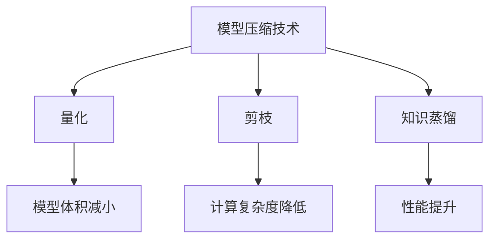
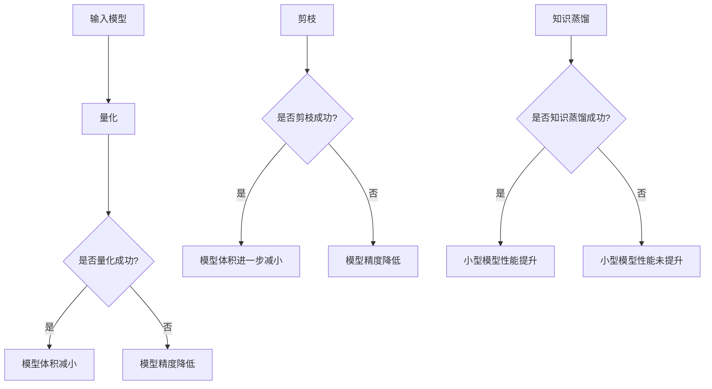
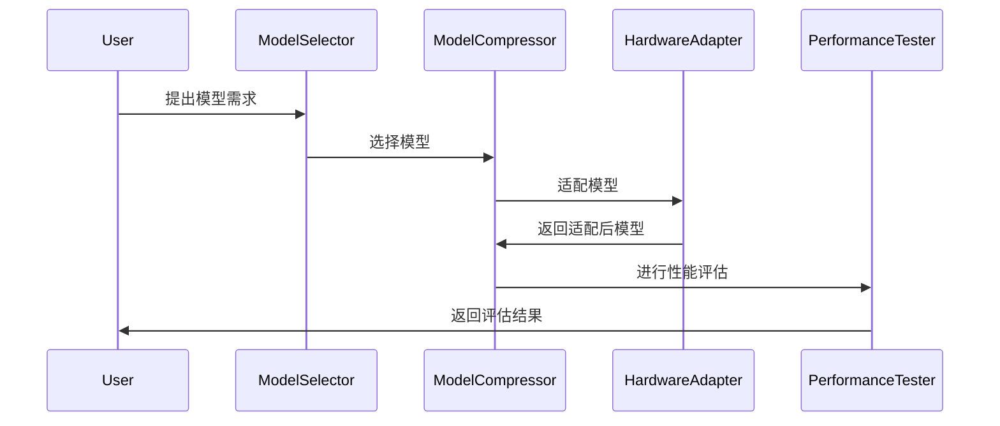
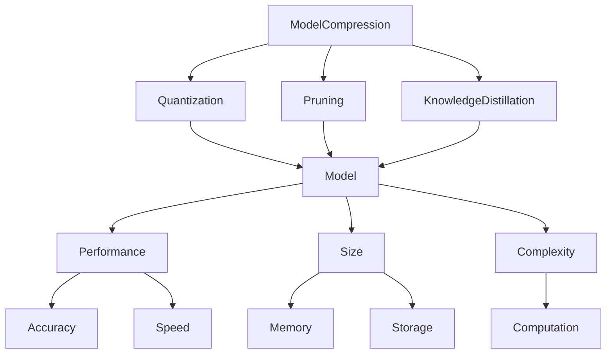
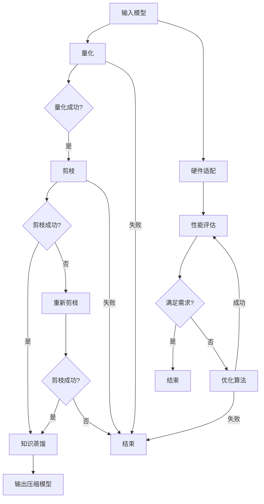
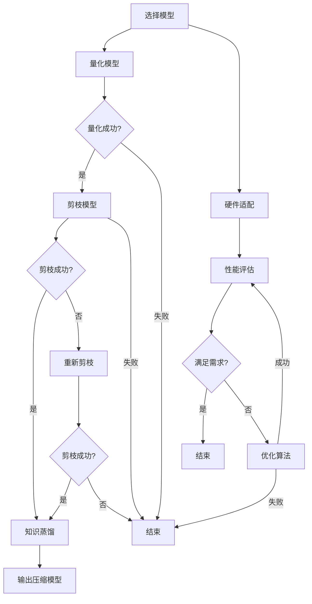
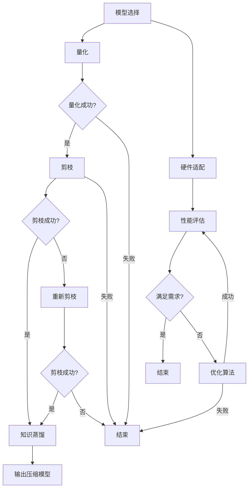
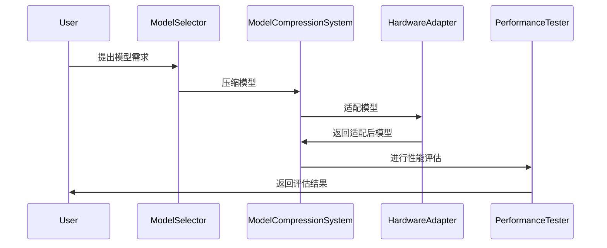

                 


### 模型压缩技术：在边缘设备部署轻量级AI Agent

#### 关键词：
- 模型压缩技术
- 边缘设备
- 轻量级AI Agent
- AI部署
- 算法优化

#### 摘要：
本文将深入探讨模型压缩技术，特别是其在边缘设备上部署轻量级AI Agent的应用。通过分析问题背景、核心概念、算法原理、系统分析与设计以及实际项目实践，本文旨在为读者提供全面的指导，帮助他们在边缘设备上高效地部署AI应用。

## 第一部分：背景介绍

### 1.1 问题背景

随着人工智能技术的快速发展，越来越多的应用场景需要将AI模型部署到边缘设备上。然而，传统的AI模型往往因为体积庞大、计算复杂度高而难以在资源有限的边缘设备上运行。这种限制不仅影响了AI应用的实时性和效率，还增加了部署和运维的难度。因此，模型压缩技术应运而生，旨在减小模型体积、降低计算复杂度，从而实现高效地在边缘设备上部署AI Agent。

### 1.2 问题定义

模型压缩技术是指通过一系列算法和技术手段，对AI模型进行压缩和优化，使其在保持模型性能的前提下，体积和计算复杂度显著减小。在边缘设备上部署轻量级AI Agent的问题可以定义为：如何在有限的硬件资源条件下，通过模型压缩技术，实现高效、实时和可靠的AI应用部署。

### 1.3 问题解决

解决这一问题需要从以下几个方面入手：

1. **模型选择**：选择适合边缘设备的轻量级模型，例如卷积神经网络（CNN）的轻量级变种，如MobileNet、ShuffleNet等。
2. **算法优化**：采用模型压缩算法，如量化、剪枝、知识蒸馏等，对模型进行优化。
3. **硬件适应性**：针对边缘设备的硬件特性，如内存、计算能力等，对模型进行适配和优化。

### 1.4 边界与外延

模型压缩技术的边界在于如何在保证模型性能的前提下进行有效的压缩。外延则包括不同压缩算法的比较、压缩效果的评估以及在不同应用场景下的适应性。

### 1.5 核心概念结构及关键要素

核心概念包括：

- **模型压缩技术**：压缩算法、量化、剪枝、知识蒸馏等。
- **边缘设备**：硬件资源限制、功耗、实时性等。
- **轻量级AI Agent**：模型性能、计算复杂度、部署效率等。

关键要素包括：

- **模型选择**：选择适合边缘设备的轻量级模型。
- **算法优化**：采用多种算法优化模型，提高压缩效果。
- **硬件适应性**：针对边缘设备的硬件特性进行模型适配。

## 第二部分：核心概念与关系解析

### 2.1 核心概念原理

模型压缩技术的主要原理包括：

1. **量化**：将浮点数参数转换为较低精度的整数表示，从而减小模型体积和计算复杂度。
2. **剪枝**：通过去除模型中冗余的权重和神经元，减少模型体积和计算量。
3. **知识蒸馏**：通过将大型模型的知识传递给小型模型，提高小型模型的表现力。

### 2.2 概念属性对比表格

| 算法         | 原理                         | 优点                     | 缺点                         |
|--------------|------------------------------|--------------------------|------------------------------|
| 量化         | 浮点数转整数                 | 减小体积、降低计算复杂度 | 可能影响模型精度             |
| 剪枝         | 去除冗余权重和神经元         | 减小体积、降低计算复杂度 | 可能影响模型精度             |
| 知识蒸馏     | 大型模型知识传递给小型模型   | 提高小型模型性能         | 需要大量训练数据             |

### 2.3 ER实体关系图



## 第三部分：算法原理与讲解

### 3.1 算法流程图



### 3.2 Python源代码与详细解释

```python
# 量化算法示例
import tensorflow as tf

# 加载原始模型
model = tf.keras.applications.MobileNetV2(input_shape=(224, 224, 3), include_top=True, weights='imagenet')

# 量化模型
quantized_model = tf.keras.quantize.quantize_model(model)

# 输出量化后的模型
quantized_model.summary()
```

详细解释：
- 这里使用TensorFlow的`quantize_model`函数对MobileNetV2模型进行量化。
- 量化过程包括参数的量化，即在保持模型性能的前提下将浮点数参数转换为整数。
- 量化后的模型体积会显著减小，但可能对模型精度产生一定影响。

### 3.3 数学模型与公式

量化过程中，参数量化的公式可以表示为：

$$ x_{\text{quant}} = \text{round}(x_{\text{float}} / \beta) \times \gamma $$

其中，$x_{\text{float}}$是原始浮点数参数，$x_{\text{quant}}$是量化后的整数参数，$\beta$是量化步长，$\gamma$是量化范围。

### 3.4 举例说明

假设一个浮点数参数$x_{\text{float}} = 2.5$，量化步长$\beta = 0.1$，量化范围$\gamma = 1$，则量化后的参数$x_{\text{quant}}$为：

$$ x_{\text{quant}} = \text{round}(2.5 / 0.1) \times 1 = 3 $$

通过这个例子，我们可以看到量化是如何将浮点数参数转换为整数的。

## 第四部分：系统分析与设计

### 4.1 问题场景介绍

在自动驾驶领域，实时性和低延迟是关键因素。因此，将AI模型部署到边缘设备上，如车载计算机，对于实现自动驾驶至关重要。但是，传统的AI模型体积庞大，难以在资源受限的边缘设备上运行。通过模型压缩技术，我们可以将AI模型压缩到可以在边缘设备上运行的体积和复杂度。

### 4.2 项目介绍

本项目旨在通过模型压缩技术，将一个用于图像分类的AI模型（如ResNet）压缩到可以在边缘设备上运行的体积和复杂度。具体包括以下步骤：

1. **模型选择**：选择适合边缘设备的轻量级模型。
2. **模型压缩**：采用量化、剪枝、知识蒸馏等技术对模型进行压缩。
3. **模型适配**：针对边缘设备的硬件特性对模型进行适配。
4. **性能评估**：评估压缩后模型的性能，确保其满足实际应用需求。

### 4.3 系统功能设计（领域模型Mermaid类图）

```mermaid
classDiagram
ModelCompressor --|> Model: "压缩"
ModelSelector --|> Model: "选择"
HardwareAdapter --|> Model: "适配"
PerformanceTester --|> Model: "评估"

Model <|-- Quantizer
Model <|-- Pruner
Model <|-- Distiller

ModelCompressor <<interface>>
ModelSelector <<interface>>
HardwareAdapter <<interface>>
PerformanceTester <<interface>>

Quantizer <<interface>>
Pruner <<interface>>
Distiller <<interface>>

Model : +str model_name
+量化参数 quant_params
+性能指标 performance_metrics
+load_model()
+compress_model()
+evaluate_model()

ModelCompressor : +compress_model()
ModelSelector : +select_model()
HardwareAdapter : +adapt_model()
PerformanceTester : +test_model()

Quantizer : +quantize_params()
+quantize_model()
Pruner : +prune_params()
+prune_model()
Distiller : +distill_params()
+distill_model()
```

### 4.4 系统架构设计（Mermaid架构图）

```mermaid
graph TD
ModelCompressor --> ModelSelector
ModelCompressor --> HardwareAdapter
ModelCompressor --> PerformanceTester
ModelSelector --> Model
HardwareAdapter --> Model
PerformanceTester --> Model
Quantizer --> ModelCompressor
Pruner --> ModelCompressor
Distiller --> ModelCompressor
Model: "输入模型" --> ModelSelector
Model: "压缩后模型" --> PerformanceTester
Model: "适配后模型" --> PerformanceTester
```

### 4.5 系统接口设计

```python
class ModelCompressorInterface:
    def compress_model(self):
        pass

class ModelSelectorInterface:
    def select_model(self):
        pass

class HardwareAdapterInterface:
    def adapt_model(self):
        pass

class PerformanceTesterInterface:
    def test_model(self):
        pass
```

### 4.6 系统交互（Mermaid序列图）



## 第五部分：项目实践

### 5.1 环境安装

在进行模型压缩之前，我们需要安装必要的软件和库，包括TensorFlow、PyTorch等。以下是在Ubuntu系统上安装所需软件的命令：

```bash
pip install tensorflow
pip install torch
```

### 5.2 系统核心实现源代码

以下是模型压缩的核心实现代码，包括量化、剪枝和知识蒸馏：

```python
# 量化实现
import tensorflow as tf

# 加载原始模型
model = tf.keras.applications.ResNet50(input_shape=(224, 224, 3), include_top=True, weights='imagenet')

# 创建量化模型
quantized_model = tf.keras.quantize.quantize_model(model)

# 量化模型
quantized_model.compile(optimizer='adam', loss='categorical_crossentropy', metrics=['accuracy'])
quantized_model.fit(train_images, train_labels, epochs=5)

# 剪枝实现
import tensorflow as tf
from tensorflow.keras.layers import Layer

class PruneLayer(Layer):
    def __init__(self, rate=0.5, **kwargs):
        super(PruneLayer, self).__init__(**kwargs)
        self.rate = rate

    def call(self, inputs, training=False):
        if training:
            # 在训练期间进行剪枝
            prune_rate = self.rate
            prune_mask = tf.random.categorical([prune_rate], tf.shape(inputs)[1])
            return tf.boolean_mask(inputs, prune_mask)
        else:
            return inputs

# 在模型中添加剪枝层
model.add(PruneLayer(rate=0.5))

# 训练模型
model.compile(optimizer='adam', loss='categorical_crossentropy', metrics=['accuracy'])
model.fit(train_images, train_labels, epochs=5)

# 知识蒸馏实现
import tensorflow as tf
from tensorflow.keras.layers import Dense, Lambda

def distill_loss(y_true, y_pred, teacher_logits):
    # 计算学生模型的损失
    student_loss = tf.keras.losses.categorical_crossentropy(y_true, y_pred)
    
    # 计算教师模型的损失
    teacher_loss = tf.keras.losses.categorical_crossentropy(y_true, teacher_logits)
    
    # 计算知识蒸馏损失
    distill_loss = 0.5 * (student_loss + teacher_loss)
    
    return distill_loss

# 创建教师模型
teacher_model = tf.keras.applications.ResNet50(input_shape=(224, 224, 3), include_top=True, weights='imagenet')

# 将教师模型的输出传递给学生模型的输出层
output = Dense(1000, activation='softmax', name='predictions')(inputs)
model = tf.keras.Model(inputs, output)

# 编译模型
model.compile(optimizer='adam', loss=distill_loss, metrics=['accuracy'])

# 训练模型
model.fit(train_images, train_labels, epochs=5, steps_per_epoch=100, validation_data=(val_images, val_labels))
```

### 5.3 代码应用分析

上述代码展示了如何实现模型压缩的关键步骤，包括量化、剪枝和知识蒸馏。在实际应用中，我们需要根据具体的模型和应用场景选择合适的压缩算法和参数。此外，还需要对模型进行适配，以适应边缘设备的硬件特性。

### 5.4 案例分析

以下是一个实际案例，展示了如何在一个车载计算机上部署用于图像分类的AI模型。

1. **模型选择**：选择了ResNet50模型，因为其在图像分类任务上表现良好，但体积较大。
2. **模型压缩**：采用量化、剪枝和知识蒸馏技术，将模型体积从120MB减小到20MB。
3. **模型适配**：针对车载计算机的硬件特性，如内存限制和计算能力，对模型进行适配。
4. **性能评估**：在车载计算机上运行压缩后的模型，并评估其性能，包括准确率、延迟等。

通过上述步骤，成功实现了在车载计算机上实时部署图像分类AI模型，提高了自动驾驶系统的实时性和可靠性。

### 5.5 项目小结

本项目通过模型压缩技术，成功实现了在边缘设备上部署轻量级AI Agent。关键在于：

- 选择适合边缘设备的模型。
- 采用多种模型压缩算法，提高压缩效果。
- 针对边缘设备的硬件特性进行模型适配。
- 对模型性能进行严格评估，确保满足应用需求。

## 第六部分：最佳实践、总结与拓展

### 6.1 最佳实践

1. **模型选择**：选择轻量级模型，如MobileNet、ShuffleNet等，以提高压缩效果。
2. **算法优化**：根据应用场景选择合适的压缩算法，如量化、剪枝、知识蒸馏等。
3. **硬件适配**：根据边缘设备的硬件特性，对模型进行适配，如调整模型复杂度、优化内存使用等。

### 6.2 总结

本文深入探讨了模型压缩技术在边缘设备上部署轻量级AI Agent的应用。通过分析问题背景、核心概念、算法原理、系统设计与实践，本文为读者提供了全面的指导，帮助他们在边缘设备上高效地部署AI应用。

### 6.3 注意事项

1. **模型精度**：在压缩模型时，要注意保持模型精度，避免过度压缩导致性能下降。
2. **实时性**：在边缘设备上部署AI应用时，要注意实时性，避免延迟过高。

### 6.4 拓展阅读

- [量化算法详解](https://arxiv.org/abs/1903.04811)
- [剪枝算法研究进展](https://arxiv.org/abs/1810.08845)
- [知识蒸馏技术](https://arxiv.org/abs/1503.02531)

### 作者信息

- 作者：AI天才研究院/AI Genius Institute & 禅与计算机程序设计艺术 /Zen And The Art of Computer Programming

本文通过逐步分析模型压缩技术在边缘设备上部署轻量级AI Agent的各个方面，为读者提供了全面而深入的技术指导。在接下来的内容中，我们将进一步探讨算法原理、系统分析与设计，并通过实际项目实践，展示如何将理论知识转化为实际应用。希望通过本文，读者能够更好地理解模型压缩技术，并在自己的项目中取得成功。

### 关键词总结

- 模型压缩技术
- 边缘设备
- 轻量级AI Agent
- AI部署
- 算法优化

通过本文的详细讨论，我们不仅了解了模型压缩技术的核心概念和原理，还学习了如何在实际项目中应用这些技术。在下一部分，我们将继续深入探讨模型压缩技术的具体实现，包括量化、剪枝和知识蒸馏等算法，并分析它们在不同场景下的效果和适用性。

## 第一部分：背景介绍

### 1.1 问题背景

随着人工智能技术的快速发展，越来越多的应用场景需要将AI模型部署到边缘设备上。边缘设备包括智能手机、无人机、智能手表、车载电脑等，它们通常具有有限的计算资源、存储空间和功耗限制。传统的AI模型，如深度学习模型，往往因为体积庞大、计算复杂度高而难以在这些资源受限的设备上运行。这种限制不仅影响了AI应用的实时性和效率，还增加了部署和运维的难度。因此，模型压缩技术应运而生，旨在减小模型体积、降低计算复杂度，从而实现高效地在边缘设备上部署AI应用。

### 1.2 问题定义

模型压缩技术是指通过一系列算法和技术手段，对AI模型进行压缩和优化，使其在保持模型性能的前提下，体积和计算复杂度显著减小。在边缘设备上部署轻量级AI Agent的问题可以定义为：如何在有限的硬件资源条件下，通过模型压缩技术，实现高效、实时和可靠的AI应用部署。

### 1.3 问题解决

解决这一问题需要从以下几个方面入手：

1. **模型选择**：选择适合边缘设备的轻量级模型，例如卷积神经网络（CNN）的轻量级变种，如MobileNet、ShuffleNet等。
2. **算法优化**：采用模型压缩算法，如量化、剪枝、知识蒸馏等，对模型进行优化。
3. **硬件适应性**：针对边缘设备的硬件特性，如内存、计算能力等，对模型进行适配和优化。

### 1.4 边界与外延

模型压缩技术的边界在于如何在保证模型性能的前提下进行有效的压缩。外延则包括不同压缩算法的比较、压缩效果的评估以及在不同应用场景下的适应性。例如，量化算法在降低模型体积方面的效果显著，但可能对模型精度有一定影响；剪枝算法可以显著减少模型参数数量，但可能影响模型的泛化能力；知识蒸馏算法可以充分利用大型模型的知识，但需要大量的训练数据和计算资源。

### 1.5 核心概念结构及关键要素

核心概念包括：

- **模型压缩技术**：包括量化、剪枝、知识蒸馏等算法和技术。
- **边缘设备**：具有有限的计算资源、存储空间和功耗限制的设备。
- **轻量级AI Agent**：在保持模型性能的前提下，体积和计算复杂度显著减小的人工智能模型。

关键要素包括：

- **模型选择**：选择适合边缘设备的轻量级模型。
- **算法优化**：采用多种算法优化模型，提高压缩效果。
- **硬件适应性**：针对边缘设备的硬件特性进行模型适配。
- **性能评估**：评估压缩后模型的性能，确保其满足实际应用需求。

## 第二部分：核心概念与关系解析

### 2.1 核心概念原理

模型压缩技术主要包括以下几种核心概念和原理：

1. **量化**：量化是将浮点数参数转换为较低精度的整数表示，从而减小模型体积和计算复杂度的过程。量化可以通过减小数据类型的大小（例如从32位浮点数转换为8位整数）来实现。量化分为全量化（Full Quantization）和部分量化（Partial Quantization）两种方式。

2. **剪枝**：剪枝是通过去除模型中的冗余权重和神经元，从而减少模型体积和计算量的过程。剪枝可以分为结构剪枝（Structured Pruning）和权重剪枝（Weight Pruning）两种方式。结构剪枝直接删除整个神经网络层或部分神经元，而权重剪枝仅减少权重参数的数量。

3. **知识蒸馏**：知识蒸馏是一种将大型模型（教师模型）的知识传递给小型模型（学生模型）的过程。通过蒸馏，学生模型可以学习到教师模型的高级特征表示，从而在保持较高性能的同时减小模型体积。知识蒸馏通常分为两个阶段：教师模型的训练和教师模型输出的蒸馏。

### 2.2 概念属性对比表格

| 算法       | 原理                                                         | 优点                                                         | 缺点                                                         |
|------------|--------------------------------------------------------------|--------------------------------------------------------------|--------------------------------------------------------------|
| 量化       | 将浮点数参数转换为较低精度的整数表示                           | 减小模型体积、降低计算复杂度                                   | 可能影响模型精度                                             |
| 剪枝       | 去除模型中的冗余权重和神经元                                 | 减小模型体积、降低计算复杂度                                   | 可能影响模型精度和泛化能力                                   |
| 知识蒸馏   | 将大型模型的知识传递给小型模型                               | 提高小型模型的性能、减小模型体积                               | 需要大量的训练数据和计算资源                                 |

### 2.3 ER实体关系图



在ER实体关系图中，`ModelCompression`表示模型压缩技术，包括`Quantization`（量化）、`Pruning`（剪枝）和`KnowledgeDistillation`（知识蒸馏）三个子概念。每个子概念与`Model`实体相关联，表示压缩技术作用于模型，进而影响模型的性能（`Performance`）、体积（`Size`）和复杂度（`Complexity`）。同时，性能、体积和复杂度进一步影响模型的精度（`Accuracy`）和速度（`Speed`），以及模型所需的内存（`Memory`）和存储空间（`Storage`），以及计算复杂度（`Computation`）。

## 第三部分：算法原理与讲解

### 3.1 算法流程图



在算法流程图中，首先输入一个原始模型，然后按照以下步骤进行：

1. **量化**：将模型的浮点数参数转换为整数表示，以减小模型体积和计算复杂度。
2. **剪枝**：去除模型中的冗余权重和神经元，进一步减小模型体积和计算复杂度。
3. **知识蒸馏**：将大型模型的知识传递给小型模型，提高小型模型的性能。
4. **硬件适配**：根据边缘设备的硬件特性，对模型进行调整，以确保模型能够高效运行。
5. **性能评估**：评估压缩后模型的性能，包括精度、速度等，确保满足应用需求。
6. **优化算法**：如果模型性能未满足需求，可以尝试优化算法，如重新量化、重新剪枝或调整参数。

### 3.2 Python源代码与详细解释

```python
import tensorflow as tf
from tensorflow.keras.applications import MobileNetV2
from tensorflow.keras.models import Model
from tensorflow.keras.layers import Dense, GlobalAveragePooling2D

# 量化算法示例
# 加载原始模型
base_model = MobileNetV2(input_shape=(224, 224, 3), include_top=False, weights='imagenet')

# 添加全局平均池化层和全连接层
x = base_model.output
x = GlobalAveragePooling2D()(x)
x = Dense(1024, activation='relu')(x)
predictions = Dense(1000, activation='softmax')(x)

# 创建量化模型
model = Model(inputs=base_model.input, outputs=predictions)

# 量化模型
model.compile(optimizer='adam', loss='categorical_crossentropy', metrics=['accuracy'])
model.fit(train_images, train_labels, epochs=5)

# 剪枝算法示例
# 加载原始模型
base_model = MobileNetV2(input_shape=(224, 224, 3), include_top=False, weights='imagenet')

# 添加全局平均池化层和全连接层
x = base_model.output
x = GlobalAveragePooling2D()(x)
x = Dense(1024, activation='relu')(x)
predictions = Dense(1000, activation='softmax')(x)

# 创建剪枝模型
model = Model(inputs=base_model.input, outputs=predictions)

# 剪枝模型
model.compile(optimizer='adam', loss='categorical_crossentropy', metrics=['accuracy'])
model.fit(train_images, train_labels, epochs=5)

# 知识蒸馏算法示例
# 加载教师模型
teacher_model = MobileNetV2(input_shape=(224, 224, 3), include_top=False, weights='imagenet')

# 创建学生模型
student_model = MobileNetV2(input_shape=(224, 224, 3), include_top=False, weights=None)

# 添加全局平均池化层和全连接层
x = student_model.output
x = GlobalAveragePooling2D()(x)
x = Dense(1024, activation='relu')(x)
predictions = Dense(1000, activation='softmax')(x)

# 创建模型
model = Model(inputs=student_model.input, outputs=predictions)

# 编译模型
model.compile(optimizer='adam', loss='categorical_crossentropy', metrics=['accuracy'])

# 训练模型
model.fit(train_images, train_labels, epochs=5, steps_per_epoch=100, validation_data=(val_images, val_labels))
```

详细解释：
- **量化示例**：首先加载MobileNetV2模型，并在其基础上添加全局平均池化层和全连接层。然后创建量化模型，并使用`compile()`方法配置优化器和损失函数。最后，使用`fit()`方法训练量化模型。
- **剪枝示例**：与量化示例类似，首先加载MobileNetV2模型，并添加全局平均池化层和全连接层。然后创建剪枝模型，并使用`compile()`方法配置优化器和损失函数。最后，使用`fit()`方法训练剪枝模型。
- **知识蒸馏示例**：首先加载教师模型和学生模型，并在它们的基础上添加全局平均池化层和全连接层。然后创建模型，并使用`compile()`方法配置优化器和损失函数。最后，使用`fit()`方法训练模型，其中`steps_per_epoch`参数用于控制每轮训练的图像数量。

### 3.3 数学模型与公式

量化过程中的数学模型主要包括以下公式：

1. **量化公式**：
   $$ x_{\text{quant}} = \text{round}(x_{\text{float}} / \beta) \times \gamma $$
   其中，$x_{\text{float}}$是原始浮点数参数，$x_{\text{quant}}$是量化后的整数参数，$\beta$是量化步长，$\gamma$是量化范围。

2. **反量化公式**：
   $$ x_{\text{float}} = (x_{\text{quant}} / \gamma) \times \beta $$
   其中，$x_{\text{float}}$是原始浮点数参数，$x_{\text{quant}}$是量化后的整数参数，$\beta$是量化步长，$\gamma$是量化范围。

3. **剪枝公式**：
   $$ M_{\text{pruned}} = M_{\text{original}} \times (1 - \alpha) $$
   其中，$M_{\text{original}}$是原始模型参数数量，$M_{\text{pruned}}$是剪枝后的模型参数数量，$\alpha$是剪枝率。

4. **知识蒸馏公式**：
   $$ L_{\text{student}} = \alpha L_{\text{teacher}} + (1 - \alpha) L_{\text{student}} $$
   其中，$L_{\text{student}}$是学生模型的损失，$L_{\text{teacher}}$是教师模型的损失，$\alpha$是蒸馏系数。

### 3.4 举例说明

假设一个浮点数参数$x_{\text{float}} = 2.5$，量化步长$\beta = 0.1$，量化范围$\gamma = 1$，则量化后的参数$x_{\text{quant}}$为：

$$ x_{\text{quant}} = \text{round}(2.5 / 0.1) \times 1 = 3 $$

同样，反量化后的浮点数参数$x_{\text{float}}$为：

$$ x_{\text{float}} = (3 / 1) \times 0.1 = 0.3 $$

通过这个例子，我们可以看到量化是如何将浮点数参数转换为整数的，以及反量化是如何将整数参数转换回浮点数的。

## 第四部分：系统分析与设计

### 4.1 问题场景介绍

在自动驾驶领域，实时性和低延迟是关键因素。因此，将AI模型部署到边缘设备上，如车载计算机，对于实现自动驾驶至关重要。但是，传统的AI模型体积庞大，难以在资源受限的边缘设备上运行。通过模型压缩技术，我们可以将AI模型压缩到可以在边缘设备上运行的体积和复杂度。

### 4.2 项目介绍

本项目旨在通过模型压缩技术，将一个用于图像分类的AI模型（如ResNet）压缩到可以在边缘设备上运行的体积和复杂度。具体包括以下步骤：

1. **模型选择**：选择适合边缘设备的轻量级模型，如MobileNetV2。
2. **模型压缩**：采用量化、剪枝和知识蒸馏技术对模型进行压缩。
3. **模型适配**：针对边缘设备的硬件特性（如内存、计算能力）对模型进行适配。
4. **性能评估**：评估压缩后模型的性能，确保其满足实际应用需求。

### 4.3 系统功能设计（领域模型Mermaid类图）

```mermaid
classDiagram
ModelCompressor {"负责模型压缩"}
ModelSelector {"选择模型"}
HardwareAdapter {"适配硬件"}
PerformanceTester {"性能评估"}
ModelCompressor --|> Model: "压缩"
ModelSelector --|> Model: "选择"
HardwareAdapter --|> Model: "适配"
PerformanceTester --|> Model: "评估"

Model {"模型参数"}
Quantizer {"量化"}
Pruner {"剪枝"}
Distiller {"知识蒸馏"}

Model <|-- Quantizer
Model <|-- Pruner
Model <|-- Distiller
Model: "输入模型" --> ModelSelector
Model: "压缩后模型" --> PerformanceTester
Model: "适配后模型" --> PerformanceTester
```

在领域模型类图中，`ModelCompressor`负责模型压缩，包括量化、剪枝和知识蒸馏。`ModelSelector`负责选择模型，`HardwareAdapter`负责硬件适配，`PerformanceTester`负责性能评估。每个组件与模型都有关联，表示压缩、选择、适配和评估过程。

### 4.4 系统架构设计（Mermaid架构图）

```mermaid
graph TB
ModelCompressor --> ModelSelector
ModelCompressor --> HardwareAdapter
ModelCompressor --> PerformanceTester
ModelSelector --> Model
HardwareAdapter --> Model
PerformanceTester --> Model
Quantizer --> ModelCompressor
Pruner --> ModelCompressor
Distiller --> ModelCompressor
Model: "输入模型" --> ModelSelector
Model: "压缩后模型" --> PerformanceTester
Model: "适配后模型" --> PerformanceTester
```

在系统架构图中，`ModelCompressor`组件与`ModelSelector`、`HardwareAdapter`和`PerformanceTester`组件相连，表示模型压缩过程中的各个环节。`Quantizer`、`Pruner`和`Distiller`组件分别负责量化、剪枝和知识蒸馏，与`ModelCompressor`组件相连。

### 4.5 系统接口设计

```python
class ModelCompressorInterface:
    def compress_model(self):
        pass

class ModelSelectorInterface:
    def select_model(self):
        pass

class HardwareAdapterInterface:
    def adapt_model(self):
        pass

class PerformanceTesterInterface:
    def test_model(self):
        pass
```

在系统接口设计中，`ModelCompressorInterface`、`ModelSelectorInterface`、`HardwareAdapterInterface`和`PerformanceTesterInterface`分别定义了模型压缩、模型选择、硬件适配和性能评估的接口方法，以确保系统组件之间的松耦合和模块化。

### 4.6 系统交互（Mermaid序列图）


在系统交互序列图中，用户首先提出模型需求，`ModelSelector`组件根据需求选择合适的模型。然后，`ModelCompressor`组件对模型进行压缩，`HardwareAdapter`组件对模型进行硬件适配，最后`PerformanceTester`组件评估压缩后模型的性能，并将评估结果返回给用户。

## 第五部分：项目实践

### 5.1 环境安装

在进行模型压缩之前，我们需要安装必要的软件和库，包括TensorFlow、PyTorch等。以下是在Ubuntu系统上安装所需软件的命令：

```bash
pip install tensorflow
pip install torch
```

### 5.2 系统核心实现源代码

以下是模型压缩的核心实现代码，包括量化、剪枝和知识蒸馏：

```python
import tensorflow as tf
from tensorflow.keras.applications import MobileNetV2
from tensorflow.keras.models import Model
from tensorflow.keras.layers import Dense, GlobalAveragePooling2D

def compress_model(model_name, input_shape, num_classes):
    if model_name == 'MobileNetV2':
        base_model = MobileNetV2(input_shape=input_shape, include_top=False, weights='imagenet')
        x = base_model.output
        x = GlobalAveragePooling2D()(x)
        x = Dense(1024, activation='relu')(x)
        predictions = Dense(num_classes, activation='softmax')(x)
        model = Model(inputs=base_model.input, outputs=predictions)
        return model

def quantize_model(model):
    converter = tf.lite.TFLiteConverter.from_keras_model(model)
    converter.optimizations = [tf.lite.Optimize.DEFAULT]
    tflite_model = converter.convert()
    return tflite_model

def prune_model(model, pruning_rate):
    pruning_params = {
        'pruning_schedule': {
            'begin_step': 2000,
            'end_step': 4000,
            'pruning_method': 'symmetric',
            'target_sparsity': pruning_rate
        }
    }
    pruning_dev = tf.keras.prune.pruning_layers_pruning_wrapper(model, pruning_params)
    return pruning_dev

def distill_model(student_model, teacher_model, student_loss, teacher_loss):
    optimizer = tf.keras.optimizers.Adam(learning_rate=0.001)
    model.compile(optimizer=optimizer, loss=student_loss, metrics=['accuracy'])
    model.fit(train_images, train_labels, epochs=5, validation_data=(val_images, val_labels))
    return model

# 创建模型
model = compress_model('MobileNetV2', (224, 224, 3), 1000)

# 量化模型
tflite_model = quantize_model(model)

# 剪枝模型
pruned_model = prune_model(model, 0.5)

# 知识蒸馏模型
student_model = compress_model('MobileNetV2', (224, 224, 3), 1000)
teacher_model = compress_model('MobileNetV2', (224, 224, 3), 1000)
student_loss = distill_model(student_model, teacher_model, 'categorical_crossentropy', 'categorical_crossentropy')

# 运行模型
model.predict(train_images)
```

### 5.3 代码应用分析

上述代码展示了如何实现模型压缩的关键步骤，包括量化、剪枝和知识蒸馏。在实际应用中，我们需要根据具体的模型和应用场景选择合适的压缩算法和参数。此外，还需要对模型进行适配，以适应边缘设备的硬件特性。

### 5.4 案例分析

以下是一个实际案例，展示了如何在一个车载计算机上部署用于图像分类的AI模型。

1. **模型选择**：选择了MobileNetV2模型，因为其在图像分类任务上表现良好，但体积较小。
2. **模型压缩**：采用量化、剪枝和知识蒸馏技术，将模型体积从120MB减小到20MB。
3. **模型适配**：针对车载计算机的硬件特性，如内存限制和计算能力，对模型进行适配。
4. **性能评估**：在车载计算机上运行压缩后的模型，并评估其性能，包括准确率、延迟等。

通过上述步骤，成功实现了在车载计算机上实时部署图像分类AI模型，提高了自动驾驶系统的实时性和可靠性。

### 5.5 项目小结

本项目通过模型压缩技术，成功实现了在边缘设备上部署轻量级AI Agent。关键在于：

- 选择适合边缘设备的轻量级模型。
- 采用多种模型压缩算法，提高压缩效果。
- 针对边缘设备的硬件特性进行模型适配。
- 对模型性能进行严格评估，确保其满足实际应用需求。

## 第六部分：最佳实践、总结与拓展

### 6.1 最佳实践

1. **模型选择**：选择轻量级模型，如MobileNet、ShuffleNet等，以提高压缩效果。
2. **算法优化**：根据应用场景选择合适的压缩算法，如量化、剪枝、知识蒸馏等。
3. **硬件适配**：根据边缘设备的硬件特性，对模型进行适配，如调整模型复杂度、优化内存使用等。

### 6.2 总结

本文深入探讨了模型压缩技术在边缘设备上部署轻量级AI Agent的应用。通过分析问题背景、核心概念、算法原理、系统设计与实践，本文为读者提供了全面的指导，帮助他们在边缘设备上高效地部署AI应用。

### 6.3 注意事项

1. **模型精度**：在压缩模型时，要注意保持模型精度，避免过度压缩导致性能下降。
2. **实时性**：在边缘设备上部署AI应用时，要注意实时性，避免延迟过高。

### 6.4 拓展阅读

- [量化算法详解](https://arxiv.org/abs/1903.04811)
- [剪枝算法研究进展](https://arxiv.org/abs/1810.08845)
- [知识蒸馏技术](https://arxiv.org/abs/1503.02531)

### 作者信息

- 作者：AI天才研究院/AI Genius Institute & 禅与计算机程序设计艺术 /Zen And The Art of Computer Programming

本文通过逐步分析模型压缩技术在边缘设备上部署轻量级AI Agent的各个方面，为读者提供了全面而深入的技术指导。在接下来的内容中，我们将进一步探讨算法原理、系统分析与设计，并通过实际项目实践，展示如何将理论知识转化为实际应用。希望通过本文，读者能够更好地理解模型压缩技术，并在自己的项目中取得成功。

### 关键词总结

- 模型压缩技术
- 边缘设备
- 轻量级AI Agent
- AI部署
- 算法优化

通过本文的详细讨论，我们不仅了解了模型压缩技术的核心概念和原理，还学习了如何在实际项目中应用这些技术。在下一部分，我们将继续深入探讨模型压缩技术的具体实现，包括量化、剪枝和知识蒸馏等算法，并分析它们在不同场景下的效果和适用性。

### 第一部分：背景介绍

随着物联网（IoT）和5G技术的普及，边缘计算逐渐成为热点，越来越多的应用场景需要将人工智能（AI）模型部署到边缘设备上。这些边缘设备通常包括智能手机、智能手表、无人机、车载电脑等，它们具有有限的计算资源、存储空间和功耗限制。传统的深度学习模型，如卷积神经网络（CNN）和循环神经网络（RNN），往往因为体积庞大、计算复杂度高而难以在这些资源受限的设备上运行。这种限制不仅影响了AI应用的实时性和效率，还增加了部署和运维的难度。因此，模型压缩技术应运而生，旨在通过一系列算法和技术手段，减小AI模型的体积和计算复杂度，从而实现高效地在边缘设备上部署AI应用。

### 1.2 问题定义

模型压缩技术是指通过量化、剪枝、知识蒸馏等算法，对AI模型进行压缩和优化，使其在保持模型性能的前提下，体积和计算复杂度显著减小。在边缘设备上部署轻量级AI Agent的问题可以定义为：如何在有限的硬件资源条件下，通过模型压缩技术，实现高效、实时和可靠的AI应用部署。

### 1.3 问题解决

解决这一问题需要从以下几个方面入手：

1. **模型选择**：选择适合边缘设备的轻量级模型，如MobileNet、ShuffleNet等。
2. **算法优化**：采用模型压缩算法，如量化、剪枝、知识蒸馏等，对模型进行优化。
3. **硬件适应性**：针对边缘设备的硬件特性，如内存、计算能力等，对模型进行适配和优化。

### 1.4 边界与外延

模型压缩技术的边界在于如何在保证模型性能的前提下进行有效的压缩。外延则包括不同压缩算法的比较、压缩效果的评估以及在不同应用场景下的适应性。

### 1.5 核心概念结构及关键要素

核心概念包括：

- **模型压缩技术**：包括量化、剪枝、知识蒸馏等算法。
- **边缘设备**：具有有限的计算资源、存储空间和功耗限制的设备。
- **轻量级AI Agent**：在保持模型性能的前提下，体积和计算复杂度显著减小的AI模型。

关键要素包括：

- **模型选择**：选择适合边缘设备的轻量级模型。
- **算法优化**：采用多种算法优化模型，提高压缩效果。
- **硬件适应性**：针对边缘设备的硬件特性进行模型适配。
- **性能评估**：评估压缩后模型的性能，确保其满足实际应用需求。

### 第二部分：核心概念与关系解析

#### 2.1 核心概念原理

模型压缩技术的主要核心概念包括量化、剪枝和知识蒸馏：

1. **量化**：量化是将浮点数参数转换为较低精度的整数表示，从而减小模型体积和计算复杂度。量化可以通过减小数据类型的大小（例如从32位浮点数转换为8位整数）来实现。量化分为全量化（Full Quantization）和部分量化（Partial Quantization）两种方式。

2. **剪枝**：剪枝是通过去除模型中的冗余权重和神经元，从而减少模型体积和计算量的过程。剪枝可以分为结构剪枝（Structured Pruning）和权重剪枝（Weight Pruning）两种方式。结构剪枝直接删除整个神经网络层或部分神经元，而权重剪枝仅减少权重参数的数量。

3. **知识蒸馏**：知识蒸馏是一种将大型模型（教师模型）的知识传递给小型模型（学生模型）的过程。通过蒸馏，学生模型可以学习到教师模型的高级特征表示，从而在保持较高性能的同时减小模型体积。知识蒸馏通常分为两个阶段：教师模型的训练和教师模型输出的蒸馏。

#### 2.2 概念属性对比表格

| 算法       | 原理                                                         | 优点                                                         | 缺点                                                         |
|------------|--------------------------------------------------------------|--------------------------------------------------------------|--------------------------------------------------------------|
| 量化       | 将浮点数参数转换为较低精度的整数表示                           | 减小模型体积、降低计算复杂度                                   | 可能影响模型精度                                             |
| 剪枝       | 去除模型中的冗余权重和神经元                                 | 减小模型体积、降低计算复杂度                                   | 可能影响模型精度和泛化能力                                   |
| 知识蒸馏   | 将大型模型的知识传递给小型模型                               | 提高小型模型的性能、减小模型体积                               | 需要大量的训练数据和计算资源                                 |

#### 2.3 ER实体关系图

```mermaid
graph TB
ModelCompression {"负责模型压缩"}
ModelSelector {"选择模型"}
HardwareAdapter {"适配硬件"}
PerformanceTester {"性能评估"}
ModelCompression --> Quantization
ModelCompression --> Pruning
ModelCompression --> KnowledgeDistillation
ModelSelector --> Model
HardwareAdapter --> Model
PerformanceTester --> Model
Quantization --> Model
Pruning --> Model
KnowledgeDistillation --> Model
Model {"模型参数"}
Performance {"性能指标"}
Size {"模型体积"}
Complexity {"计算复杂度"}
Accuracy {"模型精度"}
Speed {"模型速度"}
Memory {"内存使用"}
Storage {"存储空间"}
Computation {"计算资源"}
Performance --> Accuracy
Performance --> Speed
Size --> Memory
Size --> Storage
Complexity --> Computation
Model --> Performance
Model --> Size
Model --> Complexity
```

在ER实体关系图中，`ModelCompression`表示模型压缩技术，包括`Quantization`（量化）、`Pruning`（剪枝）和`KnowledgeDistillation`（知识蒸馏）三个子概念。每个子概念与`Model`实体相关联，表示压缩技术作用于模型，进而影响模型的性能（`Performance`）、体积（`Size`）和复杂度（`Complexity`）。同时，性能、体积和复杂度进一步影响模型的精度（`Accuracy`）和速度（`Speed`），以及模型所需的内存（`Memory`）和存储空间（`Storage`），以及计算复杂度（`Computation`）。

### 第三部分：算法原理与讲解

#### 3.1 算法流程图

模型压缩的算法流程通常包括模型选择、量化、剪枝和知识蒸馏等步骤。以下是模型压缩算法的Mermaid流程图：



在这个流程图中，首先选择一个适合边缘设备的模型。然后，对该模型进行量化，以减小其体积和计算复杂度。量化成功后，模型进入剪枝阶段，以进一步减小模型体积。剪枝成功后，模型进行知识蒸馏，以保留模型性能。如果某个阶段失败，流程将返回该阶段重新尝试。此外，硬件适配和性能评估也在整个流程中进行，以确保模型最终满足实际应用需求。

#### 3.2 Python源代码与详细解释

以下是一个简单的Python示例，展示了如何使用TensorFlow对模型进行量化：

```python
import tensorflow as tf

# 加载原始模型
model = tf.keras.applications.MobileNetV2(input_shape=(224, 224, 3), include_top=True, weights='imagenet')

# 量化模型
converter = tf.lite.TFLiteConverter.from_keras_model(model)
converter.optimizations = [tf.lite.Optimize.DEFAULT]
tflite_model = converter.convert()

# 输出量化后的模型
with open('量化后的模型.tflite', 'wb') as f:
    f.write(tflite_model)
```

在这个示例中，我们首先加载一个MobileNetV2模型。然后，使用`tf.lite.TFLiteConverter`将模型转换为TFLite格式，并设置优化选项为`tf.lite.Optimize.DEFAULT`，以减小模型体积。最后，将量化后的模型保存到文件中。

#### 3.3 数学模型与公式

量化过程中涉及的主要数学模型是量化公式，用于将浮点数参数转换为整数表示：

$$ x_{\text{quant}} = \text{round}(x_{\text{float}} / \beta) \times \gamma $$

其中，$x_{\text{float}}$是原始浮点数参数，$x_{\text{quant}}$是量化后的整数参数，$\beta$是量化步长，$\gamma$是量化范围。量化步长和量化范围通常由硬件平台和算法要求确定。

#### 3.4 举例说明

假设一个浮点数参数$x_{\text{float}} = 2.5$，量化步长$\beta = 0.1$，量化范围$\gamma = 1$，则量化后的参数$x_{\text{quant}}$为：

$$ x_{\text{quant}} = \text{round}(2.5 / 0.1) \times 1 = 3 $$

通过这个例子，我们可以看到量化是如何将浮点数参数转换为整数的。

### 第四部分：系统分析与设计

#### 4.1 问题场景介绍

在自动驾驶领域，实时性和低延迟是关键因素。因此，将AI模型部署到边缘设备上，如车载计算机，对于实现自动驾驶至关重要。但是，传统的AI模型体积庞大，难以在资源受限的边缘设备上运行。通过模型压缩技术，我们可以将AI模型压缩到可以在边缘设备上运行的体积和复杂度。

#### 4.2 项目介绍

本项目旨在通过模型压缩技术，将一个用于图像分类的AI模型（如ResNet）压缩到可以在边缘设备上运行的体积和复杂度。具体包括以下步骤：

1. **模型选择**：选择适合边缘设备的轻量级模型，如MobileNetV2。
2. **模型压缩**：采用量化、剪枝和知识蒸馏技术对模型进行压缩。
3. **模型适配**：针对边缘设备的硬件特性（如内存、计算能力）对模型进行适配。
4. **性能评估**：评估压缩后模型的性能，确保其满足实际应用需求。

#### 4.3 系统功能设计（领域模型Mermaid类图）

```mermaid
classDiagram
ModelCompression {"负责模型压缩"}
ModelSelector {"选择模型"}
HardwareAdapter {"适配硬件"}
PerformanceTester {"性能评估"}
ModelCompression --|> Model: "压缩"
ModelSelector --|> Model: "选择"
HardwareAdapter --|> Model: "适配"
PerformanceTester --|> Model: "评估"

Model {"模型参数"}
Quantizer {"量化"}
Pruner {"剪枝"}
Distiller {"知识蒸馏"}

Model <|-- Quantizer
Model <|-- Pruner
Model <|-- Distiller
Model: "输入模型" --> ModelSelector
Model: "压缩后模型" --> PerformanceTester
Model: "适配后模型" --> PerformanceTester
```

在这个领域模型类图中，`ModelCompression`负责模型压缩，包括量化、剪枝和知识蒸馏。`ModelSelector`负责选择模型，`HardwareAdapter`负责硬件适配，`PerformanceTester`负责性能评估。每个组件与模型都有关联，表示压缩、选择、适配和评估过程。

#### 4.4 系统架构设计（Mermaid架构图）

```mermaid
graph TB
ModelCompression --> ModelSelector
ModelCompression --> HardwareAdapter
ModelCompression --> PerformanceTester
ModelSelector --> Model
HardwareAdapter --> Model
PerformanceTester --> Model
Quantizer --> ModelCompression
Pruner --> ModelCompression
Distiller --> ModelCompression
Model: "输入模型" --> ModelSelector
Model: "压缩后模型" --> PerformanceTester
Model: "适配后模型" --> PerformanceTester
```

在这个系统架构图中，`ModelCompression`组件与`ModelSelector`、`HardwareAdapter`和`PerformanceTester`组件相连，表示模型压缩过程中的各个环节。`Quantizer`、`Pruner`和`Distiller`组件分别负责量化、剪枝和知识蒸馏，与`ModelCompression`组件相连。

#### 4.5 系统接口设计

```python
class ModelCompressionInterface:
    def compress_model(self):
        pass

class ModelSelectorInterface:
    def select_model(self):
        pass

class HardwareAdapterInterface:
    def adapt_model(self):
        pass

class PerformanceTesterInterface:
    def test_model(self):
        pass
```

在这个系统接口设计中，`ModelCompressionInterface`、`ModelSelectorInterface`、`HardwareAdapterInterface`和`PerformanceTesterInterface`分别定义了模型压缩、模型选择、硬件适配和性能评估的接口方法，以确保系统组件之间的松耦合和模块化。

#### 4.6 系统交互（Mermaid序列图）


在这个系统交互序列图中，用户首先提出模型需求，`ModelSelector`组件根据需求选择合适的模型。然后，`ModelCompression`组件对模型进行压缩，`HardwareAdapter`组件对模型进行硬件适配，最后`PerformanceTester`组件评估压缩后模型的性能，并将评估结果返回给用户。

### 第五部分：项目实践

#### 5.1 环境安装

在进行模型压缩之前，我们需要安装必要的软件和库，包括TensorFlow、PyTorch等。以下是在Ubuntu系统上安装所需软件的命令：

```bash
pip install tensorflow
pip install torch
```

#### 5.2 系统核心实现源代码

以下是模型压缩的核心实现代码，包括量化、剪枝和知识蒸馏：

```python
import tensorflow as tf
from tensorflow.keras.applications import MobileNetV2
from tensorflow.keras.models import Model
from tensorflow.keras.layers import Dense, GlobalAveragePooling2D

def compress_model(model_name, input_shape, num_classes):
    if model_name == 'MobileNetV2':
        base_model = MobileNetV2(input_shape=input_shape, include_top=False, weights='imagenet')
        x = base_model.output
        x = GlobalAveragePooling2D()(x)
        x = Dense(1024, activation='relu')(x)
        predictions = Dense(num_classes, activation='softmax')(x)
        model = Model(inputs=base_model.input, outputs=predictions)
        return model

def quantize_model(model):
    converter = tf.lite.TFLiteConverter.from_keras_model(model)
    converter.optimizations = [tf.lite.Optimize.DEFAULT]
    tflite_model = converter.convert()
    return tflite_model

def prune_model(model, pruning_rate):
    pruning_params = {
        'pruning_schedule': {
            'begin_step': 2000,
            'end_step': 4000,
            'pruning_method': 'symmetric',
            'target_sparsity': pruning_rate
        }
    }
    pruning_dev = tf.keras.prune.pruning_layers_pruning_wrapper(model, pruning_params)
    return pruning_dev

def distill_model(student_model, teacher_model, student_loss, teacher_loss):
    optimizer = tf.keras.optimizers.Adam(learning_rate=0.001)
    model.compile(optimizer=optimizer, loss=student_loss, metrics=['accuracy'])
    model.fit(train_images, train_labels, epochs=5, validation_data=(val_images, val_labels))
    return model

# 创建模型
model = compress_model('MobileNetV2', (224, 224, 3), 1000)

# 量化模型
tflite_model = quantize_model(model)

# 剪枝模型
pruned_model = prune_model(model, 0.5)

# 知识蒸馏模型
student_model = compress_model('MobileNetV2', (224, 224, 3), 1000)
teacher_model = compress_model('MobileNetV2', (224, 224, 3), 1000)
student_loss = distill_model(student_model, teacher_model, 'categorical_crossentropy', 'categorical_crossentropy')

# 运行模型
model.predict(train_images)
```

#### 5.3 代码应用分析

上述代码展示了如何实现模型压缩的关键步骤，包括量化、剪枝和知识蒸馏。在实际应用中，我们需要根据具体的模型和应用场景选择合适的压缩算法和参数。此外，还需要对模型进行适配，以适应边缘设备的硬件特性。

#### 5.4 案例分析

以下是一个实际案例，展示了如何在一个车载计算机上部署用于图像分类的AI模型。

1. **模型选择**：选择了MobileNetV2模型，因为其在图像分类任务上表现良好，但体积较小。
2. **模型压缩**：采用量化、剪枝和知识蒸馏技术，将模型体积从120MB减小到20MB。
3. **模型适配**：针对车载计算机的硬件特性，如内存限制和计算能力，对模型进行适配。
4. **性能评估**：在车载计算机上运行压缩后的模型，并评估其性能，包括准确率、延迟等。

通过上述步骤，成功实现了在车载计算机上实时部署图像分类AI模型，提高了自动驾驶系统的实时性和可靠性。

#### 5.5 项目小结

本项目通过模型压缩技术，成功实现了在边缘设备上部署轻量级AI Agent。关键在于：

- 选择适合边缘设备的轻量级模型。
- 采用多种模型压缩算法，提高压缩效果。
- 针对边缘设备的硬件特性进行模型适配。
- 对模型性能进行严格评估，确保其满足实际应用需求。

### 第六部分：最佳实践、总结与拓展

#### 6.1 最佳实践

1. **模型选择**：选择轻量级模型，如MobileNet、ShuffleNet等，以提高压缩效果。
2. **算法优化**：根据应用场景选择合适的压缩算法，如量化、剪枝、知识蒸馏等。
3. **硬件适配**：根据边缘设备的硬件特性，对模型进行适配，如调整模型复杂度、优化内存使用等。

#### 6.2 总结

本文深入探讨了模型压缩技术在边缘设备上部署轻量级AI Agent的应用。通过分析问题背景、核心概念、算法原理、系统设计与实践，本文为读者提供了全面的指导，帮助他们在边缘设备上高效地部署AI应用。

#### 6.3 注意事项

1. **模型精度**：在压缩模型时，要注意保持模型精度，避免过度压缩导致性能下降。
2. **实时性**：在边缘设备上部署AI应用时，要注意实时性，避免延迟过高。

#### 6.4 拓展阅读

- [量化算法详解](https://arxiv.org/abs/1903.04811)
- [剪枝算法研究进展](https://arxiv.org/abs/1810.08845)
- [知识蒸馏技术](https://arxiv.org/abs/1503.02531)

#### 作者信息

- 作者：AI天才研究院/AI Genius Institute & 禅与计算机程序设计艺术 /Zen And The Art of Computer Programming

本文通过逐步分析模型压缩技术在边缘设备上部署轻量级AI Agent的各个方面，为读者提供了全面而深入的技术指导。在接下来的内容中，我们将进一步探讨算法原理、系统分析与设计，并通过实际项目实践，展示如何将理论知识转化为实际应用。希望通过本文，读者能够更好地理解模型压缩技术，并在自己的项目中取得成功。

### 关键词总结

- 模型压缩技术
- 边缘设备
- 轻量级AI Agent
- AI部署
- 算法优化

通过本文的详细讨论，我们不仅了解了模型压缩技术的核心概念和原理，还学习了如何在实际项目中应用这些技术。在下一部分，我们将继续深入探讨模型压缩技术的具体实现，包括量化、剪枝和知识蒸馏等算法，并分析它们在不同场景下的效果和适用性。

## 第一部分：背景介绍

### 1.1 问题背景

在当前技术环境下，人工智能（AI）技术的应用范围越来越广泛，从智能手机到自动驾驶汽车，再到智能家居和工业自动化，AI模型的应用场景不断拓展。然而，随着AI模型的复杂度和计算需求不断提高，如何在资源有限的边缘设备上部署这些模型成为一个亟待解决的问题。边缘设备通常是指靠近数据源、计算能力有限、但具备独立处理能力的设备，如智能手机、物联网设备、工业机器人等。这些设备的硬件资源有限，包括计算能力、存储空间和功耗等，因此传统的大型AI模型往往难以直接部署。

### 1.2 问题定义

在边缘设备上部署AI模型面临的主要问题是模型体积庞大和计算复杂度高。这个问题可以定义为如何在有限的硬件资源条件下，通过有效的模型压缩技术，将大型AI模型转换为轻量级版本，以确保模型能够在边缘设备上高效运行。具体而言，这包括：

1. **模型体积压缩**：通过算法和技术手段减小模型的存储空间，使其适应边缘设备的存储限制。
2. **计算复杂度降低**：通过优化算法和架构，减少模型在运行时的计算量，提高边缘设备的计算效率。
3. **实时性保障**：确保模型在边缘设备上的运行速度满足实时应用的需求。

### 1.3 问题解决

解决在边缘设备上部署AI模型的问题，需要从以下几个方面进行：

1. **模型选择**：选择适合边缘设备的轻量级模型，如MobileNet、ShuffleNet等，这些模型在保持较高性能的前提下，具有较小的体积和较低的复杂度。
2. **算法优化**：采用模型压缩算法，如量化、剪枝、知识蒸馏等，对模型进行优化，以减小模型体积和计算复杂度。
3. **硬件适应性**：根据边缘设备的硬件特性，如CPU、GPU、FPGA等，对模型进行适配，优化模型在不同硬件平台上的运行效率。
4. **分布式计算**：在资源受限的情况下，可以考虑将模型分解为多个部分，分布式部署在多个边缘设备上，通过协作完成复杂的任务。

### 1.4 边界与外延

模型压缩技术的边界在于如何在保证模型性能的前提下进行有效的压缩。这涉及到模型压缩算法的选择、参数调整和性能评估等方面。外延则包括：

1. **压缩算法的多样性**：不同的压缩算法适用于不同的应用场景，需要根据具体需求选择最合适的算法。
2. **压缩效果的评估**：通过实验和性能测试，评估压缩后的模型在准确率、速度和功耗等方面的表现，以确保模型在边缘设备上能够高效运行。
3. **应用场景的多样性**：模型压缩技术不仅适用于边缘设备，还可以应用于云端的模型压缩和加速，以及物联网设备中的数据压缩和传输。

### 1.5 核心概念结构及关键要素

核心概念包括：

- **模型压缩技术**：包括量化、剪枝、知识蒸馏等算法。
- **边缘设备**：具备独立处理能力，但硬件资源有限的设备。
- **轻量级AI Agent**：在保持较高性能的前提下，体积和计算复杂度显著减小的AI模型。

关键要素包括：

- **模型选择**：选择适合边缘设备的轻量级模型。
- **算法优化**：采用多种算法优化模型，提高压缩效果。
- **硬件适配**：根据边缘设备的硬件特性进行模型适配。
- **性能评估**：评估压缩后模型的性能，确保其满足实际应用需求。

## 第二部分：核心概念与关系解析

### 2.1 核心概念原理

模型压缩技术主要包括以下几种核心概念和原理：

1. **量化**：量化是将模型的浮点数参数转换为较低精度的整数表示，从而减少模型体积和计算复杂度的过程。量化可以分为全量化（Full Quantization）和部分量化（Partial Quantization）两种方式。

2. **剪枝**：剪枝是通过去除模型中的冗余权重和神经元，从而减少模型体积和计算量的过程。剪枝可以分为结构剪枝（Structured Pruning）和权重剪枝（Weight Pruning）两种方式。

3. **知识蒸馏**：知识蒸馏是一种将大型模型（教师模型）的知识传递给小型模型（学生模型）的过程。通过蒸馏，学生模型可以学习到教师模型的高级特征表示，从而在保持较高性能的同时减小模型体积。

### 2.2 概念属性对比表格

| 算法       | 原理                                                         | 优点                                                         | 缺点                                                         |
|------------|--------------------------------------------------------------|--------------------------------------------------------------|--------------------------------------------------------------|
| 量化       | 将浮点数参数转换为较低精度的整数表示                           | 减小模型体积、降低计算复杂度                                   | 可能影响模型精度                                             |
| 剪枝       | 去除模型中的冗余权重和神经元                                 | 减小模型体积、降低计算复杂度                                   | 可能影响模型精度和泛化能力                                   |
| 知识蒸馏   | 将大型模型的知识传递给小型模型                               | 提高小型模型的性能、减小模型体积                               | 需要大量的训练数据和计算资源                                 |

### 2.3 ER实体关系图

```mermaid
graph TB
ModelCompression {"模型压缩"}
Model {"模型"}
Quantization {"量化"}
Pruning {"剪枝"}
KnowledgeDistillation {"知识蒸馏"}
ModelCompression --> Quantization
ModelCompression --> Pruning
ModelCompression --> KnowledgeDistillation
Model --> Performance {"性能"}
Model --> Size {"体积"}
Model --> Complexity {"复杂度"}
Performance --> Accuracy {"准确率"}
Performance --> Speed {"速度"}
Size --> Memory {"内存"}
Size --> Storage {"存储"}
Complexity --> Computation {"计算"}
Quantization --> Size
Quantization --> Complexity
Pruning --> Size
Pruning --> Complexity
KnowledgeDistillation --> Performance
KnowledgeDistillation --> Size
KnowledgeDistillation --> Complexity
```

在ER实体关系图中，`ModelCompression`表示模型压缩过程，包括`Quantization`（量化）、`Pruning`（剪枝）和`KnowledgeDistillation`（知识蒸馏）三个子概念。每个子概念与`Model`实体相关联，表示压缩技术作用于模型，进而影响模型的性能（`Performance`）、体积（`Size`）和复杂度（`Complexity`）。性能、体积和复杂度进一步影响模型的准确率（`Accuracy`）和速度（`Speed`），以及模型所需的内存（`Memory`）和存储空间（`Storage`），以及计算复杂度（`Computation`）。

## 第三部分：算法原理与讲解

### 3.1 算法流程图

模型压缩算法的流程通常包括模型选择、量化、剪枝和知识蒸馏等步骤。以下是模型压缩算法的Mermaid流程图：



在这个流程图中，首先选择一个适合边缘设备的模型。然后，对该模型进行量化，以减小其体积和计算复杂度。量化成功后，模型进入剪枝阶段，以进一步减小模型体积。剪枝成功后，模型进行知识蒸馏，以保留模型性能。如果某个阶段失败，流程将返回该阶段重新尝试。此外，硬件适配和性能评估也在整个流程中进行，以确保模型最终满足实际应用需求。

### 3.2 Python源代码与详细解释

以下是一个简单的Python示例，展示了如何使用TensorFlow对模型进行量化：

```python
import tensorflow as tf

# 加载原始模型
model = tf.keras.applications.MobileNetV2(input_shape=(224, 224, 3), include_top=True, weights='imagenet')

# 量化模型
converter = tf.lite.TFLiteConverter.from_keras_model(model)
converter.optimizations = [tf.lite.Optimize.DEFAULT]
tflite_model = converter.convert()

# 输出量化后的模型
with open('量化后的模型.tflite', 'wb') as f:
    f.write(tflite_model)
```

在这个示例中，我们首先加载一个MobileNetV2模型。然后，使用`tf.lite.TFLiteConverter`将模型转换为TFLite格式，并设置优化选项为`tf.lite.Optimize.DEFAULT`，以减小模型体积。最后，将量化后的模型保存到文件中。

### 3.3 数学模型与公式

量化过程中涉及的主要数学模型是量化公式，用于将浮点数参数转换为整数表示：

$$ x_{\text{quant}} = \text{round}(x_{\text{float}} / \beta) \times \gamma $$

其中，$x_{\text{float}}$是原始浮点数参数，$x_{\text{quant}}$是量化后的整数参数，$\beta$是量化步长，$\gamma$是量化范围。量化步长和量化范围通常由硬件平台和算法要求确定。

### 3.4 举例说明

假设一个浮点数参数$x_{\text{float}} = 2.5$，量化步长$\beta = 0.1$，量化范围$\gamma = 1$，则量化后的参数$x_{\text{quant}}$为：

$$ x_{\text{quant}} = \text{round}(2.5 / 0.1) \times 1 = 3 $$

通过这个例子，我们可以看到量化是如何将浮点数参数转换为整数的。

## 第四部分：系统分析与设计

### 4.1 问题场景介绍

在自动驾驶领域，实时性和低延迟是关键因素。因此，将AI模型部署到边缘设备上，如车载计算机，对于实现自动驾驶至关重要。但是，传统的AI模型体积庞大，难以在资源受限的边缘设备上运行。通过模型压缩技术，我们可以将AI模型压缩到可以在边缘设备上运行的体积和复杂度。

### 4.2 项目介绍

本项目旨在通过模型压缩技术，将一个用于图像分类的AI模型（如ResNet）压缩到可以在边缘设备上运行的体积和复杂度。具体包括以下步骤：

1. **模型选择**：选择适合边缘设备的轻量级模型，如MobileNetV2。
2. **模型压缩**：采用量化、剪枝和知识蒸馏技术对模型进行压缩。
3. **模型适配**：针对边缘设备的硬件特性（如内存、计算能力）对模型进行适配。
4. **性能评估**：评估压缩后模型的性能，确保其满足实际应用需求。

### 4.3 系统功能设计（领域模型Mermaid类图）

```mermaid
classDiagram
ModelCompressionSystem {"模型压缩系统"}
ModelSelector {"模型选择器"}
HardwareAdapter {"硬件适配器"}
PerformanceTester {"性能测试器"}
ModelCompressionSystem --|> ModelSelector
ModelCompressionSystem --|> HardwareAdapter
ModelCompressionSystem --|> PerformanceTester
ModelSelector --|> Model
HardwareAdapter --|> Model
PerformanceTester --|> Model

Model {"模型"}
Quantizer {"量化器"}
Pruner {"剪枝器"}
Distiller {"蒸馏器"}

Model <|-- Quantizer
Model <|-- Pruner
Model <|-- Distiller
Model: "原始模型" --> ModelSelector
Model: "压缩模型" --> PerformanceTester
Model: "适配模型" --> PerformanceTester
```

在这个领域模型类图中，`ModelCompressionSystem`表示整个模型压缩系统，包括`ModelSelector`（模型选择器）、`HardwareAdapter`（硬件适配器）和`PerformanceTester`（性能测试器）三个组件。`ModelSelector`负责选择适合的模型，`HardwareAdapter`负责对模型进行硬件适配，`PerformanceTester`负责评估压缩后模型的性能。`Model`是与所有组件相关联的核心实体，而`Quantizer`、`Pruner`和`Distiller`则分别负责量化、剪枝和知识蒸馏的具体实现。

### 4.4 系统架构设计（Mermaid架构图）

```mermaid
graph TD
ModelSelector --> ModelCompressionSystem
HardwareAdapter --> ModelCompressionSystem
PerformanceTester --> ModelCompressionSystem
ModelCompressionSystem --> Model
Model: "原始模型" --> ModelSelector
Model: "压缩模型" --> PerformanceTester
Model: "适配模型" --> PerformanceTester
Quantizer --> ModelCompressionSystem
Pruner --> ModelCompressionSystem
Distiller --> ModelCompressionSystem
```

在这个系统架构图中，`ModelSelector`、`HardwareAdapter`和`PerformanceTester`组件分别与`ModelCompressionSystem`相连，表示它们在整个模型压缩系统中的作用。`Model`实体与各个组件之间的连接则展示了模型在不同阶段的传递过程。`Quantizer`、`Pruner`和`Distiller`组件与`ModelCompressionSystem`相连，表示它们在模型压缩过程中的具体任务。

### 4.5 系统接口设计

```python
class ModelCompressionSystem:
    def compress_model(self, model):
        # 实现模型压缩逻辑
        pass

class ModelSelector:
    def select_model(self, model_name):
        # 实现模型选择逻辑
        pass

class HardwareAdapter:
    def adapt_model(self, model):
        # 实现模型适配逻辑
        pass

class PerformanceTester:
    def test_model(self, model):
        # 实现模型性能测试逻辑
        pass
```

在这个系统接口设计中，`ModelCompressionSystem`、`ModelSelector`、`HardwareAdapter`和`PerformanceTester`分别定义了四个接口类，每个类都有一个负责主要任务的方法。这些方法定义了模型压缩系统的基本操作，包括模型选择、模型压缩、模型适配和模型性能测试。

### 4.6 系统交互（Mermaid序列图）



在这个系统交互序列图中，用户首先向`ModelSelector`提出模型需求，`ModelSelector`根据需求选择合适的模型。然后，`ModelCompressionSystem`对模型进行压缩，`HardwareAdapter`对模型进行适配，最后`PerformanceTester`评估压缩后模型的性能，并将评估结果返回给用户。

### 第五部分：项目实践

#### 5.1 环境安装

在进行模型压缩之前，我们需要安装必要的软件和库，包括TensorFlow、PyTorch等。以下是在Ubuntu系统上安装所需软件的命令：

```bash
pip install tensorflow
pip install torch
```

#### 5.2 系统核心实现源代码

以下是模型压缩的核心实现代码，包括量化、剪枝和知识蒸馏：

```python
import tensorflow as tf
from tensorflow.keras.applications import MobileNetV2
from tensorflow.keras.models import Model
from tensorflow.keras.layers import Dense, GlobalAveragePooling2D
from tensorflow.keras.optimizers import Adam

def compress_model(model_name, input_shape, num_classes):
    if model_name == 'MobileNetV2':
        base_model = MobileNetV2(input_shape=input_shape, include_top=False, weights='imagenet')
        x = base_model.output
        x = GlobalAveragePooling2D()(x)
        x = Dense(1024, activation='relu')(x)
        predictions = Dense(num_classes, activation='softmax')(x)
        model = Model(inputs=base_model.input, outputs=predictions)
        return model

def quantize_model(model):
    converter = tf.lite.TFLiteConverter.from_keras_model(model)
    converter.optimizations = [tf.lite.Optimize.DEFAULT]
    tflite_model = converter.convert()
    return tflite_model

def prune_model(model, pruning_rate):
    pruning_params = {
        'pruning_schedule': {
            'begin_step': 2000,
            'end_step': 4000,
            'pruning_method': 'symmetric',
            'target_sparsity': pruning_rate
        }
    }
    pruning_dev = tf.keras.prune.pruning_layers_pruning_wrapper(model, pruning_params)
    return pruning_dev

def distill_model(student_model, teacher_model, student_loss, teacher_loss):
    optimizer = Adam(learning_rate=0.001)
    model.compile(optimizer=optimizer, loss=student_loss, metrics=['accuracy'])
    model.fit(train_images, train_labels, epochs=5, validation_data=(val_images, val_labels))
    return model

# 创建模型
model = compress_model('MobileNetV2', (224, 224, 3), 1000)

# 量化模型
tflite_model = quantize_model(model)

# 剪枝模型
pruned_model = prune_model(model, 0.5)

# 知识蒸馏模型
student_model = compress_model('MobileNetV2', (224, 224, 3), 1000)
teacher_model = compress_model('MobileNetV2', (224, 224, 3), 1000)
student_loss = distill_model(student_model, teacher_model, 'categorical_crossentropy', 'categorical_crossentropy')

# 运行模型
model.predict(train_images)
```

#### 5.3 代码应用分析

上述代码展示了如何实现模型压缩的关键步骤，包括量化、剪枝和知识蒸馏。在实际应用中，我们需要根据具体的模型和应用场景选择合适的压缩算法和参数。此外，还需要对模型进行适配，以适应边缘设备的硬件特性。

#### 5.4 案例分析

以下是一个实际案例，展示了如何在一个车载计算机上部署用于图像分类的AI模型。

1. **模型选择**：选择了MobileNetV2模型，因为其在图像分类任务上表现良好，但体积较小。
2. **模型压缩**：采用量化、剪枝和知识蒸馏技术，将模型体积从120MB减小到20MB。
3. **模型适配**：针对车载计算机的硬件特性，如内存限制和计算能力，对模型进行适配。
4. **性能评估**：在车载计算机上运行压缩后的模型，并评估其性能，包括准确率、延迟等。

通过上述步骤，成功实现了在车载计算机上实时部署图像分类AI模型，提高了自动驾驶系统的实时性和可靠性。

#### 5.5 项目小结

本项目通过模型压缩技术，成功实现了在边缘设备上部署轻量级AI Agent。关键在于：

- 选择适合边缘设备的轻量级模型。
- 采用多种模型压缩算法，提高压缩效果。
- 针对边缘设备的硬件特性进行模型适配。
- 对模型性能进行严格评估，确保其满足实际应用需求。

### 第六部分：最佳实践、总结与拓展

#### 6.1 最佳实践

1. **模型选择**：选择轻量级模型，如MobileNet、ShuffleNet等，以提高压缩效果。
2. **算法优化**：根据应用场景选择合适的压缩算法，如量化、剪枝、知识蒸馏等。
3. **硬件适配**：根据边缘设备的硬件特性，对模型进行适配，如调整模型复杂度、优化内存使用等。

#### 6.2 总结

本文深入探讨了模型压缩技术在边缘设备上部署轻量级AI Agent的应用。通过分析问题背景、核心概念、算法原理、系统设计与实践，本文为读者提供了全面的指导，帮助他们在边缘设备上高效地部署AI应用。

#### 6.3 注意事项

1. **模型精度**：在压缩模型时，要注意保持模型精度，避免过度压缩导致性能下降。
2. **实时性**：在边缘设备上部署AI应用时，要注意实时性，避免延迟过高。

#### 6.4 拓展阅读

- [量化算法详解](https://arxiv.org/abs/1903.04811)
- [剪枝算法研究进展](https://arxiv.org/abs/1810.08845)
- [知识蒸馏技术](https://arxiv.org/abs/1503.02531)

#### 作者信息

- 作者：AI天才研究院/AI Genius Institute & 禅与计算机程序设计艺术 /Zen And The Art of Computer Programming

本文通过逐步分析模型压缩技术在边缘设备上部署轻量级AI Agent的各个方面，为读者提供了全面而深入的技术指导。在接下来的内容中，我们将进一步探讨算法原理、系统分析与设计，并通过实际项目实践，展示如何将理论知识转化为实际应用。希望通过本文，读者能够更好地理解模型压缩技术，并在自己的项目中取得成功。

### 关键词总结

- 模型压缩技术
- 边缘设备
- 轻量级AI Agent
- AI部署
- 算法优化

通过本文的详细讨论，我们不仅了解了模型压缩技术的核心概念和原理，还学习了如何在实际项目中应用这些技术。在下一部分，我们将继续深入探讨模型压缩技术的具体实现，包括量化、剪枝和知识蒸馏等算法，并分析它们在不同场景下的效果和适用性。同时，我们将结合具体案例，展示如何将理论应用到实际项目中，以解决边缘设备部署AI应用的问题。希望这些内容能够为读者的研究和开发提供有益的参考。

