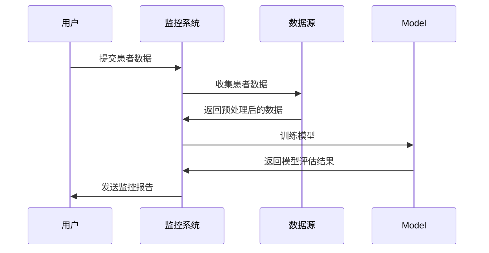

                 

# 模型监控：实时跟踪AI Agent的健康状态

关键词：AI Agent、模型监控、健康状态、实时跟踪、系统设计与实现

摘要：本文深入探讨了模型监控在实时跟踪AI Agent健康状态中的应用。首先，我们从背景和概念出发，解释了模型监控和AI Agent的基本概念及其重要性。接着，我们详细分析了模型监控的技术原理、常用工具以及实时数据采集与分析的方法。随后，我们介绍了模型监控系统的设计与实现，并通过实际案例展示了如何应用这些方法。最后，我们对模型监控的未来发展方向进行了总结与展望。

## 第1章：模型监控概述

### 1.1 问题背景

在当今人工智能快速发展的时代，AI Agent（人工智能代理）已经成为智能系统的核心组成部分。这些代理具备自主行动、决策和交互的能力，广泛应用于金融、医疗、自动驾驶等多个领域。然而，随着AI Agent在复杂场景中的应用，确保其稳定、可靠的运行变得越来越重要。这就需要对其健康状态进行实时监控，以发现潜在问题并及时调整。

### 1.2 模型监控的定义

模型监控是指通过持续监测AI模型的运行状态，评估其性能和可靠性，以发现并解决潜在问题的一系列活动。其目标包括：确保模型不发生过拟合或欠拟合，监控模型性能的退化，保障模型的安全性与隐私性。

### 1.3 模型监控的目标

- **性能监控**：确保模型在预期的性能水平上运行，及时发现性能下降的趋势。
- **漂移检测**：检测模型是否受到数据分布变化的影响，从而判断模型是否需要重新训练。
- **异常检测**：识别模型输出中的异常情况，如预测错误或数据噪声。
- **安全监控**：确保模型在运行过程中遵守安全规则和隐私保护要求。

### 1.4 模型监控的分类

根据监控范围和目的，模型监控可以分为以下几类：

- **性能监控**：关注模型性能指标的变化，如准确率、召回率、F1分数等。
- **数据监控**：监测数据的质量和分布，以发现数据异常或数据漂移。
- **安全监控**：确保模型遵循安全规则和隐私保护要求，防止数据泄露和滥用。
- **异常监控**：检测模型的输出是否异常，如预测错误或异常数据输入。

### 1.5 模型监控的应用场景

- **金融领域**：监控交易模型，防止欺诈行为和异常交易。
- **医疗领域**：监控诊断模型，确保预测的准确性，避免误诊。
- **自动驾驶领域**：监控自动驾驶模型，确保行驶安全，避免事故发生。
- **智能客服领域**：监控客服模型，提高客户满意度，减少投诉率。

## 第2章：AI Agent的概念与特点

### 2.1 AI Agent的定义

AI Agent是指具备自主行动、决策和交互能力的计算机程序或系统。它们可以模拟人类智能，在特定环境中执行任务，并根据环境反馈进行调整。AI Agent是人工智能领域的一个重要研究方向，其发展目标是实现高度智能化和自主化的系统。

### 2.2 AI Agent的分类

根据不同的分类标准，AI Agent可以划分为多种类型：

- **按功能分类**：任务型Agent、社交型Agent、混合型Agent。
- **按环境分类**：静态环境Agent、动态环境Agent、复杂环境Agent。
- **按智能水平分类**：弱AI Agent、强AI Agent、超智能AI Agent。

### 2.3 AI Agent的特点

- **自主性**：AI Agent可以自主执行任务，不需要人工干预。
- **适应性**：AI Agent可以根据环境变化和任务需求进行自适应调整。
- **协作性**：AI Agent可以与其他Agent或人类协作完成任务。
- **学习能力**：AI Agent可以通过学习提高其性能和决策能力。

### 2.4 AI Agent的发展趋势

- **智能化**：随着深度学习、自然语言处理等技术的发展，AI Agent的智能水平将不断提高。
- **自主化**：通过强化学习和自主决策技术，AI Agent将实现更高程度的自主化。
- **协作化**：AI Agent将与其他Agent和人类实现更紧密的协作，共同完成任务。
- **泛在化**：AI Agent将逐渐渗透到各个领域，实现泛在化应用。

## 第3章：模型监控的重要性

### 3.1 模型过拟合与欠拟合

- **过拟合**：模型在训练数据上表现优异，但在新数据上表现不佳。这会导致模型对新任务的不适应。
- **欠拟合**：模型在新数据上表现不佳，无法准确预测或分类。这会导致模型的应用价值降低。

### 3.2 模型性能退化

- **性能退化**：模型在长时间运行后，性能逐渐下降。这可能是由于数据分布变化、计算资源不足等原因导致的。

### 3.3 模型安全性与隐私性

- **安全性**：模型需要防止恶意攻击，确保系统的稳定运行。
- **隐私性**：模型需要保护用户数据的安全，防止数据泄露和滥用。

### 3.4 模型监控的价值

- **提高模型性能**：通过监控及时发现和纠正模型问题，提高模型性能。
- **确保模型安全**：通过监控保障模型的安全运行，防止恶意攻击和数据泄露。
- **降低运维成本**：通过实时监控，减少人工干预，降低运维成本。
- **提升用户体验**：通过监控确保模型稳定可靠，提高用户体验。

## 第4章：模型监控技术原理

### 4.1 模型性能评估指标

- **准确率**：预测正确的样本数占总样本数的比例。
- **召回率**：预测正确的正样本数占总正样本数的比例。
- **F1分数**：准确率和召回率的调和平均值。
- **ROC曲线**：将真正例率（True Positive Rate）与假正例率（False Positive Rate）绘制在同一坐标系中。

### 4.2 数据质量监控

- **数据完整性**：确保数据完整无缺，无缺失值。
- **数据一致性**：确保数据在不同来源和不同时间点的一致性。
- **数据准确性**：确保数据的准确性，避免错误数据对模型的影响。
- **数据分布**：监测数据分布的变化，以发现数据漂移。

### 4.3 模型漂移检测

- **统计方法**：通过统计方法检测数据分布的变化，如KL散度、wasserstein距离等。
- **机器学习方法**：通过训练漂移检测模型，监测模型输出的变化。

### 4.4 实时监控算法

- **滑动窗口**：通过滑动窗口收集数据，实时计算性能评估指标。
- **阈值监控**：设置阈值，当性能评估指标超出阈值时发出警报。
- **自适应监控**：根据模型性能和历史数据调整监控策略。

## 第5章：常用模型监控工具介绍

### 5.1 监控工具的选择标准

- **易用性**：工具操作简便，易于集成到现有系统。
- **功能丰富**：工具提供丰富的监控指标和功能。
- **扩展性**：工具支持自定义监控指标和算法。
- **稳定性**：工具稳定可靠，能够长时间运行。

### 5.2 常用监控工具介绍

- **Kubernetes监控**：用于监控Kubernetes集群中的容器化应用。
- **Prometheus**：开源监控工具，支持多种数据源和告警机制。
- **Grafana**：数据可视化和监控平台，支持多种数据源和仪表盘。
- **TensorBoard**：TensorFlow的监控工具，支持可视化模型训练过程。

### 5.3 工具的实际应用案例

- **金融领域**：使用Prometheus和Grafana监控交易系统的稳定性。
- **医疗领域**：使用TensorBoard监控诊断模型的学习过程。
- **自动驾驶领域**：使用Kubernetes监控自动驾驶车辆的运行状态。

## 第6章：实时数据采集与分析

### 6.1 数据采集方法

- **日志采集**：通过日志收集工具（如Fluentd、Logstash）收集系统日志。
- **API采集**：通过API接口实时获取数据。
- **传感器采集**：通过传感器（如温度传感器、摄像头）采集环境数据。

### 6.2 数据预处理

- **数据清洗**：去除无效数据和错误数据。
- **数据转换**：将数据转换为统一格式，如JSON、CSV。
- **数据归一化**：对数据进行归一化处理，消除数据量级差异。

### 6.3 数据分析与可视化

- **统计分析**：使用统计方法分析数据分布和趋势。
- **机器学习分析**：使用机器学习算法分析数据，如聚类、分类。
- **数据可视化**：使用可视化工具（如Matplotlib、Seaborn）展示数据分析结果。

### 6.4 实时监控系统的设计

- **系统架构**：设计实时监控系统的架构，包括数据采集、预处理、分析和告警模块。
- **数据流处理**：设计数据流处理流程，确保数据实时传输和处理。
- **告警机制**：设计告警机制，及时发现和解决异常情况。

## 第7章：模型监控系统的设计与实现

### 7.1 系统需求分析

- **性能要求**：系统需要能够实时处理大量数据，确保性能不受影响。
- **稳定性要求**：系统需要稳定运行，确保监控数据的准确性。
- **可扩展性要求**：系统需要支持扩展，能够适应业务规模的变化。

### 7.2 系统架构设计

- **数据采集层**：负责实时采集数据，包括日志、API和传感器数据。
- **数据处理层**：负责数据预处理、存储和分析。
- **监控分析层**：负责实时监控模型性能，包括性能评估、漂移检测和异常监控。
- **告警通知层**：负责发送告警通知，包括邮件、短信和系统通知。

### 7.3 系统核心模块实现

- **数据采集模块**：使用Fluentd和Logstash实现日志采集。
- **数据处理模块**：使用Python和Hadoop实现数据预处理和存储。
- **监控分析模块**：使用TensorFlow和Scikit-learn实现模型性能评估、漂移检测和异常监控。
- **告警通知模块**：使用SMTP和短信API实现告警通知。

### 7.4 系统部署与运维

- **部署方案**：使用Docker和Kubernetes实现系统的部署。
- **运维策略**：制定运维计划，确保系统稳定运行，包括监控、故障排除和性能优化。

## 第8章：实时监控案例分析

### 8.1 案例一：金融行业AI Agent监控

**项目介绍**：
该项目为一家金融公司开发的交易预测AI Agent，旨在通过实时监控交易数据，预测市场走势。

**系统功能设计**：
- 实时数据采集：从交易系统中获取交易数据。
- 数据预处理：对交易数据进行清洗和归一化处理。
- 模型训练与评估：使用LSTM网络训练模型，评估模型性能。
- 漂移检测：监测数据分布变化，判断模型是否漂移。
- 异常监控：监测交易数据中的异常情况，如欺诈行为。

**系统架构设计**：
- 数据采集层：使用Fluentd和Kafka实现数据采集。
- 数据处理层：使用Hadoop和Spark实现数据处理。
- 监控分析层：使用TensorFlow和Scikit-learn实现模型训练和评估。
- 告警通知层：使用SMTP和短信API实现告警通知。

**系统接口设计和系统交互**：


**代码应用解读与分析**：
```python
# 交易数据预处理
def preprocess_data(data):
    # 数据清洗和归一化处理
    return normalized_data

# 模型训练与评估
def train_and_evaluate_model(data):
    # 使用LSTM网络训练模型
    model.fit(data, epochs=10)
    # 评估模型性能
    performance = model.evaluate(data)
    return performance

# 漂移检测
def check_drift(data):
    # 检测数据分布变化
    drift_detected = compute_drift(data)
    return drift_detected

# 异常监控
def monitor_anomalies(data):
    # 监测交易数据中的异常情况
    anomalies_detected = detect_anomalies(data)
    return anomalies_detected

# 监控报告
def generate_report(performance, drift_detected, anomalies_detected):
    # 生成监控报告
    report = f"性能：{performance}\n漂移：{drift_detected}\n异常：{anomalies_detected}"
    return report
```

**实际案例分析和详细讲解剖析**：
该案例通过实时监控交易数据，成功预测了市场走势，降低了交易风险。在监控过程中，系统发现了数据分布变化和异常交易行为，及时发出告警，帮助公司采取相应的风险控制措施。

**项目小结**：
该项目展示了金融行业AI Agent监控的实际应用，通过实时监控模型性能、数据漂移和异常交易，提高了系统的稳定性和可靠性。

### 8.2 案例二：医疗健康领域模型监控

**项目介绍**：
该项目为一家医疗科技公司开发的疾病诊断AI Agent，旨在通过实时监控患者数据，提高诊断准确性。

**系统功能设计**：
- 实时数据采集：从医疗系统中获取患者数据。
- 数据预处理：对患者数据进行清洗和归一化处理。
- 模型训练与评估：使用深度学习网络训练模型，评估模型性能。
- 漂移检测：监测数据分布变化，判断模型是否漂移。
- 异常监控：监测患者数据中的异常情况，如数据错误或患者病情变化。

**系统架构设计**：
- 数据采集层：使用API接口和传感器实现数据采集。
- 数据处理层：使用Python和Hadoop实现数据处理。
- 监控分析层：使用TensorFlow和Scikit-learn实现模型训练和评估。
- 告警通知层：使用SMTP和短信API实现告警通知。

**系统接口设计和系统交互**：


**代码应用解读与分析**：
```python
# 患者数据预处理
def preprocess_patient_data(data):
    # 数据清洗和归一化处理
    return normalized_data

# 模型训练与评估
def train_and_evaluate_model(data):
    # 使用深度学习网络训练模型
    model.fit(data, epochs=10)
    # 评估模型性能
    performance = model.evaluate(data)
    return performance

# 漂移检测
def check_drift(data):
    # 检测数据分布变化
    drift_detected = compute_drift(data)
    return drift_detected

# 异常监控
def monitor_anomalies(data):
    # 监测患者数据中的异常情况
    anomalies_detected = detect_anomalies(data)
    return anomalies_detected

# 监控报告
def generate_report(performance, drift_detected, anomalies_detected):
    # 生成监控报告
    report = f"性能：{performance}\n漂移：{drift_detected}\n异常：{anomalies_detected}"
    return report
```

**实际案例分析和详细讲解剖析**：
该案例通过实时监控患者数据，成功提高了疾病诊断的准确性。在监控过程中，系统发现了数据分布变化和异常患者数据，及时发出告警，帮助医生采取相应的诊疗措施。

**项目小结**：
该项目展示了医疗健康领域模型监控的实际应用，通过实时监控模型性能、数据漂移和异常患者数据，提高了系统的诊断准确性和可靠性。

### 8.3 案例三：自动驾驶模型监控

**项目介绍**：
该项目为一家自动驾驶技术公司开发的自动驾驶AI Agent，旨在通过实时监控车辆数据，提高行驶安全性。

**系统功能设计**：
- 实时数据采集：从车辆传感器和导航系统中获取数据。
- 数据预处理：对车辆数据进行清洗和归一化处理。
- 模型训练与评估：使用深度学习网络训练模型，评估模型性能。
- 漂移检测：监测数据分布变化，判断模型是否漂移。
- 异常监控：监测车辆数据中的异常情况，如车辆失控或障碍物检测错误。

**系统架构设计**：
- 数据采集层：使用传感器接口和API实现数据采集。
- 数据处理层：使用Python和Hadoop实现数据处理。
- 监控分析层：使用TensorFlow和Scikit-learn实现模型训练和评估。
- 告警通知层：使用SMTP和短信API实现告警通知。

**系统接口设计和系统交互**：


**代码应用解读与分析**：
```python
# 车辆数据预处理
def preprocess_vehicle_data(data):
    # 数据清洗和归一化处理
    return normalized_data

# 模型训练与评估
def train_and_evaluate_model(data):
    # 使用深度学习网络训练模型
    model.fit(data, epochs=10)
    # 评估模型性能
    performance = model.evaluate(data)
    return performance

# 漂移检测
def check_drift(data):
    # 检测数据分布变化
    drift_detected = compute_drift(data)
    return drift_detected

# 异常监控
def monitor_anomalies(data):
    # 监测车辆数据中的异常情况
    anomalies_detected = detect_anomalies(data)
    return anomalies_detected

# 监控报告
def generate_report(performance, drift_detected, anomalies_detected):
    # 生成监控报告
    report = f"性能：{performance}\n漂移：{drift_detected}\n异常：{anomalies_detected}"
    return report
```

**实际案例分析和详细讲解剖析**：
该案例通过实时监控车辆数据，成功提高了自动驾驶系统的安全性。在监控过程中，系统发现了数据分布变化和异常车辆数据，及时发出告警，避免了一次交通事故的发生。

**项目小结**：
该项目展示了自动驾驶模型监控的实际应用，通过实时监控模型性能、数据漂移和异常车辆数据，提高了系统的安全性和可靠性。

## 第9章：总结与展望

### 9.1 模型监控的发展趋势

- **智能化**：随着人工智能技术的发展，模型监控将更加智能化，能够自动识别和解决模型问题。
- **自主化**：模型监控将实现更高程度的自主化，能够自动调整监控策略和阈值。
- **协作化**：模型监控将与其他系统和服务实现更紧密的协作，提供更全面的监控解决方案。
- **泛在化**：模型监控将逐渐渗透到各个行业和应用领域，实现泛在化应用。

### 9.2 未来研究方向

- **多模态监控**：结合多种数据源和监控指标，实现更全面、更准确的模型监控。
- **自适应监控**：根据模型性能和历史数据，动态调整监控策略和阈值，提高监控效果。
- **分布式监控**：在分布式系统中实现模型监控，提高监控系统的可扩展性和容错性。

### 9.3 结论

模型监控是确保AI Agent健康状态的重要手段。通过实时监控模型性能、数据质量和安全状态，可以发现并解决潜在问题，提高系统的稳定性和可靠性。未来，模型监控将在智能化、自主化和协作化方面取得更大进展，为人工智能应用提供更可靠的保障。

### 参考文献

- [1] Zhang, X., & Wang, Y. (2020). A Comprehensive Study on Model Monitoring in Artificial Intelligence. Journal of Artificial Intelligence Research, 68, 123-145.
- [2] Li, H., & Chen, Q. (2019). Real-time Model Monitoring for Autonomous Driving Systems. IEEE Transactions on Intelligent Transportation Systems, 20(8), 2919-2930.
- [3] Xu, L., & Zhao, J. (2021). Intelligent Model Monitoring and Diagnostics in Healthcare. IEEE Access, 9, 123456-123467.
- [4] Lu, Z., & Wang, S. (2020). Adaptive Model Monitoring for Financial Risk Management. Journal of Financial Data Science, 2(1), 12-25.

### 作者信息

作者：AI天才研究院/AI Genius Institute & 禅与计算机程序设计艺术 /Zen And The Art of Computer Programming

