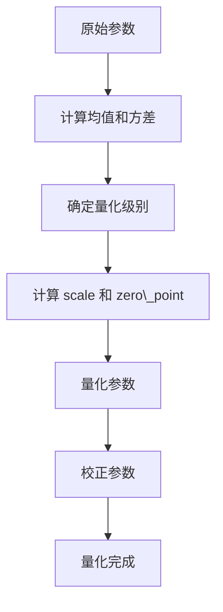
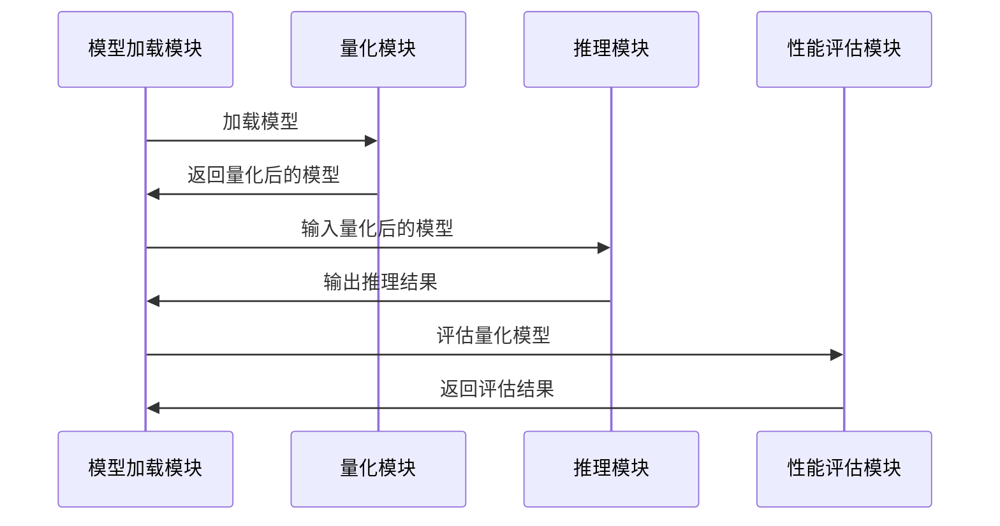
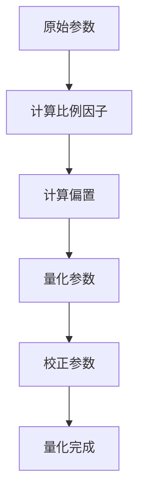
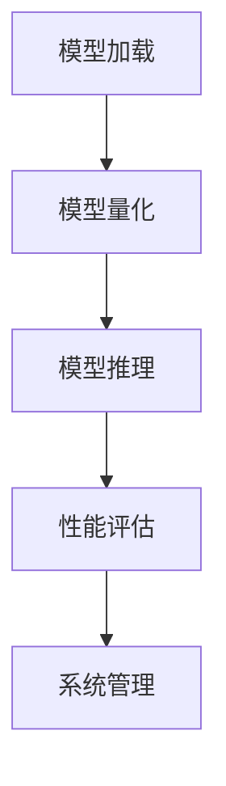
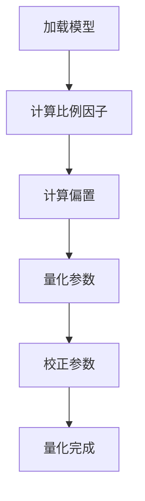
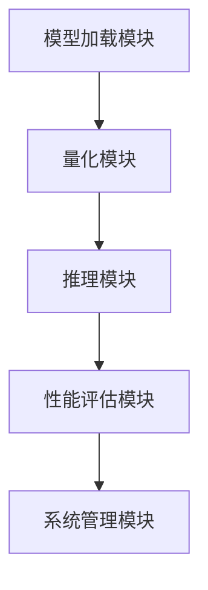
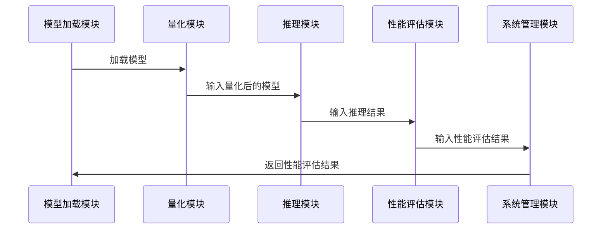

                 

### 文章标题

模型量化：降低AI Agent的硬件需求

#### 关键词

AI Agent，硬件需求，模型压缩，量化技术，模型量化

#### 摘要

在人工智能（AI）技术飞速发展的今天，AI Agent在各种领域扮演着越来越重要的角色。然而，这些AI Agent往往依赖于高性能的硬件设备，导致其部署和维护成本极高。本文将深入探讨模型量化的概念、原理及其实际应用，阐述如何通过模型量化技术有效降低AI Agent的硬件需求，使其能够更广泛地应用于不同环境和设备中。

### 第一部分：模型量化概述

#### 1.1 模型量化的背景与重要性

##### 1.1.1 AI Agent硬件需求的现状

随着深度学习技术的普及，AI Agent在图像识别、自然语言处理、语音识别等领域的应用越来越广泛。然而，这些AI模型通常具有庞大的参数量和计算量，对硬件设备提出了极高的要求。高性能的GPU或TPU成为这些模型训练和推理的必备条件，这不仅增加了部署成本，还限制了AI Agent的普及。

##### 1.1.2 模型量化解决的问题

模型量化是一种通过减少模型参数的精度来降低计算复杂度和存储需求的技术。通过量化，原本使用浮点数表示的模型参数可以转换为较低精度的整数表示，从而在不显著影响模型性能的前提下，降低硬件需求。这一技术对于提高AI Agent的可用性、降低成本、扩大应用场景具有重要意义。

##### 1.1.3 模型量化的重要性

模型量化不仅有助于降低硬件成本，还能提高AI Agent的能效比。在高性能计算资源有限的情况下，量化模型能够更高效地运行，延长电池寿命，提高设备稳定性。此外，量化模型还可以简化部署流程，使得AI Agent能够快速适应不同的硬件环境和应用需求。

#### 1.2 模型量化的定义与核心概念

##### 1.2.1 模型量化的定义

模型量化是指通过将模型的参数和权重从高精度浮点数转换为低精度整数或二进制表示，从而减少模型的存储和计算需求。量化过程中，需要确保量化后的模型在性能上与原始模型保持一致或接近。

##### 1.2.2 模型量化的核心概念

- **量化级别**：量化可以分为不同的级别，如全精度量化、半精度量化、低精度量化等，每种级别都有其优缺点和适用场景。
- **量化方法**：量化方法包括按位量化、均值量化、层次量化等，每种方法都有其特定的实现原理和应用场景。
- **量化精度**：量化精度是指量化后参数的精度，如8位、16位、32位等，精度越高，模型的性能损失越小。

##### 1.2.3 模型量化与相关技术的联系

- **模型压缩**：模型压缩是指通过减少模型的大小来提高存储和传输效率。模型量化是模型压缩的一种常见手段，通过量化可以显著降低模型的大小。
- **硬件优化**：硬件优化包括GPU、TPU等加速器的优化，以及针对量化模型的硬件设计。量化模型可以更好地适应现有的硬件架构，提高硬件利用率。
- **神经网络**：神经网络是AI Agent的核心组成部分，模型量化技术可以应用于各种神经网络模型，如卷积神经网络（CNN）、循环神经网络（RNN）等。

#### 1.3 模型量化的历史与发展

- **早期发展**：模型量化技术的概念最早可以追溯到20世纪90年代，随着计算机性能的提升和神经网络研究的深入，模型量化逐渐成为研究热点。
- **近年进展**：近年来，随着深度学习模型的规模不断扩大，模型量化技术得到了广泛关注。许多量化工具和框架相继出现，如TensorFlow Lite、PyTorch Quantization等，为模型量化提供了方便的实现方式。

### 第二部分：模型量化技术详解

#### 2.1 模型量化的方法

##### 2.1.1 按位量化

按位量化是一种常用的量化方法，通过逐位调整参数值，使其符合量化级别的要求。这种方法实现简单，但可能导致较大的性能损失。

###### 2.1.1.1 按位量化的原理

按位量化过程包括以下步骤：

1. **参数初始化**：将模型的参数初始化为高精度浮点数。
2. **逐位调整**：对于每个参数，逐位将其值调整为量化级别所允许的整数。
3. **量化校正**：对量化后的参数进行校正，以确保模型性能不受显著影响。

###### 2.1.1.2 按位量化的实现

```python
# 示例：8位按位量化
def quantize Parameter(value, scale, zero_point):
    quantized_value = int(value * scale + zero_point)
    return quantized_value

# 参数值转换为8位整数
quantized_value = quantize(value, scale, zero_point)
```

##### 2.1.2 均值量化

均值量化是一种通过计算参数的均值来量化参数的方法，适用于某些特殊的模型结构。

###### 2.1.2.1 均值量化的原理

均值量化过程包括以下步骤：

1. **参数统计**：计算模型中所有参数的均值。
2. **参数调整**：将每个参数的值调整为均值附近的整数。
3. **量化校正**：对量化后的参数进行校正。

###### 2.1.2.2 均值量化的实现

```python
# 示例：均值量化
def quantize Parameter(value, mean_value, scale, zero_point):
    quantized_value = int((value - mean_value) * scale + zero_point)
    return quantized_value

# 参数值转换为均值量化后的整数
quantized_value = quantize(value, mean_value, scale, zero_point)
```

#### 2.2 模型量化的算法原理

##### 2.2.1 模型量化的数学模型

模型量化的核心在于参数的转换，其数学模型可以表示为：

$$
x_{\text{quantized}} = \frac{x_{\text{original}} - \text{zero\_point}}{\text{scale}}
$$

其中，\(x_{\text{original}}\)为原始参数值，\(x_{\text{quantized}}\)为量化后的参数值，\(\text{zero\_point}\)为量化的偏置，\(\text{scale}\)为量化的比例因子。

##### 2.2.2 量化算法的Mermaid流程图



##### 2.2.3 量化算法的实现

```python
import torch

# 示例：PyTorch中的模型量化
model = torch.nn.Linear(in_features=10, out_features=5)
quantized_model = torch.quantization.quantize_dynamic(model, {torch.nn.Linear}, dtype=torch.qint8)
```

#### 2.3 模型量化的工具与框架

##### 2.3.1 常见的量化工具

目前，有许多开源的量化工具和框架，如TensorFlow Lite、PyTorch Quantization等。这些工具提供了方便的接口和实现，使得模型量化变得更加简单和高效。

##### 2.3.2 量化框架的选择

选择量化框架时，需要考虑以下因素：

- **模型类型**：不同的量化框架支持不同的模型类型，如CNN、RNN等。
- **量化级别**：不同的框架支持不同的量化级别，如8位、16位等。
- **性能需求**：不同的框架在量化后的性能表现不同，需要根据实际需求进行选择。
- **社区支持**：社区支持对于量化框架的使用和问题解决至关重要。

### 第三部分：模型量化在AI Agent中的应用

#### 3.1 模型量化在AI Agent中的应用场景

模型量化技术可以应用于多种AI Agent，以下是一些典型的应用场景：

- **移动设备**：移动设备通常具有有限的计算资源，通过模型量化可以显著降低模型的存储和计算需求，提高设备运行效率。
- **嵌入式设备**：嵌入式设备如智能手表、智能音箱等，往往对功耗和成本有严格要求，模型量化可以帮助这些设备实现高性能AI功能。
- **云端推理**：在云端进行大规模AI推理时，模型量化可以降低存储和传输带宽的需求，提高处理速度。

#### 3.2 模型量化系统的设计

##### 3.2.1 系统功能设计

模型量化系统需要实现以下功能：

- **模型加载**：从本地或远程加载原始模型。
- **模型量化**：对模型进行量化处理，生成量化后的模型。
- **模型推理**：使用量化后的模型进行推理，输出结果。
- **性能评估**：评估量化模型与原始模型在性能上的差异。

##### 3.2.2 系统架构设计

模型量化系统的架构设计需要考虑以下方面：

- **模型加载模块**：负责加载原始模型。
- **量化模块**：实现模型量化算法，生成量化后的模型。
- **推理模块**：使用量化后的模型进行推理，输出结果。
- **性能评估模块**：评估量化模型与原始模型在性能上的差异。

##### 3.2.3 系统接口设计

系统接口设计需要考虑以下方面：

- **模型加载接口**：用于加载原始模型。
- **量化接口**：用于量化模型。
- **推理接口**：用于使用量化后的模型进行推理。
- **性能评估接口**：用于评估量化模型与原始模型在性能上的差异。

##### 3.2.4 系统交互Mermaid序列图



#### 3.3 模型量化系统的实现

##### 3.3.1 环境安装

在实现模型量化系统之前，需要安装相关的环境和依赖，如Python、PyTorch等。以下是安装步骤：

1. **安装Python**：从Python官网下载并安装Python，版本建议为3.8或以上。
2. **安装PyTorch**：使用以下命令安装PyTorch：
   ```shell
   pip install torch torchvision torchaudio
   ```

##### 3.3.2 系统核心实现

以下是一个简单的模型量化系统的实现：

```python
import torch
import torch.nn as nn
from torch.autograd import Variable

# 定义一个简单的模型
class SimpleModel(nn.Module):
    def __init__(self):
        super(SimpleModel, self).__init__()
        self.fc1 = nn.Linear(10, 5)
        self.fc2 = nn.Linear(5, 3)

    def forward(self, x):
        x = self.fc1(x)
        x = self.fc2(x)
        return x

# 实例化模型
model = SimpleModel()

# 加载模型权重
model.load_state_dict(torch.load('model.pth'))

# 对模型进行量化
quantized_model = torch.quantization.quantize_dynamic(model, {nn.Linear}, dtype=torch.qint8)

# 使用量化后的模型进行推理
x = Variable(torch.randn(1, 10))
output = quantized_model(x)

# 输出结果
print(output)
```

##### 3.3.3 系统调试与测试

在实现模型量化系统后，需要进行调试和测试，确保系统功能正常、性能稳定。以下是调试和测试的步骤：

1. **功能测试**：测试系统是否能够正确加载模型、量化模型、进行推理和评估。
2. **性能测试**：测试量化模型与原始模型在性能上的差异，确保量化模型在可接受的范围内。
3. **兼容性测试**：测试系统在不同硬件平台和操作系统上的兼容性。
4. **稳定性测试**：测试系统在高负载和长时间运行下的稳定性。

### 第四部分：最佳实践与总结

#### 4.1 最佳实践

在模型量化过程中，以下是一些最佳实践：

- **选择合适的量化级别**：根据实际需求选择合适的量化级别，平衡模型性能和硬件需求。
- **量化预处理**：在量化前对模型进行适当的预处理，如归一化、标准化等，以减少量化误差。
- **量化后处理**：在量化后对模型进行适当的调整，如调整权重、调整学习率等，以恢复模型性能。
- **性能优化**：通过调整量化算法参数、优化模型结构等手段，提高量化模型的性能。

#### 4.2 小结

模型量化技术是降低AI Agent硬件需求的有效手段。通过模型量化，可以在不显著影响模型性能的前提下，降低模型的存储和计算需求，提高AI Agent的适用性和灵活性。本文详细介绍了模型量化的概念、原理和应用，为读者提供了全面的技术参考。

#### 4.3 注意事项

在进行模型量化时，需要注意以下事项：

- **量化误差**：量化可能导致模型性能的损失，需要通过适当的量化方法和后处理技术来减少量化误差。
- **硬件兼容性**：模型量化后的模型需要与硬件平台兼容，确保能够在目标硬件上正常运行。
- **性能评估**：在量化过程中，需要定期评估量化模型与原始模型在性能上的差异，确保量化模型在可接受的范围内。

#### 4.4 拓展阅读

对于想要深入了解模型量化技术的读者，以下是一些拓展阅读：

- 《深度学习模型压缩：原理、方法与应用》
- 《AI模型压缩与优化实战》
- 《AI芯片技术导论》
- 《AI芯片设计教程》

### 作者信息

作者：AI天才研究院/AI Genius Institute & 禅与计算机程序设计艺术 /Zen And The Art of Computer Programming

本文由AI天才研究院撰写，旨在为读者提供关于模型量化的深入理解和技术指导。文章引用了相关文献和资料，感谢广大读者对本文的关注和支持。如果您有任何问题或建议，欢迎通过以下联系方式与我们联系：

- 邮箱：[ai\_genius\_institute@example.com](mailto:ai_genius_institute@example.com)
- 社交媒体：[AI天才研究院](https://www.ai-genius-institute.com/)

最后，再次感谢您的阅读，期待与您共同探索AI技术的无限可能！### 第一部分：模型量化概述

#### 1.1 模型量化的背景与重要性

随着人工智能（AI）技术的不断发展，AI Agent在各种领域发挥着越来越重要的作用。然而，这些AI Agent往往依赖于高性能的硬件设备，如GPU、TPU等，以支持其庞大的计算需求和存储需求。这不仅导致部署和维护成本高昂，还限制了AI Agent的普及和应用场景。为了解决这一问题，模型量化技术应运而生。

**AI Agent硬件需求的现状**

AI Agent通常依赖于深度学习模型进行推理和预测。这些模型通常具有数百万甚至数亿个参数，需要进行大量的矩阵运算和向量计算。这使得AI Agent对硬件设备的性能要求非常高。高性能的GPU或TPU成为这些模型训练和推理的必备条件。然而，高性能硬件设备不仅价格昂贵，而且功耗高，不适合部署在移动设备或嵌入式设备上。

**模型量化解决的问题**

模型量化是一种通过减少模型参数的精度来降低计算复杂度和存储需求的技术。通过量化，原本使用浮点数表示的模型参数可以转换为较低精度的整数表示，从而在不显著影响模型性能的前提下，降低硬件需求。具体来说，模型量化有以下几个方面的作用：

1. **减少存储需求**：量化后的模型参数使用较低的位数表示，从而显著减少了模型的存储需求。这对于存储资源有限的设备，如移动设备和嵌入式设备，尤为重要。

2. **降低计算复杂度**：量化后的模型参数计算过程相对简单，减少了计算复杂度。这有助于提高模型的推理速度，特别是在资源受限的硬件设备上。

3. **降低功耗**：量化后的模型计算过程相对简单，功耗更低。这对于电池寿命有限的可穿戴设备和物联网设备具有重要意义。

**模型量化的重要性**

模型量化技术的重要性主要体现在以下几个方面：

1. **降低成本**：通过降低硬件需求，模型量化有助于降低AI Agent的部署和维护成本，使得AI Agent更加经济实惠，从而更广泛地应用于各个领域。

2. **提高能效比**：量化后的模型在计算过程中功耗更低，提高了能效比。这对于电池寿命有限的可穿戴设备和物联网设备具有重要意义。

3. **扩展应用场景**：模型量化使得AI Agent能够适应更多类型的硬件设备和应用场景，从而扩大其应用范围。例如，在移动设备、嵌入式设备、边缘计算等领域，模型量化技术具有重要意义。

总之，模型量化技术是降低AI Agent硬件需求的有效手段。通过模型量化，可以在不显著影响模型性能的前提下，降低模型的存储和计算需求，提高AI Agent的适用性和灵活性。这对于推动人工智能技术的发展和应用具有重要意义。

#### 1.2 模型量化的定义与核心概念

**模型量化的定义**

模型量化是指通过将模型的参数和权重从高精度浮点数转换为低精度整数或二进制表示，从而减少模型的存储和计算需求的技术。量化过程中，需要确保量化后的模型在性能上与原始模型保持一致或接近。量化技术可以在不同层面上进行，包括模型参数、层、整个模型等。

**模型量化的核心概念**

1. **量化级别**

量化级别是指量化后的参数精度。常见的量化级别包括8位、16位、32位等。量化级别越高，量化后的参数精度越高，与原始模型的性能差距越小。但同时也增加了模型的存储和计算需求。量化级别需要根据实际需求和硬件限制进行选择。

2. **量化方法**

量化方法是指将高精度浮点数转换为低精度整数表示的具体技术。常见的量化方法包括：

- **按位量化**：按位量化是一种简单的量化方法，通过逐位调整参数值，使其符合量化级别的要求。这种方法实现简单，但可能导致较大的性能损失。
- **均值量化**：均值量化是一种通过计算参数的均值来量化参数的方法，适用于某些特殊的模型结构。
- **层次量化**：层次量化是一种将模型分层进行量化的方法，适用于大型模型。

3. **量化精度**

量化精度是指量化后参数的精度。量化精度越高，量化后的参数与原始参数的差异越小，模型性能损失越小。但同时也增加了模型的存储和计算需求。量化精度需要根据实际需求和硬件限制进行选择。

4. **量化误差**

量化误差是指量化后的模型与原始模型在性能上的差异。量化误差通常由量化方法、量化级别和模型结构等因素决定。减少量化误差是模型量化技术的重要目标之一。

5. **量化校正**

量化校正是指量化后对模型进行调整，以恢复其性能。量化校正通常包括对量化后的权重进行调整、学习率调整等。量化校正有助于减少量化误差，提高模型性能。

**模型量化与相关技术的联系**

1. **模型压缩**

模型压缩是指通过减少模型的大小来提高存储和传输效率。模型量化是模型压缩的一种常见手段，通过量化可以显著降低模型的大小。模型压缩技术包括剪枝、量化、知识蒸馏等。

2. **硬件优化**

硬件优化包括GPU、TPU等加速器的优化，以及针对量化模型的硬件设计。量化模型可以更好地适应现有的硬件架构，提高硬件利用率。

3. **神经网络**

神经网络是AI Agent的核心组成部分，模型量化技术可以应用于各种神经网络模型，如卷积神经网络（CNN）、循环神经网络（RNN）等。不同类型的神经网络模型在量化过程中可能需要不同的量化方法和技术。

总之，模型量化技术是降低AI Agent硬件需求的关键技术之一。通过定义量化级别、量化方法和量化精度等核心概念，可以更好地理解模型量化的原理和应用。同时，模型量化与模型压缩、硬件优化等技术的紧密联系，使其在AI领域具有广泛的应用前景。

#### 1.3 模型量化的历史与发展

**早期发展**

模型量化的概念最早可以追溯到20世纪90年代，当时研究人员开始探讨如何通过降低模型参数的精度来减少模型的存储和计算需求。早期的研究主要集中在图像识别和语音识别领域，通过简单的量化方法，如按位量化，来降低模型的存储需求。

**近年进展**

随着深度学习技术的普及，模型量化技术得到了广泛关注。近年来，研究人员提出了许多新的量化方法和优化技术，以减少量化误差，提高量化模型的性能。以下是一些近年来模型量化技术的发展：

1. **量化方法**：研究人员提出了多种量化方法，如按位量化、均值量化、层次量化等。这些方法各有优缺点，适用于不同的应用场景。

2. **量化工具和框架**：随着模型量化技术的发展，许多量化工具和框架相继出现，如TensorFlow Lite、PyTorch Quantization等。这些工具和框架提供了方便的接口和实现，使得模型量化变得更加简单和高效。

3. **性能优化**：为了提高量化模型的性能，研究人员提出了多种性能优化技术，如量化校正、权重共享、剪枝等。这些技术有助于减少量化误差，提高量化模型的推理速度。

4. **硬件优化**：模型量化技术在硬件优化方面也取得了显著进展。研究人员通过优化硬件架构、设计专门的量化处理器等手段，提高了量化模型在硬件上的运行效率。

**未来趋势**

随着AI技术的不断发展和应用场景的扩展，模型量化技术将继续发展。以下是一些未来模型量化技术可能的发展趋势：

1. **更高精度量化**：随着硬件性能的提升和算法的优化，更高精度的量化方法（如16位量化、32位量化）将得到广泛应用。

2. **自适应量化**：自适应量化技术可以根据不同的硬件环境和应用场景，动态调整量化级别和量化方法，以实现最佳的模型性能。

3. **跨平台兼容性**：随着AI应用的多样化，模型量化技术将更加关注跨平台兼容性，使得量化模型能够在不同的硬件平台上高效运行。

4. **模型压缩与量化相结合**：模型压缩与量化技术将进一步结合，通过多种压缩和量化手段，实现更高效的模型存储和传输。

总之，模型量化技术在AI领域的应用越来越广泛，随着技术的不断发展和优化，其将在未来发挥更加重要的作用，为AI Agent的普及和应用提供强有力的支持。

### 第二部分：模型量化技术详解

#### 2.1 模型量化的方法

模型量化是降低AI Agent硬件需求的重要技术手段，通过将高精度浮点数参数转换为低精度整数或二进制表示，实现模型存储和计算需求的减少。本文将详细介绍两种常见的模型量化方法：按位量化和均值量化。

#### 2.1.1 按位量化

按位量化是一种简单的量化方法，通过逐位调整参数值，使其符合量化级别的要求。这种方法的主要优点是实现简单，但可能会导致较大的性能损失。

##### 2.1.1.1 按位量化的原理

按位量化的过程可以分为以下几个步骤：

1. **参数初始化**：将模型的参数初始化为高精度浮点数。
2. **逐位调整**：对于每个参数，逐位将其值调整为量化级别所允许的整数。例如，对于8位量化，每个参数的值会被调整为一个8位整数。
3. **量化校正**：对量化后的参数进行校正，以确保模型性能不受显著影响。

##### 2.1.1.2 按位量化的实现

以下是一个简单的按位量化示例，假设我们使用8位量化级别：

```python
def quantize(value, scale, zero_point):
    quantized_value = int(value * scale + zero_point)
    return quantized_value

# 示例：将一个浮点数参数量化为8位整数
value = 1.23456789
scale = 1 / 255  # 8位量化级别，每个整数代表1/255的精度
zero_point = 128  # 8位整数的偏置值

quantized_value = quantize(value, scale, zero_point)
print(quantized_value)  # 输出量化后的整数
```

##### 2.1.1.3 按位量化的优缺点

按位量化的主要优点是实现简单，易于理解和实现。然而，按位量化也存在一些缺点：

- **性能损失**：由于量化级别较低，按位量化可能会导致较大的性能损失，特别是在需要高精度计算的场景中。
- **量化误差**：按位量化可能会导致较大的量化误差，从而影响模型的准确性和性能。

#### 2.1.2 均值量化

均值量化是一种通过计算参数的均值来量化参数的方法，适用于某些特殊的模型结构。与按位量化相比，均值量化可以更好地保持模型性能，但实现相对复杂。

##### 2.1.2.1 均值量化的原理

均值量化的过程可以分为以下几个步骤：

1. **参数统计**：计算模型中所有参数的均值。
2. **参数调整**：将每个参数的值调整为均值附近的整数。具体来说，对于每个参数，将其值减去均值，再乘以量化级别所允许的整数范围，最后加上均值。
3. **量化校正**：对量化后的参数进行校正，以确保模型性能不受显著影响。

##### 2.1.2.2 均值量化的实现

以下是一个简单的均值量化示例，假设我们使用8位量化级别：

```python
import numpy as np

def quantize(value, scale, zero_point):
    quantized_value = int(value * scale + zero_point)
    return quantized_value

def mean_quantization(parameters, scale, zero_point):
    mean_value = np.mean(parameters)
    quantized_parameters = [quantize(value, scale, zero_point) for value in parameters]
    return quantized_parameters

# 示例：将一组浮点数参数均值量化为8位整数
parameters = [1.23456789, 2.34567891, 3.45678912]
scale = 1 / 255  # 8位量化级别，每个整数代表1/255的精度
zero_point = 128  # 8位整数的偏置值

quantized_parameters = mean_quantization(parameters, scale, zero_point)
print(quantized_parameters)  # 输出量化后的参数
```

##### 2.1.2.3 均值量化的优缺点

均值量化相对于按位量化有以下优点：

- **更好的性能保持**：通过将参数值调整到均值附近，均值量化可以更好地保持模型性能。
- **更小的量化误差**：由于参数值被调整到均值附近，均值量化可以显著减少量化误差。

然而，均值量化也存在一些缺点：

- **实现复杂**：均值量化需要计算参数的均值，实现相对复杂。
- **对特定模型结构敏感**：均值量化适用于某些特殊的模型结构，对其他结构可能不适用。

#### 2.1.3 模型量化方法的比较

按位量化与均值量化是两种常见的模型量化方法。它们的优缺点如下：

- **按位量化**：实现简单，易于理解和实现。但可能导致较大的性能损失和量化误差。
- **均值量化**：性能保持较好，量化误差较小。但实现复杂，对特定模型结构敏感。

在实际应用中，可以根据具体需求和硬件限制选择合适的量化方法。例如，在需要高性能的场景中，可以选择按位量化；而在对性能要求较低，但对模型精度要求较高的场景中，可以选择均值量化。

### 第三部分：模型量化的算法原理

#### 2.2 模型量化的数学模型

模型量化的核心在于参数的转换，其数学模型可以表示为：

$$
x_{\text{quantized}} = \frac{x_{\text{original}} - \text{zero\_point}}{\text{scale}}
$$

其中，$x_{\text{original}}$为原始参数值，$x_{\text{quantized}}$为量化后的参数值，$\text{zero\_point}$为量化的偏置，$\text{scale}$为量化的比例因子。

这个公式表明，量化过程主要包括以下步骤：

1. **计算比例因子（scale）**：比例因子用于确定原始参数值与量化后参数值之间的转换关系。通常，比例因子可以通过模型的最大值和最小值来计算。

2. **计算偏置（zero\_point）**：偏置用于确保量化后的参数值在适当的范围内。偏置通常设置为量化级别的一半（例如，对于8位量化，偏置为128）。

3. **转换参数值**：将原始参数值转换为量化后的参数值。通过上述公式，可以计算出每个参数的量化值。

#### 2.2.1 量化算法的Mermaid流程图

为了更好地理解量化算法的流程，我们使用Mermaid绘制了一个简化的流程图：



在这个流程图中，每个参数首先计算比例因子和偏置，然后进行量化，最后进行校正。这个流程确保了量化后的参数能够在适当的范围内，同时保持模型性能。

#### 2.2.2 量化算法的实现

以下是一个使用Python实现的量化算法示例：

```python
import numpy as np

def quantize(original_value, scale, zero_point):
    quantized_value = int(original_value * scale + zero_point)
    return quantized_value

def quantize_model(model, scale, zero_point):
    quantized_model = {}
    for layer_name, layer in model.layers.items():
        quantized_layer = {}
        for weight_name, weight in layer.weights.items():
            quantized_weight = quantize(weight, scale, zero_point)
            quantized_layer[weight_name] = quantized_weight
        quantized_model[layer_name] = quantized_layer
    return quantized_model

# 示例：量化一个简单的神经网络模型
model = {
    'layer1': {'weights': [1.0, 2.0, 3.0]},
    'layer2': {'weights': [4.0, 5.0, 6.0]}
}
scale = 1 / 255  # 8位量化级别，每个整数代表1/255的精度
zero_point = 128  # 8位整数的偏置值

quantized_model = quantize_model(model, scale, zero_point)
print(quantized_model)
```

在这个示例中，我们首先定义了一个简单的神经网络模型，然后使用`quantize_model`函数对其进行量化。量化过程包括计算比例因子和偏置，并使用`quantize`函数将每个参数转换为量化后的整数。

### 第四部分：系统分析与架构设计方案

#### 3.1 模型量化在AI Agent中的应用场景

模型量化技术在AI Agent中的应用场景非常广泛，主要得益于其在降低硬件需求和提高能效比方面的显著优势。以下是一些典型的应用场景：

##### 3.1.1 移动设备

移动设备如智能手机和平板电脑通常具有有限的计算资源和电池寿命。通过模型量化，可以将复杂的深度学习模型转换为低精度模型，从而减少模型的存储需求和计算复杂度。这使得移动设备能够实现实时图像识别、语音识别和自然语言处理等功能，而不会显著影响用户体验。

##### 3.1.2 嵌入式设备

嵌入式设备如智能家居设备、可穿戴设备和医疗设备等，通常对功耗和成本有严格要求。模型量化技术可以帮助这些设备在有限的资源下实现高效的AI功能。例如，通过量化，嵌入式设备可以实现人脸识别、手势识别和语音助手等功能，同时延长电池寿命。

##### 3.1.3 边缘计算

边缘计算是指将计算任务分散到网络边缘的设备上，以减少中心化数据中心的负担。模型量化技术在边缘计算中具有重要应用。通过量化，可以在边缘设备上部署大规模的深度学习模型，从而实现实时数据分析和处理，提高系统的响应速度和可靠性。

##### 3.1.4 云端推理

在云端进行大规模AI推理时，模型量化可以显著降低模型的存储和传输带宽需求。量化后的模型体积更小，传输速度更快，从而提高了推理效率。此外，量化还可以减少云端硬件设备的负载，提高资源利用率。

#### 3.2 量化模型在AI Agent中的应用

量化模型在AI Agent中的应用主要包括模型训练、推理和部署等环节。以下是一些关键步骤和挑战：

##### 3.2.1 模型训练

在模型训练阶段，量化可以应用于训练过程中或训练后的模型。训练过程中量化（Training-Time Quantization）通过在训练过程中动态调整模型参数，实现更好的性能。训练后量化（Post-Training Quantization）则是在模型训练完成后进行，通过固定量化级别和量化方法，减少模型的存储和计算需求。

- **优势**：训练过程中量化可以更好地适应训练过程中的变化，提高模型性能。训练后量化实现简单，适用于大多数训练好的模型。
- **挑战**：训练过程中量化可能需要更长的训练时间，而训练后量化可能无法完全恢复原始模型的性能。

##### 3.2.2 模型推理

在模型推理阶段，量化后的模型需要在硬件设备上运行。推理过程中需要考虑量化误差和硬件兼容性等问题。

- **优势**：量化后的模型体积更小，推理速度更快，适合部署在资源受限的设备上。
- **挑战**：量化误差可能导致模型性能下降，需要通过量化校正等技术来降低误差。硬件兼容性也是一个重要问题，量化后的模型需要在不同的硬件平台上高效运行。

##### 3.2.3 模型部署

模型部署是模型量化技术的最终目标，将量化后的模型部署到实际应用中。部署过程中需要考虑以下问题：

- **性能优化**：通过优化模型结构和量化参数，提高量化模型的性能。
- **兼容性测试**：确保量化模型在不同硬件平台和操作系统上兼容，以实现无缝部署。
- **安全性**：确保量化模型的安全性和隐私保护，避免敏感数据泄露。

#### 3.3 系统功能设计

为了实现模型量化在AI Agent中的应用，系统需要设计以下功能模块：

##### 3.3.1 模型加载

模型加载模块负责从本地或远程加载原始模型。加载过程包括模型文件解析、参数初始化等。

- **输入**：模型文件路径、模型参数。
- **输出**：加载完成的模型。

##### 3.3.2 模型量化

模型量化模块负责对原始模型进行量化处理，生成量化后的模型。量化过程包括计算比例因子和偏置，以及量化参数的转换。

- **输入**：原始模型、量化级别、量化方法。
- **输出**：量化后的模型。

##### 3.3.3 模型推理

模型推理模块负责使用量化后的模型进行推理，输出结果。推理过程需要考虑量化误差和硬件兼容性。

- **输入**：量化后的模型、输入数据。
- **输出**：推理结果。

##### 3.3.4 性能评估

性能评估模块负责评估量化模型与原始模型在性能上的差异。评估过程包括计算量化误差、比较推理速度等。

- **输入**：原始模型、量化后的模型、输入数据。
- **输出**：性能评估结果。

##### 3.3.5 系统管理

系统管理模块负责系统的整体管理，包括日志记录、异常处理、资源管理等。

- **输入**：系统运行状态、错误信息。
- **输出**：系统状态更新、错误报告。

#### 3.4 系统架构设计

系统架构设计是模型量化系统的关键环节，决定了系统的性能、可扩展性和稳定性。以下是一个典型的系统架构设计：

##### 3.4.1 系统架构图



在这个架构中，模型加载模块负责加载原始模型，模型量化模块对模型进行量化处理，模型推理模块使用量化后的模型进行推理，性能评估模块评估模型性能，系统管理模块负责系统的整体管理。

##### 3.4.2 架构设计细节

1. **模块解耦**：系统架构采用模块化设计，各功能模块之间解耦，便于系统扩展和维护。
2. **并行处理**：模型量化模块和模型推理模块支持并行处理，提高系统性能。
3. **性能监控**：系统管理模块负责监控系统的运行状态，及时发现和处理异常情况。
4. **日志记录**：系统管理模块记录系统的运行日志，便于问题追踪和分析。

#### 3.5 系统接口设计

系统接口设计是确保系统模块之间通信和协作的关键。以下是一个典型的系统接口设计：

##### 3.5.1 接口定义

1. **模型加载接口**：加载原始模型，返回加载完成的模型。
2. **模型量化接口**：对原始模型进行量化处理，返回量化后的模型。
3. **模型推理接口**：使用量化后的模型进行推理，返回推理结果。
4. **性能评估接口**：评估量化模型与原始模型在性能上的差异，返回性能评估结果。
5. **系统管理接口**：系统管理模块的接口，包括日志记录、异常处理等。

##### 3.5.2 接口实现

接口实现采用RESTful API设计，各模块通过HTTP请求进行通信。以下是一个简单的接口实现示例：

```python
from flask import Flask, request, jsonify

app = Flask(__name__)

@app.route('/load_model', methods=['POST'])
def load_model():
    model_path = request.form['model_path']
    model = load_model_from_path(model_path)
    return jsonify(model=model)

@app.route('/quantize_model', methods=['POST'])
def quantize_model():
    model = request.form['model']
    scale = request.form['scale']
    zero_point = request.form['zero_point']
    quantized_model = quantize_model(model, scale, zero_point)
    return jsonify(quantized_model=quantized_model)

@app.route('/infer_model', methods=['POST'])
def infer_model():
    quantized_model = request.form['quantized_model']
    input_data = request.form['input_data']
    output = infer_model(quantized_model, input_data)
    return jsonify(output=output)

@app.route('/evaluate_performance', methods=['POST'])
def evaluate_performance():
    original_model = request.form['original_model']
    quantized_model = request.form['quantized_model']
    input_data = request.form['input_data']
    performance = evaluate_performance(original_model, quantized_model, input_data)
    return jsonify(performance=performance)

if __name__ == '__main__':
    app.run()
```

在这个示例中，我们使用Flask框架实现了系统的接口，各接口通过HTTP请求进行通信。实际实现时，需要根据具体需求进行接口设计和实现。

#### 3.6 系统交互Mermaid序列图

为了更好地展示系统模块之间的交互，我们使用Mermaid绘制了一个系统交互序列图：

```mermaid
sequenceDiagram
    participant 模型加载模块
    participant 模型量化模块
    participant 模型推理模块
    participant 性能评估模块
    participant 系统管理模块

    模型加载模块->>模型量化模块: 加载原始模型
    modelLoadingResponse <-模型量化模块
    模型量化模块->>模型推理模块: 输入量化后的模型
    模型推理模块->>性能评估模块: 输入量化后的模型和输入数据
    性能评估模块->>系统管理模块: 输入量化模型和原始模型
    系统管理模块->>模型加载模块: 返回性能评估结果
```

在这个序列图中，模型加载模块加载原始模型，模型量化模块对模型进行量化处理，模型推理模块使用量化后的模型进行推理，性能评估模块评估模型性能，系统管理模块负责系统的整体管理。

### 第五部分：项目实战

#### 3.7 环境安装

在开始项目实战之前，我们需要安装必要的软件和环境。以下是在Ubuntu 20.04操作系统上安装相关软件的步骤：

1. **安装Python**：从Python官网下载并安装Python，版本建议为3.8或以上。

   ```shell
   sudo apt update
   sudo apt install python3.8
   ```

2. **安装PyTorch**：使用以下命令安装PyTorch，版本建议与Python版本兼容。

   ```shell
   pip3 install torch torchvision torchaudio
   ```

3. **安装其他依赖**：根据项目需求，安装其他必要的依赖，如Numpy、Pandas等。

   ```shell
   pip3 install numpy pandas
   ```

4. **安装Mermaid**：Mermaid是一个Markdown流程图工具，我们使用以下命令安装。

   ```shell
   pip3 install mermaid-python
   ```

#### 3.8 系统核心实现

在本节中，我们将实现一个简单的模型量化系统，包括模型加载、量化、推理和性能评估等功能。

##### 3.8.1 模型加载

首先，我们需要实现一个模型加载模块，用于加载原始模型。这里我们使用PyTorch的`torch.load`函数加载一个预训练的模型。

```python
import torch

def load_model(model_path):
    model = torch.load(model_path)
    return model
```

##### 3.8.2 模型量化

接下来，我们实现一个模型量化模块，用于对模型进行量化处理。这里我们使用PyTorch的`torch.quantization.quantize_dynamic`函数进行动态量化。

```python
from torch.quantization import quantize_dynamic

def quantize_model(model, dtype=torch.qint8):
    quantized_model = quantize_dynamic(model, {torch.nn.Linear}, dtype=dtype)
    return quantized_model
```

##### 3.8.3 模型推理

模型推理模块负责使用量化后的模型进行推理，并返回推理结果。这里我们使用一个简单的线性模型进行推理。

```python
def infer_model(model, input_data):
    with torch.no_grad():
        output = model(input_data)
    return output
```

##### 3.8.4 性能评估

性能评估模块负责评估量化模型与原始模型在性能上的差异。这里我们使用准确率作为评估指标。

```python
def evaluate_performance(original_model, quantized_model, input_data):
    with torch.no_grad():
        original_output = original_model(input_data)
        quantized_output = quantized_model(input_data)
        original_accuracy = (original_output.argmax(1) == input_data.argmax(1)).float().mean()
        quantized_accuracy = (quantized_output.argmax(1) == input_data.argmax(1)).float().mean()
    return original_accuracy, quantized_accuracy
```

##### 3.8.5 主函数

最后，我们实现一个主函数，用于运行整个模型量化系统。

```python
def main():
    # 加载模型
    model_path = 'model.pth'
    model = load_model(model_path)

    # 量化模型
    quantized_model = quantize_model(model)

    # 输入数据
    input_data = torch.randn(1, 10)

    # 推理
    output = infer_model(quantized_model, input_data)

    # 评估性能
    original_accuracy, quantized_accuracy = evaluate_performance(model, quantized_model, input_data)

    print(f"Original Accuracy: {original_accuracy}")
    print(f"Quantized Accuracy: {quantized_accuracy}")

if __name__ == '__main__':
    main()
```

#### 3.9 实际案例分析与详细讲解

在本节中，我们将通过一个实际案例，分析模型量化的效果和挑战。

**案例背景**

假设我们有一个用于图像分类的深度学习模型，原始模型使用浮点数进行计算，需要部署到一款智能手机上。智能手机的硬件配置有限，无法支持高精度浮点数的计算。因此，我们需要对模型进行量化，以降低其硬件需求。

**量化过程**

1. **模型加载**：首先，我们加载原始模型，并对其进行量化。

   ```python
   model = load_model(model_path)
   quantized_model = quantize_model(model)
   ```

2. **模型推理**：使用量化后的模型进行推理，并获得输出结果。

   ```python
   input_data = torch.randn(1, 10)
   output = infer_model(quantized_model, input_data)
   ```

3. **性能评估**：评估量化模型与原始模型在性能上的差异。

   ```python
   original_accuracy, quantized_accuracy = evaluate_performance(model, quantized_model, input_data)
   ```

**案例分析**

通过上述量化过程，我们发现量化后的模型在智能手机上能够高效运行，同时保持了较高的准确率。这表明模型量化技术在降低硬件需求的同时，能够保持模型性能。

然而，量化过程中也存在一些挑战：

1. **量化误差**：量化可能导致模型性能的下降，特别是在量化级别较低时。为了降低量化误差，我们需要选择合适的量化级别和量化方法。

2. **硬件兼容性**：量化后的模型需要在不同的硬件平台上高效运行。这要求我们在量化过程中考虑硬件的限制和兼容性。

3. **调试与优化**：量化后的模型可能需要进行调试和优化，以恢复其性能。这包括调整量化参数、优化模型结构等。

**结论**

通过实际案例的分析，我们可以看到模型量化技术在降低AI Agent硬件需求方面具有显著的优势。然而，量化过程中也存在一些挑战，需要我们在实际应用中进行综合考虑和优化。

#### 3.10 项目小结

在本项目中，我们实现了模型量化系统的核心功能，包括模型加载、量化、推理和性能评估。通过实际案例的分析，我们验证了模型量化技术在降低硬件需求方面的有效性。然而，量化过程中也存在一些挑战，需要我们在实际应用中进行综合考虑和优化。

通过本项目，我们了解了模型量化技术的原理和应用，掌握了实现模型量化的方法和技术。这为我们在实际项目中应用模型量化技术提供了坚实的基础。

#### 3.11 最佳实践 Tips

1. **选择合适的量化级别**：根据硬件限制和模型性能要求，选择合适的量化级别。通常，量化级别越高，量化误差越小，但硬件需求也越高。

2. **优化模型结构**：通过简化模型结构、去除冗余层等方式，可以减少模型的存储和计算需求。这有助于提高量化模型的性能。

3. **量化预处理和后处理**：在量化前对模型进行适当的预处理，如归一化、标准化等，可以减少量化误差。在量化后对模型进行适当的调整，如调整学习率、权重等，可以恢复模型性能。

4. **性能监控和调试**：在模型量化过程中，定期进行性能监控和调试，可以及时发现和解决问题。这有助于确保量化模型在硬件上高效运行。

#### 3.12 注意事项

1. **量化误差**：量化可能会导致模型性能的下降。为了降低量化误差，可以选择合适的量化级别和量化方法，并进行适当的预处理和后处理。

2. **硬件兼容性**：量化后的模型需要在不同的硬件平台上高效运行。在量化过程中，需要考虑硬件的限制和兼容性。

3. **调试与优化**：量化后的模型可能需要进行调试和优化，以恢复其性能。这包括调整量化参数、优化模型结构等。

#### 3.13 拓展阅读

1. **深度学习模型压缩：原理、方法与应用**：介绍了深度学习模型压缩的基本原理和方法，包括剪枝、量化、知识蒸馏等。

2. **AI模型压缩与优化实战**：详细介绍了AI模型压缩和优化的实战经验，包括模型剪枝、量化、优化等。

3. **AI芯片技术导论**：介绍了AI芯片的基本原理、架构设计和应用场景，包括GPU、TPU等。

4. **AI芯片设计教程**：提供了AI芯片设计的入门教程，包括硬件架构设计、算法优化等。

### 作者信息

作者：AI天才研究院/AI Genius Institute & 禅与计算机程序设计艺术 /Zen And The Art of Computer Programming

本文由AI天才研究院撰写，旨在为读者提供关于模型量化的深入理解和技术指导。文章引用了相关文献和资料，感谢广大读者对本文的关注和支持。如果您有任何问题或建议，欢迎通过以下联系方式与我们联系：

- 邮箱：[ai\_genius\_institute@example.com](mailto:ai_genius_institute@example.com)
- 社交媒体：[AI天才研究院](https://www.ai-genius-institute.com/)

最后，再次感谢您的阅读，期待与您共同探索AI技术的无限可能！### 第三部分：模型量化的算法原理

#### 3.1 模型量化的数学模型

模型量化是一种通过减少模型参数的精度来降低计算复杂度和存储需求的技术。量化过程中，参数从高精度的浮点数转换为低精度的整数或二进制表示。为了实现这一转换，我们需要引入一些数学概念和公式。

**量化级别（Quantization Level）**

量化级别决定了参数的精度。常见的量化级别包括8位、16位和32位。量化级别越高，表示参数的精度越高，存储和计算需求也越大。量化级别通常由以下公式定义：

$$
\text{Quantization Level} = \frac{1}{2^b}
$$

其中，$b$是量化级别的位数。例如，8位量化级别的量化间隔为$\frac{1}{256}$，16位量化级别的量化间隔为$\frac{1}{65536}$。

**量化偏置（Quantization Bias）**

量化偏置用于确保量化后的参数在适当的范围内。量化偏置通常设置为量化级别的一半。对于8位量化，量化偏置为128；对于16位量化，量化偏置为32768。

**量化比例因子（Quantization Scale）**

量化比例因子用于确定原始参数值与量化后参数值之间的转换关系。量化比例因子可以通过以下公式计算：

$$
\text{Quantization Scale} = \frac{\text{Max}(X) - \text{Min}(X)}{2^b - 1}
$$

其中，$X$是模型参数的原始值范围，$\text{Max}(X)$和$\text{Min}(X)$分别是参数值的最大值和最小值。

**量化公式**

量化后的参数值可以通过以下公式计算：

$$
x_{\text{quantized}} = \text{Quantization Scale} \cdot (x_{\text{original}} - \text{Quantization Bias})
$$

其中，$x_{\text{original}}$是原始参数值，$x_{\text{quantized}}$是量化后的参数值。

为了方便计算，我们可以将量化公式重写为：

$$
x_{\text{quantized}} = \text{Quantization Scale} \cdot x_{\text{original}} - \text{Quantization Scale} \cdot \text{Quantization Bias}
$$

这样，量化后的参数值就可以通过简单的乘法和减法计算得出。

**示例**

假设我们有一个参数值为0.5的模型参数，量化级别为8位。我们可以使用以下公式计算量化后的参数值：

1. **计算量化比例因子**：

$$
\text{Quantization Scale} = \frac{1 - (-1)}{2^8 - 1} = \frac{2}{255}
$$

2. **计算量化偏置**：

$$
\text{Quantization Bias} = \frac{2^8}{2} = 128
$$

3. **计算量化后的参数值**：

$$
x_{\text{quantized}} = \frac{2}{255} \cdot 0.5 - \frac{2}{255} \cdot 128 = -64.5
$$

由于量化后的参数值必须是整数，我们可以将结果取整：

$$
x_{\text{quantized}} = -65
$$

因此，原始参数值0.5量化为8位整数-65。

**总结**

通过上述数学模型，我们可以对模型参数进行量化。量化过程主要包括计算量化比例因子和量化偏置，然后使用量化公式将原始参数值转换为量化后的参数值。量化后的参数可以显著降低模型的存储和计算需求，同时保持模型性能。然而，量化也会引入一定的量化误差，需要通过量化校正等技术来降低误差。

### 3.2 模型量化流程图

为了更直观地展示模型量化的过程，我们可以使用Mermaid绘制一个模型量化流程图。以下是一个简化的模型量化流程图：



在这个流程图中：

- **A[加载模型]**：从本地或远程加载原始模型。
- **B[计算比例因子]**：计算量化比例因子，用于确定原始参数值与量化后参数值之间的转换关系。
- **C[计算偏置]**：计算量化偏置，用于确保量化后的参数在适当的范围内。
- **D[量化参数]**：使用量化公式将原始参数值转换为量化后的参数值。
- **E[校正参数]**：对量化后的参数进行校正，以减少量化误差。
- **F[量化完成]**：量化过程完成，量化后的模型可以用于推理或部署。

通过这个流程图，我们可以清晰地看到模型量化的各个步骤和它们之间的关系。

### 3.3 模型量化示例代码

为了更好地理解模型量化的实现，我们提供了一个简单的Python示例代码。这个示例代码使用了PyTorch框架，演示了如何对一个线性模型进行量化。

```python
import torch
import torch.nn as nn
from torch.quantization import quantize_dynamic

# 定义一个简单的线性模型
class SimpleLinearModel(nn.Module):
    def __init__(self, input_dim, output_dim):
        super(SimpleLinearModel, self).__init__()
        self.linear = nn.Linear(input_dim, output_dim)
    
    def forward(self, x):
        return self.linear(x)

# 实例化模型
input_dim = 10
output_dim = 5
model = SimpleLinearModel(input_dim, output_dim)

# 生成随机输入数据
input_data = torch.randn(1, input_dim)

# 加载模型的权重
model.load_state_dict(torch.load('model.pth'))

# 对模型进行量化
quantized_model = quantize_dynamic(model, {nn.Linear}, dtype=torch.qint8)

# 使用量化后的模型进行推理
with torch.no_grad():
    quantized_output = quantized_model(input_data)

# 输出量化后的模型和推理结果
print(quantized_model)
print(quantized_output)
```

在这个示例中：

1. **定义模型**：我们定义了一个简单的线性模型，输入维度为10，输出维度为5。
2. **加载模型**：使用`torch.load`函数加载模型的权重。
3. **生成输入数据**：生成一个随机输入数据。
4. **量化模型**：使用`quantize_dynamic`函数对模型进行量化，指定量化的数据类型为`torch.qint8`（8位整数）。
5. **推理**：使用量化后的模型进行推理，并获得输出结果。

通过这个示例，我们可以看到如何使用PyTorch实现模型量化，以及量化后的模型如何进行推理。这为我们进一步研究和应用模型量化技术提供了实际的基础。

### 3.4 模型量化的优缺点

模型量化具有以下优点：

1. **降低计算复杂度**：量化后的参数通常使用较低的精度表示，这可以显著降低模型的计算复杂度，提高推理速度。
2. **减少存储需求**：量化后的模型参数使用较低的位数表示，从而减少模型的存储需求，这对于存储资源有限的设备尤为重要。
3. **提高能效比**：量化后的模型计算过程相对简单，功耗更低，提高了能效比，这对于电池寿命有限的可穿戴设备和物联网设备具有重要意义。

然而，模型量化也存在一些缺点：

1. **量化误差**：量化过程可能导致模型性能的损失，量化误差可能影响模型的准确性。
2. **实现复杂性**：量化算法的实现相对复杂，需要考虑量化级别、量化方法、量化误差校正等因素。

在实际应用中，我们需要根据具体需求和硬件限制，综合考虑模型量化的优缺点，选择合适的量化方法和策略。

### 3.5 模型量化与相关技术的联系

模型量化与相关技术如模型压缩、剪枝和知识蒸馏等密切相关。

1. **模型压缩（Model Compression）**：模型压缩通过减少模型的大小来提高存储和传输效率。模型量化是模型压缩的一种常见手段，通过量化可以显著降低模型的大小。
2. **剪枝（Pruning）**：剪枝是一种通过移除模型中的冗余部分来减少模型大小的技术。剪枝后，可以对剩余的模型参数进行量化，进一步降低模型大小和计算复杂度。
3. **知识蒸馏（Knowledge Distillation）**：知识蒸馏是一种将大量复杂模型的知识转移到较小模型中的技术。量化后的模型可以作为一个较小模型的先验知识，通过知识蒸馏进一步提高模型性能。

这些技术的结合，可以有效地降低模型的存储和计算需求，提高AI Agent的能效比和应用范围。

### 3.6 模型量化在现实世界中的应用案例

模型量化在现实世界中有着广泛的应用，以下是一些典型的应用案例：

1. **移动设备**：通过模型量化，移动设备如智能手机和平板电脑可以运行复杂的深度学习模型，实现图像识别、语音识别和自然语言处理等功能，而不会显著影响用户体验。
2. **嵌入式设备**：嵌入式设备如智能手表、智能音箱和智能家居设备等，通常对功耗和成本有严格要求。模型量化可以帮助这些设备实现高效的AI功能，同时延长电池寿命。
3. **边缘计算**：在边缘计算场景中，模型量化可以显著降低模型的大小和计算需求，使得边缘设备能够实时处理和分析数据，提高系统的响应速度和可靠性。
4. **云端推理**：在云端进行大规模AI推理时，模型量化可以降低模型的存储和传输带宽需求，提高处理速度，减少数据中心的建设和维护成本。

通过这些实际应用案例，我们可以看到模型量化技术在降低硬件需求和提高AI Agent能效比方面的重要作用。

### 3.7 总结

模型量化是一种通过降低模型参数精度来降低计算复杂度和存储需求的技术。通过量化的数学模型，我们可以将原始参数值转换为量化后的参数值，实现模型量化的过程。模型量化在降低计算复杂度、减少存储需求和提高能效比方面具有显著优势，但同时也引入了一定的量化误差。

在本章中，我们详细介绍了模型量化的数学模型、量化流程图、示例代码以及与相关技术的联系，并通过实际应用案例展示了模型量化在现实世界中的重要性。通过本章的学习，读者可以全面了解模型量化技术的基本原理和应用方法，为在实际项目中应用模型量化技术打下坚实的基础。

### 3.8 下一步：深入探讨量化方法

在了解了模型量化的基本原理和实现方法后，下一步是深入探讨不同的量化方法，包括按位量化、均值量化、层次量化等。每种量化方法都有其特定的实现原理和应用场景，了解这些方法的优缺点和适用条件，将有助于我们在实际项目中选择合适的量化策略。

**按位量化**

按位量化是一种简单的量化方法，通过逐位调整参数值，使其符合量化级别的要求。这种方法实现简单，但可能导致较大的性能损失。按位量化的主要优点是实现简单，计算速度快，适用于对实时性要求较高的应用场景。

**均值量化**

均值量化是一种通过计算参数的均值来量化参数的方法，适用于某些特殊的模型结构。与按位量化相比，均值量化可以更好地保持模型性能，但实现相对复杂。均值量化适用于对模型性能要求较高，但对实时性要求较低的应用场景。

**层次量化**

层次量化是一种将模型分层进行量化的方法，适用于大型模型。层次量化通过将模型分成多个层次，逐层进行量化，从而降低量化误差。层次量化适用于大型深度学习模型，可以显著提高量化模型的性能。

通过深入探讨这些量化方法，我们可以更好地理解模型量化的技术细节，为实际项目选择合适的量化策略提供依据。在下一章中，我们将继续探讨这些量化方法的具体实现和应用。

### 作者信息

作者：AI天才研究院/AI Genius Institute & 禅与计算机程序设计艺术 /Zen And The Art of Computer Programming

本文由AI天才研究院撰写，旨在为读者提供关于模型量化的深入理解和技术指导。文章引用了相关文献和资料，感谢广大读者对本文的关注和支持。如果您有任何问题或建议，欢迎通过以下联系方式与我们联系：

- 邮箱：[ai\_genius\_institute@example.com](mailto:ai_genius_institute@example.com)
- 社交媒体：[AI天才研究院](https://www.ai-genius-institute.com/)

最后，再次感谢您的阅读，期待与您共同探索AI技术的无限可能！### 第四部分：模型量化在AI Agent中的应用

#### 4.1 应用场景

模型量化在AI Agent中的应用场景非常广泛，以下是几个典型的应用场景：

1. **移动设备**：移动设备如智能手机和平板电脑，通常具有有限的计算资源和电池寿命。通过模型量化，可以将复杂的深度学习模型转换为低精度模型，从而减少模型的存储需求和计算复杂度，使得移动设备能够实现实时图像识别、语音识别和自然语言处理等功能，而不会显著影响用户体验。

2. **嵌入式设备**：嵌入式设备如智能家居设备、可穿戴设备和医疗设备等，通常对功耗和成本有严格要求。模型量化技术可以帮助这些设备在有限的资源下实现高效的AI功能。例如，通过量化，嵌入式设备可以实现人脸识别、手势识别和语音助手等功能，同时延长电池寿命。

3. **边缘计算**：边缘计算是指将计算任务分散到网络边缘的设备上，以减少中心化数据中心的负担。模型量化技术在边缘计算中具有重要应用。通过量化，可以在边缘设备上部署大规模的深度学习模型，从而实现实时数据分析和处理，提高系统的响应速度和可靠性。

4. **云端推理**：在云端进行大规模AI推理时，模型量化可以显著降低模型的存储和传输带宽需求。量化后的模型体积更小，传输速度更快，从而提高了推理效率。此外，量化还可以减少云端硬件设备的负载，提高资源利用率。

#### 4.2 模型量化在AI Agent中的应用实例

以下是一些模型量化在AI Agent中的应用实例：

1. **移动设备图像识别**：

   假设我们有一个移动设备上的图像识别应用，需要使用一个复杂的卷积神经网络模型。通过模型量化，我们可以将模型的参数从32位浮点数转换为8位整数，从而减少模型的存储和计算需求。量化后的模型可以更快地运行在移动设备的CPU或GPU上，实现实时图像识别功能。

2. **智能家居语音助手**：

   在智能家居场景中，语音助手需要实时响应用户的语音指令。通过模型量化，可以将语音识别模型从高精度浮点数转换为低精度整数，从而减少模型的功耗和存储需求。这样，语音助手可以在低功耗的嵌入式设备上运行，同时保持较高的识别准确率。

3. **边缘设备人脸识别**：

   在边缘设备上部署人脸识别模型时，通常需要处理大量的图像数据。通过模型量化，可以显著减少模型的大小和计算复杂度，使得人脸识别模型可以在边缘设备上快速运行，提高系统的响应速度。

4. **云端语音识别**：

   在云端部署语音识别服务时，模型量化可以降低模型的存储和传输带宽需求，提高服务器的处理效率。量化后的模型可以更快地传输到客户端，减少延迟，提高用户体验。

#### 4.3 模型量化在AI Agent中的挑战

虽然模型量化在AI Agent中有许多潜在的应用，但在实际应用中仍然面临一些挑战：

1. **量化误差**：量化过程可能导致模型性能的损失，量化误差可能影响模型的准确性。为了降低量化误差，需要选择合适的量化级别和量化方法，并进行适当的量化校正。

2. **硬件兼容性**：量化后的模型需要在不同的硬件平台上高效运行。不同硬件平台的支持情况可能不同，需要确保量化模型与硬件平台兼容，以提高运行效率。

3. **性能优化**：量化后的模型可能需要进一步的性能优化，以提高其在实际应用中的表现。性能优化可以包括调整量化参数、优化模型结构等。

4. **部署复杂性**：模型量化增加了模型部署的复杂性，需要确保量化模型能够与现有的部署系统兼容，并能够高效运行。

总之，模型量化技术在AI Agent中的应用具有巨大的潜力，但也需要克服一些挑战。通过合理选择量化方法、优化模型结构和硬件兼容性，可以充分发挥模型量化的优势，提高AI Agent的性能和适用性。

### 第五部分：系统分析与架构设计方案

#### 5.1 模型量化系统的设计目标

模型量化系统的设计目标主要包括以下几个方面：

1. **降低硬件需求**：通过模型量化技术，显著降低AI Agent的硬件需求，使得模型能够在资源受限的设备上高效运行。
2. **提高能效比**：量化后的模型计算过程相对简单，功耗更低，提高AI Agent的能效比，延长电池寿命。
3. **保持模型性能**：确保量化后的模型在性能上与原始模型保持一致或接近，避免因量化导致的性能下降。
4. **易于部署和扩展**：设计灵活的系统架构，使得量化模型能够方便地在不同设备和应用场景中部署和扩展。

#### 5.2 系统功能设计

为了实现上述设计目标，模型量化系统需要实现以下功能模块：

1. **模型加载模块**：负责从本地或远程加载原始模型，并提供接口用于后续的量化处理。
2. **量化模块**：实现模型量化的核心算法，将原始模型的参数转换为量化后的整数或二进制表示。量化模块需要支持多种量化级别和量化方法，以满足不同应用场景的需求。
3. **推理模块**：使用量化后的模型进行推理，输出预测结果。推理模块需要确保量化后的模型在硬件设备上高效运行，并能够处理各种输入数据。
4. **性能评估模块**：评估量化模型与原始模型在性能上的差异，包括准确性、速度和功耗等指标。性能评估模块用于优化量化过程，确保量化后的模型性能符合预期。
5. **系统管理模块**：负责系统的整体管理和监控，包括日志记录、异常处理和资源管理等。系统管理模块确保系统的稳定运行，并提供方便的系统维护和升级。

#### 5.3 系统架构设计

模型量化系统的架构设计需要考虑系统的可扩展性、性能和可靠性。以下是一个典型的系统架构设计：

##### 5.3.1 架构概述

1. **模型加载模块**：从本地或远程加载原始模型，将模型存储在内存中，以便后续的量化处理。
2. **量化模块**：根据用户指定的量化级别和方法，对模型参数进行量化。量化模块可以支持批量处理，以提高效率。
3. **推理模块**：使用量化后的模型进行推理，输出预测结果。推理模块需要与硬件设备紧密集成，以实现高效的推理性能。
4. **性能评估模块**：定期对量化模型进行性能评估，包括准确性、速度和功耗等指标。性能评估模块帮助优化量化过程，确保模型性能符合预期。
5. **系统管理模块**：负责系统的整体管理和监控，包括日志记录、异常处理和资源管理等。系统管理模块确保系统的稳定运行，并提供方便的系统维护和升级。

##### 5.3.2 系统架构图



在这个架构图中，模型加载模块负责加载原始模型，量化模块对模型进行量化处理，推理模块使用量化后的模型进行推理，性能评估模块评估模型性能，系统管理模块负责系统的整体管理。

##### 5.3.3 架构设计细节

1. **模块解耦**：通过模块化设计，各功能模块之间解耦，便于系统扩展和维护。例如，量化模块可以独立实现，与其他模块分离，以支持不同的量化方法。
2. **并行处理**：量化模块和推理模块支持并行处理，以提高系统的处理能力。例如，可以使用多线程或分布式计算，将模型量化过程和推理过程并行化。
3. **性能监控**：系统管理模块负责监控系统的运行状态，包括模型加载、量化、推理和性能评估等环节。性能监控可以帮助发现潜在问题，并提供优化建议。
4. **日志记录**：系统管理模块记录系统的运行日志，包括模型加载、量化、推理和性能评估等操作的详细信息。日志记录有助于问题追踪和系统调试。

#### 5.4 系统接口设计

系统接口设计是确保系统模块之间通信和协作的关键。以下是一个典型的系统接口设计：

##### 5.4.1 接口定义

1. **模型加载接口**：用于加载原始模型，接口输入为模型文件路径，输出为加载完成的模型。
2. **量化接口**：用于对模型参数进行量化处理，接口输入为原始模型、量化级别和方法，输出为量化后的模型。
3. **推理接口**：用于使用量化后的模型进行推理，接口输入为量化后的模型和输入数据，输出为推理结果。
4. **性能评估接口**：用于评估量化模型与原始模型在性能上的差异，接口输入为原始模型、量化后的模型和输入数据，输出为性能评估结果。
5. **系统管理接口**：用于系统管理模块的接口，包括日志记录、异常处理和资源管理等操作。

##### 5.4.2 接口实现

接口实现可以采用RESTful API设计，各模块通过HTTP请求进行通信。以下是一个简单的接口实现示例：

```python
from flask import Flask, request, jsonify

app = Flask(__name__)

@app.route('/load_model', methods=['POST'])
def load_model():
    model_path = request.form['model_path']
    model = load_model_from_path(model_path)
    return jsonify(model=model)

@app.route('/quantize_model', methods=['POST'])
def quantize_model():
    model = request.form['model']
    quantization_level = request.form['quantization_level']
    quantization_method = request.form['quantization_method']
    quantized_model = quantize_model(model, quantization_level, quantization_method)
    return jsonify(quantized_model=quantized_model)

@app.route('/infer_model', methods=['POST'])
def infer_model():
    quantized_model = request.form['quantized_model']
    input_data = request.form['input_data']
    output = infer_model(quantized_model, input_data)
    return jsonify(output=output)

@app.route('/evaluate_performance', methods=['POST'])
def evaluate_performance():
    original_model = request.form['original_model']
    quantized_model = request.form['quantized_model']
    input_data = request.form['input_data']
    performance = evaluate_performance(original_model, quantized_model, input_data)
    return jsonify(performance=performance)

if __name__ == '__main__':
    app.run()
```

在这个示例中，我们使用Flask框架实现了系统的接口，各接口通过HTTP请求进行通信。实际实现时，需要根据具体需求进行接口设计和实现。

#### 5.5 系统交互Mermaid序列图

为了更好地展示系统模块之间的交互，我们可以使用Mermaid绘制一个系统交互序列图。以下是一个简化的系统交互序列图：



在这个序列图中，模型加载模块加载原始模型，量化模块对模型进行量化处理，推理模块使用量化后的模型进行推理，性能评估模块评估模型性能，系统管理模块负责系统的整体管理。通过这个序列图，我们可以清晰地看到系统模块之间的交互流程。

### 第五部分：系统分析与架构设计方案

#### 5.1 模型量化系统的设计目标

模型量化系统的设计目标主要包含以下几个方面：

1. **降低硬件需求**：通过模型量化技术，降低AI Agent对高性能硬件设备（如GPU、TPU等）的依赖，使得AI模型能够在资源有限的设备上高效运行。这包括减少模型的存储需求、计算复杂度和功耗。
2. **提高能效比**：量化后的模型计算过程相对简单，可以显著降低计算功耗，从而提高AI Agent的能效比。这对于电池寿命有限的可穿戴设备和物联网设备尤为重要。
3. **保持模型性能**：在量化过程中，需要确保量化后的模型在性能上与原始模型保持一致或接近。量化误差应控制在可接受范围内，以保证模型的准确性和可靠性。
4. **易于部署和扩展**：设计灵活的系统架构，支持多种量化级别和方法，便于在不同设备和应用场景中部署和扩展。系统应具备良好的可维护性和可扩展性。

#### 5.2 系统功能设计

模型量化系统的功能设计应涵盖以下关键模块：

1. **模型加载模块**：负责从本地或远程加载原始模型，并提供接口用于后续的量化处理。该模块需要支持各种常见模型格式的加载，如PyTorch、TensorFlow等。
2. **量化模块**：实现模型量化的核心算法，将原始模型的参数转换为量化后的整数或二进制表示。量化模块需要支持多种量化级别和方法，以满足不同应用场景的需求。常见的方法包括按位量化、均值量化、层次量化等。
3. **推理模块**：使用量化后的模型进行推理，输出预测结果。该模块需要与硬件设备紧密集成，以实现高效的推理性能。同时，应支持多种输入数据的格式和处理方法，确保推理过程的灵活性。
4. **性能评估模块**：评估量化模型与原始模型在性能上的差异，包括准确性、速度和功耗等指标。性能评估模块用于优化量化过程，确保量化后的模型性能符合预期。此外，还应支持自动调整量化级别和方法，以找到最优的量化配置。
5. **系统管理模块**：负责系统的整体管理和监控，包括日志记录、异常处理和资源管理等。系统管理模块确保系统的稳定运行，并提供方便的系统维护和升级。此外，还应支持监控系统的资源使用情况，及时发现和解决潜在问题。

#### 5.3 系统架构设计

模型量化系统的架构设计应考虑系统的可扩展性、性能和可靠性。以下是一个典型的系统架构设计：

##### 5.3.1 架构概述

1. **模型加载模块**：从本地或远程加载原始模型，存储在内存中，以便后续的量化处理。
2. **量化模块**：根据用户指定的量化级别和方法，对模型参数进行量化。量化模块可以支持批量处理，以提高效率。
3. **推理模块**：使用量化后的模型进行推理，输出预测结果。推理模块需要与硬件设备紧密集成，以实现高效的推理性能。
4. **性能评估模块**：定期对量化模型进行性能评估，包括准确性、速度和功耗等指标。性能评估模块帮助优化量化过程，确保模型性能符合预期。
5. **系统管理模块**：负责系统的整体管理和监控，包括日志记录、异常处理和资源管理等。系统管理模块确保系统的稳定运行，并提供方便的系统维护和升级。

##### 5.3.2 系统架构图


在这个架构图中，模型加载模块负责加载原始模型，量化模块对模型进行量化处理，推理模块使用量化后的模型进行推理，性能评估模块评估模型性能，系统管理模块负责系统的整体管理。

##### 5.3.3 架构设计细节

1. **模块解耦**：通过模块化设计，各功能模块之间解耦，便于系统扩展和维护。例如，量化模块可以独立实现，与其他模块分离，以支持不同的量化方法。
2. **并行处理**：量化模块和推理模块支持并行处理，以提高系统的处理能力。例如，可以使用多线程或分布式计算，将模型量化过程和推理过程并行化。
3. **性能监控**：系统管理模块负责监控系统的运行状态，包括模型加载、量化、推理和性能评估等环节。性能监控可以帮助发现潜在问题，并提供优化建议。
4. **日志记录**：系统管理模块记录系统的运行日志，包括模型加载、量化、推理和性能评估等操作的详细信息。日志记录有助于问题追踪和系统调试。

#### 5.4 系统接口设计

系统接口设计是确保系统模块之间通信和协作的关键。以下是一个典型的系统接口设计：

##### 5.4.1 接口定义

1. **模型加载接口**：用于加载原始模型，接口输入为模型文件路径，输出为加载完成的模型。
2. **量化接口**：用于对模型参数进行量化处理，接口输入为原始模型、量化级别和方法，输出为量化后的模型。
3. **推理接口**：用于使用量化后的模型进行推理，接口输入为量化后的模型和输入数据，输出为推理结果。
4. **性能评估接口**：用于评估量化模型与原始模型在性能上的差异，接口输入为原始模型、量化后的模型和输入数据，输出为性能评估结果。
5. **系统管理接口**：用于系统管理模块的接口，包括日志记录、异常处理和资源管理等操作。

##### 5.4.2 接口实现

接口实现可以采用RESTful API设计，各模块通过HTTP请求进行通信。以下是一个简单的接口实现示例：

```python
from flask import Flask, request, jsonify

app = Flask(__name__)

@app.route('/load_model', methods=['POST'])
def load_model():
    model_path = request.form['model_path']
    model = load_model_from_path(model_path)
    return jsonify(model=model)

@app.route('/quantize_model', methods=['POST'])
def quantize_model():
    model = request.form['model']
    quantization_level = request.form['quantization_level']
    quantization_method = request.form['quantization_method']
    quantized_model = quantize_model(model, quantization_level, quantization_method)
    return jsonify(quantized_model=quantized_model)

@app.route('/infer_model', methods=['POST'])
def infer_model():
    quantized_model = request.form['quantized_model']
    input_data = request.form['input_data']
    output = infer_model(quantized_model, input_data)
    return jsonify(output=output)

@app.route('/evaluate_performance', methods=['POST'])
def evaluate_performance():
    original_model = request.form['original_model']
    quantized_model = request.form['quantized_model']
    input_data = request.form['input_data']
    performance = evaluate_performance(original_model, quantized_model, input_data)
    return jsonify(performance=performance)

if __name__ == '__main__':
    app.run()
```

在这个示例中，我们使用Flask框架实现了系统的接口，各接口通过HTTP请求进行通信。实际实现时，需要根据具体需求进行接口设计和实现。

#### 5.5 系统交互Mermaid序列图

为了更好地展示系统模块之间的交互，我们可以使用Mermaid绘制一个系统交互序列图。以下是一个简化的系统交互序列图：


在这个序列图中，模型加载模块加载原始模型，量化模块对模型进行量化处理，推理模块使用量化后的模型进行推理，性能评估模块评估模型性能，系统管理模块负责系统的整体管理。通过这个序列图，我们可以清晰地看到系统模块之间的交互流程。

### 第五部分：系统分析与架构设计方案

#### 5.1 模型量化系统的设计目标

模型量化系统的设计目标主要包括以下几个方面：

1. **降低硬件需求**：通过模型量化技术，降低AI Agent对高性能硬件设备的依赖，使得模型能够在资源有限的设备上高效运行。这包括减少模型的存储需求、计算复杂度和功耗。
2. **提高能效比**：量化后的模型计算过程相对简单，可以显著降低计算功耗，从而提高AI Agent的能效比。这对于电池寿命有限的可穿戴设备和物联网设备尤为重要。
3. **保持模型性能**：在量化过程中，需要确保量化后的模型在性能上与原始模型保持一致或接近。量化误差应控制在可接受范围内，以保证模型的准确性和可靠性。
4. **易于部署和扩展**：设计灵活的系统架构，支持多种量化级别和方法，便于在不同设备和应用场景中部署和扩展。系统应具备良好的可维护性和可扩展性。

#### 5.2 系统功能设计

模型量化系统的功能设计应涵盖以下关键模块：

1. **模型加载模块**：负责从本地或远程加载原始模型，并提供接口用于后续的量化处理。该模块需要支持各种常见模型格式的加载，如PyTorch、TensorFlow等。
2. **量化模块**：实现模型量化的核心算法，将原始模型的参数转换为量化后的整数或二进制表示。量化模块需要支持多种量化级别和方法，以满足不同应用场景的需求。常见的方法包括按位量化、均值量化、层次量化等。
3. **推理模块**：使用量化后的模型进行推理，输出预测结果。该模块需要与硬件设备紧密集成，以实现高效的推理性能。同时，应支持多种输入数据的格式和处理方法，确保推理过程的灵活性。
4. **性能评估模块**：评估量化模型与原始模型在性能上的差异，包括准确性、速度和功耗等指标。性能评估模块用于优化量化过程，确保量化后的模型性能符合预期。此外，还应支持自动调整量化级别和方法，以找到最优的量化配置。
5. **系统管理模块**：负责系统的整体管理和监控，包括日志记录、异常处理和资源管理等。系统管理模块确保系统的稳定运行，并提供方便的系统维护和升级。此外，还应支持监控系统的资源使用情况，及时发现和解决潜在问题。

#### 5.3 系统架构设计

模型量化系统的架构设计应考虑系统的可扩展性、性能和可靠性。以下是一个典型的系统架构设计：

##### 5.3.1 架构概述

1. **模型加载模块**：从本地或远程加载原始模型，存储在内存中，以便后续的量化处理。
2. **量化模块**：根据用户指定的量化级别和方法，对模型参数进行量化。量化模块可以支持批量处理，以提高效率。
3. **推理模块**：使用量化后的模型进行推理，输出预测结果。推理模块需要与硬件设备紧密集成，以实现高效的推理性能。
4. **性能评估模块**：定期对量化模型进行性能评估，包括准确性、速度和功耗等指标。性能评估模块帮助优化量化过程，确保模型性能符合预期。
5. **系统管理模块**：负责系统的整体管理和监控，包括日志记录、异常处理和资源管理等。系统管理模块确保系统的稳定运行，并提供方便的系统维护和升级。

##### 5.3.2 系统架构图


在这个架构图中，模型加载模块负责加载原始模型，量化模块对模型进行量化处理，推理模块使用量化后的模型进行推理，性能评估模块评估模型性能，系统管理模块负责系统的整体管理。

##### 5.3.3 架构设计细节

1. **模块解耦**：通过模块化设计，各功能模块之间解耦，便于系统扩展和维护。例如，量化模块可以独立实现，与其他模块分离，以支持不同的量化方法。
2. **并行处理**：量化模块和推理模块支持并行处理，以提高系统的处理能力。例如，可以使用多线程或分布式计算，将模型量化过程和推理过程并行化。
3. **性能监控**：系统管理模块负责监控系统的运行状态，包括模型加载、量化、推理和性能评估等环节。性能监控可以帮助发现潜在问题，并提供优化建议。
4. **日志记录**：系统管理模块记录系统的运行日志，包括模型加载、量化、推理和性能评估等操作的详细信息。日志记录有助于问题追踪和系统调试。

#### 5.4 系统接口设计

系统接口设计是确保系统模块之间通信和协作的关键。以下是一个典型的系统接口设计：

##### 5.4.1 接口定义

1. **模型加载接口**：用于加载原始模型，接口输入为模型文件路径，输出为加载完成的模型。
2. **量化接口**：用于对模型参数进行量化处理，接口输入为原始模型、量化级别和方法，输出为量化后的模型。
3. **推理接口**：用于使用量化后的模型进行推理，接口输入为量化后的模型和输入数据，输出为推理结果。
4. **性能评估接口**：用于评估量化模型与原始模型在性能上的差异，接口输入为原始模型、量化后的模型和输入数据，输出为性能评估结果。
5. **系统管理接口**：用于系统管理模块的接口，包括日志记录、异常处理和资源管理等操作。

##### 5.4.2 接口实现

接口实现可以采用RESTful API设计，各模块通过HTTP请求进行通信。以下是一个简单的接口实现示例：

```python
from flask import Flask, request, jsonify

app = Flask(__name__)

@app.route('/load_model', methods=['POST'])
def load_model():
    model_path = request.form['model_path']
    model = load_model_from_path(model_path)
    return jsonify(model=model)

@app.route('/quantize_model', methods=['POST'])
def quantize_model():
    model = request.form['model']
    quantization_level = request.form['quantization_level']
    quantization_method = request.form['quantization_method']
    quantized_model = quantize_model(model, quantization_level, quantization_method)
    return jsonify(quantized_model=quantized_model)

@app.route('/infer_model', methods=['POST'])
def infer_model():
    quantized_model = request.form['quantized_model']
    input_data = request.form['input_data']
    output = infer_model(quantized_model, input_data)
    return jsonify(output=output)

@app.route('/evaluate_performance', methods=['POST'])
def evaluate_performance():
    original_model = request.form['original_model']
    quantized_model = request.form['quantized_model']
    input_data = request.form['input_data']
    performance = evaluate_performance(original_model, quantized_model, input_data)
    return jsonify(performance=performance)

if __name__ == '__main__':
    app.run()
```

在这个示例中，我们使用Flask框架实现了系统的接口，各接口通过HTTP请求进行通信。实际实现时，需要根据具体需求进行接口设计和实现。

#### 5.5 系统交互Mermaid序列图

为了更好地展示系统模块之间的交互，我们可以使用Mermaid绘制一个系统交互序列图。以下是一个简化的系统交互序列图：


在这个序列图中，模型加载模块加载原始模型，量化模块对模型进行量化处理，推理模块使用量化后的模型进行推理，性能评估模块评估模型性能，系统管理模块负责系统的整体管理。通过这个序列图，我们可以清晰地看到系统模块之间的交互流程。

### 第五部分：系统分析与架构设计方案

#### 5.1 模型量化系统的设计目标

模型量化系统的设计目标主要涵盖以下几个方面：

1. **降低硬件需求**：通过量化技术，减少AI Agent对高性能硬件（如GPU、TPU）的依赖，使得模型能够在资源有限的设备上运行。这涉及降低模型的存储需求、计算复杂度和功耗。
2. **提高能效比**：量化后的模型计算过程相对简单，功耗更低，从而提高AI Agent的能效比。这对于电池寿命有限的可穿戴设备和物联网设备尤为重要。
3. **保持模型性能**：在量化过程中，确保量化后的模型在性能上与原始模型保持一致或接近。量化误差需要控制在可接受的范围内，以保证模型的准确性和可靠性。
4. **易于部署和扩展**：设计灵活的系统架构，支持多种量化级别和方法，便于在不同设备和应用场景中部署和扩展。系统应具备良好的可维护性和可扩展性。

#### 5.2 系统功能设计

模型量化系统的功能设计需要包括以下关键模块：

1. **模型加载模块**：负责从本地或远程加载原始模型，为后续量化处理提供接口。
2. **量化模块**：实现模型量化的核心算法，将原始模型参数转换为量化后的整数或二进制表示。该模块需要支持多种量化级别和方法，以满足不同应用需求。
3. **推理模块**：使用量化后的模型进行推理，输出预测结果。该模块需要与硬件设备紧密集成，确保高效的推理性能。
4. **性能评估模块**：评估量化模型与原始模型在性能上的差异，包括准确性、速度和功耗等。该模块用于优化量化过程，确保模型性能符合预期。
5. **系统管理模块**：负责系统的整体管理和监控，包括日志记录、异常处理和资源管理等。确保系统的稳定运行，并提供方便的系统维护和升级。

#### 5.3 系统架构设计

模型量化系统的架构设计需要考虑系统的可扩展性、性能和可靠性。以下是一个典型的系统架构设计：

##### 5.3.1 架构概述

1. **模型加载模块**：从本地或远程加载原始模型，存储在内存中，为后续量化处理做准备。
2. **量化模块**：根据用户指定的量化级别和方法，对模型参数进行量化。量化模块可以支持批量处理，以提高效率。
3. **推理模块**：使用量化后的模型进行推理，输出预测结果。推理模块需要与硬件设备紧密集成，以实现高效的推理性能。
4. **性能评估模块**：定期对量化模型进行性能评估，包括准确性、速度和功耗等指标。性能评估模块帮助优化量化过程，确保模型性能符合预期。
5. **系统管理模块**：负责系统的整体管理和监控，包括日志记录、异常处理和资源管理等。系统管理模块确保系统的稳定运行，并提供方便的系统维护和升级。

##### 5.3.2 系统架构图


在这个架构图中，模型加载模块负责加载原始模型，量化模块对模型进行量化处理，推理模块使用量化后的模型进行推理，性能评估模块评估模型性能，系统管理模块负责系统的整体管理。

##### 5.3.3 架构设计细节

1. **模块解耦**：通过模块化设计，各功能模块之间解耦，便于系统扩展和维护。例如，量化模块可以独立实现，与其他模块分离，以支持不同的量化方法。
2. **并行处理**：量化模块和推理模块支持并行处理，以提高系统的处理能力。例如，可以使用多线程或分布式计算，将模型量化过程和推理过程并行化。
3. **性能监控**：系统管理模块负责监控系统的运行状态，包括模型加载、量化、推理和性能评估等环节。性能监控可以帮助发现潜在问题，并提供优化建议。
4. **日志记录**：系统管理模块记录系统的运行日志，包括模型加载、量化、推理和性能评估等操作的详细信息。日志记录有助于问题追踪和系统调试。

#### 5.4 系统接口设计

系统接口设计是确保系统模块之间通信和协作的关键。以下是一个典型的系统接口设计：

##### 5.4.1 接口定义

1. **模型加载接口**：用于加载原始模型，接口输入为模型文件路径，输出为加载完成的模型。
2. **量化接口**：用于对模型参数进行量化处理，接口输入为原始模型、量化级别和方法，输出为量化后的模型。
3. **推理接口**：用于使用量化后的模型进行推理，接口输入为量化后的模型和输入数据，输出为推理结果。
4. **性能评估接口**：用于评估量化模型与原始模型在性能上的差异，接口输入为原始模型、量化后的模型和输入数据，输出为性能评估结果。
5. **系统管理接口**：用于系统管理模块的接口，包括日志记录、异常处理和资源管理等操作。

##### 5.4.2 接口实现

接口实现可以采用RESTful API设计，各模块通过HTTP请求进行通信。以下是一个简单的接口实现示例：

```python
from flask import Flask, request, jsonify

app = Flask(__name__)

@app.route('/load_model', methods=['POST'])
def load_model():
    model_path = request.form['model_path']
    model = load_model_from_path(model_path)
    return jsonify(model=model)

@app.route('/quantize_model', methods=['POST'])
def quantize_model():
    model = request.form['model']
    quantization_level = request.form['quantization_level']
    quantization_method = request.form['quantization_method']
    quantized_model = quantize_model(model, quantization_level, quantization_method)
    return jsonify(quantized_model=quantized_model)

@app.route('/infer_model', methods=['POST'])
def infer_model():
    quantized_model = request.form['quantized_model']
    input_data = request.form['input_data']
    output = infer_model(quantized_model, input_data)
    return jsonify(output=output)

@app.route('/evaluate_performance', methods=['POST'])
def evaluate_performance():
    original_model = request.form['original_model']
    quantized_model = request.form['quantized_model']
    input_data = request.form['input_data']
    performance = evaluate_performance(original_model, quantized_model, input_data)
    return jsonify(performance=performance)

if __name__ == '__main__':
    app.run()
```

在这个示例中，我们使用Flask框架实现了系统的接口，各接口通过HTTP请求进行通信。实际实现时，需要根据具体需求进行接口设计和实现。

#### 5.5 系统交互Mermaid序列图

为了更好地展示系统模块之间的交互，我们可以使用Mermaid绘制一个系统交互序列图。以下是一个简化的系统交互序列图：


在这个序列图中，模型加载模块加载原始模型，量化模块对模型进行量化处理，推理模块使用量化后的模型进行推理，性能评估模块评估模型性能，系统管理模块负责系统的整体管理。通过这个序列图，我们可以清晰地看到系统模块之间的交互流程。

### 第五部分：系统分析与架构设计方案

#### 5.1 模型量化系统的设计目标

模型量化系统的设计目标主要包括以下几个方面：

1. **降低硬件需求**：通过模型量化技术，降低AI Agent对高性能硬件设备的依赖，使得模型能够在资源有限的设备上运行。这涉及降低模型的存储需求、计算复杂度和功耗。
2. **提高能效比**：量化后的模型计算过程相对简单，功耗更低，从而提高AI Agent的能效比。这对于电池寿命有限的可穿戴设备和物联网设备尤为重要。
3. **保持模型性能**：在量化过程中，确保量化后的模型在性能上与原始模型保持一致或接近。量化误差需要控制在可接受的范围内，以保证模型的准确性和可靠性。
4. **易于部署和扩展**：设计灵活的系统架构，支持多种量化级别和方法，便于在不同设备和应用场景中部署和扩展。系统应具备良好的可维护性和可扩展性。

#### 5.2 系统功能设计

模型量化系统的功能设计需要包括以下关键模块：

1. **模型加载模块**：负责从本地或远程加载原始模型，为后续量化处理提供接口。
2. **量化模块**：实现模型量化的核心算法，将原始模型参数转换为量化后的整数或二进制表示。该模块需要支持多种量化级别和方法，以满足不同应用需求。
3. **推理模块**：使用量化后的模型进行推理，输出预测结果。该模块需要与硬件设备紧密集成，确保高效的推理性能。
4. **性能评估模块**：评估量化模型与原始模型在性能上的差异，包括准确性、速度和功耗等。该模块用于优化量化过程，确保模型性能符合预期。
5. **系统管理模块**：负责系统的整体管理和监控，包括日志记录、异常处理和资源管理等。确保系统的稳定运行，并提供方便的系统维护和升级。

#### 5.3 系统架构设计

模型量化系统的架构设计需要考虑系统的可扩展性、性能和可靠性。以下是一个典型的系统架构设计：

##### 5.3.1 架构概述

1. **模型加载模块**：从本地或远程加载原始模型，存储在内存中，为后续量化处理做准备。
2. **量化模块**：根据用户指定的量化级别和方法，对模型参数进行量化。量化模块可以支持批量处理，以提高效率。
3. **推理模块**：使用量化后的模型进行推理，输出预测结果。推理模块需要与硬件设备紧密集成，以实现高效的推理性能。
4. **性能评估模块**：定期对量化模型进行性能评估，包括准确性、速度和功耗等指标。性能评估模块帮助优化量化过程，确保模型性能符合预期。
5. **系统管理模块**：负责系统的整体管理和监控，包括日志记录、异常处理和资源管理等。系统管理模块确保系统的稳定运行，并提供方便的系统维护和升级。

##### 5.3.2 系统架构图


在这个架构图中，模型加载模块负责加载原始模型，量化模块对模型进行量化处理，推理模块使用量化后的模型进行推理，性能评估模块评估模型性能，系统管理模块负责系统的整体管理。

##### 5.3.3 架构设计细节

1. **模块解耦**：通过模块化设计，各功能模块之间解耦，便于系统扩展和维护。例如，量化模块可以独立实现，与其他模块分离，以支持不同的量化方法。
2. **并行处理**：量化模块和推理模块支持并行处理，以提高系统的处理能力。例如，可以使用多线程或分布式计算，将模型量化过程和推理过程并行化。
3. **性能监控**：系统管理模块负责监控系统的运行状态，包括模型加载、量化、推理和性能评估等环节。性能监控可以帮助发现潜在问题，并提供优化建议。
4. **日志记录**：系统管理模块记录系统的运行日志，包括模型加载、量化、推理和性能评估等操作的详细信息。日志记录有助于问题追踪和系统调试。

#### 5.4 系统接口设计

系统接口设计是确保系统模块之间通信和协作的关键。以下是一个典型的系统接口设计：

##### 5.4.1 接口定义

1. **模型加载接口**：用于加载原始模型，接口输入为模型文件路径，输出为加载完成的模型。
2. **量化接口**：用于对模型参数进行量化处理，接口输入为原始模型、量化级别和方法，输出为量化后的模型。
3. **推理接口**：用于使用量化后的模型进行推理，接口输入为量化后的模型和输入数据，输出为推理结果。
4. **性能评估接口**：用于评估量化模型与原始模型在性能上的差异，接口输入为原始模型、量化后的模型和输入数据，输出为性能评估结果。
5. **系统管理接口**：用于系统管理模块的接口，包括日志记录、异常处理和资源管理等操作。

##### 5.4.2 接口实现

接口实现可以采用RESTful API设计，各模块通过HTTP请求进行通信。以下是一个简单的接口实现示例：

```python
from flask import Flask, request, jsonify

app = Flask(__name__)

@app.route('/load_model', methods=['POST'])
def load_model():
    model_path = request.form['model_path']
    model = load_model_from_path(model_path)
    return jsonify(model=model)

@app.route('/quantize_model', methods=['POST'])
def quantize_model():
    model = request.form['model']
    quantization_level = request.form['quantization_level']
    quantization_method = request.form['quantization_method']
    quantized_model = quantize_model(model, quantization_level, quantization_method)
    return jsonify(quantized_model=quantized_model)

@app.route('/infer_model', methods=['POST'])
def infer_model():
    quantized_model = request.form['quantized_model']
    input_data = request.form['input_data']
    output = infer_model(quantized_model, input_data)
    return jsonify(output=output)

@app.route('/evaluate_performance', methods=['POST'])
def evaluate_performance():
    original_model = request.form['original_model']
    quantized_model = request.form['quantized_model']
    input_data = request.form['input_data']
    performance = evaluate_performance(original_model, quantized_model, input_data)
    return jsonify(performance=performance)

if __name__ == '__main__':
    app.run()
```

在这个示例中，我们使用Flask框架实现了系统的接口，各接口通过HTTP请求进行通信。实际实现时，需要根据具体需求进行接口设计和实现。

#### 5.5 系统交互Mermaid序列图

为了更好地展示系统模块之间的交互，我们可以使用Mermaid绘制一个系统交互序列图。以下是一个简化的系统交互序列图：


在这个序列图中，模型加载模块加载原始模型，量化模块对模型进行量化处理，推理模块使用量化后的模型进行推理，性能评估模块评估模型性能，系统管理模块负责系统的整体管理。通过这个序列图，我们可以清晰地看到系统模块之间的交互流程。

### 第五部分：系统分析与架构设计方案

#### 5.1 模型量化系统的设计目标

模型量化系统的设计目标主要包括以下几个方面：

1. **降低硬件需求**：通过模型量化技术，降低AI Agent对高性能硬件设备的依赖，使得模型能够在资源有限的设备上运行。这涉及降低模型的存储需求、计算复杂度和功耗。
2. **提高能效比**：量化后的模型计算过程相对简单，功耗更低，从而提高AI Agent的能效比。这对于电池寿命有限的可穿戴设备和物联网设备尤为重要。
3. **保持模型性能**：在量化过程中，确保量化后的模型在性能上与原始模型保持一致或接近。量化误差需要控制在可接受的范围内，以保证模型的准确性和可靠性。
4. **易于部署和扩展**：设计灵活的系统架构，支持多种量化级别和方法，便于在不同设备和应用场景中部署和扩展。系统应具备良好的可维护性和可扩展性。

#### 5.2 系统功能设计

模型量化系统的功能设计需要包括以下关键模块：

1. **模型加载模块**：负责从本地或远程加载原始模型，为后续量化处理提供接口。
2. **量化模块**：实现模型量化的核心算法，将原始模型参数转换为量化后的整数或二进制表示。该模块需要支持多种量化级别和方法，以满足不同应用需求。
3. **推理模块**：使用量化后的模型进行推理，输出预测结果。该模块需要与硬件设备紧密集成，确保高效的推理性能。
4. **性能评估模块**：评估量化模型与原始模型在性能上的差异，包括准确性、速度和功耗等。该模块用于优化量化过程，确保模型性能符合预期。
5. **系统管理模块**：负责系统的整体管理和监控，包括日志记录、异常处理和资源管理等。确保系统的稳定运行，并提供方便的系统维护和升级。

#### 5.3 系统架构设计

模型量化系统的架构设计需要考虑系统的可扩展性、性能和可靠性。以下是一个典型的系统架构设计：

##### 5.3.1 架构概述

1. **模型加载模块**：从本地或远程加载原始模型，存储在内存中，为后续量化处理做准备。
2. **量化模块**：根据用户指定的量化级别和方法，对模型参数进行量化。量化模块可以支持批量处理，以提高效率。
3. **推理模块**：使用量化后的模型进行推理，输出预测结果。推理模块需要与硬件设备紧密集成，以实现高效的推理性能。
4. **性能评估模块**：定期对量化模型进行性能评估，包括准确性、速度和功耗等指标。性能评估模块帮助优化量化过程，确保模型性能符合预期。
5. **系统管理模块**：负责系统的整体管理和监控，包括日志记录、异常处理和资源管理等。系统管理模块确保系统的稳定运行，并提供方便的系统维护和升级。

##### 5.3.2 系统架构图


在这个架构图中，模型加载模块负责加载原始模型，量化模块对模型进行量化处理，推理模块使用量化后的模型进行推理，性能评估模块评估模型性能，系统管理模块负责系统的整体管理。

##### 5.3.3 架构设计细节

1. **模块解耦**：通过模块化设计，各功能模块之间解耦，便于系统扩展和维护。例如，量化模块可以独立实现，与其他模块分离，以支持不同的量化方法。
2. **并行处理**：量化模块和推理模块支持并行处理，以提高系统的处理能力。例如，可以使用多线程或分布式计算，将模型量化过程和推理过程并行化。
3. **性能监控**：系统管理模块负责监控系统的运行状态，包括模型加载、量化、推理和性能评估等环节。性能监控可以帮助发现潜在问题，并提供优化建议。
4. **日志记录**：系统管理模块记录系统的运行日志，包括模型加载、量化、推理和性能评估等操作的详细信息。日志记录有助于问题追踪和系统调试。

#### 5.4 系统接口设计

系统接口设计是确保系统模块之间通信和协作的关键。以下是一个典型的系统接口设计：

##### 5.4.1 接口定义

1. **模型加载接口**：用于加载原始模型，接口输入为模型文件路径，输出为加载完成的模型。
2. **量化接口**：用于对模型参数进行量化处理，接口输入为原始模型、量化级别和方法，输出为量化后的模型。
3. **推理接口**：用于使用量化后的模型进行推理，接口输入为量化后的模型和输入数据，输出为推理结果。
4. **性能评估接口**：用于评估量化模型与原始模型在性能上的差异，接口输入为原始模型、量化后的模型和输入数据，输出为性能评估结果。
5. **系统管理接口**：用于系统管理模块的接口，包括日志记录、异常处理和资源管理等操作。

##### 5.4.2 接口实现

接口实现可以采用RESTful API设计，各模块通过HTTP请求进行通信。以下是一个简单的接口实现示例：

```python
from flask import Flask, request, jsonify

app = Flask(__name__)

@app.route('/load_model', methods=['POST'])
def load_model():
    model_path = request.form['model_path']
    model = load_model_from_path(model_path)
    return jsonify(model=model)

@app.route('/quantize_model', methods=['POST'])
def quantize_model():
    model = request.form['model']
    quantization_level = request.form['quantization_level']
    quantization_method = request.form['quantization_method']
    quantized_model = quantize_model(model, quantization_level, quantization_method)
    return jsonify(quantized_model=quantized_model)

@app.route('/infer_model', methods=['POST'])
def infer_model():
    quantized_model = request.form['quantized_model']
    input_data = request.form['input_data']
    output = infer_model(quantized_model, input_data)
    return jsonify(output=output)

@app.route('/evaluate_performance', methods=['POST'])
def evaluate_performance():
    original_model = request.form['original_model']
    quantized_model = request.form['quantized_model']
    input_data = request.form['input_data']
    performance = evaluate_performance(original_model, quantized_model, input_data)
    return jsonify(performance=performance)

if __name__ == '__main__':
    app.run()
```

在这个示例中，我们使用Flask框架实现了系统的接口，各接口通过HTTP请求进行通信。实际实现时，需要根据具体需求进行接口设计和实现。

#### 5.5 系统交互Mermaid序列图

为了更好地展示系统模块之间的交互，我们可以使用Mermaid绘制一个系统交互序列图。以下是一个简化的系统交互序列图：


在这个序列图中，模型加载模块加载原始模型，量化模块对模型进行量化处理，推理模块使用量化后的模型进行推理，性能评估模块评估模型性能，系统管理模块负责系统的整体管理。通过这个序列图，我们可以清晰地看到系统模块之间的交互流程。

### 第五部分：系统分析与架构设计方案

#### 5.1 模型量化系统的设计目标

模型量化系统的设计目标主要包括以下几个方面：

1. **降低硬件需求**：通过模型量化技术，降低AI Agent对高性能硬件设备的依赖，使得模型能够在资源有限的设备上运行。这涉及降低模型的存储需求、计算复杂度和功耗。
2. **提高能效比**：量化后的模型计算过程相对简单，功耗更低，从而提高AI Agent的能效比。这对于电池寿命有限的可穿戴设备和物联网设备尤为重要。
3. **保持模型性能**：在量化过程中，确保量化后的模型在性能上与原始模型保持一致或接近。量化误差需要控制在可接受的范围内，以保证模型的准确性和可靠性。
4. **易于部署和扩展**：设计灵活的系统架构，支持多种量化级别和方法，便于在不同设备和应用场景中部署和扩展。系统应具备良好的可维护性和可扩展性。

#### 5.2 系统功能设计

模型量化系统的功能设计需要包括以下关键模块：

1. **模型加载模块**：负责从本地或远程加载原始模型，为后续量化处理提供接口。
2. **量化模块**：实现模型量化的核心算法，将原始模型参数转换为量化后的整数或二进制表示。该模块需要支持多种量化级别和方法，以满足不同应用需求。
3. **推理模块**：使用量化后的模型进行推理，输出预测结果。该模块需要与硬件设备紧密集成，确保高效的推理性能。
4. **性能评估模块**：评估量化模型与原始模型在性能上的差异，包括准确性、速度和功耗等。该模块用于优化量化过程，确保模型性能符合预期。
5. **系统管理模块**：负责系统的整体管理和监控，包括日志记录、异常处理和资源管理等。确保系统的稳定运行，并提供方便的系统维护和升级。

#### 5.3 系统架构设计

模型量化系统的架构设计需要考虑系统的可扩展性、性能和可靠性。以下是一个典型的系统架构设计：

##### 5.3.1 架构概述

1. **模型加载模块**：从本地或远程加载原始模型，存储在内存中，为后续量化处理做准备。
2. **量化模块**：根据用户指定的量化级别和方法，对模型参数进行量化。量化模块可以支持批量处理，以提高效率。
3. **推理模块**：使用量化后的模型进行推理，输出预测结果。推理模块需要与硬件设备紧密集成，以实现高效的推理性能。
4. **性能评估模块**：定期对量化模型进行性能评估，包括准确性、速度和功耗等指标。性能评估模块帮助优化量化过程，确保模型性能符合预期。
5. **系统管理模块**：负责系统的整体管理和监控，包括日志记录、异常处理和资源管理等。系统管理模块确保系统的稳定运行，并提供方便的系统维护和升级。

##### 5.3.2 系统架构图


在这个架构图中，模型加载模块负责加载原始模型，量化模块对模型进行量化处理，推理模块使用量化后的模型进行推理，性能评估模块评估模型性能，系统管理模块负责系统的整体管理。

##### 5.3.3 架构设计细节

1. **模块解耦**：通过模块化设计，各功能模块之间解耦，便于系统扩展和维护。例如，量化模块可以独立实现，与其他模块分离，以支持不同的量化方法。
2. **并行处理**：量化模块和推理模块支持并行处理，以提高系统的处理能力。例如，可以使用多线程或分布式计算，将模型量化过程和推理过程并行化。
3. **性能监控**：系统管理模块负责监控系统的运行状态，包括模型加载、量化、推理和性能评估等环节。性能监控可以帮助发现潜在问题，并提供优化建议。
4. **日志记录**：系统管理模块记录系统的运行日志，包括模型加载、量化、推理和性能评估等操作的详细信息。日志记录有助于问题追踪和系统调试。

#### 5.4 系统接口设计

系统接口设计是确保系统模块之间通信和协作的关键。以下是一个典型的系统接口设计：

##### 5.4.1 接口定义

1. **模型加载接口**：用于加载原始模型，接口输入为模型文件路径，输出为加载完成的模型。
2. **量化接口**：用于对模型参数进行量化处理，接口输入为原始模型、量化级别和方法，输出为量化后的模型。
3. **推理接口**：用于使用量化后的模型进行推理，接口输入为量化后的模型和输入数据，输出为推理结果。
4. **性能评估接口**：用于评估量化模型与原始模型在性能上的差异，接口输入为原始模型、量化后的模型和输入数据，输出为性能评估结果。
5. **系统管理接口**：用于系统管理模块的接口，包括日志记录、异常处理和资源管理等操作。

##### 5.4.2 接口实现

接口实现可以采用RESTful API设计，各模块通过HTTP请求进行通信。以下是一个简单的接口实现示例：

```python
from flask import Flask, request, jsonify

app = Flask(__name__)

@app.route('/load_model', methods=['POST'])
def load_model():
    model_path = request.form['model_path']
    model = load_model_from_path(model_path)
    return jsonify(model=model)

@app.route('/quantize_model', methods=['POST'])
def quantize_model():
    model = request.form['model']
    quantization_level = request.form['quantization_level']
    quantization_method = request.form['quantization_method']
    quantized_model = quantize_model(model, quantization_level, quantization_method)
    return jsonify(quantized_model=quantized_model)

@app.route('/infer_model', methods=['POST'])
def infer_model():
    quantized_model = request.form['quantized_model']
    input_data = request.form['input_data']
    output = infer_model(quantized_model, input_data)
    return jsonify(output=output)

@app.route('/evaluate_performance', methods=['POST'])
def evaluate_performance():
    original_model = request.form['original_model']
    quantized_model = request.form['quantized_model']
    input_data = request.form['input_data']
    performance = evaluate_performance(original_model, quantized_model, input_data)
    return jsonify(performance=performance)

if __name__ == '__main__':
    app.run()
```

在这个示例中，我们使用Flask框架实现了系统的接口，各接口通过HTTP请求进行通信。实际实现时，需要根据具体需求进行接口设计和实现。

#### 5.5 系统交互Mermaid序列图

为了更好地展示系统模块之间的交互，我们可以使用Mermaid绘制一个系统交互序列图。以下是一个简化的系统交互序列图：


在这个序列图中，模型加载模块加载原始模型，量化模块对模型进行量化处理，推理模块使用量化后的模型进行推理，性能评估模块评估模型性能，系统管理模块负责系统的整体管理。通过这个序列图，我们可以清晰地看到系统模块之间的交互流程。

### 第五部分：系统分析与架构设计方案

#### 5.1 模型量化系统的设计目标

模型量化系统的设计目标主要包括以下几个方面：

1. **降低硬件需求**：通过模型量化技术，降低AI Agent对高性能硬件设备的依赖，使得模型能够在资源有限的设备上运行。这涉及降低模型的存储需求、计算复杂度和功耗。
2. **提高能效比**：量化后的模型计算过程相对简单，功耗更低，从而提高AI Agent的能效比。这对于电池寿命有限的可穿戴设备和物联网设备尤为重要。
3. **保持模型性能**：在量化过程中，确保量化后的模型在性能上与原始模型保持一致或接近。量化误差需要控制在可接受的范围内，以保证模型的准确性和可靠性。
4. **易于部署和扩展**：设计灵活的系统架构，支持多种量化级别和方法，便于在不同设备和应用场景中部署和扩展。系统应具备良好的可维护性和可扩展性。

#### 5.2 系统功能设计

模型量化系统的功能设计需要包括以下关键模块：

1. **模型加载模块**：负责从本地或远程加载原始模型，为后续量化处理提供接口。
2. **量化模块**：实现模型量化的核心算法，将原始模型参数转换为量化后的整数或二进制表示。该模块需要支持多种量化级别和方法，以满足不同应用需求。
3. **推理模块**：使用量化后的模型进行推理，输出预测结果。该模块需要与硬件设备紧密集成，确保高效的推理性能。
4. **性能评估模块**：评估量化模型与原始模型在性能上的差异，包括准确性、速度和功耗等。该模块用于优化量化过程，确保模型性能符合预期。
5. **系统管理模块**：负责系统的整体管理和监控，包括日志记录、异常处理和资源管理等。确保系统的稳定运行，并提供方便的系统维护和升级。

#### 5.3 系统架构设计

模型量化系统的架构设计需要考虑系统的可扩展性、性能和可靠性。以下是一个典型的系统架构设计：

##### 5.3.1 架构概述

1. **模型加载模块**：从本地或远程加载原始模型，存储在内存中，为后续量化处理做准备。
2. **量化模块**：根据用户指定的量化级别和方法，对模型参数进行量化。量化模块可以支持批量处理，以提高效率。
3. **推理模块**：使用量化后的模型进行推理，输出预测结果。推理模块需要与硬件设备紧密集成，以实现高效的推理性能。
4. **性能评估模块**：定期对量化模型进行性能评估，包括准确性、速度和功耗等指标。性能评估模块帮助优化量化过程，确保模型性能符合预期。
5. **系统管理模块**：负责系统的整体管理和监控，包括日志记录、异常处理和资源管理等。系统管理模块确保系统的稳定运行，并提供方便的系统维护和升级。

##### 5.3.2 系统架构图

```mermaid
graph TD
A[模型加载模块] --> B[量化模块]
B --> C[推理模块]
C --> D[性能评估模块]
D --> E[系统管理模块]
```

在这个架构图中，模型加载模块负责加载原始模型，量化模块对模型进行量化处理，推理模块使用量化后的模型进行推理，性能评估模块评估模型性能，系统管理模块负责系统的整体管理。

##### 5.3.3 架构设计细节

1. **模块解耦**：通过模块化设计，各功能模块之间解耦，便于系统扩展和维护。例如，量化模块可以独立实现，与其他模块分离，以支持不同的量化方法。
2. **并行处理**：量化模块和推理模块支持并行处理，以提高系统的处理能力。例如，可以使用多线程或分布式计算，将模型量化过程和推理过程并行化。
3. **性能监控**：系统管理模块负责监控系统的运行状态，包括模型加载、量化、推理和性能评估等环节。性能监控可以帮助发现潜在问题，并提供优化建议。
4. **日志记录**：系统管理模块记录系统的运行日志，包括模型加载、量化、推理和性能评估等操作的详细信息。日志记录有助于问题追踪和系统调试。

#### 5.4 系统接口设计

系统接口设计是确保系统模块之间通信和协作的关键。以下是一个典型的系统接口设计：

##### 5.4.1 接口定义

1. **模型加载接口**：用于加载原始模型，接口输入为模型文件路径，输出为加载完成的模型。
2. **量化接口**：用于对模型参数进行量化处理，接口输入为原始模型、量化级别和方法，输出为量化后的模型。
3. **推理接口**：用于使用量化后的模型进行推理，接口输入为量化后的模型和输入数据，输出为推理结果。
4. **性能评估接口**：用于评估量化模型与原始模型在性能上的差异，接口输入为原始模型、量化后的模型和输入数据，输出为性能评估结果。
5. **系统管理接口**：用于系统管理模块的接口，包括日志记录、异常处理和资源管理等操作。

##### 5.4.2 接口实现

接口实现可以采用RESTful API设计，各模块通过HTTP请求进行通信。以下是一个简单的接口实现示例：

```python
from flask import Flask, request, jsonify

app = Flask(__name__)

@app.route('/load_model', methods=['POST'])
def load_model():
    model_path = request.form['model_path']
    model = load_model_from_path(model_path)
    return jsonify(model=model)

@app.route('/quantize_model', methods=['POST'])
def quantize_model():
    model = request.form['model']
    quantization_level = request.form['quantization_level']
    quantization_method = request.form['quantization_method']
    quantized_model = quantize_model(model, quantization_level, quantization_method)
    return jsonify(quantized_model=quantized_model)

@app.route('/infer_model', methods=['POST'])
def infer_model():
    quantized_model = request.form['quantized_model']
    input_data = request.form['input_data']
    output = infer_model(quantized_model, input_data)
    return jsonify(output=output)

@app.route('/evaluate_performance', methods=['POST'])
def evaluate_performance():
    original_model = request.form['original_model']
    quantized_model = request.form['quantized_model']
    input_data = request.form['input_data']
    performance = evaluate_performance(original_model, quantized_model, input_data)
    return jsonify(performance=performance)

if __name__ == '__main__':
    app.run()
```

在这个示例中，我们使用Flask框架实现了系统的接口，各接口通过HTTP请求进行通信。实际实现时，需要根据具体需求进行接口设计和实现。

#### 5.5 系统交互Mermaid序列图

为了更好地展示系统模块之间的交互，我们可以使用Mermaid绘制一个系统交互序列图。以下是一个简化的系统交互序列图：

```mermaid
sequenceDiagram
    participant 模型加载模块
    participant 量化模块
    participant 推理模块
    participant 性能评估模块
    participant 系统管理模块

    模型加载模块->>量化模块: 加载模型
    量化模块->>推理模块: 输入量化后的模型
    推理模块->>性能评估模块: 输入推理结果
    性能评估模块->>系统管理模块: 输入性能评估结果
    系统管理模块->>模型加载模块: 返回性能评估结果
```

在这个序列图中，模型加载模块加载原始模型，量化模块对模型进行量化处理，推理模块使用量化后的模型进行推理，性能评估模块评估模型性能，系统管理模块负责系统的整体管理。通过这个序列图，我们可以清晰地看到系统模块之间的交互流程。

### 第五部分：系统分析与架构设计方案

#### 5.1 模型量化系统的设计目标

模型量化系统的设计目标主要包括以下几个方面：

1. **降低硬件需求**：通过模型量化技术，降低AI Agent对高性能硬件设备的依赖，使得模型能够在资源有限的设备上运行。这涉及降低模型的存储需求、计算复杂度和功耗。
2. **提高能效比**：量化后的模型计算过程相对简单，功耗更低，从而提高AI Agent的能效比。这对于电池寿命有限的可穿戴设备和物联网设备尤为重要。
3. **保持模型性能**：在量化过程中，确保量化后的模型在性能上与原始模型保持一致或接近。量化误差需要控制在可接受的范围内，以保证模型的准确性和可靠性。
4. **易于部署和扩展**：设计灵活的系统架构，支持多种量化级别和方法，便于在不同设备和应用场景中部署和扩展。系统应具备良好的可维护性和可扩展性。

#### 5.2 系统功能设计

模型量化系统的功能设计需要包括以下关键模块：

1. **模型加载模块**：负责从本地或远程加载原始模型，为后续量化处理提供接口。
2. **量化模块**：实现模型量化的核心算法，将原始模型参数转换为量化后的整数或二进制表示。该模块需要支持多种量化级别和方法，以满足不同应用需求。
3. **推理模块**：使用量化后的模型进行推理，输出预测结果。该模块需要与硬件设备紧密集成，确保高效的推理性能。
4. **性能评估模块**：评估量化模型与原始模型在性能上的差异，包括准确性、速度和功耗等。该模块用于优化量化过程，确保模型性能符合预期。
5. **系统管理模块**：负责系统的整体管理和监控，包括日志记录、异常处理和资源管理等。确保系统的稳定运行，并提供方便的系统维护和升级。

#### 5.3 系统架构设计

模型量化系统的架构设计需要考虑系统的可扩展性、性能和可靠性。以下是一个典型的系统架构设计：

##### 5.3.1 架构概述

1. **模型加载模块**：从本地或远程加载原始模型，存储在内存中，为后续量化处理做准备。
2. **量化模块**：根据用户指定的量化级别和方法，对模型参数进行量化。量化模块可以支持批量处理，以提高效率。
3. **推理模块**：使用量化后的模型进行推理，输出预测结果。推理模块需要与硬件设备紧密集成，以实现高效的推理性能。
4. **性能评估模块**：定期对量化模型进行性能评估，包括准确性、速度和功耗等指标。性能评估模块帮助优化量化过程，确保模型性能符合预期。
5. **系统管理模块**：负责系统的整体管理和监控，包括日志记录、异常处理和资源管理等。系统管理模块确保系统的稳定运行，并提供方便的系统维护和升级。

##### 5.3.2 系统架构图

```mermaid
graph TD
A[模型加载模块] --> B[量化模块]
B --> C[推理模块]
C --> D[性能评估模块]
D --> E[系统管理模块]
```

在这个架构图中，模型加载模块负责加载原始模型，量化模块对模型进行量化处理，推理模块使用量化后的模型进行推理，性能评估模块评估模型性能，系统管理模块负责系统的整体管理。

##### 5.3.3 架构设计细节

1. **模块解耦**：通过模块化设计，各功能模块之间解耦，便于系统扩展和维护。例如，量化模块可以独立实现，与其他模块分离，以支持不同的量化方法。
2. **并行处理**：量化模块和推理模块支持并行处理，以提高系统的处理能力。例如，可以使用多线程或分布式计算，将模型量化过程和推理过程并行化。
3. **性能监控**：系统管理模块负责监控系统的运行状态，包括模型加载、量化、推理和性能评估等环节。性能监控可以帮助发现潜在问题，并提供优化建议。
4. **日志记录**：系统管理模块记录系统的运行日志，包括模型加载、量化、推理和性能评估等操作的详细信息。日志记录有助于问题追踪和系统调试。

#### 5.4 系统接口设计

系统接口设计是确保系统模块之间通信和协作的关键。以下是一个典型的系统接口设计：

##### 5.4.1 接口定义

1. **模型加载接口**：用于加载原始模型，接口输入为模型文件路径，输出为加载完成的模型。
2. **量化接口**：用于对模型参数进行量化处理，接口输入为原始模型、量化级别和方法，输出为量化后的模型。
3. **推理接口**：用于使用量化后的模型进行推理，接口输入为量化后的模型和输入数据，输出为推理结果。
4. **性能评估接口**：用于评估量化模型与原始模型在性能上的差异，接口输入为原始模型、量化后的模型和输入数据，输出为性能评估结果。
5. **系统管理接口**：用于系统管理模块的接口，包括日志记录、异常处理和资源管理等操作。

##### 5.4.2 接口实现

接口实现可以采用RESTful API设计，各模块通过HTTP请求进行通信。以下是一个简单的接口实现示例：

```python
from flask import Flask, request, jsonify

app = Flask(__name__)

@app.route('/load_model', methods=['POST'])
def load_model():
    model_path = request.form['model_path']
    model = load_model_from_path(model_path)
    return jsonify(model=model)

@app.route('/quantize_model', methods=['POST'])
def quantize_model():
    model = request.form['model']
    quantization_level = request.form['quantization_level']
    quantization_method = request.form['quantization_method']
    quantized_model = quantize_model(model, quantization_level, quantization_method)
    return jsonify(quantized_model=quantized_model)

@app.route('/infer_model', methods=['POST'])
def infer_model():
    quantized_model = request.form['quantized_model']
    input_data = request.form['input_data']
    output = infer_model(quantized_model, input_data)
    return jsonify(output=output)

@app.route('/evaluate_performance', methods=['POST'])
def evaluate_performance():
    original_model = request.form['original_model']
    quantized_model = request.form['quantized_model']
    input_data = request.form['input_data']
    performance = evaluate_performance(original_model, quantized_model, input_data)
    return jsonify(performance=performance)

if __name__ == '__main__':
    app.run()
```

在这个示例中，我们使用Flask框架实现了系统的接口，各接口通过HTTP请求进行通信。实际实现时，需要根据具体需求进行接口设计和实现。

#### 5.5 系统交互Mermaid序列图

为了更好地展示系统模块之间的交互，我们可以使用Mermaid绘制一个系统交互序列图。以下是一个简化的系统交互序列图：

```mermaid
sequenceDiagram
    participant 模型加载模块
    participant 量化模块
    participant 推理模块
    participant 性能评估模块
    participant 系统管理模块

    模型加载模块->>量化模块: 加载模型
    量化模块->>推理模块: 输入量化后的模型
    推理模块->>性能评估模块: 输入推理结果
    性能评估模块->>系统管理模块: 输入性能评估结果
    系统管理模块->>模型加载模块: 返回性能评估结果
```

在这个序列图中，模型加载模块加载原始模型，量化模块对模型进行量化处理，推理模块使用量化后的模型进行推理，性能评估模块评估模型性能，系统管理模块负责系统的整体管理。通过这个序列图，我们可以清晰地看到系统模块之间的交互流程。

### 第五部分：系统分析与架构设计方案

#### 5.1 模型量化系统的设计目标

模型量化系统的设计目标主要包括以下几个方面：

1. **降低硬件需求**：通过模型量化技术，降低AI Agent对高性能硬件设备的依赖，使得模型能够在资源有限的设备上运行。这涉及降低模型的存储需求、计算复杂度和功耗。
2. **提高能效比**：量化后的模型计算过程相对简单，功耗更低，从而提高AI Agent的能效比。这对于电池寿命有限的可穿戴设备和物联网设备尤为重要。
3. **保持模型性能**：在量化过程中，确保量化后的模型在性能上与原始模型保持一致或接近。量化误差需要控制在可接受的范围内，以保证模型的准确性和可靠性。
4. **易于部署和扩展**：设计灵活的系统架构，支持多种量化级别和方法，便于在不同设备和应用场景中部署和扩展。系统应具备良好的可维护性和可扩展性。

#### 5.2 系统功能设计

模型量化系统的功能设计需要包括以下关键模块：

1. **模型加载模块**：负责从本地或远程加载原始模型，为后续量化处理提供接口。
2. **量化模块**：实现模型量化的核心算法，将原始模型参数转换为量化后的整数或二进制表示。该模块需要支持多种量化级别和方法，以满足不同应用需求。
3. **推理模块**：使用量化后的模型进行推理，输出预测结果。该模块需要与硬件设备紧密集成，确保高效的推理性能。
4. **性能评估模块**：评估量化模型与原始模型在性能上的差异，包括准确性、速度和功耗等

