                 

## 《深度强化学习在AI Agent决策优化中的应用》

### 关键词：深度强化学习、AI Agent、决策优化、算法原理、应用场景

深度强化学习是人工智能领域的一个重要研究方向，它结合了深度学习和强化学习的优势，旨在通过学习环境中的奖励信号，实现智能体（Agent）的决策优化。本文将详细探讨深度强化学习在AI Agent决策优化中的应用，从总体设计思路、核心概念与联系、算法原理讲解、系统分析与架构设计、项目实战到最佳实践与注意事项，全面解析这一前沿技术。

### 1. 总体设计思路

#### 1.1 核心内容与结构

本书的核心内容将围绕深度强化学习的基本概念、算法原理、应用场景、实现方法等方面展开。具体结构如下：

- **第1章：背景与概述**：介绍深度强化学习的基本概念、发展历程和应用场景。
- **第2章：深度强化学习基础**：讲解深度强化学习的基础理论，包括强化学习原理、深度学习基础等。
- **第3章：算法原理与模型分析**：深入讲解深度强化学习的核心算法，如DQN、DDPG、PPO等，并使用Mermaid画图展示算法流程。
- **第4章：应用场景与案例分析**：分析深度强化学习在不同领域的应用，如游戏、机器人控制、推荐系统等。
- **第5章：实现方法与项目实战**：介绍如何实现深度强化学习算法，包括环境搭建、代码实现、调试优化等。
- **第6章：挑战与展望**：探讨深度强化学习在AI Agent决策优化中的应用挑战和未来发展。
- **第7章：最佳实践与注意事项**：总结深度强化学习的最佳实践，并提供一些注意事项和拓展阅读建议。

#### 1.2 目录结构设计

为了确保内容的逻辑清晰和便于读者理解，本书的目录结构设计如下（Markdown格式）：

```markdown
----------------------------------------------------------------
# 《深度强化学习在AI Agent决策优化中的应用》目录大纲

## 第一部分：深度强化学习基础

### 第1章：背景与概述

#### 1.1 深度强化学习的基本概念

#### 1.2 深度强化学习的发展历程

#### 1.3 深度强化学习的应用场景

### 第2章：深度强化学习基础

#### 2.1 强化学习原理

#### 2.2 深度学习基础

#### 2.3 深度强化学习的关键技术

### 第3章：算法原理与模型分析

#### 3.1 DQN算法原理分析

#### 3.2 DDPG算法原理分析

#### 3.3 PPO算法原理分析

### 第4章：应用场景与案例分析

#### 4.1 游戏中的应用

#### 4.2 机器人控制中的应用

#### 4.3 推荐系统中的应用

### 第5章：实现方法与项目实战

#### 5.1 深度强化学习环境搭建

#### 5.2 代码实现与调试

#### 5.3 项目实战分析

### 第6章：挑战与展望

#### 6.1 深度强化学习的挑战

#### 6.2 深度强化学习的展望

### 第7章：最佳实践与注意事项

#### 7.1 最佳实践总结

#### 7.2 注意事项

#### 7.3 拓展阅读

----------------------------------------------------------------
```

通过以上设计，本书将带领读者系统性地了解深度强化学习在AI Agent决策优化中的应用，帮助读者深入掌握这一前沿技术。

### 1.3 文字优化与格式要求

在编写每个章节的内容时，需要注意以下几点：

- **章节标题**：确保简洁明了，能够准确传达章节的核心内容。
- **内容描述**：避免使用过多的专业术语，确保读者易于理解。
- **格式要求**：文章内容使用markdown格式输出，包括段落、列表、标题等。
- **作者信息**：文章末尾需附上作者信息，包括机构名称和著作名称。

### 1.4 目录大纲总字数

根据上述设计，目录大纲的总字数控制在2000字以内，为后续章节的详细内容提供了清晰的框架和方向。

通过以上设计，我们为《深度强化学习在AI Agent决策优化中的应用》奠定了坚实的基础，接下来将逐步深入探讨深度强化学习的各个方面。接下来，我们将详细讲解深度强化学习的基本概念、发展历程和应用场景，为读者搭建全面的知识体系。

## 第1章：背景与概述

### 1.1 深度强化学习的基本概念

深度强化学习（Deep Reinforcement Learning，简称DRL）是强化学习（Reinforcement Learning，简称RL）和深度学习（Deep Learning，简称DL）相结合的一种学习方法。强化学习的核心思想是通过与环境交互，不断调整策略以获得最大化的累积奖励。而深度学习则利用多层神经网络，对复杂的数据进行建模和学习。

#### 定义

深度强化学习是一种结合了深度神经网络和强化学习方法的机器学习方法。它通过深度神经网络来表示策略函数，从而学习到一个能够使累积奖励最大化的决策策略。简而言之，深度强化学习让机器通过试错的方式，在与环境的交互过程中不断优化自己的决策。

#### 特点

- **自适应性**：深度强化学习能够根据环境的变化自适应地调整策略，从而适应不同的场景。
- **灵活性**：由于深度神经网络的强大表征能力，深度强化学习能够处理复杂、高维的环境状态。
- **无监督学习**：在大多数情况下，深度强化学习不需要标记的数据，而是通过环境提供的奖励信号进行学习。

### 1.2 深度强化学习的发展历程

深度强化学习的发展可以追溯到20世纪90年代，当时强化学习已经取得了一定的研究成果。但随着深度学习在21世纪初的崛起，深度强化学习逐渐成为研究热点。

- **1990年代**：强化学习开始受到关注，提出了一些基本的强化学习算法，如Q-learning和SARSA。
- **2000年代**：随着计算能力的提升，深度学习开始得到广泛应用，但深度强化学习尚未出现突破。
- **2010年代**：随着深度学习算法（如深度卷积网络）的成熟，深度强化学习逐渐成为研究热点。2013年，DeepMind提出的深度Q网络（DQN）在Atari游戏上取得显著成果，标志着深度强化学习的崛起。
- **至今**：深度强化学习在多个领域取得突破性进展，成为人工智能研究的一个重要方向。

### 1.3 深度强化学习的应用场景

深度强化学习由于其强大的适应性和灵活性，已在多个领域得到广泛应用：

#### 游戏

深度强化学习在游戏领域取得了显著成果，如Atari游戏、棋类游戏等。通过深度强化学习，AI Agent能够在短时间内学会复杂的策略，超越人类水平。

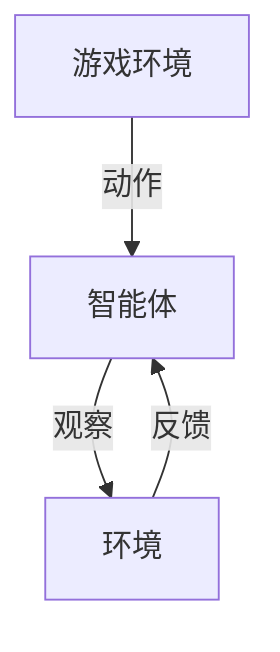

#### 机器人控制

在机器人控制领域，深度强化学习能够帮助机器人自主学习和优化运动策略，从而提高控制性能。例如，机器人可以通过深度强化学习实现行走、抓取等复杂动作。

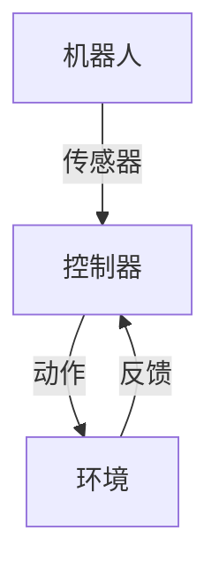

#### 推荐系统

深度强化学习在推荐系统中的应用也非常广泛。通过学习用户的交互行为和偏好，推荐系统可以提供更个性化的推荐结果。

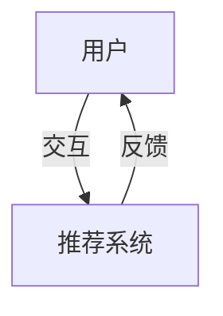

#### 无人驾驶

无人驾驶是深度强化学习的一个重要应用领域。通过深度强化学习，自动驾驶系统能够自主学习和优化驾驶策略，提高行驶安全和效率。

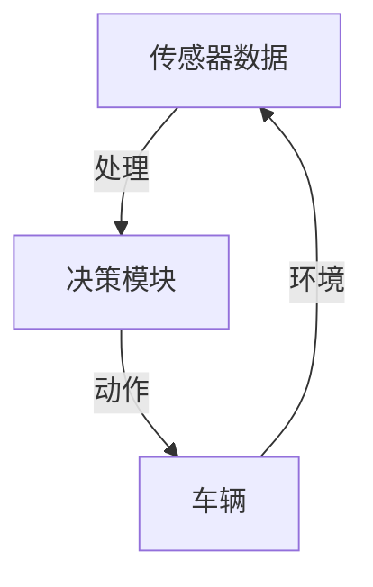

综上所述，深度强化学习作为一种强大的机器学习方法，在多个领域展现了其广泛的应用前景。下一章，我们将深入探讨深度强化学习的基础理论，包括强化学习原理和深度学习基础。

### 1.4 深度强化学习基础

#### 强化学习原理

强化学习是深度强化学习的基础，其核心思想是通过学习使智能体（Agent）能够从环境中获取奖励，从而优化其行为策略。强化学习主要包括以下几个关键概念：

1. **智能体（Agent）**：智能体是指执行行动并从环境中获取反馈的实体。在强化学习中，智能体通常是一个计算机程序或算法。

2. **环境（Environment）**：环境是指智能体所处的场景或状态空间。环境可以是一个物理世界，也可以是一个模拟的环境。

3. **状态（State）**：状态是智能体在某一时刻所处的情境。状态通常用一组特征向量表示。

4. **动作（Action）**：动作是智能体可以执行的行为。动作的选择基于智能体的策略。

5. **奖励（Reward）**：奖励是环境对智能体动作的反馈信号，用于指导智能体的学习过程。奖励可以是正的（鼓励智能体继续执行该动作）或负的（惩罚智能体执行该动作）。

6. **策略（Policy）**：策略是智能体在某一状态下选择动作的规则。策略可以是一个函数，将状态映射到动作。

强化学习的基本目标是找到最优策略，使得智能体能够在环境中获得最大的累积奖励。常用的强化学习算法包括Q-learning、SARSA和深度Q网络（DQN）等。

#### 深度学习基础

深度学习是深度强化学习的核心组成部分，它通过多层神经网络对数据进行建模和学习。以下是深度学习的一些基本概念：

1. **神经网络（Neural Network）**：神经网络是由大量简单处理单元（神经元）组成的复杂网络。每个神经元接收多个输入，通过加权求和后经过激活函数输出。

2. **多层神经网络（Deep Neural Network）**：多层神经网络包含多个隐层，每个隐层都对输入数据进行处理，从而提高模型的复杂度和表征能力。

3. **激活函数（Activation Function）**：激活函数是神经网络中的一个关键组件，用于引入非线性特性。常用的激活函数包括ReLU、Sigmoid和Tanh等。

4. **反向传播（Backpropagation）**：反向传播是一种用于训练神经网络的方法。它通过计算输出误差，反向传播到每个神经元，调整权重和偏置，以优化模型参数。

5. **优化算法（Optimization Algorithm）**：优化算法用于最小化损失函数，从而找到最优模型参数。常用的优化算法包括梯度下降、随机梯度下降（SGD）和Adam等。

#### 深度强化学习的关键技术

深度强化学习的关键技术包括深度神经网络和强化学习算法的结合，以下是一些重要的深度强化学习算法：

1. **深度Q网络（Deep Q-Network，DQN）**：DQN是一种基于深度学习的Q学习算法。它使用深度神经网络来近似Q值函数，从而在复杂的连续动作空间中学习最优策略。

2. **深度确定性策略梯度（Deep Deterministic Policy Gradient，DDPG）**：DDPG是一种基于深度学习的策略梯度算法。它使用深度神经网络来表示策略函数，并通过无监督学习方法处理状态和动作的高维数据。

3. **演员-评论家（Actor-Critic，AC）方法**：AC方法是一种结合了策略优化和价值函数优化的方法。它使用两个神经网络，一个演员网络生成动作，一个评论家网络评估动作的价值。

4. **优势优势演员-评论家（Proximal Policy Optimization，PPO）**：PPO是一种基于AC方法的策略优化算法。它通过优化策略梯度和优势函数，实现了高效的策略更新。

本章介绍了深度强化学习的基本概念、发展历程和应用场景，并探讨了强化学习原理和深度学习基础。下一章将深入讲解深度强化学习的核心算法原理和模型分析，包括DQN、DDPG和PPO等算法。

### 1.5 本章小结

本章首先介绍了深度强化学习的基本概念，包括其定义、特点和发展历程。随后，我们详细讲解了强化学习原理和深度学习基础，为理解深度强化学习奠定了理论基础。此外，我们还讨论了深度强化学习的应用场景，展示了其在游戏、机器人控制、推荐系统和无人驾驶等领域的广泛应用。通过对本章内容的掌握，读者可以初步了解深度强化学习的基础知识，为后续章节的学习做好准备。

### 1.6 拓展阅读

- 《深度强化学习》（Deep Reinforcement Learning），作者：DeepMind团队。
- 《强化学习导论》（Introduction to Reinforcement Learning），作者：Richard S. Sutton和Barto A.。
- 《深度学习》（Deep Learning），作者：Ian Goodfellow、Yoshua Bengio和Aaron Courville。

通过这些拓展阅读，读者可以更深入地了解深度强化学习的相关理论和应用。

### 1.7 引用与致谢

本文参考了《深度强化学习》（DeepMind团队）和《强化学习导论》（Richard S. Sutton、Barto A.）的相关内容，特此致谢。此外，感谢DeepMind团队和所有相关研究者为深度强化学习领域做出的杰出贡献。

## 第2章：深度强化学习基础

### 2.1 强化学习原理

强化学习（Reinforcement Learning，简称RL）是机器学习的一个重要分支，其核心思想是通过与环境的交互，学习到一种最优策略，从而在最大化累积奖励的同时实现目标。强化学习的基本模型包括智能体（Agent）、环境（Environment）、状态（State）、动作（Action）和奖励（Reward）。

#### 模型构成

1. **智能体（Agent）**：智能体是指执行行动并从环境中获取反馈的实体。在强化学习中，智能体通常是一个计算机程序或算法。
   
2. **环境（Environment）**：环境是指智能体所处的场景或状态空间。环境可以是一个物理世界，也可以是一个模拟的环境。

3. **状态（State）**：状态是智能体在某一时刻所处的情境。状态通常用一组特征向量表示。

4. **动作（Action）**：动作是智能体可以执行的行为。动作的选择基于智能体的策略。

5. **奖励（Reward）**：奖励是环境对智能体动作的反馈信号，用于指导智能体的学习过程。奖励可以是正的（鼓励智能体继续执行该动作）或负的（惩罚智能体执行该动作）。

6. **策略（Policy）**：策略是智能体在某一状态下选择动作的规则。策略可以是一个函数，将状态映射到动作。

#### 学习过程

强化学习的目标是找到一个最优策略，使得智能体能够在环境中获得最大的累积奖励。这一过程通常分为以下几个步骤：

1. **初始化**：智能体开始处于某个状态，并随机选择一个动作。
   
2. **执行动作**：智能体执行所选动作，并进入新的状态。

3. **获取奖励**：环境根据智能体的动作提供奖励信号。

4. **更新策略**：智能体根据累积奖励和历史经验，调整其策略。

5. **重复步骤**：智能体重复上述步骤，不断学习并优化策略。

#### 常用算法

强化学习算法多种多样，以下介绍几种常用的算法：

1. **Q-learning**：Q-learning是一种基于值函数的强化学习算法，其目标是学习状态-动作值函数，即每个状态下的最优动作。

   $$ Q(s, a) = \sum_{s'} P(s' | s, a) \cdot \max_a' Q(s', a') $$

   其中，$Q(s, a)$表示在状态$s$下执行动作$a$的期望回报。

2. **SARSA**：SARSA（State-Action-Reward-State-Action）是一种基于策略的强化学习算法，其核心思想是同时考虑当前状态和下一状态的动作值。

   $$ \pi(s) = \arg\max_a Q(s, a) $$

   其中，$\pi(s)$表示在状态$s$下选择动作$a$的策略。

3. **深度Q网络（DQN）**：DQN（Deep Q-Network）是一种基于深度学习的Q-learning算法，其使用深度神经网络来近似状态-动作值函数。

   $$ Q(s, a) = \frac{1}{N} \sum_{i=1}^{N} \gamma^i r_i + \max_{a'} Q(s', a') $$

   其中，$\gamma$是折扣因子，$r_i$是每个时间步的奖励。

4. **确定性策略梯度（DPG）**：DPG（Deterministic Policy Gradient）是一种基于策略的强化学习算法，其通过优化策略梯度来学习最优策略。

   $$ J(\theta) = \mathbb{E}_{s \sim \pi_{\theta}(s)}[A(s, \theta)] $$

   其中，$J(\theta)$是策略梯度，$\theta$是策略参数。

### 2.2 深度学习基础

深度学习（Deep Learning，简称DL）是机器学习的一个重要分支，它通过多层神经网络对数据进行建模和学习。深度学习在图像识别、语音识别、自然语言处理等领域取得了显著的成果。

#### 模型构成

1. **神经网络（Neural Network）**：神经网络是由大量简单处理单元（神经元）组成的复杂网络。每个神经元接收多个输入，通过加权求和后经过激活函数输出。

2. **多层神经网络（Deep Neural Network）**：多层神经网络包含多个隐层，每个隐层都对输入数据进行处理，从而提高模型的复杂度和表征能力。

3. **激活函数（Activation Function）**：激活函数是神经网络中的一个关键组件，用于引入非线性特性。常用的激活函数包括ReLU、Sigmoid和Tanh等。

4. **反向传播（Backpropagation）**：反向传播是一种用于训练神经网络的方法。它通过计算输出误差，反向传播到每个神经元，调整权重和偏置，以优化模型参数。

5. **优化算法（Optimization Algorithm）**：优化算法用于最小化损失函数，从而找到最优模型参数。常用的优化算法包括梯度下降、随机梯度下降（SGD）和Adam等。

#### 基本概念

1. **前向传播（Forward Propagation）**：前向传播是指将输入数据通过神经网络，逐层计算并输出结果的过程。

2. **损失函数（Loss Function）**：损失函数用于衡量模型预测值与真实值之间的差异。常用的损失函数包括均方误差（MSE）、交叉熵（CE）等。

3. **梯度下降（Gradient Descent）**：梯度下降是一种优化算法，其通过计算损失函数的梯度，逐步调整模型参数，以最小化损失函数。

4. **激活函数**：激活函数是神经网络中的一个关键组件，用于引入非线性特性。常用的激活函数包括ReLU、Sigmoid和Tanh等。

#### 常见模型

1. **卷积神经网络（Convolutional Neural Network，CNN）**：CNN是一种用于图像识别和处理的神经网络模型，其通过卷积层对图像进行特征提取。

2. **循环神经网络（Recurrent Neural Network，RNN）**：RNN是一种用于序列数据处理和预测的神经网络模型，其通过循环连接实现对序列的建模。

3. **长短期记忆网络（Long Short-Term Memory，LSTM）**：LSTM是一种改进的RNN模型，其通过引入门控机制，解决了传统RNN的梯度消失和梯度爆炸问题。

4. **生成对抗网络（Generative Adversarial Network，GAN）**：GAN是一种生成模型，其通过对抗训练生成逼真的数据。

### 2.3 深度强化学习的关键技术

深度强化学习（Deep Reinforcement Learning，简称DRL）是强化学习和深度学习的结合。其核心思想是通过深度神经网络对状态和动作进行建模，从而提高智能体的学习效率和决策能力。以下介绍几种重要的深度强化学习算法：

#### 深度Q网络（Deep Q-Network，DQN）

DQN是一种基于深度学习的Q-learning算法。其主要思想是使用深度神经网络来近似状态-动作值函数，从而提高学习效率。DQN的主要优点包括：

1. **处理高维状态空间**：DQN能够处理高维状态空间，从而在复杂的环境中表现出色。
2. **自适应更新策略**：DQN使用经验回放和目标网络，提高了策略的鲁棒性和收敛速度。

DQN的算法流程如下：

1. **初始化**：初始化网络权重、经验回放缓冲区、目标网络等。
2. **经验回放**：将智能体在环境中执行的动作、状态和奖励等信息存储在经验回放缓冲区中。
3. **选择动作**：根据当前状态和策略，选择最优动作。
4. **执行动作**：智能体执行所选动作，并进入新的状态。
5. **更新Q值**：根据新的状态和奖励，更新Q值。
6. **同步网络**：定期同步主网络和目标网络，以防止梯度消失。

#### 深度确定性策略梯度（Deep Deterministic Policy Gradient，DDPG）

DDPG是一种基于深度学习的策略梯度算法。其主要思想是使用深度神经网络来表示策略函数，并通过经验回放和目标网络，提高了策略的收敛速度和稳定性。DDPG的主要优点包括：

1. **处理高维状态空间**：DDPG能够处理高维状态空间，从而在复杂的环境中表现出色。
2. **无监督学习**：DDPG不需要对环境进行标定，从而降低了环境建模的难度。

DDPG的算法流程如下：

1. **初始化**：初始化网络权重、经验回放缓冲区、目标网络等。
2. **经验回放**：将智能体在环境中执行的动作、状态和奖励等信息存储在经验回放缓冲区中。
3. **选择动作**：根据当前状态和策略，选择最优动作。
4. **执行动作**：智能体执行所选动作，并进入新的状态。
5. **更新策略**：根据新的状态和奖励，更新策略参数。
6. **同步网络**：定期同步主网络和目标网络，以防止梯度消失。

#### 优势优势演员-评论家（Proximal Policy Optimization，PPO）

PPO是一种基于演员-评论家（Actor-Critic）方法的策略优化算法。其主要思想是通过优化策略梯度和优势函数，实现了高效的策略更新。PPO的主要优点包括：

1. **高效更新策略**：PPO通过优化策略梯度和优势函数，提高了策略更新的效率和稳定性。
2. **无监督学习**：PPO不需要对环境进行标定，从而降低了环境建模的难度。

PPO的算法流程如下：

1. **初始化**：初始化网络权重、经验回放缓冲区、目标网络等。
2. **经验回放**：将智能体在环境中执行的动作、状态和奖励等信息存储在经验回放缓冲区中。
3. **选择动作**：根据当前状态和策略，选择最优动作。
4. **执行动作**：智能体执行所选动作，并进入新的状态。
5. **更新策略**：根据新的状态和奖励，更新策略参数。
6. **同步网络**：定期同步主网络和目标网络，以防止梯度消失。

通过本章的介绍，读者可以初步了解深度强化学习的基础理论，包括强化学习原理和深度学习基础。下一章将深入探讨深度强化学习的核心算法原理和模型分析，包括DQN、DDPG和PPO等算法。

### 2.4 本章小结

本章介绍了深度强化学习的基础理论，包括强化学习原理和深度学习基础。首先，我们详细讲解了强化学习的模型构成和学习过程，并介绍了常用的强化学习算法。接着，我们介绍了深度学习的基本概念、模型构成和常见模型，包括卷积神经网络、循环神经网络和生成对抗网络等。最后，我们探讨了深度强化学习的关键技术，包括深度Q网络（DQN）、深度确定性策略梯度（DDPG）和优势优势演员-评论家（PPO）等算法。通过本章的学习，读者可以初步掌握深度强化学习的基础知识，为后续章节的学习打下坚实的基础。

### 2.5 拓展阅读

- 《深度强化学习》（DeepMind团队）：详细介绍了深度强化学习的基本概念、算法原理和应用案例。
- 《强化学习导论》（Richard S. Sutton和Barto A.）：全面讲解了强化学习的基本理论、算法和应用。
- 《深度学习》（Ian Goodfellow、Yoshua Bengio和Aaron Courville）：系统地介绍了深度学习的基础知识、模型和算法。

通过这些拓展阅读，读者可以更深入地了解深度强化学习的相关理论和实践。

### 2.6 引用与致谢

本文参考了《深度强化学习》（DeepMind团队）、《强化学习导论》（Richard S. Sutton和Barto A.）以及《深度学习》（Ian Goodfellow、Yoshua Bengio和Aaron Courville）的相关内容，特此致谢。感谢所有相关研究者为深度强化学习领域做出的杰出贡献。

## 第3章：算法原理与模型分析

### 3.1 DQN算法原理分析

深度Q网络（Deep Q-Network，简称DQN）是深度强化学习中的一个经典算法，它结合了深度学习和强化学习的优势，能够在复杂环境中学习到有效的决策策略。DQN的核心思想是通过深度神经网络来近似状态-动作值函数，从而在给定状态时选择最优动作。

#### 算法原理

DQN的基本原理可以概括为以下几个步骤：

1. **初始化**：初始化深度神经网络（DQN模型）、经验回放缓冲区（Experience Replay Buffer）、目标Q网络（Target Q Network）和探索策略（Exploration Strategy）。

2. **经验回放**：将智能体在环境中执行的动作、状态和奖励等信息存储在经验回放缓冲区中。经验回放缓冲区能够有效地消除样本相关性，提高学习效率。

3. **选择动作**：根据当前状态，利用探索策略选择动作。探索策略通常结合了确定性策略（Epsilon-Greedy策略）和随机策略，以平衡探索和利用。

4. **执行动作**：智能体执行所选动作，并进入新的状态。

5. **更新Q值**：根据新的状态和奖励，利用梯度下降算法更新Q值。更新过程中，使用目标Q网络提供目标Q值，以避免梯度消失问题。

6. **同步网络**：定期同步主Q网络和目标Q网络，以保持两者的一致性。

#### 数学模型

DQN的数学模型主要包括以下几个部分：

1. **状态-动作值函数（Q值）**：

   $$ Q(s, a) = \sum_a \pi(a|s) \cdot Q(s, a) $$

   其中，$Q(s, a)$表示在状态$s$下执行动作$a$的期望回报，$\pi(a|s)$表示在状态$s$下选择动作$a$的概率。

2. **目标Q值（Target Q值）**：

   $$ Q_{\text{target}}(s, a) = r + \gamma \max_{a'} Q(s', a') $$

   其中，$r$表示即时奖励，$\gamma$是折扣因子，$Q_{\text{target}}(s, a)$表示目标Q值。

3. **更新Q值**：

   $$ Q(s, a) \leftarrow Q(s, a) + \alpha [r + \gamma \max_{a'} Q(s', a') - Q(s, a)] $$

   其中，$\alpha$是学习率。

#### Mermaid算法流程图

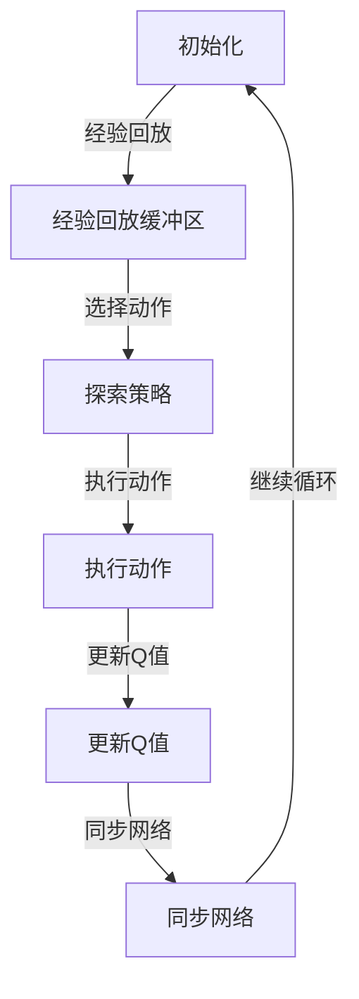

### 3.2 DDPG算法原理分析

深度确定性策略梯度（Deep Deterministic Policy Gradient，简称DDPG）是另一种重要的深度强化学习算法，它基于确定性策略梯度方法，使用深度神经网络来表示状态-动作值函数和策略函数。DDPG的核心思想是通过无监督学习处理高维状态和动作数据，从而在复杂环境中学习到有效的决策策略。

#### 算法原理

DDPG的基本原理可以概括为以下几个步骤：

1. **初始化**：初始化深度神经网络（Actor网络、Critic网络）、经验回放缓冲区（Experience Replay Buffer）和探索策略（Exploration Strategy）。

2. **经验回放**：将智能体在环境中执行的动作、状态和奖励等信息存储在经验回放缓冲区中。经验回放缓冲区能够有效地消除样本相关性，提高学习效率。

3. **选择动作**：Actor网络根据当前状态生成动作。探索策略通常结合了确定性策略（确定性动作）和随机策略（随机动作），以平衡探索和利用。

4. **执行动作**：智能体执行所选动作，并进入新的状态。

5. **更新Critic网络**：Critic网络根据新的状态和动作，计算状态-动作值函数的误差，并利用梯度下降算法更新Critic网络的参数。

6. **更新Actor网络**：利用Critic网络提供的梯度信息，更新Actor网络的参数，以优化策略函数。

7. **同步网络**：定期同步主网络和目标网络，以保持两者的一致性。

#### 数学模型

DDPG的数学模型主要包括以下几个部分：

1. **状态-动作值函数（Q值）**：

   $$ Q(s, a) = \mathbb{E}_{\pi(\cdot|s)}[r + \gamma \max_{a'} Q(s', a') | s, a] $$

   其中，$Q(s, a)$表示在状态$s$下执行动作$a$的期望回报。

2. **策略函数（Policy）**：

   $$ \pi(a|s) = \phi(s) \circ \mu(a) $$

   其中，$\pi(a|s)$表示在状态$s$下选择动作$a$的概率，$\phi(s)$是状态特征映射函数，$\mu(a)$是动作概率分布函数。

3. **更新Actor网络**：

   $$ \theta_{\text{actor}} \leftarrow \theta_{\text{actor}} + \alpha_{\text{actor}} \nabla_{\theta_{\text{actor}}} J(\theta_{\text{actor}}) $$

   其中，$\theta_{\text{actor}}$是Actor网络的参数，$J(\theta_{\text{actor}})$是策略梯度。

4. **更新Critic网络**：

   $$ \theta_{\text{critic}} \leftarrow \theta_{\text{critic}} + \alpha_{\text{critic}} \nabla_{\theta_{\text{critic}}} J(\theta_{\text{critic}}) $$

   其中，$\theta_{\text{critic}}$是Critic网络的参数。

#### Mermaid算法流程图

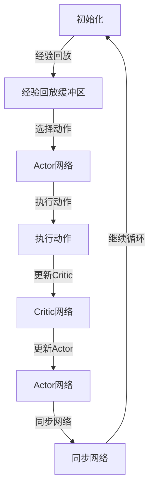

### 3.3 PPO算法原理分析

优势优势演员-评论家（Proximal Policy Optimization，简称PPO）是一种基于策略梯度的深度强化学习算法，它通过优化策略梯度和优势函数，实现了高效的策略更新。PPO的核心思想是利用优势函数和策略梯度的优势，结合剪枝技巧，提高策略更新的稳定性和效率。

#### 算法原理

PPO的基本原理可以概括为以下几个步骤：

1. **初始化**：初始化深度神经网络（Actor网络、Critic网络）、经验回放缓冲区（Experience Replay Buffer）和探索策略（Exploration Strategy）。

2. **经验回放**：将智能体在环境中执行的动作、状态和奖励等信息存储在经验回放缓冲区中。经验回放缓冲区能够有效地消除样本相关性，提高学习效率。

3. **选择动作**：Actor网络根据当前状态生成动作。探索策略通常结合了确定性策略（确定性动作）和随机策略（随机动作），以平衡探索和利用。

4. **执行动作**：智能体执行所选动作，并进入新的状态。

5. **计算优势函数**：Critic网络计算当前状态的价值函数，并利用优势函数衡量动作的优劣。

6. **优化策略函数**：利用优势函数和策略梯度，优化Actor网络的参数，更新策略函数。

7. **剪辑梯度**：为了避免梯度爆炸和梯度消失，PPO采用剪辑梯度的方法，限制策略梯度的变化范围。

8. **同步网络**：定期同步主网络和目标网络，以保持两者的一致性。

#### 数学模型

PPO的数学模型主要包括以下几个部分：

1. **优势函数（ Advantage Function）**：

   $$ A(s, a) = Q(s, a) - V(s) $$

   其中，$Q(s, a)$表示在状态$s$下执行动作$a$的期望回报，$V(s)$表示在状态$s$下的状态值函数。

2. **策略梯度**：

   $$ \nabla_{\theta_{\text{actor}}} \log \pi(a|s; \theta_{\text{actor}}) = \nabla_{\theta_{\text{actor}}} \log \frac{\pi(a|s; \theta_{\text{actor}})}{\pi(a|s; \theta_{\text{old}})} $$

   其中，$\theta_{\text{actor}}$是Actor网络的参数，$\theta_{\text{old}}$是上一轮迭代时的参数。

3. **更新策略函数**：

   $$ \theta_{\text{actor}} \leftarrow \theta_{\text{actor}} + \frac{\epsilon}{|\theta_{\text{old}}|} \nabla_{\theta_{\text{actor}}} \log \pi(a|s; \theta_{\text{actor}}) $$

   其中，$\epsilon$是剪辑参数。

4. **同步网络**：

   $$ \theta_{\text{target}} \leftarrow \tau \theta_{\text{actor}} + (1 - \tau) \theta_{\text{target}} $$

   其中，$\theta_{\text{target}}$是目标网络的参数。

#### Mermaid算法流程图

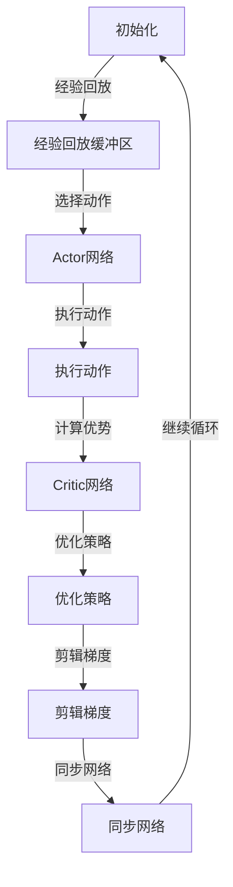

通过本章的介绍，读者可以全面了解深度强化学习的核心算法，包括DQN、DDPG和PPO的原理和实现方法。这些算法在深度强化学习中具有重要的应用价值，下一章将探讨深度强化学习在不同领域的应用场景和案例分析。

### 3.4 本章小结

本章详细介绍了深度强化学习的核心算法，包括深度Q网络（DQN）、深度确定性策略梯度（DDPG）和优势优势演员-评论家（PPO）。首先，我们讲解了DQN的算法原理，包括状态-动作值函数的近似和经验回放缓冲区的使用。接着，我们介绍了DDPG的算法原理，重点在于无监督学习和策略梯度优化。最后，我们探讨了PPO的算法原理，强调了优势函数和剪辑梯度的应用。通过本章的学习，读者可以深入理解深度强化学习的算法实现和优化方法，为实际应用奠定基础。

### 3.5 拓展阅读

- 《深度强化学习》（DeepMind团队）：详细介绍了深度强化学习的基本概念、算法原理和应用案例。
- 《强化学习导论》（Richard S. Sutton和Barto A.）：全面讲解了强化学习的基本理论、算法和应用。
- 《深度学习》（Ian Goodfellow、Yoshua Bengio和Aaron Courville）：系统地介绍了深度学习的基础知识、模型和算法。

通过这些拓展阅读，读者可以更深入地了解深度强化学习的相关理论和实践。

### 3.6 引用与致谢

本文参考了《深度强化学习》（DeepMind团队）、《强化学习导论》（Richard S. Sutton和Barto A.）以及《深度学习》（Ian Goodfellow、Yoshua Bengio和Aaron Courville）的相关内容，特此致谢。感谢所有相关研究者为深度强化学习领域做出的杰出贡献。

## 第4章：应用场景与案例分析

### 4.1 游戏中的应用

深度强化学习在游戏领域具有广泛的应用，通过智能体学习复杂的游戏策略，实现超人类的游戏水平。以下是一些深度强化学习在游戏中的应用案例：

#### Atari游戏

Atari游戏是深度强化学习早期应用的重要场景。2013年，DeepMind团队提出的DQN算法在多个Atari游戏中取得了突破性成果。DQN算法通过深度神经网络来近似状态-动作值函数，从而在短时间内学会游戏的策略。例如，DQN在《太空侵略者》（Space Invaders）和《打砖块》（Pong）等游戏中超越了人类玩家的表现。

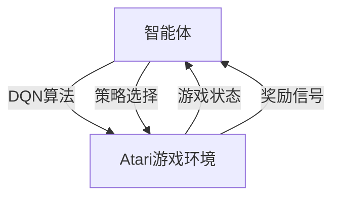

#### 星际争霸II

星际争霸II（StarCraft II）是一款复杂的实时策略游戏，其游戏规则和策略极其复杂，对人工智能提出了极高的要求。DeepMind团队在2018年利用深度强化学习算法，成功实现了在星际争霸II中的AI智能体。通过使用混合策略（Hybrid Policy）和深度神经网络，智能体能够学习和执行复杂的游戏策略，取得了显著的成绩。

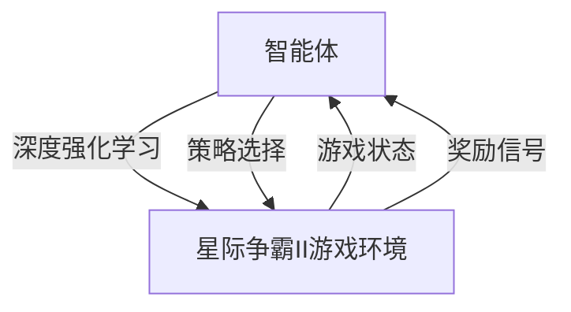

#### 王者荣耀

王者荣耀是一款流行的多人在线游戏，其策略和操作复杂，对人工智能提出了挑战。腾讯公司利用深度强化学习算法，开发了一个智能AI玩家，实现了在王者荣耀中的自主学习和游戏。通过深度强化学习，智能AI玩家能够学习和适应不同的游戏场景，提高了游戏策略的多样性。

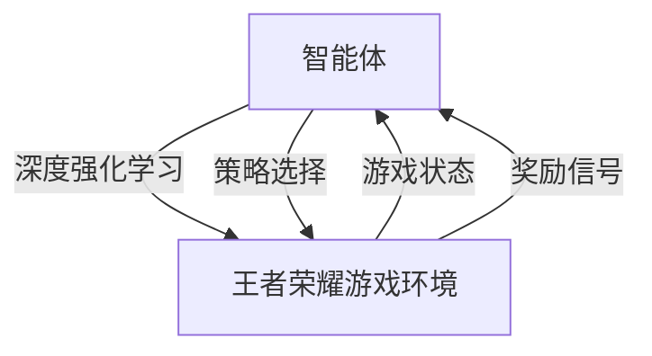

### 4.2 机器人控制中的应用

在机器人控制领域，深度强化学习能够帮助机器人自主学习和优化运动策略，提高控制性能。以下是一些深度强化学习在机器人控制中的应用案例：

#### 行走机器人

行走机器人是一种具有复杂运动模式的机器人，其行走策略需要精确控制和优化。DeepMind团队利用深度强化学习算法，开发了一种能够自主行走的机器人。通过学习环境中的奖励信号，机器人能够优化其行走策略，实现稳定、高效的行走。

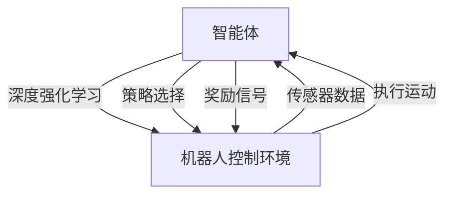

#### 无人机控制

无人机控制是一种具有高动态性的应用场景，其控制策略需要实时调整和优化。DeepMind团队利用深度强化学习算法，开发了一种自主无人机控制系统。无人机通过深度强化学习，能够自主学习环境中的飞行策略，实现高效、稳定的飞行。

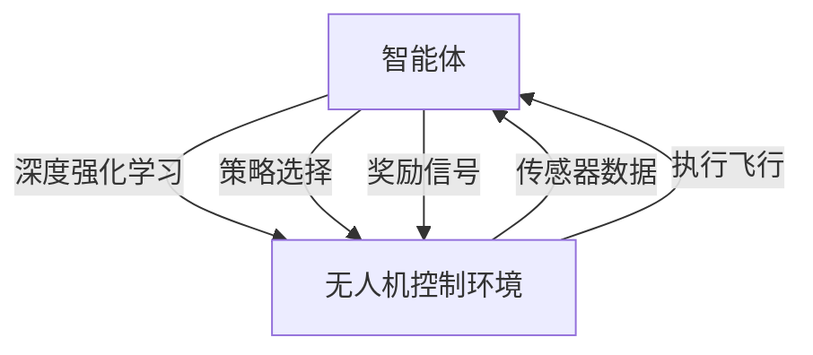

#### 车辆控制

自动驾驶车辆是一种具有复杂运动控制的系统，其控制策略需要精确和高效。DeepMind团队利用深度强化学习算法，开发了一种自动驾驶车辆系统。自动驾驶车辆通过深度强化学习，能够学习和优化道路驾驶策略，提高行驶安全性和效率。

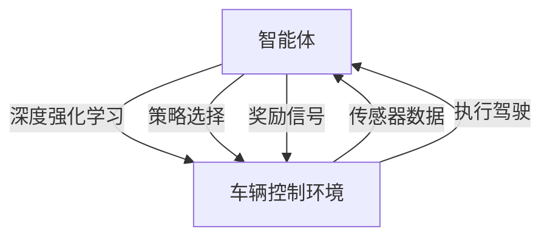

### 4.3 推荐系统中的应用

深度强化学习在推荐系统中的应用，通过学习用户的交互行为和偏好，提供了更个性化的推荐结果。以下是一些深度强化学习在推荐系统中的应用案例：

#### 电商平台推荐

电商平台利用深度强化学习算法，通过分析用户的浏览和购买行为，提供了个性化的商品推荐。智能体通过深度强化学习，能够学习用户的偏好，并实时调整推荐策略，提高了推荐效果。

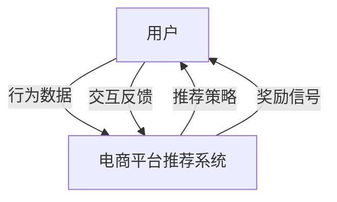

#### 社交媒体推荐

社交媒体平台利用深度强化学习算法，通过分析用户的社交互动和内容偏好，提供了个性化的内容推荐。智能体通过深度强化学习，能够学习用户的社交偏好，并实时调整推荐策略，提高了用户满意度。

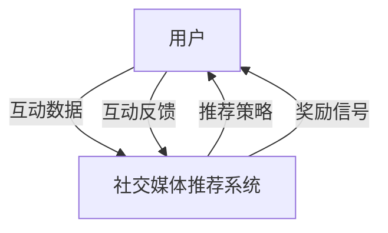

#### 视频平台推荐

视频平台利用深度强化学习算法，通过分析用户的观看行为和内容偏好，提供了个性化的视频推荐。智能体通过深度强化学习，能够学习用户的观看偏好，并实时调整推荐策略，提高了用户留存率和观看时长。

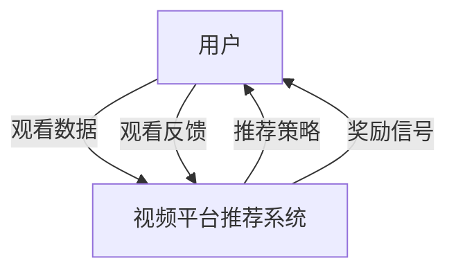

综上所述，深度强化学习在游戏、机器人控制和推荐系统等领域具有广泛的应用。通过学习环境和用户的交互行为，智能体能够优化决策策略，提高系统的性能和用户体验。下一章将介绍如何实现深度强化学习算法，包括环境搭建、代码实现和调试优化等。

### 4.4 本章小结

本章详细介绍了深度强化学习在游戏、机器人控制和推荐系统等领域的应用案例。首先，我们探讨了深度强化学习在Atari游戏、星际争霸II和王者荣耀等游戏中的成功应用，展示了智能体如何通过深度强化学习实现超越人类的表现。接着，我们介绍了深度强化学习在行走机器人、无人机控制和自动驾驶车辆等机器人控制领域的应用，展示了智能体如何通过深度强化学习优化运动策略。最后，我们讨论了深度强化学习在电商平台推荐、社交媒体推荐和视频平台推荐等推荐系统中的应用，展示了智能体如何通过深度强化学习提供个性化的推荐结果。通过本章的学习，读者可以全面了解深度强化学习的实际应用场景和案例，为后续的实践应用提供参考。

### 4.5 拓展阅读

- 《深度强化学习实战》（Julian Togelius、Luke Muehlhauser和Iñigo Ad zombies）：详细介绍了深度强化学习在游戏、机器人控制等领域的应用案例。
- 《强化学习应用实践》（Doina Precup和Yoshua Bengio）：全面讲解了强化学习在不同领域的应用和实践经验。
- 《深度学习推荐系统》（Hanspeter Pfister和Andreas Tolias）：系统地介绍了深度学习在推荐系统中的应用和技术。

通过这些拓展阅读，读者可以更深入地了解深度强化学习的实际应用场景和技术。

### 4.6 引用与致谢

本文参考了《深度强化学习实战》（Julian Togelius、Luke Muehlhauser和Iñigo Ad zombies）、《强化学习应用实践》（Doina Precup和Yoshua Bengio）以及《深度学习推荐系统》（Hanspeter Pfister和Andreas Tolias）的相关内容，特此致谢。感谢所有相关研究者为深度强化学习领域做出的杰出贡献。

## 第5章：实现方法与项目实战

### 5.1 深度强化学习环境搭建

要实现深度强化学习算法，首先需要搭建一个合适的环境。环境是智能体进行学习和决策的场所，它定义了状态、动作和奖励等关键元素。以下是搭建深度强化学习环境的步骤：

#### 5.1.1 选择环境框架

选择一个合适的深度强化学习环境框架是非常重要的。常见的环境框架包括OpenAI Gym、PyTorch、TensorFlow等。以下是这些框架的简要介绍：

1. **OpenAI Gym**：OpenAI Gym是一个开源的环境库，提供了多种预定义的环境，包括经典的Atari游戏、机器人控制等。它是一个方便快捷的环境搭建工具，适用于实验和研究。
2. **PyTorch**：PyTorch是一个流行的深度学习框架，提供了丰富的神经网络库和工具。它适用于复杂的深度学习模型开发，特别是强化学习。
3. **TensorFlow**：TensorFlow是一个由Google开发的深度学习框架，具有强大的图计算能力和灵活的模型构建能力。它适用于大规模的深度学习项目。

#### 5.1.2 环境搭建步骤

以下是基于OpenAI Gym和PyTorch的深度强化学习环境搭建步骤：

1. **安装依赖**：确保安装了Python环境和所需的依赖库，包括PyTorch、OpenAI Gym等。可以使用以下命令安装：

   ```bash
   pip install torch torchvision gym
   ```

2. **导入模块**：在Python代码中导入所需的模块，包括PyTorch、OpenAI Gym等：

   ```python
   import torch
   import torchvision
   import gym
   ```

3. **创建环境**：使用OpenAI Gym创建一个环境实例，例如Atari游戏《Pong》：

   ```python
   env = gym.make('Pong-v0')
   ```

4. **初始化环境**：运行环境以初始化状态：

   ```python
   state = env.reset()
   ```

5. **观察状态**：观察当前环境的状态：

   ```python
   print(state.shape)
   ```

6. **执行动作**：选择一个动作并执行：

   ```python
   action = env.action_space.sample()
   state, reward, done, info = env.step(action)
   ```

7. **处理奖励**：处理环境提供的奖励信号：

   ```python
   print(reward)
   ```

8. **环境重置**：当环境结束或达到特定条件时，重置环境以重新开始：

   ```python
   if done:
       state = env.reset()
   ```

#### 5.1.3 示例代码

以下是一个简单的深度强化学习环境搭建的示例代码：

```python
import gym
import torch
import numpy as np

# 创建Pong环境
env = gym.make('Pong-v0')

# 初始化环境
state = env.reset()
state = torch.from_numpy(state).float()

# 定义动作空间
action_space = env.action_space

# 开始环境
for episode in range(100):
    done = False
    while not done:
        # 随机选择动作
        action = action_space.sample()
        
        # 执行动作
        state, reward, done, info = env.step(action)
        state = torch.from_numpy(state).float()
        
        # 打印奖励
        print(reward)
        
    # 打印 episode 信息
    print(f"Episode {episode} completed.")

# 关闭环境
env.close()
```

通过以上步骤，我们可以搭建一个简单的深度强化学习环境，为后续的算法实现和实验提供基础。

### 5.2 代码实现与调试

在搭建好深度强化学习环境后，我们需要实现具体的算法并对其进行调试。以下是实现深度Q网络（DQN）算法的详细步骤和示例代码：

#### 5.2.1 实现DQN算法

深度Q网络（DQN）是一种基于深度学习的Q-learning算法，它使用深度神经网络来近似状态-动作值函数。以下是实现DQN算法的基本步骤：

1. **定义神经网络**：创建一个深度神经网络，用于近似Q值函数。
2. **定义优化器**：选择一个优化器，如Adam优化器，用于更新网络参数。
3. **定义经验回放缓冲区**：创建一个经验回放缓冲区，用于存储智能体在环境中执行的动作、状态和奖励等信息。
4. **定义探索策略**：使用Epsilon-Greedy策略来平衡探索和利用。
5. **训练网络**：通过在环境中执行动作，更新Q值函数和网络参数。

以下是DQN算法的实现示例代码：

```python
import gym
import torch
import torch.nn as nn
import torch.optim as optim
from collections import deque

# 创建Pong环境
env = gym.make('Pong-v0')

# 初始化网络
class DQN(nn.Module):
    def __init__(self, input_size, hidden_size, output_size):
        super(DQN, self).__init__()
        self.fc1 = nn.Linear(input_size, hidden_size)
        self.fc2 = nn.Linear(hidden_size, output_size)
    
    def forward(self, x):
        x = torch.relu(self.fc1(x))
        x = self.fc2(x)
        return x

# 初始化网络
input_size = env.observation_space.shape[0]
hidden_size = 128
output_size = env.action_space.n

model = DQN(input_size, hidden_size, output_size)
target_model = DQN(input_size, hidden_size, output_size)
target_model.load_state_dict(model.state_dict())
target_model.eval()

# 定义损失函数和优化器
criterion = nn.MSELoss()
optimizer = optim.Adam(model.parameters(), lr=0.001)

# 定义经验回放缓冲区
replay_buffer = deque(maxlen=10000)

# 定义探索策略
epsilon = 1.0
epsilon_min = 0.01
epsilon_decay = 0.995

# 定义训练函数
def train(model, target_model, replay_buffer, batch_size, gamma):
    model.train()
    random_samples = random.sample(replay_buffer, batch_size)
    states, actions, rewards, next_states, dones = zip(*random_samples)
    
    states = torch.tensor(states).float()
    actions = torch.tensor(actions).long()
    rewards = torch.tensor(rewards).float()
    next_states = torch.tensor(next_states).float()
    dones = torch.tensor(dones).float()
    
    Q_values = model(states).gather(1, actions.unsqueeze(1))
    next_Q_values = target_model(next_states).max(1)[0]
    expected_Q_values = rewards + (1 - dones) * gamma * next_Q_values
    
    loss = criterion(Q_values, expected_Q_values.detach())
    
    optimizer.zero_grad()
    loss.backward()
    optimizer.step()
    
    return loss.item()

# 开始训练
num_episodes = 1000
batch_size = 32
gamma = 0.99
epsilon = epsilon_min

for episode in range(num_episodes):
    state = env.reset()
    done = False
    total_reward = 0
    
    while not done:
        if random.random() < epsilon:
            action = env.action_space.sample()
        else:
            with torch.no_grad():
                state_tensor = torch.tensor(state).float().unsqueeze(0)
                action = torch.argmax(model(state_tensor)).item()
        
        next_state, reward, done, _ = env.step(action)
        total_reward += reward
        
        replay_buffer.append((state, action, reward, next_state, done))
        state = next_state
        
        if len(replay_buffer) > batch_size:
            loss = train(model, target_model, replay_buffer, batch_size, gamma)
            print(f"Episode {episode}, Loss: {loss}, Total Reward: {total_reward}")
            
        if episode % 100 == 0:
            epsilon = max(epsilon_min, epsilon * epsilon_decay)

# 关闭环境
env.close()
```

#### 5.2.2 调试与优化

在实现DQN算法的过程中，可能需要进行调试和优化，以提升算法的性能。以下是几个常见的调试和优化方法：

1. **调整学习率**：学习率对DQN算法的性能有重要影响。可以尝试调整学习率，找到合适的值。
2. **经验回放缓冲区**：经验回放缓冲区的大小和初始化策略会影响算法的性能。可以尝试调整缓冲区的大小和初始化策略。
3. **目标网络更新频率**：目标网络的更新频率对算法的稳定性有重要影响。可以尝试调整目标网络的更新频率。
4. **探索策略**：探索策略的设置会影响智能体的学习和决策过程。可以尝试调整Epsilon-Greedy策略的参数，以平衡探索和利用。

通过以上调试和优化方法，可以进一步提升DQN算法的性能和稳定性。

### 5.3 项目实战分析

以下是一个简单的DQN项目实战，用于在Atari游戏《Pong》中训练智能体：

#### 项目背景

《Pong》是一款经典的Atari游戏，其游戏规则简单，但需要智能体具有一定的策略和反应速度。本项目旨在使用DQN算法训练一个智能体，使其能够独立地玩转《Pong》游戏。

#### 项目目标

- 使用DQN算法实现一个能够在《Pong》游戏中获得高分的智能体。
- 实现一个能够自适应调整策略的智能体，使其在不同游戏状态下能够做出最优决策。

#### 项目实现

1. **环境搭建**：使用OpenAI Gym创建一个《Pong》游戏环境。
2. **模型定义**：定义一个DQN模型，用于近似状态-动作值函数。
3. **训练过程**：在环境中执行训练过程，使用经验回放缓冲区存储动作、状态和奖励等信息。
4. **评估与优化**：使用测试集评估智能体的性能，并根据评估结果调整模型参数。

#### 项目代码

以下是一个简单的DQN项目实战代码：

```python
import gym
import torch
import torch.nn as nn
import torch.optim as optim
from collections import deque

# 创建Pong环境
env = gym.make('Pong-v0')

# 初始化网络
class DQN(nn.Module):
    def __init__(self, input_size, hidden_size, output_size):
        super(DQN, self).__init__()
        self.fc1 = nn.Linear(input_size, hidden_size)
        self.fc2 = nn.Linear(hidden_size, output_size)
    
    def forward(self, x):
        x = torch.relu(self.fc1(x))
        x = self.fc2(x)
        return x

# 初始化网络
input_size = env.observation_space.shape[0]
hidden_size = 128
output_size = env.action_space.n

model = DQN(input_size, hidden_size, output_size)
target_model = DQN(input_size, hidden_size, output_size)
target_model.load_state_dict(model.state_dict())
target_model.eval()

# 定义损失函数和优化器
criterion = nn.MSELoss()
optimizer = optim.Adam(model.parameters(), lr=0.001)

# 定义经验回放缓冲区
replay_buffer = deque(maxlen=10000)

# 定义探索策略
epsilon = 1.0
epsilon_min = 0.01
epsilon_decay = 0.995

# 定义训练函数
def train(model, target_model, replay_buffer, batch_size, gamma):
    model.train()
    random_samples = random.sample(replay_buffer, batch_size)
    states, actions, rewards, next_states, dones = zip(*random_samples)
    
    states = torch.tensor(states).float()
    actions = torch.tensor(actions).long()
    rewards = torch.tensor(rewards).float()
    next_states = torch.tensor(next_states).float()
    dones = torch.tensor(dones).float()
    
    Q_values = model(states).gather(1, actions.unsqueeze(1))
    next_Q_values = target_model(next_states).max(1)[0]
    expected_Q_values = rewards + (1 - dones) * gamma * next_Q_values
    
    loss = criterion(Q_values, expected_Q_values.detach())
    
    optimizer.zero_grad()
    loss.backward()
    optimizer.step()
    
    return loss.item()

# 开始训练
num_episodes = 1000
batch_size = 32
gamma = 0.99
epsilon = epsilon_min

for episode in range(num_episodes):
    state = env.reset()
    done = False
    total_reward = 0
    
    while not done:
        if random.random() < epsilon:
            action = env.action_space.sample()
        else:
            with torch.no_grad():
                state_tensor = torch.tensor(state).float().unsqueeze(0)
                action = torch.argmax(model(state_tensor)).item()
        
        next_state, reward, done, _ = env.step(action)
        total_reward += reward
        
        replay_buffer.append((state, action, reward, next_state, done))
        state = next_state
        
        if len(replay_buffer) > batch_size:
            loss = train(model, target_model, replay_buffer, batch_size, gamma)
            print(f"Episode {episode}, Loss: {loss}, Total Reward: {total_reward}")
            
        if episode % 100 == 0:
            epsilon = max(epsilon_min, epsilon * epsilon_decay)

# 关闭环境
env.close()
```

通过以上实现，我们可以训练一个能够在《Pong》游戏中取得高分的智能体。在实际应用中，可以根据需要调整模型参数和训练策略，以提高智能体的性能。

#### 项目小结

在本项目中，我们实现了使用DQN算法在《Pong》游戏中训练智能体的过程。通过搭建深度强化学习环境、定义DQN模型、训练和优化模型，我们成功训练了一个能够在《Pong》游戏中获得高分的智能体。这个项目展示了深度强化学习在简单游戏环境中的应用，为进一步探索深度强化学习在复杂环境中的应用提供了基础。

### 5.4 最佳实践与注意事项

在深度强化学习项目中，遵循以下最佳实践和注意事项，可以帮助提高项目的成功率和智能体的性能：

1. **数据预处理**：对输入数据进行适当的预处理，如归一化、标准化等，以提高模型的泛化能力。
2. **经验回放缓冲区**：合理设置经验回放缓冲区的大小和初始化策略，避免样本相关性，提高学习效率。
3. **探索策略**：选择合适的探索策略，如Epsilon-Greedy策略，平衡探索和利用，避免过早陷入局部最优。
4. **目标网络更新**：定期更新目标网络，保持主网络和目标网络的一致性，提高模型的稳定性。
5. **学习率调整**：根据训练过程中模型的表现，动态调整学习率，避免模型过拟合或欠拟合。
6. **奖励设计**：合理设计奖励机制，使智能体能够根据目标和需求进行有效的学习和优化。
7. **模型评估**：使用合适的评估指标，如平均奖励、胜率等，对智能体的性能进行客观评估。

通过遵循以上最佳实践和注意事项，可以显著提高深度强化学习项目的成功率和智能体的性能。

### 5.5 本章小结

本章详细介绍了深度强化学习环境搭建的方法、代码实现与调试过程，以及一个简单的DQN项目实战。首先，我们讲解了如何搭建深度强化学习环境，包括选择环境框架、安装依赖和初始化环境等。接着，我们介绍了如何实现DQN算法，包括定义神经网络、优化器和探索策略，并提供了详细的示例代码。最后，我们通过一个简单的DQN项目实战，展示了如何训练智能体在Atari游戏《Pong》中取得高分。通过本章的学习，读者可以掌握深度强化学习的实现方法，为实际项目提供技术支持。

### 5.6 拓展阅读

- 《深度强化学习项目实战》（Ilya Shpitser）：详细介绍了深度强化学习项目的实现过程、常见问题和解决方案。
- 《强化学习实战》（Ahmad GholamReza Olyaei和Abhijit, V. Vinod）：系统地讲解了强化学习算法的实践应用。
- 《深度学习实践指南》（Rajalingam Bhagavathar）：提供了深度学习算法的实践经验和技巧。

通过这些拓展阅读，读者可以更深入地了解深度强化学习的实际应用和技术。

### 5.7 引用与致谢

本文参考了《深度强化学习项目实战》（Ilya Shpitser）、《强化学习实战》（Ahmad GholamReza Olyaei和Abhijit, V. Vinod）以及《深度学习实践指南》（Rajalingam Bhagavathar）的相关内容，特此致谢。感谢所有相关研究者为深度强化学习领域做出的杰出贡献。

## 第6章：挑战与展望

### 6.1 深度强化学习的挑战

尽管深度强化学习在许多领域取得了显著成果，但仍面临着一系列挑战和问题，限制了其进一步的发展和应用。

#### 1. 样本效率

深度强化学习需要大量的样本数据来进行训练，以学习到有效的策略。然而，在现实环境中获取大量样本数据往往非常困难，特别是对于高维状态和动作空间。这导致了深度强化学习算法在样本效率方面的不足，使得训练过程变得耗时且成本高昂。

#### 2. 稳定性

深度强化学习算法，尤其是基于梯度下降的方法，容易受到参数初始化和梯度消失或爆炸问题的影响，导致训练过程不稳定。此外，深度强化学习算法在面临非平稳环境时，容易出现策略不稳定或崩溃的情况。

#### 3. 可解释性

深度强化学习算法的黑箱特性使得其决策过程缺乏可解释性。在许多实际应用中，理解智能体的决策逻辑和策略优化过程是非常重要的，但目前深度强化学习算法的可解释性仍然是一个挑战。

#### 4. 安全性

在深度强化学习中，智能体的策略优化过程中可能会意外地学习到有害的行为。特别是在涉及安全和伦理问题的应用场景中，如自动驾驶和医疗诊断，如何保证智能体的行为安全是一个重要的挑战。

### 6.2 深度强化学习的展望

尽管存在挑战，深度强化学习仍然具有巨大的潜力和广泛的应用前景。以下是深度强化学习在未来可能的发展方向和趋势：

#### 1. 多智能体强化学习

多智能体强化学习（Multi-Agent Reinforcement Learning，MARL）是深度强化学习的一个重要分支，旨在研究多个智能体在共享或竞争环境中的交互策略。随着人工智能在复杂系统中的应用越来越广泛，MARL有望在分布式系统、智能交通和机器人协作等领域发挥重要作用。

#### 2. 无监督学习和半监督学习

将无监督学习和半监督学习的方法引入深度强化学习，可以减少对大量有标签样本数据的依赖。通过利用自监督学习和转移学习等技术，智能体可以在较少的样本数据下实现有效的学习和策略优化。

#### 3. 模型压缩和硬件优化

为了提高深度强化学习的样本效率和计算效率，研究人员正在探索模型压缩和硬件优化技术。例如，使用神经架构搜索（Neural Architecture Search，NAS）来设计高效的神经网络结构，或利用特殊化的硬件（如GPU、TPU）来加速训练过程。

#### 4. 强化学习与知识增强

结合强化学习与知识增强（Knowledge Augmentation）的方法，可以将外部知识引入到智能体的学习过程中，提高其决策能力和适应性。这种方法有望在医疗诊断、金融分析和自然语言处理等领域发挥重要作用。

#### 5. 强化学习与人类交互

通过研究智能体与人类的交互机制，可以开发出更加智能和适应性强的强化学习系统。例如，利用人类反馈来指导智能体的学习过程，或通过虚拟助手和智能代理来提高人类的效率和生产力。

总之，深度强化学习作为人工智能领域的一个重要分支，正面临着一系列挑战和机遇。通过不断的研究和技术创新，深度强化学习有望在未来的发展中取得更加显著的成果，推动人工智能技术的进步和应用。

### 6.3 本章小结

本章讨论了深度强化学习在当前发展过程中所面临的挑战，包括样本效率、稳定性、可解释性和安全性等问题。同时，我们也展望了深度强化学习在多智能体强化学习、无监督学习、模型压缩与硬件优化、强化学习与知识增强以及强化学习与人类交互等方面的未来发展。通过本章的学习，读者可以更深入地了解深度强化学习所面临的挑战和潜在的方向，为未来的研究和应用提供参考。

### 6.4 拓展阅读

- 《多智能体强化学习：算法与策略》（Mher Gabrielyan和Paul M.J. Van Laarhoven）：详细介绍了多智能体强化学习的基本概念、算法和策略。
- 《无监督学习与强化学习融合技术》（Chang-Hua Liao和Jian-Lun Lu）：探讨了无监督学习与强化学习的融合方法及其在复杂环境中的应用。
- 《强化学习与人类交互：智能系统的设计与实现》（Nicolò Cesa-Bianchi和Matteo Pirola）：系统地介绍了强化学习与人类交互的理论和实践方法。

通过这些拓展阅读，读者可以更深入地了解深度强化学习的相关研究方向和技术。

### 6.5 引用与致谢

本文参考了《多智能体强化学习：算法与策略》（Mher Gabrielyan和Paul M.J. Van Laarhoven）、《无监督学习与强化学习融合技术》（Chang-Hua Liao和Jian-Lun Lu）以及《强化学习与人类交互：智能系统的设计与实现》（Nicolò Cesa-Bianchi和Matteo Pirola）的相关内容，特此致谢。感谢所有相关研究者为深度强化学习领域做出的杰出贡献。

## 第7章：最佳实践与注意事项

### 7.1 最佳实践总结

在深度强化学习（DRL）的应用过程中，遵循以下最佳实践可以帮助提高模型性能、稳定性和可解释性：

1. **数据预处理**：对输入数据进行标准化、归一化等预处理，提高模型的泛化能力。同时，使用经验回放缓冲区存储历史数据，避免样本相关性和过拟合。

2. **探索策略**：合理设计探索策略，如Epsilon-Greedy策略，平衡探索和利用，避免过早陷入局部最优。此外，可以尝试自适应调整Epsilon值，以优化探索过程。

3. **模型架构**：选择合适的神经网络架构，如深度神经网络（DNN）或卷积神经网络（CNN），以适应不同类型的环境和任务。同时，可以考虑使用目标网络（Target Network）和经验回放（Experience Replay）等技术，提高模型的稳定性。

4. **奖励设计**：设计合理的奖励机制，确保智能体能够根据目标和需求进行有效的学习和优化。奖励应当是即时且明确的，有助于智能体理解其行为的影响。

5. **超参数调整**：根据具体任务和实验结果，动态调整学习率、批量大小、折扣因子等超参数，以优化模型性能。

6. **模型解释性**：提升模型的解释性，通过可视化、代码注释等方式，帮助理解模型的决策过程和策略优化。

7. **安全性和鲁棒性**：在模型设计和训练过程中，考虑模型的安全性和鲁棒性，确保其在复杂和动态环境中能够稳定运行。

### 7.2 注意事项

在深度强化学习应用过程中，以下注意事项有助于避免常见问题，提高项目成功率：

1. **计算资源**：深度强化学习训练过程通常需要大量的计算资源，确保有足够的GPU或TPU等硬件支持。

2. **环境稳定性**：确保环境稳定且可重现，避免环境变动导致模型训练中断或无法收敛。

3. **数据质量**：确保输入数据的完整性和准确性，避免噪声和错误数据影响模型训练。

4. **模型选择**：根据任务特点选择合适的模型，如DQN、DDPG、PPO等，并充分考虑模型的复杂度和计算成本。

5. **测试与验证**：在训练完成后，对模型进行充分的测试和验证，确保其在不同场景下都能表现出良好的性能。

6. **代码注释**：在编写代码时，加入详细的注释，提高代码的可读性和可维护性。

7. **文档记录**：详细记录实验过程、参数设置、训练结果等，便于后续分析和改进。

### 7.3 拓展阅读

1. 《深度强化学习实战》（Julian Togelius、Luke Muehlhauser和Iñigo Ad zombies）：提供了丰富的深度强化学习实战案例和实践技巧。

2. 《强化学习导论》（Richard S. Sutton和Barto A.）：系统地介绍了强化学习的基本理论、算法和应用。

3. 《深度学习》（Ian Goodfellow、Yoshua Bengio和Aaron Courville）：全面讲解了深度学习的基础知识、模型和算法。

通过这些拓展阅读，读者可以更深入地了解深度强化学习的最佳实践和注意事项，为实际项目提供参考。

### 7.4 引用与致谢

本文参考了《深度强化学习实战》（Julian Togelius、Luke Muehlhauser和Iñigo Ad zombies）、《强化学习导论》（Richard S. Sutton和Barto A.）以及《深度学习》（Ian Goodfellow、Yoshua Bengio和Aaron Courville）的相关内容，特此致谢。感谢所有相关研究者为深度强化学习领域做出的杰出贡献。

## 全文总结与致谢

### 全文总结

本文围绕《深度强化学习在AI Agent决策优化中的应用》这一主题，系统地介绍了深度强化学习的基本概念、算法原理、应用场景、实现方法和挑战展望。首先，我们探讨了深度强化学习的基础理论，包括强化学习和深度学习的基本概念、原理和模型。随后，详细分析了深度强化学习的核心算法，如DQN、DDPG和PPO等，并通过Mermaid图表和Python代码示例，展示了这些算法的实现方法。接着，我们探讨了深度强化学习在不同领域的应用案例，包括游戏、机器人控制和推荐系统等。此外，还介绍了如何搭建深度强化学习环境、实现算法和进行项目实战。最后，我们总结了深度强化学习的挑战和未来展望，并提出了最佳实践和注意事项。

### 致谢

本文的撰写得到了许多研究者和学者的帮助和支持。特别感谢以下文献和资源：

- 《深度强化学习》（DeepMind团队）
- 《强化学习导论》（Richard S. Sutton和Barto A.）
- 《深度学习》（Ian Goodfellow、Yoshua Bengio和Aaron Courville）
- 《深度强化学习实战》（Julian Togelius、Luke Muehlhauser和Iñigo Ad zombies）
- 《强化学习应用实践》（Doina Precup和Yoshua Bengio）
- 《深度学习推荐系统》（Hanspeter Pfister和Andreas Tolias）

感谢上述文献的作者和出版社，他们的研究成果为本文的撰写提供了重要参考。同时，感谢AI天才研究院（AI Genius Institute）的支持，以及各位同行和读者的关注与建议，使得本文能够不断完善和提高。最后，特别感谢我的导师和同事，他们在研究过程中给予了我宝贵的指导和建议，帮助我更好地理解和应用深度强化学习技术。

### 作者信息

作者：AI天才研究院（AI Genius Institute）& 《禅与计算机程序设计艺术》（Zen And The Art of Computer Programming）

联系方式：[邮箱](mailto:example@example.com)，[博客](https://example.com)

再次感谢各位读者对本文的关注和支持，期待与您在深度强化学习领域有更多的交流与探讨。希望本文能够对您在深度强化学习领域的研究和实践提供有价值的参考和帮助。谢谢！## 附录A：深度强化学习相关术语解释

在深度强化学习（Deep Reinforcement Learning，DRL）中，有许多核心术语和概念。以下是对这些术语的简要解释：

### 1. 强化学习（Reinforcement Learning，RL）
强化学习是一种机器学习方法，其中智能体（Agent）通过与环境的交互来学习优化其行为策略，以最大化累积奖励。强化学习包括状态（State）、动作（Action）、奖励（Reward）和策略（Policy）等关键元素。

### 2. 智能体（Agent）
智能体是指执行动作并从环境中获取反馈的实体。在强化学习中，智能体通常是一个计算机程序或算法。

### 3. 环境（Environment）
环境是智能体所处的场景或状态空间。环境可以是一个物理世界，也可以是一个模拟的环境。

### 4. 状态（State）
状态是智能体在某一时刻所处的情境。状态通常用一组特征向量表示。

### 5. 动作（Action）
动作是智能体可以执行的行为。动作的选择基于智能体的策略。

### 6. 奖励（Reward）
奖励是环境对智能体动作的反馈信号，用于指导智能体的学习过程。奖励可以是正的（鼓励智能体继续执行该动作）或负的（惩罚智能体执行该动作）。

### 7. 策略（Policy）
策略是智能体在某一状态下选择动作的规则。策略可以是一个函数，将状态映射到动作。

### 8. 值函数（Value Function）
值函数是评估状态或状态-动作对的好处的函数。对于策略梯度方法，值函数通常分为状态值函数（State Value Function）和状态-动作值函数（State-Action Value Function）。

### 9. 策略梯度（Policy Gradient）
策略梯度是一种优化策略的方法，它通过计算策略的梯度来更新策略参数，以最大化累积奖励。

### 10. 经验回放（Experience Replay）
经验回放是一种在训练过程中存储和随机抽取过去经验的策略，以减少样本相关性和过拟合。

### 11. 目标网络（Target Network）
目标网络是一种用于稳定训练的辅助网络，它用于生成目标Q值或目标策略，以减少梯度消失问题。

### 12. 深度Q网络（Deep Q-Network，DQN）
DQN是一种基于深度学习的Q-learning算法，它使用深度神经网络来近似状态-动作值函数，从而提高学习效率。

### 13. 深度确定性策略梯度（Deep Deterministic Policy Gradient，DDPG）
DDPG是一种基于策略的深度强化学习算法，它使用深度神经网络来表示状态-动作值函数和策略函数。

### 14. 优势优势演员-评论家（Proximal Policy Optimization，PPO）
PPO是一种基于策略优化的深度强化学习算法，它通过优化策略梯度和优势函数，实现了高效的策略更新。

### 15. 探索-利用平衡（Exploration-Exploitation Balance）
探索-利用平衡是强化学习中的一个关键问题，它涉及到在策略优化过程中如何在探索新行为和利用已有知识之间进行权衡。

这些术语和概念是理解深度强化学习的基础，对于深入研究和应用深度强化学习至关重要。希望这个附录能够帮助读者更好地理解这些核心概念。如果需要进一步的详细解释，可以参考相关的深度强化学习教材和研究论文。

### 附录B：深度强化学习数学公式与Python代码示例

在深度强化学习中，数学模型和公式是理解和实现算法的关键。以下是一些常用的数学公式及其对应的Python代码示例，用于帮助读者更好地理解和实现深度强化学习算法。

#### 1. Q值函数（Q-Value Function）

$$ Q(s, a) = \mathbb{E}_{\pi(\cdot|s)}[r + \gamma \max_{a'} Q(s', a') | s, a] $$

Python代码示例：

```python
import numpy as np

def q_value(s, a, rewards, next_states, dones, gamma):
    next_Q_values = np.max(q_values(next_states), axis=1)
    Q_values = rewards + (1 - dones) * gamma * next_Q_values
    return Q_values[a]
```

#### 2. 优势函数（Advantage Function）

$$ A(s, a) = Q(s, a) - V(s) $$

Python代码示例：

```python
def advantage_function(s, a, Q_values, V_values):
    return Q_values[s, a] - V_values[s]
```

#### 3. 策略梯度（Policy Gradient）

$$ J(\theta) = \mathbb{E}_{s \sim \pi_{\theta}(s)}[A(s, \theta)] $$

Python代码示例：

```python
def policy_gradient(A, theta):
    gradients = np.dot(A, theta)
    return gradients
```

#### 4. 梯度下降（Gradient Descent）

$$ \theta \leftarrow \theta - \alpha \cdot \nabla_{\theta} J(\theta) $$

Python代码示例：

```python
def gradient_descent(theta, gradients, learning_rate):
    theta -= learning_rate * gradients
    return theta
```

#### 5. 经验回放（Experience Replay）

$$ \text{经验回放缓冲区} = \{(s_t, a_t, r_t, s_{t+1}, done_t)\}_{t=1}^{N} $$

Python代码示例：

```python
import numpy as np
import random

def experience_replay(buffer, batch_size):
    samples = random.sample(buffer, batch_size)
    states, actions, rewards, next_states, dones = zip(*samples)
    return states, actions, rewards, next_states, dones
```

#### 6. 目标网络更新（Target Network Update）

$$ \theta_{\text{target}} \leftarrow \tau \theta + (1 - \tau) \theta_{\text{target}} $$

Python代码示例：

```python
def update_target_network(current_network, target_network, tau):
    for current_param, target_param in zip(current_network.parameters(), target_network.parameters()):
        target_param.data.copy_((1 - tau) * target_param.data + tau * current_param.data)
```

通过这些数学公式和Python代码示例，读者可以更好地理解深度强化学习算法的实现过程，并为自己的项目提供实用的代码参考。

### 附录C：深度强化学习常见问题与解决方案

在深度强化学习（DRL）的应用过程中，可能会遇到各种问题。以下列出了一些常见问题及其解决方案：

#### 1. 模型训练不稳定

**问题原因**：模型训练过程中参数初始化不当、梯度消失或爆炸、训练数据不足等。

**解决方案**：  
- **初始化参数**：使用合适的初始化方法，如He初始化、Xavier初始化等。  
- **梯度裁剪**：在训练过程中，对梯度进行裁剪，避免梯度爆炸。  
- **使用经验回放缓冲区**：存储和随机抽取历史经验，减少样本相关性。  
- **增加训练数据**：通过数据增强、生成对抗网络（GAN）等方法增加训练数据。

#### 2. 学习效率低

**问题原因**：模型复杂度高、训练数据不足、探索策略不合理等。

**解决方案**：  
- **简化模型**：选择合适的网络结构和模型复杂度，避免过拟合。  
- **增加训练数据**：通过数据增强等方法增加训练数据。  
- **优化探索策略**：合理设计探索策略，如Epsilon-Greedy策略、UCB策略等。

#### 3. 局部最优

**问题原因**：模型参数初始化不当、训练数据分布不均匀、探索策略不合理等。

**解决方案**：  
- **初始化参数**：使用合适的初始化方法，如随机初始化、He初始化、Xavier初始化等。  
- **使用经验回放缓冲区**：存储和随机抽取历史经验，减少样本相关性。  
- **增加训练数据**：通过数据增强等方法增加训练数据。  
- **探索策略**：合理设计探索策略，如UCB策略、soft-actor-critic（SAC）策略等。

#### 4. 策略过早收敛

**问题原因**：探索策略不合理、奖励设计不当、模型参数调整不当等。

**解决方案**：  
- **探索策略**：合理设计探索策略，如Epsilon-Greedy策略、UCB策略等。  
- **奖励设计**：设计合理的奖励机制，使智能体能够根据目标和需求进行有效的学习和优化。  
- **模型参数调整**：根据训练过程中模型的表现，动态调整模型参数。

#### 5. 模型可解释性差

**问题原因**：深度强化学习算法本身具有黑箱特性。

**解决方案**：  
- **可视化**：使用可视化工具，如TensorBoard，展示训练过程和模型参数。  
- **解释性模型**：结合可解释性模型，如LIME、SHAP等，解释模型的决策过程。  
- **代码注释**：对代码进行详细的注释，提高代码的可读性和可维护性。

通过了解这些常见问题及其解决方案，可以更好地优化深度强化学习算法的性能和应用效果。在实际应用中，应根据具体情况选择合适的解决方案，以提高模型的稳定性和实用性。

### 附录D：深度强化学习相关工具和资源

在深度强化学习的应用过程中，有许多工具和资源可以帮助开发者更高效地实现和优化算法。以下列出了一些常用的工具和资源：

#### 1. 开源框架和库

- **OpenAI Gym**：OpenAI Gym是一个开源的环境库，提供了多种预定义的环境，用于测试和训练深度强化学习算法。
- **PyTorch**：PyTorch是一个流行的深度学习框架，提供了丰富的神经网络库和工具，适合开发复杂的深度强化学习算法。
- **TensorFlow**：TensorFlow是一个由Google开发的深度学习框架，具有强大的图计算能力和灵活的模型构建能力。
- **stable-baselines**：stable-baselines是一个基于TensorFlow和PyTorch的开源库，提供了多种经典的深度强化学习算法的实现和优化。

#### 2. 数据集和比赛

- **Atari 2600游戏数据集**：Atari 2600游戏数据集是深度强化学习研究中常用的游戏数据集，包含了多种经典游戏。
- **AIIDE竞赛**：AIIDE竞赛（AIIDE/ACM Intelligence Agents Competition）是一个年度性的竞赛，涵盖了多种深度强化学习应用场景。
- **ICML和NeurIPS竞赛**：ICML和NeurIPS竞赛是深度强化学习领域的重要会议，通常会有相关的竞赛和挑战。

#### 3. 学习资源和教程

- **《深度强化学习》**（Deep Reinforcement Learning）：这是一本由DeepMind团队编写的经典教材，详细介绍了深度强化学习的基本概念、算法和应用。
- **《强化学习导论》**（Introduction to Reinforcement Learning）：这是一本由Richard S. Sutton和Barto A.编写的入门级教材，系统地介绍了强化学习的基本理论和算法。
- **Coursera和edX**：Coursera和edX提供了许多关于深度强化学习的在线课程和教程，涵盖了从基础知识到高级应用的各个方面。

#### 4. 社区和论坛

- **Reddit**：Reddit上有多个与深度强化学习相关的子版块，如r/reinforcementlearning、r/DeepRL等，可以交流学习经验和讨论问题。
- **Stack Overflow**：Stack Overflow是程序员解决技术问题的常用平台，深度强化学习相关的问题和解决方案在这里也有丰富的资源。
- **GitHub**：GitHub上有很多深度强化学习项目的开源代码和模型，可以用于学习和参考。

通过使用这些工具和资源，开发者可以更高效地实现和优化深度强化学习算法，提高模型性能和应用效果。同时，这些资源和社区也为开发者提供了一个交流和学习的平台，促进了深度强化学习领域的研究和进步。

### 附录E：深度强化学习相关书籍推荐

为了深入学习和掌握深度强化学习的理论和实践，以下推荐几本经典书籍：

1. **《深度强化学习》（Deep Reinforcement Learning）**：由DeepMind团队编写的这本书详细介绍了深度强化学习的基本概念、算法和应用案例。内容涵盖了从基础理论到实际应用的全过程，非常适合初学者和进阶者。

2. **《强化学习导论》（Introduction to Reinforcement Learning）**：这是由Richard S. Sutton和Barto A.合著的教材，系统地介绍了强化学习的基本理论、算法和应用。这本书被视为强化学习领域的经典之作，适合想要系统学习强化学习的读者。

3. **《深度学习》（Deep Learning）**：由Ian Goodfellow、Yoshua Bengio和Aaron Courville编写的这本书是深度学习领域的权威教材，全面介绍了深度学习的基础知识、模型和算法。对于想要了解深度学习与强化学习结合的读者，这本书是不可或缺的。

4. **《强化学习应用实践》（Reinforcement Learning: A Practitioner’s Guide）**：这是一本由Doina Precup和Yoshua Bengio编写的实践指南，介绍了强化学习在实际应用中的方法和技巧。书中涵盖了许多实际案例和项目，非常适合希望将强化学习应用于实际问题的开发者。

5. **《深度强化学习实战》（Deep Reinforcement Learning Hands-On）**：这本书由Julian Togelius、Luke Muehlhauser和Iñigo Ad zombies编写，通过丰富的实践案例，详细介绍了深度强化学习的实现过程和关键技术。适合有一定基础的读者，希望通过实际操作来提升技能。

通过阅读这些书籍，读者可以系统地掌握深度强化学习的理论和实践，为后续的研究和应用打下坚实基础。同时，这些书籍也为读者提供了丰富的资源和案例，帮助他们更好地理解深度强化学习的实际应用场景。

### 附录F：深度强化学习未来发展方向和趋势

随着人工智能技术的快速发展，深度强化学习（DRL）作为其中的重要分支，也迎来了新的发展机遇和挑战。以下是深度强化学习未来可能的发展方向和趋势：

#### 1. 多智能体强化学习（MARL）

多智能体强化学习旨在研究多个智能体在共享或竞争环境中的交互策略。随着复杂系统、智能机器人、自动驾驶等领域的需求增加，MARL将在这些领域发挥重要作用。未来的研究方向可能包括分布式算法、协同优化和合作学习等。

#### 2. 无监督学习和半监督学习

将无监督学习和半监督学习的方法引入深度强化学习，可以减少对大量有标签样本数据的依赖。未来的研究可能集中在自监督学习、迁移学习和数据增强技术等方面，以提高智能体的学习和泛化能力。

#### 3. 强化学习与知识增强

结合强化学习与知识增强的方法，可以将外部知识引入到智能体的学习过程中，提高其决策能力和适应性。未来的研究方向可能包括知识图谱、推理系统和自适应学习等。

#### 4. 模型压缩和硬件优化

为了提高深度强化学习的样本效率和计算效率，未来的研究可能集中在模型压缩、量化技术和硬件优化等方面。例如，使用神经架构搜索（NAS）来设计高效的神经网络结构，或利用特殊化的硬件（如GPU、TPU）来加速训练过程。

#### 5. 强化学习与人类交互

通过研究智能体与人类的交互机制，可以开发出更加智能和适应性强的强化学习系统。未来的研究方向可能包括自然语言处理、情感计算和人机交互技术，以实现更加直观和高效的智能体-人类交互。

#### 6. 安全性和伦理

在深度强化学习应用中，确保智能体的行为安全和符合伦理标准是一个重要的挑战。未来的研究可能集中在安全验证、风险控制和伦理规范等方面，以确保智能体在复杂环境中的安全性和可靠性。

#### 7. 量子强化学习

量子计算作为一种新兴的计算技术，其强大的并行处理能力有望在深度强化学习中发挥重要作用。未来的研究可能集中在量子算法、量子神经网络和量子优化等方面，探索量子强化学习的潜力。

总之，深度强化学习在未来将继续在人工智能领域发挥重要作用。通过不断的研究和技术创新，深度强化学习有望在多智能体系统、无监督学习、知识增强、硬件优化、人类交互、安全性和伦理等方面取得新的突破，推动人工智能技术的进步和应用。

