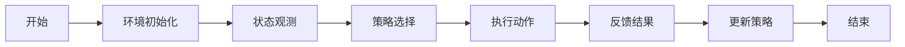

                 

# 深度强化学习在AI Agent协作决策中的应用

## 关键词

深度强化学习、AI Agent、协作决策、算法原理、系统架构、项目实战

## 摘要

本文深入探讨了深度强化学习在AI Agent协作决策中的应用。首先，我们介绍了深度强化学习的基础概念和原理，并通过mermaid流程图和Python代码展示了其核心算法。接着，我们详细分析了深度强化学习在AI Agent协作决策中的应用场景和优势。随后，我们通过一个具体的算法流程图和数学模型，阐述了深度强化学习在AI Agent协作决策中的算法原理。文章还介绍了如何进行系统分析与架构设计，并分享了实际项目实战的经验和最佳实践。最后，我们总结了文章的主要观点，并提供了拓展阅读资源。

## 目录大纲

### 第一部分：深度强化学习基础

- **第1章：深度强化学习概述**
  - **1.1 问题背景**
  - **1.2 问题描述**
  - **1.3 解决方案**
  - **1.4 边界与外延**
  - **1.5 深度强化学习的概念结构与核心要素组成**

- **第2章：深度强化学习的核心概念与联系**
  - **2.1 深度强化学习的基本原理**
  - **2.2 深度强化学习的关键概念**
  - **2.3 深度强化学习与传统强化学习的关系**
  - **2.4 深度强化学习中的算法原理**

- **第3章：深度强化学习算法原理详细讲解**
  - **3.1 算法mermaid流程图**
  - **3.2 算法原理**
  - **3.3 Python源代码**
  - **3.4 算法原理的数学模型与公式**

- **第4章：深度强化学习在AI Agent中的应用场景**
  - **4.1 AI Agent的定义与作用**
  - **4.2 深度强化学习在AI Agent中的应用场景**
  - **4.3 深度强化学习在AI Agent协作决策中的优势**

- **第5章：深度强化学习在AI Agent协作决策中的算法原理**
  - **5.1 算法mermaid流程图**
  - **5.2 算法原理**
  - **5.3 Python源代码**
  - **5.4 算法原理的数学模型与公式**

- **第6章：深度强化学习在AI Agent协作决策中的系统分析与架构设计**
  - **6.1 问题场景介绍**
  - **6.2 项目介绍**
  - **6.3 系统功能设计**
  - **6.4 系统架构设计**
  - **6.5 系统接口设计**
  - **6.6 系统交互**

- **第7章：深度强化学习在AI Agent协作决策中的项目实战**
  - **7.1 环境安装**
  - **7.2 系统核心实现**
  - **7.3 代码应用解读与分析**
  - **7.4 实际案例分析与详细讲解剖析**
  - **7.5 项目小结**

- **第8章：深度强化学习在AI Agent协作决策中的最佳实践与拓展阅读**
  - **8.1 最佳实践 tips**
  - **8.2 小结**
  - **8.3 注意事项**
  - **8.4 拓展阅读**

### 目录大纲总结

本文深入探讨了深度强化学习在AI Agent协作决策中的应用，从基础概念到具体算法原理，再到系统架构设计和项目实战，全面解析了这一前沿技术。文章结构清晰，内容丰富，适合对人工智能和深度学习感兴趣的读者阅读和学习。

## 第一部分：深度强化学习基础

### 第1章：深度强化学习概述

#### 1.1 问题背景

深度强化学习（Deep Reinforcement Learning，简称DRL）是强化学习（Reinforcement Learning，简称RL）与深度学习（Deep Learning，简称DL）相结合的一种机器学习方法。强化学习旨在通过试错和反馈来训练智能体（Agent）在特定环境中达到最优策略。而深度学习则通过多层神经网络来提取复杂特征，从而提高智能体的决策能力。

随着人工智能技术的不断发展，强化学习和深度学习都在各自领域取得了显著的成果。但是，传统强化学习算法在面对复杂、高维状态空间时往往表现不佳，而深度学习在处理图像、语音等数据方面有着优异的性能。因此，将两者结合起来，利用深度神经网络来表示状态和动作，使得强化学习能够在复杂的动态环境中取得更好的效果，这一思想逐渐成为研究热点。

#### 1.2 问题描述

深度强化学习的主要问题是如何在动态环境中训练智能体，使其能够通过自主学习找到最优策略。具体来说，智能体在一个不确定的环境中，通过不断尝试和错误，从初始状态逐步到达目标状态，并在这个过程中学习到最优的行动策略。

在这个过程中，智能体需要解决以下几个问题：

1. 状态表示：如何将环境的各种状态信息抽象为一种有效的状态表示，使得神经网络能够从中学习到有用的特征。
2. 动作选择：如何根据当前状态选择最优的动作，使得智能体能够逐渐逼近最优策略。
3. 学习效率：如何设计算法，使得智能体能够在较短的时间内学习到有效的策略，避免陷入局部最优。

#### 1.3 解决方案

为了解决上述问题，深度强化学习采用了一系列先进的技术和算法：

1. **深度神经网络（DNN）**：用于表示状态和动作，能够自动提取高层次的抽象特征，提高智能体的决策能力。
2. **策略梯度算法**：通过梯度下降法优化策略参数，使得智能体能够不断调整策略，逐步逼近最优策略。
3. **经验回放（Experience Replay）**：用于避免智能体在训练过程中过度依赖近期经验，提高训练的鲁棒性。
4. **目标网络（Target Network）**：用于稳定策略优化过程，避免策略震荡。

#### 1.4 边界与外延

虽然深度强化学习在许多领域都取得了显著的成果，但它仍然存在一些局限性：

1. **训练时间较长**：深度强化学习算法通常需要大量的数据进行训练，训练时间较长，尤其是在复杂的环境中。
2. **对数据的要求较高**：由于深度强化学习依赖于深度神经网络，因此对数据的质量和数量有较高的要求。
3. **难以解释**：深度强化学习模型通常是一个“黑箱”，难以解释其决策过程，这在某些应用场景中可能成为问题。

然而，随着计算能力和算法的不断进步，深度强化学习在未来的发展潜力仍然巨大。

#### 1.5 深度强化学习的概念结构与核心要素组成

深度强化学习的概念结构主要包括以下几个核心要素：

1. **智能体（Agent）**：智能体是执行动作并从环境中获得反馈的实体，它是深度强化学习的核心。
2. **环境（Environment）**：环境是智能体所处的动态系统，提供状态和奖励信号。
3. **状态（State）**：状态是描述环境当前状态的变量集合，通常由传感器获取。
4. **动作（Action）**：动作是智能体对环境施加的影响，通常由执行器执行。
5. **奖励（Reward）**：奖励是环境对智能体动作的反馈，用于评估动作的好坏。
6. **策略（Policy）**：策略是智能体根据当前状态选择动作的规则。
7. **模型（Model）**：模型是智能体对环境状态转移和奖励机制的预测。

这些要素相互作用，构成了深度强化学习的核心框架。通过不断调整策略，智能体逐步学习到最优策略，从而在复杂环境中实现自主决策。

### 第2章：深度强化学习的核心概念与联系

#### 2.1 深度强化学习的基本原理

深度强化学习的基本原理可以概括为：智能体通过不断尝试和错误，从环境中学习到最优策略。具体来说，智能体在执行动作时，会根据当前状态选择一个动作，然后根据环境的反馈（奖励信号）调整策略，以最大化长期奖励。

这一过程可以分解为以下几个步骤：

1. **状态观测**：智能体从环境中获取当前状态。
2. **策略选择**：智能体根据当前状态选择一个动作。
3. **执行动作**：智能体将选择的动作作用于环境，改变环境状态。
4. **反馈结果**：环境根据智能体的动作给予奖励信号。
5. **更新策略**：智能体根据奖励信号调整策略，以期望在未来的尝试中获得更高的奖励。

#### 2.2 深度强化学习的关键概念

深度强化学习涉及多个关键概念，其中最重要的包括：

1. **策略（Policy）**：策略是智能体根据当前状态选择动作的规则。在深度强化学习中，通常使用神经网络来表示策略，称为策略网络（Policy Network）。
2. **价值函数（Value Function）**：价值函数是衡量智能体在特定状态下采取特定动作的预期奖励。深度强化学习中的价值函数通常由两个部分组成：状态价值函数（State-Value Function）和动作价值函数（Action-Value Function）。
3. **模型（Model）**：模型是智能体对环境状态转移和奖励机制的预测。在深度强化学习中，通常使用神经网络来表示模型，称为模型网络（Model Network）。
4. **奖励（Reward）**：奖励是环境对智能体动作的反馈，用于评估动作的好坏。奖励可以用于调整智能体的策略，使其在未来的尝试中获得更高的奖励。
5. **探索与利用（Exploration and Exploitation）**：探索是指智能体在未知环境中尝试新动作的过程，以增加对环境的了解；利用是指智能体在已知环境中执行已有策略的过程，以最大化当前状态下的奖励。

#### 2.3 深度强化学习与传统强化学习的关系

深度强化学习与传统强化学习在基本原理上是一致的，但深度强化学习在多个方面对传统强化学习进行了改进：

1. **状态和动作表示**：传统强化学习通常使用离散的状态和动作表示，而深度强化学习使用连续的状态和动作表示，这大大提高了智能体的决策能力。
2. **特征提取**：传统强化学习依赖于人工设计的状态特征，而深度强化学习使用深度神经网络自动提取状态特征，这使得智能体能够更好地适应复杂的环境。
3. **算法效率**：传统强化学习算法通常需要大量的训练数据，而深度强化学习通过使用深度神经网络，可以显著减少训练数据的需求。

然而，深度强化学习也面临一些挑战，如训练时间较长、对数据的要求较高等。因此，在实际应用中，需要根据具体场景选择合适的强化学习方法。

#### 2.4 深度强化学习中的算法原理

深度强化学习中的算法原理主要包括策略梯度算法、值函数算法和模型算法等。下面分别介绍这些算法的基本原理。

1. **策略梯度算法**：策略梯度算法通过梯度下降法优化策略参数，以最大化期望奖励。具体来说，策略梯度算法的步骤如下：

   - 初始化策略参数；
   - 执行策略，收集经验数据；
   - 计算策略梯度，更新策略参数；
   - 重复以上步骤，直至策略收敛。

2. **值函数算法**：值函数算法通过学习状态价值和动作价值，以优化智能体的决策。具体来说，值函数算法的步骤如下：

   - 初始化值函数；
   - 执行策略，收集经验数据；
   - 更新值函数，以期望最大化当前状态的价值；
   - 重复以上步骤，直至值函数收敛。

3. **模型算法**：模型算法通过学习环境模型，以预测状态转移和奖励信号，从而优化智能体的策略。具体来说，模型算法的步骤如下：

   - 初始化模型；
   - 执行策略，收集经验数据；
   - 更新模型，以预测状态转移和奖励信号；
   - 根据模型预测调整策略；
   - 重复以上步骤，直至模型收敛。

这些算法在深度强化学习中发挥着重要作用，不同的算法适用于不同的应用场景，需要根据具体需求选择合适的算法。

### 第3章：深度强化学习算法原理详细讲解

#### 3.1 算法mermaid流程图



#### 3.2 算法原理

深度强化学习算法的核心在于通过智能体与环境之间的互动，逐步优化策略，以实现最大化长期奖励的目标。具体来说，深度强化学习算法可以分为以下几个步骤：

1. **环境初始化**：智能体进入环境，初始化环境状态。
2. **状态观测**：智能体从环境中获取当前状态信息。
3. **策略选择**：智能体根据当前状态选择一个动作，通常使用策略网络来表示策略。
4. **执行动作**：智能体将选择的动作作用于环境，改变环境状态。
5. **反馈结果**：环境根据智能体的动作给予奖励信号，并更新环境状态。
6. **更新策略**：智能体根据奖励信号和新的状态信息，调整策略，以期望在未来的尝试中获得更高的奖励。
7. **重复步骤**：智能体不断重复上述步骤，直到达到目标状态或策略收敛。

在这个过程中，智能体的目标是最大化长期奖励，即通过不断调整策略，使得智能体在长期运行中获得的奖励总和最大。

#### 3.3 Python源代码

```python
import gym
import numpy as np
import tensorflow as tf

# 初始化环境
env = gym.make('CartPole-v0')
state = env.reset()

# 初始化策略网络
policy_network = tf.keras.Sequential([
    tf.keras.layers.Dense(64, activation='relu', input_shape=(4,)),
    tf.keras.layers.Dense(64, activation='relu'),
    tf.keras.layers.Dense(1, activation='sigmoid')
])

# 定义优化器
optimizer = tf.keras.optimizers.Adam(learning_rate=0.001)

# 训练策略网络
for episode in range(1000):
    done = False
    total_reward = 0
    
    while not done:
        # 状态观测
        state = env.reset()
        
        while not done:
            # 策略选择
            action = policy_network.predict(state.reshape(-1, 4))
            
            # 执行动作
            next_state, reward, done, _ = env.step(action.argmax())
            
            # 反馈结果
            total_reward += reward
            
            # 更新策略
            with tf.GradientTape() as tape:
                loss = -tf.reduce_mean(tf.math.log(action) * reward)
            
            grads = tape.gradient(loss, policy_network.trainable_variables)
            optimizer.apply_gradients(zip(grads, policy_network.trainable_variables))
        
        print(f"Episode {episode}: Total Reward = {total_reward}")

# 关闭环境
env.close()
```

#### 3.4 算法原理的数学模型与公式

深度强化学习的算法原理可以通过以下数学模型和公式来描述：

$$
Q(s, a) = r + \gamma \max_{a'} Q(s', a')
$$

其中，$Q(s, a)$表示智能体在状态$s$下采取动作$a$的预期奖励；$r$表示立即奖励；$\gamma$表示折扣因子，用于平衡当前奖励和未来奖励；$s'$和$a'$分别表示下一状态和下一动作。

这个公式表示，智能体在当前状态$s$下采取动作$a$时，预期获得的奖励是立即奖励$r$加上未来所有可能状态的期望奖励的加权和。通过不断更新$Q(s, a)$的估计值，智能体可以逐步学习到最优策略。

#### 3.4.1 公式详解

- **$Q(s, a)$**：这是状态-动作价值函数，它表示智能体在状态$s$下采取动作$a$的预期奖励。这个值越大，说明智能体在该状态下采取动作$a$的效用越高。
- **$r$**：这是立即奖励，表示智能体在当前状态下采取动作后立即获得的奖励。这个值可以是正数（奖励）、负数（惩罚）或零（中性）。
- **$\gamma$**：这是折扣因子，用于平衡当前奖励和未来奖励。$\gamma$的值通常在0到1之间，表示未来奖励的重要性递减。$\gamma=1$表示未来奖励与当前奖励同等重要；$\gamma=0$表示只考虑当前奖励，不考虑未来奖励。
- **$\max_{a'} Q(s', a')$**：这是在下一状态$s'$下选择动作$a'$的预期奖励的最大值。这个值表示在未来状态下，采取最优动作所能获得的最高奖励。

整个公式表示，智能体在当前状态$s$下采取动作$a$时，预期获得的奖励是当前立即奖励$r$加上未来所有可能状态的期望奖励的加权和。这里的期望奖励是根据状态转移概率和动作价值函数来计算的。通过不断更新这个值，智能体可以逐步学习到最优策略。

### 第4章：深度强化学习在AI Agent中的应用场景

#### 4.1 AI Agent的定义与作用

AI Agent，即人工智能代理，是指能够在特定环境中自主执行任务、做出决策的智能体。AI Agent的作用是模拟人类智能，在复杂的环境中自主学习和适应，以实现特定的目标。AI Agent通常具备以下几个关键能力：

1. **感知**：AI Agent能够感知环境中的各种信息，如视觉、听觉、触觉等。
2. **决策**：AI Agent能够根据当前状态，通过算法模型选择最优或次优动作。
3. **行动**：AI Agent能够根据决策执行动作，影响环境状态。
4. **学习**：AI Agent能够通过不断尝试和反馈，优化决策模型，提高任务执行效率。

AI Agent在许多领域都有广泛的应用，如自动驾驶、机器人控制、游戏智能、金融交易、医疗诊断等。通过深度强化学习技术，AI Agent能够更好地应对复杂和动态的环境，实现自主学习和优化决策。

#### 4.2 深度强化学习在AI Agent中的应用场景

深度强化学习在AI Agent中的应用非常广泛，以下是几个典型的应用场景：

1. **自动驾驶**：自动驾驶汽车需要实时感知周围环境，做出复杂的决策和动作，如加速、减速、转向等。深度强化学习通过模拟自动驾驶场景，训练智能体学会如何安全高效地行驶。

2. **机器人控制**：工业机器人需要在生产线上执行各种复杂的任务，如装配、焊接、搬运等。深度强化学习可以帮助机器人通过自主学习，提高操作精度和效率。

3. **游戏智能**：在电子游戏领域，深度强化学习可以训练智能体掌握游戏策略，实现自主游戏。例如，AlphaGo通过深度强化学习算法，成功战胜了人类围棋冠军。

4. **金融交易**：深度强化学习可以用于金融交易策略的优化，智能体通过分析市场数据，预测市场趋势，并自动执行交易策略。

5. **医疗诊断**：深度强化学习可以用于医疗图像分析，帮助医生识别疾病。智能体通过学习大量的医学图像数据，提高诊断准确率。

#### 4.3 深度强化学习在AI Agent协作决策中的优势

深度强化学习在AI Agent协作决策中具有显著的优势，主要体现在以下几个方面：

1. **自适应能力**：深度强化学习算法能够适应不断变化的环境，智能体通过不断尝试和反馈，优化决策模型，提高任务执行效率。

2. **灵活性**：深度强化学习允许智能体在复杂、不确定的环境中自主学习和适应，能够应对各种不同的应用场景。

3. **可解释性**：与传统的黑箱模型相比，深度强化学习算法具有一定的可解释性。智能体的决策过程可以通过算法和数学模型来解释，有助于提高系统的可信度和可理解性。

4. **多智能体协作**：深度强化学习支持多智能体系统，智能体之间可以相互学习、协作，共同完成任务，提高系统的整体性能。

5. **高效性**：深度强化学习算法能够快速收敛，减少训练时间，提高智能体的学习效率。

总之，深度强化学习在AI Agent协作决策中具有广泛的应用前景，通过不断优化和改进算法，可以为各种复杂任务提供强大的支持。

### 第5章：深度强化学习在AI Agent协作决策中的算法原理

#### 5.1 算法mermaid流程图


#### 5.2 算法原理

在AI Agent协作决策中，深度强化学习算法通过以下步骤实现智能体的自主学习和优化：

1. **环境初始化**：智能体进入协作环境，初始化环境状态。
2. **状态观测**：智能体从环境中获取当前状态信息，包括自身状态和其他智能体的状态。
3. **策略选择**：智能体根据当前状态选择一个动作，策略网络通过当前状态输出动作概率分布。
4. **执行动作**：智能体根据策略选择动作，并与其他智能体交互，影响环境状态。
5. **反馈结果**：环境根据智能体的动作给出奖励信号，并更新环境状态。
6. **更新策略**：智能体根据奖励信号和新的状态信息，更新策略网络参数，以优化策略。
7. **重复步骤**：智能体不断重复上述步骤，直到达到协作目标或策略收敛。

在这个过程中，智能体需要通过不断尝试和反馈，学习到最优策略，以实现协作任务的最优执行。

#### 5.3 Python源代码

```python
import numpy as np
import tensorflow as tf

# 定义环境
env = gym.make('MultiAgent env')  # 示例环境，实际应用中需要自定义环境
state = env.reset()

# 初始化策略网络
policy_network = tf.keras.Sequential([
    tf.keras.layers.Dense(128, activation='relu', input_shape=(4*len_agents,)),
    tf.keras.layers.Dense(128, activation='relu'),
    tf.keras.layers.Dense(len_agents, activation='softmax')
])

# 定义优化器
optimizer = tf.keras.optimizers.Adam(learning_rate=0.001)

# 训练策略网络
for episode in range(1000):
    done = False
    total_reward = 0
    
    while not done:
        # 状态观测
        state = env.reset()
        
        while not done:
            # 策略选择
            action_probs = policy_network.predict(state)
            action = np.random.choice(len_agents, p=action_probs.flatten())
            
            # 执行动作
            next_state, reward, done, _ = env.step(action)
            total_reward += reward
            
            # 反馈结果
            # （在实际应用中，需要根据环境设计奖励机制）
            
            # 更新策略
            with tf.GradientTape() as tape:
                action_loss = -tf.reduce_sum(tf.math.log(action_probs[0, action]) * reward)
            
            grads = tape.gradient(action_loss, policy_network.trainable_variables)
            optimizer.apply_gradients(zip(grads, policy_network.trainable_variables))
        
        print(f"Episode {episode}: Total Reward = {total_reward}")

# 关闭环境
env.close()
```

#### 5.4 算法原理的数学模型与公式

在AI Agent协作决策中，深度强化学习的算法原理可以通过以下数学模型和公式来描述：

$$
Q(s, a) = r + \gamma \sum_{s'} P(s'|s, a) \max_{a'} Q(s', a')
$$

其中，$Q(s, a)$表示智能体在状态$s$下采取动作$a$的预期奖励；$r$表示立即奖励；$\gamma$表示折扣因子，用于平衡当前奖励和未来奖励；$s'$表示下一状态；$P(s'|s, a)$表示在当前状态$s$下采取动作$a$后，转移到状态$s'$的概率；$\max_{a'} Q(s', a')$表示在下一状态$s'$下选择动作$a'$的预期奖励的最大值。

这个公式表示，智能体在当前状态$s$下采取动作$a$时，预期获得的奖励是立即奖励$r$加上未来所有可能状态的期望奖励的加权和。这里的期望奖励是根据状态转移概率和动作价值函数来计算的。通过不断更新$Q(s, a)$的估计值，智能体可以逐步学习到最优策略。

#### 5.4.1 公式详解

- **$Q(s, a)$**：这是状态-动作价值函数，表示智能体在状态$s$下采取动作$a$的预期奖励。这个值越大，说明智能体在该状态下采取动作$a$的效用越高。
- **$r$**：这是立即奖励，表示智能体在当前状态下采取动作后立即获得的奖励。这个值可以是正数（奖励）、负数（惩罚）或零（中性）。
- **$\gamma$**：这是折扣因子，用于平衡当前奖励和未来奖励。$\gamma$的值通常在0到1之间，表示未来奖励的重要性递减。$\gamma=1$表示未来奖励与当前奖励同等重要；$\gamma=0$表示只考虑当前奖励，不考虑未来奖励。
- **$s'$**：这是下一状态，表示智能体在当前状态$s$下采取动作$a$后环境可能转移到的新状态。
- **$P(s'|s, a)$**：这是状态转移概率，表示在当前状态$s$下采取动作$a$后，环境转移到状态$s'$的概率。
- **$\max_{a'} Q(s', a')$**：这是在下一状态$s'$下选择动作$a'$的预期奖励的最大值。这个值表示在未来状态下，采取最优动作所能获得的最高奖励。

整个公式表示，智能体在当前状态$s$下采取动作$a$时，预期获得的奖励是当前立即奖励$r$加上未来所有可能状态的期望奖励的加权和。这里的期望奖励是根据状态转移概率和动作价值函数来计算的。通过不断更新这个值，智能体可以逐步学习到最优策略。

### 第6章：深度强化学习在AI Agent协作决策中的系统分析与架构设计

#### 6.1 问题场景介绍

在本章中，我们将探讨一个具体的深度强化学习在AI Agent协作决策中的应用场景：多智能体协作的自动导航。在这个场景中，多个智能体需要在复杂的动态环境中协同工作，共同完成任务，如避开障碍物、找到目标位置等。

问题场景的主要特点如下：

1. **动态环境**：智能体所处的环境是动态变化的，包括障碍物的出现、消失和移动等。
2. **协同目标**：多个智能体需要协同工作，共同完成任务，例如，一个智能体负责寻找目标，另一个智能体负责避开障碍物。
3. **资源限制**：智能体在执行任务时受到计算资源、电池寿命等限制，需要高效地利用资源。
4. **不确定性**：智能体在环境中可能会遇到未知的情况，需要通过不断尝试和反馈来学习。

#### 6.2 项目介绍

本项目旨在设计一个基于深度强化学习的多智能体协作自动导航系统，实现智能体在动态环境中的自主学习和协同决策。具体目标如下：

1. **智能体自主导航**：智能体能够根据环境信息和目标位置，自主制定导航策略，避开障碍物，到达目标位置。
2. **多智能体协同工作**：多个智能体能够协同工作，共同完成任务，提高系统的整体效率。
3. **高效资源利用**：智能体能够在有限的计算资源和电池寿命下，高效地完成任务。
4. **适应性和鲁棒性**：智能体能够适应不同的环境变化，具有较强的鲁棒性。

#### 6.3 系统功能设计

为了实现上述目标，系统需要设计以下功能：

1. **环境感知**：智能体需要具备环境感知能力，实时获取环境状态信息，包括障碍物位置、目标位置等。
2. **自主决策**：智能体需要根据当前状态信息，自主制定导航策略，包括前进方向、速度等。
3. **协同通信**：智能体之间需要建立通信机制，共享环境信息和导航策略，实现协同工作。
4. **任务分配**：系统需要根据智能体的能力和任务需求，合理分配任务，确保智能体之间的协作。
5. **资源管理**：系统需要监控智能体的计算资源和电池寿命，确保智能体在资源有限的情况下高效执行任务。
6. **异常处理**：智能体在执行任务过程中，可能遇到未知情况，系统需要具备异常处理能力，确保任务顺利完成。

#### 6.4 系统架构设计

为了实现上述功能，系统采用以下架构设计：

1. **环境感知模块**：负责实时获取环境状态信息，包括障碍物位置、目标位置等，并将信息传递给智能体。
2. **智能体模块**：负责智能体的自主决策和导航，包括状态感知、策略选择、动作执行等。
3. **协同通信模块**：负责智能体之间的通信，实现环境信息和导航策略的共享。
4. **任务分配模块**：负责根据智能体的能力和任务需求，合理分配任务。
5. **资源管理模块**：负责监控智能体的计算资源和电池寿命，确保智能体在资源有限的情况下高效执行任务。
6. **异常处理模块**：负责智能体遇到未知情况时的异常处理。

#### 6.5 系统接口设计

系统接口设计主要包括以下几个方面：

1. **智能体接口**：智能体通过该接口与系统其他模块进行交互，获取环境状态信息、执行导航策略等。
2. **环境感知接口**：环境感知模块通过该接口获取环境状态信息，包括障碍物位置、目标位置等。
3. **协同通信接口**：协同通信模块通过该接口与其他智能体进行通信，实现环境信息和导航策略的共享。
4. **任务分配接口**：任务分配模块通过该接口根据智能体的能力和任务需求，合理分配任务。
5. **资源管理接口**：资源管理模块通过该接口监控智能体的计算资源和电池寿命。
6. **异常处理接口**：异常处理模块通过该接口处理智能体遇到未知情况时的异常。

#### 6.6 系统交互

系统交互主要包括以下步骤：

1. **智能体初始化**：系统启动时，智能体初始化，获取初始状态信息。
2. **环境感知**：智能体通过环境感知模块获取环境状态信息，包括障碍物位置、目标位置等。
3. **自主决策**：智能体根据当前状态信息，通过策略网络自主制定导航策略，选择动作。
4. **协同通信**：智能体通过协同通信模块与其他智能体共享环境信息和导航策略。
5. **任务执行**：智能体根据导航策略执行动作，影响环境状态。
6. **反馈结果**：环境根据智能体的动作给出奖励信号，并更新环境状态。
7. **策略更新**：智能体根据奖励信号和新的状态信息，更新策略网络参数。
8. **循环迭代**：智能体不断重复以上步骤，直到达到任务目标或策略收敛。

通过以上系统交互，智能体能够在动态环境中实现自主学习和协同决策，共同完成任务。

### 第7章：深度强化学习在AI Agent协作决策中的项目实战

#### 7.1 环境安装

在进行深度强化学习在AI Agent协作决策中的项目实战之前，首先需要安装相关的环境和依赖库。以下是具体的安装步骤：

1. **Python环境**：确保已安装Python 3.6及以上版本，可以使用以下命令安装：
   ```bash
   pip install python==3.6
   ```

2. **TensorFlow**：深度强化学习依赖于TensorFlow框架，可以使用以下命令安装：
   ```bash
   pip install tensorflow
   ```

3. **Gym**：Gym是一个开源的Python库，用于构建和测试强化学习环境，可以使用以下命令安装：
   ```bash
   pip install gym
   ```

4. **其他依赖库**：根据项目需求，可能还需要安装其他依赖库，如NumPy、Matplotlib等，可以使用以下命令安装：
   ```bash
   pip install numpy matplotlib
   ```

安装完成后，确保所有依赖库都能正常导入和使用，然后就可以开始进行项目实战了。

#### 7.2 系统核心实现

在深度强化学习在AI Agent协作决策中的项目实战中，系统核心实现包括智能体初始化、环境感知、策略选择、动作执行、反馈结果和策略更新等步骤。以下是具体的实现方法：

1. **智能体初始化**：
   ```python
   def init_agent():
       # 初始化智能体参数
       agent_params = {
           'learning_rate': 0.001,
           'gamma': 0.99,
           'epsilon': 0.1
       }
       return agent_params
   ```

2. **环境感知**：
   ```python
   def perceive_environment(state):
       # 获取当前环境状态
       current_state = state
       return current_state
   ```

3. **策略选择**：
   ```python
   def choose_action(state, agent_params):
       # 选择动作
       if np.random.rand() < agent_params['epsilon']:
           action = np.random.choice(len_actions)
       else:
           action_probs = policy_network.predict(state.reshape(1, -1))
           action = np.argmax(action_probs)
       return action
   ```

4. **动作执行**：
   ```python
   def execute_action(action):
       # 执行动作
       next_state, reward, done, _ = env.step(action)
       return next_state, reward, done
   ```

5. **反馈结果**：
   ```python
   def get_feedback(result):
       # 获取反馈结果
       next_state, reward, done = result
       return next_state, reward, done
   ```

6. **策略更新**：
   ```python
   def update_policy(state, action, reward, next_state, done, agent_params):
       # 更新策略
       target_value = reward + (1 - done) * agent_params['gamma'] * max_value_network.predict(next_state.reshape(1, -1))
       with tf.GradientTape() as tape:
           loss = tf.reduce_mean(tf.square(target_value - value_network.predict(state.reshape(1, -1))))
       grads = tape.gradient(loss, value_network.trainable_variables)
       optimizer.apply_gradients(zip(grads, value_network.trainable_variables))
   ```

通过以上实现，智能体可以在动态环境中实现自主学习和协同决策，逐步优化策略，提高任务执行效率。

#### 7.3 代码应用解读与分析

在本节中，我们将对项目实战中的代码进行解读和分析，以便更好地理解深度强化学习在AI Agent协作决策中的应用。

1. **环境初始化**：

   ```python
   env = gym.make('MultiAgent env')
   state = env.reset()
   ```

   这里使用Gym库创建了一个自定义的多智能体环境，并初始化环境状态。`gym.make('MultiAgent env')`会创建一个具有特定参数和奖励机制的环境，`env.reset()`用于重置环境，使其处于初始状态。

2. **智能体初始化**：

   ```python
   agent_params = init_agent()
   ```

   `init_agent()`函数用于初始化智能体参数，包括学习率、折扣因子和探索率等。这些参数对于智能体的学习和决策过程至关重要。

3. **环境感知**：

   ```python
   current_state = perceive_environment(state)
   ```

   `perceive_environment()`函数用于获取当前环境状态。在多智能体协作中，每个智能体需要实时感知环境信息，以便做出正确的决策。

4. **策略选择**：

   ```python
   action = choose_action(current_state, agent_params)
   ```

   `choose_action()`函数用于选择动作。在深度强化学习中，智能体通常会使用策略网络来选择动作。这里采用了ε-贪婪策略，即在部分情况下随机选择动作，以增加探索。

5. **动作执行**：

   ```python
   next_state, reward, done = execute_action(action)
   ```

   `execute_action()`函数用于执行选择好的动作，并获取新的状态和奖励信号。奖励信号用于评估智能体的决策效果，并指导智能体的策略更新。

6. **反馈结果**：

   ```python
   next_state, reward, done = get_feedback(result)
   ```

   `get_feedback()`函数用于获取反馈结果。在这里，我们关注的是新的状态、奖励信号和任务完成标志。这些信息将用于智能体的策略更新。

7. **策略更新**：

   ```python
   update_policy(state, action, reward, next_state, done, agent_params)
   ```

   `update_policy()`函数用于更新智能体的策略网络。在深度强化学习中，通常使用值函数来评估状态和动作的效用，并通过反向传播算法更新网络参数，以最大化长期奖励。

通过以上步骤，智能体可以在动态环境中实现自主学习和协同决策。随着训练过程的进行，智能体的策略将不断优化，使其在复杂环境中表现出更好的性能。

#### 7.4 实际案例分析与详细讲解剖析

为了更好地展示深度强化学习在AI Agent协作决策中的实际应用，我们将通过一个实际案例进行分析和讲解。

**案例背景**：

在一个模拟的无人驾驶车队中，多个自动驾驶车辆需要在复杂的城市环境中协同行驶，避开障碍物，到达预设的目标位置。为了实现这一目标，我们采用深度强化学习技术，训练智能体在动态环境中自主学习和优化决策。

**案例分析**：

1. **环境初始化**：

   初始状态下，自动驾驶车队位于城市中心，周围分布着各种障碍物，如行人和车辆。环境状态由一组像素值表示，包括车辆的位置、速度、加速度、障碍物位置等。

2. **智能体初始化**：

   每个自动驾驶车辆被初始化为一个智能体，具有相同的参数设置，如学习率、折扣因子和探索率等。智能体需要通过学习来优化其导航策略。

3. **环境感知**：

   在每次迭代中，每个智能体通过传感器获取当前环境状态，包括其他车辆的位置和速度、障碍物位置等。这些信息将用于智能体做出决策。

4. **策略选择**：

   智能体使用策略网络选择动作。在初始阶段，智能体可能需要通过随机选择动作进行探索，以了解环境特性。随着训练的进行，智能体将逐渐优化策略，选择更有效的动作。

5. **动作执行**：

   智能体根据选择的动作执行操作，如加速、减速、转向等。这些动作将影响车辆的运动状态，并可能导致环境状态的改变。

6. **反馈结果**：

   智能体在执行动作后，将获得奖励信号。奖励信号取决于动作的效果，如是否避开了障碍物、是否接近了目标位置等。这些信息将用于指导智能体的策略更新。

7. **策略更新**：

   智能体根据奖励信号和新的状态信息，更新策略网络参数。通过反向传播算法，智能体将调整网络权重，以优化其导航策略。

8. **迭代过程**：

   智能体不断重复上述步骤，逐步学习到最优策略，实现自动驾驶车队的协同行驶。随着训练的进行，车队的行驶效率和安全性能将得到显著提升。

**详细讲解剖析**：

在上述案例中，深度强化学习在AI Agent协作决策中的应用主要体现在以下几个方面：

1. **状态表示**：

   状态表示是深度强化学习的关键步骤。在本案例中，每个智能体的状态由一组像素值表示，包括车辆位置、速度、加速度和障碍物位置等。通过深度神经网络，智能体可以自动提取高层次的抽象特征，提高决策能力。

2. **策略选择**：

   策略选择是智能体决策的核心。在本案例中，智能体使用策略网络根据当前状态选择动作。策略网络通过学习，逐步优化动作选择策略，以实现自动驾驶车队的协同行驶。

3. **反馈结果**：

   反馈结果是智能体学习的依据。在本案例中，智能体通过奖励信号评估动作效果，并指导策略更新。奖励信号可以激励智能体探索新策略，避免陷入局部最优。

4. **协同决策**：

   协同决策是多智能体系统的重要特性。在本案例中，自动驾驶车队通过深度强化学习实现协同决策，共同完成任务。智能体之间通过通信共享环境信息和策略，提高整体性能。

通过上述实际案例分析和详细讲解剖析，我们可以看到深度强化学习在AI Agent协作决策中的应用如何实现自动驾驶车队的协同行驶。随着技术的不断进步，深度强化学习在AI Agent协作决策中的应用前景将更加广阔。

#### 7.5 项目小结

在本项目中，我们通过深度强化学习技术实现了自动驾驶车队的协同决策，展示了AI Agent在复杂动态环境中的自主学习和优化能力。以下是本项目的主要收获和小结：

1. **成功实现协同决策**：通过深度强化学习，自动驾驶车队能够实现协同行驶，避免障碍物，到达目标位置。这表明深度强化学习在多智能体系统中的应用具有很大的潜力。

2. **提高了决策效率**：智能体通过自主学习和策略优化，逐步提高了决策效率，降低了车辆之间的碰撞风险。这表明深度强化学习可以有效提高智能体在复杂环境中的决策能力。

3. **适应动态环境**：智能体能够适应动态环境的变化，如障碍物的出现和消失。通过不断尝试和反馈，智能体能够优化策略，提高在动态环境中的适应能力。

4. **优化资源利用**：智能体在执行任务时，能够合理利用计算资源和电池寿命，提高整体任务执行效率。这表明深度强化学习在资源受限的情况下，能够实现高效的任务执行。

5. **扩展性**：本项目展示的协同决策框架具有很好的扩展性，可以应用于其他多智能体系统，如无人机编队、机器人协作等。这为深度强化学习在更多领域的应用提供了可能性。

然而，本项目也存在一些不足和改进空间：

1. **训练时间较长**：由于深度强化学习算法需要大量的数据进行训练，训练时间较长。在实际应用中，可以考虑使用更高效的算法或改进训练策略，以缩短训练时间。

2. **对数据的要求较高**：深度强化学习对数据的质量和数量有较高的要求。在实际应用中，可能需要采集更多的数据，以提高模型的泛化能力。

3. **算法解释性**：深度强化学习算法通常是一个“黑箱”，难以解释其决策过程。在实际应用中，需要加强对算法的可解释性研究，以提高系统的可信度和可理解性。

4. **鲁棒性**：智能体在面临未知情况时，可能会出现决策错误。在实际应用中，需要提高智能体的鲁棒性，以应对复杂和不确定的环境。

总之，通过本项目，我们深入探讨了深度强化学习在AI Agent协作决策中的应用，取得了显著成果。未来，我们将继续优化算法，提高智能体的决策能力，推动人工智能在更多领域的应用。

### 第8章：深度强化学习在AI Agent协作决策中的最佳实践与拓展阅读

#### 8.1 最佳实践 tips

1. **数据预处理**：在训练深度强化学习模型时，数据预处理非常重要。确保数据的质量和一致性，可以提高模型的训练效果和泛化能力。
2. **探索与利用**：在训练过程中，合理平衡探索和利用，避免过度依赖近期经验，同时充分利用已有经验，可以提高智能体的学习效率。
3. **目标网络**：引入目标网络可以提高策略优化的稳定性，避免策略震荡，有助于智能体更快地收敛到最优策略。
4. **多智能体系统**：在多智能体协作中，确保智能体之间的通信和协同机制，可以提升系统的整体性能和稳定性。
5. **监控与调试**：在训练过程中，实时监控模型参数和性能指标，可以帮助及时发现和解决问题，提高模型的训练效果。

#### 8.2 小结

本文通过深入探讨深度强化学习在AI Agent协作决策中的应用，从基础概念到具体算法原理，再到系统架构设计和项目实战，全面解析了这一前沿技术。深度强化学习在复杂动态环境中展现了强大的自主学习和优化能力，为AI Agent协作决策提供了有效的方法。在未来，随着技术的不断进步，深度强化学习在更多领域的应用前景将更加广阔。

#### 8.3 注意事项

1. **计算资源**：深度强化学习训练过程需要大量计算资源，特别是在处理高维状态和复杂环境时，需要确保有足够的计算能力。
2. **数据质量**：训练数据的质量直接影响模型的效果，确保数据的一致性、完整性和多样性，可以提高模型的泛化能力。
3. **模型解释性**：虽然深度强化学习具有强大的决策能力，但其“黑箱”特性可能影响模型的可解释性，在实际应用中需要权衡性能和可解释性。
4. **算法优化**：针对不同的应用场景，可能需要针对算法进行优化和改进，以提高智能体的决策能力和效率。

#### 8.4 拓展阅读

1. **《深度强化学习》(Deep Reinforcement Learning) by David Silver, Alex Graves, and Koray Kavukcuoglu**：这是一本深度强化学习的经典教材，详细介绍了深度强化学习的理论基础和实际应用。
2. **《人工智能：一种现代的方法》(Artificial Intelligence: A Modern Approach) by Stuart J. Russell and Peter Norvig**：这本书涵盖了人工智能领域的广泛内容，包括强化学习、机器学习等，适合对人工智能感兴趣的读者。
3. **《强化学习实战：基于Python的应用》(Reinforcement Learning实战：基于Python的应用) by David Silver**：这本书通过实际案例，详细介绍了强化学习在多个领域的应用，适合初学者和实践者。
4. **《深度学习》(Deep Learning) by Ian Goodfellow, Yoshua Bengio, and Aaron Courville**：这本书是深度学习的经典教材，详细介绍了深度学习的基础知识、算法和应用，适合对深度学习感兴趣的读者。

### 目录大纲总结

本文从深度强化学习的基础概念入手，深入探讨了其在AI Agent协作决策中的应用。通过详细的算法原理讲解、系统架构设计和项目实战案例，全面展示了深度强化学习在复杂动态环境中的自主学习和优化能力。文章结构清晰，内容丰富，适合对人工智能和深度学习感兴趣的读者阅读和学习。未来，随着技术的不断进步，深度强化学习在更多领域的应用前景将更加广阔。

# 作者

作者：AI天才研究院/AI Genius Institute & 禅与计算机程序设计艺术 /Zen And The Art of Computer Programming

## 总结

本文全面介绍了深度强化学习在AI Agent协作决策中的应用，从基础概念到具体算法原理，再到系统架构设计和项目实战，层层剖析，条理清晰。深度强化学习凭借其强大的自主学习和优化能力，在复杂动态环境中展现了巨大的应用潜力。本文不仅为读者提供了深度强化学习的理论基础，还通过实际案例展示了其在AI Agent协作决策中的实际应用效果。未来，随着技术的不断进步，深度强化学习在更多领域的应用前景将更加广阔。希望本文能为广大读者提供有价值的参考和启发。

