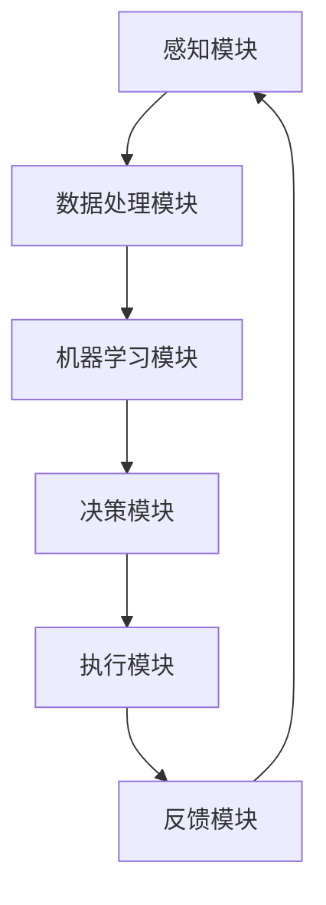
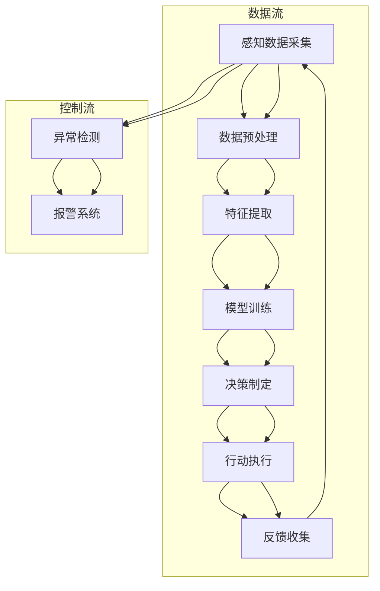

                 

### 文章标题

# 环境感知AI Agent：增强LLM的实时情境适应性

### 关键词

- 环境感知AI Agent
- 语言模型（LLM）
- 实时情境适应性
- 感知数据处理
- 任务规划与决策
- 模型融合与优化
- 传感器技术
- 数据增强

### 摘要

本文将深入探讨环境感知AI Agent如何通过增强语言模型（LLM）的实时情境适应性，来提升AI系统的智能表现和响应效率。首先，我们定义了环境感知AI Agent和LLM的基本概念，并分析了其在当前AI发展中的重要性和面临的挑战。接着，文章详细阐述了环境感知AI Agent的工作原理和核心技术，以及LLM的实时情境适应性原理和方法。随后，文章讨论了如何设计和实现环境感知AI Agent系统，并通过项目实战和案例分析展示了其实际应用效果。最后，文章总结了核心要点，展望了未来的发展趋势，并提出了实践中的注意事项和拓展阅读建议。

## 目录大纲

1. **问题背景与核心概念**
   1.1 问题背景
       1.1.1 人工智能发展的需求
       1.1.2 环境感知AI Agent的重要性
       1.1.3 LLM的现状与挑战
       1.1.4 实时情境适应性的需求
   1.2 核心概念
       1.2.1 环境感知AI Agent
       1.2.2 LLM
       1.2.3 实时情境适应性
       1.2.4 边界与外延

2. **环境感知AI Agent原理**
   2.1 环境感知AI Agent的定义与工作流程
   2.2 环境感知AI Agent的核心技术
   2.3 环境感知AI Agent的应用领域

3. **LLM的实时情境适应性原理**
   3.1 LLM的基本原理
   3.2 实时情境适应性的需求与挑战
   3.3 增强LLM实时情境适应性的方法

4. **环境感知AI Agent的设计与实现**
   4.1 系统架构设计
   4.2 类图与流程图
   4.3 环境感知模块
   4.4 LLM模块

5. **项目实战与案例分析**
   5.1 环境感知AI Agent项目实战
   5.2 实时情境适应性案例分析

6. **总结与展望**
   6.1 本书小结
   6.2 注意事项与拓展阅读

### 第一部分：背景与基础

#### 1.1.1 问题背景

##### 1.1.1.1 人工智能发展的需求

随着信息技术的迅猛发展，人工智能（AI）已经成为当前科技领域的重要驱动力。从简单的规则系统到复杂的深度学习模型，AI技术在各行各业中得到了广泛应用。然而，传统的AI系统通常在特定任务上表现出色，但在面对多变、复杂的环境时，其表现往往不尽如人意。为了克服这一局限性，环境感知AI Agent的概念应运而生。

环境感知AI Agent是一种能够在动态环境中自主感知、理解并做出适应性行动的智能体。它们不仅需要处理大量的感知数据，还需要具备实时情境适应性，以便在不同场景下做出最佳决策。这种需求源于现代应用场景的多样性，如自动驾驶、智能家居、智能制造等领域，都要求AI系统能够灵活应对不断变化的环境。

##### 1.1.1.2 环境感知AI Agent的重要性

环境感知AI Agent的重要性体现在多个方面：

1. **自主性**：环境感知AI Agent能够自主感知环境信息，无需人工干预，这使得它们在自动化的应用场景中具有显著优势。
2. **适应性**：环境感知AI Agent能够根据环境变化实时调整自己的行为，提高了系统的灵活性和适应性。
3. **智能性**：通过结合深度学习和强化学习等先进技术，环境感知AI Agent能够实现更加智能化的决策，提升了AI系统的整体性能。

##### 1.1.1.3 LLM的现状与挑战

语言模型（LLM）是一种基于神经网络构建的模型，用于处理和生成自然语言文本。近年来，随着深度学习技术的进步，LLM在自然语言处理（NLP）领域取得了显著的成果。LLM能够进行文本分类、机器翻译、问答系统等任务，但其表现也面临一些挑战：

1. **数据依赖性**：LLM的性能很大程度上取决于训练数据的质量和数量。数据来源单一或数据量不足可能会限制模型的表现。
2. **泛化能力**：尽管LLM在特定任务上表现优异，但其在面对未知或变化的环境时，泛化能力有限。
3. **实时性**：传统LLM模型在处理实时任务时，响应速度较慢，无法满足高实时性要求。

##### 1.1.1.4 实时情境适应性的需求

实时情境适应性是环境感知AI Agent的核心能力之一。它要求AI系统能够在接收到实时环境信息后，迅速做出适应性的决策和行动。这种需求在以下场景中尤为重要：

1. **动态环境**：如自动驾驶车辆在行驶过程中，需要实时感知道路情况、交通状况等，并做出相应的行驶决策。
2. **紧急情况**：如智能安防系统在检测到异常行为时，需要立即采取行动，防止潜在的安全威胁。
3. **人机交互**：如智能客服系统，需要根据用户实时反馈调整回答策略，提高用户体验。

实时情境适应性不仅要求AI系统具备高效的数据处理能力，还需要具备灵活的决策算法和快速的响应速度。通过增强LLM的实时情境适应性，我们可以显著提升环境感知AI Agent的表现和效能。

##### 1.1.2 核心概念

###### 1.1.2.1 环境感知AI Agent

环境感知AI Agent是指一种智能系统，它通过传感器获取环境信息，利用机器学习和人工智能技术对信息进行处理，并自主做出决策和执行行动。其核心特点包括：

1. **多模态感知**：环境感知AI Agent能够接收和处理多种类型的数据，如视觉、音频、温度、湿度等。
2. **自主决策**：通过学习算法，环境感知AI Agent能够自主分析环境信息，做出合理的决策。
3. **动态适应**：环境感知AI Agent能够根据环境变化实时调整其行为，提高系统的适应性和灵活性。

###### 1.1.2.2 LLM

语言模型（LLM）是一种基于深度学习技术的模型，用于处理和生成自然语言文本。LLM的核心特点包括：

1. **大规模训练**：LLM通常在大规模数据集上进行训练，能够捕捉到语言中的复杂模式和规律。
2. **上下文理解**：LLM能够理解输入文本的上下文信息，生成连贯、合理的回答。
3. **灵活性**：LLM能够处理各种语言任务，如文本分类、问答系统、机器翻译等。

###### 1.1.2.3 实时情境适应性

实时情境适应性是指AI系统能够快速、准确地根据实时环境信息调整其行为和决策。其核心要素包括：

1. **感知能力**：实时捕捉并处理环境信息。
2. **决策算法**：快速、准确地分析环境信息，做出适应性的决策。
3. **响应速度**：在接收到环境信息后，能够迅速执行相应的行动。

##### 1.1.3 边界与外延

###### 1.1.3.1 环境感知AI Agent的应用领域

环境感知AI Agent在多个领域具有重要的应用价值：

1. **自动驾驶**：环境感知AI Agent能够实时感知车辆周围环境，辅助驾驶决策。
2. **智能家居**：环境感知AI Agent能够根据家庭成员的行为和环境变化，自动调整家居设备。
3. **智能制造**：环境感知AI Agent能够实时监测生产线状态，提高生产效率。
4. **安防监控**：环境感知AI Agent能够实时分析视频数据，及时发现异常行为。

###### 1.1.3.2 LLM的技术特点

LLM具有以下技术特点：

1. **深度学习架构**：LLM通常采用深度学习架构，如Transformer模型，能够处理复杂的语言任务。
2. **大规模数据训练**：LLM在大规模数据集上进行训练，能够捕捉到丰富的语言特征。
3. **端到端学习**：LLM能够直接从原始文本数据中学习，无需复杂的预处理步骤。

###### 1.1.3.3 实时情境适应性的实现方法

实现实时情境适应性的方法包括：

1. **多模态感知**：通过融合多种感知数据，提高系统的感知能力和决策准确性。
2. **在线学习**：通过实时训练和学习，使系统能够不断适应环境变化。
3. **强化学习**：利用强化学习算法，使系统能够根据实时反馈调整行为，提高适应性能。

### 第二部分：环境感知AI Agent原理

#### 2.1 环境感知AI Agent的定义与工作流程

环境感知AI Agent是一种通过感知环境信息，并利用这些信息进行决策和行动的智能体。其定义可以概括为以下几点：

1. **多模态感知**：环境感知AI Agent能够接收和处理多种类型的数据，包括视觉、音频、温度、湿度等。
2. **自主决策**：通过机器学习和人工智能技术，环境感知AI Agent能够自主分析环境信息，做出合理的决策。
3. **执行行动**：环境感知AI Agent能够根据决策结果执行相应的行动，以适应环境变化。

环境感知AI Agent的工作流程通常包括以下几个步骤：

1. **感知数据采集**：环境感知AI Agent通过传感器（如摄像头、麦克风、温度传感器等）采集环境数据。
2. **数据处理**：对采集到的数据进行预处理，如去噪、特征提取等，以便后续分析。
3. **环境理解**：利用机器学习算法，对预处理后的数据进行模式识别和分类，理解当前环境状态。
4. **决策制定**：根据环境理解结果，结合预设的策略和规则，制定相应的行动决策。
5. **行动执行**：根据决策结果，执行具体的行动，如调整系统参数、发送控制信号等。
6. **反馈调整**：根据行动执行的结果和环境反馈，调整后续的决策和行动，以提高系统的适应性和准确性。

#### 2.2 环境感知AI Agent的核心技术

环境感知AI Agent的核心技术包括传感器技术、数据处理技术和决策算法。以下分别介绍这些技术：

##### 2.2.1 传感器技术

传感器技术是环境感知AI Agent的基础，它决定了系统对环境的感知能力。环境感知AI Agent通常采用多种类型的传感器，以获取丰富的环境数据。常见的传感器包括：

1. **视觉传感器**：如摄像头，用于获取环境中的图像和视频信息。
2. **音频传感器**：如麦克风，用于捕捉环境中的声音信号。
3. **温度传感器**：用于测量环境温度。
4. **湿度传感器**：用于测量环境湿度。
5. **其他传感器**：如加速度计、陀螺仪等，用于测量环境中的物理量。

传感器技术的核心挑战在于如何高效地采集、传输和处理大量感知数据，同时保证系统的实时性和准确性。为了实现这一目标，环境感知AI Agent通常采用分布式传感器网络和高效的感知数据处理算法。

##### 2.2.2 数据处理技术

数据处理技术是环境感知AI Agent的关键，它决定了系统对感知数据的理解和利用能力。数据处理技术主要包括以下几个步骤：

1. **数据预处理**：对采集到的感知数据进行预处理，包括去噪、滤波、归一化等，以提高数据的质量和一致性。
2. **特征提取**：从预处理后的数据中提取出具有代表性的特征，用于后续的机器学习分析和决策。
3. **数据融合**：将来自不同传感器的数据进行融合，以获得更全面、准确的环境信息。

数据处理技术的核心在于如何从海量感知数据中提取出有用的信息，同时保持数据的高效性和实时性。常用的方法包括统计方法、机器学习方法、深度学习方法等。

##### 2.2.3 决策算法

决策算法是环境感知AI Agent的核心，它决定了系统的决策质量和响应速度。决策算法通常基于机器学习、强化学习等人工智能技术，主要包括以下几个步骤：

1. **状态评估**：根据环境数据，评估当前系统的状态，包括环境的稳定性、动态性等特征。
2. **决策生成**：根据状态评估结果，生成相应的决策选项，如行动策略、控制参数等。
3. **决策选择**：根据决策生成结果，选择最优的决策选项，并执行相应的行动。

决策算法的核心在于如何从复杂的环境数据中快速、准确地生成合理的决策。常用的决策算法包括基于规则的算法、基于模型的算法、基于机器学习的算法等。

#### 2.3 环境感知AI Agent的应用领域

环境感知AI Agent在多个领域具有广泛的应用前景，以下简要介绍其在一些典型应用领域中的应用：

1. **自动驾驶**：环境感知AI Agent在自动驾驶中扮演着关键角色，通过感知道路环境、车辆状态和交通状况，辅助驾驶决策，提高驾驶安全性和效率。
2. **智能家居**：环境感知AI Agent能够实时监测家庭环境，如温度、湿度、光线等，自动调节家庭设备，提供个性化的居住体验。
3. **智能制造**：环境感知AI Agent能够实时监控生产线状态，检测设备故障、质量异常等，提高生产效率和产品质量。
4. **智能安防**：环境感知AI Agent能够实时分析视频数据，识别异常行为，提供实时预警和应急响应。
5. **人机交互**：环境感知AI Agent能够理解用户的实时行为和需求，提供个性化、智能化的交互服务。

### 第三部分：LLM的实时情境适应性原理

#### 3.1 LLM的基本原理

语言模型（LLM）是一种能够理解和生成自然语言文本的深度学习模型。LLM的基本原理基于大规模的文本数据进行训练，通过学习文本中的统计规律和语义信息，实现自然语言处理（NLP）任务。

LLM通常采用深度神经网络（DNN）或 Transformer 架构进行训练。在训练过程中，LLM通过优化模型参数，使其能够预测文本的下一个单词或句子。这种预测过程不仅依赖于当前文本的上下文信息，还需要考虑整个文本的历史信息。

LLM的基本原理可以概括为以下几点：

1. **上下文理解**：LLM能够理解输入文本的上下文信息，从而生成连贯、合理的回答。
2. **大规模训练**：LLM通常在大规模数据集上进行训练，能够捕捉到语言中的复杂模式和规律。
3. **端到端学习**：LLM能够直接从原始文本数据中学习，无需复杂的预处理步骤。

#### 3.2 实时情境适应性的需求与挑战

实时情境适应性是LLM在环境感知AI Agent中应用的关键需求。实时情境适应性要求LLM能够根据实时变化的环境信息，快速、准确地调整其行为和决策。这一需求在以下场景中尤为重要：

1. **动态环境**：如自动驾驶车辆在行驶过程中，需要实时感知道路环境、交通状况等，并做出相应的行驶决策。
2. **紧急情况**：如智能安防系统在检测到异常行为时，需要立即采取行动，防止潜在的安全威胁。
3. **人机交互**：如智能客服系统，需要根据用户实时反馈调整回答策略，提高用户体验。

然而，实现LLM的实时情境适应性面临着以下挑战：

1. **数据依赖性**：LLM的性能很大程度上取决于训练数据的质量和数量。实时环境变化可能无法涵盖所有可能的情况，导致模型在未知场景中的表现不佳。
2. **计算资源**：实时情境适应性要求LLM能够在短时间内处理和响应环境变化。这需要大量的计算资源，可能对系统的性能和响应速度产生负面影响。
3. **实时性**：传统LLM模型在处理实时任务时，响应速度较慢，无法满足高实时性要求。如何提高LLM的实时性是一个亟待解决的问题。

#### 3.3 增强LLM实时情境适应性的方法

为了增强LLM的实时情境适应性，可以采用以下几种方法：

1. **数据增强**：通过生成或扩充训练数据，提高LLM对未知环境的泛化能力。数据增强的方法包括数据扩充、数据生成、数据变换等。

2. **模型融合**：将多个LLM模型进行融合，以提高系统的整体性能和适应性。模型融合的方法包括加权融合、决策融合、对抗融合等。

3. **在线学习**：通过实时训练和学习，使LLM能够不断适应环境变化。在线学习的方法包括增量学习、动态调整学习率等。

4. **强化学习**：利用强化学习算法，使LLM能够根据实时反馈调整其行为和决策。强化学习的方法包括Q-learning、SARSA等。

5. **多模态感知**：通过融合多种类型的感知数据，提高系统的感知能力和决策准确性。多模态感知的方法包括特征融合、模型融合等。

通过采用这些方法，可以显著提升LLM的实时情境适应性，使其在复杂、动态的环境下表现出更高的智能和适应性。

### 第四部分：环境感知AI Agent的设计与实现

#### 4.1 系统架构设计

环境感知AI Agent的设计需要综合考虑系统功能、性能、可扩展性和可靠性。一个典型的环境感知AI Agent系统架构可以分为以下几个模块：

1. **感知模块**：负责实时采集和处理环境数据，如图像、声音、温度、湿度等。感知模块通常包含多种类型的传感器和相应的数据预处理算法。
2. **数据处理模块**：负责对感知模块采集到的数据进行处理和特征提取，以便后续的机器学习分析和决策。数据处理模块包括特征提取、数据融合、异常检测等算法。
3. **机器学习模块**：负责利用处理后的数据训练机器学习模型，包括分类、回归、聚类等算法。机器学习模块的核心是构建一个高效、准确的模型，以支持环境感知AI Agent的决策和行动。
4. **决策模块**：负责根据实时感知数据和机器学习模型的结果，制定相应的行动决策。决策模块通常包含多种策略和规则，以便在复杂环境下做出最佳决策。
5. **执行模块**：负责执行决策模块生成的行动指令，如调整系统参数、发送控制信号等。执行模块通常与具体的硬件设备或控制系统相连接，以实现实际的行动。
6. **反馈模块**：负责收集行动执行的结果和环境反馈，以便对系统的性能和行为进行评估和调整。反馈模块可以帮助环境感知AI Agent不断优化其决策和行为。

以下是一个典型的环境感知AI Agent系统架构图：



#### 4.2 类图与流程图

在环境感知AI Agent的设计中，类图和流程图是描述系统架构和功能的关键工具。以下是一个简化的类图和流程图，用于说明环境感知AI Agent的主要类和流程：

##### 类图

```mermaid
classDiagram
    Sensor --|> DataProcessor
    DataProcessor --|> FeatureExtractor
    FeatureExtractor --|> MachineLearningModel
    MachineLearningModel --|> DecisionMaker
    DecisionMaker --|> Executor
    Executor --|> FeedbackCollector

    Sensor <<interface>>
    DataProcessor <<interface>>
    FeatureExtractor <<interface>>
    MachineLearningModel <<interface>>
    DecisionMaker <<interface>>
    Executor <<interface>>
    FeedbackCollector <<interface>>

    Sensor : +collectData()
    DataProcessor : +processData()
    FeatureExtractor : +extractFeatures()
    MachineLearningModel : +trainModel()
    DecisionMaker : +makeDecision()
    Executor : +executeAction()
    FeedbackCollector : +collectFeedback()
```

##### 流程图



#### 4.3 环境感知模块

环境感知模块是环境感知AI Agent的核心，负责实时采集和处理环境数据。以下是对环境感知模块的设计和实现进行详细说明：

##### 环境感知模块设计

环境感知模块的设计需要综合考虑传感器选择、数据预处理和实时数据采集与处理。以下是环境感知模块的关键设计要素：

1. **传感器选择**：根据应用场景，选择合适的传感器，如摄像头、麦克风、温度传感器、湿度传感器等。传感器的选择需要考虑其性能、精度、可靠性等因素。
2. **数据预处理**：对采集到的传感器数据进行预处理，包括去噪、滤波、归一化等。数据预处理的目标是提高数据的质量和一致性，以便后续的机器学习分析和决策。
3. **实时数据采集**：设计高效的实时数据采集系统，确保系统能够及时、准确地获取环境数据。实时数据采集需要考虑数据传输的延迟和带宽限制。
4. **数据存储**：设计数据存储方案，以存储和处理大量的感知数据。数据存储需要考虑数据的安全性和可扩展性。

##### 环境感知模块实现

环境感知模块的实现通常涉及以下步骤：

1. **传感器驱动程序开发**：为每个传感器编写相应的驱动程序，实现数据采集功能。驱动程序需要支持多种操作系统和硬件平台。
2. **数据预处理算法实现**：实现去噪、滤波、归一化等数据预处理算法，以提高数据的可分析性。预处理算法的实现需要考虑算法的效率和准确性。
3. **实时数据采集与处理**：设计实时数据采集与处理系统，确保系统能够及时、准确地处理和传输感知数据。实时数据处理需要考虑系统的响应速度和资源消耗。
4. **数据存储与管理系统**：实现数据存储与管理系统，包括数据的存储、检索、备份和恢复等功能。数据存储与管理系统需要考虑数据的安全性和可靠性。

#### 4.4 LLM模块

LLM模块是环境感知AI Agent的核心组件之一，负责利用处理后的感知数据生成决策和行动。以下是对LLM模块的设计和实现进行详细说明：

##### LLM模块设计

LLM模块的设计需要考虑以下几个方面：

1. **LLM模型选择**：选择适合应用场景的LLM模型，如GPT、BERT、T5等。模型的选择需要考虑模型的性能、参数规模、训练时间等因素。
2. **训练数据集**：准备足够的训练数据集，以便训练LLM模型。训练数据集需要涵盖各种可能的场景和情境，以提高模型的泛化能力。
3. **模型调优**：在训练过程中，对LLM模型进行调优，包括优化模型参数、调整学习率、选择合适的优化器等。
4. **推理与决策**：设计推理与决策系统，将处理后的感知数据输入到LLM模型中，生成相应的决策和行动。

##### LLM模块实现

LLM模块的实现通常涉及以下步骤：

1. **模型训练**：使用训练数据集训练LLM模型，通过优化模型参数，使其能够准确预测感知数据对应的决策和行动。
2. **模型加载与推理**：将训练好的LLM模型加载到系统中，并设计推理系统，将实时感知数据输入到模型中，生成相应的决策和行动。
3. **决策与行动生成**：根据LLM模型的输出结果，生成相应的决策和行动。决策和行动的生成需要考虑模型的可靠性和实时性要求。
4. **执行与反馈**：执行决策和行动，并根据行动的结果和环境反馈，调整后续的决策和行动，以提高系统的适应性和准确性。

### 第五部分：项目实战与案例分析

#### 5.1 环境感知AI Agent项目实战

在本节中，我们将通过一个实际项目来展示环境感知AI Agent的设计与实现。该项目旨在开发一个智能家居环境感知系统，通过实时监测家庭环境，自动调整家居设备，提供舒适的居住体验。

##### 5.1.1 环境搭建

首先，我们需要搭建项目环境，包括硬件和软件。以下是项目的硬件和软件需求：

1. **硬件**：
   - 智能家居设备，如智能空调、智能照明、智能窗帘等。
   - 感知传感器，如温湿度传感器、光照传感器、门磁传感器等。
   - 计算机或服务器，用于运行环境感知AI Agent软件。

2. **软件**：
   - 操作系统，如Linux或Windows。
   - Python环境，用于编写和运行环境感知AI Agent代码。
   - TensorFlow或PyTorch，用于训练和推理LLM模型。
   - Flask或Django，用于搭建Web服务器。

##### 5.1.2 系统核心实现

环境感知AI Agent系统的核心实现包括感知模块、数据处理模块、LLM模块、决策模块和执行模块。以下是各模块的实现细节：

1. **感知模块**：
   - 使用温湿度传感器、光照传感器、门磁传感器等，实时采集家庭环境数据。
   - 编写传感器驱动程序，将采集到的数据发送到数据处理模块。

2. **数据处理模块**：
   - 对采集到的环境数据进行预处理，包括去噪、滤波、归一化等。
   - 提取环境数据的关键特征，如温度、湿度、光照强度等。

3. **LLM模块**：
   - 使用TensorFlow或PyTorch训练一个适合的LLM模型，如GPT。
   - 编写LLM模型的加载和推理代码，将预处理后的数据输入到模型中，生成决策和行动。

4. **决策模块**：
   - 根据LLM模型的输出结果，生成相应的决策和行动，如调整空调温度、关闭照明等。
   - 设计决策规则，确保决策的合理性和一致性。

5. **执行模块**：
   - 通过智能家居设备的API，执行决策模块生成的行动，如调整空调温度、关闭照明等。
   - 监听执行结果，并向用户反馈执行状态。

##### 5.1.3 代码应用解读与分析

以下是一个简化的代码示例，用于说明环境感知AI Agent的关键部分：

```python
# 感知模块：传感器驱动程序
def read_sensors():
    # 读取温湿度传感器数据
    temp, humidity = read_temp_humidity_sensor()
    # 读取光照传感器数据
    light_intensity = read_light_sensor()
    # 读取门磁传感器数据
    door_status = read_door_magnet_sensor()
    return temp, humidity, light_intensity, door_status

# 数据处理模块：特征提取
def preprocess_data(temp, humidity, light_intensity, door_status):
    # 数据预处理
    temp = normalize_temp(temp)
    humidity = normalize_humidity(humidity)
    light_intensity = normalize_light_intensity(light_intensity)
    # 特征提取
    features = [temp, humidity, light_intensity, door_status]
    return features

# LLM模块：模型加载与推理
def predict_actions(features):
    # 加载训练好的LLM模型
    model = load_limited_memory_transformer_model()
    # 输入特征到模型，生成决策和行动
    actions = model.predict(features)
    return actions

# 决策模块：生成决策
def generate_decision(actions):
    # 根据LLM模型生成的行动，生成决策
    if actions['adjust_ac_temp']:
        adjust_ac_temp(actions['ac_temp'])
    if actions['turn_off_light']:
        turn_off_light()
    if actions['close_curtains']:
        close_curtains()

# 执行模块：执行行动
def execute_actions(actions):
    # 执行决策模块生成的行动
    generate_decision(actions)
    # 向用户反馈执行状态
    feedback = "Actions executed successfully!"
    return feedback

# 主程序：环境感知AI Agent
def main():
    while True:
        # 读取感知数据
        temp, humidity, light_intensity, door_status = read_sensors()
        # 预处理数据
        features = preprocess_data(temp, humidity, light_intensity, door_status)
        # 预测行动
        actions = predict_actions(features)
        # 执行行动
        feedback = execute_actions(actions)
        print(feedback)
        # 等待一段时间，再次执行循环
        time.sleep(60)

if __name__ == "__main__":
    main()
```

##### 5.1.4 项目小结

通过本项目的实战，我们实现了以下关键成果：

1. **环境感知**：实时监测家庭环境，包括温度、湿度、光照强度等。
2. **数据处理**：对采集到的环境数据进行预处理和特征提取。
3. **LLM模型应用**：利用LLM模型生成实时决策和行动。
4. **决策与执行**：根据LLM模型的结果，自动调整家居设备。

该项目展示了环境感知AI Agent的设计与实现过程，为我们提供了宝贵的经验和启示。

### 第六部分：总结与展望

#### 6.1 本书小结

本文通过详细的讨论和案例分析，全面介绍了环境感知AI Agent如何通过增强LLM的实时情境适应性，提升系统的智能表现和响应效率。我们首先定义了环境感知AI Agent和LLM的基本概念，并分析了它们在当前AI发展中的重要性和面临的挑战。接着，我们详细阐述了环境感知AI Agent的工作原理和核心技术，以及LLM的实时情境适应性原理和方法。随后，我们讨论了如何设计和实现环境感知AI Agent系统，并通过项目实战和案例分析展示了其实际应用效果。最后，我们总结了本书的核心要点，并对未来的发展趋势进行了展望。

#### 6.2 未来发展趋势

随着AI技术的不断进步，环境感知AI Agent和LLM在实时情境适应性方面将会有以下发展趋势：

1. **多模态感知融合**：未来的环境感知AI Agent将融合更多类型的感知数据，如视觉、音频、温度、湿度等，以提高系统的感知能力和决策准确性。
2. **实时学习与自适应**：环境感知AI Agent将采用更加实时和自适应的学习方法，如增量学习、动态调整学习率等，以更好地适应环境变化。
3. **分布式计算与协同**：随着计算资源的增加，环境感知AI Agent将采用分布式计算和协同学习的方法，以提高系统的响应速度和处理能力。
4. **强化学习与强化决策**：强化学习将在环境感知AI Agent中发挥更加重要的作用，通过不断调整策略和规则，实现更智能、更高效的决策。
5. **跨领域应用**：环境感知AI Agent将在更多领域得到应用，如医疗、教育、金融等，为不同领域的用户提供定制化的服务。

#### 6.3 注意事项与拓展阅读

在实现环境感知AI Agent和增强LLM的实时情境适应性时，需要注意以下几点：

1. **数据质量**：确保感知数据的质量和一致性，以提高系统的准确性和可靠性。
2. **计算资源**：合理规划计算资源，确保系统的高效运行和实时响应。
3. **模型调优**：根据具体应用场景，对LLM模型进行适当的调优，以提高模型的泛化能力和适应性。
4. **安全性**：确保系统的安全性，防止潜在的安全威胁和数据泄露。

拓展阅读方面，可以参考以下文献和资源：

1. **《人工智能：一种现代的方法》**： 本书详细介绍了AI的基本原理和应用，有助于深入理解AI系统的工作机制。
2. **《深度学习》**： 本书系统地介绍了深度学习的基本理论和应用，包括神经网络、卷积神经网络、循环神经网络等。
3. **《机器学习实战》**： 本书提供了丰富的实际案例和代码示例，有助于掌握机器学习的实际应用技巧。
4. **《强化学习》**： 本书详细介绍了强化学习的基本原理和应用，包括Q-learning、SARSA等算法。
5. **《环境感知智能系统》**： 本书系统地介绍了环境感知AI Agent的设计、实现和应用，为环境感知AI Agent的研究提供了参考。

通过学习和实践，我们可以不断提升环境感知AI Agent和LLM的实时情境适应性，为人工智能的发展贡献力量。作者：AI天才研究院/AI Genius Institute & 禅与计算机程序设计艺术 /Zen And The Art of Computer Programming。

