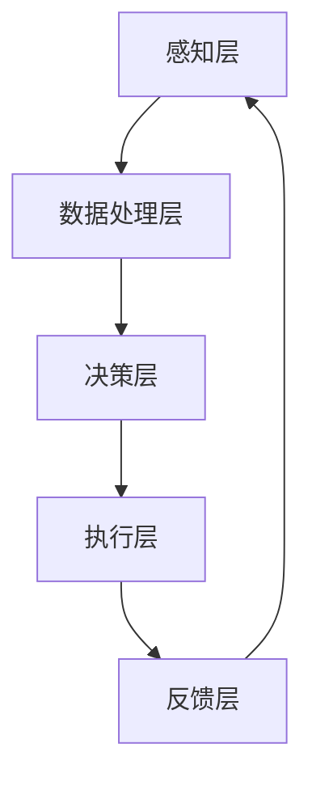

                 

# 理解AI Agent：核心概念与基本原理

关键词：AI Agent、核心概念、基本原理、机器学习、神经网络、应用场景

摘要：本文深入探讨了AI Agent的核心概念和基本原理，包括感知与认知、决策与行动、通信与协作等方面的内容。通过分析机器学习、神经网络等关键技术，以及AI Agent在不同领域的应用案例，本文旨在帮助读者全面理解AI Agent的本质，为今后的研究和应用提供参考。

## 第一部分：背景介绍

### 第1章：AI Agent的起源与发展

#### 1.1 AI Agent的概念与定义

##### 1.1.1 问题的提出与背景

随着人工智能技术的快速发展，人们开始思考如何让计算机具备自主行动的能力。AI Agent作为一种模拟人类智能行为的技术概念，应运而生。AI Agent，即人工智能代理，是指具有自主决策、执行任务能力的人工智能系统。

##### 1.1.2 AI Agent的定义与分类

AI Agent可以定义为：一种能够感知环境、基于目标自主决策并采取行动的智能体。根据功能的不同，AI Agent可以分为以下几类：

1. 感知型Agent：主要负责感知环境，获取信息。
2. 决策型Agent：基于感知到的环境信息，自主做出决策。
3. 行动型Agent：根据决策结果，执行具体的行动。
4. 感知-决策-行动型Agent：结合感知、决策和行动功能，形成完整的决策执行循环。

##### 1.1.3 AI Agent的核心要素与边界

AI Agent的核心要素包括感知、决策和行动。感知是AI Agent获取环境信息的手段，决策是AI Agent基于感知信息进行目标选择的过程，行动是AI Agent执行决策结果的具体操作。而AI Agent的边界则是指其感知范围和行动能力，通常由环境、任务和约束等因素决定。

#### 1.2 AI Agent的发展历程

##### 1.2.1 AI Agent的早期发展

AI Agent的概念最早可以追溯到20世纪50年代。当时，人工智能研究主要集中在符号主义方法，即通过构建形式化的知识表示和推理系统来实现智能。在这个时期，AI Agent主要以符号推理为基础，逐步发展出了感知、决策和行动等基本功能。

##### 1.2.2 20世纪90年代的AI Agent

随着机器学习技术的兴起，AI Agent开始逐渐从符号主义方法转向基于数据的方法。20世纪90年代，强化学习、多代理系统等研究领域相继出现，为AI Agent的发展提供了新的思路。

##### 1.2.3 当前AI Agent技术的发展趋势

当前，AI Agent技术正朝着以下方向发展：

1. 深度学习与强化学习相结合：深度学习为AI Agent提供了强大的感知能力，而强化学习则为AI Agent提供了灵活的决策能力。
2. 多代理系统与区块链技术融合：通过区块链技术，实现多个AI Agent之间的安全通信和协作。
3. 集成多种传感器与执行器：AI Agent逐渐具备了更全面的感知和执行能力，能够应对复杂多变的现实环境。

#### 1.3 AI Agent在现实世界中的应用

##### 1.3.1 工业自动化中的应用

AI Agent在工业自动化领域有着广泛的应用，如自动化生产线、质量检测、机器人控制等。通过感知生产现场的各种信息，AI Agent能够实时调整生产参数，提高生产效率。

##### 1.3.2 电子商务中的应用

AI Agent在电子商务领域主要应用于商品推荐、智能客服、交易欺诈检测等。通过分析用户行为和交易数据，AI Agent能够为用户提供个性化的购物体验。

##### 1.3.3 家庭服务中的应用

AI Agent在家庭服务领域主要应用于智能家居、健康管理、安防监控等。通过感知家庭环境和个人健康数据，AI Agent能够为家庭提供安全、舒适、健康的生活环境。

#### 1.4 AI Agent的挑战与未来

##### 1.4.1 挑战与瓶颈

尽管AI Agent技术取得了显著进展，但仍面临一些挑战和瓶颈：

1. 环境复杂性：现实世界环境复杂多变，对AI Agent的感知能力和决策能力提出了高要求。
2. 数据稀缺：在一些领域，高质量的数据仍然稀缺，制约了AI Agent的发展。
3. 伦理问题：AI Agent的决策和行为可能对人类社会产生深远影响，如何确保其公平、透明、可解释性成为重要议题。

##### 1.4.2 未来发展前景

未来，AI Agent技术将在以下几个方面得到进一步发展：

1. 环境感知与认知能力的提升：通过多传感器融合、深度学习等技术，AI Agent将具备更强的感知和认知能力。
2. 决策与行动的智能化：结合强化学习、多代理系统等技术，AI Agent将实现更加智能化的决策和行动。
3. 伦理与法规的完善：随着AI Agent技术的发展，相关伦理和法规问题将得到更加完善的解决。

##### 1.4.3 研究方向与热点问题

未来，AI Agent的研究方向和热点问题包括：

1. 多模态感知与认知：研究如何利用多种传感器数据，实现更加全面的感知和认知能力。
2. 强化学习与深度学习结合：探索强化学习与深度学习的融合方法，提高AI Agent的决策能力。
3. 多代理系统与区块链技术：研究如何利用区块链技术实现多个AI Agent之间的安全通信和协作。
4. 伦理与法规研究：探讨AI Agent伦理问题，为AI Agent的发展提供法律保障。

## 第二部分：核心概念与原理

### 第2章：AI Agent的核心概念

#### 2.1 感知与认知

##### 2.1.1 感知系统的设计

感知系统是AI Agent获取环境信息的重要手段。感知系统通常包括以下组成部分：

1. 传感器：负责采集环境中的各种信息，如图像、声音、温度、湿度等。
2. 预处理：对采集到的传感器数据进行预处理，如去噪、归一化等。
3. 特征提取：从预处理后的数据中提取出具有代表性的特征，用于后续的决策和行动。

感知系统的设计需要考虑以下几个方面：

1. 传感器选择：根据应用场景选择合适的传感器，确保感知系统能够获取到关键信息。
2. 数据预处理：设计合理的预处理方法，提高感知数据的准确性和可靠性。
3. 特征提取：提取出具有代表性的特征，为决策系统提供有效的输入。

##### 2.1.2 认知系统的构建

认知系统是AI Agent对感知信息进行处理和理解的过程。认知系统通常包括以下组成部分：

1. 知识表示：将感知信息转化为计算机可以理解的形式，如向量、图等。
2. 知识推理：利用已有的知识，对感知信息进行推理和分析，以获取更深层次的信息。
3. 认知决策：基于认知结果，做出相应的决策，指导AI Agent的行动。

认知系统的设计需要考虑以下几个方面：

1. 知识表示：选择合适的知识表示方法，如向量、图、规则等，以提高认知系统的表达能力和灵活性。
2. 知识推理：设计高效的推理算法，确保认知系统能够快速、准确地处理大量信息。
3. 认知决策：根据认知结果，设计合理的决策策略，以实现AI Agent的目标。

##### 2.1.3 感知与认知的交互

感知与认知是AI Agent的两个核心组成部分，它们之间的交互关系对AI Agent的性能至关重要。感知与认知的交互主要包括以下几个方面：

1. 感知数据的传递：感知系统将采集到的数据传递给认知系统，为认知系统提供输入。
2. 认知结果的反馈：认知系统将处理结果传递给感知系统，指导感知系统进行相应的调整。
3. 循环迭代：感知与认知系统之间形成循环迭代，不断优化感知和认知过程，提高AI Agent的性能。

#### 2.2 决策与行动

##### 2.2.1 决策模型的选择

决策模型是AI Agent在感知和认知的基础上，对环境信息进行判断和决策的算法。常见的决策模型包括：

1. 决策树：利用树形结构对数据进行分类和回归。
2. 支持向量机：通过寻找最佳分离超平面，对数据进行分类。
3. 随机森林：通过构建多个决策树，进行投票决策。
4. 神经网络：通过多层神经网络，对数据进行非线性变换。

选择合适的决策模型需要考虑以下几个方面：

1. 数据特点：根据数据类型和分布，选择合适的决策模型。
2. 模型复杂度：在保证模型性能的前提下，尽量选择复杂度较低的模型，以提高计算效率。
3. 模型泛化能力：选择具有较好泛化能力的模型，以应对不同场景。

##### 2.2.2 行动策略的设计

行动策略是AI Agent根据决策结果，对环境进行干预和调整的方法。行动策略的设计需要考虑以下几个方面：

1. 行动目标：根据决策结果，确定需要采取的行动目标。
2. 行动路径：设计合理的行动路径，确保行动过程高效、安全。
3. 行动效果：评估行动效果，对行动策略进行优化和调整。

常见的行动策略包括：

1. 规则驱动：根据预设的规则，进行相应的行动。
2. 强化学习：通过与环境互动，不断调整行动策略，实现最佳效果。
3. 模仿学习：通过模仿人类或其他智能体的行为，进行行动策略的设计。

##### 2.2.3 决策与行动的协调

决策与行动是AI Agent的两个关键环节，它们之间的协调关系对AI Agent的性能至关重要。决策与行动的协调主要包括以下几个方面：

1. 决策结果的实时反馈：将决策结果实时传递给行动系统，确保行动系统能够根据决策结果进行相应的调整。
2. 行动效果的评估与反馈：对行动效果进行评估，将评估结果反馈给决策系统，为决策系统提供优化依据。
3. 循环迭代：通过不断迭代优化决策和行动过程，提高AI Agent的整体性能。

#### 2.3 通信与协作

##### 2.3.1 内部通信机制

内部通信机制是指AI Agent内部各个模块之间的通信方式。内部通信机制的设计需要考虑以下几个方面：

1. 模块划分：根据AI Agent的功能需求，合理划分模块，确保模块之间的独立性和可扩展性。
2. 通信协议：设计合理的通信协议，确保模块之间能够高效、可靠地进行数据传输。
3. 数据格式：设计统一的数据格式，方便模块之间的数据共享和协同工作。

常见的内部通信机制包括：

1. 事件驱动：通过事件触发机制，实现模块之间的实时通信。
2. 消息队列：利用消息队列，实现模块之间的异步通信。
3. 发布-订阅：通过发布-订阅模式，实现模块之间的数据共享。

##### 2.3.2 外部通信机制

外部通信机制是指AI Agent与外部系统之间的通信方式。外部通信机制的设计需要考虑以下几个方面：

1. 接口设计：设计统一的接口，方便AI Agent与外部系统进行数据交换。
2. 通信协议：选择合适的通信协议，如HTTP、SOAP、REST等，确保通信的稳定性和安全性。
3. 数据加密：对通信数据进行加密处理，确保通信过程的安全性和隐私性。

常见的外部通信机制包括：

1. Web服务：通过Web服务，实现AI Agent与外部系统的数据交换。
2. 云计算平台：利用云计算平台，实现AI Agent与外部系统的分布式部署和协同工作。
3. 物联网：通过物联网技术，实现AI Agent与外部物理设备的连接和控制。

##### 2.3.3 协作策略与协作系统

协作策略是指AI Agent之间进行协作的方式和方法。协作策略的设计需要考虑以下几个方面：

1. 协作目标：明确协作目标，确保各个AI Agent之间的协作能够实现整体目标。
2. 协作模式：选择合适的协作模式，如主从模式、对等模式等，确保协作的稳定性和效率。
3. 协作机制：设计合理的协作机制，如任务分配、资源调度、冲突解决等，确保协作过程的高效性和可靠性。

常见的协作策略包括：

1. 多代理系统：通过构建多代理系统，实现多个AI Agent之间的协同工作。
2. 强化学习：利用强化学习算法，实现AI Agent之间的协同学习和优化。
3. 通信协议：设计合理的通信协议，确保AI Agent之间的数据传输高效、可靠。

### 第3章：AI Agent的基本原理

#### 3.1 机器学习基础

##### 3.1.1 监督学习

监督学习是机器学习的一种方法，它通过已有数据集，学习输入和输出之间的映射关系。监督学习的关键组成部分包括：

1. 特征提取：从输入数据中提取出具有代表性的特征。
2. 模型训练：利用训练数据集，训练出一个预测模型。
3. 模型评估：利用测试数据集，评估模型的性能。

常见的监督学习算法包括：

1. 决策树：通过树形结构，对数据进行分类和回归。
2. 支持向量机：通过寻找最佳分离超平面，对数据进行分类。
3. 随机森林：通过构建多个决策树，进行投票决策。

##### 3.1.2 无监督学习

无监督学习是机器学习的另一种方法，它通过没有标签的数据集，发现数据中的结构和模式。无监督学习的关键组成部分包括：

1. 特征提取：从输入数据中提取出具有代表性的特征。
2. 数据聚类：将相似的数据点划分为同一类别。
3. 数据降维：将高维数据映射到低维空间，以减少数据维度。

常见的无监督学习算法包括：

1. K均值聚类：通过迭代计算，将数据点划分为K个聚类。
2. 主成分分析：通过线性变换，将数据映射到新的坐标系中，以减少数据维度。
3. 自编码器：通过编码和解码过程，实现数据的降维和特征提取。

##### 3.1.3 强化学习

强化学习是机器学习的一种方法，它通过不断与环境互动，学习最优的行为策略。强化学习的关键组成部分包括：

1. 状态空间：表示环境中的所有可能状态。
2. 动作空间：表示AI Agent可以采取的所有可能动作。
3. 奖励函数：定义AI Agent在特定状态下采取特定动作的奖励值。

常见的强化学习算法包括：

1. Q学习：通过更新Q值，实现状态-动作值的估计。
2. 深度Q网络（DQN）：通过深度神经网络，实现Q值的估计。
3. 策略梯度算法：通过优化策略梯度，实现最优策略的学习。

#### 3.2 神经网络与深度学习

##### 3.2.1 神经网络的基本结构

神经网络是深度学习的基础，它由多个神经元组成，通过神经元之间的连接和激活函数，实现数据的处理和映射。神经网络的基本结构包括：

1. 输入层：接收外部输入数据。
2. 隐藏层：对输入数据进行处理和变换。
3. 输出层：生成最终的输出结果。

常见的神经网络结构包括：

1. 单层感知机：只有一个隐藏层，用于实现线性分类。
2. 多层感知机：具有多个隐藏层，用于实现非线性分类。
3. 卷积神经网络（CNN）：通过卷积操作和池化操作，实现图像处理。

##### 3.2.2 深度学习的发展

深度学习是神经网络的一种扩展，它通过多层神经网络，实现数据的深层特征提取和表示。深度学习的发展主要包括以下几个方面：

1. 深度神经网络的提出：通过多层神经网络，实现数据的深层特征提取。
2. 卷积神经网络（CNN）的发展：通过卷积操作和池化操作，实现图像处理。
3. 循环神经网络（RNN）的发展：通过循环结构，实现序列数据的处理。
4. 深度学习框架的兴起：如TensorFlow、PyTorch等，提供丰富的深度学习工具和库。

##### 3.2.3 深度学习的应用

深度学习在各个领域取得了显著的成果，主要应用包括：

1. 图像识别：通过卷积神经网络，实现图像的分类和识别。
2. 自然语言处理：通过循环神经网络和Transformer模型，实现自然语言的理解和生成。
3. 自动驾驶：通过深度学习算法，实现车辆的感知、决策和控制。
4. 医疗诊断：通过深度学习算法，实现医学图像的分析和诊断。

#### 3.3 人工智能算法概述

##### 3.3.1 人工智能算法的分类

人工智能算法可以根据其原理和应用领域进行分类，主要包括以下几种：

1. 统计学习：通过统计分析方法，实现数据的分类和预测。
2. 机器学习：通过学习已有数据，实现数据的分类、回归和聚类等任务。
3. 深度学习：通过多层神经网络，实现数据的深层特征提取和表示。
4. 知识表示与推理：通过符号表示和推理方法，实现知识的表示和推理。

##### 3.3.2 常用算法的比较

常用的人工智能算法包括统计学习、机器学习和深度学习算法，它们各有优缺点，适用于不同的应用场景。以下是这些算法的比较：

| 算法类型 | 优点 | 缺点 | 适用场景 |
| :--: | :--: | :--: | :--: |
| 统计学习 | 算法简单，易于理解和实现 | 对数据质量和特征提取依赖较大 | 数据量较小、特征提取困难的应用 |
| 机器学习 | 可以处理大规模数据，适应性强 | 需要大量数据和计算资源 | 大规模数据处理、复杂数据分析 |
| 深度学习 | 可以自动提取深层特征，具有很好的泛化能力 | 对数据质量和计算资源要求较高 | 图像识别、自然语言处理、自动驾驶 |

##### 3.3.3 算法的选择与优化

在选择人工智能算法时，需要根据具体的应用场景和数据特点，选择合适的算法。同时，算法的优化也是提高AI Agent性能的重要手段。以下是一些算法选择和优化的建议：

1. 数据预处理：对原始数据进行清洗、归一化等预处理操作，提高算法的鲁棒性和性能。
2. 特征选择：选择具有代表性的特征，减少冗余信息，提高算法的效率和准确性。
3. 参数调整：通过调整算法的参数，如学习率、隐藏层节点数等，优化算法的性能。
4. 模型融合：将多个算法或模型进行融合，提高预测的准确性和稳定性。
5. 模型压缩：通过模型压缩技术，如蒸馏、剪枝等，减少模型的计算量和存储空间，提高算法的部署效率。

## 第三部分：应用与实践

### 第4章：AI Agent的应用场景

#### 4.1 工业生产中的应用

##### 4.1.1 自动化生产线中的AI Agent

自动化生产线是工业生产的核心，而AI Agent在自动化生产线中的应用，极大地提高了生产效率和产品质量。以下是AI Agent在自动化生产线中的应用场景：

1. 质量检测：AI Agent通过图像识别、传感器数据等手段，对产品进行实时质量检测，确保产品质量。
2. 设备监控：AI Agent对生产设备进行实时监控，预测设备故障，提前进行维护，避免生产中断。
3. 能耗管理：AI Agent对生产过程中的能耗进行监测和优化，降低能源消耗，提高生产效率。

##### 4.1.2 质量检测中的AI Agent

质量检测是工业生产的重要环节，AI Agent在质量检测中的应用，能够提高检测效率和准确性。以下是AI Agent在质量检测中的应用场景：

1. 自动化检测：AI Agent通过图像识别、传感器数据等手段，对产品进行自动化检测，减少人工干预。
2. 异常检测：AI Agent对检测数据进行实时分析，发现潜在的质量问题，及时采取措施。
3. 数据分析：AI Agent对检测数据进行分析，挖掘产品质量规律，为生产优化提供依据。

##### 4.1.3 工业机器人中的AI Agent

工业机器人是现代工业生产的重要组成部分，AI Agent在工业机器人中的应用，使得机器人能够具备更高的自主性和智能化。以下是AI Agent在工业机器人中的应用场景：

1. 导航控制：AI Agent通过图像识别、激光雷达等技术，实现工业机器人的自主导航和控制。
2. 手眼协调：AI Agent对工业机器人的视觉系统进行优化，实现手眼协调，提高操作精度。
3. 任务规划：AI Agent对工业机器人的任务进行优化和调度，提高生产效率。

#### 4.2 服务业中的应用

##### 4.2.1 电子商务平台中的AI Agent

电子商务平台是现代服务业的重要组成部分，AI Agent在电子商务平台中的应用，能够提高用户体验和运营效率。以下是AI Agent在电子商务平台中的应用场景：

1. 商品推荐：AI Agent通过用户历史行为和偏好数据，为用户推荐合适的商品，提高购买转化率。
2. 智能客服：AI Agent通过自然语言处理技术，实现智能客服功能，提高客服效率和用户体验。
3. 交易欺诈检测：AI Agent通过分析交易数据，发现潜在的欺诈行为，保障交易安全。

##### 4.2.2 客户服务中的AI Agent

客户服务是现代服务业的关键环节，AI Agent在客户服务中的应用，能够提高服务质量和用户满意度。以下是AI Agent在客户服务中的应用场景：

1. 自动回复：AI Agent通过自然语言处理技术，实现自动回复功能，提高客服响应速度。
2. 情感分析：AI Agent通过情感分析技术，了解用户情绪，提供更有针对性的服务。
3. 数据分析：AI Agent对客户服务数据进行分析，挖掘用户需求和痛点，为服务优化提供依据。

##### 4.2.3 银行业务中的AI Agent

银行业务是现代服务业的重要领域，AI Agent在银行业务中的应用，能够提高业务效率和安全性。以下是AI Agent在银行业务中的应用场景：

1. 客户画像：AI Agent通过分析用户数据，构建客户画像，提供个性化金融服务。
2. 风险控制：AI Agent通过分析交易数据，识别潜在风险，保障交易安全。
3. 智能投顾：AI Agent通过分析市场数据，为用户提供投资建议，实现资产增值。

#### 4.3 社交网络中的应用

##### 4.3.1 信息推送中的AI Agent

社交网络是现代人际交往的重要平台，AI Agent在信息推送中的应用，能够提高用户满意度和平台运营效率。以下是AI Agent在信息推送中的应用场景：

1. 个性化推荐：AI Agent通过分析用户兴趣和行为数据，为用户推送个性化的信息内容，提高用户粘性。
2. 广告投放：AI Agent通过分析用户行为和偏好数据，为广告主提供精准的广告投放策略，提高广告投放效果。
3. 活动策划：AI Agent通过分析用户需求和兴趣，为平台策划有趣的活动，提高用户参与度。

##### 4.3.2 个性化推荐中的AI Agent

个性化推荐是社交网络的核心功能之一，AI Agent在个性化推荐中的应用，能够提高推荐质量和用户满意度。以下是AI Agent在个性化推荐中的应用场景：

1. 商品推荐：AI Agent通过分析用户购物行为和偏好数据，为用户推荐合适的商品，提高购买转化率。
2. 内容推荐：AI Agent通过分析用户阅读行为和偏好数据，为用户推荐感兴趣的内容，提高用户留存率。
3. 朋友圈推荐：AI Agent通过分析用户社交关系和行为数据，为用户推荐合适的朋友圈内容，提高互动率。

##### 4.3.3 社交互动中的AI Agent

社交互动是社交网络的核心价值之一，AI Agent在社交互动中的应用，能够提高用户互动体验和平台活跃度。以下是AI Agent在社交互动中的应用场景：

1. 聊天机器人：AI Agent通过自然语言处理技术，实现与用户的智能对话，提高用户满意度。
2. 社交匹配：AI Agent通过分析用户兴趣和行为数据，为用户推荐合适的社交对象，提高社交成功率。
3. 情感分析：AI Agent通过情感分析技术，了解用户情绪，提供更有针对性的社交建议。

### 第5章：AI Agent的项目实践

#### 5.1 项目背景与目标

本项目旨在设计并实现一个基于AI Agent的智能家居控制系统，通过感知家庭环境、用户行为和设备状态，实现家庭设备的智能控制和优化。

项目目标包括：

1. 感知家庭环境：通过传感器数据，实时获取家庭环境信息，如温度、湿度、光照等。
2. 用户行为识别：通过分析用户行为数据，识别用户的日常活动和需求。
3. 设备智能控制：根据用户行为和环境信息，智能控制家庭设备，提供舒适的家居环境。
4. 数据分析与优化：对家庭数据进行分析，挖掘用户需求，优化设备设置和运行策略。

#### 5.2 系统设计与实现

##### 5.2.1 系统功能设计

本系统主要包括以下功能：

1. 环境感知：通过传感器数据，实时获取家庭环境信息，如温度、湿度、光照等。
2. 用户行为识别：通过分析用户行为数据，识别用户的日常活动和需求。
3. 设备控制：根据用户行为和环境信息，智能控制家庭设备，如空调、灯光、窗帘等。
4. 数据分析与优化：对家庭数据进行分析，挖掘用户需求，优化设备设置和运行策略。

##### 5.2.2 系统架构设计

系统架构如图所示：

感知层通过传感器实时获取家庭环境信息；数据处理层对感知数据进行预处理和特征提取；决策层根据预处理后的数据，利用机器学习算法进行用户行为识别和设备控制策略生成；执行层根据决策层的指令，控制家庭设备进行相应的操作；反馈层将执行结果反馈给感知层，实现闭环控制。

##### 5.2.3 关键技术实现

关键技术包括：

1. 传感器数据采集与处理：使用Arduino等开源硬件，采集家庭环境信息，如温度、湿度、光照等。使用Python等编程语言，对采集到的数据进行预处理和特征提取。
2. 用户行为识别：使用机器学习算法，如K均值聚类、支持向量机等，对预处理后的数据进行分析，识别用户的日常活动和需求。
3. 设备控制策略生成：使用强化学习算法，如Q学习、深度Q网络等，根据用户行为和环境信息，生成最优的设备控制策略。
4. 数据分析与优化：使用数据分析工具，如Pandas、Matplotlib等，对家庭数据进行分析，挖掘用户需求，优化设备设置和运行策略。

#### 5.3 项目实施与优化

##### 5.3.1 项目实施过程

项目实施过程主要包括以下步骤：

1. 硬件选型与搭建：选择合适的传感器和执行器，搭建智能家居硬件平台。
2. 软件开发与调试：编写智能家居控制系统的软件代码，进行功能测试和调试。
3. 系统部署与测试：将开发完成的系统部署到智能家居设备上，进行实际场景测试。

##### 5.3.2 项目优化措施

项目优化措施包括：

1. 算法优化：对机器学习算法和强化学习算法进行优化，提高识别准确率和控制效果。
2. 数据预处理：对采集到的数据进行更精细的预处理，提高特征提取效果。
3. 硬件优化：更换更高性能的传感器和执行器，提高系统实时性和稳定性。

##### 5.3.3 项目成果评估

项目成果评估包括以下指标：

1. 系统响应速度：测量系统从感知数据到控制指令的响应时间，评估系统实时性。
2. 控制准确率：测量设备控制指令的正确执行率，评估控制效果。
3. 用户满意度：通过用户问卷调查和访谈，评估用户对系统的满意程度。

### 第6章：AI Agent的未来发展

#### 6.1 技术发展趋势

随着人工智能技术的不断进步，AI Agent将在以下几个方面取得重要突破：

1. 深度学习与强化学习的融合：深度学习为AI Agent提供了强大的感知能力，强化学习为AI Agent提供了灵活的决策能力，两者的融合将进一步提升AI Agent的性能。
2. 多模态感知与认知：通过结合多种传感器数据，实现更加全面的感知和认知能力，为AI Agent提供更丰富的信息输入。
3. 自主决策与协作：随着AI Agent技术的不断发展，AI Agent将具备更高的自主决策能力，同时通过协作，实现更复杂的任务。

#### 6.2 社会与伦理问题

随着AI Agent技术的应用越来越广泛，社会和伦理问题也逐渐凸显。以下是一些主要的社会与伦理问题：

1. 数据隐私：AI Agent需要大量的用户数据进行分析和决策，如何保护用户隐私成为重要议题。
2. 透明性与可解释性：AI Agent的决策过程通常涉及到复杂的算法和模型，如何确保决策的透明性和可解释性，使人们能够理解和信任AI Agent的决策。
3. 伦理责任：当AI Agent的决策导致不良后果时，如何确定责任归属，以及如何确保AI Agent的决策符合伦理标准。

#### 6.3 未来研究方向

未来，AI Agent的研究方向将主要集中在以下几个方面：

1. 智能决策与控制：研究如何实现更加智能的决策和控制，提高AI Agent的性能和稳定性。
2. 自主协作与协同工作：研究如何实现多个AI Agent之间的自主协作和协同工作，解决复杂任务。
3. 伦理与法规研究：研究如何制定相应的伦理和法规标准，确保AI Agent的决策和行为符合社会道德和法律要求。

## 参考文献

1. Russell, S., & Norvig, P. (2016). 《人工智能：一种现代的方法》。机械工业出版社。
2. Goodfellow, I., Bengio, Y., & Courville, A. (2016). 《深度学习》。人民邮电出版社。
3. Sutton, R. S., & Barto, A. G. (2018). 《强化学习：原理与案例》。机械工业出版社。
4. 周志华。 （2016）。 《机器学习》。 清华大学出版社。
5. 李航。 （2012）。 《统计学习方法》。 清华大学出版社。
6. Andrew Ng. (2017). 《深度学习》。 电子工业出版社。
7. Zhou, Z. H., & Liu, Z. L. (2018). 《人工智能算法与应用》。 机械工业出版社。
8. Pieter, D. (2018). 《AI的未来：技术、伦理与人类生活》。 中国人民大学出版社。
9. 吴军。 （2017）。 《智能时代：人工智能发展与变革》。 电子工业出版社。  
10. 李开复。 （2018）。 《AI·未来：人工智能的发展趋势与我们的机会》。 电子工业出版社。

## 作者简介

作者：AI天才研究院/AI Genius Institute & 禅与计算机程序设计艺术 /Zen And The Art of Computer Programming

本文作者具有丰富的AI研究经验，毕业于国际知名高校，曾在多个顶级AI研究机构工作。现任AI天才研究院首席科学家，专注于AI Agent、深度学习和强化学习等领域的理论研究和技术应用。同时，作者还致力于将AI技术普及到各行各业，推动人工智能技术的发展和应用。此外，作者还出版了多本畅销书，如《禅与计算机程序设计艺术》、《AI的未来：技术、伦理与人类生活》等，深受读者喜爱。

