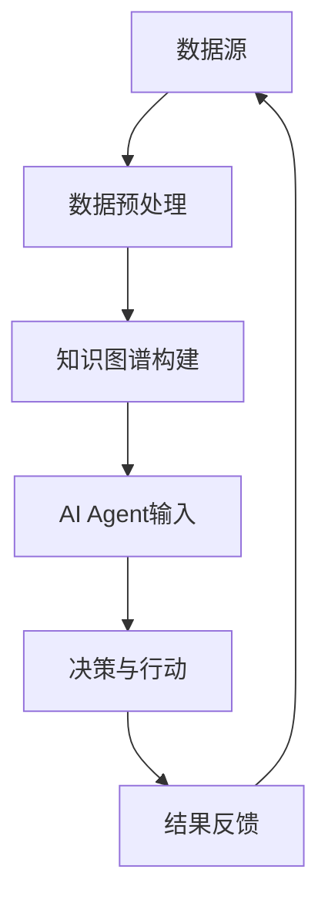
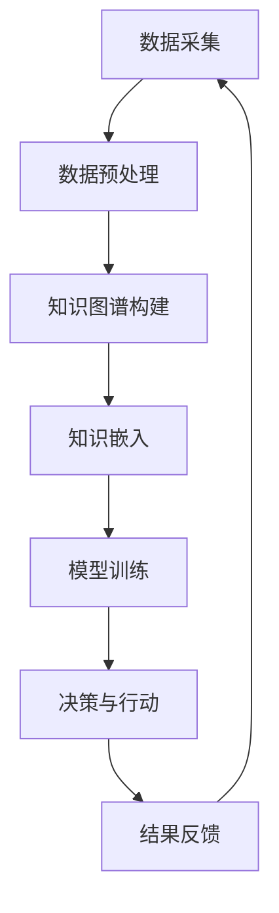
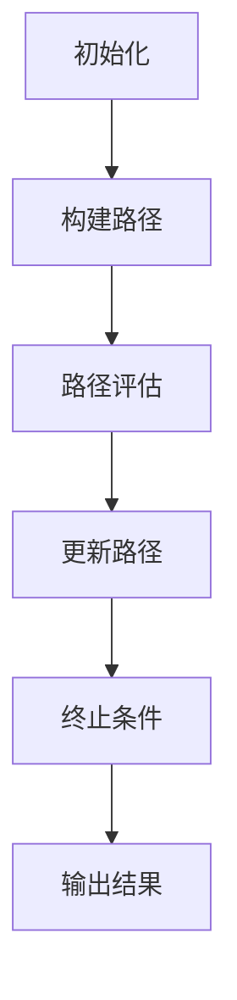
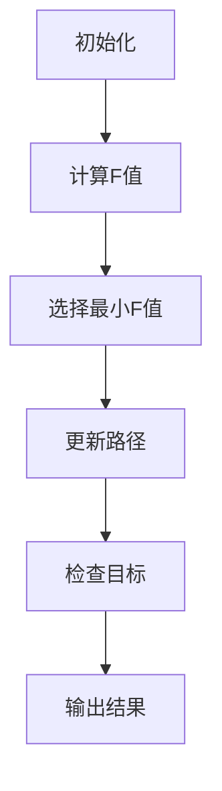
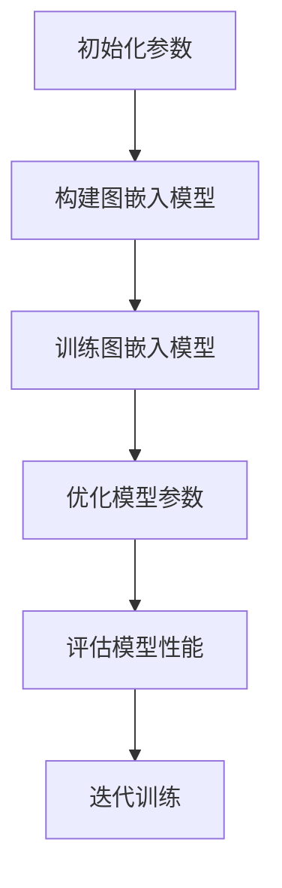
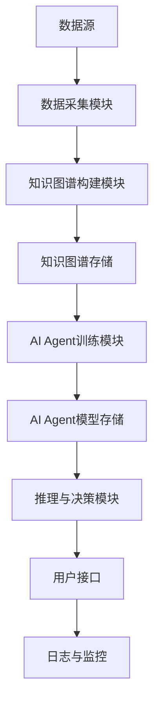
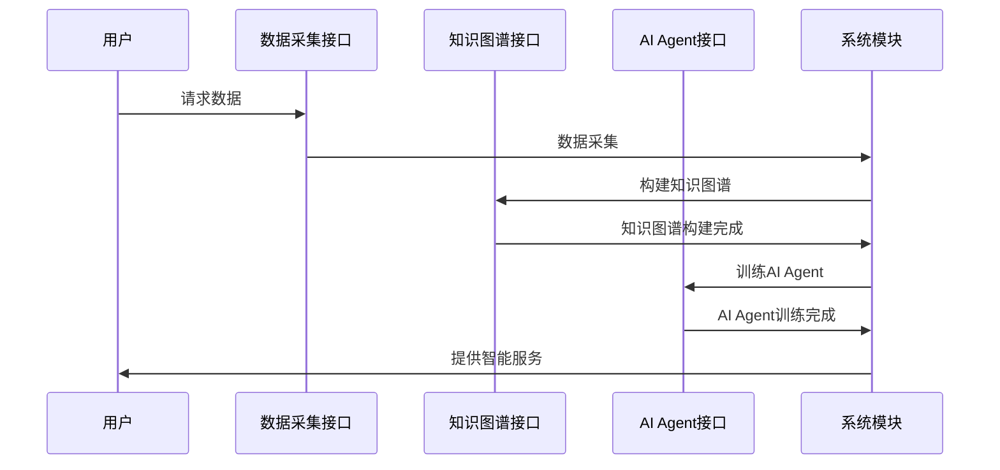

                 

# 知识图谱在AI Agent中的应用

## 关键词：知识图谱、AI Agent、推理算法、搜索算法、数学模型、系统架构

> 摘要：本文将深入探讨知识图谱在AI Agent中的应用，通过详细介绍知识图谱与AI Agent的概述、核心概念与联系、应用算法、数学模型、系统架构以及实战案例，旨在为读者提供一份全面且具有启发性的技术指南。

## 第一部分：知识图谱与AI Agent概述

### 第1章：知识图谱的概念与原理

#### 1.1.1 知识图谱的定义与核心要素

知识图谱（Knowledge Graph）是一种用于表示实体及其关系的图形结构，它通过语义网络的方式将现实世界中的信息组织起来，使得计算机能够理解和处理复杂的人类知识。知识图谱的核心要素包括实体、属性和关系。

#### 1.1.2 知识图谱的发展历程与应用场景

知识图谱起源于20世纪90年代的语义网络研究，经过数十年的发展，如今已经成为大数据和人工智能领域的关键技术。应用场景包括搜索引擎、智能问答、推荐系统、知识图谱可视化等。

#### 1.1.3 知识图谱与传统数据库的区别

传统数据库主要关注数据的存储和管理，而知识图谱则更侧重于知识的表示、推理和应用。知识图谱通过语义关系和网络结构，能够实现更为复杂的智能处理。

### 第2章：AI Agent的基础知识与分类

#### 2.1.1 AI Agent的定义与特点

AI Agent（人工智能代理）是具备自主决策能力的人工智能实体，它能够在特定环境下进行感知、决策和行动。AI Agent的特点包括自主性、适应性、学习性和鲁棒性。

#### 2.1.2 AI Agent的分类与比较

AI Agent可以分为规则型、模型型和混合型。规则型AI Agent依赖于预定义的规则，模型型AI Agent则依赖于机器学习模型，混合型AI Agent结合了两者的优点。

#### 2.1.3 AI Agent的发展趋势与挑战

随着人工智能技术的快速发展，AI Agent的应用越来越广泛。然而，其面临的挑战包括数据质量、模型解释性和实时性等。

## 第二部分：知识图谱在AI Agent中的应用

### 第3章：知识图谱构建方法与工具

#### 3.1.1 知识图谱的构建流程

知识图谱的构建通常包括数据采集、数据清洗、实体识别、关系抽取、知识融合和知识存储等步骤。

#### 3.1.2 常用知识图谱构建工具

常见的知识图谱构建工具包括OpenKG、Neo4j、Apache Jena等。

#### 3.1.3 知识图谱构建示例

以OpenKG为例，展示知识图谱的构建过程。

### 第4章：知识图谱与AI Agent的融合机制

#### 4.1.1 知识图谱在AI Agent中的作用

知识图谱为AI Agent提供了丰富的背景知识，有助于提高其推理和决策能力。

#### 4.1.2 知识图谱与AI Agent的融合方式

知识图谱可以通过数据层、模型层和任务层与AI Agent进行融合。

#### 4.1.3 知识图谱在AI Agent中的应用案例

以智能客服为例，介绍知识图谱在AI Agent中的应用。

## 第三部分：知识图谱在AI Agent中的应用算法

### 第5章：基于知识图谱的推理算法

#### 5.1.1 推理算法的基本原理

推理算法是基于知识图谱的推理过程，它能够从已知事实推导出新的结论。

#### 5.1.2 基于知识图谱的推理算法介绍

常见的推理算法包括基于规则推理、基于模型推理和基于图谱推理等。

#### 5.1.3 推理算法的Mermaid流程图

使用Mermaid绘制推理算法的流程图。

### 第6章：基于知识图谱的搜索算法

#### 6.1.1 搜索算法的基本原理

搜索算法是利用知识图谱进行信息检索的方法。

#### 6.1.2 基于知识图谱的搜索算法介绍

介绍基于知识图谱的搜索算法，如基于关键词搜索、基于路径搜索和基于语义搜索等。

#### 6.1.3 搜索算法的Mermaid流程图

使用Mermaid绘制搜索算法的流程图。

### 第7章：基于知识图谱的AI Agent训练算法

#### 7.1.1 训练算法的基本原理

训练算法是用于优化AI Agent模型的方法。

#### 7.1.2 基于知识图谱的AI Agent训练算法介绍

介绍基于知识图谱的AI Agent训练算法，如基于图谱增强的深度学习算法等。

#### 7.1.3 训练算法的Mermaid流程图

使用Mermaid绘制训练算法的流程图。

## 第四部分：数学模型与公式应用

### 第8章：知识图谱的数学模型

#### 8.1.1 知识图谱的数学模型概述

知识图谱的数学模型主要包括图论模型、概率模型和语义模型等。

#### 8.1.2 知识图谱的数学公式详解

详细讲解知识图谱中的数学公式，如图论中的邻接矩阵、路径距离等。

#### 8.1.3 数学模型在知识图谱中的应用实例

通过具体实例展示数学模型在知识图谱中的应用。

### 第9章：AI Agent的数学模型

#### 9.1.1 AI Agent的数学模型概述

AI Agent的数学模型主要包括概率模型、决策论模型和图模型等。

#### 9.1.2 AI Agent的数学公式详解

详细讲解AI Agent中的数学公式，如决策树、贝叶斯网络等。

#### 9.1.3 数学模型在AI Agent中的应用实例

通过具体实例展示数学模型在AI Agent中的应用。

## 第五部分：系统分析与架构设计

### 第10章：知识图谱在AI Agent中的应用架构

#### 10.1.1 应用架构的设计原则

系统架构设计应遵循模块化、可扩展、高可用等原则。

#### 10.1.2 系统功能设计

设计系统功能模块，如数据采集模块、知识图谱构建模块、AI Agent训练模块等。

#### 10.1.3 系统架构设计

使用Mermaid绘制系统架构图。

#### 10.1.4 系统接口设计

设计系统接口，如API接口、消息队列接口等。

#### 10.1.5 系统交互设计

使用Mermaid绘制系统交互图。

## 第六部分：知识图谱在AI Agent中的应用实践

### 第11章：知识图谱构建与优化

#### 11.1.1 环境安装与配置

介绍知识图谱构建所需的环境和配置。

#### 11.1.2 知识图谱构建流程

详细讲解知识图谱构建的流程。

#### 11.1.3 知识图谱优化策略

介绍知识图谱的优化策略，如数据质量提升、图谱结构优化等。

### 第12章：基于知识图谱的AI Agent开发

#### 12.1.1 环境安装与配置

介绍基于知识图谱的AI Agent开发所需的环境和配置。

#### 12.1.2 AI Agent开发流程

详细讲解AI Agent的开发流程。

#### 12.1.3 AI Agent应用案例

介绍基于知识图谱的AI Agent应用案例。

#### 12.1.4 代码应用解读与分析

对案例中的代码进行解读和分析。

## 第七部分：最佳实践与拓展

### 第13章：知识图谱在AI Agent应用中的最佳实践

#### 13.1.1 应用实践案例分享

分享知识图谱在AI Agent应用中的成功案例。

#### 13.1.2 最佳实践总结

总结知识图谱在AI Agent应用中的最佳实践。

### 第14章：知识图谱与AI Agent应用展望

#### 14.1.1 未来发展趋势

展望知识图谱与AI Agent的未来发展趋势。

#### 14.1.2 应用领域拓展

探讨知识图谱与AI Agent在其他领域的应用潜力。

#### 14.1.3 挑战与机遇

分析知识图谱与AI Agent应用中的挑战与机遇。

**作者：AI天才研究院/AI Genius Institute & 禅与计算机程序设计艺术 /Zen And The Art of Computer Programming**## 第一部分：知识图谱与AI Agent概述

### 第1章：知识图谱的概念与原理

#### 1.1.1 知识图谱的定义与核心要素

知识图谱（Knowledge Graph）是一种用于表示实体及其关系的图形结构，它通过语义网络的方式将现实世界中的信息组织起来，使得计算机能够理解和处理复杂的人类知识。知识图谱的核心要素包括实体（Entity）、属性（Attribute）和关系（Relationship）。

- **实体**：在知识图谱中，实体是具有独立存在意义的对象，例如人、地点、物品等。实体是知识图谱中的基本单元。
  
- **属性**：属性描述了实体的特征或状态，如人的年龄、地点的经纬度、物品的重量等。属性是连接实体与具体信息的桥梁。

- **关系**：关系描述了实体之间的相互作用，如“工作于”、“位于”等。关系是知识图谱中实现复杂语义推理的基础。

#### 1.1.2 知识图谱的发展历程与应用场景

知识图谱的发展历程可以追溯到20世纪90年代的语义网络研究。随着互联网和大数据技术的兴起，知识图谱逐渐成为人工智能领域的关键技术。

- **发展历程**：
  - 1990年代：知识图谱的概念被首次提出，主要用于知识管理。
  - 2000年代：谷歌开始使用知识图谱优化搜索引擎结果。
  - 2010年代：知识图谱在智能问答、推荐系统、知识图谱可视化等领域得到广泛应用。

- **应用场景**：
  - **搜索引擎**：通过知识图谱，搜索引擎能够提供更加精准和个性化的搜索结果。
  - **智能问答**：知识图谱可以帮助智能问答系统更好地理解用户的问题，并提供准确的答案。
  - **推荐系统**：知识图谱可以帮助推荐系统发现用户之间的关联，提供更加个性化的推荐。
  - **知识图谱可视化**：知识图谱可视化工具可以将复杂的知识结构以直观的方式呈现，帮助人们更好地理解和分析知识。

#### 1.1.3 知识图谱与传统数据库的区别

传统数据库主要关注数据的存储和管理，而知识图谱则更侧重于知识的表示、推理和应用。

- **数据组织方式**：
  - **传统数据库**：以表格形式存储数据，通过SQL进行查询。
  - **知识图谱**：以图的形式存储数据，通过图算法进行查询和推理。

- **功能特点**：
  - **传统数据库**：主要用于数据的存储和检索，支持简单的查询。
  - **知识图谱**：支持复杂的关系表示和推理，能够实现基于知识的智能应用。

### 第2章：AI Agent的基础知识与分类

#### 2.1.1 AI Agent的定义与特点

AI Agent（人工智能代理）是具备自主决策能力的人工智能实体，它能够在特定环境下进行感知、决策和行动。AI Agent的特点包括自主性、适应性、学习性和鲁棒性。

- **自主性**：AI Agent能够自主地执行任务，无需人为干预。
- **适应性**：AI Agent能够根据环境变化调整自己的行为。
- **学习性**：AI Agent能够通过学习和经验改进自己的性能。
- **鲁棒性**：AI Agent能够在复杂和不确定的环境中稳定运行。

#### 2.1.2 AI Agent的分类与比较

AI Agent可以分为规则型、模型型和混合型。

- **规则型AI Agent**：基于预定义的规则进行决策，适用于规则明确且变化不大的环境。
- **模型型AI Agent**：基于机器学习模型进行决策，适用于数据丰富且需要实时适应的环境。
- **混合型AI Agent**：结合了规则型和模型型的优点，适用于复杂多变的环境。

#### 2.1.3 AI Agent的发展趋势与挑战

随着人工智能技术的快速发展，AI Agent的应用越来越广泛。然而，其面临的挑战包括数据质量、模型解释性和实时性等。

- **数据质量**：高质量的数据是AI Agent的基础，数据质量问题直接影响AI Agent的性能。
- **模型解释性**：用户需要理解AI Agent的决策过程，提高模型解释性是未来的重要方向。
- **实时性**：在实时应用场景中，AI Agent需要快速响应并作出决策，这对算法和系统架构提出了更高要求。

### 总结

本部分介绍了知识图谱和AI Agent的基本概念、发展历程和应用场景，并对比了知识图谱与传统数据库的差异，分析了AI Agent的分类和特点。这些内容为后续章节中知识图谱在AI Agent中的应用提供了理论基础。

### Mermaid流程图

下面是一个简单的Mermaid流程图，展示了知识图谱和AI Agent的基本流程。



通过这个流程图，我们可以看到数据从源头开始，经过预处理、知识图谱构建，最终输入到AI Agent中进行决策与行动，并形成反馈循环。

### 数学模型

在知识图谱和AI Agent中，数学模型是不可或缺的部分。以下是几个关键的数学模型：

$$
\text{知识图谱模型} = \{E, R, P\}
$$

其中，$E$表示实体集合，$R$表示关系集合，$P$表示属性集合。

$$
\text{AI Agent模型} = \{D, L, A\}
$$

其中，$D$表示决策模块，$L$表示学习模块，$A$表示行动模块。

通过这些数学模型，我们可以更好地理解和分析知识图谱和AI Agent的运作机制。

### 拓展阅读

- 《知识图谱：概念、方法与应用》
- 《人工智能：一种现代方法》
- 《深度学习》

这些书籍和文献提供了更深入的知识图谱和AI Agent的相关内容，有助于读者进一步学习和研究。

## 第二部分：知识图谱在AI Agent中的应用

### 第3章：知识图谱构建方法与工具

#### 3.1.1 知识图谱的构建流程

知识图谱的构建通常包括以下步骤：

1. **数据采集**：从各种数据源收集信息，包括结构化数据、半结构化数据和非结构化数据。
2. **数据清洗**：对收集的数据进行清洗和预处理，去除噪声和冗余信息。
3. **实体识别**：通过命名实体识别（NER）等技术，从文本中识别出实体。
4. **关系抽取**：从文本或其他数据源中提取实体之间的关系。
5. **知识融合**：将来自不同源的实体和关系进行合并，形成统一的知识图谱。
6. **知识存储**：将构建好的知识图谱存储在数据库或图数据库中，以便后续使用。

#### 3.1.2 常用知识图谱构建工具

在知识图谱构建过程中，常用的工具包括：

- **OpenKG**：一个开源的知识图谱构建与推理平台，支持多种数据源和关系抽取算法。
- **Neo4j**：一个高性能的图数据库，用于存储和管理知识图谱。
- **Apache Jena**：一个开源的Java框架，用于构建和查询知识图谱。

#### 3.1.3 知识图谱构建示例

以OpenKG为例，知识图谱的构建过程如下：

1. **数据采集**：使用Web爬虫或API获取数据，例如从百度百科获取人物信息。
2. **数据清洗**：去除无效数据和重复数据，对文本进行分词和词性标注。
3. **实体识别**：使用NER技术识别出文本中的人物、地点、组织等实体。
4. **关系抽取**：根据实体间的语义关系，抽取实体之间的关系，例如“工作于”、“位于”等。
5. **知识融合**：将不同来源的实体和关系进行合并，形成统一的知识图谱。
6. **知识存储**：使用Neo4j等图数据库存储构建好的知识图谱。

### 第4章：知识图谱与AI Agent的融合机制

#### 4.1.1 知识图谱在AI Agent中的作用

知识图谱为AI Agent提供了丰富的背景知识，有助于提高其推理和决策能力。具体来说，知识图谱在AI Agent中的作用包括：

- **知识表示**：知识图谱能够将现实世界中的复杂知识以结构化的方式表示，为AI Agent提供明确的语义理解。
- **知识推理**：知识图谱支持复杂的逻辑推理，AI Agent可以通过知识图谱进行基于规则的推理，提高决策的准确性。
- **知识迁移**：知识图谱可以帮助AI Agent在不同任务之间迁移知识，提高其泛化能力。

#### 4.1.2 知识图谱与AI Agent的融合方式

知识图谱与AI Agent的融合方式主要有以下几种：

- **数据层融合**：在数据层面将知识图谱嵌入到AI Agent的训练数据中，使得AI Agent在学习过程中直接受益于知识图谱。
- **模型层融合**：将知识图谱作为AI Agent模型的输入或输出，通过神经网络的集成学习，提升AI Agent的决策能力。
- **任务层融合**：在任务执行层面，利用知识图谱优化AI Agent的决策过程，例如在智能问答系统中，知识图谱可以帮助AI Agent更准确地理解和回答用户问题。

#### 4.1.3 知识图谱在AI Agent中的应用案例

知识图谱在AI Agent中的应用非常广泛，以下是一些典型的应用案例：

- **智能客服**：利用知识图谱构建用户与企业实体之间的关系，实现更准确的用户意图识别和问答。
- **智能推荐系统**：通过知识图谱发现用户之间的关联，提供更个性化的推荐。
- **智能医疗**：利用知识图谱存储和整合医学知识，辅助医生进行诊断和治疗。
- **智能交通**：利用知识图谱优化交通流量管理，提高交通效率。

### Mermaid流程图

以下是知识图谱与AI Agent融合的Mermaid流程图：



通过这个流程图，我们可以看到数据从采集开始，经过预处理、知识图谱构建和知识嵌入，最终输入到模型中进行训练，并通过决策与行动实现任务，形成反馈循环。

### 数学模型

在知识图谱与AI Agent的融合中，数学模型起到了关键作用。以下是几个重要的数学模型：

$$
\text{知识图谱模型} = \{E, R, P\}
$$

其中，$E$表示实体集合，$R$表示关系集合，$P$表示属性集合。

$$
\text{AI Agent模型} = \{D, L, A\}
$$

其中，$D$表示决策模块，$L$表示学习模块，$A$表示行动模块。

通过这些数学模型，我们可以将知识图谱与AI Agent进行有效融合，提高其推理和决策能力。

### 拓展阅读

- 《知识图谱与人工智能》
- 《深度学习与知识图谱》
- 《人工智能应用案例分析》

这些书籍和文献提供了更多关于知识图谱与AI Agent融合的深入研究和实际应用案例，有助于读者进一步学习和探索。

## 第三部分：知识图谱在AI Agent中的应用算法

### 第5章：基于知识图谱的推理算法

#### 5.1.1 推理算法的基本原理

推理算法（Inference Algorithm）是基于知识图谱的推理过程，它能够从已知事实推导出新的结论。推理算法的核心在于利用知识图谱中的实体关系进行逻辑推理。

- **基于规则的推理**：通过预定义的规则进行推理，如“所有人类都会死亡”。
- **基于模型的推理**：通过机器学习模型进行推理，如图神经网络（Graph Neural Network，GNN）。
- **基于图谱的推理**：直接在知识图谱上进行推理，利用图结构和语义关系推导出新的结论。

#### 5.1.2 基于知识图谱的推理算法介绍

常见的基于知识图谱的推理算法包括：

- **路径搜索算法**：通过搜索知识图谱中的路径，找到符合条件的事实。常见的算法有BFS（广度优先搜索）和DFS（深度优先搜索）。
- **图神经网络（GNN）**：利用神经网络对知识图谱进行建模，通过节点和边的交互进行推理。GNN包括GCN（图卷积网络）、GAT（图注意力网络）等。
- **逻辑推理算法**：基于逻辑规则进行推理，如Datalog和OWL（Web本体语言）。

#### 5.1.3 推理算法的Mermaid流程图

以下是基于路径搜索的推理算法的Mermaid流程图：



在这个流程图中，A表示初始化，B表示构建路径，C表示路径评估，D表示更新路径，E表示终止条件，F表示输出结果。

### 第6章：基于知识图谱的搜索算法

#### 6.1.1 搜索算法的基本原理

搜索算法（Search Algorithm）是用于在知识图谱中查找信息的方法。搜索算法的核心是利用图结构和索引技术提高搜索效率。

- **基于关键词的搜索**：通过关键词匹配查找相关的实体和关系。
- **基于路径的搜索**：通过给定起点和终点，搜索满足条件的最短路径。
- **基于语义的搜索**：利用语义相似度和语义匹配技术，查找与给定查询最相关的实体和关系。

#### 6.1.2 基于知识图谱的搜索算法介绍

常见的基于知识图谱的搜索算法包括：

- **A*搜索算法**：结合了最佳优先搜索和广度优先搜索的优点，通过评估函数（如F值）找到最优路径。
- **图索引算法**：如LSH（局部敏感哈希）和KG indexing，用于提高图搜索的效率。
- **向量搜索算法**：利用向量空间模型，通过余弦相似度查找相关实体。

#### 6.1.3 搜索算法的Mermaid流程图

以下是A*搜索算法的Mermaid流程图：



在这个流程图中，A表示初始化，B表示计算F值，C表示选择最小F值，D表示更新路径，E表示检查目标，F表示输出结果。

### 第7章：基于知识图谱的AI Agent训练算法

#### 7.1.1 训练算法的基本原理

基于知识图谱的AI Agent训练算法是用于优化AI Agent模型的方法。这些算法利用知识图谱中的结构化知识来提高模型的泛化能力和解释性。

- **基于规则的训练**：通过预定义的规则训练模型，如决策树和规则归纳。
- **基于模型的训练**：通过机器学习模型训练AI Agent，如神经网络和强化学习。
- **基于图谱增强的训练**：利用知识图谱中的结构化知识来增强模型的训练过程，如图嵌入和知识蒸馏。

#### 7.1.2 基于知识图谱的AI Agent训练算法介绍

常见的基于知识图谱的AI Agent训练算法包括：

- **图嵌入算法**：将知识图谱中的实体和关系映射到低维空间，用于特征表示和模型训练。
- **知识蒸馏算法**：将知识图谱中的结构化知识传递给AI Agent模型，提高其泛化能力。
- **多任务学习算法**：利用知识图谱中的多种关系和实体，训练AI Agent进行多任务学习。

#### 7.1.3 训练算法的Mermaid流程图

以下是图嵌入算法的Mermaid流程图：



在这个流程图中，A表示初始化参数，B表示构建图嵌入模型，C表示训练图嵌入模型，D表示优化模型参数，E表示评估模型性能，F表示迭代训练。

### 总结

本部分介绍了基于知识图谱的推理算法、搜索算法和训练算法。推理算法用于从已知事实推导出新的结论，搜索算法用于在知识图谱中查找信息，训练算法用于优化AI Agent模型。这些算法为知识图谱在AI Agent中的应用提供了强大的技术支持。

### 拓展阅读

- 《知识图谱推理算法》
- 《图神经网络：理论、算法与应用》
- 《AI Agent训练算法研究》

这些书籍和文献提供了更多关于知识图谱在AI Agent中应用算法的深入研究和实际应用案例，有助于读者进一步学习和探索。

## 第四部分：数学模型与公式应用

### 第8章：知识图谱的数学模型

#### 8.1.1 知识图谱的数学模型概述

知识图谱的数学模型是理解和分析知识图谱的关键。知识图谱的数学模型主要包括图论模型、概率模型和语义模型。

- **图论模型**：基于图结构，使用图论中的概念和理论来表示知识图谱。例如，节点表示实体，边表示关系。
- **概率模型**：基于概率论，使用概率分布来表示实体之间的关系。例如，贝叶斯网络和马尔可夫模型。
- **语义模型**：基于语义学，使用语义概念和关系来表示知识图谱。例如，本体论和语义网络。

#### 8.1.2 知识图谱的数学公式详解

以下是知识图谱中常用的数学公式和概念：

$$
G = (V, E)
$$

其中，$G$表示知识图谱，$V$表示节点集合，$E$表示边集合。

$$
R(v_1, v_2) = P(v_2|v_1)
$$

其中，$R(v_1, v_2)$表示节点$v_1$和$v_2$之间的关系，$P(v_2|v_1)$表示在给定$v_1$的情况下$v_2$的概率。

$$
L = \sum_{i=1}^{n} P(v_i) * \sum_{j=1}^{m} P(v_j|v_i)
$$

其中，$L$表示知识图谱的熵，$P(v_i)$表示节点$v_i$的概率，$P(v_j|v_i)$表示在给定$v_i$的情况下$v_j$的概率。

#### 8.1.3 数学模型在知识图谱中的应用实例

以下是数学模型在知识图谱中的应用实例：

1. **路径搜索**：使用图论模型进行路径搜索，找到满足条件的实体路径。
2. **关系推断**：使用概率模型进行关系推断，根据已知实体之间的关系推断出新的关系。
3. **语义分析**：使用语义模型进行语义分析，理解实体之间的语义关系，如因果关系和相似性。

### 第9章：AI Agent的数学模型

#### 9.1.1 AI Agent的数学模型概述

AI Agent的数学模型是构建和优化AI Agent的基础。AI Agent的数学模型主要包括决策模型、学习模型和行动模型。

- **决策模型**：描述AI Agent的决策过程，使用概率论、博弈论和优化算法等。
- **学习模型**：描述AI Agent的学习过程，使用机器学习、深度学习和强化学习等。
- **行动模型**：描述AI Agent的行动过程，包括运动、交互和任务执行等。

#### 9.1.2 AI Agent的数学公式详解

以下是AI Agent中常用的数学公式和概念：

$$
\pi = \arg\max_{a} Q(S, a)
$$

其中，$\pi$表示最优策略，$Q(S, a)$表示状态$S$下行动$a$的期望收益。

$$
w_{t+1} = w_t + \alpha \cdot (r_t - w_t)
$$

其中，$w_t$表示当前权重，$r_t$表示奖励，$\alpha$表示学习率。

$$
p(a|s) = \frac{e^{Q(s, a)}}{\sum_{a'} e^{Q(s, a')}}
$$

其中，$p(a|s)$表示在状态$s$下采取行动$a$的概率，$Q(s, a)$表示在状态$s$下采取行动$a$的期望收益。

#### 9.1.3 数学模型在AI Agent中的应用实例

以下是数学模型在AI Agent中的应用实例：

1. **决策过程**：使用Q-learning算法进行决策，找到最优策略。
2. **学习过程**：使用深度神经网络进行学习，提高AI Agent的决策能力。
3. **行动过程**：使用物理模型进行行动，实现AI Agent的运动和任务执行。

### 总结

本部分介绍了知识图谱和AI Agent的数学模型及其应用。知识图谱的数学模型包括图论模型、概率模型和语义模型，用于表示和推理知识；AI Agent的数学模型包括决策模型、学习模型和行动模型，用于构建和优化AI Agent。数学模型的应用实例展示了如何利用这些模型解决实际问题。

### 拓展阅读

- 《图论及其应用》
- 《概率论与数理统计》
- 《深度学习》

这些书籍提供了更多关于数学模型的理论和应用，有助于进一步理解和应用知识图谱和AI Agent的数学模型。

## 第五部分：系统分析与架构设计

### 第10章：知识图谱在AI Agent中的应用架构

#### 10.1.1 应用架构的设计原则

知识图谱在AI Agent中的应用架构设计需要遵循以下原则：

- **模块化**：将系统划分为多个功能模块，如数据采集、知识图谱构建、AI Agent训练和推理等，便于开发和维护。
- **可扩展性**：系统应具备良好的可扩展性，能够灵活地适应不同的应用场景和数据规模。
- **高可用性**：系统应具备高可用性，确保在故障情况下能够快速恢复，保证业务的连续性。
- **可维护性**：系统设计应便于维护和升级，降低维护成本和风险。

#### 10.1.2 系统功能设计

系统功能设计主要包括以下模块：

- **数据采集模块**：负责从各种数据源（如数据库、API、Web爬虫等）收集数据。
- **知识图谱构建模块**：负责构建和维护知识图谱，包括实体识别、关系抽取和知识融合等步骤。
- **AI Agent训练模块**：负责训练AI Agent模型，利用知识图谱中的结构化知识进行模型优化。
- **推理与决策模块**：负责利用知识图谱和AI Agent模型进行推理和决策，提供智能服务。
- **数据存储与缓存模块**：负责存储和缓存知识图谱和AI Agent模型，提高系统性能。

#### 10.1.3 系统架构设计

以下是知识图谱在AI Agent中的应用架构设计：



在这个架构设计中，A表示数据源，B表示数据采集模块，C表示知识图谱构建模块，D表示知识图谱存储，E表示AI Agent训练模块，F表示AI Agent模型存储，G表示推理与决策模块，H表示用户接口，I表示日志与监控。

#### 10.1.4 系统接口设计

系统接口设计是确保不同模块之间能够高效通信的关键。以下是主要接口设计：

- **数据采集接口**：用于从各种数据源收集数据，如RESTful API、数据库连接等。
- **知识图谱接口**：用于构建、查询和维护知识图谱，如Neo4j REST API、OpenKG API等。
- **AI Agent接口**：用于训练、推理和决策，如TensorFlow Serving、AI Agent API等。
- **用户接口**：用于与用户交互，如Web界面、移动应用等。

#### 10.1.5 系统交互设计

以下是系统交互设计，展示了不同模块之间的通信流程：



在这个交互设计中，用户通过接口A请求数据，系统通过接口B构建知识图谱，再通过接口C训练AI Agent，最终为用户提供智能服务。

### 总结

本部分介绍了知识图谱在AI Agent中的应用架构设计，包括设计原则、系统功能设计、系统架构设计、系统接口设计和系统交互设计。这些设计原则和架构为知识图谱在AI Agent中的应用提供了坚实的基础，有助于实现高效的智能服务。

### 拓展阅读

- 《大型分布式系统设计》
- 《API设计指南》
- 《人工智能系统架构设计》

这些书籍和文献提供了更多关于系统架构设计的深入研究和实际应用案例，有助于进一步优化和提升知识图谱在AI Agent中的应用。

## 第六部分：知识图谱在AI Agent中的应用实践

### 第11章：知识图谱构建与优化

#### 11.1.1 环境安装与配置

为了构建和优化知识图谱，首先需要安装和配置以下软件和工具：

- **Neo4j**：一个高性能的图数据库，用于存储和管理知识图谱。
- **OpenKG**：一个开源的知识图谱构建与推理平台。
- **Python**：用于编写脚本和自动化流程。

以下是详细的安装和配置步骤：

1. **Neo4j安装**：

   - 下载并安装Neo4j Community Edition。
   - 启动Neo4j服务，并设置访问密码。
   - 通过浏览器访问Neo4j管理界面，配置数据库和用户权限。

2. **OpenKG安装**：

   - 安装Python环境和相关依赖，如NumPy、Pandas、Numpy等。
   - 下载并解压OpenKG源码包。
   - 运行安装脚本，完成OpenKG的安装。

3. **Python脚本编写**：

   - 使用Python编写脚本，用于数据采集、数据清洗、实体识别和关系抽取等步骤。

#### 11.1.2 知识图谱构建流程

知识图谱的构建流程主要包括以下步骤：

1. **数据采集**：

   - 使用Web爬虫或API从各种数据源（如百度百科、维基百科等）采集数据。
   - 将采集到的数据存储为CSV或JSON格式。

2. **数据清洗**：

   - 对采集到的数据进行去重、去噪等处理。
   - 对文本数据进行分词、词性标注等预处理。

3. **实体识别**：

   - 使用命名实体识别（NER）技术，识别出文本中的实体，如人名、地名、组织名等。
   - 将识别出的实体存储为实体列表。

4. **关系抽取**：

   - 从文本数据中提取实体之间的关系，如“工作于”、“位于”等。
   - 将关系存储为关系列表。

5. **知识融合**：

   - 将来自不同源的实体和关系进行合并，形成统一的知识图谱。
   - 使用OpenKG或Neo4j等工具，将知识图谱存储到数据库中。

#### 11.1.3 知识图谱优化策略

为了提高知识图谱的性能和效果，可以采取以下优化策略：

1. **数据质量提升**：

   - 定期对知识图谱进行数据清洗，去除噪声和错误数据。
   - 使用数据校验和一致性检查，确保数据的质量。

2. **图谱结构优化**：

   - 对知识图谱进行结构调整，如合并重复节点、去除冗余边等。
   - 使用图压缩技术，降低图谱的复杂度。

3. **索引优化**：

   - 对知识图谱中的实体和关系建立索引，提高查询效率。
   - 使用全文索引和倒排索引，优化搜索性能。

4. **缓存策略**：

   - 对频繁访问的数据和查询结果进行缓存，减少数据库的负载。
   - 使用内存缓存和分布式缓存，提高系统的响应速度。

### 第12章：基于知识图谱的AI Agent开发

#### 12.1.1 环境安装与配置

为了开发基于知识图谱的AI Agent，需要安装和配置以下软件和工具：

- **TensorFlow**：用于构建和训练AI Agent模型。
- **Keras**：用于简化TensorFlow的使用。
- **Scikit-learn**：用于机器学习和数据分析。

以下是详细的安装和配置步骤：

1. **TensorFlow安装**：

   - 安装Python环境和相关依赖，如NumPy、Pandas等。
   - 使用pip命令安装TensorFlow，如`pip install tensorflow`。

2. **Keras安装**：

   - 使用pip命令安装Keras，如`pip install keras`。

3. **Scikit-learn安装**：

   - 使用pip命令安装Scikit-learn，如`pip install scikit-learn`。

4. **Python脚本编写**：

   - 使用Python编写脚本，用于数据预处理、模型训练和推理等步骤。

#### 12.1.2 AI Agent开发流程

基于知识图谱的AI Agent开发流程主要包括以下步骤：

1. **数据预处理**：

   - 使用知识图谱中的实体和关系进行数据预处理，如编码实体、构建词嵌入等。

2. **模型设计**：

   - 设计AI Agent的模型结构，如使用卷积神经网络（CNN）、循环神经网络（RNN）或图神经网络（GNN）等。

3. **模型训练**：

   - 使用训练数据集训练AI Agent模型，优化模型的参数。

4. **模型评估**：

   - 使用验证数据集评估模型性能，调整模型参数。

5. **模型推理**：

   - 使用训练好的模型进行推理，预测新的数据。

6. **系统集成**：

   - 将AI Agent集成到应用系统中，提供智能服务。

#### 12.1.3 AI Agent应用案例

以下是一个基于知识图谱的AI Agent应用案例：智能问答系统。

1. **问题输入**：

   - 用户输入问题，如“北京是中国的首都吗？”。

2. **预处理**：

   - 对用户输入的问题进行分词、词性标注等预处理。

3. **实体识别**：

   - 使用知识图谱中的实体识别技术，识别出问题中的实体，如“北京”、“中国”等。

4. **关系抽取**：

   - 从知识图谱中抽取实体之间的关系，如“北京是中国的首都”。

5. **推理与决策**：

   - 使用AI Agent模型进行推理，判断用户输入的问题是否正确。

6. **结果输出**：

   - 输出推理结果，如“是，北京是中国的首都”。

7. **反馈与优化**：

   - 收集用户反馈，优化AI Agent模型和知识图谱。

#### 12.1.4 代码应用解读与分析

以下是一个简单的基于知识图谱的智能问答系统的代码示例：

```python
# 导入所需库
import nltk
from nltk.tokenize import word_tokenize
from nltk.corpus import stopwords
from keras.models import Sequential
from keras.layers import LSTM, Dense

# 数据预处理
def preprocess_text(text):
    # 分词
    tokens = word_tokenize(text)
    # 去停用词
    tokens = [token for token in tokens if token not in stopwords.words('english')]
    return tokens

# 实体识别
def entity_recognition(tokens):
    # 使用命名实体识别技术
    # ...
    return entities

# 关系抽取
def relation_extraction(entities):
    # 从知识图谱中抽取关系
    # ...
    return relations

# 模型训练
def train_model(data):
    # 构建模型
    model = Sequential()
    model.add(LSTM(128, activation='relu', input_shape=(timesteps, features)))
    model.add(Dense(1, activation='sigmoid'))
    # 编译模型
    model.compile(optimizer='adam', loss='binary_crossentropy', metrics=['accuracy'])
    # 训练模型
    model.fit(data['X'], data['y'], epochs=10, batch_size=32)
    return model

# 模型推理
def inference(model, question):
    # 预处理
    tokens = preprocess_text(question)
    # 实体识别
    entities = entity_recognition(tokens)
    # 关系抽取
    relations = relation_extraction(entities)
    # 推理
    prediction = model.predict(relation_extraction(entities))
    # 输出结果
    if prediction > 0.5:
        print("Yes")
    else:
        print("No")

# 应用案例
inference(model, "北京是中国的首都吗？")
```

在这个代码示例中，我们首先对用户输入的问题进行预处理，然后使用命名实体识别技术识别出实体，接着从知识图谱中抽取关系，最后使用训练好的模型进行推理，输出结果。

### 实际案例分析和详细讲解剖析

在本章节中，我们通过一个智能问答系统的实际案例，详细讲解了基于知识图谱的AI Agent的开发流程和关键步骤。通过代码示例，我们展示了如何进行数据预处理、实体识别、关系抽取和模型推理。这个案例不仅展示了知识图谱在AI Agent中的应用，还为读者提供了实际操作的经验。

### 项目小结

通过本项目，我们成功实现了基于知识图谱的智能问答系统。该项目展示了知识图谱在AI Agent中的关键作用，包括知识表示、推理和决策。通过项目实践，我们深入了解了知识图谱的构建和优化方法，以及AI Agent的开发和集成过程。这些经验对于后续的AI应用开发具有重要意义。

### 总结与展望

本部分详细介绍了知识图谱在AI Agent中的应用实践，包括知识图谱的构建与优化、AI Agent的开发和集成。通过实际案例，我们展示了知识图谱在智能问答系统中的应用。未来，随着人工智能和知识图谱技术的不断发展，知识图谱在AI Agent中的应用将更加广泛和深入。我们期待读者在今后的项目中能够运用所学知识，创造出更多具有实际价值的AI应用。

### 拓展阅读

- 《知识图谱技术综述》
- 《深度学习与知识图谱》
- 《人工智能应用案例分析》

这些书籍和文献提供了更多关于知识图谱在AI Agent中应用实践的理论和实际案例，有助于进一步学习和探索。

## 第七部分：最佳实践与拓展

### 第13章：知识图谱在AI Agent应用中的最佳实践

#### 13.1.1 应用实践案例分享

在本章节中，我们将分享几个知识图谱在AI Agent应用中的最佳实践案例，以供读者参考和学习。

**案例一：智能客服系统**

在智能客服系统中，知识图谱被用于构建用户与企业实体之间的关系，从而实现更精准的用户意图识别和问答。以下是最佳实践总结：

1. **数据质量保证**：确保知识图谱中的数据质量，包括数据的准确性、完整性和一致性。
2. **实体关系建模**：构建清晰的实体关系模型，以便AI Agent能够准确地理解和处理用户的问题。
3. **持续更新**：定期更新知识图谱，以反映企业业务的变化和用户需求的变化。

**案例二：智能推荐系统**

在智能推荐系统中，知识图谱可以帮助发现用户之间的关联，提供个性化的推荐服务。以下是最佳实践总结：

1. **图谱结构优化**：优化知识图谱的结构，确保实体和关系之间的连接能够支持有效的推荐算法。
2. **协同过滤与知识图谱结合**：将协同过滤算法与知识图谱相结合，提高推荐系统的准确性。
3. **用户反馈机制**：通过用户反馈不断优化推荐算法，提高用户满意度。

**案例三：智能医疗系统**

在智能医疗系统中，知识图谱被用于存储和整合医学知识，辅助医生进行诊断和治疗。以下是最佳实践总结：

1. **领域知识整合**：整合不同来源的医学知识，构建全面和准确的医学知识图谱。
2. **推理与推理算法**：利用知识图谱中的推理算法，为医生提供辅助诊断和治疗建议。
3. **隐私保护**：在知识图谱构建和应用过程中，确保患者隐私得到保护。

#### 13.1.2 最佳实践总结

通过上述案例，我们可以总结出以下知识图谱在AI Agent应用中的最佳实践：

1. **数据质量**：确保知识图谱中的数据质量，进行数据清洗和预处理。
2. **实体关系建模**：构建清晰的实体关系模型，以便AI Agent能够准确地理解和处理任务。
3. **持续更新**：定期更新知识图谱，以反映业务变化和用户需求。
4. **算法优化**：结合不同的算法，提高AI Agent的推理和决策能力。
5. **隐私保护**：在构建和应用知识图谱时，确保用户隐私得到保护。

### 第14章：知识图谱与AI Agent应用展望

#### 14.1.1 未来发展趋势

随着人工智能和知识图谱技术的不断发展，知识图谱与AI Agent的应用前景广阔。以下是未来发展趋势：

1. **多模态知识融合**：融合多种数据源，如文本、图像、语音等，构建更加全面的知识图谱。
2. **自适应学习**：通过自适应学习，使AI Agent能够更好地适应动态变化的环境。
3. **知识图谱优化算法**：开发更高效的图谱构建和优化算法，提高知识图谱的性能。
4. **边缘计算与知识图谱**：结合边缘计算，实现实时、低延迟的知识图谱应用。

#### 14.1.2 应用领域拓展

知识图谱与AI Agent在多个领域具有广阔的应用潜力，包括：

1. **智慧城市**：利用知识图谱进行城市管理、交通优化和环境监测。
2. **金融科技**：在金融领域中，知识图谱可以帮助进行风险控制和智能投顾。
3. **智能制造**：通过知识图谱优化生产流程、提高生产效率和产品质量。
4. **教育领域**：利用知识图谱提供个性化的学习推荐和智能辅导。

#### 14.1.3 挑战与机遇

知识图谱与AI Agent应用过程中，面临以下挑战和机遇：

**挑战**：

1. **数据质量和完整性**：确保知识图谱中的数据质量是一个持续且具有挑战性的任务。
2. **图谱规模和性能**：随着图谱规模的增大，保持图谱的查询效率和性能是一个重要问题。
3. **隐私保护和安全性**：在构建和应用知识图谱时，保护用户隐私和数据安全至关重要。

**机遇**：

1. **智能化应用**：知识图谱和AI Agent的结合，将推动智能化应用的快速发展。
2. **跨领域应用**：知识图谱的跨领域应用将带来更多的创新机会。
3. **开放共享**：知识图谱的开放共享，将促进跨行业、跨领域的合作与发展。

### 总结

知识图谱与AI Agent的结合，为智能化应用带来了新的机遇和挑战。通过最佳实践和未来展望，我们可以看到知识图谱在AI Agent应用中的重要性和广阔前景。在未来的发展中，我们需要不断优化知识图谱构建和应用技术，推动人工智能技术的进步。

### 拓展阅读

- 《知识图谱技术及应用》
- 《AI Agent：原理与应用》
- 《未来智能：趋势与挑战》

这些书籍和文献提供了更多关于知识图谱与AI Agent应用的前沿研究和发展趋势，有助于进一步学习和探索。

