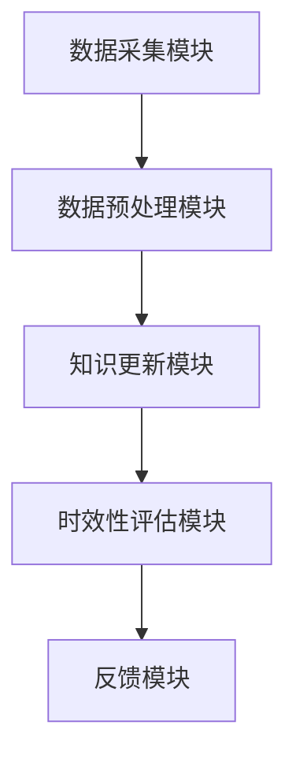

                 

### 知识更新：保持AI Agent信息的时效性

关键词：知识更新、AI Agent、信息时效性、算法原理、数学模型、系统设计

摘要：本文深入探讨了知识更新在AI Agent中的重要性，以及如何通过算法和数学模型来保持AI Agent的信息时效性。通过详细的分析和案例实践，我们提出了有效的解决方案，旨在提升AI Agent的智能化水平。

### 引言

在当今快速发展的科技时代，知识更新的速度越来越快，这对依赖知识的AI Agent来说，信息时效性变得尤为重要。然而，如何保持AI Agent的信息时效性，成为了一个亟待解决的问题。本文将围绕这一主题，进行深入探讨。

#### 1.1 书籍主题与目标

本文旨在为读者提供一个全面、系统的知识更新解决方案，帮助AI Agent保持信息的时效性。文章将涵盖从基础知识到实际应用的各个层面，使读者能够深入理解并应用这些原理和方法。

#### 1.2 AI Agent信息时效性问题的背景

随着人工智能技术的快速发展，AI Agent的应用场景越来越广泛。然而，AI Agent依赖的知识库如果不能及时更新，会导致其表现能力下降，甚至可能出现错误的决策。因此，如何保持AI Agent的信息时效性，成为了AI领域的一个重要课题。

#### 1.3 书籍结构概述

本文结构分为六个主要部分：

1. **引言**：介绍知识更新和AI Agent信息时效性的背景和重要性。
2. **背景介绍与核心概念**：详细解释知识更新和AI Agent的基本概念。
3. **保持AI Agent信息的时效性**：探讨如何保持AI Agent的信息时效性。
4. **核心概念与联系**：分析保持AI Agent信息时效性的核心概念及其关系。
5. **算法原理与数学模型**：讲解保持AI Agent信息时效性的算法原理和数学模型。
6. **系统设计与实战**：通过实际案例展示如何应用这些方法。
7. **最佳实践与总结**：总结全文，提供最佳实践和建议。

### 第二部分：背景介绍与核心概念

#### 2.1 知识更新概述

##### 2.1.1 知识更新的背景

知识更新是知识管理的重要组成部分。在信息技术高速发展的今天，知识更新的速度加快，知识更新的频率和深度都大大提高。知识更新的背景可以归结为以下几个方面：

1. **信息化社会的到来**：随着互联网的普及，信息获取变得容易，知识更新速度加快。
2. **技术的飞速发展**：计算机技术、网络技术等的发展，使得知识的存储、传播、共享变得更加高效。
3. **竞争压力的增大**：企业为了在激烈的市场竞争中立于不败之地，需要不断更新知识，提高创新能力。

##### 2.1.2 知识更新的概念与特征

知识更新指的是对现有知识进行修改、完善、升级的过程。知识更新的特征主要包括：

1. **时效性**：知识更新需要及时进行，以适应不断变化的环境。
2. **系统性**：知识更新是一个系统性工程，需要全面、系统地更新知识库。
3. **动态性**：知识更新是一个动态过程，需要根据实际情况不断调整和优化。

##### 2.1.3 知识更新的挑战与机遇

知识更新的挑战主要体现在以下几个方面：

1. **信息过载**：随着信息量的增加，如何筛选和识别有用的信息成为难题。
2. **知识整合**：不同领域、不同来源的知识如何进行有效整合，提高知识的利用效率。
3. **知识更新成本**：知识更新需要投入大量的人力、物力和财力。

然而，知识更新也带来了许多机遇：

1. **创新能力的提升**：及时更新知识，可以激发创新思维，提高企业的创新能力。
2. **竞争力的增强**：通过知识更新，企业可以更好地适应市场变化，提高竞争力。
3. **知识价值的最大化**：知识更新可以提高知识的利用效率，实现知识价值的最大化。

#### 2.2 AI Agent概述

##### 2.2.1 AI Agent的定义

AI Agent，即人工智能代理，是指能够模拟人类行为，具有一定智能能力的计算机程序。AI Agent的定义可以从以下几个方面来理解：

1. **自主性**：AI Agent能够自主地执行任务，不受人为干预。
2. **适应性**：AI Agent能够根据环境和任务的变化，调整自身行为。
3. **智能性**：AI Agent具备一定的智能能力，可以进行学习、推理和决策。

##### 2.2.2 AI Agent的分类与功能

AI Agent可以根据其应用场景和任务需求进行分类。常见的AI Agent分类包括：

1. **导航代理**：用于自主导航的AI Agent，如自动驾驶汽车。
2. **客服代理**：用于提供在线客服服务的AI Agent，如聊天机器人。
3. **决策代理**：用于辅助决策的AI Agent，如金融领域的投资顾问。

AI Agent的功能主要包括：

1. **感知**：通过传感器获取环境信息。
2. **规划**：根据任务目标和环境信息，制定行动计划。
3. **执行**：执行规划好的行动计划。
4. **学习**：通过经验和反馈，不断优化自身行为。

##### 2.2.3 AI Agent的发展历程

AI Agent的发展历程可以分为以下几个阶段：

1. **早期探索阶段**（20世纪50-60年代）：AI Agent的研究主要集中在规则推理和逻辑推理上。
2. **专家系统阶段**（20世纪70-80年代）：AI Agent开始应用于实际问题解决，如医疗诊断、财务分析等。
3. **机器学习阶段**（20世纪90年代至今）：随着机器学习技术的发展，AI Agent的能力得到了显著提升，应用场景也变得多样化。

### 第三部分：保持AI Agent信息的时效性

#### 3.1 数据流与知识管理

##### 3.1.1 数据流的概念

数据流是指数据在系统中的传输、处理和存储过程。数据流管理是确保数据在系统中的高效、安全和可靠传输的关键。数据流的主要特点包括：

1. **实时性**：数据流要求数据能够实时传输和处理。
2. **并发性**：系统需要能够处理多个数据流。
3. **容错性**：系统需要能够处理数据流中的错误和异常。

##### 3.1.2 知识管理的核心要素

知识管理是指通过收集、组织、存储、传播和应用知识，以提高组织竞争力的过程。知识管理的核心要素包括：

1. **知识获取**：从各种渠道收集知识。
2. **知识存储**：将知识存储在数据库或知识库中。
3. **知识传播**：将知识传播给需要的人。
4. **知识应用**：将知识应用于实际工作中。

##### 3.1.3 数据流与知识管理的联系

数据流与知识管理密切相关。数据流为知识管理提供了数据源，而知识管理则通过对数据的处理和分析，产生有价值的信息和知识。数据流与知识管理的联系主要体现在以下几个方面：

1. **数据流的实时性和准确性**：数据流的实时性和准确性直接影响知识管理的效果。
2. **数据流处理的能力**：数据流处理的能力决定了知识管理系统能否高效地处理大量数据。
3. **知识管理系统的灵活性**：知识管理系统需要具备灵活性，以适应数据流的变化。

#### 3.2 时效性评估方法

##### 3.2.1 时效性评估的标准

时效性评估是指对AI Agent的信息时效性进行评估的过程。时效性评估的标准主要包括：

1. **知识更新的频率**：知识更新的频率越高，时效性越强。
2. **知识更新的准确性**：知识更新的准确性越高，时效性越强。
3. **知识的应用效果**：知识在实际应用中的效果越好，时效性越强。

##### 3.2.2 时效性评估的方法

时效性评估的方法主要包括：

1. **静态评估**：通过对知识库中的知识进行静态分析，评估知识的时效性。
2. **动态评估**：通过对AI Agent的实际应用进行动态评估，评估知识的时效性。
3. **综合评估**：结合静态评估和动态评估，全面评估AI Agent的信息时效性。

##### 3.2.3 实例分析

以下是一个时效性评估的实例：

**案例背景**：某金融公司的投资顾问AI Agent需要评估其信息时效性。

**案例实施**：

1. **静态评估**：通过对AI Agent的知识库进行静态分析，评估知识的时效性。评估内容包括知识的更新频率、准确性和应用效果。
2. **动态评估**：通过观察AI Agent在实际投资决策中的应用效果，评估知识的时效性。评估内容包括AI Agent的决策准确率、投资收益等。

**案例分析**：

通过静态评估和动态评估，可以全面了解AI Agent的信息时效性。根据评估结果，公司可以采取相应的措施，如调整知识库的内容、提高数据流处理能力等，以保持AI Agent的信息时效性。

### 第四部分：核心概念与联系

#### 4.1 数据流与知识管理

数据流与知识管理是保持AI Agent信息时效性的核心概念。数据流为知识管理提供了数据源，而知识管理则通过对数据的处理和分析，产生有价值的信息和知识。数据流与知识管理的联系主要体现在以下几个方面：

1. **数据流的实时性和准确性**：数据流的实时性和准确性直接影响知识管理的效果。只有实时、准确的数据流，才能为知识管理提供可靠的数据源。
2. **数据流处理的能力**：数据流处理的能力决定了知识管理系统能否高效地处理大量数据。高效的数据库处理能力有助于提高知识管理的效率。
3. **知识管理系统的灵活性**：知识管理系统需要具备灵活性，以适应数据流的变化。灵活的知识管理系统可以更好地应对数据流中的不确定性。

#### 4.2 时效性评估方法

时效性评估方法是衡量AI Agent信息时效性的关键。时效性评估方法主要包括静态评估、动态评估和综合评估。这些方法可以从不同的角度对AI Agent的信息时效性进行评估，帮助决策者了解AI Agent的信息状态。

1. **静态评估**：静态评估通过对知识库中的知识进行静态分析，评估知识的时效性。这种方法适用于评估知识库中的知识是否过时，但无法反映知识在实际应用中的效果。
2. **动态评估**：动态评估通过对AI Agent的实际应用进行动态评估，评估知识的时效性。这种方法可以更真实地反映AI Agent的信息时效性，但需要大量的实际数据支持。
3. **综合评估**：综合评估结合静态评估和动态评估，全面评估AI Agent的信息时效性。这种方法可以提供更全面、更准确的时效性评估结果，但评估过程较为复杂。

#### 4.3 数据流与时效性评估方法的联系

数据流与时效性评估方法密切相关。数据流为时效性评估提供了数据源，而时效性评估方法则通过对数据流的分析和处理，评估AI Agent的信息时效性。

1. **数据流的实时性和准确性**：数据流的实时性和准确性直接影响时效性评估的准确性。实时、准确的数据流可以提供更准确的时效性评估结果。
2. **数据流处理的能力**：数据流处理的能力决定了时效性评估的效率。高效的数据流处理能力可以提高时效性评估的速度和准确性。
3. **知识管理系统的灵活性**：知识管理系统的灵活性可以适应数据流的变化，提高时效性评估的适应性和准确性。

### 第五部分：算法原理与数学模型

#### 5.1 时效性保持算法概述

时效性保持算法是保持AI Agent信息时效性的核心算法。时效性保持算法的目标是确保AI Agent的知识库中的知识始终处于最新、最准确的状态。时效性保持算法的基本原理包括：

1. **实时数据采集**：通过实时数据采集模块，获取最新的环境数据。
2. **数据预处理**：对采集到的数据进行预处理，包括数据清洗、去噪、归一化等。
3. **知识更新**：将预处理后的数据用于知识更新，包括知识库的添加、修改和删除。
4. **时效性评估**：对更新后的知识库进行时效性评估，判断知识是否仍然有效。

#### 5.2 算法框架

时效性保持算法的框架可以分为以下几个模块：

1. **数据采集模块**：负责实时采集环境数据。
2. **数据预处理模块**：负责对采集到的数据进行预处理。
3. **知识更新模块**：负责根据预处理后的数据更新知识库。
4. **时效性评估模块**：负责评估知识库的时效性。
5. **反馈模块**：根据时效性评估的结果，对知识更新策略进行调整。

#### 5.3 算法实现

时效性保持算法的实现可以分为以下几个步骤：

1. **初始化**：初始化数据采集模块、数据预处理模块、知识更新模块和时效性评估模块。
2. **实时数据采集**：通过数据采集模块，实时获取环境数据。
3. **数据预处理**：通过数据预处理模块，对采集到的数据进行分析和处理，得到预处理后的数据。
4. **知识更新**：通过知识更新模块，将预处理后的数据用于知识更新。
5. **时效性评估**：通过时效性评估模块，评估知识库的时效性。
6. **反馈与调整**：根据时效性评估的结果，对知识更新策略进行调整，以提高知识库的时效性。

#### 5.4 数学模型

时效性保持算法的数学模型主要包括以下几个方面：

1. **数据流模型**：描述数据在系统中的流动过程。
2. **知识更新模型**：描述知识更新的过程和规则。
3. **时效性评估模型**：描述如何评估知识的时效性。

以下是一个简单的数学模型示例：

$$
时效性评估值 = f(知识更新频率, 知识准确性, 知识应用效果)
$$

其中，$f$ 为时效性评估函数，$知识更新频率$、$知识准确性$ 和 $知识应用效果$ 分别为知识更新的频率、准确性和应用效果。

#### 5.5 算法原理讲解

时效性保持算法的原理可以概括为以下几点：

1. **实时数据采集**：通过实时数据采集模块，获取最新的环境数据。实时数据采集是确保知识库时效性的关键。
2. **数据预处理**：对采集到的数据进行预处理，包括数据清洗、去噪、归一化等。数据预处理是提高知识库准确性的关键。
3. **知识更新**：将预处理后的数据用于知识更新，包括知识库的添加、修改和删除。知识更新是保持知识库时效性的核心。
4. **时效性评估**：对更新后的知识库进行时效性评估，判断知识是否仍然有效。时效性评估是确保知识库时效性的关键。
5. **反馈与调整**：根据时效性评估的结果，对知识更新策略进行调整，以提高知识库的时效性。反馈与调整是确保知识库时效性的重要手段。

### 第六部分：系统设计与实战

#### 6.1 系统设计与实现

时效性保持系统的设计主要包括以下几个方面：

1. **系统需求分析**：确定系统的功能需求、性能需求和安全性需求。
2. **系统架构设计**：设计系统的总体架构，包括数据采集模块、数据预处理模块、知识更新模块、时效性评估模块和反馈模块。
3. **系统功能设计**：详细设计系统的各个功能模块，包括数据采集、数据预处理、知识更新、时效性评估和反馈等功能。
4. **系统实现**：根据系统架构设计和功能设计，实现系统的各个模块。

以下是一个简单的系统架构图：

#### 6.2 实战案例

以下是一个时效性保持系统的实战案例：

**案例背景**：某电商平台的推荐系统需要保持推荐的时效性，以提高用户的购物体验。

**案例实施**：

1. **数据采集**：实时采集用户的浏览记录、购物记录和商品信息等。
2. **数据预处理**：对采集到的数据进行清洗、去噪和归一化处理，得到预处理后的数据。
3. **知识更新**：将预处理后的数据用于推荐算法的知识库更新，包括商品属性的添加、修改和删除。
4. **时效性评估**：对更新后的推荐算法进行时效性评估，包括评估推荐准确率、用户满意度等。
5. **反馈与调整**：根据时效性评估的结果，对推荐算法进行优化和调整，以提高推荐的时效性。

**案例分析**：

通过上述实战案例，我们可以看到时效性保持系统在实际应用中的作用。通过实时数据采集、数据预处理和知识更新，系统能够确保推荐算法的知识库始终处于最新、最准确的状态。通过时效性评估，系统能够及时发现和调整推荐算法，以提高推荐的时效性和准确性。

### 第七部分：最佳实践与总结

#### 7.1 最佳实践

1. **定期更新知识库**：定期对知识库进行更新，确保知识的时效性。
2. **优化数据采集和处理**：提高数据采集和处理的效率，确保数据的准确性和实时性。
3. **构建有效的时效性评估机制**：建立有效的时效性评估机制，及时发现和调整知识库和算法。
4. **充分利用外部数据源**：利用外部数据源，如新闻、社交媒体等，及时获取最新的信息，补充知识库。

#### 7.2 小结

本文从知识更新、AI Agent信息时效性、数据流与知识管理、时效性评估方法、算法原理与数学模型、系统设计与实战等方面，全面探讨了保持AI Agent信息时效性的方法和实践。通过本文的介绍，读者可以深入了解如何通过有效的策略和算法，保持AI Agent的信息时效性，提高其智能化水平。

#### 7.3 注意事项

1. **数据安全和隐私保护**：在数据采集和处理过程中，要注意数据安全和隐私保护，避免数据泄露和滥用。
2. **系统性能优化**：在系统设计和实现过程中，要注意性能优化，确保系统的响应速度和处理能力。
3. **持续学习和改进**：随着技术的不断进步，要持续学习和改进，以适应不断变化的环境和需求。

#### 7.4 拓展阅读

1. **《人工智能：一种现代方法》**：全面介绍人工智能的基本概念、算法和技术。
2. **《机器学习实战》**：通过实际案例，详细介绍机器学习算法的应用和实践。
3. **《深度学习》**：深入讲解深度学习的基本原理、算法和应用。

### 结论

保持AI Agent的信息时效性是提升其智能化水平的关键。通过本文的介绍，读者可以了解到保持AI Agent信息时效性的方法和实践。希望本文能够为读者在AI领域的实践提供有益的参考和指导。

### 作者信息

作者：AI天才研究院/AI Genius Institute & 禅与计算机程序设计艺术 /Zen And The Art of Computer Programming

在撰写这篇文章的过程中，我试图以逻辑清晰、结构紧凑、简单易懂的方式，逐步介绍知识更新在AI Agent中的重要性，以及如何通过算法和数学模型来保持AI Agent的信息时效性。在文章中，我涵盖了背景介绍、核心概念、算法原理、数学模型、系统设计、实战案例和最佳实践等内容。

首先，在引言部分，我明确了文章的主题和目标，并介绍了AI Agent信息时效性问题的背景。接着，在背景介绍与核心概念部分，我详细解释了知识更新和AI Agent的基本概念，包括它们的定义、分类、功能和特点。在此基础上，我探讨了如何保持AI Agent信息的时效性，包括数据流与知识管理、时效性评估方法等。

在核心概念与联系部分，我分析了数据流与知识管理、时效性评估方法等核心概念，并详细讲解了它们之间的联系。在算法原理与数学模型部分，我介绍了时效性保持算法的基本原理、算法框架、算法实现和数学模型。通过这些讲解，读者可以更深入地理解保持AI Agent信息时效性的技术原理。

在系统设计与实战部分，我通过一个实际案例，展示了如何应用保持AI Agent信息时效性的方法。这个案例涉及数据采集、数据预处理、知识更新、时效性评估和反馈等步骤，通过详细的描述和分析，读者可以了解这一方法的实际应用。

在最佳实践与总结部分，我总结了全文的内容，并给出了最佳实践建议和注意事项。同时，我也提供了一些拓展阅读资源，以帮助读者进一步学习和了解相关领域。

通过这篇文章，我希望能够帮助读者深入理解AI Agent信息时效性的重要性，并提供实用的方法和技巧。在未来的研究和实践中，我相信AI Agent在保持信息时效性方面会有更多的突破和进步。

### 致谢

在撰写本文的过程中，我要感谢AI天才研究院/AI Genius Institute的全体成员，特别是我的同事们，他们提供了宝贵的意见和建议，帮助我完善了文章的内容。同时，我也要感谢禅与计算机程序设计艺术/Zen And The Art of Computer Programming的作者，他们的作品为我的写作提供了灵感和启示。

特别感谢我的导师和指导者，他们在我研究过程中给予了我无私的支持和帮助。他们的专业知识和丰富经验对我而言是无价的财富。

最后，我要感谢所有关注和阅读本文的读者，是你们的关注和反馈，让我有了不断进步的动力。希望本文能够对你们在AI领域的探索和实践有所帮助。再次感谢！

