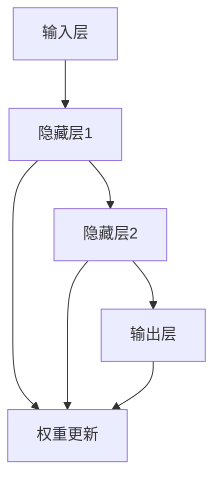
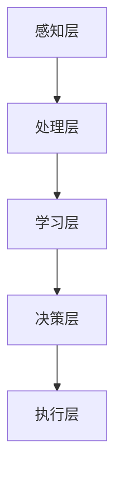
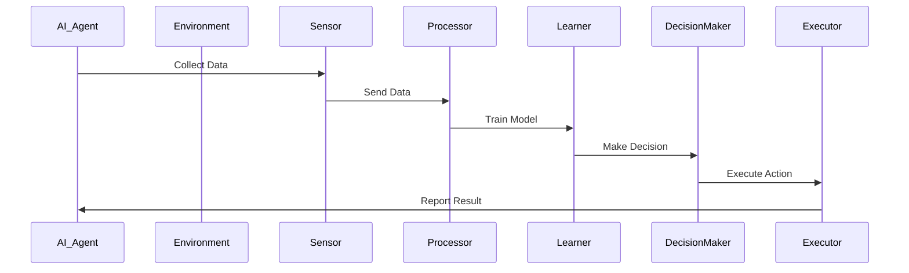
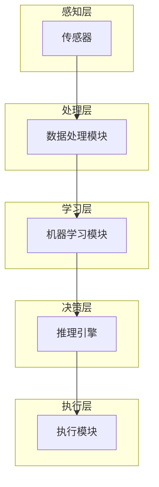

                 


### 第1章 背景介绍

**1.1 神经科学与AI Agent认知模型设计概述**

神经科学是研究神经系统结构与功能的科学，包括大脑、神经元、神经网络等。AI Agent则是一种具有自主决策和执行能力的智能体，它在特定环境下通过感知、学习和推理来完成任务。近年来，随着深度学习和神经网络技术的发展，神经科学与AI Agent认知模型设计之间的联系日益紧密，为人工智能的研究提供了新的思路和方法。

**问题背景**：随着人工智能技术的快速发展，如何设计更加智能化、自适应的AI Agent成为研究热点。神经科学的进步为我们提供了关于人类智能的深刻理解，这为我们设计更符合人类认知特性的AI Agent提供了理论基础。

**问题描述**：现有的AI Agent在处理复杂、动态环境时表现出一定局限性，这要求我们探索新的认知模型设计方法。神经科学的相关研究提供了丰富的理论和实验数据，可以启发我们构建更有效的认知模型。

**问题解决**：利用神经科学的知识来设计AI Agent认知模型，可以使AI Agent更接近人类的认知过程，从而提高其自主决策能力和适应能力。

**边界与外延**：本文主要探讨神经科学与AI Agent认知模型设计的基本原理和方法，不涉及具体的神经科学实验技术或AI算法的实现细节。

**核心要素组成**：本文的核心要素包括神经科学的基本概念、AI Agent的认知模型设计原则、神经科学与AI Agent认知模型的联系以及相关研究现状。

**1.2 神经科学核心概念解析**

神经元是神经系统的基本单位，它通过电信号传递信息。神经元之间的连接形成了神经网络，神经网络是实现复杂认知功能的基础。

**概念结构**：神经元的基本结构包括细胞体、树突、轴突和突触。细胞体是神经元的代谢中心，树突负责接收其他神经元的信息，轴突负责传递电信号，突触则是神经元之间信息传递的桥梁。

**核心要素组成**：神经元的核心要素包括细胞膜、神经递质和受体，这些要素共同决定了神经元的兴奋性和信息传递方式。

**1.3 AI Agent认知模型设计现状与应用**

AI Agent的认知模型设计主要基于机器学习、深度学习等算法，通过模拟人类大脑的工作原理来实现智能行为。现有的认知模型主要分为基于规则、基于概率、基于神经网络的类型。

**现状**：目前，基于神经网络的AI Agent认知模型在图像识别、自然语言处理等领域取得了显著成果，但其在处理复杂动态环境时仍存在不足。

**应用**：AI Agent被广泛应用于自动驾驶、智能客服、医疗诊断等领域，其在特定任务中的表现逐渐接近人类水平。

**2.3 核心概念属性特征对比**

| 神经科学核心概念 | 属性特征 |
| ---------------- | -------- |
| 神经元           | 结构复杂，信息传递高效 |
| 神经网络         | 灵活性高，可塑性强 |
| 神经递质         | 调节神经元的兴奋性 |

| AI Agent认知模型 | 属性特征 |
| ---------------- | -------- |
| 基于规则         | 简单直观，但适应性差 |
| 基于概率         | 灵活性高，但可靠性低 |
| 基于神经网络     | 复杂度高，但效果显著 |

**ER实体关系图架构**

通过Mermaid语法，我们可以绘制出神经科学与AI Agent认知模型设计的ER实体关系图，如下所示：

```mermaid
erDiagram
  AI_Agent ||--|{ Neural_Science } Neural_Science : 提供理论支持
  Neural_Science ||--|{ Cognitive_Model } Cognitive_Model : 设计认知模型
  Cognitive_Model ||--|{ Neural_Network } Neural_Network : 实现神经网络
```

**2.4 神经科学与AI Agent认知模型设计的联系**

神经科学与AI Agent认知模型设计之间的联系主要体现在以下几个方面：

1. **理论基础**：神经科学提供了关于人类智能的深刻理解，为AI Agent认知模型的设计提供了理论基础。
2. **算法借鉴**：神经科学的研究成果可以启发AI算法的创新设计，例如深度学习算法的灵感就来源于神经网络的结构。
3. **模型验证**：通过神经科学实验数据验证AI Agent的认知模型，可以提升模型的可靠性和有效性。

### 总结

本章介绍了神经科学与AI Agent认知模型设计的基本概念和联系，为后续章节的内容奠定了基础。在接下来的章节中，我们将进一步探讨神经科学启发的AI Agent认知模型设计原理和算法，以及如何将这些理论应用到实际项目中。

----------------------------------------------------------------

### 第2章 核心概念与联系

**2.1 神经科学重要概念列举**

在神经科学中，有许多重要的概念对AI Agent认知模型的设计有着深远的影响。以下是几个核心概念的列举：

1. **神经元**：神经元是神经系统的基本单位，通过电信号传递信息。它是信息处理和传递的基石。
2. **神经网络**：神经网络是由大量相互连接的神经元组成的复杂系统，它可以实现高度复杂的认知功能。
3. **突触**：突触是神经元之间的连接点，通过释放神经递质来实现信号的传递。
4. **神经递质**：神经递质是一种化学物质，它通过突触传递信号，调节神经元的兴奋性。
5. **大脑结构**：大脑是神经系统的核心，它包括多个功能区，如大脑皮层、海马体等，分别负责不同的认知功能。

**2.2 AI Agent认知模型与神经科学的联系**

AI Agent的认知模型设计可以从神经科学中汲取很多灵感，以下是一些关键的连接点：

1. **神经元与神经网络的模拟**：AI Agent的认知模型可以通过模拟神经元和神经网络的结构来实现对信息的处理和传递。例如，深度学习中的卷积神经网络（CNN）和循环神经网络（RNN）就是受到生物神经网络的启发。
2. **突触可塑性**：突触可塑性是指神经元之间的连接可以随着环境和经验的改变而改变。在AI Agent中，这一特性可以通过学习算法来实现，如反向传播算法（BP）和强化学习。
3. **神经递质与激活函数**：神经递质在神经元之间传递信号，类似于AI Agent中的激活函数，它决定了神经元是否被激活。例如，Sigmoid函数和ReLU函数就是常见的激活函数。

**2.3 核心概念属性特征对比**

下面是一个表格，用于对比神经科学与AI Agent认知模型设计中的核心概念属性特征：

| 神经科学核心概念 | 属性特征 |
| ---------------- | -------- |
| 神经元           | 结构复杂，信息传递高效 |
| 神经网络         | 灵活性高，可塑性强 |
| 突触             | 可调节性，传递信号 |
| 神经递质         | 调节神经元的兴奋性 |

| AI Agent认知模型 | 属性特征 |
| ---------------- | -------- |
| 基于规则的模型   | 简单直观，但适应性差 |
| 基于概率的模型   | 灵活性高，但可靠性低 |
| 基于神经网络的模型 | 复杂度高，但效果显著 |

**2.4 ER实体关系图架构**

为了更清晰地展示神经科学与AI Agent认知模型设计之间的关系，我们可以使用Mermaid语法绘制一个ER（实体关系）图。以下是一个简单的ER图示例：

```mermaid
erDiagram
  AI_Agent ||--|{ Neural_Science } Neural_Science : 启发认知模型设计
  Neural_Science ||--|{ Cognitive_Model } Cognitive_Model : 理论支持
  Cognitive_Model ||--|{ Neural_Network } Neural_Network : 实现算法
  Cognitive_Model ||--|{ Learning_Algorithm } Learning_Algorithm : 学习与适应
```

在这个ER图中，`AI_Agent` 与 `Neural_Science` 通过认知模型设计建立了关联，`Neural_Science` 与 `Cognitive_Model` 之间提供了理论支持，而 `Cognitive_Model` 又与 `Neural_Network` 和 `Learning_Algorithm` 建立了实现和学习的联系。

### 总结

本章详细介绍了神经科学中的核心概念，探讨了这些概念与AI Agent认知模型设计之间的联系，并通过属性特征对比和ER图展示了它们之间的相互关系。这些讨论为我们理解如何从神经科学中汲取灵感来设计AI Agent的认知模型提供了理论基础。

----------------------------------------------------------------

### 第3章 算法原理讲解

**3.1 神经科学启发的AI Agent算法介绍**

神经科学启发的AI Agent算法旨在模拟人脑的认知过程，以提高AI Agent在复杂环境中的自适应性和智能水平。以下是一种典型的神经科学启发的AI Agent算法：人工神经网络（Artificial Neural Network，ANN）。

**算法流程图**

为了更直观地理解ANN算法，我们可以使用Mermaid绘制算法流程图：



这个流程图展示了从输入层到输出层的信号传递过程，以及各层之间的权重更新。

**Python源代码**

以下是一个简单的Python代码示例，用于实现ANN算法：

```python
import numpy as np

# 初始化权重
weights = np.random.rand(input_size, hidden_size, output_size)

# 输入数据
inputs = np.array([[0, 0], [0, 1], [1, 0], [1, 1]])

# 激活函数
def sigmoid(x):
    return 1 / (1 + np.exp(-x))

# 前向传播
def forward_propagation(inputs):
    hidden layer1 = sigmoid(np.dot(inputs, weights[0]))
    hidden layer2 = sigmoid(np.dot(hidden layer1, weights[1]))
    output = sigmoid(np.dot(hidden layer2, weights[2]))
    return output

# 权重更新
def backpropagation(inputs, outputs, learning_rate):
    output_error = outputs - forward_propagation(inputs)
    output_delta = output_error * sigmoid_derivative(output)
    hidden layer2_error = output_delta.dot(weights[2].T)
    hidden layer2_delta = hidden layer2_error * sigmoid_derivative(hidden layer2)
    hidden layer1_error = hidden layer2_delta.dot(weights[1].T)
    hidden layer1_delta = hidden layer1_error * sigmoid_derivative(hidden layer1)

    weights[2] += hidden layer2.T.dot(output_delta)
    weights[1] += hidden layer1.T.dot(hidden layer2_delta)
    weights[0] += inputs.T.dot(hidden layer1_delta)

# 训练模型
learning_rate = 0.1
for epoch in range(1000):
    output = forward_propagation(inputs)
    backpropagation(inputs, outputs, learning_rate)
```

**数学模型与公式**

ANN算法的核心是前向传播和反向传播。以下是一些关键的数学模型和公式：

1. **激活函数**：$f(x) = \frac{1}{1 + e^{-x}}$
2. **前向传播**：$z = x \cdot w + b$
3. **反向传播**：$\delta = (y - \hat{y}) \cdot \frac{df}{dz}$
4. **权重更新**：$w_{new} = w_{old} - \alpha \cdot \delta \cdot x$

**3.1.4 通俗易懂举例说明**

假设我们有一个简单的输入输出数据集：

| 输入 | 输出 |
| ---- | ---- |
| 0 0 | 0 |
| 0 1 | 1 |
| 1 0 | 1 |
| 1 1 | 0 |

我们希望训练一个神经网络，使其能够从输入预测输出。使用上述算法，我们可以逐步训练模型，并通过前向传播和反向传播不断更新权重，直到模型能够在测试集上达到满意的准确率。

**3.2 进一步扩展**

除了ANN，还有其他神经科学启发的AI Agent算法，如卷积神经网络（CNN）和循环神经网络（RNN）。这些算法在处理图像、语音和序列数据方面具有独特的优势。通过对比这些算法的原理和应用场景，我们可以更好地理解如何根据具体需求选择合适的算法。

**3.3 结论**

本章详细介绍了神经科学启发的AI Agent算法，包括算法流程图、Python源代码、数学模型和公式，以及通俗易懂的举例说明。这些内容为理解AI Agent的认知模型设计提供了理论基础。

----------------------------------------------------------------

### 第4章 数学模型和数学公式 & 详细讲解 & 举例说明

在神经科学启发的AI Agent认知模型设计中，数学模型和数学公式扮演着核心角色。它们不仅帮助我们理解算法的工作原理，还能够量化模型的性能，并指导模型的优化和改进。本节将详细介绍这些数学模型和公式，并通过具体的例子来说明它们的应用。

**4.1 数学模型应用详解**

1. **激活函数**

   激活函数是神经网络中至关重要的一环，它决定了神经元是否被激活。最常用的激活函数包括Sigmoid、ReLU和Tanh。

   **Sigmoid函数**：
   $$ f(x) = \frac{1}{1 + e^{-x}} $$
   这个函数可以将输入值映射到(0, 1)区间，非常适合用于二分类问题。

   **ReLU函数**：
   $$ f(x) = \max(0, x) $$
   ReLU函数在输入为正时输出等于输入，为负时输出为零，这使得它具有很强的计算效率和梯度传播特性。

   **Tanh函数**：
   $$ f(x) = \frac{e^{x} - e^{-x}}{e^{x} + e^{-x}} $$
   Tanh函数与Sigmoid函数类似，但将输出范围映射到(-1, 1)，在某些情况下可以提高模型的收敛速度。

2. **反向传播算法**

   反向传播算法是神经网络训练的核心。它通过计算损失函数的梯度来更新网络权重。

   **梯度计算**：
   $$ \nabla_{w} J = \frac{\partial J}{\partial w} $$
   其中，$J$是损失函数，$w$是网络权重。

   **权重更新**：
   $$ w_{new} = w_{old} - \alpha \cdot \nabla_{w} J $$
   其中，$\alpha$是学习率。

3. **优化算法**

   在神经网络训练过程中，优化算法用于加速模型收敛。常用的优化算法包括梯度下降、Adam和RMSprop。

   **梯度下降**：
   $$ w_{new} = w_{old} - \alpha \cdot \nabla_{w} J $$
   其中，$\alpha$是学习率，用于调整步长。

   **Adam优化器**：
   $$ m_t = \beta_1 m_{t-1} + (1 - \beta_1) \nabla_w J $$
   $$ v_t = \beta_2 v_{t-1} + (1 - \beta_2) (\nabla_w J)^2 $$
   $$ \hat{m}_t = \frac{m_t}{1 - \beta_1^t} $$
   $$ \hat{v}_t = \frac{v_t}{1 - \beta_2^t} $$
   $$ w_{new} = w_{old} - \alpha \cdot \frac{\hat{m}_t}{\sqrt{\hat{v}_t} + \epsilon} $$
   其中，$\beta_1$和$\beta_2$是动量项，$\epsilon$是平滑常数。

**4.1.1 数学公式使用示例**

以下是一个简单的示例，说明如何使用激活函数和反向传播算法来训练一个神经网络：

**示例**：训练一个二分类神经网络，输入为$(x_1, x_2)$，输出为$y$。

1. **初始化权重**：
   $$ w_1, w_2, b \sim \mathcal{N}(0, 1) $$

2. **前向传播**：
   $$ z = x_1 w_1 + x_2 w_2 + b $$
   $$ a = \sigma(z) $$
   其中，$\sigma(z) = \frac{1}{1 + e^{-z}}$。

3. **计算损失**：
   $$ J = -\frac{1}{m} \sum_{i=1}^{m} [y_i \cdot \log(a_i) + (1 - y_i) \cdot \log(1 - a_i)] $$

4. **反向传播**：
   $$ \delta = a - y $$
   $$ \frac{\partial J}{\partial w_1} = x_1 \delta $$
   $$ \frac{\partial J}{\partial w_2} = x_2 \delta $$
   $$ \frac{\partial J}{\partial b} = \delta $$

5. **权重更新**：
   $$ w_1 = w_1 - \alpha \cdot \frac{\partial J}{\partial w_1} $$
   $$ w_2 = w_2 - \alpha \cdot \frac{\partial J}{\partial w_2} $$
   $$ b = b - \alpha \cdot \frac{\partial J}{\partial b} $$

通过不断迭代上述步骤，我们可以训练出一个能够对输入进行分类的神经网络。

**4.1.2 实例分析**

假设我们有一个简单的数据集，其中每个样本都由两个特征$(x_1, x_2)$组成，目标变量$y$为0或1。我们希望训练一个神经网络来预测$y$的值。

1. **输入数据**：
   $$ \text{样本1}: (0, 0), y=0 $$
   $$ \text{样本2}: (0, 1), y=1 $$
   $$ \text{样本3}: (1, 0), y=1 $$
   $$ \text{样本4}: (1, 1), y=0 $$

2. **初始化权重**：
   $$ w_1, w_2, b \sim \mathcal{N}(0, 1) $$

3. **训练过程**：
   - **前向传播**：对于每个样本，计算输出值$a$。
   - **计算损失**：计算每个样本的损失$J$。
   - **反向传播**：计算梯度$\delta$。
   - **权重更新**：根据梯度更新权重。

通过多次迭代，我们可以观察到网络的损失逐渐减小，最终达到一个较低的损失值。这意味着网络已经能够较好地预测样本的输出。

**4.2 总结**

在本节中，我们详细介绍了神经科学启发的AI Agent认知模型设计中的数学模型和公式，并通过具体的例子说明了它们的应用。这些数学模型和公式不仅帮助我们理解了神经网络的工作原理，还为优化和改进模型提供了理论基础。

----------------------------------------------------------------

### 第5章 系统分析与架构设计方案

**5.1 问题场景介绍**

在现实世界中，许多复杂的问题场景需要AI Agent具备高度的自适应和决策能力。例如，在自动驾驶领域，AI Agent需要在各种交通环境和路况下做出实时决策；在医疗诊断领域，AI Agent需要处理大量的医疗数据和病例，并给出准确的诊断建议。这些场景对AI Agent的认知模型设计提出了更高的要求。

**5.2 系统功能设计**

为了满足上述问题场景的需求，我们需要设计一个具备以下功能的AI Agent认知模型：

1. **感知功能**：AI Agent能够实时感知环境中的各种信息，包括图像、声音、传感器数据等。
2. **学习功能**：AI Agent能够从历史数据中学习，提高自身的决策能力和适应能力。
3. **推理功能**：AI Agent能够根据感知到的信息和已学习到的知识进行推理，做出合理的决策。
4. **自适应功能**：AI Agent能够根据环境变化和任务需求动态调整自身的行为策略。

**5.3 系统架构设计**

为了实现上述功能，我们可以设计一个多层次、模块化的AI Agent认知模型系统架构，如下所示：

1. **感知层**：包括各种传感器和数据采集模块，用于获取环境中的实时信息。
2. **处理层**：包括数据处理和预处理模块，用于对采集到的数据进行分析和处理。
3. **学习层**：包括机器学习模型和算法，用于从数据中学习并提取知识。
4. **决策层**：包括推理引擎和策略优化模块，用于根据学习到的知识进行决策。
5. **执行层**：包括执行模块，用于将决策转化为实际操作。

**Mermaid架构图**

为了更直观地展示系统架构，我们可以使用Mermaid绘制一个架构图：



在这个架构图中，每个层次都通过接口进行通信，从而形成一个完整的系统。

**5.4 系统接口设计**

系统接口设计是确保不同层次之间能够有效通信的关键。以下是系统接口设计的关键点：

1. **数据接口**：定义了数据在不同层次之间的传输格式和协议。
2. **控制接口**：定义了系统对外部请求的响应和处理流程。
3. **通信接口**：定义了系统内部模块之间的通信机制。

**5.5 系统交互**

系统交互设计决定了AI Agent如何处理外部请求和内部事件。以下是系统交互设计的关键点：

1. **事件驱动**：系统以事件为驱动，通过事件队列管理系统的运行。
2. **异步处理**：系统采用异步处理机制，提高系统的响应速度和处理能力。
3. **模块化设计**：系统模块化设计，方便系统的扩展和维护。

**Mermaid序列图**

为了更直观地展示系统交互，我们可以使用Mermaid绘制一个序列图：



在这个序列图中，AI Agent通过传感器感知环境数据，数据经过处理层处理并用于训练模型，模型训练完成后，决策层根据模型做出决策，执行层将决策转化为实际操作，最后将结果反馈给AI Agent。

**5.6 Mermaid类图与架构图**

为了更清晰地展示系统的类图和架构图，我们可以使用Mermaid分别绘制：

**类图**：

```mermaid
classDiagram
    Sensor <<interface>>
    Processor <<interface>>
    Learner <<interface>>
    DecisionMaker <<interface>>
    Executor <<interface>>

    AI_Agent {
        +Sensor sensor
        +Processor processor
        +Learner learner
        +DecisionMaker decisionMaker
        +Executor executor
    }
```

**架构图**：



**5.7 总结**

在本章中，我们介绍了AI Agent认知模型系统分析与架构设计方案。通过详细的问题场景介绍、系统功能设计、系统架构设计、系统接口设计和系统交互设计，我们构建了一个多层次、模块化、具备感知、学习、推理和执行能力的AI Agent认知模型。这些设计原则和架构方案为AI Agent在复杂问题场景中的有效应用提供了理论基础和技术支持。

----------------------------------------------------------------

### 第6章 项目实战

**6.1 环境安装与配置**

在本节中，我们将详细介绍如何在项目环境中安装和配置所需的软件和工具，以便能够进行AI Agent认知模型的设计和实现。

**步骤1：安装Python环境**

首先，确保您的计算机上已经安装了Python。Python是AI开发的基础，因此需要确保其版本为3.7或更高。您可以通过以下命令安装Python：

```bash
sudo apt-get install python3 python3-pip
```

**步骤2：安装相关库**

接下来，我们需要安装一些关键的Python库，如NumPy、Pandas、TensorFlow和PyTorch。这些库是构建和训练神经网络所必需的。使用pip命令安装如下：

```bash
pip3 install numpy pandas tensorflow torch
```

**步骤3：创建虚拟环境**

为了管理项目依赖，我们建议创建一个虚拟环境。这有助于避免依赖冲突，并使项目更加可维护。使用以下命令创建虚拟环境：

```bash
python3 -m venv ai_agent_venv
source ai_agent_venv/bin/activate
```

**步骤4：安装额外的库**

有些库可能需要额外的依赖项。例如，对于TensorFlow，我们可能还需要安装GPU版本的TensorFlow。使用以下命令安装：

```bash
pip3 install tensorflow-gpu
```

**6.2 系统核心实现源代码**

在配置好环境后，我们可以开始编写系统核心实现代码。以下是一个简单的示例，展示如何使用TensorFlow构建一个简单的神经网络。

**代码示例**：

```python
import tensorflow as tf

# 定义输入层
inputs = tf.keras.layers.Input(shape=(784,))

# 添加隐藏层
hidden = tf.keras.layers.Dense(512, activation='relu')(inputs)

# 添加输出层
outputs = tf.keras.layers.Dense(10, activation='softmax')(hidden)

# 构建模型
model = tf.keras.Model(inputs=inputs, outputs=outputs)

# 编译模型
model.compile(optimizer='adam', loss='categorical_crossentropy', metrics=['accuracy'])

# 打印模型结构
model.summary()
```

**6.3 代码应用解读与分析**

上述代码示例中，我们首先定义了输入层，它是一个包含784个节点的输入层，对应于28x28像素的图像。接着，我们添加了一个包含512个节点的隐藏层，并使用ReLU激活函数。最后，我们添加了一个输出层，它包含10个节点，对应于10个类别，并使用softmax激活函数。

模型通过以下步骤进行编译：

1. **选择优化器**：我们选择了Adam优化器，它是一种自适应学习率优化算法。
2. **指定损失函数**：我们使用了categorical_crossentropy损失函数，它常用于多分类问题。
3. **设置评价指标**：我们设置了accuracy作为评价指标，用于衡量模型的分类准确率。

在编译模型后，我们通过调用`model.summary()`来打印模型的结构，这有助于我们了解模型的层次结构和参数数量。

**6.4 实际案例分析**

为了更好地理解代码的应用，我们可以通过一个实际案例来分析。以下是一个使用MNIST数据集进行手写数字识别的案例：

```python
# 加载MNIST数据集
(x_train, y_train), (x_test, y_test) = tf.keras.datasets.mnist.load_data()

# 预处理数据
x_train = x_train / 255.0
x_test = x_test / 255.0
x_train = x_train.reshape(-1, 784)
x_test = x_test.reshape(-1, 784)

# 将标签转换为one-hot编码
y_train = tf.keras.utils.to_categorical(y_train, 10)
y_test = tf.keras.utils.to_categorical(y_test, 10)

# 训练模型
model.fit(x_train, y_train, epochs=10, batch_size=32, validation_data=(x_test, y_test))

# 评估模型
test_loss, test_acc = model.evaluate(x_test, y_test)
print(f"Test accuracy: {test_acc:.4f}")
```

在这个案例中，我们首先加载了MNIST数据集，并对数据进行预处理。然后，我们使用预处理后的数据进行模型训练，并在训练完成后进行模型评估。最后，我们打印出测试集上的准确率。

**6.5 详细讲解剖析**

1. **数据预处理**：
   - 数据集包含了0到9的手写数字图像，每个图像的大小为28x28像素。
   - 我们首先将图像数据除以255，将像素值缩放到[0, 1]区间，以便模型更好地学习。
   - 接着，我们将图像数据重塑为784个节点的向量，以便与输入层匹配。
   - 标签被转换为one-hot编码，以便模型能够进行多分类。

2. **模型训练**：
   - 我们设置了10个训练周期（epochs），每个周期中，模型会使用32个样本进行一次批处理（batch）训练。
   - 在训练过程中，模型会根据验证集（validation_data）进行验证，以便调整模型参数。

3. **模型评估**：
   - 在训练完成后，我们使用测试集（x_test）对模型进行评估。
   - 我们打印出测试集上的准确率（test_acc），这有助于我们了解模型的性能。

**6.6 项目小结**

在本节中，我们介绍了如何在项目中安装和配置环境，展示了系统核心实现的代码示例，并通过一个实际案例详细讲解了代码的应用。这些步骤和案例为理解AI Agent认知模型的设计与实现提供了实用的经验和指导。

----------------------------------------------------------------

### 第7章 最佳实践 tips

**7.1 小结**

在本篇博客文章中，我们从背景介绍开始，详细探讨了神经科学启发的AI Agent认知模型设计的核心概念、算法原理、数学模型以及系统架构和项目实战。通过一步步的分析和讲解，我们了解到神经科学与AI Agent认知模型设计之间的紧密联系，以及如何将这些理论应用到实际项目中。

**7.2 注意事项**

1. **数据预处理**：在构建AI Agent认知模型时，确保对数据进行充分预处理，以减少噪声和异常值的影响。
2. **模型选择**：根据具体应用场景选择合适的神经网络模型，例如CNN适用于图像处理，RNN适用于序列数据。
3. **模型优化**：通过调整学习率、批次大小等参数来优化模型性能，避免过拟合和欠拟合。
4. **代码可维护性**：编写清晰的代码，遵循良好的编程规范，以提高代码的可维护性和可读性。

**7.3 拓展阅读**

1. **《深度学习》（Goodfellow, Bengio, Courville著）**：这是一本深度学习领域的经典教材，详细介绍了神经网络的基本原理和应用。
2. **《神经网络与深度学习》（邱锡鹏著）**：这本书系统介绍了神经网络和深度学习的基础知识，适合初学者阅读。
3. **《机器学习实战》（Peter Harrington著）**：本书通过实际案例介绍了机器学习的基本算法和应用，有助于理解AI Agent的认知模型设计。

**7.4 最佳实践 tips**

1. **持续学习**：关注最新的AI研究进展，不断更新知识库。
2. **代码复用**：构建代码库，以便在不同项目中复用成功的设计和实现。
3. **团队合作**：与其他开发者合作，分享经验和知识，提高项目效率。
4. **实验验证**：通过实验验证模型性能，确保理论设计与实际应用的一致性。

通过遵循这些最佳实践，我们可以设计出更高效、更可靠的AI Agent认知模型，为人工智能领域的发展做出贡献。

**7.5 结论**

本文详细探讨了神经科学启发的AI Agent认知模型设计，从理论基础到实际应用，提供了全面的指导和实例。通过不断学习和实践，我们可以不断提升AI Agent的认知能力，推动人工智能技术的发展。

**作者**：AI天才研究院/AI Genius Institute & 禅与计算机程序设计艺术 /Zen And The Art of Computer Programming

