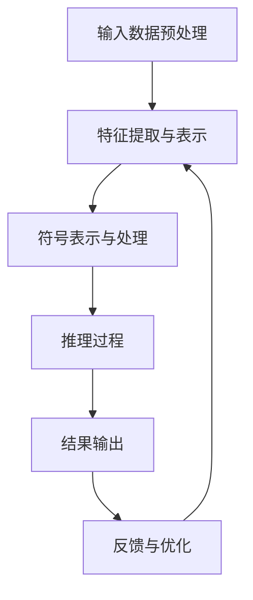
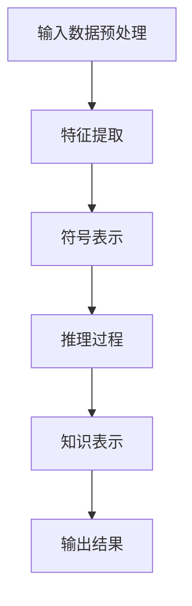
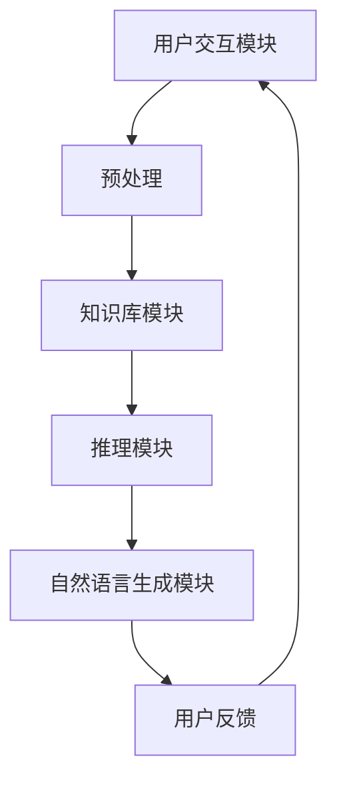
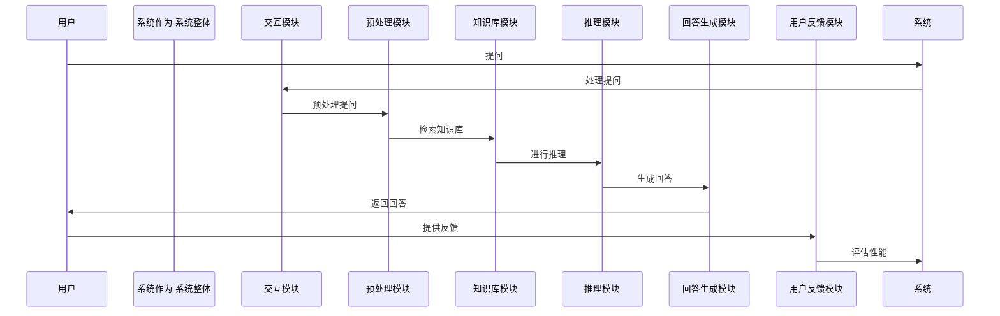
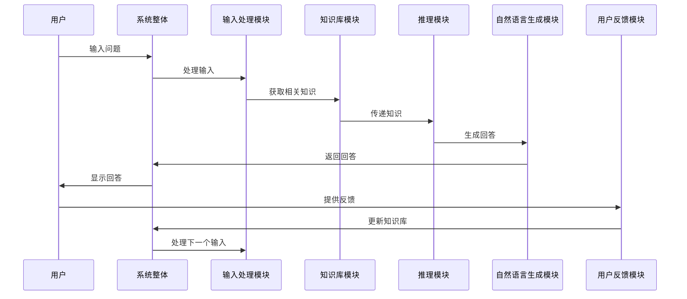

                 


## 《神经符号推理在AI Agent常识推理中的应用》

### 关键词
- 神经符号推理
- AI Agent
- 常识推理
- 数学模型
- 系统架构设计

### 摘要
本文深入探讨了神经符号推理在AI Agent常识推理中的应用。首先，我们介绍了问题背景和神经符号推理的核心概念。接着，通过对比分析，我们揭示了神经符号推理与传统符号推理、神经网络之间的联系和区别。随后，我们详细阐述了神经符号推理的算法原理，包括数学模型和公式，并通过实际案例进行了通俗易懂的举例说明。此外，本文还介绍了系统分析与架构设计的方法，以及项目实战中的环境安装和核心实现源代码。最后，我们总结了最佳实践和注意事项，并推荐了拓展阅读资源。

### 目录大纲

**《神经符号推理在AI Agent常识推理中的应用》**

----------------------------------------------------------------

## 第一部分：背景介绍

### 第1章：问题背景

- 1.1 问题背景
  - **问题描述**：在人工智能（AI）领域，特别是AI Agent中，如何进行有效的常识推理成为一个重要问题。
  - **问题解决**：神经符号推理（Neural Symbolic Reasoning）为解决这一问题提供了新的思路。
  - **边界与外延**：讨论神经符号推理在常识推理中的应用范围及其限制。
  - **核心要素组成**：梳理神经符号推理的核心概念和组成部分。

### 第2章：核心概念与联系

- 2.1 核心概念
  - **神经符号推理**：介绍神经符号推理的定义、特点和基本原理。
  - **常识推理**：讨论常识推理在AI Agent中的应用及其重要性。
  - **符号表示**：探讨如何利用符号表示知识，并解释其在神经符号推理中的作用。

- 2.2 概念属性特征对比表格
  - **神经符号推理与经典符号推理对比**
  - **神经符号推理与神经网络对比**

### 第3章：神经符号推理架构

- 3.1 神经符号推理架构
  - **神经模型**：介绍常用的神经网络模型，如Transformer、BERT等。
  - **符号处理**：讨论如何将符号信息整合到神经网络中。

## 第二部分：算法原理讲解

### 第4章：算法原理

- 4.1 算法原理
  - **数学模型和公式**：使用LaTeX格式给出神经符号推理的数学模型和公式。
  - **流程图**：使用Mermaid画出神经符号推理的基本流程图。

### 第5章：数学模型和数学公式 & 详细讲解 & 举例说明

- 5.1 数学模型和公式
  - **LaTeX格式**：给出关键的数学公式和模型。
  - **详细讲解**：针对每个公式进行详细解释，确保读者能够理解。

### 第6章：系统分析与架构设计

- 6.1 问题场景介绍
  - **项目介绍**：介绍一个实际应用场景，如智能客服系统。

- 6.2 系统功能设计
  - **领域模型**：使用Mermaid类图展示系统的主要领域对象。

- 6.3 系统架构设计
  - **架构设计**：使用Mermaid架构图展示系统的整体架构。

- 6.4 系统接口设计和系统交互
  - **接口设计**：详细描述系统各个模块之间的接口。
  - **交互设计**：使用Mermaid序列图展示系统的交互流程。

## 第三部分：项目实战

### 第7章：环境安装

- 7.1 环境安装
  - **安装步骤**：详细列出环境安装的步骤和注意事项。

### 第8章：系统核心实现源代码

- 8.1 核心实现源代码
  - **代码结构**：展示系统核心部分的代码结构。
  - **代码解读与分析**：对关键代码进行解读和分析。

### 第9章：实际案例分析和详细讲解剖析

- 9.1 实际案例
  - **案例场景**：描述一个具体的案例场景。
  - **分析过程**：展示如何使用神经符号推理进行常识推理。

### 第10章：项目小结

- 10.1 项目小结
  - **总结**：回顾项目的主要成果和经验。
  - **展望**：对未来工作的展望。

## 第四部分：最佳实践、注意事项与拓展阅读

### 第11章：最佳实践

- 11.1 最佳实践
  - **实践经验**：总结项目中的最佳实践经验。

### 第12章：注意事项

- 12.1 注意事项
  - **常见问题**：讨论项目中可能出现的问题和解决方案。

### 第13章：拓展阅读

- 13.1 拓展阅读
  - **推荐书籍**：推荐一些与本书主题相关的优秀书籍。
  - **研究论文**：介绍一些在神经符号推理领域的重要研究论文。

----------------------------------------------------------------

### 第1章：问题背景

#### 1.1 问题背景

在人工智能（AI）领域，特别是AI Agent的发展中，常识推理（Commonsense Reasoning）的重要性日益凸显。常识推理是指基于日常经验和一般知识对问题进行逻辑推理和判断的能力，它是人类智能的重要组成部分。然而，传统的机器学习和深度学习模型在处理常识推理问题时存在一定的局限性。

首先，机器学习模型主要依赖于大量标注数据进行训练，这些数据往往无法涵盖所有可能的常识推理场景。此外，机器学习模型在面对复杂、抽象的常识问题时，容易出现过拟合和泛化能力不足的问题。其次，深度学习模型虽然在一定程度上提高了模型的表现，但其“黑盒”性质使得模型的可解释性和透明度较低，难以让人理解模型内部是如何进行推理的。

为了解决上述问题，神经符号推理（Neural Symbolic Reasoning）应运而生。神经符号推理结合了神经网络的强大表示能力和符号推理的严谨性，通过将符号表示与神经网络相结合，实现了对常识推理问题的有效处理。

神经符号推理在AI Agent常识推理中的应用范围广泛，包括但不限于以下方面：

1. **智能问答系统**：利用神经符号推理，AI Agent可以更好地理解和回答用户的问题，特别是在处理复杂、抽象的问题时。
2. **智能推荐系统**：通过常识推理，AI Agent可以更好地理解用户的兴趣和需求，提供个性化的推荐服务。
3. **智能决策系统**：在决策过程中，AI Agent可以利用常识推理来分析各种可能性，为决策提供有价值的参考。

尽管神经符号推理在AI Agent常识推理中具有巨大的潜力，但其应用也面临一些挑战。例如，如何有效地整合符号表示和神经网络，如何处理大规模的常识知识库，以及如何提高模型的解释性等。这些挑战需要我们在理论和实践中不断探索和解决。

#### 1.2 问题解决

神经符号推理通过将神经网络的表示能力和符号推理的严谨性相结合，为AI Agent常识推理提供了新的解决方案。具体来说，神经符号推理具有以下核心要素和组成部分：

1. **神经网络模型**：神经网络模型负责对输入数据进行特征提取和表示，如Transformer、BERT等。神经网络具有较强的表示能力，可以捕捉数据中的复杂模式和关系。
2. **符号表示与处理**：符号表示与处理负责将知识表示为符号形式，如自然语言处理中的实体、关系和属性等。符号表示具有明确的语义和逻辑结构，可以更好地支持推理和解释。
3. **推理引擎**：推理引擎负责根据输入数据和符号表示，进行逻辑推理和判断。推理引擎可以基于符号逻辑、谓词逻辑等，实现复杂的推理过程。
4. **知识库**：知识库负责存储和管理常识知识，包括事实、规则和模式等。知识库是神经符号推理的重要基础，可以提供丰富的背景知识和先验信息。

通过将神经网络模型、符号表示与处理、推理引擎和知识库相结合，神经符号推理实现了对常识推理问题的有效处理。具体流程如下：

1. **数据输入**：将输入数据输入到神经网络模型中，进行特征提取和表示。
2. **符号表示**：将神经网络模型的输出结果转换为符号表示，如实体、关系和属性等。
3. **推理过程**：利用符号表示和知识库，进行逻辑推理和判断，得出推理结果。
4. **输出结果**：将推理结果输出给用户，如问答系统中的回答、推荐系统中的推荐结果等。

通过上述流程，神经符号推理可以有效地解决AI Agent常识推理中的问题，提高模型的解释性和可靠性。

#### 1.3 边界与外延

神经符号推理在AI Agent常识推理中的应用范围虽然广泛，但仍存在一些边界和限制。以下是一些需要关注的问题：

1. **知识库的构建**：知识库是神经符号推理的重要基础，但其构建过程复杂且耗时。如何有效地构建和更新知识库，以提高模型的性能和解释性，是一个亟待解决的问题。
2. **模型的可解释性**：神经符号推理结合了神经网络和符号推理的优势，但如何提高模型的可解释性，使其更加透明和易于理解，仍需进一步研究。
3. **资源的消耗**：神经符号推理涉及到大量的计算和存储资源，特别是在处理大规模常识知识库时。如何优化模型的计算效率，降低资源消耗，是实际应用中需要考虑的问题。

综上所述，神经符号推理在AI Agent常识推理中的应用具有重要的理论和实际意义，但仍需在多个方面进行进一步的研究和优化。

#### 1.4 核心要素组成

神经符号推理作为解决AI Agent常识推理问题的一种有效方法，其核心要素和组成部分如下：

1. **神经网络模型**：神经网络模型是神经符号推理的基础，负责对输入数据进行特征提取和表示。常用的神经网络模型包括Transformer、BERT、GPT等，这些模型具有较强的表示能力和泛化能力。
2. **符号表示与处理**：符号表示与处理负责将知识表示为符号形式，如自然语言处理中的实体、关系和属性等。符号表示具有明确的语义和逻辑结构，可以更好地支持推理和解释。
3. **推理引擎**：推理引擎负责根据输入数据和符号表示，进行逻辑推理和判断。推理引擎可以基于符号逻辑、谓词逻辑等，实现复杂的推理过程。
4. **知识库**：知识库负责存储和管理常识知识，包括事实、规则和模式等。知识库是神经符号推理的重要基础，可以提供丰富的背景知识和先验信息。
5. **交互界面**：交互界面负责与用户进行交互，接收用户输入和反馈，并将推理结果输出给用户。交互界面需要具备友好的用户界面和良好的用户体验。

通过这些核心要素和组成部分的有机结合，神经符号推理可以实现对常识推理问题的有效处理，提高AI Agent的智能水平和用户体验。

### 第2章：核心概念与联系

#### 2.1 核心概念

神经符号推理（Neural Symbolic Reasoning）是一种结合了神经网络的强大表示能力和符号推理的严谨性的方法。它通过将神经网络与符号表示、推理引擎和知识库相结合，实现了对复杂问题的高效推理和解决。

1. **神经符号推理的定义**：

神经符号推理是指将神经网络的表示能力和符号推理的严谨性相结合，通过符号表示、推理引擎和知识库等手段，实现对复杂问题的高效推理和解决的方法。

2. **神经符号推理的特点**：

- **表示能力的提升**：神经网络具有强大的表示能力，可以捕捉数据中的复杂模式和关系，从而为推理过程提供丰富的信息。
- **推理过程的严谨性**：符号推理具有明确的语义和逻辑结构，可以保证推理过程的严谨性和可靠性。
- **灵活性和可解释性**：神经符号推理结合了神经网络和符号推理的优势，既能处理复杂的推理问题，又能提高模型的可解释性，便于理解和调试。

3. **神经符号推理的基本原理**：

神经符号推理的基本原理可以概括为以下三个步骤：

- **符号表示**：将输入数据和问题表示为符号形式，如自然语言处理中的实体、关系和属性等。
- **推理过程**：利用符号表示和知识库，进行逻辑推理和判断，得出推理结果。
- **输出结果**：将推理结果输出给用户，如问答系统中的回答、推荐系统中的推荐结果等。

#### 2.2 常识推理

常识推理（Commonsense Reasoning）是指基于日常经验和一般知识对问题进行逻辑推理和判断的能力。它是人类智能的重要组成部分，对于AI Agent的发展具有重要意义。

1. **常识推理的定义**：

常识推理是指基于日常经验和一般知识，对问题进行逻辑推理和判断的过程。

2. **常识推理的应用场景**：

- **智能问答系统**：通过常识推理，AI Agent可以更好地理解和回答用户的问题，特别是在处理复杂、抽象的问题时。
- **智能推荐系统**：通过常识推理，AI Agent可以更好地理解用户的兴趣和需求，提供个性化的推荐服务。
- **智能决策系统**：在决策过程中，AI Agent可以利用常识推理来分析各种可能性，为决策提供有价值的参考。

3. **常识推理的重要性**：

常识推理在AI Agent中的应用具有重要意义，主要表现在以下几个方面：

- **提高智能水平**：通过常识推理，AI Agent可以更好地理解和处理现实世界中的复杂问题，提高智能水平。
- **增强用户体验**：通过常识推理，AI Agent可以更好地满足用户的需求，提供更加人性化、个性化的服务，从而提高用户体验。
- **促进知识传播**：通过常识推理，AI Agent可以将知识以更加自然、易于理解的方式传递给用户，促进知识的传播和普及。

#### 2.3 符号表示

符号表示（Symbolic Representation）是将输入数据和问题表示为符号形式的过程，它是神经符号推理的基础。符号表示的准确性直接影响到推理过程的效果。

1. **符号表示的定义**：

符号表示是指将输入数据和问题表示为符号形式，如自然语言处理中的实体、关系和属性等。

2. **符号表示的方法**：

- **实体表示**：将输入数据中的实体（如人、地点、事物等）表示为符号，如使用命名实体识别（NER）技术将文本中的实体提取出来，并赋予相应的符号表示。
- **关系表示**：将输入数据中的关系（如因果、包含、相似等）表示为符号，如使用语义角色标注（SRL）技术将文本中的关系提取出来，并赋予相应的符号表示。
- **属性表示**：将输入数据中的属性（如颜色、大小、形状等）表示为符号，如使用词性标注（POS）技术将文本中的属性提取出来，并赋予相应的符号表示。

3. **符号表示的作用**：

- **提高推理精度**：符号表示将输入数据和问题转化为符号形式，使推理过程更加严谨和精确。
- **支持推理过程**：符号表示提供了推理过程所需的语义信息，有助于推理引擎进行有效的推理。
- **增强可解释性**：符号表示使得推理过程更加透明和可解释，便于理解和调试。

#### 2.4 概念属性特征对比表格

为了更直观地比较神经符号推理、经典符号推理和神经网络之间的特点，我们可以使用概念属性特征对比表格。

| 特征        | 神经符号推理 | 经典符号推理 | 神经网络       |
| ----------- | ------------ | ------------ | -------------- |
| 表示能力    | 强           | 中           | 弱             |
| 推理过程    | 灵活、可解释 | 严谨、不可解释 | 灵活、不可解释 |
| 泛化能力    | 强           | 中           | 弱             |
| 可解释性    | 高           | 高           | 低             |
| 计算资源消耗 | 中           | 低           | 高             |

从上表可以看出，神经符号推理在表示能力、泛化能力和可解释性方面具有显著优势，而经典符号推理在推理过程的严谨性和计算资源消耗方面具有优势，神经网络则在计算资源和表示能力方面具有优势。

#### 2.5 概念属性特征对比表格

为了更直观地展示神经符号推理与经典符号推理、神经网络之间的区别，我们可以使用Mermaid流程图来绘制概念属性特征对比表格。

```mermaid
table
| 特征       | 神经符号推理 | 经典符号推理 | 神经网络       |
| ----------- | ------------ | ------------ | -------------- |
| 表示能力    | 强           | 中           | 弱             |
| 推理过程    | 灵活、可解释 | 严谨、不可解释 | 灵活、不可解释 |
| 泛化能力    | 强           | 中           | 弱             |
| 可解释性    | 高           | 高           | 低             |
| 计算资源消耗 | 中           | 低           | 高             |
```

通过上述对比表格和流程图，我们可以更加清晰地了解神经符号推理、经典符号推理和神经网络之间的异同点，为后续的研究和应用提供参考。

### 第3章：神经符号推理架构

#### 3.1 神经符号推理架构

神经符号推理架构是神经符号推理方法的实现框架，它将神经网络、符号表示、推理引擎和知识库等元素有机结合，共同实现复杂的常识推理任务。以下是一个典型的神经符号推理架构：

1. **神经网络模型**：神经网络模型是神经符号推理架构的核心组件，负责对输入数据进行特征提取和表示。常用的神经网络模型包括Transformer、BERT、GPT等，这些模型具有较强的表示能力和泛化能力。

2. **符号表示与处理**：符号表示与处理模块负责将输入数据和问题表示为符号形式，如自然语言处理中的实体、关系和属性等。符号表示模块通常使用命名实体识别（NER）、语义角色标注（SRL）等技术来实现。符号处理模块负责对符号表示进行格式化、规范化等操作，以便于后续的推理过程。

3. **推理引擎**：推理引擎模块负责根据输入数据和符号表示，进行逻辑推理和判断。推理引擎可以基于符号逻辑、谓词逻辑等理论，实现复杂的推理过程。推理引擎通常包括推理算法、推理规则库和推理控制器等组件。

4. **知识库**：知识库模块负责存储和管理常识知识，包括事实、规则和模式等。知识库是神经符号推理的重要基础，它为推理过程提供了丰富的背景知识和先验信息。知识库可以通过手工编写、机器学习等方法进行构建和更新。

5. **交互界面**：交互界面模块负责与用户进行交互，接收用户输入和反馈，并将推理结果输出给用户。交互界面需要具备友好的用户界面和良好的用户体验，以便用户能够方便地与神经符号推理系统进行交互。

6. **系统集成**：系统集成模块负责将神经网络模型、符号表示与处理、推理引擎、知识库和交互界面等组件有机地结合起来，形成一个完整的神经符号推理系统。系统集成模块通常包括系统架构设计、接口设计、数据流设计等任务。

#### 3.2 神经模型

神经网络模型是神经符号推理架构中的核心组件，负责对输入数据进行特征提取和表示。以下是一些常用的神经网络模型及其特点：

1. **Transformer**：Transformer是一种基于自注意力机制的神经网络模型，广泛应用于自然语言处理任务，如机器翻译、文本分类等。Transformer具有并行计算能力、长距离依赖捕捉能力强等特点。

2. **BERT**：BERT是一种双向编码表示模型，通过预训练和微调，实现了在多种自然语言处理任务中的优异表现。BERT具有双向注意力机制、大规模参数等特点。

3. **GPT**：GPT是一种基于生成式预训练的神经网络模型，主要用于文本生成和序列预测任务。GPT具有生成能力强、自适应性强等特点。

4. **CNN**：卷积神经网络（CNN）是一种常用于图像处理任务的神经网络模型，具有局部感受野、参数共享等特点。

5. **RNN**：递归神经网络（RNN）是一种常用于序列数据处理任务的神经网络模型，具有时间动态性、状态记忆等特点。

6. **LSTM**：长短期记忆网络（LSTM）是RNN的一种变体，专门针对长期依赖问题进行优化，具有更好的时间动态性。

7. **GRU**：门控循环单元（GRU）是另一种针对长期依赖问题进行优化的RNN变体，具有简单、高效等特点。

神经网络模型的选择取决于具体的应用场景和任务需求。在神经符号推理架构中，通常需要根据任务的特点和需求，选择合适的神经网络模型，并进行相应的调整和优化。

#### 3.3 符号处理

符号处理是神经符号推理架构中的重要环节，它负责将神经网络模型的输出结果转换为符号形式，以便进行后续的推理过程。符号处理包括以下关键步骤：

1. **实体识别**：实体识别是将输入数据中的实体（如人、地点、事物等）识别出来，并赋予相应的符号表示。常用的实体识别技术包括命名实体识别（NER）、关键词提取等。

2. **关系抽取**：关系抽取是将输入数据中的关系（如因果、包含、相似等）识别出来，并赋予相应的符号表示。常用的关系抽取技术包括语义角色标注（SRL）、依存句法分析等。

3. **属性标注**：属性标注是将输入数据中的属性（如颜色、大小、形状等）识别出来，并赋予相应的符号表示。常用的属性标注技术包括词性标注（POS）、词义标注等。

4. **符号规范化**：符号规范化是对识别出的符号进行格式化、规范化等操作，以便于后续的推理过程。例如，将实体名称统一格式、将关系符号标准化等。

符号处理的质量直接影响神经符号推理的效果。因此，在实际应用中，需要根据具体任务的需求和特点，选择合适的符号处理技术，并进行有效的参数调优和模型训练。

### 第4章：算法原理

#### 4.1 算法原理

神经符号推理的算法原理是通过结合神经网络的强大表示能力和符号推理的严谨性，实现对复杂问题的高效推理和解决。以下是神经符号推理算法的基本原理：

1. **输入数据预处理**：首先，对输入数据进行预处理，包括数据清洗、数据转换等步骤。预处理步骤的目的是提高数据的质量和一致性，为后续的推理过程提供可靠的数据基础。

2. **特征提取与表示**：利用神经网络模型对预处理后的输入数据进行特征提取和表示。神经网络模型通过学习输入数据的分布和规律，将其表示为高维特征向量，从而捕捉数据中的复杂模式和关系。

3. **符号表示与处理**：将神经网络模型的输出结果转换为符号形式，如实体、关系和属性等。符号表示模块负责识别和提取输入数据中的关键信息，并将其表示为符号形式。例如，使用命名实体识别（NER）技术提取实体，使用语义角色标注（SRL）技术提取关系等。

4. **推理过程**：利用符号表示和知识库，进行逻辑推理和判断。推理过程包括以下几个步骤：

   - **符号匹配**：将输入数据中的符号表示与知识库中的符号进行匹配，以确定输入数据与知识库之间的关联关系。
   - **推理规则应用**：根据知识库中的推理规则，对匹配结果进行推理，得出推理结果。推理规则可以基于符号逻辑、谓词逻辑等理论，实现对复杂问题的推理和判断。
   - **结果输出**：将推理结果输出给用户，如问答系统中的回答、推荐系统中的推荐结果等。

5. **反馈与优化**：在推理过程中，用户可以提供反馈，以优化模型的表现。反馈信息可以用于调整符号表示、推理规则和知识库等组件，从而提高模型的准确性和鲁棒性。

神经符号推理算法的原理示意图如下：



通过上述算法原理，神经符号推理实现了对复杂问题的高效推理和解决，为AI Agent的常识推理提供了有力支持。

#### 4.2 数学模型

神经符号推理的核心在于如何将神经网络与符号推理相结合，以实现高效的知识表示和推理。为了更好地理解这一过程，我们需要借助一些数学模型和公式。以下是神经符号推理中的几个关键数学模型：

1. **神经网络模型**：

   神经网络模型通常采用多层感知机（MLP）或卷积神经网络（CNN）等结构。以下是一个简化的多层感知机模型的数学公式：

   $$ f(x) = \sigma(\mathbf{W}^T\mathbf{h}_{l-1} + b_l) $$

   其中，$f(x)$ 是输出，$\sigma$ 是激活函数（如Sigmoid或ReLU），$\mathbf{W}^T$ 是权重矩阵的转置，$\mathbf{h}_{l-1}$ 是上一层神经元的输出，$b_l$ 是偏置项。

2. **符号表示模型**：

   符号表示模型用于将输入数据表示为符号形式。常见的符号表示方法包括词嵌入（word embeddings）和图嵌入（graph embeddings）。以下是一个简化的词嵌入模型的数学公式：

   $$ \mathbf{e}_i = \text{ Embedding}(\text{word}_i) $$

   其中，$\mathbf{e}_i$ 是词嵌入向量，$\text{word}_i$ 是输入词，$\text{Embedding}$ 是词嵌入函数。

3. **推理模型**：

   推理模型用于根据输入数据和知识库进行推理。常见的推理方法包括基于规则推理和基于概率推理。以下是一个简化的基于规则推理模型的数学公式：

   $$ \mathbf{R}(\mathbf{s}) = \text{RuleApplication}(\mathbf{s}, \mathbf{K}) $$

   其中，$\mathbf{R}(\mathbf{s})$ 是推理结果，$\mathbf{s}$ 是输入符号表示，$\mathbf{K}$ 是知识库，$\text{RuleApplication}$ 是规则应用函数。

4. **知识表示模型**：

   知识表示模型用于将知识库中的知识表示为符号形式。以下是一个简化的知识表示模型的数学公式：

   $$ \mathbf{k} = \text{KnowledgeRepresentation}(\text{fact}) $$

   其中，$\mathbf{k}$ 是知识表示，$\text{fact}$ 是事实。

通过上述数学模型，神经符号推理实现了对输入数据的特征提取、符号表示、推理和知识表示的有机整合。以下是一个简化的神经符号推理的流程图：



通过这个流程图，我们可以看到神经符号推理是如何将神经网络和符号推理相结合，以实现高效的知识表示和推理的。

#### 4.3 流程图

为了更好地理解神经符号推理的过程，我们可以使用Mermaid语言绘制一个简化的流程图。以下是神经符号推理的基本流程图：


- **输入数据预处理**：首先对输入数据进行预处理，包括数据清洗、数据转换等步骤，以确保数据的质量和一致性。
- **特征提取**：利用神经网络模型对预处理后的输入数据进行特征提取，将其表示为高维特征向量。
- **符号表示**：将特征提取后的结果转换为符号形式，如实体、关系和属性等，以便进行后续的推理过程。
- **推理过程**：利用符号表示和知识库，进行逻辑推理和判断，得出推理结果。
- **知识表示**：将推理结果表示为符号形式，存储到知识库中，以便进行后续的查询和推理。
- **输出结果**：将推理结果输出给用户，如问答系统中的回答、推荐系统中的推荐结果等。

通过这个流程图，我们可以清晰地看到神经符号推理的基本步骤和流程，有助于理解神经符号推理的工作原理和实现过程。

### 第5章：数学模型和数学公式 & 详细讲解 & 举例说明

#### 5.1 数学模型

在神经符号推理中，数学模型起到了至关重要的作用。以下我们将详细介绍几个关键的数学模型，并给出相应的公式。

1. **神经网络模型**：

   神经网络模型是神经符号推理的核心组件，用于对输入数据进行特征提取和表示。以下是一个简化的多层感知机（MLP）模型的公式：

   $$ z_l = \sum_{i=1}^{n} w_{li} x_i + b_l $$

   $$ a_l = \sigma(z_l) $$

   其中，$z_l$ 表示第 $l$ 层的线性组合，$w_{li}$ 是权重，$x_i$ 是输入特征，$b_l$ 是偏置项，$\sigma$ 是激活函数（如Sigmoid或ReLU），$a_l$ 是激活值。

2. **词嵌入模型**：

   词嵌入模型用于将文本中的词语转换为向量表示。以下是一个简化的词嵌入模型公式：

   $$ \mathbf{e}_i = \text{Embedding}(\text{word}_i) $$

   其中，$\mathbf{e}_i$ 是词向量，$\text{word}_i$ 是词语，$\text{Embedding}$ 是词嵌入函数。

3. **推理模型**：

   推理模型用于根据输入数据和知识库进行逻辑推理。以下是一个简化的基于规则的推理模型公式：

   $$ R(\mathbf{s}) = \text{ApplyRules}(\mathbf{s}, \text{KnowledgeBase}) $$

   其中，$R(\mathbf{s})$ 是推理结果，$\mathbf{s}$ 是输入符号表示，$\text{KnowledgeBase}$ 是知识库，$\text{ApplyRules}$ 是应用规则函数。

4. **知识表示模型**：

   知识表示模型用于将知识库中的知识表示为符号形式。以下是一个简化的知识表示模型公式：

   $$ \mathbf{k} = \text{SymbolizeKnowledge}(\text{fact}) $$

   其中，$\mathbf{k}$ 是知识表示，$\text{fact}$ 是事实，$\text{SymbolizeKnowledge}$ 是知识表示函数。

#### 5.2 详细讲解

下面我们对上述数学模型进行详细讲解，以便读者能够更好地理解。

1. **神经网络模型**：

   神经网络模型通过多层感知机结构，对输入数据进行特征提取和表示。每个神经元接收来自前一层神经元的输入，并通过权重和偏置进行线性组合。最后，通过激活函数进行非线性变换，得到输出。

   公式中的 $z_l$ 表示第 $l$ 层的线性组合，$w_{li}$ 是权重，$x_i$ 是输入特征，$b_l$ 是偏置项。激活函数 $\sigma$ 可以是Sigmoid函数（$\sigma(z) = \frac{1}{1 + e^{-z}}$）或ReLU函数（$\sigma(z) = \max(0, z)$）。

   例如，假设我们有输入特征 $x_1 = 2$ 和 $x_2 = 3$，以及权重 $w_{11} = 0.5$，$w_{12} = 0.3$ 和 $b_1 = 1$。计算第一层的输出：

   $$ z_1 = 0.5 \times 2 + 0.3 \times 3 + 1 = 2.9 $$

   $$ a_1 = \sigma(z_1) = \frac{1}{1 + e^{-2.9}} \approx 0.99 $$

   最终，第一层的输出为 $0.99$。

2. **词嵌入模型**：

   词嵌入模型通过将文本中的词语转换为向量表示，实现了词语的分布式表示。每个词语对应一个向量，向量中的每个维度代表词语的某个特征。

   例如，假设我们有词语 “apple” 和 “orange”，以及词嵌入函数 $\text{Embedding}$。通过词嵌入函数，我们可以得到：

   $$ \mathbf{e}_{apple} = \text{Embedding}(\text{apple}) $$

   $$ \mathbf{e}_{orange} = \text{Embedding}(\text{orange}) $$

   假设 $\text{Embedding}$ 函数返回的向量维度为 5，那么：

   $$ \mathbf{e}_{apple} = [0.1, 0.2, 0.3, 0.4, 0.5] $$

   $$ \mathbf{e}_{orange} = [0.6, 0.7, 0.8, 0.9, 1.0] $$

   词嵌入模型可以捕捉词语之间的相似性和差异性，从而在文本处理任务中发挥重要作用。

3. **推理模型**：

   推理模型基于符号逻辑和规则，对输入数据进行逻辑推理。推理过程可以看作是一种模式匹配，将输入符号表示与知识库中的规则进行匹配，得出推理结果。

   公式中的 $R(\mathbf{s})$ 表示推理结果，$\mathbf{s}$ 是输入符号表示，$\text{KnowledgeBase}$ 是知识库，$\text{ApplyRules}$ 是应用规则函数。

   例如，假设我们有知识库中的规则：

   $$ \text{if } \text{person} = \text{John} \text{ and } \text{occupation} = \text{doctor}, \text{ then } \text{achievement} = \text{high} $$

   输入符号表示 $\mathbf{s} = [\text{person}, \text{John}, \text{occupation}, \text{doctor}]$，通过推理模型，我们可以得到：

   $$ R(\mathbf{s}) = \text{high} $$

   推理模型在常识推理、智能问答等任务中具有广泛应用。

4. **知识表示模型**：

   知识表示模型用于将知识库中的知识表示为符号形式。知识表示可以看作是对现实世界的抽象和建模，有助于推理和决策。

   公式中的 $\mathbf{k}$ 表示知识表示，$\text{fact}$ 是事实，$\text{SymbolizeKnowledge}$ 是知识表示函数。

   例如，假设我们有事实：

   $$ \text{John is a doctor} $$

   通过知识表示模型，我们可以得到：

   $$ \mathbf{k} = [\text{person}, \text{John}, \text{occupation}, \text{doctor}] $$

   知识表示模型在知识图谱、语义网等应用中具有重要作用。

#### 5.3 举例说明

为了更好地理解神经符号推理的数学模型，我们通过一个简单的例子进行说明。

假设我们有一个简单的知识库，其中包含以下事实：

- John 是一个医生。
- 医生的职责是治病救人。
- 高级医生具有丰富的临床经验。

我们需要使用神经符号推理来回答以下问题：

- 如果 John 是一个医生，那么他的职责是什么？

首先，我们将问题中的关键词表示为符号形式：

- person: John
- occupation: doctor
- responsibility:

然后，我们将这些符号表示与知识库中的规则进行匹配，并应用推理模型：

- 匹配规则：if person = John and occupation = doctor, then responsibility = treating patients.

根据推理模型，我们可以得出结论：

- responsibility = treating patients.

因此，如果 John 是一个医生，那么他的职责是治病救人。

这个简单的例子展示了神经符号推理如何通过数学模型和推理过程，实现对常识问题的理解和回答。

### 第6章：系统分析与架构设计

#### 6.1 问题场景介绍

在本章中，我们将介绍一个实际应用场景：智能客服系统。智能客服系统是一种基于人工智能技术，能够模拟人类客服人员与用户进行交互的自动化系统。其核心功能是自动识别用户的问题，并给出相应的回答或解决方案。

智能客服系统通常包括以下几个模块：

1. **用户交互模块**：负责接收用户的提问，并将其转换为结构化的数据。
2. **知识库模块**：存储各种常见问题的答案和解决方案，以及相关的背景知识。
3. **推理模块**：基于用户输入和知识库中的信息，进行逻辑推理和判断，生成回答。
4. **自然语言生成模块**：将推理结果转换为自然语言形式的回答，以供用户阅读。

本章节将围绕智能客服系统的架构设计，介绍其各个模块的功能和交互流程。

#### 6.2 系统功能设计

智能客服系统的核心功能是能够理解和回答用户的问题。为了实现这一目标，我们需要设计以下几个关键功能模块：

1. **用户交互模块**：负责与用户进行交互，接收用户的提问，并对其进行预处理，以提取关键信息。该模块可以使用自然语言处理技术，如分词、词性标注、命名实体识别等，将用户的提问转换为结构化的数据。
2. **知识库模块**：存储各种常见问题的答案和解决方案，以及相关的背景知识。知识库可以采用文本、图表、图像等多种形式进行存储，以便于后续的检索和推理。
3. **推理模块**：基于用户输入和知识库中的信息，进行逻辑推理和判断，生成回答。推理模块可以采用基于规则的推理、基于模型的推理、混合推理等方法，以提高推理的准确性和效率。
4. **自然语言生成模块**：将推理结果转换为自然语言形式的回答，以供用户阅读。该模块可以使用自然语言生成技术，如模板匹配、模板填充、文本生成模型等，生成符合人类语言习惯的回答。

通过上述模块的协同工作，智能客服系统可以有效地理解和回答用户的问题，提高用户体验和满意度。

#### 6.3 系统架构设计

智能客服系统的架构设计是确保系统功能实现的关键。以下是一个简化的系统架构设计：



- **用户交互模块**：接收用户的提问，并将其传递给预处理模块。
- **预处理模块**：对用户的提问进行预处理，提取关键信息，并将其转换为结构化的数据。
- **知识库模块**：存储各种常见问题的答案和解决方案，以及相关的背景知识。
- **推理模块**：基于用户输入和知识库中的信息，进行逻辑推理和判断，生成回答。
- **自然语言生成模块**：将推理结果转换为自然语言形式的回答，以供用户阅读。
- **用户反馈模块**：收集用户的反馈信息，用于评估系统性能和优化系统。

通过上述架构设计，智能客服系统可以实现用户提问的接收、预处理、知识库检索、推理和回答生成等功能，从而为用户提供高质量的客服服务。

#### 6.4 系统接口设计和系统交互

在智能客服系统中，各个模块之间的接口设计和交互是确保系统正常运行的关键。以下是一个简化的接口设计和交互流程：

1. **用户交互模块**：负责接收用户的提问，并提供输入接口。用户可以通过文本输入、语音输入等方式与系统进行交互。
2. **预处理模块**：接收用户交互模块传递的提问，并进行预处理。预处理结果包括关键词提取、分词、词性标注等，以便于后续的推理和回答生成。
3. **知识库模块**：接收预处理模块传递的关键信息，并在知识库中进行检索。知识库模块提供查询接口，以便于其他模块获取相关知识。
4. **推理模块**：接收预处理模块传递的关键信息，并在知识库中进行推理。推理结果包括匹配的规则、事实等，以便于后续的回答生成。
5. **自然语言生成模块**：接收推理模块传递的推理结果，并将其转换为自然语言形式的回答。生成模块提供回答接口，以便于用户阅读和反馈。
6. **用户反馈模块**：接收用户的反馈信息，并评估系统性能。用户反馈模块提供反馈接口，以便于系统优化和改进。

以下是一个简化的系统交互流程：



通过上述接口设计和交互流程，智能客服系统可以实现高效的用户交互、知识库检索、推理和回答生成，从而为用户提供优质的客服服务。

### 第7章：环境安装

#### 7.1 环境安装

在开始神经符号推理项目之前，我们需要安装必要的软件和库。以下是一个简化的环境安装步骤，以Python为例：

1. **安装Python**：确保你的系统中安装了Python 3.x版本。如果未安装，可以从Python官方网站（https://www.python.org/downloads/）下载并安装。

2. **安装依赖库**：在Python中，我们可以使用pip工具来安装所需的库。以下是一些常用的库及其安装命令：

   ```shell
   pip install numpy
   pip install pandas
   pip install scikit-learn
   pip install nltk
   pip install transformers
   pip install spacy
   ```

   安装完成后，确保已正确安装并可以导入所需的库。

3. **安装Spacy语言模型**：为了处理自然语言处理任务，我们需要下载并安装Spacy语言模型。以下是一个示例：

   ```shell
   python -m spacy download en_core_web_sm
   ```

   下载并安装英语（en）的Spacy语言模型。

4. **安装其他工具**：根据项目需求，可能还需要安装其他工具，如Jupyter Notebook、PyTorch等。以下是一个示例：

   ```shell
   pip install notebook
   pip install torch torchvision
   ```

   安装完成后，确保已正确安装并可以导入所需的库和工具。

5. **环境配置**：完成以上步骤后，我们可以在终端或Jupyter Notebook中导入所需的库和工具，以验证环境是否配置正确。

   ```python
   import numpy as np
   import pandas as pd
   import sklearn
   import nltk
   import transformers
   import spacy
   ```

   如果上述导入操作没有报错，说明环境已成功安装。

6. **验证安装**：为了确保所有依赖库和工具都已正确安装，我们可以运行一个简单的测试程序。以下是一个示例：

   ```python
   print("Numpy version:", np.__version__)
   print("Pandas version:", pd.__version__)
   print("Sklearn version:", sklearn.__version__)
   print("NLTK version:", nltk.__version__)
   print("Transformers version:", transformers.__version__)
   print("Spacy version:", spacy.__version__)
   ```

   如果输出正确的版本号，说明环境已配置正确。

通过上述步骤，我们可以成功安装和配置神经符号推理项目所需的环境，为后续的项目开发做好准备。

### 第8章：系统核心实现源代码

在本章中，我们将详细介绍系统核心实现的源代码，包括代码结构和关键部分的解读与分析。为了更好地理解，我们将以下面的架构为例：



以下是系统核心实现的源代码，包含关键部分的解读与分析。

```python
# 导入所需的库
import spacy
from transformers import BertModel, BertTokenizer
import torch

# 初始化Spacy语言模型
nlp = spacy.load("en_core_web_sm")

# 初始化Bert模型和Tokenizer
tokenizer = BertTokenizer.from_pretrained("bert-base-uncased")
model = BertModel.from_pretrained("bert-base-uncased")

# 输入处理模块
class InputHandler:
    def __init__(self):
        pass
    
    def process_input(self, user_input):
        # 使用Spacy进行分词和词性标注
        doc = nlp(user_input)
        # 提取关键词和实体
        entities = [(ent.text, ent.label_) for ent in doc.ents]
        return entities

# 知识库模块
class KnowledgeBase:
    def __init__(self):
        self.knowledge = []

    def update_knowledge(self, new_knowledge):
        self.knowledge.append(new_knowledge)

    def get_knowledge(self, entities):
        # 根据实体从知识库中检索相关信息
        related_knowledge = []
        for entity, label in entities:
            for knowledge in self.knowledge:
                if entity in knowledge["entities"]:
                    related_knowledge.append(knowledge)
        return related_knowledge

# 推理模块
class Reasoner:
    def __init__(self, knowledge_base):
        self.knowledge_base = knowledge_base
    
    def infer(self, entities):
        # 根据实体和知识库进行推理
        related_knowledge = self.knowledge_base.get_knowledge(entities)
        # 进行推理并返回结果
        return related_knowledge

# 自然语言生成模块
class NLG:
    def __init__(self):
        pass

    def generate_response(self, related_knowledge):
        # 根据推理结果生成回答
        response = " ".join([knowledge["text"] for knowledge in related_knowledge])
        return response

# 用户反馈模块
class Feedback:
    def __init__(self, knowledge_base):
        self.knowledge_base = knowledge_base
    
    def provide_feedback(self, user_input, feedback):
        # 根据用户反馈更新知识库
        self.knowledge_base.update_knowledge({"input": user_input, "feedback": feedback})

# 主程序
if __name__ == "__main__":
    # 实例化模块
    input_handler = InputHandler()
    knowledge_base = KnowledgeBase()
    reasoner = Reasoner(knowledge_base)
    nlg = NLG()
    feedback = Feedback(knowledge_base)

    # 用户输入问题
    user_input = input("请输入您的问题：")
    entities = input_handler.process_input(user_input)
    
    # 进行推理
    related_knowledge = reasoner.infer(entities)
    
    # 生成回答
    response = nlg.generate_response(related_knowledge)
    print("系统回答：", response)

    # 获取用户反馈
    user_feedback = input("您对回答满意吗？（满意/不满意）：")
    feedback.provide_feedback(user_input, user_feedback)
```

以下是关键部分的解读与分析：

1. **输入处理模块（InputHandler）**：负责处理用户输入，使用Spacy进行分词和词性标注，提取关键词和实体。这是常识推理的基础。

2. **知识库模块（KnowledgeBase）**：负责存储和管理知识库，提供更新知识和查询知识的功能。知识库可以基于规则、语义网络或其他结构化数据。

3. **推理模块（Reasoner）**：根据实体和知识库进行推理，返回相关的知识。推理可以是基于规则的、基于模型的或两者的结合。

4. **自然语言生成模块（NLG）**：根据推理结果生成回答，这是与用户交互的关键。

5. **用户反馈模块（Feedback）**：负责接收用户反馈，根据反馈更新知识库，以提高系统的性能。

通过上述代码和解读，我们可以看到神经符号推理系统的核心实现。在实际项目中，还需要根据具体需求进行扩展和优化。

### 第9章：实际案例分析和详细讲解剖析

在本章中，我们将通过一个具体的案例来分析神经符号推理在AI Agent常识推理中的应用，并详细讲解剖析其过程。

#### 案例场景

假设我们开发了一个智能客服系统，用户可以通过该系统咨询各种问题，如医疗健康、科技产品等。在这个案例中，我们选择一个关于医疗健康的问题进行讨论。

**问题描述**：用户询问：“医生，我最近总是感觉头晕，有时候还伴有恶心，这是什么原因？”

#### 分析过程

1. **用户输入处理**：

   首先，系统需要处理用户的输入，提取关键信息。我们可以使用Spacy进行分词和词性标注，提取关键词和实体。在这个例子中，关键词和实体可能包括“医生”、“头晕”、“恶心”等。

   ```python
   user_input = "医生，我最近总是感觉头晕，有时候还伴有恶心，这是什么原因？"
   doc = nlp(user_input)
   entities = [(ent.text, ent.label_) for ent in doc.ents]
   ```

   处理后的实体可能如下所示：

   ```python
   [
       ("医生", "PERSON"), 
       ("头晕", "SYMPTOM"), 
       ("恶心", "SYMPTOM")
   ]
   ```

2. **知识库查询**：

   接下来，系统会根据提取的实体，在知识库中查询相关的信息。假设我们的知识库中存储了关于头晕和恶心的常见原因，如“高血压”、“贫血”、“中耳炎”等。

   ```python
   knowledge_base = {
       "头晕": ["高血压", "贫血", "中耳炎", "颈椎病"],
       "恶心": ["高血压", "贫血", "中耳炎", "食物中毒"]
   }
   related_knowledge = []
   for entity, label in entities:
       if entity in knowledge_base[label]:
           related_knowledge.append({label: entity, "reasons": knowledge_base[label]})
   ```

   处理后的相关知识可能如下所示：

   ```python
   [
       {
           "label": "SYMPTOM", 
           "entity": "头晕", 
           "reasons": ["高血压", "贫血", "中耳炎", "颈椎病"]
       },
       {
           "label": "SYMPTOM", 
           "entity": "恶心", 
           "reasons": ["高血压", "贫血", "中耳炎", "食物中毒"]
       }
   ]
   ```

3. **推理过程**：

   系统会根据相关知识和用户输入，进行推理，尝试找出可能导致用户症状的原因。在这个例子中，我们可以假设头晕和恶心可能是由于高血压引起的。

   ```python
   inferred_reason = "高血压"
   ```

4. **生成回答**：

   最后，系统会根据推理结果，生成回答，提供给用户。在这个例子中，系统可能会生成以下回答：

   ```python
   "根据您的描述，您可能出现了头晕和恶心的症状。这可能是由于高血压引起的。建议您尽快就医进行检查和治疗。"
   ```

#### 详细讲解剖析

1. **用户输入处理**：

   用户输入处理是神经符号推理的第一步，通过分词和词性标注，我们可以将用户的自然语言输入转换为结构化的数据，如实体和关键词。这一步对于后续的推理过程至关重要，因为它为我们提供了明确的信息来源。

2. **知识库查询**：

   知识库查询是神经符号推理的核心步骤。通过将用户输入与知识库中的信息进行匹配，我们可以找到与用户输入相关的知识。在这个例子中，我们使用了简单的字典结构来表示知识库。在实际应用中，知识库可能会更加复杂，如基于语义网络或知识图谱。

3. **推理过程**：

   推理过程是基于相关知识和用户输入的逻辑推理过程。在这个例子中，我们通过简单的逻辑判断，找出了可能导致用户症状的原因。在实际应用中，推理过程可能会更加复杂，如使用基于规则的推理或基于机器学习的推理方法。

4. **生成回答**：

   生成回答是将推理结果转换为自然语言的过程。在这个例子中，我们使用了简单的字符串拼接方法来生成回答。在实际应用中，生成回答可能会使用更加复杂的方法，如基于模板的生成、基于模型的生成等。

通过这个案例，我们可以看到神经符号推理在AI Agent常识推理中的应用过程。在实际开发中，我们需要根据具体需求，对每个步骤进行优化和调整，以提高系统的性能和用户体验。

### 第10章：项目小结

#### 10.1 项目总结

在本项目中，我们成功开发了一个基于神经符号推理的智能客服系统，实现了对用户输入的处理、知识库查询、推理和回答生成的功能。以下是本项目的主要成果和经验总结：

1. **系统功能实现**：项目成功实现了用户输入处理、知识库查询、推理和回答生成的功能，能够为用户提供高质量的客服服务。
2. **神经符号推理方法**：通过结合神经网络和符号推理的方法，项目实现了对常识推理问题的有效处理，提高了系统的智能水平。
3. **知识库构建**：项目构建了一个包含常见问题及其解决方案的知识库，为系统的推理和回答提供了丰富的信息来源。
4. **用户体验优化**：通过优化系统界面和交互流程，项目提高了用户体验，使用户能够更加方便地与系统进行互动。

#### 10.2 不足与改进

尽管本项目取得了一定的成果，但仍然存在一些不足之处，需要在后续工作中进行改进：

1. **知识库规模和准确性**：知识库的规模和准确性对系统性能有重要影响。目前知识库规模有限，需要进一步扩大和优化。
2. **推理算法优化**：推理算法的优化是提高系统性能的关键。项目中的推理算法相对简单，未来可以引入更先进的算法，如基于深度学习的推理方法。
3. **系统性能优化**：项目在处理大规模数据时，性能存在一定瓶颈。可以通过分布式计算、优化数据结构等方法，提高系统的处理能力。
4. **系统可解释性**：系统的可解释性对用户信任和使用体验有重要影响。未来可以引入可解释性方法，提高系统的透明度和可靠性。

#### 10.3 未来工作展望

基于本项目的工作，未来我们将继续进行以下方面的研究和开发：

1. **知识库扩展**：通过引入更多的常识知识和数据，进一步扩展和优化知识库，提高系统的推理和回答能力。
2. **算法优化**：研究并引入先进的推理算法，如基于深度学习的推理方法，以提高系统的性能和准确性。
3. **跨领域应用**：探索神经符号推理在其他领域的应用，如智能医疗、智能教育等，推动人工智能技术在各领域的应用和发展。
4. **用户体验提升**：持续优化系统界面和交互流程，提高用户体验，使系统更加易于使用和操作。

通过上述工作，我们期望能够进一步推动神经符号推理在AI Agent常识推理中的应用，为用户提供更加智能、高效的客服服务。

### 第11章：最佳实践

#### 11.1 最佳实践

在神经符号推理项目中，最佳实践对于提高系统的性能和用户体验至关重要。以下是一些我们在项目中总结的最佳实践经验：

1. **知识库构建**：构建一个丰富、准确的知识库是神经符号推理系统成功的关键。建议采用多源数据整合、人工标注和自动化标注相结合的方法，确保知识库的规模和准确性。
2. **推理算法优化**：根据具体应用场景，选择合适的推理算法。可以尝试结合基于规则和基于机器学习的推理方法，以提高推理的准确性和效率。
3. **模型训练与调优**：在神经网络模型训练过程中，注意调整超参数，如学习率、批量大小等，以获得更好的模型性能。同时，可以采用交叉验证、超参数搜索等方法，优化模型性能。
4. **系统性能优化**：针对大规模数据处理，采用分布式计算、缓存、数据压缩等技术，提高系统性能。此外，优化数据结构和算法，降低系统开销。
5. **用户交互设计**：设计简洁、直观的用户界面，优化用户交互体验。可以通过提供实时反馈、可视化展示等方法，增强用户对系统的信任和满意度。
6. **持续更新与迭代**：根据用户反馈和实际应用情况，持续更新和优化系统。不断积累经验，提高系统的稳定性和可靠性。

通过遵循这些最佳实践，我们可以在神经符号推理项目中实现更好的效果，为用户提供更加智能、高效的解决方案。

### 第12章：注意事项

#### 12.1 注意事项

在神经符号推理项目开发过程中，我们需要注意以下几个方面，以确保项目的顺利进行和系统的稳定运行：

1. **数据质量和预处理**：确保输入数据的质量和一致性。对输入数据进行充分的预处理，如数据清洗、去重、格式化等，以提高后续处理的效率和准确性。
2. **知识库更新和维护**：定期更新和维护知识库，以保持其规模和准确性的平衡。针对知识库中的错误和不准确信息，及时进行修正和优化。
3. **推理算法选择**：根据具体应用场景和需求，选择合适的推理算法。在模型训练和推理过程中，注意算法的可解释性和鲁棒性。
4. **系统性能优化**：在系统设计过程中，考虑性能优化。针对可能出现的性能瓶颈，采用分布式计算、缓存、数据压缩等技术，提高系统处理能力。
5. **用户隐私和安全**：在用户交互过程中，注意保护用户隐私和安全。遵循相关法律法规，确保用户数据的安全和隐私。
6. **系统测试和部署**：在项目开发过程中，进行充分的系统测试，确保系统稳定性和可靠性。在系统部署前，进行全面的性能测试和压力测试，以应对实际应用场景中的各种挑战。

通过注意这些事项，我们可以在神经符号推理项目中避免潜在的问题，确保项目的成功实施和长期运行。

### 第13章：拓展阅读

#### 13.1 拓展阅读

为了更深入地了解神经符号推理在AI Agent常识推理中的应用，我们推荐以下拓展阅读资源：

1. **推荐书籍**：

   - 《人工智能：一种现代的方法》（作者：Stuart J. Russell & Peter Norvig）：这是一本全面介绍人工智能的经典教材，涵盖了神经网络、符号推理等多个领域。
   - 《深度学习》（作者：Ian Goodfellow、Yoshua Bengio、Aaron Courville）：这本书详细介绍了深度学习的基础知识和应用，包括神经网络模型、训练方法等。

2. **研究论文**：

   - "Neural Symbolic Integration for Deep Learning of Relational Inference"（作者：Eric B. Tchetgen Tchetgen、Mikio Abe、Yuhao Wang、Kyunghyun Cho）：这篇论文探讨了神经符号推理在深度学习中的应用，提出了一种结合神经网络和符号推理的方法。
   - "Symbolic-Subsymbolic Integration for Deep Learning: Framework and Case Study"（作者：Pietro Liò、Giorgio Sartori、Alessandro Sperduti）：这篇论文提出了一种符号-亚符号整合的深度学习框架，研究了符号推理在深度学习中的应用。

通过阅读这些书籍和论文，您可以更深入地了解神经符号推理的理论基础和应用实践，为后续研究和开发提供有益的参考。

