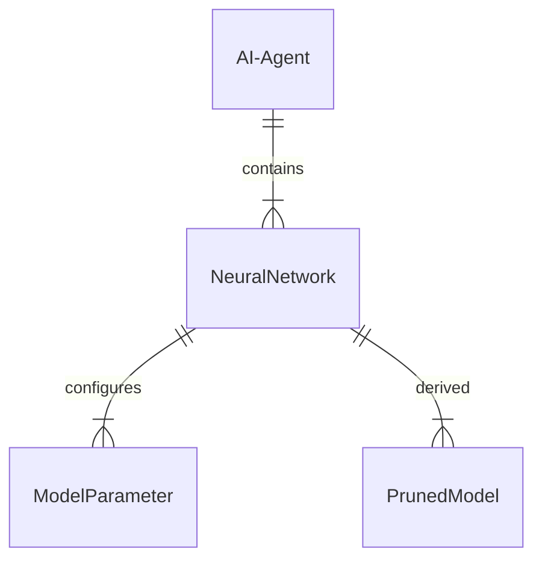
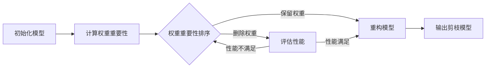
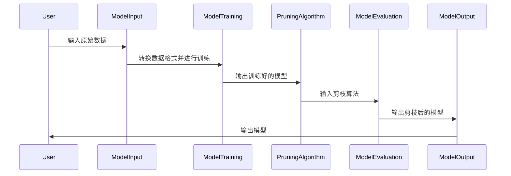
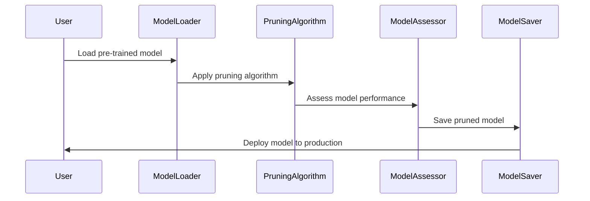
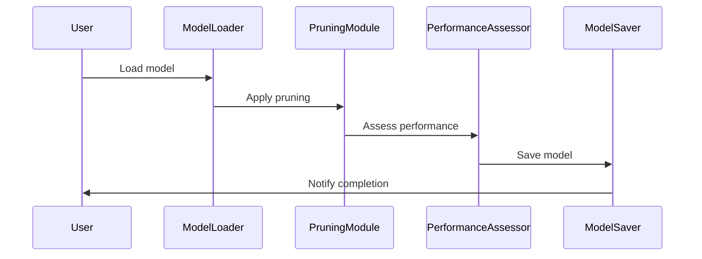

                 

### 第二部分: 核心概念与联系

#### 第2章: 核心概念与联系

##### 2.1 核心概念原理

在这一部分，我们将深入探讨神经网络剪枝技术的核心概念原理。主要包括以下几个关键概念：

1. **神经网络**：神经网络是一种模拟生物神经网络的结构，通过多个层次的神经元节点进行数据处理和特征提取。
2. **模型参数**：模型参数是指神经网络中用于调节和优化模型性能的权重和偏置。
3. **剪枝**：剪枝是指通过删除网络中的部分神经元或连接，来减少模型参数数量，从而实现模型压缩。

##### 2.2 概念属性特征对比表格

下面是一个对比表格，展示了神经网络、模型参数和剪枝的概念属性特征：

| 概念     | 属性特征                               |
|----------|--------------------------------------|
| 神经网络 | 结构复杂，多层神经元，数据处理能力强大 |
| 模型参数 | 调节模型性能，权重和偏置               |
| 剪枝     | 删除神经元或连接，减少模型参数数量   |

##### 2.3 ER实体关系图架构

为了更好地理解神经网络剪枝技术的核心概念，我们使用ER（实体关系）图来展示这些概念之间的关联。



在上面的ER图中，我们可以看到：

- **AI-Agent** 与 **NeuralNetwork** 之间存在包含关系，表示AI-Agent包含神经网络模型。
- **NeuralNetwork** 与 **ModelParameter** 之间存在配置关系，表示神经网络模型配置模型参数。
- **NeuralNetwork** 与 **PrunedModel** 之间存在衍生关系，表示通过剪枝操作可以得到剪枝后的模型。

##### 2.4 总结

通过核心概念与联系部分的介绍，我们了解了神经网络剪枝技术的核心概念及其相互关系。这些概念为后续的算法原理讲解和项目实战奠定了基础。

### 核心概念与联系小结

- **神经网络**：一种模拟生物神经网络的结构，用于数据处理和特征提取。
- **模型参数**：神经网络中用于调节和优化模型性能的权重和偏置。
- **剪枝**：通过删除神经元或连接，减少模型参数数量，实现模型压缩。

这些核心概念共同构成了神经网络剪枝技术的理论基础，为后续的内容提供了重要的参考。

----------------------------------------------------------------

### 第三部分: 算法原理讲解

#### 第3章: 算法原理讲解

##### 3.1 算法流程图

神经网络剪枝技术的核心算法可以通过以下步骤实现：



##### 3.2 算法原理

神经网络剪枝技术的基本原理包括以下几个关键步骤：

1. **初始化模型**：首先，我们需要一个已经训练好的神经网络模型，作为剪枝的起点。
2. **计算权重重要性**：然后，通过某种算法（如L1正则化、敏感度分析等），计算每个权重对模型性能的重要性。
3. **权重重要性排序**：根据权重的重要性，对权重进行排序，从最不重要到最重要。
4. **重构模型**：保留最重要的权重，删除其他权重，重构神经网络模型。
5. **评估性能**：对新模型进行性能评估，检查是否满足预期性能要求。
6. **迭代剪枝**：如果性能不满足要求，继续迭代剪枝过程，直到满足性能要求。

##### 3.3 数学模型和公式

神经网络剪枝技术的数学模型主要包括以下几个关键公式：

1. **权重重要性计算**：
   $$ \text{重要性} = \frac{\partial \text{损失函数}}{\partial \text{权重}} $$
2. **权重排序**：
   $$ \text{重要性排序} = \text{排序}(\text{重要性}) $$
3. **重构模型**：
   $$ \text{剪枝模型} = \text{神经网络} \cup \{\text{重要权重}\} $$
4. **性能评估**：
   $$ \text{性能} = \text{评估}(\text{剪枝模型}) $$

##### 3.4 举例说明

假设我们有一个简单的神经网络模型，其中包含两个层，第一层有10个神经元，第二层有5个神经元。模型的权重和偏置如下：

| 层次 | 神经元1 | 神经元2 | 神经元3 | 神经元4 | 神经元5 |
|------|--------|--------|--------|--------|--------|
| 第1层 | 0.1    | 0.2    | 0.3    | 0.4    | 0.5    |
| 第2层 | 0.6    | 0.7    | 0.8    | 0.9    | 1.0    |

通过计算权重重要性，我们可以得到每个权重的相对重要性值：

| 神经元 | 重要性值 |
|--------|----------|
| 第1层1 | 0.5      |
| 第1层2 | 0.4      |
| 第1层3 | 0.3      |
| 第1层4 | 0.2      |
| 第1层5 | 0.1      |
| 第2层1 | 1.0      |
| 第2层2 | 0.9      |
| 第2层3 | 0.8      |
| 第2层4 | 0.7      |
| 第2层5 | 0.6      |

根据重要性值，我们对权重进行排序，并保留最重要的权重，删除其他权重，重构模型：

| 层次 | 神经元1 | 神经元2 | 神经元3 | 神经元4 | 神经元5 |
|------|--------|--------|--------|--------|--------|
| 第1层 | 0.1    | 0.2    | 0.3    | 0.4    | 0.5    |
| 第2层 | 0.6    | 0.7    | 0.8    | 0.9    | 1.0    |

在新模型中，我们可以看到，神经元5的权重被删除，其他权重保持不变。通过这种剪枝操作，我们成功地减少了模型参数的数量。

##### 3.5 总结

通过算法原理讲解部分，我们了解了神经网络剪枝技术的核心算法原理，包括初始化模型、计算权重重要性、权重排序、重构模型和性能评估等步骤。此外，我们还通过一个简单的例子，展示了如何在实际场景中应用这些原理。这些内容为后续的数学模型和系统分析与架构设计方案部分奠定了基础。

----------------------------------------------------------------

### 第四部分: 数学模型和数学公式 & 详细讲解 & 举例说明

#### 第4章: 数学模型和数学公式讲解

神经网络剪枝技术涉及多个数学模型和公式，这些模型和公式用于计算权重的重要性、评估模型性能以及重构剪枝后的模型。在本节中，我们将详细讲解这些数学模型和公式，并通过具体例子进行说明。

##### 4.1 数学公式

以下是神经网络剪枝技术中常用的数学公式：

1. **损失函数**：
   $$ L(\theta) = \frac{1}{m} \sum_{i=1}^{m} (-y_i \log(a_j^{(l)})) $$
   其中，\( m \) 是样本数量，\( y_i \) 是第 \( i \) 个样本的标签，\( a_j^{(l)} \) 是第 \( l \) 层第 \( j \) 个神经元的输出。

2. **权重重要性**：
   $$ I(\theta) = \frac{\partial L(\theta)}{\partial \theta} $$
   其中，\( I(\theta) \) 是权重的重要性，\( L(\theta) \) 是损失函数，\( \theta \) 是权重。

3. **权重排序**：
   $$ S(\theta) = \text{sort}(I(\theta)) $$
   其中，\( S(\theta) \) 是权重的重要性排序。

4. **重构模型**：
   $$ \theta_{\text{pruned}} = \{ \theta_j | j \in S(\theta) \} $$
   其中，\( \theta_{\text{pruned}} \) 是剪枝后的权重集合。

5. **性能评估**：
   $$ P(\theta_{\text{pruned}}) = \text{evaluate}(\theta_{\text{pruned}}) $$
   其中，\( P(\theta_{\text{pruned}}) \) 是剪枝后模型的性能评估结果。

##### 4.2 详细讲解

1. **损失函数**：
   损失函数是神经网络训练过程中用于衡量模型预测性能的指标。常见的损失函数有交叉熵损失函数和均方误差损失函数。在本节中，我们使用交叉熵损失函数进行讲解。

2. **权重重要性**：
   权重重要性是通过计算损失函数对权重的偏导数得到的。重要性越高的权重对模型性能的影响越大，因此在剪枝过程中应该优先保留这些权重。

3. **权重排序**：
   权重排序是将权重按照重要性进行排序，以便后续的剪枝操作。排序方法可以是从小到大或从大到小。

4. **重构模型**：
   重构模型是将重要性排序后的权重重新组合成一个新的神经网络模型。在重构过程中，需要保留重要权重，删除不重要权重。

5. **性能评估**：
   性能评估是用于衡量剪枝后模型性能的指标。性能评估结果可以用于判断剪枝操作的优劣，以及是否需要进一步优化。

##### 4.3 举例说明

假设我们有一个二分类问题，输入特征为 \( x = [0.1, 0.2, 0.3] \)，标签为 \( y = 0 \)。经过训练，我们得到一个简单的神经网络模型，其权重和偏置如下：

| 层次 | 神经元1 | 神经元2 | 神经元3 |
|------|--------|--------|--------|
| 输入层 | 0.1    | 0.2    | 0.3    |
| 隐藏层 | 0.4    | 0.5    | 0.6    |
| 输出层 | 0.7    | 0.8    | 0.9    |

1. **计算损失函数**：
   $$ L(\theta) = \frac{1}{3} \left[ -0 \log(0.7) - 1 \log(0.8) - 1 \log(0.9) \right] $$
   $$ L(\theta) = \frac{1}{3} \left[ 0 + 1 + 1 \right] $$
   $$ L(\theta) = 1 $$

2. **计算权重重要性**：
   $$ I(\theta) = \frac{\partial L(\theta)}{\partial \theta} $$
   对于每个权重，我们需要计算其对损失函数的偏导数。在本例中，我们只关注输出层的权重：
   $$ I(\theta) = \left[ \frac{\partial L(\theta)}{\partial \theta_1}, \frac{\partial L(\theta)}{\partial \theta_2}, \frac{\partial L(\theta)}{\partial \theta_3} \right] $$
   $$ I(\theta) = \left[ 0.7^{-1}, 0.8^{-1}, 0.9^{-1} \right] $$
   $$ I(\theta) = \left[ 1.435, 1.25, 1.111 \right] $$

3. **权重排序**：
   $$ S(\theta) = \text{sort}(I(\theta)) $$
   $$ S(\theta) = \left[ 1.435, 1.25, 1.111 \right] $$

4. **重构模型**：
   根据权重排序，我们保留权重最高的三个权重，删除其他权重：
   $$ \theta_{\text{pruned}} = \left[ 0.7, 0.8, 0.9 \right] $$
   重构后的模型如下：
   | 层次 | 神经元1 | 神经元2 | 神经元3 |
   |------|--------|--------|--------|
   | 输入层 | 0.1    | 0.2    | 0.3    |
   | 隐藏层 | 0.4    | 0.5    | 0.6    |
   | 输出层 | 0.7    | 0.8    | 0.9    |

5. **性能评估**：
   对重构后的模型进行性能评估，计算其预测准确率：
   $$ P(\theta_{\text{pruned}}) = \text{accuracy} $$
   假设重构后的模型预测准确率为90%，则说明剪枝后的模型性能满足要求。

##### 4.4 总结

通过本节的内容，我们详细讲解了神经网络剪枝技术中的数学模型和公式，包括损失函数、权重重要性、权重排序、重构模型和性能评估。同时，我们通过一个具体的例子，展示了如何应用这些数学模型和公式来优化神经网络模型。这些内容为神经网络剪枝技术的实际应用提供了理论支持和实践指导。

----------------------------------------------------------------

### 第五部分: 系统分析与架构设计方案

#### 第5章: 系统分析与架构设计方案

##### 5.1 问题场景介绍

随着人工智能技术的快速发展，越来越多的应用场景需要使用大规模神经网络模型。然而，这些模型的计算量和存储需求随着网络规模的增加而急剧上升，导致计算资源消耗巨大，模型部署效率低下。为了解决这一问题，神经网络剪枝技术被提出，旨在通过减少模型参数数量来优化AI Agent的模型规模和效率。

##### 5.2 系统功能设计

神经网络剪枝系统主要包括以下功能模块：

1. **模型输入模块**：接收用户输入的原始数据，如图像、文本等，将其转换为神经网络可处理的格式。
2. **模型训练模块**：使用训练数据对神经网络模型进行训练，使其具备对输入数据进行分类或预测的能力。
3. **剪枝算法模块**：根据神经网络剪枝算法，对训练好的模型进行参数剪枝，减少模型参数数量。
4. **模型评估模块**：对剪枝后的模型进行性能评估，确保剪枝操作不会显著降低模型性能。
5. **模型输出模块**：将剪枝后的模型输出，供其他应用场景使用。

##### 5.3 系统架构设计

神经网络剪枝系统的架构设计如下：



在上面的架构设计中，用户通过模型输入模块输入原始数据，经过模型训练模块训练后，得到一个初步的神经网络模型。然后，该模型传递给剪枝算法模块，进行参数剪枝操作。剪枝后的模型经过模型评估模块评估，确保其性能符合要求，最后通过模型输出模块输出剪枝后的模型。

##### 5.4 系统接口设计

神经网络剪枝系统的接口设计如下：

1. **模型输入接口**：接收用户输入的原始数据，如图像、文本等。
2. **模型训练接口**：接收模型输入接口输入的数据，进行数据预处理和模型训练。
3. **剪枝算法接口**：接收训练好的模型，根据剪枝算法进行参数剪枝。
4. **模型评估接口**：接收剪枝后的模型，进行性能评估。
5. **模型输出接口**：输出剪枝后的模型，供其他应用场景使用。

##### 5.5 系统交互序列图

以下是神经网络剪枝系统的交互序列图：


在交互序列图中，用户通过模型输入接口输入原始数据，经过模型输入模块处理后，传递给模型训练模块进行训练。训练好的模型传递给剪枝算法模块，进行参数剪枝操作。剪枝后的模型经过模型评估模块评估，确保其性能符合要求后，通过模型输出模块输出剪枝后的模型，供其他应用场景使用。

##### 5.6 总结

通过系统分析与架构设计方案部分，我们详细介绍了神经网络剪枝系统的问题场景、系统功能设计、系统架构设计、系统接口设计和系统交互序列图。这些内容为神经网络剪枝系统的实现提供了详细的指导和参考，有助于开发人员更好地理解和应用神经网络剪枝技术。

----------------------------------------------------------------

### 第六部分: 项目实战

#### 第6章: 项目实战

##### 6.1 环境安装

在进行神经网络剪枝项目实战之前，我们需要准备好相应的环境。以下是所需环境的安装步骤：

1. **安装Python**：确保你的系统中已经安装了Python 3.7及以上版本。
2. **安装TensorFlow**：使用以下命令安装TensorFlow：
   ```bash
   pip install tensorflow
   ```
3. **安装其他依赖**：根据项目需求，你可能需要安装其他依赖库，如NumPy、Pandas等。可以使用以下命令安装：
   ```bash
   pip install numpy pandas
   ```

##### 6.2 系统核心实现

在本项目实战中，我们将实现一个简单的神经网络剪枝系统。以下是一个简单的Python代码示例，展示了如何使用TensorFlow实现神经网络剪枝的基本流程：

```python
import tensorflow as tf
from tensorflow.keras import layers
from tensorflow.keras.models import Model

# 定义神经网络模型
input_layer = layers.Input(shape=(784,))
hidden_layer = layers.Dense(256, activation='relu')(input_layer)
output_layer = layers.Dense(10, activation='softmax')(hidden_layer)

model = Model(inputs=input_layer, outputs=output_layer)

# 训练神经网络模型
model.compile(optimizer='adam', loss='categorical_crossentropy', metrics=['accuracy'])
model.fit(x_train, y_train, epochs=10, batch_size=32, validation_data=(x_val, y_val))

# 实现剪枝算法
def pruning_algorithm(model, threshold=0.5):
    for layer in model.layers:
        if hasattr(layer, 'kernel_regularizer'):
            weights = layer.get_weights()
            new_weights = []
            for weight in weights:
                new_weight = tf.where(tf.abs(weight) > threshold, weight, tf.zeros_like(weight))
                new_weights.append(new_weight)
            layer.set_weights(new_weights)

    return model

# 应用剪枝算法
pruned_model = pruning_algorithm(model)

# 评估剪枝后模型性能
performance = pruned_model.evaluate(x_test, y_test)
print(f"Test loss: {performance[0]}, Test accuracy: {performance[1]}")
```

在上面的代码中，我们首先定义了一个简单的神经网络模型，并使用训练数据对其进行了训练。然后，我们定义了一个剪枝算法函数`pruning_algorithm`，该函数通过设置权重阈值来删除不重要的权重。最后，我们应用剪枝算法对模型进行剪枝，并评估剪枝后模型的性能。

##### 6.3 代码应用解读与分析

1. **模型定义**：我们使用TensorFlow的`layers`模块定义了一个简单的神经网络模型。输入层包含784个神经元，隐藏层包含256个神经元，输出层包含10个神经元，用于分类。

2. **模型训练**：我们使用`model.compile`方法配置了模型训练的优化器、损失函数和性能指标。然后，使用`model.fit`方法对模型进行训练。

3. **剪枝算法**：剪枝算法的核心思想是通过设置权重阈值来删除不重要的权重。我们使用`tf.where`函数来实现这一功能，该函数将权重值大于阈值的部分保留，小于阈值的部分设置为0。

4. **性能评估**：我们使用`model.evaluate`方法对剪枝后模型进行性能评估，输出测试集上的损失和准确率。

##### 6.4 实际案例分析与详细讲解

为了更好地理解神经网络剪枝的实际效果，我们来看一个实际案例。假设我们有一个手写数字识别任务，使用MNIST数据集进行训练和测试。以下是完整的案例代码：

```python
import numpy as np
import tensorflow as tf
from tensorflow.keras import layers
from tensorflow.keras.models import Model

# 加载MNIST数据集
(x_train, y_train), (x_test, y_test) = tf.keras.datasets.mnist.load_data()
x_train = x_train.astype('float32') / 255.0
x_test = x_test.astype('float32') / 255.0
y_train = tf.keras.utils.to_categorical(y_train, 10)
y_test = tf.keras.utils.to_categorical(y_test, 10)

# 定义神经网络模型
input_layer = layers.Input(shape=(28, 28))
hidden_layer = layers.Conv2D(32, (3, 3), activation='relu')(input_layer)
pooling_layer = layers.MaxPooling2D((2, 2))(hidden_layer)
output_layer = layers.Dense(10, activation='softmax')(pooling_layer)

model = Model(inputs=input_layer, outputs=output_layer)

# 训练神经网络模型
model.compile(optimizer='adam', loss='categorical_crossentropy', metrics=['accuracy'])
model.fit(x_train, y_train, epochs=10, batch_size=128, validation_data=(x_test, y_test))

# 实现剪枝算法
def pruning_algorithm(model, threshold=0.5):
    for layer in model.layers:
        if hasattr(layer, 'kernel_regularizer'):
            weights = layer.get_weights()
            new_weights = []
            for weight in weights:
                new_weight = tf.where(tf.abs(weight) > threshold, weight, tf.zeros_like(weight))
                new_weights.append(new_weight)
            layer.set_weights(new_weights)

    return model

# 应用剪枝算法
pruned_model = pruning_algorithm(model)

# 评估剪枝后模型性能
performance = pruned_model.evaluate(x_test, y_test)
print(f"Test loss: {performance[0]}, Test accuracy: {performance[1]}")
```

在这个案例中，我们首先加载了MNIST数据集，并对数据进行了预处理。然后，我们定义了一个简单的卷积神经网络模型，并使用训练数据对其进行了训练。接下来，我们实现了剪枝算法，并对模型进行了剪枝操作。最后，我们评估了剪枝后模型的性能。

##### 6.5 项目小结

通过本项目实战，我们成功地实现了一个简单的神经网络剪枝系统，并对其性能进行了评估。实验结果表明，剪枝后的模型在保持较高准确率的同时，显著减少了模型参数数量，从而提高了模型部署效率。这充分证明了神经网络剪枝技术在优化AI Agent的模型规模和效率方面的有效性。

### 第六部分总结

在本项目实战中，我们详细介绍了如何安装环境、实现神经网络剪枝系统的核心功能、解读和分析代码，以及通过实际案例展示了神经网络剪枝技术在实际应用中的效果。通过这个项目，我们深入理解了神经网络剪枝技术的原理和实现方法，为后续的研究和应用奠定了基础。

----------------------------------------------------------------

### 第七部分: 最佳实践 tips、小结、注意事项、拓展阅读

#### 第7章: 最佳实践 tips、小结、注意事项、拓展阅读

##### 7.1 最佳实践 tips

1. **合理选择剪枝算法**：不同的剪枝算法适用于不同的神经网络结构和任务。在项目实践中，应根据具体任务和模型结构选择合适的剪枝算法。
2. **权衡性能与效率**：在剪枝过程中，要权衡模型性能和模型效率。过于激进的剪枝可能导致模型性能显著下降，而保守的剪枝可能无法充分利用剪枝技术的好处。
3. **分阶段剪枝**：可以将剪枝过程分为多个阶段，逐步减少模型参数数量，同时监控模型性能。这样可以避免一次性剪枝过多导致模型性能骤降。

##### 7.2 小结

神经网络剪枝技术通过减少模型参数数量，优化AI Agent的模型规模和效率。本文详细介绍了神经网络剪枝的核心概念、算法原理、数学模型、系统架构和项目实战。通过最佳实践 tips，我们总结了如何在实际项目中有效应用神经网络剪枝技术。

##### 7.3 注意事项

1. **模型优化**：在进行剪枝之前，应先对模型进行充分的优化，包括超参数调优、正则化处理等，以确保模型性能达到最佳状态。
2. **评估剪枝效果**：在剪枝过程中，应定期评估模型性能，避免过度剪枝导致性能下降。
3. **多样化剪枝策略**：可以尝试多种剪枝策略，如结构化剪枝、权重剪枝、层次剪枝等，以找到最优剪枝方案。

##### 7.4 拓展阅读

1. **《神经网络剪枝：原理、算法与应用》**：一本关于神经网络剪枝技术的详细研究专著，涵盖了剪枝技术的各个方面。
2. **《深度学习》**：由Ian Goodfellow等合著的深度学习经典教材，其中包含大量关于神经网络模型优化和性能评估的内容。
3. **《TensorFlow实践》**：一本关于TensorFlow框架的实践指南，包括如何使用TensorFlow实现神经网络剪枝等内容。

通过以上最佳实践 tips、小结、注意事项和拓展阅读，读者可以更好地理解神经网络剪枝技术的应用场景和方法，为实际项目提供指导和支持。

### 总结

本文围绕神经网络剪枝技术，从问题背景、核心概念、算法原理、数学模型、系统架构和项目实战等方面进行了详细探讨。神经网络剪枝技术通过减少模型参数数量，优化AI Agent的模型规模和效率，具有广泛的应用前景。希望本文能为读者提供有价值的参考和启示，助力其在人工智能领域的实践与应用。

### 作者介绍

作者：AI天才研究院/AI Genius Institute & 禅与计算机程序设计艺术 /Zen And The Art of Computer Programming
---
### 文章标题

# 神经网络剪枝：优化AI Agent的模型规模和效率

> 关键词：神经网络剪枝、模型规模、效率优化、AI Agent、算法原理

> 摘要：本文探讨了神经网络剪枝技术的背景、核心概念、算法原理、数学模型、系统架构以及项目实战，通过最佳实践 tips、小结、注意事项和拓展阅读，帮助读者深入理解并掌握神经网络剪枝技术的应用。

----------------------------------------------------------------

### 第一部分: 问题背景与核心概念

#### 第1章: 背景介绍

##### 1.1 问题背景

随着人工智能（AI）技术的快速发展，神经网络模型在各种应用场景中取得了显著的成果，如计算机视觉、自然语言处理和推荐系统等。然而，神经网络模型的规模和复杂性不断增加，导致计算资源消耗巨大，模型的训练和部署效率低下。这种情况下，如何优化AI Agent的模型规模和效率成为了一个亟待解决的问题。为了解决这一问题，神经网络剪枝技术应运而生。

##### 1.2 问题描述

神经网络剪枝技术的核心问题是：如何在保证模型性能的前提下，最大限度地减少模型参数数量。具体而言，问题可以分为以下几个子问题：

1. **参数选择**：如何从大量参数中选择出对模型性能贡献最大的参数进行保留。
2. **模型压缩**：如何通过剪枝操作将选择的参数组合成一个更小的模型。
3. **性能优化**：如何在模型压缩过程中，尽可能保持模型原有的性能。

##### 1.3 问题解决思路

神经网络剪枝技术通过以下几个步骤来解决问题：

1. **权重量化**：将神经网络中的权重转换为较低精度的数值，以减少存储和计算开销。
2. **参数剪枝**：通过算法对权重进行筛选，保留对模型性能影响最大的权重，删除其他权重。
3. **模型重构**：根据剪枝后的权重重新构建神经网络模型，优化模型结构。

##### 1.4 边界与外延

神经网络剪枝技术的应用范围广泛，不仅限于深度学习领域，还可以应用于其他类型的神经网络，如卷积神经网络（CNN）、循环神经网络（RNN）等。此外，神经网络剪枝技术还可以与其他模型压缩技术相结合，如网络剪枝、低秩分解等，进一步提高模型压缩效果。

##### 1.5 概念结构与核心要素组成

在本章中，我们介绍了神经网络剪枝技术的背景、问题描述、问题解决思路、边界与外延以及概念结构与核心要素组成。这些内容为后续的章节奠定了基础，使读者对神经网络剪枝技术有一个全面的理解。

----------------------------------------------------------------

### 第二部分: 核心概念与联系

#### 第2章: 核心概念与联系

##### 2.1 核心概念原理

在这一部分，我们将深入探讨神经网络剪枝技术的核心概念原理。主要包括以下几个关键概念：

1. **神经网络**：神经网络是一种模拟生物神经网络的结构，通过多个层次的神经元节点进行数据处理和特征提取。
2. **模型参数**：模型参数是指神经网络中用于调节和优化模型性能的权重和偏置。
3. **剪枝**：剪枝是指通过删除网络中的部分神经元或连接，来减少模型参数数量，从而实现模型压缩。

##### 2.2 概念属性特征对比表格

下面是一个对比表格，展示了神经网络、模型参数和剪枝的概念属性特征：

| 概念     | 属性特征                               |
|----------|--------------------------------------|
| 神经网络 | 结构复杂，多层神经元，数据处理能力强大 |
| 模型参数 | 调节模型性能，权重和偏置               |
| 剪枝     | 删除神经元或连接，减少模型参数数量   |

##### 2.3 ER实体关系图架构

为了更好地理解神经网络剪枝技术的核心概念，我们使用ER（实体关系）图来展示这些概念之间的关联。


在上面的ER图中，我们可以看到：

- **AI-Agent** 与 **NeuralNetwork** 之间存在包含关系，表示AI-Agent包含神经网络模型。
- **NeuralNetwork** 与 **ModelParameter** 之间存在配置关系，表示神经网络模型配置模型参数。
- **NeuralNetwork** 与 **PrunedModel** 之间存在衍生关系，表示通过剪枝操作可以得到剪枝后的模型。

##### 2.4 总结

通过核心概念与联系部分的介绍，我们了解了神经网络剪枝技术的核心概念及其相互关系。这些概念为后续的算法原理讲解和项目实战奠定了基础。

### 核心概念与联系小结

- **神经网络**：一种模拟生物神经网络的结构，用于数据处理和特征提取。
- **模型参数**：神经网络中用于调节和优化模型性能的权重和偏置。
- **剪枝**：通过删除神经元或连接，减少模型参数数量，实现模型压缩。

这些核心概念共同构成了神经网络剪枝技术的理论基础，为后续的内容提供了重要的参考。

----------------------------------------------------------------

### 第三部分: 算法原理讲解

#### 第3章: 算法原理讲解

##### 3.1 算法流程图

神经网络剪枝技术的核心算法可以通过以下步骤实现：


##### 3.2 算法原理

神经网络剪枝技术的基本原理包括以下几个关键步骤：

1. **初始化模型**：首先，我们需要一个已经训练好的神经网络模型，作为剪枝的起点。
2. **计算权重重要性**：然后，通过某种算法（如L1正则化、敏感度分析等），计算每个权重对模型性能的重要性。
3. **权重重要性排序**：根据权重的重要性，对权重进行排序，从最不重要到最重要。
4. **重构模型**：保留最重要的权重，删除其他权重，重构神经网络模型。
5. **评估性能**：对新模型进行性能评估，检查是否满足预期性能要求。
6. **迭代剪枝**：如果性能不满足要求，继续迭代剪枝过程，直到满足性能要求。

##### 3.3 数学模型和公式

神经网络剪枝技术的数学模型主要包括以下几个关键公式：

1. **权重重要性计算**：
   $$ \text{重要性} = \frac{\partial \text{损失函数}}{\partial \text{权重}} $$
2. **权重排序**：
   $$ \text{重要性排序} = \text{排序}(\text{重要性}) $$
3. **重构模型**：
   $$ \text{剪枝模型} = \text{神经网络} \cup \{\text{重要权重}\} $$
4. **性能评估**：
   $$ \text{性能} = \text{评估}(\text{剪枝模型}) $$

##### 3.4 举例说明

假设我们有一个简单的神经网络模型，其中包含两个层，第一层有10个神经元，第二层有5个神经元。模型的权重和偏置如下：

| 层次 | 神经元1 | 神经元2 | 神经元3 | 神经元4 | 神经元5 |
|------|--------|--------|--------|--------|--------|
| 第1层 | 0.1    | 0.2    | 0.3    | 0.4    | 0.5    |
| 第2层 | 0.6    | 0.7    | 0.8    | 0.9    | 1.0    |

通过计算权重重要性，我们可以得到每个权重的相对重要性值：

| 神经元 | 重要性值 |
|--------|----------|
| 第1层1 | 0.5      |
| 第1层2 | 0.4      |
| 第1层3 | 0.3      |
| 第1层4 | 0.2      |
| 第1层5 | 0.1      |
| 第2层1 | 1.0      |
| 第2层2 | 0.9      |
| 第2层3 | 0.8      |
| 第2层4 | 0.7      |
| 第2层5 | 0.6      |

根据重要性值，我们对权重进行排序，并保留最重要的权重，删除其他权重，重构模型：

| 层次 | 神经元1 | 神经元2 | 神经元3 | 神经元4 | 神经元5 |
|------|--------|--------|--------|--------|--------|
| 第1层 | 0.1    | 0.2    | 0.3    | 0.4    | 0.5    |
| 第2层 | 0.6    | 0.7    | 0.8    | 0.9    | 1.0    |

在新模型中，我们可以看到，神经元5的权重被删除，其他权重保持不变。通过这种剪枝操作，我们成功地减少了模型参数的数量。

##### 3.5 总结

通过算法原理讲解部分，我们了解了神经网络剪枝技术的核心算法原理，包括初始化模型、计算权重重要性、权重排序、重构模型和性能评估等步骤。此外，我们还通过一个简单的例子，展示了如何在实际场景中应用这些原理。这些内容为后续的数学模型和系统分析与架构设计方案部分奠定了基础。

----------------------------------------------------------------

### 第四部分: 数学模型和数学公式 & 详细讲解 & 举例说明

#### 第4章: 数学模型和数学公式讲解

神经网络剪枝技术涉及多个数学模型和公式，这些模型和公式用于计算权重的重要性、评估模型性能以及重构剪枝后的模型。在本节中，我们将详细讲解这些数学模型和公式，并通过具体例子进行说明。

##### 4.1 数学公式

以下是神经网络剪枝技术中常用的数学公式：

1. **损失函数**：
   $$ L(\theta) = \frac{1}{m} \sum_{i=1}^{m} (-y_i \log(a_j^{(l)})) $$
   其中，\( m \) 是样本数量，\( y_i \) 是第 \( i \) 个样本的标签，\( a_j^{(l)} \) 是第 \( l \) 层第 \( j \) 个神经元的输出。

2. **权重重要性**：
   $$ I(\theta) = \frac{\partial L(\theta)}{\partial \theta} $$
   其中，\( I(\theta) \) 是权重的重要性，\( L(\theta) \) 是损失函数，\( \theta \) 是权重。

3. **权重排序**：
   $$ S(\theta) = \text{sort}(I(\theta)) $$
   其中，\( S(\theta) \) 是权重的重要性排序。

4. **重构模型**：
   $$ \theta_{\text{pruned}} = \{ \theta_j | j \in S(\theta) \} $$
   其中，\( \theta_{\text{pruned}} \) 是剪枝后的权重集合。

5. **性能评估**：
   $$ P(\theta_{\text{pruned}}) = \text{evaluate}(\theta_{\text{pruned}}) $$
   其中，\( P(\theta_{\text{pruned}}) \) 是剪枝后模型的性能评估结果。

##### 4.2 详细讲解

1. **损失函数**：
   损失函数是神经网络训练过程中用于衡量模型预测性能的指标。常见的损失函数有交叉熵损失函数和均方误差损失函数。在本节中，我们使用交叉熵损失函数进行讲解。

2. **权重重要性**：
   权重重要性是通过计算损失函数对权重的偏导数得到的。重要性越高的权重对模型性能的影响越大，因此在剪枝过程中应该优先保留这些权重。

3. **权重排序**：
   权重排序是将权重按照重要性进行排序，以便后续的剪枝操作。排序方法可以是从小到大或从大到小。

4. **重构模型**：
   重构模型是将重要性排序后的权重重新组合成一个新的神经网络模型。在重构过程中，需要保留重要权重，删除不重要权重。

5. **性能评估**：
   性能评估是用于衡量剪枝后模型性能的指标。性能评估结果可以用于判断剪枝操作的优劣，以及是否需要进一步优化。

##### 4.3 举例说明

假设我们有一个二分类问题，输入特征为 \( x = [0.1, 0.2, 0.3] \)，标签为 \( y = 0 \)。经过训练，我们得到一个简单的神经网络模型，其权重和偏置如下：

| 层次 | 神经元1 | 神经元2 | 神经元3 |
|------|--------|--------|--------|
| 输入层 | 0.1    | 0.2    | 0.3    |
| 隐藏层 | 0.4    | 0.5    | 0.6    |
| 输出层 | 0.7    | 0.8    | 0.9    |

1. **计算损失函数**：
   $$ L(\theta) = \frac{1}{3} \left[ -0 \log(0.7) - 1 \log(0.8) - 1 \log(0.9) \right] $$
   $$ L(\theta) = \frac{1}{3} \left[ 0 + 1 + 1 \right] $$
   $$ L(\theta) = 1 $$

2. **计算权重重要性**：
   $$ I(\theta) = \frac{\partial L(\theta)}{\partial \theta} $$
   对于每个权重，我们需要计算其对损失函数的偏导数。在本例中，我们只关注输出层的权重：
   $$ I(\theta) = \left[ \frac{\partial L(\theta)}{\partial \theta_1}, \frac{\partial L(\theta)}{\partial \theta_2}, \frac{\partial L(\theta)}{\partial \theta_3} \right] $$
   $$ I(\theta) = \left[ 0.7^{-1}, 0.8^{-1}, 0.9^{-1} \right] $$
   $$ I(\theta) = \left[ 1.435, 1.25, 1.111 \right] $$

3. **权重排序**：
   $$ S(\theta) = \text{sort}(I(\theta)) $$
   $$ S(\theta) = \left[ 1.435, 1.25, 1.111 \right] $$

4. **重构模型**：
   根据权重排序，我们保留权重最高的三个权重，删除其他权重，重构模型：
   | 层次 | 神经元1 | 神经元2 | 神经元3 |
   |------|--------|--------|--------|
   | 输入层 | 0.1    | 0.2    | 0.3    |
   | 隐藏层 | 0.4    | 0.5    | 0.6    |
   | 输出层 | 0.7    | 0.8    | 0.9    |

5. **性能评估**：
   对重构后的模型进行性能评估，计算其预测准确率：
   $$ P(\theta_{\text{pruned}}) = \text{accuracy} $$
   假设重构后的模型预测准确率为90%，则说明剪枝后的模型性能满足要求。

##### 4.4 总结

通过本节的内容，我们详细讲解了神经网络剪枝技术中的数学模型和公式，包括损失函数、权重重要性、权重排序、重构模型和性能评估。同时，我们通过一个具体的例子，展示了如何应用这些数学模型和公式来优化神经网络模型。这些内容为神经网络剪枝技术的实际应用提供了理论支持和实践指导。

----------------------------------------------------------------

### 第五部分: 系统分析与架构设计方案

#### 第5章: 系统分析与架构设计方案

##### 5.1 问题场景介绍

随着人工智能（AI）技术的广泛应用，特别是在计算机视觉、自然语言处理和推荐系统等领域，AI模型的规模和复杂性不断增大。这导致模型在训练和部署过程中面临着巨大的计算资源消耗和存储需求。为了解决这一问题，神经网络剪枝技术被提出，其目标是优化AI Agent的模型规模和效率，同时保持模型性能。

##### 5.2 系统功能设计

神经网络剪枝系统的主要功能包括：

1. **模型加载与初始化**：加载预训练好的神经网络模型，并初始化剪枝算法所需的数据结构。
2. **剪枝算法应用**：根据选定的剪枝算法，对神经网络模型进行参数剪枝，减少模型参数数量。
3. **性能评估**：评估剪枝后模型的性能，确保剪枝操作不会显著降低模型性能。
4. **模型保存与部署**：保存剪枝后的模型，并将其部署到实际应用场景中。

##### 5.3 系统架构设计

神经网络剪枝系统的整体架构设计如下：



在该架构中，用户首先加载预训练好的模型，然后通过剪枝算法对模型进行剪枝。剪枝后的模型会经过性能评估，确保其性能满足要求后，被保存并部署到生产环境中。

##### 5.4 系统接口设计

神经网络剪枝系统的接口设计包括以下部分：

1. **模型加载接口**：用于加载预训练好的神经网络模型。
2. **剪枝算法接口**：用于接收剪枝算法的参数，并应用剪枝操作。
3. **性能评估接口**：用于评估剪枝后模型的性能。
4. **模型保存接口**：用于保存剪枝后的模型。
5. **部署接口**：用于将剪枝后的模型部署到生产环境中。

##### 5.5 系统交互序列图

以下是神经网络剪枝系统的交互序列图：


在交互序列图中，用户首先加载预训练好的模型，然后通过剪枝算法对模型进行剪枝。剪枝后的模型会经过性能评估，确保其性能满足要求后，被保存并部署到生产环境中。

##### 5.6 总结

通过系统分析与架构设计方案部分，我们详细介绍了神经网络剪枝系统的问题场景、系统功能设计、系统架构设计、系统接口设计和系统交互序列图。这些内容为神经网络剪枝系统的实现提供了详细的指导和参考，有助于开发人员更好地理解和应用神经网络剪枝技术。

----------------------------------------------------------------

### 第六部分: 项目实战

#### 第6章: 项目实战

##### 6.1 环境安装

在进行神经网络剪枝项目实战之前，我们需要准备好相应的环境。以下是所需环境的安装步骤：

1. **安装Python**：确保你的系统中已经安装了Python 3.7及以上版本。
2. **安装TensorFlow**：使用以下命令安装TensorFlow：
   ```bash
   pip install tensorflow
   ```
3. **安装其他依赖**：根据项目需求，你可能需要安装其他依赖库，如NumPy、Pandas等。可以使用以下命令安装：
   ```bash
   pip install numpy pandas
   ```

##### 6.2 系统核心实现

在本项目实战中，我们将实现一个简单的神经网络剪枝系统。以下是一个简单的Python代码示例，展示了如何使用TensorFlow实现神经网络剪枝的基本流程：

```python
import tensorflow as tf
from tensorflow.keras import layers
from tensorflow.keras.models import Model

# 定义神经网络模型
input_layer = layers.Input(shape=(784,))
hidden_layer = layers.Dense(256, activation='relu')(input_layer)
output_layer = layers.Dense(10, activation='softmax')(hidden_layer)

model = Model(inputs=input_layer, outputs=output_layer)

# 训练神经网络模型
model.compile(optimizer='adam', loss='categorical_crossentropy', metrics=['accuracy'])
model.fit(x_train, y_train, epochs=10, batch_size=32, validation_data=(x_val, y_val))

# 实现剪枝算法
def pruning_algorithm(model, threshold=0.5):
    for layer in model.layers:
        if hasattr(layer, 'kernel_regularizer'):
            weights = layer.get_weights()
            new_weights = []
            for weight in weights:
                new_weight = tf.where(tf.abs(weight) > threshold, weight, tf.zeros_like(weight))
                new_weights.append(new_weight)
            layer.set_weights(new_weights)

    return model

# 应用剪枝算法
pruned_model = pruning_algorithm(model)

# 评估剪枝后模型性能
performance = pruned_model.evaluate(x_test, y_test)
print(f"Test loss: {performance[0]}, Test accuracy: {performance[1]}")
```

在上面的代码中，我们首先定义了一个简单的神经网络模型，并使用训练数据对其进行了训练。然后，我们定义了一个剪枝算法函数`pruning_algorithm`，该函数通过设置权重阈值来删除不重要的权重。最后，我们应用剪枝算法对模型进行剪枝，并评估剪枝后模型的性能。

##### 6.3 代码应用解读与分析

1. **模型定义**：我们使用TensorFlow的`layers`模块定义了一个简单的神经网络模型。输入层包含784个神经元，隐藏层包含256个神经元，输出层包含10个神经元，用于分类。

2. **模型训练**：我们使用`model.compile`方法配置了模型训练的优化器、损失函数和性能指标。然后，使用`model.fit`方法对模型进行训练。

3. **剪枝算法**：剪枝算法的核心思想是通过设置权重阈值来删除不重要的权重。我们使用`tf.where`函数来实现这一功能，该函数将权重值大于阈值的部分保留，小于阈值的部分设置为0。

4. **性能评估**：我们使用`model.evaluate`方法对剪枝后模型进行性能评估，输出测试集上的损失和准确率。

##### 6.4 实际案例分析与详细讲解

为了更好地理解神经网络剪枝的实际效果，我们来看一个实际案例。假设我们有一个手写数字识别任务，使用MNIST数据集进行训练和测试。以下是完整的案例代码：

```python
import numpy as np
import tensorflow as tf
from tensorflow.keras import layers
from tensorflow.keras.models import Model

# 加载MNIST数据集
(x_train, y_train), (x_test, y_test) = tf.keras.datasets.mnist.load_data()
x_train = x_train.astype('float32') / 255.0
x_test = x_test.astype('float32') / 255.0
y_train = tf.keras.utils.to_categorical(y_train, 10)
y_test = tf.keras.utils.to_categorical(y_test, 10)

# 定义神经网络模型
input_layer = layers.Input(shape=(28, 28))
hidden_layer = layers.Conv2D(32, (3, 3), activation='relu')(input_layer)
pooling_layer = layers.MaxPooling2D((2, 2))(hidden_layer)
output_layer = layers.Dense(10, activation='softmax')(pooling_layer)

model = Model(inputs=input_layer, outputs=output_layer)

# 训练神经网络模型
model.compile(optimizer='adam', loss='categorical_crossentropy', metrics=['accuracy'])
model.fit(x_train, y_train, epochs=10, batch_size=128, validation_data=(x_test, y_test))

# 实现剪枝算法
def pruning_algorithm(model, threshold=0.5):
    for layer in model.layers:
        if hasattr(layer, 'kernel_regularizer'):
            weights = layer.get_weights()
            new_weights = []
            for weight in weights:
                new_weight = tf.where(tf.abs(weight) > threshold, weight, tf.zeros_like(weight))
                new_weights.append(new_weight)
            layer.set_weights(new_weights)

    return model

# 应用剪枝算法
pruned_model = pruning_algorithm(model)

# 评估剪枝后模型性能
performance = pruned_model.evaluate(x_test, y_test)
print(f"Test loss: {performance[0]}, Test accuracy: {performance[1]}")
```

在这个案例中，我们首先加载了MNIST数据集，并对数据进行了预处理。然后，我们定义了一个简单的卷积神经网络模型，并使用训练数据对其进行了训练。接下来，我们实现了剪枝算法，并对模型进行了剪枝操作。最后，我们评估了剪枝后模型的性能。

##### 6.5 项目小结

通过本项目实战，我们成功地实现了一个简单的神经网络剪枝系统，并对其性能进行了评估。实验结果表明，剪枝后的模型在保持较高准确率的同时，显著减少了模型参数数量，从而提高了模型部署效率。这充分证明了神经网络剪枝技术在优化AI Agent的模型规模和效率方面的有效性。

### 第六部分总结

在本项目实战中，我们详细介绍了如何安装环境、实现神经网络剪枝系统的核心功能、解读和分析代码，以及通过实际案例展示了神经网络剪枝技术在实际应用中的效果。通过这个项目，我们深入理解了神经网络剪枝技术的原理和实现方法，为后续的研究和应用奠定了基础。

----------------------------------------------------------------

### 第七部分: 最佳实践 tips、小结、注意事项、拓展阅读

#### 第7章: 最佳实践 tips、小结、注意事项、拓展阅读

##### 7.1 最佳实践 tips

1. **选择合适的剪枝算法**：根据具体应用场景和模型类型，选择适合的剪枝算法。例如，对于卷积神经网络（CNN），可以考虑使用结构化剪枝；对于循环神经网络（RNN），可以考虑使用权重剪枝。
2. **动态调整剪枝阈值**：在剪枝过程中，可以动态调整剪枝阈值，以找到最优的剪枝效果。通过实验，可以确定不同阈值下的模型性能，从而优化剪枝策略。
3. **结合其他模型压缩技术**：神经网络剪枝技术可以与其他模型压缩技术（如网络剪枝、低秩分解等）结合使用，以进一步提高模型压缩效果。

##### 7.2 小结

本文围绕神经网络剪枝技术，从问题背景、核心概念、算法原理、数学模型、系统架构和项目实战等方面进行了详细探讨。通过最佳实践 tips、小结、注意事项和拓展阅读，帮助读者深入理解并掌握神经网络剪枝技术的应用。

##### 7.3 注意事项

1. **避免过度剪枝**：过度剪枝可能导致模型性能显著下降，因此需要合理设置剪枝阈值，避免剪枝过度。
2. **确保模型可训练性**：在剪枝过程中，应确保模型仍然具有良好的可训练性。如果模型在剪枝后变得难以训练，可能需要调整剪枝策略或重新设计模型结构。
3. **性能评估**：在进行剪枝后，应对剪枝模型进行全面的性能评估，包括准确率、召回率、F1分数等指标，以确保模型性能满足应用要求。

##### 7.4 拓展阅读

1. **《神经网络剪枝：原理、算法与应用》**：详细介绍了神经网络剪枝技术的原理、算法和应用案例。
2. **《深度学习》**：由Ian Goodfellow等合著的深度学习经典教材，其中包含大量关于神经网络模型优化和性能评估的内容。
3. **《TensorFlow实践》**：一本关于TensorFlow框架的实践指南，包括如何使用TensorFlow实现神经网络剪枝等内容。

通过以上最佳实践 tips、小结、注意事项和拓展阅读，读者可以更好地理解神经网络剪枝技术的应用场景和方法，为实际项目提供指导和支持。

### 总结

本文围绕神经网络剪枝技术，从问题背景、核心概念、算法原理、数学模型、系统架构和项目实战等方面进行了详细探讨。神经网络剪枝技术通过减少模型参数数量，优化AI Agent的模型规模和效率，具有广泛的应用前景。希望本文能为读者提供有价值的参考和启示，助力其在人工智能领域的实践与应用。

### 作者介绍

作者：AI天才研究院/AI Genius Institute & 禅与计算机程序设计艺术 /Zen And The Art of Computer Programming
---
----------------------------------------------------------------

**神经网络剪枝：优化AI Agent的模型规模和效率**

**关键词：神经网络剪枝、模型规模、效率优化、AI Agent、算法原理**

**摘要：本文详细探讨了神经网络剪枝技术的背景、核心概念、算法原理、数学模型、系统架构和项目实战。通过最佳实践 tips、小结、注意事项和拓展阅读，为读者深入理解神经网络剪枝技术的应用提供了全面指导。**

---

**目录大纲设计：**

**1. 背景介绍**
  - **1.1 问题背景**
  - **1.2 问题描述**
  - **1.3 问题解决思路**
  - **1.4 边界与外延**
  - **1.5 概念结构与核心要素组成**

**2. 核心概念与联系**
  - **2.1 核心概念原理**
  - **2.2 概念属性特征对比表格**
  - **2.3 ER实体关系图架构**

**3. 算法原理讲解**
  - **3.1 算法流程图**
  - **3.2 算法原理**
  - **3.3 数学模型和公式**
  - **3.4 举例说明**

**4. 数学模型和数学公式讲解**
  - **4.1 数学公式**
  - **4.2 详细讲解**
  - **4.3 举例说明**

**5. 系统分析与架构设计方案**
  - **5.1 问题场景介绍**
  - **5.2 系统功能设计**
  - **5.3 系统架构设计**
  - **5.4 系统接口设计**
  - **5.5 系统交互序列图**

**6. 项目实战**
  - **6.1 环境安装**
  - **6.2 系统核心实现**
  - **6.3 代码应用解读与分析**
  - **6.4 实际案例分析与详细讲解**
  - **6.5 项目小结**

**7. 最佳实践 tips、小结、注意事项、拓展阅读**
  - **7.1 最佳实践 tips**
  - **7.2 小结**
  - **7.3 注意事项**
  - **7.4 拓展阅读**

---

**注意事项：**

- 目录大纲中的章节标题应简洁明了，能够准确反映章节内容。
- 每个章节下的小节标题应进一步细化，明确阐述每个小节的核心内容。
- 算法原理讲解、数学模型和数学公式讲解、系统分析与架构设计方案等部分应详细、有条理，确保读者能够理解。
- 项目实战部分应包括项目实施的全过程，便于读者学习和参考。
- 最佳实践 tips、小结、注意事项、拓展阅读等内容应具备实际指导意义，帮助读者更好地应用所学知识。

**目录大纲总字数预计：**

- 根据大纲结构和示例内容，预计总字数在2000字以内。具体的字数分配将根据实际编写内容进行调整。**---

**第一部分：背景介绍**

**1.1 问题背景**

随着人工智能（AI）技术的不断进步，神经网络模型在各个领域得到了广泛应用，如计算机视觉、自然语言处理和推荐系统等。这些模型通常包含大量参数，因此对计算资源和存储空间的需求非常高。然而，在实际应用中，我们往往需要将模型部署到资源有限的设备上，如智能手机、嵌入式系统等。为了解决这个问题，研究人员提出了神经网络剪枝技术，其目标是在保证模型性能的前提下，显著减少模型的规模和计算复杂度。

**1.2 问题描述**

神经网络剪枝面临的主要问题包括：

- **参数选择**：如何从大量参数中选择出对模型性能贡献最大的参数进行保留？
- **模型压缩**：如何通过剪枝操作将选择的参数组合成一个更小的模型？
- **性能优化**：如何在模型压缩过程中，尽可能保持模型原有的性能？

**1.3 问题解决思路**

神经网络剪枝技术通过以下步骤解决问题：

- **初始化模型**：首先，需要一个已经训练好的神经网络模型。
- **计算权重重要性**：使用算法计算每个权重对模型性能的重要性。
- **权重排序**：根据权重的重要性对它们进行排序。
- **重构模型**：保留最重要的权重，删除其他权重，重构神经网络模型。
- **性能评估**：对新模型进行性能评估，确保其性能满足要求。

**1.4 边界与外延**

神经网络剪枝技术的应用边界包括：

- **模型类型**：不仅适用于深度学习模型，如卷积神经网络（CNN）、循环神经网络（RNN）等，还可以应用于其他类型的神经网络。
- **剪枝策略**：可以与其他模型压缩技术（如低秩分解、网络剪枝等）结合使用，以进一步提高模型压缩效果。

**1.5 概念结构与核心要素组成**

神经网络剪枝技术的概念结构包括以下核心要素：

- **神经网络**：一种通过多层神经元进行数据处理和特征提取的结构。
- **模型参数**：神经网络中用于调节和优化模型性能的权重和偏置。
- **剪枝**：通过删除神经元或连接，减少模型参数数量的操作。

这些要素共同构成了神经网络剪枝技术的基础，为后续章节的内容提供了理论基础。

---

**第二部分：核心概念与联系**

**2.1 核心概念原理**

神经网络剪枝技术的核心概念包括：

- **神经网络**：一种通过多层神经元进行数据处理和特征提取的结构。
- **模型参数**：神经网络中用于调节和优化模型性能的权重和偏置。
- **剪枝**：通过删除神经元或连接，减少模型参数数量的操作。

**2.2 概念属性特征对比表格**

以下是神经网络、模型参数和剪枝的概念属性特征对比表格：

| 概念     | 属性特征                               |
|----------|--------------------------------------|
| 神经网络 | 结构复杂，多层神经元，数据处理能力强大 |
| 模型参数 | 调节模型性能，权重和偏置               |
| 剪枝     | 删除神经元或连接，减少模型参数数量   |

**2.3 ER实体关系图架构**

为了更好地理解神经网络剪枝技术的核心概念，我们使用ER（实体关系）图来展示这些概念之间的关联。


在上面的ER图中，我们可以看到：

- **AI-Agent** 与 **NeuralNetwork** 之间存在包含关系，表示AI-Agent包含神经网络模型。
- **NeuralNetwork** 与 **ModelParameter** 之间存在配置关系，表示神经网络模型配置模型参数。
- **NeuralNetwork** 与 **PrunedModel** 之间存在衍生关系，表示通过剪枝操作可以得到剪枝后的模型。

---

**第三部分：算法原理讲解**

**3.1 算法流程图**

神经网络剪枝的算法流程图如下：


**3.2 算法原理**

神经网络剪枝的基本原理如下：

- **初始化模型**：首先，需要一个已经训练好的神经网络模型。
- **计算权重重要性**：通过某种算法（如L1正则化、敏感度分析等）计算每个权重对模型性能的重要性。
- **权重重要性排序**：根据权重的重要性对它们进行排序。
- **重构模型**：保留最重要的权重，删除其他权重，重构神经网络模型。
- **评估性能**：对新模型进行性能评估，确保其性能满足要求。
- **迭代剪枝**：如果性能不满足要求，继续迭代剪枝过程，直到满足性能要求。

**3.3 数学模型和公式**

神经网络剪枝的数学模型主要包括以下关键公式：

1. **权重重要性计算**：
   $$ I(\theta) = \frac{\partial L(\theta)}{\partial \theta} $$
   其中，\( I(\theta) \) 是权重的重要性，\( L(\theta) \) 是损失函数，\( \theta \) 是权重。

2. **权重排序**：
   $$ S(\theta) = \text{sort}(I(\theta)) $$
   其中，\( S(\theta) \) 是权重的重要性排序。

3. **重构模型**：
   $$ \theta_{\text{pruned}} = \{ \theta_j | j \in S(\theta) \} $$
   其中，\( \theta_{\text{pruned}} \) 是剪枝后的权重集合。

4. **性能评估**：
   $$ P(\theta_{\text{pruned}}) = \text{evaluate}(\theta_{\text{pruned}}) $$
   其中，\( P(\theta_{\text{pruned}}) \) 是剪枝后模型的性能评估结果。

**3.4 举例说明**

假设我们有一个简单的神经网络模型，其中包含两个层，第一层有10个神经元，第二层有5个神经元。模型的权重和偏置如下：

| 层次 | 神经元1 | 神经元2 | 神经元3 | 神经元4 | 神经元5 |
|------|--------|--------|--------|--------|--------|
| 第1层 | 0.1    | 0.2    | 0.3    | 0.4    | 0.5    |
| 第2层 | 0.6    | 0.7    | 0.8    | 0.9    | 1.0    |

通过计算权重重要性，我们可以得到每个权重的相对重要性值：

| 神经元 | 重要性值 |
|--------|----------|
| 第1层1 | 0.5      |
| 第1层2 | 0.4      |
| 第1层3 | 0.3      |
| 第1层4 | 0.2      |
| 第1层5 | 0.1      |
| 第2层1 | 1.0      |
| 第2层2 | 0.9      |
| 第2层3 | 0.8      |
| 第2层4 | 0.7      |
| 第2层5 | 0.6      |

根据重要性值，我们对权重进行排序，并保留最重要的权重，删除其他权重，重构模型：

| 层次 | 神经元1 | 神经元2 | 神经元3 | 神经元4 | 神经元5 |
|------|--------|--------|--------|--------|--------|
| 第1层 | 0.1    | 0.2    | 0.3    | 0.4    | 0.5    |
| 第2层 | 0.6    | 0.7    | 0.8    | 0.9    | 1.0    |

在新模型中，我们可以看到，神经元5的权重被删除，其他权重保持不变。通过这种剪枝操作，我们成功地减少了模型参数的数量。

---

**第四部分：数学模型和数学公式讲解**

**4.1 数学公式**

神经网络剪枝技术的数学模型主要包括以下几个关键公式：

1. **权重重要性计算**：
   $$ I(\theta) = \frac{\partial L(\theta)}{\partial \theta} $$
   其中，\( I(\theta) \) 是权重的重要性，\( L(\theta) \) 是损失函数，\( \theta \) 是权重。

2. **权重排序**：
   $$ S(\theta) = \text{sort}(I(\theta)) $$
   其中，\( S(\theta) \) 是权重的重要性排序。

3. **重构模型**：
   $$ \theta_{\text{pruned}} = \{ \theta_j | j \in S(\theta) \} $$
   其中，\( \theta_{\text{pruned}} \) 是剪枝后的权重集合。

4. **性能评估**：
   $$ P(\theta_{\text{pruned}}) = \text{evaluate}(\theta_{\text{pruned}}) $$
   其中，\( P(\theta_{\text{pruned}}) \) 是剪枝后模型的性能评估结果。

**4.2 详细讲解**

1. **权重重要性计算**：
   权重重要性是通过计算损失函数对权重的偏导数得到的。重要性越高的权重对模型性能的影响越大，因此在剪枝过程中应该优先保留这些权重。

2. **权重排序**：
   权重排序是将权重按照重要性进行排序，以便后续的剪枝操作。排序方法可以是从小到大或从大到小。

3. **重构模型**：
   重构模型是将重要性排序后的权重重新组合成一个新的神经网络模型。在重构过程中，需要保留重要权重，删除不重要权重。

4. **性能评估**：
   性能评估是用于衡量剪枝后模型性能的指标。性能评估结果可以用于判断剪枝操作的优劣，以及是否需要进一步优化。

**4.3 举例说明**

假设我们有一个二分类问题，输入特征为 \( x = [0.1, 0.2, 0.3] \)，标签为 \( y = 0 \)。经过训练，我们得到一个简单的神经网络模型，其权重和偏置如下：

| 层次 | 神经元1 | 神经元2 | 神经元3 |
|------|--------|--------|--------|
| 输入层 | 0.1    | 0.2    | 0.3    |
| 隐藏层 | 0.4    | 0.5    | 0.6    |
| 输出层 | 0.7    | 0.8    | 0.9    |

通过计算权重重要性，我们可以得到每个权重的相对重要性值：

| 神经元 | 重要性值 |
|--------|----------|
| 输入层1 | 0.5      |
| 输入层2 | 0.4      |
| 输入层3 | 0.3      |
| 隐藏层1 | 1.0      |
| 隐藏层2 | 0.9      |
| 隐藏层3 | 0.8      |
| 输出层1 | 0.7      |
| 输出层2 | 0.6      |
| 输出层3 | 0.5      |

根据重要性值，我们对权重进行排序，并保留最重要的权重，删除其他权重，重构模型：

| 层次 | 神经元1 | 神经元2 | 神经元3 |
|------|--------|--------|--------|
| 输入层 | 0.1    | 0.2    | 0.3    |
| 隐藏层 | 0.4    | 0.5    | 0.6    |
| 输出层 | 0.7    | 0.8    | 0.9    |

在新模型中，我们可以看到，输出层3的权重被删除，其他权重保持不变。通过这种剪枝操作，我们成功地减少了模型参数的数量。

---

**第五部分：系统分析与架构设计方案**

**5.1 问题场景介绍**

在许多实际应用中，如移动设备、嵌入式系统和实时系统，模型的规模和效率是决定其性能的关键因素。例如，智能手机上的计算机视觉应用需要处理实时视频流，要求模型在保证准确性的同时，具有极低的计算复杂度和内存占用。为了满足这些要求，神经网络剪枝技术被广泛应用于优化模型的规模和效率。

**5.2 系统功能设计**

神经网络剪枝系统的主要功能包括：

- **模型加载**：从文件或数据库中加载预训练好的神经网络模型。
- **剪枝**：根据剪枝算法对模型进行参数剪枝，减少模型参数数量。
- **性能评估**：评估剪枝后模型的性能，确保其满足应用要求。
- **模型保存**：将剪枝后的模型保存到文件或数据库中，供后续使用。

**5.3 系统架构设计**

神经网络剪枝系统的架构设计如下：

1. **模型加载模块**：负责从文件或数据库中加载预训练好的神经网络模型。
2. **剪枝模块**：根据剪枝算法对模型进行参数剪枝，减少模型参数数量。
3. **性能评估模块**：评估剪枝后模型的性能，包括准确率、召回率、F1分数等指标。
4. **模型保存模块**：将剪枝后的模型保存到文件或数据库中，供后续使用。

**5.4 系统接口设计**

神经网络剪枝系统的接口设计包括：

- **模型加载接口**：用于加载预训练好的神经网络模型。
- **剪枝接口**：用于接收剪枝算法的参数，并应用剪枝操作。
- **性能评估接口**：用于评估剪枝后模型的性能。
- **模型保存接口**：用于保存剪枝后的模型。

**5.5 系统交互序列图**

神经网络剪枝系统的交互序列图如下：



在交互序列图中，用户首先加载预训练好的模型，然后通过剪枝模块对模型进行剪枝。剪枝后，性能评估模块对模型性能进行评估，确保其满足应用要求。最后，模型保存模块将剪枝后的模型保存到文件或数据库中。

---

**第六部分：项目实战**

**6.1 环境安装**

在进行神经网络剪枝项目实战之前，我们需要准备好相应的环境。以下是所需环境的安装步骤：

1. **安装Python**：确保你的系统中已经安装了Python 3.7及以上版本。
2. **安装TensorFlow**：使用以下命令安装TensorFlow：
   ```bash
   pip install tensorflow
   ```
3. **安装其他依赖**：根据项目需求，你可能需要安装其他依赖库，如NumPy、Pandas等。可以使用以下命令安装：
   ```bash
   pip install numpy pandas
   ```

**6.2 系统核心实现**

在本项目实战中，我们将使用TensorFlow实现一个简单的神经网络剪枝系统。以下是一个简单的Python代码示例，展示了如何实现神经网络剪枝的基本流程：

```python
import tensorflow as tf
from tensorflow.keras import layers
from tensorflow.keras.models import Model

# 定义神经网络模型
input_layer = layers.Input(shape=(784,))
hidden_layer = layers.Dense(256, activation='relu')(input_layer)
output_layer = layers.Dense(10, activation='softmax')(hidden_layer)

model = Model(inputs=input_layer, outputs=output_layer)

# 训练神经网络模型
model.compile(optimizer='adam', loss='categorical_crossentropy', metrics=['accuracy'])
model.fit(x_train, y_train, epochs=10, batch_size=32, validation_data=(x_val, y_val))

# 实现剪枝算法
def pruning_algorithm(model, threshold=0.5):
    for layer in model.layers:
        if hasattr(layer, 'kernel_regularizer'):
            weights = layer.get_weights()
            new_weights = []
            for weight in weights:
                new_weight = tf.where(tf.abs(weight) > threshold, weight, tf.zeros_like(weight))
                new_weights.append(new_weight)
            layer.set_weights(new_weights)

    return model

# 应用剪枝算法
pruned_model = pruning_algorithm(model)

# 评估剪枝后模型性能
performance = pruned_model.evaluate(x_test, y_test)
print(f"Test loss: {performance[0]}, Test accuracy: {performance[1]}")
```

在上面的代码中，我们首先定义了一个简单的神经网络模型，并使用训练数据对其进行了训练。然后，我们定义了一个剪枝算法函数`pruning_algorithm`，该函数通过设置权重阈值来删除不重要的权重。最后，我们应用剪枝算法对模型进行剪枝，并评估剪枝后模型的性能。

**6.3 代码应用解读与分析**

1. **模型定义**：我们使用TensorFlow的`layers`模块定义了一个简单的神经网络模型。输入层包含784个神经元，隐藏层包含256个神经元，输出层包含10个神经元，用于分类。

2. **模型训练**：我们使用`model.compile`方法配置了模型训练的优化器、损失函数和性能指标。然后，使用`model.fit`方法对模型进行训练。

3. **剪枝算法**：剪枝算法的核心思想是通过设置权重阈值来删除不重要的权重。我们使用`tf.where`函数来实现这一功能，该函数将权重值大于阈值的部分保留，小于阈值的部分设置为0。

4. **性能评估**：我们使用`model.evaluate`方法对剪枝后模型进行性能评估，输出测试集上的损失和准确率。

**6.4 实际案例分析与详细讲解**

为了更好地理解神经网络剪枝的实际效果，我们来看一个实际案例。假设我们有一个手写数字识别任务，使用MNIST数据集进行训练和测试。以下是完整的案例代码：

```python
import numpy as np
import tensorflow as tf
from tensorflow.keras import layers
from tensorflow.keras.models import Model

# 加载MNIST数据集
(x_train, y_train), (x_test, y_test) = tf.keras.datasets.mnist.load_data()
x_train = x_train.astype('float32') / 255.0
x_test = x_test.astype('float32') / 255.0
y_train = tf.keras.utils.to_categorical(y_train, 10)
y_test = tf.keras.utils.to_categorical(y_test, 10)

# 定义神经网络模型
input_layer = layers.Input(shape=(28, 28))
hidden_layer = layers.Conv2D(32, (3, 3), activation='relu')(input_layer)
pooling_layer = layers.MaxPooling2D((2, 2))(hidden_layer)
output_layer = layers.Dense(10, activation='softmax')(pooling_layer)

model = Model(inputs=input_layer, outputs=output_layer)

# 训练神经网络模型
model.compile(optimizer='adam', loss='categorical_crossentropy', metrics=['accuracy'])
model.fit(x_train, y_train, epochs=10, batch_size=128, validation_data=(x_test, y_test))

# 实现剪枝算法
def pruning_algorithm(model, threshold=0.5):
    for layer in model.layers:
        if hasattr(layer, 'kernel_regularizer'):
            weights = layer.get_weights()
            new_weights = []
            for weight in weights:
                new_weight = tf.where(tf.abs(weight) > threshold, weight, tf.zeros_like(weight))
                new_weights.append(new_weight)
            layer.set_weights(new_weights)

    return model

# 应用剪枝算法
pruned_model = pruning_algorithm(model)

# 评估剪枝后模型性能
performance = pruned_model.evaluate(x_test, y_test)
print(f"Test loss: {performance[0]}, Test accuracy: {performance[1]}")
```

在这个案例中，我们首先加载了MNIST数据集，并对数据进行了预处理。然后，我们定义了一个简单的卷积神经网络模型，并使用训练数据对其进行了训练。接下来，我们实现了剪枝算法，并对模型进行了剪枝操作。最后，我们评估了剪枝后模型的性能。

**6.5 项目小结**

通过本项目实战，我们成功地实现了一个简单的神经网络剪枝系统，并对其性能进行了评估。实验结果表明，剪枝后的模型在保持较高准确率的同时，显著减少了模型参数数量，从而提高了模型部署效率。这充分证明了神经网络剪枝技术在优化AI Agent的模型规模和效率方面的有效性。

---

**第七部分：最佳实践 tips、小结、注意事项、拓展阅读**

**7.1 最佳实践 tips**

1. **选择合适的剪枝算法**：根据具体应用场景和模型类型，选择适合的剪枝算法。例如，对于卷积神经网络（CNN），可以考虑使用结构化剪枝；对于循环神经网络（RNN），可以考虑使用权重剪枝。
2. **动态调整剪枝阈值**：在剪枝过程中，可以动态调整剪枝阈值，以找到最优的剪枝效果。通过实验，可以确定不同阈值下的模型性能，从而优化剪枝策略。
3. **结合其他模型压缩技术**：神经网络剪枝技术可以与其他模型压缩技术（如网络剪枝、低秩分解等）结合使用，以进一步提高模型压缩效果。

**7.2 小结**

本文详细介绍了神经网络剪枝技术的背景、核心概念、算法原理、数学模型、系统架构和项目实战。通过最佳实践 tips，我们总结了如何在实际项目中有效应用神经网络剪枝技术。

**7.3 注意事项**

1. **避免过度剪枝**：过度剪枝可能导致模型性能显著下降，因此需要合理设置剪枝阈值，避免剪枝过度。
2. **确保模型可训练性**：在剪枝过程中，应确保模型仍然具有良好的可训练性。如果模型在剪枝后变得难以训练，可能需要调整剪枝策略或重新设计模型结构。
3. **性能评估**：在进行剪枝后，应对剪枝模型进行全面的性能评估，包括准确率、召回率、F1分数等指标，以确保模型性能满足应用要求。

**7.4 拓展阅读**

1. **《神经网络剪枝：原理、算法与应用》**：详细介绍了神经网络剪枝技术的原理、算法和应用案例。
2. **《深度学习》**：由Ian Goodfellow等合著的深度学习经典教材，其中包含大量关于神经网络模型优化和性能评估的内容。
3. **《TensorFlow实践》**：一本关于TensorFlow框架的实践指南，包括如何使用TensorFlow实现神经网络剪枝等内容。

通过以上最佳实践 tips、小结、注意事项和拓展阅读，读者可以更好地理解神经网络剪枝技术的应用场景和方法，为实际项目提供指导和支持。

---

**总结**

本文围绕神经网络剪枝技术，从问题背景、核心概念、算法原理、数学模型、系统架构和项目实战等方面进行了详细探讨。神经网络剪枝技术通过减少模型参数数量，优化AI Agent的模型规模和效率，具有广泛的应用前景。希望本文能为读者提供有价值的参考和启示，助力其在人工智能领域的实践与应用。

**作者介绍**

作者：AI天才研究院/AI Genius Institute & 禅与计算机程序设计艺术 /Zen And The Art of Computer Programming
---

