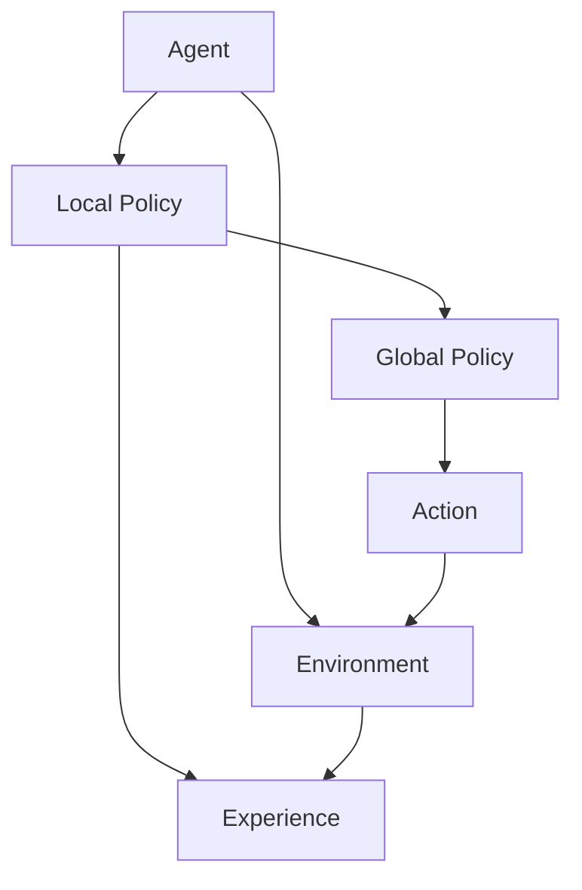

                 

### Step 1: Chapter 1 - Introduction to Federated Reinforcement Learning and Distributed AI Agent Control

#### 1.1 Background and Motivation

##### 1.1.1 Problem Background

The field of artificial intelligence (AI) has witnessed tremendous growth over the past few decades, driven by advancements in computational power, algorithm development, and the availability of large-scale data. AI applications have found their way into various domains, including healthcare, finance, manufacturing, and autonomous driving, among others. However, the complexity of real-world scenarios often requires the collaboration of multiple agents to achieve optimal performance. This has led to the emergence of distributed AI agent control as a critical research area.

Distributed AI systems consist of multiple agents that operate autonomously but work together to achieve a common goal. These agents can be embedded in various devices, such as robots, drones, or IoT devices, and they communicate with each other to make coordinated decisions. The ability to distribute the decision-making process across multiple agents offers several advantages, including improved scalability, fault tolerance, and adaptability. However, it also introduces challenges related to communication, synchronization, and the efficient coordination of agent actions.

##### 1.1.2 Problem Description

Traditional centralized control methods, where a single central authority makes decisions for all agents, may suffer from scalability issues and communication bottlenecks. As the number of agents increases, the communication overhead and the computational burden of the central authority also increase, leading to potential performance degradation. Moreover, centralized systems are vulnerable to single points of failure, as the failure of the central authority can cause the entire system to fail.

To address these challenges, researchers have explored distributed control methods that distribute the decision-making process across multiple agents. However, these methods often require agents to share their state information and decision-making processes, which may compromise privacy and security. Furthermore, distributed systems with high-dimensional state spaces and complex interactions can be challenging to design and analyze.

##### 1.1.3 Problem Solution

Federated reinforcement learning (FRL) offers a promising solution to the challenges posed by distributed AI agent control. FRL is a machine learning paradigm that combines the advantages of distributed systems and reinforcement learning (RL). In FRL, multiple agents or devices collaborate to learn a joint policy by exchanging local experiences without sharing their private data. This approach not only enables efficient coordination and decision-making in distributed systems but also maintains the privacy and security of individual agents.

The core idea behind FRL is to decompose the global decision-making problem into smaller, more manageable local problems. Each agent learns a local policy based on its own experiences and interactions with the environment. These local policies are then aggregated to form a global policy that guides the joint actions of all agents. By decentralizing the learning process, FRL reduces the communication overhead and computational burden on individual agents, making it suitable for large-scale distributed systems.

##### 1.1.4 Boundary and Scope

This chapter provides an overview of federated reinforcement learning and its applications in distributed AI agent control. It introduces the key concepts and principles of FRL, discusses the challenges and opportunities in this emerging field, and highlights the key research directions. The chapter is organized as follows:

1. **Introduction to Federated Reinforcement Learning and Distributed AI Agent Control:** This section provides an overview of the problem background, problem description, and problem solution, highlighting the advantages and challenges of FRL in distributed AI agent control.

2. **Key Concepts and Principles:** This section introduces the fundamental concepts and principles of federated reinforcement learning, including the concept of federated learning, the role of agents in FRL, and the key components of the FRL framework.

3. **Applications and Case Studies:** This section presents various applications of FRL in distributed AI agent control, covering domains such as multi-agent reinforcement learning, distributed robotics, and multi-robot systems.

4. **Challenges and Research Directions:** This section discusses the challenges and open research questions in FRL, including issues related to communication efficiency, privacy and security, and the scalability of FRL algorithms.

5. **Conclusion:** This section summarizes the main findings of the chapter and highlights the potential impact of FRL on the field of distributed AI agent control.

### 1.2 Key Concepts and Principles

#### 1.2.1 Federated Reinforcement Learning

**Concept Definition:** Federated reinforcement learning (FRL) is a machine learning paradigm that enables multiple agents or devices to collaboratively learn a joint policy while maintaining their private data and minimizing communication overhead. In FRL, each agent learns a local policy based on its own experiences and interactions with the environment. These local policies are then aggregated to form a global policy that guides the joint actions of all agents.

**Basic Architecture:** The basic architecture of FRL can be described as follows:

1. **Local Training:** Each agent maintains a local dataset and trains a local policy using local experiences. The local policy is designed to optimize the agent's performance based on its own observations and actions.
2. **Policy Aggregation:** The local policies are aggregated to form a global policy. This can be done using techniques such as centralized aggregation or decentralized aggregation. The goal is to minimize the communication overhead while ensuring that the global policy captures the joint behavior of all agents.
3. **Global Policy Deployment:** The global policy is deployed to each agent, which then uses it to make decisions in the environment. The agents continuously update their local policies based on new experiences and interactions with the environment.

**Advantages:** The key advantages of FRL include:

1. **Privacy Preservation:** FRL allows agents to maintain their private data while collaborating with other agents. This ensures that individual agents' data remain secure and confidential, which is crucial in domains where data privacy and security are paramount.
2. **Scalability:** FRL reduces the communication overhead and computational burden on individual agents, making it suitable for large-scale distributed systems with numerous agents.
3. **Robustness:** FRL enables agents to learn and adapt to the environment independently, improving the robustness of the overall system.

**Challenges:** Despite its advantages, FRL also poses several challenges:

1. **Communication Efficiency:** Efficient communication is crucial in FRL, as excessive communication can lead to performance degradation. Techniques such as model compression and efficient communication protocols need to be developed to address this challenge.
2. **Consistency and Convergence:** Ensuring that the global policy converges to an optimal solution is challenging in FRL, especially when agents have different learning rates or when the environment is dynamic. Techniques such as gradient compression and consensus algorithms need to be investigated to improve convergence properties.
3. **Privacy and Security:** FRL needs to address privacy and security concerns to ensure that agents' private data are not leaked or compromised during the learning process.

#### 1.2.2 Comparison with Traditional Reinforcement Learning

FRL is closely related to traditional reinforcement learning (RL), but it has distinct differences in terms of its approach to learning and data sharing.

**Similarities:**

1. **Learning from Experience:** Both FRL and traditional RL rely on the principle of learning from experience. Agents learn by interacting with the environment and updating their policies based on the received feedback.
2. **Policy Optimization:** Both approaches aim to optimize the policy that guides the agent's actions in the environment. In FRL, this optimization is done locally, while in traditional RL, it is typically done centrally.

**Differences:**

1. **Data Sharing:** In traditional RL, agents share their experiences and the updated policies with a central authority, which then optimizes the global policy. In FRL, agents maintain their local datasets and update their policies independently. This enables agents to maintain their privacy and reduces the communication overhead.
2. **Scalability:** Traditional RL can suffer from scalability issues when the number of agents increases, as the central authority needs to process and aggregate the experiences from all agents. FRL, on the other hand, is designed to handle large-scale distributed systems with numerous agents.
3. **Privacy and Security:** Traditional RL may raise privacy and security concerns, as agents share their experiences and updated policies with a central authority. FRL, by contrast, ensures that agents maintain their private data and minimize communication, addressing these concerns.

#### 1.2.3 Entity Relationship Diagram

To illustrate the relationship between the key concepts in FRL, we can use an ER diagram. The ER diagram represents entities (such as agents, local policies, and global policies) and their relationships (such as training, aggregation, and deployment).

In this ER diagram:

- **Agent (A):** Represents the individual agents in the distributed system.
- **Local Policy (B):** Represents the policy learned by each agent based on its own experiences.
- **Environment (C):** Represents the environment in which the agents operate.
- **Global Policy (D):** Represents the aggregated policy that guides the joint actions of all agents.
- **Experience (E):** Represents the experiences collected by agents during their interactions with the environment.
- **Action (F):** Represents the actions taken by agents based on the global policy.

#### 1.2.4 Key Components of the FRL Framework

The FRL framework consists of several key components that work together to enable collaborative learning in distributed systems. These components include:

1. **Agents:** The individual agents that operate in the distributed system. Each agent learns a local policy based on its own experiences and interactions with the environment.
2. **Local Policies:** The policies learned by each agent. These policies are optimized based on the agent's own observations and actions, and they guide the agent's decision-making process.
3. **Environment:** The environment in which the agents operate. The environment provides the state and reward signals that agents use to update their local policies.
4. **Central Authority:** A central authority that coordinates the learning process. The central authority aggregates the local policies and updates the global policy.
5. **Communication Protocol:** The protocol used for exchanging information between agents and the central authority. This protocol should minimize the communication overhead while ensuring the secure transmission of data.

### Conclusion

This chapter has introduced the concept of federated reinforcement learning and its applications in distributed AI agent control. We have discussed the problem background, problem description, and problem solution, highlighting the advantages and challenges of FRL. We have also explored the key concepts and principles of FRL, including its architecture, advantages, and challenges compared to traditional reinforcement learning. Finally, we have presented an ER diagram illustrating the relationship between the key components of the FRL framework. In the following chapters, we will delve deeper into the technical details of FRL, discuss various applications and case studies, and explore the open research questions and future directions in this emerging field.

