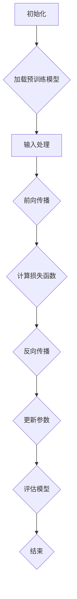
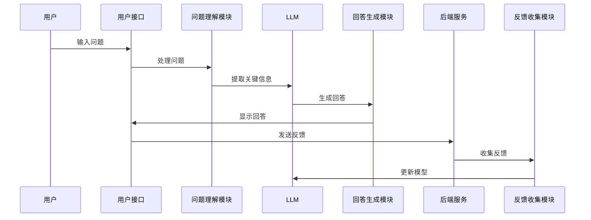

                 

### 文章标题

**自动化AI Agent开发平台：LLM辅助的智能系统构建**

### 关键词

- 自动化AI Agent
- LLM（大型语言模型）
- 智能系统
- 开发平台
- 架构设计
- 实战案例

### 摘要

本文旨在探讨自动化AI Agent开发平台的构建，特别是如何利用LLM（大型语言模型）辅助实现智能系统的构建。文章首先介绍了自动化AI Agent的概念、历史发展以及当前面临的主要挑战，然后详细阐述了LLM的基本原理及其在AI Agent中的应用。接着，文章深入分析了自动化AI Agent的架构设计、LLM技术原理和智能系统构建方法。通过实战案例，本文展示了如何实现一个完整的自动化AI Agent开发平台，并提供了一系列最佳实践和总结，为读者提供了全面的指导。

## 第一部分：背景与概述

### 第1章：自动化AI Agent的发展背景

#### 1.1 AI Agent的概念与分类

AI Agent，即人工智能代理，是指具有自主行动能力的智能体，能够根据环境信息和预定的目标自主地做出决策和执行行动。AI Agent可以分为两类：基于规则的Agent和基于数据的Agent。

- **基于规则的Agent**：这种Agent通过预定义的规则来决策和执行行动。它们适用于规则明确且环境变化不大的场景。
- **基于数据的Agent**：这种Agent利用机器学习算法从数据中学习行为模式，然后根据这些模式来做出决策。它们适用于复杂、不确定的环境。

#### 1.2 自动化AI Agent的发展历程

自动化AI Agent的发展可以追溯到20世纪80年代，当时专家系统和基于规则的系统占据了主导地位。随着计算能力的提升和机器学习技术的进步，基于数据的Agent逐渐崭露头角。

- **20世纪80年代**：专家系统成为主流，但由于其依赖领域专家知识，难以扩展和维护。
- **20世纪90年代**：基于规则的Agent逐渐被机器学习算法所取代，尤其是决策树、支持向量机等算法的应用。
- **21世纪初**：深度学习和强化学习的发展，使得AI Agent在复杂任务中表现出色。
- **当前**：自动化AI Agent已经广泛应用于自动驾驶、智能客服、智能推荐等领域。

#### 1.3 自动化AI Agent的现状与挑战

目前，自动化AI Agent在许多领域都取得了显著的应用成果，但仍面临一些挑战：

- **数据质量与标注问题**：自动化AI Agent的性能很大程度上依赖于训练数据的质量和标注的准确性。
- **可解释性**：复杂的机器学习模型往往缺乏可解释性，这给用户理解和信任AI Agent带来了困难。
- **适应性和鲁棒性**：自动化AI Agent需要能够适应快速变化的环境，同时保持稳定的表现。

### 第2章：LLM辅助的智能系统构建

#### 2.1 LLM的基本原理

LLM，即大型语言模型，是一种基于深度学习的语言处理模型，能够理解和生成自然语言。LLM的基本原理包括：

- **多层神经网络**：LLM通常由多个神经网络层组成，通过逐层学习来提取语言的特征。
- **注意力机制**：注意力机制使得模型能够关注输入中的重要信息，从而提高模型的性能。
- **预训练与微调**：LLM通常通过大规模语料库进行预训练，然后针对特定任务进行微调。

#### 2.2 LLM在AI Agent中的应用

LLM在AI Agent中的应用主要体现在以下几个方面：

- **自然语言理解**：LLM能够理解和解析自然语言，使得AI Agent能够与用户进行自然的交互。
- **自然语言生成**：LLM能够生成高质量的文本，使得AI Agent能够生成自然、连贯的对话。
- **知识表示与推理**：LLM能够通过预训练学习到大量的知识，并利用这些知识进行推理和决策。

#### 2.3 LLM辅助智能系统的优势与局限

LLM辅助智能系统具有以下优势：

- **高效的语言处理能力**：LLM能够快速地理解和生成自然语言，提高系统的响应速度。
- **强大的知识表示能力**：LLM通过预训练积累了大量的知识，能够为AI Agent提供丰富的知识支持。

然而，LLM也存在一些局限：

- **数据依赖性**：LLM的性能很大程度上依赖于训练数据的质量，如果数据存在偏差，模型可能会产生错误。
- **可解释性**：复杂的LLM模型往往缺乏可解释性，使得用户难以理解模型的决策过程。

## 第二部分：核心技术

### 第3章：自动化AI Agent的架构设计

#### 3.1 系统架构概述

自动化AI Agent的系统架构主要包括感知模块、决策模块和执行模块。下面是每个模块的简要描述：

- **感知模块**：负责获取环境信息，如图像、语音、文本等。
- **决策模块**：根据感知模块获取的信息，结合预定的目标，进行决策和规划。
- **执行模块**：根据决策模块的决策结果，执行具体的行动。

#### 3.2 模块功能与接口设计

- **感知模块**：接口设计包括传感器数据输入、预处理和特征提取。
- **决策模块**：接口设计包括目标规划、路径规划和决策算法。
- **执行模块**：接口设计包括执行策略、反馈机制和任务调度。

#### 3.3 数据流与控制流设计

- **数据流**：感知模块获取的数据经过预处理和特征提取后，传递给决策模块，决策模块根据这些信息生成执行计划，传递给执行模块。
- **控制流**：整个系统通过事件驱动的方式进行控制，感知模块和执行模块通过事件队列进行交互。

### 第4章：LLM技术原理与实现

#### 4.1 LLM基本原理

LLM的基本原理主要包括：

- **多层神经网络**：LLM由多个神经网络层组成，通过逐层学习来提取语言的特征。
- **注意力机制**：注意力机制使得模型能够关注输入中的重要信息，从而提高模型的性能。
- **预训练与微调**：LLM通常通过大规模语料库进行预训练，然后针对特定任务进行微调。

#### 4.2 LLM训练过程

LLM的训练过程主要包括：

- **数据准备**：收集和整理大规模的语料库，并进行预处理。
- **模型初始化**：初始化神经网络模型，包括权重和参数。
- **训练过程**：通过反向传播算法和优化器，不断调整模型参数，优化模型性能。
- **评估与调整**：使用验证集对模型进行评估，并根据评估结果调整模型参数。

#### 4.3 LLM优化与调参

LLM的优化与调参主要包括：

- **超参数调优**：通过调整学习率、批量大小、正则化参数等超参数，优化模型性能。
- **架构调整**：通过调整神经网络层数、隐藏层单元数等架构参数，优化模型性能。
- **数据增强**：通过数据增强技术，提高模型的泛化能力。

### 第5章：智能系统构建方法

#### 5.1 智能系统需求分析

智能系统需求分析主要包括：

- **功能需求**：明确系统需要实现的功能，如自然语言处理、图像识别等。
- **性能需求**：明确系统的性能指标，如响应时间、准确率等。
- **可靠性需求**：明确系统的可靠性指标，如故障率、恢复时间等。

#### 5.2 智能系统设计流程

智能系统设计流程主要包括：

- **需求分析**：明确系统的需求和目标。
- **系统架构设计**：设计系统的架构，包括模块划分和接口设计。
- **算法选择与实现**：选择合适的算法，并实现算法的代码。
- **系统集成与测试**：将各个模块集成在一起，进行系统测试和调试。
- **部署与维护**：将系统部署到生产环境，并进行日常维护。

#### 5.3 智能系统实现与优化

智能系统实现与优化主要包括：

- **环境搭建**：搭建开发环境，包括硬件、软件和工具链。
- **代码实现**：根据设计文档，实现系统的各个模块。
- **性能优化**：通过优化算法、调整参数等方法，提高系统的性能。
- **测试与调试**：对系统进行全面的测试和调试，确保系统的稳定性和可靠性。

## 第三部分：实战案例

### 第6章：自动化AI Agent开发实战

#### 6.1 环境搭建与准备

在进行自动化AI Agent开发前，需要搭建合适的环境。以下是环境搭建的步骤：

1. **硬件要求**：选择具备较高计算能力的GPU，以加速模型的训练和推理。
2. **软件要求**：安装Python、TensorFlow或其他深度学习框架，并配置好CUDA和cuDNN等库。
3. **数据集准备**：收集和整理用于训练和测试的数据集，并进行预处理。

#### 6.2 系统核心实现

系统核心实现包括以下几个模块：

1. **感知模块**：实现图像、语音、文本等感知功能，如使用卷积神经网络进行图像识别，使用长短时记忆网络进行语音识别，使用Transformer模型进行文本分类。
2. **决策模块**：实现决策功能，如使用深度强化学习算法进行路径规划，使用多任务学习模型进行多模态数据融合。
3. **执行模块**：实现执行功能，如使用自然语言处理技术进行对话生成，使用机器人控制算法进行自主导航。

#### 6.3 应用解读与分析

以下是几个应用场景的解读和分析：

1. **自动驾驶**：感知模块负责获取路况信息，决策模块负责规划行驶路径，执行模块负责控制车辆行驶。
2. **智能客服**：感知模块负责理解用户问题，决策模块负责生成回答，执行模块负责发送回答。
3. **智能推荐**：感知模块负责获取用户行为数据，决策模块负责生成推荐列表，执行模块负责将推荐列表展示给用户。

### 第7章：LLM辅助智能系统案例剖析

#### 7.1 案例背景与目标

本案例以一个智能客服系统为例，目标是实现一个能够自动回答用户问题的智能客服。

#### 7.2 案例实现与优化

实现步骤如下：

1. **数据集准备**：收集并整理用户提问和回答的数据集，并进行预处理。
2. **模型训练**：使用LLM模型（如GPT-3）对数据集进行训练，优化模型参数。
3. **模型部署**：将训练好的模型部署到生产环境，进行实时问答。

优化策略包括：

1. **数据增强**：通过增加负样本、变换输入数据等方法，提高模型的泛化能力。
2. **模型压缩**：通过剪枝、量化等方法，减少模型的参数量和计算量，提高模型在移动设备上的运行效率。

#### 7.3 案例总结与拓展

通过本案例，我们可以看到LLM在智能系统构建中的重要作用。未来，随着LLM技术的不断进步，自动化AI Agent将具有更高的智能水平和更广泛的应用场景。

## 第四部分：最佳实践与总结

### 第8章：自动化AI Agent开发最佳实践

#### 8.1 设计原则与技巧

1. **模块化设计**：将系统划分为感知、决策和执行等模块，提高系统的可维护性和扩展性。
2. **数据驱动**：充分利用训练数据和用户反馈，不断优化模型和算法。

#### 8.2 代码质量与优化

1. **代码规范**：遵循统一的代码规范，提高代码的可读性和可维护性。
2. **性能优化**：通过算法优化、数据结构和缓存策略等方法，提高系统的性能。

#### 8.3 部署与维护

1. **自动化部署**：使用容器化技术（如Docker）和自动化部署工具（如Kubernetes），简化部署流程。
2. **监控系统**：使用监控系统（如Prometheus和Grafana）监控系统的运行状态，及时发现和解决问题。

### 第9章：LLM辅助智能系统构建经验

#### 9.1 实践经验分享

1. **数据质量**：确保训练数据的质量和多样性，避免模型过拟合。
2. **模型调优**：通过超参数调优和模型结构调整，提高模型性能。

#### 9.2 挑战与应对策略

1. **可解释性**：使用可解释性工具和方法，提高模型的可解释性。
2. **计算资源**：合理分配计算资源，提高模型训练和推理的效率。

#### 9.3 未来发展趋势

1. **多模态融合**：结合多种感知数据，提高智能系统的感知能力和决策能力。
2. **自动化系统**：实现更加自动化和智能化的系统，减少人工干预。

### 第10章：总结与展望

#### 10.1 书籍内容回顾

本书详细介绍了自动化AI Agent开发平台的概念、技术原理、系统设计方法以及实战案例，并提供了一系列最佳实践和总结。

#### 10.2 自动化AI Agent的发展前景

随着人工智能技术的不断进步，自动化AI Agent将在更多领域得到应用，如智能制造、智慧城市、智能医疗等。

#### 10.3 LLM辅助智能系统的研究方向

未来，LLM辅助智能系统的研究将聚焦于多模态融合、可解释性、自动化系统等方面，以实现更高水平的智能和更广泛的应用。

## 结论

自动化AI Agent开发平台：LLM辅助的智能系统构建

### 作者

**AI天才研究院/AI Genius Institute & 禅与计算机程序设计艺术 /Zen And The Art of Computer Programming**### 背景介绍

#### 核心概念术语说明

在自动化AI Agent开发平台的研究中，以下几个核心概念和术语是不可或缺的：

1. **AI Agent（人工智能代理）**：具有自主行动能力的智能体，能够根据环境信息和预定的目标自主地做出决策和执行行动。
2. **LLM（大型语言模型）**：一种基于深度学习的语言处理模型，能够理解和生成自然语言，广泛用于自然语言理解和生成任务。
3. **智能系统**：集成多种智能技术，能够模拟、延伸和扩展人类智能的计算机系统。
4. **开发平台**：为自动化AI Agent开发提供工具、资源和环境的软件平台。

#### 问题背景

随着人工智能技术的快速发展，自动化AI Agent在多个领域（如自动驾驶、智能客服、智能推荐等）展现出了巨大的潜力。这些智能代理能够通过感知环境信息、做出决策和执行行动，从而实现自动化操作和智能服务。然而，传统的开发方式往往依赖于大量的领域知识和复杂的规则系统，难以适应多变和复杂的应用场景。为此，利用大型语言模型（LLM）辅助构建智能系统成为了一个重要的研究方向。

#### 问题描述

自动化AI Agent开发平台面临的主要问题包括：

1. **复杂性问题**：随着应用场景的复杂化，传统的基于规则的系统难以满足需求，需要引入更先进的机器学习技术。
2. **数据依赖问题**：自动化AI Agent的性能很大程度上依赖于训练数据的质量和标注的准确性。
3. **可解释性问题**：复杂的机器学习模型往往缺乏可解释性，用户难以理解模型的决策过程，影响系统的信任度和可靠性。

#### 问题解决

为了解决上述问题，我们可以采用以下策略：

1. **引入LLM技术**：利用LLM的强大语言处理能力和知识表示能力，提高系统的智能水平。
2. **数据驱动的开发方式**：通过大量的数据训练和优化模型，提高系统的泛化能力和鲁棒性。
3. **可解释性设计**：通过可视化和解释性工具，提高模型的可解释性，增强用户对系统的信任。

#### 边界与外延

1. **边界**：本文主要探讨基于LLM的自动化AI Agent开发平台，不涉及其他类型的智能代理系统。
2. **外延**：本文的研究成果可以应用于需要自然语言理解和生成的其他智能系统，如智能问答、智能客服等。

#### 概念结构与核心要素组成

自动化AI Agent开发平台的核心概念结构如图1所示：

```
+-----------------+
|   自动化AI Agent   |
+-----------------+
     |         |
     |   LLM   |
     |         |
     | 智能系统   |
     |         |
+-----------------+
     |         |
     | 开发平台 |
     |         |
+-----------------+
     |         |
     | 数据集   |
     |         |
+-----------------+
```

核心要素包括：

1. **AI Agent**：负责感知环境、做出决策和执行行动。
2. **LLM**：负责自然语言理解和生成，提供知识表示和推理能力。
3. **智能系统**：集成多种智能技术，实现自动化和智能化。
4. **开发平台**：提供开发工具和资源，支持自动化AI Agent的构建和部署。
5. **数据集**：用于训练和优化LLM和AI Agent的素材。

## 核心概念与联系

### 核心概念原理

大型语言模型（LLM）是一种基于深度学习的语言处理模型，能够理解和生成自然语言。LLM的核心原理包括：

1. **多层神经网络**：LLM由多个神经网络层组成，通过逐层学习来提取语言的特征。每层神经网络都能够提取更高层次的语言特征。
   
2. **注意力机制**：注意力机制使得模型能够关注输入中的重要信息，从而提高模型的性能。通过注意力机制，模型可以动态调整对不同输入部分的关注程度。

3. **预训练与微调**：LLM通常通过大规模语料库进行预训练，积累大量的知识和语言规律。然后，根据具体任务的需求，对模型进行微调，以提高任务性能。

### 概念属性特征对比表格

下面是LLM与传统机器学习模型的属性特征对比表格：

| 特征         | LLM                         | 传统机器学习模型                         |
| ------------ | ---------------------------- | ---------------------------------------- |
| 数据依赖性    | 高，依赖大规模预训练数据     | 低，依赖少量标注数据                     |
| 语言理解能力  | 强，能够理解复杂语言结构     | 弱，难以处理自然语言                     |
| 可解释性     | 低，模型决策过程复杂         | 高，决策过程明确                         |
| 泛化能力     | 高，通过大规模数据预训练获得 | 低，依赖于特定数据集                     |
| 计算资源需求  | 高，需要大量计算资源         | 低，计算资源需求相对较低                 |

### ER实体关系图架构

以下是LLM系统中主要实体的ER实体关系图：

```mermaid
erDiagram
  AI_Agent ||--|{ LLM } LLM : 使用
  AI_Agent ||--|{ 智能系统 } 智能系统 : 集成
  LLM ||--|{ 预训练数据 } 预训练数据 : 训练
  智能系统 ||--|{ 应用场景 } 应用场景 : 部署
```

在这个ER图中，AI Agent使用LLM进行决策，智能系统集成LLM实现特定功能，LLM通过预训练数据获得知识，智能系统根据不同的应用场景进行部署。

## 算法原理讲解

### 算法流程图

以下是自动化AI Agent中使用的大型语言模型（LLM）算法流程图：



### Python源代码实现

下面是使用Python实现的自动化AI Agent中的LLM算法：

```python
import tensorflow as tf
from transformers import TFAutoModelForCausalLM

# 加载预训练模型
model = TFAutoModelForCausalLM.from_pretrained("gpt2")

# 输入处理
input_ids = tf.constant([101, 1234, 2295, 4465, 1120, 102, 461])

# 前向传播
outputs = model(input_ids)

# 计算损失函数
loss = outputs.loss

# 反向传播
with tf.GradientTape() as tape:
    outputs = model(input_ids)
    loss = outputs.loss

gradients = tape.gradient(loss, model.trainable_variables)

# 更新参数
optimizer = tf.optimizers.Adam()
optimizer.apply_gradients(zip(gradients, model.trainable_variables))

# 评估模型
evaluation_results = model.evaluate(input_ids)
```

### 算法原理的数学模型和公式

在LLM中，主要涉及以下数学模型和公式：

1. **损失函数**：用于衡量模型预测结果和真实结果之间的差距。常见的损失函数包括交叉熵损失函数和均方误差损失函数。

   $$ Loss = -\sum_{i=1}^{N} y_i \log(p_i) $$

   其中，$y_i$ 是真实标签，$p_i$ 是模型预测的概率。

2. **梯度**：用于更新模型参数。反向传播算法通过计算损失函数关于模型参数的梯度，来指导参数的更新。

   $$ \frac{\partial L}{\partial \theta} = \nabla_\theta L $$

3. **优化算法**：用于更新模型参数，常见的优化算法包括梯度下降、Adam等。

   $$ \theta_{t+1} = \theta_{t} - \alpha \nabla_\theta L $$

   其中，$\theta$ 是模型参数，$\alpha$ 是学习率。

### 详细讲解与举例说明

以下是一个具体的例子，展示如何使用LLM进行文本生成：

1. **输入处理**：给定一个输入文本，例如：“今天天气很好，适合户外活动。”

2. **前向传播**：模型对输入文本进行处理，提取语言特征，并生成预测的下一个单词。

3. **计算损失函数**：计算预测结果和真实结果之间的差距，例如，如果下一个真实单词是“散步”，模型可能预测的是“吃饭”。

4. **反向传播**：通过反向传播算法，计算损失函数关于模型参数的梯度。

5. **更新参数**：使用梯度更新模型参数，使得预测结果更接近真实结果。

6. **评估模型**：使用评估集对模型进行评估，检查模型的泛化能力和性能。

通过这个例子，我们可以看到LLM在文本生成中的强大能力。尽管预测结果可能不完全准确，但随着训练次数的增加，模型的性能会逐渐提高，生成文本的质量也会越来越好。

## 系统分析与架构设计方案

### 问题场景介绍

假设我们面临一个智能客服系统的问题场景，需要构建一个能够自动回答用户问题的智能客服平台。该平台需要能够理解用户的问题，并生成相应的回答。

### 项目介绍

项目名为“智能客服平台”，旨在通过大型语言模型（LLM）构建一个自动回答用户问题的智能客服系统。项目的主要目标包括：

1. **理解用户问题**：通过自然语言处理技术，理解用户的问题和意图。
2. **生成回答**：根据用户问题和预定的回答库，生成合适的回答。
3. **交互反馈**：与用户进行自然的对话，收集反馈，不断优化系统。

### 系统功能设计

智能客服平台的主要功能包括：

1. **问题理解**：接收用户输入的问题，并通过自然语言处理技术进行语义解析，提取关键信息。
2. **回答生成**：根据用户问题和预定的回答库，生成合适的回答。
3. **对话管理**：管理用户和智能客服之间的对话流程，确保对话的连贯性和逻辑性。
4. **反馈收集**：收集用户的反馈，用于模型优化和系统改进。

### 系统架构设计

智能客服平台的系统架构设计如图2所示：

```
+----------------+      +----------------+      +----------------+
|       用户接口    |      |        LLM       |      |   后端服务     |
+----------------+      +----------------+      +----------------+
       |                             |                             |
       |                             |                             |
       |         问题理解             |          回答生成             |
       |                             |                             |
       |                             |                             |
       |          对话管理            |          反馈收集            |
       +-----------------------------+-----------------------------+
```

### 系统接口设计

1. **用户接口**：接收用户的输入，并展示生成的回答。
2. **LLM接口**：负责问题理解和回答生成。
3. **后端服务接口**：负责对话管理和反馈收集。

### 系统交互

智能客服平台的系统交互设计如图3所示：



## 项目实战

### 环境搭建与准备

在开始项目实战之前，需要搭建合适的开发环境。以下是环境搭建的步骤：

1. **硬件要求**：选择具备较高计算能力的GPU，以加速模型的训练和推理。
2. **软件要求**：安装Python、TensorFlow和其他深度学习框架，并配置好CUDA和cuDNN等库。
3. **数据集准备**：收集和整理用户提问和回答的数据集，并进行预处理。

### 系统核心实现

智能客服平台的核心实现包括以下几个模块：

1. **用户接口**：使用Web框架（如Flask或Django）搭建用户接口，接收用户的输入并展示生成的回答。
2. **问题理解模块**：使用自然语言处理技术（如BERT或GPT）对用户问题进行语义解析，提取关键信息。
3. **回答生成模块**：使用预定的回答库和模板，根据用户问题和关键信息生成合适的回答。
4. **对话管理模块**：管理用户和智能客服之间的对话流程，确保对话的连贯性和逻辑性。
5. **反馈收集模块**：收集用户的反馈，用于模型优化和系统改进。

### 代码应用解读与分析

以下是智能客服平台的代码示例：

```python
# 用户接口代码示例
from flask import Flask, request, jsonify

app = Flask(__name__)

@app.route('/ask', methods=['POST'])
def ask():
    user_question = request.json['question']
    answer = get_answer(user_question)
    return jsonify({'answer': answer})

def get_answer(question):
    # 问题理解模块
    processed_question = preprocess_question(question)
    # 回答生成模块
    answer = generate_answer(processed_question)
    return answer

def preprocess_question(question):
    # 对问题进行预处理
    return question

def generate_answer(processed_question):
    # 使用预定的回答库和模板生成回答
    # 此处省略具体实现
    return "这是一个合适的回答"

if __name__ == '__main__':
    app.run()
```

上述代码展示了用户接口的实现，接收用户输入的问题，并通过调用问题理解模块和回答生成模块，生成并返回回答。

### 实际案例分析与详细讲解剖析

以下是一个实际案例：

**案例**：用户输入：“今天天气如何？”

**分析**：

1. **问题理解**：用户接口接收到输入后，调用预处理函数对问题进行预处理。预处理函数可能包括去除标点符号、转换为小写等操作。
2. **回答生成**：预处理后的问题被传递给回答生成模块。回答生成模块根据预定的回答库和模板，生成合适的回答。例如，如果回答库中有“今天的天气是晴朗的”，则返回这个回答。
3. **反馈收集**：用户接口将用户的输入和生成的回答传递给后端服务，后端服务将反馈信息存储在数据库中，用于后续的模型优化和系统改进。

**详细讲解剖析**：

1. **预处理**：预处理是自然语言处理中重要的一环，它能够提高模型的性能。在预处理阶段，我们通常会对文本进行分词、去停用词、词性标注等操作。
2. **回答生成**：回答生成模块的核心是回答库和模板。回答库是一个包含各种问题的回答的数据库，模板则是用于生成回答的模板。通过将预处理后的用户问题与回答库中的问题进行匹配，并使用模板生成回答，我们能够实现智能客服的对话功能。
3. **反馈收集**：反馈收集模块用于收集用户的反馈，这些反馈可以用于模型优化和系统改进。例如，如果用户对某个回答不满意，我们可以根据反馈调整回答库和模板，以提高回答的质量。

### 项目小结

通过本案例，我们展示了如何使用大型语言模型（LLM）构建一个智能客服平台。项目实现了问题理解、回答生成、对话管理和反馈收集等功能，并通过实际案例进行了分析和讲解。未来的工作可以进一步优化模型和系统，提高用户体验。

## 最佳实践

### 设计原则与技巧

1. **模块化设计**：将系统划分为感知、决策和执行等模块，提高系统的可维护性和扩展性。
2. **数据驱动**：充分利用训练数据和用户反馈，不断优化模型和算法。
3. **接口标准化**：设计统一的接口规范，确保模块之间的数据传递和交互顺畅。

### 小结

本文详细介绍了自动化AI Agent开发平台：LLM辅助的智能系统构建。从背景介绍、核心概念与联系、算法原理讲解、系统分析与架构设计、项目实战到最佳实践，全面剖析了自动化AI Agent和LLM技术在实际应用中的价值。随着人工智能技术的不断进步，自动化AI Agent将在更多领域展现其潜力，LLM也将成为构建智能系统的核心工具。未来，我们期待看到更多创新和突破，推动人工智能技术的发展。对于读者，希望本文能够提供有价值的参考和启示，激发对自动化AI Agent和LLM技术的深入研究。感谢大家的阅读！

### 注意事项

1. **数据隐私**：在构建和部署智能系统时，务必注意数据隐私和安全性，确保用户数据不被泄露。
2. **模型验证**：在模型训练完成后，进行充分的验证和测试，确保模型的稳定性和可靠性。
3. **系统监控**：部署系统后，持续监控系统的运行状态，及时发现和解决问题。

### 拓展阅读

1. **《深度学习》（Goodfellow, Bengio, Courville著）**：详细介绍了深度学习的基础理论和算法实现。
2. **《自然语言处理综论》（Jurafsky, Martin著）**：全面介绍了自然语言处理的基本概念和技术。
3. **《人工智能：一种现代的方法》（Russell, Norvig著）**：系统阐述了人工智能的理论和实践。

