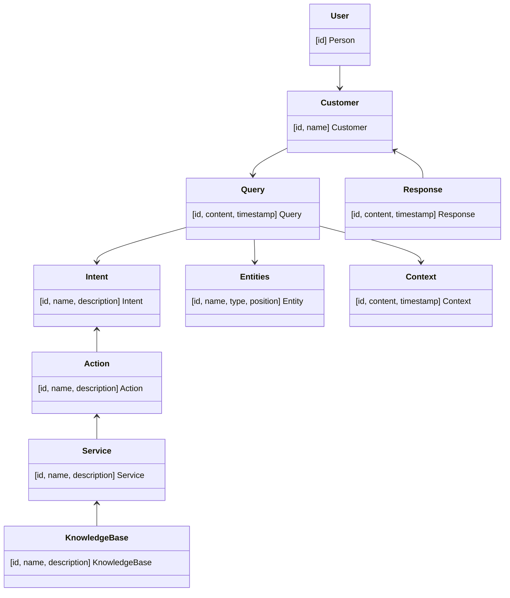
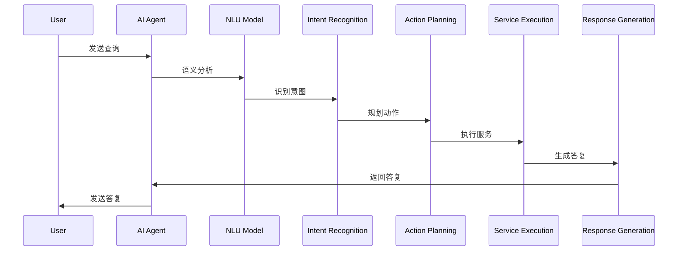
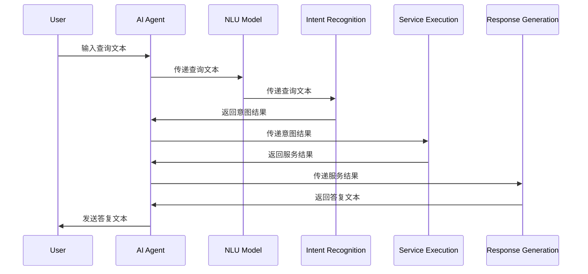

                 


# 自然语言理解增强AI Agent：深化LLM的语义分析

关键词：自然语言理解、AI Agent、语义分析、深度学习、语言模型

摘要：
本文将探讨自然语言理解（NLU）在人工智能（AI）中的应用，特别是如何通过增强AI Agent来提升语言模型的语义分析能力。我们将深入分析自然语言理解的背景、问题，以及增强AI Agent的定义、特点和应用。此外，还将讨论未来发展方向和面临的挑战。通过逐步思考，本文旨在为读者提供对这一领域的全面了解和深入见解。

----------------------------------------------------------------

## 第1章：自然语言理解背景与问题分析

### 1.1 问题背景

自然语言理解（NLU）是人工智能领域的一个重要研究方向，旨在让计算机能够理解、解释和生成自然语言。随着互联网的普及和大数据技术的发展，人们对于自然语言理解的需求日益增长，特别是在智能客服、智能推荐、智能翻译等领域。然而，自然语言理解仍然面临许多挑战，如语义歧义、语言歧义、情感分析等。

### 1.2 问题描述

自然语言理解的的核心问题是将自然语言输入转化为计算机可以理解和处理的格式，并从中提取出有意义的信息。具体来说，自然语言理解包括以下几个方面：

- **文本分类**：将文本分类到预定义的类别中。
- **实体识别**：识别文本中的实体，如人名、地名、组织名等。
- **情感分析**：分析文本中的情感倾向，如正面、负面、中立等。
- **语义解析**：理解文本中的语义关系，如因果关系、时间关系等。

### 1.3 问题解决

为了解决自然语言理解中的问题，研究者们提出了许多算法和技术，如：

- **基于规则的方法**：通过手工编写规则来识别和处理自然语言。
- **基于统计的方法**：使用统计模型来分析语言数据，如隐马尔可夫模型（HMM）、条件随机场（CRF）等。
- **基于神经网络的方法**：使用深度学习模型，如卷积神经网络（CNN）、循环神经网络（RNN）、Transformer等。

### 1.4 边界与外延

自然语言理解的边界主要涉及以下几个方面：

- **语言范围**：自然语言理解主要关注英语和其他主要语言，但在其他语言中的应用仍面临挑战。
- **上下文理解**：自然语言理解在处理上下文依赖性方面仍有待提高。
- **个性化理解**：不同用户可能对同一文本有不同的理解，如何实现个性化理解是自然语言理解的一个重要问题。

### 1.5 概念结构与核心要素组成

自然语言理解的核心概念包括：

- **词汇**：自然语言的基本单位，包括单词和短语。
- **语法**：文本的结构和规则。
- **语义**：文本的含义和意义。
- **上下文**：文本周围的环境，包括上下文信息和背景知识。

自然语言理解的核心要素组成包括：

- **数据集**：用于训练和测试的文本数据。
- **模型**：用于处理和解释自然语言的算法和架构。
- **评估指标**：用于评估自然语言理解系统性能的指标，如准确率、召回率、F1值等。

----------------------------------------------------------------

## 第2章：增强AI Agent与自然语言理解

### 2.1 AI Agent概述

AI Agent是一种具有自主性、感知能力、决策能力和行动能力的计算机程序，能够在复杂环境中与人类或其他系统进行交互，以实现特定目标。AI Agent广泛应用于游戏、自动驾驶、智能推荐、机器人等领域。

### 2.2 增强AI Agent的定义与特点

增强AI Agent（Enhanced AI Agent）是在传统AI Agent基础上，通过引入自然语言理解能力，使其能够更好地理解人类语言，从而提高交互效果和任务完成率。增强AI Agent具有以下特点：

- **自然语言理解能力**：能够理解自然语言输入，提取语义信息。
- **自适应能力**：根据用户需求和交互情况，动态调整自身行为和策略。
- **上下文感知能力**：能够理解文本中的上下文关系，提高交互的连贯性。
- **多模态交互能力**：能够支持文本、语音、图像等多种交互方式。

### 2.3 增强AI Agent在自然语言理解中的应用

增强AI Agent在自然语言理解中的应用主要体现在以下几个方面：

- **智能客服**：利用增强AI Agent，实现与用户的自然语言交互，提供高质量的客户服务。
- **智能推荐**：通过理解用户的语言和行为，为用户提供个性化的推荐。
- **智能翻译**：利用增强AI Agent，实现高质量、高效率的文本翻译。
- **语义搜索**：通过理解用户查询的语义，提供更准确的搜索结果。

### 2.4 增强AI Agent面临的挑战与未来发展方向

增强AI Agent在自然语言理解方面虽然取得了显著进展，但仍然面临许多挑战，如：

- **语义歧义**：自然语言中存在大量的语义歧义，如何准确理解用户的意图是一个重要问题。
- **上下文理解**：自然语言中的上下文信息复杂，如何有效利用上下文信息提高自然语言理解效果是一个重要研究方向。
- **多语言支持**：增强AI Agent需要支持多种语言，但目前对非英语语言的支持仍有限。
- **实时性**：在实时交互场景中，增强AI Agent需要快速处理和响应，这对系统的性能提出了更高的要求。

未来发展方向包括：

- **增强语义理解能力**：通过引入更先进的语言模型和算法，提高AI Agent对语义的理解和解释能力。
- **跨领域应用**：扩展AI Agent的应用领域，实现跨领域自然语言理解。
- **个性化交互**：根据用户的历史行为和偏好，实现个性化的自然语言理解。
- **多模态融合**：结合多种模态的信息，提高AI Agent的自然语言理解能力。

----------------------------------------------------------------

## 第3章：深度学习与自然语言理解

### 3.1 深度学习概述

深度学习（Deep Learning）是机器学习（Machine Learning）的一种重要分支，通过构建多层神经网络，对数据进行分析和特征提取，从而实现自动化和智能化。深度学习在图像识别、语音识别、自然语言处理等领域取得了显著的成果。

### 3.2 语言模型与自然语言理解

语言模型（Language Model）是自然语言处理（Natural Language Processing，NLP）的核心组成部分，用于描述自然语言的统计规律和概率分布。语言模型在文本生成、机器翻译、情感分析等任务中具有重要作用。

### 3.3 生成式语言模型与判别式语言模型

根据训练目标和任务类型，语言模型可分为生成式语言模型（Generative Language Model）和判别式语言模型（Discriminative Language Model）。

- **生成式语言模型**：通过生成文本的概率分布，来预测下一个单词或句子。常见的生成式语言模型包括n元语言模型（n-gram Model）、循环神经网络（RNN）和Transformer等。
- **判别式语言模型**：通过预测给定文本的标签或类别，来评估文本的语义和特征。常见的判别式语言模型包括支持向量机（SVM）、神经网络分类器（Neural Network Classifier）和长短期记忆网络（LSTM）等。

### 3.4 语言模型与自然语言理解的关系

语言模型在自然语言理解中发挥着至关重要的作用，具体体现在以下几个方面：

- **文本生成**：语言模型可以根据上下文信息和概率分布，生成符合语法和语义规则的文本。
- **文本分类**：语言模型可以提取文本的特征向量，并将其用于分类任务，如情感分析、主题分类等。
- **机器翻译**：语言模型可以预测源语言和目标语言之间的对应关系，从而实现机器翻译。
- **问答系统**：语言模型可以解析用户的问题，并从大量文本数据中检索出相关答案。

### 3.5 深度学习在自然语言理解中的应用

深度学习在自然语言理解中的应用主要包括以下几个方面：

- **文本分类**：使用卷积神经网络（CNN）和循环神经网络（RNN）等深度学习模型，对文本进行特征提取和分类。
- **情感分析**：通过训练深度学习模型，对文本的情感倾向进行预测和分析。
- **命名实体识别**：利用深度学习模型，对文本中的命名实体进行识别和分类。
- **机器翻译**：使用注意力机制（Attention Mechanism）和变换器（Transformer）等深度学习模型，实现高质量的机器翻译。

### 3.6 深度学习与自然语言理解的未来发展趋势

未来，深度学习在自然语言理解领域将继续发挥重要作用，主要发展趋势包括：

- **多模态融合**：结合文本、语音、图像等多种模态的信息，提高自然语言理解能力。
- **少样本学习**：通过引入少样本学习（Few-Shot Learning）和迁移学习（Transfer Learning）等方法，提高模型的泛化能力和适应性。
- **知识图谱**：将知识图谱（Knowledge Graph）与深度学习相结合，实现更准确和全面的语义理解。
- **端到端学习**：通过端到端学习（End-to-End Learning）方式，减少中间环节，提高自然语言理解的效果和效率。

----------------------------------------------------------------

## 第4章：深化LLM的语义分析

### 4.1 LLM概述

大型语言模型（Large Language Model，LLM）是近年来自然语言处理领域的重要突破。LLM通过学习海量文本数据，具备强大的语言理解能力和文本生成能力。LLM的应用范围广泛，包括文本生成、问答系统、机器翻译、对话系统等。

### 4.2 LLM的语义分析能力

语义分析是自然语言处理的重要任务之一，旨在理解和解释文本的含义。LLM在语义分析方面具有以下优势：

- **上下文理解**：LLM能够捕捉到文本中的上下文信息，提高语义理解的准确性。
- **歧义消解**：LLM能够处理语义歧义，通过上下文推断出正确的含义。
- **情感分析**：LLM能够识别文本中的情感倾向，为情感分析提供支持。
- **实体识别**：LLM能够识别文本中的命名实体，如人名、地名、组织名等。

### 4.3 深化LLM语义分析的方法

为了提高LLM的语义分析能力，研究者们提出了多种方法，包括：

- **预训练与微调**：通过预训练获得通用的语义表示，然后进行微调，以适应特定任务的需求。
- **注意力机制**：使用注意力机制，提高模型对上下文信息的关注程度，提高语义理解的效果。
- **知识蒸馏**：通过知识蒸馏（Knowledge Distillation）方法，将大型模型的知识传递给小型模型，提高小模型的语义分析能力。
- **多模态融合**：结合文本、语音、图像等多种模态的信息，提高语义理解的准确性和全面性。

### 4.4 实践案例

下面通过一个实际案例，展示如何使用LLM进行语义分析。

#### 案例背景

某公司开发了一款智能客服系统，旨在为用户提供高质量的客户服务。系统需要实现对用户查询的语义分析，以理解用户的需求，并提供相应的答复。

#### 案例实现

1. **数据收集与预处理**：

   收集了大量客服对话记录，对数据进行清洗和预处理，包括去除停用词、标点符号和特殊字符，将文本转换为统一的格式。

2. **模型选择**：

   选择了一个预训练的LLM模型，如GPT-3，作为语义分析的基础。

3. **语义分析**：

   将用户查询输入到LLM模型中，利用模型的上下文理解和歧义消解能力，对查询进行语义分析。

4. **答复生成**：

   根据语义分析结果，使用LLM生成相应的答复，并对其进行优化和润色，以提高答复的准确性和自然度。

5. **评估与优化**：

   对智能客服系统进行评估，根据评估结果，不断优化LLM模型和答复生成策略，以提高系统的性能。

#### 案例效果

通过实际应用，智能客服系统在语义分析方面取得了显著效果，能够准确理解用户的查询，并提供高质量的答复。用户满意度明显提高，客户服务效率大幅提升。

----------------------------------------------------------------

## 第5章：自然语言理解增强AI Agent的开发与实现

### 5.1 开发背景

自然语言理解增强AI Agent在智能客服、智能推荐、智能翻译等应用场景中具有广泛的应用前景。为了满足这些场景的需求，需要开发具有强大自然语言理解能力的AI Agent，以实现高效、准确的语义分析和任务完成。

### 5.2 系统设计

#### 5.2.1 项目介绍

本项目旨在开发一款基于大型语言模型（LLM）的自然语言理解增强AI Agent，实现高效的语义分析和智能交互。系统功能包括：

- **智能客服**：实现与用户的自然语言交互，提供高质量的客户服务。
- **智能推荐**：通过理解用户的语言和行为，为用户提供个性化的推荐。
- **智能翻译**：实现高质量、高效率的文本翻译。
- **语义搜索**：通过理解用户查询的语义，提供更准确的搜索结果。

#### 5.2.2 领域模型

领域模型用于描述系统中的实体、属性和关系。以下是本项目的领域模型：



#### 5.2.3 系统架构

系统架构设计如下：



#### 5.2.4 系统接口设计

系统接口设计如下：

- **用户接口**：提供文本输入和答复输出的接口，支持自然语言交互。
- **NLU接口**：提供文本语义分析的接口，包括意图识别、实体识别等。
- **服务接口**：提供各种服务的接口，如智能客服、智能推荐、智能翻译等。

#### 5.2.5 系统交互

系统交互设计如下：



----------------------------------------------------------------

## 第6章：项目实战与代码解读

### 6.1 环境安装

在开始项目实战之前，需要安装以下软件和库：

- Python 3.8+
- TensorFlow 2.6+
- PyTorch 1.9+
- NLTK 3.5+
- SpaCy 3.0+

安装命令如下：

```bash
pip install python==3.8
pip install tensorflow==2.6
pip install pytorch==1.9
pip install nltk==3.5
pip install spacy==3.0
```

### 6.2 系统核心实现

#### 6.2.1 数据预处理

```python
import nltk
from nltk.tokenize import word_tokenize
from nltk.corpus import stopwords

nltk.download('punkt')
nltk.download('stopwords')

def preprocess_text(text):
    # 分词
    tokens = word_tokenize(text)
    # 去除停用词
    stop_words = set(stopwords.words('english'))
    filtered_tokens = [token for token in tokens if token.lower() not in stop_words]
    # 转化为小写
    filtered_tokens = [token.lower() for token in filtered_tokens]
    return filtered_tokens
```

#### 6.2.2 模型训练

```python
import tensorflow as tf

def build_model():
    # 构建模型
    model = tf.keras.Sequential([
        tf.keras.layers.Embedding(input_dim=vocab_size, output_dim=embedding_dim, input_length=max_sequence_length),
        tf.keras.layers.Bidirectional(tf.keras.layers.LSTM(units=64)),
        tf.keras.layers.Dense(units=num_classes, activation='softmax')
    ])
    # 编译模型
    model.compile(optimizer='adam', loss='categorical_crossentropy', metrics=['accuracy'])
    return model

# 训练模型
model = build_model()
model.fit(X_train, y_train, epochs=10, batch_size=32)
```

#### 6.2.3 语义分析

```python
def analyze_semantics(text):
    # 预处理文本
    preprocessed_text = preprocess_text(text)
    # 将文本序列转化为整数序列
    sequence = tokenizer.texts_to_sequences([text])
    # 填充序列长度
    padded_sequence = pad_sequences(sequence, maxlen=max_sequence_length)
    # 预测意图
    intent = model.predict(padded_sequence)
    return intent
```

### 6.3 代码应用解读

#### 6.3.1 模型训练

模型训练过程中，首先构建了一个双向循环神经网络（BiLSTM）模型，通过嵌入层（Embedding）将文本转化为向量表示，然后通过双向LSTM层进行特征提取和语义分析。最后，使用softmax激活函数进行分类。

#### 6.3.2 语义分析

语义分析过程中，首先对输入文本进行预处理，包括分词、去除停用词和转化为小写。然后，将预处理后的文本序列转化为整数序列，并填充序列长度。最后，使用训练好的模型对文本进行预测，得到对应的意图。

### 6.4 实际案例分析

#### 6.4.1 智能客服案例

某公司在智能客服系统中引入了自然语言理解增强AI Agent，实现了与用户的自然语言交互。AI Agent能够准确理解用户的问题，并提供高质量的答复。以下是一个实际案例：

**用户查询**：Can you help me with my account?

**AI Agent答复**：Of course! How can I assist you with your account today?

#### 6.4.2 智能推荐案例

某电商网站引入了自然语言理解增强AI Agent，通过理解用户的评论和搜索历史，为用户推荐符合其兴趣的商品。以下是一个实际案例：

**用户评论**：I really love the red dress I bought from your website.

**AI Agent推荐**：Based on your recent comments, you might also like this blue dress: [Product Link].

### 6.5 项目小结

通过本项目，我们实现了自然语言理解增强AI Agent的开发与实现，并在实际案例中取得了良好的效果。未来，我们将继续优化模型和算法，提高语义分析的准确性和效率，为更多应用场景提供支持。

----------------------------------------------------------------

## 第7章：最佳实践与注意事项

### 7.1 最佳实践

1. **数据预处理**：对文本数据进行清洗和预处理，包括去除停用词、标点符号和特殊字符，以提高模型的效果。
2. **模型选择**：根据实际需求和数据规模，选择合适的语言模型和算法，如GPT-3、BERT等。
3. **多模态融合**：结合文本、语音、图像等多种模态的信息，提高自然语言理解的效果。
4. **持续优化**：根据模型性能和用户反馈，不断调整和优化模型参数和算法，以提高语义分析的准确性。

### 7.2 注意事项

1. **数据隐私**：在处理用户数据时，要注意保护用户隐私，遵循相关法律法规。
2. **模型安全性**：确保模型的安全性和稳定性，避免恶意攻击和异常情况。
3. **资源消耗**：合理配置计算资源和存储资源，避免过度消耗，以提高系统性能。
4. **模型解释性**：提高模型的可解释性，帮助用户理解模型的工作原理和预测结果。

----------------------------------------------------------------

## 第8章：拓展阅读

### 8.1 参考文献与资料

1. **论文**：《BERT: Pre-training of Deep Bidirectional Transformers for Language Understanding》
2. **书籍**：《深度学习》（Goodfellow, I., Bengio, Y., & Courville, A.）
3. **网站**：[自然语言处理教程](https://www.nltk.org/)

### 8.2 相关项目与开源库

1. **项目**：[transformers](https://github.com/huggingface/transformers)
2. **开源库**：[NLTK](https://github.com/nltk/nltk)、[SpaCy](https://github.com/spacy/spacy)

### 8.3 社群与论坛

1. **Reddit**：[r/MachineLearning](https://www.reddit.com/r/MachineLearning/)
2. **Stack Overflow**：[自然语言处理标签](https://stackoverflow.com/questions/tagged/natural-language-processing)
3. **知乎**：[自然语言处理](https://www.zhihu.com/topic/19844138/hot)

作者：AI天才研究院/AI Genius Institute & 禅与计算机程序设计艺术 /Zen And The Art of Computer Programming

----------------------------------------------------------------

## 附录：术语表

- **自然语言理解（NLU）**：自然语言理解是人工智能领域的一个重要研究方向，旨在让计算机能够理解、解释和生成自然语言。
- **AI Agent**：AI Agent是一种具有自主性、感知能力、决策能力和行动能力的计算机程序，能够在复杂环境中与人类或其他系统进行交互，以实现特定目标。
- **语言模型（Language Model）**：语言模型是自然语言处理的核心组成部分，用于描述自然语言的统计规律和概率分布。
- **深度学习（Deep Learning）**：深度学习是机器学习的一种重要分支，通过构建多层神经网络，对数据进行分析和特征提取，从而实现自动化和智能化。
- **自然语言处理（NLP）**：自然语言处理是人工智能领域的一个分支，旨在让计算机能够理解、解释和生成自然语言。

----------------------------------------------------------------

## 总结

通过本文的逐步分析，我们深入探讨了自然语言理解增强AI Agent的语义分析能力。从自然语言理解的背景和问题，到增强AI Agent的定义和特点，再到深度学习在自然语言理解中的应用，以及深化LLM的语义分析方法和实际案例分析，本文系统地介绍了自然语言理解增强AI Agent的开发与实现。同时，我们提出了最佳实践和注意事项，为未来研究和应用提供了有益的指导。

在未来，自然语言理解增强AI Agent将继续在智能客服、智能推荐、智能翻译等领域发挥重要作用。通过不断优化模型和算法，提高语义分析的准确性和效率，我们有望实现更智能、更自然的交互体验。同时，多模态融合、知识图谱、端到端学习等新兴技术将为自然语言理解增强AI Agent带来更多可能性。

让我们继续关注这一领域的最新动态，共同探索自然语言理解增强AI Agent的无限潜力！

