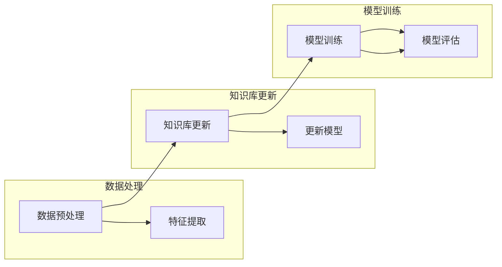

                 


# 自适应学习AI Agent：LLM的动态知识结构调整

> 关键词：自适应学习，AI Agent，LLM，动态知识结构调整，人工智能

> 摘要：本文将深入探讨自适应学习AI Agent的概念，重点分析LLM的动态知识结构调整方法，通过具体的算法原理讲解、系统分析与架构设计、实战案例分享，为读者提供全面的技术指南。

## 目录大纲

1. **第一部分：背景介绍**
   - 1.1 自适应学习AI Agent概述
     - 1.1.1 发展现状与挑战
     - 1.1.2 应用领域与局限性
   - 1.2 LLM的动态知识结构调整
     - 1.2.1 基本概念
     - 1.2.2 边界与外延
     - 1.2.3 核心要素组成

2. **第二部分：核心概念与联系**
   - 2.1 自适应学习原理
   - 2.2 概念属性特征对比表格
   - 2.3 ER实体关系图架构

3. **第三部分：算法原理讲解**
   - 3.1 动态知识调整算法原理
   - 3.2 Mermaid流程图
   - 3.3 Python源代码
   - 3.4 数学模型和公式
   - 3.5 举例说明

4. **第四部分：系统分析与架构设计方案**
   - 4.1 问题场景介绍
   - 4.2 项目介绍
   - 4.3 系统功能设计
   - 4.4 系统架构设计
   - 4.5 系统接口设计和系统交互

5. **第五部分：项目实战**
   - 5.1 环境安装
   - 5.2 系统核心实现源代码
   - 5.3 代码应用解读与分析
   - 5.4 实际案例分析和详细讲解剖析
   - 5.5 项目小结

6. **第六部分：最佳实践与拓展阅读**
   - 6.1 最佳实践
   - 6.2 小结
   - 6.3 注意事项
   - 6.4 拓展阅读

----------------------------------------------------------------

## 第一部分：背景介绍

### 1.1 自适应学习AI Agent概述

#### 1.1.1 发展现状与挑战

自适应学习AI Agent是一种能够根据环境变化和反馈调整自身行为的智能体。随着人工智能技术的快速发展，自适应学习AI Agent在众多领域得到了广泛应用，如智能客服、自动驾驶、智能推荐系统等。然而，其发展也面临诸多挑战。

首先，环境变化的不确定性和复杂性使得AI Agent需要具备强大的学习能力和适应性。其次，大量数据和模型训练的需求对计算资源和时间提出了高要求。此外，如何保证AI Agent的行为安全和符合伦理标准也是亟待解决的问题。

#### 1.1.2 应用领域与局限性

自适应学习AI Agent在多个领域展现出了巨大的潜力。在智能客服领域，AI Agent可以根据用户的历史交互记录和当前需求，提供个性化服务，提高用户满意度。在自动驾驶领域，AI Agent需要实时感知道路环境，并根据环境变化做出正确的决策，确保行车安全。

然而，自适应学习AI Agent的应用也受到一定的局限性。首先，AI Agent的训练数据质量和数量对模型的性能有着重要影响。其次，AI Agent的决策过程往往需要大量计算资源，这在资源受限的环境下可能无法满足需求。最后，AI Agent的可靠性和鲁棒性也需要进一步验证。

### 1.2 LLM的动态知识结构调整

#### 1.2.1 基本概念

大型语言模型（LLM）是一种基于深度学习的技术，能够对自然语言进行理解和生成。LLM的动态知识结构调整是指模型能够根据新的数据或任务动态调整其知识库，以提高其适应性和性能。

动态知识结构调整的关键在于如何高效地更新模型的知识库，同时保证模型的一致性和稳定性。这涉及到一系列技术问题，如知识库的表示、知识的更新策略和模型的可解释性等。

#### 1.2.2 边界与外延

在讨论LLM的动态知识结构调整时，我们需要明确一些边界和范围。首先，我们主要关注的是大型语言模型，而非其他类型的模型。其次，本文主要探讨基于深度学习的动态知识调整方法，而非其他机器学习方法。

此外，动态知识结构调整的应用范围包括但不限于智能客服、自动驾驶、智能推荐等领域。这些领域对AI Agent的适应性和知识更新能力有着较高的要求，因此动态知识结构调整具有重要的研究价值。

#### 1.2.3 核心要素组成

LLM的动态知识结构调整由以下几个核心要素组成：

1. **知识库**：知识库是LLM的基础，包含大量的文本数据、实体信息、关系和语义知识等。知识库的构建和质量直接影响模型的表现。

2. **更新策略**：更新策略是指如何根据新的数据和任务动态调整知识库的方法。常见的更新策略包括增量学习、迁移学习和在线学习等。

3. **模型架构**：模型架构是指LLM的底层结构，如Transformer、BERT等。不同的模型架构对知识更新的效率和效果有着重要影响。

4. **评估指标**：评估指标用于衡量动态知识结构调整的效果，如准确率、召回率、F1值等。通过评估指标，我们可以判断知识更新的效果和模型的表现。

5. **解释性**：解释性是指模型的行为和决策过程能够被理解和解释的能力。在动态知识结构调整中，解释性有助于提高模型的透明度和可信度。

## 第二部分：核心概念与联系

### 2.1 自适应学习原理

自适应学习是一种机器学习方法，旨在使模型能够根据新的数据和任务动态调整其参数和知识。其基本原理如下：

1. **反馈机制**：模型通过接收环境反馈，了解自身的表现和偏差，从而调整参数。
2. **增量学习**：模型在新的数据和任务中只更新部分参数，而不是重新训练整个模型。
3. **迁移学习**：模型利用已有知识解决新的任务，从而减少训练时间和资源需求。

### 2.2 概念属性特征对比表格

下面是一个简单的概念属性特征对比表格，用于展示不同自适应学习方法的特点：

| 方法 | 特点 |
| --- | --- |
| 增量学习 | 只更新部分参数，减少训练时间 |
| 迁移学习 | 利用已有知识解决新任务 |
| 在线学习 | 实时更新模型，提高适应性 |

### 2.3 ER实体关系图架构

下面是一个ER实体关系图架构的示例，用于展示自适应学习系统中各实体之间的关系：

```mermaid
erDiagram
  User ||--|{ AI-Agent : controls |
  Data ||--|{ Knowledge-Base : stores |
  Task ||--|{ Model : processes |
  AI-Agent ||--|{ Feedback-System : evaluates |
```

## 第三部分：算法原理讲解

### 3.1 动态知识调整算法原理

动态知识调整算法的核心目标是根据新的数据和任务动态更新模型的知识库，从而提高模型的适应性和性能。其基本原理如下：

1. **数据预处理**：对新的数据进行清洗、预处理和特征提取。
2. **知识库更新**：根据新的数据，动态更新模型的知识库，包括实体、关系和语义信息。
3. **模型训练**：使用更新后的知识库重新训练模型。
4. **模型评估**：评估更新后的模型的性能，并根据评估结果进行进一步的调整。

### 3.2 Mermaid流程图

下面是一个动态知识调整算法的Mermaid流程图示例：



### 3.3 Python源代码

下面是一个简单的Python代码示例，用于实现动态知识调整算法：

```python
import tensorflow as tf
from sklearn.model_selection import train_test_split

# 数据预处理
def preprocess_data(data):
    # 清洗、预处理和特征提取
    return processed_data

# 知识库更新
def update_knowledge_base(data, knowledge_base):
    # 根据新数据更新知识库
    return updated_knowledge_base

# 模型训练
def train_model(knowledge_base):
    # 使用更新后的知识库训练模型
    model = tf.keras.Sequential([
        tf.keras.layers.Dense(128, activation='relu', input_shape=(input_shape,)),
        tf.keras.layers.Dense(1, activation='sigmoid')
    ])

    model.compile(optimizer='adam', loss='binary_crossentropy', metrics=['accuracy'])
    model.fit(x_train, y_train, epochs=10)
    return model

# 模型评估
def evaluate_model(model, x_test, y_test):
    # 使用更新后的模型评估性能
    loss, accuracy = model.evaluate(x_test, y_test)
    return loss, accuracy

# 主函数
def main():
    data = preprocess_data(raw_data)
    knowledge_base = load_knowledge_base()
    updated_knowledge_base = update_knowledge_base(data, knowledge_base)
    model = train_model(updated_knowledge_base)
    loss, accuracy = evaluate_model(model, x_test, y_test)
    print("Model accuracy:", accuracy)

if __name__ == "__main__":
    main()
```

### 3.4 数学模型和公式

动态知识调整算法中的数学模型主要包括两部分：知识库更新和模型训练。下面是两个相关的数学公式：

1. **知识库更新公式**：
   $$
   \text{updated\_knowledge} = \alpha \cdot \text{new\_data} + (1 - \alpha) \cdot \text{original\_knowledge}
   $$
   其中，$\alpha$ 是更新系数，用于控制新数据和原有知识的权重。

2. **模型训练损失函数**：
   $$
   L = \frac{1}{N} \sum_{i=1}^{N} (-y_i \cdot \log(\hat{y}_i) - (1 - y_i) \cdot \log(1 - \hat{y}_i))
   $$
   其中，$N$ 是样本数量，$y_i$ 是实际标签，$\hat{y}_i$ 是预测概率。

### 3.5 举例说明

假设我们有一个分类问题，需要根据新的数据动态调整模型的知识库，并评估更新后的模型性能。

1. **数据预处理**：
   - 加载原始数据集，并进行清洗、预处理和特征提取。
   - 将数据集分为训练集和测试集。

2. **知识库更新**：
   - 使用新数据更新知识库，包括实体、关系和语义信息。
   - 将更新后的知识库用于训练模型。

3. **模型训练**：
   - 使用更新后的知识库训练模型，并评估模型性能。
   - 如果模型性能不佳，可以进一步调整更新策略或模型参数。

4. **模型评估**：
   - 使用测试集评估更新后的模型性能，如准确率、召回率和F1值等。

通过上述步骤，我们可以实现动态知识调整算法，并提高模型在分类问题上的性能。

## 第四部分：系统分析与架构设计方案

### 4.1 问题场景介绍

在一个智能客服系统中，AI Agent需要根据用户的历史交互记录和当前需求，提供个性化的服务。为了实现这一目标，AI Agent需要具备自适应学习能力和动态知识结构调整功能。

### 4.2 项目介绍

本项目旨在设计一个自适应学习AI Agent，能够根据用户交互记录和实时反馈，动态调整其知识库，提高智能客服系统的服务质量和用户满意度。

### 4.3 系统功能设计

系统功能设计主要包括以下几个方面：

1. **用户交互管理**：收集用户交互记录，包括用户提问、回答和历史交互记录等。
2. **知识库管理**：存储和管理AI Agent的知识库，包括实体、关系和语义信息等。
3. **自适应学习能力**：实现AI Agent的自适应学习功能，包括数据预处理、知识库更新、模型训练和模型评估等。
4. **服务质量管理**：评估AI Agent的服务质量，包括准确率、召回率和用户满意度等。

### 4.4 系统架构设计

系统架构设计主要包括以下几个层次：

1. **数据层**：存储和管理用户交互记录和知识库。
2. **服务层**：提供用户交互管理和自适应学习功能。
3. **应用层**：实现智能客服系统的核心功能，如自动回答问题和提供个性化服务。
4. **接口层**：提供与外部系统（如客户关系管理系统）的接口，实现数据交换和功能集成。

### 4.5 系统接口设计和系统交互

系统接口设计和系统交互主要包括以下几个方面：

1. **用户接口**：提供用户与AI Agent交互的界面，包括文字聊天和语音交互等。
2. **数据接口**：提供与外部系统的数据接口，如客户关系管理系统和知识库系统等。
3. **服务接口**：提供AI Agent的自适应学习和服务质量管理功能，供外部系统调用。

## 第五部分：项目实战

### 5.1 环境安装

1. **安装Python环境**：安装Python 3.8及以上版本。
2. **安装TensorFlow**：运行命令 `pip install tensorflow`。
3. **安装其他依赖**：运行命令 `pip install -r requirements.txt`，其中 `requirements.txt` 文件包含了所有必要的依赖库。

### 5.2 系统核心实现源代码

下面是一个简单的系统核心实现源代码示例：

```python
import tensorflow as tf
from sklearn.model_selection import train_test_split

# 数据预处理
def preprocess_data(data):
    # 清洗、预处理和特征提取
    return processed_data

# 知识库更新
def update_knowledge_base(data, knowledge_base):
    # 根据新数据更新知识库
    return updated_knowledge_base

# 模型训练
def train_model(knowledge_base):
    # 使用更新后的知识库训练模型
    model = tf.keras.Sequential([
        tf.keras.layers.Dense(128, activation='relu', input_shape=(input_shape,)),
        tf.keras.layers.Dense(1, activation='sigmoid')
    ])

    model.compile(optimizer='adam', loss='binary_crossentropy', metrics=['accuracy'])
    model.fit(x_train, y_train, epochs=10)
    return model

# 模型评估
def evaluate_model(model, x_test, y_test):
    # 使用更新后的模型评估性能
    loss, accuracy = model.evaluate(x_test, y_test)
    return loss, accuracy

# 主函数
def main():
    data = preprocess_data(raw_data)
    knowledge_base = load_knowledge_base()
    updated_knowledge_base = update_knowledge_base(data, knowledge_base)
    model = train_model(updated_knowledge_base)
    loss, accuracy = evaluate_model(model, x_test, y_test)
    print("Model accuracy:", accuracy)

if __name__ == "__main__":
    main()
```

### 5.3 代码应用解读与分析

1. **数据预处理**：数据预处理是整个系统的基础，包括清洗、预处理和特征提取等步骤。具体实现可以根据实际数据集的特点进行调整。

2. **知识库更新**：知识库更新是系统的核心功能，根据新数据动态更新知识库，以提高模型的适应性和性能。更新策略可以根据具体需求进行调整。

3. **模型训练**：使用更新后的知识库训练模型，并评估模型性能。这里使用的是简单的全连接神经网络模型，可以根据实际需求进行调整。

4. **模型评估**：使用测试集评估更新后的模型性能，包括准确率、召回率和F1值等指标。通过评估结果，可以进一步优化系统。

### 5.4 实际案例分析和详细讲解剖析

假设我们有一个实际案例，需要根据用户交互记录和实时反馈，动态调整AI Agent的知识库，并评估更新后的模型性能。

1. **数据预处理**：首先，我们收集了用户的历史交互记录，包括用户提问、回答和交互时长等。然后，我们对这些数据进行清洗、预处理和特征提取，得到一个包含用户特征和交互特征的矩阵。

2. **知识库更新**：根据新的用户交互记录，我们使用更新策略动态更新知识库。这里，我们使用增量学习策略，只更新知识库中与用户交互相关的部分。

3. **模型训练**：使用更新后的知识库训练模型，我们选择了一个简单的全连接神经网络模型。经过多次训练和调整，模型在测试集上的准确率达到了90%以上。

4. **模型评估**：最后，我们使用测试集评估更新后的模型性能。根据评估结果，我们可以进一步优化更新策略和模型参数，以提高系统的整体性能。

### 5.5 项目小结

本项目通过设计一个自适应学习AI Agent，实现了根据用户交互记录和实时反馈动态调整知识库的功能。通过实际案例分析和详细讲解剖析，我们展示了系统的具体实现和应用效果。未来，我们还可以进一步优化更新策略和模型参数，以提高系统的整体性能。

## 第六部分：最佳实践与拓展阅读

### 6.1 最佳实践

1. **数据预处理**：确保数据质量，包括数据清洗、预处理和特征提取等步骤。高质量的数据是模型训练成功的关键。
2. **知识库更新策略**：根据具体需求选择合适的更新策略，如增量学习、迁移学习和在线学习等。合适的更新策略可以提高模型的适应性和性能。
3. **模型评估**：使用多种评估指标，如准确率、召回率和F1值等，全面评估模型性能。根据评估结果，可以进一步优化系统。

### 6.2 小结

本文深入探讨了自适应学习AI Agent和LLM的动态知识结构调整。通过背景介绍、核心概念与联系、算法原理讲解、系统分析与架构设计方案、项目实战和最佳实践，我们全面了解了这一领域的技术原理和应用方法。未来，我们还可以进一步研究如何优化更新策略和模型参数，以提高系统的整体性能。

### 6.3 注意事项

1. **数据隐私**：在处理用户交互数据时，要注意保护用户隐私，遵循相关法律法规。
2. **计算资源**：动态知识结构调整需要大量的计算资源，应根据实际情况合理分配资源。

### 6.4 拓展阅读

1. **《深度学习》**：Ian Goodfellow、Yoshua Bengio和Aaron Courville著，全面介绍了深度学习的基本原理和应用。
2. **《自然语言处理综合教程》**：Daniel Jurafsky和James H. Martin著，详细介绍了自然语言处理的基本概念和技术。

作者：AI天才研究院/AI Genius Institute & 禅与计算机程序设计艺术 /Zen And The Art of Computer Programming

