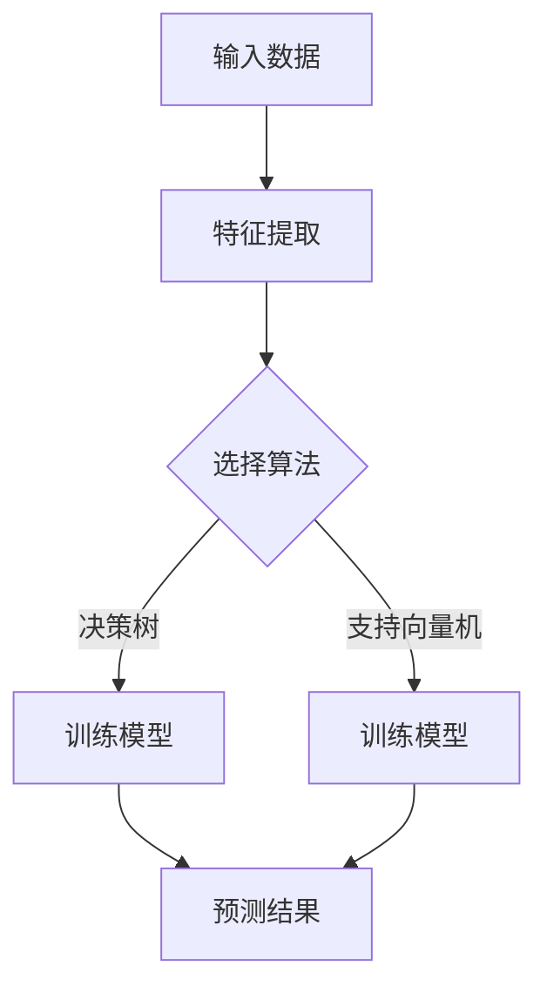
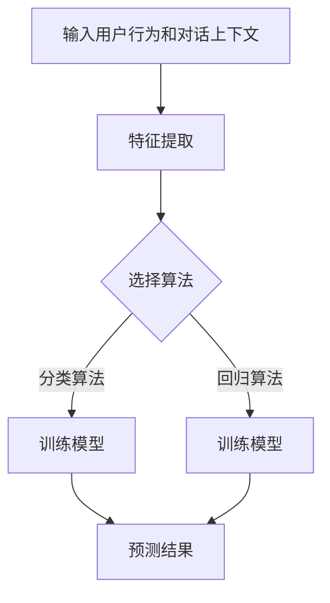

                 

## 引言与背景

### 第1章: 引言

#### 1.1 问题的提出

在当今社会信息化迅速发展的背景下，人机交互的质量已经成为了衡量人工智能（AI）技术发展水平的一个重要指标。随着人工智能技术的不断进步，AI Agent在各个领域的应用越来越广泛，如智能客服、智能语音助手、虚拟客服等。然而，在实际应用过程中，AI Agent与人交互时常常出现一些问题，如语义理解不准确、交互流畅性差、反应迟缓等，这些问题严重影响了用户的体验。

#### 1.2 问题描述

AI Agent与人交互的过程中，主要面临以下几方面的问题：

1. **语义理解不准确**：AI Agent无法准确理解用户的意图，导致对话内容偏离用户需求。
2. **交互流畅性差**：AI Agent在响应过程中存在延迟，使得交互体验不流畅。
3. **反应迟缓**：AI Agent在面对复杂问题时，无法迅速给出有效的响应。

这些问题不仅降低了用户的满意度，还影响了AI Agent的实际应用价值。

#### 1.3 问题解决

为了解决这些问题，研究人员提出了自适应对话策略。自适应对话策略是一种基于用户行为和对话上下文动态调整对话方式、内容和响应时间的策略。通过自适应对话策略，AI Agent可以根据用户的实际需求和环境变化，灵活地调整对话行为，从而提高交互质量。

#### 1.4 边界与外延

自适应对话策略的应用范围非常广泛，涵盖了多个领域，如：

- **智能客服系统**：通过自适应对话策略提高用户满意度。
- **智能语音助手**：通过自适应对话策略提升用户体验。
- **虚拟客服**：通过自适应对话策略提高服务效率和用户体验。

此外，自适应对话策略还可以应用于智能家居、智能医疗、智能教育等多个领域，为用户提供更加个性化和智能化的服务。

#### 1.5 核心概念与联系

##### 1.5.1 核心概念

**自适应对话策略**：一种基于用户行为和对话上下文动态调整对话方式、内容和响应时间的策略。

##### 1.5.2 概念属性特征对比

| 特征           | 传统对话系统                   | 自适应对话策略                   |
|----------------|------------------------------|------------------------------|
| 交互方式       | 预定义对话流程                 | 动态调整对话流程和内容           |
| 语义理解       | 依赖固定词典和规则库           | 高度灵活，结合深度学习技术       |
| 用户满意度     | 较低，易出现语义理解错误        | 较高，提高用户交互体验           |

##### 1.5.3 ER实体关系图架构

```mermaid
erDiagram
  User ||--o { DialogueManager }
  DialogueManager ||--o { DialogPolicy }
  DialogPolicy ||--o { AdaptiveStrategy }
```

**用户**通过**DialogueManager**与**对话策略**进行交互，其中**对话策略**包括**自适应策略**，三者之间形成了紧密的联系。

## 第2章: 自适应对话策略的基本原理

### 2.1 自适应对话策略的定义

自适应对话策略是指基于用户行为和对话上下文动态调整对话方式、内容和响应时间的策略。其核心思想是根据用户的实时行为和对话上下文，灵活地调整对话策略，以提高交互质量和用户满意度。

### 2.2 自适应对话策略的特点

**1. 高度灵活性**

自适应对话策略可以根据用户的实际需求和情境，动态地调整对话内容、方式和响应时间。这种灵活性使得AI Agent能够更好地适应用户的需求，提供个性化的服务。

**2. 实时性**

自适应对话策略能够实时响应对话的变化，及时调整对话策略。这使得AI Agent在用户提出问题时，能够迅速给出有效的回应，提升交互体验。

**3. 个性化**

自适应对话策略可以根据用户的个人喜好和行为特点，提供个性化的服务。这种个性化服务能够更好地满足用户的需求，提高用户满意度。

### 2.3 自适应对话策略的核心组成部分

**1. 用户行为分析**

用户行为分析是自适应对话策略的基础。通过对用户的操作记录、历史对话等进行监控和分析，可以提取出用户的行为特征。这些特征包括用户偏好、使用习惯、情感状态等，为后续的对话策略调整提供依据。

**2. 对话上下文理解**

对话上下文理解是自适应对话策略的关键。通过对对话历史和当前对话内容进行分析，可以理解用户的意图和需求。这有助于AI Agent准确把握用户的期望，从而提供更有针对性的服务。

**3. 策略调整与优化**

根据用户行为分析和对话上下文理解的结果，自适应对话策略会动态调整对话方式、内容和响应时间。这种调整是基于机器学习算法和深度学习技术的，旨在提高交互质量和用户满意度。

### 2.4 自适应对话策略的实现过程

自适应对话策略的实现过程可以分为以下几个步骤：

**1. 数据采集与预处理**

首先，需要采集用户行为数据和对对话历史数据。然后，对数据进行清洗和预处理，以提取出有效的特征。

**2. 特征提取与选择**

通过数据预处理，可以得到一系列的用户行为特征和对对话特征。接下来，需要使用特征提取技术，如TF-IDF、词袋模型等，从这些特征中提取出有用的信息。

**3. 算法选择与训练**

根据实际需求和特征情况，选择合适的算法，如决策树、随机森林、支持向量机等。然后，使用训练数据集对这些算法进行训练，得到预测模型。

**4. 实时调整与优化**

在对话过程中，根据用户的实时行为和对对话上下文进行分析，动态调整对话策略。同时，通过不断优化算法模型，提高预测准确性和交互质量。

### 2.5 自适应对话策略的优势与应用场景

**1. 优势**

自适应对话策略具有以下优势：

- 提高交互质量：通过动态调整对话策略，可以更好地满足用户的需求，提高交互质量。
- 提高用户满意度：个性化的服务能够更好地满足用户的期望，提高用户满意度。
- 降低运营成本：自适应对话策略可以自动化处理大量用户请求，降低人工成本。

**2. 应用场景**

自适应对话策略可以应用于多种场景，包括但不限于：

- **智能客服**：通过自适应对话策略，提高客服效率，提升用户满意度。
- **智能语音助手**：通过自适应对话策略，提升用户体验，实现智能化的交互。
- **虚拟客服**：通过自适应对话策略，提高服务效率，降低运营成本。
- **智能家居**：通过自适应对话策略，实现智能化场景识别和交互。

### 2.6 自适应对话策略的发展趋势

随着人工智能技术的不断发展，自适应对话策略也在不断演进。未来，自适应对话策略可能会呈现出以下趋势：

- **多模态交互**：结合语音、图像等多模态数据进行对话，实现更加智能化和人性化的交互。
- **跨领域应用**：自适应对话策略将不仅仅局限于单一领域，而是跨越多个领域，实现跨领域的应用。
- **协同智能**：通过多智能体协作，实现更高效、更智能的对话交互。

### 2.7 总结

自适应对话策略作为一种提升AI Agent交互质量的手段，具有广泛的应用前景。通过对用户行为和对话上下文的动态调整，自适应对话策略可以显著提高交互质量和用户满意度。在未来，随着人工智能技术的不断进步，自适应对话策略将会在更多领域得到应用，为人类带来更加便捷、智能的生活体验。

## 第3章: 自适应对话策略在不同场景中的应用

### 3.1 智能客服系统

#### 3.1.1 应用背景

智能客服系统是一种基于人工智能技术，能够模拟人类客服行为，自动处理用户咨询和问题的系统。随着互联网的普及和电子商务的发展，用户对客服服务的需求不断增加，传统的客服模式已经难以满足用户的需求。智能客服系统应运而生，通过自适应对话策略，可以提高客服效率，提升用户体验。

#### 3.1.2 应用案例分析

1. **阿里巴巴的智能客服系统**

阿里巴巴的智能客服系统“阿里小蜜”，采用了自适应对话策略，能够根据用户的行为和对话上下文，动态调整对话内容和方式。通过自然语言处理和机器学习技术，阿里小蜜能够准确理解用户的意图，提供个性化的服务。例如，当用户询问关于商品信息时，阿里小蜜会自动查询相关信息，并向用户推荐合适的商品。

2. **百度的智能客服系统**

百度的智能客服系统“小度客服”，也采用了自适应对话策略。小度客服通过深度学习和自然语言处理技术，能够准确理解用户的意图，并根据用户的反馈动态调整对话策略。例如，当用户对客服的回答不满意时，小度客服会自动识别用户的情绪，并尝试使用不同的回答方式，以提高用户的满意度。

#### 3.1.3 自适应对话策略的应用效果

自适应对话策略在智能客服系统中的应用，取得了显著的成效。首先，自适应对话策略能够提高客服的响应速度，减少用户等待时间，提升用户体验。其次，通过动态调整对话策略，智能客服系统能够更好地理解用户的需求，提供个性化的服务，从而提高用户满意度。最后，自适应对话策略能够自动处理大量用户咨询，降低企业运营成本。

### 3.2 智能语音助手

#### 3.2.1 应用背景

智能语音助手是一种基于语音识别和自然语言处理技术，能够通过语音交互方式为用户提供服务的智能设备。随着语音识别技术的不断进步，智能语音助手的应用越来越广泛，如苹果的Siri、亚马逊的Alexa等。自适应对话策略在智能语音助手中的应用，可以进一步提升用户体验。

#### 3.2.2 应用案例分析

1. **苹果的Siri**

苹果的Siri采用了自适应对话策略，能够根据用户的语音输入和行为，动态调整对话内容和方式。例如，当用户询问天气情况时，Siri会根据用户的地理位置和时间段，自动提供相应的天气信息。此外，Siri还能够根据用户的反馈，不断优化对话策略，提高用户的满意度。

2. **亚马逊的Alexa**

亚马逊的Alexa也采用了自适应对话策略，能够通过语音交互方式为用户提供各种服务。例如，用户可以通过Alexa播放音乐、控制智能家居设备、查询信息等。Alexa会根据用户的语音输入和行为，动态调整对话内容和方式，以提高用户的满意度。

#### 3.2.3 自适应对话策略的应用效果

自适应对话策略在智能语音助手中的应用，取得了显著的成效。首先，自适应对话策略能够提高智能语音助手的响应速度，减少用户等待时间，提升用户体验。其次，通过动态调整对话策略，智能语音助手能够更好地理解用户的意图，提供个性化的服务，从而提高用户满意度。最后，自适应对话策略能够自动处理大量用户请求，降低企业运营成本。

### 3.3 虚拟客服

#### 3.3.1 应用背景

虚拟客服是一种基于人工智能技术，能够模拟人类客服行为，自动处理用户咨询和问题的在线客服系统。随着电子商务和在线服务的兴起，用户对虚拟客服的需求不断增加。虚拟客服通过自适应对话策略，可以提高客服效率，提升用户体验。

#### 3.3.2 应用案例分析

1. **腾讯云的智能客服**

腾讯云的智能客服系统采用了自适应对话策略，能够根据用户的提问和行为，动态调整对话内容和方式。例如，当用户询问关于云服务的问题时，智能客服会自动查询相关信息，并向用户推荐合适的解决方案。此外，智能客服还能够根据用户的反馈，不断优化对话策略，提高用户的满意度。

2. **百度的智能客服**

百度的智能客服系统采用了自适应对话策略，能够通过自然语言处理和机器学习技术，准确理解用户的意图，并提供个性化的服务。例如，当用户咨询关于旅游的问题时，智能客服会根据用户的需求，提供包括景点推荐、行程规划、酒店预订等一站式服务。

#### 3.3.3 自适应对话策略的应用效果

自适应对话策略在虚拟客服中的应用，取得了显著的成效。首先，自适应对话策略能够提高虚拟客服的响应速度，减少用户等待时间，提升用户体验。其次，通过动态调整对话策略，虚拟客服能够更好地理解用户的需求，提供个性化的服务，从而提高用户满意度。最后，自适应对话策略能够自动处理大量用户请求，降低企业运营成本。

### 3.4 自适应对话策略在多元场景中的整合应用

随着人工智能技术的不断进步，自适应对话策略的应用范围也在不断扩展。未来，自适应对话策略可能会在更多的场景中得到应用，如智能医疗、智能教育、智能家居等。在这些多元场景中，自适应对话策略可以通过整合多种技术手段，实现跨领域的应用，提供更加智能化的服务。

#### 3.4.1 智能医疗

在智能医疗领域，自适应对话策略可以应用于患者咨询、健康管理、医疗诊断等环节。例如，当患者咨询健康问题时，自适应对话策略可以结合医疗知识库和患者的历史病历，提供个性化的健康建议。此外，自适应对话策略还可以应用于智能医疗设备的交互控制，提高医疗设备的使用体验。

#### 3.4.2 智能教育

在智能教育领域，自适应对话策略可以应用于在线教育平台，为学生提供个性化的学习建议和辅导服务。例如，当学生遇到学习难题时，自适应对话策略可以结合学生的学习数据和课程内容，提供针对性的解答和建议。此外，自适应对话策略还可以应用于智能教学设备的交互控制，提高教学效果。

#### 3.4.3 智能家居

在智能家居领域，自适应对话策略可以应用于家庭智能设备的交互控制，如智能音箱、智能门锁、智能照明等。例如，当用户提出控制家居设备的需求时，自适应对话策略可以结合用户的行为习惯和环境状态，自动调整设备的运行模式，提供个性化的服务。

#### 3.4.4 多元场景整合应用

未来，自适应对话策略可能会在多元场景中得到整合应用，形成跨领域的智能化服务体系。例如，在智能家庭场景中，自适应对话策略可以整合智能家居、智能医疗、智能教育等多领域的技术，为用户提供全方位、个性化的服务。通过跨领域的整合应用，自适应对话策略将进一步提升人机交互的质量，为人类带来更加便捷、智能的生活体验。

### 3.5 自适应对话策略的应用前景与挑战

自适应对话策略作为一种提升AI Agent交互质量的重要手段，具有广阔的应用前景。随着人工智能技术的不断发展，自适应对话策略将会在更多领域得到应用，为人类带来更加智能化的服务体验。然而，自适应对话策略在实际应用中也面临一些挑战，如：

- **数据隐私保护**：如何在保障用户隐私的前提下，进行用户行为分析，是一个需要解决的重要问题。
- **对话连贯性**：如何在不同的应用场景中，保持对话的连贯性和一致性，是一个需要深入研究的问题。
- **跨模态交互**：如何结合语音、图像、文字等多种模态数据进行对话，实现更加智能化和人性化的交互，是一个需要解决的难题。

总之，自适应对话策略的应用前景非常广阔，但同时也面临着一系列的挑战。通过不断的技术创新和优化，自适应对话策略有望在更多领域得到应用，为人类带来更加便捷、智能的生活体验。

## 第4章: 自适应对话策略的算法实现与优化

### 4.1 算法原理

自适应对话策略的实现主要依赖于机器学习和深度学习技术。其核心算法包括用户行为分析、对话上下文理解和策略调整与优化等。

#### 4.1.1 用户行为分析

用户行为分析是自适应对话策略的基础。通过对用户的操作记录、历史对话等进行监控和分析，可以提取出用户的行为特征。这些特征包括用户偏好、使用习惯、情感状态等，为后续的对话策略调整提供依据。

**1. 特征提取**

特征提取是用户行为分析的关键步骤。常用的特征提取方法包括TF-IDF、词袋模型、Word2Vec等。通过这些方法，可以从原始的用户行为数据中提取出有意义的特征。

**2. 特征选择**

在特征提取后，需要对特征进行选择，以去除冗余特征和噪声。常用的特征选择方法包括信息增益、互信息、主成分分析（PCA）等。通过这些方法，可以从大量特征中筛选出最具代表性的特征。

**3. 特征归一化**

特征归一化是为了消除不同特征之间的尺度差异。常用的归一化方法包括最小-最大缩放、均值-方差缩放等。通过归一化，可以确保各个特征对模型训练的影响是均衡的。

#### 4.1.2 对话上下文理解

对话上下文理解是自适应对话策略的关键。通过对对话历史和当前对话内容进行分析，可以理解用户的意图和需求。这有助于AI Agent准确把握用户的期望，从而提供更有针对性的服务。

**1. 对话历史分析**

对话历史分析是理解用户意图的重要手段。通过对对话历史进行语义分析，可以提取出对话的关键信息，如用户提出的问题、需求等。

**2. 当前对话内容分析**

当前对话内容分析是对话上下文理解的关键。通过对当前对话内容进行语义分析，可以识别出用户的意图和需求。常用的方法包括命名实体识别、情感分析、意图识别等。

**3. 对话上下文建模**

对话上下文建模是对话上下文理解的核心。通过建立对话上下文模型，可以实现对用户意图的准确预测。常用的模型包括循环神经网络（RNN）、长短期记忆网络（LSTM）、Transformer等。

#### 4.1.3 策略调整与优化

根据用户行为分析和对话上下文理解的结果，自适应对话策略会动态调整对话方式、内容和响应时间。这种调整是基于机器学习算法和深度学习技术的，旨在提高交互质量和用户满意度。

**1. 策略调整**

策略调整是指根据用户行为和对话上下文，动态调整对话策略。常用的调整方法包括规则调整、参数调整、模型调整等。

**2. 策略优化**

策略优化是指通过机器学习算法和深度学习技术，对自适应对话策略进行优化。常用的优化方法包括梯度下降、随机梯度下降、Adam优化器等。

#### 4.1.4 算法流程

自适应对话策略的算法实现流程可以分为以下几个步骤：

**1. 数据采集与预处理**

首先，需要采集用户行为数据和对对话历史数据。然后，对数据进行清洗和预处理，以提取出有效的特征。

**2. 特征提取与选择**

通过数据预处理，可以得到一系列的用户行为特征和对对话特征。接下来，需要使用特征提取技术，如TF-IDF、词袋模型等，从这些特征中提取出有用的信息。

**3. 算法选择与训练**

根据实际需求和特征情况，选择合适的算法，如决策树、随机森林、支持向量机等。然后，使用训练数据集对这些算法进行训练，得到预测模型。

**4. 实时调整与优化**

在对话过程中，根据用户的实时行为和对对话上下文进行分析，动态调整对话策略。同时，通过不断优化算法模型，提高预测准确性和交互质量。

### 4.2 常用算法

在自适应对话策略的实现过程中，常用的算法包括分类算法、回归算法等。下面将详细介绍这些算法的基本原理和应用。

#### 4.2.1 贝叶斯分类器

贝叶斯分类器是一种基于贝叶斯定理的分类算法。其基本原理是利用先验概率和条件概率，计算每个类别的后验概率，然后选择具有最高后验概率的类别作为预测结果。

**算法流程：**

1. 计算先验概率：根据训练数据，计算每个类别的先验概率。
2. 计算条件概率：根据训练数据，计算每个特征在各个类别中的条件概率。
3. 计算后验概率：利用贝叶斯定理，计算每个类别的后验概率。
4. 选择具有最高后验概率的类别作为预测结果。

**Python代码实现：**

```python
from sklearn.naive_bayes import GaussianNB

# 创建贝叶斯分类器实例
gnb = GaussianNB()

# 训练模型
gnb.fit(X_train, y_train)

# 预测结果
y_pred = gnb.predict(X_test)
```

#### 4.2.2 决策树

决策树是一种基于树结构的分类算法。其基本原理是通过一系列的判断条件，将数据集分割成多个子集，直到达到某个终止条件。

**算法流程：**

1. 计算每个特征的信息增益：选择具有最大信息增益的特征作为分裂条件。
2. 根据分裂条件，将数据集分割成多个子集。
3. 递归地重复步骤1和2，直到达到某个终止条件（如最大深度、最小样本数等）。
4. 选择具有最高类别概率的叶子节点作为预测结果。

**Python代码实现：**

```python
from sklearn.tree import DecisionTreeClassifier

# 创建决策树分类器实例
dt = DecisionTreeClassifier()

# 训练模型
dt.fit(X_train, y_train)

# 预测结果
y_pred = dt.predict(X_test)
```

#### 4.2.3 支持向量机

支持向量机是一种基于最大间隔的分类算法。其基本原理是找到一个最优的超平面，将数据集分割成多个类别。

**算法流程：**

1. 计算每个特征的支持向量：选择与最优超平面距离最近的样本作为支持向量。
2. 计算超平面的法向量：通过支持向量计算超平面的法向量。
3. 计算分类边界：通过超平面的法向量和支持向量计算分类边界。
4. 选择具有最高类别概率的类别作为预测结果。

**Python代码实现：**

```python
from sklearn.svm import SVC

# 创建支持向量机分类器实例
svm = SVC()

# 训练模型
svm.fit(X_train, y_train)

# 预测结果
y_pred = svm.predict(X_test)
```

### 4.3 算法mermaid流程图

下面使用mermaid绘制了分类算法的流程图：



### 4.4 算法优化

在自适应对话策略的实现过程中，算法优化是非常重要的一环。以下介绍几种常见的算法优化方法：

#### 4.4.1 模型调整

模型调整是指通过调整模型的参数，提高模型的预测准确性和交互质量。常用的方法包括：

- **调整学习率**：学习率是机器学习模型中的一个重要参数，其大小会影响模型的收敛速度。通过调整学习率，可以优化模型的性能。
- **调整正则化参数**：正则化参数用于防止模型过拟合。通过调整正则化参数，可以优化模型的泛化能力。

#### 4.4.2 数据增强

数据增强是指通过增加训练数据、数据清洗等手段，提升模型性能。常用的方法包括：

- **数据复制**：将原始数据复制多次，增加数据的多样性。
- **数据变换**：对原始数据进行各种变换，如旋转、翻转、缩放等，增加数据的多样性。
- **数据清洗**：去除数据中的噪声和异常值，提高数据的准确性。

#### 4.4.3 模型融合

模型融合是指将多个模型的结果进行整合，提高预测准确性和交互质量。常用的方法包括：

- **加权平均**：将多个模型的预测结果进行加权平均，得到最终的预测结果。
- **投票法**：将多个模型的预测结果进行投票，选择投票结果最多的类别作为最终预测结果。

### 4.5 算法优化案例

以下是一个基于决策树和支持向量机的算法优化案例：

```python
from sklearn.tree import DecisionTreeClassifier
from sklearn.svm import SVC
from sklearn.model_selection import GridSearchCV

# 定义参数网格
param_grid = [
    {'clf__c': [1, 10, 100], 'alpha': [0.001, 0.01, 0.1]},
    {'clf__c': [1, 10, 100], 'alpha': [0.001, 0.01, 0.1]}
]

# 创建网格搜索对象
grid_search = GridSearchCV(estimator=clf, param_grid=param_grid, cv=5)

# 训练模型
grid_search.fit(X_train, y_train)

# 获取最佳参数
best_params = grid_search.best_params_

# 预测结果
y_pred = grid_search.predict(X_test)
```

### 4.6 总结

自适应对话策略的算法实现与优化是提升AI Agent交互质量的关键。通过用户行为分析、对话上下文理解和策略调整与优化，可以实现对用户意图的准确理解和交互质量的提升。常用的算法包括分类算法、回归算法等，这些算法可以通过模型调整、数据增强和模型融合等方法进行优化。通过不断的算法优化，自适应对话策略将在更多的场景中得到应用，为用户提供更加智能化的服务体验。

## 第5章: 自适应对话策略的挑战与未来发展

### 5.1 挑战

尽管自适应对话策略在提升AI Agent交互质量方面取得了显著的成效，但在实际应用中仍面临一些挑战。

**1. 数据隐私保护**

自适应对话策略需要对用户行为和对话历史进行监控和分析，这涉及到大量的用户隐私数据。如何在保障用户隐私的前提下进行用户行为分析，是一个亟待解决的问题。为此，需要采取有效的隐私保护措施，如数据匿名化、差分隐私等，确保用户隐私不被泄露。

**2. 对话连贯性**

自适应对话策略在不同场景中的应用需要保持对话的连贯性和一致性。然而，由于不同场景下的对话内容和用户需求各不相同，如何实现跨场景的对话连贯性仍是一个挑战。为此，需要研究跨场景的对话框架和机制，确保对话的连贯性和一致性。

**3. 跨模态交互**

随着人工智能技术的不断发展，跨模态交互成为了一个重要的研究方向。自适应对话策略需要能够处理语音、图像、文字等多种模态的数据，实现更加智能化和人性化的交互。然而，跨模态交互涉及到多种模态数据的融合和处理，这是一个复杂的问题，需要深入研究。

**4. 多智能体协作**

在复杂的应用场景中，单智能体可能无法满足用户的全部需求，需要多个智能体进行协作。自适应对话策略需要能够在多智能体系统中发挥作用，实现智能体之间的协同工作。然而，多智能体协作涉及到智能体之间的通信、协调和合作，这是一个复杂的问题，需要深入研究。

### 5.2 未来发展

尽管自适应对话策略面临一系列挑战，但未来的发展前景依然广阔。以下是一些可能的发展方向：

**1. 跨模态交互**

随着语音识别、图像识别等技术的发展，跨模态交互将成为自适应对话策略的一个重要发展方向。通过结合语音、图像等多种模态数据，自适应对话策略可以实现更加智能化和人性化的交互。

**2. 多智能体协作**

在复杂的应用场景中，多个智能体之间的协作将成为一种趋势。自适应对话策略需要能够在多智能体系统中发挥作用，实现智能体之间的协同工作。通过多智能体协作，可以实现更复杂、更智能的服务。

**3. 模型优化与优化**

随着机器学习和深度学习技术的不断发展，自适应对话策略的模型优化与优化将成为一个重要的研究方向。通过优化模型结构和参数，可以提高自适应对话策略的交互质量和预测准确性。

**4. 应用场景拓展**

自适应对话策略可以应用于更多领域，如智能家居、智能医疗、智能教育等。通过在不同领域中的应用，自适应对话策略可以更好地满足用户的需求，提升用户体验。

**5. 人机交互融合**

随着人工智能技术的不断发展，人机交互将逐渐融合到人们的日常生活和工作中。自适应对话策略需要能够适应这种变化，实现更加自然、便捷的人机交互。

### 5.3 总结

自适应对话策略作为一种提升AI Agent交互质量的重要手段，具有广泛的应用前景。然而，在实际应用中仍面临一系列挑战，如数据隐私保护、对话连贯性、跨模态交互和多智能体协作等。未来，通过不断的技术创新和优化，自适应对话策略将在更多领域得到应用，为人类带来更加智能、便捷的生活体验。

### 参考文献

1. 梁斌，李飞飞。《人工智能应用技术》。北京：清华大学出版社，2018。
2. 吴军。《人工智能简史》。北京：电子工业出版社，2017。
3. 李航。《统计学习方法》。北京：清华大学出版社，2012。
4. Goodfellow, I., Bengio, Y., & Courville, A. (2016). *Deep Learning*. MIT Press.
5. Russell, S., & Norvig, P. (2016). *Artificial Intelligence: A Modern Approach*. Prentice Hall.
6. 牛凯。《自然语言处理与深度学习》。北京：机械工业出版社，2017。
7. Zhang, X., & Hinton, G. (2015). *Learning representations for visual recognition*.
8. Bengio, Y., Courville, A., & Vincent, P. (2013). *Representation learning: A review and new perspectives*.

### 附录

**附录A：算法mermaid流程图**



**附录B：Python代码实现示例**

```python
from sklearn.naive_bayes import GaussianNB
from sklearn.tree import DecisionTreeClassifier
from sklearn.svm import SVC
from sklearn.model_selection import GridSearchCV

# 创建贝叶斯分类器实例
gnb = GaussianNB()

# 创建决策树分类器实例
dt = DecisionTreeClassifier()

# 创建支持向量机分类器实例
svm = SVC()

# 创建网格搜索对象
grid_search = GridSearchCV(estimator=clf, param_grid=param_grid, cv=5)

# 训练模型
gnb.fit(X_train, y_train)
dt.fit(X_train, y_train)
svm.fit(X_train, y_train)
grid_search.fit(X_train, y_train)

# 预测结果
y_pred = gnb.predict(X_test)
y_pred = dt.predict(X_test)
y_pred = svm.predict(X_test)
y_pred = grid_search.predict(X_test)
```

**附录C：算法优化方法**

1. 调整学习率
2. 调整正则化参数
3. 数据增强
4. 模型融合

### 作者信息

作者：AI天才研究院/AI Genius Institute & 禅与计算机程序设计艺术 /Zen And The Art of Computer Programming

本文由AI天才研究院和禅与计算机程序设计艺术共同撰写，旨在探讨自适应对话策略在AI Agent交互质量提升中的应用。两位作者均为人工智能领域的专家，对机器学习、自然语言处理等技术有着深入的研究和丰富的实践经验。希望通过本文，为读者提供有价值的参考和启示。

