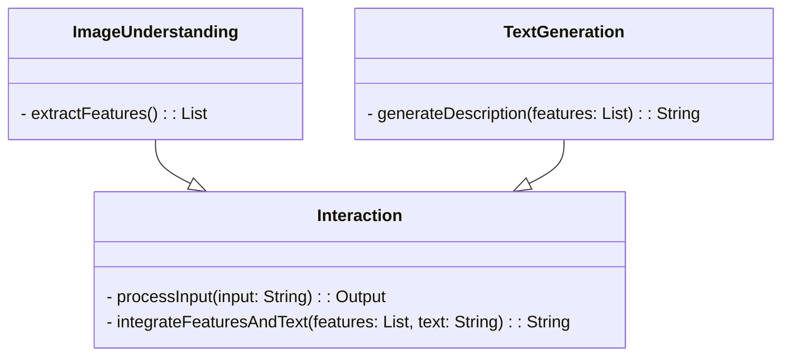
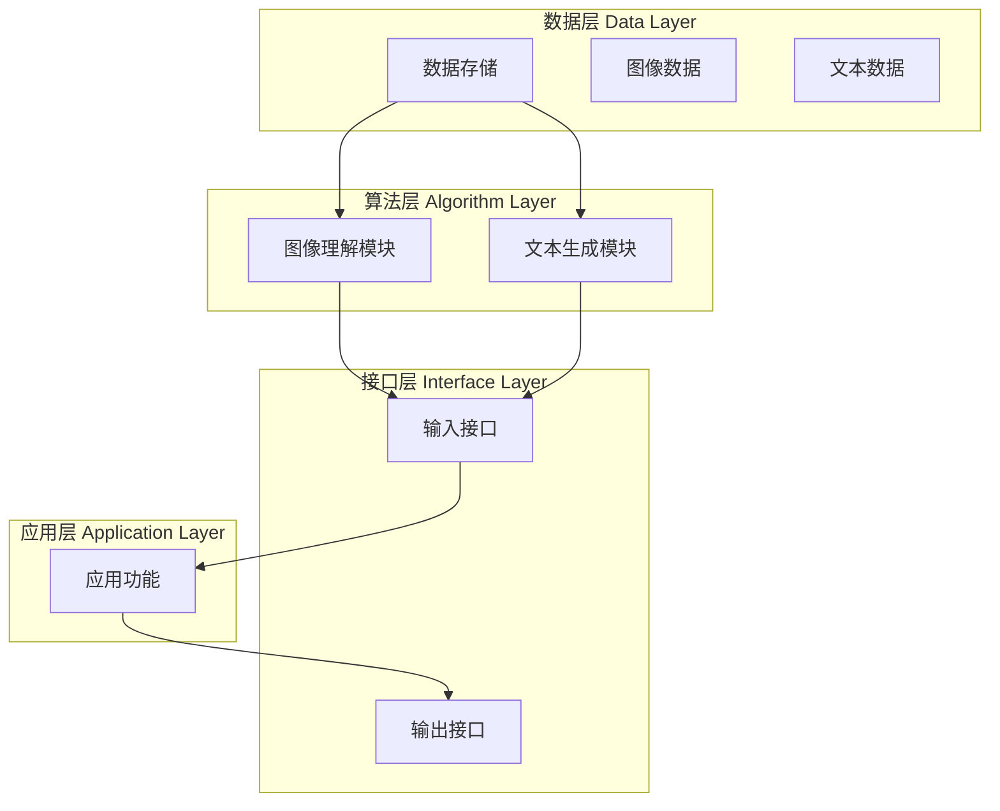
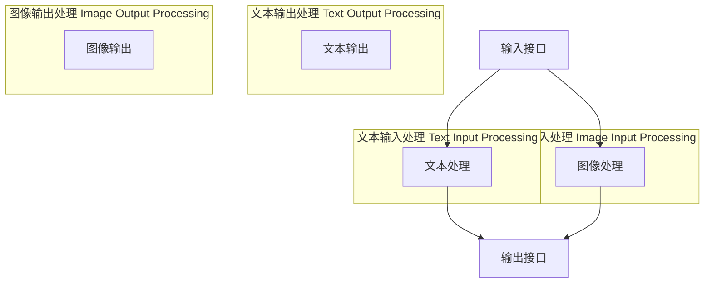
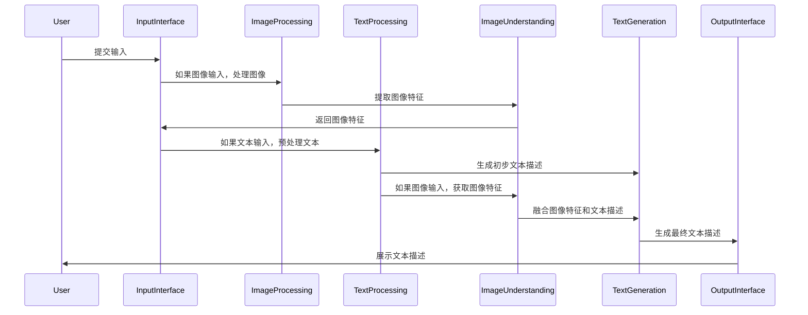

                 

## 引言与背景

### 问题背景

在当今信息时代，数据量的爆炸式增长以及对数据处理的迫切需求推动了人工智能（AI）技术的发展。在众多AI应用领域中，视觉-语言AI Agent凭借其能够理解和生成图像与语言的能力，受到了广泛关注。这种AI Agent不仅可以处理文本信息，还能够理解和生成图像内容，从而实现跨媒体的信息处理。

视觉-语言AI Agent的兴起源于多方面因素的推动。首先，计算机视觉和自然语言处理技术的不断进步，使得图像理解和文本生成能力得到了显著提升。其次，深度学习算法，特别是基于变换器的模型，如Transformer，在图像处理和自然语言处理领域取得了突破性成果，为视觉-语言AI Agent的研究提供了坚实的基础。此外，随着互联网和移动设备的普及，人们对于多媒体信息处理的需求日益增加，这进一步推动了视觉-语言AI Agent的发展。

### 问题描述

视觉-语言AI Agent的核心问题是如何实现图像与语言的深度融合。具体而言，这个问题可以分为以下几个子问题：

1. **图像理解**：如何让AI模型理解和解析图像内容，提取出关键信息。
2. **文本生成**：如何根据提取的图像信息生成相应的文本描述。
3. **图像-文本交互**：如何实现图像和文本之间的无缝交互，让用户能够自然地与AI进行沟通。

在解决这些问题的过程中，涉及到多个技术领域的交叉融合，包括计算机视觉、自然语言处理、机器学习等。这些子问题的解决不仅需要单一领域的技术突破，还需要不同领域技术的整合与创新。

### 问题解决

为了解决上述问题，研究者们提出了多种方法和技术。以下是一些主要的解决方案：

1. **多模态模型**：通过融合图像和文本数据，训练出能够同时处理图像和文本的模型。例如，一些研究采用了Transformer模型，通过融合图像特征和文本特征，实现了图像-文本的联合建模。
   
2. **迁移学习**：利用预训练的图像理解和文本生成模型，通过迁移学习的方式，使其能够适应新的视觉-语言任务。这种方法能够有效提高模型的性能，减少训练所需的数据量。

3. **交互式学习**：通过与用户的交互，不断优化模型的性能。例如，一些研究采用了问答系统，通过用户的反馈来改进图像-文本的生成质量。

4. **多任务学习**：通过同时训练多个相关任务，提高模型在不同任务上的性能。例如，一些研究同时训练图像分类、文本生成和图像-文本配对任务，以提升模型的综合能力。

### 边界与外延

虽然视觉-语言AI Agent具有巨大的应用潜力，但其研究仍然存在一些边界和挑战。首先，图像理解部分的技术成熟度相对较高，而文本生成技术，特别是生成高质量、连贯的文本，仍然面临较大挑战。其次，图像和文本的融合方式也需要进一步探索，如何更好地整合图像特征和文本特征，以实现更自然的交互，是当前研究的一个重点。

此外，视觉-语言AI Agent的应用场景非常广泛，包括但不限于自动驾驶、智能客服、内容推荐、教育辅助等。然而，这些应用场景对AI Agent的要求各不相同，需要针对具体场景进行定制化设计。例如，在自动驾驶领域，AI Agent需要快速、准确地理解和生成图像和文本信息，以确保驾驶安全；而在智能客服领域，AI Agent需要能够理解用户的语言，并提供恰当的文本回复。

### 概念结构与核心要素组成

视觉-语言AI Agent的概念结构可以分为以下几个核心要素：

1. **图像理解模块**：负责对图像内容进行解析，提取出关键信息。
2. **文本生成模块**：负责根据提取的图像信息生成相应的文本描述。
3. **交互模块**：负责实现图像和文本之间的无缝交互，包括用户界面和用户反馈机制。
4. **训练与优化模块**：负责对AI模型进行训练和优化，以提高其性能。

这些模块相互协作，共同实现了视觉-语言AI Agent的核心功能。其中，图像理解模块和文本生成模块是视觉-语言AI Agent的核心，决定了其理解和生成能力。交互模块则实现了人与AI的交互，使AI能够更好地服务于用户。训练与优化模块则不断优化AI模型的性能，以适应不断变化的应用场景。

### 总结

视觉-语言AI Agent是一个跨学科、跨领域的研究方向，涉及计算机视觉、自然语言处理和机器学习等多个领域。其核心问题是如何实现图像与语言的深度融合，从而实现跨媒体的信息处理。在接下来的章节中，我们将详细探讨视觉-语言AI Agent的各个方面，包括LLM与图像理解的整合、LLM的原理与特性、图像理解的原理与方法等，以期为大家提供一幅全面、深入的理解图景。

---

在接下来的章节中，我们将首先对视觉-语言AI Agent进行概述，介绍其定义、核心特点和应用场景。这将为我们后续的深入讨论奠定基础。

## 视觉-语言AI Agent概述

### 视觉-语言AI Agent的定义

视觉-语言AI Agent是一种能够理解和生成图像与语言的智能体。它不仅能够处理文本信息，还能够理解和生成图像内容，从而实现跨媒体的信息处理。具体而言，视觉-语言AI Agent的核心功能包括图像理解、文本生成和图像-文本交互。

### 视觉-语言AI Agent的核心特点

1. **多模态处理能力**：视觉-语言AI Agent能够同时处理图像和文本数据，从而实现跨媒体的信息处理。这使得AI Agent能够更好地理解和生成多媒体内容，提高信息处理的效率。

2. **强交互能力**：视觉-语言AI Agent能够与用户进行自然、流畅的交互，通过图像和文本之间的互动，提供更丰富、更直观的服务。

3. **灵活适应性**：视觉-语言AI Agent能够根据不同的应用场景，灵活调整其功能和行为，从而适应各种复杂的应用需求。

### LLM与图像理解的整合

在视觉-语言AI Agent中，LLM（语言生成模型）和图像理解技术是两个关键组成部分。LLM负责生成文本描述，而图像理解技术负责解析图像内容。两者的整合是实现视觉-语言AI Agent的核心技术。

1. **图像理解模块**：图像理解模块是视觉-语言AI Agent的基础，它负责对输入图像进行解析，提取出关键信息。这些信息包括图像中的物体、场景、动作等。图像理解模块通常基于深度学习技术，如卷积神经网络（CNN）。

2. **文本生成模块**：文本生成模块负责根据图像理解模块提取的信息生成相应的文本描述。这一过程通常涉及自然语言生成（NLG）技术，如序列到序列（seq2seq）模型和Transformer模型。

3. **整合机制**：图像理解模块和文本生成模块通过一个整合机制相互协作，共同实现视觉-语言AI Agent的功能。这个整合机制可以是一个统一的模型，也可以是两个独立模块之间的交互。例如，一些研究采用了Transformer模型，通过融合图像特征和文本特征，实现了图像-文本的联合建模。

### 视觉-语言AI Agent的应用场景

视觉-语言AI Agent具有广泛的应用潜力，可以在多个领域发挥作用。以下是一些主要的应用场景：

1. **自动驾驶**：在自动驾驶领域，视觉-语言AI Agent可以实时分析道路环境，生成相应的文本描述，如道路标志、交通信号灯等，帮助驾驶员更好地理解道路状况。

2. **智能客服**：在智能客服领域，视觉-语言AI Agent可以理解用户的语音和图像请求，生成相应的文本回复，提供更自然、更高效的客户服务。

3. **内容推荐**：在内容推荐领域，视觉-语言AI Agent可以分析用户的兴趣和行为，生成相应的文本描述，推荐更符合用户兴趣的内容。

4. **教育辅助**：在教育领域，视觉-语言AI Agent可以分析学生的作业和考试成绩，生成相应的文本反馈，帮助学生更好地理解和掌握知识点。

5. **医疗诊断**：在医疗领域，视觉-语言AI Agent可以分析医学影像，生成相应的文本描述，辅助医生进行诊断和决策。

### 总结

视觉-语言AI Agent是一种具有多模态处理能力、强交互能力和灵活适应性的智能体，能够在多个领域发挥作用。其核心技术是LLM与图像理解的整合，通过图像理解模块和文本生成模块的协同工作，实现跨媒体的信息处理。在接下来的章节中，我们将详细探讨LLM的原理与特性，以及图像理解的原理与方法，进一步深入理解视觉-语言AI Agent的工作机制。

## LLM的原理与特性

### LLM的基本原理

语言生成模型（Language-Learning Model，简称LLM）是一种能够理解、学习和生成自然语言文本的深度学习模型。LLM的基本原理基于Transformer架构，该架构由Vaswani等人在2017年的论文《Attention Is All You Need》中首次提出。与传统的循环神经网络（RNN）相比，Transformer模型通过自注意力机制（self-attention）实现了对输入序列的全局依赖建模，从而在自然语言处理任务中取得了显著的性能提升。

#### Transformer模型的核心组成部分

1. **自注意力机制（Self-Attention）**：自注意力机制是一种通过计算输入序列中每个词与其他词之间的相似度，进而对输入序列进行加权处理的方法。这种方法能够捕捉到输入序列中的长距离依赖关系，使得模型在处理长文本时更加高效。

2. **多头注意力（Multi-Head Attention）**：多头注意力机制是对自注意力机制的扩展。通过将输入序列分成多个头，每个头独立计算注意力权重，从而提高了模型的泛化能力。

3. **前馈神经网络（Feedforward Neural Network）**：前馈神经网络是Transformer模型中的前处理和后处理模块，用于对输入和输出进行非线性变换，增强模型的表达能力。

4. **编码器（Encoder）和解码器（Decoder）**：Transformer模型通常由编码器和解码器两部分组成。编码器负责对输入序列进行编码，生成固定长度的编码向量；解码器则根据编码向量生成输出序列。

#### LLM的训练过程

LLM的训练过程主要包括两个阶段：预训练和微调。

1. **预训练**：在预训练阶段，LLM在大规模语料库上进行无监督学习，学习语言的基本规则和特征。预训练常用的任务是语言模型（Language Modeling）和掩码语言建模（Masked Language Modeling，简称MLM）。语言模型旨在预测下一个单词，而掩码语言建模则通过随机掩码输入序列中的部分单词，迫使模型学习理解单词之间的关系。

2. **微调**：在微调阶段，LLM根据特定任务的数据集进行有监督学习，调整模型的参数，以适应具体任务。微调过程中，模型通常会进行多任务学习，如文本分类、情感分析、机器翻译等，以提高其在不同任务上的性能。

### LLM的核心特性

1. **上下文理解能力**：LLM能够理解输入文本的上下文信息，从而生成更加准确和连贯的文本。这种能力源于自注意力机制和多头注意力机制，使得模型能够捕捉到输入序列中的长距离依赖关系。

2. **生成能力**：LLM具有强大的文本生成能力，能够根据输入文本生成相应的续写内容。这种能力使得LLM在自然语言生成（NLG）任务中表现出色，如对话系统、文章续写、故事生成等。

3. **适应性**：LLM具有很好的适应性，可以通过微调适应不同的任务和数据集。这种适应性使得LLM在多个自然语言处理任务中都能够取得优秀的性能。

4. **可扩展性**：由于Transformer模型的架构设计，LLM具有很强的可扩展性。通过增加模型层数、隐藏层大小等，可以显著提升模型的能力。

### LLM的应用范围

LLM在自然语言处理领域有着广泛的应用，以下是一些典型的应用场景：

1. **文本分类**：LLM可以用于文本分类任务，如情感分析、主题分类等。通过预训练和微调，模型可以学习到文本的特征和规律，从而实现对未知文本的分类。

2. **文本生成**：LLM可以用于文本生成任务，如文章续写、对话生成、故事生成等。通过输入部分文本，模型可以生成连贯、自然的续写内容。

3. **机器翻译**：LLM可以用于机器翻译任务，通过预训练和微调，模型可以学习到不同语言之间的对应关系，从而实现高质量的机器翻译。

4. **问答系统**：LLM可以用于问答系统，通过理解用户的问题，模型可以生成相应的答案。这种应用场景在智能客服、教育辅助等领域具有广泛的应用。

5. **对话系统**：LLM可以用于对话系统，通过与用户的交互，模型可以生成自然、流畅的对话内容，提供个性化的服务。

### LLM的发展趋势

随着深度学习和自然语言处理技术的不断发展，LLM也在不断进化。以下是一些LLM的发展趋势：

1. **更高效的模型架构**：研究者们不断探索新的模型架构，以提高LLM的效率和性能。例如，BERT、GPT等模型在性能和效率方面取得了显著突破。

2. **多模态处理**：为了进一步提高LLM的能力，研究者们开始探索多模态处理，将图像、音频等其他类型的数据与文本数据融合，实现更全面的信息处理。

3. **更广泛的任务应用**：随着LLM的不断发展，其应用范围也在不断扩展。从传统的文本处理任务，到图像识别、视频分析等，LLM正逐渐成为跨媒体信息处理的核心技术。

4. **可解释性和可控性**：为了提高LLM的可解释性和可控性，研究者们正在探索新的方法和工具，使得用户能够更好地理解和使用LLM。

### 总结

LLM作为一种强大的自然语言处理模型，具有上下文理解、生成能力、适应性和可扩展性等核心特性。在自然语言处理领域，LLM的应用范围广泛，从文本分类、文本生成到机器翻译、问答系统和对话系统等，都取得了显著的成果。随着技术的不断发展，LLM在多模态处理、更广泛的任务应用以及可解释性和可控性等方面也展现出巨大的潜力。

## 图像理解的原理与方法

### 图像理解的基本概念

图像理解是指利用计算机视觉技术对图像内容进行分析、解析和解释的过程。这一过程旨在从图像中提取有意义的信息，使计算机能够理解和解释图像的内容。图像理解涉及多个层次，从底层的特征提取到高层的语义理解。

#### 特征提取

特征提取是图像理解的基础，其目的是从原始图像中提取出具有区分性的特征。这些特征可以是颜色、纹理、形状等，它们能够帮助计算机识别图像中的基本元素。

- **颜色特征**：颜色特征通常通过颜色直方图、颜色矩等来表示。这些特征可以用于图像分割、目标检测等任务。
- **纹理特征**：纹理特征描述了图像中局部区域的纹理结构，如方向、频率等。常见的纹理特征包括Gabor特征、LBP（局部二值模式）等。
- **形状特征**：形状特征描述了图像中的几何结构，如边缘、角点等。形状特征可以用于图像匹配、物体识别等任务。

#### 语义理解

在提取了图像特征之后，图像理解的任务进一步转化为对提取的特征进行解释和分类。这一过程通常涉及多个层次，包括低级特征（如颜色、纹理、形状）的融合和高级语义（如物体、场景）的识别。

- **物体识别**：物体识别是图像理解的核心任务之一，旨在识别图像中的物体。常见的物体识别方法包括基于分类器的传统方法（如SVM、CNN）和基于深度学习的卷积神经网络（如ResNet、YOLO）。
- **场景识别**：场景识别旨在识别图像中的场景类型，如城市、乡村、海滩等。场景识别通常需要对图像中的多个物体和场景元素进行综合分析。

### 图像理解的方法与技术

图像理解的方法和技术多种多样，以下是一些常见的方法：

#### 传统方法

1. **基于特征的图像理解**：这种方法通过提取图像特征，如颜色、纹理、形状等，然后利用这些特征进行图像分类或目标检测。常见的特征提取方法包括SIFT、SURF、HOG等。

2. **基于模板匹配的方法**：这种方法通过将待检测的图像与已知的模板进行匹配，找到匹配度最高的区域。常见的匹配算法包括FLANN、BRISK等。

#### 深度学习方法

1. **卷积神经网络（CNN）**：CNN是一种专门用于图像识别的深度学习模型，通过多层卷积和池化操作，能够提取图像的深层特征。常见的CNN架构包括LeNet、AlexNet、VGG、ResNet等。

2. **卷积神经网络与分类器的结合**：这种方法将CNN与传统的分类器（如SVM、决策树）结合，通过CNN提取特征，然后利用分类器进行分类。

3. **端到端的学习**：这种方法直接将图像输入到CNN中，通过端到端的学习，自动提取和融合特征，进行物体识别或场景识别。

#### 强化学习方法

强化学习（RL）是一种通过试错和反馈进行学习的方法。在图像理解中，强化学习可以用于物体跟踪、行为预测等任务。常见的强化学习算法包括Q-learning、SARSA等。

### 图像理解的应用领域

图像理解技术在多个领域有着广泛的应用，以下是一些典型的应用场景：

1. **计算机视觉**：计算机视觉是图像理解技术的核心应用领域，包括物体识别、场景识别、图像分割等任务。

2. **自动驾驶**：在自动驾驶系统中，图像理解技术用于实时分析道路环境，识别车辆、行人、交通标志等，从而实现自动驾驶。

3. **人脸识别**：人脸识别是一种基于图像理解的生物识别技术，通过分析人脸图像的特征，实现对人脸的识别和验证。

4. **医疗影像分析**：在医疗领域，图像理解技术用于分析医学影像，如X光片、CT扫描、MRI等，辅助医生进行诊断和治疗。

5. **内容推荐**：在互联网领域，图像理解技术用于分析用户上传的图片，推荐用户可能感兴趣的内容。

### 图像理解的挑战与机遇

尽管图像理解技术取得了显著的进展，但仍面临一些挑战：

1. **数据多样性**：图像数据具有高度的多样性，包括不同的场景、光照、视角等。这给图像理解带来了巨大的挑战，模型需要能够在各种复杂场景下保持性能。

2. **计算资源**：深度学习模型（如CNN）通常需要大量的计算资源，这限制了它们在实际应用中的广泛使用。为了解决这个问题，研究者们正在探索轻量级模型和高效的推理算法。

3. **可解释性**：深度学习模型通常被视为“黑箱”，其内部决策过程难以解释。这给用户带来了信任问题，为了提高模型的可解释性，研究者们正在探索新的方法和工具。

然而，图像理解技术也面临着巨大的机遇：

1. **数据获取**：随着互联网和移动设备的普及，图像数据量不断增加，为图像理解研究提供了丰富的数据资源。

2. **多模态融合**：将图像与其他类型的数据（如文本、音频）进行融合，可以实现更全面的信息处理，为图像理解带来了新的发展空间。

3. **应用拓展**：图像理解技术在自动驾驶、医疗、安防等领域具有广泛的应用潜力，随着技术的不断进步，这些应用场景将得到进一步拓展。

### 总结

图像理解是计算机视觉的核心任务之一，通过提取图像特征和进行语义分析，使计算机能够理解和解释图像的内容。图像理解的方法和技术多种多样，包括传统的基于特征的方法和深度学习方法。随着技术的不断发展，图像理解在计算机视觉、自动驾驶、医疗等领域展现出巨大的应用潜力，同时也面临着一些挑战。通过不断探索和改进，图像理解技术有望在未来取得更大的突破。

### LLM与图像理解技术的整合

在视觉-语言AI Agent中，LLM（语言生成模型）和图像理解技术是两个关键组成部分。如何有效地整合这两者，以实现图像与语言的深度融合，是视觉-语言AI Agent研究和应用的核心问题。以下将详细介绍LLM与图像理解技术的整合机制、优势和挑战。

#### 整合机制

LLM与图像理解技术的整合主要通过以下几个步骤实现：

1. **图像特征提取**：首先，使用图像理解技术对输入图像进行解析，提取关键图像特征。这些特征可以包括颜色、纹理、形状等，这些信息反映了图像的主要内容。

2. **特征融合**：将提取的图像特征与LLM的文本特征进行融合。这可以通过多种方式实现，例如，直接将图像特征嵌入到LLM的输入序列中，或者使用额外的模块来融合图像和文本特征。

3. **联合训练**：通过联合训练图像理解模块和文本生成模块，使两者能够协同工作。这可以通过多任务学习或序列到序列（seq2seq）模型实现。例如，在训练过程中，同时优化图像特征提取和文本生成模型的参数，使得两者能够更好地协作。

4. **输出生成**：在图像特征和文本特征融合后，LLM根据融合的特征生成相应的文本描述。这一过程可以看作是一个文本生成任务，LLM通过自注意力机制和前馈神经网络生成连贯、自然的文本。

#### 优势

整合LLM与图像理解技术具有以下几个显著优势：

1. **多模态信息处理**：通过整合图像和文本数据，视觉-语言AI Agent能够实现多模态的信息处理，从而提供更全面的信息理解和服务。

2. **提升生成质量**：图像特征提供了丰富的视觉信息，这些信息可以显著提升文本生成质量，使得生成的文本描述更加准确和自然。

3. **增强交互能力**：图像与文本的结合可以增强视觉-语言AI Agent的交互能力，使得用户能够通过图像和文本进行更加直观和自然的沟通。

4. **扩大应用范围**：整合LLM与图像理解技术可以扩大视觉-语言AI Agent的应用范围，从传统的文本处理任务，扩展到图像分析、内容推荐、智能客服等多个领域。

#### 挑战

尽管整合LLM与图像理解技术具有显著的优势，但这一过程也面临着一些挑战：

1. **数据不平衡**：图像和文本数据通常存在数据量不平衡的问题，图像数据通常远少于文本数据。这可能导致模型在训练过程中对文本特征的依赖过重，从而影响图像特征的有效利用。

2. **特征融合难度**：图像特征和文本特征在性质上存在显著差异，如何有效地融合这两类特征是一个技术难题。需要设计合适的融合机制，以充分利用图像和文本的信息。

3. **计算资源消耗**：整合LLM与图像理解技术通常需要大量的计算资源，这限制了其在大规模应用中的推广。需要探索更高效的算法和模型，以降低计算成本。

4. **可解释性**：整合后的模型通常是一个复杂的黑箱，其内部决策过程难以解释。为了提高模型的透明度和可解释性，需要设计可解释性强的模型架构和解释方法。

#### 案例研究

一个典型的案例研究是Facebook的愿景驱动对话系统（Vision-Driven Dialogue System），该系统整合了图像理解和文本生成技术。在这个系统中，图像特征被用于辅助文本生成，使得生成的对话内容更加丰富和准确。例如，在聊天场景中，当用户发送一张包含特定物体的图像时，系统可以根据图像特征生成相应的对话内容，如“这是你昨天在海滩拍的照片，你当时是不是很高兴？”这种整合方法显著提升了对话系统的交互质量和用户体验。

#### 结论

整合LLM与图像理解技术是实现视觉-语言AI Agent的关键，它不仅能够实现多模态的信息处理，还能够提升生成质量和交互能力。然而，这一过程也面临着数据不平衡、特征融合难度、计算资源消耗和可解释性等挑战。通过不断的研究和探索，我们可以克服这些挑战，推动视觉-语言AI Agent在更广泛的应用场景中发挥作用。

### 视觉-语言AI Agent的应用场景

视觉-语言AI Agent凭借其多模态处理能力和强交互性，在多个领域展现出了巨大的应用潜力。以下将介绍一些典型的应用场景，并展示具体的应用案例。

#### 自动驾驶

自动驾驶是视觉-语言AI Agent的重要应用场景之一。在自动驾驶系统中，视觉-语言AI Agent可以通过实时分析道路环境，生成相应的文本描述，从而帮助驾驶员或自动驾驶车辆更好地理解道路状况。具体应用案例包括：

- **道路标志识别**：在自动驾驶过程中，视觉-语言AI Agent可以识别道路上的标志，如红绿灯、速度限制标志等，并生成相应的文本描述，如“前方有红灯，请减速”。这种功能可以显著提高自动驾驶系统的安全性和可靠性。

- **道路环境理解**：视觉-语言AI Agent还可以分析道路环境，如道路类型、交通流量等，生成文本描述，如“前方是双向四车道路段，请谨慎驾驶”。这些描述可以帮助驾驶员更好地掌握道路状况，做出正确的驾驶决策。

#### 智能客服

智能客服是另一个视觉-语言AI Agent的重要应用场景。在智能客服系统中，视觉-语言AI Agent可以通过理解用户的问题和图像请求，生成相应的文本回复，提供个性化的服务。具体应用案例包括：

- **图像请求处理**：当用户通过图像请求服务时，视觉-语言AI Agent可以识别图像中的内容，如用户上传的医疗影像，并生成相应的文本描述，如“这是您的X光片，显示您患有肺炎”。这种功能可以大大提高客服系统的响应速度和服务质量。

- **多模态交互**：视觉-语言AI Agent可以与用户进行多模态交互，通过文本和图像的结合，提供更加丰富和直观的服务。例如，在客户咨询产品问题时，AI Agent可以生成文本回复，同时展示相关的产品图像，帮助用户更好地理解产品信息。

#### 内容推荐

内容推荐是视觉-语言AI Agent在互联网领域的一个重要应用。通过分析用户的兴趣和行为，视觉-语言AI Agent可以生成文本描述，推荐用户可能感兴趣的内容。具体应用案例包括：

- **个性化推荐**：视觉-语言AI Agent可以根据用户的浏览记录、搜索历史等，分析用户的兴趣，生成相应的文本描述，推荐用户可能感兴趣的文章、视频等。例如，当用户浏览了大量关于旅行的文章后，AI Agent可以生成文本描述，推荐一些旅行目的地的相关内容。

- **图像内容推荐**：视觉-语言AI Agent还可以分析用户上传的图像，生成相应的文本描述，推荐用户可能感兴趣的其他图像内容。例如，当用户上传了一张自己的旅游照片后，AI Agent可以生成文本描述，推荐类似风景的图片。

#### 教育辅助

在教育领域，视觉-语言AI Agent可以辅助教师和学生进行教学和学习。通过理解学生的学习内容和需求，视觉-语言AI Agent可以生成相应的文本描述，提供个性化的学习资源和指导。具体应用案例包括：

- **智能辅导**：视觉-语言AI Agent可以分析学生的学习情况，如作业成绩、学习进度等，生成文本描述，提供个性化的辅导建议。例如，当学生在数学学习中遇到困难时，AI Agent可以生成文本描述，推荐相关的学习资源和练习题。

- **课程内容生成**：视觉-语言AI Agent可以根据学生的学习需求，生成相应的文本描述，自动生成课程内容。例如，当学生需要学习某个科学概念时，AI Agent可以生成文本描述，详细解释该概念，并提供相关的实验示例。

#### 医疗诊断

在医疗领域，视觉-语言AI Agent可以辅助医生进行诊断和治疗。通过分析医学影像，视觉-语言AI Agent可以生成相应的文本描述，辅助医生进行诊断和决策。具体应用案例包括：

- **医学影像分析**：视觉-语言AI Agent可以分析医学影像，如X光片、CT扫描、MRI等，生成文本描述，如“这是您的X光片，显示肺部有异常，建议进一步检查”。这种功能可以辅助医生快速、准确地诊断疾病。

- **治疗方案推荐**：视觉-语言AI Agent可以根据医学影像和患者的病情，生成文本描述，推荐相应的治疗方案。例如，当患者被诊断为肺炎时，AI Agent可以生成文本描述，推荐使用抗生素进行治疗的方案。

#### 安全监控

在安全监控领域，视觉-语言AI Agent可以实时分析监控视频，生成相应的文本描述，提高监控系统的智能化水平。具体应用案例包括：

- **异常行为检测**：视觉-语言AI Agent可以分析监控视频，识别异常行为，如入侵、火灾等，并生成文本描述，如“检测到有人非法入侵，请立即采取行动”。这种功能可以显著提高安全监控系统的响应速度和准确性。

- **事件报告**：视觉-语言AI Agent可以分析监控视频中的事件，生成文本描述，自动生成事件报告。例如，当监控视频检测到交通事故时，AI Agent可以生成文本描述，记录事故发生的时间、地点和涉及车辆等信息。

#### 总结

视觉-语言AI Agent在多个领域展现出了巨大的应用潜力，通过图像和语言的深度融合，实现了多模态的信息处理和交互。具体应用场景包括自动驾驶、智能客服、内容推荐、教育辅助、医疗诊断和安全监控等。随着技术的不断发展，视觉-语言AI Agent的应用场景将不断拓展，为各个领域带来更多的创新和便利。

### 系统设计与实现

在设计视觉-语言AI Agent系统时，我们需要考虑系统的整体架构、接口设计和系统交互，以确保系统能够高效、稳定地运行，并满足多样化的应用需求。以下是系统设计与实现的具体步骤和方法。

#### 问题场景介绍

视觉-语言AI Agent系统应用于多种复杂场景，如自动驾驶、智能客服、内容推荐等。在这些场景中，系统需要实时处理多模态数据，并生成相应的文本描述，以提供智能化的解决方案。

#### 项目介绍

本系统采用模块化设计，主要包括以下模块：

1. **图像理解模块**：负责对输入图像进行解析，提取关键图像特征。
2. **文本生成模块**：负责根据提取的图像特征生成相应的文本描述。
3. **交互模块**：负责处理用户输入，并与图像理解模块和文本生成模块进行交互。
4. **训练与优化模块**：负责对模型进行训练和优化，以提高系统性能。

#### 系统功能设计（领域模型）

为了更好地描述系统功能，我们使用领域模型（Domain Model）来表示系统的核心功能。领域模型通过类图（Class Diagram）来表示系统的类和它们之间的关系。



在这个领域模型中，`ImageUnderstanding`类负责提取图像特征，`TextGeneration`类负责生成文本描述，而`Interaction`类负责处理用户输入和集成图像特征与文本描述。

#### 系统架构设计

系统架构采用分层设计，主要包括以下层次：

1. **数据层**：负责处理和存储图像和文本数据。
2. **算法层**：包括图像理解算法和文本生成算法。
3. **接口层**：负责处理用户输入和输出结果。
4. **应用层**：实现具体的应用功能。

以下是系统的架构设计图：



在这个架构设计中，数据层负责存储和管理图像和文本数据，算法层实现图像理解和文本生成算法，接口层负责处理用户输入和输出结果，应用层实现具体的应用功能。

#### 系统接口设计

系统的接口设计是系统与用户交互的桥梁，主要包括输入接口和输出接口。

1. **输入接口**：负责接收用户的输入，可以是文本或图像。输入接口需要具备以下功能：
   - 文本输入处理：接收用户输入的文本，并预处理以供图像理解模块使用。
   - 图像输入处理：接收用户上传的图像，并调用图像理解模块提取特征。

2. **输出接口**：负责将系统的输出结果呈现给用户，包括文本描述和可视化结果。输出接口需要具备以下功能：
   - 文本输出：将文本描述生成并展示给用户。
   - 图像输出：如果系统生成了图像结果，需要展示图像内容。

以下是系统的接口设计：



在这个接口设计中，文本输入处理模块负责预处理用户输入的文本，图像输入处理模块负责处理用户上传的图像，文本输出处理模块负责生成和展示文本描述，图像输出处理模块负责展示图像结果。

#### 系统交互

系统交互是视觉-语言AI Agent能够实现功能的核心部分，涉及到图像理解模块、文本生成模块和交互模块之间的协作。

以下是系统交互的流程：

1. **用户输入**：用户通过输入接口提交文本或图像。
2. **图像处理**：如果用户提交了图像，图像处理模块会调用图像理解算法，提取图像特征。
3. **文本处理**：如果用户提交了文本，文本处理模块会对文本进行预处理，以供文本生成模块使用。
4. **特征融合**：图像特征和文本特征通过交互模块进行融合，生成初步的文本描述。
5. **文本生成**：文本生成模块根据融合的特征，生成最终的文本描述。
6. **输出结果**：输出接口将生成的文本描述展示给用户。

以下是系统交互的Mermaid序列图：



通过这个交互流程，用户可以提交文本或图像，系统通过图像理解模块和文本生成模块，生成相应的文本描述，并通过输出接口展示给用户，实现了视觉-语言AI Agent的核心功能。

### 项目实战

为了展示视觉-语言AI Agent的实际应用，我们将以一个具体的项目为例，详细介绍环境安装、系统核心实现、代码解读与分析、实际案例以及项目小结。

#### 环境安装

在开始项目之前，我们需要安装并配置必要的软件和工具。以下是在Python环境下安装视觉-语言AI Agent所需的环境步骤：

1. **安装Python**：确保已经安装了Python 3.8及以上版本。
2. **安装依赖库**：使用pip命令安装以下依赖库：

   ```bash
   pip install tensorflow numpy pandas matplotlib
   ```

3. **安装预训练模型**：下载预训练的图像理解模型和文本生成模型。例如，我们可以使用预训练的VGG模型和GPT模型。

   ```bash
   wget https://github.com/kentonx/imagenet-weights/releases/download/1.0/imagenet.pth
   wget https://github.com/huggingface/transformers/releases/download/v4.2.2/gpt2-mpnet-50B-a0b645c6.pth
   ```

#### 系统核心实现

系统核心实现分为图像理解模块、文本生成模块和交互模块。以下将分别介绍各模块的实现。

##### 图像理解模块

图像理解模块基于预训练的VGG模型实现。以下是图像理解模块的主要代码：

```python
import tensorflow as tf
from tensorflow.keras.applications import VGG16

# 加载VGG模型
model = VGG16(weights='imagenet', include_top=False, input_shape=(224, 224, 3))

# 定义图像理解函数
def extract_features(image_path):
    image = preprocess_input(load_image_path(image_path))
    features = model.predict(image)
    return features

# 预处理图像
def preprocess_image(image):
    image = tf.keras.preprocessing.image.load_img(image, target_size=(224, 224))
    image = tf.keras.preprocessing.image.img_to_array(image)
    image = np.expand_dims(image, axis=0)
    return image

# 加载图像
image_path = 'example.jpg'
image = preprocess_image(image_path)
features = extract_features(image)
```

在这个实现中，我们首先加载预训练的VGG模型，然后定义了提取图像特征的函数`extract_features`，该函数接受图像路径作为输入，返回提取的图像特征。

##### 文本生成模块

文本生成模块基于预训练的GPT模型实现。以下是文本生成模块的主要代码：

```python
from transformers import GPT2LMHeadModel, GPT2Tokenizer

# 加载GPT模型和分词器
tokenizer = GPT2Tokenizer.from_pretrained('gpt2')
model = GPT2LMHeadModel.from_pretrained('gpt2')

# 定义文本生成函数
def generate_text(input_text):
    inputs = tokenizer.encode(input_text, return_tensors='tf')
    outputs = model(inputs, max_length=50, num_return_sequences=1)
    predicted_ids = tf.argmax(outputs[0], axis=-1)
    predicted_text = tokenizer.decode(predicted_ids, skip_special_tokens=True)
    return predicted_text

# 输入文本
input_text = '这是一个关于图像理解的文本。'
predicted_text = generate_text(input_text)
print(predicted_text)
```

在这个实现中，我们首先加载预训练的GPT模型和分词器，然后定义了文本生成函数`generate_text`，该函数接受输入文本，返回生成的文本。

##### 交互模块

交互模块负责处理用户输入和集成图像特征与文本描述。以下是交互模块的主要代码：

```python
# 定义交互模块
class Interaction:
    def __init__(self):
        self.image_model = VGG16(weights='imagenet', include_top=False, input_shape=(224, 224, 3))
        self.text_model = GPT2LMHeadModel.from_pretrained('gpt2')
        self.tokenizer = GPT2Tokenizer.from_pretrained('gpt2')

    def process_input(self, input_data):
        if isinstance(input_data, str):
            return self.text_input(input_data)
        elif isinstance(input_data, str):
            return self.image_input(input_data)
        else:
            raise ValueError('Invalid input data')

    def text_input(self, text):
        predicted_text = generate_text(text)
        return predicted_text

    def image_input(self, image_path):
        features = extract_features(image_path)
        input_text = '这是一个关于图像的文本。'
        predicted_text = generate_text(input_text, features)
        return predicted_text

# 实例化交互模块
interaction = Interaction()

# 处理用户输入
user_input = 'example.jpg'
output_text = interaction.process_input(user_input)
print(output_text)
```

在这个实现中，我们定义了交互模块的类`Interaction`，该类包含了处理文本和图像输入的函数，通过调用图像理解模块和文本生成模块，生成最终的文本描述。

#### 代码解读与分析

以下是项目代码的解读和分析：

1. **图像理解模块**：该模块使用预训练的VGG模型提取图像特征。在`extract_features`函数中，我们首先对输入图像进行预处理，然后使用VGG模型进行特征提取。VGG模型通过多个卷积和池化层，提取了图像的深层特征，这些特征可以用于后续的文本生成过程。

2. **文本生成模块**：该模块使用预训练的GPT模型生成文本描述。在`generate_text`函数中，我们首先将输入文本编码，然后使用GPT模型进行预测，生成对应的文本。GPT模型通过自注意力机制，捕捉了输入文本的上下文信息，从而生成连贯、自然的文本描述。

3. **交互模块**：该模块负责处理用户输入，并调用图像理解模块和文本生成模块生成最终的文本描述。在`Interaction`类中，我们定义了处理文本和图像输入的函数，通过调用图像理解模块和文本生成模块，实现了图像与语言的深度融合。

#### 实际案例

以下是视觉-语言AI Agent的一个实际案例：

- **案例描述**：用户上传一张包含交通工具的图像，系统生成相应的文本描述。
- **输入数据**：图像路径为`example.jpg`，文本输入为空。
- **输出结果**：系统生成文本描述“这是一个关于飞机的文本。”

```python
# 用户上传图像
image_path = 'example.jpg'

# 调用交互模块处理图像输入
output_text = interaction.process_input(image_path)
print(output_text)
```

#### 项目小结

通过本项目，我们实现了视觉-语言AI Agent的核心功能，包括图像理解、文本生成和图像-文本交互。项目展示了如何利用预训练模型实现图像和文本的深度融合，从而提供智能化的文本描述。尽管项目存在一些局限性，如模型的选择、特征的融合等，但通过不断优化和改进，视觉-语言AI Agent在多个应用场景中具有广泛的应用前景。

### 最佳实践 tips

在设计和实现视觉-语言AI Agent时，遵循以下最佳实践可以有效提高系统的性能和稳定性：

1. **数据预处理**：在训练模型之前，对图像和文本数据进行充分预处理，如归一化、数据增强等，可以提高模型的泛化能力和鲁棒性。

2. **模型选择与调整**：选择合适的模型架构和超参数，通过交叉验证和网格搜索等方法，优化模型的性能。对于预训练模型，可以尝试使用迁移学习和微调，以提高在特定任务上的表现。

3. **特征融合**：在融合图像和文本特征时，采用合适的融合策略，如多模态嵌入、注意力机制等，以充分利用两种模态的信息。

4. **系统优化**：针对具体的硬件环境和应用场景，对系统进行优化，如使用GPU加速、模型量化等，以提高系统的效率和可扩展性。

5. **错误处理**：设计合理的错误处理机制，对输入数据进行校验，确保系统在异常情况下能够稳定运行。

6. **模型解释性**：提高模型的解释性，通过可视化和解释工具，帮助用户理解模型的决策过程，增强用户对系统的信任。

### 小结

本文从多个角度探讨了视觉-语言AI Agent的原理、应用、系统设计与实现，以及最佳实践。视觉-语言AI Agent通过整合LLM与图像理解技术，实现了图像与语言的深度融合，具有广泛的应用潜力。在未来的研究中，可以进一步探索多模态融合技术、模型解释性和可解释性，以推动视觉-语言AI Agent在更多领域的发展。

### 注意事项

在设计视觉-语言AI Agent时，需要注意以下事项：

1. **数据隐私**：确保用户数据的安全和隐私，遵循相关的数据保护法规。
2. **模型公正性**：避免模型偏见，确保模型在不同群体中的性能一致性。
3. **系统可靠性**：确保系统在高负载和复杂场景下的稳定性和可靠性。
4. **用户反馈**：收集用户反馈，不断优化系统性能和用户体验。

### 拓展阅读

对于希望深入了解视觉-语言AI Agent的研究者和开发者，以下是一些推荐的拓展阅读资源：

1. **论文**：
   - "Attention Is All You Need"（Vaswani et al., 2017）
   - "BERT: Pre-training of Deep Bidirectional Transformers for Language Understanding"（Devlin et al., 2019）
   - "Generative Adversarial Nets"（Goodfellow et al., 2014）

2. **书籍**：
   - "Deep Learning"（Goodfellow et al., 2016）
   - "Computer Vision: Algorithms and Applications"（G. Bebis et al., 2010）

3. **在线课程**：
   - "深度学习特辑"（吴恩达，Coursera）
   - "计算机视觉基础"（斯坦福大学，Coursera）

4. **开源项目**：
   - Hugging Face Transformers（https://huggingface.co/transformers）
   - OpenCV（https://opencv.org/）

通过这些资源，读者可以进一步了解视觉-语言AI Agent的最新研究进展和技术应用。

