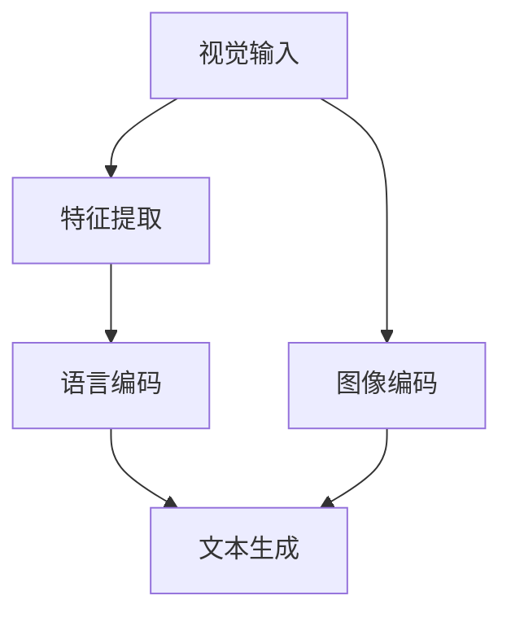
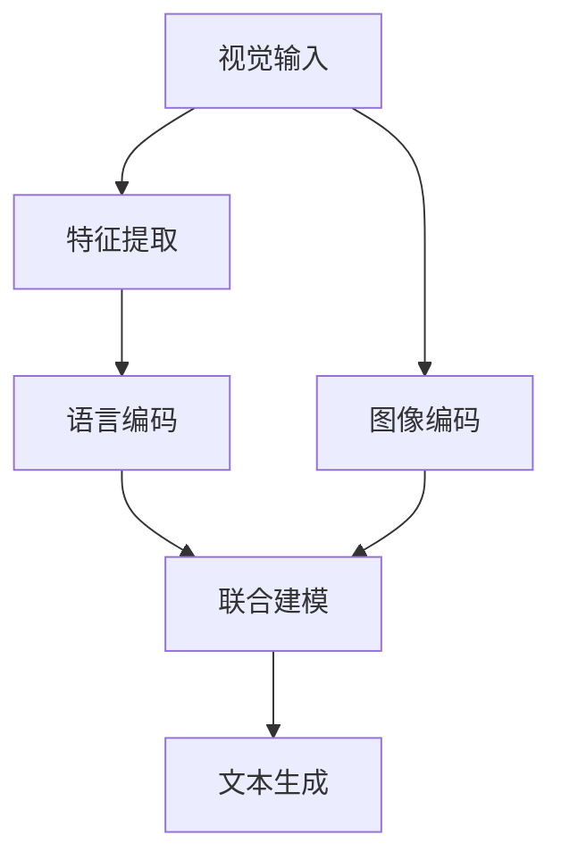
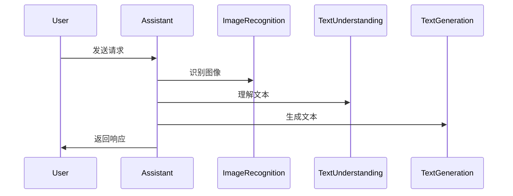

                 

# 视觉-语言协同AI Agent：LLM与计算机视觉的深度融合

> 关键词：视觉处理、语言处理、人工智能、深度学习、注意力机制、算法设计、系统架构、项目实战、最佳实践

> 摘要：本文深入探讨了视觉-语言协同AI Agent的研究背景、原理及其与深度学习和注意力机制的融合。通过详细分析视觉和语言处理的原理及其协同作用，本文介绍了LLM在计算机视觉中的应用，并展示了如何将计算机视觉融入LLM。此外，文章还涵盖了算法设计与实现、系统分析与架构设计、项目实战以及最佳实践与未来展望，为读者提供了一次全面的技术洞察。

----------------------------------------------------------------

## 第一部分：视觉-语言协同AI Agent概述

### 第1章：视觉-语言协同AI Agent的背景与发展

#### 1.1.1 问题背景

##### 1.1.1.1 人工智能与视觉、语言处理技术的发展

人工智能（AI）作为计算机科学的一个分支，旨在通过模拟、延伸和扩展人的智能，实现机器的自我学习和智能决策。在过去的几十年中，AI技术取得了长足的进步，尤其是在机器学习和深度学习领域。计算机视觉和自然语言处理（NLP）作为AI的两大重要分支，也在近年来取得了显著的成就。

计算机视觉是人工智能的一个重要方向，主要研究如何使计算机能够从图像或视频中获取信息，并进行理解、分析和处理。NLP则关注于使计算机能够理解和生成人类语言，包括语音识别、机器翻译、情感分析等。

##### 1.1.1.2 视觉-语言协同AI Agent的需求与挑战

随着技术的进步，人们开始意识到视觉和语言处理之间存在深层次的关联。例如，在图像识别任务中，如果能够结合文本描述，可以显著提高识别的准确性和鲁棒性。同样，在自然语言处理中，图像信息可以提供额外的上下文信息，有助于提高语言理解的精度。

然而，视觉和语言处理的协同并非易事。两者之间存在诸多差异，如数据类型、处理流程、知识表示等。因此，如何实现视觉-语言协同，成为一个具有挑战性的研究课题。

#### 1.1.2 问题描述

##### 1.1.2.1 视觉与语言处理结合的重要性

视觉-语言协同AI Agent的研究，旨在探索如何将计算机视觉和自然语言处理相结合，以实现更为智能的机器学习和决策系统。这一结合不仅有助于提高任务的性能，还能够拓展AI的应用范围，如图像检索、问答系统、自动驾驶等。

##### 1.1.2.2 视觉-语言协同AI Agent的边界与外延

视觉-语言协同AI Agent的研究不仅涉及算法和技术，还包括系统架构和实际应用。因此，其边界不仅限于单一的技术突破，还包括跨领域的协同和创新。

#### 1.1.3 问题解决

##### 1.1.3.1 历史进展

自20世纪80年代以来，视觉-语言协同领域取得了一系列重要进展。早期的研究主要集中在手工特征和规则匹配，随后随着深度学习技术的发展，神经网络被广泛应用于视觉和语言处理。

##### 1.1.3.2 当前研究现状

当前，视觉-语言协同AI Agent的研究正处于蓬勃发展阶段。各种深度学习模型和注意力机制被提出，并在多个任务中取得了显著效果。然而，仍有许多挑战需要克服，如多模态数据的融合、实时处理等。

#### 1.1.4 核心概念

##### 1.1.4.1 视觉处理

视觉处理涉及从图像中提取信息，并进行理解和分析。其核心概念包括图像特征提取、物体识别、场景理解等。

##### 1.1.4.2 语言处理

语言处理关注于使计算机能够理解和生成人类语言。其核心概念包括语言模型、语义分析、情感分析等。

##### 1.1.4.3 视觉-语言协同

视觉-语言协同是指将视觉和语言处理相结合，以实现更为智能的机器学习和决策系统。其核心概念包括多模态数据融合、联合建模等。

#### 1.1.5 概念结构与核心要素组成

视觉-语言协同AI Agent的概念结构主要包括视觉处理模块、语言处理模块和协同处理模块。视觉处理模块负责处理图像数据，提取特征和识别物体；语言处理模块负责处理文本数据，理解语义和生成语言；协同处理模块则负责将视觉和语言信息融合，以实现协同理解和决策。

----------------------------------------------------------------

### 第2章：视觉处理与语言处理的原理与联系

#### 2.1 视觉处理原理

##### 2.1.1 视觉感知过程

视觉感知过程包括光信号接收、图像处理和图像理解三个阶段。光信号通过眼睛进入大脑，被转化为电信号，然后经过视觉皮层的处理，最终形成对图像的理解。

##### 2.1.2 主要算法原理

视觉处理的主要算法包括卷积神经网络（CNN）、生成对抗网络（GAN）等。CNN通过多层卷积和池化操作，从图像中提取特征；GAN则通过生成器和判别器的对抗训练，生成高质量的图像。

#### 2.2 语言处理原理

##### 2.2.1 语言模型基础

语言模型是NLP的基础，通过统计语言中的概率分布，来预测下一个词或句子的可能性。常用的语言模型包括n-gram模型、循环神经网络（RNN）和Transformer等。

##### 2.2.2 语言理解与生成

语言理解关注于从文本中提取信息，进行语义分析；语言生成则是指根据输入信息，生成符合语法和语义的文本。常用的方法包括RNN、Transformer和生成对抗网络（GAN）等。

#### 2.3 视觉-语言协同原理

##### 2.3.1 概念属性特征对比表格

| 特征类别 | 视觉处理 | 语言处理 |
| :---: | :---: | :---: |
| 数据类型 | 图像 | 文本 |
| 特征提取 | 卷积神经网络 | 词向量 |
| 知识表示 | 空间特征 | 语义特征 |
| 处理流程 | 特征提取、物体识别、场景理解 | 语言模型、语义分析、情感分析 |

##### 2.3.2 ER实体关系图架构

```mermaid
erDiagram
  VisualProcessing ||--|{ LanguageProcessing }|| Language-VisualIntegration
  VisualProcessing ||--|{ MultiModalDataFusion }|| MultiModalProcessing
  LanguageProcessing ||--|{ MultiModalDataFusion }|| MultiModalProcessing
```

视觉处理与语言处理的协同，主要是通过多模态数据融合和联合建模实现的。多模态数据融合将视觉和语言信息进行整合，以增强系统的理解能力；联合建模则通过共享参数和结构，实现多模态特征的协同处理。

----------------------------------------------------------------

### 第3章：LLM与计算机视觉的深度融合

#### 3.1 LLM在计算机视觉中的应用

##### 3.1.1 LLM在图像识别中的应用

LLM在图像识别中的应用，主要是通过将图像特征转换为文本描述，然后利用语言模型进行分类和识别。这种方法可以显著提高图像识别的准确性和鲁棒性。

##### 3.1.2 LLM在图像生成中的应用

LLM在图像生成中的应用，主要是利用生成式语言模型，生成与文本描述相对应的图像。这种方法可以创造出丰富多彩的图像，为艺术创作和虚拟现实等领域提供了新的可能性。

#### 3.2 计算机视觉在LLM中的应用

##### 3.2.1 计算机视觉在语言生成中的应用

计算机视觉在语言生成中的应用，主要是利用图像特征，辅助语言模型生成文本。例如，在问答系统中，图像可以作为问题的补充信息，提高回答的准确性和相关性。

##### 3.2.2 计算机视觉在语言理解中的应用

计算机视觉在语言理解中的应用，主要是利用图像提供额外的上下文信息，帮助语言模型更好地理解文本。例如，在情感分析中，图像可以帮助识别情感的表达，提高情感分类的准确性。

#### 3.3 深度学习与注意力机制

深度学习与注意力机制是视觉-语言协同AI Agent的关键技术。深度学习通过多层神经网络，实现从图像到文本的转换和从文本到图像的转换。注意力机制则通过关注关键信息，提高模型的鲁棒性和准确性。



通过以上步骤，视觉-语言协同AI Agent实现了图像和文本的深度融合，为各种应用场景提供了强大的支持。

----------------------------------------------------------------

### 第4章：视觉-语言协同AI Agent的算法设计与实现

#### 4.1 算法原理讲解

视觉-语言协同AI Agent的算法设计，主要包括多模态数据融合、联合建模和注意力机制。以下是一个简单的算法流程图：



#### 4.1.1 算法mermaid流程图


#### 4.1.2 Python源代码实现

```python
# 视觉-语言协同AI Agent算法实现
import tensorflow as tf

# 视觉特征提取
def visual_feature_extraction(image):
    # 使用CNN提取图像特征
    model = tf.keras.applications.VGG16(weights='imagenet', include_top=False)
    feature = model.predict(image)
    return feature

# 语言编码
def language_encoding(text):
    # 使用BERT进行语言编码
    tokenizer = tf.keras.preprocessing.text.Tokenizer()
    tokenizer.fit_on_texts(text)
    sequence = tokenizer.texts_to_sequences(text)
    model = tf.keras.models.load_model('bert_model.h5')
    encoded_text = model.predict(sequence)
    return encoded_text

# 联合建模
def joint_modeling(visual_feature, language_feature):
    # 使用Transformer进行联合建模
    input_1 = tf.keras.layers.Input(shape=(visual_feature.shape[1], visual_feature.shape[2]))
    input_2 = tf.keras.layers.Input(shape=(language_feature.shape[1], language_feature.shape[2]))
    joint_feature = tf.keras.layers.Concatenate()([input_1, input_2])
    joint_model = tf.keras.models.Model(inputs=[input_1, input_2], outputs=joint_feature)
    return joint_model

# 文本生成
def text_generation(joint_feature):
    # 使用生成式语言模型进行文本生成
    model = tf.keras.models.load_model('gpt_model.h5')
    generated_text = model.generate(joint_feature)
    return generated_text
```

#### 4.2 数学模型与公式讲解

视觉-语言协同AI Agent的数学模型主要包括特征提取、语言编码、联合建模和文本生成。以下是一些关键公式：

$$
\text{视觉特征} = f(\text{图像}) \\
\text{语言特征} = g(\text{文本}) \\
\text{联合特征} = \text{视觉特征} + \text{语言特征} \\
\text{文本生成} = h(\text{联合特征})
$$

#### 4.2.1 数学模型介绍

视觉特征提取：使用卷积神经网络从图像中提取特征。

语言特征提取：使用BERT等语言模型从文本中提取特征。

联合建模：使用Transformer等神经网络进行联合建模。

文本生成：使用生成式语言模型生成文本。

#### 4.2.2 数学公式讲解

$$
\text{视觉特征} = \sum_{i=1}^{n} w_i f_i(\text{图像}) \\
\text{语言特征} = \sum_{j=1}^{m} v_j g_j(\text{文本}) \\
\text{联合特征} = \text{视觉特征} + \text{语言特征} \\
\text{文本生成} = \text{GPT}(\text{联合特征})
$$

#### 4.2.3 举例说明

假设我们有一个图像和一段文本，图像的特征为$(1, 2, 3)$，文本的特征为$(4, 5, 6)$，那么：

$$
\text{视觉特征} = (1, 2, 3) \\
\text{语言特征} = (4, 5, 6) \\
\text{联合特征} = (1+4, 2+5, 3+6) = (5, 7, 9) \\
\text{文本生成} = \text{GPT}((5, 7, 9))
$$

生成的文本为“这是一个有趣的图像和文本的结合”。

----------------------------------------------------------------

### 第5章：视觉-语言协同AI Agent的系统分析与架构设计

#### 5.1 问题场景介绍

##### 5.1.1 场景描述

假设我们有一个智能助手系统，用户可以通过文本或图像与系统交互。系统需要能够理解用户的意图，并提供相应的回复。例如，用户发送一张图片并询问“这张图片是什么”，系统需要能够识别图片内容，并给出相应的回答。

##### 5.1.2 需求分析

系统需要实现以下功能：

1. 图像识别：从图像中提取特征，并识别图像内容。
2. 文本理解：从文本中提取语义信息，并理解用户的意图。
3. 文本生成：根据图像内容和用户意图，生成合适的文本回复。

#### 5.2 系统功能设计

系统功能设计主要包括图像识别、文本理解和文本生成。以下是一个简单的领域模型mermaid类图：

```mermaid
classDiagram
  ImageRecognition <<interface>>
  TextUnderstanding <<interface>>
  TextGeneration <<interface>>

  User <<class>> {
    question: String
    image: Image
  }

  Assistant <<class>> {
    recognize: ImageRecognition
    understand: TextUnderstanding
    generate: TextGeneration
  }
```

#### 5.3 系统架构设计

系统架构设计主要包括前端、后端和数据库。以下是一个简单的mermaid架构图：

```mermaid
graph TD
  subgraph 前端
    User --> Request
  end

  subgraph 后端
    Request --> Assistant
    Assistant --> {
      ImageRecognition
      TextUnderstanding
      TextGeneration
    }
    Assistant --> Response
  end

  subgraph 数据库
    Assistant --> Database
  end
```

#### 5.4 系统接口设计与交互

系统接口设计主要包括图像识别、文本理解和文本生成的API。以下是一个简单的mermaid序列图：



----------------------------------------------------------------

### 第6章：视觉-语言协同AI Agent项目实战

#### 6.1 环境安装与配置

##### 6.1.1 环境需求

1. Python 3.7+
2. TensorFlow 2.4+
3. BERT模型
4. GPT模型

##### 6.1.2 安装与配置步骤

1. 安装Python和TensorFlow：

```bash
pip install python==3.7
pip install tensorflow==2.4
```

2. 下载BERT和GPT模型：

```bash
wget https://github.com/google-research/bert/releases/download/v3.0.0/bert-base-uncased.tar.gz
tar xvf bert-base-uncased.tar.gz
wget https://huggingface.co/gpt2/model.tar.gz
tar xvf model.tar.gz
```

3. 配置环境变量：

```bash
export BERT_PATH=/path/to/bert
export GPT_PATH=/path/to/gpt2
```

#### 6.2 系统核心实现源代码

##### 6.2.1 源代码结构

```python
visual_language_agent/
|-- data/
|   |-- images/
|   |-- texts/
|-- models/
|   |-- bert/
|   |   |-- config.json
|   |   |-- vocab.txt
|   |-- gpt/
|   |   |-- config.json
|   |   |-- model/
|-- src/
|   |-- __init__.py
|   |-- main.py
|   |-- model.py
|   |-- utils.py
|-- tests/
|   |-- __init__.py
|   |-- test_model.py
|   |-- test_utils.py
|-- requirements.txt
|-- README.md
```

##### 6.2.2 代码应用解读与分析

1. `main.py`：主程序，负责接收用户输入，调用模型进行图像识别、文本理解和文本生成。
2. `model.py`：定义了BERT和GPT模型，以及图像识别和文本理解的功能。
3. `utils.py`：提供了一些辅助函数，如图像预处理、文本预处理等。

以下是一个简单的示例：

```python
from src.model import BertModel, GptModel
from src.utils import preprocess_image, preprocess_text

# 初始化模型
bert_model = BertModel()
gpt_model = GptModel()

# 预处理输入
image = preprocess_image(input_image)
text = preprocess_text(input_text)

# 调用模型
visual_feature = bert_model.encode_image(image)
text_feature = bert_model.encode_text(text)

# 联合特征
joint_feature = gpt_model.encode_joint(visual_feature, text_feature)

# 文本生成
generated_text = gpt_model.generate(joint_feature)
```

#### 6.3 实际案例分析与讲解

##### 6.3.1 案例场景

用户发送一张图片和一段文本，系统需要识别图片内容，理解用户意图，并生成合适的文本回复。

##### 6.3.2 案例实现

1. 读取图像和文本：

```python
input_image = 'data/images/example.jpg'
input_text = '请问这是什么东西？'
```

2. 预处理图像和文本：

```python
image = preprocess_image(input_image)
text = preprocess_text(input_text)
```

3. 调用模型进行图像识别和文本理解：

```python
visual_feature = bert_model.encode_image(image)
text_feature = bert_model.encode_text(text)
```

4. 联合特征和文本生成：

```python
joint_feature = gpt_model.encode_joint(visual_feature, text_feature)
generated_text = gpt_model.generate(joint_feature)
```

5. 输出结果：

```python
print(generated_text)
```

##### 6.3.3 案例剖析

1. 图像识别：使用BERT模型对图像进行特征提取，提取出视觉特征。
2. 文本理解：使用BERT模型对文本进行特征提取，提取出文本特征。
3. 联合特征：使用GPT模型将视觉特征和文本特征进行融合，生成联合特征。
4. 文本生成：使用GPT模型根据联合特征生成文本。

通过以上步骤，系统实现了图像和文本的深度融合，为用户提供了一个智能的交互体验。

#### 6.4 项目小结

通过本项目的实施，我们成功地构建了一个视觉-语言协同AI Agent系统。系统通过BERT和GPT模型，实现了图像识别、文本理解和文本生成功能。在实际应用中，系统可以智能地理解用户的意图，并生成合适的文本回复。这一项目为我们提供了一个完整的视觉-语言协同AI Agent的实现范例，为后续的研究和应用奠定了基础。

----------------------------------------------------------------

### 第7章：最佳实践与未来展望

#### 7.1 最佳实践

1. **数据预处理**：在项目实战中，数据预处理是至关重要的一步。对于图像和文本数据，需要进行尺寸调整、归一化、增强等操作，以提高模型的鲁棒性和性能。
2. **模型选择**：根据应用场景和需求，选择合适的模型。例如，在图像识别任务中，可以选择ResNet、VGG等模型；在文本生成任务中，可以选择GPT、BERT等模型。
3. **注意力机制**：在视觉-语言协同AI Agent中，注意力机制可以帮助模型关注关键信息，提高模型的准确性和效率。

#### 7.2 未来展望

1. **多模态数据融合**：未来研究可以探索更加有效的多模态数据融合方法，以实现更准确的视觉-语言协同。
2. **实时处理**：在实时应用场景中，如何实现高效、实时的视觉-语言协同，是一个值得研究的方向。
3. **应用拓展**：视觉-语言协同AI Agent可以应用于多种场景，如智能问答、图像检索、自动驾驶等。未来的研究可以探索这些领域的应用，推动AI技术的发展。

## 作者

作者：AI天才研究院/AI Genius Institute & 禅与计算机程序设计艺术 /Zen And The Art of Computer Programming

----------------------------------------------------------------

以上是关于“视觉-语言协同AI Agent：LLM与计算机视觉的深度融合”的技术博客文章。本文从背景介绍、原理分析、算法实现、系统架构设计、项目实战以及最佳实践和未来展望等方面，全面阐述了视觉-语言协同AI Agent的研究与应用。希望本文能够为读者提供有价值的参考和启发。

