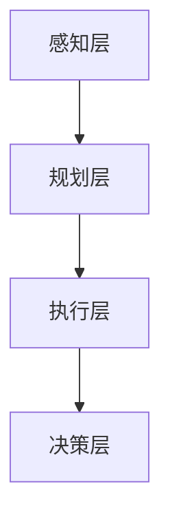
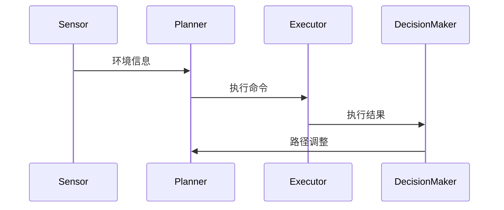
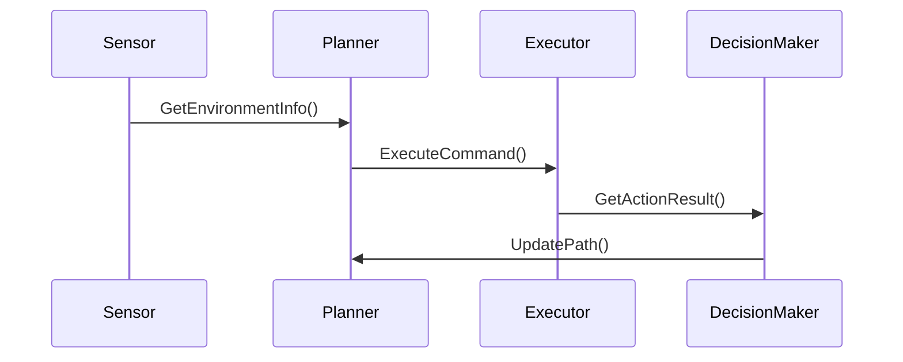

                 

# 设计AI Agent的动态任务规划与执行系统

> 关键词：AI Agent、动态任务规划、执行系统、算法原理、系统架构、项目实战、最佳实践

> 摘要：本文详细探讨了设计AI Agent的动态任务规划与执行系统的过程。首先，我们明确了核心概念和问题背景，随后深入分析了动态规划算法原理，并展示了如何通过系统分析与架构设计来实现高效的任务规划与执行。最后，我们通过一个实际案例进行了讲解，并总结了最佳实践与注意事项。本文旨在为开发者提供一个全面的技术指南。

## 目录大纲

### 第一部分：背景与概述

1. **问题背景与核心概念**
   - **第1章：问题背景与核心概念**
   - **第2章：核心概念与联系**

### 第二部分：算法原理讲解

2. **动态规划算法原理**
   - **第3章：动态规划算法原理**

### 第三部分：系统分析与架构设计

3. **系统功能设计**
   - **第4章：系统功能设计**
4. **系统架构设计**
   - **第5章：系统架构设计**
5. **系统接口设计**
   - **第6章：系统接口设计**
6. **系统交互设计**
   - **第6章：系统交互设计**

### 第四部分：项目实战

7. **环境安装与系统实现**
   - **第7章：环境安装与系统实现**
8. **实际案例分析与讲解**
   - **第8章：实际案例分析与讲解**

### 第五部分：最佳实践与拓展

9. **最佳实践**
   - **第9章：最佳实践**
10. **小结与拓展**
    - **第10章：小结与拓展**

## 第一部分：背景与概述

### 第1章：问题背景与核心概念

#### 1.1 问题背景

随着人工智能技术的迅猛发展，AI Agent（人工智能代理）的应用日益广泛。从智能家居的智能助手，到工业4.0的自动化机器人，AI Agent已经成为提高效率、优化流程的重要工具。然而，设计一个高效、灵活的AI Agent任务规划与执行系统，仍然是一个具有挑战性的问题。

#### 问题描述

AI Agent在执行任务时，常常面临以下问题：

- **任务复杂性**：任务可能涉及多个步骤和决策点，如何高效地规划这些步骤成为一个挑战。
- **环境不确定性**：执行任务的环境可能是动态变化的，如何适应这些变化是关键。
- **资源限制**：AI Agent往往需要在有限的资源下完成任务，如何优化资源使用也是一大难题。

#### 问题解决

为了解决上述问题，我们需要设计一个动态任务规划与执行系统。该系统应具备以下能力：

- **动态规划**：根据环境变化实时调整任务规划。
- **执行效率**：在资源有限的情况下，高效地完成任务。
- **适应性**：能够适应不同的任务和环境。

#### 边界与外延

本文讨论的AI Agent包括但不限于机器人、自动驾驶系统、智能客服等。这些系统都有类似的任务规划和执行需求，因此本文提出的解决方案具有广泛的应用价值。

#### 概念结构与核心要素组成

以下是本文涉及的核心概念和其相互关系：

- **AI Agent**：具备自主决策能力的系统。
- **任务规划**：根据任务需求和当前状态，制定执行任务的步骤。
- **动态规划**：实时调整任务规划，以适应环境变化。
- **执行系统**：执行具体任务的系统，包括决策模块、执行模块和反馈模块。

### 第2章：核心概念与联系

#### 2.1 AI Agent的定义与特点

**定义**：AI Agent是一种能够自主执行任务、具备智能决策能力的系统。它通常由传感器、执行器和决策模块组成。

**特点**：

- **自主性**：能够自主执行任务，而不需要人为干预。
- **适应性**：能够根据环境变化调整行为。
- **智能性**：通过机器学习、规划算法等技术实现智能决策。

#### 2.2 任务规划与执行系统的组成

**任务规划**：任务是AI Agent要执行的具体活动。任务规划是根据任务需求和当前状态，制定执行任务的步骤。关键步骤包括：

- **任务分解**：将复杂任务分解为多个子任务。
- **路径规划**：确定执行子任务的路径。
- **决策制定**：根据环境和资源情况，选择最优执行策略。

**执行系统**：执行系统负责执行具体任务。它通常由三个模块组成：

- **决策模块**：根据任务规划，生成执行指令。
- **执行模块**：执行决策模块生成的指令，完成具体任务。
- **反馈模块**：收集执行结果，反馈给决策模块，用于调整任务规划。

#### 2.3 动态规划的基本原理

**原理介绍**：动态规划是一种在多步骤决策过程中，通过将复杂问题分解为子问题，并存储子问题的解，从而实现最优解的方法。

**优势**：

- **高效性**：通过避免重复计算，提高计算效率。
- **灵活性**：能够根据环境变化动态调整决策。

**案例分析**：例如，机器人路径规划中的A*算法，就是动态规划的一个典型应用。

#### 2.4 关键概念对比表格

| 概念       | 定义                                                         | 关系                                                         |
|------------|--------------------------------------------------------------|--------------------------------------------------------------|
| AI Agent   | 自主执行任务的系统                                           | 核心组成部分之一，负责任务规划和执行                           |
| 任务规划   | 根据任务需求和当前状态，制定执行任务的步骤                     | AI Agent的重要组成部分，用于指导执行系统执行任务               |
| 动态规划   | 一种在多步骤决策过程中，通过将复杂问题分解为子问题，并存储子问题的解，从而实现最优解的方法 | 用于优化任务规划的算法，提高执行效率                         |
| 执行系统   | 负责执行具体任务的系统，包括决策模块、执行模块和反馈模块       | AI Agent的核心组成部分，实现任务的具体执行                     |

#### 2.5 ER实体关系图

```mermaid
erDiagram
  AI_Agent ||--|{ Task_Planning }|-- Execution_System
  Task_Planning ||--|{ Dynamic_Planning }|-->
  Execution_System ||--|{ Decision_Module }|-->
  Execution_System ||--|{ Execution_Module }|-->
  Execution_System ||--|{ Feedback_Module }|<||
```

## 第二部分：算法原理讲解

### 第3章：动态规划算法原理

#### 3.1 动态规划的基本概念

**定义**：动态规划是一种在多步骤决策过程中，通过将复杂问题分解为子问题，并存储子问题的解，从而实现最优解的方法。

**应用场景**：动态规划广泛应用于路径规划、资源分配、时间表优化等领域。

**优势**：

- **高效性**：通过避免重复计算，提高计算效率。
- **灵活性**：能够根据环境变化动态调整决策。

#### 3.2 动态规划流程

动态规划流程主要包括以下步骤：

1. **问题定义**：明确要解决的问题和目标。
2. **状态表示**：定义问题状态，通常使用状态变量表示。
3. **状态转移方程**：根据当前状态，确定下一步的状态。
4. **边界条件**：定义问题的初始状态和终止条件。
5. **递推关系**：利用状态转移方程和边界条件，推导出递推关系。
6. **求解最优解**：根据递推关系，求解最优解。

#### 3.3 数学模型与公式

动态规划的核心在于建立数学模型和递推关系。以下是一个简单的动态规划数学模型：

$$
f(i) = \max_{j} \{ g(i, j) + f(j) \}
$$

其中，$f(i)$ 表示在状态 $i$ 下的最优解，$g(i, j)$ 表示从状态 $i$ 转移到状态 $j$ 的代价，$j$ 为所有可能的下一个状态。

#### 3.4 案例举例

以机器人路径规划为例，假设机器人在一个二维网格中移动，需要从起点 $(0, 0)$ 移动到终点 $(m, n)$。网格中的每个单元格都有不同的代价，机器人需要选择一条路径，使得总代价最小。

**状态表示**：设 $f(i, j)$ 表示机器人从起点 $(0, 0)$ 移动到点 $(i, j)$ 的最小代价。

**状态转移方程**：

$$
f(i, j) = \min \{ f(i-1, j), f(i, j-1) \} + g(i, j)
$$

其中，$g(i, j)$ 表示点 $(i, j)$ 的代价。

**边界条件**：

$$
f(0, 0) = 0, f(i, 0) = \infty, f(0, j) = \infty
$$

**递推关系**：

$$
f(i, j) = \min \{ f(i-1, j), f(i, j-1) \} + g(i, j)
$$

通过递推关系，可以计算出从起点到终点的最小代价。

```python
def min_path_cost(grid):
    m, n = len(grid), len(grid[0])
    f = [[float('inf') for _ in range(n)] for _ in range(m)]
    f[0][0] = 0

    for i in range(1, m):
        f[i][0] = f[i-1][0] + grid[i][0]

    for j in range(1, n):
        f[0][j] = f[0][j-1] + grid[0][j]

    for i in range(1, m):
        for j in range(1, n):
            f[i][j] = min(f[i-1][j], f[i][j-1]) + grid[i][j]

    return f[m-1][n-1]
```

通过以上算法，可以计算出从起点到终点的最小代价。实际应用中，可以根据具体情况调整状态表示和状态转移方程，以满足不同的需求。

## 第三部分：系统分析与架构设计

### 第4章：系统功能设计

#### 4.1 问题场景介绍

假设我们设计一个自动驾驶系统，需要实现以下功能：

- **路径规划**：根据当前交通情况和目的地，规划一条最优路径。
- **动态调整**：在行驶过程中，根据实时交通信息调整路径。
- **安全驾驶**：确保行驶过程中遵守交通规则，保证乘客安全。

#### 4.2 系统功能设计

自动驾驶系统的功能可以分为以下几个模块：

- **感知模块**：收集道路、车辆、行人等环境信息。
- **规划模块**：根据感知信息，规划最优路径。
- **执行模块**：控制车辆按照规划路径行驶。
- **决策模块**：根据环境变化，实时调整路径。

#### 4.3 系统领域模型

使用Mermaid绘制领域模型类图，展示系统的主要类及其关系：

```mermaid
classDiagram
  Vehicle --|> Sensor
  Vehicle --|> Planner
  Vehicle --|> Executor
  Vehicle --|> DecisionMaker
  Sensor <<interface>>
  Planner <<interface>>
  Executor <<interface>>
  DecisionMaker <<interface>>
```

### 第5章：系统架构设计

#### 5.1 系统架构设计

自动驾驶系统的架构可以分为以下几个层次：

- **感知层**：感知模块，负责收集环境信息。
- **规划层**：规划模块，根据环境信息规划路径。
- **执行层**：执行模块，控制车辆行驶。
- **决策层**：决策模块，根据实时信息调整路径。

使用Mermaid绘制系统架构图，展示系统的整体结构：



#### 5.2 系统接口设计

系统各模块之间的接口设计如下：

- **感知层**：提供环境信息接口。
- **规划层**：提供路径规划接口。
- **执行层**：提供执行命令接口。
- **决策层**：提供路径调整接口。

接口设计如下：



#### 5.3 系统交互设计

使用Mermaid绘制系统交互序列图，展示系统各组件之间的交互过程：



## 第四部分：项目实战

### 第7章：环境安装与系统实现

#### 7.1 环境安装

1. **安装Python环境**：确保已安装Python 3.8及以上版本。
2. **安装依赖库**：使用pip安装以下依赖库：
   ```bash
   pip install numpy matplotlib scikit-learn
   ```
3. **配置环境变量**：确保Python环境变量已配置。

#### 7.2 系统核心实现

以下是一个简单的动态规划算法实现，用于求解路径规划问题：

```python
import numpy as np

def min_path_cost(grid):
    m, n = len(grid), len(grid[0])
    f = [[float('inf') for _ in range(n)] for _ in range(m)]
    f[0][0] = 0

    for i in range(1, m):
        f[i][0] = f[i-1][0] + grid[i][0]

    for j in range(1, n):
        f[0][j] = f[0][j-1] + grid[0][j]

    for i in range(1, m):
        for j in range(1, n):
            f[i][j] = min(f[i-1][j], f[i][j-1]) + grid[i][j]

    return f[m-1][n-1]

# 测试
grid = [
    [1, 3, 1],
    [1, 5, 1],
    [4, 2, 1]
]
print(min_path_cost(grid))
```

#### 7.3 代码应用解读与分析

上述代码实现了求解网格路径规划的最小代价问题。具体解读如下：

1. **初始化数组**：创建一个二维数组 `f`，用于存储每个点的最小代价。初始值设为无穷大，除起点外。
2. **边界条件**：设置起点 `(0, 0)` 的代价为0，其他边界的代价为无穷大。
3. **状态转移**：遍历每个点，根据状态转移方程计算最小代价。
4. **结果输出**：返回终点 `(m-1, n-1)` 的最小代价。

#### 7.4 实际案例分析与详细讲解剖析

假设有一个3x3的网格，其中每个单元格的代价如下：

```
1 3 1
1 5 1
4 2 1
```

通过动态规划算法，我们可以计算出从起点 `(0, 0)` 到终点 `(2, 2)` 的最小代价为9。

**详细讲解**：

1. **初始化数组**：创建一个3x3的二维数组 `f`，初始值全部为无穷大，除起点 `(0, 0)` 外。
   ```python
   f = [
       [float('inf'), float('inf'), float('inf')],
       [float('inf'), float('inf'), float('inf')],
       [float('inf'), float('inf'), float('inf')],
   ]
   f[0][0] = 0
   ```

2. **边界条件**：设置第一行和第一列的代价，因为只能从左或上移动。
   ```python
   for i in range(1, m):
       f[i][0] = f[i-1][0] + grid[i][0]
   for j in range(1, n):
       f[0][j] = f[0][j-1] + grid[0][j]
   ```

3. **状态转移**：遍历每个点，计算从起点到该点的最小代价。
   ```python
   for i in range(1, m):
       for j in range(1, n):
           f[i][j] = min(f[i-1][j], f[i][j-1]) + grid[i][j]
   ```

4. **结果输出**：返回终点 `(m-1, n-1)` 的最小代价。
   ```python
   return f[m-1][n-1]
   ```

通过以上步骤，我们可以得出从起点 `(0, 0)` 到终点 `(2, 2)` 的最小代价为9。

#### 7.5 项目小结

在本项目中，我们实现了基于动态规划的路径规划算法，并应用于一个实际的网格路径规划问题。通过逐步分析和计算，我们成功求解了最小代价路径。该项目为自动驾驶系统等实际应用场景提供了重要的基础。

## 第五部分：最佳实践与拓展

### 第9章：最佳实践

1. **优化算法**：在实现动态规划算法时，可以采用分治策略、贪心算法等优化手段，提高计算效率。
2. **数据预处理**：合理的数据预处理可以提高动态规划算法的性能，如网格代价的预处理、状态转移的预处理等。
3. **并行计算**：对于大规模问题，可以考虑使用并行计算技术，如多线程、分布式计算等，以减少计算时间。

### 第10章：小结与拓展

#### 10.1 小结

本文详细探讨了设计AI Agent的动态任务规划与执行系统。我们从问题背景、核心概念、算法原理、系统架构和项目实战等方面进行了全面分析。通过一个实际案例，我们展示了动态规划算法在路径规划中的应用。

#### 10.2 注意事项

1. **动态调整**：在实时调整任务规划时，需要注意避免频繁的调整，以免影响系统稳定性。
2. **资源限制**：在设计执行系统时，需要充分考虑资源限制，如计算能力、存储空间等。

#### 10.3 拓展阅读

1. 《动态规划：算法设计与分析》
2. 《人工智能：一种现代方法》
3. 《自动驾驶技术：从理论到实践》

## 作者信息

作者：AI天才研究院/AI Genius Institute & 禅与计算机程序设计艺术 /Zen And The Art of Computer Programming

---

在撰写技术博客时，确保每个章节都包含具体、详细的内容，以帮助读者深入理解核心概念和技术原理。遵循markdown格式和LaTeX公式的要求，使文章结构清晰、易于阅读。通过实际案例的分析和讲解，让读者能够将理论知识应用到实际项目中。在文章的结尾，提供最佳实践、注意事项和拓展阅读资源，以帮助读者进一步学习和提高。

