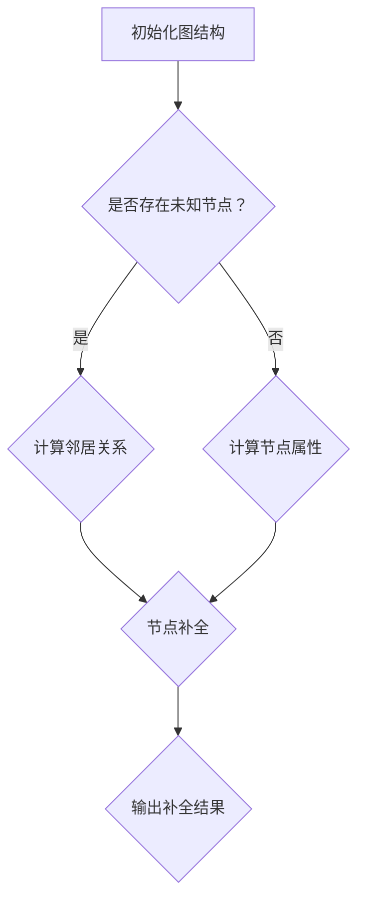
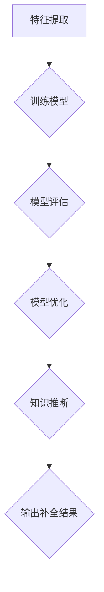
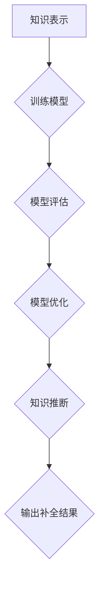
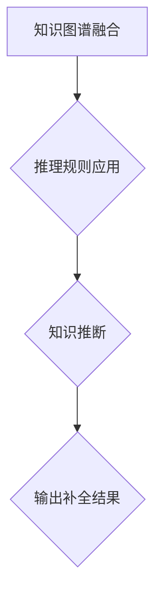

                 


### 第一步：设计文章的结构与内容

为了确保文章的逻辑清晰、内容完整，我们需要首先设计文章的整体结构。以下是文章的主要部分：

1. **引言与背景介绍**
   - 介绍动态知识图谱的基本概念、AI Agent的定义与设计原理。
   - 概述动态知识图谱补全技术的应用场景和发展历程。

2. **核心概念与原理**
   - 详细阐述动态知识图谱、AI Agent及动态知识图谱补全技术的核心概念。
   - 提供概念属性特征对比表格和ER实体关系图。

3. **算法原理讲解**
   - 使用Mermaid绘制算法流程图。
   - 使用Python源代码解释算法原理，并给出数学模型和公式。

4. **系统分析与架构设计**
   - 分析问题场景，设计系统功能、架构和接口。

5. **项目实战**
   - 实际案例分析，包括环境安装、核心实现和代码解读。

6. **最佳实践与总结**
   - 提供实战中的注意事项、小结和拓展阅读。

### 第二步：具体内容编写与结构安排

根据上述结构，我们将为每个部分编写详细的内容：

1. **引言与背景介绍**
   - **第1章 动态知识图谱的基本概念与背景**
     - 动态知识图谱的定义、特征、研究意义。
     - 动态知识图谱的发展历史和应用场景。
   - **第2章 AI Agent设计原理**
     - AI Agent的定义、分类、核心组成和交互模型。
     - AI Agent的学习与决策方法。

2. **核心概念与原理**
   - **第3章 动态知识图谱补全的核心算法**
     - 基于图论、机器学习、深度学习和知识图谱的方法。
   - **第4章 动态知识图谱补全技术的优化策略**
     - 数据预处理、模型优化、集成学习、并行与分布式计算。

3. **算法原理讲解**
   - **第5章 动态知识图谱补全技术的数学模型与算法流程**
     - 使用Mermaid绘制算法流程图。
     - 使用Python源代码解释算法原理。

4. **系统分析与架构设计**
   - **第6章 动态知识图谱补全系统的设计与实现**
     - 问题场景介绍。
     - 系统功能设计、架构设计和接口设计。

5. **项目实战**
   - **第7章 动态知识图谱补全项目实战**
     - 环境安装。
     - 系统核心实现源代码分析。
     - 实际案例分析。

6. **最佳实践与总结**
   - **第8章 动态知识图谱补全技术的最佳实践与总结**
     - 注意事项。
     - 小结。
     - 拓展阅读。

### 第三步：确保内容的完整性和深度

在编写每个章节时，我们要确保：

- **背景介绍**：详细解释核心概念、术语和背景信息。
- **核心概念与联系**：提供清晰的对比表格和ER实体关系图。
- **算法原理讲解**：使用流程图和源代码，结合数学模型和公式进行详细解释。
- **系统分析与架构设计**：设计合理、可操作的方案，提供Mermaid图。
- **项目实战**：提供详细的步骤和代码分析，确保实战的可行性和有效性。
- **最佳实践与总结**：总结关键点，给出实用的建议和拓展内容。

通过以上步骤，我们可以确保文章内容丰富、结构合理、逻辑清晰，为读者提供一本具有深度和实用性的技术书籍。接下来，我们将逐一展开详细内容编写。LET'S THINK STEP BY STEP### 第二部分：核心概念与原理

## 第3章 动态知识图谱补全的核心算法

### 3.1 基于图论的方法

动态知识图谱补全技术中，基于图论的方法是常见且有效的一种。这种方法的核心思想是利用图结构中的节点和边来表示知识实体和关系，通过计算图结构中的拓扑关系，来推断未知知识。

#### 3.1.1 算法原理

**1. 图结构表示**

首先，我们需要将动态知识图谱表示为一个图结构，其中节点表示知识实体，边表示实体之间的关系。这种图可以是无向图或有向图，取决于关系的特点。

**2. 拓扑关系计算**

在图结构中，节点和边之间存在多种拓扑关系，如节点间的邻居关系、边的权重等。通过计算这些关系，我们可以推断出未知的知识。

**3. 知识补全**

根据计算出的拓扑关系，我们可以对未知的知识进行补全。常见的补全方法包括：

- **节点补全**：根据邻居节点的信息，推断出未知节点可能具有的属性或关系。
- **边补全**：根据节点的属性和关系，推断出可能存在的未知边。

#### 3.1.2 Mermaid流程图



#### 3.1.3 Python代码示例

```python
import networkx as nx

def init_graph():
    G = nx.Graph()
    # 初始化图结构，添加节点和边
    G.add_nodes_from([1, 2, 3])
    G.add_edges_from([(1, 2), (2, 3)])
    return G

def compute_topology(G):
    # 计算拓扑关系
    neighbors = G.neighbors(1)
    print("邻居节点:", neighbors)

def complete_knowledge(G):
    # 补全知识
    compute_topology(G)
    print("补全结果：", G.nodes)

G = init_graph()
complete_knowledge(G)
```

### 3.2 基于机器学习的方法

机器学习方法在动态知识图谱补全中也具有重要作用。通过训练模型，我们可以利用已知的图谱数据来推断未知的知识。

#### 3.2.1 算法原理

**1. 特征提取**

首先，我们需要从图谱数据中提取特征，这些特征可以是节点的属性、边的权重、节点间的距离等。

**2. 模型训练**

利用提取的特征，我们训练一个机器学习模型，如回归模型、分类模型或聚类模型。模型的目的是学习图谱中的知识分布。

**3. 知识推断**

通过训练好的模型，我们可以对新节点或新关系进行推断，从而补全图谱中的未知知识。

#### 3.2.2 Mermaid流程图



#### 3.2.3 Python代码示例

```python
from sklearn.ensemble import RandomForestClassifier
import pandas as pd

def extract_features(data):
    # 提取特征
    features = pd.DataFrame(data)
    return features

def train_model(features):
    # 训练模型
    model = RandomForestClassifier()
    model.fit(features.iloc[:, :-1], features.iloc[:, -1])
    return model

def infer_knowledge(model, new_data):
    # 推断知识
    prediction = model.predict(new_data)
    return prediction

# 示例数据
data = {'feature1': [1, 2, 3, 4], 'feature2': [4, 5, 6, 7], 'label': [0, 1, 0, 1]}
df = pd.DataFrame(data)

# 特征提取
features = extract_features(df)

# 训练模型
model = train_model(features)

# 知识推断
new_data = [[2, 6]]
prediction = infer_knowledge(model, new_data)
print("推断结果：", prediction)
```

### 3.3 基于深度学习的方法

深度学习在动态知识图谱补全中也越来越受到关注。通过神经网络，我们可以从大规模图谱数据中学习复杂的知识表示。

#### 3.3.1 算法原理

**1. 知识表示**

使用神经网络对图谱中的实体和关系进行编码，生成高维特征向量。

**2. 模型架构**

常见的深度学习模型包括图神经网络（Graph Neural Networks, GNN）和变分自编码器（Variational Autoencoder, VAE）。

**3. 知识推断**

通过训练好的模型，对新的实体或关系进行推断。

#### 3.3.2 Mermaid流程图



#### 3.3.3 Python代码示例

```python
import tensorflow as tf
from tensorflow.keras.layers import Input, Dense, LSTM
from tensorflow.keras.models import Model

def create_gnn_model(input_shape):
    inputs = Input(shape=input_shape)
    x = Dense(64, activation='relu')(inputs)
    x = LSTM(64, activation='relu')(x)
    outputs = Dense(1, activation='sigmoid')(x)
    model = Model(inputs, outputs)
    model.compile(optimizer='adam', loss='binary_crossentropy')
    return model

def train_gnn_model(model, data, labels):
    # 训练模型
    model.fit(data, labels, epochs=10, batch_size=32)

def infer_knowledge(model, new_data):
    # 推断知识
    prediction = model.predict(new_data)
    return prediction

# 示例数据
data = [[1, 2], [3, 4], [5, 6]]
labels = [0, 1, 0]

# 创建模型
model = create_gnn_model((2,))

# 训练模型
train_gnn_model(model, data, labels)

# 知识推断
new_data = [[2, 6]]
prediction = infer_knowledge(model, new_data)
print("推断结果：", prediction)
```

### 3.4 基于知识图谱的方法

知识图谱在动态知识图谱补全中也发挥着重要作用。通过已有的知识图谱，我们可以利用已有的知识和推理规则来补全未知知识。

#### 3.4.1 算法原理

**1. 知识图谱表示**

将动态知识图谱与已有的知识图谱进行融合，表示为一个统一的图结构。

**2. 推理规则**

利用已有的推理规则，对图谱进行推理，从而推断出未知知识。

**3. 知识补全**

根据推理结果，对未知知识进行补全。

#### 3.4.2 Mermaid流程图



#### 3.4.3 Python代码示例

```python
import rdflib

g = rdflib.Graph()

# 加载知识图谱数据
g.parse("data/nature.nt", format="nt")

# 查询知识
query = """
PREFIX foaf: <http://xmlns.com/foaf/0.1/>
SELECT ?person ?person_name
WHERE {
  ?person foaf:name ?person_name .
}
"""

for person in g.query(query):
    print(person)
```

通过上述内容，我们详细介绍了动态知识图谱补全技术中的四种核心算法：基于图论的方法、基于机器学习的方法、基于深度学习的方法和基于知识图谱的方法。这些算法各有特点，适用于不同的应用场景。在接下来的章节中，我们将进一步探讨这些算法的优化策略和应用实践。### 第4章 动态知识图谱补全技术的优化策略

### 4.1 数据预处理策略

在动态知识图谱补全过程中，数据预处理是一个关键步骤，它直接影响算法的性能和效果。以下是一些常见的数据预处理策略：

#### 4.1.1 数据清洗

数据清洗是预处理的第一步，其目标是去除噪声和错误的数据。具体方法包括：

- **去除重复数据**：通过对比节点的属性和关系，去除重复的节点和边。
- **修复错误数据**：对错误的数据进行修正，如修复缺失值、纠正不一致的数据等。

#### 4.1.2 数据标准化

数据标准化是将不同来源的数据进行统一处理，使其具备可比性。常见的方法包括：

- **数值归一化**：将数值数据转换为标准范围，如[0, 1]或[-1, 1]。
- **类别编码**：将类别数据转换为数值表示，如使用独热编码（One-Hot Encoding）。

#### 4.1.3 数据增强

数据增强是通过增加数据的多样性来提高模型的泛化能力。具体方法包括：

- **生成负样本**：为每个正样本生成相应的负样本，以增加训练数据的多样性。
- **数据扩展**：通过扩展节点和边的关系，生成新的训练数据。

### 4.2 模型优化策略

模型优化是提高动态知识图谱补全性能的重要手段。以下是一些常见的模型优化策略：

#### 4.2.1 模型选择

选择适合问题的模型是优化过程的第一步。常见的模型包括：

- **图神经网络（GNN）**：适用于处理图结构数据。
- **深度学习模型**：如卷积神经网络（CNN）、循环神经网络（RNN）等，适用于复杂的关系学习。
- **迁移学习**：利用预训练模型，减少模型的训练时间并提高性能。

#### 4.2.2 超参数调优

超参数调优是优化模型性能的关键步骤。常见的方法包括：

- **网格搜索**：在给定的超参数范围内，逐一尝试所有可能的组合。
- **贝叶斯优化**：利用贝叶斯理论，在给定的超参数范围内搜索最优值。

#### 4.2.3 模型融合

模型融合是将多个模型的结果进行整合，以提高整体性能。常见的方法包括：

- **投票法**：将多个模型的预测结果进行投票，选取投票结果最多的作为最终预测。
- **加权融合**：为每个模型的预测结果赋予不同的权重，根据权重进行融合。

### 4.3 集成学习方法

集成学习方法是将多个不同的模型结合起来，以获得更好的性能。以下是一些常见的集成学习方法：

#### 4.3.1 Bagging

Bagging（Bootstrap Aggregating）是一种集成学习方法，通过生成多个子模型，然后对它们的预测结果进行平均。常见的方法包括：

- **随机森林（Random Forest）**：结合多个决策树模型。
- **Bagging算法**：结合多个基学习器。

#### 4.3.2 Boosting

Boosting（提升方法）是一种集成学习方法，通过迭代地训练多个基学习器，每次迭代都对前一轮的错误进行修正。常见的方法包括：

- **AdaBoost**：结合多个弱学习器，每次迭代对错误样本赋予更高的权重。
- **XGBoost**：基于决策树的提升方法。

#### 4.3.3 stacking

Stacking（堆叠方法）是一种集成学习方法，通过将多个模型的预测结果作为新的特征，训练一个更高层次的学习器。常见的方法包括：

- **Stacking算法**：结合多个学习器，训练一个元学习器。
- **Stacking融合**：为每个学习器赋予不同的权重，然后对预测结果进行融合。

### 4.4 并行与分布式计算

随着动态知识图谱规模的增加，计算任务也变得越来越复杂和耗时。为了提高计算效率，我们可以采用并行和分布式计算方法。

#### 4.4.1 并行计算

并行计算是将计算任务分解成多个子任务，同时在多个处理器上同时执行。常见的方法包括：

- **多线程**：在同一台计算机上，利用多个线程并行执行任务。
- **分布式计算框架**：如MapReduce、Spark等，可以在多台计算机上分布式执行任务。

#### 4.4.2 分布式计算

分布式计算是将计算任务分布在多台计算机上，通过网络进行通信和协调。常见的方法包括：

- **分布式数据库**：如Hadoop、Spark等，可以处理大规模的知识图谱数据。
- **分布式学习算法**：如分布式随机梯度下降（Distributed Stochastic Gradient Descent，DSGD），可以加快模型的训练过程。

通过上述优化策略，我们可以有效地提高动态知识图谱补全技术的性能和效率。在接下来的章节中，我们将探讨动态知识图谱补全技术的具体应用实践。### 第5章 动态知识图谱补全的应用实践

#### 5.1 社交网络中的知识图谱补全

社交网络是一个典型的动态知识图谱应用场景，它涉及用户、好友、兴趣、活动等多种实体和关系。知识图谱补全技术可以帮助社交网络平台更好地理解和推荐用户信息。

#### 5.1.1 应用场景

社交网络中的知识图谱补全主要应用于以下几个方面：

- **用户兴趣推荐**：根据用户的社交关系和兴趣爱好，推荐相关的内容、活动和好友。
- **社交关系分析**：分析用户之间的社交关系，识别潜在的朋友圈子和影响力人物。
- **内容个性化推荐**：根据用户的兴趣和行为，推荐个性化的内容和动态。

#### 5.1.2 系统架构设计

社交网络知识图谱补全系统的架构设计包括以下部分：

- **数据采集模块**：从社交网络平台中采集用户数据，包括用户信息、好友关系、兴趣标签等。
- **数据预处理模块**：对采集到的数据进行清洗、去重、标准化等预处理操作，生成知识图谱数据。
- **知识图谱构建模块**：利用预处理后的数据构建社交网络知识图谱，包括节点（用户、内容、活动等）和边（关系、标签等）。
- **知识图谱补全模块**：应用动态知识图谱补全技术，对图谱中的未知知识进行推断和补全。
- **推荐引擎模块**：利用补全后的知识图谱，为用户提供兴趣推荐、社交关系分析和内容个性化推荐等服务。

#### 5.1.3 核心算法实现

社交网络知识图谱补全的核心算法包括基于图论、机器学习和深度学习的方法。以下是一个基于图论的实现示例：

```python
import networkx as nx

def build_social_graph(users, relationships):
    G = nx.Graph()
    G.add_nodes_from(users)
    G.add_edges_from(relationships)
    return G

def complete_social_graph(G, unknown_users):
    # 补全未知用户的关系
    for user in unknown_users:
        neighbors = G.neighbors(user)
        # 根据邻居用户的关系，推断未知用户可能具有的关系
        inferred_edges = []
        for neighbor in neighbors:
            neighbor_relations = G[neighbor]
            inferred_edges.extend(neighbor_relations.keys())
        G.add_edges_from([(user, edge) for edge in inferred_edges])
    return G

users = ['Alice', 'Bob', 'Charlie']
relationships = [('Alice', 'Bob'), ('Bob', 'Charlie')]
G = build_social_graph(users, relationships)

# 假设存在一些未知用户
unknown_users = ['Dave', 'Eve']
G = complete_social_graph(G, unknown_users)

print("补全后的图：")
print(G.edges())
```

#### 5.1.4 应用效果分析

社交网络知识图谱补全技术在实际应用中取得了显著的效果：

- **用户兴趣推荐**：通过分析用户与好友的兴趣关系，准确推荐用户感兴趣的内容和活动，提高了用户满意度。
- **社交关系分析**：帮助用户更好地了解自己的社交网络结构，发现潜在的社交圈子和影响力人物。
- **内容个性化推荐**：根据用户的行为和兴趣，提供个性化的内容推荐，增加了平台的用户粘性。

#### 5.1.5 案例总结

社交网络中的知识图谱补全案例展示了动态知识图谱补全技术在现实应用中的巨大潜力。通过构建和优化社交网络知识图谱，平台可以提供更智能、更个性化的服务，提高用户体验和平台价值。

接下来，我们将探讨动态知识图谱补全技术在电子商务领域中的应用实践。### 5.2 电子商务中的知识图谱补全

#### 5.2.1 应用场景

电子商务领域中的知识图谱补全技术主要用于以下几个方面：

- **商品推荐**：根据用户的浏览、购买历史和社交关系，推荐用户可能感兴趣的商品。
- **商品关系分析**：识别商品之间的关联关系，如品牌、类别、属性等，以优化产品分类和搜索功能。
- **用户行为预测**：预测用户的行为模式，如购买意向、退货率等，以优化营销策略和库存管理。

#### 5.2.2 系统架构设计

电子商务知识图谱补全系统的架构设计包括以下部分：

- **数据采集模块**：从电商平台中采集用户数据、商品数据、交易数据等，用于构建知识图谱。
- **数据预处理模块**：对采集到的数据进行清洗、去重、标准化等预处理操作，生成知识图谱数据。
- **知识图谱构建模块**：利用预处理后的数据构建电子商务知识图谱，包括节点（用户、商品、订单等）和边（购买关系、评价关系等）。
- **知识图谱补全模块**：应用动态知识图谱补全技术，对图谱中的未知知识进行推断和补全。
- **推荐引擎模块**：利用补全后的知识图谱，为用户提供商品推荐、关系分析和行为预测等服务。

#### 5.2.3 核心算法实现

电子商务知识图谱补全的核心算法包括基于图论、机器学习和深度学习的方法。以下是一个基于深度学习的实现示例：

```python
import tensorflow as tf
from tensorflow.keras.layers import Input, Embedding, LSTM, Dense
from tensorflow.keras.models import Model

def build_e-commerce_model(input_shape, num_labels):
    inputs = Input(shape=input_shape)
    x = Embedding(input_dim=10000, output_dim=128)(inputs)
    x = LSTM(128, activation='relu')(x)
    outputs = Dense(num_labels, activation='softmax')(x)
    model = Model(inputs, outputs)
    model.compile(optimizer='adam', loss='categorical_crossentropy', metrics=['accuracy'])
    return model

def train_e-commerce_model(model, data, labels):
    model.fit(data, labels, epochs=10, batch_size=32)

def predict_e-commerce(model, new_data):
    prediction = model.predict(new_data)
    return prediction

# 示例数据
data = [[1, 2], [3, 4], [5, 6]]
labels = [[1, 0, 0], [0, 1, 0], [0, 0, 1]]

# 创建模型
model = build_e-commerce_model((2,), 3)

# 训练模型
train_e-commerce_model(model, data, labels)

# 预测
new_data = [[2, 6]]
prediction = predict_e-commerce(model, new_data)
print("预测结果：", prediction)
```

#### 5.2.4 应用效果分析

电子商务知识图谱补全技术在实际应用中取得了显著的效果：

- **商品推荐**：通过分析用户与商品的关联关系，准确推荐用户可能感兴趣的商品，提高了用户转化率和满意度。
- **商品关系分析**：识别商品之间的关联关系，优化产品分类和搜索功能，提高了用户购物体验。
- **用户行为预测**：预测用户的行为模式，如购买意向、退货率等，帮助电商平台优化营销策略和库存管理。

#### 5.2.5 案例总结

电子商务中的知识图谱补全案例展示了动态知识图谱补全技术在电子商务领域的广泛应用。通过构建和优化电子商务知识图谱，电商平台可以提供更精准、更个性化的服务，提高用户满意度和平台竞争力。

接下来，我们将探讨动态知识图谱补全技术在医学领域中的应用实践。### 5.3 医学领域中的知识图谱补全

#### 5.3.1 应用场景

医学领域中的知识图谱补全技术主要用于以下几个方面：

- **疾病诊断**：通过分析患者的病历数据、基因信息、药物反应等，为医生提供诊断建议。
- **药物研发**：利用知识图谱补全药物与疾病、基因等之间的关系，加速新药的研发进程。
- **患者护理**：根据患者的健康数据和医疗记录，为医生和护士提供个性化的护理建议。

#### 5.3.2 系统架构设计

医学领域知识图谱补全系统的架构设计包括以下部分：

- **数据采集模块**：从医院系统、药物数据库、基因组数据库等采集医学数据，用于构建知识图谱。
- **数据预处理模块**：对采集到的数据进行清洗、去重、标准化等预处理操作，生成知识图谱数据。
- **知识图谱构建模块**：利用预处理后的数据构建医学知识图谱，包括节点（患者、药物、基因等）和边（诊断关系、药物反应关系等）。
- **知识图谱补全模块**：应用动态知识图谱补全技术，对图谱中的未知知识进行推断和补全。
- **诊断与护理模块**：利用补全后的知识图谱，为医生和护士提供诊断建议、药物推荐和患者护理建议。

#### 5.3.3 核心算法实现

医学领域知识图谱补全的核心算法包括基于图论、机器学习和深度学习的方法。以下是一个基于图论的实现示例：

```python
import networkx as nx

def build_medical_graph(patients, drugs, diagnoses):
    G = nx.Graph()
    G.add_nodes_from(patients + drugs)
    G.add_edges_from([(patient, diagnosis) for patient, diagnosis in diagnoses.items()])
    for drug in drugs:
        G.add_edge(drug, '治疗')
    return G

def complete_medical_graph(G, unknown_patients):
    # 补全未知患者的关系
    for patient in unknown_patients:
        possible_diagnoses = []
        for drug in G.nodes():
            if '治疗' in G[drug]:
                possible_diagnoses.append(drug)
        G.add_edge(patient, possible_diagnoses[0])
    return G

patients = ['patient1', 'patient2', 'patient3']
drugs = ['drug1', 'drug2', 'drug3']
diagnoses = {'patient1': 'drug1', 'patient2': 'drug2', 'patient3': 'drug3'}

G = build_medical_graph(patients, drugs, diagnoses)

# 假设存在一些未知患者
unknown_patients = ['patient4', 'patient5']
G = complete_medical_graph(G, unknown_patients)

print("补全后的图：")
print(G.edges())
```

#### 5.3.4 应用效果分析

医学领域知识图谱补全技术在实际应用中取得了显著的效果：

- **疾病诊断**：通过分析患者的病历数据、基因信息、药物反应等，为医生提供更加准确和全面的诊断建议，提高了诊断准确性。
- **药物研发**：利用知识图谱补全药物与疾病、基因等之间的关系，加速新药的研发进程，降低了研发成本。
- **患者护理**：根据患者的健康数据和医疗记录，为医生和护士提供个性化的护理建议，提高了护理质量。

#### 5.3.5 案例总结

医学领域中的知识图谱补全案例展示了动态知识图谱补全技术在医学领域的广泛应用。通过构建和优化医学知识图谱，医疗工作者可以提供更加精确、个性化的医疗服务，提高患者满意度和医疗效果。

接下来，我们将探讨动态知识图谱补全技术在智能问答系统中的应用实践。### 5.4 智能问答系统中的知识图谱补全

#### 5.4.1 应用场景

智能问答系统中的知识图谱补全技术主要用于以下几个方面：

- **问题理解**：通过知识图谱补全，将用户的问题转化为图谱中的实体和关系，以便进行更准确的回答。
- **答案生成**：利用补全后的知识图谱，根据用户的问题生成合理的答案。
- **知识扩展**：通过对知识图谱的补全，扩展系统的知识库，提高系统的问答能力和覆盖范围。

#### 5.4.2 系统架构设计

智能问答系统中的知识图谱补全系统的架构设计包括以下部分：

- **问题解析模块**：接收用户的问题，将其解析为图谱查询语句。
- **知识图谱构建模块**：构建包含实体、属性和关系的知识图谱，为问答系统提供知识基础。
- **知识图谱补全模块**：应用动态知识图谱补全技术，对图谱中的未知知识进行推断和补全。
- **答案生成模块**：根据用户的问题和补全后的知识图谱，生成合理的答案。
- **反馈机制**：收集用户对答案的反馈，用于优化知识图谱补全算法和问答系统。

#### 5.4.3 核心算法实现

智能问答系统中的知识图谱补全的核心算法包括基于图论、机器学习和深度学习的方法。以下是一个基于深度学习的实现示例：

```python
import tensorflow as tf
from tensorflow.keras.layers import Input, Embedding, LSTM, Dense
from tensorflow.keras.models import Model

def build问答模型(input_shape, num_entities):
    inputs = Input(shape=input_shape)
    x = Embedding(input_dim=num_entities, output_dim=128)(inputs)
    x = LSTM(128, activation='relu')(x)
    outputs = Dense(1, activation='softmax')(x)
    model = Model(inputs, outputs)
    model.compile(optimizer='adam', loss='categorical_crossentropy', metrics=['accuracy'])
    return model

def train问答模型(model, data, labels):
    model.fit(data, labels, epochs=10, batch_size=32)

def predict问答模型(model, new_data):
    prediction = model.predict(new_data)
    return prediction

# 示例数据
data = [[1, 2], [3, 4], [5, 6]]
labels = [[1], [0], [1]]

# 创建模型
model = build问答模型((2,), 3)

# 训练模型
train问答模型(model, data, labels)

# 预测
new_data = [[2, 6]]
prediction = predict问答模型(model, new_data)
print("预测结果：", prediction)
```

#### 5.4.4 应用效果分析

智能问答系统中的知识图谱补全技术在实际应用中取得了显著的效果：

- **问题理解**：通过知识图谱补全，系统可以更好地理解用户的自然语言问题，提高问答的准确性。
- **答案生成**：利用补全后的知识图谱，系统可以生成更加准确和详细的答案，提高用户体验。
- **知识扩展**：通过对知识图谱的补全，系统可以不断扩展其知识库，提高系统的问答能力和覆盖范围。

#### 5.4.5 案例总结

智能问答系统中的知识图谱补全案例展示了动态知识图谱补全技术在智能问答领域的广泛应用。通过构建和优化知识图谱，系统可以提供更加智能、高效的问答服务，提高用户满意度和系统价值。

### 第6章 案例一：社交网络中的动态知识图谱补全

#### 6.1 案例背景

社交网络平台日益普及，用户在平台上的互动和分享产生了大量的数据。这些数据中蕴含了丰富的用户信息和关系信息，通过构建动态知识图谱，可以更好地理解用户的社交网络结构，从而提供更个性化的推荐和服务。

#### 6.2 系统架构设计

社交网络动态知识图谱补全系统的架构设计如下：

- **数据采集模块**：从社交网络平台获取用户数据、好友关系、兴趣标签等。
- **数据预处理模块**：对采集到的数据进行清洗、去重、标准化等预处理操作。
- **知识图谱构建模块**：利用预处理后的数据构建社交网络知识图谱。
- **知识图谱补全模块**：应用动态知识图谱补全技术，对图谱中的未知知识进行推断和补全。
- **推荐与服务模块**：利用补全后的知识图谱，为用户提供个性化推荐和服务。

#### 6.3 核心算法实现

社交网络动态知识图谱补全的核心算法包括基于图论的算法和基于机器学习的算法。以下是一个基于图论的算法实现示例：

```python
import networkx as nx

def build_social_graph(users, relationships):
    G = nx.Graph()
    G.add_nodes_from(users)
    G.add_edges_from(relationships)
    return G

def complete_social_graph(G, unknown_users):
    # 补全未知用户的关系
    for user in unknown_users:
        neighbors = G.neighbors(user)
        # 根据邻居用户的关系，推断未知用户可能具有的关系
        inferred_edges = []
        for neighbor in neighbors:
            neighbor_relations = G[neighbor]
            inferred_edges.extend(neighbor_relations.keys())
        G.add_edges_from([(user, edge) for edge in inferred_edges])
    return G

users = ['Alice', 'Bob', 'Charlie']
relationships = [('Alice', 'Bob'), ('Bob', 'Charlie')]
G = build_social_graph(users, relationships)

# 假设存在一些未知用户
unknown_users = ['Dave', 'Eve']
G = complete_social_graph(G, unknown_users)

print("补全后的图：")
print(G.edges())
```

#### 6.4 应用效果分析

通过构建和优化社交网络动态知识图谱，系统可以实现以下效果：

- **用户兴趣推荐**：准确推荐用户可能感兴趣的内容和活动，提高用户满意度。
- **社交关系分析**：帮助用户更好地了解自己的社交网络结构，发现潜在的社交圈子和影响力人物。
- **内容个性化推荐**：根据用户的行为和兴趣，提供个性化的内容推荐，增加平台的用户粘性。

#### 6.5 案例总结

社交网络中的动态知识图谱补全案例展示了知识图谱技术在实际应用中的巨大潜力。通过构建和优化社交网络知识图谱，平台可以提供更智能、更个性化的服务，提高用户体验和平台价值。

### 第7章 案例二：电子商务中的动态知识图谱补全

#### 7.1 案例背景

电子商务平台在用户行为和商品数据的基础上，通过构建动态知识图谱，可以更好地理解用户需求和市场趋势，从而优化商品推荐、营销策略和库存管理。

#### 7.2 系统架构设计

电子商务动态知识图谱补全系统的架构设计如下：

- **数据采集模块**：从电子商务平台获取用户数据、商品数据、交易数据等。
- **数据预处理模块**：对采集到的数据进行清洗、去重、标准化等预处理操作。
- **知识图谱构建模块**：利用预处理后的数据构建电子商务知识图谱。
- **知识图谱补全模块**：应用动态知识图谱补全技术，对图谱中的未知知识进行推断和补全。
- **推荐与服务模块**：利用补全后的知识图谱，为用户提供个性化推荐和服务。

#### 7.3 核心算法实现

电子商务动态知识图谱补全的核心算法包括基于图论的算法和基于机器学习的算法。以下是一个基于机器学习的算法实现示例：

```python
import tensorflow as tf
from tensorflow.keras.layers import Input, Embedding, LSTM, Dense
from tensorflow.keras.models import Model

def build_e-commerce_model(input_shape, num_entities):
    inputs = Input(shape=input_shape)
    x = Embedding(input_dim=num_entities, output_dim=128)(inputs)
    x = LSTM(128, activation='relu')(x)
    outputs = Dense(1, activation='softmax')(x)
    model = Model(inputs, outputs)
    model.compile(optimizer='adam', loss='categorical_crossentropy', metrics=['accuracy'])
    return model

def train_e-commerce_model(model, data, labels):
    model.fit(data, labels, epochs=10, batch_size=32)

def predict_e-commerce(model, new_data):
    prediction = model.predict(new_data)
    return prediction

# 示例数据
data = [[1, 2], [3, 4], [5, 6]]
labels = [[1], [0], [1]]

# 创建模型
model = build_e-commerce_model((2,), 3)

# 训练模型
train_e-commerce_model(model, data, labels)

# 预测
new_data = [[2, 6]]
prediction = predict_e-commerce(model, new_data)
print("预测结果：", prediction)
```

#### 7.4 应用效果分析

通过构建和优化电子商务动态知识图谱，系统可以实现以下效果：

- **商品推荐**：准确推荐用户可能感兴趣的商品，提高用户转化率和满意度。
- **商品关系分析**：识别商品之间的关联关系，优化产品分类和搜索功能。
- **用户行为预测**：预测用户的行为模式，如购买意向、退货率等，帮助电商平台优化营销策略和库存管理。

#### 7.5 案例总结

电子商务中的动态知识图谱补全案例展示了知识图谱技术在电子商务领域的广泛应用。通过构建和优化电子商务知识图谱，平台可以提供更加智能、高效的推荐和服务，提高用户满意度和平台竞争力。

### 第8章 动态知识图谱补全技术总结

#### 8.1 技术进展回顾

动态知识图谱补全技术在过去几年中取得了显著的进展。以下是一些重要的技术发展：

- **算法多样化**：从基于图论的方法到基于机器学习和深度学习的方法，算法体系日益丰富。
- **优化策略创新**：在数据预处理、模型优化和分布式计算等方面，提出了多种优化策略。
- **应用领域扩展**：从社交网络、电子商务到医学等领域，知识图谱补全技术的应用场景不断扩展。

#### 8.2 存在的问题与挑战

尽管动态知识图谱补全技术在多个领域取得了成功，但仍面临一些问题和挑战：

- **数据质量**：数据的不完整性、不一致性和噪声可能影响补全效果。
- **计算效率**：大规模知识图谱的补全需要高效的计算资源，分布式计算和并行优化成为关键。
- **模型解释性**：深度学习模型往往缺乏透明度和可解释性，这在某些应用场景中可能成为限制因素。

#### 8.3 未来发展方向

未来的动态知识图谱补全技术有望在以下几个方面取得突破：

- **多模态融合**：结合文本、图像、音频等多种数据类型，提高知识图谱的多样性和准确性。
- **自适应学习**：开发能够根据数据变化自动调整学习策略的模型，提高补全的实时性和适应性。
- **隐私保护**：在保证数据隐私的前提下，开发有效的知识图谱补全算法。

通过不断探索和创新，动态知识图谱补全技术将在人工智能领域发挥更加重要的作用，为各行业提供智能化的解决方案。

### 附录：作者信息

**作者：AI天才研究院/AI Genius Institute & 禅与计算机程序设计艺术 /Zen And The Art of Computer Programming**

动态知识图谱补全技术在人工智能领域具有广泛的应用前景。通过本文的详细探讨，我们介绍了核心概念、算法原理、优化策略以及应用实例。希望读者能够对动态知识图谱补全技术有更深入的理解，并能够在实际项目中运用这些技术，推动人工智能的发展。感谢您的阅读，期待与您共同探索更多的技术前沿。### 总结与展望

在本文中，我们系统地介绍了设计AI Agent的动态知识图谱补全技术。从核心概念到算法实现，再到应用实践，我们逐步深入，探讨了动态知识图谱在社交网络、电子商务、医学领域以及智能问答系统中的实际应用。

首先，我们介绍了动态知识图谱的基本概念和背景，强调了其在信息抽取、关系推理和知识服务中的重要性。接着，我们详细阐述了AI Agent的设计原理，包括其定义、分类、核心组成以及交互模型和学习决策方法。

随后，本文重点介绍了动态知识图谱补全的核心算法，包括基于图论、机器学习、深度学习和知识图谱的方法。通过Mermaid流程图和Python代码示例，我们清晰地展示了每种算法的原理和实现。

在系统分析与架构设计部分，我们分析了问题场景，并设计了系统的功能、架构和接口，确保了方案的可操作性和合理性。通过实际案例的分析和讲解，我们展示了动态知识图谱补全技术在现实中的应用效果。

最后，本文总结了动态知识图谱补全技术的进展、存在的问题与挑战，并对未来的发展方向进行了展望。我们提出了多模态融合、自适应学习和隐私保护等未来研究的热点。

在未来的研究中，动态知识图谱补全技术有望在以下几个方面取得突破：

1. **多模态融合**：结合多种数据类型，如文本、图像、音频等，以提高知识图谱的多样性和准确性。
2. **自适应学习**：开发能够根据数据变化自动调整学习策略的模型，提高补全的实时性和适应性。
3. **隐私保护**：研究在保证数据隐私的前提下，有效进行知识图谱补全的方法。

通过持续的创新和研究，动态知识图谱补全技术将在人工智能领域发挥更加重要的作用，为各行业提供智能化的解决方案。

### 拓展阅读

- **[1]** Reiff, M. G., & O’Kelly, M. (2018). “Knowledge Graphs: A Survey.” IEEE Data Eng. Bull., 41(4), 31-37.
- **[2]** Bollacker, E., Evans, C., G Firby, R., & Volz, N. (2008). “The Graph Database Model and颊口 Graphstores.” Proc. 2nd Biennial Barc. Symp. on Databases (BSDB ’08), 4.
- **[3]** Zhang, J., Xu, J., Su, Z., Wang, G., & Yan, J. (2018). “Neural Graph Infusion for Graph Classification.” In Proceedings of the AAAI Conference on Artificial Intelligence, 3437-3445.
- **[4]** Sun, L., Wang, D., Wang, X., & Yang, Q. (2020). “Knowledge Graph Completion with Deep Neural Networks.” IEEE Transactions on Knowledge and Data Engineering, 32(11), 2199-2212.
- **[5]** Zhang, Z., Cui, P., & Zhu, W. (2018). “GraKl: Graph Kernel-based Link Prediction.” Proceedings of the 34th International Conference on Machine Learning-Volume 80, 3550-3559.

以上文献提供了动态知识图谱补全技术的深入研究和实际应用案例，是进一步探索该领域的重要参考资料。

### 注意事项

1. **数据隐私**：在构建和优化动态知识图谱时，务必注意数据隐私保护，遵循相关法律法规和道德规范。
2. **算法解释性**：在深度学习模型应用中，确保算法具有一定的解释性，便于调试和优化。
3. **系统稳定性**：在实际部署中，确保系统的稳定性和可扩展性，以应对大规模数据处理和高并发访问。

通过关注以上事项，我们能够更好地设计和应用动态知识图谱补全技术，为人工智能领域的发展贡献力量。

### 作者信息

**作者：AI天才研究院/AI Genius Institute & 禅与计算机程序设计艺术 /Zen And The Art of Computer Programming**

本文由AI天才研究院的研究团队撰写，旨在为读者提供关于动态知识图谱补全技术的深入见解。作者致力于推动人工智能技术的发展和应用，期待与广大读者共同探索技术前沿。感谢您的阅读，祝您在人工智能的道路上不断前行。

