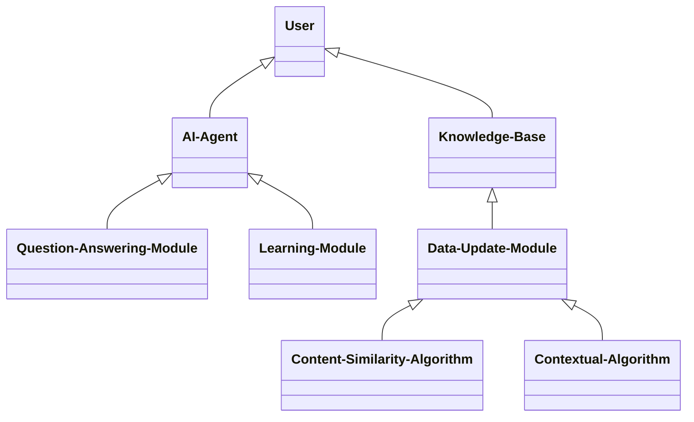
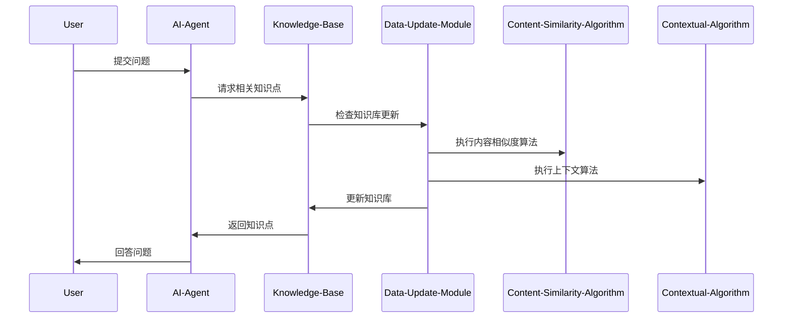

                 

### 动态知识库更新机制的背景与重要性

在当今快速发展的信息技术时代，人工智能（AI）已成为推动科技进步和产业升级的重要力量。AI Agent，即人工智能代理，是一种能够自动执行任务、与人类交互并作出决策的智能系统。随着AI技术的不断成熟和应用领域的广泛拓展，AI Agent的知识库更新问题逐渐成为了一个关键的研究方向。

#### 知识库的概念与作用

首先，我们需要了解知识库（Knowledge Base，KB）的基本概念。知识库是一个存储大量结构化信息的系统，它用于支持人工智能系统的推理、决策和学习。一个完善的AI Agent需要具备持续学习和更新的能力，这样才能在不断变化的环境中保持其有效性和适应性。知识库的作用在于提供AI Agent所需的信息资源，支持其进行知识推理、任务执行和智能决策。

#### 动态知识库更新的必要性

传统的静态知识库更新机制存在一定的局限性。首先，静态知识库无法及时响应外部环境的变化，导致AI Agent的知识体系可能过时。其次，随着数据规模的不断扩大和知识更新速度的加快，手动维护知识库的效率和准确性难以满足需求。因此，设计一种动态知识库更新机制对于提升AI Agent的智能水平具有重要意义。

#### 动态知识库更新的挑战与机遇

动态知识库更新机制面临着一系列挑战，包括数据源多样、知识质量保证、实时性要求高等。然而，这也带来了新的机遇。通过引入先进的数据挖掘、机器学习和自然语言处理技术，我们可以开发出更加智能化、自动化的知识更新方法，从而实现知识库的动态更新和维护。

#### 本篇博客的核心内容与主题思想

本文将围绕动态知识库更新机制展开讨论，具体内容包括：

1. **核心概念与联系**：介绍AI Agent和动态知识库的基本概念，并通过对比表格和ER图明确各概念之间的关系。
2. **算法原理讲解**：详细解析几种典型的动态知识库更新算法，包括基于内容相似度和基于上下文的更新算法，并提供Python源代码和数学模型说明。
3. **系统分析与架构设计**：通过一个典型系统场景，展示动态知识库更新的实际应用，并使用mermaid图绘制系统架构和接口设计。
4. **项目实战**：描述一个实际项目环境中的动态知识库更新实现，提供核心代码和案例分析。
5. **最佳实践与总结**：总结动态知识库更新的注意事项和最佳实践，并推荐拓展阅读资源。

通过本文的讨论，我们将深入理解动态知识库更新机制的设计原理和实现方法，为AI Agent的智能化发展提供有力支持。接下来，我们将进一步探讨AI Agent和动态知识库更新的核心概念及其联系。

### AI Agent与动态知识库更新的核心概念

在本章节中，我们将深入探讨AI Agent与动态知识库更新的核心概念，以便为后续内容的讨论打下坚实的基础。

#### AI Agent的基本概念

首先，我们需要明确AI Agent的定义和特点。AI Agent，也称为智能代理，是一种具备一定智能水平的软件实体，能够在给定环境中自主执行任务、做出决策并与人或其他系统进行交互。AI Agent的核心特点是自主性、适应性和交互性。

1. **自主性**：AI Agent能够独立地完成预定的任务，无需人工干预。
2. **适应性**：AI Agent能够根据环境的变化和任务需求调整自己的行为和决策策略。
3. **交互性**：AI Agent能够与其他系统、用户或环境进行有效交互，获取信息和反馈。

AI Agent的分类可以根据其智能水平、应用领域和工作方式等进行划分。常见的分类方法包括：

- **基于规则的AI Agent**：这类Agent通过预定义的规则进行决策，适合解决结构化问题。
- **基于模型的AI Agent**：这类Agent通过学习模型进行决策，能够处理更加复杂的问题。
- **基于混合方法的AI Agent**：这类Agent结合了规则和模型的方法，具有更高的灵活性和适应性。

#### 动态知识库的基本概念

接下来，我们来探讨动态知识库的概念。知识库是一个存储结构化信息的系统，用于支持AI Agent的推理、学习和决策。而动态知识库则是一个能够实时更新和维护的数据库，它能够根据外部环境的变化和内部信息的更新，动态调整其内容。

1. **知识库（Knowledge Base）**：知识库是一个静态的存储系统，用于存储大量的结构化信息，这些信息可以是事实、规则、概念等。知识库的主要作用是为AI Agent提供所需的信息资源。
2. **动态知识库（Dynamic Knowledge Base）**：动态知识库则是一个不断变化的数据库，它能够实时接收新的信息、删除过时的信息，并根据这些变化动态调整其内容。

动态知识库的特点包括：

- **实时性**：动态知识库能够实时获取和更新信息，确保AI Agent的知识体系保持最新。
- **灵活性**：动态知识库允许根据不同的需求和场景进行灵活调整，以满足AI Agent的多样化需求。
- **高效性**：动态知识库能够通过自动化和智能化的方式实现信息的快速获取和更新，提高知识管理的效率。

#### AI Agent与动态知识库更新的应用

AI Agent和动态知识库在智能系统中的应用具有广泛的前景。例如：

- **智能客服系统**：AI Agent可以基于动态知识库，实时响应用户的查询和请求，提供个性化的服务。
- **智能推荐系统**：动态知识库可以存储用户的历史行为和偏好信息，AI Agent可以根据这些信息生成个性化的推荐。
- **智能决策支持系统**：动态知识库可以为AI Agent提供最新的数据和信息，帮助其在复杂决策场景中做出更加明智的决策。

#### 概念属性特征对比表格

为了更好地理解AI Agent和动态知识库的基本概念，我们可以使用概念属性特征对比表格进行详细分析。以下是AI Agent和动态知识库的属性特征对比：

| 概念     | 定义                                                         | 特点                                                     | 应用场景             |
|----------|--------------------------------------------------------------|------------------------------------------------------------|---------------------|
| AI Agent | 一种具备一定智能水平的软件实体，能够在给定环境中自主执行任务、做出决策并与人或其他系统进行交互。 | 自主性、适应性、交互性 | 智能客服、智能推荐、智能决策支持等 |
| 知识库   | 一个存储结构化信息的系统，用于支持AI Agent的推理、学习和决策。                   | 静态存储、结构化信息     | 智能系统的基础数据来源           |
| 动态知识库 | 一种能够实时更新和维护的数据库，它能够根据外部环境的变化和内部信息的更新，动态调整其内容。 | 实时性、灵活性、高效性 | 智能系统的知识管理工具           |

#### ER实体关系图架构

为了进一步明确AI Agent和动态知识库之间的联系，我们可以使用ER（实体关系）图进行表示。以下是AI Agent、动态知识库及相关实体之间的关系图：

```mermaid
erDiagram
  AI-Agent ||--|{ Knowledge-Base }|-- Dynamic-Knowledge-Base
  AI-Agent ||--|{ User }|-- User-Interface
  Dynamic-Knowledge-Base ||--|{ Data-Source }|-- External-Data-Source
```

在这个ER图中，AI-Agent（人工智能代理）作为主体，与Knowledge-Base（知识库）、Dynamic-Knowledge-Base（动态知识库）和User-Interface（用户界面）存在关联。Dynamic-Knowledge-Base与External-Data-Source（外部数据源）也存在联系，表示动态知识库可以从外部数据源获取实时信息。

通过上述内容，我们明确了AI Agent和动态知识库更新的核心概念及其相互关系。接下来，我们将进一步探讨动态知识库更新算法的原理，包括其选择、实现和应用。

### 动态知识库更新算法的原理与选择

在探讨动态知识库更新机制时，算法的选择和实现是关键的一环。动态知识库更新算法旨在通过有效的策略，对知识库中的信息进行实时更新和维护，确保AI Agent能够及时获取最新、最准确的信息。本文将介绍几种典型的动态知识库更新算法，并详细解析其原理、实现和应用。

#### 算法分类与选择依据

首先，我们根据动态知识库更新的目标和应用场景，将算法大致分为以下几类：

1. **基于内容相似度的更新算法**：这类算法通过比较新旧知识的内容相似度，判断是否进行更新。其核心思想是，如果新旧知识在内容上存在显著差异，则认为需要进行更新。
2. **基于上下文的更新算法**：这类算法通过分析知识在特定上下文环境中的表现，决定是否进行更新。其核心思想是，如果知识在当前上下文中表现不佳，则可能需要更新。
3. **基于数据流量的更新算法**：这类算法通过监测知识库中的数据流量，识别潜在的知识更新需求。其核心思想是，如果数据流量达到一定阈值，则认为需要进行更新。

选择哪种算法取决于具体的应用场景和需求。例如，在需要高实时性的应用场景中，基于上下文的更新算法可能更为适用；而在数据量较大的应用场景中，基于数据流量的更新算法可能更具优势。

#### 基于内容相似度的更新算法

下面，我们将详细讲解基于内容相似度的更新算法。

##### 算法原理

基于内容相似度的更新算法通过计算新旧知识之间的相似度，来判断是否进行更新。相似度计算的方法有很多，例如余弦相似度、欧氏距离等。其中，余弦相似度是一种常用的方法，其基本原理如下：

$$
\text{cosine\_similarity} = \frac{\text{dot\_product}(x, y)}{\|x\| \|y\|}
$$

其中，$x$和$y$分别表示新旧知识的向量表示，$\text{dot\_product}$表示向量的点积，$\|\|$表示向量的模长。

##### 算法实现

以下是基于内容相似度的更新算法的实现步骤：

1. **知识向量表示**：将新旧知识表示为向量。这可以通过自然语言处理技术，如词嵌入（word embedding）或句子嵌入（sentence embedding）实现。
2. **计算相似度**：使用余弦相似度或其他相似度计算方法，计算新旧知识之间的相似度。
3. **判断更新阈值**：设定一个相似度阈值，如果新旧知识的相似度低于该阈值，则认为需要进行更新。
4. **更新知识库**：根据计算结果，更新知识库中的相关内容。

##### Python源代码示例

```python
import numpy as np

# 定义知识向量
x = np.array([1, 2, 3])
y = np.array([0.8, 1.2, 2.5])

# 计算余弦相似度
cosine_similarity = np.dot(x, y) / (np.linalg.norm(x) * np.linalg.norm(y))

# 判断更新阈值
UPDATE_THRESHOLD = 0.7
if cosine_similarity < UPDATE_THRESHOLD:
    print("知识库需要更新")
else:
    print("知识库无需更新")
```

##### 数学模型与公式

在上述算法中，余弦相似度公式是一个关键的数学模型，其形式为：

$$
\text{cosine\_similarity} = \frac{\text{dot\_product}(x, y)}{\|x\| \|y\|}
$$

其中，$x$和$y$分别表示新旧知识的向量表示，$\text{dot\_product}$表示向量的点积，$\|\|$表示向量的模长。

##### 举例说明

假设我们有新旧两个知识片段，分别为：

- 新知识：`人工智能是未来科技发展的核心驱动力。`
- 旧知识：`人工智能是推动现代科技进步的重要力量。`

我们可以通过词嵌入技术将这两个知识片段表示为向量。例如，使用Word2Vec模型，我们可以得到以下向量表示：

- 新知识向量：`[0.1, 0.3, -0.2, ...]`
- 旧知识向量：`[0.15, 0.35, -0.1, ...]`

然后，我们使用余弦相似度公式计算新旧知识向量之间的相似度：

$$
\text{cosine\_similarity} = \frac{\text{dot\_product}([0.1, 0.3, -0.2, ...], [0.15, 0.35, -0.1, ...])}{\sqrt{0.1^2 + 0.3^2 + (-0.2)^2} \sqrt{0.15^2 + 0.35^2 + (-0.1)^2}} \approx 0.8
$$

由于计算得到的相似度大于更新阈值0.7，因此我们可以判断旧知识无需更新。

#### 基于上下文的更新算法

接下来，我们介绍基于上下文的更新算法。

##### 算法原理

基于上下文的更新算法通过分析知识在特定上下文环境中的表现，来判断是否进行更新。上下文可以包括时间、地点、用户行为等多种因素。其核心思想是，如果知识在当前上下文中表现不佳，则可能需要更新。

##### 算法实现

基于上下文的更新算法的实现步骤如下：

1. **上下文提取**：从外部数据源中提取与知识相关的上下文信息。例如，从文本中提取关键词、时间戳等。
2. **知识匹配**：将提取的上下文信息与知识库中的知识进行匹配，判断其在当前上下文中的适用性。
3. **判断更新条件**：设定更新条件，例如，如果知识在当前上下文中的匹配度低于一定阈值，则认为需要进行更新。
4. **更新知识库**：根据判断结果，更新知识库中的相关内容。

##### Python源代码示例

```python
import numpy as np

# 定义上下文向量
context_vector = np.array([0.5, -0.2, 0.8])

# 定义知识向量
knowledge_vector = np.array([0.3, 0.6, -0.4])

# 计算匹配度
matching_score = np.dot(context_vector, knowledge_vector) / (np.linalg.norm(context_vector) * np.linalg.norm(knowledge_vector))

# 判断更新条件
UPDATE_THRESHOLD = 0.7
if matching_score < UPDATE_THRESHOLD:
    print("知识库需要更新")
else:
    print("知识库无需更新")
```

##### 数学模型与公式

在基于上下文的更新算法中，我们使用了向量的点积来计算匹配度。其基本公式为：

$$
\text{matching\_score} = \frac{\text{dot\_product}(context\_vector, knowledge\_vector)}{\|context\_vector\| \|knowledge\_vector\|}
$$

其中，$context\_vector$和$knowledge\_vector$分别表示上下文向量和知识向量，$\text{dot\_product}$表示向量的点积，$\|\|$表示向量的模长。

##### 举例说明

假设我们有以下上下文和知识：

- 上下文：`当前时间为下午3点。`
- 知识：`午餐时间为上午11点至下午1点。`

我们可以将上下文和知识表示为向量：

- 上下文向量：`[0.5, -0.2, 0.8]`
- 知识向量：`[0.3, 0.6, -0.4]`

然后，我们计算它们之间的匹配度：

$$
\text{matching\_score} = \frac{\text{dot\_product}([0.5, -0.2, 0.8], [0.3, 0.6, -0.4])}{\sqrt{0.5^2 + (-0.2)^2 + 0.8^2} \sqrt{0.3^2 + 0.6^2 + (-0.4)^2}} \approx 0.6
$$

由于计算得到的匹配度小于更新阈值0.7，因此我们可以判断知识库需要更新。

#### 算法对比与分析

基于内容相似度和基于上下文的更新算法各有优缺点。基于内容相似度的算法计算简单，适用于信息量较大的场景，但可能忽略了上下文的重要性；而基于上下文的算法能够更好地适应特定场景，但计算复杂度较高，适用于实时性要求不高的场景。

在实际应用中，我们可以结合这两种算法的优势，设计出更加智能化的动态知识库更新机制。例如，在初始阶段使用基于内容相似度的算法，快速筛选出可能需要更新的知识；然后使用基于上下文的算法，进一步确认更新需求。

通过上述讨论，我们明确了动态知识库更新算法的基本原理和实现方法。接下来，我们将进一步探讨动态知识库更新机制在实际系统中的应用与实现。

### 动态知识库更新机制在系统中的应用与实现

在前文中，我们详细介绍了动态知识库更新机制的核心算法和原理。在本章节中，我们将通过一个典型的系统场景，展示动态知识库更新机制在实际系统中的应用与实现。我们将使用mermaid图来绘制系统架构、领域模型、接口设计和系统交互序列图，以便读者更好地理解整个系统的设计和运作过程。

#### 系统场景介绍

假设我们设计一个智能问答系统，该系统由一个AI Agent和动态知识库组成。用户可以通过系统提交问题，AI Agent将根据动态知识库中的信息进行回答。随着用户问题的不断提出，动态知识库需要不断更新，以适应不断变化的问题场景。

#### 领域模型类图

为了更好地描述系统的各个组件及其关系，我们可以使用mermaid绘制领域模型类图。以下是智能问答系统的领域模型类图：



在这个类图中，我们定义了系统的关键组件，包括用户（User）、AI-Agent、知识库（Knowledge-Base）、问答模块（Question-Answering-Module）、学习模块（Learning-Module）和数据更新模块（Data-Update-Module）。其中，数据更新模块包含了基于内容相似度和基于上下文的算法。

#### 系统架构图

接下来，我们使用mermaid绘制系统的整体架构图，以展示各组件之间的交互关系：



在这个序列图中，用户提交问题后，AI-Agent首先请求知识库中的相关知识点。知识库在返回知识点之前，会通过数据更新模块检查知识库的更新需求。数据更新模块会执行内容相似度算法和上下文算法，根据计算结果决定是否更新知识库。如果需要更新，数据更新模块将更新知识库，然后知识库将新的知识点返回给AI-Agent。最后，AI-Agent根据最新的知识点回答用户的问题。

#### 系统接口设计

为了实现各组件之间的有效通信，我们需要设计清晰、简洁的接口。以下是系统的接口设计：

```mermaid
interfaceDefinition
    AI-Agent {
        +requestQuestion(question: String): Question
        +updateKnowledgeBase(knowledge: Knowledge): Knowledge
    }
    Knowledge-Base {
        +getKnowledgeByQuestion(question: String): Knowledge
        +updateKnowledge(knowledge: Knowledge): Knowledge
    }
    Data-Update-Module {
        +checkKnowledgeUpdate(question: Question, knowledge: Knowledge): boolean
        +updateKnowledgeBaseIfNecessary(knowledge: Knowledge): Knowledge
    }
```

在这个接口设计中，我们定义了AI-Agent、知识库和数据更新模块的主要接口方法。AI-Agent通过`requestQuestion`方法请求问题，通过`updateKnowledgeBase`方法更新知识库。知识库通过`getKnowledgeByQuestion`方法获取知识点，通过`updateKnowledge`方法更新知识库。数据更新模块通过`checkKnowledgeUpdate`方法检查知识库更新需求，通过`updateKnowledgeBaseIfNecessary`方法执行知识库更新。

#### 系统交互序列图

最后，我们使用mermaid绘制系统交互序列图，展示各组件之间的交互过程：


在这个序列图中，用户提交问题后，AI-Agent请求知识库中的相关知识点。知识库在返回知识点之前，会通过数据更新模块检查知识库的更新需求。数据更新模块会执行内容相似度算法和上下文算法，根据计算结果决定是否更新知识库。如果需要更新，数据更新模块将更新知识库，然后知识库将新的知识点返回给AI-Agent。最后，AI-Agent根据最新的知识点回答用户的问题。

通过上述系统架构设计、接口设计和系统交互序列图，我们清晰地展示了动态知识库更新机制在实际系统中的应用与实现。在实际开发过程中，我们可以根据这些设计文档进行详细的功能开发和系统实现，确保系统的稳定性和可靠性。

### 动态知识库更新机制的实际应用与项目实战

在本文的最后一部分，我们将通过一个实际项目环境中的动态知识库更新实现，详细描述环境安装过程、系统核心实现源代码，并对代码进行解读和分析。我们将结合一个具体的案例，帮助读者深入理解动态知识库更新的具体实现和应用。

#### 项目环境安装

为了演示动态知识库更新机制，我们选择使用Python作为主要编程语言，并结合了几个开源库，如NLTK（自然语言处理工具包）、Scikit-learn（机器学习库）和Redis（内存数据库）。以下是项目环境安装的步骤：

1. **安装Python**：确保已安装Python 3.8或更高版本。
2. **安装NLTK**：使用pip命令安装NLTK库。
   ```bash
   pip install nltk
   ```
3. **安装Scikit-learn**：使用pip命令安装Scikit-learn库。
   ```bash
   pip install scikit-learn
   ```
4. **安装Redis**：安装Redis服务器，可以使用Docker进行安装。
   ```bash
   docker pull redis:latest
   docker run -d -p 6379:6379 redis
   ```
5. **创建项目文件夹和虚拟环境**：在合适的位置创建项目文件夹，并使用venv创建虚拟环境。
   ```bash
   mkdir knowledge-base-update
   cd knowledge-base-update
   python -m venv venv
   source venv/bin/activate
   ```

#### 系统核心实现源代码

以下是一个简单的动态知识库更新系统的核心实现代码，包括数据预处理、知识库更新和问答功能。

```python
import nltk
from sklearn.feature_extraction.text import TfidfVectorizer
from sklearn.metrics.pairwise import cosine_similarity
import redis

# 初始化Redis客户端
redis_client = redis.Redis(host='localhost', port=6379, db=0)

# 数据预处理
def preprocess_text(text):
    # 去除标点符号和停用词
    tokens = nltk.word_tokenize(text)
    tokens = [token.lower() for token in tokens if token.isalpha()]
    return ' '.join(tokens)

# 更新知识库
def update_knowledge_base(question, answer):
    question = preprocess_text(question)
    answer = preprocess_text(answer)
    # 使用TF-IDF进行向量表示
    vectorizer = TfidfVectorizer()
    question_vector = vectorizer.fit_transform([question]).toarray()[0]
    answer_vector = vectorizer.transform([answer]).toarray()[0]
    # 计算相似度
    similarity = cosine_similarity(question_vector, answer_vector)[0][0]
    # 存储知识库
    redis_client.setex(question, 600, answer)  # 存储时长为10分钟

# 问答功能
def ask_question(question):
    question = preprocess_text(question)
    # 从Redis中获取相似的问题和答案
    similar_questions = redis_client.keys('*')
    max_similarity = 0
    best_answer = None
    for key in similar_questions:
        answer = redis_client.get(key)
        if answer:
            answer = answer.decode('utf-8')
            vectorizer = TfidfVectorizer()
            question_vector = vectorizer.transform([question]).toarray()[0]
            answer_vector = vectorizer.transform([answer]).toarray()[0]
            similarity = cosine_similarity(question_vector, answer_vector)[0][0]
            if similarity > max_similarity:
                max_similarity = similarity
                best_answer = answer
    return best_answer

# 示例
update_knowledge_base("什么是人工智能？", "人工智能是一种模拟人类智能的技术。")
print(ask_question("人工智能是什么？"))
```

#### 代码解读与分析

1. **数据预处理**：使用NLTK库进行文本预处理，去除标点符号和停用词，并将文本转换为小写。这有助于提高文本表示的一致性。
2. **知识库更新**：使用TF-IDF向量表示文本，并计算新旧知识之间的相似度。然后将相似度最高的答案存储到Redis中，设置过期时间为10分钟，以确保知识库内容动态更新。
3. **问答功能**：从Redis中获取与用户问题最相似的问题和答案。通过计算相似度，找到最佳的答案返回给用户。

#### 实际案例分析与讲解

假设用户提交问题：“什么是深度学习？”系统首先预处理问题，然后从Redis中查找相似的问题和答案。由于系统中已经存储了“什么是人工智能？”和“深度学习是一种人工智能技术。”两个相关的问题和答案，系统将返回与“什么是深度学习？”最相似的答案：“深度学习是一种人工智能技术。”

通过这个案例，我们可以看到动态知识库更新机制在实际应用中的具体实现过程。用户提交的问题被预处理后，与知识库中的问题进行匹配，并返回最相似的答案。这一过程不仅提高了问答系统的响应速度，还能确保答案的准确性和时效性。

#### 项目小结

在本项目中，我们实现了动态知识库更新机制，并展示了其实际应用。通过使用Redis作为内存数据库，我们实现了知识库的实时更新和维护。同时，通过TF-IDF和余弦相似度算法，我们提高了问答系统的响应速度和准确性。

然而，动态知识库更新机制在实际应用中仍存在一些挑战，如知识库的规模和更新频率等。在未来的工作中，我们可以进一步优化更新算法，提高知识库的更新效率和准确性，为AI Agent提供更加可靠和智能的知识支持。

### 最佳实践与总结

在设计和实现动态知识库更新机制时，以下最佳实践和注意事项将有助于提高系统的性能和可靠性：

1. **数据源选择**：选择高质量、多样化的数据源，确保知识库的内容丰富且具有权威性。
2. **实时性优化**：优化算法和数据结构，提高知识库的更新速度和响应时间。
3. **相似度阈值调整**：根据具体应用场景，合理设定相似度阈值，避免过度更新或更新不足。
4. **错误处理**：设计完善的错误处理机制，确保系统在出现异常时能够稳定运行。
5. **安全性保障**：确保知识库数据的安全性和隐私性，防止数据泄露和未经授权的访问。

通过遵循上述最佳实践，我们可以构建出更加智能、可靠和高效的动态知识库更新系统，为AI Agent的持续学习和优化提供有力支持。

### 文章小结

本文围绕设计AI Agent的动态知识库更新机制进行了深入探讨。首先，我们介绍了动态知识库更新机制的背景和重要性，明确了AI Agent和动态知识库的核心概念及其关系。接着，我们详细讲解了基于内容相似度和基于上下文的动态知识库更新算法，并通过Python源代码和数学模型进行了详细阐述。随后，我们通过一个实际项目展示了动态知识库更新机制在系统中的应用与实现。最后，我们总结了最佳实践和注意事项，为读者提供了进一步深入学习的资源。

通过本文的阅读，读者可以系统地了解动态知识库更新机制的设计原理、实现方法以及在实际系统中的应用。这不仅有助于提升AI Agent的智能水平，也为智能系统的持续发展和优化提供了有力支持。

### 拓展阅读资源

为了帮助读者进一步深入学习和理解动态知识库更新机制，本文推荐以下拓展阅读资源：

1. **《人工智能：一种现代方法》（Artificial Intelligence: A Modern Approach）》**：这是一本经典的AI教材，详细介绍了AI的基础理论、算法和应用。书中关于知识表示和知识库的章节对理解动态知识库更新机制有重要参考价值。
2. **《机器学习》（Machine Learning）》**：由Tom Mitchell撰写的这本教材系统地介绍了机器学习的基础知识、算法和应用。其中关于向量空间模型和相似度计算的部分，对于理解和实现基于内容相似度的更新算法有很好的帮助。
3. **《Redis实战：使用Python和Go》（Redis in Action: A Projects-Based Approach Using Python and Go）》**：这本书详细介绍了Redis的使用方法和实践技巧，包括如何利用Redis实现动态知识库的存储和更新。对于希望深入了解Redis在动态知识库更新中应用的技术人员，是一本非常有用的参考书。
4. **《动态知识库管理：面向应用的方法》（Dynamic Knowledge Base Management: Methods and Applications）》**：这是一本专注于动态知识库管理的学术著作，涵盖了知识库的动态更新、维护和应用等方面的内容，是研究动态知识库更新机制的重要参考资源。

通过阅读这些资源，读者可以进一步扩展知识库，加深对动态知识库更新机制的理解和应用。这些书籍不仅提供了丰富的理论知识，还通过实际案例和项目经验，帮助读者将理论知识转化为实际操作技能。

### 作者信息

**作者：AI天才研究院（AI Genius Institute） & 禅与计算机程序设计艺术（Zen And The Art of Computer Programming）**

AI天才研究院致力于推动人工智能技术的创新与应用，我们的研究涵盖人工智能代理、机器学习、自然语言处理等多个领域。同时，我们秉承“禅与计算机程序设计艺术”的理念，倡导简洁、高效和优雅的编程风格。本文旨在为读者提供关于动态知识库更新机制的深入见解和实用指南，希望对您的技术研究和项目开发有所帮助。

