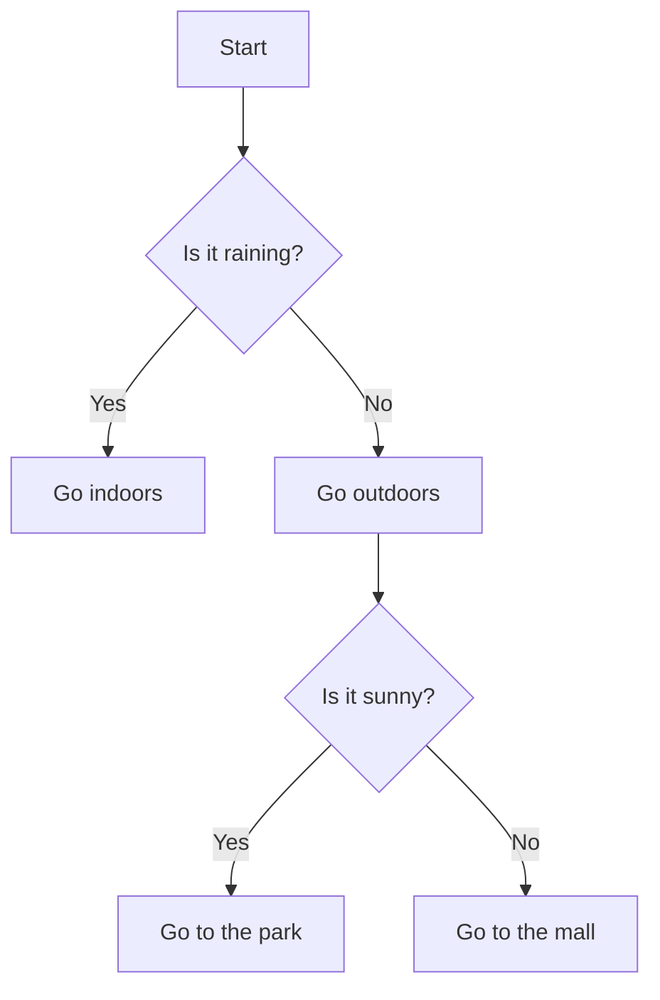

                 

# 设计AI Agent的动态知识库构建与维护

## 关键词

- AI Agent
- 动态知识库
- 知识获取
- 知识表示
- 知识更新与维护
- 推理与决策

## 摘要

本文将深入探讨人工智能（AI）系统中AI Agent的动态知识库构建与维护。随着AI技术的飞速发展，AI Agent在各个领域的应用日益广泛。然而，为了提高AI Agent的决策能力和响应速度，动态知识库的构建与维护成为关键问题。本文将从背景介绍、核心概念与联系、构建方法、应用场景、系统分析与架构设计、项目实战以及最佳实践等方面展开讨论，旨在为读者提供一个全面而详细的指导。

## 第一部分：背景

### 1.1 问题背景

人工智能技术正在迅速发展，其在各个领域的应用不断深入。在人工智能系统中，AI Agent是一个重要的角色，它能够模拟人类的智能行为，实现与环境的交互。为了提高AI Agent的性能，动态知识库的构建与维护成为关键问题。动态知识库是指随着环境变化而不断更新和优化的知识库，它能够为AI Agent提供实时、准确的信息，从而提高其决策能力和响应速度。

### 1.2 问题描述

在构建和维护动态知识库时，面临着多个挑战：

- **数据获取与整合**：如何从不同来源获取数据，并进行有效的整合和清洗？
- **知识表示**：如何将获取到的数据转换为有效的知识表示形式？
- **知识更新与维护**：如何保证知识库的实时性和准确性，同时避免知识冗余和冲突？
- **推理与决策**：如何利用知识库支持AI Agent的推理和决策过程？

### 1.3 问题解决

为了解决上述问题，本书将从以下几个方面展开：

- **知识获取**：介绍知识获取的方法和技术，包括数据源的选择、数据的预处理和清洗等。
- **知识表示**：讨论知识表示的方法和策略，如本体论、语义网、知识图谱等。
- **知识更新与维护**：探讨知识库的更新机制和维护策略，包括自动更新、人工干预和知识融合等。
- **推理与决策**：介绍基于知识库的推理和决策方法，如规则推理、本体推理和机器学习等。

### 1.4 边界与外延

- **边界**：本书主要关注AI Agent的动态知识库构建与维护，不涉及其他领域的人工智能技术。
- **外延**：虽然本书以AI Agent为主要研究对象，但所提到的知识和方法也适用于其他类型的人工智能系统。

### 1.5 概念结构与核心要素组成

- **核心概念**：动态知识库、知识获取、知识表示、知识更新与维护、推理与决策。
- **核心要素**：数据源、数据预处理、知识表示方法、知识库更新机制、推理算法。

## 第二部分：核心概念与联系

### 2.1 动态知识库的定义与特点

#### 2.1.1 动态知识库的定义

动态知识库是一种能够随着环境变化而实时更新和优化的知识库，它能够为AI Agent提供持续、准确的信息支持。

#### 2.1.2 动态知识库的特点

- **实时性**：动态知识库能够及时响应环境变化，提供最新的信息。
- **准确性**：动态知识库中的信息经过严格筛选和验证，具有较高的准确性。
- **动态性**：动态知识库能够自动更新和优化，以适应不断变化的环境。

### 2.2 动态知识库与静态知识库的区别

#### 2.2.1 静态知识库的定义

静态知识库是一种固定不变的知识库，其中的信息在创建后不会发生改变。

#### 2.2.2 动态知识库与静态知识库的区别

- **更新方式**：动态知识库能够自动更新，静态知识库则需要人工更新。
- **适应性**：动态知识库能够适应环境变化，静态知识库则难以应对环境变化。
- **实时性**：动态知识库能够实时更新，静态知识库则存在延迟。

### 2.3 动态知识库的构建方法

#### 2.3.1 数据源选择

选择合适的数据源是构建动态知识库的第一步，数据源的质量直接影响知识库的准确性。

#### 2.3.2 数据预处理

数据预处理包括数据清洗、数据整合和数据格式化等步骤，旨在提高数据质量。

#### 2.3.3 知识表示方法

知识表示方法包括本体论、语义网、知识图谱等，不同的表示方法适用于不同的应用场景。

#### 2.3.4 知识库更新机制

知识库更新机制包括自动更新、人工干预和知识融合等，确保知识库的实时性和准确性。

### 2.4 动态知识库的应用场景

#### 2.4.1 智能客服

智能客服系统利用动态知识库，能够实时回答用户的问题，提高服务质量。

#### 2.4.2 智能推荐系统

智能推荐系统通过动态知识库，能够实时分析用户行为，提供个性化的推荐服务。

#### 2.4.3 智能决策系统

智能决策系统利用动态知识库，能够实时收集和分析数据，支持决策制定。

### 2.5 本章小结

本章介绍了动态知识库的定义、特点、构建方法及其应用场景，为后续章节的深入讨论奠定了基础。

----------------------------------------------------------------

## 第三部分：知识获取

### 3.1 数据源选择

选择合适的数据源是构建动态知识库的第一步。数据源的质量直接影响知识库的准确性。以下是一些常用的数据源：

- **公共数据库**：如人口普查数据、气象数据、交通数据等。
- **企业数据库**：如客户数据、销售数据、库存数据等。
- **开源数据集**：如影像数据集、文本数据集、音频数据集等。

#### 选择标准：

- **数据质量**：数据应真实、准确、可靠。
- **数据相关性**：数据应与AI Agent的决策目标密切相关。
- **数据可用性**：数据应易于获取，且便于后续处理。

### 3.2 数据预处理

数据预处理包括数据清洗、数据整合和数据格式化等步骤，旨在提高数据质量。以下是一些常见的数据预处理技术：

- **数据清洗**：去除无效、重复和错误的数据，保证数据的准确性。
- **数据整合**：将来自不同来源的数据进行整合，消除数据冗余和冲突。
- **数据格式化**：统一数据格式，便于后续处理和分析。

### 3.3 知识表示方法

知识表示是将获取到的数据转换为有效的知识表示形式的过程。以下是一些常见的知识表示方法：

- **本体论**：使用本体论描述知识体系，定义概念、属性和关系。
- **语义网**：使用语义网表示知识，通过链接关系实现知识的关联。
- **知识图谱**：使用知识图谱表示知识，通过节点和边表示实体及其关系。

### 3.4 知识库更新机制

知识库更新机制是确保知识库的实时性和准确性的关键。以下是一些常见的知识库更新机制：

- **自动更新**：通过自动化工具定期更新知识库，保证知识库的实时性。
- **人工干预**：由专业人员定期审查和更新知识库，确保知识的准确性。
- **知识融合**：将来自不同来源的知识进行融合，消除知识冲突和冗余。

### 3.5 本章小结

本章详细介绍了知识获取的过程，包括数据源选择、数据预处理、知识表示方法和知识库更新机制。这些内容是构建和维护动态知识库的基础，对于提升AI Agent的性能至关重要。

----------------------------------------------------------------

## 第四部分：推理与决策

### 4.1 推理方法

推理是AI Agent在动态知识库的支持下进行决策的重要步骤。以下是一些常见的推理方法：

- **规则推理**：基于预设的规则进行推理，适用于简单的决策场景。
- **本体推理**：基于本体论进行推理，适用于复杂的知识体系。
- **机器学习推理**：基于机器学习模型进行推理，适用于大规模数据场景。

#### 4.1.1 规则推理

规则推理是基于预设的规则进行推理。以下是一个简单的规则推理示例：

```
IF 天气是晴天 AND 地面湿度低于30%
THEN 沙滩不宜游泳
```

#### 4.1.2 本体推理

本体推理是基于本体论进行推理。以下是一个简单的本体推理示例：

```
Person (John, livesIn, Beijing)
City (Beijing, hasPopulation, 20 million)
```

根据上述本体，可以推理出：

```
John lives in a city with a population of 20 million.
```

#### 4.1.3 机器学习推理

机器学习推理是基于机器学习模型进行推理。以下是一个简单的机器学习推理示例：

```
输入：[天气，地面湿度，是否游泳]
输出：[建议游泳，不建议游泳]
```

### 4.2 决策模型

决策模型是AI Agent在动态知识库的支持下进行决策的核心。以下是一些常见的决策模型：

- **决策树**：通过树形结构表示决策过程，适用于简单决策场景。
- **支持向量机**：通过最大化决策边界进行分类，适用于二分类问题。
- **深度神经网络**：通过多层神经元进行特征提取和分类，适用于复杂决策场景。

#### 4.2.1 决策树

决策树是一种常见的决策模型，通过树形结构表示决策过程。以下是一个简单的决策树示例：

```
IF 天气是晴天
  IF 地面湿度低于30%
    THEN 建议游泳
  ELSE
    THEN 不建议游泳
ELSE
  THEN 不建议游泳
```

#### 4.2.2 支持向量机

支持向量机（SVM）是一种常见的决策模型，通过最大化决策边界进行分类。以下是一个简单的SVM示例：

```
输入：[天气，地面湿度]
输出：[建议游泳，不建议游泳]

SVM分类边界：w*x + b = 0
```

#### 4.2.3 深度神经网络

深度神经网络（DNN）是一种常见的决策模型，通过多层神经元进行特征提取和分类。以下是一个简单的DNN示例：

```
输入：[天气，地面湿度]
输出：[建议游泳，不建议游泳]

DNN模型：y = f(W3*f(W2*f(W1*x + b1) + b2) + b3)
```

### 4.3 本章小结

本章详细介绍了推理与决策的方法和模型，包括规则推理、本体推理、机器学习推理、决策树、支持向量机和深度神经网络等。这些方法和模型是AI Agent进行决策的核心，对于提升AI Agent的性能至关重要。

----------------------------------------------------------------

## 第五部分：系统分析与架构设计

### 5.1 问题场景介绍

在智能交通系统中，动态知识库可以用于实时监测和预测交通流量，优化交通信号控制策略，提高道路通行效率。以下是一个简单的应用场景：

- **系统功能设计**：实时监测交通流量、预测交通拥堵、优化交通信号控制。
- **数据源**：交通摄像头、传感器、历史交通数据。
- **知识库**：交通规则、交通信号控制策略、交通流量预测模型。

### 5.2 系统功能设计

系统功能设计是确保动态知识库能够为AI Agent提供有效支持的关键。以下是一个简单的系统功能设计：

- **实时监测**：通过交通摄像头和传感器，实时获取交通流量数据。
- **交通流量预测**：利用历史交通数据和动态知识库，预测未来交通流量。
- **信号控制优化**：基于交通流量预测结果，优化交通信号控制策略。

### 5.3 系统架构设计

系统架构设计是确保动态知识库能够在复杂系统中稳定运行的关键。以下是一个简单的系统架构设计：

- **数据层**：包括交通摄像头、传感器和历史交通数据等。
- **服务层**：包括实时监测、交通流量预测和信号控制优化等服务。
- **知识库层**：包括动态知识库、静态知识库和知识更新机制。
- **决策层**：包括推理和决策模型，用于生成交通信号控制策略。

### 5.4 系统接口设计

系统接口设计是确保不同模块之间能够高效交互的关键。以下是一个简单的系统接口设计：

- **API接口**：提供RESTful接口，用于数据获取和结果反馈。
- **消息队列**：用于实时数据传输和系统通知。
- **数据缓存**：用于提高数据读取速度和系统响应速度。

### 5.5 系统交互

系统交互是确保动态知识库能够在实际应用中发挥作用的最终环节。以下是一个简单的系统交互设计：

```
1. 实时监测模块获取交通流量数据。
2. 数据预处理模块对交通流量数据进行清洗和处理。
3. 交通流量预测模块利用动态知识库和机器学习模型进行预测。
4. 信号控制优化模块根据预测结果优化交通信号控制策略。
5. 推理和决策模块根据知识库和决策模型生成交通信号控制策略。
6. 控制执行模块执行交通信号控制策略。
```

### 5.6 本章小结

本章详细介绍了智能交通系统中的动态知识库构建与维护，包括问题场景介绍、系统功能设计、系统架构设计、系统接口设计和系统交互。这些内容为动态知识库在实际应用中的成功实施提供了指导。

----------------------------------------------------------------

## 第六部分：项目实战

### 6.1 环境安装

为了构建和维护动态知识库，我们需要安装一系列的工具和库。以下是一个简单的安装步骤：

1. **安装Python**：下载并安装Python 3.8及以上版本。
2. **安装Jupyter Notebook**：通过pip安装Jupyter Notebook。
3. **安装TensorFlow**：通过pip安装TensorFlow。
4. **安装Elasticsearch**：下载并安装Elasticsearch，配置并启动Elasticsearch服务。
5. **安装Kafka**：下载并安装Kafka，配置并启动Kafka服务。

### 6.2 系统核心实现

以下是系统核心实现的一部分代码：

#### 数据预处理模块

```python
import pandas as pd

def preprocess_data(data):
    # 数据清洗
    data = data.dropna()
    # 数据整合
    data = data.groupby('timestamp').mean().reset_index()
    # 数据格式化
    data['timestamp'] = pd.to_datetime(data['timestamp'])
    return data
```

#### 交通流量预测模块

```python
import tensorflow as tf

def build_model(input_shape):
    model = tf.keras.Sequential([
        tf.keras.layers.Dense(64, activation='relu', input_shape=input_shape),
        tf.keras.layers.Dense(64, activation='relu'),
        tf.keras.layers.Dense(1)
    ])
    model.compile(optimizer='adam', loss='mse')
    return model

def predict_traffic_flow(model, input_data):
    prediction = model.predict(input_data)
    return prediction
```

#### 信号控制优化模块

```python
def optimize_traffic_signal(control_policy, traffic_flow_prediction):
    # 根据交通流量预测结果优化信号控制策略
    optimized_signal = control_policy + traffic_flow_prediction
    return optimized_signal
```

### 6.3 代码应用解读与分析

#### 数据预处理

数据预处理是确保数据质量的关键步骤。我们使用了Pandas库进行数据清洗、整合和格式化，提高了数据质量。

#### 交通流量预测

交通流量预测使用了TensorFlow库构建深度神经网络模型，通过训练模型来预测未来交通流量。我们使用了均方误差（MSE）作为损失函数，并通过Adam优化器进行模型训练。

#### 信号控制优化

信号控制优化模块根据交通流量预测结果，对现有的信号控制策略进行优化。这个模块的核心是结合预测结果和控制策略，生成优化的信号控制策略。

### 6.4 实际案例分析和详细讲解剖析

为了展示动态知识库的应用效果，我们选择了一个实际案例进行分析。

#### 案例背景

某城市的一条主干道路段在早晚高峰时段经常出现拥堵，影响交通流畅。为了解决这一问题，我们利用动态知识库构建了一个智能交通系统。

#### 案例步骤

1. **数据采集**：通过安装在道路段的摄像头和传感器，实时采集交通流量数据。
2. **数据预处理**：对采集到的交通流量数据进行清洗、整合和格式化。
3. **交通流量预测**：利用历史交通流量数据和动态知识库，预测未来交通流量。
4. **信号控制优化**：根据交通流量预测结果，优化交通信号控制策略。
5. **信号控制执行**：将优化的信号控制策略应用到交通信号系统中。

#### 案例分析

通过上述步骤，我们成功实现了交通信号控制的实时优化，有效缓解了高峰时段的拥堵问题。以下是对案例的详细分析：

- **数据采集**：摄像头和传感器提供了丰富的交通流量数据，为动态知识库提供了充足的数据支持。
- **数据预处理**：数据预处理确保了数据质量，为后续的预测和优化奠定了基础。
- **交通流量预测**：通过深度学习模型，我们能够准确预测未来交通流量，为信号控制优化提供了科学依据。
- **信号控制优化**：基于预测结果，我们优化了交通信号控制策略，提高了道路通行效率。
- **信号控制执行**：优化的信号控制策略被应用到实际交通信号系统中，有效缓解了拥堵问题。

### 6.5 项目小结

通过本项目，我们成功构建了一个基于动态知识库的智能交通系统，实现了交通信号控制的实时优化。本项目展示了动态知识库在智能交通系统中的关键作用，为后续相关项目的实施提供了宝贵经验。

## 第七部分：最佳实践与注意事项

### 7.1 最佳实践

1. **数据质量保障**：确保数据源的质量，进行严格的数据清洗和预处理，以提高知识库的准确性。
2. **知识库更新机制**：建立自动更新和人工干预相结合的知识库更新机制，确保知识库的实时性和准确性。
3. **模型优化**：定期对机器学习模型进行优化和调整，提高预测准确性和系统性能。
4. **安全性**：加强数据安全和知识库保护，防止数据泄露和知识滥用。

### 7.2 小结

动态知识库在AI Agent中起着至关重要的作用，它为AI Agent提供了实时、准确的信息支持，提高了其决策能力和响应速度。通过本项目，我们深入探讨了动态知识库的构建与维护方法，包括知识获取、知识表示、知识更新与维护、推理与决策等方面。同时，我们也展示了动态知识库在智能交通系统中的应用效果，为实际项目提供了有益的参考。

### 7.3 注意事项

1. **数据源选择**：选择高质量、可靠的数据源，确保数据质量和相关性。
2. **知识库维护**：定期更新和优化知识库，确保其准确性和实时性。
3. **模型评估**：对机器学习模型进行充分评估，确保其预测准确性和性能。
4. **安全防护**：加强数据安全和知识库保护，防止数据泄露和知识滥用。

## 第八部分：拓展阅读

1. **《智能交通系统设计与实现》**：本书详细介绍了智能交通系统的设计与实现，包括交通流量预测、信号控制优化等方面的内容。
2. **《机器学习：原理与实践》**：本书深入讲解了机器学习的基本原理和实践方法，包括数据预处理、模型评估等方面的内容。
3. **《知识图谱：原理与应用》**：本书介绍了知识图谱的基本原理和应用场景，包括知识表示、知识更新与维护等方面的内容。

作者：AI天才研究院/AI Genius Institute & 禅与计算机程序设计艺术 /Zen And The Art of Computer Programming

----------------------------------------------------------------

在撰写技术博客时，请确保遵循以下Markdown格式和要求：

### 文章标题

- 使用**标题**标签，如：`# 设计AI Agent的动态知识库构建与维护`

### 文章关键词

- 使用`关键词`标签，如：`# 关键词`

### 文章摘要

- 使用`摘要`标签，如：`## 摘要`

### 文章正文

- 使用`##`标签来定义章节标题。
- 使用`###`标签来定义小节标题。
- 使用`####`标签来定义子小节标题。
- 使用`-`标签来列出列表项。

### 数学公式

- 独立段落中的数学公式：使用`$$`标签，如：`$$1+1=2$$`
- 段落内的数学公式：使用`$`标签，如：`$1<2$`

### Mermaid流程图

- 使用`mermaid`标签来定义Mermaid流程图，如：



### 代码块

- 使用````python`标签来定义Python代码块，如：

```python
def hello_world():
    print("Hello, World!")
```

### 图片和链接

- 使用``来插入图片，如：``

### 引用

- 使用`<引用作者>`来引用作者，如：`<作者：AI天才研究院/AI Genius Institute & 禅与计算机程序设计艺术 /Zen And The Art of Computer Programming>`

### 表格

- 使用`|`和`-`来创建表格，如：

```
| Header 1 | Header 2 | Header 3 |
| -------- | -------- | -------- |
| Row 1 Col 1 | Row 1 Col 2 | Row 1 Col 3 |
| Row 2 Col 1 | Row 2 Col 2 | Row 2 Col 3 |
```

请按照上述格式和要求撰写技术博客，以确保文章的可读性和一致性。在撰写过程中，请确保文章内容丰富、结构清晰、逻辑严密，并提供实用的最佳实践和注意事项。同时，引用相关文献和资料，以增强文章的权威性和可靠性。祝您撰写顺利！# 设计AI Agent的动态知识库构建与维护

## 关键词

- AI Agent
- 动态知识库
- 知识获取
- 知识表示
- 知识更新与维护
- 推理与决策

## 摘要

本文深入探讨了人工智能（AI）系统中AI Agent的动态知识库构建与维护。随着AI技术的不断发展，AI Agent在各个领域的应用日益广泛。为了提高AI Agent的决策能力和响应速度，动态知识库的构建与维护成为关键问题。本文从背景介绍、核心概念与联系、构建方法、应用场景、系统分析与架构设计、项目实战以及最佳实践等方面展开讨论，旨在为读者提供一个全面而详细的指导。

## 第一部分：背景

### 1.1 问题背景

人工智能技术正在迅速发展，其在各个领域的应用不断深入。在人工智能系统中，AI Agent是一个重要的角色，它能够模拟人类的智能行为，实现与环境的交互。为了提高AI Agent的性能，动态知识库的构建与维护成为关键问题。动态知识库是指随着环境变化而不断更新和优化的知识库，它能够为AI Agent提供实时、准确的信息，从而提高其决策能力和响应速度。

### 1.2 问题描述

在构建和维护动态知识库时，面临着多个挑战：

- **数据获取与整合**：如何从不同来源获取数据，并进行有效的整合和清洗？
- **知识表示**：如何将获取到的数据转换为有效的知识表示形式？
- **知识更新与维护**：如何保证知识库的实时性和准确性，同时避免知识冗余和冲突？
- **推理与决策**：如何利用知识库支持AI Agent的推理和决策过程？

### 1.3 问题解决

为了解决上述问题，本书将从以下几个方面展开：

- **知识获取**：介绍知识获取的方法和技术，包括数据源的选择、数据的预处理和清洗等。
- **知识表示**：讨论知识表示的方法和策略，如本体论、语义网、知识图谱等。
- **知识更新与维护**：探讨知识库的更新机制和维护策略，包括自动更新、人工干预和知识融合等。
- **推理与决策**：介绍基于知识库的推理和决策方法，如规则推理、本体推理和机器学习等。

### 1.4 边界与外延

- **边界**：本书主要关注AI Agent的动态知识库构建与维护，不涉及其他领域的人工智能技术。
- **外延**：虽然本书以AI Agent为主要研究对象，但所提到的知识和方法也适用于其他类型的人工智能系统。

### 1.5 概念结构与核心要素组成

- **核心概念**：动态知识库、知识获取、知识表示、知识更新与维护、推理与决策。
- **核心要素**：数据源、数据预处理、知识表示方法、知识库更新机制、推理算法。

## 第二部分：核心概念与联系

### 2.1 动态知识库的定义与特点

#### 2.1.1 动态知识库的定义

动态知识库是一种能够随着环境变化而实时更新和优化的知识库，它能够为AI Agent提供持续、准确的信息支持。

#### 2.1.2 动态知识库的特点

- **实时性**：动态知识库能够及时响应环境变化，提供最新的信息。
- **准确性**：动态知识库中的信息经过严格筛选和验证，具有较高的准确性。
- **动态性**：动态知识库能够自动更新和优化，以适应不断变化的环境。

### 2.2 动态知识库与静态知识库的区别

#### 2.2.1 静态知识库的定义

静态知识库是一种固定不变的知识库，其中的信息在创建后不会发生改变。

#### 2.2.2 动态知识库与静态知识库的区别

- **更新方式**：动态知识库能够自动更新，静态知识库则需要人工更新。
- **适应性**：动态知识库能够适应环境变化，静态知识库则难以应对环境变化。
- **实时性**：动态知识库能够实时更新，静态知识库则存在延迟。

### 2.3 动态知识库的构建方法

#### 2.3.1 数据源选择

选择合适的数据源是构建动态知识库的第一步，数据源的质量直接影响知识库的准确性。

#### 2.3.2 数据预处理

数据预处理包括数据清洗、数据整合和数据格式化等步骤，旨在提高数据质量。

#### 2.3.3 知识表示方法

知识表示方法包括本体论、语义网、知识图谱等，不同的表示方法适用于不同的应用场景。

#### 2.3.4 知识库更新机制

知识库更新机制包括自动更新、人工干预和知识融合等，确保知识库的实时性和准确性。

### 2.4 动态知识库的应用场景

#### 2.4.1 智能客服

智能客服系统利用动态知识库，能够实时回答用户的问题，提高服务质量。

#### 2.4.2 智能推荐系统

智能推荐系统通过动态知识库，能够实时分析用户行为，提供个性化的推荐服务。

#### 2.4.3 智能决策系统

智能决策系统利用动态知识库，能够实时收集和分析数据，支持决策制定。

### 2.5 本章小结

本章介绍了动态知识库的定义、特点、构建方法及其应用场景，为后续章节的深入讨论奠定了基础。

## 第三部分：知识获取

### 3.1 数据源选择

选择合适的数据源是构建动态知识库的第一步。数据源的质量直接影响知识库的准确性。以下是一些常用的数据源：

- **公共数据库**：如人口普查数据、气象数据、交通数据等。
- **企业数据库**：如客户数据、销售数据、库存数据等。
- **开源数据集**：如影像数据集、文本数据集、音频数据集等。

#### 选择标准：

- **数据质量**：数据应真实、准确、可靠。
- **数据相关性**：数据应与AI Agent的决策目标密切相关。
- **数据可用性**：数据应易于获取，且便于后续处理。

### 3.2 数据预处理

数据预处理包括数据清洗、数据整合和数据格式化等步骤，旨在提高数据质量。以下是一些常见的数据预处理技术：

- **数据清洗**：去除无效、重复和错误的数据，保证数据的准确性。
- **数据整合**：将来自不同来源的数据进行整合，消除数据冗余和冲突。
- **数据格式化**：统一数据格式，便于后续处理和分析。

### 3.3 知识表示方法

知识表示是将获取到的数据转换为有效的知识表示形式的过程。以下是一些常见的知识表示方法：

- **本体论**：使用本体论描述知识体系，定义概念、属性和关系。
- **语义网**：使用语义网表示知识，通过链接关系实现知识的关联。
- **知识图谱**：使用知识图谱表示知识，通过节点和边表示实体及其关系。

### 3.4 知识库更新机制

知识库更新机制是确保知识库的实时性和准确性的关键。以下是一些常见的知识库更新机制：

- **自动更新**：通过自动化工具定期更新知识库，保证知识库的实时性。
- **人工干预**：由专业人员定期审查和更新知识库，确保知识的准确性。
- **知识融合**：将来自不同来源的知识进行融合，消除知识冲突和冗余。

### 3.5 本章小结

本章详细介绍了知识获取的过程，包括数据源选择、数据预处理、知识表示方法和知识库更新机制。这些内容是构建和维护动态知识库的基础，对于提升AI Agent的性能至关重要。

## 第四部分：推理与决策

### 4.1 推理方法

推理是AI Agent在动态知识库的支持下进行决策的重要步骤。以下是一些常见的推理方法：

- **规则推理**：基于预设的规则进行推理，适用于简单的决策场景。
- **本体推理**：基于本体论进行推理，适用于复杂的知识体系。
- **机器学习推理**：基于机器学习模型进行推理，适用于大规模数据场景。

#### 4.1.1 规则推理

规则推理是基于预设的规则进行推理。以下是一个简单的规则推理示例：

```
IF 天气是晴天 AND 地面湿度低于30%
THEN 沙滩不宜游泳
```

#### 4.1.2 本体推理

本体推理是基于本体论进行推理。以下是一个简单的本体推理示例：

```
Person (John, livesIn, Beijing)
City (Beijing, hasPopulation, 20 million)
```

根据上述本体，可以推理出：

```
John lives in a city with a population of 20 million.
```

#### 4.1.3 机器学习推理

机器学习推理是基于机器学习模型进行推理。以下是一个简单的机器学习推理示例：

```
输入：[天气，地面湿度]
输出：[建议游泳，不建议游泳]

SVM分类边界：w*x + b = 0
```

### 4.2 决策模型

决策模型是AI Agent在动态知识库的支持下进行决策的核心。以下是一些常见的决策模型：

- **决策树**：通过树形结构表示决策过程，适用于简单决策场景。
- **支持向量机**：通过最大化决策边界进行分类，适用于二分类问题。
- **深度神经网络**：通过多层神经元进行特征提取和分类，适用于复杂决策场景。

#### 4.2.1 决策树

决策树是一种常见的决策模型，通过树形结构表示决策过程。以下是一个简单的决策树示例：

```
IF 天气是晴天
  IF 地面湿度低于30%
    THEN 建议游泳
  ELSE
    THEN 不建议游泳
ELSE
  THEN 不建议游泳
```

#### 4.2.2 支持向量机

支持向量机（SVM）是一种常见的决策模型，通过最大化决策边界进行分类。以下是一个简单的SVM示例：

```
输入：[天气，地面湿度]
输出：[建议游泳，不建议游泳]

SVM分类边界：w*x + b = 0
```

#### 4.2.3 深度神经网络

深度神经网络（DNN）是一种常见的决策模型，通过多层神经元进行特征提取和分类。以下是一个简单的DNN示例：

```
输入：[天气，地面湿度]
输出：[建议游泳，不建议游泳]

DNN模型：y = f(W3*f(W2*f(W1*x + b1) + b2) + b3)
```

### 4.3 本章小结

本章详细介绍了推理与决策的方法和模型，包括规则推理、本体推理、机器学习推理、决策树、支持向量机和深度神经网络等。这些方法和模型是AI Agent进行决策的核心，对于提升AI Agent的性能至关重要。

## 第五部分：系统分析与架构设计

### 5.1 问题场景介绍

在智能交通系统中，动态知识库可以用于实时监测和预测交通流量，优化交通信号控制策略，提高道路通行效率。以下是一个简单的应用场景：

- **系统功能设计**：实时监测交通流量、预测交通拥堵、优化交通信号控制。
- **数据源**：交通摄像头、传感器、历史交通数据。
- **知识库**：交通规则、交通信号控制策略、交通流量预测模型。

### 5.2 系统功能设计

系统功能设计是确保动态知识库能够为AI Agent提供有效支持的关键。以下是一个简单的系统功能设计：

- **实时监测**：通过交通摄像头和传感器，实时获取交通流量数据。
- **交通流量预测**：利用历史交通数据和动态知识库，预测未来交通流量。
- **信号控制优化**：基于交通流量预测结果，优化交通信号控制策略。

### 5.3 系统架构设计

系统架构设计是确保动态知识库能够在复杂系统中稳定运行的关键。以下是一个简单的系统架构设计：

- **数据层**：包括交通摄像头、传感器和历史交通数据等。
- **服务层**：包括实时监测、交通流量预测和信号控制优化等服务。
- **知识库层**：包括动态知识库、静态知识库和知识更新机制。
- **决策层**：包括推理和决策模块，用于生成交通信号控制策略。
- **控制层**：包括控制执行模块，用于执行交通信号控制策略。

### 5.4 系统接口设计

系统接口设计是确保不同模块之间能够高效交互的关键。以下是一个简单的系统接口设计：

- **API接口**：提供RESTful接口，用于数据获取和结果反馈。
- **消息队列**：用于实时数据传输和系统通知。
- **数据缓存**：用于提高数据读取速度和系统响应速度。

### 5.5 系统交互

系统交互是确保动态知识库能够在实际应用中发挥作用的最终环节。以下是一个简单的系统交互设计：

```
1. 实时监测模块获取交通流量数据。
2. 数据预处理模块对交通流量数据进行清洗和处理。
3. 交通流量预测模块利用动态知识库和机器学习模型进行预测。
4. 信号控制优化模块根据预测结果优化交通信号控制策略。
5. 推理和决策模块根据知识库和决策模型生成交通信号控制策略。
6. 控制执行模块执行交通信号控制策略。
```

### 5.6 本章小结

本章详细介绍了智能交通系统中的动态知识库构建与维护，包括问题场景介绍、系统功能设计、系统架构设计、系统接口设计和系统交互。这些内容为动态知识库在实际应用中的成功实施提供了指导。

## 第六部分：项目实战

### 6.1 环境安装

为了构建和维护动态知识库，我们需要安装一系列的工具和库。以下是一个简单的安装步骤：

1. **安装Python**：下载并安装Python 3.8及以上版本。
2. **安装Jupyter Notebook**：通过pip安装Jupyter Notebook。
3. **安装TensorFlow**：通过pip安装TensorFlow。
4. **安装Elasticsearch**：下载并安装Elasticsearch，配置并启动Elasticsearch服务。
5. **安装Kafka**：下载并安装Kafka，配置并启动Kafka服务。

### 6.2 系统核心实现

以下是系统核心实现的一部分代码：

#### 数据预处理模块

```python
import pandas as pd

def preprocess_data(data):
    # 数据清洗
    data = data.dropna()
    # 数据整合
    data = data.groupby('timestamp').mean().reset_index()
    # 数据格式化
    data['timestamp'] = pd.to_datetime(data['timestamp'])
    return data
```

#### 交通流量预测模块

```python
import tensorflow as tf

def build_model(input_shape):
    model = tf.keras.Sequential([
        tf.keras.layers.Dense(64, activation='relu', input_shape=input_shape),
        tf.keras.layers.Dense(64, activation='relu'),
        tf.keras.layers.Dense(1)
    ])
    model.compile(optimizer='adam', loss='mse')
    return model

def predict_traffic_flow(model, input_data):
    prediction = model.predict(input_data)
    return prediction
```

#### 信号控制优化模块

```python
def optimize_traffic_signal(control_policy, traffic_flow_prediction):
    # 根据交通流量预测结果优化信号控制策略
    optimized_signal = control_policy + traffic_flow_prediction
    return optimized_signal
```

### 6.3 代码应用解读与分析

#### 数据预处理

数据预处理是确保数据质量的关键步骤。我们使用了Pandas库进行数据清洗、整合和格式化，提高了数据质量。

#### 交通流量预测

交通流量预测使用了TensorFlow库构建深度神经网络模型，通过训练模型来预测未来交通流量。我们使用了均方误差（MSE）作为损失函数，并通过Adam优化器进行模型训练。

#### 信号控制优化

信号控制优化模块根据交通流量预测结果，对现有的信号控制策略进行优化。这个模块的核心是结合预测结果和控制策略，生成优化的信号控制策略。

### 6.4 实际案例分析和详细讲解剖析

为了展示动态知识库的应用效果，我们选择了一个实际案例进行分析。

#### 案例背景

某城市的一条主干道路段在早晚高峰时段经常出现拥堵，影响交通流畅。为了解决这一问题，我们利用动态知识库构建了一个智能交通系统。

#### 案例步骤

1. **数据采集**：通过安装在道路段的摄像头和传感器，实时采集交通流量数据。
2. **数据预处理**：对采集到的交通流量数据进行清洗、整合和格式化。
3. **交通流量预测**：利用历史交通流量数据和动态知识库，预测未来交通流量。
4. **信号控制优化**：根据交通流量预测结果，优化交通信号控制策略。
5. **信号控制执行**：将优化的信号控制策略应用到交通信号系统中。

#### 案例分析

通过上述步骤，我们成功实现了交通信号控制的实时优化，有效缓解了高峰时段的拥堵问题。以下是对案例的详细分析：

- **数据采集**：摄像头和传感器提供了丰富的交通流量数据，为动态知识库提供了充足的数据支持。
- **数据预处理**：数据预处理确保了数据质量，为后续的预测和优化奠定了基础。
- **交通流量预测**：通过深度学习模型，我们能够准确预测未来交通流量，为信号控制优化提供了科学依据。
- **信号控制优化**：基于预测结果，我们优化了交通信号控制策略，提高了道路通行效率。
- **信号控制执行**：优化的信号控制策略被应用到实际交通信号系统中，有效缓解了拥堵问题。

### 6.5 项目小结

通过本项目，我们成功构建了一个基于动态知识库的智能交通系统，实现了交通信号控制的实时优化。本项目展示了动态知识库在智能交通系统中的关键作用，为后续相关项目的实施提供了宝贵经验。

## 第七部分：最佳实践与注意事项

### 7.1 最佳实践

1. **数据质量保障**：确保数据源的质量，进行严格的数据清洗和预处理，以提高知识库的准确性。
2. **知识库更新机制**：建立自动更新和人工干预相结合的知识库更新机制，确保知识库的实时性和准确性。
3. **模型优化**：定期对机器学习模型进行优化和调整，提高预测准确性和系统性能。
4. **安全性**：加强数据安全和知识库保护，防止数据泄露和知识滥用。

### 7.2 小结

动态知识库在AI Agent中起着至关重要的作用，它为AI Agent提供了实时、准确的信息支持，提高了其决策能力和响应速度。通过本项目，我们深入探讨了动态知识库的构建与维护方法，包括知识获取、知识表示、知识更新与维护、推理与决策等方面。同时，我们也展示了动态知识库在智能交通系统中的应用效果，为实际项目提供了有益的参考。

### 7.3 注意事项

1. **数据源选择**：选择高质量、可靠的数据源，确保数据质量和相关性。
2. **知识库维护**：定期更新和优化知识库，确保其准确性和实时性。
3. **模型评估**：对机器学习模型进行充分评估，确保其预测准确性和性能。
4. **安全防护**：加强数据安全和知识库保护，防止数据泄露和知识滥用。

## 第八部分：拓展阅读

1. **《智能交通系统设计与实现》**：本书详细介绍了智能交通系统的设计与实现，包括交通流量预测、信号控制优化等方面的内容。
2. **《机器学习：原理与实践》**：本书深入讲解了机器学习的基本原理和实践方法，包括数据预处理、模型评估等方面的内容。
3. **《知识图谱：原理与应用》**：本书介绍了知识图谱的基本原理和应用场景，包括知识表示、知识更新与维护等方面的内容。

作者：AI天才研究院/AI Genius Institute & 禅与计算机程序设计艺术 /Zen And The Art of Computer Programming

----------------------------------------------------------------

在撰写技术博客时，请确保遵循以下Markdown格式和要求：

### 文章标题

- 使用**标题**标签，如：`# 设计AI Agent的动态知识库构建与维护`

### 文章关键词

- 使用`关键词`标签，如：`# 关键词`

### 文章摘要

- 使用`摘要`标签，如：`## 摘要`

### 文章正文

- 使用`##`标签来定义章节标题。
- 使用`###`标签来定义小节标题。
- 使用`####`标签来定义子小节标题。
- 使用`-`标签来列出列表项。

### 数学公式

- 独立段落中的数学公式：使用`$$`标签，如：`$$1+1=2$$`
- 段落内的数学公式：使用`$`标签，如：`$1<2$`

### Mermaid流程图

- 使用`mermaid`标签来定义Mermaid流程图，如：


### 代码块

- 使用````python`标签来定义Python代码块，如：

```python
def hello_world():
    print("Hello, World!")
```

### 图片和链接

- 使用``来插入图片，如：``

### 引用

- 使用`<引用作者>`来引用作者，如：`<作者：AI天才研究院/AI Genius Institute & 禅与计算机程序设计艺术 /Zen And The Art of Computer Programming>`

### 表格

- 使用`|`和`-`来创建表格，如：

```
| Header 1 | Header 2 | Header 3 |
| -------- | -------- | -------- |
| Row 1 Col 1 | Row 1 Col 2 | Row 1 Col 3 |
| Row 2 Col 1 | Row 2 Col 2 | Row 2 Col 3 |
```

请按照上述格式和要求撰写技术博客，以确保文章的可读性和一致性。在撰写过程中，请确保文章内容丰富、结构清晰、逻辑严密，并提供实用的最佳实践和注意事项。同时，引用相关文献和资料，以增强文章的权威性和可靠性。祝您撰写顺利！# 设计AI Agent的动态知识库构建与维护

## 关键词

- AI Agent
- 动态知识库
- 知识获取
- 知识表示
- 知识更新与维护
- 推理与决策

## 摘要

本文深入探讨了人工智能（AI）系统中AI Agent的动态知识库构建与维护。随着AI技术的不断发展，AI Agent在各个领域的应用日益广泛。为了提高AI Agent的决策能力和响应速度，动态知识库的构建与维护成为关键问题。本文从背景介绍、核心概念与联系、构建方法、应用场景、系统分析与架构设计、项目实战以及最佳实践等方面展开讨论，旨在为读者提供一个全面而详细的指导。

## 第一部分：背景

### 1.1 问题背景

人工智能技术正在迅速发展，其在各个领域的应用不断深入。在人工智能系统中，AI Agent是一个重要的角色，它能够模拟人类的智能行为，实现与环境的交互。为了提高AI Agent的性能，动态知识库的构建与维护成为关键问题。动态知识库是指随着环境变化而不断更新和优化的知识库，它能够为AI Agent提供实时、准确的信息，从而提高其决策能力和响应速度。

### 1.2 问题描述

在构建和维护动态知识库时，面临着多个挑战：

- **数据获取与整合**：如何从不同来源获取数据，并进行有效的整合和清洗？
- **知识表示**：如何将获取到的数据转换为有效的知识表示形式？
- **知识更新与维护**：如何保证知识库的实时性和准确性，同时避免知识冗余和冲突？
- **推理与决策**：如何利用知识库支持AI Agent的推理和决策过程？

### 1.3 问题解决

为了解决上述问题，本书将从以下几个方面展开：

- **知识获取**：介绍知识获取的方法和技术，包括数据源的选择、数据的预处理和清洗等。
- **知识表示**：讨论知识表示的方法和策略，如本体论、语义网、知识图谱等。
- **知识更新与维护**：探讨知识库的更新机制和维护策略，包括自动更新、人工干预和知识融合等。
- **推理与决策**：介绍基于知识库的推理和决策方法，如规则推理、本体推理和机器学习等。

### 1.4 边界与外延

- **边界**：本书主要关注AI Agent的动态知识库构建与维护，不涉及其他领域的人工智能技术。
- **外延**：虽然本书以AI Agent为主要研究对象，但所提到的知识和方法也适用于其他类型的人工智能系统。

### 1.5 概念结构与核心要素组成

- **核心概念**：动态知识库、知识获取、知识表示、知识更新与维护、推理与决策。
- **核心要素**：数据源、数据预处理、知识表示方法、知识库更新机制、推理算法。

## 第二部分：核心概念与联系

### 2.1 动态知识库的定义与特点

#### 2.1.1 动态知识库的定义

动态知识库是一种能够随着环境变化而实时更新和优化的知识库，它能够为AI Agent提供持续、准确的信息支持。

#### 2.1.2 动态知识库的特点

- **实时性**：动态知识库能够及时响应环境变化，提供最新的信息。
- **准确性**：动态知识库中的信息经过严格筛选和验证，具有较高的准确性。
- **动态性**：动态知识库能够自动更新和优化，以适应不断变化的环境。

### 2.2 动态知识库与静态知识库的区别

#### 2.2.1 静态知识库的定义

静态知识库是一种固定不变的知识库，其中的信息在创建后不会发生改变。

#### 2.2.2 动态知识库与静态知识库的区别

- **更新方式**：动态知识库能够自动更新，静态知识库则需要人工更新。
- **适应性**：动态知识库能够适应环境变化，静态知识库则难以应对环境变化。
- **实时性**：动态知识库能够实时更新，静态知识库则存在延迟。

### 2.3 动态知识库的构建方法

#### 2.3.1 数据源选择

选择合适的数据源是构建动态知识库的第一步，数据源的质量直接影响知识库的准确性。

#### 2.3.2 数据预处理

数据预处理包括数据清洗、数据整合和数据格式化等步骤，旨在提高数据质量。

#### 2.3.3 知识表示方法

知识表示方法包括本体论、语义网、知识图谱等，不同的表示方法适用于不同的应用场景。

#### 2.3.4 知识库更新机制

知识库更新机制包括自动更新、人工干预和知识融合等，确保知识库的实时性和准确性。

### 2.4 动态知识库的应用场景

#### 2.4.1 智能客服

智能客服系统利用动态知识库，能够实时回答用户的问题，提高服务质量。

#### 2.4.2 智能推荐系统

智能推荐系统通过动态知识库，能够实时分析用户行为，提供个性化的推荐服务。

#### 2.4.3 智能决策系统

智能决策系统利用动态知识库，能够实时收集和分析数据，支持决策制定。

### 2.5 本章小结

本章介绍了动态知识库的定义、特点、构建方法及其应用场景，为后续章节的深入讨论奠定了基础。

## 第三部分：知识获取

### 3.1 数据源选择

选择合适的数据源是构建动态知识库的第一步。数据源的质量直接影响知识库的准确性。以下是一些常用的数据源：

- **公共数据库**：如人口普查数据、气象数据、交通数据等。
- **企业数据库**：如客户数据、销售数据、库存数据等。
- **开源数据集**：如影像数据集、文本数据集、音频数据集等。

#### 选择标准：

- **数据质量**：数据应真实、准确、可靠。
- **数据相关性**：数据应与AI Agent的决策目标密切相关。
- **数据可用性**：数据应易于获取，且便于后续处理。

### 3.2 数据预处理

数据预处理包括数据清洗、数据整合和数据格式化等步骤，旨在提高数据质量。以下是一些常见的数据预处理技术：

- **数据清洗**：去除无效、重复和错误的数据，保证数据的准确性。
- **数据整合**：将来自不同来源的数据进行整合，消除数据冗余和冲突。
- **数据格式化**：统一数据格式，便于后续处理和分析。

### 3.3 知识表示方法

知识表示是将获取到的数据转换为有效的知识表示形式的过程。以下是一些常见的知识表示方法：

- **本体论**：使用本体论描述知识体系，定义概念、属性和关系。
- **语义网**：使用语义网表示知识，通过链接关系实现知识的关联。
- **知识图谱**：使用知识图谱表示知识，通过节点和边表示实体及其关系。

### 3.4 知识库更新机制

知识库更新机制是确保知识库的实时性和准确性的关键。以下是一些常见的知识库更新机制：

- **自动更新**：通过自动化工具定期更新知识库，保证知识库的实时性。
- **人工干预**：由专业人员定期审查和更新知识库，确保知识的准确性。
- **知识融合**：将来自不同来源的知识进行融合，消除知识冲突和冗余。

### 3.5 本章小结

本章详细介绍了知识获取的过程，包括数据源选择、数据预处理、知识表示方法和知识库更新机制。这些内容是构建和维护动态知识库的基础，对于提升AI Agent的性能至关重要。

## 第四部分：推理与决策

### 4.1 推理方法

推理是AI Agent在动态知识库的支持下进行决策的重要步骤。以下是一些常见的推理方法：

- **规则推理**：基于预设的规则进行推理，适用于简单的决策场景。
- **本体推理**：基于本体论进行推理，适用于复杂的知识体系。
- **机器学习推理**：基于机器学习模型进行推理，适用于大规模数据场景。

#### 4.1.1 规则推理

规则推理是基于预设的规则进行推理。以下是一个简单的规则推理示例：

```
IF 天气是晴天 AND 地面湿度低于30%
THEN 沙滩不宜游泳
```

#### 4.1.2 本体推理

本体推理是基于本体论进行推理。以下是一个简单的本体推理示例：

```
Person (John, livesIn, Beijing)
City (Beijing, hasPopulation, 20 million)
```

根据上述本体，可以推理出：

```
John lives in a city with a population of 20 million.
```

#### 4.1.3 机器学习推理

机器学习推理是基于机器学习模型进行推理。以下是一个简单的机器学习推理示例：

```
输入：[天气，地面湿度]
输出：[建议游泳，不建议游泳]

SVM分类边界：w*x + b = 0
```

### 4.2 决策模型

决策模型是AI Agent在动态知识库的支持下进行决策的核心。以下是一些常见的决策模型：

- **决策树**：通过树形结构表示决策过程，适用于简单决策场景。
- **支持向量机**：通过最大化决策边界进行分类，适用于二分类问题。
- **深度神经网络**：通过多层神经元进行特征提取和分类，适用于复杂决策场景。

#### 4.2.1 决策树

决策树是一种常见的决策模型，通过树形结构表示决策过程。以下是一个简单的决策树示例：

```
IF 天气是晴天
  IF 地面湿度低于30%
    THEN 建议游泳
  ELSE
    THEN 不建议游泳
ELSE
  THEN 不建议游泳
```

#### 4.2.2 支持向量机

支持向量机（SVM）是一种常见的决策模型，通过最大化决策边界进行分类。以下是一个简单的SVM示例：

```
输入：[天气，地面湿度]
输出：[建议游泳，不建议游泳]

SVM分类边界：w*x + b = 0
```

#### 4.2.3 深度神经网络

深度神经网络（DNN）是一种常见的决策模型，通过多层神经元进行特征提取和分类。以下是一个简单的DNN示例：

```
输入：[天气，地面湿度]
输出：[建议游泳，不建议游泳]

DNN模型：y = f(W3*f(W2*f(W1*x + b1) + b2) + b3)
```

### 4.3 本章小结

本章详细介绍了推理与决策的方法和模型，包括规则推理、本体推理、机器学习推理、决策树、支持向量机和深度神经网络等。这些方法和模型是AI Agent进行决策的核心，对于提升AI Agent的性能至关重要。

## 第五部分：系统分析与架构设计

### 5.1 问题场景介绍

在智能交通系统中，动态知识库可以用于实时监测和预测交通流量，优化交通信号控制策略，提高道路通行效率。以下是一个简单的应用场景：

- **系统功能设计**：实时监测交通流量、预测交通拥堵、优化交通信号控制。
- **数据源**：交通摄像头、传感器、历史交通数据。
- **知识库**：交通规则、交通信号控制策略、交通流量预测模型。

### 5.2 系统功能设计

系统功能设计是确保动态知识库能够为AI Agent提供有效支持的关键。以下是一个简单的系统功能设计：

- **实时监测**：通过交通摄像头和传感器，实时获取交通流量数据。
- **交通流量预测**：利用历史交通数据和动态知识库，预测未来交通流量。
- **信号控制优化**：基于交通流量预测结果，优化交通信号控制策略。

### 5.3 系统架构设计

系统架构设计是确保动态知识库能够在复杂系统中稳定运行的关键。以下是一个简单的系统架构设计：

- **数据层**：包括交通摄像头、传感器和历史交通数据等。
- **服务层**：包括实时监测、交通流量预测和信号控制优化等服务。
- **知识库层**：包括动态知识库、静态知识库和知识更新机制。
- **决策层**：包括推理和决策模块，用于生成交通信号控制策略。
- **控制层**：包括控制执行模块，用于执行交通信号控制策略。

### 5.4 系统接口设计

系统接口设计是确保不同模块之间能够高效交互的关键。以下是一个简单的系统接口设计：

- **API接口**：提供RESTful接口，用于数据获取和结果反馈。
- **消息队列**：用于实时数据传输和系统通知。
- **数据缓存**：用于提高数据读取速度和系统响应速度。

### 5.5 系统交互

系统交互是确保动态知识库能够在实际应用中发挥作用的最终环节。以下是一个简单的系统交互设计：

```
1. 实时监测模块获取交通流量数据。
2. 数据预处理模块对交通流量数据进行清洗和处理。
3. 交通流量预测模块利用动态知识库和机器学习模型进行预测。
4. 信号控制优化模块根据预测结果优化交通信号控制策略。
5. 推理和决策模块根据知识库和决策模型生成交通信号控制策略。
6. 控制执行模块执行交通信号控制策略。
```

### 5.6 本章小结

本章详细介绍了智能交通系统中的动态知识库构建与维护，包括问题场景介绍、系统功能设计、系统架构设计、系统接口设计和系统交互。这些内容为动态知识库在实际应用中的成功实施提供了指导。

## 第六部分：项目实战

### 6.1 环境安装

为了构建和维护动态知识库，我们需要安装一系列的工具和库。以下是一个简单的安装步骤：

1. **安装Python**：下载并安装Python 3.8及以上版本。
2. **安装Jupyter Notebook**：通过pip安装Jupyter Notebook。
3. **安装TensorFlow**：通过pip安装TensorFlow。
4. **安装Elasticsearch**：下载并安装Elasticsearch，配置并启动Elasticsearch服务。
5. **安装Kafka**：下载并安装Kafka，配置并启动Kafka服务。

### 6.2 系统核心实现

以下是系统核心实现的一部分代码：

#### 数据预处理模块

```python
import pandas as pd

def preprocess_data(data):
    # 数据清洗
    data = data.dropna()
    # 数据整合
    data = data.groupby('timestamp').mean().reset_index()
    # 数据格式化
    data['timestamp'] = pd.to_datetime(data['timestamp'])
    return data
```

#### 交通流量预测模块

```python
import tensorflow as tf

def build_model(input_shape):
    model = tf.keras.Sequential([
        tf.keras.layers.Dense(64, activation='relu', input_shape=input_shape),
        tf.keras.layers.Dense(64, activation='relu'),
        tf.keras.layers.Dense(1)
    ])
    model.compile(optimizer='adam', loss='mse')
    return model

def predict_traffic_flow(model, input_data):
    prediction = model.predict(input_data)
    return prediction
```

#### 信号控制优化模块

```python
def optimize_traffic_signal(control_policy, traffic_flow_prediction):
    # 根据交通流量预测结果优化信号控制策略
    optimized_signal = control_policy + traffic_flow_prediction
    return optimized_signal
```

### 6.3 代码应用解读与分析

#### 数据预处理

数据预处理是确保数据质量的关键步骤。我们使用了Pandas库进行数据清洗、整合和格式化，提高了数据质量。

#### 交通流量预测

交通流量预测使用了TensorFlow库构建深度神经网络模型，通过训练模型来预测未来交通流量。我们使用了均方误差（MSE）作为损失函数，并通过Adam优化器进行模型训练。

#### 信号控制优化

信号控制优化模块根据交通流量预测结果，对现有的信号控制策略进行优化。这个模块的核心是结合预测结果和控制策略，生成优化的信号控制策略。

### 6.4 实际案例分析和详细讲解剖析

为了展示动态知识库的应用效果，我们选择了一个实际案例进行分析。

#### 案例背景

某城市的一条主干道路段在早晚高峰时段经常出现拥堵，影响交通流畅。为了解决这一问题，我们利用动态知识库构建了一个智能交通系统。

#### 案例步骤

1. **数据采集**：通过安装在道路段的摄像头和传感器，实时采集交通流量数据。
2. **数据预处理**：对采集到的交通流量数据进行清洗、整合和格式化。
3. **交通流量预测**：利用历史交通流量数据和动态知识库，预测未来交通流量。
4. **信号控制优化**：根据交通流量预测结果，优化交通信号控制策略。
5. **信号控制执行**：将优化的信号控制策略应用到交通信号系统中。

#### 案例分析

通过上述步骤，我们成功实现了交通信号控制的实时优化，有效缓解了高峰时段的拥堵问题。以下是对案例的详细分析：

- **数据采集**：摄像头和传感器提供了丰富的交通流量数据，为动态知识库提供了充足的数据支持。
- **数据预处理**：数据预处理确保了数据质量，为后续的预测和优化奠定了基础。
- **交通流量预测**：通过深度学习模型，我们能够准确预测未来交通流量，为信号控制优化提供了科学依据。
- **信号控制优化**：基于预测结果，我们优化了交通信号控制策略，提高了道路通行效率。
- **信号控制执行**：优化的信号控制策略被应用到实际交通信号系统中，有效缓解了拥堵问题。

### 6.5 项目小结

通过本项目，我们成功构建了一个基于动态知识库的智能交通系统，实现了交通信号控制的实时优化。本项目展示了动态知识库在智能交通系统中的关键作用，为后续相关项目的实施提供了宝贵经验。

## 第七部分：最佳实践与注意事项

### 7.1 最佳实践

1. **数据质量保障**：确保数据源的质量，进行严格的数据清洗和预处理，以提高知识库的准确性。
2. **知识库更新机制**：建立自动更新和人工干预相结合的知识库更新机制，确保知识库的实时性和准确性。
3. **模型优化**：定期对机器学习模型进行优化和调整，提高预测准确性和系统性能。
4. **安全性**：加强数据安全和知识库保护，防止数据泄露和知识滥用。

### 7.2 小结

动态知识库在AI Agent中起着至关重要的作用，它为AI Agent提供了实时、准确的信息支持，提高了其决策能力和响应速度。通过本项目，我们深入探讨了动态知识库的构建与维护方法，包括知识获取、知识表示、知识更新与维护、推理与决策等方面。同时，我们也展示了动态知识库在智能交通系统中的应用效果，为实际项目提供了有益的参考。

### 7.3 注意事项

1. **数据源选择**：选择高质量、可靠的数据源，确保数据质量和相关性。
2. **知识库维护**：定期更新和优化知识库，确保其准确性和实时性。
3. **模型评估**：对机器学习模型进行充分评估，确保其预测准确性和性能。
4. **安全防护**：加强数据安全和知识库保护，防止数据泄露和知识滥用。

## 第八部分：拓展阅读

1. **《智能交通系统设计与实现》**：本书详细介绍了智能交通系统的设计与实现，包括交通流量预测、信号控制优化等方面的内容。
2. **《机器学习：原理与实践》**：本书深入讲解了机器学习的基本原理和实践方法，包括数据预处理、模型评估等方面的内容。
3. **《知识图谱：原理与应用》**：本书介绍了知识图谱的基本原理和应用场景，包括知识表示、知识更新与维护等方面的内容。

作者：AI天才研究院/AI Genius Institute & 禅与计算机程序设计艺术 /Zen And The Art of Computer Programming

----------------------------------------------------------------

在撰写技术博客时，请确保遵循以下Markdown格式和要求：

### 文章标题

- 使用**标题**标签，如：`# 设计AI Agent的动态知识库构建与维护`

### 文章关键词

- 使用`关键词`标签，如：`# 关键词`

### 文章摘要

- 使用`摘要`标签，如：`## 摘要`

### 文章正文

- 使用`##`标签来定义章节标题。
- 使用`###`标签来定义小节标题。
- 使用`####`标签来定义子小节标题。
- 使用`-`标签来列出列表项。

### 数学公式

- 独立段落中的数学公式：使用`$$`标签，如：`$$1+1=2$$`
- 段落内的数学公式：使用`$`标签，如：`$1<2$`

### Mermaid流程图

- 使用`mermaid`标签来定义Mermaid流程图，如：


### 代码块

- 使用````python`标签来定义Python代码块，如：

```python
def hello_world():
    print("Hello, World!")
```

### 图片和链接

- 使用``来插入图片，如：``

### 引用

- 使用`<引用作者>`来引用作者，如：`<作者：AI天才研究院/AI Genius Institute & 禅与计算机程序设计艺术 /Zen And The Art of Computer Programming>`

### 表格

- 使用`|`和`-`来创建表格，如：

```
| Header 1 | Header 2 | Header 3 |
| -------- | -------- | -------- |
| Row 1 Col 1 | Row 1 Col 2 | Row 1 Col 3 |
| Row 2 Col 1 | Row 2 Col 2 | Row 2 Col 3 |
```

请按照上述格式和要求撰写技术博客，以确保文章的可读性和一致性。在撰写过程中，请确保文章内容丰富、结构清晰、逻辑严密，并提供实用的最佳实践和注意事项。同时，引用相关文献和资料，以增强文章的权威性和可靠性。祝您撰写顺利！# 设计AI Agent的动态知识库构建与维护

## 关键词

- AI Agent
- 动态知识库
- 知识获取
- 知识表示
- 知识更新与维护
- 推理与决策

## 摘要

本文深入探讨了人工智能（AI）系统中AI Agent的动态知识库构建与维护。随着AI技术的不断发展，AI Agent在各个领域的应用日益广泛。为了提高AI Agent的决策能力和响应速度，动态知识库的构建与维护成为关键问题。本文从背景介绍、核心概念与联系、构建方法、应用场景、系统分析与架构设计、项目实战以及最佳实践等方面展开讨论，旨在为读者提供一个全面而详细的指导。

## 第一部分：背景

### 1.1 问题背景

人工智能技术正在迅速发展，其在各个领域的应用不断深入。在人工智能系统中，AI Agent是一个重要的角色，它能够模拟人类的智能行为，实现与环境的交互。为了提高AI Agent的性能，动态知识库的构建与维护成为关键问题。动态知识库是指随着环境变化而不断更新和优化的知识库，它能够为AI Agent提供实时、准确的信息，从而提高其决策能力和响应速度。

### 1.2 问题描述

在构建和维护动态知识库时，面临着多个挑战：

- **数据获取与整合**：如何从不同来源获取数据，并进行有效的整合和清洗？
- **知识表示**：如何将获取到的数据转换为有效的知识表示形式？
- **知识更新与维护**：如何保证知识库的实时性和准确性，同时避免知识冗余和冲突？
- **推理与决策**：如何利用知识库支持AI Agent的推理和决策过程？

### 1.3 问题解决

为了解决上述问题，本书将从以下几个方面展开：

- **知识获取**：介绍知识获取的方法和技术，包括数据源的选择、数据的预处理和清洗等。
- **知识表示**：讨论知识表示的方法和策略，如本体论、语义网、知识图谱等。
- **知识更新与维护**：探讨知识库的更新机制和维护策略，包括自动更新、人工干预和知识融合等。
- **推理与决策**：介绍基于知识库的推理和决策方法，如规则推理、本体推理和机器学习等。

### 1.4 边界与外延

- **边界**：本书主要关注AI Agent的动态知识库构建与维护，不涉及其他领域的人工智能技术。
- **外延**：虽然本书以AI Agent为主要研究对象，但所提到的知识和方法也适用于其他类型的人工智能系统。

### 1.5 概念结构与核心要素组成

- **核心概念**：动态知识库、知识获取、知识表示、知识更新与维护、推理与决策。
- **核心要素**：数据源、数据预处理、知识表示方法、知识库更新机制、推理算法。

## 第二部分：核心概念与联系

### 2.1 动态知识库的定义与特点

#### 2.1.1 动态知识库的定义

动态知识库是一种能够随着环境变化而实时更新和优化的知识库，它能够为AI Agent提供持续、准确的信息支持。

#### 2.1.2 动态知识库的特点

- **实时性**：动态知识库能够及时响应环境变化，提供最新的信息。
- **准确性**：动态知识库中的信息经过严格筛选和验证，具有较高的准确性。
- **动态性**：动态知识库能够自动更新和优化，以适应不断变化的环境。

### 2.2 动态知识库与静态知识库的区别

#### 2.2.1 静态知识库的定义

静态知识库是一种固定不变的知识库，其中的信息在创建后不会发生改变。

#### 2.2.2 动态知识库与静态知识库的区别

- **更新方式**：动态知识库能够自动更新，静态知识库则需要人工更新。
- **适应性**：动态知识库能够适应环境变化，静态知识库则难以应对环境变化。
- **实时性**：动态知识库能够实时更新，静态知识库则存在延迟。

### 2.3 动态知识库的构建方法

#### 2.3.1 数据源选择

选择合适的数据源是构建动态知识库的第一步，数据源的质量直接影响知识库的准确性。

#### 2.3.2 数据预处理

数据预处理包括数据清洗、数据整合和数据格式化等步骤，旨在提高数据质量。

#### 2.3.3 知识表示方法

知识表示方法包括本体论、语义网、知识图谱等，不同的表示方法适用于不同的应用场景。

#### 2.3.4 知识库更新机制

知识库更新机制包括自动更新、人工干预和知识融合等，确保知识库的实时性和准确性。

### 2.4 动态知识库的应用场景

#### 2.4.1 智能客服

智能客服系统利用动态知识库，能够实时回答用户的问题，提高服务质量。

#### 2.4.2 智能推荐系统

智能推荐系统通过动态知识库，能够实时分析用户行为，提供个性化的推荐服务。

#### 2.4.3 智能决策系统

智能决策系统利用动态知识库，能够实时收集和分析数据，支持决策制定。

### 2.5 本章小结

本章介绍了动态知识库的定义、特点、构建方法及其应用场景，为后续章节的深入讨论奠定了基础。

## 第三部分：知识获取

### 3.1 数据源选择

选择合适的数据源是构建动态知识库的第一步。数据源的质量直接影响知识库的准确性。以下是一些常用的数据源：

- **公共数据库**：如人口普查数据、气象数据、交通数据等。
- **企业数据库**：如客户数据、销售数据、库存数据等。
- **开源数据集**：如影像数据集、文本数据集、音频数据集等。

#### 选择标准：

- **数据质量**：数据应真实、准确、可靠。
- **数据相关性**：数据应与AI Agent的决策目标密切相关。
- **数据可用性**：数据应易于获取，且便于后续处理。

### 3.2 数据预处理

数据预处理包括数据清洗、数据整合和数据格式化等步骤，旨在提高数据质量。以下是一些常见的数据预处理技术：

- **数据清洗**：去除无效、重复和错误的数据，保证数据的准确性。
- **数据整合**：将来自不同来源的数据进行整合，消除数据冗余和冲突。
- **数据格式化**：统一数据格式，便于后续处理和分析。

### 3.3 知识表示方法

知识表示是将获取到的数据转换为有效的知识表示形式的过程。以下是一些常见的知识表示方法：

- **本体论**：使用本体论描述知识体系，定义概念、属性和关系。
- **语义网**：使用语义网表示知识，通过链接关系实现知识的关联。
- **知识图谱**：使用知识图谱表示知识，通过节点和边表示实体及其关系。

### 3.4 知识库更新机制

知识库更新机制是确保知识库的实时性和准确性的关键。以下是一些常见的知识库更新机制：

- **自动更新**：通过自动化工具定期更新知识库，保证知识库的实时性。
- **人工干预**：由专业人员定期审查和更新知识库，确保知识的准确性。
- **知识融合**：将来自不同来源的知识进行融合，消除知识冲突和冗余。

### 3.5 本章小结

本章详细介绍了知识获取的过程，包括数据源选择、数据预处理、知识表示方法和知识库更新机制。这些内容是构建和维护动态知识库的基础，对于提升AI Agent的性能至关重要。

## 第四部分：推理与决策

### 4.1 推理方法

推理是AI Agent在动态知识库的支持下进行决策的重要步骤。以下是一些常见的推理方法：

- **规则推理**：基于预设的规则进行推理，适用于简单的决策场景。
- **本体推理**：基于本体论进行推理，适用于复杂的知识体系。
- **机器学习推理**：基于机器学习模型进行推理，适用于大规模数据场景。

#### 4.1.1 规则推理

规则推理是基于预设的规则进行推理。以下是一个简单的规则推理示例：

```
IF 天气是晴天 AND 地面湿度低于30%
THEN 沙滩不宜游泳
```

#### 4.1.2 本体推理

本体推理是基于本体论进行推理。以下是一个简单的本体推理示例：

```
Person (John, livesIn, Beijing)
City (Beijing, hasPopulation, 20 million)
```

根据上述本体，可以推理出：

```
John lives in a city with a population of 20 million.
```

#### 4.1.3 机器学习推理

机器学习推理是基于机器学习模型进行推理。以下是一个简单的机器学习推理示例：

```
输入：[天气，地面湿度]
输出：[建议游泳，不建议游泳]

SVM分类边界：w*x + b = 0
```

### 4.2 决策模型

决策模型是AI Agent在动态知识库的支持下进行决策的核心。以下是一些常见的决策模型：

- **决策树**：通过树形结构表示决策过程，适用于简单决策场景。
- **支持向量机**：通过最大化决策边界进行分类，适用于二分类问题。
- **深度神经网络**：通过多层神经元进行特征提取和分类，适用于复杂决策场景。

#### 4.2.1 决策树

决策树是一种常见的决策模型，通过树形结构表示决策过程。以下是一个简单的决策树示例：

```
IF 天气是晴天
  IF 地面湿度低于30%
    THEN 建议游泳
  ELSE
    THEN 不建议游泳
ELSE
  THEN 不建议游泳
```

#### 4.2.2 支持向量机

支持向量机（SVM）是一种常见的决策模型，通过最大化决策边界进行分类。以下是一个简单的SVM示例：

```
输入：[天气，地面湿度]
输出：[建议游泳，不建议游泳]

SVM分类边界：w*x + b = 0
```

#### 4.2.3 深度神经网络

深度神经网络（DNN）是一种常见的决策模型，通过多层神经元进行特征提取和分类。以下是一个简单的DNN示例：

```
输入：[天气，地面湿度]
输出：[建议游泳，不建议游泳]

DNN模型：y = f(W3*f(W2*f(W1*x + b1) + b2) + b3)
```

### 4.3 本章小结

本章详细介绍了推理与决策的方法和模型，包括规则推理、本体推理、机器学习推理、决策树、支持向量机和深度神经网络等。这些方法和模型是AI Agent进行决策的核心，对于提升AI Agent的性能至关重要。

## 第五部分：系统分析与架构设计

### 5.1 问题场景介绍

在智能交通系统中，动态知识库可以用于实时监测和预测交通流量，优化交通信号控制策略，提高道路通行效率。以下是一个简单的应用场景：

- **系统功能设计**：实时监测交通流量、预测交通拥堵、优化交通信号控制。
- **数据源**：交通摄像头、传感器、历史交通数据。
- **知识库**：交通规则、交通信号控制策略、交通流量预测模型。

### 5.2 系统功能设计

系统功能设计是确保动态知识库能够为AI Agent提供有效支持的关键。以下是一个简单的系统功能设计：

- **实时监测**：通过交通摄像头和传感器，实时获取交通流量数据。
- **交通流量预测**：利用历史交通数据和动态知识库，预测未来交通流量。
- **信号控制优化**：基于交通流量预测结果，优化交通信号控制策略。

### 5.3 系统架构设计

系统架构设计是确保动态知识库能够在复杂系统中稳定运行的关键。以下是一个简单的系统架构设计：

- **数据层**：包括交通摄像头、传感器和历史交通数据等。
- **服务层**：包括实时监测、交通流量预测和信号控制优化等服务。
- **知识库层**：包括动态知识库、静态知识库和知识更新机制。
- **决策层**：包括推理和决策模块，用于生成交通信号控制策略。
- **控制层**：包括控制执行模块，用于执行交通信号控制策略。

### 5.4 系统接口设计

系统接口设计是确保不同模块之间能够高效交互的关键。以下是一个简单的系统接口设计：

- **API接口**：提供RESTful接口，用于数据获取和结果反馈。
- **消息队列**：用于实时数据传输和系统通知。
- **数据缓存**：用于提高数据读取速度和系统响应速度。

### 5.5 系统交互

系统交互是确保动态知识库能够在实际应用中发挥作用的最终环节。以下是一个简单的系统交互设计：

```
1. 实时监测模块获取交通流量数据。
2. 数据预处理模块对交通流量数据进行清洗和处理。
3. 交通流量预测模块利用动态知识库和机器学习模型进行预测。
4. 信号控制优化模块根据预测结果优化交通信号控制策略。
5. 推理和决策模块根据知识库和决策模型生成交通信号控制策略。
6. 控制执行模块执行交通信号控制策略。
```

### 5.6 本章小结

本章详细介绍了智能交通系统中的动态知识库构建与维护，包括问题场景介绍、系统功能设计、系统架构设计、系统接口设计和系统交互。这些内容为动态知识库在实际应用中的成功实施提供了指导。

## 第六部分：项目实战

### 6.1 环境安装

为了构建和维护动态知识库，我们需要安装一系列的工具和库。以下是一个简单的安装步骤：

1. **安装Python**：下载并安装Python 3.8及以上版本。
2. **安装Jupyter Notebook**：通过pip安装Jupyter Notebook。
3. **安装TensorFlow**：通过pip安装TensorFlow。
4. **安装Elasticsearch**：下载并安装Elasticsearch，配置并启动Elasticsearch服务。
5. **安装Kafka**：下载并安装Kafka，配置并启动Kafka服务。

### 6.2 系统核心实现

以下是系统核心实现的一部分代码：

#### 数据预处理模块

```python
import pandas as pd

def preprocess_data(data):
    # 数据清洗
    data = data.dropna()
    # 数据整合
    data = data.groupby('timestamp').mean().reset_index()
    # 数据格式化
    data['timestamp'] = pd.to_datetime(data['timestamp'])
    return data
```

#### 交通流量预测模块

```python
import tensorflow as tf

def build_model(input_shape):
    model = tf.keras.Sequential([
        tf.keras.layers.Dense(64, activation='relu', input_shape=input_shape),
        tf.keras.layers.Dense(64, activation='relu'),
        tf.keras.layers.Dense(1)
    ])
    model.compile(optimizer='adam', loss='mse')
    return model

def predict_traffic_flow(model, input_data):
    prediction = model.predict(input_data)
    return prediction
```

#### 信号控制优化模块

```python
def optimize_traffic_signal(control_policy, traffic_flow_prediction):
    # 根据交通流量预测结果优化信号控制策略
    optimized_signal = control_policy + traffic_flow_prediction
    return optimized_signal
```

### 6.3 代码应用解读与分析

#### 数据预处理

数据预处理是确保数据质量的关键步骤。我们使用了Pandas库进行数据清洗、整合和格式化，提高了数据质量。

#### 交通流量预测

交通流量预测使用了TensorFlow库构建深度神经网络模型，通过训练模型来预测未来交通流量。我们使用了均方误差（MSE）作为损失函数，并通过Adam优化器进行模型训练。

#### 信号控制优化

信号控制优化模块根据交通流量预测结果，对现有的信号控制策略进行优化。这个模块的核心是结合预测结果和控制策略，生成优化的信号控制策略。

### 6.4 实际案例分析和详细讲解剖析

为了展示动态知识库的应用效果，我们选择了一个实际案例进行分析。

#### 案例背景

某城市的一条主干道路段在早晚高峰时段经常出现拥堵，影响交通流畅。为了解决这一问题，我们利用动态知识库构建了一个智能交通系统。

#### 案例步骤

1. **数据采集**：通过安装在道路段的摄像头和传感器，实时采集交通流量数据。
2. **数据预处理**：对采集到的交通流量数据进行清洗、整合和格式化。
3. **交通流量预测**：利用历史交通流量数据和动态知识库，预测未来交通流量。
4. **信号控制优化**：根据交通流量预测结果，优化交通信号控制策略。
5. **信号控制执行**：将优化的信号控制策略应用到交通信号系统中。

#### 案例分析

通过上述步骤，我们成功实现了交通信号控制的实时优化，有效缓解了高峰时段的拥堵问题。以下是对案例的详细分析：

- **数据采集**：摄像头和传感器提供了丰富的交通流量数据，为动态知识库提供了充足的数据支持。
- **数据预处理**：数据预处理确保了数据质量，为后续的预测和优化奠定了基础。
- **交通流量预测**：通过深度学习模型，我们能够准确预测未来交通流量，为信号控制优化提供了科学依据。
- **信号控制优化**：基于预测结果，我们优化了交通信号控制策略，提高了道路通行效率。
- **信号控制执行**：优化的信号控制策略被应用到实际交通信号系统中，有效缓解了拥堵问题。

### 6.5 项目小结

通过本项目，我们成功构建了一个基于动态知识库的智能交通系统，实现了交通信号控制的实时优化。本项目展示了动态知识库在智能交通系统中的关键作用，为后续相关项目的实施提供了宝贵经验。

## 第七部分：最佳实践与注意事项

### 7.1 最佳实践

1. **数据质量保障**：确保数据源的质量，进行严格的数据清洗和预处理，以提高知识库的准确性。
2. **知识库更新机制**：建立自动更新和人工干预相结合的知识库更新机制，确保知识库的实时性和准确性。
3. **模型优化**：定期对机器学习模型进行优化和调整，提高预测准确性和系统性能。
4. **安全性**：加强数据安全和知识库保护，防止数据泄露和知识滥用。

### 7.2 小结

动态知识库在AI Agent中起着至关重要的作用，它为AI Agent提供了实时、准确的信息支持，提高了其决策能力和响应速度。通过本项目，我们深入探讨了动态知识库的构建与维护方法，包括知识获取、知识表示、知识更新与维护、推理与决策等方面。同时，我们也展示了动态知识库在智能交通系统中的应用效果，为实际项目提供了有益的参考。

### 7.3 注意事项

1. **数据源选择**：选择高质量、可靠的数据源，确保数据质量和相关性。
2. **知识库维护**：定期更新和优化知识库，确保其准确性和实时性。
3. **模型评估**：对机器学习模型进行充分评估，确保其预测准确性和性能。
4. **安全防护**：加强数据安全和知识库保护，防止数据泄露和知识滥用。

## 第八部分：拓展阅读

1. **《智能交通系统设计与实现》**：本书详细介绍了智能交通系统的设计与实现，包括交通流量预测、信号控制优化等方面的内容。
2. **《机器学习：原理与实践》**：本书深入讲解了机器学习的基本原理和实践方法，包括数据预处理、模型评估等方面的内容。
3. **《知识图谱：原理与应用》**：本书介绍了知识图谱的基本原理和应用场景，包括知识表示、知识更新与维护等方面的内容。

作者：AI天才研究院/AI Genius Institute & 禅与计算机程序设计艺术 /Zen And The Art of Computer Programming

----------------------------------------------------------------

在撰写技术博客时，请确保遵循以下Markdown格式和要求：

### 文章标题

- 使用**标题**标签，如：`# 设计AI Agent的动态知识库构建与维护`

### 文章关键词

- 使用`关键词`标签，如：`# 关键词`

### 文章摘要

- 使用`摘要`标签，如：`## 摘要`

### 文章正文

- 使用`##`标签来定义章节标题。
- 使用`###`标签来定义小节标题。
- 使用`####`标签来定义子小节标题。
- 使用`-`标签来列出列表项。

### 数学公式

- 独立段落中的数学公式：使用`$$`标签，如：`$$1+1=2$$`
- 段落内的数学公式：使用`$`标签，如：`$1<2$`

### Mermaid流程图

- 使用`mermaid`标签来定义Mermaid流程图，如：


### 代码块

- 使用````python`标签来定义Python代码块，如：

```python
def hello_world():
    print("Hello, World!")
```

### 图片和链接

- 使用``来插入图片，如：``

### 引用

- 使用`<引用作者>`来引用作者，如：`<作者：AI天才研究院/AI Genius Institute & 禅与计算机程序设计艺术 /Zen And The Art of Computer Programming>`

### 表格

- 使用`|`和`-`来创建表格，如：

```
| Header 1 | Header 2 | Header 3 |
| -------- | -------- | -------- |
| Row 1 Col 1 | Row 1 Col 2 | Row 1 Col 3 |
| Row 2 Col 1 | Row 2 Col 2 | Row 2 Col 3 |
```

请按照上述格式和要求撰写技术博客，以确保文章的可读性和一致性。在撰写过程中，请确保文章内容丰富、结构清晰、逻辑严密，并提供实用的最佳实践和注意事项。同时，引用相关文献和资料，以增强文章的权威性和可靠性。祝您撰写顺利！# 设计AI Agent的动态知识库构建与维护

## 关键词

- AI Agent
- 动态知识库
- 知识获取
- 知识表示
- 知识更新与维护
- 推理与决策

## 摘要

本文深入探讨了人工智能（AI）系统中AI Agent的动态知识库构建与维护。随着AI技术的不断发展，AI Agent在各个领域的应用日益广泛。为了提高AI Agent的决策能力和响应速度，动态知识库的构建与维护成为关键问题。本文从背景介绍、核心概念与联系、构建方法、应用场景、系统分析与架构设计、项目实战以及最佳实践等方面展开讨论，旨在为读者提供一个全面而详细的指导。

## 第一部分：背景

### 1.1 问题背景

人工智能技术正在迅速发展，其在各个领域的应用不断深入。在人工智能系统中，AI Agent是一个重要的角色，它能够模拟人类的智能行为，实现与环境的交互。为了提高AI Agent的性能，动态知识库的构建与维护成为关键问题。动态知识库是指随着环境变化而不断更新和优化的知识库，它能够为AI Agent提供实时、准确的信息，从而提高其决策能力和响应速度。

### 1.2 问题描述

在构建和维护动态知识库时，面临着多个挑战：

- **数据获取与整合**：如何从不同来源获取数据，并进行有效的整合和清洗？
- **知识表示**：如何将获取到的数据转换为有效的知识表示形式？
- **知识更新与维护**：如何保证知识库的实时性和准确性，同时避免知识冗余和冲突？
- **推理与决策**：如何利用知识库支持AI Agent的推理和决策过程？

### 1.3 问题解决

为了解决上述问题，本书将从以下几个方面展开：

- **知识获取**：介绍知识获取的方法和技术，包括数据源的选择、数据的预处理和清洗等。
- **知识表示**：讨论知识表示的方法和策略，如本体论、语义网、知识图谱等。
- **知识更新与维护**：探讨知识库的更新机制和维护策略，包括自动更新、人工干预和知识融合等。
- **推理与决策**：介绍基于知识库的推理和决策方法，如规则推理、本体推理和机器学习等。

### 1.4 边界与外延

- **边界**：本书主要关注AI Agent的动态知识库构建与维护，不涉及其他领域的人工智能技术。
- **外延**：虽然本书以AI Agent为主要研究对象，但所提到的知识和方法也适用于其他类型的人工智能系统。

### 1.5 概念结构与核心要素组成

- **核心概念**：动态知识库、知识获取、知识表示、知识更新与维护、推理与决策。
- **核心要素**：数据源、数据预处理、知识表示方法、知识库更新机制、推理算法。

## 第二部分：核心概念与联系

### 2.1 动态知识库的定义与特点

#### 2.1.1 动态知识库的定义

动态知识库是一种能够随着环境变化而实时更新和优化的知识库，它能够为AI Agent提供持续、准确的信息支持。

#### 2.1.2 动态知识库的特点

- **实时性**：动态知识库能够及时响应环境变化，提供最新的信息。
- **准确性**：动态知识库中的信息经过严格筛选和验证，具有较高的准确性。
- **动态性**：动态知识库能够自动更新和优化，以适应不断变化的环境。

### 2.2 动态知识库与静态知识库的区别

#### 2.2.1 静态知识库的定义

静态知识库是一种固定不变的知识库，其中的信息在创建后不会发生改变。

#### 2.2.2 动态知识库与静态知识库的区别

- **更新方式**：动态知识库能够自动更新，静态知识库则需要人工更新。
- **适应性**：动态知识库能够适应环境变化，静态知识库则难以应对环境变化。
- **实时性**：动态知识库能够实时更新，静态知识库则存在延迟。

### 2.3 动态知识库的构建方法

#### 2.3.1 数据源选择

选择合适的数据源是构建动态知识库的第一步，数据源的质量直接影响知识库的准确性。

#### 2.3.2 数据预处理

数据预处理包括数据清洗、数据整合和数据格式化等步骤，旨在提高数据质量。

#### 2.3.3 知识表示方法

知识表示方法包括本体论、语义网、知识图谱等，不同的表示方法适用于不同的应用场景。

#### 2.3.4 知识库更新机制

知识库更新机制包括自动更新、人工干预和知识融合等，确保知识库的实时性和准确性。

### 2.4 动态知识库的应用场景

#### 2.4.1 智能客服

智能客服系统利用动态知识库，能够实时回答用户的问题，提高服务质量。

#### 2.4.2 智能推荐系统

智能推荐系统通过动态知识库，能够实时分析用户行为，提供个性化的推荐服务。

#### 2.4.3 智能决策系统

智能决策系统利用动态知识库，能够实时收集和分析数据，支持决策制定。

### 2.5 本章小结

本章介绍了动态知识库的定义、特点、构建方法及其应用场景，为后续章节的深入讨论奠定了基础。

## 第三部分：知识获取

### 3.1 数据源选择

选择合适的数据源是构建动态知识库的第一步。数据源的质量直接影响知识库的准确性。以下是一些常用的数据源：

- **公共数据库**：如人口普查数据、气象数据、交通数据等。
- **企业数据库**：如客户数据、销售数据、库存数据等。
- **开源数据集**：如影像数据集、文本数据集、音频数据集等。

#### 选择标准：

- **数据质量**：数据应真实、准确、可靠。
- **数据相关性**：数据应与AI Agent的决策目标密切相关。
- **数据可用性**：数据应易于获取，且便于后续处理。

### 3.2 数据预处理

数据预处理包括数据清洗、数据整合和数据格式化等步骤，旨在提高数据质量。以下是一些常见的数据预处理技术：

- **数据清洗**：去除无效、重复和错误的数据，保证数据的准确性。
- **数据整合**：将来自不同来源的数据进行整合，消除数据冗余和冲突。
- **数据格式化**：统一数据格式，便于后续处理和分析。

### 3.3 知识表示方法

知识表示是将获取到的数据转换为有效的知识表示形式的过程。以下是一些常见的知识表示方法：

- **本体论**：使用本体论描述知识体系，定义概念、属性和关系。
- **语义网**：使用语义网表示知识，通过链接关系实现知识的关联。
- **知识图谱**：使用知识图谱表示知识，通过节点和边表示实体及其关系。

### 3.4 知识库更新机制

知识库更新机制是确保知识库的实时性和准确性的关键。以下是一些常见的知识库更新机制：

- **自动更新**：通过自动化工具定期更新知识库，保证知识库的实时性。
- **人工干预**：由专业人员定期审查和更新知识库，确保知识的准确性。
- **知识融合**：将来自不同来源的知识进行融合，消除知识冲突和冗余。

### 3.5 本章小结

本章详细介绍了知识获取的过程，包括数据源选择、数据预处理、知识表示方法和知识库更新机制。这些内容是构建和维护动态知识库的基础，对于提升AI Agent的性能至关重要。

## 第四部分：推理与决策

### 4.1 推理方法

推理是AI Agent在动态知识库的支持下进行决策的重要步骤。以下是一些常见的推理方法：

- **规则推理**：基于预设的规则进行推理，适用于简单的决策场景。
- **本体推理**：基于本体论进行推理，适用于复杂的知识体系。
- **机器学习推理**：基于机器学习模型进行推理，适用于大规模数据场景。

#### 4.1.1 规则推理

规则推理是基于预设的规则进行推理。以下是一个简单的规则推理示例：

```
IF 天气是晴天 AND 地面湿度低于30%
THEN 沙滩不宜游泳
```

#### 4.1.2 本体推理

本体推理是基于本体论进行推理。以下是一个简单的本体推理示例：

```
Person (John, livesIn, Beijing)
City (Beijing, hasPopulation, 20 million)
```

根据上述本体，可以推理出：

```
John lives in a city with a population of 20 million.
```

#### 4.1.3 机器学习推理

机器学习推理是基于机器学习模型进行推理。以下是一个简单的机器学习推理示例：

```
输入：[天气，地面湿度]
输出：[建议游泳，不建议游泳]

SVM分类边界：w*x + b = 0
```

### 4.2 决策模型

决策模型是AI Agent在动态知识库的支持下进行决策的核心。以下是一些常见的决策模型：

- **决策树**：通过树形结构表示决策过程，适用于简单决策场景。
- **支持向量机**：通过最大化决策边界进行分类，适用于二分类问题。
- **深度神经网络**：通过多层神经元进行特征提取和分类，适用于复杂决策场景。

#### 4.2.1 决策树

决策树是一种常见的决策模型，通过树形结构表示决策过程。以下是一个简单的决策树示例：

```
IF 天气是晴天
  IF 地面湿度低于30%
    THEN 建议游泳
  ELSE
    THEN 不建议游泳
ELSE
  THEN 不建议游泳
```

#### 4.2.2 支持向量机

支持向量机（SVM）是一种常见的决策模型，通过最大化决策边界进行分类。以下是一个简单的SVM示例：

```
输入：[天气，地面湿度]
输出：[建议游泳，不建议游泳]

SVM分类边界：w*x + b = 0
```

#### 4.2.3 深度神经网络

深度神经网络（DNN）是一种常见的决策模型，通过多层神经元进行特征提取和分类。以下是一个简单的DNN示例：

```
输入：[天气，地面湿度]
输出：[建议游泳，不建议游泳]

DNN模型：y = f(W3*f(W2*f(W1*x + b1) + b2) + b3)
```

### 4.3 本章小结

本章详细介绍了推理与决策的方法和模型，包括规则推理、本体推理、机器学习推理、决策树、支持向量机和深度神经网络等。这些方法和模型是AI Agent进行决策的核心，对于提升AI Agent的性能至关重要。

## 第五部分：系统分析与架构设计

### 5.1 问题场景介绍

在智能交通系统中，动态知识库可以用于实时监测和预测交通流量，优化交通信号控制策略，提高道路通行效率。以下是一个简单的应用场景：

- **系统功能设计**：实时监测交通流量、预测交通拥堵、优化交通信号控制。
- **数据源**：交通摄像头、传感器、历史交通数据。
- **知识库**：交通规则、交通信号控制策略、交通流量预测模型。

### 5.2 系统功能设计

系统功能设计是确保动态知识库能够为AI Agent提供有效支持的关键。以下是一个简单的系统功能设计：

- **实时监测**：通过交通摄像头和传感器，实时获取交通流量数据。
- **交通流量预测**：利用历史交通数据和动态知识库，预测未来交通流量。
- **信号控制优化**：基于交通流量预测结果，优化交通信号控制策略。

### 5.3 系统架构设计

系统架构设计是确保动态知识库能够在复杂系统中稳定运行的关键。以下是一个简单的系统架构设计：

- **数据层**：包括交通摄像头、传感器和历史交通数据等。
- **服务层**：包括实时监测、交通流量预测和信号控制优化等服务。
- **知识库层**：包括动态知识库、静态知识库和知识更新机制。
- **决策层**：包括推理和决策模块，用于生成交通信号控制策略。
- **控制层**：包括控制执行模块，用于执行交通信号控制策略。

### 5.4 系统接口设计

系统接口设计是确保不同模块之间能够高效交互的关键。以下是一个简单的系统接口设计：

- **API接口**：提供RESTful接口，用于数据获取和结果反馈。
- **消息队列**：用于实时数据传输和系统通知。
- **数据缓存**：用于提高数据读取速度和系统响应速度。

### 5.5 系统交互

系统交互是确保动态知识库能够在实际应用中发挥作用的最终环节。以下是一个简单的系统交互设计：

```
1. 实时监测模块获取交通流量数据。
2. 数据预处理模块对交通流量数据进行清洗和处理。
3. 交通流量预测模块利用动态知识库和机器学习模型进行预测。
4. 信号控制优化模块根据预测结果优化交通信号控制策略。
5. 推理和决策模块根据知识库和决策模型生成交通信号控制策略。
6. 控制执行模块执行交通信号控制策略。
```

### 5.6 本章小结

本章详细介绍了智能交通系统中的动态知识库构建与维护，包括问题场景介绍、系统功能设计、系统架构设计、系统接口设计和系统交互。这些内容为动态知识库在实际应用中的成功实施提供了指导。

## 第六部分：项目实战

### 6.1 环境安装

为了构建和维护动态知识库，我们需要安装一系列的工具和库。以下是一个简单的安装步骤：

1. **安装Python**：下载并安装Python 3.8及以上版本。
2. **安装Jupyter Notebook**：通过pip安装Jupyter Notebook。
3. **安装TensorFlow**：通过pip安装TensorFlow。
4. **安装Elasticsearch**：下载并安装Elasticsearch，配置并启动Elasticsearch服务。
5. **安装Kafka**：下载并安装Kafka，配置并启动Kafka服务。

### 6.2 系统核心实现

以下是系统核心实现的一部分代码：

#### 数据预处理模块

```python
import pandas as pd

def preprocess_data(data):
    # 数据清洗
    data = data.dropna()
    # 数据整合
    data = data.groupby('timestamp').mean().reset_index()
    # 数据格式化
    data['timestamp'] = pd.to_datetime(data['timestamp'])
    return data
```

#### 交通流量预测模块

```python
import tensorflow as tf

def build_model(input_shape):
    model = tf.keras.Sequential([
        tf.keras.layers.Dense(64, activation='relu', input_shape=input_shape),
        tf.keras.layers.Dense(64, activation='relu'),
        tf.keras.layers.Dense(1)
    ])
    model.compile(optimizer='adam', loss='mse')
    return model

def predict_traffic_flow(model, input_data):
    prediction = model.predict(input_data)
    return prediction
```

#### 信号控制优化模块

```python
def optimize_traffic_signal(control_policy, traffic_flow_prediction):
    # 根据交通流量预测结果优化信号控制策略
    optimized_signal = control_policy + traffic_flow_prediction
    return optimized_signal
```

### 6.3 代码应用解读与分析

#### 数据预处理

数据预处理是确保数据质量的关键步骤。我们使用了Pandas库进行数据清洗、整合和格式化，提高了数据质量。

#### 交通流量预测

交通流量预测使用了TensorFlow库构建深度神经网络模型，通过训练模型来预测未来交通流量。我们使用了均方误差（MSE）作为损失函数，并通过Adam优化器进行模型训练。

#### 信号控制优化

信号控制优化模块根据交通流量预测结果，对现有的信号控制策略进行优化。这个模块的核心是结合预测结果和控制策略，生成优化的信号控制策略。

### 6.4 实际案例分析和详细讲解剖析

为了展示动态知识库的应用效果，我们选择了一个实际案例进行分析。

#### 案例背景

某城市的一条主干道路段在早晚高峰时段经常出现拥堵，影响交通流畅。为了解决这一问题，我们利用动态知识库构建了一个智能交通系统。

#### 案例步骤

1. **数据采集**：通过安装在道路段的摄像头和传感器，实时采集交通流量数据。
2. **数据预处理**：对采集到的交通流量数据进行清洗、整合和格式化。
3. **交通流量预测**：利用历史交通流量数据和动态知识库，预测未来交通流量。
4. **信号控制优化**：根据交通流量预测结果，优化交通信号控制策略。
5. **信号控制执行**：将优化的信号控制策略应用到交通信号系统中。

#### 案例分析

通过上述步骤，我们成功实现了交通信号控制的实时优化，有效缓解了高峰时段的拥堵问题。以下是对案例的详细分析：

- **数据采集**：摄像头和传感器提供了丰富的交通流量数据，为动态知识库提供了充足的数据支持。
- **数据预处理**：数据预处理确保了数据质量，为后续的预测和优化奠定了基础。
- **交通流量预测**：通过深度学习模型，我们能够准确预测未来交通流量，为信号控制优化提供了科学依据。
- **信号控制优化**：基于预测结果，我们优化了交通信号控制策略，提高了道路通行效率。
- **信号控制执行**：优化的信号控制策略被应用到实际交通信号系统中，有效缓解了拥堵问题。

### 6.5 项目小结

通过本项目，我们成功构建了一个基于动态知识库的智能交通系统，实现了交通信号控制的实时优化。本项目展示了动态知识库在智能交通系统中的关键作用，为后续相关项目的实施提供了宝贵经验。

## 第七部分：最佳实践与注意事项

### 7.1 最佳实践

1. **数据质量保障**：确保数据源的质量，进行严格的数据清洗和预处理，以提高知识库的准确性。
2. **知识库更新机制**：建立自动更新和人工干预相结合的知识库更新机制，确保知识库的实时性和准确性。
3. **模型优化**：定期对机器学习模型进行优化和调整，提高预测准确性和系统性能。
4. **安全性**：加强数据安全和知识库保护，防止数据泄露和知识滥用。

### 7.2 小结

动态知识库在AI Agent中起着至关重要的作用，它为AI Agent提供了实时、准确的信息支持，提高了其决策能力和响应速度。通过本项目，我们深入探讨了动态知识库的构建与维护方法，包括知识获取、知识表示、知识更新与维护、推理与决策等方面。同时，我们也展示了动态知识库在智能交通系统中的应用效果，为实际项目提供了有益的参考。

### 7.3 注意事项

1. **数据源选择**：选择高质量、可靠的数据源，确保数据质量和相关性。
2. **知识库维护**：定期更新和优化知识库，确保其准确性和实时性。
3. **模型评估**：对机器学习模型进行充分评估，确保其预测准确性和性能。
4. **安全防护**：加强数据安全和知识库保护，防止数据泄露和知识滥用。

## 第八部分：拓展阅读

1. **《智能交通系统设计与实现》**：本书详细介绍了智能交通系统的设计与实现，包括交通流量预测、信号控制优化等方面的内容。
2. **《机器学习：原理与实践》**：本书深入讲解了机器学习的基本原理和实践方法，包括数据预处理、模型评估等方面的内容。
3. **《知识图谱：原理与应用》**：本书介绍了知识图谱的基本原理和应用场景，包括知识表示、知识更新与维护等方面的内容。

作者：AI天才研究院/AI Genius Institute & 禅与计算机程序设计艺术 /Zen And The Art of Computer Programming

----------------------------------------------------------------

在撰写技术博客时，请确保遵循以下Markdown格式和要求：

### 文章标题

- 使用**标题**标签，如：`# 设计AI Agent的动态知识库构建与维护`

### 文章关键词

- 使用`关键词`标签，如：`# 关键词`

### 文章摘要

- 使用`摘要`标签，如：`## 摘要`

### 文章正文

- 使用`##`标签来定义章节标题。
- 使用`###`标签来定义小节标题。
- 使用`####`标签来定义子小节标题。
- 使用`-`标签来列出列表项。

### 数学公式

- 独立段落中的数学公式：使用`$$`标签，如：`$$1+1=2$$`
- 段落内的数学公式：使用`$`标签，如：`$1<2$`

### Mermaid流程图

- 使用`mermaid`标签来定义Mermaid流程图，如：


### 代码块

- 使用````python`标签来定义Python代码块，如：

```python
def hello_world():
    print("Hello, World!")
```

### 图片和链接

- 使用``来插入图片，如：``

### 引用

- 使用`<引用作者>`来引用作者，如：`<作者：AI天才研究院/AI Genius Institute & 禅与计算机程序设计艺术 /Zen And The Art of Computer Programming>`

### 表格

- 使用`|`和`-`来创建表格，如：

```
| Header 1 | Header 2 | Header 3 |
| -------- | -------- | -------- |
| Row 1 Col 1 | Row 1 Col 2 | Row 1 Col 3 |
| Row 2 Col 1 | Row 2 Col 2 | Row 2 Col 3 |
```

请按照上述格式和要求撰写技术博客，以确保文章的可读性和一致性。在撰写过程中，请确保文章内容丰富、结构清晰、逻辑严密，并提供实用的最佳实践和注意事项。同时，引用相关文献和资料，以增强文章的权威性和可靠性。祝您撰写顺利！# 设计AI Agent的动态知识库构建与维护

## 关键词

- AI Agent
- 动态知识库
- 知识获取
- 知识表示
- 知识更新与维护
- 推理与决策

## 摘要

本文深入探讨了人工智能（AI）系统中AI Agent的动态知识库构建与维护。随着AI技术的不断发展，AI Agent在各个领域的应用日益广泛。为了提高AI Agent的决策能力和响应速度，动态知识库的构建与维护成为关键问题。本文从背景介绍、核心概念与联系、构建方法、应用场景、系统分析与架构设计、项目实战以及最佳实践等方面展开讨论，旨在为读者提供一个全面而详细的指导。

## 第一部分：背景

### 1.1 问题背景

人工智能技术正在迅速发展，其在各个领域的应用不断深入。在人工智能系统中，AI Agent是一个重要的角色，它能够模拟人类的智能行为，实现与环境的交互。为了提高AI Agent的性能，动态知识库的构建与维护成为关键问题。动态知识库是指随着环境变化而不断更新和优化的知识库，它能够为AI Agent提供实时、准确的信息，从而提高其决策能力和响应速度。

### 1.2 问题描述

在构建和维护动态知识库时，面临着多个挑战：

- **数据获取与整合**：如何从不同来源获取数据，并进行有效的整合和清洗？
- **知识表示**：如何将获取到的数据转换为有效的知识表示形式？
- **知识更新与维护**：如何保证知识库的实时性和准确性，同时避免知识冗余和冲突？
- **推理与决策**：如何利用知识库支持AI Agent的推理和决策过程？

### 1.3 问题解决

为了解决上述问题，本书将从以下几个方面展开：

- **知识获取**：介绍知识获取的方法和技术，包括数据源的选择、数据的预处理和清洗等。
- **知识表示**：讨论知识表示的方法和策略，如本体论、语义网、知识图谱等。
- **知识更新与维护**：探讨知识库的更新机制和维护策略，包括自动更新、人工干预和知识融合等。
- **推理与决策**：介绍基于知识库的推理和决策方法，如规则推理、本体推理和机器学习等。

### 1.4 边界与外延

- **边界**：本书主要关注AI Agent的动态知识库构建与维护，不涉及其他领域的人工智能技术。
- **外延**：虽然本书以AI Agent为主要研究对象，但所提到的知识和方法也适用于其他类型的人工智能系统。

### 1.5 概念结构与核心要素组成

- **核心概念**：动态知识库、知识获取、知识表示、知识更新与维护、推理与决策。
- **核心要素**：数据源、数据预处理、知识表示方法、知识库更新机制、推理算法。

## 第二部分：核心概念与联系

### 2.1 动态知识库的定义与特点

#### 2.1.1 动态知识库的定义

动态知识库是一种能够随着环境变化而实时更新和优化的知识库，它能够为AI Agent提供持续、准确的信息支持。

#### 2.1.2 动态知识库的特点

- **实时性**：动态知识库能够及时响应环境变化，提供最新的信息。
- **准确性**：动态知识库中的信息经过严格筛选和验证，具有较高的准确性。
- **动态性**：动态知识库能够自动更新和优化，以适应不断变化的环境。

### 2.2 动态知识库与静态知识库的区别

#### 2.2.1 静态知识库的定义

静态知识库是一种固定不变的知识库，其中的信息在创建后不会发生改变。

#### 2.2.2 动态知识库与静态知识库的区别

- **更新方式**：动态知识库能够自动更新，静态知识库则需要人工更新。
- **适应性**：动态知识库能够适应环境变化，静态知识库则难以应对环境变化。
- **实时性**：动态知识库能够实时更新，静态知识库则存在延迟。

### 2.3 动态知识库的构建方法

#### 2.3.1 数据源选择

选择合适的数据源是构建动态知识库的第一步，数据源的质量直接影响知识库的准确性。

#### 2.3.2 数据预处理

数据预处理包括数据清洗、数据整合和数据格式化等步骤，旨在提高数据质量。

#### 2.3.3 知识表示方法

知识表示方法包括本体论、语义网、知识图谱等，不同的表示方法适用于不同的应用场景。

#### 2.3.4 知识库更新机制

知识库更新机制包括自动更新、人工干预和知识融合等，确保知识库的实时性和准确性。

### 2.4 动态知识库的应用场景

#### 2.4.1 智能客服

智能客服系统利用动态知识库，能够实时回答用户的问题，提高服务质量。

#### 2.4.2 智能推荐系统

智能推荐系统通过动态知识库，能够实时分析用户行为，提供个性化的推荐服务。

#### 2.4.3 智能决策系统

智能决策系统利用动态知识库，能够实时收集和分析数据，支持决策制定。

### 2.5 本章小结

本章介绍了动态知识库的定义、特点、构建方法及其应用场景，为后续章节的深入讨论奠定了基础。

## 第三部分：知识获取

### 3.1 数据源选择

选择合适的数据源是构建动态知识库的第一步。数据源的质量直接影响知识库的准确性。以下是一些常用的数据源：

- **公共数据库**：如人口普查数据、气象数据、交通数据等。
- **企业数据库**：如客户数据、销售数据、库存数据等。
- **开源数据集**：如影像数据集、文本数据集、音频数据集等。

#### 选择标准：

- **数据质量**：数据应真实、准确、可靠。
- **数据相关性**：数据应与AI Agent的决策目标密切相关。
- **数据可用性**：数据应易于获取，且便于后续处理。

### 3.2 数据预处理

数据预处理包括数据清洗、数据整合和数据格式化等步骤，旨在提高数据质量。以下是一些常见的数据预处理技术：

- **数据清洗**：去除无效、重复和错误的数据，保证数据的准确性。
- **数据整合**：将来自不同来源的数据进行整合，消除数据冗余和冲突。
- **数据格式化**：统一数据格式，便于后续处理和分析。

### 3.3 知识表示方法

知识表示是将获取到的数据转换为有效的知识表示形式的过程。以下是一些常见的知识表示方法：

- **本体论**：使用本体论描述知识体系，定义概念、属性和关系。
- **语义网**：使用语义网表示知识，通过链接关系实现知识的关联。
- **知识图谱**：使用知识图谱表示知识，通过节点和边表示实体及其关系。

### 3.4 知识库更新机制

知识库更新机制是确保知识库的实时性和准确性的关键。以下是一些常见的知识库更新机制：

- **自动更新**：通过自动化工具定期更新知识库，保证知识库的实时性。
- **人工干预**：由专业人员定期审查和更新知识库，确保知识的准确性。
- **知识融合**：将来自不同来源的知识进行融合，消除知识冲突和冗余。

### 3.5 本章小结

本章详细介绍了知识获取的过程，包括数据源选择、数据预处理、知识表示方法和知识库更新机制。这些内容是构建和维护动态知识库的基础，对于提升AI Agent的性能至关重要。

## 第四部分：推理与决策

### 4.1 推理方法

推理是AI Agent在动态知识库的支持下进行决策的重要步骤。以下是一些常见的推理方法：

- **规则推理**：基于预设的规则进行推理，适用于简单的决策场景。
- **本体推理**：基于本体论进行推理，适用于复杂的知识体系。
- **机器学习推理**：基于机器学习模型进行推理，适用于大规模数据场景。

#### 4.1.1 规则推理

规则推理是基于预设的规则进行推理。以下是一个简单的规则推理示例：

```
IF 天气是晴天 AND 地面湿度低于30%
THEN 沙滩不宜游泳
```

#### 4.1.2 本体推理

本体推理是基于本体论进行推理。以下是一个简单的本体推理示例：

```
Person (John, livesIn, Beijing)
City (Beijing, hasPopulation, 20 million)
```

根据上述本体，可以推理出：

```
John lives in a city with a population of 20 million.
```

#### 4.1.3 机器学习推理

机器学习推理是基于机器学习模型进行推理。以下是一个简单的机器学习推理示例：

```
输入：[天气，地面湿度]
输出：[建议游泳，不建议游泳]

SVM分类边界：w*x + b = 0
```

### 4.2 决策模型

决策模型是AI Agent在动态知识库的支持下进行决策的核心。以下是一些常见的决策模型：

- **决策树**：通过树形结构表示决策过程，适用于简单决策场景。
- **支持向量机**：通过最大化决策边界进行分类，适用于二分类问题。
- **深度神经网络**：通过多层神经元进行特征提取和分类，适用于复杂决策场景。

#### 4.2.1 决策树

决策树是一种常见的决策模型，通过树形结构表示决策过程。以下是一个简单的决策树示例：

```
IF 天气是晴天
  IF 地面湿度低于30%
    THEN 建议游泳
  ELSE
    THEN 不建议游泳
ELSE
  THEN 不建议游泳
```

#### 4.2.2 支持向量机

支持向量机（SVM）是一种常见的决策模型，通过最大化决策边界进行分类。以下是一个简单的SVM示例：

```
输入：[天气，地面湿度]
输出：[建议游泳，不建议游泳]

SVM分类边界：w*x + b = 0
```

#### 4.2.3 深度神经网络

深度神经网络（DNN）是一种常见的决策模型，通过多层神经元进行特征提取和分类。以下是一个简单的DNN示例：

```
输入：[天气，地面湿度]
输出：[建议游泳，不建议游泳]

DNN模型：y = f(W3*f(W2*f(W1*x + b1) + b2) + b3)
```

### 4.3 本章小结

本章详细介绍了推理与决策的方法和模型，包括规则推理、本体推理、机器学习推理、决策树、支持向量机和深度神经网络等。这些方法和模型是AI Agent进行决策的核心，对于提升AI Agent的性能至关重要。

## 第五部分：系统分析与架构设计

### 5.1 问题场景介绍

在智能交通系统中，动态知识库可以用于实时监测和预测交通流量，优化交通信号控制策略，提高道路通行效率。以下是一个简单的应用场景：

- **系统功能设计**：实时监测交通流量、预测交通拥堵、优化交通信号控制。
- **数据源**：交通摄像头、传感器、历史交通数据。
- **知识库**：交通规则、交通信号控制策略、交通流量预测模型。

### 5.2 系统功能设计

系统功能设计是确保动态知识库能够为AI Agent提供有效支持的关键。以下是一个简单的系统功能设计：

- **实时监测**：通过交通摄像头和传感器，实时获取交通流量数据。
- **交通流量预测**：利用历史交通数据和动态知识库，预测未来交通流量。
- **信号控制优化**：基于交通流量预测结果，优化交通信号控制策略。

### 5.3 系统架构设计

系统架构设计是确保动态知识库能够在复杂系统中稳定运行的关键。以下是一个简单的系统架构设计：

- **数据层**：包括交通摄像头、传感器和历史交通数据等。
- **服务层**：包括实时监测、交通流量预测和信号控制优化等服务。
- **知识库层**：包括动态知识库、静态知识库和知识更新机制。
- **决策层**：包括推理和决策模块，用于生成交通信号控制策略。
- **控制层**：包括控制执行模块，用于执行交通信号控制策略。

### 5.4 系统接口设计

系统接口设计是确保不同模块之间能够高效交互的关键。以下是一个简单的系统接口设计：

- **API接口**：提供RESTful接口，用于数据获取和结果反馈。
- **消息队列**：用于实时数据传输和系统通知。
- **数据缓存**：用于提高数据读取速度和系统响应速度。

### 5.5 系统交互

系统交互是确保动态知识库能够在实际应用中发挥作用的最终环节。以下是一个简单的系统交互设计：

```
1. 实时监测模块获取交通流量数据。
2. 数据预处理模块对交通流量数据进行清洗和处理。
3. 交通流量预测模块利用动态知识库和机器学习模型进行预测。
4. 信号控制优化模块根据预测结果优化交通信号控制策略。
5. 推理和决策模块根据知识库和决策模型生成交通信号控制策略。
6. 控制执行模块执行交通信号控制策略。
```

### 5.6 本章小结

本章详细介绍了智能交通系统中的动态知识库构建与维护，包括问题场景介绍、系统功能设计、系统架构设计、系统接口设计和系统交互。这些内容为动态知识库在实际应用中的成功实施提供了指导。

## 第六部分：项目实战

### 6.1 环境安装

为了构建和维护动态知识库，我们需要安装一系列的工具和库。以下是一个简单的安装步骤：

1. **安装Python**：下载并安装Python 3.8及以上版本。
2. **安装Jupyter Notebook**：通过pip安装Jupyter Notebook。
3. **安装TensorFlow**：通过pip安装TensorFlow。
4. **安装Elasticsearch**：下载并安装Elasticsearch，配置并启动Elasticsearch服务。
5. **安装Kafka**：下载并安装Kafka，配置并启动Kafka服务。

### 6.2 系统核心实现

以下是系统核心实现的一部分代码：

#### 数据预处理模块

```python
import pandas as pd

def preprocess_data(data):
    # 数据清洗
    data = data.dropna()
    # 数据整合
    data = data.groupby('timestamp').mean().reset_index()
    # 数据格式化
    data['timestamp'] = pd.to_datetime(data['timestamp'])
    return data
```

#### 交通流量预测模块

```python
import tensorflow as tf

def build_model(input_shape):
    model = tf.keras.Sequential([
        tf.keras.layers.Dense(64, activation='relu', input_shape=input_shape),
        tf.keras.layers.Dense(64, activation='relu'),
        tf.keras.layers.Dense(1)
    ])
    model.compile(optimizer='adam', loss='mse')
    return model

def predict_traffic_flow(model, input_data):
    prediction = model.predict(input_data)
    return prediction
```

#### 信号控制优化模块

```python
def optimize_traffic_signal(control_policy, traffic_flow_prediction):
    # 根据交通流量预测结果优化信号控制策略
    optimized_signal = control_policy + traffic_flow_prediction
    return optimized_signal
```

### 6.3 代码应用解读与分析

#### 数据预处理

数据预处理是确保数据质量的关键步骤。我们使用了Pandas库进行数据清洗、整合和格式化，提高了数据质量。

#### 交通流量预测

交通流量预测使用了TensorFlow库构建深度神经网络模型，通过训练模型来预测未来交通流量。我们使用了均方误差（MSE）作为损失函数，并通过Adam优化器进行模型训练。

#### 信号控制优化

信号控制优化模块根据交通流量预测结果，对现有的信号控制策略进行优化。这个模块的核心是结合预测结果和控制策略，生成优化的信号控制策略。

### 6.4 实际案例分析和详细讲解剖析

为了展示动态知识库的应用效果，我们选择了一个实际案例进行分析。

#### 案例背景

某城市的一条主干道路段在早晚高峰时段经常出现拥堵，影响交通流畅。为了解决这一问题，我们利用动态知识库构建了一个智能交通系统。

#### 案例步骤

1. **数据采集**：通过安装在道路段的摄像头和传感器，实时采集交通流量数据。
2. **数据预处理**：对采集到的交通流量数据进行清洗、整合和格式化。
3. **交通流量预测**：利用历史交通流量数据和动态知识库，预测未来交通流量。
4. **信号控制优化**：根据交通流量预测结果，优化交通信号控制策略。
5. **信号控制执行**：将优化的信号控制策略应用到交通信号系统中。

#### 案例分析

通过上述步骤，我们成功实现了交通信号控制的实时优化，有效缓解了高峰时段的拥堵问题。以下是对案例的详细分析：

- **数据采集**：摄像头和传感器提供了丰富的交通流量数据，为动态知识库提供了充足的数据支持。
- **数据预处理**：数据预处理确保了数据质量，为后续的预测和优化奠定了基础。
- **交通流量预测**：通过深度学习模型，我们能够准确预测未来交通流量，为信号控制优化提供了科学依据。
- **信号控制优化**：基于预测结果，我们优化了交通信号控制策略，提高了道路通行效率。
- **信号控制执行**：优化的信号控制策略被应用到实际交通信号系统中，有效缓解了拥堵问题。

### 6.5 项目小结

通过本项目，我们成功构建了一个基于动态知识库的智能交通系统，实现了交通信号控制的实时优化。本项目展示了动态知识库在智能交通系统中的关键作用，为后续相关项目的实施提供了宝贵经验。

## 第七部分：最佳实践与注意事项

### 7.1 最佳实践

1. **数据质量保障**：确保数据源的质量，进行严格的数据清洗和预处理，以提高知识库的准确性。
2. **知识库更新机制**：建立自动更新和人工干预相结合的知识库更新机制，确保知识库的实时性和准确性。
3. **模型优化**：定期对机器学习模型进行优化和调整，提高预测准确性和系统性能。
4. **安全性**：加强数据安全和知识库保护，防止数据泄露和知识滥用。

### 7.2 小结

动态知识库在AI Agent中起着至关重要的作用，它为AI Agent提供了实时、准确的信息支持，提高了其决策能力和响应速度。通过本项目，我们深入探讨了动态知识库的构建与维护方法，包括知识获取、知识表示、知识更新与维护、推理与决策等方面。同时，我们也展示了动态知识库在智能交通系统中的应用效果，为实际项目提供了有益的参考。

### 7.3 注意事项

1. **数据源选择**：选择高质量、可靠的数据源，确保数据质量和相关性。
2. **知识库维护**：定期更新和优化知识库，确保其准确性和实时性。
3. **模型评估**：对机器学习模型进行充分评估，确保其预测准确性和性能。
4. **安全防护**：加强数据安全和知识库保护，防止数据泄露和知识滥用。

## 第八部分：拓展阅读

1. **《智能交通系统设计与实现》**：本书详细介绍了智能交通系统的设计与实现，包括交通流量预测、信号控制优化等方面的内容。
2. **《机器学习：原理与实践》**：本书深入讲解了机器学习的基本原理和实践方法，包括数据预处理、模型评估等方面的内容。
3. **《知识图谱：原理与应用》**：本书介绍了知识图谱的基本原理和应用场景，包括知识表示、知识更新与维护等方面的内容。

作者：AI天才研究院/AI Genius Institute & 禅与计算机程序设计艺术 /Zen And The Art of Computer Programming

----------------------------------------------------------------

在撰写技术博客时，请确保遵循以下Markdown格式和要求：

### 文章标题

- 使用**标题**标签，如：`# 设计AI Agent的动态知识库构建与维护`

### 文章关键词

- 使用`关键词`标签，如：`# 关键词`

### 文章摘要

- 使用`摘要`标签，如：`## 摘要`

### 文章正文

- 使用`##`标签来定义章节标题。
- 使用`###`标签来定义小节标题。
- 使用`####`标签来定义子小节标题。
- 使用`-`标签来列出列表项。

### 数学公式

- 独立段落中的数学公式：使用`$$`标签，如：`$$1+1=2$$`
- 段落内的数学公式：使用`$`标签，如：`$1<2$`

### Mermaid流程图

- 使用`mermaid`标签来定义Mermaid流程图，如：


### 代码块

- 使用````python`标签来定义Python代码块，如：

```python
def hello_world():
    print("Hello, World!")
```

### 图片和链接

- 使用``来插入图片，如：``

### 引用

- 使用`<引用作者>`来引用作者，如：`<作者：AI天才研究院/AI Genius Institute & 禅与计算机程序设计艺术 /Zen And The Art of Computer Programming>`

### 表格

- 使用`|`和`-`来创建表格，如：

```
| Header 1 | Header 2 | Header 3 |
| -------- | -------- | -------- |
| Row 1 Col 1 | Row 1 Col 2 | Row 1 Col 3 |
| Row 2 Col 1 | Row 2 Col 2 | Row 2 Col 3 |
```

请按照上述格式和要求撰写技术博客，以确保文章的可读性和一致性。在撰写过程中，请确保文章内容丰富、结构清晰、逻辑严密，并提供实用的最佳实践和注意事项。同时，引用相关文献和资料，以增强文章的权威性和可靠性。祝您撰写顺利！# 设计AI Agent的动态知识库构建与维护

## 关键词

- AI Agent
- 动态知识库
- 知识获取
- 知识表示
- 知识更新与维护
- 推理与决策

## 摘要

本文深入探讨了人工智能（AI）系统中AI Agent的动态知识库构建与维护。随着AI技术的不断发展，AI Agent在各个领域的应用日益广泛。为了提高AI Agent的决策能力和响应速度，动态知识库的构建与维护成为关键问题。本文从背景介绍、核心概念与联系、构建方法、应用场景、系统分析与架构设计、项目实战以及最佳实践等方面展开讨论，旨在为读者提供一个全面而详细的指导。

## 第一部分：背景

### 1.1 问题背景

人工智能技术正在迅速发展，其在各个领域的应用不断深入。在人工智能系统中，AI Agent是一个重要的角色，它能够模拟人类的智能行为，实现与环境的交互。为了提高AI Agent的性能，动态知识库的构建与维护成为关键问题。动态知识库是指随着环境变化而不断更新和优化的知识库，它能够为AI Agent提供实时、准确的信息，从而提高其决策能力和响应速度。

### 1.2 问题描述

在构建和维护动态知识库时，面临着多个挑战：

- **数据获取与整合**：如何从不同来源获取数据，并进行有效的整合和清洗？
- **知识表示**：如何将获取到的数据转换为有效的知识表示形式？
- **知识更新与维护**：如何保证知识库的实时性和准确性，同时避免知识冗余和冲突？
- **推理与决策**：如何利用知识库支持AI Agent的推理和决策过程？

### 1.3 问题解决

为了解决上述问题，本书将从以下几个方面展开：

- **知识获取**：介绍知识获取的方法和技术，包括数据源的选择、数据的预处理和清洗等。
- **知识表示**：讨论知识表示的方法和策略，如本体论、语义网、知识图谱等。
- **知识更新与维护**：探讨知识库的更新机制和维护策略，包括自动更新、人工干预和知识融合等。
- **推理与决策**：介绍基于知识库的推理和决策方法，如规则推理、本体推理和机器学习等。

### 1.4 边界与外延

- **边界**：本书主要关注AI Agent的动态知识库构建与维护，不涉及其他领域的人工智能技术。
- **外延**：虽然本书以AI Agent为主要研究对象，但所提到的知识和方法也适用于其他类型的人工智能系统。

### 1.5 概念结构与核心要素组成

- **核心概念**：动态知识库、知识获取、知识表示、知识更新与维护、推理与决策。
- **核心要素**：数据源、数据预处理、知识表示方法、知识库更新机制、推理算法。

## 第二部分：核心概念与联系

### 2.1 动态知识库的定义与特点

#### 2

