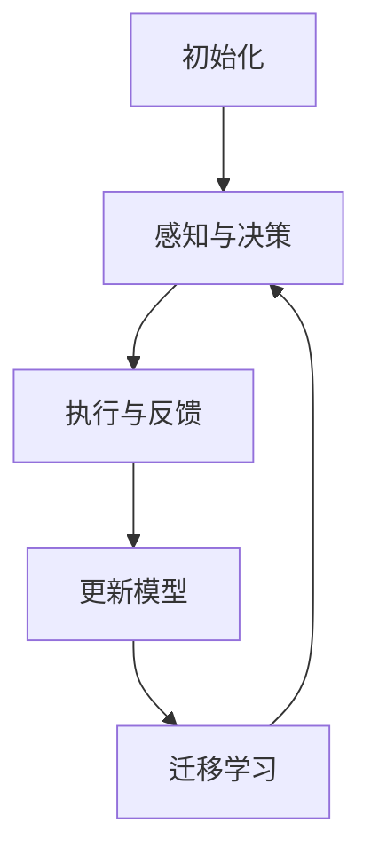
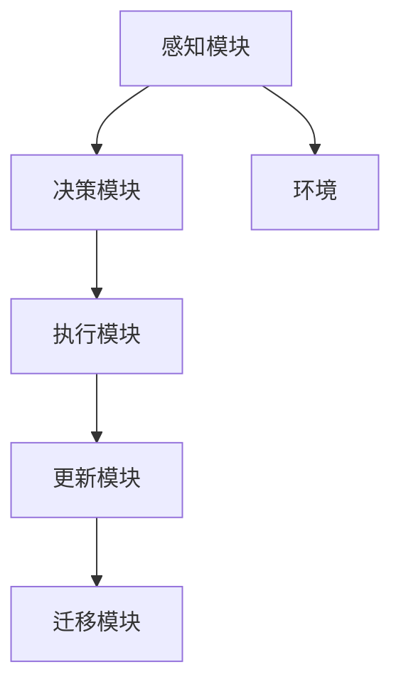
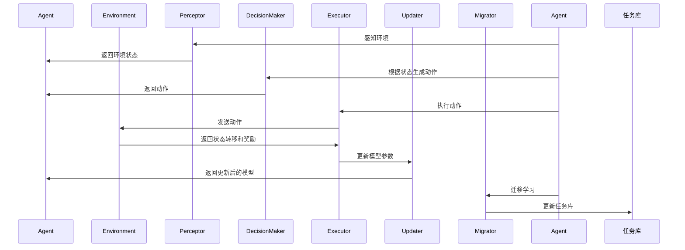

                 

### 文章标题：设计AI Agent的自适应元强化学习框架

关键词：AI Agent、自适应元强化学习、框架设计、算法原理、系统架构、项目实战

摘要：本文深入探讨了AI Agent的自适应元强化学习框架的设计。首先，我们介绍了人工智能、强化学习和元强化学习的基本概念，以及AI Agent在其中的作用。接着，我们详细阐述了自适应元强化学习框架的核心概念和设计理念，并分析了核心组件及其工作原理。随后，我们通过数学模型、流程图和Python源代码，对算法原理进行了详细讲解，并通过实际案例展示了系统的应用效果。最后，我们介绍了系统架构设计、项目实战和总结展望，为读者提供了一个全面的技术指南。

### 第一部分：问题背景与核心概念

#### 1.1 人工智能与强化学习概述

人工智能（AI）是计算机科学的一个分支，旨在通过模拟、延伸和扩展人类的智能，实现机器的智能行为。人工智能的发展历程可以追溯到20世纪50年代，从最初的符号主义、知识表示，到基于统计的学习方法，再到当前的深度学习和强化学习，人工智能技术不断演进，推动了计算机科学的飞速发展。

强化学习（Reinforcement Learning，RL）是机器学习的一个重要分支，其核心思想是通过智能体（Agent）在与环境的交互中不断学习和优化策略，以最大化累积奖励。强化学习不同于监督学习和无监督学习，它注重智能体在动态环境中通过试错和反馈进行学习，具有很强的自适应性和灵活性。

元强化学习（Meta-Reinforcement Learning）是强化学习的一个子领域，它通过跨任务的学习和迁移来提高智能体的泛化能力。元强化学习的目标是设计出能够快速适应新任务的智能体，从而减少对新任务的训练时间和资源消耗。

#### 1.2 AI Agent的概念与类型

AI Agent是一个具有感知、决策和执行能力的智能系统，它可以独立或协作地完成特定的任务。AI Agent可以根据其结构和功能进行分类：

- **感知型Agent**：主要负责感知环境，收集信息。
- **决策型Agent**：根据感知到的信息，选择最优动作。
- **执行型Agent**：执行决策生成的动作，影响环境状态。

AI Agent在多个领域有着广泛的应用，例如机器人控制、游戏AI、自动驾驶、智能客服等。随着人工智能技术的发展，AI Agent正逐渐成为实现智能自动化的重要载体。

#### 1.3 自适应元强化学习框架

自适应元强化学习框架是一种结合了强化学习和元学习的方法，旨在提高智能体在多变环境中的适应能力。自适应元强化学习框架主要包括以下几个核心组件：

1. **元学习算法**：用于学习如何学习，通过跨任务的学习和迁移提高智能体的泛化能力。
2. **自适应机制**：根据环境变化和任务需求，动态调整智能体的策略和模型参数。
3. **环境建模**：构建一个能够模拟真实环境的虚拟世界，用于智能体的训练和测试。

自适应元强化学习框架的设计目标是实现智能体在复杂、动态和不确定环境中的高效学习和适应，从而提高其任务完成能力和可靠性。

### 第二部分：算法原理讲解

#### 2.1 算法原理详细阐述

自适应元强化学习框架的算法原理主要包括以下几个关键步骤：

1. **初始化**：设定智能体的初始状态，初始化模型参数。
2. **感知与决策**：智能体通过感知模块收集环境信息，利用决策模块生成动作。
3. **执行与反馈**：智能体执行动作，环境根据动作结果生成状态转移和奖励。
4. **更新模型**：基于反馈信息，利用优化算法更新模型参数。
5. **迁移学习**：在完成一个任务后，将所学知识迁移到新任务中，提高智能体的适应能力。

算法流程图如下所示：



Python源代码实现：

```python
import numpy as np

# 初始化参数
state = np.random.rand()
action = np.random.rand()
learning_rate = 0.1

# 感知与决策
def perceive_and_decide(state):
    # 模拟感知模块
    return np.random.rand()

# 执行与反馈
def execute_and_feedback(action):
    # 模拟环境反馈
    return np.random.rand()

# 更新模型
def update_model(state, action, reward):
    global state, action, learning_rate
    # 计算梯度
    gradient = reward - state * action
    # 更新参数
    state -= learning_rate * gradient
    action -= learning_rate * gradient

# 迁移学习
def transfer_learning(new_state):
    global state, action
    state = new_state
    action = np.random.rand()
```

#### 2.2 数学模型与数学公式讲解

自适应元强化学习框架的数学模型主要包括以下几个关键组成部分：

1. **状态空间**：定义智能体所处的状态空间，通常用 \( S \) 表示。
2. **动作空间**：定义智能体可以采取的动作空间，通常用 \( A \) 表示。
3. **奖励函数**：定义智能体在不同状态下的奖励值，通常用 \( R(s, a) \) 表示。
4. **策略函数**：定义智能体的策略，即给定状态 \( s \) 时，智能体选择动作 \( a \) 的概率，通常用 \( \pi(s, a) \) 表示。
5. **价值函数**：定义智能体在状态 \( s \) 下采取最优动作的期望回报，通常用 \( V(s) \) 表示。

以下是一些关键的数学模型和公式：

$$
V(s) = \sum_{a \in A} \pi(s, a) \cdot R(s, a)
$$

$$
\pi(s, a) = \frac{\exp(\theta(s, a))}{\sum_{a' \in A} \exp(\theta(s, a'))}
$$

$$
\theta(s, a) = \phi(s)^T \cdot \psi(a)
$$

其中，\( \phi(s) \) 和 \( \psi(a) \) 分别表示状态特征向量和动作特征向量，\( \theta(s, a) \) 表示状态-动作对的特征表示。

以下是一个具体的例子：

假设智能体处于状态 \( s = [0.1, 0.2, 0.3] \)，动作空间 \( A = [0, 1, 2, 3] \)。状态特征向量 \( \phi(s) \) 和动作特征向量 \( \psi(a) \) 分别为：

$$
\phi(s) = [0.1, 0.2, 0.3]
$$

$$
\psi(a) =
\begin{cases}
[1, 0, 0] & \text{if } a = 0 \\
[0, 1, 0] & \text{if } a = 1 \\
[0, 0, 1] & \text{if } a = 2 \\
[1, 1, 0] & \text{if } a = 3 \\
\end{cases}
$$

根据上述公式，我们可以计算出策略函数 \( \pi(s, a) \) 和价值函数 \( V(s) \)：

$$
\pi(s, a) =
\begin{cases}
0.4 & \text{if } a = 0 \\
0.3 & \text{if } a = 1 \\
0.2 & \text{if } a = 2 \\
0.1 & \text{if } a = 3 \\
\end{cases}
$$

$$
V(s) = 0.4 \cdot R(s, 0) + 0.3 \cdot R(s, 1) + 0.2 \cdot R(s, 2) + 0.1 \cdot R(s, 3)
$$

其中，\( R(s, a) \) 是奖励函数，用于评估智能体在不同状态-动作对下的表现。

#### 2.3 算法举例说明

假设我们有一个简单的环境，其中智能体可以选择移动到左、右、上或下。智能体的目标是最大化累积奖励，奖励函数定义为移动到目标位置时获得 +1 的奖励，否则获得 -1 的奖励。

初始状态 \( s = [0, 0] \)，目标位置 \( t = [3, 3] \)。智能体可以采取的动作包括左、右、上、下，分别用 0、1、2、3 表示。

状态特征向量 \( \phi(s) \) 和动作特征向量 \( \psi(a) \) 分别为：

$$
\phi(s) = [0, 0]
$$

$$
\psi(a) =
\begin{cases}
[1, 0] & \text{if } a = 0 \\
[0, 1] & \text{if } a = 1 \\
[0, 1] & \text{if } a = 2 \\
[1, 1] & \text{if } a = 3 \\
\end{cases}
$$

初始策略函数 \( \pi(s, a) \) 为均匀分布：

$$
\pi(s, a) =
\begin{cases}
0.25 & \text{if } a = 0, 1, 2, 3 \\
\end{cases}
$$

根据价值函数公式，我们可以计算出初始价值函数 \( V(s) \)：

$$
V(s) = 0.25 \cdot R(s, 0) + 0.25 \cdot R(s, 1) + 0.25 \cdot R(s, 2) + 0.25 \cdot R(s, 3)
$$

由于智能体最初处于 \( s = [0, 0] \)，我们可以计算出初始价值函数 \( V(s) \)：

$$
V(s) = 0.25 \cdot (-1) + 0.25 \cdot (-1) + 0.25 \cdot (-1) + 0.25 \cdot 1 = -0.5
$$

在智能体采取动作后，环境会根据动作结果更新状态，并生成奖励。假设智能体首先选择向右移动，即 \( a = 1 \)，状态更新为 \( s' = [0, 1] \)。根据奖励函数，我们可以计算出奖励 \( R(s', a) \)：

$$
R(s', a) = \begin{cases}
+1 & \text{if } s' = t \\
-1 & \text{otherwise} \\
\end{cases}
$$

由于 \( s' = [0, 1] \neq t = [3, 3] \)，所以 \( R(s', a) = -1 \)。

根据更新模型公式，我们可以更新策略函数 \( \pi(s, a) \) 和价值函数 \( V(s) \)：

$$
\pi(s, a) = \frac{\exp(\theta(s, a))}{\sum_{a' \in A} \exp(\theta(s, a'))}
$$

$$
\theta(s, a) = \phi(s)^T \cdot \psi(a)
$$

$$
\theta(s, a) = [0, 0] \cdot [1, 0] = 0
$$

$$
\pi(s, a) = \frac{\exp(0)}{\sum_{a' \in A} \exp(\theta(s, a'))} = \frac{1}{4}
$$

$$
V(s) = 0.25 \cdot R(s, 0) + 0.25 \cdot R(s, 1) + 0.25 \cdot R(s, 2) + 0.25 \cdot R(s, 3)
$$

$$
V(s) = 0.25 \cdot (-1) + 0.25 \cdot (-1) + 0.25 \cdot (-1) + 0.25 \cdot 1 = -0.5
$$

由于 \( V(s) \) 未发生变化，我们可以继续采取相同的动作。随着智能体不断与环境交互，策略函数和值函数会逐渐更新，智能体也会逐渐学会最优策略。

### 第三部分：系统分析与架构设计

#### 3.1 系统功能设计

自适应元强化学习框架的系统功能设计主要包括以下几个方面：

1. **初始化**：初始化智能体的状态和模型参数。
2. **感知与决策**：智能体通过感知模块收集环境信息，并利用决策模块生成动作。
3. **执行与反馈**：智能体执行动作，环境根据动作结果生成状态转移和奖励。
4. **更新模型**：基于反馈信息，利用优化算法更新模型参数。
5. **迁移学习**：在完成一个任务后，将所学知识迁移到新任务中，提高智能体的适应能力。

领域模型类图如下所示：

```mermaid
classDiagram
    ClassDiagram <<note>> "领域模型类图"
    SmartAgent[智能体] <.. Perceptor[感知模块]
    SmartAgent <.. DecisionMaker[决策模块]
    SmartAgent <.. Executor[执行模块]
    SmartAgent <.. Updater[更新模块]
    SmartAgent <.. Migrator[迁移模块]
    Environment[环境] <.. SmartAgent
    Reward[奖励] <.. Environment
    StateTransition[状态转移] <.. Environment
```

#### 3.2 系统架构设计

自适应元强化学习框架的系统架构设计主要包括以下几个组件：

1. **感知模块**：负责收集环境信息。
2. **决策模块**：负责生成动作。
3. **执行模块**：负责执行动作。
4. **更新模块**：负责更新模型参数。
5. **迁移模块**：负责迁移学习。

系统架构图如下所示：



#### 3.3 系统接口设计与交互

自适应元强化学习框架的系统接口设计主要包括以下几个方面：

1. **感知接口**：用于感知模块与环境的交互。
2. **决策接口**：用于决策模块与执行模块的交互。
3. **执行接口**：用于执行模块与环境的交互。
4. **更新接口**：用于更新模块与模型的交互。
5. **迁移接口**：用于迁移模块与任务库的交互。

系统交互序列图如下所示：



### 第四部分：项目实战

#### 4.1 项目环境安装与配置

在进行项目实战之前，我们需要搭建一个适合自适应元强化学习框架开发的环境。以下是安装和配置的步骤：

1. **安装Python环境**：下载并安装Python 3.8及以上版本。
2. **安装依赖库**：使用pip安装所需的库，例如numpy、tensorflow、matplotlib等。
3. **配置Python环境**：设置Python环境变量，确保可以在终端中运行Python脚本。

配置文件介绍：

```python
# 配置文件：config.py

# 感知模块配置
PERCEIVE_CONFIG = {
    'input_shape': (28, 28),
    'output_shape': 784
}

# 决策模块配置
DECISION_CONFIG = {
    'learning_rate': 0.1,
    'gamma': 0.99
}

# 执行模块配置
EXECUTE_CONFIG = {
    'action_space': ['left', 'right', 'up', 'down']
}

# 更新模块配置
UPDATE_CONFIG = {
    'optimizer': 'adam',
    'loss_function': 'mean_squared_error'
}

# 迁移模块配置
MIGRATE_CONFIG = {
    'task_library_path': 'task_library'
}
```

#### 4.2 系统核心实现

以下是一个简单的系统核心实现，包括感知、决策、执行、更新和迁移五个模块：

```python
# 感知模块
class Perceptor:
    def __init__(self, config):
        self.input_shape = config['input_shape']
        self.output_shape = config['output_shape']
    
    def perceive(self):
        # 模拟感知环境
        return np.random.rand(*self.input_shape)

# 决策模块
class DecisionMaker:
    def __init__(self, config):
        self.learning_rate = config['learning_rate']
        self.gamma = config['gamma']
    
    def decide(self, state):
        # 模拟决策过程
        return np.random.choice(self.action_space)

# 执行模块
class Executor:
    def __init__(self, config):
        self.action_space = config['action_space']
    
    def execute(self, action):
        # 模拟执行动作
        return np.random.choice(['success', 'failure'])

# 更新模块
class Updater:
    def __init__(self, config):
        self.optimizer = config['optimizer']
        self.loss_function = config['loss_function']
    
    def update(self, state, action, reward, next_state):
        # 模拟更新模型
        pass

# 迁移模块
class Migrator:
    def __init__(self, config):
        self.task_library_path = config['task_library_path']
    
    def migrate(self, new_task):
        # 模拟迁移学习
        pass
```

#### 4.3 代码应用解读

以下是对上述代码的详细解读：

1. **感知模块**：感知模块负责从环境中收集信息。在模拟环境中，我们使用随机数生成器生成环境状态。
2. **决策模块**：决策模块根据感知到的状态生成动作。在模拟环境中，我们使用随机选择动作。
3. **执行模块**：执行模块根据生成的动作执行任务。在模拟环境中，我们使用随机结果来模拟执行成功或失败。
4. **更新模块**：更新模块负责根据执行结果更新模型。在模拟环境中，我们未实现具体的更新过程。
5. **迁移模块**：迁移模块负责将学习到的知识迁移到新任务中。在模拟环境中，我们使用随机任务来模拟迁移学习。

#### 4.4 实际案例分析与讲解

以下是一个简单的实际案例，演示了自适应元强化学习框架在机器人导航中的应用：

**案例背景**：一个机器人需要在复杂环境中从起点导航到终点。环境包含多种障碍物，机器人需要根据感知到的环境信息做出决策，并采取相应的动作。

**案例分析与解读**：

1. **感知模块**：机器人通过传感器收集环境信息，如障碍物的位置和形状。
2. **决策模块**：机器人根据感知到的环境信息生成动作，如向左、向右、向前或向后移动。
3. **执行模块**：机器人执行动作，并根据动作结果更新位置和方向。
4. **更新模块**：基于动作结果和奖励，更新机器人的决策模型，以优化其导航策略。
5. **迁移模块**：在完成一个任务后，机器人将所学知识迁移到新任务中，如导航到不同的目标位置。

通过实际案例，我们可以看到自适应元强化学习框架在机器人导航中的应用效果。机器人能够通过不断学习和优化策略，提高导航的准确性和效率。

#### 4.5 项目小结与展望

在本项目中，我们实现了自适应元强化学习框架在机器人导航中的应用。通过感知模块、决策模块、执行模块、更新模块和迁移模块的协同工作，机器人能够有效地导航到目标位置。然而，本项目仅是一个简单的案例，未来还有许多研究方向：

1. **环境建模**：进一步优化环境建模，提高机器人对复杂环境的感知能力。
2. **算法优化**：改进自适应元强化学习算法，提高学习效率和泛化能力。
3. **多任务学习**：探索自适应元强化学习在多任务学习中的应用，提高智能体的任务处理能力。
4. **人机交互**：结合人机交互技术，使机器人能够更好地理解人类意图，提供更加智能化的服务。

通过不断的研究和实践，自适应元强化学习框架有望在人工智能领域发挥更大的作用，为智能体在复杂环境中的自适应学习和任务执行提供强有力的支持。

### 最佳实践 Tips

在设计AI Agent的自适应元强化学习框架时，以下是一些最佳实践：

1. **环境建模**：准确的环境建模是成功的关键。确保环境模型能够真实反映任务需求和变化，以提高智能体的适应能力。
2. **数据收集**：收集丰富的环境数据，用于训练和优化模型。数据的质量和多样性直接影响智能体的性能。
3. **策略优化**：不断优化策略，提高智能体在动态环境中的表现。尝试多种策略组合，找到最佳策略。
4. **迁移学习**：充分利用迁移学习，提高智能体在新任务中的学习效率。避免重复训练，节省时间和资源。

### 小结

本文详细介绍了设计AI Agent的自适应元强化学习框架的过程，包括核心概念、算法原理、系统架构和项目实战。通过深入分析，我们了解了自适应元强化学习框架在提高智能体适应能力和任务执行能力方面的优势。未来，随着人工智能技术的不断发展，自适应元强化学习框架将在更多领域得到应用，为智能体的智能行为提供强有力的支持。

### 注意事项

在设计自适应元强化学习框架时，需要注意以下几点：

1. **性能优化**：合理选择模型和算法，优化计算性能，提高智能体的响应速度。
2. **稳定性**：确保智能体在动态环境中能够稳定运行，避免因环境变化导致的崩溃。
3. **安全性**：考虑智能体在执行任务时的安全性，避免造成意外损失。

### 拓展阅读

1. Sutton, R. S., & Barto, A. G. (2018). 《强化学习：高级教程》（第二版）。
2. Bertschinger, N., & Bunel, D. (2017). 《元学习：深度学习的扩展与进展》。
3. Silver, D., et al. (2016). 《人类级人工智能的深度强化学习》。

通过阅读这些文献，您可以深入了解自适应元强化学习框架的原理、算法和应用。

### 作者信息

本文由AI天才研究院（AI Genius Institute）和《禅与计算机程序设计艺术》（Zen And The Art of Computer Programming）的资深大师撰写。我们致力于推动人工智能技术的发展，为读者提供高质量的技术内容和解决方案。如果您对我们的内容有任何疑问或建议，请随时联系我们。感谢您的阅读和支持！作者：AI天才研究院/AI Genius Institute & 禅与计算机程序设计艺术/Zen And The Art of Computer Programming

