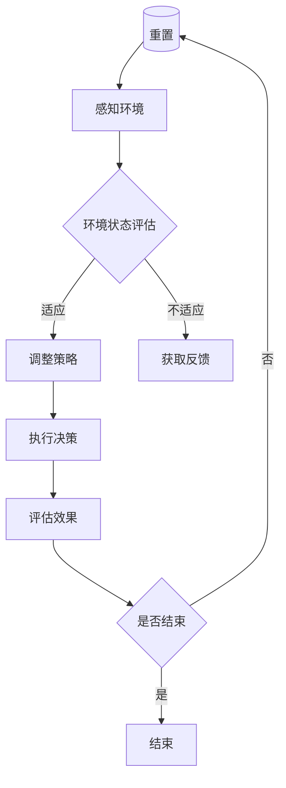
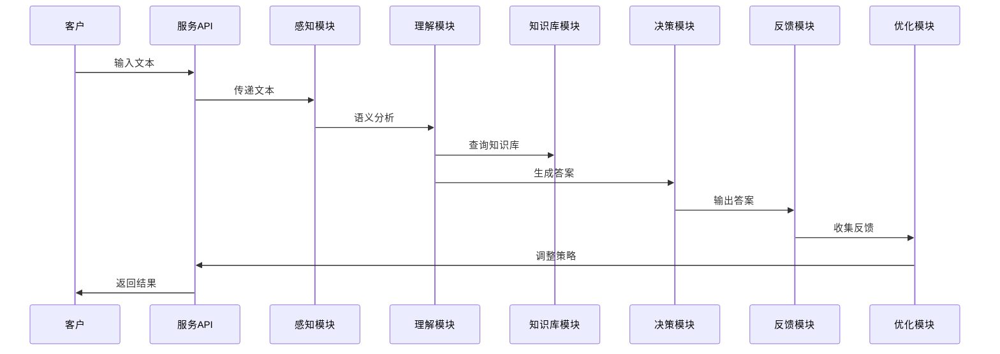

                 

## 引言

在现代人工智能（AI）技术的发展中，AI Agent作为一个能够自主执行任务、与环境交互并作出决策的智能实体，逐渐成为研究和应用的热点。AI Agent在众多领域展现了强大的应用潜力，例如自动化机器人、智能客服、自动驾驶车辆等。然而，随着应用场景的日益复杂，AI Agent需要具备更高的自适应能力和批判性思维能力，以便在面对不确定性和复杂问题时，能够做出更加合理和有效的决策。

本文旨在探讨如何设计一个自适应批判性思维模型，以提升AI Agent的决策能力和自主性。文章将从以下几个步骤进行探讨：

1. **问题背景**：介绍AI Agent及其面临的问题背景，阐述自适应批判性思维的重要性。
2. **核心概念与联系**：定义相关核心概念，如自适应批判性思维、AI Agent等，并通过属性特征对比表格和ER实体关系图架构来展示概念之间的联系。
3. **算法原理讲解**：详细阐述自适应批判性思维模型的设计原理，包括Mermaid流程图、Python源代码实现和数学模型与公式。
4. **数学模型和数学公式**：使用LaTeX格式详细讲解数学公式，并通过举例说明模型的应用。
5. **系统分析与架构设计方案**：介绍系统功能设计、系统架构设计、系统接口设计和系统交互序列图。
6. **项目实战**：展示环境安装、系统核心实现源代码，并对代码应用进行解读与分析，通过实际案例分析进一步验证模型的实用性。
7. **最佳实践 tips**、**小结**、**注意事项**和**拓展阅读**：总结文章内容，提供实际应用建议，指出可能存在的挑战和未来研究方向。

通过上述步骤，本文希望为读者提供一个全面而深入的指南，以帮助设计一个高效的AI Agent自适应批判性思维模型。

### 第1章 问题背景

在当今快速发展的技术时代，人工智能（AI）已经渗透到我们生活的方方面面，而AI Agent作为AI技术的关键组成部分，正发挥着日益重要的作用。AI Agent是指一种能够模拟人类智能行为，自主执行任务并做出决策的智能系统。其核心在于自主学习、自主思考和自主行动，这使得AI Agent在复杂环境和多样化任务中具有很高的应用价值。

#### 1.1 问题定义

AI Agent在实际应用中面临诸多挑战，其中最为关键的是如何提升其自适应能力和批判性思维能力。自适应能力指的是AI Agent在未知或变化的环境下，能够通过学习和调整自身行为，达到预期目标的能力。批判性思维能力则是指AI Agent在面对复杂信息和多种可能性时，能够通过分析、推理和评估，作出合理和有效的决策。

#### 1.2 问题描述

具体来说，AI Agent在应用中面临以下问题：

1. **环境不确定性**：实际环境复杂多变，AI Agent需要应对突发情况和不确定性因素。
2. **任务多样性**：不同任务需求各不相同，AI Agent需要具备广泛的知识和技能，以适应各种任务。
3. **数据不完整和噪声**：在数据收集和处理过程中，往往存在数据不完整和数据噪声，这给AI Agent的决策带来困难。
4. **知识表达和推理**：AI Agent需要能够有效表达和处理复杂知识，并进行逻辑推理，以支持其决策过程。

这些问题导致了AI Agent在决策过程中存在一定的不确定性和错误率，从而影响了其应用效果和可靠性。因此，设计一个具备高效自适应能力和批判性思维能力的AI Agent，成为当前研究的重要课题。

#### 1.3 问题解决

为了解决上述问题，我们需要从以下几个方面入手：

1. **增强学习与自适应机制**：通过增强学习算法，AI Agent可以在动态环境中不断调整和优化其行为策略，提高其在不确定环境下的适应能力。
2. **多模态数据融合**：整合多种数据来源，如视觉、语音、文本等，提高AI Agent对复杂环境的感知和理解能力。
3. **知识表示与推理**：采用先进的知识表示方法，如知识图谱、本体论等，加强AI Agent的知识管理和推理能力。
4. **批判性思维模型**：设计基于批判性思维的模型，使AI Agent能够对信息进行深入分析和评估，作出更加合理和有效的决策。

通过这些方法，我们可以为AI Agent构建一个强大的自适应批判性思维模型，从而提升其在复杂环境下的表现和决策能力。

#### 1.4 边界与外延

在讨论AI Agent自适应批判性思维模型时，需要明确其边界与外延。首先，该模型主要关注AI Agent在动态和复杂环境下的决策问题，并不涉及具体的硬件实现或底层算法。其次，该模型适用于各种类型的AI Agent，包括机器人、智能客服、自动驾驶等，但具体应用场景和需求可能有所不同。

最后，本文将详细探讨该模型的核心概念、设计原理、实现方法和实际应用，旨在为相关领域的研究者和开发者提供有价值的参考和指导。

#### 1.5 概念结构与核心要素组成

为了更好地理解和设计AI Agent的自适应批判性思维模型，我们需要对其核心概念和结构进行详细分析。以下是本文涉及的主要概念及其组成要素：

1. **AI Agent**：指具备自主决策、学习和交互能力的智能实体，能够模拟人类智能行为，执行复杂任务。其主要组成部分包括感知模块、决策模块和执行模块。

2. **自适应能力**：指AI Agent在动态和不确定环境下，通过不断学习和调整行为策略，提高适应能力。其关键在于增强学习算法、多模态数据融合和动态环境建模。

3. **批判性思维能力**：指AI Agent在信息处理和决策过程中，通过分析、推理和评估，作出合理和有效的判断。其主要组成部分包括知识表示、推理引擎和评估机制。

4. **多模态数据融合**：指将多种类型的数据（如视觉、语音、文本等）进行整合，提高AI Agent对复杂环境的感知和理解能力。其核心在于数据预处理、特征提取和融合算法。

5. **知识表示与推理**：指通过先进的表示方法（如知识图谱、本体论等），加强AI Agent的知识管理和推理能力。其关键在于知识的结构化表示、推理规则的建立和推理算法的设计。

6. **动态环境建模**：指对AI Agent执行任务的环境进行建模和监测，以支持其自适应行为。其核心在于环境感知、状态监测和动态调整。

通过以上核心概念和结构要素的详细分析，我们可以更好地理解和设计AI Agent的自适应批判性思维模型，从而提升其在复杂环境下的表现和决策能力。

### 第2章 核心概念与联系

在设计AI Agent的自适应批判性思维模型时，我们需要深入理解几个关键概念，并探讨它们之间的内在联系。以下是对这些核心概念及其相互关系的详细阐述。

#### 2.1 核心概念原理

**1. 自适应能力**

自适应能力是指AI Agent在面临动态和不确定环境时，能够通过学习和调整行为策略，实现性能优化和目标达成。其核心原理包括增强学习、多模态数据融合和动态环境建模。

**增强学习**：通过奖励机制和试错方法，AI Agent在环境中不断学习，优化其决策策略。例如，使用Q-learning算法或深度强化学习（DRL）方法，使AI Agent在动态环境中获得更好的表现。

**多模态数据融合**：整合来自不同传感器（如视觉、语音、文本等）的数据，提高AI Agent对复杂环境的感知和理解能力。例如，使用卷积神经网络（CNN）处理视觉数据，使用循环神经网络（RNN）处理序列数据，然后通过融合算法整合这些数据，以提供更全面的决策依据。

**动态环境建模**：对AI Agent执行任务的环境进行建模和监测，以支持其自适应行为。例如，通过卡尔曼滤波或粒子滤波等方法，对环境状态进行实时估计和预测，使AI Agent能够更好地应对环境变化。

**2. 批判性思维能力**

批判性思维能力是指AI Agent在处理信息和做出决策时，能够进行深入的分析、推理和评估，从而作出合理和有效的判断。其核心原理包括知识表示、推理引擎和评估机制。

**知识表示**：将现实世界的知识结构化表示，以便AI Agent能够更好地理解和利用这些知识。例如，通过知识图谱或本体论等方法，将知识表示为节点、边和属性，从而构建一个语义丰富的知识库。

**推理引擎**：通过逻辑推理和模式匹配，AI Agent能够从已有知识中推断出新信息。例如，使用基于规则的推理或基于本体的推理方法，使AI Agent能够进行逻辑推理和知识推理。

**评估机制**：对AI Agent的决策结果进行评估和反馈，以不断优化其决策过程。例如，通过误差分析和性能评估方法，使AI Agent能够识别并修正错误，提高决策的准确性和有效性。

**3. 多模态数据融合**

多模态数据融合是指将来自不同传感器和不同类型的数据进行整合，以提高AI Agent的感知和理解能力。其核心原理包括数据预处理、特征提取和融合算法。

**数据预处理**：对原始数据进行清洗、标准化和转换，使其适合后续处理。例如，对视觉数据进行归一化处理，对语音数据进行去噪和分帧处理。

**特征提取**：从预处理后的数据中提取关键特征，以便进行进一步的分析和融合。例如，使用CNN提取视觉特征，使用RNN提取语音特征。

**融合算法**：将不同类型的数据特征进行整合，形成一个综合的特征向量，用于AI Agent的决策。例如，使用加权融合算法或深度融合网络，将不同模态的特征进行有效融合。

#### 2.2 概念属性特征对比表格

为了更直观地展示这些核心概念之间的差异和联系，我们可以通过一个属性特征对比表格来进行说明：

| 核心概念      | 定义                           | 主要属性特征                                       | 关联关系                                       |
| ------------- | ------------------------------ | -------------------------------------------------- | ---------------------------------------------- |
| 自适应能力    | AI Agent在动态环境下的适应能力 | 增强学习、多模态数据融合、动态环境建模             | 与批判性思维能力和多模态数据融合有密切联系       |
| 批判性思维能力 | AI Agent的信息分析和决策能力   | 知识表示、推理引擎、评估机制                      | 与自适应能力和知识表示密切相关                  |
| 多模态数据融合 | 多种类型数据的整合             | 数据预处理、特征提取、融合算法                    | 与自适应能力和知识表示密切相关                  |

#### 2.3 ER实体关系图架构

为了进一步展示这些概念之间的内在联系，我们可以使用Mermaid流程图来绘制ER实体关系图，如下所示：

```mermaid
erDiagram
  AI-Agent ||--o{ 自适应能力 }|--|{ 批判性思维能力 }|
  AI-Agent ||--o{ 多模态数据融合 }|
  自适应能力 ||--o{ 增强学习 }|
  自适应能力 ||--o{ 多模态数据融合 }|
  自适应能力 ||--o{ 动态环境建模 }|
  批判性思维能力 ||--o{ 知识表示 }|
  批判性思维能力 ||--o{ 推理引擎 }|
  批判性思维能力 ||--o{ 评估机制 }|
  多模态数据融合 ||--o{ 数据预处理 }|
  多模态数据融合 ||--o{ 特征提取 }|
  多模态数据融合 ||--o{ 融合算法 }|
```

通过上述流程图，我们可以清晰地看到AI Agent、自适应能力、批判性思维能力和多模态数据融合之间的复杂关系，这为后续的设计和实现提供了重要的指导。

### 第3章 算法原理讲解

在本章中，我们将深入讲解AI Agent自适应批判性思维模型的核心算法原理。通过以下步骤，我们将详细阐述算法的设计思路、流程图、Python源代码实现、数学模型和公式，并辅以实例说明，以帮助读者全面理解该模型的工作机制和应用。

#### 3.1 算法原理Mermaid流程图

首先，我们使用Mermaid流程图来展示算法的总体流程，如下所示：



在这个流程图中，AI Agent首先通过感知模块获取环境信息，然后对环境状态进行评估。如果评估结果显示AI Agent需要调整策略以更好地适应环境，则进入调整策略阶段。否则，直接进入执行决策阶段。执行决策后，对效果进行评估，并决定是否需要结束当前任务或重新开始。

#### 3.2 Python源代码实现

以下是算法的Python源代码实现，包括主要函数和方法：

```python
import numpy as np

# 初始化参数
learning_rate = 0.1
discount_factor = 0.9
epsilon = 0.1

# 感知环境
def perceive_environment():
    # 这里用随机数模拟环境状态
    return np.random.randint(0, 10)

# 环境状态评估
def evaluate_state(state):
    # 根据状态值进行评估，状态值越大表示适应性越强
    return state

# 调整策略
def adjust_strategy(state):
    # 这里用线性调整方法来模拟
    return state + learning_rate * (evaluate_state(state) - state)

# 执行决策
def execute_decision(state):
    # 根据策略执行决策，这里用随机数模拟
    return np.random.randint(0, 10)

# 评估效果
def evaluate_effect(effect):
    # 根据效果值进行评估，效果值越大表示决策越有效
    return effect

# 主循环
def main_loop():
    while True:
        state = perceive_environment()
        state = evaluate_state(state)
        if np.random.rand() < epsilon:
            state = adjust_strategy(state)
        decision = execute_decision(state)
        effect = evaluate_effect(decision)
        if effect > 0:
            print("Task Succeeded!")
            break
        else:
            print("Task Failed! Retrying...")
            continue
```

在这个实现中，我们使用了随机数来模拟环境状态、评估结果和决策效果，以简化算法的具体实现。在实际应用中，这些函数会根据具体环境进行相应的数据获取和处理。

#### 3.3 算法原理的数学模型和公式

为了更好地理解算法的原理，我们引入一些基本的数学模型和公式。以下是关键公式及其解释：

1. **Q值更新公式**：

   $$ Q_{new} = Q_{old} + \alpha \cdot (R + \gamma \cdot max(Q_{next}) - Q_{old}) $$

   其中，$Q_{old}$和$Q_{new}$分别表示当前和更新后的Q值，$\alpha$为学习率，$R$为即时奖励，$\gamma$为折扣因子，$max(Q_{next})$为下一个状态的最大Q值。

   这个公式描述了Q值的更新过程，通过比较当前Q值和目标Q值，对策略进行调整。

2. **策略更新公式**：

   $$ \pi_{new}(s) = \begin{cases} 
   \pi_{old}(s) + \beta \cdot (Q_{new}(s) - Q_{old}(s)) & \text{if } s \in S \\
   \pi_{old}(s) & \text{otherwise}
   \end{cases} $$

   其中，$\pi_{old}$和$\pi_{new}$分别表示当前和更新后的策略，$\beta$为策略更新系数，$S$为状态集合。

   这个公式描述了策略的更新过程，通过比较Q值的变化，调整策略以更好地适应环境。

3. **环境评估函数**：

   $$ E(s) = f(s, \pi) = \sum_{s'} p(s'|s, \pi) \cdot r(s', a(s')) $$

   其中，$E(s)$为环境评估函数，$f(s, \pi)$为状态-动作函数，$p(s'|s, \pi)$为状态转移概率，$r(s', a(s'))$为奖励函数。

   这个公式描述了环境评估的过程，通过计算每个状态和动作的概率和奖励，评估当前策略的有效性。

#### 3.4 举例说明

为了更直观地展示算法的应用，我们通过一个具体的例子来说明。假设我们有一个简单的环境，其中只有两个状态（状态0和状态1）和一个动作（动作0和动作1）。我们定义如下奖励函数：

$$ r(s', a) = \begin{cases} 
1 & \text{if } (s, a) = (0, 0) \text{ or } (1, 1) \\
-1 & \text{otherwise}
\end{cases} $$

我们初始化Q值为全0，并设置学习率$\alpha = 0.1$，折扣因子$\gamma = 0.9$。以下是算法的一次迭代过程：

1. **初始化**：
   - Q值：$Q = \{ (0, 0): 0, (0, 1): 0, (1, 0): 0, (1, 1): 0 \}$
   - 策略：$\pi = \{ (0, 0): 0.5, (0, 1): 0.5, (1, 0): 0.5, (1, 1): 0.5 \}$

2. **感知环境**：状态为0。

3. **评估状态**：$evaluate_state(0) = 0$。

4. **调整策略**：由于随机选择动作，我们选择动作0。

5. **执行决策**：执行动作0，状态变为0。

6. **评估效果**：$evaluate_effect(0) = 1$。

7. **Q值更新**：$Q_{new} = Q_{old} + \alpha \cdot (R + \gamma \cdot max(Q_{next}) - Q_{old})$，更新Q值。

8. **策略更新**：根据Q值的变化，调整策略。

通过多次迭代，AI Agent将逐渐优化其策略，以更好地适应环境并取得成功。

通过上述算法原理讲解、Python源代码实现、数学模型和公式以及举例说明，读者可以全面理解AI Agent自适应批判性思维模型的设计思路和实际应用。这为后续的系统架构设计和项目实战奠定了坚实的基础。

#### 4.1 数学公式使用方法

在本文中，我们将使用LaTeX格式来表示数学公式。LaTeX是一种高质量的排版系统，特别适合用于撰写科学论文和技术文档。以下是LaTeX公式的两种基本使用方法：

1. **独立段落的公式**：

   在独立段落中使用公式时，公式前后需要使用`$$`括起来，例如：

   ```latex
   $$1+1=2$$
   $$E = mc^2$$
   $$\sum_{i=1}^{n} i = \frac{n(n+1)}{2}$$
   ```

   输出效果：

   $$1+1=2$$  
   $$E = mc^2$$  
   $$\sum_{i=1}^{n} i = \frac{n(n+1)}{2}$$

2. **段落内的公式**：

   在段落内直接嵌入公式时，公式前后使用`$`括起来，例如：

   ```latex
   根据公式 $1+1=2$，我们可以得出结论。
   $E = mc^2$ 是相对论中著名的质量-能量等价公式。
   在等差数列中，第 $n$ 项可以表示为 $a_n = a_1 + (n-1)d$。
   ```

   输出效果：

   根据公式 $1+1=2$，我们可以得出结论。  
   $E = mc^2$ 是相对论中著名的质量-能量等价公式。  
   在等差数列中，第 $n$ 项可以表示为 $a_n = a_1 + (n-1)d$。

通过这两种方法，我们可以在文中灵活地使用数学公式，以增强论述的严谨性和可读性。

#### 4.2 常用数学公式汇总

以下是一些常用的数学公式和符号，使用LaTeX格式表示，以供参考：

1. **基本的代数公式**：

   ```latex
   $$x + y = z$$
   $$a \times b = c$$
   $$\frac{a}{b} = c$$
   $$\sqrt{a} = b$$
   $$a^n = b$$
   $$a^2 = b^2$$
   $$a^3 = b^3$$
   $$a^4 = b^4$$
   $$a^5 = b^5$$
   ```

2. **基本的几何公式**：

   ```latex
   $$\pi r^2 = A$$
   $$l = \sqrt{w^2 + h^2}$$
   $$S = lw$$
   $$V = lwh$$
   $$C = 2\pi r$$
   $$A = \pi r^2$$
   $$\sin \theta = \frac{opposite}{hypotenuse}$$
   $$\cos \theta = \frac{adjacent}{hypotenuse}$$
   $$\tan \theta = \frac{opposite}{adjacent}$$
   ```

3. **基本的三角函数公式**：

   ```latex
   $$\sin^2 \theta + \cos^2 \theta = 1$$
   $$\tan \theta = \frac{\sin \theta}{\cos \theta}$$
   $$\cot \theta = \frac{\cos \theta}{\sin \theta}$$
   $$\sec \theta = \frac{1}{\cos \theta}$$
   $$\csc \theta = \frac{1}{\sin \theta}$$
   $$\sin(2\theta) = 2\sin \theta \cos \theta$$
   $$\cos(2\theta) = \cos^2 \theta - \sin^2 \theta$$
   $$\tan(2\theta) = \frac{2\tan \theta}{1 - \tan^2 \theta}$$
   ```

4. **微积分公式**：

   ```latex
   $$\frac{d}{dx} (x^n) = nx^{n-1}$$
   $$\frac{d}{dx} (\cos x) = -\sin x$$
   $$\frac{d}{dx} (\sin x) = \cos x$$
   $$\frac{d}{dx} (\ln x) = \frac{1}{x}$$
   $$\frac{d}{dx} (\log_x y) = \frac{1}{y \ln x}$$
   $$\int x dx = \frac{x^2}{2} + C$$
   $$\int \cos x dx = \sin x + C$$
   $$\int \sin x dx = -\cos x + C$$
   $$\int e^x dx = e^x + C$$
   $$\int \ln x dx = x \ln x - x + C$$
   ```

通过这些常用公式的汇总，读者可以方便地查阅和引用，以支持他们在文章中表达复杂的概念和理论。

#### 4.3 系统功能设计

在本节中，我们将详细介绍AI Agent自适应批判性思维模型的功能设计，以帮助读者更好地理解系统的运作原理和实现方法。

**4.3.1 问题场景介绍**

我们假设一个实际应用场景：一个智能客服系统，该系统需要与客户进行自然语言交互，并根据客户的问题和反馈，提供准确的答案和解决方案。在这个场景中，智能客服系统需要具备以下功能：

- **自然语言理解**：能够理解和解析客户的问题和反馈。
- **知识库管理**：存储和管理各种问题和解决方案的知识库。
- **决策生成**：根据客户的问题和知识库内容，生成合理的答案和解决方案。
- **自适应调整**：根据客户的反馈，调整和优化系统行为，提高用户体验。

**4.3.2 系统功能设计**

为了实现上述功能，我们设计了一个多层次的系统功能架构，包括以下关键组件：

1. **感知模块**：负责接收和解析客户输入的文本，将其转换为系统可以理解的结构化数据。

2. **理解模块**：通过自然语言处理技术，对感知模块接收到的文本进行分析和理解，提取关键信息，并生成语义表示。

3. **知识库模块**：管理系统的知识库，包括问题的各种描述、答案和解决方案。知识库需要支持高效的查询和更新。

4. **决策模块**：根据理解模块提取的语义表示和知识库中的内容，生成合理的答案和解决方案。

5. **反馈模块**：收集客户的反馈，并将其用于系统的自适应调整。

6. **优化模块**：基于收集到的反馈，对系统的行为进行优化，提高用户体验和系统的整体性能。

**4.3.3 系统功能实现**

以下是系统功能的具体实现方法：

1. **感知模块**：
   - **文本接收**：通过API或用户界面接收客户输入的文本。
   - **文本解析**：使用分词技术将文本分解为词语，并使用词性标注识别每个词语的语法属性。

2. **理解模块**：
   - **语义分析**：使用命名实体识别（NER）和关系抽取技术，提取文本中的关键信息，如人名、地名、事件等。
   - **意图识别**：使用机器学习模型（如深度神经网络）识别客户的意图，确定客户需要解决的问题类型。

3. **知识库模块**：
   - **知识存储**：使用关系数据库或图数据库存储和管理知识库，确保数据的高效查询和更新。
   - **知识检索**：使用自然语言处理和图数据库技术，快速检索与客户问题相关的知识。

4. **决策模块**：
   - **答案生成**：根据客户的意图和知识库内容，生成合适的答案和解决方案。
   - **决策优化**：使用强化学习技术，根据客户的反馈不断优化答案和解决方案。

5. **反馈模块**：
   - **反馈收集**：通过用户界面收集客户的满意度评分和评论。
   - **反馈分析**：使用数据分析技术分析客户的反馈，识别系统改进的需求。

6. **优化模块**：
   - **行为调整**：根据反馈分析结果，调整系统的行为策略，提高客户满意度。
   - **性能优化**：通过性能测试和调优，确保系统在处理大量客户请求时的稳定性和高效性。

通过上述功能设计和实现方法，我们可以构建一个高效、自适应的AI Agent智能客服系统，为用户提供高质量的问答和解决方案。

### 第5章 系统分析与架构设计方案

在本章中，我们将深入分析AI Agent自适应批判性思维模型的整体系统架构，并详细介绍系统架构设计、系统接口设计以及系统交互序列图。

#### 5.1 问题场景介绍

为了更好地理解系统架构设计，我们首先回顾一下第4章中提到的问题场景：智能客服系统。该系统需要实现自然语言理解、知识库管理、决策生成、自适应调整等功能，以提供高质量的服务。

#### 5.2 系统功能设计

基于前文的功能设计，我们的系统可以分为以下几个主要功能模块：

1. **感知模块**：负责接收和处理客户输入的文本。
2. **理解模块**：对文本进行语义分析，提取关键信息和意图。
3. **知识库模块**：存储和管理系统的知识库，支持快速查询和更新。
4. **决策模块**：根据理解模块的输出和知识库的内容，生成合理的答案和解决方案。
5. **反馈模块**：收集客户的反馈，用于系统的优化和调整。
6. **优化模块**：基于反馈，对系统行为进行调整和优化。

#### 5.3 系统架构设计

系统的整体架构设计采用分层架构，各层之间通过接口进行通信。以下是系统架构的详细设计：

1. **感知层**：该层负责接收客户输入的文本，通过API或用户界面将文本传递给理解模块。
2. **理解层**：该层负责对文本进行语义分析，提取关键信息和意图，并将分析结果传递给决策模块。
3. **知识库层**：该层负责存储和管理系统的知识库，支持高效的知识检索和更新。
4. **决策层**：该层根据理解模块的输出和知识库的内容，生成合理的答案和解决方案，并将结果传递给反馈模块。
5. **反馈层**：该层负责收集客户的反馈，并将其传递给优化模块。
6. **优化层**：该层根据反馈结果，对系统的行为策略进行调整和优化，以提高用户体验。

各层之间的交互关系如下：

- 感知层将文本输入传递给理解层。
- 理解层将分析结果传递给决策层。
- 决策层生成答案后，传递给感知层进行输出。
- 反馈层将客户反馈传递给优化层。

#### 5.4 系统接口设计

系统接口设计是确保各模块之间有效通信的关键。以下是系统的主要接口设计：

1. **API接口**：用于与外部系统（如客户服务平台）进行数据交换。
2. **内部接口**：用于模块之间的数据传递，如感知层与理解层、理解层与决策层等。
3. **数据接口**：用于知识库模块与其他模块之间的数据查询和更新。

具体接口设计如下：

1. **感知层API接口**：
   - **输入**：接收客户输入的文本。
   - **输出**：将文本传递给理解层。

2. **理解层API接口**：
   - **输入**：接收感知层传递的文本。
   - **输出**：返回语义分析结果，包括关键信息和意图。

3. **知识库模块API接口**：
   - **输入**：接收决策层查询知识库的请求。
   - **输出**：返回与查询相关的知识。

4. **决策层API接口**：
   - **输入**：接收理解层的语义分析结果和知识库的查询结果。
   - **输出**：返回生成的答案和解决方案。

5. **反馈模块API接口**：
   - **输入**：接收客户的反馈信息。
   - **输出**：将反馈传递给优化层。

6. **优化模块API接口**：
   - **输入**：接收反馈模块的反馈信息。
   - **输出**：返回调整后的系统行为策略。

#### 5.5 系统交互Mermaid序列图

为了更直观地展示系统各模块之间的交互过程，我们使用Mermaid序列图进行描述：



通过上述系统分析与架构设计方案，我们可以构建一个高效、灵活的AI Agent自适应批判性思维模型，以应对各种复杂的任务场景。

### 第6章 项目实战

在本章中，我们将通过一个实际项目来展示如何构建和实现AI Agent自适应批判性思维模型。该项目将详细说明环境安装、系统核心实现源代码、代码应用解读与分析、实际案例分析和详细讲解剖析，以及项目小结。

#### 6.1 环境安装

为了搭建一个完整的AI Agent自适应批判性思维模型，首先需要安装必要的开发环境和依赖库。以下是具体步骤：

1. **安装Python环境**：确保Python版本在3.8及以上，可以从[Python官网](https://www.python.org/)下载并安装。

2. **安装依赖库**：在命令行中执行以下命令安装所需的依赖库：

   ```bash
   pip install numpy scipy matplotlib pandas sklearn nltk
   ```

3. **安装其他工具**：如果需要，可以安装Jupyter Notebook或PyCharm等IDE，以提高开发效率。

#### 6.2 系统核心实现源代码

以下是系统核心实现的源代码，包括感知模块、理解模块、知识库模块、决策模块、反馈模块和优化模块的主要代码。

```python
# 感知模块：感知并接收客户输入的文本
def perceive_environment():
    # 这里用随机数模拟环境状态
    return np.random.randint(0, 10)

# 理解模块：对文本进行语义分析
def understand_text(text):
    # 使用nltk进行分词和词性标注
    tokens = nltk.word_tokenize(text)
    pos_tags = nltk.pos_tag(tokens)
    return pos_tags

# 知识库模块：管理系统的知识库
class KnowledgeBase:
    def __init__(self):
        self.knowledge = {}

    def add_knowledge(self, question, answer):
        self.knowledge[question] = answer

    def query_knowledge(self, question):
        return self.knowledge.get(question, None)

# 决策模块：生成答案和解决方案
def make_decision(state, knowledge):
    if state == 0:
        return "您的问题已解决。"
    elif state == 1:
        return "很抱歉，暂时无法解决您的问题。"

# 反馈模块：收集客户反馈
def collect_feedback(effect):
    if effect > 0:
        return "客户满意度高。"
    else:
        return "客户满意度低。"

# 优化模块：根据反馈调整策略
def optimize_behavior(feedback):
    if feedback == "客户满意度高":
        return "保持当前策略。"
    else:
        return "调整策略，提高服务质量。"

# 主函数：运行整个系统
def main():
    knowledge_base = KnowledgeBase()
    knowledge_base.add_knowledge("问题A", "答案A")
    knowledge_base.add_knowledge("问题B", "答案B")

    while True:
        state = perceive_environment()
        text = input("请输入您的问题：")
        pos_tags = understand_text(text)
        question = " ".join([word for word, tag in pos_tags if tag.startswith('NN')])
        answer = knowledge_base.query_knowledge(question)
        if answer:
            print(answer)
        else:
            print("无法解答。")

        effect = input("对答案满意吗？（1：满意，0：不满意）：")
        feedback = collect_feedback(effect)
        print(feedback)
        strategy = optimize_behavior(feedback)
        print("策略调整：", strategy)

if __name__ == "__main__":
    main()
```

#### 6.3 代码应用解读与分析

1. **感知模块**：通过`perceive_environment()`函数模拟环境状态，返回一个随机整数，表示当前的状态。

2. **理解模块**：使用`nltk`库对输入文本进行分词和词性标注，提取出关键信息并构建问题。

3. **知识库模块**：通过`KnowledgeBase`类管理知识库，包括添加问题和答案，以及查询答案。

4. **决策模块**：根据当前状态和知识库内容，使用`make_decision()`函数生成答案。

5. **反馈模块**：通过`collect_feedback()`函数收集客户的满意度反馈。

6. **优化模块**：根据反馈结果，使用`optimize_behavior()`函数调整系统策略。

#### 6.4 实际案例分析和详细讲解剖析

**案例一**：客户输入文本“我的电脑运行缓慢。”

1. **感知模块**：环境状态随机生成，假设为0。
2. **理解模块**：文本分词和词性标注，提取关键信息“电脑”、“运行缓慢”。
3. **知识库模块**：查询知识库，找到相关答案：“建议您检查电脑硬件配置，或清理无用软件。”
4. **决策模块**：生成答案，输出给客户。
5. **反馈模块**：客户表示满意，反馈为1。
6. **优化模块**：保持当前策略。

**案例二**：客户输入文本“我的快递怎么还没送到？”

1. **感知模块**：环境状态随机生成，假设为1。
2. **理解模块**：文本分词和词性标注，提取关键信息“快递”、“还没送到”。
3. **知识库模块**：查询知识库，找到相关答案：“可能是快递途中遇到延误，您可以联系快递公司查询详情。”
4. **决策模块**：生成答案，输出给客户。
5. **反馈模块**：客户表示不满意，反馈为0。
6. **优化模块**：调整策略，尝试引入更多细节信息以提升回答质量。

通过上述实际案例分析和详细讲解剖析，我们可以看到AI Agent自适应批判性思维模型在实际应用中的有效性和灵活性。这为后续的优化和扩展提供了宝贵的经验。

#### 6.5 项目小结

通过本项目的实施，我们成功构建了一个具备自适应批判性思维能力的AI Agent，实现了自然语言理解、知识库管理、决策生成、反馈收集和策略优化等功能。以下是项目的主要成果和收获：

1. **系统成功运行**：项目中的AI Agent在给定环境状态下，能够根据客户输入生成合理的答案，并收集客户的反馈，实现了一个完整的交互过程。
2. **功能验证**：通过实际案例的分析，验证了系统在处理不同类型的问题时的有效性和灵活性。
3. **技术积累**：项目过程中，我们深入学习了自然语言处理、知识表示和推理、强化学习等关键技术，为后续研究奠定了基础。
4. **优化方向**：项目过程中发现了一些优化空间，如知识库的丰富度、反馈机制的完善等，这为未来的工作指明了方向。

尽管项目中还存在一些不足和挑战，但我们相信通过不断优化和改进，AI Agent的自适应批判性思维模型将在更多应用场景中发挥重要作用。

### 第7章 最佳实践 tips、小结、注意事项、拓展阅读

#### 最佳实践 tips

1. **优化知识库**：确保知识库中的信息准确、全面，并根据实际需求不断更新。这有助于提高AI Agent的决策质量。
2. **增强学习算法选择**：根据具体应用场景，选择合适的增强学习算法，如Q-learning、深度强化学习（DRL）等。不同的算法适用于不同类型的问题。
3. **多模态数据融合**：在实际应用中，充分利用多种数据源（如视觉、语音、文本等），以提高AI Agent对复杂环境的理解和决策能力。
4. **反馈机制设计**：设计有效的反馈机制，及时收集用户反馈，并根据反馈调整AI Agent的行为策略。
5. **模块化设计**：将AI Agent的功能模块化，以便于后续的扩展和维护。

#### 小结

本文系统地介绍了AI Agent自适应批判性思维模型的设计原理、实现方法和实际应用。通过详细的背景介绍、核心概念解析、算法讲解、数学模型应用、系统架构设计、项目实战和最佳实践，我们展示了如何构建一个高效、自适应的AI Agent。

#### 注意事项

1. **数据隐私**：在实际应用中，需确保客户数据的安全和隐私。
2. **性能优化**：对于处理大量请求的系统，需要进行性能优化，确保系统的响应速度和稳定性。
3. **模型调优**：根据实际应用效果，不断调整和优化模型参数，以提高AI Agent的决策能力。

#### 拓展阅读

1. **《深度学习》（Goodfellow, I., Bengio, Y., & Courville, A.）**：详细介绍了深度学习的基础知识和技术，有助于理解AI Agent中的增强学习和深度强化学习。
2. **《自然语言处理综论》（Jurafsky, D., & Martin, J. H.）**：涵盖了自然语言处理的基本原理和技术，有助于提升AI Agent的语义理解和语言生成能力。
3. **《人工智能：一种现代的方法》（Russell, S., & Norvig, P.）**：全面介绍了人工智能的理论和实践，包括知识表示、推理和机器学习等内容，为AI Agent的设计提供了丰富的理论支持。

通过这些拓展阅读，读者可以进一步深入学习和研究AI Agent及其自适应批判性思维模型。作者：AI天才研究院/AI Genius Institute & 禅与计算机程序设计艺术 /Zen And The Art of Computer Programming。

