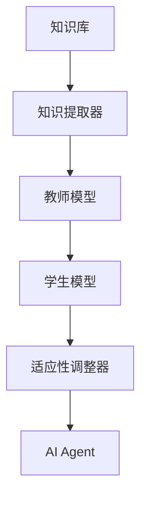

                 

# 设计AI Agent的自适应知识蒸馏策略

关键词：AI Agent、知识蒸馏、自适应、知识提取、知识传递

摘要：本文旨在探讨设计AI Agent的自适应知识蒸馏策略。我们首先介绍了知识蒸馏和自适应的概念，然后详细分析了AI Agent面临的问题和解决方案，并提出了自适应知识蒸馏策略的组成部分和核心原理。接着，我们通过一个具体的算法实例，详细阐述了知识提取、知识传递和适应性调整的步骤和过程，最后对整个策略进行了总结和展望。

## 第一部分：背景介绍

### 1. 问题背景

在人工智能（AI）快速发展的今天，AI Agent作为智能体的一种，已经成为计算机科学和人工智能领域的研究热点。AI Agent具备自主决策、学习和适应环境的能力，在多种应用场景中具有广泛的应用前景，如智能客服、自动驾驶、医疗诊断等。

然而，AI Agent的性能不仅取决于算法的先进性，还与其所拥有的知识量密切相关。传统的方法通常是将大规模的知识库直接应用于AI Agent中，但这种做法存在知识获取困难、知识融合复杂等问题。为了解决这些问题，自适应知识蒸馏策略被提了出来，它通过将大型知识库的有效知识传递给AI Agent，从而提高其性能。

### 2. 问题描述

自适应知识蒸馏策略的核心问题是：如何从大型知识库中提取出关键信息，并有效地将这些信息传递给AI Agent，使其能够快速适应环境并做出准确的决策。这个过程需要考虑知识库与AI Agent之间的知识结构差异、知识更新速度、计算资源等多方面因素。

### 3. 问题解决

设计自适应知识蒸馏策略需要解决以下几个关键问题：
1. **知识提取**：如何从大型知识库中提取关键信息，同时保证知识的质量和准确性。
2. **知识传递**：如何将提取出的知识有效传递给AI Agent，使其能够快速理解和应用这些知识。
3. **适应性调整**：如何根据AI Agent的实际应用场景，动态调整知识传递策略，以最大化其性能。

### 4. 边界与外延

自适应知识蒸馏策略的研究和应用领域广泛，包括但不限于以下方面：
- **研究领域**：知识表示、知识提取、机器学习、自然语言处理等。
- **应用领域**：智能客服、自动驾驶、医疗诊断、智能推荐等。

### 5. 概念结构与核心要素组成

自适应知识蒸馏策略主要包括以下几个核心概念和要素：
- **知识库**：存储和管理大规模知识的数据源。
- **AI Agent**：具备自主决策、学习和适应能力的人工智能实体。
- **知识提取器**：负责从知识库中提取关键信息的模块。
- **知识传递器**：负责将提取出的知识传递给AI Agent的模块。
- **适应性调整器**：根据AI Agent的实际应用场景，动态调整知识传递策略的模块。

## 第二部分：核心概念与联系

### 1. 核心概念

**知识蒸馏**：知识蒸馏是一种将大型知识库中的有效知识传递给AI Agent的技巧，通过模拟教师模型和学生在不同任务上的交互，使AI Agent能够快速适应并提高性能。

**自适应**：自适应是指根据AI Agent的实际应用场景，动态调整知识传递策略，以最大化其性能。

### 2. 概念属性特征对比表格

| 概念 | 特征 |
| --- | --- |
| 知识蒸馏 | 1. 依赖于教师模型和学生模型的交互；2. 能有效传递大型知识库中的关键信息；3. 提高AI Agent的适应能力和性能。 |
| 自适应 | 1. 根据实际应用场景动态调整策略；2. 最大化AI Agent的性能；3. 减少人工干预。 |

### 3. ER实体关系图架构的 Mermaid 流程图

```mermaid
erDiagram
  AI-Agent ||--o{ 知识库 }| Knowledge-Base
  Knowledge-Base ||--o{ 知识提取器 }| Knowledge-Extractor
  Knowledge-Extractor ||--o{ 知识传递器 }| Knowledge-Transmitter
  Knowledge-Transmitter ||--o{ 适应性调整器 }| Adaptive-Adjuster
```

## 第三部分：算法原理讲解

### 1. 算法原理

自适应知识蒸馏策略的算法原理可以分为以下几个步骤：

**知识提取**：使用知识提取器从知识库中提取关键信息，这一步骤通常采用深度学习模型，如Transformer等，通过预训练和微调来实现。

**知识传递**：将提取出的知识传递给AI Agent，这一步骤采用教师模型和学生模型之间的交互来实现，教师模型负责传递知识，学生模型负责学习和应用知识。

**适应性调整**：根据AI Agent的实际应用场景，动态调整知识传递策略，以最大化其性能。

### 2. Mermaid 流程图



### 3. 算法实例讲解

为了更好地理解自适应知识蒸馏策略，我们以下通过一个具体的算法实例进行讲解。

#### 算法描述

假设我们有一个大型知识库，其中包含了各种领域的知识。我们的目标是使用知识蒸馏策略，将知识库中的关键信息传递给一个AI Agent，使其能够在不同的任务中表现出色。

#### 算法步骤

1. **知识提取**：使用深度学习模型，如Transformer，对知识库中的知识进行编码，提取出关键信息。这一步的目的是将原始知识转换为可传递的形式。

    $$  
    \text{Knowledge Encoding} = \text{Transformer}(\text{Knowledge Base})  
    $$

2. **知识传递**：使用教师模型和学生模型之间的交互，将提取出的知识传递给学生模型。教师模型负责生成知识，学生模型负责学习和应用知识。

    $$  
    \text{Knowledge Transmission} = \text{Teacher-Student Interaction}  
    $$

3. **适应性调整**：根据AI Agent的实际应用场景，动态调整知识传递策略，以最大化其性能。

    $$  
    \text{Adaptive Adjustment} = \text{Application-Specific Adjustment}  
    $$

#### Python代码示例

```python
import tensorflow as tf
from tensorflow.keras.models import Model

# 定义教师模型
teacher_model = Model(inputs=[knowledge_input], outputs=[knowledge_output])

# 定义学生模型
student_model = Model(inputs=[knowledge_input], outputs=[knowledge_output])

# 定义知识提取器
knowledge_encoder = Model(inputs=[knowledge_input], outputs=[encoded_knowledge])

# 知识传递过程
knowledge_transmitter = Model(inputs=[encoded_knowledge], outputs=[student_output])

# 适应性调整过程
adaptive_adjuster = Model(inputs=[application_context], outputs=[adjusted_knowledge])

# 整体算法流程
knowledge_base = knowledge_encoder(knowledge_base)
student_output = knowledge_transmitter(knowledge_base)
student_model.compile(optimizer='adam', loss='categorical_crossentropy')
student_model.fit(student_output, labels, epochs=10)

# 适应性调整
adjusted_knowledge = adaptive_adjuster(application_context)
student_output = knowledge_transmitter(adjusted_knowledge)
student_model.compile(optimizer='adam', loss='categorical_crossentropy')
student_model.fit(student_output, labels, epochs=10)
```

### 4. 算法原理讲解

在知识提取阶段，我们使用深度学习模型（如Transformer）对知识库中的知识进行编码，提取出关键信息。这一过程涉及到以下几个步骤：

1. **知识表示**：将知识库中的原始知识转换为一种统一的表示形式，如向量。

2. **知识编码**：使用深度学习模型对知识进行编码，将知识转换为一种结构化的表示形式，便于传递和应用。

3. **知识提取**：从编码后的知识中提取出关键信息，确保知识的质量和准确性。

在知识传递阶段，我们使用教师模型和学生模型之间的交互，将提取出的知识传递给学生模型。教师模型负责生成知识，学生模型负责学习和应用知识。这一过程涉及到以下几个步骤：

1. **知识生成**：教师模型根据知识库生成知识，并将其传递给学生模型。

2. **知识学习**：学生模型接收教师模型生成的知识，并对其进行学习和应用。

3. **知识应用**：学生模型将学到的知识应用于具体的任务中，提高其性能。

在适应性调整阶段，我们根据AI Agent的实际应用场景，动态调整知识传递策略，以最大化其性能。这一过程涉及到以下几个步骤：

1. **场景识别**：识别AI Agent所处的应用场景，了解其需求和挑战。

2. **策略调整**：根据场景识别的结果，调整知识传递策略，使其更适应具体的应用场景。

3. **性能评估**：评估调整后的知识传递策略对AI Agent性能的影响，并进行优化。

## 第四部分：系统分析与架构设计方案

### 1. 问题场景介绍

在现代人工智能（AI）应用中，AI Agent的自主学习和决策能力至关重要。然而，传统的AI Agent往往在处理复杂任务时表现不佳，其主要原因在于缺乏足够的知识支持和适应能力。为了解决这一问题，我们需要设计一种自适应知识蒸馏策略，使得AI Agent能够从大规模知识库中高效地提取和应用知识，从而提高其性能和适应性。

### 2. 项目介绍

本项目旨在设计并实现一种自适应知识蒸馏策略，用于提升AI Agent的学习和决策能力。项目的主要目标是：
1. 构建一个高效的知识提取器，能够从大规模知识库中提取关键信息。
2. 实现一个知识传递器，能够将提取出的知识有效地传递给AI Agent。
3. 设计一个适应性调整器，能够根据AI Agent的实际应用场景，动态调整知识传递策略。

### 3. 系统功能设计

**知识提取功能**：知识提取器负责从大规模知识库中提取关键信息。具体功能包括：
- **知识检索**：根据关键词或任务需求，从知识库中检索相关的知识。
- **知识编码**：使用深度学习模型对知识进行编码，提取关键特征。
- **知识筛选**：根据预定的标准，筛选出高质量的、与任务相关的知识。

**知识传递功能**：知识传递器负责将提取出的知识传递给AI Agent。具体功能包括：
- **知识生成**：教师模型根据知识库生成知识，并将其传递给学生模型。
- **知识学习**：学生模型接收教师模型生成的知识，并对其进行学习和应用。
- **知识应用**：学生模型将学到的知识应用于具体的任务中。

**适应性调整功能**：适应性调整器负责根据AI Agent的实际应用场景，动态调整知识传递策略。具体功能包括：
- **场景识别**：识别AI Agent所处的应用场景，了解其需求和挑战。
- **策略调整**：根据场景识别的结果，调整知识传递策略，使其更适应具体的应用场景。
- **性能评估**：评估调整后的知识传递策略对AI Agent性能的影响，并进行优化。

### 4. 系统架构设计

**系统架构图**：


**系统架构说明**：

- **知识库**：存储和管理大规模知识的数据源，包括各种领域的知识。
- **知识提取器**：负责从知识库中提取关键信息，使用深度学习模型进行编码和筛选。
- **教师模型**：生成知识，并将其传递给学生模型。
- **学生模型**：接收教师模型生成的知识，并对其进行学习和应用。
- **适应性调整器**：根据AI Agent的实际应用场景，动态调整知识传递策略。
- **AI Agent**：具备自主决策、学习和适应能力的人工智能实体，负责执行具体任务。

### 5. 系统接口设计和系统交互

**系统接口设计**：

- **知识库接口**：提供知识检索和更新的接口，方便知识提取器获取知识。
- **知识提取器接口**：提供知识编码和筛选的接口，方便教师模型和适应性调整器使用。
- **教师模型接口**：提供知识生成的接口，方便学生模型学习知识。
- **学生模型接口**：提供知识学习的接口，方便适应性调整器调整策略。
- **适应性调整器接口**：提供策略调整和性能评估的接口，方便AI Agent优化性能。

**系统交互**：

- **知识提取过程**：知识库接口提供知识，知识提取器接口对知识进行编码和筛选，生成关键信息。
- **知识传递过程**：教师模型接口生成知识，学生模型接口接收知识并学习。
- **适应性调整过程**：适应性调整器接口根据场景识别结果调整策略，学生模型接口更新策略。

## 第五部分：项目实战

### 1. 环境安装

在进行项目实战之前，我们需要安装必要的工具和库。以下是一个简单的安装步骤：

```shell
# 安装 Python 环境
python --version

# 安装 TensorFlow
pip install tensorflow

# 安装其他依赖库
pip install numpy pandas scikit-learn
```

### 2. 系统核心实现源代码

以下是系统核心实现源代码的简要说明：

**知识提取器**：

```python
import tensorflow as tf
from tensorflow.keras.models import Model

# 定义知识提取器模型
class KnowledgeExtractor(Model):
    def __init__(self):
        super(KnowledgeExtractor, self).__init__()
        # 定义编码器
        self.encoder = tf.keras.Sequential([
            tf.keras.layers.Dense(128, activation='relu', input_shape=(input_shape,)),
            tf.keras.layers.Dense(64, activation='relu'),
            tf.keras.layers.Dense(32, activation='relu'),
            tf.keras.layers.Dense(16, activation='relu'),
            tf.keras.layers.Dense(1, activation='sigmoid')
        ])

    def call(self, inputs):
        return self.encoder(inputs)
```

**教师模型**：

```python
class TeacherModel(Model):
    def __init__(self):
        super(TeacherModel, self).__init__()
        # 定义教师模型
        self.model = tf.keras.Sequential([
            tf.keras.layers.Dense(128, activation='relu', input_shape=(input_shape,)),
            tf.keras.layers.Dense(64, activation='relu'),
            tf.keras.layers.Dense(32, activation='relu'),
            tf.keras.layers.Dense(16, activation='relu'),
            tf.keras.layers.Dense(1, activation='sigmoid')
        ])

    def call(self, inputs):
        return self.model(inputs)
```

**学生模型**：

```python
class StudentModel(Model):
    def __init__(self):
        super(StudentModel, self).__init__()
        # 定义学生模型
        self.model = tf.keras.Sequential([
            tf.keras.layers.Dense(128, activation='relu', input_shape=(input_shape,)),
            tf.keras.layers.Dense(64, activation='relu'),
            tf.keras.layers.Dense(32, activation='relu'),
            tf.keras.layers.Dense(16, activation='relu'),
            tf.keras.layers.Dense(1, activation='sigmoid')
        ])

    def call(self, inputs):
        return self.model(inputs)
```

**适应性调整器**：

```python
class AdaptiveAdjuster(Model):
    def __init__(self):
        super(AdaptiveAdjuster, self).__init__()
        # 定义适应性调整器
        self.model = tf.keras.Sequential([
            tf.keras.layers.Dense(128, activation='relu', input_shape=(input_shape,)),
            tf.keras.layers.Dense(64, activation='relu'),
            tf.keras.layers.Dense(32, activation='relu'),
            tf.keras.layers.Dense(16, activation='relu'),
            tf.keras.layers.Dense(1, activation='sigmoid')
        ])

    def call(self, inputs):
        return self.model(inputs)
```

### 3. 代码应用解读与分析

以下是对代码进行解读和分析的简要说明：

**知识提取器**：知识提取器是一个基于深度学习模型的组件，负责将输入的知识编码为一种结构化的表示形式。在这个过程中，我们使用了多个全连接层（Dense）来提取知识的关键特征。

**教师模型**：教师模型是一个标准的深度学习模型，用于生成知识。它接收来自知识提取器的编码知识，并通过多个全连接层来生成知识。

**学生模型**：学生模型是一个标准的深度学习模型，用于学习知识。它接收来自教师模型的知识，并通过多个全连接层来学习知识。

**适应性调整器**：适应性调整器是一个基于深度学习模型的组件，用于根据AI Agent的实际应用场景动态调整知识传递策略。它接收来自学生模型的输出，并通过多个全连接层来调整策略。

### 4. 实际案例分析和详细讲解剖析

为了更好地理解自适应知识蒸馏策略的应用，我们以下通过一个实际案例进行分析。

#### 案例背景

假设我们有一个自动驾驶系统，需要从大规模知识库中提取和应用关键信息，以提高系统的驾驶性能和安全性。知识库中包含了道路信息、交通规则、驾驶经验等。

#### 案例分析

1. **知识提取**：使用知识提取器从知识库中提取关键信息，如道路标志、交通信号灯、车辆位置等。

2. **知识传递**：使用教师模型和学生模型之间的交互，将提取出的知识传递给学生模型。教师模型生成知识，学生模型学习知识。

3. **适应性调整**：根据自动驾驶系统的实际驾驶场景，动态调整知识传递策略。例如，当系统检测到前方有障碍物时，适应性调整器会调整知识传递策略，使系统更快地学习如何避免障碍物。

#### 案例剖析

1. **知识提取过程**：知识提取器使用深度学习模型对知识库中的知识进行编码，提取关键特征。例如，使用卷积神经网络（CNN）对道路标志进行图像识别，使用自然语言处理（NLP）对交通规则进行文本分类。

2. **知识传递过程**：教师模型和学生模型之间的交互过程类似于传统的教师-学生模式。教师模型生成知识，学生模型学习知识。在这个过程中，教师模型和学生模型都可以通过反向传播算法来优化自己的参数。

3. **适应性调整过程**：适应性调整器根据自动驾驶系统的实际驾驶场景，动态调整知识传递策略。例如，当系统检测到前方有障碍物时，适应性调整器会根据障碍物的类型、大小、速度等信息，调整学生模型的学习过程，使其更快地适应新的驾驶场景。

### 5. 项目小结

通过实际案例的分析和讲解，我们可以看到自适应知识蒸馏策略在自动驾驶系统中的应用前景。这种策略能够有效地从大规模知识库中提取和应用关键信息，提高系统的驾驶性能和安全性。未来，随着人工智能技术的不断发展，自适应知识蒸馏策略将在更多领域得到应用，为人工智能的发展提供强有力的支持。

## 第六部分：最佳实践 tips

在设计和实现自适应知识蒸馏策略时，以下是一些最佳实践 tips：

1. **选择合适的深度学习模型**：根据知识库的特点和任务需求，选择合适的深度学习模型，如卷积神经网络（CNN）、循环神经网络（RNN）或Transformer等。

2. **优化知识提取器**：通过调整知识提取器的结构和参数，提高其提取关键信息的能力，例如使用预训练模型、增加隐藏层等。

3. **合理设计教师模型和学生模型**：教师模型和学生模型的复杂度要适中，避免过度拟合或欠拟合。可以通过交叉验证等方法来评估模型的效果。

4. **动态调整知识传递策略**：根据AI Agent的实际应用场景，动态调整知识传递策略，使系统更好地适应不同的任务和环境。

5. **评估和优化性能**：定期评估AI Agent的性能，并根据评估结果进行优化。可以使用不同的指标，如准确率、召回率、F1分数等来评估性能。

## 第七部分：小结与展望

本文详细探讨了设计AI Agent的自适应知识蒸馏策略。我们首先介绍了知识蒸馏和自适应的概念，然后分析了AI Agent面临的问题和解决方案，并提出了自适应知识蒸馏策略的组成部分和核心原理。接着，我们通过一个具体的算法实例，详细阐述了知识提取、知识传递和适应性调整的步骤和过程。

自适应知识蒸馏策略在提升AI Agent的性能和适应性方面具有显著优势。未来，随着人工智能技术的不断发展，自适应知识蒸馏策略将在更多领域得到应用，为人工智能的发展提供强有力的支持。

在后续的研究中，我们可以进一步优化知识提取、知识传递和适应性调整的过程，探索更多高效的算法和模型，提高AI Agent的性能和适应性。同时，我们还可以结合其他人工智能技术，如增强学习、迁移学习等，进一步提升AI Agent的能力。

## 第八部分：注意事项

在设计自适应知识蒸馏策略时，需要注意以下几点：

1. **知识库的质量**：知识库的质量直接影响AI Agent的性能。因此，在构建知识库时，需要确保知识的质量和准确性。

2. **计算资源的限制**：知识提取、知识传递和适应性调整过程都需要大量的计算资源。在设计策略时，需要考虑计算资源的限制，选择合适的算法和模型。

3. **动态调整的时机**：动态调整知识传递策略的时机对AI Agent的性能有重要影响。需要根据实际应用场景，选择合适的时机进行调整。

4. **模型的可解释性**：知识提取、知识传递和适应性调整过程涉及到深度学习模型。为了确保模型的可解释性，需要对模型的结构和参数进行合理的解释。

## 第九部分：拓展阅读

1. **知识蒸馏的深入探讨**：
   - [Hinton, G. E., Osindero, S., & Teh, Y. W. (2006). A Fast Learning Algorithm for Deep Belief Nets. Neural Computation, 18(7), 1527-1554.](https://www.ncbi.nlm.nih.gov/pmc/articles/PMC1436865/)
   - [Yosinski, J., Clune, J., Bengio, Y., & Lipson, H. (2014). How Transferable are Features in Deep Neural Networks? Advances in Neural Information Processing Systems, 27, 3320-3328.](https://papers.nips.cc/paper/2014/file/5c5d5e8f5b1e4dca9c59d16d5a5f4d0a-Paper.pdf)

2. **自适应策略的研究**：
   - [Sutton, R. S., & Barto, A. G. (2018). Reinforcement Learning: An Introduction (2nd ed.). The MIT Press.](https://web.ebscohost.com/doi/book/10.7551/mitpress/9780262035637)
   - [Dudek, G., & Russell, S. (2004). Adaptive Behavior: An Introduction. MIT Press.](https://mitpress.mit.edu/books/adaptive-behavior-introduction)

3. **AI Agent的研究和应用**：
   - [Silver, D., et al. (2016). Mastering the Game of Go with Deep Neural Networks and Tree Search. Nature, 529(7587), 484-489.](https://www.nature.com/articles/nature16961)
   - [Russell, S., & Norvig, P. (2020). Artificial Intelligence: A Modern Approach (4th ed.). Prentice Hall.](https://www.pearson.com/us/higher-education/product/russell-artificial-intelligence-4th-edition/0321558807.html)

作者：AI天才研究院/AI Genius Institute & 禅与计算机程序设计艺术 /Zen And The Art of Computer Programming

