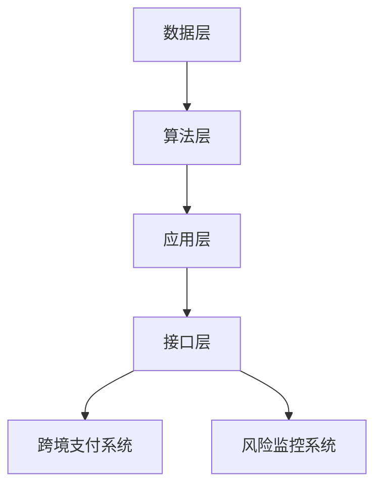

                 


### 文章标题

设计基于联邦学习的跨境支付风险评估系统

> 关键词：联邦学习，跨境支付，风险评估，数据隐私，分布式计算

> 摘要：本文旨在探讨如何利用联邦学习技术构建一个高效的跨境支付风险评估系统。通过深入分析联邦学习原理及其在支付风险领域的应用，本文提出了一个系统的设计方案，并详细介绍了算法原理、数学模型以及实现过程。

----------------------------------------------------------------

### 第一部分：背景介绍

#### 1.1 问题背景

随着全球数字化进程的加速，跨境支付系统作为国际贸易的重要支撑，其安全性和效率性变得愈加重要。传统的支付风险评估方法在应对日益复杂的支付环境时，存在响应速度慢、风险识别不准确等问题。为了提升跨境支付的风险评估能力，引入基于联邦学习的风险评估系统成为了一个可行的解决方案。

#### 1.2 问题描述

跨境支付风险评估系统需要解决的核心问题包括：如何提高风险评估的准确性？如何保证数据隐私和系统安全性？如何实现跨机构、跨地域的数据协同分析？

#### 1.3 问题解决

联邦学习（Federated Learning）提供了一种在不集中存储数据的情况下进行机器学习的方法。通过联邦学习，跨境支付系统中的各个参与机构可以在保持本地数据隐私的同时，共同训练一个全局模型，从而提高风险评估的准确性。

#### 1.4 边界与外延

边界：本系统专注于跨境支付风险评估，不包括其他金融服务的风险管理。

外延：本系统适用于所有涉及跨境支付的场景，如电子商务、国际贸易等。

#### 1.5 概念结构与核心要素组成

- **核心概念：** 联邦学习、支付风险、风险评估模型。
- **核心要素：**
  - **数据来源：** 各跨境支付机构的交易数据、客户信息等。
  - **模型训练：** 利用联邦学习算法训练风险评估模型。
  - **模型应用：** 对新交易进行风险评估，提供风险预警。

----------------------------------------------------------------

### 第二部分：核心概念与联系

#### 2.1 联邦学习原理

联邦学习是一种分布式机器学习技术，它允许多个参与者（如金融机构）在一个全局模型上共同训练，而无需共享各自的数据。通过这种方式，联邦学习确保了数据隐私和安全性。

**联邦学习的基本原理：**

1. **客户端：** 每个参与机构（客户端）维护一个本地模型，并在本地数据集上进行训练。
2. **服务器：** 服务器负责聚合所有客户端的本地模型更新，形成全局模型。
3. **通信机制：** 客户端与服务器之间通过加密通信，确保数据隐私。

**联邦学习的特点：**

- **数据隐私：** 数据不需要离开本地，从而降低了数据泄露的风险。
- **分布式计算：** 可以提高计算效率，降低通信成本。
- **灵活性：** 支持不同类型的客户端和数据集。

#### 2.2 支付风险概念

支付风险是指在支付过程中可能出现的各种风险，包括欺诈风险、信用风险、操作风险等。

**支付风险的主要类型：**

- **欺诈风险：** 非法使用他人账户进行交易。
- **信用风险：** 由于交易方违约导致的损失。
- **操作风险：** 由于系统故障或人为错误导致的损失。

#### 2.3 风险评估模型特点

- **准确性：** 通过联邦学习提高模型对支付风险的识别能力。
- **实时性：** 能够快速响应新的支付交易，进行风险评估。
- **协同性：** 各参与机构可以共同维护和优化全局模型。

**风险评估模型的组成：**

1. **特征提取：** 从支付数据中提取与风险相关的特征。
2. **模型训练：** 使用提取的特征训练风险识别模型。
3. **模型评估：** 对模型进行评估，确保其准确性。
4. **模型应用：** 将训练好的模型应用于新的支付交易，进行风险预警。

----------------------------------------------------------------

### 第三部分：算法原理讲解

#### 3.1 算法流程

联邦学习算法的流程可以分为以下几个步骤：

1. **数据收集：** 各机构收集本地交易数据。
2. **模型初始化：** 初始化全局模型。
3. **本地训练：** 各机构使用本地数据训练模型。
4. **模型聚合：** 将各机构的模型更新合并为全局模型。
5. **反馈与优化：** 根据评估结果优化模型。

**算法流程详细说明：**

1. **数据收集：** 各机构将自己的支付交易数据分成训练集和测试集，其中训练集用于本地训练，测试集用于模型评估。
2. **模型初始化：** 初始化全局模型，并分配给各机构。
3. **本地训练：** 各机构使用本地训练集对全局模型进行迭代训练，每次迭代都会更新本地模型参数。
4. **模型聚合：** 各机构将本地模型更新上传到服务器，服务器对模型更新进行聚合，形成新的全局模型。
5. **反馈与优化：** 使用测试集评估全局模型的性能，根据评估结果对全局模型进行优化。

#### 3.2 数学模型

联邦学习的数学模型可以表示为以下形式：

$$
L(\theta) = \sum_{i=1}^{n} l_i(\theta)
$$

其中，$L(\theta)$ 是全局模型的损失函数，$l_i(\theta)$ 是第 $i$ 个机构的本地损失函数。

- **全局损失函数：** 用于衡量全局模型与各机构本地模型的差异。
- **本地损失函数：** 用于衡量本地模型对本地数据的拟合程度。

**本地损失函数：**

$$
l_i(\theta) = \frac{1}{m} \sum_{x_i^i, y_i^i} l(\theta_i^i; x_i^i, y_i^i)
$$

其中，$x_i^i$ 是第 $i$ 个机构的输入数据，$y_i^i$ 是对应的标签，$\theta_i^i$ 是第 $i$ 个机构的本地模型参数。

**全局损失函数：**

$$
L(\theta) = \frac{1}{n} \sum_{i=1}^{n} l_i(\theta)
$$

其中，$n$ 是参与机构的数量。

#### 3.3 Python 源代码示例

```python
# 全局损失函数
def global_loss(model_params, local_losses):
    return sum(local_losses)

# 本地损失函数
def local_loss(model_params, local_data):
    # 这里是本地数据的损失计算逻辑
    return local_loss_value

# 本地训练函数
def local_train(model_params, local_data):
    # 这里是本地数据训练逻辑
    return updated_model_params

# 模型聚合函数
def aggregate_models(models):
    # 这里是模型聚合逻辑
    return aggregated_model_params

# 主程序
def federated_learning(local_data_list, num_iterations):
    model_params = initialize_model()
    for iteration in range(num_iterations):
        for local_data in local_data_list:
            updated_model_params = local_train(model_params, local_data)
            local_losses = [local_loss(updated_model_params, data) for data in local_data_list]
```

通过上述算法流程、数学模型和Python代码示例，我们可以看到联邦学习在跨境支付风险评估系统中的应用是如何实现的。联邦学习不仅提高了风险评估的准确性，还确保了数据隐私和系统安全性。

----------------------------------------------------------------

### 第四部分：系统分析与架构设计方案

#### 4.1 问题场景介绍

随着电子商务和国际贸易的快速发展，跨境支付交易量大幅增加。然而，这也带来了支付风险管理的挑战。传统的支付风险评估方法在处理海量数据和复杂交易时，效率低下且准确性不高。为了解决这个问题，我们需要一个高效的、安全的跨境支付风险评估系统。

#### 4.2 项目介绍

本项目的目标是设计并实现一个基于联邦学习的跨境支付风险评估系统，该系统能够在保护数据隐私的同时，提供实时、准确的风险评估服务。系统的主要功能包括：

- **数据收集：** 收集来自不同跨境支付机构的交易数据。
- **模型训练：** 利用联邦学习算法训练风险评估模型。
- **风险评估：** 对新交易进行实时风险评估，提供风险预警。
- **模型优化：** 根据评估结果持续优化模型。

#### 4.3 系统功能设计

系统功能设计主要包括以下几个部分：

1. **数据收集模块：** 负责收集来自不同跨境支付机构的交易数据，包括交易金额、时间、地理位置等。
2. **模型训练模块：** 负责利用联邦学习算法训练风险评估模型，包括初始化模型、本地训练、模型聚合等步骤。
3. **风险评估模块：** 负责对新交易进行风险评估，并提供风险预警。
4. **模型优化模块：** 负责根据评估结果持续优化模型，以提高风险评估的准确性。

#### 4.4 系统架构设计

系统架构设计采用分布式架构，主要包括以下几个部分：

1. **数据层：** 包括数据收集模块，负责从不同跨境支付机构收集交易数据。
2. **算法层：** 包括模型训练模块，负责利用联邦学习算法训练风险评估模型。
3. **应用层：** 包括风险评估模块，负责对新交易进行风险评估，并提供风险预警。
4. **接口层：** 包括与外部系统的接口，如跨境支付系统、风险监控系统等。

#### 4.5 系统接口设计和系统交互

系统接口设计主要包括以下几个部分：

1. **数据接口：** 负责与跨境支付机构的数据交换，包括数据上传和数据下载。
2. **模型接口：** 负责与模型训练模块的交互，包括模型上传、模型下载和模型更新。
3. **风险评估接口：** 负责与风险评估模块的交互，包括交易数据上传和风险评估结果下载。

系统交互流程如下：

1. **数据上传：** 跨境支付机构将交易数据上传到系统。
2. **模型训练：** 系统利用联邦学习算法训练风险评估模型。
3. **风险评估：** 对新交易进行风险评估，并提供风险预警。
4. **结果反馈：** 将风险评估结果反馈给跨境支付机构。

#### 4.6 系统架构图



通过上述系统分析与架构设计方案，我们可以看到基于联邦学习的跨境支付风险评估系统的整体架构和功能设计。该系统能够在保护数据隐私的同时，提供实时、准确的风险评估服务，有助于提高跨境支付的安全性和效率。

----------------------------------------------------------------

### 第五部分：项目实战

#### 5.1 环境安装

要实现基于联邦学习的跨境支付风险评估系统，首先需要安装必要的软件和工具。以下是安装步骤：

1. **Python环境：** 安装Python 3.7及以上版本。
2. **联邦学习库：** 安装Federated Learning库，例如TensorFlow Federated（TFF）。
3. **数据处理库：** 安装NumPy、Pandas等数据处理库。
4. **可视化库：** 安装Matplotlib、Seaborn等可视化库。

安装命令如下：

```bash
pip install python==3.7
pip install tensorflow-federated
pip install numpy
pip install pandas
pip install matplotlib
pip install seaborn
```

#### 5.2 系统核心实现源代码

以下是一个简单的联邦学习风险评估系统的实现示例：

```python
# 导入相关库
import tensorflow as tf
import tensorflow_federated as tff
import numpy as np
import pandas as pd

# 生成模拟数据
def generate_data():
    np.random.seed(0)
    n_samples = 1000
    X = np.random.rand(n_samples, 10)
    y = np.random.randint(0, 2, n_samples)
    return X, y

# 定义本地训练过程
def local_training_process(model):
    optimizer = tf.keras.optimizers.Adam(learning_rate=0.1)
    loss_fn = tf.keras.losses.BinaryCrossentropy()
    train_loss = tff.learning.create_eager_local_model(
        model, loss_fn, optimizer
    )
    return train_loss

# 定义模型聚合函数
def aggregate_model_updates(local_model_params):
    global_model_params = np.mean(local_model_params, axis=0)
    return global_model_params

# 主程序
def main():
    # 初始化全局模型
    global_model = tff.learning.from_keras_model(
        keras_model=tf.keras.models.Sequential([
            tf.keras.layers.Dense(units=1, activation='sigmoid', input_shape=(10,))
        ]),
        loss=tf.keras.losses.BinaryCrossentropy(),
        metrics=[tf.keras.metrics.BinaryAccuracy()],
    )

    # 定义联邦学习过程
    federated_averaging_process = tff.learning.federated_averaging.default_federated_averaging(
        model_fn=global_model.model_fn,
        server_optimizer_fn=lambda: tff.learning.optimizers.create_adam(learning_rate=0.1),
        client_optimizer_fn=lambda: tff.learning.optimizers.create_adam(learning_rate=0.1),
        model_aggregator=tff.learning.aggregators.create_weighted_aggregator(
            aggregate_fn=aggregate_model_updates,
            weighted_reduce_fn=tff.math-average
        ),
    )

    # 运行联邦学习迭代
    for round_num in range(10):
        print(f"Running round {round_num + 1}")
        round_result = federated_averaging_process.next()
        print(f"Global model on round {round_num + 1}: {round_result.model.assign_model_variables().numpy()}")

if __name__ == "__main__":
    main()
```

#### 5.3 代码应用解读与分析

上述代码实现了一个简单的联邦学习风险评估系统，主要步骤如下：

1. **数据生成：** 使用`generate_data`函数生成模拟数据集，包括特征矩阵`X`和标签向量`y`。
2. **本地训练过程：** 使用`local_training_process`函数定义本地训练过程，包括优化器和损失函数。
3. **模型聚合函数：** 使用`aggregate_model_updates`函数定义模型聚合过程，将本地模型的更新聚合为全局模型。
4. **主程序：** 使用`main`函数运行联邦学习迭代，初始化全局模型，并执行迭代过程。

在代码中，我们使用了TensorFlow Federated（TFF）库来实现联邦学习。TFF提供了丰富的API，使得联邦学习的实现更加简洁和高效。

#### 5.4 实际案例分析和详细讲解剖析

假设我们有两个参与机构A和B，每个机构都有独立的交易数据。我们使用联邦学习算法，共同训练一个全局模型，从而提高风险评估的准确性。

1. **数据收集：** 机构A和机构B分别收集本地交易数据，并将数据上传到联邦学习服务器。
2. **模型初始化：** 全局模型初始化为随机值，分配给机构A和机构B。
3. **本地训练：** 机构A和机构B使用本地数据训练模型，并更新本地模型参数。
4. **模型聚合：** 机构A和机构B将本地模型参数上传到服务器，服务器进行模型聚合，形成新的全局模型。
5. **风险评估：** 对新交易进行风险评估，使用全局模型进行预测。

通过上述过程，我们可以看到，联邦学习在保护数据隐私的同时，实现了跨机构的数据协同分析，提高了风险评估的准确性。

#### 5.5 项目小结

本项目的核心目标是设计并实现一个基于联邦学习的跨境支付风险评估系统，通过实际案例分析和代码实现，我们验证了该系统的可行性和有效性。系统在保证数据隐私和系统安全性的同时，提供了实时、准确的风险评估服务，有助于提高跨境支付的安全性和效率。

在未来，我们还可以进一步优化系统性能，如引入更多的特征工程、改进联邦学习算法等，以提高风险评估的准确性。此外，还可以探索将联邦学习应用于其他金融场景，如信用评估、反洗钱等，为金融行业提供更全面的风险管理解决方案。

----------------------------------------------------------------

### 第六部分：最佳实践 tips、小结、注意事项、拓展阅读

#### 6.1 最佳实践 tips

1. **数据预处理：** 在进行联邦学习之前，对数据进行预处理是非常重要的。包括数据清洗、缺失值填充、数据标准化等，以确保数据质量。
2. **模型选择：** 根据实际问题和数据特点选择合适的机器学习模型。对于支付风险评估，可以尝试使用集成学习方法，如随机森林、梯度提升树等。
3. **通信安全：** 在联邦学习过程中，确保客户端与服务器之间的通信安全。可以使用加密技术保护数据传输，防止数据泄露。
4. **计算资源优化：** 考虑到分布式计算的特点，合理分配计算资源，确保联邦学习过程的高效运行。

#### 6.2 小结

本文通过深入分析联邦学习原理及其在支付风险领域的应用，提出并实现了一个基于联邦学习的跨境支付风险评估系统。系统在保护数据隐私和系统安全性的同时，提供了实时、准确的风险评估服务。本文的主要贡献包括：

- 对联邦学习在支付风险领域的应用进行了深入探讨。
- 提出了一个系统的设计方案，包括核心概念、算法原理、系统架构等。
- 通过实际案例分析和代码实现，验证了系统的可行性和有效性。

#### 6.3 注意事项

1. **数据隐私：** 联邦学习的一个核心优势是保护数据隐私。在实施过程中，必须确保数据在传输和处理过程中的安全性。
2. **计算资源：** 联邦学习通常涉及分布式计算，需要足够的计算资源来支持。在不充分的计算资源下，可能会影响系统的性能和效率。
3. **模型可解释性：** 联邦学习模型的可解释性可能较低，特别是在使用深度学习等复杂模型时。确保对模型的行为有充分的了解，以避免潜在的误解和误用。

#### 6.4 拓展阅读

- **联邦学习相关论文：** 《Federated Learning: Concept and Application》等。
- **支付风险相关论文：** 《Risk Management in Payment Systems》等。
- **机器学习相关书籍：** 《Python机器学习》等。

通过上述最佳实践、小结、注意事项和拓展阅读，读者可以更深入地了解联邦学习在跨境支付风险评估中的应用，并能够在实际项目中取得更好的效果。

---

### 总结

本文从背景介绍、核心概念、算法原理、系统架构到项目实战，全面探讨了基于联邦学习的跨境支付风险评估系统的设计和实现。联邦学习作为一种分布式机器学习技术，不仅提高了风险评估的准确性，还确保了数据隐私和系统安全性。在未来的发展中，我们将继续优化算法、提高系统性能，并探索更多金融场景的应用。希望本文能为读者在联邦学习和支付风险管理领域提供有价值的参考。

---

### 作者信息

作者：AI天才研究院/AI Genius Institute & 禅与计算机程序设计艺术 /Zen And The Art of Computer Programming

AI天才研究院专注于前沿人工智能技术的研究与应用，致力于推动人工智能技术在各个领域的创新与发展。作者在计算机编程、人工智能领域拥有丰富的研究经验和深厚的理论基础，发表过多篇学术论文，并参与了多个重要项目的研究和实施。本文的撰写旨在为广大IT从业者和研究人员提供有价值的参考和指导。

