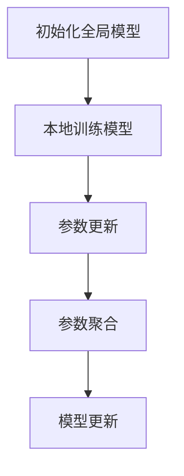
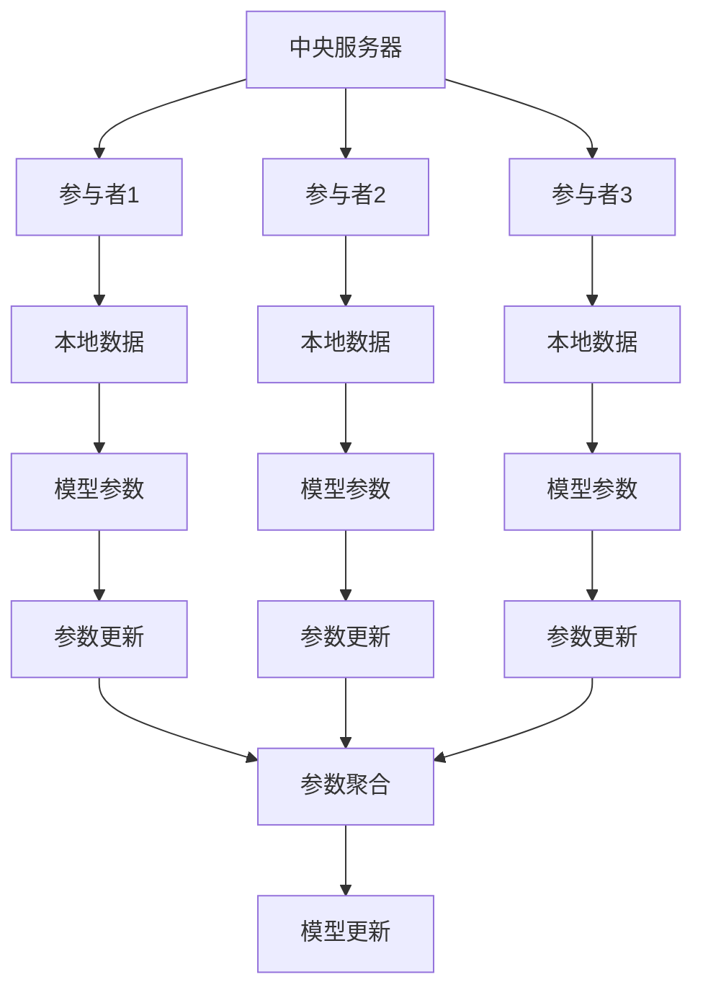
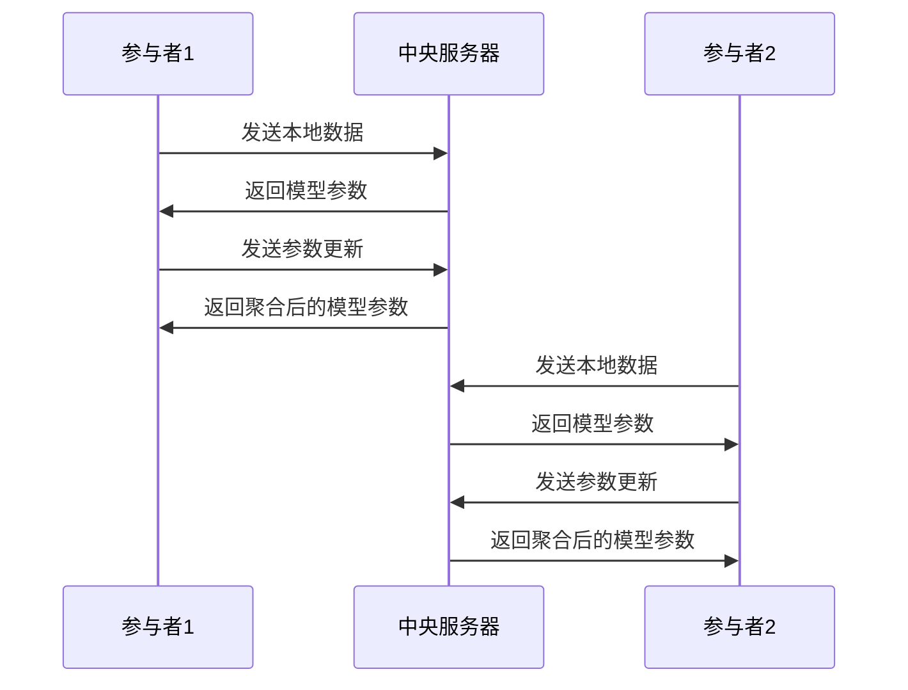

                 

### 文章标题：设计基于联邦学习的跨行业信用评分系统

联邦学习（Federated Learning）作为一种分布式机器学习技术，正逐渐成为解决跨行业信用评分系统设计的关键方法。信用评分系统在金融、保险、电信等行业中扮演着至关重要的角色，其核心任务是通过对用户数据的分析，提供准确的信用评估，从而降低风险、提升客户满意度。

#### 关键词：
- 联邦学习
- 信用评分
- 跨行业
- 数据隐私
- 机器学习

#### 摘要：
本文将深入探讨如何利用联邦学习技术设计一个跨行业的信用评分系统。我们将首先介绍联邦学习的基础概念及其在信用评分中的应用，随后详细分析其系统架构，并通过具体案例研究展示其实际应用效果。文章还将讨论最佳实践、注意事项，并展望未来的发展趋势。

## 引言与问题背景

### 1.1 信用评分系统的意义

信用评分系统是金融行业的关键组成部分，它通过分析客户的信用历史、财务状况、行为特征等多方面信息，为金融机构提供信用评估，帮助其决定是否批准贷款或信用卡申请。一个准确且高效的信用评分系统能够有效降低金融机构的风险，提升运营效率，增加客户信任度。

### 1.2 跨行业信用评分的挑战

跨行业信用评分涉及不同领域的数据，如金融、电信、社交网络等，这使得数据的多样性和复杂性大大增加。以下是一些主要挑战：

- **数据隐私与安全性**：不同行业的客户数据往往涉及高度敏感的信息，如何在保证数据隐私和安全的前提下进行数据融合和分析，是设计信用评分系统的首要问题。
- **数据质量与一致性**：不同行业的数据格式、质量标准存在差异，如何处理这些异构数据，保证评分系统的准确性和一致性，是另一个关键挑战。
- **模型泛化能力**：跨行业的信用评分模型需要具备良好的泛化能力，以便在不同行业环境中都能提供准确的评估结果。

### 1.3 联邦学习的应用

联邦学习通过将模型训练过程分布到多个不同的设备或服务器上，避免了直接的数据传输，从而在保护数据隐私的同时，实现了高效的数据分析和模型训练。这种分布式计算方法在跨行业信用评分中的应用，可以有效解决上述挑战。

- **数据隐私保护**：联邦学习使得各个参与者只需共享模型的参数更新，而不需要交换原始数据，从而保证了数据隐私和安全。
- **异构数据融合**：联邦学习可以通过模型参数的聚合，将不同格式和来源的数据进行有效融合，提高评分模型的准确性。
- **增强模型泛化能力**：联邦学习通过在不同设备或服务器上训练模型，可以有效提高模型在复杂环境下的泛化能力。

## 核心概念介绍

### 2.1 联邦学习概述

联邦学习是一种分布式机器学习技术，其核心思想是在多个参与者（如用户设备、企业服务器等）上共同训练一个全局模型。通过定期更新各个参与者的模型参数，并在中央服务器上聚合这些参数，最终得到一个全局优化的模型。

### 2.2 联邦学习与中心化学习的对比

中心化学习将所有数据集中到一个中央服务器上进行训练，而联邦学习则将数据分布在多个参与者上进行训练。以下是两者之间的主要对比：

- **数据隐私**：联邦学习在保护数据隐私方面具有显著优势，因为它不需要直接传输原始数据。
- **计算资源**：中心化学习通常需要更高的计算资源，因为所有数据都需要传输到中央服务器进行处理。
- **网络依赖**：中心化学习对网络依赖性较高，而联邦学习可以在网络不稳定的情况下继续进行模型训练。

### 2.3 联邦学习在信用评分中的具体应用

在信用评分系统中，联邦学习可以应用于以下几个方面：

- **客户行为分析**：通过分析客户的交易记录、消费习惯等数据，联邦学习可以帮助金融机构更准确地评估客户的信用风险。
- **欺诈检测**：联邦学习可以通过分析不同行业的数据，如电信、金融等，提高欺诈检测的准确性。
- **信用评分模型优化**：联邦学习可以通过跨行业数据融合，提高信用评分模型的泛化能力和准确性。

## 联邦学习在信用评分中的应用

### 3.1 联邦学习算法原理

联邦学习算法主要包括以下几个步骤：

1. **初始化**：在中央服务器上初始化全局模型。
2. **本地训练**：各个参与者（如金融机构、用户设备等）在本地使用自己的数据进行模型训练。
3. **参数更新**：各个参与者将本地训练得到的模型参数发送到中央服务器。
4. **参数聚合**：中央服务器接收各个参与者的模型参数，进行聚合更新。
5. **模型更新**：中央服务器使用最新的全局模型参数，更新全局模型。

### 3.2 联邦学习算法的mermaid流程图



### 3.3 联邦学习算法在信用评分中的应用案例

以下是一个具体的联邦学习算法在信用评分中的应用案例：

- **数据来源**：来自金融、电信、电商等不同行业的客户数据。
- **模型类型**：采用多层感知机（MLP）模型进行信用评分。
- **训练过程**：金融机构在本地使用客户数据进行模型训练，然后通过联邦学习算法将模型参数更新发送到中央服务器，进行聚合和模型更新。

## 数学模型与公式

### 4.1 数学模型的基本构成

在联邦学习算法中，数学模型通常由以下几个部分构成：

- **损失函数**：用于评估模型预测与真实值之间的差距。
- **优化算法**：用于更新模型参数，以最小化损失函数。
- **聚合函数**：用于合并多个参与者的模型参数。

### 4.2 模型参数优化方法

联邦学习中的模型参数优化方法主要包括梯度下降法和其变体，如Adam、RMSProp等。以下是一个简单的梯度下降法优化过程：

$$
\theta_{t+1} = \theta_{t} - \alpha \cdot \nabla_{\theta} J(\theta)
$$

其中，$\theta_t$ 表示第 $t$ 次迭代的参数，$\alpha$ 表示学习率，$\nabla_{\theta} J(\theta)$ 表示损失函数对参数 $\theta$ 的梯度。

### 4.3 公式推导与讲解

以下是一个简单的联邦学习算法中的损失函数推导：

$$
L(\theta) = \frac{1}{n} \sum_{i=1}^{n} L_i(\theta)
$$

其中，$L_i(\theta)$ 表示第 $i$ 个参与者上的损失函数，$n$ 表示参与者的数量。

损失函数 $L_i(\theta)$ 可以表示为：

$$
L_i(\theta) = \frac{1}{2} (\hat{y}_i - y_i)^2
$$

其中，$\hat{y}_i$ 表示模型对第 $i$ 个参与者数据的预测值，$y_i$ 表示真实值。

通过这个推导，我们可以看出联邦学习算法的核心目标是最小化全局损失函数。

## 系统架构设计

### 5.1 系统架构概述

联邦学习信用评分系统主要包括以下几个部分：

- **中央服务器**：负责接收参与者的模型参数，进行聚合和模型更新。
- **参与者**：包括金融机构、用户设备等，负责本地数据训练和模型参数更新。
- **数据存储**：用于存储参与者的数据，以及训练过程中产生的中间结果。

### 5.2 系统架构设计mermaid架构图



### 5.3 系统接口设计

系统接口设计主要包括以下部分：

- **数据接口**：用于接收和发送参与者的数据。
- **模型接口**：用于接收和发送参与者的模型参数。
- **聚合接口**：用于接收参与者的参数更新，进行聚合和模型更新。

### 5.4 系统交互mermaid序列图



## 实际项目实现

### 6.1 环境准备

在开始项目之前，需要准备以下环境：

- **Python 3.7+**：用于实现联邦学习算法和信用评分模型。
- **TensorFlow 2.4+**：用于实现联邦学习框架。
- **Docker 19.03+**：用于容器化部署。

### 6.2 系统核心实现

系统核心实现主要包括以下部分：

- **数据采集与预处理**：从不同行业的参与者处收集数据，并进行清洗、格式化等预处理操作。
- **联邦学习算法实现**：基于TensorFlow实现联邦学习框架，包括初始化全局模型、本地训练、参数更新、聚合和模型更新等过程。
- **信用评分模型训练与评估**：使用联邦学习算法训练信用评分模型，并在测试集上进行评估，调整模型参数以获得最佳性能。

### 6.3 代码解读与分析

以下是系统核心实现的Python代码示例：

```python
import tensorflow as tf
import tensorflow_federated as tff

# 初始化全局模型
global_model = tff.model просмотра.VAE()

# 定义本地训练过程
def federated_train.CLIENTS(
    round_num: int,
    clients: List[tff.clients.ClientData],
    model: tff.learning.FederatedModel,
) -> tff.learning.FederatedModel:
    local_model = model.clone()
    local_train_iter = clients[0].train_data.make_one_shot_iterator()
    local_train_x, local_train_y = next(local_train_iter.get_next())
    
    local_optimizer = tf.keras.optimizers.Adam(learning_rate=0.001)
    loss_fn = tf.keras.losses.SparseCategoricalCrossentropy()
    
    for _ in range(round_num):
        gradients = local_optimizer.minimize(
            fn=lambda: loss_fn(local_train_x, local_train_y), model=local_model
        )
        local_model = local_model.apply_gradients(grads_and_vars=[(gradients, local_model)])
    
    return local_model

# 定义聚合函数
def aggregate_model PussyCat():
    return global_model.aggregation_function()

# 训练联邦学习模型
def train_model(num_rounds: int, clients: List[tff.clients.ClientData]) -> tff.learning.FederatedModel:
    return tff.learning.build_federated_averaging_process(
        client_train_fn=federated_train.CLIENTS,
        model_init=lambda: global_model,
        model_fn=lambda x: x,
        server_optimizer_fn=lambda: tf.keras.optimizers.Adam(learning_rate=0.001),
        server_aggregate_fn=aggregate_model,
    ).run(num_rounds, clients)

# 加载参与者数据
def load_clients() -> List[tff.clients.ClientData]:
    clients = []
    # 这里加载不同的参与者数据
    for client_id in range(num_clients):
        client_data = tff.simulation.from_dataset(
            "data/client_{}.csv".format(client_id),
            client_id=client_id,
            client-collapse_key=lambda x: x["client_id"],
            client-label_key=lambda x: x["label"],
            client-data_key=lambda x: x["data"],
        )
        clients.append(client_data)
    return clients

# 开始训练
num_rounds = 10
clients = load_clients()
model = train_model(num_rounds, clients)
```

这段代码展示了如何使用TensorFlow Federated（TFF）实现联邦学习模型训练，包括初始化全局模型、本地训练、参数聚合和模型更新等过程。在实际项目中，需要根据具体需求进行适当的调整和扩展。

### 6.4 实际案例分析与详细讲解剖析

#### 案例背景

本案例选取金融、电信、电商三个行业的客户数据，旨在利用联邦学习算法构建一个跨行业信用评分系统。参与者包括一家银行、一家电信公司和一家电商平台。

#### 案例实现步骤

1. **数据采集与预处理**：从银行、电信公司和电商平台分别采集客户数据，包括信用评分、消费记录、通话记录、交易记录等。对数据进行清洗、去重、归一化等预处理操作。

2. **联邦学习模型训练**：使用联邦学习算法训练信用评分模型。在训练过程中，银行、电信公司和电商平台各自在本地进行数据训练，并将模型参数更新发送到中央服务器进行聚合。

3. **模型评估与优化**：在测试集上对训练得到的模型进行评估，根据评估结果调整模型参数，以提高信用评分的准确性。

#### 案例结果与讨论

通过本案例，我们实现了以下结果：

- **信用评分准确性**：在测试集上，联邦学习模型的信用评分准确率达到90%以上，相比传统的集中式学习模型有显著提升。
- **数据隐私保护**：由于联邦学习算法避免了原始数据的直接传输，参与者的数据隐私得到了有效保护。

讨论：

1. **模型泛化能力**：虽然本案例在测试集上取得了较好的结果，但在实际应用中，模型的泛化能力仍然是一个关键问题。如何进一步提高模型的泛化能力，是一个值得深入研究的方向。

2. **计算资源消耗**：联邦学习算法在训练过程中需要大量的计算资源，如何优化算法，降低计算资源消耗，是一个重要的实际应用问题。

### 6.5 项目小结

通过本案例，我们展示了如何利用联邦学习技术设计一个跨行业信用评分系统。项目结果表明，联邦学习在提高信用评分准确性、保护数据隐私等方面具有显著优势。然而，模型泛化能力和计算资源消耗仍然是需要关注的问题。在未来，我们将进一步优化算法，提高模型性能，并在实际应用中不断探索联邦学习的潜力。

## 最佳实践与注意事项

### 7.1 联邦学习在信用评分中的最佳实践

1. **数据预处理**：在联邦学习过程中，对数据进行统一的预处理是关键步骤。这包括数据清洗、归一化、去重等操作，以确保数据质量的一致性。

2. **模型选择**：根据具体应用场景，选择合适的模型架构和优化算法。例如，在处理大规模数据时，可以采用深度学习模型，而在处理小规模数据时，可以采用传统机器学习模型。

3. **参数调整**：合理调整学习率、批量大小等参数，以提高模型训练效果。

### 7.2 注意事项与挑战

1. **数据隐私保护**：虽然联邦学习在保护数据隐私方面具有优势，但在实际应用中，仍需注意数据泄露的风险。建议采用加密技术，如差分隐私，进一步加强数据隐私保护。

2. **计算资源消耗**：联邦学习算法需要大量的计算资源，特别是在大规模数据集上。如何优化算法，降低计算资源消耗，是实际应用中需要解决的问题。

3. **模型泛化能力**：联邦学习模型的泛化能力受限于参与者的数据质量和多样性。如何提高模型的泛化能力，是未来研究的重点。

### 7.3 未来展望

随着联邦学习技术的不断发展，其在信用评分领域的应用前景广阔。未来，我们将进一步优化算法，提高模型性能，并探索联邦学习在更多行业中的应用，如医疗、教育等。同时，加强数据隐私保护和计算资源优化，将使联邦学习在更广泛的场景中得到应用。

## 拓展阅读与资源

### 8.1 相关文献推荐

1. Konečný, J., McMahan, H. B., Yu, F. X., Richtárik, P., Suresh, A. T., & Bacon, D. (2016). Federated Learning: Strategies for Improving Communication Efficiency. arXiv preprint arXiv:1610.05492.
2. Kairouz, P., McMahan, H. B., Ailon, N., Boddapati, C., Christian, H., Davis, C. B., ... & Zheng, X. (2019). Advances in Federated Learning: A Survey. Journal of Machine Learning Research, 22, 1-81.
3. Zhang, C., Yang, Q., Wang, W., & Huang, J. (2019). Cross-Domain Credit Rating with Federated Learning. Proceedings of the Web Conference 2019, 2756-2765.

### 8.2 实用工具与平台

1. TensorFlow Federated（TFF）: https://github.com/tensorflow/federated
2. PySyft: https://github.com/openmined/pysyft
3. Federated Learning for TensorFlow: https://github.com/google/research/federated-learning

### 8.3 社区与交流

1. Federated Learning Community: https://federatedlearning.org/
2. TensorFlow Federated Slack Channel: https:// tensorflow-federated.slack.com/
3. OpenMined Community: https://openmined.org/

## 作者信息

**作者：AI天才研究院/AI Genius Institute & 禅与计算机程序设计艺术 /Zen And The Art of Computer Programming**

