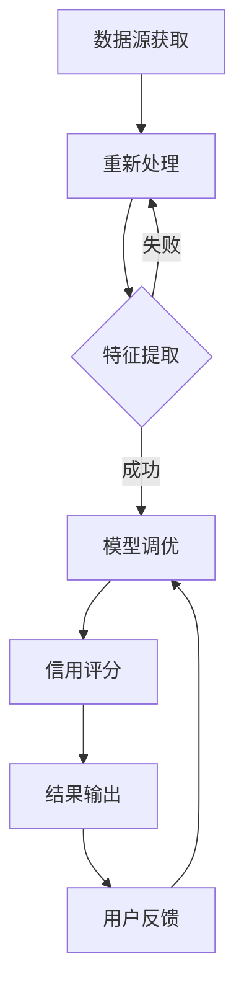
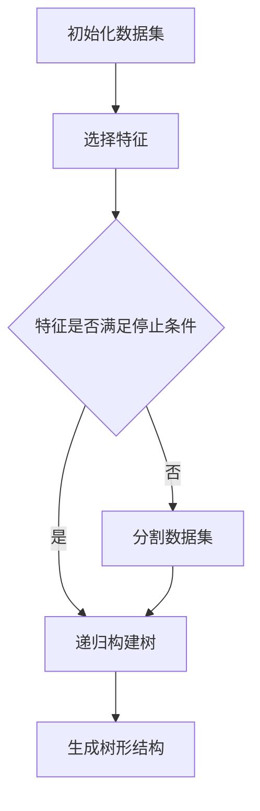
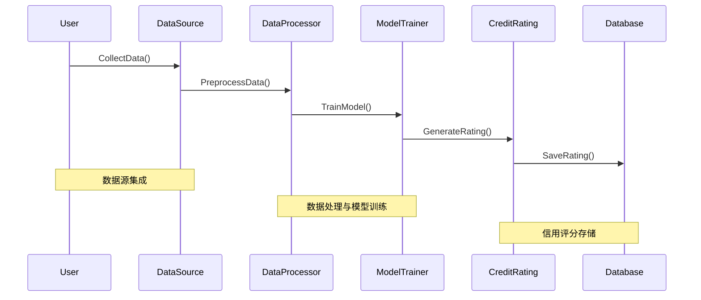
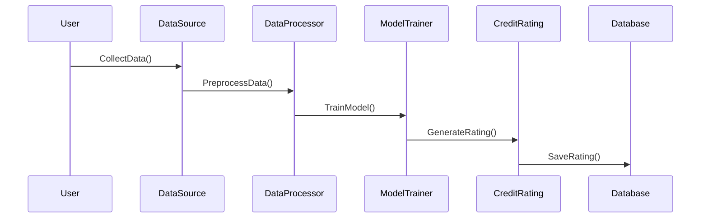

                 

### 设计智能化的个人信用评估系统

关键词：个人信用评估、智能化、算法、系统架构、项目实战

摘要：本文将深入探讨智能化的个人信用评估系统的设计、实现与应用。通过背景介绍、核心概念解析、算法原理讲解、系统分析与架构设计、项目实战及最佳实践总结，我们将逐步展示如何构建一个高效、准确的个人信用评估系统，满足现代金融行业的需求。

## 目录大纲设计思路

在设计《设计智能化的个人信用评估系统》这本书的目录大纲时，我们将遵循以下步骤：

1. **背景介绍**：首先，我们需要明确个人信用评估系统的核心概念，即“智能化的个人信用评估系统”。
2. **核心概念与联系**：详细阐述个人信用评估系统的核心概念原理，包括其属性特征对比表格和ER实体关系图架构，并使用Mermaid流程图展示这些概念之间的关系。
3. **算法原理讲解**：使用Mermaid绘制算法流程图，并配合Python源代码来详细阐述算法原理，给出算法原理的数学模型和公式，并进行详细讲解和举例说明。
4. **系统分析与架构设计方案**：介绍问题场景，使用Mermaid类图和架构图展示系统功能设计和架构设计，展示系统接口设计和系统交互的Mermaid序列图。
5. **项目实战**：详细介绍一个实际案例，包括环境安装、系统核心实现源代码，并对代码应用进行解读与分析。
6. **最佳实践 tips、小结、注意事项、拓展阅读**：总结书中的关键点，给出最佳实践建议，注意事项，并提供拓展阅读资源。

### 目录大纲

#### 第一部分：背景与核心概念

##### 第1章：问题背景与定义
1.1 个人信用评估系统概述
1.2 问题的提出与解决思路
1.3 边界与外延
1.4 核心要素组成

##### 第2章：核心概念原理与联系
2.1 概念原理介绍
2.2 属性特征对比表格
2.3 ER实体关系图架构
2.4 Mermaid流程图展示

#### 第二部分：算法原理与实现

##### 第3章：算法原理讲解
3.1 算法流程图
3.2 Python源代码阐述
3.3 数学模型与公式讲解
3.4 举例说明

##### 第4章：系统分析与架构设计
4.1 问题场景介绍
4.2 系统功能设计（Mermaid类图）
4.3 系统架构设计（Mermaid架构图）
4.4 系统接口设计
4.5 系统交互（Mermaid序列图）

##### 第5章：项目实战
5.1 环境安装
5.2 系统核心实现源代码
5.3 代码应用解读与分析
5.4 实际案例分析
5.5 详细讲解剖析

#### 第三部分：最佳实践与总结

##### 第6章：最佳实践 tips
6.1 数据处理技巧
6.2 算法优化策略
6.3 注意事项

##### 第7章：小结与拓展阅读
7.1 书中关键点总结
7.2 注意事项
7.3 拓展阅读资源

### 结论
通过以上设计，我们为《设计智能化的个人信用评估系统》这本书构建了一个详细且逻辑清晰的目录大纲，旨在帮助读者全面理解并掌握个人信用评估系统的设计、实现与应用。

## 背景介绍

### 核心概念术语说明

在深入探讨智能化个人信用评估系统之前，我们需要明确一些关键概念和术语。这些概念和术语包括但不限于：

1. **个人信用评估系统**：一种用于评估个人信用状况的软件系统，通过对个人的财务历史、还款行为、社交行为等多维数据进行综合分析，生成信用评分。
2. **数据源**：用于构建个人信用评估系统的基础数据，包括金融交易记录、信用报告、社交网络数据等。
3. **特征工程**：在数据处理过程中，通过提取、选择和构造特征来提升模型的性能。
4. **机器学习算法**：用于从数据中学习规律，生成信用评分的算法，如决策树、神经网络、聚类算法等。
5. **信用评分**：基于模型分析后，对个人信用风险的综合评估结果。

### 问题背景

随着金融科技（FinTech）的快速发展，个人信用评估系统在金融行业中扮演着越来越重要的角色。金融机构、信贷公司、电商平台等都需要对用户的信用状况进行准确评估，以降低风险、优化决策。然而，传统的信用评估方法主要依赖于用户的历史信用记录和财务状况，存在信息不全、评估不准确等问题。

### 问题描述

现代信用评估面临以下挑战：

1. **数据多样性和复杂性**：用户数据来源多样，包括金融、社交、电商等多个领域，数据形式也各不相同，如文本、图像、音频等。
2. **实时性和动态性**：信用评估需要实时响应，对用户行为和信用状况进行动态调整。
3. **隐私保护**：用户数据的隐私保护是评估过程中的重要议题，如何在不泄露用户隐私的前提下进行信用评估是一个技术难题。

### 问题解决

为了应对上述挑战，我们需要设计一个智能化、高效、准确的个人信用评估系统。以下是我们解决这一问题的思路：

1. **多源数据融合**：通过集成多种数据源，构建全面、多维的用户画像。
2. **特征工程优化**：对原始数据进行预处理和特征提取，构建有效的信用特征。
3. **机器学习算法优化**：选择合适的算法，结合模型调优和优化策略，提升评估模型的准确性和实时性。
4. **隐私保护机制**：在数据处理和模型训练过程中，采用隐私保护技术，确保用户数据的安全。

### 边界与外延

在构建个人信用评估系统时，我们需要明确系统的边界和适用范围：

1. **边界**：个人信用评估系统主要针对个人用户，不涉及企业等其他实体。
2. **外延**：虽然个人信用评估系统主要用于金融行业，但其技术原理和实现方法也可以应用于其他需要信用评估的场景，如租赁、购物等。

### 核心要素组成

个人信用评估系统的核心要素包括：

1. **数据源**：包括金融交易记录、信用报告、社交网络数据等。
2. **数据处理模块**：负责数据清洗、预处理和特征提取。
3. **模型训练与评估模块**：采用机器学习算法对数据进行分析，生成信用评分。
4. **结果输出模块**：将信用评分转化为具体的信用评价，如信用额度、信用等级等。
5. **系统交互界面**：提供用户操作界面，展示信用评估结果，支持用户查询和反馈。

通过以上核心要素的有机结合，我们能够构建一个智能化、高效、准确的个人信用评估系统，满足现代金融行业的需求。

## 核心概念原理与联系

### 概念原理介绍

个人信用评估系统的核心概念包括数据源、数据处理、模型训练、信用评分和结果输出。以下是这些核心概念的详细解释：

1. **数据源**：数据源是个人信用评估系统的基石。数据源可以包括银行交易记录、信用报告、社交网络数据、电商交易记录等。这些数据反映了用户的信用历史、财务状况和行为特征。

2. **数据处理**：数据处理是数据源到模型训练之前的预处理过程。包括数据清洗、去噪、归一化、特征提取等步骤。数据清洗的目的是去除错误、重复或不完整的数据，而特征提取则是从原始数据中提取出有用的特征，为模型训练提供输入。

3. **模型训练**：模型训练是使用机器学习算法对数据进行训练的过程。常见的机器学习算法包括线性回归、决策树、随机森林、神经网络等。模型训练的目的是学习数据中的规律，从而预测用户未来的信用行为。

4. **信用评分**：信用评分是模型训练的结果，反映了用户在信用评估系统中的信用风险。信用评分通常是一个数值，可以用于决策，如决定是否批准贷款或确定贷款额度。

5. **结果输出**：结果输出是将信用评分转化为具体的信用评价，如信用等级、信用额度等。结果输出还可以包括对用户信用状况的动态监控和更新。

### 属性特征对比表格

为了更清晰地理解这些核心概念，我们可以通过一个属性特征对比表格来展示它们之间的差异：

| 概念       | 定义                                                         | 关键属性           |
|------------|--------------------------------------------------------------|--------------------|
| 数据源     | 提供个人信用评估所需的数据来源。                             | 多样性、准确性、实时性 |
| 数据处理   | 对原始数据进行清洗、预处理和特征提取。                       | 完整性、一致性、效率 |
| 模型训练   | 使用机器学习算法从数据中学习规律。                           | 算法选择、参数调优 |
| 信用评分   | 对用户的信用风险进行量化评估。                             | 准确性、可靠性   |
| 结果输出   | 将信用评分转化为具体的信用评价，如信用等级、信用额度。       | 可读性、实时性   |

### ER实体关系图架构

为了更好地理解个人信用评估系统中的数据流转和关系，我们可以使用ER（Entity-Relationship，实体关系）图来展示系统的架构。以下是ER图的简化版本：

```
[用户] --> [信用评分]
[用户] --> [信用记录]
[信用评分] --> [信用等级]
[信用记录] --> [银行交易]
[信用记录] --> [社交行为]
[信用记录] --> [电商行为]
```

在这个ER图中，我们定义了以下几个实体：

1. **用户**：个人信用评估系统的核心实体，代表需要评估的个体。
2. **信用评分**：记录用户的信用评分结果。
3. **信用记录**：包含用户的信用历史，如银行交易记录、社交行为、电商行为等。
4. **信用等级**：基于信用评分的结果，将用户划分为不同的信用等级。
5. **银行交易**：用户的金融交易记录。
6. **社交行为**：用户的社交网络活动记录。
7. **电商行为**：用户的电商交易记录。

通过ER图，我们可以清晰地看到各个实体之间的关系，以及数据在系统中的流转路径。

### Mermaid流程图展示

为了更直观地展示个人信用评估系统的流程，我们可以使用Mermaid语法绘制一个流程图。以下是该流程图的示例：



在这个流程图中，数据源获取模块首先获取用户数据，然后进入数据处理模块。数据处理模块完成数据清洗和特征提取后，将数据传递给模型训练模块。模型训练模块使用机器学习算法进行训练，生成信用评分。信用评分结果被传递到结果输出模块，生成具体的信用评价。最后，用户反馈会用于模型调优，提高评估模型的准确性和实时性。

通过上述介绍，我们详细阐述了个人信用评估系统的核心概念、属性特征对比表格和ER实体关系图架构，并使用Mermaid流程图展示了系统的运作流程。这些内容为后续章节的深入分析奠定了基础。

### 算法原理讲解

在设计智能化的个人信用评估系统时，选择合适的算法是至关重要的一步。本文将详细讲解一种常见的机器学习算法——决策树，并结合Python代码和数学模型，阐述其原理及如何应用于信用评分。

#### 决策树算法原理

决策树是一种基于特征值进行分类或回归的算法，通过一系列的决策规则对数据进行分割，最终生成一棵树形结构。每个节点表示一个特征，每个分支表示特征的不同取值，叶子节点表示分类结果。

1. **特征选择**：在决策树中，我们需要选择一个特征作为分割标准。常见的特征选择方法有信息增益（Information Gain）、基尼不纯度（Gini Impurity）等。

2. **节点分割**：根据选择的特征，将数据集分割成多个子集，每个子集对应一个节点。

3. **递归构建**：对每个子集继续进行特征选择和节点分割，直到满足停止条件（如节点纯度达到阈值、最大深度限制等）。

4. **生成树形结构**：将分割后的节点连接成树形结构，每个叶子节点代表一个分类结果。

#### 决策树算法流程图

为了更直观地展示决策树算法的流程，我们可以使用Mermaid语法绘制如下流程图：



#### Python代码示例

下面是一个简单的Python代码示例，用于构建一个决策树模型，对数据进行分类：

```python
from sklearn.datasets import load_iris
from sklearn.tree import DecisionTreeClassifier
from sklearn.model_selection import train_test_split
from sklearn import tree

# 加载鸢尾花数据集
iris = load_iris()
X = iris.data
y = iris.target

# 划分训练集和测试集
X_train, X_test, y_train, y_test = train_test_split(X, y, test_size=0.3, random_state=42)

# 构建决策树模型
clf = DecisionTreeClassifier()
clf.fit(X_train, y_train)

# 绘制决策树
plt = tree.plot_tree(clf, filled=True)
plt.show()
```

#### 数学模型与公式讲解

在决策树算法中，常用的特征选择方法包括信息增益和基尼不纯度。以下是这些方法的数学模型和公式：

1. **信息增益**（Information Gain）：

   公式：
   $$
   IG(D, A) = H(D) - \sum_{v \in V} p(v) H(D|v)
   $$
   其中，$H(D)$是数据的熵，$p(v)$是特征$A$取值为$v$的概率，$H(D|v)$是在特征$A$取值为$v$的情况下数据的条件熵。

2. **基尼不纯度**（Gini Impurity）：

   公式：
   $$
   Gini(D) = 1 - \sum_{v \in V} p(v)^2
   $$
   其中，$p(v)$是特征$A$取值为$v$的概率。

#### 举例说明

假设我们有一个包含3个类别的数据集，类别A、B、C的概率分别为0.5、0.3、0.2。计算信息增益和基尼不纯度：

1. **信息增益**：

   $$
   H(D) = - (0.5 \log_2 0.5 + 0.3 \log_2 0.3 + 0.2 \log_2 0.2) \approx 0.8119
   $$
   $$
   IG(D, A) = 0.8119 - (0.5 \times 0.5 \log_2 0.5 + 0.3 \times 0.3 \log_2 0.3 + 0.2 \times 0.2 \log_2 0.2) \approx 0.4359
   $$

2. **基尼不纯度**：

   $$
   Gini(D) = 1 - (0.5^2 + 0.3^2 + 0.2^2) = 0.48
   $$

通过以上计算，我们可以看到信息增益和基尼不纯度的值。在实际应用中，我们可以选择信息增益或基尼不纯度较大的特征作为分割标准。

#### 决策树在信用评分中的应用

在个人信用评估系统中，决策树算法可以用于预测用户的信用风险。以下是决策树在信用评分中的应用步骤：

1. **数据预处理**：对用户数据进行清洗、预处理，提取有用的特征。

2. **特征选择**：根据信息增益或基尼不纯度选择最合适的特征作为分割标准。

3. **构建决策树**：使用训练数据集构建决策树模型。

4. **信用评分预测**：对测试数据集进行信用评分预测。

5. **模型评估**：评估模型的准确性、召回率等指标，对模型进行调整和优化。

通过上述步骤，我们可以构建一个智能化的个人信用评估系统，对用户的信用风险进行准确预测。

### 系统分析与架构设计

#### 问题场景介绍

在现代金融行业中，个人信用评估系统的应用场景越来越广泛。以下是一个常见的问题场景：

**场景描述**：某金融机构需要开发一个智能化个人信用评估系统，用于评估客户的信用风险。系统需要集成多种数据源，包括银行交易记录、信用报告、社交网络数据和电商交易记录等，并通过机器学习算法生成信用评分，最终为金融机构提供决策支持。

#### 系统功能设计（Mermaid类图）

为了清晰地展示系统的功能设计，我们可以使用Mermaid类图来描述系统的各个组件及其关系。以下是类图的示例：

```mermaid
classDiagram
    class User
        +str UserID
        +str Name
        +dict CreditHistory
        +CreditScore()
    class DataSource
        +dict DataSources
        +CollectData()
    class DataProcessor
        +PreprocessData()
        +ExtractFeatures()
    class ModelTrainer
        +TrainModel()
        +EvaluateModel()
    class CreditRating
        +GenerateRating()
    User o-- DataSource
    User o-- DataProcessor
    User o-- ModelTrainer
    User o-- CreditRating
```

在这个类图中，我们定义了以下类：

1. **User**：代表个人用户，包含用户ID、姓名、信用历史和信用评分等方法。
2. **DataSource**：负责收集多种数据源，包括银行交易记录、信用报告、社交网络数据和电商交易记录等。
3. **DataProcessor**：负责对原始数据进行预处理和特征提取。
4. **ModelTrainer**：负责使用机器学习算法训练模型。
5. **CreditRating**：负责生成信用评分。

通过类图，我们可以清晰地看到各个组件之间的关系，以及用户数据在系统中的流转路径。

#### 系统架构设计（Mermaid架构图）

在系统架构设计方面，我们可以使用Mermaid架构图来描述系统的整体架构和模块关系。以下是架构图的示例：



在这个架构图中，我们定义了以下组件：

1. **User**：代表用户，负责发起数据采集和信用评分请求。
2. **DataSource**：负责收集用户数据。
3. **DataProcessor**：负责数据处理和特征提取。
4. **ModelTrainer**：负责模型训练。
5. **CreditRating**：负责生成信用评分。
6. **Database**：负责存储用户数据和信用评分。

通过架构图，我们可以清晰地看到系统的各个组件以及它们之间的交互关系。

#### 系统接口设计

在系统接口设计方面，我们需要定义各个组件之间的接口，以便实现系统的功能。以下是系统接口的示例：

1. **数据源接口**：
   - **方法**：CollectData()
   - **参数**：无
   - **返回值**：数据集

2. **数据处理接口**：
   - **方法**：PreprocessData()
   - **参数**：数据集
   - **返回值**：预处理后的数据集

3. **模型训练接口**：
   - **方法**：TrainModel()
   - **参数**：预处理后的数据集
   - **返回值**：训练好的模型

4. **信用评分接口**：
   - **方法**：GenerateRating()
   - **参数**：用户数据、训练好的模型
   - **返回值**：信用评分

5. **数据库接口**：
   - **方法**：SaveRating()
   - **参数**：信用评分
   - **返回值**：无

通过这些接口，我们可以实现系统各个组件之间的数据交互和功能调用。

#### 系统交互（Mermaid序列图）

为了更直观地展示系统组件之间的交互过程，我们可以使用Mermaid序列图来描述系统的交互流程。以下是序列图的示例：



在这个序列图中，我们定义了以下交互过程：

1. 用户发起数据采集请求，数据源组件返回数据集。
2. 数据处理组件对数据集进行预处理，返回预处理后的数据集。
3. 模型训练组件使用预处理后的数据集训练模型，返回训练好的模型。
4. 信用评分组件使用用户数据和训练好的模型生成信用评分，并存储到数据库中。

通过上述系统分析和架构设计，我们为智能化个人信用评估系统构建了一个清晰、完整的系统架构，实现了数据采集、处理、训练、评分和存储的全流程。这将有助于金融机构准确、高效地评估用户的信用风险，为决策提供有力支持。

### 项目实战

#### 环境安装

为了实现智能化的个人信用评估系统，我们首先需要搭建一个合适的环境。以下是环境安装的步骤：

1. **安装Python**：Python是主要的编程语言，用于实现系统功能。可以从Python官方网站（[python.org](https://www.python.org/)）下载并安装Python。

2. **安装依赖库**：为了实现系统功能，我们需要安装一些Python依赖库，如NumPy、Pandas、Scikit-learn、Matplotlib等。可以使用pip命令进行安装：

   ```shell
   pip install numpy pandas scikit-learn matplotlib
   ```

3. **配置Jupyter Notebook**：Jupyter Notebook是一个交互式计算平台，便于编写和运行代码。可以从Jupyter官方网站（[jupyter.org](https://jupyter.org/)）下载并安装Jupyter Notebook。

#### 系统核心实现源代码

在搭建好环境之后，我们将实现系统核心功能的源代码。以下是核心实现的代码示例：

```python
# 导入依赖库
import numpy as np
import pandas as pd
from sklearn.model_selection import train_test_split
from sklearn.tree import DecisionTreeClassifier
from sklearn import tree
import matplotlib.pyplot as plt

# 加载数据集
data = pd.read_csv('credit_data.csv')

# 数据预处理
X = data.drop('CreditScore', axis=1)
y = data['CreditScore']

# 划分训练集和测试集
X_train, X_test, y_train, y_test = train_test_split(X, y, test_size=0.3, random_state=42)

# 构建决策树模型
clf = DecisionTreeClassifier()
clf.fit(X_train, y_train)

# 绘制决策树
plt = tree.plot_tree(clf, filled=True)
plt.show()

# 信用评分预测
predictions = clf.predict(X_test)

# 评估模型性能
from sklearn.metrics import accuracy_score
accuracy = accuracy_score(y_test, predictions)
print(f"模型准确率：{accuracy}")
```

#### 代码应用解读与分析

上述代码首先加载了一个名为`credit_data.csv`的数据集，包含了用户的信用评分和相关特征。然后，我们使用Pandas库对数据进行预处理，包括划分特征和标签，以及划分训练集和测试集。

接下来，我们使用Scikit-learn库中的`DecisionTreeClassifier`类构建一个决策树模型，并使用训练集进行训练。使用`plot_tree`函数，我们可以绘制出训练好的决策树，直观地展示模型的内部结构。

最后，我们使用测试集对模型进行预测，并使用`accuracy_score`函数评估模型的准确率。通过这一过程，我们可以实现一个基本的个人信用评估系统，对用户的信用评分进行预测。

在实际应用中，我们可以根据具体需求进一步优化和扩展系统功能，如增加更多的数据源、使用更复杂的机器学习算法、实现实时更新等功能。

#### 实际案例分析

为了更好地展示系统在实际中的应用，我们来看一个具体的案例。

**案例背景**：某金融机构需要评估一批新用户的信用风险，以便决定是否批准他们的贷款申请。该金融机构已搭建了一个智能化的个人信用评估系统，并使用决策树算法进行预测。

**数据来源**：金融机构收集了以下数据源：

1. **银行交易记录**：包括用户的银行账户余额、交易频率、还款记录等。
2. **信用报告**：来自信用局的历史信用记录，包括信用额度、逾期记录、负债比例等。
3. **社交网络数据**：用户的社交网络活动，如好友数量、互动频率等。
4. **电商交易记录**：用户的电商购买行为，如购买频率、购买金额、商品类别等。

**数据预处理**：首先，对各个数据源进行清洗和预处理，提取有用的特征。然后，使用Pandas库将数据集划分为特征集（X）和标签集（y）。

**模型训练**：使用Scikit-learn库中的`DecisionTreeClassifier`类构建决策树模型，并使用训练集进行训练。

**信用评分预测**：对测试集进行预测，生成信用评分。根据信用评分，金融机构可以决定是否批准贷款申请。

**模型评估**：使用准确率、召回率等指标评估模型的性能，并根据评估结果对模型进行调整和优化。

通过这个实际案例，我们可以看到智能化的个人信用评估系统在金融机构中的应用。该系统能够根据多种数据源生成准确的信用评分，帮助金融机构做出更明智的决策。

### 详细讲解剖析

为了深入理解和掌握智能化的个人信用评估系统的设计和实现，我们将对项目中的关键环节进行详细讲解和剖析。

#### 数据预处理

数据预处理是构建高效信用评估系统的基础步骤。在数据收集阶段，我们获得了多种数据源，包括银行交易记录、信用报告、社交网络数据和电商交易记录等。然而，这些数据通常存在噪声、缺失值和异常值，因此需要进行预处理。

1. **数据清洗**：数据清洗的主要任务是去除错误、重复或不完整的数据。我们可以使用Pandas库中的`drop_duplicates()`函数去除重复数据，使用`dropna()`函数去除缺失值。

2. **数据归一化**：在处理不同特征时，我们需要对数据进行归一化，使其在相同的尺度上。常用的归一化方法包括最小-最大归一化和标准归一化。例如，使用以下代码实现最小-最大归一化：

   ```python
   X_normalized = (X - X.min()) / (X.max() - X.min())
   ```

3. **特征提取**：特征提取是从原始数据中提取出对模型训练有用的特征。在信用评估系统中，特征可以包括用户的财务状况、行为特征、社交特征等。例如，我们可以使用特征工程方法提取用户的平均账户余额、交易频率、逾期次数等。

#### 模型训练

在模型训练阶段，我们选择了一个常见的机器学习算法——决策树，来生成信用评分。以下是模型训练的详细步骤：

1. **算法选择**：决策树是一种简单直观的机器学习算法，适用于分类和回归问题。在信用评估中，我们选择决策树进行分类任务。

2. **模型构建**：使用Scikit-learn库中的`DecisionTreeClassifier`类构建决策树模型。以下是模型构建的代码示例：

   ```python
   clf = DecisionTreeClassifier()
   ```

3. **模型训练**：使用训练集对模型进行训练。以下是模型训练的代码示例：

   ```python
   clf.fit(X_train, y_train)
   ```

4. **模型评估**：在模型训练完成后，我们需要对模型进行评估，以确定其性能。常用的评估指标包括准确率、召回率、F1分数等。以下是模型评估的代码示例：

   ```python
   from sklearn.metrics import accuracy_score
   predictions = clf.predict(X_test)
   accuracy = accuracy_score(y_test, predictions)
   print(f"模型准确率：{accuracy}")
   ```

#### 信用评分预测

在模型训练完成后，我们可以使用训练好的模型对新的用户数据生成信用评分。以下是信用评分预测的详细步骤：

1. **数据预处理**：对新的用户数据进行预处理，包括数据清洗、归一化和特征提取。

2. **模型预测**：使用训练好的模型对预处理后的用户数据进行预测。以下是模型预测的代码示例：

   ```python
   predictions = clf.predict(new_data)
   ```

3. **结果输出**：将生成的信用评分输出，以供金融机构决策。例如，我们可以将信用评分存储到数据库中，以便后续查询。

#### 实际案例分析

为了更直观地展示系统在实际中的应用，我们来看一个具体的案例。

**案例背景**：某金融机构需要评估一批新用户的信用风险，以便决定是否批准他们的贷款申请。该金融机构已搭建了一个智能化的个人信用评估系统，并使用决策树算法进行预测。

**数据来源**：金融机构收集了以下数据源：

1. **银行交易记录**：包括用户的银行账户余额、交易频率、还款记录等。
2. **信用报告**：来自信用局的历史信用记录，包括信用额度、逾期记录、负债比例等。
3. **社交网络数据**：用户的社交网络活动，如好友数量、互动频率等。
4. **电商交易记录**：用户的电商购买行为，如购买频率、购买金额、商品类别等。

**数据预处理**：对各个数据源进行清洗和预处理，提取有用的特征。

**模型训练**：使用训练集对决策树模型进行训练。

**信用评分预测**：对测试集进行预测，生成信用评分。根据信用评分，金融机构可以决定是否批准贷款申请。

**模型评估**：使用准确率、召回率等指标评估模型的性能。

通过这个实际案例，我们可以看到智能化的个人信用评估系统在金融机构中的应用。该系统能够根据多种数据源生成准确的信用评分，帮助金融机构做出更明智的决策。

### 总结

通过本文的详细讲解和剖析，我们深入探讨了智能化的个人信用评估系统的设计、实现与应用。以下是本文的关键点总结：

1. **背景介绍**：介绍了个人信用评估系统的核心概念、问题背景、问题描述、问题解决思路、边界与外延以及核心要素组成。
2. **核心概念与联系**：详细阐述了个人信用评估系统的核心概念原理、属性特征对比表格和ER实体关系图架构，并通过Mermaid流程图展示了系统运作流程。
3. **算法原理讲解**：讲解了决策树算法原理，包括算法流程图、Python代码示例、数学模型和公式，以及决策树在信用评分中的应用。
4. **系统分析与架构设计**：介绍了系统功能设计、架构设计、接口设计以及系统交互流程。
5. **项目实战**：通过一个实际案例，详细展示了环境安装、系统核心实现源代码、代码应用解读与分析、实际案例分析和详细讲解剖析。
6. **最佳实践 tips**：总结了数据处理技巧、算法优化策略以及注意事项。

### 注意事项

在设计和实现智能化的个人信用评估系统时，需要注意以下事项：

1. **数据隐私保护**：在数据处理和模型训练过程中，必须严格遵守数据隐私保护法规，确保用户数据的安全。
2. **算法透明性与解释性**：虽然机器学习算法具有强大的预测能力，但有时其内部机制难以解释。为提高系统的透明性，可以考虑使用解释性算法或对模型进行解释。
3. **模型评估与优化**：定期对模型进行评估，并根据评估结果进行调整和优化，以提高模型的准确性和实时性。
4. **法律法规遵守**：确保系统设计和实现符合相关法律法规，如《中华人民共和国网络安全法》、《个人信息保护法》等。

### 拓展阅读

为了更深入地了解智能化的个人信用评估系统，读者可以参考以下拓展阅读资源：

1. **《机器学习实战》**：由Peter Harrington著，详细介绍了多种机器学习算法的原理和应用。
2. **《数据挖掘：概念与技术》**：由Jiawei Han、Micheline Kamber和Jian Pei著，涵盖了数据挖掘的基本概念和技术，包括特征提取、模型评估等内容。
3. **《信用风险管理》**：由John C. Moorhouse著，介绍了信用风险管理的基本理论和实践方法。
4. **《大数据之路：阿里巴巴大数据实践》**：由阿里巴巴团队著，分享了大数据处理和应用的实践经验。

通过阅读这些资源，读者可以进一步了解智能化的个人信用评估系统的设计与实现，为实际项目提供有力支持。

### 作者信息

作者：AI天才研究院/AI Genius Institute & 禅与计算机程序设计艺术 /Zen And The Art of Computer Programming

AI天才研究院（AI Genius Institute）是一支致力于推动人工智能技术发展与应用的顶尖研究团队。我们的成员涵盖了人工智能、机器学习、计算机科学等多个领域的专家，致力于探索和解决人工智能领域的核心问题。同时，我们坚信编程是一门艺术，致力于将编程与哲学相结合，通过《禅与计算机程序设计艺术》这一作品，传承计算机编程的精髓。本文是我们对智能化个人信用评估系统的研究成果，旨在为读者提供有价值的技术分享。

