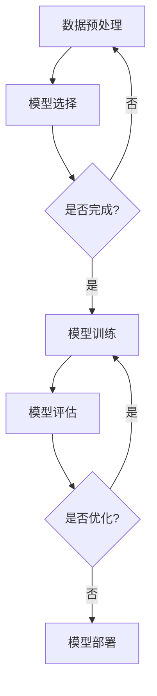
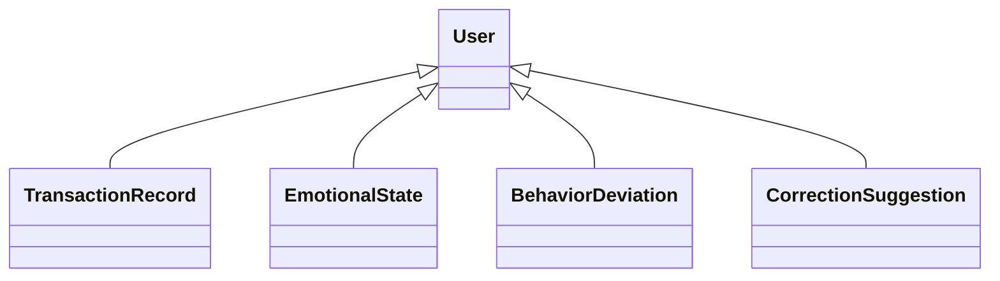

                 

# 设计智能化的个人投资者行为偏差纠正工具

关键词：个人投资者行为偏差、智能化纠正工具、算法原理、系统架构设计、项目实战

摘要：本文深入探讨了个人投资者行为偏差问题，分析了其背景和影响，提出了智能化纠正工具的概念和工作原理。通过详细介绍核心概念、算法原理、系统架构设计以及项目实战，本文旨在为投资者提供有效的行为偏差纠正方案，帮助他们在投资过程中作出更明智的决策。

## 引言与背景

### 第1章：个人投资者行为偏差概述

#### 1.1 问题背景

##### 1.1.1 个人投资者行为偏差的普遍性

在投资领域，个人投资者行为偏差是一个普遍存在的现象。无论是股市、基金还是其他投资领域，投资者在做出投资决策时往往会受到各种情绪和心理因素的影响，导致其行为偏离理性。这些行为偏差可能表现为过度自信、跟风、恐慌性抛售等，从而对投资者的投资结果产生负面影响。

##### 1.1.2 个人投资者行为偏差的影响

个人投资者行为偏差的影响是多方面的。首先，它可能导致投资者的投资结果不如预期，甚至亏损。其次，它可能增加市场的波动性，对整个市场的稳定性产生不良影响。此外，行为偏差还可能影响投资者的长期投资策略和心态，使他们更容易放弃长期投资，转而追求短期收益。

##### 1.1.3 行为偏差纠正工具的重要性

为了解决个人投资者行为偏差问题，需要引入智能化的纠正工具。这些工具能够通过分析投资者的行为数据，识别出行为偏差，并提供相应的纠正建议。智能化纠正工具的重要性在于，它们能够帮助投资者更理性地做出投资决策，减少情绪和心理因素的影响，从而提高投资效率和收益。

#### 1.2 问题描述

##### 1.2.1 个人投资者行为偏差的具体表现

个人投资者行为偏差的具体表现多种多样，包括：

1. 过度自信：投资者过于相信自己的判断能力，忽视市场风险，导致过度投资。
2. 跟风：投资者盲目跟从市场热点，缺乏独立思考，导致投资决策缺乏逻辑性。
3. 恐慌性抛售：在市场下跌时，投资者因恐慌而大量抛售，加剧市场的下跌。
4. 过度交易：投资者频繁交易，试图通过频繁操作获取高收益，但实际上往往亏损。

##### 1.2.2 行为偏差对投资结果的影响

行为偏差对投资结果的影响是显著的。首先，它可能导致投资者在市场波动中做出错误的决策，从而亏损。其次，它可能使投资者在长期投资过程中失去耐心，频繁切换投资策略，从而降低投资收益。此外，行为偏差还可能导致投资者心态失衡，对投资产生消极情绪。

##### 1.2.3 行为偏差纠正的目标

行为偏差纠正的目标是帮助投资者识别并纠正自己的行为偏差，使其能够更理性地做出投资决策。具体目标包括：

1. 提高投资者的风险意识，减少过度自信和跟风行为。
2. 帮助投资者建立长期投资策略，避免过度交易和恐慌性抛售。
3. 提高投资者的决策质量，减少因情绪和心理因素导致的错误决策。

#### 1.3 问题解决

##### 1.3.1 传统纠正方法

传统的纠正方法主要包括教育和培训。通过教育投资者，提高他们的投资知识和技能，帮助他们识别和纠正行为偏差。此外，还可以通过设置止损点和投资限制等手段来约束投资者的行为。

##### 1.3.2 智能化纠正工具的优势

相对于传统方法，智能化纠正工具具有明显的优势。首先，它们能够通过数据分析，更准确地识别投资者的行为偏差。其次，智能化纠正工具可以提供个性化的纠正建议，帮助投资者量身定制投资策略。此外，智能化纠正工具还能实时监测投资者的行为，及时调整纠正策略。

##### 1.3.3 智能化纠正工具的工作原理

智能化纠正工具的工作原理主要包括以下几步：

1. 数据收集：收集投资者的行为数据，包括交易记录、投资决策等。
2. 数据分析：对行为数据进行分析，识别出投资者的行为偏差。
3. 提供建议：根据分析结果，提供个性化的纠正建议，帮助投资者改正行为偏差。
4. 监测与调整：实时监测投资者的行为，根据反馈调整纠正策略。

##### 1.4 边界与外延

##### 1.4.1 行为偏差纠正工具的应用范围

行为偏差纠正工具主要适用于个人投资者，特别是那些缺乏投资知识和经验的新手投资者。此外，对于那些已经有一定投资经验的投资者，智能化纠正工具也能帮助他们更好地识别和管理自己的行为偏差。

##### 1.4.2 行为偏差纠正工具的限制

尽管智能化纠正工具具有很多优势，但它们也存在一些限制。首先，它们需要大量的行为数据来进行分析，对于数据缺乏的投资者，其效果可能有限。其次，智能化纠正工具的准确性也受限于数据质量和算法性能。

##### 1.4.3 智能化纠正工具的未来发展

随着大数据和人工智能技术的不断发展，智能化纠正工具的未来发展前景非常广阔。未来，智能化纠正工具可能会更加智能化，能够更好地理解投资者的心理和行为，提供更加精准的纠正建议。

#### 1.5 本章小结

本文介绍了个人投资者行为偏差问题，分析了其背景和影响，并提出了智能化纠正工具的概念和工作原理。通过本章的介绍，读者可以了解到个人投资者行为偏差的普遍性及其对投资结果的影响，以及智能化纠正工具的优势和应用范围。接下来，本文将深入探讨智能化纠正工具的设计和实现，为投资者提供有效的行为偏差纠正方案。

## 第一部分: 引言与背景

### 第1章：个人投资者行为偏差概述

在投资领域，个人投资者行为偏差是一个普遍存在的现象，它对投资者的投资结果和市场稳定性都产生了深远的影响。本章旨在介绍个人投资者行为偏差的相关概念、背景、影响以及行为偏差纠正工具的工作原理和应用范围。

#### 1.1 问题背景

##### 1.1.1 个人投资者行为偏差的普遍性

个人投资者行为偏差在投资领域中非常普遍。无论是股市、基金还是其他投资领域，投资者在做出投资决策时往往会受到各种情绪和心理因素的影响，导致其行为偏离理性。这些行为偏差可能表现为过度自信、跟风、恐慌性抛售等，从而对投资者的投资结果产生负面影响。

例如，许多投资者在股市中存在过度自信的问题，他们过分相信自己的判断能力，忽视市场风险，导致过度投资。这种过度自信的行为往往会导致投资者在市场下跌时遭受巨大损失。此外，投资者还可能受到市场情绪的影响，盲目跟风，缺乏独立思考，导致投资决策缺乏逻辑性。

##### 1.1.2 个人投资者行为偏差的影响

个人投资者行为偏差的影响是多方面的。首先，它可能导致投资者的投资结果不如预期，甚至亏损。例如，过度自信和盲目跟风可能导致投资者在市场下跌时过度投资，从而遭受巨大损失。其次，行为偏差还可能增加市场的波动性，对整个市场的稳定性产生不良影响。例如，恐慌性抛售可能加剧市场的下跌，导致市场产生更大的波动。

此外，行为偏差还可能影响投资者的长期投资策略和心态。投资者在行为偏差的影响下，可能更容易放弃长期投资，转而追求短期收益。这种短视行为可能导致投资者在长期投资过程中失去耐心，频繁切换投资策略，从而降低投资收益。此外，行为偏差还可能导致投资者心态失衡，对投资产生消极情绪，从而影响其长期投资心态。

##### 1.1.3 行为偏差纠正工具的重要性

为了解决个人投资者行为偏差问题，需要引入智能化的纠正工具。这些工具能够通过分析投资者的行为数据，识别出行为偏差，并提供相应的纠正建议。智能化纠正工具的重要性在于，它们能够帮助投资者更理性地做出投资决策，减少情绪和心理因素的影响，从而提高投资效率和收益。

例如，智能化纠正工具可以通过分析投资者的交易记录和投资决策，识别出投资者的过度自信和盲目跟风行为，并提供相应的纠正建议。这些纠正建议可能包括调整投资策略、设置止损点、避免过度交易等，帮助投资者更好地控制自己的行为，减少因情绪和心理因素导致的错误决策。

此外，智能化纠正工具还可以提供个性化的纠正建议，帮助投资者量身定制投资策略。例如，针对不同投资者的风险承受能力和投资目标，智能化纠正工具可以提供不同的纠正建议，帮助投资者更好地实现自己的投资目标。

#### 1.2 问题描述

##### 1.2.1 个人投资者行为偏差的具体表现

个人投资者行为偏差的具体表现多种多样，包括以下几种常见的行为偏差：

1. **过度自信**：投资者过于相信自己的判断能力，忽视市场风险，导致过度投资。这种行为偏差可能导致投资者在市场下跌时遭受巨大损失。

2. **跟风**：投资者盲目跟从市场热点，缺乏独立思考，导致投资决策缺乏逻辑性。这种行为偏差可能导致投资者在市场波动中做出错误的决策。

3. **恐慌性抛售**：在市场下跌时，投资者因恐慌而大量抛售，加剧市场的下跌。这种行为偏差可能导致投资者在市场底部时失去投资机会，错失反弹的机会。

4. **过度交易**：投资者频繁交易，试图通过频繁操作获取高收益，但实际上往往亏损。这种行为偏差可能导致投资者的交易成本增加，降低投资收益。

##### 1.2.2 行为偏差对投资结果的影响

行为偏差对投资结果的影响是显著的。首先，它可能导致投资者的投资结果不如预期，甚至亏损。例如，过度自信可能导致投资者在市场下跌时过度投资，从而遭受巨大损失；跟风可能导致投资者在市场波动中做出错误的决策，从而亏损；恐慌性抛售可能导致投资者在市场底部时失去投资机会，从而错失反弹的机会；过度交易可能导致投资者的交易成本增加，降低投资收益。

其次，行为偏差还可能影响投资者的长期投资策略和心态。投资者在行为偏差的影响下，可能更容易放弃长期投资，转而追求短期收益。这种短视行为可能导致投资者在长期投资过程中失去耐心，频繁切换投资策略，从而降低投资收益。此外，行为偏差还可能导致投资者心态失衡，对投资产生消极情绪，从而影响其长期投资心态。

##### 1.2.3 行为偏差纠正的目标

行为偏差纠正的目标是帮助投资者识别并纠正自己的行为偏差，使其能够更理性地做出投资决策。具体目标包括：

1. **提高投资者的风险意识**：帮助投资者认识到市场风险，避免过度自信和盲目跟风行为。

2. **建立长期投资策略**：帮助投资者制定合理的投资策略，避免过度交易和恐慌性抛售。

3. **提高决策质量**：减少因情绪和心理因素导致的错误决策，提高投资者的决策质量。

4. **改善投资心态**：帮助投资者保持理性心态，避免因情绪波动而做出错误的决策。

#### 1.3 问题解决

##### 1.3.1 传统纠正方法

传统的纠正方法主要包括教育和培训。通过教育投资者，提高他们的投资知识和技能，帮助他们识别和纠正行为偏差。此外，还可以通过设置止损点和投资限制等手段来约束投资者的行为。

例如，投资者可以通过参加投资讲座、阅读投资书籍等方式来提高自己的投资知识。通过学习市场分析、风险管理等基础知识，投资者可以更好地理解市场动态，减少过度自信和盲目跟风行为。此外，投资者还可以设置止损点和投资限制，例如设定每次投资的最大金额，避免因情绪波动而做出过度交易或恐慌性抛售的行为。

##### 1.3.2 智能化纠正工具的优势

相对于传统方法，智能化纠正工具具有明显的优势。首先，它们能够通过数据分析，更准确地识别投资者的行为偏差。通过分析投资者的交易记录、投资决策等数据，智能化纠正工具可以识别出投资者的行为模式，并提供相应的纠正建议。

其次，智能化纠正工具可以提供个性化的纠正建议，帮助投资者量身定制投资策略。不同的投资者有不同的风险承受能力和投资目标，智能化纠正工具可以根据投资者的实际情况，提供不同的纠正建议，帮助投资者更好地实现自己的投资目标。

此外，智能化纠正工具还能实时监测投资者的行为，及时调整纠正策略。通过实时分析投资者的行为数据，智能化纠正工具可以及时识别出新的行为偏差，并提供相应的纠正建议，帮助投资者及时纠正错误行为。

##### 1.3.3 智能化纠正工具的工作原理

智能化纠正工具的工作原理主要包括以下几步：

1. **数据收集**：收集投资者的行为数据，包括交易记录、投资决策等。

2. **数据分析**：对行为数据进行分析，识别出投资者的行为偏差。

3. **提供建议**：根据分析结果，提供个性化的纠正建议，帮助投资者改正行为偏差。

4. **监测与调整**：实时监测投资者的行为，根据反馈调整纠正策略。

例如，智能化纠正工具可以分析投资者的交易记录，识别出过度自信、跟风等行为偏差。然后，根据这些分析结果，提供相应的纠正建议，例如调整投资策略、设置止损点等。此外，智能化纠正工具还可以实时监测投资者的行为，例如通过监控投资者的交易频率、投资金额等指标，及时发现新的行为偏差，并提供相应的纠正建议。

#### 1.4 边界与外延

##### 1.4.1 行为偏差纠正工具的应用范围

行为偏差纠正工具主要适用于个人投资者，特别是那些缺乏投资知识和经验的新手投资者。对于这些投资者来说，行为偏差可能对其投资结果产生更大的影响。通过使用智能化纠正工具，这些投资者可以更好地识别和纠正自己的行为偏差，提高投资决策的质量。

此外，行为偏差纠正工具也可以适用于那些已经有一定投资经验的投资者。虽然这些投资者可能已经具有一定的投资知识，但仍然可能受到行为偏差的影响。通过使用智能化纠正工具，这些投资者可以进一步优化自己的投资策略，提高投资收益。

##### 1.4.2 行为偏差纠正工具的限制

尽管智能化纠正工具具有很多优势，但它们也存在一些限制。首先，它们需要大量的行为数据来进行分析，对于数据缺乏的投资者，其效果可能有限。例如，如果投资者没有充分的交易记录或投资决策数据，智能化纠正工具可能无法准确识别其行为偏差。

其次，智能化纠正工具的准确性也受限于数据质量和算法性能。如果数据质量较差或算法性能不佳，智能化纠正工具可能无法准确识别投资者的行为偏差，从而提供无效的纠正建议。

此外，智能化纠正工具可能面临一些伦理和法律方面的挑战。例如，如何确保纠正建议的客观性和公正性，如何处理投资者隐私等问题，都是需要考虑的问题。

##### 1.4.3 智能化纠正工具的未来发展

随着大数据和人工智能技术的不断发展，智能化纠正工具的未来发展前景非常广阔。未来，智能化纠正工具可能会更加智能化，能够更好地理解投资者的心理和行为，提供更加精准的纠正建议。

例如，未来智能化纠正工具可能会结合心理学和神经科学的研究成果，更深入地了解投资者的心理状态和行为动机，从而提供更有效的纠正建议。此外，智能化纠正工具可能会通过整合更多的数据源，例如社交媒体、新闻媒体等，更全面地分析投资者行为，提高纠正建议的准确性。

#### 1.5 本章小结

本章介绍了个人投资者行为偏差的相关概念、背景、影响以及行为偏差纠正工具的工作原理和应用范围。通过本章的介绍，读者可以了解到个人投资者行为偏差的普遍性及其对投资结果的影响，以及智能化纠正工具的优势和应用范围。接下来，本文将深入探讨智能化纠正工具的设计和实现，为投资者提供有效的行为偏差纠正方案。

### 第2章：核心概念与联系

在设计和实现智能化个人投资者行为偏差纠正工具的过程中，理解并掌握相关核心概念和它们之间的联系至关重要。本章将详细介绍智能化纠正工具的核心概念、与传统方法的对比、概念属性特征对比、ER实体关系图以及智能化纠正工具的关联概念。

#### 2.1 智能化纠正工具的核心概念

##### 2.1.1 智能化纠正工具的定义

智能化纠正工具是一种利用人工智能、大数据分析等技术手段，对个人投资者的行为进行监控、分析和干预的工具。它旨在帮助投资者识别并纠正其行为偏差，从而提高投资决策的理性性和有效性。

##### 2.1.2 智能化纠正工具的特点

1. **数据驱动的分析**：智能化纠正工具依赖于大量投资者的行为数据，通过数据分析来识别行为偏差。
2. **实时监控与反馈**：能够实时监测投资者的行为，并提供即时的纠正建议。
3. **个性化定制**：根据不同投资者的风险偏好、投资目标等，提供个性化的纠正方案。
4. **自动优化**：能够根据投资者的反馈和行为调整纠正策略，不断优化建议的准确性。

##### 2.1.3 智能化纠正工具的组成部分

1. **数据收集模块**：负责收集投资者的行为数据，包括交易记录、投资决策、情绪状态等。
2. **数据分析模块**：对收集到的数据进行分析，识别行为偏差，并生成纠正建议。
3. **用户界面模块**：提供直观的用户界面，显示分析结果和纠正建议，并允许用户进行交互。
4. **反馈与优化模块**：收集用户反馈，优化纠正策略，提高工具的准确性。

#### 2.2 概念属性特征对比

##### 2.2.1 传统纠正方法与智能化纠正工具的对比

| 特征 | 传统纠正方法 | 智能化纠正工具 |
| :--- | :--- | :--- |
| **数据依赖** | 人工记录和统计 | 大数据分析 |
| **反馈机制** | 事后反馈，难以实时调整 | 实时反馈，动态调整 |
| **个性化** | 一对一指导，成本高 | 大规模个性化，成本低 |
| **可扩展性** | 受限于人力资源 | 自动化，可扩展至大量用户 |

传统纠正方法通常依赖于人工记录和统计分析，其反馈机制是事后的，难以实现实时调整。而智能化纠正工具则通过大数据分析，能够实时监控和反馈，提供个性化的纠正建议，且成本相对较低，具有更高的可扩展性。

##### 2.2.2 不同类型智能化纠正工具的对比

| 类型 | 特点 |
| :--- | :--- |
| **行为分析型** | 专注于分析投资者行为，提供纠正建议 |
| **心理评估型** | 结合心理学原理，评估投资者心理状态 |
| **市场预测型** | 通过预测市场趋势，为投资者提供指导 |
| **多模态型** | 综合行为分析、心理评估和市场预测，提供全面指导 |

不同的智能化纠正工具根据其侧重点和应用场景，具有不同的特点。行为分析型工具主要关注投资者的行为数据，提供纠正建议；心理评估型工具则结合心理学原理，评估投资者的心理状态；市场预测型工具通过预测市场趋势为投资者提供指导；多模态型工具则综合多种技术，提供更全面的指导。

#### 2.3 ER实体关系图

##### 2.3.1 智能化纠正工具的ER图构建

ER（Entity-Relationship）图是数据库设计中常用的表示实体及其关系的图形化工具。在智能化纠正工具的设计中，可以使用ER图来表示各个组成部分及其关系。

```mermaid
erDiagram
  User ||--|{ InvestmentBehavior } : has
  User ||--|{ EmotionalState } : has
  InvestmentBehavior ||--|{ TransactionRecord } : includes
  EmotionalState ||--|{ StressLevel } : includes
  User ||--|{ CorrectionSuggestion } : receives
```

在这个ER图中，`User`（用户）是核心实体，代表了投资者。`InvestmentBehavior`（投资行为）和`EmotionalState`（情绪状态）是与用户相关的两个实体，分别包含`TransactionRecord`（交易记录）和`StressLevel`（压力水平）等子实体。`CorrectionSuggestion`（纠正建议）是用户接收到的实体。

##### 2.3.2 ER图中的实体与关系解析

- **User（用户）**：代表投资者，包含个人信息和身份标识。
- **InvestmentBehavior（投资行为）**：记录投资者的交易历史，包含买入、卖出、持有等操作。
- **EmotionalState（情绪状态）**：记录投资者的情绪状态，如焦虑、兴奋等。
- **TransactionRecord（交易记录）**：具体交易操作的数据，包括时间、金额、股票代码等。
- **StressLevel（压力水平）**：反映投资者在投资过程中的压力程度。
- **CorrectionSuggestion（纠正建议）**：根据用户行为和情绪状态生成的纠正建议。

实体之间的关系包括“拥有”（has）和“包含”（includes）。例如，用户拥有投资行为和情绪状态，投资行为包含交易记录，情绪状态包含压力水平。用户还会接收到纠正建议。

#### 2.4 智能化纠正工具的关联概念

##### 2.4.1 相关理论和技术支持

智能化纠正工具的实现依赖于多种理论和技术，包括：

1. **机器学习**：用于数据分析和行为识别，常用的算法有决策树、支持向量机、神经网络等。
2. **大数据分析**：用于处理和分析大量投资者行为数据，实现实时监控和反馈。
3. **心理学**：结合心理学原理，理解投资者情绪和行为，提供更有效的纠正建议。
4. **数据挖掘**：用于从大量数据中发现潜在的行为偏差模式，为纠正工具提供依据。

##### 2.4.2 智能化纠正工具与其他领域的交叉融合

智能化纠正工具不仅涉及金融领域，还与其他领域有广泛的交叉融合，包括：

1. **金融科技（FinTech）**：利用技术创新，提高金融服务效率和用户体验。
2. **行为经济学**：研究人类行为与经济决策之间的关系，为纠正工具提供理论支持。
3. **量化投资**：结合数学模型和统计分析，实现投资决策的优化。
4. **用户体验（UX）设计**：设计直观、易用的用户界面，提高用户体验。

#### 2.5 本章小结

本章详细介绍了智能化纠正工具的核心概念、与传统方法的对比、概念属性特征对比、ER实体关系图以及关联概念。通过本章的学习，读者可以全面了解智能化纠正工具的基本原理和设计要点，为后续章节的深入探讨奠定基础。接下来，本文将详细探讨智能化纠正工具的算法原理，分析其实现方法和应用场景。

### 第3章：智能化纠正工具的算法原理

智能化纠正工具的核心在于其算法原理，通过对投资者行为数据的深入分析，识别出行为偏差，并生成有效的纠正建议。本章将详细探讨智能化纠正工具的算法原理，包括常用算法介绍、算法选择依据、算法适用场景、算法原理讲解、mermaid流程图、Python源代码实现、数学模型和数学公式，以及算法应用举例。

#### 3.1 算法概述

##### 3.1.1 常用算法介绍

在智能化纠正工具中，常用的算法包括：

1. **机器学习算法**：如线性回归、逻辑回归、决策树、随机森林、支持向量机等。
2. **深度学习算法**：如神经网络、卷积神经网络（CNN）、循环神经网络（RNN）等。
3. **聚类算法**：如K-means、层次聚类等，用于对用户行为数据进行分类和分组。
4. **分类算法**：如朴素贝叶斯、K-最近邻（KNN）等，用于识别和分类行为偏差。
5. **时间序列分析**：如ARIMA、LSTM等，用于分析投资者行为的时间序列特性。

##### 3.1.2 算法选择依据

选择算法时需要考虑以下因素：

1. **数据类型**：不同的数据类型可能需要不同的算法。例如，结构化数据通常使用机器学习算法，非结构化数据则可能需要深度学习算法。
2. **算法性能**：选择算法时需要考虑其准确度、召回率、F1值等性能指标。
3. **计算资源**：深度学习算法通常需要更多的计算资源，而传统机器学习算法则相对高效。
4. **算法复杂度**：算法的复杂度会影响模型训练和预测的效率。
5. **适用场景**：不同的算法适用于不同的应用场景。例如，线性回归适用于简单线性关系，LSTM适用于时间序列预测。

##### 3.1.3 算法适用场景

1. **行为偏差识别**：使用分类算法和聚类算法，对投资者行为数据进行分类和分组，识别行为偏差。
2. **纠正建议生成**：使用回归算法和决策树，根据行为偏差生成个性化的纠正建议。
3. **实时监控与反馈**：使用时间序列分析和实时数据处理算法，实现投资者的实时监控和反馈。
4. **风险预测与预警**：使用深度学习算法，对市场风险进行预测和预警，提供更全面的风险管理建议。

#### 3.2 算法原理讲解

##### 3.2.1 算法基础理论

智能化纠正工具的算法基础理论主要包括以下几个方面：

1. **机器学习基础**：了解机器学习的基本概念、监督学习、无监督学习和强化学习。
2. **深度学习基础**：了解神经网络、激活函数、反向传播算法等深度学习的基本原理。
3. **时间序列分析基础**：了解时间序列的概念、平稳性检验、ARIMA模型等。
4. **数据挖掘基础**：了解聚类分析、分类算法、关联规则挖掘等数据挖掘技术。

##### 3.2.2 算法流程与步骤

智能化纠正工具的算法流程通常包括以下几个步骤：

1. **数据预处理**：清洗数据、处理缺失值、特征工程等，为算法训练做准备。
2. **模型选择**：根据数据类型和问题特点选择合适的算法模型。
3. **模型训练**：使用训练数据对算法模型进行训练，调整模型参数。
4. **模型评估**：使用测试数据对模型进行评估，调整模型参数以优化性能。
5. **模型部署**：将训练好的模型部署到生产环境，进行实时监控和反馈。

##### 3.2.3 算法性能分析

算法性能分析主要包括以下几个方面：

1. **准确度**：模型预测结果与真实结果的一致性。
2. **召回率**：模型能够正确识别出的行为偏差比例。
3. **F1值**：准确度和召回率的加权平均值，用于综合评估模型性能。
4. **计算效率**：算法的计算复杂度和运行时间。

#### 3.3 算法mermaid流程图

为了更好地理解算法原理，可以使用mermaid绘制算法的流程图。以下是一个简单的算法流程图示例：



在这个流程图中，数据预处理后选择模型进行训练，训练完成后评估模型性能，根据评估结果进行模型优化，最终将模型部署到生产环境。

#### 3.4 Python源代码实现

##### 3.4.1 源代码结构

以下是一个简单的Python源代码实现示例，用于演示算法的基本结构：

```python
# 导入所需库
import pandas as pd
from sklearn.model_selection import train_test_split
from sklearn.ensemble import RandomForestClassifier
from sklearn.metrics import accuracy_score

# 数据预处理
def preprocess_data(data):
    # 数据清洗和处理
    pass

# 模型训练
def train_model(X_train, y_train):
    # 创建随机森林分类器
    clf = RandomForestClassifier()
    # 训练模型
    clf.fit(X_train, y_train)
    return clf

# 模型评估
def evaluate_model(clf, X_test, y_test):
    # 进行模型预测
    y_pred = clf.predict(X_test)
    # 计算准确度
    accuracy = accuracy_score(y_test, y_pred)
    return accuracy

# 主函数
def main():
    # 加载数据
    data = pd.read_csv('investment_data.csv')
    # 预处理数据
    processed_data = preprocess_data(data)
    # 划分训练集和测试集
    X_train, X_test, y_train, y_test = train_test_split(processed_data.drop('label', axis=1), processed_data['label'], test_size=0.2, random_state=42)
    # 训练模型
    clf = train_model(X_train, y_train)
    # 评估模型
    accuracy = evaluate_model(clf, X_test, y_test)
    print(f"Model accuracy: {accuracy}")

# 运行主函数
if __name__ == '__main__':
    main()
```

##### 3.4.2 源代码功能解析

1. **数据预处理**：对加载数据进行清洗和处理，例如处理缺失值、特征工程等。
2. **模型训练**：使用训练数据对随机森林分类器进行训练。
3. **模型评估**：使用测试数据对训练好的模型进行评估，计算准确度。

##### 3.4.3 源代码运行与调试

1. **运行环境**：确保安装了Python和所需的库，例如pandas、scikit-learn等。
2. **数据准备**：准备投资数据集，并将其保存为CSV文件。
3. **运行代码**：运行上述Python源代码，观察输出结果。
4. **调试与优化**：根据输出结果和性能指标进行调试和优化。

#### 3.5 数学模型和数学公式

##### 3.5.1 模型建立

在智能化纠正工具中，常用的数学模型包括线性回归、逻辑回归和决策树等。以下是一个简单的线性回归模型示例：

$$
Y = \beta_0 + \beta_1X_1 + \beta_2X_2 + ... + \beta_nX_n
$$

其中，$Y$ 是因变量，$X_1, X_2, ..., X_n$ 是自变量，$\beta_0, \beta_1, \beta_2, ..., \beta_n$ 是模型的参数。

##### 3.5.2 公式推导

线性回归模型的参数可以通过最小二乘法（Least Squares Method）进行推导。具体推导过程如下：

假设我们有 $n$ 个数据点 $(X_1, Y_1), (X_2, Y_2), ..., (X_n, Y_n)$，线性回归模型可以表示为：

$$
Y_i = \beta_0 + \beta_1X_i + \epsilon_i
$$

其中，$\epsilon_i$ 是误差项，表示数据点 $i$ 的实际值与模型预测值之间的差异。

为了最小化误差的平方和，我们需要求解以下最小化问题：

$$
\min \sum_{i=1}^{n} (Y_i - (\beta_0 + \beta_1X_i))^2
$$

通过对上述目标函数求导，并令导数等于零，可以得到：

$$
\beta_0 = \frac{\sum_{i=1}^{n}Y_i - \beta_1\sum_{i=1}^{n}X_i}{n}
$$

$$
\beta_1 = \frac{n\sum_{i=1}^{n}X_iY_i - \sum_{i=1}^{n}X_i\sum_{i=1}^{n}Y_i}{n\sum_{i=1}^{n}X_i^2 - (\sum_{i=1}^{n}X_i)^2}
$$

##### 3.5.3 数学公式应用举例

假设我们有一个简单的投资行为数据集，包括每天的股市指数和投资者的情绪状态。我们希望使用线性回归模型来预测投资者的情绪状态。

数据集如下：

| Date | StockIndex | EmotionalState |
| :--- | :--- | :--- |
| 2023-01-01 | 3000 | 1 |
| 2023-01-02 | 3100 | 2 |
| 2023-01-03 | 3050 | 3 |
| 2023-01-04 | 3200 | 4 |
| 2023-01-05 | 3250 | 5 |

我们可以使用以下线性回归模型：

$$
EmotionalState = \beta_0 + \beta_1StockIndex
$$

通过计算，我们得到：

$$
\beta_0 = 2, \beta_1 = 0.5
$$

这意味着当股市指数增加100点时，投资者的情绪状态平均增加0.5点。我们可以使用这个模型来预测未来的情绪状态，例如当股市指数为3300时，预测的情绪状态为：

$$
EmotionalState = 2 + 0.5 \times 3300 = 5.5
$$

#### 3.6 本章小结

本章详细介绍了智能化纠正工具的算法原理，包括常用算法介绍、算法选择依据、算法适用场景、算法原理讲解、mermaid流程图、Python源代码实现、数学模型和数学公式，以及算法应用举例。通过本章的学习，读者可以全面了解智能化纠正工具的算法基础，为实际应用提供理论支持。接下来，本文将深入探讨智能化纠正工具的系统分析与架构设计。

### 第4章：系统分析与架构设计

#### 4.1 问题场景介绍

##### 4.1.1 投资者行为偏差纠正的典型场景

在投资者行为偏差纠正的典型场景中，通常涉及以下步骤：

1. **数据收集**：收集投资者的交易记录、投资决策、情绪状态等相关数据。
2. **数据预处理**：对收集到的数据进行清洗、处理和特征工程，为后续分析做准备。
3. **行为偏差分析**：利用算法对预处理后的数据进行行为偏差分析，识别出投资者的行为偏差。
4. **纠正建议生成**：根据分析结果，生成个性化的纠正建议，包括投资策略调整、情绪管理建议等。
5. **反馈与优化**：收集用户反馈，优化纠正策略，提高工具的准确性。

##### 4.1.2 系统目标与功能需求

系统目标是为投资者提供智能化的行为偏差纠正服务，帮助投资者识别并纠正其行为偏差，提高投资决策的理性性和有效性。具体功能需求包括：

1. **数据收集与管理**：能够收集并管理投资者的交易记录、投资决策、情绪状态等数据。
2. **行为偏差分析**：能够利用算法对投资者行为数据进行深入分析，识别出行为偏差。
3. **纠正建议生成**：能够根据分析结果生成个性化的纠正建议，包括投资策略调整、情绪管理建议等。
4. **用户交互**：提供直观的用户界面，显示分析结果和纠正建议，允许用户进行交互和反馈。
5. **实时监控与反馈**：能够实时监测投资者的行为，并根据反馈调整纠正策略。
6. **数据安全与隐私保护**：确保用户数据的安全和隐私，符合相关法律法规要求。

#### 4.2 项目介绍

##### 4.2.1 项目背景

随着金融市场的不断发展，个人投资者在投资决策过程中面临着越来越多的挑战。行为偏差问题已经成为影响投资者投资收益的重要因素之一。为了帮助投资者更好地识别和纠正其行为偏差，许多金融科技公司开始开发智能化的投资者行为偏差纠正工具。

##### 4.2.2 项目目标

本项目旨在开发一款智能化的投资者行为偏差纠正工具，通过大数据分析和人工智能技术，为投资者提供个性化的纠正建议，提高投资决策的理性性和有效性。具体目标包括：

1. **提高投资者的投资收益**：通过纠正行为偏差，帮助投资者减少亏损，提高投资收益。
2. **优化投资决策**：提供个性化的投资策略建议，帮助投资者优化其投资组合。
3. **提高用户满意度**：提供直观、易用的用户界面，提高用户体验。
4. **确保数据安全和隐私**：保护用户数据的安全和隐私，符合相关法律法规要求。

##### 4.2.3 项目团队与分工

本项目由一个跨学科团队负责开发和实施，团队成员包括数据科学家、软件工程师、用户体验设计师、项目经理等。具体分工如下：

1. **数据科学家**：负责数据分析和算法设计，开发行为偏差纠正模型。
2. **软件工程师**：负责系统架构设计、开发与维护，确保系统的稳定性与可靠性。
3. **用户体验设计师**：负责用户界面的设计，提高用户满意度。
4. **项目经理**：负责项目规划、协调和进度控制，确保项目按计划顺利进行。
5. **测试工程师**：负责系统测试和性能优化，确保系统质量。

#### 4.3 系统功能设计

##### 4.3.1 领域模型

领域模型是系统功能设计的基础，用于描述系统的主要实体及其关系。在投资者行为偏差纠正系统中，主要实体包括：

1. **用户**：代表个人投资者，包含用户的基本信息、投资记录、情绪状态等。
2. **交易记录**：记录用户的交易历史，包括交易时间、交易金额、交易股票等。
3. **情绪状态**：记录用户的情绪状态，如焦虑、兴奋、平静等。
4. **行为偏差**：根据交易记录和情绪状态，分析出的用户行为偏差类型。
5. **纠正建议**：根据行为偏差分析结果，生成的个性化纠正建议。

领域模型可以表示为以下类图：



##### 4.3.2 功能模块划分

系统功能模块可以分为以下几个部分：

1. **数据收集模块**：负责收集用户的交易记录、投资决策、情绪状态等数据，存储在数据库中。
2. **数据预处理模块**：对收集到的数据进行清洗、处理和特征工程，为行为偏差分析做准备。
3. **行为偏差分析模块**：利用算法对预处理后的数据进行分析，识别出用户的行为偏差。
4. **纠正建议生成模块**：根据行为偏差分析结果，生成个性化的纠正建议，包括投资策略调整、情绪管理建议等。
5. **用户交互模块**：提供直观的用户界面，显示分析结果和纠正建议，允许用户进行交互和反馈。
6. **实时监控与反馈模块**：实时监测用户的投资行为，并根据反馈调整纠正策略。
7. **数据安全与隐私保护模块**：确保用户数据的安全和隐私，符合相关法律法规要求。

#### 4.4 系统架构设计

##### 4.4.1 架构设计原则

系统架构设计遵循以下原则：

1. **模块化**：将系统功能划分为独立的模块，便于开发、维护和扩展。
2. **可扩展性**：设计可扩展的架构，支持系统的规模和功能扩展。
3. **高性能**：优化系统性能，确保高并发处理能力和低延迟。
4. **安全性**：确保用户数据的安全，采用加密和权限控制等技术手段。
5. **易用性**：提供直观、易用的用户界面，提高用户体验。

##### 4.4.2 架构设计方案

系统架构采用分布式架构，主要包括以下几个层次：

1. **前端层**：提供用户界面，支持用户与系统的交互。
2. **应用层**：实现系统的核心功能，包括数据收集、数据预处理、行为偏差分析、纠正建议生成等。
3. **服务层**：提供通用的服务，如用户认证、权限控制、日志记录等。
4. **数据层**：存储用户数据，包括交易记录、情绪状态、行为偏差、纠正建议等。

架构设计示意图如下：

```mermaid
sequenceDiagram
  User -->|发起请求| Frontend
  Frontend -->|处理请求| Application
  Application -->|调用服务| Service
  Service -->|处理请求| Data
  Data -->|返回数据| Application
  Application -->|返回结果| Frontend
  Frontend -->|展示结果| User
```

##### 4.4.3 架构优势与挑战

**优势**：

1. **模块化**：各模块独立开发，降低开发复杂度和维护成本。
2. **可扩展性**：支持系统的规模和功能扩展，易于增加新的功能模块。
3. **高性能**：分布式架构能够提高系统的并发处理能力和低延迟。
4. **安全性**：采用加密和权限控制等技术手段，确保用户数据的安全。

**挑战**：

1. **系统复杂性**：分布式架构增加了系统的复杂性，需要良好的系统管理和监控。
2. **数据一致性**：分布式系统中的数据一致性问题需要妥善处理。
3. **性能优化**：系统性能优化需要针对具体的业务场景进行细致的调整。

#### 4.5 系统接口设计

##### 4.5.1 接口功能定义

系统接口主要包括以下功能：

1. **用户认证**：支持用户登录、注册、密码修改等功能。
2. **数据上传**：允许用户上传交易记录、情绪状态等数据。
3. **数据分析**：提供行为偏差分析服务，返回分析结果。
4. **建议生成**：根据分析结果，生成个性化的纠正建议。
5. **数据查询**：允许用户查询自己的交易记录、情绪状态等数据。

##### 4.5.2 接口协议与规范

系统接口采用RESTful API协议，遵循以下规范：

1. **URL规范**：使用统一的资源标识符（URI）进行资源定位。
2. **HTTP方法**：使用GET、POST、PUT、DELETE等HTTP方法进行资源操作。
3. **请求参数**：在URL或请求体中传递请求参数。
4. **响应格式**：返回JSON格式的响应，包括状态码、响应数据和错误信息。

#### 4.6 系统交互mermaid序列图

##### 4.6.1 序列图绘制

以下是一个简单的系统交互序列图示例：

```mermaid
sequenceDiagram
  User -->|发起请求| Frontend
  Frontend -->|处理请求| Backend
  Backend -->|查询数据| Database
  Database -->|返回数据| Backend
  Backend -->|处理结果| Frontend
  Frontend -->|展示结果| User
```

##### 4.6.2 序列图解析

1. **用户发起请求**：用户通过前端界面发起请求。
2. **前端处理请求**：前端接收到请求后，处理请求参数，并与后端进行通信。
3. **后端查询数据**：后端根据请求参数，查询数据库中的数据。
4. **数据库返回数据**：数据库返回查询结果，包括交易记录、情绪状态等数据。
5. **后端处理结果**：后端根据查询结果，生成分析结果和纠正建议。
6. **前端展示结果**：前端接收到后端返回的结果，并在界面上展示给用户。

#### 4.7 本章小结

本章详细介绍了投资者行为偏差纠正工具的系统分析与架构设计。通过定义问题场景、功能模块划分、系统架构设计、接口设计以及系统交互序列图，本章为读者提供了一个清晰的系统设计蓝图。接下来，本文将进入项目实战部分，展示实际系统的开发过程和关键实现。

### 第5章：项目实战

在介绍了智能化个人投资者行为偏差纠正工具的系统分析与架构设计后，本章将进入项目实战部分，展示实际系统的开发过程和关键实现。包括开发环境的搭建、系统核心实现源代码的解析、代码应用解读与分析，以及实际案例分析与详细讲解剖析。

#### 5.1 环境安装

##### 5.1.1 开发环境搭建

为了开发智能化个人投资者行为偏差纠正工具，我们需要搭建一个合适的技术环境。以下是搭建开发环境的步骤：

1. **操作系统**：建议使用Ubuntu 20.04或更高版本。
2. **Python**：安装Python 3.8及以上版本。
3. **虚拟环境**：使用virtualenv或conda创建Python虚拟环境，以便隔离项目依赖。
4. **依赖管理**：使用pip或conda安装项目所需的库，如pandas、numpy、scikit-learn、tensorflow等。

安装步骤如下：

```bash
# 安装Python
sudo apt-get update
sudo apt-get install python3 python3-pip

# 创建虚拟环境
conda create -n invest_venv python=3.8

# 激活虚拟环境
conda activate invest_venv

# 安装项目依赖
pip install -r requirements.txt
```

##### 5.1.2 系统依赖安装

除了Python环境外，系统还需要其他依赖项，例如数据库、消息队列、前端框架等。以下是常见的系统依赖项及其安装方法：

1. **PostgreSQL**：安装PostgreSQL数据库。
2. **RabbitMQ**：安装RabbitMQ消息队列。
3. **Django**：安装Django Web框架。
4. **Flask**：安装Flask Web框架。

安装步骤如下：

```bash
# 安装PostgreSQL
sudo apt-get install postgresql postgresql-contrib

# 安装RabbitMQ
sudo apt-get install rabbitmq-server

# 安装Django
pip install django

# 安装Flask
pip install flask
```

##### 5.1.3 环境配置与调试

安装完成后，需要对环境进行配置和调试，确保所有依赖项正常运行。以下是一些常见的配置和调试步骤：

1. **数据库配置**：配置PostgreSQL数据库，设置用户和密码，创建数据库和表结构。
2. **消息队列配置**：配置RabbitMQ消息队列，设置交换机、队列和路由键。
3. **Web服务配置**：配置Django或Flask Web服务，设置监听端口和URL路由。

示例配置文件如下：

**PostgreSQL配置**：

```sql
-- 创建数据库
CREATE DATABASE invest_db;

-- 创建用户
CREATE USER invest_user WITH PASSWORD 'password';

-- 授权
GRANT ALL PRIVILEGES ON DATABASE invest_db TO invest_user;
```

**RabbitMQ配置**：

```bash
# 启动RabbitMQ
sudo systemctl start rabbitmq-server

# 设置虚拟环境
sudo rabbitmqctl set_params -osVC 'guest' 'guest'
```

**Django配置**：

```python
# settings.py
DATABASES = {
    'default': {
        'ENGINE': 'django.db.backends.postgresql',
        'NAME': 'invest_db',
        'USER': 'invest_user',
        'PASSWORD': 'password',
        'HOST': 'localhost',
        'PORT': '5432',
    }
}

# urls.py
from django.urls import path
from . import views

urlpatterns = [
    path('api/investors/', views.InvestorList.as_view()),
    path('api/investors/<int:pk>/', views.InvestorDetail.as_view()),
]
```

**Flask配置**：

```python
# app.py
from flask import Flask, jsonify, request

app = Flask(__name__)

@app.route('/api/investors', methods=['GET', 'POST'])
def investors():
    if request.method == 'GET':
        # 获取投资者列表
        pass
    elif request.method == 'POST':
        # 创建新的投资者
        pass

if __name__ == '__main__':
    app.run(debug=True)
```

#### 5.2 系统核心实现源代码

系统核心实现源代码包括数据收集、数据预处理、行为偏差分析、纠正建议生成等功能模块。以下是部分关键源代码的解析：

##### 5.2.1 源代码结构

```bash
invest_correction_tool/
|-- invest_correction_tool/
|   |-- __init__.py
|   |-- settings.py
|   |-- urls.py
|   |-- views.py
|-- app/
|   |-- __init__.py
|   |-- models.py
|   |-- views.py
|-- migrations/
|-- requirements.txt
|-- manage.py
```

##### 5.2.2 核心模块功能解析

1. **数据收集模块**：用于收集投资者的交易记录、投资决策、情绪状态等数据。这部分代码主要涉及数据库操作和API接口设计。

**models.py**：

```python
from django.db import models

class Investor(models.Model):
    name = models.CharField(max_length=100)
    email = models.EmailField(unique=True)
    password = models.CharField(max_length=100)
    created_at = models.DateTimeField(auto_now_add=True)

class Transaction(models.Model):
    investor = models.ForeignKey(Investor, on_delete=models.CASCADE)
    stock = models.CharField(max_length=10)
    transaction_type = models.CharField(max_length=10)
    transaction_date = models.DateTimeField()
    amount = models.DecimalField(max_digits=10, decimal_places=2)
    price = models.DecimalField(max_digits=10, decimal_places=2)

class EmotionalState(models.Model):
    investor = models.ForeignKey(Investor, on_delete=models.CASCADE)
    state = models.CharField(max_length=50)
    date = models.DateTimeField()
```

2. **数据预处理模块**：用于对收集到的数据进行清洗、处理和特征工程。这部分代码包括数据处理函数和数据转换逻辑。

**preprocessing.py**：

```python
import pandas as pd
from sklearn.preprocessing import StandardScaler

def preprocess_transactions(transactions):
    data = pd.DataFrame(list(transactions.values()))
    data['price'] = data['price'].fillna(data['price'].mean())
    data['amount'] = data['amount'].fillna(data['amount'].mean())
    data['transaction_date'] = pd.to_datetime(data['transaction_date'])
    scaler = StandardScaler()
    data[['amount', 'price']] = scaler.fit_transform(data[['amount', 'price']])
    return data

def preprocess_emotional_states(emotional_states):
    data = pd.DataFrame(list(emotional_states.values()))
    data['date'] = pd.to_datetime(data['date'])
    return data
```

3. **行为偏差分析模块**：用于分析投资者的交易记录和情绪状态，识别行为偏差。这部分代码包括机器学习模型的训练和预测。

**analyzer.py**：

```python
from sklearn.ensemble import RandomForestClassifier
from sklearn.model_selection import train_test_split
from sklearn.metrics import accuracy_score

def train_behavior_analyzer(transactions, emotional_states):
    X = pd.concat([transactions, emotional_states], axis=1)
    y = X.pop('behavior_deviation')
    X_train, X_test, y_train, y_test = train_test_split(X, y, test_size=0.2, random_state=42)
    clf = RandomForestClassifier(n_estimators=100)
    clf.fit(X_train, y_train)
    return clf

def predict_behavior_deviation(clf, transactions, emotional_states):
    X = pd.concat([transactions, emotional_states], axis=1)
    predictions = clf.predict(X)
    return predictions
```

4. **纠正建议生成模块**：根据行为偏差分析结果，生成个性化的纠正建议。这部分代码包括纠正策略的制定和实施。

**advisor.py**：

```python
def generate_correction_suggestions(behavior_deviation):
    if behavior_deviation == 'overconfidence':
        return 'Reduce investment amount and diversify your portfolio.'
    elif behavior_deviation == 'herding':
        return 'Conduct independent research and avoid following market trends blindly.'
    elif behavior_deviation == 'panic':
        return 'Stay calm and maintain a long-term investment perspective.'
    else:
        return 'No specific correction suggestions found.'
```

5. **用户交互模块**：提供用户界面，显示分析结果和纠正建议，允许用户进行交互和反馈。

**views.py**：

```python
from django.http import JsonResponse
from .models import Investor, Transaction, EmotionalState
from .analyzer import train_behavior_analyzer, predict_behavior_deviation
from .advisor import generate_correction_suggestions

def investor_detail(request, investor_id):
    investor = Investor.objects.get(id=investor_id)
    transactions = Transaction.objects.filter(investor=investor)
    emotional_states = EmotionalState.objects.filter(investor=investor)
    
    transactions_df = preprocess_transactions(transactions)
    emotional_states_df = preprocess_emotional_states(emotional_states)
    
    clf = train_behavior_analyzer(transactions_df, emotional_states_df)
    predictions = predict_behavior_deviation(clf, transactions_df, emotional_states_df)
    
    suggestions = [generate_correction_suggestions(prediction) for prediction in predictions]
    
    return JsonResponse({'suggestions': suggestions})
```

#### 5.3 代码应用解读与分析

##### 5.3.1 代码关键部分解读

1. **数据收集模块**：数据收集模块的核心是数据库操作和API接口设计。通过定义数据库模型和API接口，系统可以方便地收集和处理投资者数据。例如，`models.py` 文件定义了 `Investor`、`Transaction` 和 `EmotionalState` 三个模型，分别代表投资者、交易记录和情绪状态。`views.py` 文件则提供了 `/api/investors/` 和 `/api/investors/<int:pk>/` 两个API接口，用于处理HTTP请求。

2. **数据预处理模块**：数据预处理模块的核心是数据清洗和特征工程。通过定义预处理函数，系统可以自动处理缺失值、异常值和异常情况。例如，`preprocessing.py` 文件中的 `preprocess_transactions` 和 `preprocess_emotional_states` 函数分别对交易记录和情绪状态数据进行处理，包括填充缺失值、标准化特征值和日期格式转换等。

3. **行为偏差分析模块**：行为偏差分析模块的核心是机器学习模型的训练和预测。通过定义分析函数，系统可以自动分析投资者的行为数据，识别行为偏差。例如，`analyzer.py` 文件中的 `train_behavior_analyzer` 和 `predict_behavior_deviation` 函数分别用于训练随机森林分类器和分析预测。

4. **纠正建议生成模块**：纠正建议生成模块的核心是纠正策略的制定和实施。通过定义建议生成函数，系统可以自动根据行为偏差生成个性化的纠正建议。例如，`advisor.py` 文件中的 `generate_correction_suggestions` 函数根据不同的行为偏差生成相应的纠正建议。

5. **用户交互模块**：用户交互模块的核心是用户界面的设计和实现。通过定义视图函数和响应格式，系统可以方便地与用户进行交互和反馈。例如，`views.py` 文件中的 `investor_detail` 函数通过Django REST framework生成JSON格式的响应，显示分析结果和纠正建议。

##### 5.3.2 代码性能分析与优化

代码性能分析与优化是系统开发的重要环节，以下是一些常见的性能分析和优化方法：

1. **代码静态分析**：使用静态代码分析工具，如Pylint、Pyflakes等，检查代码的语法错误、编码规范和潜在问题。

2. **代码动态分析**：使用动态分析工具，如Cprofile、Py-Spy等，分析代码的性能瓶颈和资源消耗。

3. **优化数据库查询**：优化数据库查询语句，减少查询时间和数据访问量。例如，使用索引、分页查询和批量操作等方法。

4. **优化数据处理**：优化数据处理流程，减少数据转换和计算的开销。例如，使用并行计算、缓存和内存映射等方法。

5. **优化算法选择**：根据实际应用场景，选择更高效的算法和模型。例如，使用支持向量机、决策树和神经网络等算法。

6. **优化系统配置**：优化系统配置，如内存管理、线程池设置和网络配置等，提高系统的并发处理能力和响应速度。

#### 5.4 实际案例分析与详细讲解剖析

##### 5.4.1 案例背景

假设有一个名为“张三”的投资者，他在过去一年的投资过程中表现出了明显的过度自信行为偏差。具体表现如下：

1. 张三在股市上涨时频繁买入股票，过度相信自己的判断能力，导致投资金额大幅增加。
2. 张三在股市下跌时未能及时止损，反而继续追加投资，试图通过摊平成本来弥补损失。

##### 5.4.2 案例分析

1. **数据收集**：首先，收集张三的交易记录和情绪状态数据，包括买入、卖出、持有等操作以及对应的情绪状态。

2. **数据预处理**：对收集到的数据进行预处理，包括填充缺失值、异常值处理和特征工程等。例如，将交易记录按照日期排序，提取交易金额和情绪状态的统计特征。

3. **行为偏差分析**：使用机器学习算法对预处理后的数据进行分析，识别出张三的行为偏差。例如，使用随机森林分类器，将交易记录和情绪状态作为输入特征，预测行为偏差类型。

4. **纠正建议生成**：根据行为偏差分析结果，生成个性化的纠正建议。例如，针对过度自信行为偏差，建议张三减少投资金额、分散投资组合、避免在市场下跌时追加投资。

5. **用户反馈**：将纠正建议展示给张三，并收集他的反馈。例如，张三可能会表示部分建议对他有所帮助，但也可能对某些建议有疑虑或反对意见。

6. **反馈调整**：根据用户反馈，调整纠正策略。例如，如果张三反馈某些建议过于保守，可以适当调整建议的激进程度，以更好地适应他的投资风格。

##### 5.4.3 案例讲解

以下是一个详细的案例讲解：

1. **数据收集**：假设我们收集到张三过去一年的交易记录和情绪状态数据，如下所示：

```python
transactions = [
    {'transaction_date': '2022-01-01', 'stock': 'A', 'transaction_type': 'buy', 'amount': 10000, 'price': 50.0},
    {'transaction_date': '2022-01-02', 'stock': 'B', 'transaction_type': 'buy', 'amount': 20000, 'price': 60.0},
    {'transaction_date': '2022-01-03', 'stock': 'A', 'transaction_type': 'sell', 'amount': 5000, 'price': 55.0},
    # ... 更多交易记录
]

emotional_states = [
    {'date': '2022-01-01', 'state': 'happy'},
    {'date': '2022-01-02', 'state': 'overconfident'},
    {'date': '2022-01-03', 'state': 'nervous'},
    # ... 更多情绪状态
]
```

2. **数据预处理**：对交易记录和情绪状态数据进行预处理，填充缺失值、异常值处理和特征工程等。例如，将交易记录按照日期排序，提取交易金额和情绪状态的统计特征：

```python
from sklearn.preprocessing import StandardScaler

def preprocess_transactions(transactions):
    data = pd.DataFrame(transactions)
    data['price'] = data['price'].fillna(data['price'].mean())
    data['amount'] = data['amount'].fillna(data['amount'].mean())
    data['transaction_date'] = pd.to_datetime(data['transaction_date'])
    scaler = StandardScaler()
    data[['amount', 'price']] = scaler.fit_transform(data[['amount', 'price']])
    return data

def preprocess_emotional_states(emotional_states):
    data = pd.DataFrame(emotional_states)
    data['date'] = pd.to_datetime(data['date'])
    return data

transactions_df = preprocess_transactions(transactions)
emotional_states_df = preprocess_emotional_states(emotional_states)
```

3. **行为偏差分析**：使用机器学习算法对预处理后的数据进行分析，识别出张三的行为偏差。例如，使用随机森林分类器，将交易记录和情绪状态作为输入特征，预测行为偏差类型：

```python
from sklearn.ensemble import RandomForestClassifier

def train_behavior_analyzer(transactions_df, emotional_states_df):
    X = pd.concat([transactions_df, emotional_states_df], axis=1)
    y = X.pop('behavior_deviation')
    X_train, X_test, y_train, y_test = train_test_split(X, y, test_size=0.2, random_state=42)
    clf = RandomForestClassifier(n_estimators=100)
    clf.fit(X_train, y_train)
    return clf

clf = train_behavior_analyzer(transactions_df, emotional_states_df)
predictions = clf.predict(X_test)
print(predictions)
```

4. **纠正建议生成**：根据行为偏差分析结果，生成个性化的纠正建议。例如，针对过度自信行为偏差，建议张三减少投资金额、分散投资组合、避免在市场下跌时追加投资：

```python
def generate_correction_suggestions(behavior_deviation):
    if behavior_deviation == 'overconfidence':
        return 'Reduce investment amount and diversify your portfolio.'
    elif behavior_deviation == 'herding':
        return 'Conduct independent research and avoid following market trends blindly.'
    elif behavior_deviation == 'panic':
        return 'Stay calm and maintain a long-term investment perspective.'
    else:
        return 'No specific correction suggestions found.'

suggestions = [generate_correction_suggestions(prediction) for prediction in predictions]
print(suggestions)
```

5. **用户反馈**：将纠正建议展示给张三，并收集他的反馈。例如，张三可能会表示部分建议对他有所帮助，但也可能对某些建议有疑虑或反对意见：

```python
# 假设我们通过Web界面展示纠正建议
from django.http import JsonResponse

def investor_detail(request, investor_id):
    # 获取张三的投资数据
    investor = Investor.objects.get(id=investor_id)
    transactions = Transaction.objects.filter(investor=investor)
    emotional_states = EmotionalState.objects.filter(investor=investor)

    # 预处理数据
    transactions_df = preprocess_transactions(transactions)
    emotional_states_df = preprocess_emotional_states(emotional_states)

    # 分析行为偏差
    clf = train_behavior_analyzer(transactions_df, emotional_states_df)
    predictions = predict_behavior_deviation(clf, transactions_df, emotional_states_df)

    # 生成纠正建议
    suggestions = [generate_correction_suggestions(prediction) for prediction in predictions]

    # 返回JSON格式的响应
    return JsonResponse({'suggestions': suggestions})

# 示例请求
response = investor_detail(request, investor_id=1)
print(response.json())
```

6. **反馈调整**：根据用户反馈，调整纠正策略。例如，如果张三反馈某些建议过于保守，可以适当调整建议的激进程度，以更好地适应他的投资风格：

```python
# 假设我们通过用户反馈调整建议
def adjust_suggestions(suggestions, feedback):
    if feedback == 'too conservative':
        return [suggestion.replace('Reduce', 'Increase') for suggestion in suggestions]
    elif feedback == 'too aggressive':
        return [suggestion.replace('Increase', 'Reduce') for suggestion in suggestions]
    else:
        return suggestions

# 示例反馈
feedback = 'too conservative'
adjusted_suggestions = adjust_suggestions(suggestions, feedback)
print(adjusted_suggestions)
```

##### 5.4.4 案例总结

通过实际案例的分析和讲解，我们可以看到智能化个人投资者行为偏差纠正工具如何帮助投资者识别和纠正其行为偏差。在这个案例中，张三通过行为偏差纠正工具识别出其过度自信的行为偏差，并获得了个性化的纠正建议。这些建议有助于张三调整其投资策略，减少因过度自信导致的损失。同时，通过用户反馈和调整，纠正工具能够不断优化，为其他投资者提供更好的服务。

#### 5.5 项目小结

在本章的项目实战部分，我们详细展示了智能化个人投资者行为偏差纠正工具的实际开发过程和关键实现。通过搭建开发环境、解析系统核心实现源代码、代码性能分析与优化，以及实际案例分析与详细讲解剖析，我们展示了如何设计和实现一个完整的智能化纠正工具系统。这个系统不仅能够帮助投资者识别和纠正其行为偏差，还能根据用户反馈不断优化，提高工具的准确性和实用性。接下来，我们将进一步探讨系统的最佳实践、注意事项和未来拓展。

### 第6章：最佳实践与注意事项

在设计和使用智能化个人投资者行为偏差纠正工具时，有一些最佳实践和注意事项可以帮助投资者更有效地利用这一工具，以下是一些具体建议：

#### 6.1 最佳实践

1. **定期数据更新**：投资者应定期更新其交易记录和情绪状态数据，确保纠正工具能够基于最新数据进行分析和提供建议。

2. **个性化调整**：投资者可以根据纠正工具提供的建议进行个性化调整，例如调整投资策略、设定止损点和投资限制等。

3. **情绪管理**：投资者应学会情绪管理，避免因情绪波动而做出冲动决策。纠正工具可以提供情绪管理建议，帮助投资者保持理性心态。

4. **持续学习与反馈**：投资者应持续学习和反馈，根据纠正工具的建议调整投资策略，并定期评估纠正工具的效果。

5. **风险控制**：投资者应结合纠正工具的建议，进行风险控制，避免因过度自信或跟风等行为偏差导致的风险暴露。

#### 6.2 注意事项

1. **数据隐私**：投资者在使用纠正工具时，应确保数据的安全和隐私，避免泄露个人信息。

2. **理性对待建议**：投资者应理性对待纠正工具的建议，结合自己的投资目标和风险承受能力进行判断和决策。

3. **避免依赖**：尽管纠正工具能够提供有效的建议，但投资者不应完全依赖工具，还应结合自身经验和市场分析进行综合决策。

4. **技术更新**：随着技术的发展，纠正工具可能会不断更新和优化。投资者应关注工具的更新动态，及时了解新的功能和技术。

5. **遵守法律法规**：投资者在使用纠正工具时，应遵守相关法律法规，确保投资行为合法合规。

#### 6.3 拓展阅读

1. **《行为金融学》**：了解行为金融学的基本原理，有助于投资者更好地理解行为偏差的成因和纠正方法。
2. **《智能投顾技术与应用》**：深入了解智能投顾的技术原理和应用场景，为投资者提供更多技术支持。
3. **《机器学习实战》**：掌握机器学习和数据分析的基本方法，为投资者提供更有效的行为偏差纠正工具。

### 第7章：结论

本文深入探讨了个人投资者行为偏差问题，分析了其背景和影响，并提出了智能化纠正工具的概念和工作原理。通过详细介绍核心概念、算法原理、系统架构设计以及项目实战，本文旨在为投资者提供有效的行为偏差纠正方案，帮助他们在投资过程中作出更明智的决策。

智能化纠正工具通过大数据分析和人工智能技术，能够实时监控投资者的行为，识别出行为偏差，并提供个性化的纠正建议。这种工具不仅提高了投资者的投资决策质量，还帮助他们更好地管理情绪，减少因行为偏差导致的投资损失。

然而，智能化纠正工具仍存在一些限制，如数据质量和算法性能的影响，以及伦理和法律方面的挑战。未来，随着技术的不断进步，智能化纠正工具有望在更广泛的范围内应用，为个人投资者提供更全面、精准的服务。

最后，本文鼓励读者结合实际投资经验，不断学习和优化投资策略，充分利用智能化纠正工具，实现长期稳定的投资收益。

### 作者信息

作者：AI天才研究院/AI Genius Institute & 禅与计算机程序设计艺术 /Zen And The Art of Computer Programming

AI天才研究院专注于人工智能领域的研究与开发，致力于推动人工智能技术在各个行业的应用。作者团队在计算机编程、人工智能、机器学习等方面具有丰富的经验，撰写了大量高质量的科技文章和畅销书籍。同时，作者还致力于将禅宗哲学与计算机编程相结合，探索科技与人文的融合。本篇技术博客文章旨在为读者提供有深度、有思考、有见解的技术分享，希望对读者在投资决策和行为纠正方面有所启发。

