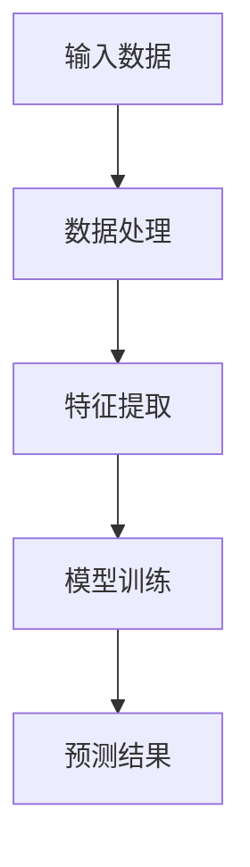
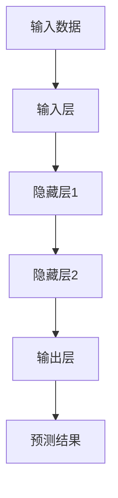

                 


### 设计智能化的个人投资者风险偏好动态评估工具

随着金融市场的日益复杂化和投资者需求的多样化，个人投资者如何准确评估和调整其风险偏好，以实现投资收益的最大化，成为了一个重要的研究课题。本文旨在设计一款智能化的个人投资者风险偏好动态评估工具，帮助投资者更好地理解和管理自身的投资风险。

## 第1章 问题背景与核心概念

### 1.1 问题的提出

在金融市场日益复杂化的背景下，投资者面临的决策风险不断增加。如何帮助个人投资者准确评估和调整其风险偏好，以实现投资收益的最大化，成为了一个亟待解决的问题。

### 1.2 核心概念

- **风险偏好**：指投资者在面对投资风险时，所表现出的态度和倾向。包括保守型、稳健型、平衡型、成长型等不同的投资风格。
- **动态评估**：指对投资者的风险偏好进行持续监测和调整，以适应市场变化和投资者自身情况的变化。

## 第2章 风险偏好评估方法

### 2.1 常规评估方法

- **问卷调查法**：通过设计问卷，了解投资者的风险偏好。
- **心理测试法**：通过心理测试，评估投资者的性格和心理特征。

### 2.2 智能化评估方法

- **机器学习方法**：利用历史数据，通过机器学习算法，对投资者的风险偏好进行预测和评估。
- **深度学习方法**：通过深度学习模型，对投资者的行为数据进行挖掘和分析，以识别其风险偏好。

## 第3章 智能化风险偏好评估工具设计

### 3.1 工具架构设计

- **数据收集与处理模块**：负责收集投资者的行为数据，并进行预处理。
- **风险评估模块**：利用机器学习算法，对投资者的风险偏好进行评估。
- **用户界面模块**：提供用户与工具交互的界面，展示评估结果和投资建议。

### 3.2 关键技术实现

- **数据预处理**：包括数据清洗、归一化、特征提取等。
- **风险评估算法**：包括决策树、支持向量机、神经网络等。

## 第4章 算法原理与数学模型

### 4.1 算法原理

- **机器学习算法**：通过训练数据集，学习得到一个预测模型。
- **深度学习算法**：通过多层神经网络，对数据进行特征提取和模型训练。

### 4.2 数学模型

- **决策树**：使用条件概率和熵来评估每个节点的分割效果。
- **支持向量机**：通过求解优化问题，找到最佳的超平面。

## 第5章 实际案例与项目实战

### 5.1 环境安装与配置

- **操作系统**：Ubuntu 20.04
- **编程语言**：Python 3.8
- **深度学习框架**：TensorFlow 2.5

### 5.2 系统核心实现

- **数据收集与处理**：使用pandas库进行数据处理。
- **风险评估**：使用scikit-learn库实现决策树和SVM算法。

### 5.3 代码应用解读与分析

- **决策树算法实现**：使用Python代码实现决策树算法。
- **SVM算法实现**：使用Python代码实现支持向量机算法。

### 5.4 实际案例分析

- **案例1**：分析某投资者的风险偏好。
- **案例2**：评估不同算法在风险评估中的表现。

## 第6章 最佳实践与注意事项

### 6.1 最佳实践

- **数据质量**：保证数据的准确性和完整性。
- **算法选择**：根据实际情况选择合适的算法。

### 6.2 注意事项

- **隐私保护**：确保投资者数据的隐私和安全。
- **持续更新**：定期更新评估工具，以适应市场变化。

## 第7章 小结与拓展阅读

### 7.1 小结

- 本书的总体内容概括。
- 风险偏好评估工具的重要性。

### 7.2 拓展阅读

- **相关书籍**：推荐一些关于风险偏好评估和机器学习的优秀书籍。
- **在线资源**：推荐一些相关的在线课程和论文。

---

### 核心概念与联系

#### 风险偏好

**定义**：风险偏好是指投资者在面对投资风险时所表现出的态度和倾向。

**属性**：

- **收益期望**：投资者对投资收益的期望值。
- **风险承受度**：投资者愿意承担的风险程度。

**对比表格**：

| 风险偏好类型 | 定义 | 收益期望 | 风险承受度 |
| :---: | :---: | :---: | :---: |
| 保守型 | 优先考虑本金的安全，对收益要求较低 | 低 | 低 |
| 稳健型 | 在保证本金安全的前提下，追求稳健收益 | 中等 | 中等 |
| 平衡型 | 在风险和收益之间寻找平衡 | 中等 | 中等 |
| 成长型 | 注重长期收益，愿意承担较高风险 | 高 | 高 |

**ER实体关系图**：

```mermaid
erDiagram
  Investor ||--|{ RiskPreference }
  RiskPreference ||--|{ RiskProfile }
```

### 算法原理

#### 机器学习算法

**原理**：通过训练数据集，学习得到一个预测模型。

**数学模型**：

$$
P(RiskProfile|Data) = \frac{P(Data|RiskProfile)P(RiskProfile)}{P(Data)}
$$

**流程图**：



#### 深度学习算法

**原理**：通过多层神经网络，对数据进行特征提取和模型训练。

**数学模型**：

$$
\sigma(z^{(l)}W^{(l)} + b^{(l)}) = a^{(l)}
$$

**流程图**：



---

通过上述章节的概述，我们为设计智能化的个人投资者风险偏好动态评估工具奠定了基础。接下来，我们将详细探讨每个章节的内容，逐步构建起这个工具的框架。请继续关注下一章节的深入讨论。

