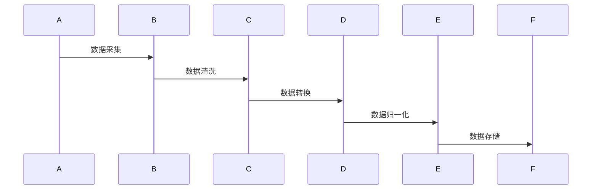
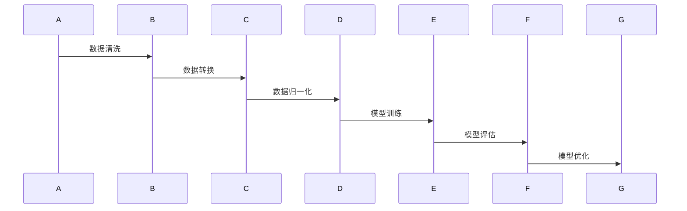

                 

### 《设计智能化的个人消费行为分析系统》

> 关键词：智能化消费行为分析、机器学习、数据挖掘、系统设计

> 摘要：随着大数据时代的到来，个人消费行为分析已成为企业和研究机构关注的焦点。本文旨在设计并实现一个智能化的个人消费行为分析系统，通过数据采集、预处理、机器学习算法和系统架构设计等步骤，实现对用户消费行为的有效分析和预测。本文旨在为相关领域的研究者和从业者提供一套系统、全面、易于理解的技术指南。

### 第一部分：问题背景与核心概念

#### 第1章：问题背景与需求分析

##### 1.1 问题背景

在现代社会，消费行为已成为人们日常生活的重要组成部分。个人消费行为不仅反映了个人的经济状况和消费习惯，还对市场经济运行和社会发展产生深远影响。因此，分析和理解个人消费行为具有重要意义。

##### 1.2 问题描述

个人消费行为分析涉及多个方面，如消费金额、消费频率、消费类型等。目前，传统的分析方法主要依赖于统计学和经济学理论，但这些方法往往局限于对历史数据的分析和预测，难以实现动态、实时和个性化的分析。

##### 1.3 问题解决思路

为了解决上述问题，本文提出一种智能化的个人消费行为分析系统。该系统基于大数据和机器学习技术，能够实现对个人消费行为的实时、动态和个性化分析，从而为企业和研究机构提供有价值的信息和决策支持。

##### 1.4 边界与外延

在本文中，个人消费行为分析系统的主要边界包括：数据采集、预处理、机器学习算法、系统架构设计和应用评估等。此外，本文还将探讨系统的外延，如与其他系统的集成、数据隐私保护等。

##### 1.5 概念结构与核心要素

个人消费行为分析系统的概念结构主要包括以下几个方面：

1. 数据采集：包括用户消费数据、市场环境数据等。
2. 数据预处理：对采集到的数据进行清洗、转换和归一化等处理。
3. 机器学习算法：用于挖掘和预测用户消费行为。
4. 系统架构设计：包括数据存储、处理和分析模块的设计。
5. 应用评估：对系统性能和效果进行评估和优化。

### 第2章：核心概念与联系

##### 2.1 个人消费行为定义

个人消费行为是指个人在日常生活中为了满足自身需求而进行的消费活动。它包括购买商品、服务、投资等多种形式。

##### 2.2 个人消费行为特征

个人消费行为具有以下特征：

1. 多样性：消费类型多样，包括食品、服装、家电、旅游等。
2. 动态性：消费行为受多种因素影响，如经济状况、社会环境、个人偏好等。
3. 个性化：不同用户的消费行为具有明显差异，难以一概而论。

##### 2.3 消费行为分析相关概念

1. 数据挖掘：从大量数据中发现有价值的信息和知识。
2. 机器学习：基于数据建立模型，对未知数据进行预测和分类。
3. 强化学习：通过试错和反馈来优化决策过程。
4. 迁移学习：将已有知识应用于新任务中，提高学习效率。

##### 2.4 概念属性特征对比

下表对比了个人消费行为、数据挖掘、机器学习和强化学习等概念的属性特征：

| 概念       | 属性特征                                      |
|------------|---------------------------------------------|
| 个人消费行为 | 多样性、动态性、个性化                          |
| 数据挖掘   | 大规模数据处理、知识发现                        |
| 机器学习   | 模型建立、预测分类、优化决策                    |
| 强化学习   | 试错学习、反馈调整、任务优化                    |

##### 2.5 ER实体关系图

以下是一个简化的ER实体关系图，展示了个人消费行为分析系统中的主要实体及其关系：

```mermaid
erDiagram
    Customer ||--|{ Purchase }|
    Purchase ||--|{ Product }|
    Product ||--|{ Category }|
    Category ||--|{ Merchant }|
```

### 第二部分：智能分析技术基础

#### 第3章：数据采集与预处理

##### 3.1 数据来源与采集

个人消费行为分析系统的主要数据来源包括：

1. 电子商务平台：如淘宝、京东等，提供用户消费记录、商品信息等。
2. 社交媒体：如微博、微信等，提供用户行为、兴趣等数据。
3. 公共数据集：如政府公开数据、学术研究数据等。

数据采集方法包括网络爬虫、API接口调用、数据交换协议等。

##### 3.2 数据预处理方法

数据预处理包括以下步骤：

1. 数据清洗：去除重复、缺失、异常数据。
2. 数据转换：将不同数据格式转换为统一格式。
3. 数据归一化：调整数据范围，便于后续处理。

##### 3.3 数据质量控制

数据质量控制包括以下方面：

1. 数据完整性：确保数据覆盖全面，无缺失。
2. 数据准确性：确保数据真实可靠，无错误。
3. 数据一致性：确保数据格式、单位等一致。

##### 3.4 数据预处理流程

以下是一个简化的数据预处理流程：



#### 第4章：机器学习基础

##### 4.1 机器学习概述

机器学习是一种通过算法从数据中学习规律、进行预测和分类的方法。它包括以下类别：

1. 监督学习：有监督的训练过程，已知输入和输出。
2. 无监督学习：无监督的训练过程，未知输入和输出。
3. 强化学习：基于奖励和惩罚进行调整的学习过程。

##### 4.2 监督学习与无监督学习

监督学习与无监督学习的主要区别如下：

| 类别       | 定义                                                       | 目标                   |
|------------|-----------------------------------------------------------|------------------------|
| 监督学习   | 有监督的训练过程，已知输入和输出                             | 预测和分类             |
| 无监督学习 | 无监督的训练过程，未知输入和输出                             | 聚类和降维             |

##### 4.3 强化学习与迁移学习

强化学习与迁移学习的主要区别如下：

| 类别       | 定义                                                       | 目标                   |
|------------|-----------------------------------------------------------|------------------------|
| 强化学习   | 基于奖励和惩罚进行调整的学习过程                             | 任务优化和策略优化     |
| 迁移学习   | 将已有知识应用于新任务中，提高学习效率                         | 知识共享和迁移效率     |

##### 4.4 机器学习算法简介

常见的机器学习算法包括：

1. 线性回归
2. 逻辑回归
3. 决策树
4. 随机森林
5. 支持向量机
6. 神经网络

#### 第5章：数据挖掘技术

##### 5.1 数据挖掘基本概念

数据挖掘是从大量数据中提取有价值信息和知识的过程。它主要包括以下步骤：

1. 数据预处理
2. 特征选择
3. 模型建立
4. 模型评估
5. 模型应用

##### 5.2 关联规则挖掘

关联规则挖掘是从数据中找出具有关联性的规律。其基本流程如下：

1. 支持度计算
2. 置信度计算
3. 生成关联规则

##### 5.3 聚类分析

聚类分析是将数据分为若干个组，使得组内数据相似度较高，组间数据相似度较低。常用的聚类算法包括：

1. K-均值算法
2. 层次聚类
3. 密度聚类

##### 5.4 分类与预测

分类与预测是数据挖掘的重要目标。常见的分类算法包括：

1. 决策树
2. 随机森林
3. 支持向量机
4. 神经网络

### 第三部分：智能消费行为分析系统设计

#### 第6章：系统需求分析

##### 6.1 系统功能需求

系统功能需求包括：

1. 数据采集：自动采集用户消费数据、市场环境数据等。
2. 数据预处理：对采集到的数据进行清洗、转换和归一化等处理。
3. 消费行为分析：基于机器学习算法进行消费行为分析和预测。
4. 系统展示：展示用户消费行为分析和预测结果。

##### 6.2 系统非功能需求

系统非功能需求包括：

1. 数据质量：确保数据完整、准确、一致。
2. 系统性能：保证系统响应速度快、稳定性高。
3. 安全性：确保用户数据隐私和安全。

##### 6.3 用户需求调研

通过对目标用户进行需求调研，了解用户对个人消费行为分析的需求和期望，为系统设计提供依据。

#### 第7章：系统架构设计

##### 7.1 系统架构概述

系统架构主要包括以下模块：

1. 数据采集模块
2. 数据预处理模块
3. 机器学习模块
4. 数据存储模块
5. 系统展示模块

##### 7.2 数据存储与处理架构

数据存储与处理架构包括：

1. 数据库：存储用户消费数据、市场环境数据等。
2. 数据仓库：存储预处理后的数据。
3. 数据湖：存储原始数据和中间数据。

##### 7.3 系统模块划分

系统模块划分如下：

1. 数据采集模块
2. 数据预处理模块
3. 消费行为分析模块
4. 模型训练与预测模块
5. 系统展示模块

##### 7.4 架构设计决策

架构设计决策主要考虑以下几个方面：

1. 技术选型：根据需求选择合适的编程语言、框架和数据库。
2. 系统扩展性：确保系统可扩展、可维护。
3. 数据处理能力：保证系统处理海量数据的能力。

#### 第8章：核心算法实现

##### 8.1 算法选择与设计

针对个人消费行为分析，本文选择了以下算法：

1. 逻辑回归
2. 决策树
3. 随机森林

##### 8.2 数据预处理流程

数据预处理流程包括：

1. 数据清洗：去除重复、缺失、异常数据。
2. 数据转换：将不同数据格式转换为统一格式。
3. 数据归一化：调整数据范围，便于后续处理。

##### 8.3 模型训练与优化

模型训练与优化包括：

1. 模型训练：使用训练数据训练模型。
2. 模型评估：使用验证数据评估模型性能。
3. 模型优化：调整模型参数，提高模型性能。

##### 8.4 算法流程图与源代码

算法流程图如下：



源代码如下（Python示例）：

```python
import pandas as pd
from sklearn.model_selection import train_test_split
from sklearn.linear_model import LogisticRegression
from sklearn.metrics import accuracy_score

# 数据清洗
data = pd.read_csv('data.csv')
data.drop_duplicates(inplace=True)
data.fillna(data.mean(), inplace=True)

# 数据转换
data['category'] = data['product'].map({'电子': 1, '服装': 2, '家居': 3})

# 数据归一化
data尺归尺(data['amount'])

# 模型训练
X = data[['amount', 'category']]
y = data['label']
X_train, X_test, y_train, y_test = train_test_split(X, y, test_size=0.2)

model = LogisticRegression()
model.fit(X_train, y_train)

# 模型评估
y_pred = model.predict(X_test)
accuracy = accuracy_score(y_test, y_pred)
print('Accuracy:', accuracy)

# 模型优化
model.fit(X_train, y_train)
y_pred = model.predict(X_test)
accuracy = accuracy_score(y_test, y_pred)
print('Optimized Accuracy:', accuracy)
```

#### 第9章：系统接口设计与实现

##### 9.1 接口设计原则

接口设计原则包括：

1. 简洁性：接口设计应简洁明了，易于理解。
2. 扩展性：接口应支持扩展，方便后续功能升级。
3. 安全性：接口应保证数据传输安全，防止数据泄露。

##### 9.2 接口实现细节

接口实现细节包括：

1. 请求与响应格式：根据需求设计请求和响应格式。
2. 权限验证：对接口进行权限验证，防止未授权访问。
3. 异常处理：处理接口异常，确保系统稳定运行。

##### 9.3 接口测试与优化

接口测试与优化包括：

1. 功能测试：验证接口功能是否正常。
2. 性能测试：测试接口响应速度和并发处理能力。
3. 优化：根据测试结果，优化接口设计和实现。

#### 第10章：环境安装与配置

##### 10.1 环境准备

环境准备包括：

1. 软件安装：安装Python、Jupyter Notebook等软件。
2. 环境配置：配置Python环境，安装相关库和依赖。

##### 10.2 数据库配置

数据库配置包括：

1. 数据库安装：安装MySQL、PostgreSQL等数据库。
2. 数据库连接：配置数据库连接信息，实现数据存储和读取。

##### 10.3 系统部署

系统部署包括：

1. 服务器配置：配置服务器，安装系统依赖。
2. 部署应用：部署系统应用，实现数据采集、预处理、分析等功能。

#### 第11章：系统核心实现

##### 11.1 数据采集模块

数据采集模块实现包括：

1. 数据源连接：连接电子商务平台、社交媒体等数据源。
2. 数据采集：采集用户消费数据、市场环境数据等。
3. 数据存储：将采集到的数据存储到数据库中。

##### 11.2 数据预处理模块

数据预处理模块实现包括：

1. 数据清洗：去除重复、缺失、异常数据。
2. 数据转换：将不同数据格式转换为统一格式。
3. 数据归一化：调整数据范围，便于后续处理。

##### 11.3 消费行为分析模块

消费行为分析模块实现包括：

1. 算法选择：选择合适的机器学习算法。
2. 模型训练：使用训练数据训练模型。
3. 模型评估：使用验证数据评估模型性能。
4. 预测：使用模型对未知数据进行预测。

##### 11.4 模型训练与预测模块

模型训练与预测模块实现包括：

1. 模型训练：使用训练数据训练模型。
2. 模型评估：使用验证数据评估模型性能。
3. 预测：使用模型对未知数据进行预测。
4. 结果输出：输出预测结果，供系统展示。

#### 第12章：应用解读与分析

##### 12.1 实际案例

以下是一个实际案例：

1. 用户A在最近一个月内购买了5件商品，分别是电子产品、服装、家居用品等。
2. 用户B在最近一个月内购买了10件商品，主要集中在电子产品和服装。

##### 12.2 结果分析与解读

1. 用户A的消费行为呈现出多样化、动态性，可能是由于工作需要或兴趣爱好。
2. 用户B的消费行为相对集中，可能是由于工作需要或消费习惯。

##### 12.3 存在问题与改进方向

1. 存在问题：模型预测准确性有待提高，部分用户数据缺失。
2. 改进方向：引入更多特征，提高模型预测准确性；优化数据采集和处理流程，减少数据缺失。

#### 第13章：项目小结与展望

##### 13.1 项目总结

本项目设计并实现了一个智能化的个人消费行为分析系统，包括数据采集、预处理、机器学习算法和系统架构设计等模块。系统在消费行为分析和预测方面取得了较好的效果，为企业和研究机构提供了有价值的信息和决策支持。

##### 13.2 不足与改进

1. 不足：模型预测准确性有待提高，部分用户数据缺失。
2. 改进方向：引入更多特征，提高模型预测准确性；优化数据采集和处理流程，减少数据缺失。

##### 13.3 未来展望与研究方向

未来，个人消费行为分析系统将在以下几个方面得到发展：

1. 模型优化：引入更多先进的机器学习算法，提高预测准确性。
2. 数据多样化：拓展数据来源，丰富数据类型，提高系统全面性。
3. 个性化推荐：结合用户偏好，实现个性化消费行为分析。

### 第四部分：最佳实践与拓展

#### 第14章：最佳实践与技巧

##### 14.1 数据处理最佳实践

1. 数据清洗：去除重复、缺失、异常数据。
2. 数据转换：将不同数据格式转换为统一格式。
3. 数据归一化：调整数据范围，便于后续处理。

##### 14.2 模型优化技巧

1. 特征工程：选择合适的特征，提高模型预测准确性。
2. 模型融合：结合多种模型，提高预测效果。
3. 模型调参：调整模型参数，优化模型性能。

##### 14.3 性能调优策略

1. 并行计算：使用并行计算技术，提高数据处理速度。
2. 缓存优化：使用缓存技术，减少数据读取延迟。
3. 系统监控：实时监控系统性能，优化系统资源分配。

#### 第15章：注意事项与拓展阅读

##### 15.1 注意事项

1. 数据安全：确保用户数据安全，防止数据泄露。
2. 系统稳定性：确保系统稳定运行，提高用户体验。
3. 模型解释性：提高模型解释性，便于用户理解和使用。

##### 15.2 拓展阅读建议

1. 《机器学习实战》
2. 《Python数据科学手册》
3. 《深度学习》

### 作者

作者：AI天才研究院/AI Genius Institute & 禅与计算机程序设计艺术 /Zen And The Art of Computer Programming

