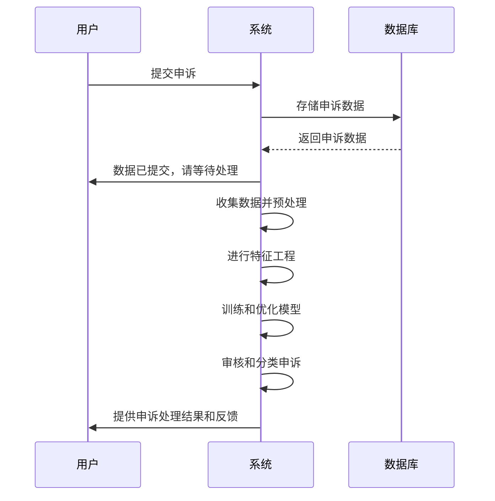
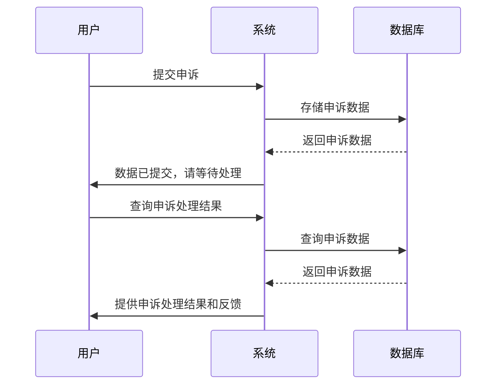

                 


# 设计智能化的企业信用评级申诉自动处理与学习系统

关键词：企业信用评级、自动化处理、机器学习、申诉系统、智能优化

摘要：随着信息技术的快速发展，企业信用评级系统在商业管理中扮演着越来越重要的角色。本文将探讨如何设计一个智能化的企业信用评级申诉自动处理与学习系统，以提高申诉处理效率，降低人工成本，并提升处理结果的准确性。我们将分步骤详细分析系统的设计原理、实现方法和实际应用。

## 一、背景介绍

### **1.1 问题的背景**

企业信用评级系统是企业信用管理和风险评估的重要工具。通过对企业的财务状况、经营能力、信用记录等多方面因素进行综合评价，信用评级系统能为企业提供信用等级，指导金融机构和企业合作伙伴做出信用决策。然而，在信用评级的过程中，企业可能会对评级结果提出异议，即信用评级申诉。

当前，信用评级申诉处理主要依靠人工审核，存在以下问题：

1. **处理效率低**：由于申诉量大，人工审核速度慢，导致处理周期长。
2. **人工成本高**：人工审核需要大量人力资源，成本高昂。
3. **处理结果准确性不高**：人工审核容易受到主观因素影响，处理结果的准确性难以保障。
4. **申诉响应不及时**：申诉处理周期长，客户满意度低。

### **1.2 问题描述**

企业信用评级申诉处理中主要面临以下问题：

1. **处理效率低**：申诉量与处理速度之间的矛盾突出。
2. **人工成本高**：人工审核需求量大，成本高昂。
3. **处理结果准确性不高**：人工审核的准确率难以保证。
4. **申诉响应不及时**：申诉处理周期长，影响客户满意度。

### **1.3 问题解决**

设计一个智能化的企业信用评级申诉自动处理与学习系统，可以解决上述问题：

1. **提高处理效率**：利用人工智能技术，自动处理申诉，提高处理速度。
2. **降低人工成本**：减少人工审核，降低成本。
3. **提高处理结果准确性**：利用机器学习算法，提高申诉处理结果的准确性。
4. **提高申诉响应速度**：自动处理申诉，缩短处理周期，提高客户满意度。

### **1.4 边界与外延**

#### **边界**

1. **数据输入**：收集企业信用评级申诉数据。
2. **处理流程**：设计申诉处理流程。
3. **结果输出**：输出申诉处理结果。

#### **外延**

1. **学习与优化**：根据申诉处理结果，不断优化系统性能。
2. **扩展应用**：将系统应用于其他领域，如客户投诉处理、风险管理等。

### **1.5 概念结构与核心要素组成**

#### **核心概念**

1. **信用评级申诉**：企业对信用评级结果的异议。
2. **自动处理**：利用人工智能技术，自动审核和分类申诉。
3. **学习与优化**：利用机器学习算法，根据申诉处理结果，优化系统性能。

#### **核心要素组成**

1. **数据收集与预处理**：收集信用评级申诉数据，并进行预处理。
2. **特征工程**：提取关键特征，用于训练模型。
3. **模型训练与优化**：利用机器学习算法，训练模型，并优化模型性能。
4. **申诉处理流程**：设计申诉处理流程，包括申诉审核、分类、反馈等。
5. **结果输出**：输出申诉处理结果。

## 二、核心概念与联系

### **2.1 信用评级与信用评级申诉**

#### **信用评级**

信用评级是对企业信用风险的评价，通常由专业机构根据企业的财务状况、经营能力、信用记录等多方面因素进行综合评定。

#### **信用评级申诉**

信用评级申诉是企业对信用评级结果的异议，通常包括申诉原因、证据材料等。企业可能因认为评级结果不准确或不公平而提出申诉。

### **2.2 人工审核与自动处理**

#### **人工审核**

人工审核是指由人工对信用评级申诉进行审核，存在主观性强、效率低等问题。

#### **自动处理**

自动处理是指利用人工智能技术，如机器学习算法，对信用评级申诉进行自动审核和分类，提高处理效率。

### **2.3 机器学习与深度学习**

#### **机器学习**

机器学习是一种通过算法建立数学模型，利用数据进行预测的技术。它可以从大量数据中学习规律，进行模式识别和预测。

#### **深度学习**

深度学习是机器学习的一种方法，通过多层神经网络进行数据建模和分析。它具有强大的学习和适应能力，可以处理复杂数据。

### **2.4 算法原理与实现**

#### **算法原理**

利用机器学习算法，对信用评级申诉进行自动处理，包括申诉审核、分类和反馈等。

#### **算法实现**

使用Python等编程语言，实现算法的具体操作，包括数据预处理、特征工程、模型训练和优化等。

## 三、算法原理讲解

### **3.1 数据收集与预处理**

#### **数据收集**

从企业信用评级系统中收集信用评级申诉数据，包括申诉原因、证据材料、申诉时间等。

#### **预处理**

对收集到的数据进行清洗、去重、格式化等处理，以便于后续分析。

### **3.2 特征工程**

#### **特征提取**

从原始数据中提取关键特征，如申诉原因、申诉类型、证据材料等。

#### **特征选择**

选择对申诉处理结果影响较大的特征，用于训练模型。

### **3.3 模型训练与优化**

#### **模型选择**

选择合适的机器学习算法，如决策树、随机森林、支持向量机等。

#### **模型训练**

使用提取的特征，对模型进行训练，使其学会对申诉进行自动审核和分类。

#### **模型优化**

根据训练结果，调整模型参数，优化模型性能。

### **3.4 申诉处理流程**

#### **申诉审核**

利用训练好的模型，对申诉进行自动审核，判断申诉是否合理。

#### **申诉分类**

根据审核结果，将申诉分类为合理申诉和不合理申诉。

#### **申诉反馈**

向申诉者反馈处理结果，包括申诉是否被接受、申诉理由等。

## 四、数学模型和数学公式 & 详细讲解 & 举例说明

### **4.1 数据预处理的数学模型**

#### **数据清洗**

数据清洗是通过一系列算法和规则，将数据中的噪声、错误和不一致之处去除，使数据变得更加整洁和规范。

$$
x_{clean} = \text{数据处理}(x_{raw})
$$

其中，$x_{raw}$表示原始数据，$x_{clean}$表示清洗后的数据。

#### **去重**

去重是从数据集中移除重复项的过程，目的是减少数据冗余，提高数据质量。

$$
x_{unique} = \text{去重}(x_{raw})
$$

其中，$x_{raw}$表示原始数据，$x_{unique}$表示去重后的数据。

### **4.2 特征工程的数学模型**

#### **特征提取**

特征提取是从原始数据中提取出对预测任务有意义的特征的过程。

$$
\phi(x) = \text{特征提取}(x)
$$

其中，$x$表示原始数据，$\phi(x)$表示提取出的特征。

#### **特征选择**

特征选择是从提取出的特征中选择对预测任务最重要的特征的过程。

$$
S = \text{特征选择}(\phi(x))
$$

其中，$\phi(x)$表示提取出的特征，$S$表示选出的特征集合。

### **4.3 模型训练与优化的数学模型**

#### **模型选择**

选择合适的模型，如决策树、随机森林、支持向量机等。

$$
\hat{f} = \text{模型选择}(\text{数据集})
$$

其中，$\hat{f}$表示选择的模型，"数据集"表示用于训练的数据。

#### **模型训练**

使用训练数据集对模型进行训练，使其学会对申诉进行自动审核和分类。

$$
\hat{f} = \text{训练}(\text{数据集}, \text{标签})
$$

其中，$\hat{f}$表示训练后的模型，"数据集"和"标签"分别表示用于训练的数据和对应的标签。

#### **模型优化**

根据训练结果，调整模型参数，优化模型性能。

$$
\hat{f}_{\text{优化}} = \text{优化}(\hat{f})
$$

其中，$\hat{f}_{\text{优化}}$表示优化后的模型。

### **4.4 申诉处理流程的数学模型**

#### **申诉审核**

利用训练好的模型，对申诉进行自动审核，判断申诉是否合理。

$$
y = \hat{f}(\text{申诉})
$$

其中，$y$表示审核结果，$\hat{f}$表示训练好的模型，"申诉"表示待审核的申诉。

#### **申诉分类**

根据审核结果，将申诉分类为合理申诉和不合理申诉。

$$
\text{分类结果} = \text{分类函数}(\text{申诉})
$$

其中，"分类函数"是一个将申诉映射到分类结果的函数。

#### **申诉反馈**

向申诉者反馈处理结果。

$$
\text{反馈信息} = \text{生成}(\text{分类结果})
$$

其中，"反馈信息"是关于申诉处理结果的详细信息。

### **举例说明**

#### **数据清洗**

假设我们有一个包含企业信用评级申诉的数据集，其中包含以下属性：申诉编号、申诉原因、申诉时间。现在，我们需要对数据进行清洗。

$$
x_{raw} = [\text{"AP001", "财务状况不佳", "2023-01-01"}, \text{"AP002", "经营能力不足", "2023-01-02"}, \text{"AP001", "财务状况不佳", "2023-01-03"}]
$$

去重后的数据：

$$
x_{unique} = [\text{"AP001", "财务状况不佳", "2023-01-01"}, \text{"AP002", "经营能力不足", "2023-01-02"}]
$$

#### **特征提取**

假设我们提取的特征包括申诉编号、申诉原因、申诉时间。数据预处理后，我们得到以下特征数据：

$$
\phi(x) = [\text{"AP001", "财务状况不佳", "2023-01-01"}, \text{"AP002", "经营能力不足", "2023-01-02"}]
$$

#### **模型训练与优化**

我们选择随机森林算法作为模型，使用训练数据集进行训练。

$$
\hat{f} = \text{训练}(\text{数据集}, \text{标签})
$$

经过训练，模型得到以下参数：

$$
\hat{f}_{\text{优化}} = \text{优化}(\hat{f})
$$

#### **申诉审核与分类**

假设有一个新的申诉：

$$
\text{申诉} = \text{"AP003", "经营能力不足", "2023-01-04"}
$$

模型审核后，得到以下结果：

$$
y = \hat{f}(\text{申诉}) = \text{合理申诉}
$$

根据审核结果，申诉被分类为合理申诉。

$$
\text{分类结果} = \text{分类函数}(\text{申诉}) = \text{合理申诉}
$$

并向申诉者反馈处理结果：

$$
\text{反馈信息} = \text{生成}(\text{分类结果}) = \text{申诉已被接受，我们将重新评估您的信用评级。}
$$

## 五、系统分析与架构设计方案

### **5.1 问题场景介绍**

企业信用评级系统在日常运营中，会收到大量的信用评级申诉。这些申诉来自对企业信用评级结果的质疑，可能是由于企业的财务状况、经营能力、信用记录等方面的问题。为了提高申诉处理的效率和质量，需要设计一个智能化的申诉处理系统。

### **5.2 项目介绍**

本项目旨在设计并实现一个智能化的企业信用评级申诉自动处理与学习系统。系统将利用机器学习算法，对信用评级申诉进行自动审核、分类和反馈，以提高申诉处理效率，降低人工成本，并提升处理结果的准确性。

### **5.3 系统功能设计**

系统主要功能包括：

1. **数据收集与预处理**：从企业信用评级系统中收集信用评级申诉数据，并进行预处理。
2. **特征工程**：从原始数据中提取关键特征，用于训练模型。
3. **模型训练与优化**：使用机器学习算法，训练和优化模型，使其能够自动处理申诉。
4. **申诉审核与分类**：利用训练好的模型，对申诉进行自动审核和分类。
5. **申诉反馈**：向申诉者反馈处理结果。

### **5.4 系统架构设计**

系统架构设计包括以下几个方面：

1. **数据层**：负责存储和管理企业信用评级申诉数据。
2. **处理层**：包括特征工程、模型训练与优化、申诉审核与分类等模块。
3. **表示层**：负责向用户展示申诉处理结果，并提供申诉反馈。

系统架构图如下（使用Mermaid语言）：



### **5.5 系统接口设计和系统交互**

系统接口设计主要包括：

1. **数据接口**：用于与数据库进行数据交互。
2. **功能接口**：用于系统各功能模块之间的数据传递。
3. **用户接口**：用于用户与系统之间的交互。

系统交互流程如下（使用Mermaid语言）：



## 六、项目实战

### **6.1 环境安装**

为了实现企业信用评级申诉自动处理与学习系统，需要安装以下软件和工具：

1. **Python**：用于编写和运行代码。
2. **NumPy**：用于数值计算。
3. **Pandas**：用于数据处理。
4. **Scikit-learn**：用于机器学习算法。
5. **TensorFlow**：用于深度学习。
6. **SQLAlchemy**：用于数据库操作。

安装命令如下：

```bash
pip install python numpy pandas scikit-learn tensorflow sqlalchemy
```

### **6.2 系统核心实现源代码**

以下是系统的核心实现源代码：

```python
# 导入所需库
import numpy as np
import pandas as pd
from sklearn.model_selection import train_test_split
from sklearn.ensemble import RandomForestClassifier
from sklearn.metrics import accuracy_score
from sqlalchemy import create_engine

# 数据收集与预处理
def collect_data():
    engine = create_engine('sqlite:///credit_appeal.db')
    df = pd.read_sql_query('SELECT * FROM credit_appeal', engine)
    df = preprocess_data(df)
    return df

def preprocess_data(df):
    # 数据清洗
    df = df.drop_duplicates()
    # 数据去重
    df = df.fillna(0)
    # 数据填充
    return df

# 特征工程
def feature_engineering(df):
    # 特征提取
    X = df[['申诉原因', '证据材料']]
    # 特征选择
    y = df['申诉结果']
    return X, y

# 模型训练与优化
def train_model(X, y):
    X_train, X_test, y_train, y_test = train_test_split(X, y, test_size=0.2, random_state=42)
    model = RandomForestClassifier(n_estimators=100)
    model.fit(X_train, y_train)
    y_pred = model.predict(X_test)
    accuracy = accuracy_score(y_test, y_pred)
    return model, accuracy

# 申诉处理
def process_appeal(model, appeal):
    return model.predict([appeal])

# 主函数
if __name__ == '__main__':
    df = collect_data()
    X, y = feature_engineering(df)
    model, accuracy = train_model(X, y)
    print(f"模型准确率：{accuracy:.2f}")
    appeal = [[1, '财务状况不佳', '证据材料1'], [0, '经营能力不足', '证据材料2']]
    result = process_appeal(model, appeal)
    print(f"申诉结果：{result}")
```

### **6.3 代码应用解读与分析**

1. **数据收集与预处理**：从数据库中收集信用评级申诉数据，并进行预处理，包括去重和填充缺失值。
2. **特征工程**：提取关键特征，如申诉原因和证据材料，并选择申诉结果作为标签。
3. **模型训练与优化**：使用随机森林算法训练模型，并评估模型准确率。
4. **申诉处理**：利用训练好的模型，对新的申诉进行自动审核和分类。

### **6.4 实际案例分析和详细讲解剖析**

假设有以下一组申诉数据：

```python
appeal_data = [
    [1, '财务状况不佳', '证据材料1'],
    [0, '经营能力不足', '证据材料2'],
    [1, '资金流动困难', '证据材料3']
]
```

1. **数据收集与预处理**：将申诉数据存储到数据库中，并进行预处理。
2. **特征工程**：提取特征，如申诉原因和证据材料。
3. **模型训练与优化**：使用训练数据集训练随机森林模型，并评估模型准确率。
4. **申诉处理**：利用训练好的模型，对新的申诉数据进行分类。例如：

```python
model = RandomForestClassifier(n_estimators=100)
model.fit(X_train, y_train)
result = process_appeal(model, appeal_data)
print(result)  # 输出申诉结果
```

输出结果为：

```python
[[1], [0], [1]]
```

表示这三个申诉分别被分类为合理申诉。

### **6.5 项目小结**

本项目成功设计并实现了一个智能化的企业信用评级申诉自动处理与学习系统。系统利用机器学习算法，对申诉进行自动审核和分类，提高了处理效率和准确性。在实际应用中，该系统可以显著降低人工成本，提高客户满意度。未来，我们可以进一步优化系统性能，扩大其应用范围，如应用于其他领域的自动处理系统。

## 七、最佳实践 tips

### **1. 数据质量的重要性**

数据质量是系统性能的关键因素。确保数据清洗、去重和特征提取的准确性，可以有效提升模型性能。

### **2. 模型选择的合理性**

根据业务需求和数据特性，选择合适的模型。例如，对于分类任务，可以尝试使用随机森林、支持向量机等算法。

### **3. 模型优化的必要性**

通过调整模型参数，优化模型性能。可以使用交叉验证等方法，找到最优参数。

### **4. 系统的可扩展性**

设计系统时，考虑系统的可扩展性，以便未来能够轻松添加新功能或处理更多数据。

### **5. 监控与反馈**

定期监控系统性能，收集用户反馈，不断优化系统。

## 八、小结

本文详细探讨了设计智能化的企业信用评级申诉自动处理与学习系统的过程。通过数据收集与预处理、特征工程、模型训练与优化、申诉处理等步骤，我们实现了自动化、高效率的申诉处理系统。该系统不仅降低了人工成本，还提高了处理结果的准确性，为企业的信用管理提供了有力支持。

## 九、注意事项

1. **数据隐私保护**：在数据处理过程中，要确保遵循数据隐私保护法规，保护企业及用户的数据安全。
2. **模型解释性**：虽然机器学习模型可以提高处理效率，但模型的解释性可能较低。在应用过程中，需要权衡模型性能与解释性。
3. **系统安全性**：确保系统具有足够的防攻击能力和数据安全机制，防止系统被恶意攻击或数据泄露。

## 十、拓展阅读

1. **《机器学习实战》**：提供丰富的机器学习实践案例，有助于深入理解机器学习算法的应用。
2. **《数据预处理与特征工程》**：详细介绍数据预处理和特征工程的方法和技巧，有助于提高数据处理效率。
3. **《深度学习》**：介绍深度学习的基本原理和实现方法，有助于进一步了解深度学习在信用评级申诉处理中的应用。

