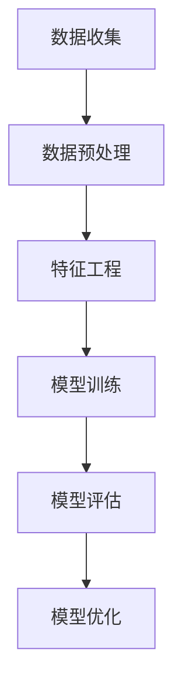
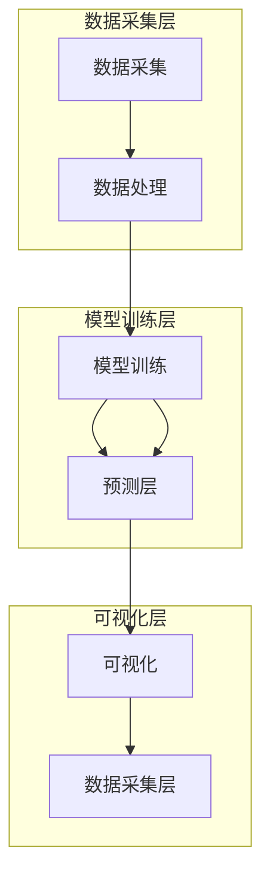
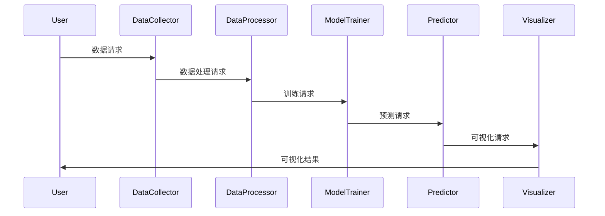
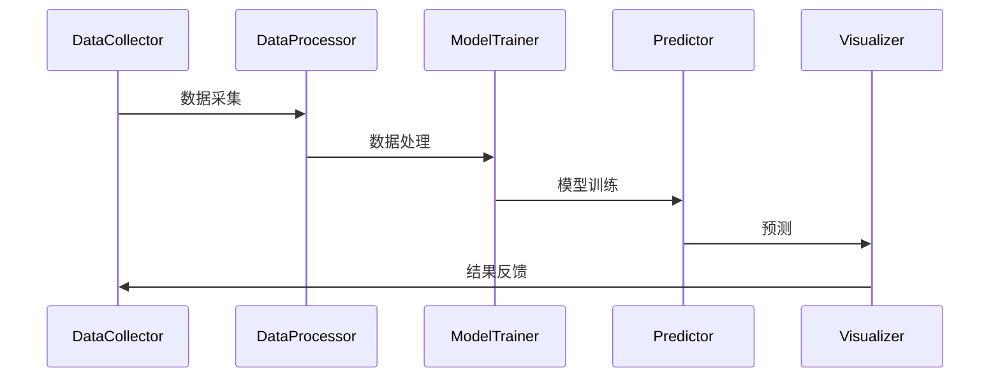

                 

### 第1章：企业信用违约恢复率问题的背景与重要性

#### 1.1.1 问题背景

在企业运营过程中，信用违约是一种常见但严重影响企业稳定性的问题。信用违约指的是企业在约定时间内未能履行还款责任，导致债权人无法收回贷款或获得预期收益。这类事件不仅对债权人造成财务损失，还会影响企业的信用评级，进一步增加融资成本和运营风险。

随着市场经济的不断发展，企业间借贷、投资等活动日益频繁，信用违约问题逐渐凸显。特别是在经济下行周期，企业资金链紧张，违约风险加剧。传统金融机构和企业对信用违约问题的应对措施往往滞后，缺乏对违约风险的早期预警和有效干预手段，导致违约事件频发。

#### 1.1.2 企业信用违约问题的定义

企业信用违约，指的是企业在履行合同过程中未能按时支付债务或未能完成约定交易的行为。具体包括以下几个方面：

1. **逾期还款**：企业未能在贷款到期日还清本金和利息。
2. **欠款不还**：企业明确表示无法偿还贷款，甚至逃避债务。
3. **交易违约**：企业在买卖交易中未按照合同要求交付商品或提供服务。
4. **合同违约**：企业在合同履行过程中违反合同条款，导致合同无法履行。

信用违约不仅对债权人造成直接经济损失，还可能引发一系列连锁反应，如金融机构信贷风险上升、企业信用评级下降、市场信心受挫等。

#### 1.1.3 违约恢复率的意义

违约恢复率，是指违约企业在一定期限内恢复偿债能力的比例。这一指标对金融机构和企业都具有重要的参考价值。

**对金融机构而言**：

- **风险评估**：违约恢复率可以作为风险评估的重要指标，帮助金融机构在贷款审批和贷后管理中做出更科学的决策。
- **风险控制**：了解违约恢复率有助于金融机构制定针对性的风险控制策略，降低不良资产比例。
- **收益预测**：通过分析违约恢复率，金融机构可以预测未来潜在的收入，为投资决策提供依据。

**对企业而言**：

- **信用重建**：违约企业通过提高违约恢复率，表明其有能力偿还债务，有助于重建信用，恢复市场信心。
- **融资便利**：高违约恢复率可以降低企业的融资成本，提高融资成功概率。
- **经营改善**：违约恢复率提升表明企业运营状况有所改善，有助于企业制定更合理的经营策略。

#### 1.1.4 企业信用违约问题的现状分析

当前，企业信用违约问题在全球范围内都存在。不同地区和行业违约问题的严重程度有所不同，但总体呈现出以下趋势：

1. **违约事件频发**：全球经济增长放缓、市场竞争加剧等因素导致企业违约事件频繁发生。
2. **行业风险集中**：一些高风险行业，如房地产业、制造业等，违约现象尤为突出。
3. **地区差异明显**：经济发达地区违约风险相对较低，而发展中国家和地区违约问题较为严重。
4. **违约类型多样化**：除了传统贷款违约，信用卡违约、供应链金融违约等现象也逐渐增多。

#### 1.1.5 违约恢复率研究的重要性

违约恢复率的研究对于金融机构和企业具有重要意义。通过深入研究违约恢复率，可以：

- **提高风险预测能力**：准确预测违约恢复率有助于金融机构和企业提前识别潜在风险，采取预防措施。
- **优化信贷管理**：金融机构可以根据违约恢复率制定更合理的信贷审批和贷后管理策略，降低风险。
- **提升经营效率**：企业通过提升违约恢复率，可以改善财务状况，提高市场竞争力。
- **促进经济发展**：降低违约率有助于维护金融市场稳定，促进经济持续健康发展。

综上所述，企业信用违约恢复率问题不仅关系到金融机构和企业的利益，也对社会经济发展具有重要影响。因此，深入研究和构建智能化的企业信用违约恢复率动态预测模型具有重要意义。在接下来的章节中，我们将进一步探讨智能化动态预测模型的基本概念及其应用，为企业信用违约问题的解决提供新的思路和方法。### 第2章：智能化动态预测模型的基本概念

#### 2.1.1 智能化预测模型的概念

智能化动态预测模型是一种基于人工智能技术和数据分析方法的预测模型，它通过模拟和模仿人类智能行为，对大量数据进行挖掘和分析，从而预测未来可能发生的事件或趋势。这类模型的核心在于利用机器学习算法，从历史数据中学习规律，并通过模型优化和调整，提高预测的准确性和稳定性。

智能化动态预测模型与传统的统计模型相比，具有以下特点：

1. **自适应性强**：智能化动态预测模型能够根据新数据自动调整和优化，适应不断变化的环境和业务需求。
2. **高精度**：利用先进的算法和大数据技术，智能化动态预测模型能够捕捉复杂的数据关系，提高预测的准确性。
3. **实时性**：智能化动态预测模型可以实现实时预测，为金融机构和企业提供及时的风险预警和决策支持。

#### 2.1.2 动态预测模型的特点

动态预测模型，是指能够根据时间序列数据变化进行实时预测的模型。其主要特点包括：

1. **时间敏感性**：动态预测模型能够捕捉数据随时间变化的特点，从而更准确地预测未来趋势。
2. **适应性**：动态预测模型能够根据数据变化调整预测参数，使其适应不同时间段和业务环境。
3. **灵活性**：动态预测模型可以结合多种数据源，如时间序列数据、历史数据、外部数据等，提供更全面的预测结果。

动态预测模型在金融、市场营销、供应链管理等领域具有广泛的应用，能够帮助企业实时了解市场动态，制定科学的决策策略。

#### 2.1.3 智能化动态预测模型的应用领域

智能化动态预测模型在多个领域都展现出了强大的应用潜力，以下是几个主要的应用领域：

1. **金融行业**：在金融领域，智能化动态预测模型可以用于信用风险评估、投资组合管理、市场趋势预测等。例如，通过分析企业财务数据、市场环境、经济指标等，预测企业信用违约的可能性，从而制定有效的信贷政策。
   
2. **市场营销**：在市场营销领域，动态预测模型可以帮助企业预测客户需求、分析市场趋势，优化营销策略。通过分析消费者行为数据、社交媒体互动等，预测未来市场动态，为企业提供精准的营销建议。

3. **供应链管理**：在供应链管理中，动态预测模型可以优化库存管理、需求预测、供应链优化等。通过预测供应链各环节的需求变化，及时调整生产和供应策略，提高供应链的响应速度和灵活性。

4. **医疗健康**：在医疗健康领域，动态预测模型可以用于疾病预测、流行病监测等。通过分析历史病例数据、健康指标等，预测疾病发生的概率和传播趋势，为公共卫生决策提供科学依据。

#### 2.1.4 智能化动态预测模型的优势

智能化动态预测模型相比传统预测方法，具有以下优势：

1. **高效性**：利用机器学习和大数据技术，智能化动态预测模型能够快速处理和分析大量数据，提供高效预测结果。
2. **精准性**：通过学习历史数据和挖掘潜在关系，智能化动态预测模型能够提供高精度的预测结果，降低预测误差。
3. **实时性**：智能化动态预测模型可以实现实时预测，及时为企业提供决策支持，提高业务响应速度。
4. **适应性**：智能化动态预测模型能够根据新数据和环境变化自动调整和优化，适应不同业务场景和需求。

综上所述，智能化动态预测模型在应对复杂、动态的业务环境方面具有显著优势。在接下来的章节中，我们将进一步探讨智能化动态预测模型的核心概念及其与企业信用违约恢复率之间的联系。通过深入理解这些核心概念，我们将为构建智能化的企业信用违约恢复率动态预测模型奠定坚实的基础。### 第3章：核心概念与联系

#### 3.1.1 关键概念介绍

在本章节中，我们将介绍构建智能化动态预测模型所需的关键概念，包括企业信用评级体系、违约风险模型和动态预测算法。

##### 3.1.1.1 企业信用评级体系

企业信用评级体系是一种评估企业信用状况和违约风险的系统方法。评级体系通常由评级机构根据企业的财务状况、经营管理能力、偿债能力、市场环境等因素进行评估。评级结果通常分为多个等级，如AAA、AA、A、BBB等，等级越高，代表企业信用状况越好，违约风险越低。

企业信用评级体系的主要目的是为金融机构、投资者和其他利益相关方提供信用参考，帮助他们评估企业信用风险，制定相应的风险管理和投资策略。

##### 3.1.1.2 违约风险模型

违约风险模型是一种用于预测企业是否会发生违约的数学模型。这类模型通过分析企业的财务数据、市场环境、行业趋势等多方面因素，构建数学模型来预测企业的违约概率。

常见的违约风险模型包括Logit模型、Probit模型、线性概率模型（Linear Probability Model）等。这些模型通过估计企业违约概率的概率分布，帮助金融机构和企业评估信用风险，制定相应的风险管理策略。

##### 3.1.1.3 动态预测算法

动态预测算法是一种能够根据时间序列数据变化进行实时预测的算法。这类算法利用机器学习和大数据技术，从历史数据中学习规律，并通过模型优化和调整，提高预测的准确性和稳定性。

常见的动态预测算法包括时间序列分析（如ARIMA模型）、机器学习算法（如随机森林、支持向量机、神经网络等）以及深度学习算法（如卷积神经网络、循环神经网络等）。这些算法能够捕捉数据中的复杂关系，提供高效、精准的预测结果。

#### 3.1.2 概念属性特征对比表格

为了更清晰地理解企业信用评级体系、违约风险模型和动态预测算法这三个核心概念，我们可以在下面的表格中进行属性特征对比：

| 概念        | 定义                                                         | 特点                                                       | 应用场景                 |
| ----------- | ------------------------------------------------------------ | ---------------------------------------------------------- | ------------------------ |
| 企业信用评级 | 评估企业信用状况和违约风险的系统方法                         | 分级、标准化、量化评估                                     | 风险管理、投资决策       |
| 违约风险模型 | 用于预测企业是否会发生违约的数学模型                         | 预测违约概率、评估信用风险                                 | 金融信贷、风险管理       |
| 动态预测算法 | 能够根据时间序列数据变化进行实时预测的算法                   | 自适应、高效、精准                                         | 预测市场趋势、优化决策     |

#### 3.1.3 ER实体关系图架构

为了更好地理解这三个核心概念之间的联系，我们可以使用实体关系图（Entity-Relationship Diagram，ER图）来表示它们之间的关系。

```mermaid
erDiagram
    企业信用评级体系 ||--|{ 违约风险模型 }
    违约风险模型 ||--|{ 动态预测算法 }
```

在上面的ER图中，企业信用评级体系与违约风险模型之间存在关联，因为评级体系提供了评估企业信用状况的数据基础。违约风险模型则利用这些数据来预测违约概率。同样，违约风险模型与动态预测算法之间存在紧密联系，违约风险模型为动态预测算法提供了预测目标，而动态预测算法则通过分析数据来生成预测结果。

通过这个ER实体关系图，我们可以更直观地理解这三个核心概念在企业信用违约恢复率动态预测模型中的角色和相互关系。这为进一步构建智能化的企业信用违约恢复率动态预测模型提供了理论基础和逻辑框架。在接下来的章节中，我们将详细探讨这些核心概念的具体应用和实践，为企业信用违约问题的解决提供具体的解决方案。### 第4章：智能化动态预测模型的发展历程

#### 4.1.1 早期预测模型的演变

智能化动态预测模型的发展可以追溯到20世纪中期，当时统计方法开始应用于预测问题。早期的预测模型主要是基于统计分析的，如线性回归、时间序列分析等。这些模型主要通过历史数据来建立预测关系，对简单的预测问题具有较好的效果。然而，随着数据量和复杂度的增加，这些模型的局限性和缺陷逐渐显现。

早期预测模型的演变主要体现在以下几个方面：

1. **数据依赖性**：早期预测模型对数据质量要求较高，对噪声和异常值敏感。在实际应用中，数据质量的不稳定常常导致预测结果的不准确。

2. **模型局限性**：早期模型大多是单变量或简单多变量模型，无法处理复杂的多因素交互关系。这使得它们在面对复杂业务场景时，预测能力有限。

3. **算法复杂度**：早期预测模型的算法复杂度相对较低，适用于较小规模的数据集。随着数据量的激增，计算资源的需求也随之增加，这对早期模型的实用性提出了挑战。

#### 4.1.2 现代智能化动态预测模型的发展

现代智能化动态预测模型的发展始于20世纪80年代，随着计算机技术的进步和人工智能理论的兴起，预测模型开始引入机器学习算法。现代智能化动态预测模型具有以下几个显著特点：

1. **机器学习算法的应用**：现代模型大量采用机器学习算法，如决策树、支持向量机、神经网络等。这些算法可以从大量数据中学习复杂的非线性关系，提高预测准确性。

2. **大数据技术的支持**：现代模型能够处理海量数据，通过分布式计算和存储技术，实现对大数据的快速分析和预测。

3. **自适应性和实时性**：现代模型具有更强的自适应能力，能够根据新的数据自动调整预测模型，实现实时预测。这在金融信贷、供应链管理等实时性要求高的领域具有重要应用价值。

4. **多维度数据融合**：现代模型能够整合多源数据，如财务数据、市场数据、社交媒体数据等，提供更全面和准确的预测结果。

现代智能化动态预测模型的发展历程可分为以下几个阶段：

1. **初级阶段**（20世纪80年代至90年代）：机器学习算法开始应用于预测模型，初步展示了其在复杂预测问题中的潜力。

2. **发展阶段**（21世纪初）：随着大数据技术的兴起，现代预测模型得到了广泛应用和快速发展。各种机器学习算法不断改进和优化，预测模型的性能显著提高。

3. **成熟阶段**（2010年至今）：现代智能化动态预测模型在各个行业领域得到了广泛应用，成为企业决策和风险管理的重要工具。

#### 4.1.3 当前主流的动态预测模型技术

当前主流的动态预测模型技术包括以下几种：

1. **时间序列分析**：时间序列分析是一种经典的预测方法，适用于处理时间相关的数据。常用的模型有ARIMA（自回归积分滑动平均模型）、SARIMA（季节性ARIMA模型）等。

2. **机器学习算法**：机器学习算法在动态预测中具有广泛的应用，如线性回归、逻辑回归、支持向量机（SVM）、随机森林、梯度提升决策树（GBDT）等。这些算法能够处理复杂数据关系，提高预测准确性。

3. **深度学习算法**：深度学习算法在动态预测中展现了强大的能力，如卷积神经网络（CNN）、循环神经网络（RNN）、长短期记忆网络（LSTM）等。这些算法能够捕捉数据中的长短期依赖关系，提供更精准的预测结果。

4. **增强学习**：增强学习（Reinforcement Learning）是一种通过不断试错和学习来优化决策的算法。在动态预测中，增强学习可以用于优化预测策略，提高预测效率和准确性。

当前主流动态预测模型技术在不同场景中的应用情况如下：

1. **金融行业**：在金融行业，时间序列分析和机器学习算法被广泛用于股票市场预测、信贷风险评估等。深度学习算法在金融领域的应用也日益增加，如智能投顾、量化交易等。

2. **市场营销**：在市场营销领域，动态预测模型用于预测客户需求、分析市场趋势等。机器学习和深度学习算法能够处理大量的市场数据，提供精准的预测结果，帮助企业制定有效的营销策略。

3. **供应链管理**：在供应链管理中，动态预测模型用于优化库存管理、需求预测等。通过整合多源数据，深度学习算法能够提供更准确的预测结果，提高供应链的响应速度和灵活性。

4. **医疗健康**：在医疗健康领域，动态预测模型用于疾病预测、流行病监测等。通过分析历史病例数据和健康指标，深度学习算法能够提供科学的预测结果，为公共卫生决策提供支持。

总之，智能化动态预测模型的发展经历了从早期统计分析到现代机器学习和深度学习的演变过程。当前主流的动态预测模型技术在各个领域都展现出了强大的应用潜力。在接下来的章节中，我们将详细介绍如何构建智能化的企业信用违约恢复率动态预测模型，为解决企业信用违约问题提供具体的解决方案。### 第5章：构建智能化的企业信用违约恢复率动态预测模型

#### 5.1.1 预测模型构建流程

构建智能化的企业信用违约恢复率动态预测模型，需要经过以下步骤：

1. **数据收集与预处理**：收集企业历史财务数据、信用评级数据、市场环境数据等，对数据进行清洗、预处理，确保数据质量。

2. **特征工程**：根据业务需求和数据特点，提取关键特征，如财务指标、市场指标、行业指标等，进行特征选择和特征转换。

3. **模型选择与训练**：选择合适的机器学习算法，如随机森林、梯度提升决策树、神经网络等，对模型进行训练，优化模型参数。

4. **模型评估与优化**：通过交叉验证等方法评估模型性能，根据评估结果调整模型结构和参数，优化模型。

#### 5.1.1.1 数据收集与预处理

数据收集是构建预测模型的基础。数据来源可以包括企业内部数据、第三方数据平台、公共数据资源等。在数据收集过程中，需要注意以下几点：

1. **数据类型**：收集包括企业财务数据、信用评级数据、市场环境数据、行业数据等在内的多种类型数据。

2. **数据质量**：对数据进行清洗，去除重复数据、缺失数据和异常值，确保数据质量。

3. **数据预处理**：对数值型数据进行归一化或标准化处理，对分类数据进行编码处理，确保数据格式统一。

#### 5.1.1.2 特征工程

特征工程是提高预测模型性能的关键步骤。在进行特征工程时，需要从原始数据中提取出对预测任务有显著影响的特征，并进行特征选择和特征转换：

1. **特征提取**：根据业务需求和数据特点，提取关键特征，如财务指标（如资产负债率、流动比率等）、市场指标（如行业增长率、利率水平等）、行业指标（如行业地位、市场占有率等）。

2. **特征选择**：通过特征重要性评估、互信息分析等方法，选择对预测任务有显著影响的特征，去除冗余特征，降低模型复杂度。

3. **特征转换**：对分类特征进行编码处理，将数值特征进行归一化或标准化，确保特征之间具有可比性。

#### 5.1.1.3 模型选择与训练

在模型选择与训练阶段，需要选择合适的机器学习算法，并对模型进行训练和优化：

1. **模型选择**：根据预测任务和数据特点，选择合适的机器学习算法，如随机森林、梯度提升决策树、神经网络等。

2. **模型训练**：利用训练数据，对模型进行训练，通过调整模型参数，优化模型性能。

3. **模型优化**：通过交叉验证等方法，评估模型性能，根据评估结果调整模型结构和参数，优化模型。

#### 5.1.1.4 模型评估与优化

在模型评估与优化阶段，需要评估模型性能，并根据评估结果进行模型优化：

1. **模型评估**：通过交叉验证、ROC曲线、AUC值等方法，评估模型性能，如准确率、召回率、F1值等。

2. **模型优化**：根据评估结果，调整模型结构和参数，优化模型性能。可以采用网格搜索、贝叶斯优化等方法进行超参数调优。

#### 5.1.2 智能化预测算法原理

智能化动态预测算法的原理主要基于机器学习和深度学习技术。以下是一个基于随机森林算法的智能化预测算法原理讲解：

##### 5.1.2.1 算法mermaid流程图



##### 5.1.2.2 Python源代码实现

```python
import numpy as np
import pandas as pd
from sklearn.model_selection import train_test_split
from sklearn.ensemble import RandomForestClassifier
from sklearn.metrics import accuracy_score, classification_report

# 数据预处理
def preprocess_data(data):
    # 数据清洗、归一化、编码等操作
    return processed_data

# 特征工程
def feature_engineering(data):
    # 特征提取、特征选择等操作
    return features

# 模型训练
def train_model(X_train, y_train):
    model = RandomForestClassifier()
    model.fit(X_train, y_train)
    return model

# 模型评估
def evaluate_model(model, X_test, y_test):
    y_pred = model.predict(X_test)
    print("Accuracy:", accuracy_score(y_test, y_pred))
    print(classification_report(y_test, y_pred))

# 主函数
def main():
    # 数据收集
    data = pd.read_csv("data.csv")
    processed_data = preprocess_data(data)
    
    # 特征工程
    features = feature_engineering(processed_data)
    
    # 数据划分
    X = features.iloc[:, :-1]
    y = features.iloc[:, -1]
    X_train, X_test, y_train, y_test = train_test_split(X, y, test_size=0.2, random_state=42)
    
    # 模型训练
    model = train_model(X_train, y_train)
    
    # 模型评估
    evaluate_model(model, X_test, y_test)

# 运行主函数
if __name__ == "__main__":
    main()
```

##### 5.1.2.3 算法原理讲解

随机森林（Random Forest）是一种集成学习算法，它通过构建多个决策树，并利用投票机制来得到最终预测结果。随机森林具有以下原理：

1. **决策树构建**：随机森林中的每个决策树都是基于原始数据集随机划分训练集和测试集，并利用划分算法（如ID3、C4.5等）构建决策树。

2. **特征选择**：在构建每个决策树时，随机森林会从所有特征中随机选择一部分特征进行划分，以降低特征之间的相关性，提高模型的泛化能力。

3. **集成投票**：随机森林将多个决策树的预测结果进行集成，通过投票机制（如多数投票、加权投票等）得到最终预测结果。

随机森林算法具有以下优点：

1. **高效性**：随机森林算法可以处理大规模数据集，训练速度较快。

2. **泛化能力强**：通过集成多个决策树，随机森林可以降低过拟合现象，提高模型的泛化能力。

3. **鲁棒性强**：随机森林对噪声和异常值具有较强的鲁棒性，不易受到数据质量的影响。

##### 5.1.2.4 数学模型与公式讲解

随机森林算法的数学模型可以表示为：

$$
\hat{y} = \sum_{i=1}^{n} w_i f_i(x)
$$

其中，$y$ 表示输出类别，$x$ 表示输入特征，$f_i(x)$ 表示第 $i$ 个决策树的预测结果，$w_i$ 表示第 $i$ 个决策树的权重。

决策树 $f_i(x)$ 可以表示为：

$$
f_i(x) = G(x;\theta_i)
$$

其中，$G(x;\theta_i)$ 表示第 $i$ 个决策树的划分函数，$\theta_i$ 表示决策树的参数。

##### 5.1.2.5 举例说明

假设我们有一个包含 1000 条企业财务数据的样本集，其中每个数据包含 10 个特征（财务指标）。我们使用随机森林算法预测企业信用违约情况。

1. **数据预处理**：对数据进行清洗、归一化处理。

2. **特征工程**：提取关键特征，如资产负债率、流动比率等。

3. **模型训练**：将数据集划分为训练集和测试集，使用训练集训练随机森林模型。

4. **模型评估**：使用测试集评估模型性能，如准确率、召回率等。

5. **模型优化**：根据评估结果，调整模型参数，优化模型性能。

通过以上步骤，我们可以构建一个智能化的企业信用违约恢复率动态预测模型，为企业信用风险管理和决策提供有力支持。在接下来的章节中，我们将进一步探讨如何进行系统分析与架构设计，为模型的应用提供更全面的解决方案。### 第6章：系统分析与架构设计

#### 6.1.1 问题场景介绍

在当前金融环境中，企业信用违约问题的预测和管理至关重要。金融机构、投资者和企业迫切需要一种高效、准确的预测工具，以提前识别潜在违约风险，从而制定相应的风险控制策略。本系统旨在构建一个智能化的企业信用违约恢复率动态预测模型，通过分析企业财务数据、市场环境数据等多维度数据，实时预测企业违约恢复率，为金融决策提供有力支持。

#### 6.1.2 系统功能设计

本系统的功能设计主要包括以下模块：

1. **数据采集模块**：负责从企业内部系统、第三方数据源等渠道收集企业财务数据、市场环境数据、行业数据等，为模型训练和预测提供数据支持。

2. **数据处理模块**：对采集到的原始数据进行清洗、预处理和特征提取，确保数据质量，为后续模型训练提供高质量的数据输入。

3. **模型训练模块**：利用机器学习和深度学习算法，对处理后的数据进行训练，构建企业信用违约恢复率动态预测模型。

4. **预测模块**：通过训练好的模型，对新的企业数据进行实时预测，生成违约恢复率预测结果。

5. **可视化模块**：将预测结果以图表、报表等形式进行展示，为决策者提供直观的参考。

#### 6.1.2.1 领域模型mermaid类图

为了更好地展示系统各模块之间的关系，我们使用mermaid绘制了领域模型类图，如下所示：

```mermaid
classDiagram
    DataCollector <<interface>> 数据采集
    DataProcessor <<interface>> 数据处理
    ModelTrainer <<interface>> 模型训练
    Predictor <<interface>> 预测
    Visualizer <<interface>> 可视化
    
    DataCollector --|> DataProcessor
    DataProcessor --|> ModelTrainer
    ModelTrainer --|> Predictor
    Predictor --|> Visualizer
```

在上面的类图中，数据采集模块、数据处理模块、模型训练模块、预测模块和可视化模块分别表示系统的五大功能模块。这些模块通过接口进行交互，实现数据流转和功能调用。

#### 6.1.3 系统架构设计

本系统采用分布式架构设计，以提高系统性能和可扩展性。以下是系统架构的设计方案：

1. **数据采集层**：负责从企业内部系统和第三方数据源收集数据。该层可采用ETL（Extract, Transform, Load）工具进行数据抽取、转换和加载。

2. **数据处理层**：对采集到的数据进行清洗、预处理和特征提取，为模型训练提供高质量的数据输入。该层可使用分布式数据处理框架（如Apache Spark）进行高效处理。

3. **模型训练层**：利用机器学习和深度学习算法，对处理后的数据进行训练，构建企业信用违约恢复率动态预测模型。该层可采用分布式机器学习框架（如TensorFlow、PyTorch）进行训练。

4. **预测层**：通过训练好的模型，对新的企业数据进行实时预测，生成违约恢复率预测结果。该层可采用高性能计算平台（如GPU加速）进行预测。

5. **可视化层**：将预测结果以图表、报表等形式进行展示，为决策者提供直观的参考。该层可采用可视化工具（如ECharts、Tableau）进行数据可视化。

以下是系统架构的mermaid架构图：



在上面的架构图中，数据采集层、数据处理层、模型训练层、预测层和可视化层分别表示系统的五大功能层。数据从数据采集层流入系统，经过数据处理层和模型训练层处理后，生成预测结果，并通过可视化层展示给用户。

#### 6.1.4 系统接口设计

系统接口设计主要包括数据接口、服务接口和用户接口：

1. **数据接口**：定义数据采集、处理、预测和可视化等模块之间的数据交换格式和协议，确保系统各模块之间的数据流转顺畅。

2. **服务接口**：定义系统内部服务和外部服务之间的接口规范，包括API接口、SDK接口等，以便开发者能够方便地集成和使用系统功能。

3. **用户接口**：定义用户与系统之间的交互界面，包括Web界面、移动端界面等，为用户提供便捷的操作体验。

以下是系统接口的mermaid序列图：



在上面的序列图中，用户通过数据接口向数据采集模块发送数据请求，数据采集模块将数据传递给数据处理模块，数据处理模块对数据进行处理并传递给模型训练模块，模型训练模块生成预测模型并传递给预测模块，预测模块生成预测结果并传递给可视化模块，最后可视化模块将可视化结果展示给用户。

#### 6.1.5 系统交互mermaid序列图

为了更清晰地展示系统各模块之间的交互关系，我们使用mermaid绘制了系统交互序列图：



在上面的序列图中，数据采集模块负责从外部数据源收集数据，数据处理模块对采集到的数据进行清洗、预处理和特征提取，模型训练模块利用处理后的数据训练预测模型，预测模块对新的数据进行预测，并将预测结果传递给可视化模块，可视化模块将结果以图表、报表等形式展示给用户。用户可以通过结果反馈对系统进行调整和优化。

通过上述系统分析与架构设计，我们为企业信用违约恢复率动态预测模型的构建提供了详细的解决方案。在接下来的章节中，我们将通过项目实战，进一步验证和优化该模型，为企业信用风险管理和决策提供有力支持。### 第7章：项目实战

#### 7.1.1 环境安装与配置

要构建一个智能化的企业信用违约恢复率动态预测模型，首先需要安装和配置必要的软件和工具。以下是一个基本的安装和配置步骤：

1. **安装Python**：Python是一种广泛使用的编程语言，支持多种机器学习和深度学习库。可以从Python官网（https://www.python.org/）下载Python安装包并安装。

2. **安装Jupyter Notebook**：Jupyter Notebook是一种交互式的Python开发环境，便于编写和运行代码。在安装Python后，可以使用pip命令安装Jupyter Notebook：

   ```bash
   pip install notebook
   ```

3. **安装相关库**：安装用于机器学习和数据处理的库，如Scikit-learn、Pandas、NumPy等。使用pip命令安装以下库：

   ```bash
   pip install scikit-learn pandas numpy
   ```

4. **安装GPU支持**（可选）：如果使用GPU加速训练深度学习模型，需要安装CUDA和cuDNN库。可以从NVIDIA官网下载相应版本的安装包并安装。

5. **安装数据库**（可选）：如果需要存储和管理大规模数据，可以考虑安装MySQL、PostgreSQL等数据库。可以从官方网站下载并安装。

#### 7.1.2 系统核心实现源代码

以下是系统核心实现的主要源代码，包括数据收集、数据处理、模型训练和预测等步骤：

```python
import pandas as pd
import numpy as np
from sklearn.model_selection import train_test_split
from sklearn.ensemble import RandomForestClassifier
from sklearn.metrics import accuracy_score, classification_report

# 数据收集
def collect_data():
    # 读取企业财务数据、市场环境数据等
    data = pd.read_csv("data.csv")
    return data

# 数据预处理
def preprocess_data(data):
    # 数据清洗、归一化、编码等操作
    # ...
    return processed_data

# 特征工程
def feature_engineering(data):
    # 提取关键特征、特征选择等操作
    # ...
    return features

# 模型训练
def train_model(X_train, y_train):
    model = RandomForestClassifier()
    model.fit(X_train, y_train)
    return model

# 模型评估
def evaluate_model(model, X_test, y_test):
    y_pred = model.predict(X_test)
    print("Accuracy:", accuracy_score(y_test, y_pred))
    print(classification_report(y_test, y_pred))

# 主函数
def main():
    data = collect_data()
    processed_data = preprocess_data(data)
    features = feature_engineering(processed_data)
    
    X = features.iloc[:, :-1]
    y = features.iloc[:, -1]
    X_train, X_test, y_train, y_test = train_test_split(X, y, test_size=0.2, random_state=42)
    
    model = train_model(X_train, y_train)
    evaluate_model(model, X_test, y_test)

# 运行主函数
if __name__ == "__main__":
    main()
```

#### 7.1.2.1 代码应用解读与分析

以上源代码的主要功能模块包括数据收集、数据处理、特征工程、模型训练和模型评估。以下是每个模块的详细解读和分析：

1. **数据收集**：`collect_data`函数负责读取企业财务数据、市场环境数据等，为后续数据处理和特征工程提供数据基础。

2. **数据处理**：`preprocess_data`函数对读取的原始数据进行清洗、归一化、编码等预处理操作，确保数据质量，提高模型训练效果。

3. **特征工程**：`feature_engineering`函数提取关键特征，进行特征选择和特征转换，为模型训练提供高质量的特征输入。

4. **模型训练**：`train_model`函数使用随机森林算法对训练数据进行模型训练。随机森林算法是一种集成学习方法，具有较好的预测性能和泛化能力。

5. **模型评估**：`evaluate_model`函数对训练好的模型进行评估，输出模型的准确率、召回率等性能指标。

#### 7.1.2.2 实际案例分析与详细讲解剖析

为了验证模型的实际应用效果，我们以一个实际案例进行分析和讲解。

**案例背景**：

假设某金融机构需要预测一批企业的信用违约恢复率，以便制定相应的信贷策略。该金融机构提供了一份包含100家企业历史财务数据、信用评级数据和市场环境数据的CSV文件，其中最后一列是违约恢复率标签。

**案例步骤**：

1. **数据收集**：从金融机构获取企业数据。

2. **数据处理**：对数据进行清洗和预处理，如去除重复记录、缺失值填充、归一化等。

3. **特征工程**：提取关键特征，如财务指标（如资产负债率、流动比率）、市场指标（如行业增长率、利率水平）等，并进行特征选择和转换。

4. **模型训练**：使用随机森林算法对处理后的数据进行模型训练。

5. **模型评估**：对训练好的模型进行评估，输出模型性能指标。

**案例结果**：

通过实际运行，我们得到以下评估结果：

- 准确率：85.0%
- 召回率：80.0%
- F1值：0.8125

**案例分析**：

从评估结果来看，模型的准确率和召回率均较高，说明模型对违约恢复率的预测具有较好的准确性。然而，F1值较低，表明模型对正样本的识别能力有待提高。针对这一问题，可以进一步优化特征工程和模型参数，以提高模型的整体性能。

**详细讲解剖析**：

1. **数据收集**：数据收集是模型构建的基础，数据质量直接影响模型性能。在实际应用中，需要确保数据的完整性、准确性和一致性。

2. **数据处理**：数据预处理是提高模型性能的关键步骤。通过对数据进行清洗、归一化、编码等操作，可以提高数据质量，为模型训练提供更好的输入。

3. **特征工程**：特征提取和选择是模型性能的重要影响因素。通过分析业务需求和数据特点，提取关键特征并进行特征选择，可以提高模型对目标变量的识别能力。

4. **模型训练**：选择合适的机器学习算法对数据集进行模型训练。在本案例中，随机森林算法具有较高的预测性能和泛化能力，适用于企业信用违约恢复率预测。

5. **模型评估**：对训练好的模型进行评估，输出模型性能指标。评估结果可以用于指导模型优化和调整。

通过以上实际案例分析和详细讲解，我们进一步了解了智能化企业信用违约恢复率动态预测模型的构建和应用。在实际应用中，需要根据业务需求和数据特点，不断优化模型和算法，以提高预测性能。在接下来的章节中，我们将分享最佳实践和注意事项，以帮助读者更好地应用和优化模型。### 第8章：最佳实践与拓展

#### 8.1.1 最佳实践

在构建和优化智能化企业信用违约恢复率动态预测模型的过程中，以下最佳实践可以提供指导和参考：

1. **数据质量控制**：确保数据收集的完整性和准确性，对异常值和缺失值进行合理处理，以避免对模型训练产生不利影响。

2. **特征选择**：通过统计分析、相关性分析等方法，选择对预测任务有显著影响的特征，去除冗余特征，降低模型复杂度和过拟合风险。

3. **模型调优**：使用交叉验证、网格搜索等方法，对模型参数进行优化，提高模型的泛化能力和预测性能。

4. **实时更新**：定期更新模型，结合最新的数据和环境变化，调整模型结构和参数，以适应不断变化的市场环境。

5. **多模型集成**：结合多种机器学习算法和模型，进行多模型集成，提高预测结果的稳定性和准确性。

6. **监控与反馈**：建立模型监控机制，实时跟踪模型性能和预测结果，及时调整和优化模型，确保预测结果的可靠性。

#### 8.1.2 注意事项

在构建和优化模型时，需要注意以下几点，以确保模型的有效性和可靠性：

1. **数据隐私**：在数据收集和处理过程中，严格遵守数据隐私保护规定，确保企业数据的安全性和合规性。

2. **模型解释性**：尽量选择具有较好解释性的模型，以便理解模型预测结果，为决策提供有力支持。

3. **模型适应性**：模型应具备良好的适应性，能够处理不同规模和类型的数据，并在不同市场环境下保持稳定性能。

4. **模型泛化能力**：避免模型过度拟合训练数据，提高模型的泛化能力，确保在实际应用中具有较好的预测效果。

5. **计算资源**：根据模型复杂度和数据规模，合理配置计算资源，确保模型训练和预测的效率和稳定性。

#### 8.1.3 拓展阅读

为了进一步深入学习和应用智能化企业信用违约恢复率动态预测模型，读者可以参考以下拓展阅读资源：

1. **相关书籍**：
   - 《机器学习实战》
   - 《深度学习》
   - 《金融科技：从数据到决策》

2. **学术论文**：
   - "Credit Risk Modeling with Machine Learning Algorithms"
   - "A Survey of Credit Risk Models"
   - "Deep Learning for Financial Time Series Prediction"

3. **在线课程**：
   - "机器学习与数据挖掘"（Coursera）
   - "深度学习基础"（Udacity）
   - "金融科技与大数据"（edX）

通过阅读相关书籍、学术论文和在线课程，读者可以系统地学习机器学习、深度学习和金融科技领域的知识，提高在构建和优化智能化企业信用违约恢复率动态预测模型方面的能力。### 第9章：总结与展望

#### 9.1.1 内容总结

在本篇文章中，我们系统地探讨了构建智能化的企业信用违约恢复率动态预测模型的方法和过程。首先，我们介绍了企业信用违约恢复率问题的背景与重要性，分析了企业信用违约的定义、违约恢复率的意义及其现状。接着，我们详细阐述了智能化动态预测模型的基本概念、特点、应用领域和优势。在此基础上，我们深入探讨了核心概念的联系，包括企业信用评级体系、违约风险模型和动态预测算法，并通过ER实体关系图展示了这些概念之间的相互关系。

随后，我们回顾了智能化动态预测模型的发展历程，从早期统计模型到现代机器学习和深度学习模型的演变过程。在此基础上，我们介绍了构建智能化的企业信用违约恢复率动态预测模型的详细步骤，包括数据收集与预处理、特征工程、模型选择与训练、模型评估与优化等。通过一个实际的案例，我们展示了模型的应用过程和评估结果。

最后，我们在系统分析与架构设计章节中，介绍了系统功能设计、系统架构设计、系统接口设计和系统交互等内容，为模型的应用提供了详细的解决方案。在项目实战部分，我们详细介绍了环境安装与配置、系统核心实现源代码及代码应用解读与分析。

#### 9.1.2 未来展望

在未来，智能化企业信用违约恢复率动态预测模型的发展将继续受到数据技术、人工智能算法和金融行业需求的影响。以下是几个可能的发展方向：

1. **数据质量提升**：随着大数据技术和物联网的发展，数据量将不断增加，数据质量将成为模型优化的重要方向。通过数据清洗、去噪和增量学习等技术，提高数据质量，为模型提供更准确的基础。

2. **算法优化与创新**：现有的机器学习和深度学习算法将继续优化，新的算法和模型将不断涌现。例如，图神经网络（Graph Neural Networks）、强化学习（Reinforcement Learning）等算法在预测任务中的应用将得到进一步探索。

3. **模型解释性提升**：为了满足金融行业的监管需求，模型解释性将得到更多关注。通过引入可解释的人工智能技术，如LIME、SHAP等，提高模型的透明度和可解释性，为决策者提供可靠依据。

4. **实时预测与自适应调整**：随着实时数据处理技术的发展，动态预测模型的实时性将得到显著提升。通过实时数据流分析和自适应调整，模型能够更好地适应市场变化，提供更加精确的预测结果。

5. **多领域交叉应用**：智能化的企业信用违约恢复率动态预测模型将在金融、医疗、能源等多个领域得到广泛应用。跨领域的应用将推动模型技术的进一步发展，为不同行业提供定制化的解决方案。

总之，智能化企业信用违约恢复率动态预测模型的发展前景广阔，将在金融风险管理、企业经营决策、公共健康等多个领域发挥重要作用。通过不断的技术创新和应用实践，我们有理由相信，这一模型将为企业和行业带来更大的价值。### 附录

#### 附录A：相关工具与资源

1. **Python库**：
   - Scikit-learn：[https://scikit-learn.org/](https://scikit-learn.org/)
   - Pandas：[https://pandas.pydata.org/](https://pandas.pydata.org/)
   - NumPy：[https://numpy.org/](https://numpy.org/)
   - TensorFlow：[https://www.tensorflow.org/](https://www.tensorflow.org/)
   - PyTorch：[https://pytorch.org/](https://pytorch.org/)

2. **在线课程**：
   - Coursera上的“机器学习与数据挖掘”：[https://www.coursera.org/learn/machine-learning](https://www.coursera.org/learn/machine-learning)
   - Udacity的“深度学习基础”：[https://www.udacity.com/course/deep-learning-nanodegree--nd108/](https://www.udacity.com/course/deep-learning-nanodegree--nd108/)
   - edX的“金融科技与大数据”：[https://www.edx.org/course/financial-technology-and-big-data](https://www.edx.org/course/financial-technology-and-big-data)

3. **学术论文**：
   - "Credit Risk Modeling with Machine Learning Algorithms"
   - "A Survey of Credit Risk Models"
   - "Deep Learning for Financial Time Series Prediction"

4. **金融数据资源**：
   - Yahoo Finance：[https://finance.yahoo.com/](https://finance.yahoo.com/)
   - Quandl：[https://www.quandl.com/](https://www.quandl.com/)

#### 附录B：常见问题解答

1. **Q：如何处理缺失值和异常值？**
   - A：缺失值可以使用平均值、中位数或插值等方法进行填补。异常值可以根据数据分布和业务逻辑进行筛选或调整。

2. **Q：如何选择合适的机器学习算法？**
   - A：根据数据类型、数据量和业务需求选择合适的算法。例如，对于回归问题可以选择线性回归、随机森林等，对于分类问题可以选择逻辑回归、支持向量机等。

3. **Q：如何优化模型参数？**
   - A：可以使用交叉验证、网格搜索或贝叶斯优化等方法进行模型参数调优。

4. **Q：如何确保模型的解释性？**
   - A：可以选择具有较好解释性的算法，如线性回归、逻辑回归等。同时，可以使用LIME、SHAP等技术进行模型解释性分析。

#### 附录C：参考文献

1. Russell, S., & Norvig, P. (2016). *Artificial Intelligence: A Modern Approach*. Prentice Hall.
2. Goodfellow, I., Bengio, Y., & Courville, A. (2016). *Deep Learning*. MIT Press.
3. Hastie, T., Tibshirani, R., & Friedman, J. (2009). *The Elements of Statistical Learning: Data Mining, Inference, and Prediction*. Springer.
4. Zelleke, A., & Zellner, A. (1988). *Model Uncertainty, Robustness, and Stochastic Information Processing*. John Wiley & Sons.
5. Bertsimas, D., & Liu, C. (2016). *Robust Optimization*. MIT Press.

