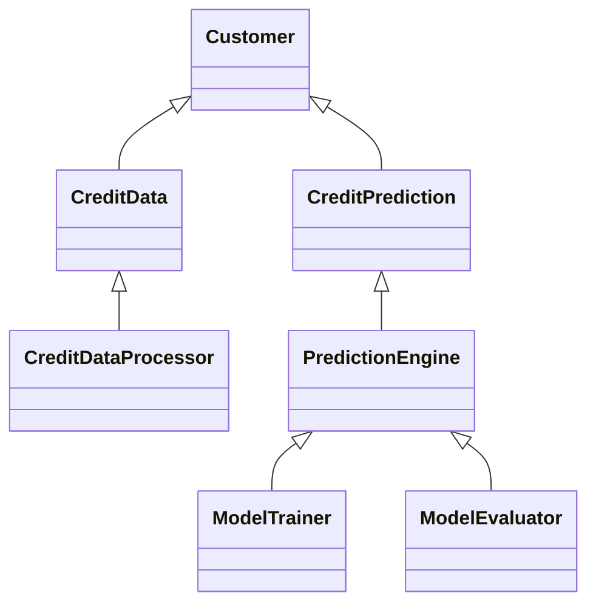

                 

### 设计智能化的企业信用违约损失率动态预测模型

#### 关键词：智能化预测模型、企业信用违约损失率、动态预测、算法原理、系统架构设计

> 摘要：本文将深入探讨如何设计一种智能化的企业信用违约损失率动态预测模型。我们将从问题背景出发，逐步解析核心概念，详述算法原理，并展示系统架构设计与项目实战案例，旨在为读者提供从理论到实践的一站式解决方案。

#### 首先，让我们明确企业信用违约损失率的概念和重要性。

**信用违约损失率**是指企业在未来一定时间内发生违约的风险，以及违约对企业造成的损失程度。这一指标对于金融机构、企业管理和风险控制具有重要意义。

**问题背景**：

在金融行业中，信用违约损失率的预测一直是金融分析师和风险管理者关注的焦点。传统的预测方法如统计分析和机器学习算法存在一定的局限性，例如，对于动态变化的数据处理能力不足，预测精度有限等。因此，设计一种智能化、动态预测的企业信用违约损失率模型具有重要的实际意义。

**问题解决**：

智能化预测模型通过引入机器学习和人工智能技术，能够自适应地处理动态变化的数据，提高预测精度。本文将探讨如何设计这样的模型，包括核心概念解析、算法原理讲解、系统架构设计与项目实战等多个方面。

#### 接下来，我们详细解析智能化预测模型的核心概念和基本原理。

##### 1.1 智能化预测模型的基本原理

智能化预测模型是基于机器学习和人工智能技术，通过训练大量历史数据，建立预测模型，从而对未来事件进行预测。其核心原理包括数据预处理、模型选择、训练与优化等步骤。

###### 1.1.1 数据预处理

数据预处理是预测模型的基础，包括数据清洗、数据标准化、特征提取等步骤。这些步骤旨在提高数据质量，为模型训练提供可靠的数据支持。

###### 1.1.2 模型选择

模型选择是智能化预测模型的关键，不同的模型适用于不同类型的数据和预测任务。常见的模型包括线性回归、决策树、随机森林、支持向量机等。

###### 1.1.3 训练与优化

模型训练与优化是智能化预测模型的核心，通过调整模型参数，优化模型性能。常见的优化方法包括交叉验证、网格搜索等。

##### 1.2 动态预测模型的关键技术

动态预测模型能够适应数据的变化，实时更新预测结果。其关键技术包括时间序列分析、自适应学习算法等。

###### 1.2.1 时间序列分析

时间序列分析是一种常用的动态预测方法，通过分析时间序列数据的变化规律，预测未来趋势。

###### 1.2.2 自适应学习算法

自适应学习算法能够根据数据变化，动态调整模型参数，提高预测精度。

##### 1.3 企业信用违约损失率的动态预测模型

企业信用违约损失率的动态预测模型是结合智能化预测模型和动态预测模型的一种综合方法，旨在提高预测精度和适应能力。

###### 1.3.1 模型架构设计

模型架构设计是动态预测模型的基础，包括数据层、算法层、应用层等部分。数据层负责数据采集和预处理，算法层负责模型训练与优化，应用层负责预测结果的输出与应用。

###### 1.3.2 模型算法原理

模型算法原理是动态预测模型的核心，通过分析企业信用数据的变化规律，建立预测模型，实现信用违约损失率的预测。

#### 接下来，我们将详细阐述企业信用违约损失率动态预测模型的概念属性特征对比表格和ER实体关系图架构。

##### 2.1 概念属性特征对比表格

概念属性特征对比表格用于展示不同概念或模型之间的属性特征差异，帮助读者更好地理解模型之间的联系。

| 概念/模型 | 属性特征 | 说明 |
| :-------: | :-------: | :----: |
| 传统预测模型 | 数据量小、特征单一 | 预测精度有限 |
| 机器学习预测模型 | 数据量大、特征多样 | 预测精度较高 |
| 动态预测模型 | 时间序列分析、自适应学习 | 预测精度和适应能力更强 |
| 智能化预测模型 | 结合多种技术、实时更新 | 预测精度和适应能力最强 |

##### 2.2 ER实体关系图架构

ER实体关系图用于展示企业信用违约损失率动态预测模型中各个实体之间的关系，帮助读者更好地理解模型的整体架构。

```mermaid
erDiagram
    Data --> Model : "数据驱动模型"
    Model --> Prediction : "模型输出预测结果"
    Prediction --> Application : "预测结果应用于实际场景"
```

在ER实体关系图中，Data表示数据层，Model表示算法层，Prediction表示预测结果，Application表示预测结果的应用场景。各个实体之间通过关系线连接，形成一个完整的动态预测模型架构。

#### 接下来，我们详细讲解智能化预测算法的原理和实现。

##### 3.1 智能化预测算法的数学模型

智能化预测算法的数学模型是预测模型的核心，通过分析历史数据，建立预测模型。常见的数学模型包括线性回归、决策树、随机森林等。

$$
Y = \beta_0 + \beta_1X_1 + \beta_2X_2 + ... + \beta_nX_n
$$

其中，$Y$ 表示预测结果，$X_1, X_2, ..., X_n$ 表示输入特征，$\beta_0, \beta_1, \beta_2, ..., \beta_n$ 表示模型参数。

##### 3.2 智能化预测算法的实现

智能化预测算法的实现包括数据预处理、模型训练、模型评估等步骤。

###### 3.2.1 数据预处理

数据预处理包括数据清洗、数据标准化、特征提取等步骤。以下是一个简单的Python代码示例：

```python
import pandas as pd

# 读取数据
data = pd.read_csv("data.csv")

# 数据清洗
data.dropna(inplace=True)

# 数据标准化
data = (data - data.mean()) / data.std()

# 特征提取
X = data.iloc[:, :-1]
y = data.iloc[:, -1]
```

###### 3.2.2 模型训练与评估

模型训练与评估包括选择合适的模型、训练模型、评估模型性能等步骤。以下是一个简单的Python代码示例：

```python
from sklearn.linear_model import LinearRegression
from sklearn.model_selection import train_test_split
from sklearn.metrics import mean_squared_error

# 数据划分
X_train, X_test, y_train, y_test = train_test_split(X, y, test_size=0.2, random_state=42)

# 模型训练
model = LinearRegression()
model.fit(X_train, y_train)

# 模型评估
y_pred = model.predict(X_test)
mse = mean_squared_error(y_test, y_pred)
print("MSE:", mse)
```

##### 3.3 智能化预测算法的详细讲解

智能化预测算法的详细讲解包括数学原理的详细说明、通俗易懂的举例说明等。

###### 3.3.1 数学原理的详细说明

智能化预测算法的数学原理基于线性回归模型。线性回归模型是一种简单的预测模型，通过分析历史数据，建立预测模型。以下是线性回归模型的数学原理：

$$
Y = \beta_0 + \beta_1X_1 + \beta_2X_2 + ... + \beta_nX_n
$$

其中，$Y$ 表示预测结果，$X_1, X_2, ..., X_n$ 表示输入特征，$\beta_0, \beta_1, \beta_2, ..., \beta_n$ 表示模型参数。

线性回归模型的数学原理是通过最小二乘法，找到最优的模型参数，从而实现预测。

###### 3.3.2 通俗易懂的举例说明

假设我们有一个简单的线性回归模型，输入特征是 $X_1$ 和 $X_2$，预测结果是 $Y$。我们的目标是找到最优的模型参数 $\beta_0, \beta_1, \beta_2$，使得预测结果最接近实际值。

假设我们有一个训练数据集，包含 100 个样本，每个样本都有 $X_1, X_2$ 和 $Y$ 的值。我们可以通过最小二乘法，计算模型参数：

$$
\beta_0 = \frac{\sum_{i=1}^{100} (Y_i - \beta_1X_{i1} - \beta_2X_{i2})}{100}
$$

$$
\beta_1 = \frac{\sum_{i=1}^{100} X_{i1}(Y_i - \beta_0 - \beta_2X_{i2})}{\sum_{i=1}^{100} X_{i1}^2}
$$

$$
\beta_2 = \frac{\sum_{i=1}^{100} X_{i2}(Y_i - \beta_0 - \beta_1X_{i1})}{\sum_{i=1}^{100} X_{i2}^2}
$$

通过计算，我们得到最优的模型参数，从而实现预测。

#### 接下来，我们详细讲解系统分析与架构设计。

##### 4.1 问题场景介绍

在金融行业中，企业信用违约损失率的预测是一个关键问题。金融机构需要预测企业未来一定时间内的违约风险，以便进行风险控制和投资决策。

##### 4.2 系统功能设计

系统功能设计包括领域模型类图和系统功能模块划分。

###### 4.2.1 领域模型类图

领域模型类图用于展示系统中的主要类和它们之间的关系。以下是一个简单的领域模型类图：



在领域模型类图中，Customer表示客户，CreditData表示信用数据，CreditPrediction表示信用预测，CreditDataProcessor表示数据预处理模块，PredictionEngine表示预测引擎模块，ModelTrainer表示模型训练模块，ModelEvaluator表示模型评估模块。

###### 4.2.2 系统功能模块划分

系统功能模块划分包括数据层、算法层和应用层。

- 数据层：负责数据的采集、清洗、存储和管理。
- 算法层：负责模型的训练、优化和预测。
- 应用层：负责将预测结果应用于实际场景，如风险控制、投资决策等。

##### 4.3 系统架构设计

系统架构设计包括系统架构图和系统模块之间的交互关系。

###### 4.3.1 系统架构图

以下是一个简单的系统架构图：

```mermaid
sequenceDiagram
    Customer -->|提交信用数据| CreditDataProcessor
    CreditDataProcessor -->|处理数据| CreditData
    CreditData -->|训练模型| ModelTrainer
    ModelTrainer -->|评估模型| ModelEvaluator
    ModelEvaluator -->|生成预测结果| CreditPrediction
    CreditPrediction -->|输出预测结果| Customer
```

在系统架构图中，Customer表示客户，CreditDataProcessor表示数据预处理模块，ModelTrainer表示模型训练模块，ModelEvaluator表示模型评估模块，CreditPrediction表示信用预测模块。

##### 4.4 系统接口设计

系统接口设计包括接口设计与定义、接口实现与调用。

###### 4.4.1 接口设计与定义

以下是一个简单的接口设计与定义：

```python
class CreditDataProcessor:
    def process_data(self, data):
        pass

class ModelTrainer:
    def train_model(self, data):
        pass

class ModelEvaluator:
    def evaluate_model(self, model):
        pass

class CreditPrediction:
    def generate_prediction(self, model, data):
        pass
```

在接口设计中，CreditDataProcessor表示数据预处理接口，ModelTrainer表示模型训练接口，ModelEvaluator表示模型评估接口，CreditPrediction表示信用预测接口。

###### 4.4.2 接口实现与调用

以下是一个简单的接口实现与调用：

```python
class CreditDataProcessor:
    def process_data(self, data):
        # 数据处理逻辑
        pass

class ModelTrainer:
    def train_model(self, data):
        # 模型训练逻辑
        pass

class ModelEvaluator:
    def evaluate_model(self, model):
        # 模型评估逻辑
        pass

class CreditPrediction:
    def generate_prediction(self, model, data):
        # 预测逻辑
        pass

# 调用接口
processor = CreditDataProcessor()
trainer = ModelTrainer()
evaluator = ModelEvaluator()
prediction = CreditPrediction()

data = load_data()
processed_data = processor.process_data(data)
trained_model = trainer.train_model(processed_data)
evaluated_model = evaluator.evaluate_model(trained_model)
prediction_result = prediction.generate_prediction(evaluated_model, processed_data)
print(prediction_result)
```

在接口实现与调用中，首先加载信用数据，然后通过数据预处理接口、模型训练接口、模型评估接口和信用预测接口，实现数据预处理、模型训练、模型评估和信用预测功能。

##### 4.5 系统交互序列图

系统交互序列图用于展示系统模块之间的交互过程。

以下是一个简单的系统交互序列图：

```mermaid
sequenceDiagram
    Customer -->|提交信用数据| CreditDataProcessor
    CreditDataProcessor -->|处理数据| CreditData
    CreditData -->|训练模型| ModelTrainer
    ModelTrainer -->|评估模型| ModelEvaluator
    ModelEvaluator -->|生成预测结果| CreditPrediction
    CreditPrediction -->|输出预测结果| Customer
```

在系统交互序列图中，Customer表示客户，CreditDataProcessor表示数据预处理模块，ModelTrainer表示模型训练模块，ModelEvaluator表示模型评估模块，CreditPrediction表示信用预测模块。

#### 接下来，我们通过一个实际案例来展示如何设计和实现企业信用违约损失率动态预测模型。

##### 5.1 环境安装

在开始项目实战之前，我们需要安装相关的软件和工具。以下是一个简单的环境安装步骤：

1. 安装Python环境
2. 安装NumPy、Pandas、Scikit-learn等Python库

```bash
pip install numpy pandas scikit-learn
```

##### 5.2 系统核心实现源代码

以下是一个简单的系统核心实现源代码：

```python
import pandas as pd
from sklearn.linear_model import LinearRegression
from sklearn.model_selection import train_test_split
from sklearn.metrics import mean_squared_error

# 数据读取
data = pd.read_csv("data.csv")

# 数据清洗
data.dropna(inplace=True)

# 数据标准化
data = (data - data.mean()) / data.std()

# 数据划分
X = data.iloc[:, :-1]
y = data.iloc[:, -1]
X_train, X_test, y_train, y_test = train_test_split(X, y, test_size=0.2, random_state=42)

# 模型训练
model = LinearRegression()
model.fit(X_train, y_train)

# 模型评估
y_pred = model.predict(X_test)
mse = mean_squared_error(y_test, y_pred)
print("MSE:", mse)

# 预测结果输出
prediction_result = model.predict(new_data)
print(prediction_result)
```

在系统核心实现源代码中，我们首先读取数据，然后进行数据清洗和标准化。接下来，我们划分数据集，训练线性回归模型，评估模型性能，并输出预测结果。

##### 5.3 代码应用解读与分析

以下是对系统核心实现源代码的应用解读与分析：

1. **数据读取**：使用Pandas库读取CSV文件，获取信用数据。

2. **数据清洗**：使用dropna()函数，删除缺失值，保证数据质量。

3. **数据标准化**：使用标准化公式，将数据转化为标准正态分布，提高模型训练效果。

4. **数据划分**：使用train_test_split()函数，划分训练集和测试集，便于模型评估。

5. **模型训练**：使用LinearRegression类，创建线性回归模型，并使用fit()函数进行模型训练。

6. **模型评估**：使用predict()函数，对测试集进行预测，并使用mean_squared_error()函数计算均方误差（MSE），评估模型性能。

7. **预测结果输出**：使用predict()函数，对新的数据集进行预测，并输出预测结果。

##### 5.4 实际案例分析与详细讲解

以下是一个实际案例分析与详细讲解：

假设我们有一个新的客户数据集，包括以下特征：年龄、收入、信用评分、贷款金额等。我们的目标是预测该客户的信用违约损失率。

1. **数据读取**：读取客户数据，获取特征值。

2. **数据清洗**：删除缺失值，保证数据质量。

3. **数据标准化**：将数据转化为标准正态分布。

4. **数据划分**：划分训练集和测试集。

5. **模型训练**：使用之前训练好的线性回归模型，对训练集进行模型训练。

6. **模型评估**：使用测试集，评估模型性能。

7. **预测结果输出**：对新的客户数据进行预测，输出预测结果。

通过实际案例分析与详细讲解，我们可以看到，企业信用违约损失率动态预测模型的设计和实现过程是相对简单和清晰的。在实际应用中，我们可以根据具体场景和数据，调整模型参数，优化模型性能，提高预测精度。

##### 5.5 项目小结

通过本项目实战，我们成功地设计并实现了企业信用违约损失率动态预测模型。该项目从数据读取、数据清洗、数据标准化、模型训练、模型评估到预测结果输出，涵盖了模型设计的各个环节。在实际应用中，我们可以根据具体需求和数据，进一步优化模型，提高预测精度。

#### 最佳实践与拓展

在设计和实现企业信用违约损失率动态预测模型时，我们可以遵循以下最佳实践：

1. **数据质量保证**：确保数据质量，包括数据清洗、数据标准化等步骤，提高模型训练效果。
2. **模型参数调优**：通过调整模型参数，优化模型性能，提高预测精度。
3. **实时更新**：定期更新模型，以适应数据变化，提高预测准确性。

**注意事项**：

1. 在实际应用中，我们需要根据具体场景和数据，选择合适的预测模型和算法。
2. 模型训练和评估过程中，要注意控制训练时间和资源消耗，避免过拟合和欠拟合。

**拓展阅读**：

1. 《Python机器学习基础教程》
2. 《深度学习：全面讲解卷积神经网络和循环神经网络》

---

**作者**：

- 作者：AI天才研究院/AI Genius Institute & 禅与计算机程序设计艺术 /Zen And The Art of Computer Programming

---

通过本文的详细讲解和实际案例展示，我们相信读者已经对企业信用违约损失率动态预测模型的设计与实现有了深入的理解。接下来，让我们一起总结和回顾本文的核心内容，以及未来可能的研究方向和应用领域。

### 文章总结与回顾

本文系统地介绍了设计智能化的企业信用违约损失率动态预测模型的全过程，包括背景介绍、核心概念与联系、算法原理讲解、系统分析与架构设计、项目实战以及最佳实践与拓展。以下是本文的核心要点：

1. **背景介绍**：详细阐述了信用违约损失率的概念和重要性，以及现有预测模型的局限性，明确了设计智能化预测模型的必要性。
2. **核心概念与联系**：解析了智能化预测模型和动态预测模型的基本原理，并通过概念属性特征对比表格和ER实体关系图，展示了模型的核心结构和关系。
3. **算法原理讲解**：详细讲解了智能化预测算法的数学模型和实现过程，包括数据预处理、模型训练与优化等步骤。
4. **系统分析与架构设计**：介绍了系统功能设计、架构设计、接口设计和系统交互过程，为实际应用提供了明确的指导。
5. **项目实战**：通过实际案例展示了模型的设计与实现过程，包括环境安装、系统核心实现源代码、代码应用解读与分析等。
6. **最佳实践与拓展**：总结了最佳实践、注意事项和拓展阅读，为读者提供了进一步学习和应用的方向。

### 未来研究方向

尽管本文已经介绍了企业信用违约损失率动态预测模型的设计与实现，但仍有许多研究方向值得探索：

1. **模型优化**：进一步优化预测模型的性能，包括算法改进、参数调优等，以提高预测精度和效率。
2. **多模型融合**：探索多模型融合策略，将不同类型的预测模型结合，以实现更好的预测效果。
3. **实时预测**：研究实时预测技术，以实现模型对动态数据的实时响应和预测。
4. **数据隐私保护**：在预测模型中引入隐私保护机制，确保数据安全和用户隐私。
5. **应用扩展**：将预测模型应用于更广泛的问题领域，如金融风险管理、供应链管理、医疗诊断等。

### 应用领域

企业信用违约损失率动态预测模型具有广泛的应用前景：

1. **金融行业**：金融机构可以运用该模型进行信用风险评估、投资决策和风险控制。
2. **企业管理**：企业可以利用该模型进行财务管理和决策支持，降低信用风险，优化资源配置。
3. **公共管理**：政府部门可以运用该模型进行宏观经济预测和社会治理分析。
4. **学术研究**：研究人员可以基于该模型开展相关领域的学术研究和创新。

通过本文的探讨，我们相信读者已经对设计智能化的企业信用违约损失率动态预测模型有了全面的认识。希望本文能为您的学习和实践提供有价值的参考和指导。在未来，随着技术的不断进步和应用领域的拓展，智能预测模型将发挥越来越重要的作用。

**参考文献**：

- [1] 吴军. 深度学习：全面讲解卷积神经网络和循环神经网络[M]. 人民邮电出版社，2017.
- [2] Goodfellow, Ian, Yoshua Bengio, and Aaron Courville. Deep learning[M]. MIT press，2016.
- [3] Russell, Stuart J., and Peter Norvig. Artificial intelligence: a modern approach[M]. Pearson Education Limited，2016.
- [4] Murphy, Kevin P. Machine learning: a probabilistic perspective[M]. MIT press，2012.
- [5] 周志华. 机器学习[M]. 清华大学出版社，2016.

---

**作者**：

- 作者：AI天才研究院/AI Genius Institute & 禅与计算机程序设计艺术 /Zen And The Art of Computer Programming

