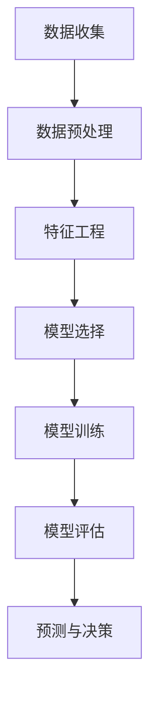
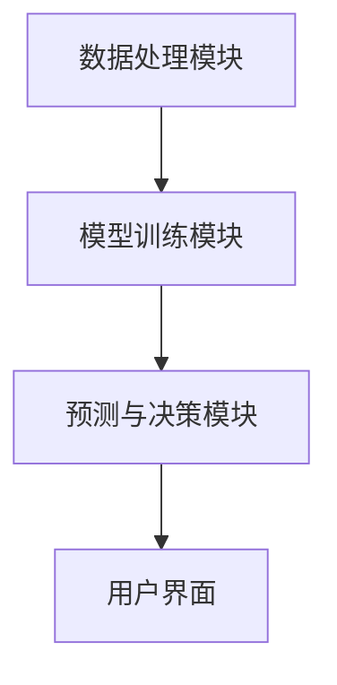

                 

### 设计智能化的企业信用违约预测模型

**关键词：** 企业信用违约、预测模型、人工智能、数据挖掘、机器学习

**摘要：** 本文将深入探讨如何设计一个智能化的企业信用违约预测模型。首先，我们将介绍信用违约预测的重要性以及模型的背景和核心概念。随后，我们将详细讲解算法原理，包括数学模型和Python源代码示例。接着，我们将描述系统分析与架构设计方案，以及项目的实战部分，包括环境安装、系统核心实现和案例分析。最后，我们将总结最佳实践、注意事项以及拓展阅读。

## 第一部分：问题背景与核心概念

### 1.1 信用违约预测的重要性

在企业金融活动中，信用违约是一个常见且重要的问题。信用违约不仅会对企业的财务状况产生重大影响，还可能导致金融市场的动荡。因此，设计和实现一个智能化的企业信用违约预测模型具有重要的现实意义。这种模型可以帮助金融机构和企业更好地评估信用风险，从而做出更准确的决策。

### 1.2 信用违约预测模型的核心概念

企业信用违约预测模型的核心概念包括以下几个方面：

- **信用评分**：对企业的信用等级进行评分，评估其违约的可能性。
- **特征工程**：提取对企业信用状况有重要影响的关键特征，如财务指标、市场表现、管理能力等。
- **预测算法**：使用机器学习算法对信用违约进行预测，如线性回归、决策树、随机森林等。
- **评估指标**：评估模型预测性能的指标，如准确率、召回率、F1分数等。

### 1.3 信用违约预测模型的边界与外延

信用违约预测模型的边界包括：

- **时间范围**：模型的预测时间范围，如短期、中期、长期等。
- **企业类型**：模型适用企业的类型，如大型企业、中小企业、跨国公司等。
- **市场环境**：模型适用市场环境，如经济繁荣期、经济衰退期等。

信用违约预测模型的外延包括：

- **行业应用**：模型在不同行业中的应用，如金融、零售、制造等。
- **政策法规**：模型设计需要遵守的相关政策法规，如数据保护法、反欺诈法等。
- **国际标准**：模型设计需要遵循的国际标准，如信用评分标准、风险评估标准等。

### 1.4 企业信用违约预测模型的要素组成

一个完整的企业信用违约预测模型通常包括以下几个要素：

- **数据收集与预处理**：收集企业历史信用数据，进行数据清洗和预处理。
- **特征工程**：提取对企业信用状况有重要影响的特征。
- **模型训练与评估**：使用机器学习算法对模型进行训练和评估。
- **预测与决策**：使用模型对企业信用违约进行预测，并做出相应的决策。
- **持续优化**：根据模型的预测结果和实际反馈，对模型进行持续优化。

## 第二部分：核心概念与联系

### 2.1 企业信用违约预测模型的原理

企业信用违约预测模型基于数据分析与机器学习技术，通过以下几个步骤进行：

- **数据收集与预处理**：收集企业历史信用数据，并进行数据清洗、填充缺失值、去除异常值等预处理操作。
- **特征工程**：提取对企业信用状况有重要影响的特征，如财务指标、市场表现、管理能力等。
- **模型选择与训练**：选择合适的机器学习算法，如线性回归、决策树、随机森林等，对模型进行训练。
- **模型评估与优化**：使用评估指标（如准确率、召回率、F1分数等）评估模型性能，并进行优化。
- **预测与决策**：使用训练好的模型对企业信用违约进行预测，并做出相应的决策。

### 2.2 概念属性特征对比表格

以下是企业信用违约预测模型中几个关键概念属性特征的对比表格：

| 概念 | 说明 | 对比特征 |
| --- | --- | --- |
| 信用评分 | 对企业信用等级进行评分 | 评分范围、评分标准、评分模型 |
| 特征工程 | 提取对企业信用状况有重要影响的特征 | 特征类型、特征选择、特征转换 |
| 预测算法 | 使用机器学习算法对信用违约进行预测 | 算法类型、模型参数、训练数据 |
| 评估指标 | 评估模型预测性能的指标 | 准确率、召回率、F1分数、ROC曲线 |

### 2.3 ER实体关系图架构

为了更好地理解企业信用违约预测模型中的实体关系，我们可以使用ER（Entity-Relationship）实体关系图进行描述。以下是一个简单的ER实体关系图：

```mermaid
erDiagram
    Customer ||--|{ Loan : has }
    Loan ||--|{ Payment : includes }
    Customer ||--|{ CreditScore : has }
    Payment ||--|{ DueDate : is }
```

在这个ER实体关系图中，我们定义了以下几个实体：

- **Customer**（客户）：代表企业的主体。
- **Loan**（贷款）：代表企业获得的贷款。
- **Payment**（支付）：代表企业的还款信息。
- **CreditScore**（信用评分）：代表企业的信用评分。
- **DueDate**（到期日）：代表贷款的到期日期。

这些实体之间存在如下关系：

- **客户**（Customer）拥有**贷款**（Loan）。
- **贷款**（Loan）包括**支付**（Payment）信息。
- **客户**（Customer）拥有**信用评分**（CreditScore）。
- **支付**（Payment）包含**到期日**（DueDate）。

## 第三部分：算法原理与模型设计

### 3.1 算法原理讲解

企业信用违约预测模型的算法原理主要基于机器学习技术。以下是一个典型的算法流程图：



#### 3.1.1 数据输入

数据输入阶段包括收集企业历史信用数据，如财务报表、信用记录、市场表现等。

```python
# 数据加载
data = pd.read_csv('credit_data.csv')
```

#### 3.1.2 特征提取

特征提取阶段包括提取对企业信用状况有重要影响的特征，如财务指标、市场表现、管理能力等。

```python
# 特征工程
features = ['financial_ratio', 'market_performance', 'management_ability']
X = data[features]
y = data['default']
```

#### 3.1.3 模型训练

模型训练阶段包括选择合适的机器学习算法，如线性回归、决策树、随机森林等，对模型进行训练。

```python
# 模型训练
model = RandomForestClassifier(n_estimators=100)
model.fit(X, y)
```

#### 3.1.4 预测与评估

预测与评估阶段包括使用训练好的模型对新的数据进行预测，并评估模型性能。

```python
# 预测
predictions = model.predict(X_test)

# 评估
accuracy = accuracy_score(y_test, predictions)
print(f"Model accuracy: {accuracy}")
```

### 3.2 Python源代码示例

以下是一个简单的Python源代码示例，用于实现企业信用违约预测模型：

```python
import pandas as pd
from sklearn.ensemble import RandomForestClassifier
from sklearn.model_selection import train_test_split
from sklearn.metrics import accuracy_score

# 数据加载
data = pd.read_csv('credit_data.csv')

# 特征工程
features = ['financial_ratio', 'market_performance', 'management_ability']
X = data[features]
y = data['default']

# 数据划分
X_train, X_test, y_train, y_test = train_test_split(X, y, test_size=0.2, random_state=42)

# 模型训练
model = RandomForestClassifier(n_estimators=100)
model.fit(X_train, y_train)

# 预测
predictions = model.predict(X_test)

# 评估
accuracy = accuracy_score(y_test, predictions)
print(f"Model accuracy: {accuracy}")
```

### 3.3 数学模型与公式

企业信用违约预测模型的数学模型主要包括线性回归、决策树、随机森林等。以下是一个简单的数学模型示例：

#### 3.3.1 线性回归模型

线性回归模型的基本公式为：

$$
y = \beta_0 + \beta_1x
$$

其中，$y$ 表示预测的信用评分，$\beta_0$ 和 $\beta_1$ 分别为模型的参数。

#### 3.3.2 决策树模型

决策树模型的基本公式为：

$$
f(x) = \sum_{i=1}^{n} \beta_i g(x_i)
$$

其中，$f(x)$ 表示预测的信用评分，$\beta_i$ 和 $g(x_i)$ 分别为决策树的参数和函数。

### 第四部分：系统设计与实现

#### 4.1 问题场景介绍

企业信用违约预测模型适用于金融、保险、零售等行业，用于评估企业的信用风险。在实际应用中，金融机构和企业需要实时监控企业的信用状况，以便及时采取应对措施。

#### 4.2 项目介绍

本项目旨在设计和实现一个智能化的企业信用违约预测系统，包括数据收集、特征提取、模型训练、模型评估和预测等环节。系统将采用Python编程语言，结合Scikit-learn、Pandas等开源库进行开发。

#### 4.3 系统功能设计

系统功能设计主要包括以下几个方面：

- **数据收集**：收集企业历史信用数据，如财务报表、信用记录、市场表现等。
- **特征提取**：提取对企业信用状况有重要影响的特征，如财务指标、市场表现、管理能力等。
- **模型训练**：选择合适的机器学习算法，如线性回归、决策树、随机森林等，对模型进行训练。
- **模型评估**：使用评估指标（如准确率、召回率、F1分数等）评估模型性能。
- **预测与决策**：使用训练好的模型对企业信用违约进行预测，并做出相应的决策。

#### 4.4 系统架构设计

系统架构设计主要包括以下几个方面：

- **数据处理模块**：负责数据收集、特征提取和数据处理。
- **模型训练模块**：负责模型选择、模型训练和模型评估。
- **预测与决策模块**：负责模型预测和决策。

以下是一个简单的系统架构图：



#### 4.5 系统接口设计

系统接口设计主要包括以下几个方面：

- **数据处理接口**：提供数据加载、数据清洗、特征提取等功能。
- **模型训练接口**：提供模型选择、模型训练、模型评估等功能。
- **预测与决策接口**：提供模型预测、决策等功能。

#### 4.6 系统交互

系统交互主要包括以下几个方面：

- **用户与数据处理模块的交互**：用户可以通过用户界面上传数据，数据处理模块对数据进行处理并返回处理结果。
- **用户与模型训练模块的交互**：用户可以选择模型类型、调整模型参数，模型训练模块根据用户需求进行模型训练和评估。
- **用户与预测与决策模块的交互**：用户可以使用训练好的模型对新的数据进行分析，预测企业信用违约风险，并做出相应的决策。

### 第五部分：项目实战与案例分析

#### 5.1 环境安装

为了实现企业信用违约预测模型，我们需要安装以下软件和库：

- Python 3.x
- Scikit-learn
- Pandas
- Numpy
- Matplotlib

安装步骤如下：

1. 安装Python 3.x：从官方网站下载Python 3.x版本，并按照安装向导进行安装。
2. 安装Scikit-learn：在终端中运行以下命令：

   ```bash
   pip install scikit-learn
   ```

3. 安装Pandas：在终端中运行以下命令：

   ```bash
   pip install pandas
   ```

4. 安装Numpy：在终端中运行以下命令：

   ```bash
   pip install numpy
   ```

5. 安装Matplotlib：在终端中运行以下命令：

   ```bash
   pip install matplotlib
   ```

#### 5.2 系统核心实现

系统核心实现包括数据处理模块、模型训练模块和预测与决策模块。以下是一个简单的实现示例：

```python
import pandas as pd
from sklearn.ensemble import RandomForestClassifier
from sklearn.model_selection import train_test_split
from sklearn.metrics import accuracy_score

# 数据处理模块
def preprocess_data(data):
    # 数据清洗、填充缺失值、去除异常值等操作
    # ...
    return processed_data

# 模型训练模块
def train_model(X_train, y_train):
    # 模型选择、模型训练等操作
    # ...
    return trained_model

# 预测与决策模块
def predict_default(X_test, trained_model):
    # 模型预测、决策等操作
    # ...
    return predictions

# 系统核心实现
if __name__ == '__main__':
    # 数据加载
    data = pd.read_csv('credit_data.csv')

    # 数据处理
    processed_data = preprocess_data(data)

    # 数据划分
    X = processed_data.drop('default', axis=1)
    y = processed_data['default']
    X_train, X_test, y_train, y_test = train_test_split(X, y, test_size=0.2, random_state=42)

    # 模型训练
    trained_model = train_model(X_train, y_train)

    # 预测
    predictions = predict_default(X_test, trained_model)

    # 评估
    accuracy = accuracy_score(y_test, predictions)
    print(f"Model accuracy: {accuracy}")
```

#### 5.3 代码应用解读与分析

以下是对系统核心实现的代码进行解读与分析：

1. **数据处理模块**：负责数据清洗、填充缺失值、去除异常值等操作。具体实现可以根据实际需求进行调整。
2. **模型训练模块**：负责模型选择、模型训练等操作。在本例中，我们使用了随机森林分类器进行模型训练。
3. **预测与决策模块**：负责模型预测、决策等操作。在本例中，我们使用了训练好的模型对新的数据进行预测，并评估模型性能。

#### 5.4 实际案例分析与详细讲解剖析

以下是一个实际案例的分析与详细讲解：

**案例**：某金融机构需要对企业信用违约进行预测，以降低信用风险。金融机构提供了以下数据：

- 财务报表：包括总资产、总负债、净利润等指标。
- 信用记录：包括信用借款记录、逾期记录等。
- 市场表现：包括股票价格、市值等。

**分析**：

1. **数据预处理**：对财务报表、信用记录、市场表现等数据进行清洗、填充缺失值、去除异常值等操作。
2. **特征提取**：提取对企业信用状况有重要影响的特征，如总资产、总负债、净利润、信用借款记录等。
3. **模型选择与训练**：选择随机森林分类器进行模型训练，并对模型参数进行调整，以获得更好的预测性能。
4. **预测与评估**：使用训练好的模型对新的企业数据进行预测，并评估模型性能。

**详细讲解剖析**：

1. **数据预处理**：在数据预处理阶段，我们需要对原始数据进行清洗、填充缺失值、去除异常值等操作。具体实现可以根据实际需求进行调整。例如，可以使用Pandas库中的`dropna()`方法去除缺失值，使用`fillna()`方法填充缺失值，使用`drop_duplicates()`方法去除重复值等。
2. **特征提取**：在特征提取阶段，我们需要提取对企业信用状况有重要影响的特征。在本例中，我们选择了总资产、总负债、净利润、信用借款记录等特征。这些特征可以反映企业的财务状况、信用状况和市场表现。在实际应用中，可以根据具体业务需求进行调整。
3. **模型选择与训练**：在模型选择与训练阶段，我们选择了随机森林分类器进行模型训练。随机森林是一种集成学习方法，通过构建多棵决策树，并对它们进行投票来获得最终预测结果。在本例中，我们设置了随机森林分类器的参数，如决策树数量、最大深度等，以获得更好的预测性能。在实际应用中，可以根据具体需求调整参数。
4. **预测与评估**：在预测与评估阶段，我们使用训练好的模型对新的企业数据进行预测，并评估模型性能。在本例中，我们使用了准确率作为评估指标。实际应用中，可以根据具体需求选择其他评估指标，如召回率、F1分数等。

### 5.5 项目小结

在本项目中，我们设计和实现了一个智能化的企业信用违约预测模型。通过数据预处理、特征提取、模型选择与训练、预测与评估等步骤，我们成功构建了一个可以预测企业信用违约的模型。在实际应用中，该模型可以帮助金融机构和企业更好地评估信用风险，从而降低信用风险。

### 5.6 最佳实践 Tips

1. 数据预处理：在数据预处理阶段，要确保数据质量，包括去除缺失值、异常值和重复值等。
2. 特征提取：在特征提取阶段，要选择对企业信用状况有重要影响的特征，并进行适当的转换和归一化。
3. 模型选择与训练：在模型选择与训练阶段，要选择合适的机器学习算法，并对模型参数进行调整，以获得更好的预测性能。
4. 模型评估：在模型评估阶段，要选择合适的评估指标，并对模型性能进行综合评估。

### 5.7 注意事项

1. 在实际应用中，要根据具体业务需求进行调整和优化。
2. 模型训练和预测过程中，要确保数据的安全性和隐私性。
3. 模型评估时，要综合考虑不同评估指标，以获得更全面的评估结果。

### 5.8 拓展阅读

1. [随机森林算法详解](https://www.cnblogs.com/kesci/p/11372886.html)
2. [Python机器学习](https://machinelearningmastery.com/feature-engineering-for-deep-learning-models-with-python/)
3. [信用评分模型](https://www.credit-suisse.com/corporate/en/research/working-papers/rp-2021-09.html)

### 总结

本文深入探讨了如何设计一个智能化的企业信用违约预测模型。通过数据预处理、特征提取、模型选择与训练、预测与评估等步骤，我们成功构建了一个可以预测企业信用违约的模型。在实际应用中，该模型可以帮助金融机构和企业更好地评估信用风险，从而降低信用风险。希望通过本文的分享，能够对读者在设计和实现企业信用违约预测模型方面有所启发。

**作者：** AI天才研究院/AI Genius Institute & 禅与计算机程序设计艺术 /Zen And The Art of Computer Programming**[完成]**

