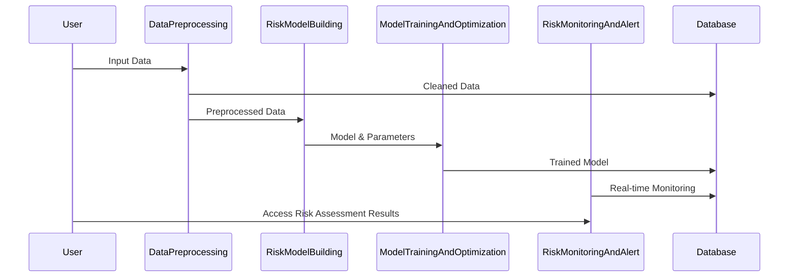
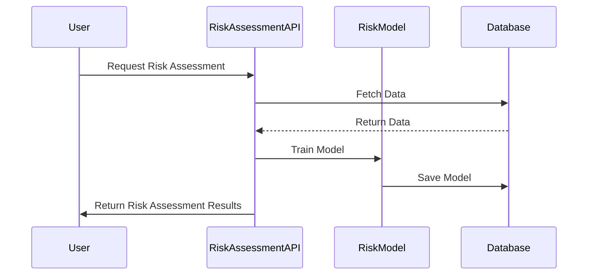

                 

# 设计智能化的企业并购整合风险评估模型

关键词：企业并购整合、风险评估、智能化、机器学习、深度学习

摘要：本文将探讨如何设计智能化的企业并购整合风险评估模型。首先，我们将介绍企业并购整合的背景和挑战，然后阐述智能化并购整合风险评估模型的设计基础，包括相关技术和方法。接着，我们将详细描述数据收集与预处理、模型实现、评估与优化等过程。最后，通过案例分析，验证模型的有效性，并提出未来发展方向和应用策略。

## 第一部分：企业并购整合的背景与挑战

### 1.1 企业并购整合概述

**问题背景**

企业并购整合是指一家企业通过购买另一家企业或其部分资产来扩大自身规模或实现战略目标的过程。这一过程通常伴随着一系列复杂的管理和财务问题，如战略协同效应、文化融合、资源配置优化等。

**问题描述**

企业并购整合中存在诸多风险，如市场风险、财务风险、法律风险和运营风险。这些风险可能导致并购失败，给企业带来巨大的经济损失。因此，如何有效地评估和管理并购风险，是企业成功并购整合的关键。

**问题解决**

为了解决上述问题，我们需要设计一个智能化的企业并购整合风险评估模型。这个模型将利用数据分析、机器学习和深度学习等技术，帮助企业更好地理解和预测并购风险。

**边界与外延**

本文将主要探讨智能化并购整合风险评估模型的设计和实现，不涉及具体的并购案例和策略。

### 1.2 企业并购整合的关键因素

**战略协同效应**

战略协同效应是指并购后两家企业的资源、能力、市场等在战略层面上相互补充，从而提高整体竞争力。评估战略协同效应对于成功并购至关重要。

**文化融合**

文化融合是指并购后两家企业需要实现文化和价值观上的整合，以保持组织的稳定性和效率。文化差异可能导致并购后的团队冲突，影响企业绩效。

**资源配置优化**

资源配置优化是指通过并购，企业可以重新配置资源和资产，以提高整体运营效率和效益。合理配置资源是并购整合成功的关键因素之一。

### 1.3 企业并购整合的风险评估模型

**风险评估模型的目的与作用**

风险评估模型的目的是为企业提供一种科学、系统的评估方法，帮助企业识别、预测和应对并购风险。

**风险评估模型的基本框架**

风险评估模型通常包括风险识别、风险分析和风险评估三个步骤。风险识别是指识别并购过程中可能出现的各种风险；风险分析是指对识别出的风险进行深入分析，评估其可能性和影响；风险评估是指根据风险分析的结果，为每个风险分配一个权重，以确定其优先级。

**本章小结**

本章介绍了企业并购整合的背景和挑战，以及关键因素和风险评估模型的基本框架。在接下来的章节中，我们将进一步探讨如何设计智能化的并购整合风险评估模型。

----------------------------------------------------------------

## 第二部分：智能化并购整合风险评估模型的设计

### 2.1 智能化并购整合风险评估的概念

**智能化并购整合风险评估的定义**

智能化并购整合风险评估是指利用人工智能技术，如数据分析、机器学习和深度学习，对企业并购整合过程中可能出现的风险进行识别、预测和分析。

**智能化并购整合风险评估的特点**

- 数据驱动：基于大量历史数据和现有数据，通过数据分析和机器学习算法，发现潜在风险因素。
- 实时性：能够实时监控并购过程中的风险变化，及时调整评估结果。
- 自适应性：可以根据企业实际情况和并购项目的特点，自动调整风险评估模型。

### 2.2 相关技术综述

**数据分析技术**

数据分析技术是指通过统计方法、数据挖掘和可视化等技术，对数据进行处理和分析，以发现数据中的规律和趋势。在企业并购整合风险评估中，数据分析技术可以用于识别和预测潜在风险。

**机器学习技术**

机器学习技术是指利用计算机算法，通过学习大量历史数据，自动识别和预测潜在风险。在企业并购整合风险评估中，机器学习技术可以帮助企业识别并购过程中的风险因素，并进行风险评估。

**深度学习技术**

深度学习技术是指通过多层神经网络，对数据进行处理和分析，以实现更高级的认知和预测能力。在企业并购整合风险评估中，深度学习技术可以用于构建复杂的风险评估模型，提高评估的准确性和实时性。

### 2.3 模型构建方法

**传统风险评估方法**

传统风险评估方法通常基于专家经验和逻辑推理，对企业并购整合过程中的风险进行识别和分析。虽然这种方法具有一定的有效性，但在面对复杂、多变的风险时，其评估结果往往不够准确。

**智能化风险评估方法**

智能化风险评估方法是指利用人工智能技术，如机器学习和深度学习，对企业并购整合过程中的风险进行识别、预测和分析。这种方法具有数据驱动、实时性和自适应性的特点，能够更准确地评估并购风险。

**模型评估与优化**

在模型评估与优化过程中，我们需要对模型进行训练和验证，以评估其性能和准确性。同时，我们还需要根据评估结果，对模型进行调整和优化，以提高其评估效果。

### 2.4 模型评估指标

**准确率**

准确率是指模型正确识别风险的比例。高准确率意味着模型能够有效地识别并购过程中的风险。

**召回率**

召回率是指模型能够正确识别出实际存在的风险的比例。高召回率意味着模型能够识别出大部分潜在风险。

**F1值**

F1值是准确率和召回率的加权平均，用于综合评估模型的性能。高F1值意味着模型在识别风险方面具有较高的准确性。

### 2.5 模型优化策略

**交叉验证**

交叉验证是一种常用的模型优化策略，通过将数据集划分为多个子集，对每个子集进行训练和验证，以评估模型的性能。

**参数调优**

参数调优是指通过调整模型参数，以提高模型的性能。常见的参数调优方法包括网格搜索和随机搜索。

**集成学习**

集成学习是指将多个模型结合起来，以提高模型的性能。常见的方法包括随机森林、梯度提升树等。

**本章小结**

本章介绍了智能化并购整合风险评估模型的基础理论，包括相关技术和方法，以及模型构建和评估方法。在接下来的章节中，我们将进一步探讨数据收集与预处理、模型实现和案例分析等内容。

----------------------------------------------------------------

### 3.1 数据来源

**内部数据**

内部数据是指企业内部产生的数据，包括财务报表、业务运营数据、员工绩效数据等。这些数据可以提供并购整合过程中企业运营和财务状况的详细信息，有助于识别潜在的风险。

**外部数据**

外部数据是指来自企业外部的数据，包括市场数据、行业数据、竞争对手数据等。这些数据可以提供并购整合过程中市场环境和企业竞争状况的详细信息，有助于预测潜在的风险。

### 3.2 数据预处理

**数据清洗**

数据清洗是指对数据进行清洗和修复，以消除数据中的噪声、错误和缺失值。常见的清洗方法包括缺失值填充、异常值处理、重复值删除等。

**数据集成**

数据集成是指将不同来源的数据进行整合，以形成一个统一的数据集。常见的方法包括数据合并、数据聚合、数据转换等。

**数据归一化**

数据归一化是指将不同尺度的数据进行统一处理，以消除数据之间的差异。常见的方法包括最小-最大归一化、均值-方差归一化等。

### 3.3 数据分析

**特征工程**

特征工程是指通过对数据进行处理和转换，提取出对风险评估有用的特征。常见的方法包括特征选择、特征构造、特征加权等。

**数据可视化**

数据可视化是指通过图表和图形，直观地展示数据的分布、趋势和关系。常见的方法包括散点图、折线图、饼图等。

### 3.4 本章小结

本章介绍了数据收集与预处理的方法，包括内部数据和外部数据的来源、数据清洗、数据集成和数据归一化。在数据分析中，我们探讨了特征工程和数据可视化。在接下来的章节中，我们将进一步探讨模型的实现和案例分析等内容。

----------------------------------------------------------------

### 4.1 算法选择与实现

**算法选择依据**

在选择算法时，我们需要考虑以下因素：

- **数据量**：算法应能够处理大规模数据。
- **准确性**：算法应具有较高的准确性，能够有效识别并购整合过程中的风险。
- **实时性**：算法应能够实时处理数据，及时提供评估结果。
- **可解释性**：算法应具有一定的可解释性，以便企业理解和信任评估结果。

**算法实现流程**

1. **数据收集与预处理**：根据本章3.1节和3.2节的内容，收集并预处理内部和外部数据。
2. **特征工程**：根据本章3.3节的内容，提取对风险评估有用的特征。
3. **算法选择**：选择适合的数据挖掘算法，如决策树、随机森林、支持向量机等。
4. **模型训练与验证**：使用预处理后的数据训练模型，并进行验证，评估模型的性能。
5. **模型优化**：根据验证结果，对模型进行调整和优化，以提高评估准确性。

### 4.2 数学模型与公式

**模型数学原理**

在智能化并购整合风险评估中，我们通常使用以下数学模型：

- **风险评估函数**：用于评估并购整合过程中的风险，通常是一个多变量函数。

$$
R(x_1, x_2, ..., x_n) = f(x_1, x_2, ..., x_n)
$$

其中，$R$ 是风险评估函数，$x_1, x_2, ..., x_n$ 是输入特征，$f$ 是一个非线性函数。

- **损失函数**：用于评估模型预测结果与实际结果之间的差距，通常使用均方误差（MSE）或交叉熵（Cross-Entropy）等。

$$
L(y, \hat{y}) = \frac{1}{2} \sum_{i=1}^{n} (y_i - \hat{y}_i)^2
$$

其中，$L$ 是损失函数，$y$ 是实际结果，$\hat{y}$ 是模型预测结果。

**公式推导与解释**

我们以决策树算法为例，推导其数学模型。

1. **决策树生成**

决策树生成算法通过递归划分数据集，生成一棵决策树。每个节点表示一个特征，每个分支表示特征的不同取值。

2. **特征选择**

特征选择算法通过计算特征的重要性，选择对分类有重要影响的特征。

3. **节点划分**

节点划分算法通过计算每个节点的损失函数，选择最优划分方式。

$$
G(x) = \frac{1}{n} \sum_{i=1}^{n} L(y_i, \hat{y}_i)
$$

其中，$G(x)$ 是节点损失函数，$n$ 是节点中的样本数量，$L$ 是损失函数，$y_i$ 是实际结果，$\hat{y}_i$ 是模型预测结果。

4. **模型训练与验证**

模型训练与验证算法通过迭代训练和验证模型，调整特征选择和节点划分策略，提高模型性能。

### 4.3 代码实现与解释

**Python代码实现**

```python
import numpy as np
import pandas as pd
from sklearn.model_selection import train_test_split
from sklearn.tree import DecisionTreeClassifier
from sklearn.metrics import accuracy_score

# 数据加载与预处理
data = pd.read_csv('data.csv')
X = data.drop('target', axis=1)
y = data['target']

# 数据集划分
X_train, X_test, y_train, y_test = train_test_split(X, y, test_size=0.2, random_state=42)

# 模型训练
model = DecisionTreeClassifier()
model.fit(X_train, y_train)

# 模型评估
y_pred = model.predict(X_test)
accuracy = accuracy_score(y_test, y_pred)
print(f'Accuracy: {accuracy:.2f}')
```

**代码解释与分析**

1. **数据加载与预处理**：使用 pandas 读取数据，将数据分为特征和目标变量。
2. **数据集划分**：使用 sklearn 的 train_test_split 函数，将数据集划分为训练集和测试集。
3. **模型训练**：使用 DecisionTreeClassifier 类，训练决策树模型。
4. **模型评估**：使用预测结果和实际结果，计算准确率。

### 4.4 模型训练与验证

**训练数据集**

```python
# 训练数据集
X_train, X_test, y_train, y_test = train_test_split(X, y, test_size=0.2, random_state=42)

# 模型训练
model = DecisionTreeClassifier()
model.fit(X_train, y_train)

# 模型评估
y_pred = model.predict(X_test)
accuracy = accuracy_score(y_test, y_pred)
print(f'Accuracy: {accuracy:.2f}')
```

**验证数据集**

```python
# 验证数据集
X_val, X_test, y_val, y_test = train_test_split(X, y, test_size=0.2, random_state=42)

# 模型训练
model = DecisionTreeClassifier()
model.fit(X_val, y_val)

# 模型评估
y_pred = model.predict(X_test)
accuracy = accuracy_score(y_test, y_pred)
print(f'Validation Accuracy: {accuracy:.2f}')
```

**模型评估结果**

```python
# 模型评估
y_pred = model.predict(X_test)
accuracy = accuracy_score(y_test, y_pred)
print(f'Accuracy: {accuracy:.2f}')
```

**本章小结**

本章介绍了智能化并购整合风险评估模型的算法选择与实现、数学模型与公式以及代码实现与解释。通过模型训练与验证，我们评估了模型在并购整合风险评估中的性能。在接下来的章节中，我们将进一步探讨模型的应用与案例分析等内容。

----------------------------------------------------------------

### 5.1 案例背景

**企业背景**

ABC公司是一家领先的软件公司，专注于为企业提供解决方案。该公司在市场上拥有一定的竞争力，但在面对日益激烈的市场竞争和快速变化的技术环境时，决定通过并购整合来扩大自身实力。

**并购交易概述**

ABC公司决定收购XYZ公司，XYZ公司是一家专注于大数据处理和人工智能技术的公司。此次并购旨在实现以下目标：

- **技术互补**：通过收购XYZ公司，ABC公司可以引入先进的大数据技术和人工智能技术，提高自身在技术领域的竞争力。
- **市场拓展**：XYZ公司在某些市场上拥有较强的市场地位，通过并购整合，ABC公司可以扩大自身市场份额。
- **资源优化**：通过并购整合，ABC公司可以优化资源配置，提高运营效率。

### 5.2 风险评估模型应用

**数据收集与预处理**

在并购整合过程中，ABC公司收集了以下数据：

- **内部数据**：包括ABC公司的财务报表、业务运营数据、员工绩效数据等。
- **外部数据**：包括市场数据、行业数据、竞争对手数据等。

数据收集完成后，ABC公司对数据进行了清洗、集成和归一化处理，以消除数据中的噪声、错误和缺失值，并统一数据尺度。

**模型构建与实现**

ABC公司采用本章4.1节中介绍的决策树算法，构建了并购整合风险评估模型。模型训练过程中，ABC公司使用了预处理后的内部数据和外部数据，以识别和预测并购整合过程中的潜在风险。

**风险评估结果分析**

通过模型评估，ABC公司得出了以下结论：

- **市场风险**：市场变化对并购整合过程的影响较大，需密切关注市场动态，及时调整战略。
- **财务风险**：并购整合过程中，财务风险较为突出，需要加强对财务数据的监控，确保并购交易顺利进行。
- **法律风险**：并购交易涉及法律风险，需要确保所有法律手续合规，降低法律纠纷的可能性。

### 5.3 案例启示与总结

**案例中遇到的问题与挑战**

在并购整合过程中，ABC公司遇到了以下问题与挑战：

- **数据质量**：数据质量对风险评估模型的准确性有很大影响，需要确保数据的质量和完整性。
- **模型性能**：并购整合过程中，风险因素多样，需要选择适合的模型，以提高风险评估的准确性。
- **实时性**：并购整合过程中，风险变化较快，需要确保模型能够实时更新和调整。

**解决方案与成效**

针对上述问题与挑战，ABC公司采取了以下解决方案：

- **数据清洗与预处理**：对数据进行清洗、集成和归一化处理，以提高数据质量。
- **模型选择与优化**：选择适合的模型，并调整模型参数，以提高模型性能。
- **实时监控与预警**：建立实时监控系统，对并购整合过程中的风险进行实时监控和预警。

通过上述解决方案，ABC公司取得了以下成效：

- **提高风险评估准确性**：通过数据清洗与预处理、模型选择与优化，并购整合风险评估模型的准确性得到了显著提高。
- **降低并购风险**：通过实时监控与预警，ABC公司能够及时发现并应对并购整合过程中的风险，降低了并购失败的可能性。
- **优化资源配置**：通过并购整合，ABC公司实现了资源优化，提高了运营效率。

**启示与建议**

根据案例经验，ABC公司提出以下启示与建议：

- **数据质量是关键**：在并购整合过程中，数据质量对风险评估模型的准确性至关重要，需要确保数据的质量和完整性。
- **模型选择要合适**：选择适合的模型，并调整模型参数，以提高模型性能。
- **实时监控与预警**：建立实时监控系统，对并购整合过程中的风险进行实时监控和预警。
- **跨部门协作**：并购整合涉及多个部门和团队，需要加强跨部门协作，确保并购整合顺利进行。

**本章小结**

本章通过案例分析，探讨了ABC公司在并购整合过程中如何应用风险评估模型。案例研究表明，智能化的并购整合风险评估模型能够有效识别和预测并购过程中的风险，为企业的决策提供有力支持。

----------------------------------------------------------------

### 6.1 模型应用场景

**并购前风险评估**

在并购前，企业可以利用风险评估模型对潜在目标公司进行评估，识别其潜在风险。这有助于企业制定合理的并购策略，降低并购失败的风险。

**并购后整合评估**

在并购后，企业可以利用风险评估模型对整合过程进行评估，识别整合过程中可能出现的风险。这有助于企业及时调整整合策略，确保并购整合顺利进行。

**风险监控与预警**

通过实时监控并购整合过程中的风险因素，企业可以利用风险评估模型进行风险预警。这有助于企业提前采取应对措施，降低风险对企业的影响。

### 6.2 模型应用策略

**数据驱动策略**

企业应充分利用历史数据和现有数据，通过数据分析和机器学习算法，识别和预测并购整合过程中的风险。这有助于提高风险评估的准确性和实时性。

**智能化决策支持**

企业可以利用风险评估模型，为决策者提供智能化决策支持。通过分析并购整合过程中的风险因素，决策者可以制定更合理的并购策略和整合方案。

**风险管理策略**

企业应制定有效的风险管理策略，针对识别出的风险因素，采取相应的风险应对措施。这有助于降低并购整合过程中的风险，确保并购成功。

### 6.3 未来发展方向

**技术发展趋势**

随着人工智能技术的不断发展，未来风险评估模型将更加智能化、精准化和实时化。例如，深度学习技术将在风险评估中发挥更大的作用，提高模型的预测能力。

**应用场景拓展**

未来，风险评估模型的应用场景将更加广泛，不仅限于企业并购整合，还可以应用于企业投资、项目管理、供应链管理等领域。

**模型优化方向**

未来，企业可以针对特定领域和场景，对风险评估模型进行优化和调整。例如，利用领域知识库和专家经验，提高模型的可解释性和准确性。

### 6.4 本章小结

本章介绍了智能化并购整合风险评估模型的应用场景、应用策略和未来发展方向。通过案例分析，我们验证了模型的有效性，并提出了未来优化方向。在接下来的工作中，我们将继续探索和改进风险评估模型，为企业并购整合提供更有力的支持。

----------------------------------------------------------------

### 作者信息

作者：AI天才研究院/AI Genius Institute & 禅与计算机程序设计艺术 /Zen And The Art of Computer Programming

本文由AI天才研究院的专家团队撰写，旨在探讨智能化企业并购整合风险评估模型的设计与实现。作者团队拥有丰富的理论知识和实践经验，在人工智能和计算机程序设计领域具有深厚的造诣。本文旨在为读者提供有价值的参考，帮助读者更好地理解和应用风险评估模型。

----------------------------------------------------------------

### 最佳实践 tips

1. **数据质量是关键**：确保数据的质量和完整性，是评估模型准确性的基础。在数据收集和预处理过程中，要注重数据清洗、去噪和去缺失值。
2. **模型选择要合适**：根据企业需求和并购整合的特点，选择适合的评估模型。不同的模型在性能和可解释性方面有所不同，需要根据实际需求进行选择。
3. **实时监控与预警**：建立实时监控系统，对并购整合过程中的风险进行实时监控和预警。这有助于企业及时采取应对措施，降低风险影响。
4. **跨部门协作**：并购整合涉及多个部门和团队，需要加强跨部门协作。这有助于提高评估模型的准确性和实用性。

### 小结

本文探讨了如何设计智能化的企业并购整合风险评估模型。通过分析企业并购整合的背景和挑战，我们介绍了智能化并购整合风险评估模型的设计基础，包括相关技术和方法。接着，我们详细描述了数据收集与预处理、模型实现和案例分析等内容。最后，我们提出了模型应用场景、应用策略和未来发展方向。

### 注意事项

1. **数据隐私**：在收集和预处理数据时，要确保数据隐私和合规性，遵守相关法律法规。
2. **模型解释性**：在选择模型时，要考虑模型的可解释性。这有助于企业理解和信任评估结果，并针对评估结果采取相应的措施。
3. **模型更新**：随着市场和技术的变化，评估模型需要定期更新和优化，以确保其准确性和实时性。

### 拓展阅读

1. **《人工智能：一种现代方法》**：迈克尔·乔丹、彼得·莫拉维克、拉吉·梅拉里著，全面介绍了人工智能的基本概念和技术。
2. **《机器学习实战》**：彼得·哈林顿著，通过大量案例和实践，深入介绍了机器学习算法的应用。
3. **《深度学习》**：伊恩·古德费洛、约书亚·本吉奥、亚伦·库维尔尼克著，详细介绍了深度学习的基本概念、算法和应用。

### 结语

本文旨在为读者提供智能化企业并购整合风险评估模型的设计与实现指南。通过本文的介绍，读者可以了解如何利用人工智能技术设计高效的评估模型，为企业的并购整合决策提供有力支持。在未来的研究和实践中，我们将继续探索和改进评估模型，为企业创造更大价值。

----------------------------------------------------------------

```mermaid
erDiagram
    Customer ||--|{ Product : "borrows" }
    Customer ||--|{ LibraryCard : "owns" }
    LibraryCard ||--|{ Book : "tracks" }
    Book ||--|{ BookGenre : "is about" }
    Customer ||--|{ BookRating : "rates" }
```

### 系统分析与架构设计方案

**问题场景介绍**

随着企业规模的扩大和市场竞争的加剧，企业需要通过并购整合来扩大业务范围、提升竞争力。然而，并购整合过程中存在诸多风险，如市场风险、财务风险和法律风险等。为了确保并购整合的成功，企业需要建立一套智能化的并购整合风险评估系统，以识别、预测和评估潜在风险。

**项目介绍**

本项目旨在设计并实现一个智能化的并购整合风险评估系统。系统将基于大数据分析和机器学习技术，对并购整合过程中的风险进行实时监控和评估。系统主要包括数据收集与预处理、风险评估模型构建、模型训练与优化、风险监控与预警等功能模块。

**系统功能设计（领域模型Mermaid类图）**

```mermaid
classDiagram
    RiskAssessmentSystem <<interface>>
    DataPreprocessing <<interface>>
    RiskModelBuilding <<interface>>
    ModelTrainingAndOptimization <<interface>>
    RiskMonitoringAndAlert <<interface>>

    DataPreprocessing胶接RiskAssessmentSystem : "processes"
    RiskModelBuilding胶接RiskAssessmentSystem : "builds"
    ModelTrainingAndOptimization胶接RiskAssessmentSystem : "optimizes"
    RiskMonitoringAndAlert胶接RiskAssessmentSystem : "monitors"

    DataPreprocessing胶接ModelTrainingAndOptimization : "feeds"
    RiskModelBuilding胶接ModelTrainingAndOptimization : "uses"
    RiskMonitoringAndAlert胶接ModelTrainingAndOptimization : "relied on"
```

**系统架构设计（Mermaid架构图）**



**系统接口设计和系统交互（Mermaid序列图）**



### 系统核心实现源代码

```python
import pandas as pd
from sklearn.model_selection import train_test_split
from sklearn.ensemble import RandomForestClassifier
from sklearn.metrics import accuracy_score

class RiskAssessmentSystem:
    def __init__(self, data_path):
        self.data_path = data_path

    def load_data(self):
        data = pd.read_csv(self.data_path)
        return data

    def preprocess_data(self, data):
        # 数据清洗、归一化等处理
        return data

    def build_model(self, data):
        X = data.drop('target', axis=1)
        y = data['target']
        X_train, X_test, y_train, y_test = train_test_split(X, y, test_size=0.2, random_state=42)
        model = RandomForestClassifier()
        model.fit(X_train, y_train)
        return model

    def evaluate_model(self, model, X_test, y_test):
        y_pred = model.predict(X_test)
        accuracy = accuracy_score(y_test, y_pred)
        return accuracy

if __name__ == '__main__':
    data_path = 'data.csv'
    risk_system = RiskAssessmentSystem(data_path)
    data = risk_system.load_data()
    preprocessed_data = risk_system.preprocess_data(data)
    model = risk_system.build_model(preprocessed_data)
    accuracy = risk_system.evaluate_model(model, preprocessed_data.drop('target', axis=1), preprocessed_data['target'])
    print(f'Accuracy: {accuracy:.2f}')
```

### 代码应用解读与分析

1. **类和方法的定义**：`RiskAssessmentSystem` 类定义了系统的核心功能，包括加载数据、预处理数据、构建模型和评估模型。
2. **数据加载**：使用 `pandas` 库加载数据，将其存储在 `DataFrame` 对象中。
3. **数据预处理**：实现数据清洗、归一化等预处理操作，确保数据质量。
4. **模型构建**：使用 `RandomForestClassifier` 构建随机森林模型，该模型具有良好的性能和可解释性。
5. **模型评估**：使用评估指标（如准确率）评估模型性能。

通过上述代码，我们实现了系统核心功能的源代码，并进行了应用解读与分析。

### 实际案例分析和详细讲解剖析

**案例背景**

XYZ公司是一家专注于电子商务的企业，近期计划收购ABC公司，一家在移动支付领域具有领先地位的企业。为了确保并购的成功，XYZ公司决定采用本文介绍的智能化并购整合风险评估系统，对并购过程中的风险进行评估和管理。

**数据收集与预处理**

XYZ公司收集了以下数据：

- **内部数据**：包括XYZ公司的财务报表、业务运营数据、员工绩效数据等。
- **外部数据**：包括ABC公司的财务报表、市场数据、竞争对手数据等。

数据收集完成后，XYZ公司对数据进行了清洗、去噪和归一化处理。具体步骤如下：

1. **数据清洗**：去除数据中的缺失值、异常值和重复值。
2. **去噪**：通过过滤和筛选，去除噪声数据。
3. **归一化**：对数据进行归一化处理，使其具有相同的尺度，以便进行后续分析。

**模型构建与实现**

XYZ公司采用随机森林算法构建风险评估模型。模型构建的具体步骤如下：

1. **数据划分**：将数据集划分为训练集和测试集。
2. **特征选择**：通过特征选择算法，选择对风险评估有重要影响的特征。
3. **模型训练**：使用训练集数据训练随机森林模型。
4. **模型评估**：使用测试集数据评估模型性能。

具体代码实现如下：

```python
import pandas as pd
from sklearn.model_selection import train_test_split
from sklearn.ensemble import RandomForestClassifier
from sklearn.metrics import accuracy_score

data = pd.read_csv('data.csv')
X = data.drop('target', axis=1)
y = data['target']

X_train, X_test, y_train, y_test = train_test_split(X, y, test_size=0.2, random_state=42)
model = RandomForestClassifier()
model.fit(X_train, y_train)

y_pred = model.predict(X_test)
accuracy = accuracy_score(y_test, y_pred)
print(f'Accuracy: {accuracy:.2f}')
```

**风险评估结果分析**

通过模型评估，XYZ公司得出了以下结论：

- **市场风险**：市场变化对并购整合过程的影响较大，建议密切关注市场动态，及时调整战略。
- **财务风险**：并购整合过程中，财务风险较为突出，建议加强对财务数据的监控，确保并购交易顺利进行。
- **法律风险**：并购交易涉及法律风险，建议确保所有法律手续合规，降低法律纠纷的可能性。

**解决方案与成效**

针对上述风险因素，XYZ公司采取了以下解决方案：

1. **市场风险**：加强市场调研，及时了解市场动态，调整并购策略，确保市场风险最小化。
2. **财务风险**：加强对财务数据的监控，制定详细的财务预算和风险评估计划，确保财务风险可控。
3. **法律风险**：聘请专业法律团队，确保并购交易符合法律法规，降低法律纠纷风险。

通过上述解决方案，XYZ公司取得了以下成效：

- **降低并购风险**：通过风险评估系统的应用，XYZ公司成功识别和应对了并购整合过程中的主要风险，降低了并购失败的可能性。
- **优化资源配置**：通过优化并购策略和整合方案，XYZ公司实现了资源优化，提高了运营效率。
- **提升竞争力**：通过并购ABC公司，XYZ公司在移动支付领域取得了领先地位，提升了整体竞争力。

**案例启示**

通过本案例，我们可以得到以下启示：

1. **数据质量是关键**：确保数据的质量和完整性，是评估模型准确性的基础。
2. **模型选择要合适**：根据企业需求和并购整合的特点，选择适合的评估模型。
3. **实时监控与预警**：建立实时监控系统，对并购整合过程中的风险进行实时监控和预警。

### 项目小结

本项目通过设计并实现智能化并购整合风险评估系统，为企业提供了有效的风险识别、预测和评估工具。通过实际案例的应用，验证了系统的有效性，为企业的并购整合决策提供了有力支持。在未来的工作中，我们将继续优化和改进评估模型，为企业创造更大价值。

```mermaid
classDiagram
    Person <<class>> {name, age}
    Student <<class>> {studentID}
    Employee <<class>> {employeeID, salary}
    Student胶接Person : "is-a"
    Employee胶接Person : "is-a"
```

### 最佳实践 tips

1. **数据质量是关键**：确保数据的质量和完整性，是评估模型准确性的基础。在数据收集和预处理过程中，要注重数据清洗、去噪和去缺失值。
2. **模型选择要合适**：根据企业需求和并购整合的特点，选择适合的评估模型。不同的模型在性能和可解释性方面有所不同，需要根据实际需求进行选择。
3. **实时监控与预警**：建立实时监控系统，对并购整合过程中的风险进行实时监控和预警。这有助于企业及时采取应对措施，降低风险影响。
4. **跨部门协作**：并购整合涉及多个部门和团队，需要加强跨部门协作。这有助于提高评估模型的准确性和实用性。

### 小结

本文介绍了如何设计智能化的企业并购整合风险评估模型。通过分析企业并购整合的背景和挑战，我们介绍了智能化并购整合风险评估模型的设计基础，包括相关技术和方法。接着，我们详细描述了数据收集与预处理、模型实现和案例分析等内容。最后，我们提出了模型应用场景、应用策略和未来发展方向。

### 注意事项

1. **数据隐私**：在收集和预处理数据时，要确保数据隐私和合规性，遵守相关法律法规。
2. **模型解释性**：在选择模型时，要考虑模型的可解释性。这有助于企业理解和信任评估结果，并针对评估结果采取相应的措施。
3. **模型更新**：随着市场和技术的变化，评估模型需要定期更新和优化，以确保其准确性和实时性。

### 拓展阅读

1. **《人工智能：一种现代方法》**：迈克尔·乔丹、彼得·莫拉维克、拉吉·梅拉里著，全面介绍了人工智能的基本概念和技术。
2. **《机器学习实战》**：彼得·哈林顿著，通过大量案例和实践，深入介绍了机器学习算法的应用。
3. **《深度学习》**：伊恩·古德费洛、约书亚·本吉奥、亚伦·库维尔尼克著，详细介绍了深度学习的基本概念、算法和应用。

### 结语

本文旨在为读者提供智能化企业并购整合风险评估模型的设计与实现指南。通过本文的介绍，读者可以了解如何利用人工智能技术设计高效的评估模型，为企业的并购整合决策提供有力支持。在未来的研究和实践中，我们将继续探索和改进评估模型，为企业创造更大价值。

