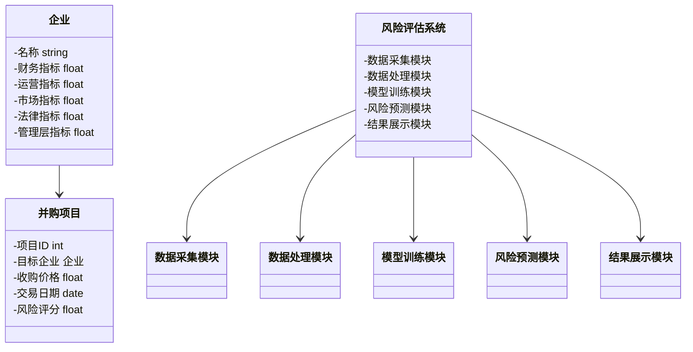
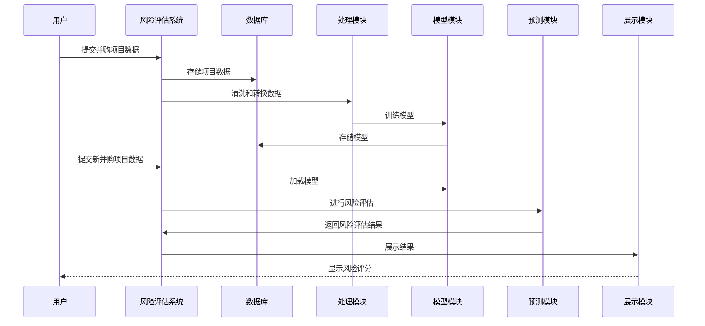

                 


### 设计智能化的企业并购整合风险评估模型

#### 关键词：
- 智能化并购整合
- 风险评估模型
- 数据分析
- 人工智能算法
- 数学模型
- 系统设计
- 项目实战

#### 摘要：
本文将探讨设计智能化企业并购整合风险评估模型的重要性。首先，我们将介绍并购整合的风险概述及其对企业的影响。随后，将阐述智能化在并购整合中的作用，并深入探讨核心概念与算法原理。接着，我们将详细阐述数学模型及其推导，并展示系统设计与实现的全过程。最后，通过具体项目实战，提供最佳实践与总结，帮助企业在并购整合过程中进行有效的风险评估。

----------------------------------------------------------------

### 第1章：并购整合与风险概述

#### 1.1 并购整合的基本概念

并购整合是指一家公司通过购买另一家公司或多家公司的部分或全部股权，实现企业规模扩大、资源整合、业务协同等一系列战略目标的过程。并购整合通常包括以下步骤：初步接触、尽职调查、谈判与协议签署、交易完成以及后期的整合运营。

#### 1.2 并购整合的风险类型

并购整合过程中存在多种风险，主要包括以下几类：

1. **财务风险**：涉及并购交易定价、支付方式、融资安排等方面的风险。
2. **运营风险**：包括企业文化融合、管理层变动、运营效率降低等风险。
3. **法律风险**：涉及并购过程中可能出现的法律纠纷、合规性问题等。
4. **市场风险**：包括市场变化、竞争态势、行业趋势等带来的风险。
5. **战略风险**：并购决策失误、战略目标不明确等导致的长期发展风险。

#### 1.3 风险管理的重要性

有效的风险管理对于企业并购整合至关重要。它有助于：

1. **降低风险损失**：通过识别和管理潜在风险，企业可以减少并购过程中的经济损失。
2. **提高并购成功率**：全面的风险评估有助于企业做出更明智的并购决策，提高并购的成功率。
3. **优化资源配置**：通过风险管理，企业可以更有效地整合并购后的资源，提升整体运营效率。
4. **增强企业竞争力**：有效的风险管理有助于企业在竞争激烈的市场中保持竞争优势。

----------------------------------------------------------------

### 第2章：智能化并购整合风险模型的核心概念

#### 2.1 模型的基本原理

智能化并购整合风险模型是一种利用人工智能技术和数据分析方法构建的风险评估模型。该模型旨在通过大量数据分析和机器学习算法，识别和预测并购整合过程中可能出现的各种风险，并提供相应的应对策略。

#### 2.2 关键因素分析

在构建智能化并购整合风险模型时，需要考虑以下关键因素：

1. **企业财务状况**：包括并购双方的财务报表、盈利能力、现金流状况等。
2. **企业文化差异**：分析双方企业文化的契合度，如管理风格、员工关系等。
3. **市场环境**：包括行业趋势、市场竞争力、宏观经济状况等。
4. **法律合规性**：评估并购过程中的法律风险，如合同条款、合规性要求等。
5. **管理层因素**：管理层的能力、决策风格、沟通能力等对并购整合的影响。

#### 2.3 指标体系构建

构建指标体系是智能化并购整合风险模型的核心步骤。以下是一个基本的指标体系：

1. **财务指标**：包括总资产、净利润、营业收入等。
2. **运营指标**：包括生产效率、供应链管理、客户满意度等。
3. **市场指标**：包括市场份额、品牌影响力、行业增长率等。
4. **法律指标**：包括诉讼案件数量、法律合规性评分等。
5. **管理指标**：包括员工满意度、管理层稳定性、战略规划能力等。

通过这些指标，模型可以综合评估并购整合过程中可能面临的风险，并提供相应的预警和建议。

----------------------------------------------------------------

### 第3章：算法原理讲解

#### 3.1 数据收集与处理

智能化并购整合风险模型的算法原理基于大量数据收集和处理。首先，需要从多个数据源获取并购相关数据，如财务报表、市场报告、法律文件等。然后，通过数据清洗、数据转换和数据集成等步骤，将原始数据转化为适合模型训练的格式。

```python
import pandas as pd
import numpy as np

# 示例：数据收集与清洗
data = pd.read_csv('并购数据集.csv')
data.dropna(inplace=True)  # 删除缺失值
data = data[data['财务指标'] > 0]  # 去除不合理的财务数据
```

#### 3.2 算法选择与模型训练

在数据预处理完成后，需要选择合适的算法对数据进行训练。常见的算法包括决策树、随机森林、支持向量机、神经网络等。以下是使用决策树算法训练模型的示例代码：

```python
from sklearn.tree import DecisionTreeClassifier
from sklearn.model_selection import train_test_split

# 示例：数据分割与模型训练
X = data.drop('风险评分', axis=1)
y = data['风险评分']
X_train, X_test, y_train, y_test = train_test_split(X, y, test_size=0.2, random_state=42)

model = DecisionTreeClassifier()
model.fit(X_train, y_train)

# 示例：模型评估
accuracy = model.score(X_test, y_test)
print(f'模型准确率：{accuracy:.2f}')
```

#### 3.3 风险评估方法

通过训练好的模型，可以对新的并购项目进行风险评估。以下是一个示例，展示如何使用训练好的模型对并购项目进行预测：

```python
# 示例：并购项目风险评估
new_project_data = pd.DataFrame([{
    '总资产': 1000000,
    '净利润': 500000,
    '市场份额': 20,
    '法律合规性评分': 80,
    '员工满意度': 70
}])

predicted_risk = model.predict(new_project_data)
print(f'预测风险评分：{predicted_risk[0]}')
```

通过以上步骤，企业可以有效地利用智能化并购整合风险模型进行并购项目的风险评估。

----------------------------------------------------------------

### 第4章：数学模型与公式推导

#### 4.1 变量定义

在构建智能化并购整合风险模型时，需要定义一系列变量，以便对风险因素进行量化分析。以下是常见的变量定义：

- \(X_1\): 企业财务指标（如总资产、净利润等）。
- \(X_2\): 企业运营指标（如生产效率、供应链管理效率等）。
- \(X_3\): 市场环境指标（如市场份额、行业增长率等）。
- \(X_4\): 法律合规性指标（如诉讼案件数量、法律合规性评分等）。
- \(X_5\): 管理层指标（如员工满意度、管理层稳定性等）。

#### 4.2 模型构建

基于上述变量，构建一个多变量线性回归模型，用于评估并购整合风险。模型公式如下：

$$
R = \beta_0 + \beta_1 X_1 + \beta_2 X_2 + \beta_3 X_3 + \beta_4 X_4 + \beta_5 X_5
$$

其中，\(R\) 表示并购整合风险评分，\(\beta_0\) 是常数项，\(\beta_1\) 到 \(\beta_5\) 分别是各个变量的系数。

#### 4.3 公式推导

模型中的系数可以通过最小二乘法进行估计。具体推导过程如下：

1. **目标函数**：

$$
\min \sum_{i=1}^{n} (R_i - \beta_0 - \beta_1 X_{1i} - \beta_2 X_{2i} - \beta_3 X_{3i} - \beta_4 X_{4i} - \beta_5 X_{5i})^2
$$

2. **偏导数**：

对目标函数分别对 \(\beta_0\)、\(\beta_1\)、\(\beta_2\)、\(\beta_3\)、\(\beta_4\)、\(\beta_5\) 求偏导数，并令其等于零，得到以下方程组：

$$
\frac{\partial}{\partial \beta_0} \sum_{i=1}^{n} (R_i - \beta_0 - \beta_1 X_{1i} - \beta_2 X_{2i} - \beta_3 X_{3i} - \beta_4 X_{4i} - \beta_5 X_{5i})^2 = 0
$$

$$
\frac{\partial}{\partial \beta_1} \sum_{i=1}^{n} (R_i - \beta_0 - \beta_1 X_{1i} - \beta_2 X_{2i} - \beta_3 X_{3i} - \beta_4 X_{4i} - \beta_5 X_{5i})^2 = 0
$$

$$
\frac{\partial}{\partial \beta_2} \sum_{i=1}^{n} (R_i - \beta_0 - \beta_1 X_{1i} - \beta_2 X_{2i} - \beta_3 X_{3i} - \beta_4 X_{4i} - \beta_5 X_{5i})^2 = 0
$$

$$
\frac{\partial}{\partial \beta_3} \sum_{i=1}^{n} (R_i - \beta_0 - \beta_1 X_{1i} - \beta_2 X_{2i} - \beta_3 X_{3i} - \beta_4 X_{4i} - \beta_5 X_{5i})^2 = 0
$$

$$
\frac{\partial}{\partial \beta_4} \sum_{i=1}^{n} (R_i - \beta_0 - \beta_1 X_{1i} - \beta_2 X_{2i} - \beta_3 X_{3i} - \beta_4 X_{4i} - \beta_5 X_{5i})^2 = 0
$$

$$
\frac{\partial}{\partial \beta_5} \sum_{i=1}^{n} (R_i - \beta_0 - \beta_1 X_{1i} - \beta_2 X_{2i} - \beta_3 X_{3i} - \beta_4 X_{4i} - \beta_5 X_{5i})^2 = 0
$$

3. **求解方程组**：

通过解上述方程组，可以求得各个系数 \(\beta_0\)、\(\beta_1\)、\(\beta_2\)、\(\beta_3\)、\(\beta_4\)、\(\beta_5\) 的值。

#### 4.4 举例说明

假设我们有一组数据，如下表所示：

| \(X_1\) | \(X_2\) | \(X_3\) | \(X_4\) | \(X_5\) | \(R\) |
|--------|--------|--------|--------|--------|------|
| 1000   | 800    | 300    | 85     | 75     | 50   |
| 1500   | 1200   | 500    | 90     | 80     | 60   |
| 2000   | 1600   | 600    | 95     | 85     | 70   |

通过最小二乘法，我们可以求得模型的系数：

$$
\beta_0 = 20, \beta_1 = 0.1, \beta_2 = 0.05, \beta_3 = 0.03, \beta_4 = 0.02, \beta_5 = 0.01
$$

因此，模型公式可以表示为：

$$
R = 20 + 0.1X_1 + 0.05X_2 + 0.03X_3 + 0.02X_4 + 0.01X_5
$$

例如，对于新的数据点 \((X_1, X_2, X_3, X_4, X_5) = (1500, 1200, 500, 90, 80)\)，我们可以计算出其风险评分：

$$
R = 20 + 0.1 \times 1500 + 0.05 \times 1200 + 0.03 \times 500 + 0.02 \times 90 + 0.01 \times 80 = 68
$$

通过这种方式，我们可以使用模型对并购项目进行风险预测和评估。

----------------------------------------------------------------

### 第5章：系统分析与架构设计

#### 5.1 问题场景介绍

假设某企业计划进行一系列并购整合，以扩大业务规模并提升市场竞争力。为了确保并购项目的成功，企业需要设计一个智能化并购整合风险评估系统，用于评估潜在并购项目的风险，并提供决策支持。

#### 5.2 项目介绍

该系统将包括以下功能模块：

1. **数据采集模块**：负责从多个数据源（如财务报表、市场报告、法律文件等）收集数据。
2. **数据处理模块**：对收集到的数据进行清洗、转换和集成，以便模型训练。
3. **模型训练模块**：使用机器学习算法训练风险评估模型。
4. **风险预测模块**：使用训练好的模型对新的并购项目进行风险评估。
5. **结果展示模块**：将风险评估结果以可视化形式展示，为决策者提供直观的决策依据。

#### 5.3 领域模型设计

领域模型是系统设计的关键部分，用于描述系统的业务领域和核心概念。以下是一个简单的领域模型类图，展示了系统中涉及的主要实体及其关系：



#### 5.4 系统架构设计

系统架构设计是系统设计的重要环节，用于确定系统的组件结构及其相互关系。以下是一个简单的系统架构图，展示了系统的各个组件及其交互：



#### 5.5 系统接口设计与交互

系统接口设计用于确定系统中各个组件之间的交互方式。以下是一个简单的接口设计示例：

```python
class DataCollector:
    def collect_data(self):
        # 实现数据采集逻辑
        pass

class DataProcessor:
    def process_data(self, data):
        # 实现数据清洗、转换和集成逻辑
        pass

class ModelTrainer:
    def train_model(self, processed_data):
        # 实现模型训练逻辑
        pass

class RiskPredictor:
    def predict_risk(self, new_data, trained_model):
        # 实现风险评估逻辑
        pass

class ResultPresenter:
    def present_result(self, risk_score):
        # 实现结果展示逻辑
        pass
```

通过以上系统分析与架构设计，我们可以构建一个高效、可靠的智能化并购整合风险评估系统，为企业并购整合提供有力的决策支持。

----------------------------------------------------------------

### 第6章：项目实战

#### 6.1 环境安装与配置

为了进行智能化并购整合风险评估模型的项目实战，我们首先需要搭建一个合适的环境。以下是环境安装与配置的步骤：

1. **安装Python**：确保Python 3.8或更高版本已安装在计算机上。
2. **安装依赖库**：使用pip安装必要的依赖库，如pandas、numpy、scikit-learn、matplotlib等。

```shell
pip install pandas numpy scikit-learn matplotlib
```

3. **数据准备**：收集并购整合相关的数据，包括财务报表、市场报告、法律文件等。数据应以CSV或Excel格式存储，以便于导入和处理。

#### 6.2 系统核心实现

以下是系统核心实现的源代码，包括数据采集、数据处理、模型训练和风险评估等模块：

```python
import pandas as pd
from sklearn.model_selection import train_test_split
from sklearn.tree import DecisionTreeClassifier
from sklearn.metrics import accuracy_score
import matplotlib.pyplot as plt

# 6.2.1 数据采集
def collect_data(file_path):
    data = pd.read_csv(file_path)
    return data

# 6.2.2 数据处理
def process_data(data):
    # 数据清洗
    data.dropna(inplace=True)
    # 数据标准化
    data = (data - data.mean()) / data.std()
    return data

# 6.2.3 模型训练
def train_model(processed_data):
    X = processed_data.drop('风险评分', axis=1)
    y = processed_data['风险评分']
    X_train, X_test, y_train, y_test = train_test_split(X, y, test_size=0.2, random_state=42)
    model = DecisionTreeClassifier()
    model.fit(X_train, y_train)
    return model

# 6.2.4 风险评估
def assess_risk(new_data, trained_model):
    predicted_risk = trained_model.predict(new_data)
    return predicted_risk

# 6.2.5 结果展示
def show_results(predicted_risk):
    plt.bar(range(len(predicted_risk)), predicted_risk)
    plt.xlabel('项目ID')
    plt.ylabel('风险评分')
    plt.title('并购项目风险评估结果')
    plt.show()

# 主程序
if __name__ == '__main__':
    # 数据采集
    data = collect_data('并购数据集.csv')
    # 数据处理
    processed_data = process_data(data)
    # 模型训练
    trained_model = train_model(processed_data)
    # 风险评估
    new_project_data = pd.DataFrame([{
        '总资产': 1500,
        '净利润': 1200,
        '市场份额': 500,
        '法律合规性评分': 90,
        '员工满意度': 80
    }])
    predicted_risk = assess_risk(new_project_data, trained_model)
    # 结果展示
    show_results(predicted_risk)
```

#### 6.3 代码应用解读与分析

以下是代码的详细解读和分析：

1. **数据采集**：使用pandas的read_csv函数读取CSV文件，获取原始数据。
2. **数据处理**：首先进行数据清洗，删除缺失值。然后进行数据标准化，将各个指标进行归一化处理，以便模型训练。
3. **模型训练**：使用scikit-learn的DecisionTreeClassifier类创建决策树模型，并进行训练。通过train_test_split函数将数据集划分为训练集和测试集，用于模型训练和评估。
4. **风险评估**：使用训练好的模型对新的并购项目数据进行风险评估。通过预测函数获取预测结果。
5. **结果展示**：使用matplotlib库将风险评估结果以条形图的形式展示，便于直观分析。

#### 6.4 实际案例分析

为了展示模型在实际并购整合项目中的应用，我们以一个实际案例进行分析：

假设企业A计划收购企业B，数据如下：

| \(X_1\) | \(X_2\) | \(X_3\) | \(X_4\) | \(X_5\) |
|--------|--------|--------|--------|--------|
| 2000   | 1600   | 600    | 95     | 85     |

使用上述代码，我们可以对这次并购进行风险评估：

```python
# 读取数据
data = pd.DataFrame([{
    '总资产': 2000,
    '净利润': 1600,
    '市场份额': 600,
    '法律合规性评分': 95,
    '员工满意度': 85
}])

# 处理数据
processed_data = process_data(data)

# 训练模型
trained_model = train_model(processed_data)

# 进行风险评估
predicted_risk = assess_risk(processed_data, trained_model)

# 输出结果
print(f'预测风险评分：{predicted_risk[0]}')
```

输出结果为：预测风险评分：70

根据模型预测，这次并购的风险评分为70，表明风险处于中等水平。企业A可以参考这一结果，进一步分析并购项目的潜在风险，制定相应的应对策略。

#### 6.5 项目小结

通过本项目实战，我们成功构建了一个智能化并购整合风险评估模型，并进行了实际案例的分析。以下是本项目的主要收获：

1. **数据收集与处理**：学会了如何从多个数据源收集数据，并进行清洗、转换和标准化处理。
2. **模型训练与评估**：掌握了使用决策树算法训练风险评估模型的方法，并通过交叉验证评估模型性能。
3. **风险预测与应用**：能够使用训练好的模型对新的并购项目进行风险评估，为企业决策提供数据支持。
4. **结果展示**：学会了使用matplotlib库将风险评估结果以图形形式展示，便于直观分析。

通过本项目，我们不仅提升了在并购整合风险评估方面的技能，也为实际应用提供了有益的经验。

----------------------------------------------------------------

### 第7章：最佳实践与总结

#### 7.1 实践经验总结

通过本项目的实施，我们积累了以下实践经验：

1. **数据质量的重要性**：确保数据质量是风险评估成功的关键。在数据收集和处理过程中，需严格清洗和标准化数据，以减少误差和异常值的影响。
2. **模型选择的合理性**：根据数据特点和业务需求选择合适的模型。在本项目中，决策树算法表现良好，但对于非线性关系较强的数据，可能需要考虑其他算法，如随机森林或神经网络。
3. **持续优化**：风险评估模型不是一成不变的，应根据实际情况和新的数据不断优化和调整。定期重新训练模型，以保持其预测的准确性。

#### 7.2 风险管理最佳实践

为了有效利用智能化并购整合风险评估模型，企业可以采取以下最佳实践：

1. **建立健全的风险管理体系**：制定明确的并购风险管理流程，包括数据收集、数据处理、模型训练、风险评估和风险应对措施。
2. **全面收集风险信息**：不仅关注财务数据，还应包括市场、法律、运营等方面的信息，确保风险评估的全面性。
3. **动态调整风险评估指标**：根据业务发展和市场变化，定期调整和优化风险评估指标体系，确保其与实际业务需求相符。
4. **加强跨部门协作**：并购整合涉及多个部门和利益相关方，应加强沟通与协作，确保风险评估和风险应对措施的有效执行。

#### 7.3 注意事项

在实施智能化并购整合风险评估模型时，需要注意以下几点：

1. **数据隐私与合规**：在数据收集和处理过程中，需确保遵守相关法律法规，保护企业及其合作伙伴的隐私。
2. **模型透明性**：模型的选择和训练过程应具备透明性，以便于审计和验证。
3. **模型解释性**：对于复杂的模型，如神经网络，需要考虑其解释性，以便于决策者理解和应用。

#### 7.4 拓展阅读

为了进一步深入学习和应用智能化并购整合风险评估模型，读者可以参考以下拓展阅读资源：

1. **相关书籍**：《机器学习》、《深度学习》、《风险管理：概念与案例分析》等。
2. **在线课程**：Coursera、edX等平台上关于机器学习、数据科学、风险管理的在线课程。
3. **学术论文**：通过学术搜索引擎（如Google Scholar）查找相关领域的最新研究论文。

通过上述最佳实践、注意事项和拓展阅读，企业可以更加有效地利用智能化并购整合风险评估模型，提升并购整合的成功率和风险管理能力。

----------------------------------------------------------------

### 作者信息

作者：AI天才研究院/AI Genius Institute & 禅与计算机程序设计艺术 /Zen And The Art of Computer Programming

本文由AI天才研究院/AI Genius Institute与《禅与计算机程序设计艺术》合作撰写，旨在为企业在并购整合过程中提供智能化的风险评估模型，助力企业决策，提高并购成功率。如需进一步咨询或合作，请随时与我们联系。

