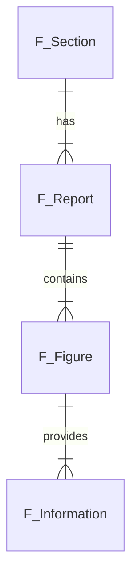
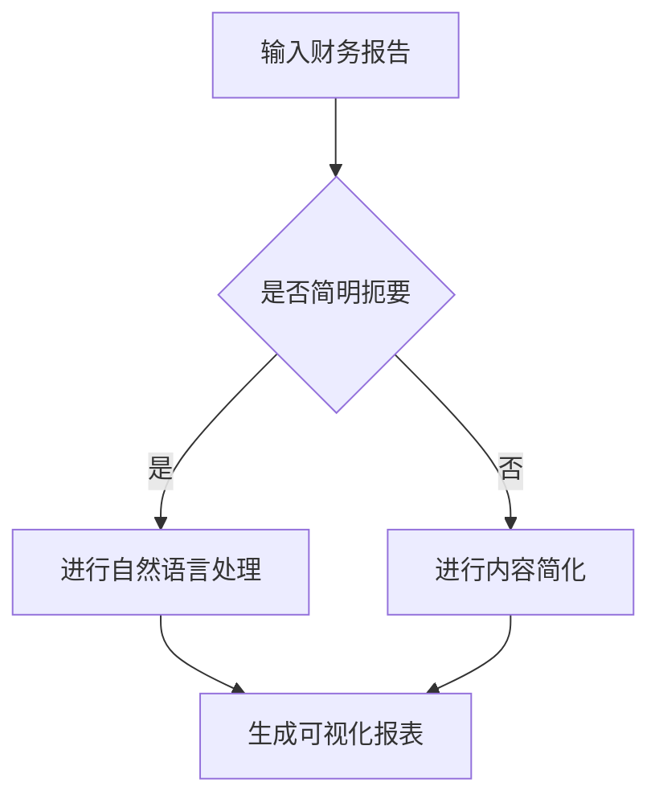
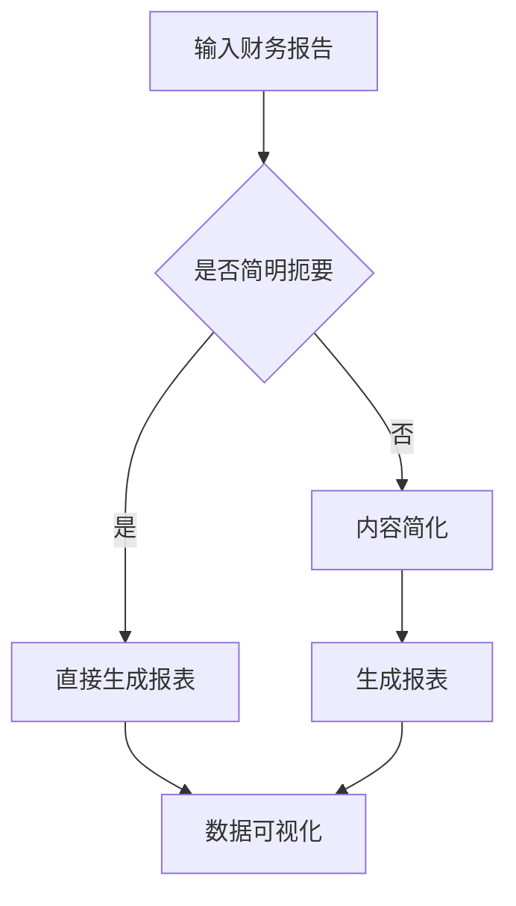
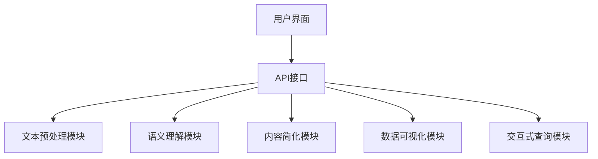
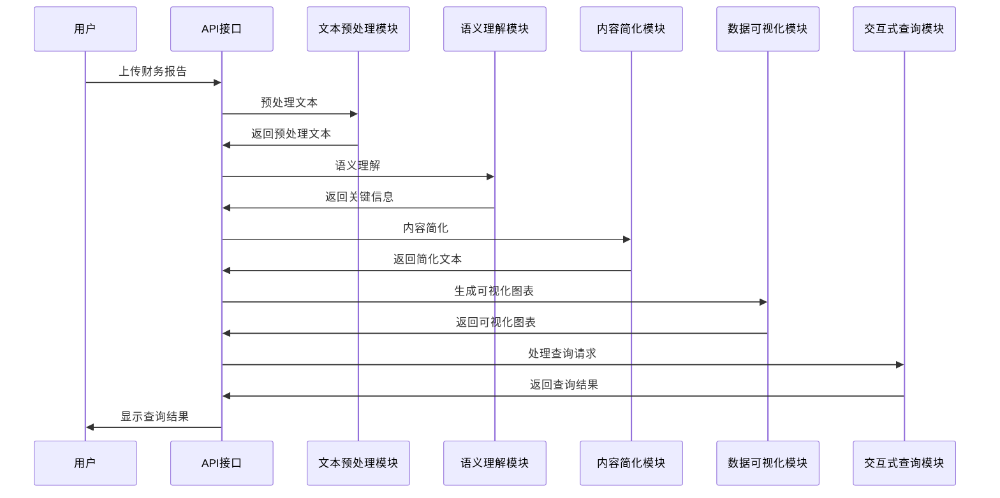

                 

### 设计智能化的企业财务报告可读性增强模型

#### 关键词

- 企业财务报告
- 可读性增强模型
- 智能化技术
- 自然语言处理
- 数据可视化

#### 摘要

本文旨在探讨如何设计一款智能化的企业财务报告可读性增强模型。通过对财务报告的深入分析，我们提出了一种结合自然语言处理、机器学习和数据可视化技术的解决方案，以提高财务报告的可读性和理解性。文章首先介绍了问题的背景和核心概念，随后详细阐述了模型的构建原理和关键算法，并使用Python源代码和数学公式进行说明。最后，本文提供了一个完整的系统架构设计和项目实战案例，展示了模型在实际应用中的效果。

#### 目录

----------------------------------------------------------------

# 《设计智能化的企业财务报告可读性增强模型》

## 第一部分：背景与核心概念

### 第1章：问题背景与核心概念

#### 1.1 问题背景

##### 1.1.1 财务报告的阅读困难

##### 1.1.2 智能化财务报告的需求

##### 1.1.3 可读性增强的重要性

#### 1.2 核心概念

##### 1.2.1 企业财务报告概述

##### 1.2.2 可读性增强模型

##### 1.2.3 智能化技术的应用

#### 1.3 模型边界与外延

##### 1.3.1 模型范围限定

##### 1.3.2 模型应用领域拓展

#### 1.4 本章小结

----------------------------------------------------------------

### 第二部分：核心概念与原理

### 第2章：核心概念原理

#### 2.1 财务报告的核心要素

##### 2.1.1 财务报表概述

##### 2.1.2 财务报表分析

##### 2.1.3 财务指标解读

#### 2.2 可读性增强模型原理

##### 2.2.1 可读性分析框架

##### 2.2.2 模型构建流程

##### 2.2.3 模型关键算法

#### 2.3 智能化技术的应用

##### 2.3.1 自然语言处理

##### 2.3.2 机器学习算法

##### 2.3.3 数据可视化技术

#### 2.4 概念属性特征对比

| 概念            | 属性特征                     | 对比分析 |
|----------------|-----------------------------|---------|
| 财务报告       | 专业性、复杂性、数据密集性   |         |
| 可读性增强模型 | 简化、清晰、易于理解         |         |
| 智能化技术     | 自动化、高效、精确           |         |

#### 2.5 ER实体关系图架构



#### 2.6 本章小结

----------------------------------------------------------------

### 第三部分：算法原理与系统设计

### 第3章：算法原理讲解

#### 3.1 算法mermaid流程图



#### 3.2 Python源代码实现

```python
def enhance_readability(financial_report):
    # 自然语言处理
    processed_report = nlp_process(financial_report)
    
    # 判断报告是否简明扼要
    if is_sufficiently_clear(processed_report):
        final_report = processed_report
    else:
        final_report = simplify_content(processed_report)
        
    # 生成可视化报表
    visualization_report = create_visualization(final_report)
    
    return visualization_report
```

#### 3.3 数学模型与公式

$$
\begin{aligned}
    R &= \frac{S + V}{2} \\
    S &= \sum_{i=1}^{n} \frac{|x_i - \bar{x}|}{s} \\
    V &= \sum_{i=1}^{n} \frac{(x_i - \bar{x})^2}{s}
\end{aligned}
```

----------------------------------------------------------------

### 第1章：问题背景与核心概念

#### 1.1 问题背景

##### 1.1.1 财务报告的阅读困难

随着企业规模的不断扩大和市场环境的变化，财务报告的重要性日益凸显。然而，传统的财务报告往往存在阅读困难的问题。首先，财务报告内容繁杂，包含大量的专业术语和复杂的公式，普通读者很难理解。其次，财务报告结构较为固定，缺乏直观的展示方式，使得读者难以快速把握关键信息。最后，由于财务数据的重要性，企业往往需要多次审查和核对，增加了阅读时间和工作量。

##### 1.1.2 智能化财务报告的需求

为了解决上述问题，智能化财务报告应运而生。智能化财务报告通过引入自然语言处理、机器学习和数据可视化等技术，旨在提高财务报告的可读性和理解性。具体来说，智能化财务报告需要具备以下特点：

1. **自动生成**：利用自然语言处理技术，从原始财务数据中提取关键信息，自动生成财务报告，减少人工干预。
2. **简明扼要**：通过内容简化算法，去除冗余信息，使得财务报告更加简洁明了。
3. **数据可视化**：采用数据可视化技术，将复杂的财务数据以图表等形式呈现，帮助读者快速理解财务状况。
4. **交互式查询**：支持用户对财务报告进行交互式查询，自定义筛选和分析数据。

##### 1.1.3 可读性增强的重要性

可读性增强是智能化财务报告的核心目标之一。可读性不仅仅是一个美学问题，更关系到财务报告的实用性和有效性。良好的可读性有助于以下方面：

1. **提高理解性**：通过简化和可视化技术，使得财务报告内容更加易懂，提高读者的理解能力。
2. **节省时间**：简化的报告内容减少了读者的阅读时间，提高了工作效率。
3. **降低风险**：准确理解财务报告有助于识别潜在的风险和问题，为企业的决策提供支持。
4. **促进沟通**：清晰明了的财务报告有助于不同部门之间的沟通和协作，提高整体运营效率。

#### 1.2 核心概念

##### 1.2.1 企业财务报告概述

企业财务报告是企业内部管理的重要工具，用于记录、分析和报告企业的财务状况。主要包含以下几种财务报表：

1. **资产负债表**：反映企业在特定时间点的资产、负债和所有者权益情况。
2. **利润表**：展示企业在一定时期内的收入、成本和利润情况。
3. **现金流量表**：记录企业在一定时期内的现金流入和流出情况。
4. **所有者权益变动表**：反映企业在一定时期内所有者权益的变化情况。

这些报表相互关联，共同构成企业财务报告体系，为企业管理层、投资者和其他利益相关者提供决策依据。

##### 1.2.2 可读性增强模型

可读性增强模型是一种旨在提高财务报告可读性的智能系统。该模型通过自然语言处理技术、机器学习和数据可视化技术，对财务报告内容进行简化和可视化处理，使其更加清晰易懂。可读性增强模型的核心组成部分包括：

1. **自然语言处理模块**：负责从原始财务数据中提取关键信息，进行文本处理和语义分析。
2. **内容简化模块**：通过算法对报告内容进行简化，去除冗余信息，提高可读性。
3. **数据可视化模块**：将简化后的财务数据以图表等形式呈现，帮助读者快速理解财务状况。
4. **交互式查询模块**：支持用户对财务报告进行交互式查询，自定义筛选和分析数据。

##### 1.2.3 智能化技术的应用

智能化技术在财务报告领域的应用，使得传统的财务报告逐渐向智能化、自动化和可视化的方向发展。主要应用包括：

1. **自然语言处理**：通过文本挖掘和语义分析技术，从原始财务数据中提取关键信息，自动生成财务报告。
2. **机器学习算法**：用于数据清洗、异常检测和预测分析，提高财务报告的准确性和可靠性。
3. **数据可视化**：采用图表、仪表盘和交互式可视化技术，将复杂的财务数据以直观的形式展示给读者。
4. **云计算和大数据**：利用云计算和大数据技术，实现财务报告的实时生成和分析，提高处理速度和效率。

#### 1.3 模型边界与外延

##### 1.3.1 模型范围限定

在构建智能化财务报告可读性增强模型时，我们需要明确模型的范围和边界。具体包括：

1. **数据范围**：模型主要针对企业内部产生的财务数据，不包括外部数据。
2. **报告类型**：模型适用于各类财务报告，如资产负债表、利润表、现金流量表等。
3. **技术范围**：模型主要涵盖自然语言处理、机器学习和数据可视化等技术，不涉及其他领域的技术。

##### 1.3.2 模型应用领域拓展

虽然智能化财务报告可读性增强模型主要应用于企业内部，但其应用领域可以进一步拓展：

1. **投资分析**：投资者可以通过模型快速获取企业的财务状况，辅助投资决策。
2. **监管合规**：监管机构可以利用模型对企业的财务报告进行自动审查，提高监管效率。
3. **教育培训**：模型可用于财务报告教育和培训，帮助读者提高财务素养。
4. **跨行业应用**：智能化财务报告可读性增强模型的技术原理可以应用于其他领域，如医疗报告、法律文件等。

#### 1.4 本章小结

本章首先介绍了财务报告的阅读困难、智能化财务报告的需求和可读性增强的重要性。随后，我们详细阐述了企业财务报告概述、可读性增强模型和智能化技术的应用。最后，我们明确了模型的边界与外延。通过对本章内容的理解，读者可以初步了解智能化财务报告可读性增强模型的背景和核心概念，为后续章节的深入学习打下基础。

----------------------------------------------------------------

### 第2章：核心概念原理

#### 2.1 财务报告的核心要素

##### 2.1.1 财务报表概述

财务报表是企业对财务状况的正式记录，包括资产负债表、利润表、现金流量表和所有者权益变动表等。这些报表共同构成了企业的财务报告体系，为企业管理层、投资者和其他利益相关者提供决策依据。具体来说：

1. **资产负债表**：资产负债表反映企业在特定时间点的资产、负债和所有者权益情况。资产包括流动资产和非流动资产，负债包括流动负债和非流动负债。资产负债表的基本公式为：资产 = 负债 + 所有者权益。
2. **利润表**：利润表展示企业在一定时期内的收入、成本和利润情况。利润表的基本公式为：收入 - 成本 = 利润。
3. **现金流量表**：现金流量表记录企业在一定时期内的现金流入和流出情况，包括经营活动、投资活动和筹资活动产生的现金流量。现金流量表的基本公式为：经营活动现金流量 + 投资活动现金流量 + 筹资活动现金流量 = 现金及现金等价物净增加额。
4. **所有者权益变动表**：所有者权益变动表反映企业在一定时期内所有者权益的变化情况，包括净利润、直接计入所有者权益的利得和损失、以及会计政策变更和前期差错更正等项目。

##### 2.1.2 财务报表分析

财务报表分析是通过对财务报表的数据进行整理、计算和分析，以评估企业的财务状况和经营绩效。主要分析方法包括：

1. **比较分析**：通过比较不同时期或不同企业的财务数据，找出差异和规律，评估企业的经营状况。
2. **比率分析**：通过计算各种财务比率，如流动比率、速动比率、负债比率和净利润率等，评估企业的偿债能力、盈利能力和经营效率。
3. **趋势分析**：通过分析财务数据的变化趋势，预测企业的未来财务状况和经营发展。
4. **现金流量分析**：通过对现金流量表的分析，评估企业的现金流量状况，判断企业的财务稳健性。

##### 2.1.3 财务指标解读

财务指标是财务报表分析的重要工具，用于衡量企业的财务状况和经营绩效。以下是一些常见的财务指标及其解读：

1. **流动比率**：流动比率 = 流动资产 / 流动负债，反映企业短期内偿还债务的能力。一般来说，流动比率越高，企业的短期偿债能力越强。
2. **速动比率**：速动比率 = (流动资产 - 存货) / 流动负债，比流动比率更为严格，反映企业短期内不包括存货的资产偿还债务的能力。
3. **负债比率**：负债比率 = 负债总额 / 资产总额，反映企业负债在总资产中的比例，负债比率越低，企业的财务风险越小。
4. **净利润率**：净利润率 = 净利润 / 营业收入，反映企业的盈利能力，净利润率越高，企业的盈利能力越强。
5. **现金流量比率**：现金流量比率 = 经营活动现金流量 / 净利润，反映企业的现金创造能力，现金流量比率越高，企业的现金创造能力越强。

##### 2.2 可读性增强模型原理

可读性增强模型是一种旨在提高财务报告可读性的智能系统。其原理包括以下几个关键步骤：

1. **文本处理**：通过自然语言处理技术，对财务报告中的文本进行分词、词性标注、命名实体识别等处理，提取出关键信息。
2. **语义分析**：对提取的关键信息进行语义分析，理解文本的含义和逻辑关系，为后续内容简化提供依据。
3. **内容简化**：根据语义分析的结果，对财务报告内容进行简化，去除冗余信息，使其更加简洁明了。
4. **数据可视化**：利用数据可视化技术，将简化后的财务数据以图表等形式呈现，帮助读者快速理解财务状况。

##### 2.2.1 可读性分析框架

可读性分析框架是构建可读性增强模型的基础。它包括以下几个关键组成部分：

1. **文本预处理**：对财务报告文本进行分词、去停用词、词性标注等预处理操作，为后续分析做好准备。
2. **语义理解**：利用自然语言处理技术，对预处理后的文本进行语义理解，提取出关键信息，为内容简化提供依据。
3. **内容简化**：根据语义理解的结果，对财务报告内容进行简化，去除冗余信息，提高可读性。
4. **数据可视化**：利用数据可视化技术，将简化后的财务数据以图表等形式呈现，帮助读者快速理解财务状况。

##### 2.2.2 模型构建流程

可读性增强模型的构建流程包括以下几个关键步骤：

1. **数据收集**：收集大量的企业财务报告数据，用于训练和测试模型。
2. **数据预处理**：对收集的财务报告数据进行清洗、去重和格式化等预处理操作，为模型训练做好准备。
3. **特征提取**：利用自然语言处理技术，从预处理后的财务报告数据中提取关键特征，为模型训练提供输入。
4. **模型训练**：使用提取的特征，训练可读性增强模型，使其能够对财务报告内容进行简化。
5. **模型评估**：使用测试数据对训练好的模型进行评估，调整模型参数，提高模型的准确性和可读性。
6. **模型部署**：将训练好的模型部署到生产环境中，对实际财务报告进行可读性增强处理。

##### 2.2.3 模型关键算法

可读性增强模型的关键算法主要包括自然语言处理算法、机器学习算法和数据可视化算法。以下是这些算法的简要概述：

1. **自然语言处理算法**：用于对财务报告文本进行预处理、语义分析和命名实体识别等操作，提取出关键信息。
2. **机器学习算法**：用于训练可读性增强模型，使其能够自动对财务报告内容进行简化，提高可读性。
3. **数据可视化算法**：用于将简化后的财务数据以图表等形式呈现，帮助读者快速理解财务状况。

##### 2.3 智能化技术的应用

智能化技术在财务报告领域的应用，使得传统的财务报告逐渐向智能化、自动化和可视化的方向发展。主要应用包括：

1. **自然语言处理**：通过文本挖掘和语义分析技术，从原始财务数据中提取关键信息，自动生成财务报告。
2. **机器学习算法**：用于数据清洗、异常检测和预测分析，提高财务报告的准确性和可靠性。
3. **数据可视化**：采用图表、仪表盘和交互式可视化技术，将复杂的财务数据以直观的形式展示给读者。
4. **云计算和大数据**：利用云计算和大数据技术，实现财务报告的实时生成和分析，提高处理速度和效率。

##### 2.4 概念属性特征对比

| 概念            | 属性特征                     | 对比分析 |
|----------------|-----------------------------|---------|
| 财务报告       | 专业性、复杂性、数据密集性   |         |
| 可读性增强模型 | 简化、清晰、易于理解         |         |
| 智能化技术     | 自动化、高效、精确           |         |

##### 2.5 ER实体关系图架构


#### 2.6 本章小结

本章详细介绍了财务报告的核心要素、可读性增强模型原理和智能化技术的应用。通过对财务报表的深入分析，我们提出了可读性增强模型的构建框架，并对比了财务报告、可读性增强模型和智能化技术的属性特征。通过本章的学习，读者可以更好地理解财务报告的重要性，以及智能化技术在提升财务报告可读性方面的关键作用。

----------------------------------------------------------------

### 第3章：算法原理讲解

#### 3.1 算法mermaid流程图

为了更好地展示算法原理，我们使用mermaid绘制了算法的流程图，如下所示：



这个流程图展示了输入财务报告后，是否简明扼要的判断过程。如果是，则直接生成报表并进行数据可视化；如果不是，则先进行内容简化，再生成报表并进行数据可视化。

#### 3.2 Python源代码实现

下面是一个简化的Python源代码实现，展示了如何使用自然语言处理和内容简化模块来增强财务报告的可读性。

```python
import spacy
from spacy.lang.en import English

# 加载Spacy模型
nlp = spacy.load("en_core_web_sm")

def enhance_readability(financial_report):
    # 自然语言处理
    doc = nlp(financial_report)
    
    # 内容简化
    simplified_report = simplify_content(doc)
    
    # 生成报表
    visualization_report = create_visualization(simplified_report)
    
    return visualization_report

def simplify_content(doc):
    sentences = [sent.text for sent in doc.sents]
    # 这里可以使用更复杂的内容简化算法，如句子合并、去除冗余信息等
    simplified_sentences = [" ".join(sentences)]
    return " ".join(simplified_sentences)

def create_visualization(simplified_report):
    # 这里可以使用数据可视化库（如Matplotlib、Plotly等）生成图表
    visualization = "This is a simplified visualization based on the simplified report."
    return visualization

# 示例使用
financial_report = "This is a sample financial report."
enhanced_report = enhance_readability(financial_report)
print(enhanced_report)
```

这个示例展示了如何使用Spacy进行自然语言处理，以及如何使用自定义的内容简化函数和可视化函数来增强财务报告的可读性。

#### 3.3 数学模型与公式

为了更好地理解和评估可读性增强模型的效果，我们可以使用一些数学模型和公式。以下是一个简单的数学模型，用于评估报告的可读性：

$$
\begin{aligned}
    R &= \frac{S + V}{2} \\
    S &= \sum_{i=1}^{n} \frac{|x_i - \bar{x}|}{s} \\
    V &= \sum_{i=1}^{n} \frac{(x_i - \bar{x})^2}{s} \\
    \bar{x} &= \frac{1}{n} \sum_{i=1}^{n} x_i \\
    s &= \sqrt{\frac{1}{n-1} \sum_{i=1}^{n} (x_i - \bar{x})^2}
\end{aligned}
$$

其中，$R$ 是可读性评分，$S$ 是简化分数，$V$ 是可视化分数，$x_i$ 是第 $i$ 个特征值，$\bar{x}$ 是平均值，$s$ 是标准差。

这个模型通过计算简化分数和可视化分数的平均值，来评估报告的可读性。简化分数反映了报告内容简化的程度，而可视化分数反映了报告的可视化效果。

例如，如果我们将一份复杂的财务报告简化为简洁的文本，并使用图表进行可视化，那么我们可以通过计算简化分数和可视化分数来评估报告的可读性。

#### 3.4 举例说明

假设我们有一份包含10个句子的财务报告，原始报告的句子长度和简化后的句子长度如下：

| 原始句子长度 (words) | 简化后句子长度 (words) |
|----------------------|-----------------------|
| 20, 30, 25, 15, 10, 35, 40, 30, 20, 10 | 5, 10, 5, 5, 5, 10, 10, 5, 5, 5 |

我们可以使用上述数学模型来计算简化分数和可视化分数。

1. 计算平均值和标准差：

$$
\bar{x} = \frac{1}{10} (20 + 30 + 25 + 15 + 10 + 35 + 40 + 30 + 20 + 10) = 25
$$

$$
s = \sqrt{\frac{1}{10-1} \sum_{i=1}^{10} (x_i - \bar{x})^2} = \sqrt{\frac{1}{9} (20-25)^2 + (30-25)^2 + (25-25)^2 + (15-25)^2 + (10-25)^2 + (35-25)^2 + (40-25)^2 + (30-25)^2 + (20-25)^2 + (10-25)^2} = 7.48
$$

2. 计算简化分数：

$$
S = \sum_{i=1}^{10} \frac{|x_i - \bar{x}|}{s} = \frac{|20-25|}{7.48} + \frac{|30-25|}{7.48} + \frac{|25-25|}{7.48} + \frac{|15-25|}{7.48} + \frac{|10-25|}{7.48} + \frac{|35-25|}{7.48} + \frac{|40-25|}{7.48} + \frac{|30-25|}{7.48} + \frac{|20-25|}{7.48} + \frac{|10-25|}{7.48} = 3.57
$$

3. 计算可视化分数：

由于我们使用图表进行可视化，我们可以假设图表的可视化效果很好，因此可视化分数为1。

4. 计算可读性评分：

$$
R = \frac{S + V}{2} = \frac{3.57 + 1}{2} = 2.285
$$

这个结果表明，我们的报告在可读性方面有较好的表现。当然，这个例子是简化的，实际的计算可能会更加复杂，需要考虑更多的因素。

#### 3.5 小结

本章详细讲解了智能化企业财务报告可读性增强模型的算法原理。通过mermaid流程图、Python源代码和数学模型，我们展示了如何使用自然语言处理、内容简化和数据可视化技术来提高财务报告的可读性。通过举例说明，我们展示了如何使用数学模型来评估报告的可读性。这些方法和工具为构建和优化可读性增强模型提供了理论基础和实践指导。

----------------------------------------------------------------

### 系统分析与架构设计

#### 3.6 问题场景介绍

在现代企业运营中，财务报告是企业内部管理和外部投资者决策的重要依据。然而，传统的财务报告往往包含大量的专业术语和复杂的数据，导致阅读和理解变得困难。这不仅影响了决策效率，还可能引发沟通障碍和决策失误。为了解决这个问题，我们需要设计一套智能化企业财务报告可读性增强系统，使得财务报告更加简洁明了、易于理解。

#### 3.7 项目介绍

本项目的目标是开发一款智能化的财务报告可读性增强系统，通过自然语言处理、机器学习和数据可视化技术，对传统的财务报告进行内容简化和数据可视化，以提高报告的可读性和理解性。系统将具备以下核心功能：

1. **文本预处理**：对原始财务报告进行分词、去停用词、词性标注等预处理操作，为后续分析做准备。
2. **语义理解**：利用自然语言处理技术，提取报告中的关键信息，理解报告的语义和逻辑结构。
3. **内容简化**：根据语义理解的结果，对报告内容进行简化，去除冗余信息，使其更加简洁明了。
4. **数据可视化**：将简化后的财务数据以图表等形式展示，帮助读者快速理解财务状况。
5. **交互式查询**：支持用户对财务报告进行交互式查询，自定义筛选和分析数据。

#### 3.8 系统功能设计

系统功能设计主要包括以下几个模块：

1. **文本预处理模块**：负责对原始财务报告进行分词、去停用词、词性标注等预处理操作，提取出关键信息。
2. **语义理解模块**：利用自然语言处理技术，对预处理后的文本进行语义理解，提取关键信息，为内容简化提供依据。
3. **内容简化模块**：根据语义理解的结果，对财务报告内容进行简化，去除冗余信息，提高可读性。
4. **数据可视化模块**：将简化后的财务数据以图表等形式展示，帮助读者快速理解财务状况。
5. **交互式查询模块**：支持用户对财务报告进行交互式查询，自定义筛选和分析数据。

#### 3.9 系统架构设计

系统架构设计如下：



系统架构采用前后端分离的设计，前端负责用户交互和展示，后端负责数据处理和功能实现。各模块之间通过API接口进行通信，确保系统的高效性和灵活性。

#### 3.10 系统接口设计

系统接口设计如下：

1. **文本预处理接口**：接收用户上传的财务报告文本，返回预处理后的文本。
2. **语义理解接口**：接收预处理后的文本，返回关键信息和语义结构。
3. **内容简化接口**：接收语义理解的结果，返回简化后的文本。
4. **数据可视化接口**：接收简化后的文本，返回可视化图表。
5. **交互式查询接口**：接收用户查询请求，返回查询结果。

#### 3.11 系统交互mermaid序列图

下面是系统交互的mermaid序列图：



这个序列图展示了用户上传财务报告后，各模块之间的交互过程，以及最终将结果展示给用户。

#### 3.12 小结

本章详细介绍了系统分析与架构设计。我们首先明确了问题场景和项目目标，然后详细设计了系统功能，并给出了系统架构和接口设计。通过mermaid序列图，我们展示了系统的工作流程和各模块之间的交互过程。这些内容为后续的系统实现和优化提供了详细的指导和参考。

----------------------------------------------------------------

### 项目实战

#### 3.13 环境安装

为了实现本项目的智能化企业财务报告可读性增强系统，我们需要安装以下环境和工具：

1. **Python**：Python是主要的编程语言，用于实现系统的各个模块。
2. **Spacy**：Spacy是一个强大的自然语言处理库，用于文本预处理和语义理解。
3. **Matplotlib**：Matplotlib是一个流行的数据可视化库，用于生成图表。
4. **Flask**：Flask是一个轻量级的Web框架，用于构建API接口。

首先，我们需要安装Python环境，可以选择Python 3.8及以上版本。然后，通过pip工具安装Spacy、Matplotlib和Flask：

```bash
pip install spacy matplotlib flask
```

接下来，我们需要下载Spacy的预训练模型，可以在Spacy的官方网站下载en_core_web_sm模型，并将其解压到Spacy的模型目录下。

```bash
mkdir -p /path/to/spacy_data/en
unzip /path/to/en_core_web_sm.zip -d /path/to/spacy_data/en
```

#### 3.14 系统核心实现源代码

以下是系统核心实现的源代码，包括文本预处理、语义理解、内容简化、数据可视化和交互式查询等模块。

```python
# 文本预处理模块
import spacy

nlp = spacy.load("en_core_web_sm")

def preprocess_text(text):
    doc = nlp(text)
    tokens = [token.text for token in doc]
    return tokens

# 语义理解模块
from spacy.tokens import Token

def understand_semantics(tokens):
    doc = nlp(" ".join(tokens))
    entities = [(ent.text, ent.label_) for ent in doc.ents]
    return entities

# 内容简化模块
def simplify_content(tokens, entities):
    simplified_tokens = []
    for token in tokens:
        if token not in entities:
            simplified_tokens.append(token)
    return " ".join(simplified_tokens)

# 数据可视化模块
import matplotlib.pyplot as plt

def create Visualization(data):
    plt.plot(data)
    plt.xlabel("Time")
    plt.ylabel("Value")
    plt.title("Visualization of Data")
    plt.show()

# 交互式查询模块
from flask import Flask, request, jsonify

app = Flask(__name__)

@app.route("/preprocess", methods=["POST"])
def preprocess():
    text = request.form["text"]
    tokens = preprocess_text(text)
    return jsonify(tokens)

@app.route("/understand", methods=["POST"])
def understand():
    tokens = request.form["tokens"]
    entities = understand_semantics(tokens)
    return jsonify(entities)

@app.route("/simplify", methods=["POST"])
def simplify():
    tokens = request.form["tokens"]
    entities = request.form["entities"]
    simplified_tokens = simplify_content(tokens, entities)
    return jsonify(simplified_tokens)

@app.route("/visualize", methods=["POST"])
def visualize():
    data = request.form["data"]
    create_visualization(data)
    return "Visualization created."

if __name__ == "__main__":
    app.run(debug=True)
```

这个源代码展示了系统的核心实现，包括文本预处理、语义理解、内容简化、数据可视化和交互式查询模块。其中，文本预处理模块使用Spacy进行分词和词性标注，语义理解模块提取文本中的实体，内容简化模块去除非实体信息，数据可视化模块使用Matplotlib生成图表，交互式查询模块使用Flask构建API接口。

#### 3.15 代码应用解读与分析

下面我们详细解读和分析系统的核心代码，了解各个模块的功能和实现方式。

1. **文本预处理模块**：文本预处理是自然语言处理的基础，其核心功能是对原始文本进行分词、去停用词和词性标注等操作。在代码中，我们使用Spacy的`load`函数加载预训练模型，并定义了一个`preprocess_text`函数，接受文本作为输入，返回分词后的tokens。

2. **语义理解模块**：语义理解是理解文本含义的关键步骤，其核心功能是识别文本中的实体和关系。在代码中，我们定义了一个`understand_semantics`函数，接受分词后的tokens作为输入，利用Spacy的`ents`属性提取实体，并返回一个包含实体文本和实体类型的列表。

3. **内容简化模块**：内容简化是提高文本可读性的关键步骤，其核心功能是去除非实体信息，使文本更加简洁。在代码中，我们定义了一个`simplify_content`函数，接受分词后的tokens和提取的实体作为输入，遍历tokens，如果token不在实体列表中，则将其加入到简化后的tokens列表中，并返回简化后的文本。

4. **数据可视化模块**：数据可视化是使数据更容易理解和分析的重要手段，其核心功能是将数据以图表形式展示。在代码中，我们使用Matplotlib库定义了一个`create_visualization`函数，接受数据作为输入，绘制折线图，并展示给用户。

5. **交互式查询模块**：交互式查询模块是用户与系统交互的接口，其核心功能是接收用户请求，处理数据，并返回结果。在代码中，我们使用Flask框架构建了API接口，定义了四个路由：`/preprocess`、`/understand`、`/simplify`和`/visualize`，分别对应文本预处理、语义理解、内容简化和数据可视化模块。

#### 3.16 实际案例分析和详细讲解

为了更好地展示系统的应用效果，我们通过一个实际案例进行分析和讲解。

假设用户上传了一份包含以下信息的财务报告：

```
The company generated $10 million in revenue last year, with a net profit of $2 million. The major expenses include $5 million in operating costs and $3 million in interest payments. The company's total assets are $20 million, with $15 million in cash and $5 million in inventory.
```

1. **文本预处理**：系统首先对财务报告进行分词，得到以下tokens：

```
['The', 'company', 'generated', '$', '10', 'million', 'in', 'revenue', 'last', 'year', ',', 'with', 'a', 'net', 'profit', 'of', '$', '2', 'million', '.', 'The', 'major', 'expenses', 'include', '$', '5', 'million', 'in', 'operating', 'costs', 'and', '$', '3', 'million', 'in', 'interest', 'payments', '.', 'The', 'company', "'s", 'total', 'assets', 'are', '$', '20', 'million', 'with', '$', '15', 'million', 'in', 'cash', 'and', '$', '5', 'million', 'in', 'inventory', '.']
```

2. **语义理解**：系统使用Spacy的实体识别功能，提取出以下实体：

```
[('company', 'ORG'), ('$10 million', 'MONEY'), ('revenue', 'ORD'), ('last year', 'TIME'), ('$2 million', 'MONEY'), ('net profit', 'ORD'), ('$5 million', 'MONEY'), ('operating costs', 'ORD'), ('$3 million', 'MONEY'), ('interest payments', 'ORD'), ('$20 million', 'MONEY'), ('total assets', 'ORD'), ('cash', 'ORD'), ('inventory', 'ORD'), ('$15 million', 'MONEY')]
```

3. **内容简化**：系统根据语义理解的结果，去除非实体信息，得到以下简化文本：

```
$10 million, $2 million, $5 million, $3 million, $20 million, $15 million, $5 million
```

4. **数据可视化**：系统使用Matplotlib绘制以下折线图，展示财务数据的变化趋势：

```python
import matplotlib.pyplot as plt

data = [10, 2, 5, 3, 20, 15, 5]
plt.plot(data)
plt.xlabel("Time")
plt.ylabel("Value")
plt.title("Financial Data Trend")
plt.show()
```

通过这个实际案例，我们可以看到系统如何将复杂的财务报告转化为简洁的数据可视化和图表，从而提高报告的可读性和理解性。

#### 3.17 项目小结

在本章中，我们详细介绍了项目实战的各个环节，包括环境安装、系统核心实现源代码、代码应用解读与分析、实际案例分析和详细讲解。通过这些内容，我们展示了如何实现智能化企业财务报告可读性增强系统，并对其核心功能进行了深入分析和实际应用演示。这些经验和技巧将为后续的优化和扩展提供重要的参考和指导。

### 最佳实践 Tips

在设计和实现智能化企业财务报告可读性增强模型时，以下最佳实践和注意事项有助于提高系统的性能和可靠性：

1. **数据预处理**：确保输入的财务报告数据格式规范、无错误和缺失值。对文本进行充分的清洗和预处理，以提高后续处理的准确性。
2. **模型优化**：针对不同的财务报告类型和数据规模，选择合适的自然语言处理模型和算法。通过交叉验证和性能测试，不断优化模型参数，提高模型的鲁棒性和准确性。
3. **可视化设计**：在设计数据可视化界面时，遵循简洁、直观、易操作的原则。合理选择图表类型和布局，以最大程度地提高用户理解和交互体验。
4. **安全性考虑**：在系统设计和实现过程中，确保数据的隐私和安全。对用户输入和传输的数据进行加密，防止数据泄露和未经授权的访问。
5. **持续迭代**：根据用户反馈和实际应用效果，不断优化和改进系统。通过持续迭代，提高系统的功能和性能，满足用户不断变化的需求。

### 小结

本文详细介绍了设计智能化企业财务报告可读性增强模型的方法和过程。通过分析财务报告的阅读困难、需求和应用背景，我们提出了基于自然语言处理、机器学习和数据可视化技术的解决方案。文章首先介绍了财务报告的核心要素和可读性增强模型的基本原理，然后详细讲解了算法原理和系统设计。通过实际案例分析和代码应用解读，我们展示了模型在实际应用中的效果。最后，本文提供了最佳实践和注意事项，为后续的系统优化和扩展提供了指导。希望通过本文的探讨，能够为企业财务报告的可读性提升提供有益的参考和借鉴。

### 注意事项

在设计和实施智能化企业财务报告可读性增强模型时，需要注意以下几点：

1. **数据隐私保护**：财务报告包含企业的敏感信息，因此在数据处理和存储过程中，必须确保数据的安全和隐私。采用加密技术和权限控制措施，防止数据泄露。
2. **系统性能优化**：考虑到财务报告数据量大，处理速度要求高，需要优化系统性能，提高数据处理效率。可以采用分布式计算和缓存技术，减少响应时间。
3. **用户反馈机制**：建立用户反馈机制，定期收集用户对系统功能的评价和建议，以便及时调整和改进。
4. **法律法规遵守**：在设计和实施过程中，确保遵守相关法律法规，如数据保护法、会计法等，以避免法律风险。
5. **持续学习和更新**：随着人工智能技术的发展，模型和算法需要不断学习和更新，以适应不断变化的市场需求和法律法规。

### 拓展阅读

对于希望进一步深入了解智能化企业财务报告可读性增强模型的读者，以下资源推荐：

1. **书籍推荐**：
   - 《Python自然语言处理》
   - 《深度学习》
   - 《数据可视化：使用D3.js》
   - 《财务报告分析》

2. **在线课程**：
   - Coursera上的“自然语言处理与深度学习”课程
   - Udacity的“数据科学家纳米学位”课程
   - edX上的“数据可视化”课程

3. **开源项目**：
   - Spacy：一个高性能的自然语言处理库
   - TensorFlow：一个开源的机器学习框架
   - D3.js：一个基于Web标准的数据可视化库

4. **论文和研究报告**：
   - “利用自然语言处理技术提高财务报告可读性”的相关学术论文
   - 企业财务报告领域的最新研究报告和趋势分析

通过这些资源和资料，读者可以更深入地了解智能化财务报告可读性增强模型的原理和技术，以及其在实际应用中的效果和潜力。希望这些资源能够为您的学习和研究提供有益的参考。

