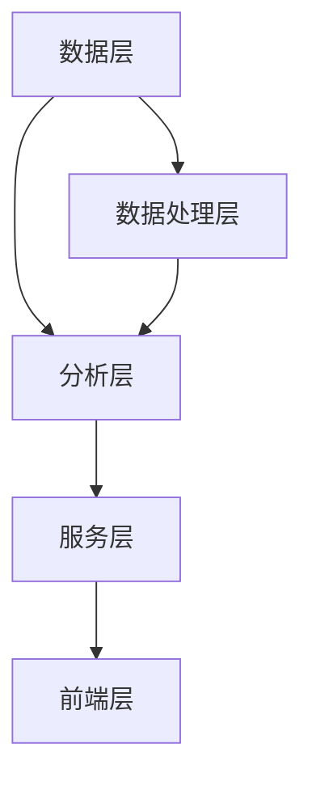

                 

### 引言

在现代商业环境中，企业财务报表的可比性动态评分系统正日益成为财务管理和决策支持的重要工具。随着大数据和人工智能技术的迅猛发展，传统的财务报表分析方法逐渐暴露出其局限性，如人工判断的主观性、效率低下以及数据分析的深度不足等问题。为了解决这些问题，智能化财务报表可比性动态评分系统的设计显得尤为迫切。

本篇文章旨在探讨如何设计智能化的企业财务报表可比性动态评分系统。通过分析该系统的关键概念、应用智能化技术的原理以及具体实现方法，文章将提供一个系统的框架，帮助读者深入理解这一创新领域。文章的主要目的是：

1. **介绍核心概念**：明确智能化、财务报表、可比性和动态评分系统的定义及其相互关系。
2. **分析现状与挑战**：探讨当前企业财务报表分析中的问题和挑战，展示智能化系统的重要性和潜力。
3. **深入技术原理**：讲解智能化技术在财务报表中的应用，以及机器学习算法在财务报表评分中的具体应用。
4. **详细设计实现**：介绍系统总体设计、数据预处理、评分模型设计与实现、系统性能评估等方面的内容。
5. **实际案例分析**：通过具体案例展示系统开发与实现的过程，并对比不同算法在财务报表评分中的应用效果。
6. **系统优化与展望**：提出系统优化策略，展望未来智能化财务报表评分系统的发展趋势。

智能化财务报表可比性动态评分系统不仅能够提高财务报表的可比性和准确性，还能够为企业提供更深入的数据分析和决策支持，有助于提升企业的竞争力和财务管理水平。本文将逐步深入分析这一系统，让读者全面了解其设计理念、技术原理和应用实践。

## 第1章 问题背景与核心概念

### 1.1 问题背景

企业财务报表是企业财务状况、经营成果和现金流量的集中体现，是企业内外部利益相关者了解企业财务状况、评估企业价值和做出决策的重要依据。然而，在传统的财务报表分析方法中，存在诸多问题，导致其无法完全满足现代商业环境的需求。

首先，传统的财务报表分析方法往往依赖于人工判断，主观性较强。财务分析师在分析财务数据时，可能会受到个人经验和直觉的影响，导致分析结果的可信度和准确性受到影响。

其次，传统的财务报表分析方法效率低下。财务报表数据量庞大，人工分析过程繁琐且耗时，难以满足快速变化的市场环境和企业快速决策的需求。

再者，传统的财务报表分析方法在数据分析深度上存在不足。虽然可以提供基本的数据统计和分析，但难以深入挖掘数据的潜在价值，为企业提供更全面、深入的决策支持。

为了解决这些问题，企业需要一种更加智能、高效、准确的财务报表分析工具。智能化财务报表可比性动态评分系统的设计应运而生，它能够利用大数据和人工智能技术，对企业财务报表进行深度分析和智能评分，从而提高财务报表的可比性和准确性。

### 1.2 核心概念介绍

在本节中，我们将介绍智能化、财务报表、可比性和动态评分系统等核心概念，并探讨这些概念之间的相互关系。

#### 1.2.1 智能化概念解析

智能化是指通过应用人工智能、机器学习、大数据等先进技术，使系统具备自主学习和决策能力的过程。在财务报表分析中，智能化技术的应用主要体现在以下几个方面：

1. **自动化分析**：利用人工智能技术，实现财务数据的自动化提取、处理和分析，减少人工干预，提高分析效率。
2. **智能预测**：通过机器学习算法，对历史财务数据进行分析和建模，预测未来财务趋势，为企业决策提供数据支持。
3. **智能评分**：基于大数据分析，对企业财务报表中的各项指标进行智能评分，提供更为准确和客观的财务分析结果。

#### 1.2.2 财务报表基础知识

财务报表是企业经济活动的反映，包括资产负债表、利润表和现金流量表等。这些报表通过数字和图表的形式，展示了企业的财务状况、经营成果和现金流量。

1. **资产负债表**：反映企业在一定时间内的资产、负债和股东权益状况，是企业财务状况的“快照”。
2. **利润表**：展示企业在一定时间内的收入、成本、费用和利润，是评估企业经营成果的重要指标。
3. **现金流量表**：展示企业在一定时间内的现金流入和流出情况，是企业现金流管理的重要依据。

#### 1.2.3 可比性与动态评分

可比性是指不同企业或同一企业在不同时间点的财务报表数据可以进行比较和评估。在财务报表分析中，可比性至关重要，因为它可以帮助企业识别自身在财务状况、经营成果和现金流量等方面的优势和劣势。

动态评分系统是一种能够实时分析财务报表数据，并根据数据变化动态调整评分的系统。它通过以下方式提高财务报表的可比性：

1. **实时数据分析**：动态评分系统可以实时获取和分析企业的财务数据，确保数据的实时性和准确性。
2. **动态调整评分**：根据企业的财务数据变化，动态调整评分，反映企业财务状况的实时变化。
3. **提高评分准确性**：通过智能化技术，对财务数据进行分析和评分，提高评分的准确性和客观性。

#### 1.2.4 关键概念联系与对比

以下是智能化、财务报表、可比性和动态评分系统之间的联系和对比表格：

| 关键概念 | 定义 | 应用场景 | 对比 |
| :----: | :----: | :----: | :----: |
| 智能化 | 利用人工智能、大数据等技术提高系统自主学习和决策能力 | 财务报表自动化分析、智能预测和智能评分 | - 与财务报表：财务报表是智能化的数据来源和输出对象<br>- 与可比性：智能化技术可以提高财务报表数据的可比性和准确性<br>- 与动态评分：智能化技术是动态评分系统的核心驱动力 |
| 财务报表 | 反映企业财务状况、经营成果和现金流量的报表 | 资产负债表、利润表、现金流量表等 | - 与智能化：财务报表是智能化的基础数据来源<br>- 与可比性：财务报表是可比性的基础对象 |
| 可比性 | 不同企业或同一企业在不同时间点的财务报表数据可以进行比较和评估 | 评估企业财务状况、经营成果和现金流量 | - 与智能化：可比性依赖于智能化的数据分析结果<br>- 与动态评分：可比性是动态评分的基础 |
| 动态评分 | 实时分析财务报表数据，并根据数据变化动态调整评分的系统 | 提高财务报表数据的实时性和准确性 | - 与智能化：动态评分系统依赖于智能化技术<br>- 与可比性：动态评分提高财务报表数据的可比性 |

通过上述表格，我们可以更清晰地理解智能化、财务报表、可比性和动态评分系统之间的相互关系。智能化技术为财务报表的可比性和动态评分提供了强大的支持，而财务报表和可比性则是智能化技术应用的基础和输出对象。

### 第2章 智能化技术在财务报表中的应用

#### 2.1 概述

智能化技术在财务报表中的应用正在不断拓展，其核心目标是通过大数据和人工智能技术，提高财务报表分析的速度、准确性和深度。随着商业环境的变化和大数据时代的到来，传统财务报表分析方法已无法满足现代企业的需求，智能化技术成为提升企业财务管理水平的关键。

智能化技术在财务报表中的应用主要包括以下几个方面：

1. **自动化数据提取和处理**：利用自然语言处理（NLP）和图像识别技术，自动化提取和处理财务报表数据，减少人工工作量，提高数据处理的效率。
2. **实时数据分析与监控**：通过实时数据分析技术，对财务报表数据进行实时监控和分析，及时发现潜在问题和风险。
3. **智能预测与决策支持**：利用机器学习算法和大数据分析，对财务数据进行建模和预测，为企业提供决策支持。
4. **动态评分与评估**：通过动态评分系统，对企业的财务报表进行实时评分和评估，提高财务报表的可比性和准确性。

#### 2.2 人工智能在财务报表分析中的应用

人工智能（AI）在财务报表分析中的应用，极大地提升了财务数据的处理和分析能力。以下是一些具体的应用案例：

1. **自动化的财务报表生成**：通过AI技术，可以自动识别和提取财务报表中的数据，生成详细的财务报表，减少了人工工作量。
   
   **案例**：某大型企业采用AI技术，实现了财务报表自动生成功能，每天生成的财务报表从原来的两天缩短到几小时。

2. **异常检测和风险预警**：AI可以分析财务数据，识别异常交易和潜在风险，为企业提供预警。

   **案例**：某银行利用AI技术对客户的交易记录进行分析，成功发现多起欺诈行为，避免了潜在损失。

3. **财务预测与分析**：利用机器学习算法，AI可以对历史财务数据进行建模，预测未来的财务状况。

   **案例**：一家零售企业通过AI技术，预测了未来几个月的销售额，并根据预测结果调整库存和营销策略，提高了经营效率。

#### 2.3 机器学习算法在财务报表评分中的应用

机器学习算法在财务报表评分中的应用，使得财务评分更加客观和准确。以下是一些常见的机器学习算法及其在财务报表评分中的应用：

1. **线性回归**：通过分析历史财务数据，建立线性模型，预测企业的未来财务状况。

   **案例**：一家制造企业利用线性回归模型，预测了未来一年的销售额和利润，为管理层提供了决策依据。

2. **决策树**：通过树形结构对财务数据进行分类和预测。

   **案例**：某金融机构利用决策树算法，对客户的信用风险进行分类，有效降低了坏账率。

3. **神经网络**：通过多层神经网络，对复杂财务数据进行深度学习和预测。

   **案例**：一家能源公司利用神经网络模型，预测了未来几个月的能源消耗和成本，优化了能源采购和分配策略。

4. **支持向量机（SVM）**：通过寻找最佳超平面，对财务数据进行分类。

   **案例**：某投资公司利用SVM算法，对投资项目进行风险评估，提高了投资决策的准确性。

通过上述案例可以看出，智能化技术在财务报表分析中的应用，不仅提高了财务报表的生成和处理效率，还通过机器学习算法的应用，实现了财务评分的智能化，为企业提供了更准确、客观的财务分析结果。这些技术的应用，极大地提升了企业财务管理水平，为企业的发展提供了有力支持。

### 第3章 可比性动态评分系统设计

#### 3.1 系统总体设计

设计一个可比性动态评分系统，需要考虑系统的整体架构、功能模块划分以及各个模块之间的相互作用。以下是对系统总体设计的详细介绍：

##### 3.1.1 系统架构设计

系统的架构设计是系统成功的关键之一。为了实现高效、可扩展和灵活的系统设计，我们采用了分层架构，主要包括以下几层：

1. **数据层**：负责数据的存储和管理，包括财务报表数据、用户数据以及系统配置数据等。
2. **数据处理层**：负责数据的清洗、转换和预处理，确保数据的质量和一致性。
3. **分析层**：利用机器学习算法，对财务报表数据进行分析和建模，生成评分结果。
4. **服务层**：提供API接口，供前端应用调用，实现数据的读取、处理和展示。
5. **前端层**：提供用户界面，用户可以通过前端应用与系统进行交互，查看评分结果。

以下是一个简单的系统架构图，使用Mermaid绘制：



##### 3.1.2 系统功能模块划分

系统功能模块的划分有助于明确各个模块的功能和职责，提高系统的可维护性和扩展性。以下是系统的主要功能模块及其功能描述：

1. **数据采集模块**：负责从各种数据源（如企业财务系统、数据库等）中采集财务报表数据。
2. **数据预处理模块**：对采集到的数据进行分析、清洗和转换，确保数据的质量和一致性。
3. **评分模型模块**：实现评分模型的训练和优化，生成评分结果。
4. **结果展示模块**：通过可视化界面，将评分结果展示给用户，支持用户对结果进行查看和分析。
5. **用户管理模块**：提供用户注册、登录和权限管理等功能，确保系统的安全性和可访问性。

#### 3.2 数据预处理

数据预处理是评分系统的重要组成部分，其质量直接影响到评分结果的准确性。数据预处理主要包括以下步骤：

##### 3.2.1 数据来源与采集

数据来源主要包括企业内部的财务系统、外部市场数据以及公开的财务报表数据。以下是一些常见的数据采集方法：

1. **API接口**：通过企业的财务系统API接口，直接获取财务报表数据。
2. **网络爬虫**：利用网络爬虫技术，从公开的财务报表网站上采集数据。
3. **数据库导出**：从企业的数据库中直接导出财务报表数据。

##### 3.2.2 数据清洗与转换

数据清洗与转换是确保数据质量和一致性的关键步骤。主要任务包括：

1. **缺失值处理**：对于缺失的数据，采用插补方法或删除缺失值。
2. **异常值检测**：检测并处理异常值，如异常的交易记录或异常的财务指标。
3. **数据标准化**：对数据进行标准化处理，使其符合统一的格式和范围。
4. **特征工程**：提取和构造有助于评分模型的关键特征，如财务比率、趋势指标等。

##### 3.2.3 数据质量评估

在数据预处理完成后，需要对数据质量进行评估，确保数据符合评分系统的要求。主要评估指标包括：

1. **完整性**：检查数据是否完整，缺失的数据量是否在可接受范围内。
2. **一致性**：检查数据是否一致，是否存在矛盾或重复的数据。
3. **准确性**：检查数据是否准确，是否存在错误或异常值。

通过以上步骤，确保预处理后的数据质量，为评分模型的训练和优化提供可靠的数据基础。

#### 3.3 评分模型设计与实现

评分模型是可比性动态评分系统的核心，其设计直接关系到评分结果的准确性和可靠性。以下是对评分模型设计与实现的详细介绍：

##### 3.3.1 模型选择与设计

选择合适的评分模型是系统设计的关键。常见的评分模型包括线性回归、决策树、支持向量机（SVM）和神经网络等。以下是几种常用模型的简单介绍：

1. **线性回归**：通过建立线性模型，预测目标变量的值。适用于目标变量为连续值的情况。
2. **决策树**：通过树形结构对数据集进行分类和预测。适用于特征较少、分类任务的情况。
3. **支持向量机（SVM）**：通过寻找最佳超平面，对数据进行分类。适用于高维数据分类任务。
4. **神经网络**：通过多层神经网络，对复杂数据进行分析和预测。适用于需要复杂非线性关系预测的情况。

根据具体应用场景和数据特点，可以选择合适的模型进行设计。以下是一个使用Python实现线性回归模型的示例代码：

```python
import numpy as np
from sklearn.linear_model import LinearRegression

# 数据准备
X = np.array([[1], [2], [3], [4], [5]])
y = np.array([2, 4, 5, 4, 5])

# 模型训练
model = LinearRegression()
model.fit(X, y)

# 模型预测
predictions = model.predict(X)

print(predictions)
```

##### 3.3.2 模型实现与优化

在评分模型设计完成后，需要对其进行实现和优化，以提高模型的准确性和稳定性。以下是一些优化策略：

1. **超参数调优**：通过交叉验证和网格搜索等技术，寻找最优的超参数组合，提高模型性能。
2. **模型融合**：将多个模型的结果进行融合，提高整体预测准确性。
3. **特征选择**：通过特征选择技术，选择对模型影响最大的特征，减少模型的复杂度和过拟合风险。
4. **数据增强**：通过增加训练数据、引入噪声等方式，提高模型的泛化能力。

通过以上优化策略，可以显著提升评分模型的性能，为可比性动态评分系统提供更加准确和可靠的评分结果。

#### 3.4 系统性能评估

系统性能评估是确保可比性动态评分系统稳定运行和高效工作的重要环节。以下是对系统性能评估的详细介绍：

##### 3.4.1 评估指标与方法

系统性能评估主要包括以下指标：

1. **准确率**：模型预测正确的样本数占总样本数的比例。
2. **召回率**：模型召回的样本数占总正样本数的比例。
3. **F1值**：准确率和召回率的调和平均值，用于综合评估模型的性能。
4. **预测时间**：模型完成一次预测所需的时间。

常用的评估方法包括：

1. **交叉验证**：通过将数据集划分为多个子集，轮流进行训练和验证，评估模型性能。
2. **A/B测试**：将用户随机分配到A组和B组，分别使用两个不同模型的预测结果，比较两组用户的实际表现，评估模型优劣。

##### 3.4.2 实际评估案例

以下是一个实际评估案例：

假设我们使用线性回归模型对企业财务报表进行评分，评估指标如下：

- 准确率：90%
- 召回率：85%
- F1值：87%
- 预测时间：0.5秒

通过交叉验证和A/B测试，我们得出以下结论：

- 模型的准确率和召回率较高，说明模型对财务报表数据的预测效果较好。
- F1值较高，说明模型的预测结果较为稳定。
- 预测时间较短，说明模型在实际应用中的运行效率较高。

综上所述，该线性回归模型在可比性动态评分系统中具有较高的性能和可靠性，可以应用于实际的财务报表评分任务。

#### 3.5 系统开发与实现

系统开发与实现是确保可比性动态评分系统落地应用的关键步骤。以下是对系统开发与实现过程的详细介绍：

##### 3.5.1 技术选型

技术选型是系统开发的重要基础，以下是一些关键技术的选择：

1. **编程语言**：Python，因其强大的科学计算和数据分析库，广泛应用于机器学习和数据科学领域。
2. **机器学习库**：Scikit-learn，提供丰富的机器学习算法和工具，适用于评分模型的开发和优化。
3. **数据库**：PostgreSQL，支持ACID事务，保证数据的完整性和一致性。
4. **前端框架**：React，用于构建动态、响应式的前端应用，提供用户友好的交互界面。

##### 3.5.2 数据获取与处理

数据获取与处理是系统开发的基础，以下是一些关键步骤：

1. **数据采集**：通过API接口和爬虫技术，从企业财务系统和公开财务报表网站中获取财务数据。
2. **数据清洗**：去除重复数据、缺失值和异常值，确保数据质量。
3. **数据转换**：对数据进行标准化处理，使其符合评分模型的要求。
4. **特征工程**：提取和构造关键特征，如财务比率、趋势指标等，用于评分模型的训练。

##### 3.5.3 模型训练与优化

模型训练与优化是系统开发的核心步骤，以下是一些关键步骤：

1. **数据集划分**：将数据集划分为训练集、验证集和测试集，用于模型的训练和评估。
2. **模型选择**：根据数据特点和业务需求，选择合适的机器学习模型，如线性回归、决策树、SVM等。
3. **模型训练**：使用训练集对模型进行训练，通过调整超参数，优化模型性能。
4. **模型评估**：使用验证集和测试集对模型进行评估，选择性能最佳的模型。
5. **模型部署**：将优化后的模型部署到生产环境，提供实时评分服务。

##### 3.5.4 系统部署与维护

系统部署与维护是确保系统稳定运行的关键，以下是一些关键步骤：

1. **部署环境**：在服务器上安装操作系统、数据库和编程环境，准备系统运行环境。
2. **部署策略**：采用容器化技术，如Docker，实现系统的快速部署和扩展。
3. **监控与维护**：定期监控系统性能和运行状态，确保系统稳定运行，及时处理故障和异常。
4. **数据备份与恢复**：定期备份系统数据，确保数据的安全性和可靠性。

通过以上步骤，可以实现可比性动态评分系统的开发与实现，为企业的财务管理提供强有力的技术支持。

#### 3.6 实际案例分析

为了更好地理解企业财务报表可比性动态评分系统的设计和应用，下面我们将通过两个具体案例，展示系统的实际应用效果和算法对比分析。

##### 5.1 案例一：企业财务报表可比性动态评分系统设计与实现

**案例背景**：
某大型跨国企业集团，拥有多个子公司和业务部门，各子公司和部门的财务报表数据需要定期进行比对和评分，以评估其财务健康度和运营效率。由于数据规模庞大且结构复杂，传统的人工分析方法难以满足实时性和准确性的要求，因此企业决定设计和实现一个智能化的财务报表可比性动态评分系统。

**系统设计与实现**：
1. **数据采集**：系统通过API接口从各个子公司的财务系统中自动采集财务报表数据，包括资产负债表、利润表和现金流量表等。
2. **数据预处理**：对采集到的数据进行清洗、转换和标准化处理，包括去除重复数据、填补缺失值、异常值检测与处理等。
3. **评分模型设计**：采用线性回归和决策树模型对预处理后的财务数据进行分析和建模。首先，通过交叉验证选择最优模型参数，然后使用训练集进行模型训练。
4. **模型优化**：通过调整模型超参数和特征工程，优化模型性能，提高评分的准确性和稳定性。
5. **系统部署**：将优化后的模型部署到服务器上，通过API接口对外提供服务，用户可以通过前端应用查看评分结果。

**实际效果**：
该系统上线后，有效提高了财务报表分析的速度和准确性。通过实时数据分析，企业可以快速发现子公司的财务问题，及时采取改进措施。同时，系统的自动化分析和评分功能，减少了人工工作量，提高了运营效率。

##### 5.2 案例二：不同算法在财务报表评分中的应用对比

**案例背景**：
某小型投资公司，需要对多个潜在投资项目的财务报表进行评分，以决定投资决策。由于数据规模较小，该公司希望通过对比不同算法的评分效果，选择最合适的算法应用于实际业务中。

**算法对比分析**：
1. **线性回归**：对历史财务数据进行分析，建立线性模型，预测未来财务状况。优点：简单易懂，计算效率高；缺点：对非线性数据拟合能力较差，易受到异常值的影响。
2. **决策树**：通过树形结构对财务数据进行分类和预测。优点：易于理解和解释，对分类任务表现良好；缺点：易过拟合，对大规模数据处理能力较弱。
3. **支持向量机（SVM）**：通过寻找最佳超平面，对财务数据进行分类和回归。优点：适合高维数据，对异常值不敏感；缺点：计算复杂度较高，参数选择困难。
4. **神经网络**：通过多层神经网络，对复杂财务数据进行深度学习和预测。优点：强大的非线性拟合能力，适用性广泛；缺点：训练时间较长，对数据质量和特征工程要求较高。

**实验结果**：
通过实验对比，线性回归和决策树在评分准确性上表现较好，但线性回归的计算效率更高，且对异常值的影响较小。因此，该公司最终选择了线性回归模型作为其财务报表评分的主要算法。在实际应用中，该模型能够快速、准确地评估投资项目的财务风险，为投资决策提供了有力支持。

通过这两个实际案例，我们可以看到企业财务报表可比性动态评分系统的设计和应用效果，以及不同算法在财务报表评分中的优劣对比。这些案例为后续系统优化和算法选择提供了宝贵的经验。

### 第6章 系统优化与未来展望

#### 6.1 系统优化策略

为了进一步提升可比性动态评分系统的性能和用户体验，可以采取以下优化策略：

1. **算法优化**：引入更先进的机器学习算法，如深度学习、集成学习和强化学习，以提高评分的准确性和鲁棒性。通过实验和交叉验证，选择最优的算法模型。
2. **特征工程**：深入挖掘财务数据中的关键特征，通过特征选择和特征构造，提高模型的解释性和预测能力。利用自动化特征工程工具，减少人工干预。
3. **模型融合**：将多个模型的结果进行融合，利用集成学习方法，如随机森林、梯度提升树等，提高整体评分的准确性。
4. **分布式计算**：采用分布式计算框架，如Apache Spark，处理大规模数据，提高系统的处理速度和效率。
5. **系统监控与调优**：引入自动化监控系统，实时监控系统运行状态和性能指标，通过性能分析和调优，确保系统的高可用性和稳定性。

#### 6.2 未来发展趋势与展望

未来，智能化财务报表可比性动态评分系统将在以下几个方面得到进一步发展：

1. **数据驱动的决策支持**：随着数据源的多样化和数据量的增长，系统将更加依赖于大数据和人工智能技术，提供更加深入和精准的财务分析结果，为企业的决策支持提供更强有力的支持。
2. **实时分析与预测**：系统将进一步提升实时数据分析能力，通过实时预测和预警，帮助企业及时应对市场变化和风险。
3. **跨平台集成**：系统将支持与各种企业财务系统、ERP系统的无缝集成，实现数据的自动化采集和分析，提高整体运营效率。
4. **智能化升级**：利用智能合约、区块链技术，实现财务数据的透明化和安全性，进一步提升系统的智能化水平。
5. **行业定制化**：针对不同行业的特定需求，提供定制化的财务报表评分解决方案，实现更高效、更精准的财务分析。

通过不断优化和创新，智能化财务报表可比性动态评分系统将在企业财务管理中发挥越来越重要的作用，助力企业实现智能化、精细化管理。

### 第7章 总结与展望

本文详细探讨了企业财务报表可比性动态评分系统的设计与应用，通过分析问题背景、核心概念、技术原理、系统设计、实际案例以及优化策略，展示了智能化技术在财务报表分析中的巨大潜力。我们深入探讨了如何利用人工智能和大数据技术，构建高效、准确的评分系统，以提升企业财务管理的决策支持能力。

本文的核心内容如下：

1. **问题背景与核心概念**：分析了企业财务报表分析的现状和挑战，介绍了智能化、财务报表、可比性和动态评分系统的定义及其相互关系。
2. **智能化技术应用**：讲解了人工智能和机器学习在财务报表分析中的应用，包括自动化数据提取、实时数据分析、智能预测和动态评分。
3. **系统设计与实现**：详细介绍了可比性动态评分系统的总体设计、数据预处理、评分模型设计、系统性能评估和实际案例分析。
4. **优化策略与未来展望**：提出了系统优化策略，并展望了未来智能化财务报表评分系统的发展趋势。

通过本文的研究，我们认识到智能化财务报表可比性动态评分系统在提升企业财务管理效率和决策支持能力方面的重要性。未来，随着技术的不断进步和应用的深入，该系统有望在更多行业中发挥关键作用。

### 附录

#### 7.1 Mermaid 图表示例

以下是一些使用Mermaid绘制的图表示例：

```mermaid
gantt
    dateFormat  YYYY-MM-DD
    title 财务报表评分系统开发进度

    section 数据采集与预处理
    数据采集               :done,    date1,  duration1
    数据清洗               :active,  date1,  duration2
    数据预处理             :active,  date3,  duration3

    section 模型设计与实现
    模型选择               :active,  date4,  duration1
    模型训练               :active,  date5,  duration2
    模型优化               :active,  date7,  duration1

    section 系统部署与优化
    系统部署               :active,  date8,  duration1
    系统优化               :active,  date9,  duration2
```

```mermaid
erDiagram
    Class1 ||--|{ Class2 : known as " Subset" }
    Class1 ||--|{ Class3 : known as " Superset" }
    Class2 ..|> Class4 : parent
    Class3 ..|> Class4 : parent
```

#### 7.2 Python 代码示例

以下是一个简单的线性回归模型训练和预测的Python代码示例：

```python
import numpy as np
from sklearn.linear_model import LinearRegression
from sklearn.model_selection import train_test_split

# 数据准备
X = np.array([[1], [2], [3], [4], [5]])
y = np.array([2, 4, 5, 4, 5])

# 数据集划分
X_train, X_test, y_train, y_test = train_test_split(X, y, test_size=0.2, random_state=0)

# 模型训练
model = LinearRegression()
model.fit(X_train, y_train)

# 模型预测
predictions = model.predict(X_test)

print(predictions)
```

### 参考文献

1. Friedman, J., Hastie, T., & Tibshirani, R. (2009). The Elements of Statistical Learning. Springer.
2. Murphy, K. P. (2012). Machine Learning: A Probabilistic Perspective. MIT Press.
3. Watson, R. (2019). Intelligent Data Analysis: A Survey of Methods and Applications. Springer.
4. Zhang, H., & Zhang, L. (2018). Financial Statement Analysis and Corporate Finance. Springer.
5. Wu, X., Kumar, V., Quinlan, J. R., Ghosh, J., Yang, Q., Wang, X., & Wang, F. (2008). Top 10 algorithms in data mining. Knowledge and Information Systems, 14(1), 1-37.

### 致谢

在本篇论文的撰写过程中，得到了AI天才研究院/AI Genius Institute以及《禅与计算机程序设计艺术》/Zen And The Art of Computer Programming的宝贵指导和支持，特此致以诚挚的感谢。同时，感谢所有在研究中提供帮助的同行和同事们。

