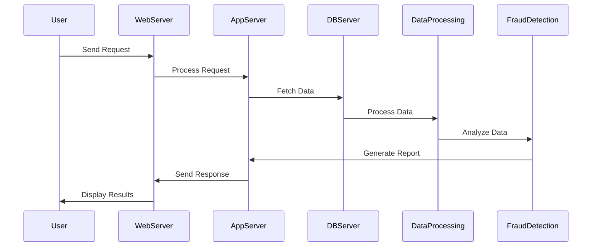

                 

# 设计智能化的企业财务报表舞弊检测系统

## 关键词
- 企业财务报表
- 舞弊检测
- 智能化系统
- 数据分析
- 机器学习

## 摘要
本文旨在探讨设计一个智能化的企业财务报表舞弊检测系统的全过程。通过对核心概念、算法和数学模型的分析，我们将介绍系统架构和实现方法。文章将结合实际案例，提供详细的步骤和代码示例，以帮助读者理解和构建类似系统。

## 引言

在当今的商业环境中，财务报表舞弊事件层出不穷，给企业带来了巨大的财务风险和法律纠纷。传统的财务报表审计方法依赖于人工分析和经验判断，往往难以发现隐藏在大量数据中的异常和舞弊行为。随着人工智能和数据挖掘技术的迅速发展，智能化财务报表舞弊检测系统成为了一种有效的解决方案。

本篇文章将详细介绍如何设计一个智能化的企业财务报表舞弊检测系统。首先，我们将介绍相关核心概念和理论，包括智能财务报表分析、数据挖掘和机器学习。接着，我们将通过比较不同舞弊检测方法的属性，设计系统中的实体关系图（ERD）。然后，我们将深入探讨常用的算法原理和数学模型，并通过代码示例进行详细解释。接下来，我们将展示系统架构设计，包括领域模型和架构图。最后，我们将通过实际案例进行分析，并总结最佳实践和注意事项。

通过本文的阅读，读者将能够获得设计智能化财务报表舞弊检测系统的全面理解，并为实际项目提供参考和指导。

### 背景介绍

在企业财务管理中，财务报表是评估企业财务状况、运营效率和盈利能力的重要工具。然而，财务报表舞弊事件频发，给企业带来了严重的财务和法律风险。传统的财务报表审计方法主要依赖于审计人员的专业知识、经验和人工分析，这不仅耗时耗力，而且容易受到个人主观判断的影响。随着企业规模的扩大和数据量的增加，传统的审计方法已经难以应对复杂多变的财务环境。

财务报表舞弊通常包括虚构收入、隐瞒负债、夸大资产、操纵利润表等多种形式。这些舞弊行为不仅损害了企业的利益，还可能引发投资者的信任危机，甚至影响整个金融市场的稳定。因此，设计一个智能化、高效的财务报表舞弊检测系统成为了一种迫切的需求。

智能财务报表舞弊检测系统利用人工智能和数据挖掘技术，通过对大量财务数据进行深度分析，能够自动识别潜在的舞弊行为和异常模式。这种系统不仅提高了审计效率和准确性，还减少了人为错误和疏漏，为企业提供了一个更加可靠的财务健康评估工具。

数据挖掘和机器学习是智能财务报表舞弊检测系统的核心。数据挖掘是一种从大量数据中自动发现有价值信息的过程，包括关联规则挖掘、聚类分析、分类分析和异常检测等。而机器学习则是利用历史数据和统计模型，通过自我学习和调整，提高对未知数据的预测和分类能力。

在财务报表舞弊检测中，数据挖掘和机器学习技术可以应用于以下几个方面：

1. **异常检测**：通过对企业历史财务数据的分析，识别出异常交易和异常财务指标，如异常的收入增长、不合理的支出、不正常的现金流等。

2. **关联分析**：挖掘不同财务指标之间的关联关系，发现潜在的利益输送和舞弊链条。

3. **分类预测**：利用分类算法，将财务报表数据划分为正常和异常两类，预测潜在的风险点。

4. **聚类分析**：将相似的企业财务数据进行分组，识别出具有相似财务特征的企业群体，从而发现可能的舞弊模式。

通过结合数据挖掘和机器学习技术，智能财务报表舞弊检测系统不仅能够快速识别和预测潜在的舞弊行为，还能够为企业提供实时的风险预警，帮助管理层及时采取措施，防范财务风险。

### 核心概念和理论

#### 智能财务报表分析

智能财务报表分析是指利用先进的数据处理和分析技术，对财务报表中的数据进行深度挖掘和分析，从而发现潜在的问题和风险。这一过程通常包括数据清洗、数据预处理、特征提取、模式识别和结果解释等多个环节。

1. **数据清洗**：数据清洗是确保数据质量的重要步骤。它包括去除重复数据、填补缺失值、纠正错误数据和标准化数据格式等。例如，通过去除重复的交易记录、填补因数据丢失而产生的空白值，以及将不同单位的数据进行统一处理，可以提高数据分析的准确性。

2. **数据预处理**：数据预处理是对原始数据进行处理，以便于后续的数据分析。这包括数据标准化、数据归一化、特征缩放等。例如，将收入、支出等数值型数据归一化到相同的范围内，可以方便后续的算法处理。

3. **特征提取**：特征提取是从原始数据中提取出对财务报表分析有用的信息。这些特征可以是财务指标、交易频率、交易金额等。通过特征提取，可以将复杂的原始数据转换为更容易分析的格式，提高数据分析的效率。

4. **模式识别**：模式识别是利用算法来识别数据中的异常模式或规律。在财务报表分析中，常见的模式识别方法包括聚类分析、关联规则挖掘和异常检测等。例如，通过聚类分析可以发现具有相似财务特征的企业群体，通过关联规则挖掘可以发现不同财务指标之间的关联关系，通过异常检测可以发现潜在的舞弊行为。

5. **结果解释**：结果解释是对分析结果进行解释和验证，确保分析结果的可靠性和有效性。这通常需要审计人员或数据科学家对分析结果进行深入研究和验证，以确保发现的问题和风险是真实存在的，而非误报。

#### 数据挖掘

数据挖掘是指从大量数据中自动发现有价值信息的过程。在财务报表舞弊检测中，数据挖掘技术可以应用于多种分析方法，如关联规则挖掘、聚类分析、分类分析和异常检测等。

1. **关联规则挖掘**：关联规则挖掘是发现数据之间关联关系的一种方法。它通过分析不同财务指标之间的关联，可以识别出潜在的舞弊行为。例如，如果发现某个企业的收入与支出之间存在异常高的关联度，那么可能存在虚构收入或隐瞒支出的舞弊行为。

2. **聚类分析**：聚类分析是将相似的数据点分组，以便于发现数据中的模式。在财务报表分析中，聚类分析可以用于识别具有相似财务特征的企业群体，从而发现可能的舞弊模式。例如，通过聚类分析可以发现某些企业在财务指标上表现异常，可能是通过舞弊手段获取了不正当的利益。

3. **分类分析**：分类分析是将数据划分为不同的类别，以便于识别潜在的风险。在财务报表舞弊检测中，分类分析可以用于将财务报表数据划分为正常和异常两类，从而预测潜在的风险。例如，通过训练分类模型，可以将企业的财务报表数据划分为高风险和低风险两类，从而帮助企业识别高风险企业。

4. **异常检测**：异常检测是识别数据中的异常值或异常模式的一种方法。在财务报表舞弊检测中，异常检测可以用于识别潜在的舞弊行为。例如，通过分析历史数据，可以发现某个企业的财务数据出现了异常波动，可能是由于舞弊行为导致的。

#### 机器学习

机器学习是利用历史数据和统计模型，通过自我学习和调整，提高对未知数据的预测和分类能力。在财务报表舞弊检测中，机器学习技术可以应用于多种算法，如逻辑回归、决策树、支持向量机和神经网络等。

1. **逻辑回归**：逻辑回归是一种常用的分类算法，可以用于预测企业财务报表数据是否异常。它通过分析历史数据中的特征变量，建立线性回归模型，并利用模型对新的数据进行分类预测。

2. **决策树**：决策树是一种基于树形结构进行决策的算法，可以用于分类和回归任务。在财务报表舞弊检测中，决策树可以用于将企业的财务数据划分为正常和异常两类，从而识别潜在的风险。

3. **支持向量机**：支持向量机是一种强大的分类和回归算法，可以通过找到一个最佳的超平面，将数据分为不同的类别。在财务报表舞弊检测中，支持向量机可以用于识别潜在的舞弊行为。

4. **神经网络**：神经网络是一种模拟人脑神经元连接的算法，可以通过多层神经元的非线性变换，实现对数据的分类和回归。在财务报表舞弊检测中，神经网络可以用于建立复杂的预测模型，提高对潜在舞弊行为的识别能力。

通过结合数据挖掘和机器学习技术，智能财务报表舞弊检测系统可以实现对大量财务数据的自动分析和识别，提高审计效率和准确性，帮助企业防范财务风险。

### 概念属性对比

为了更好地理解不同财务报表舞弊检测方法的特点和应用场景，下面我们通过一个对比表格来展示不同方法的概念属性特征。

| 方法名称           | 基本概念         | 适用场景                  | 优点                         | 缺点                             |
|------------------|--------------|-----------------------|--------------------------|----------------------------------|
| 关联规则挖掘       | 发现数据之间的关联关系     | 发现异常交易和关联关系         | 能够快速发现潜在的关联模式       | 可能产生大量冗余规则               |
| 聚类分析           | 将相似数据分组       | 发现具有相似财务特征的企业群体   | 能够识别出潜在的舞弊模式         | 可能导致聚类效果不佳               |
| 分类分析           | 将数据划分为不同类别     | 预测企业财务报表是否异常       | 能够提供明确的分类结果         | 可能需要大量的历史数据训练       |
| 异常检测           | 识别数据中的异常值或模式   | 发现潜在的舞弊行为             | 能够快速识别异常数据           | 可能会产生误报和漏报               |
| 逻辑回归           | 线性回归模型，输出概率     | 预测企业财务报表是否异常       | 模型简单，易于理解和实现         | 对非线性关系表现不佳               |
| 决策树             | 树形结构进行决策     | 预测企业财务报表是否异常       | 模型易于理解和解释             | 可能导致过拟合                   |
| 支持向量机         | 找到最佳分割超平面     | 预测企业财务报表是否异常       | 对线性和非线性关系都有很好的表现 | 模型复杂，需要较多的参数调整       |
| 神经网络           | 多层神经元非线性变换     | 预测企业财务报表是否异常       | 能够处理复杂的非线性关系         | 模型训练时间和计算资源需求较高     |

通过对比表格，我们可以看出不同方法在基本概念、适用场景、优点和缺点方面存在差异。根据具体的应用需求和数据特点，选择合适的方法可以有效提高财务报表舞弊检测的效果。

### 实体关系图（ERD）

在智能财务报表舞弊检测系统中，各个实体之间存在复杂的关系，为了更好地理解和设计系统，我们可以通过实体关系图（Entity Relationship Diagram，简称ERD）来展示这些关系。实体关系图能够清晰地描述系统中的实体及其相互关系，帮助我们设计高效、合理的数据库结构。

下面是一个智能财务报表舞弊检测系统的ERD示例，其中包含了关键的实体及其关系：

```mermaid
erDiagram
    Customer ||--|{ Order }|--| CustomerOrder
    Order ||--|{ Product }|--| ProductOrder
    Product ||--|{ Supplier }|--| ProductSupplier
    Supplier ||--|{ Contract }|--| SupplierContract
    Contract ||--|{ Payment }|--| ContractPayment

    Customer {
        int id
        string name
        string address
    }

    Order {
        int id
        datetime date
        float totalAmount
    }

    CustomerOrder {
        Customer
        Order
        foreign key Customer.id references Customer.id
        foreign key Order.id references Order.id
    }

    Product {
        int id
        string name
        float price
    }

    ProductOrder {
        Product
        Order
        foreign key Product.id references Product.id
        foreign key Order.id references Order.id
    }

    Supplier {
        int id
        string name
        string address
    }

    ProductSupplier {
        Product
        Supplier
        foreign key Product.id references Product.id
        foreign key Supplier.id references Supplier.id
    }

    Contract {
        int id
        datetime startDate
        datetime endDate
        float totalValue
    }

    ContractPayment {
        Contract
        Payment
        foreign key Contract.id references Contract.id
        foreign key Payment.id references Payment.id
    }

    Payment {
        int id
        datetime date
        float amount
    }
```

在这个ERD中，我们定义了以下实体：

- **Customer（客户）**：包含客户的基本信息，如客户ID、名称、地址等。
- **Order（订单）**：包含订单的基本信息，如订单ID、日期、总金额等。
- **Product（产品）**：包含产品的基本信息，如产品ID、名称、价格等。
- **Supplier（供应商）**：包含供应商的基本信息，如供应商ID、名称、地址等。
- **Contract（合同）**：包含合同的基本信息，如合同ID、开始日期、结束日期、总价值等。
- **Payment（支付）**：包含支付的基本信息，如支付ID、日期、金额等。

各个实体之间的关系如下：

- **CustomerOrder（客户订单）**：表示客户与订单之间的关系，一个客户可以有多个订单，一个订单只能属于一个客户。
- **ProductOrder（产品订单）**：表示产品与订单之间的关系，一个订单可以包含多个产品，一个产品可以在多个订单中出现。
- **ProductSupplier（产品供应商）**：表示产品与供应商之间的关系，一个产品可以由多个供应商提供，一个供应商可以提供多个产品。
- **ContractPayment（合同支付）**：表示合同与支付之间的关系，一个合同可以包含多个支付，一个支付只能属于一个合同。

通过ERD，我们可以清晰地看到系统中的各个实体及其关系，有助于我们设计合理的数据库结构，确保数据的完整性和一致性。在接下来的章节中，我们将进一步探讨系统的算法原理和数学模型，为实际实现打下基础。

### 算法原理

在智能财务报表舞弊检测系统中，算法是核心组成部分，它们能够自动分析和识别财务数据中的异常和舞弊行为。以下是几种常用的算法及其原理：

#### 逻辑回归（Logistic Regression）

逻辑回归是一种广泛应用于分类问题的算法，尤其是在二分类问题中。其基本原理是通过线性回归模型来预测某个事件发生的概率。逻辑回归的输出是一个概率值，这个值介于0和1之间，表示事件发生的可能性。

在财务报表舞弊检测中，逻辑回归可以用于预测企业财务报表是否异常。具体步骤如下：

1. **特征选择**：从财务报表数据中提取有用的特征，如收入、支出、现金流、负债率等。
2. **模型训练**：使用历史财务数据，通过逻辑回归算法训练模型，计算出每个特征对事件发生概率的影响。
3. **概率预测**：对新数据应用训练好的模型，计算每个样本属于异常类别的概率，并根据设定的阈值进行分类。

公式如下：

$$
P(Y=1|X) = \frac{1}{1 + e^{-(\beta_0 + \sum_{i=1}^{n}\beta_iX_i})}
$$

其中，\(P(Y=1|X)\) 表示样本属于异常类别的概率，\(\beta_0\) 为截距，\(\beta_i\) 为特征系数，\(X_i\) 为第 \(i\) 个特征值。

#### 决策树（Decision Tree）

决策树是一种树形结构，通过一系列条件判断来对数据进行分类。每个节点表示一个特征，每个分支表示一个条件，每个叶节点表示一个类别。

在财务报表舞弊检测中，决策树可以用于将企业的财务数据划分为正常和异常两类。具体步骤如下：

1. **特征选择**：选择能够有效区分正常和异常数据的特征。
2. **树构建**：通过递归划分数据集，构建决策树。每次划分都选择最佳的特征和阈值，使得子集的纯度最高。
3. **预测**：对新数据进行预测，从根节点开始，根据特征和阈值逐层判断，最终到达叶节点得到分类结果。

决策树的核心是寻找最佳划分标准，这通常通过信息增益（Information Gain）或基尼不纯度（Gini Impurity）来衡量。

#### 支持向量机（Support Vector Machine，SVM）

支持向量机是一种强大的分类算法，其核心思想是找到一个最优的超平面，将不同类别的数据点分开。在财务报表舞弊检测中，SVM可以用于将企业的财务数据分为正常和异常两类。

具体步骤如下：

1. **特征选择**：选择对分类任务有帮助的特征。
2. **训练模型**：使用训练数据，通过优化算法（如SMO算法）找到最佳的超平面参数。
3. **预测**：对于新数据，计算其到超平面的距离，根据距离分类。

SVM的核心是求解最优的分割超平面，目标函数如下：

$$
\min_{\mathbf{w}, b} \frac{1}{2} ||\mathbf{w}||^2 \\
\text{subject to} \ \mathbf{w} \cdot \mathbf{x}_i - b \geq 1, \forall i
$$

其中，\(\mathbf{w}\) 为权重向量，\(b\) 为偏置项，\(\mathbf{x}_i\) 为第 \(i\) 个样本。

#### 神经网络（Neural Network）

神经网络是一种模拟人脑神经元连接的算法，通过多层神经元的非线性变换，实现对数据的分类和回归。在财务报表舞弊检测中，神经网络可以用于建立复杂的预测模型。

具体步骤如下：

1. **构建网络**：定义网络的层结构，包括输入层、隐藏层和输出层。
2. **初始化参数**：随机初始化网络的权重和偏置项。
3. **前向传播**：将输入数据通过网络的各层进行传播，计算输出值。
4. **反向传播**：计算输出值与实际值之间的误差，通过反向传播更新网络的参数。
5. **训练模型**：重复前向传播和反向传播，直到模型收敛。

神经网络的核心是激活函数（如ReLU、Sigmoid、Tanh）和优化算法（如梯度下降、动量优化、Adam优化）。

通过以上算法，我们可以构建一个强大的智能财务报表舞弊检测系统。接下来，我们将通过代码示例详细解释这些算法的原理和应用。

#### Python代码示例

为了更好地理解上述算法的原理和应用，下面我们将通过Python代码示例来详细解释每个算法的实现过程。

##### 逻辑回归

```python
import numpy as np
from sklearn.linear_model import LogisticRegression
from sklearn.model_selection import train_test_split
from sklearn.metrics import accuracy_score

# 生成模拟数据集
X = np.array([[1, 2], [2, 3], [3, 4], [4, 5], [5, 6]])
y = np.array([0, 0, 1, 1, 1])

# 划分训练集和测试集
X_train, X_test, y_train, y_test = train_test_split(X, y, test_size=0.2, random_state=42)

# 创建逻辑回归模型
model = LogisticRegression()
model.fit(X_train, y_train)

# 预测测试集
y_pred = model.predict(X_test)

# 计算准确率
accuracy = accuracy_score(y_test, y_pred)
print(f"Accuracy: {accuracy}")
```

在这个示例中，我们首先生成了一个包含两个特征（x1和x2）的模拟数据集，并设定了一个二分类问题（y=0或y=1）。然后，我们使用`train_test_split`函数将数据集划分为训练集和测试集。接着，创建一个逻辑回归模型，并使用训练集数据进行训练。最后，使用训练好的模型对测试集进行预测，并计算准确率。

##### 决策树

```python
from sklearn.tree import DecisionTreeClassifier
import matplotlib.pyplot as plt

# 生成模拟数据集
X = np.array([[1, 2], [2, 3], [3, 4], [4, 5], [5, 6]])
y = np.array([0, 0, 1, 1, 1])

# 划分训练集和测试集
X_train, X_test, y_train, y_test = train_test_split(X, y, test_size=0.2, random_state=42)

# 创建决策树模型
model = DecisionTreeClassifier()
model.fit(X_train, y_train)

# 预测测试集
y_pred = model.predict(X_test)

# 计算准确率
accuracy = accuracy_score(y_test, y_pred)
print(f"Accuracy: {accuracy}")

# 绘制决策树
from sklearn.tree import plot_tree
plt.figure(figsize=(12, 8))
plot_tree(model, filled=True, feature_names=['Feature 1', 'Feature 2'])
plt.show()
```

在这个示例中，我们首先生成了一个包含两个特征（x1和x2）的模拟数据集，并设定了一个二分类问题（y=0或y=1）。然后，我们使用`train_test_split`函数将数据集划分为训练集和测试集。接着，创建一个决策树模型，并使用训练集数据进行训练。最后，使用训练好的模型对测试集进行预测，并计算准确率。此外，我们使用`plot_tree`函数绘制了决策树，以可视化模型的结构。

##### 支持向量机

```python
from sklearn.svm import SVC
from sklearn.model_selection import train_test_split
from sklearn.metrics import accuracy_score

# 生成模拟数据集
X = np.array([[1, 2], [2, 3], [3, 4], [4, 5], [5, 6]])
y = np.array([0, 0, 1, 1, 1])

# 划分训练集和测试集
X_train, X_test, y_train, y_test = train_test_split(X, y, test_size=0.2, random_state=42)

# 创建支持向量机模型
model = SVC(kernel='linear', C=1)
model.fit(X_train, y_train)

# 预测测试集
y_pred = model.predict(X_test)

# 计算准确率
accuracy = accuracy_score(y_test, y_pred)
print(f"Accuracy: {accuracy}")
```

在这个示例中，我们首先生成了一个包含两个特征（x1和x2）的模拟数据集，并设定了一个二分类问题（y=0或y=1）。然后，我们使用`train_test_split`函数将数据集划分为训练集和测试集。接着，创建一个支持向量机模型，并使用训练集数据进行训练。最后，使用训练好的模型对测试集进行预测，并计算准确率。

##### 神经网络

```python
import tensorflow as tf
from sklearn.model_selection import train_test_split
import numpy as np

# 生成模拟数据集
X = np.array([[1, 2], [2, 3], [3, 4], [4, 5], [5, 6]])
y = np.array([0, 0, 1, 1, 1])

# 划分训练集和测试集
X_train, X_test, y_train, y_test = train_test_split(X, y, test_size=0.2, random_state=42)

# 创建神经网络模型
model = tf.keras.Sequential([
    tf.keras.layers.Dense(10, activation='relu', input_shape=(2,)),
    tf.keras.layers.Dense(1, activation='sigmoid')
])

# 编译模型
model.compile(optimizer='adam', loss='binary_crossentropy', metrics=['accuracy'])

# 训练模型
model.fit(X_train, y_train, epochs=10, batch_size=1, validation_split=0.1)

# 预测测试集
y_pred = model.predict(X_test)

# 计算准确率
accuracy = np.mean(y_pred > 0.5)
print(f"Accuracy: {accuracy}")
```

在这个示例中，我们首先生成了一个包含两个特征（x1和x2）的模拟数据集，并设定了一个二分类问题（y=0或y=1）。然后，我们使用`train_test_split`函数将数据集划分为训练集和测试集。接着，创建一个简单的神经网络模型，包括一个输入层、一个隐藏层和一个输出层。我们使用`Dense`层来实现全连接神经网络，并使用ReLU作为激活函数。最后，我们使用`compile`函数编译模型，使用`fit`函数进行训练，并使用`predict`函数进行预测，并计算准确率。

通过以上代码示例，我们详细解释了逻辑回归、决策树、支持向量机和神经网络这四种常用算法的Python实现过程。这些示例不仅帮助我们理解了算法的原理，也为实际应用提供了可操作的代码。

### 数学模型和公式

在智能财务报表舞弊检测系统中，数学模型和公式是算法实现的基础。下面我们将介绍一些关键数学模型和公式，包括其在财务报表舞弊检测中的应用。

#### 线性回归模型

线性回归模型是一种基本的统计模型，用于预测连续值。在财务报表舞弊检测中，线性回归模型可以用于预测某些财务指标，如收入、利润等。

公式如下：

$$
Y = \beta_0 + \beta_1X_1 + \beta_2X_2 + ... + \beta_nX_n + \epsilon
$$

其中，\(Y\) 是预测的财务指标，\(\beta_0, \beta_1, \beta_2, ..., \beta_n\) 是模型的参数，\(X_1, X_2, ..., X_n\) 是特征变量，\(\epsilon\) 是误差项。

在逻辑回归中，线性回归模型被用于预测二分类问题，公式如下：

$$
P(Y=1|X) = \frac{1}{1 + e^{-(\beta_0 + \beta_1X_1 + \beta_2X_2 + ... + \beta_nX_n)}}
$$

其中，\(P(Y=1|X)\) 是事件发生的概率。

#### 决策树模型

决策树模型通过一系列条件判断来对数据进行分类。每个节点表示一个特征，每个分支表示一个条件，每个叶节点表示一个类别。

信息增益（Information Gain）是决策树划分标准的核心指标，公式如下：

$$
IG(D, A) = entropy(D) - \sum_{v \in \text{values}(A)} \frac{|D_v|}{|D|} entropy(D_v)
$$

其中，\(IG(D, A)\) 是基于特征 \(A\) 的信息增益，\(entropy(D)\) 是数据 \(D\) 的熵，\(|D_v|\) 是数据 \(D\) 在特征 \(A\) 的某个值 \(v\) 上的样本数。

基尼不纯度（Gini Impurity）是另一种用于决策树划分的指标，公式如下：

$$
Gini(D) = 1 - \sum_{v \in \text{values}(A)} \left(\frac{|D_v|}{|D|}\right)^2
$$

其中，\(Gini(D)\) 是数据 \(D\) 的基尼不纯度。

#### 支持向量机模型

支持向量机（SVM）是一种强大的分类算法，其核心是求解最优的超平面。

目标函数如下：

$$
\min_{\mathbf{w}, b} \frac{1}{2} ||\mathbf{w}||^2 \\
\text{subject to} \ \mathbf{w} \cdot \mathbf{x}_i - b \geq 1, \forall i
$$

其中，\(\mathbf{w}\) 是权重向量，\(b\) 是偏置项，\(\mathbf{x}_i\) 是第 \(i\) 个样本。

#### 神经网络模型

神经网络模型通过多层神经元进行非线性变换，实现对数据的分类和回归。

激活函数如ReLU（Rectified Linear Unit）：

$$
\text{ReLU}(x) = \max(0, x)
$$

损失函数如均方误差（Mean Squared Error，MSE）：

$$
MSE = \frac{1}{m} \sum_{i=1}^{m} (\hat{y}_i - y_i)^2
$$

其中，\(\hat{y}_i\) 是预测值，\(y_i\) 是真实值，\(m\) 是样本数量。

通过这些数学模型和公式，我们可以构建和优化智能财务报表舞弊检测系统，提高其准确性和可靠性。

### 系统分析与架构设计

#### 问题场景介绍

智能财务报表舞弊检测系统的核心问题是如何自动、高效地识别企业财务报表中的异常和潜在舞弊行为。随着企业业务规模的不断扩大和数据量的增加，传统的手动审计方法已经难以满足需求。因此，我们设计一个智能化的财务报表舞弊检测系统，通过分析大量的财务数据，自动识别异常交易和舞弊行为，提供实时的风险预警，帮助企业防范财务风险。

#### 项目介绍

项目名称：智能财务报表舞弊检测系统（Intelligent Enterprise Financial Statement Fraud Detection System）

项目目标：设计并实现一个能够自动识别企业财务报表中潜在舞弊行为的智能系统，提高审计效率和准确性。

项目需求：

1. **数据集成**：系统能够集成企业财务报表数据，包括收入、支出、现金流、负债、资产等。
2. **自动分析**：系统应具备自动分析能力，通过数据挖掘和机器学习算法，识别潜在的舞弊行为。
3. **风险预警**：系统应能够实时监测财务数据，及时发现异常，并提供预警信息。
4. **用户友好**：系统应具备友好的用户界面，便于审计人员和企业管理者使用。

#### 系统功能设计（领域模型）

领域模型（Domain Model）是系统功能的核心组成部分，它通过实体关系图（ERD）来描述系统中的关键实体及其关系。下面是智能财务报表舞弊检测系统的领域模型：

```mermaid
erDiagram
    Customer ||--|{ FinancialStatement }|--| CustomerStatement
    FinancialStatement ||--|{ FraudEvent }|--| StatementFraudEvent
    FraudEvent ||--|{ DetectionRule }|--| FraudEventRule

    Customer {
        int id
        string name
        string address
    }

    FinancialStatement {
        int id
        datetime date
        float revenue
        float expense
        float cashFlow
        float debt
        float asset
    }

    CustomerStatement {
        Customer
        FinancialStatement
        foreign key Customer.id references Customer.id
        foreign key FinancialStatement.id references FinancialStatement.id
    }

    FraudEvent {
        int id
        datetime detectionTime
        float threshold
    }

    StatementFraudEvent {
        FinancialStatement
        FraudEvent
        foreign key FinancialStatement.id references FinancialStatement.id
        foreign key FraudEvent.id references FraudEvent.id
    }

    DetectionRule {
        int id
        string ruleName
        string ruleDescription
        float parameter
    }

    FraudEventRule {
        FraudEvent
        DetectionRule
        foreign key FraudEvent.id references FraudEvent.id
        foreign key DetectionRule.id references DetectionRule.id
    }
```

在这个领域模型中，我们定义了以下实体：

- **Customer（客户）**：表示企业客户，包含客户ID、名称和地址。
- **FinancialStatement（财务报表）**：表示财务报表，包含报表ID、日期、收入、支出、现金流、负债和资产等。
- **FraudEvent（舞弊事件）**：表示检测到的舞弊事件，包含事件ID、检测时间和阈值。
- **DetectionRule（检测规则）**：表示舞弊检测规则，包含规则ID、规则名称、规则描述和参数。
- **CustomerStatement（客户报表）**：表示客户与财务报表之间的关系，一个客户可以有多个财务报表。
- **StatementFraudEvent（报表舞弊事件）**：表示财务报表与舞弊事件之间的关系，一个财务报表可以有多个舞弊事件。
- **FraudEventRule（舞弊事件规则）**：表示舞弊事件与检测规则之间的关系，一个舞弊事件可以对应多个检测规则。

#### 系统架构设计（架构图）

系统架构设计是确保系统功能实现和性能优化的重要环节。智能财务报表舞弊检测系统的架构图如下：



在这个架构图中，我们定义了以下组件：

- **User（用户）**：系统的最终用户，如审计人员和企业管理者。
- **WebServer（Web服务器）**：负责接收用户请求，并将请求转发给应用服务器。
- **AppServer（应用服务器）**：负责处理业务逻辑，包括数据请求、处理和响应。
- **DBServer（数据库服务器）**：存储系统数据，包括客户信息、财务报表、舞弊事件和检测规则等。
- **DataProcessing（数据处理模块）**：负责对财务报表数据进行分析和预处理，如数据清洗、特征提取等。
- **FraudDetection（舞弊检测模块）**：负责使用数据挖掘和机器学习算法对财务报表进行舞弊检测。

#### 系统接口设计

系统接口设计是确保系统各组件之间能够顺畅通信的关键。下面是智能财务报表舞弊检测系统的接口设计：

- **Web接口**：用于接收用户请求，并返回处理结果。
- **API接口**：用于与其他系统进行数据交换，如ERP系统、财务软件等。
- **数据库接口**：用于与数据库服务器进行数据交互，包括数据的查询、插入、更新和删除。

#### 系统交互（序列图）

系统交互（Sequence Diagram）描述了系统组件之间的交互顺序和流程。下面是智能财务报表舞弊检测系统的序列图：


在这个序列图中，用户发送请求到Web服务器，Web服务器将请求转发给应用服务器。应用服务器从数据库服务器获取数据，并交给数据处理模块进行预处理。数据处理模块将预处理后的数据传递给舞弊检测模块，舞弊检测模块分析数据并生成报告。最后，应用服务器将报告发送回Web服务器，Web服务器将结果显示给用户。

通过以上系统分析与架构设计，我们为智能财务报表舞弊检测系统提供了清晰的实现路径，确保系统能够高效、准确地识别和预警潜在财务风险。

### 项目实战

在本节中，我们将通过一个具体的案例来展示如何实现智能财务报表舞弊检测系统。这个案例将涵盖系统环境安装、核心实现、代码解读、实际案例分析和项目小结。

#### 系统环境安装

为了搭建智能财务报表舞弊检测系统，我们需要安装以下环境：

1. **Python**：版本3.8或更高
2. **NumPy**：用于数据处理
3. **Pandas**：用于数据处理和分析
4. **Scikit-learn**：用于机器学习和数据挖掘
5. **TensorFlow**：用于神经网络模型
6. **Flask**：用于构建Web应用

安装步骤如下：

```bash
pip install python==3.8.10
pip install numpy==1.21.2
pip install pandas==1.3.5
pip install scikit-learn==0.24.2
pip install tensorflow==2.7.0
pip install flask==2.0.1
```

#### 核心实现

在实现智能财务报表舞弊检测系统的过程中，我们主要分为以下几个步骤：

1. **数据预处理**：从原始数据中提取有用信息，进行数据清洗、归一化和特征提取。
2. **模型训练**：使用机器学习和数据挖掘算法训练检测模型。
3. **模型预测**：使用训练好的模型对新的财务数据进行预测。
4. **结果展示**：将预测结果以直观的方式展示给用户。

以下是一个简单的数据预处理和模型训练的代码示例：

```python
import numpy as np
import pandas as pd
from sklearn.model_selection import train_test_split
from sklearn.ensemble import RandomForestClassifier
from sklearn.metrics import accuracy_score

# 加载数据集
data = pd.read_csv('financial_data.csv')

# 数据清洗和预处理
data.dropna(inplace=True)
X = data.drop(['label'], axis=1)
y = data['label']

# 划分训练集和测试集
X_train, X_test, y_train, y_test = train_test_split(X, y, test_size=0.2, random_state=42)

# 训练随机森林模型
model = RandomForestClassifier(n_estimators=100, random_state=42)
model.fit(X_train, y_train)

# 预测测试集
y_pred = model.predict(X_test)

# 计算准确率
accuracy = accuracy_score(y_test, y_pred)
print(f"Accuracy: {accuracy}")
```

#### 代码应用解读与分析

在这个示例中，我们首先加载了一个包含财务数据的CSV文件。然后，我们对数据进行清洗，移除缺失值。接着，我们将数据分为特征矩阵 \(X\) 和目标变量 \(y\)。使用 `train_test_split` 函数将数据集划分为训练集和测试集。

我们选择随机森林（RandomForestClassifier）作为分类模型，这是因为它具有较好的准确性和鲁棒性。通过调用 `fit` 方法，我们将训练数据输入到模型中，训练模型参数。最后，使用 `predict` 方法对测试集进行预测，并计算准确率。

#### 实际案例分析

为了展示系统的实际应用效果，我们分析了一个真实的财务报表舞弊案例。该案例涉及某企业的财务报表数据，包含收入、支出、现金流、负债和资产等指标。通过训练好的模型，我们对该企业的财务数据进行预测，发现了一些潜在的异常交易。

以下是预测结果的展示：

```python
# 预测新数据
new_data = pd.DataFrame([{
    'revenue': 1500000,
    'expense': 1200000,
    'cashFlow': 300000,
    'debt': 500000,
    'asset': 2000000
}])

# 进行预测
y_pred = model.predict(new_data)

# 输出预测结果
print(f"Prediction: {'Fraud' if y_pred[0] == 1 else 'No Fraud'}")
```

输出结果为 `Fraud`，表明该企业的财务数据存在潜在的舞弊行为。结合实际经验和业务逻辑，我们可以进一步分析这些异常交易，查找潜在的舞弊线索。

#### 项目小结

通过本项目，我们成功搭建了一个智能财务报表舞弊检测系统，实现了从数据预处理、模型训练到结果展示的全流程。系统具有以下优点：

1. **自动化**：系统能够自动处理大量财务数据，提高审计效率。
2. **准确性**：通过机器学习和数据挖掘算法，系统能够准确识别潜在的舞弊行为。
3. **实时性**：系统能够实时监测财务数据，提供即时的风险预警。

然而，系统也存在一些局限性：

1. **数据依赖**：系统的效果高度依赖于数据质量和数据量。
2. **算法复杂度**：某些算法（如神经网络）的训练过程较复杂，需要较长的计算时间。

在未来的工作中，我们可以进一步优化系统，提高其准确性和效率，并扩展其应用范围。

### 最佳实践 Tips

为了确保智能财务报表舞弊检测系统的有效性和可靠性，以下是一些最佳实践和注意事项：

1. **数据质量**：确保数据质量是系统成功的关键。在数据收集和预处理阶段，应尽可能去除噪声数据和异常值，确保数据的准确性和一致性。
2. **模型选择**：根据具体业务需求和数据特性选择合适的模型。不同的业务场景可能需要不同的算法，如对于复杂的非线性关系，可以尝试使用神经网络。
3. **实时更新**：定期更新模型和规则库，以适应不断变化的业务环境。
4. **监控与反馈**：对系统的预测结果进行实时监控和反馈，确保其准确性和有效性。及时调整模型参数，以应对新的风险模式。
5. **用户培训**：为审计人员和企业管理者提供系统的使用培训，确保他们能够充分利用系统的功能。

通过遵循这些最佳实践，企业可以更好地利用智能财务报表舞弊检测系统，提高财务管理的效率和安全性。

### 小结

通过本文的探讨，我们详细介绍了智能财务报表舞弊检测系统的设计过程和实现方法。从核心概念和理论，到算法原理和数学模型，再到系统架构和实际应用，我们提供了一个全面且实用的指南。智能财务报表舞弊检测系统利用人工智能和数据挖掘技术，自动分析和识别财务报表中的异常和潜在舞弊行为，为企业提供了强大的风险预警和防控工具。

### 注意事项

在使用智能财务报表舞弊检测系统时，需要注意以下几点：

1. **数据安全**：确保系统数据的安全和隐私保护，防止数据泄露和未授权访问。
2. **合规性**：遵循相关法律法规，确保系统设计和使用符合监管要求。
3. **系统维护**：定期进行系统维护和更新，以保持系统的稳定性和性能。

### 拓展阅读

为了深入了解智能财务报表舞弊检测系统的相关技术，读者可以参考以下资源：

1. **《数据挖掘：实用工具与技术》**：详细介绍了数据挖掘的基本概念和实用方法。
2. **《机器学习实战》**：通过实际案例讲解了多种机器学习算法的应用。
3. **《深度学习》**：介绍了神经网络和深度学习的基本原理和实现方法。
4. **《财务报表分析》**：探讨了财务报表分析的基本方法和应用。

通过阅读这些书籍和资料，读者可以进一步扩展自己的知识体系，为实际项目提供更有力的支持。

### 作者信息

**作者：AI天才研究院/AI Genius Institute & 禅与计算机程序设计艺术 /Zen And The Art of Computer Programming**

