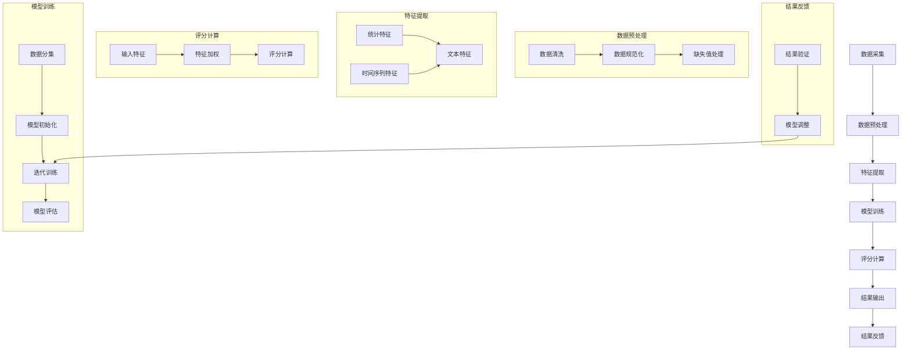
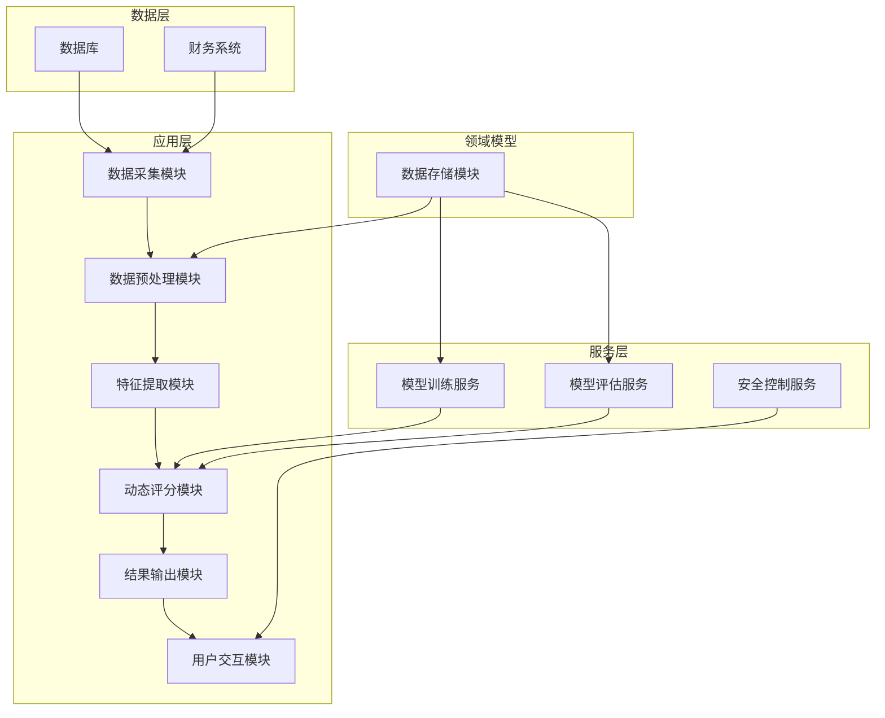
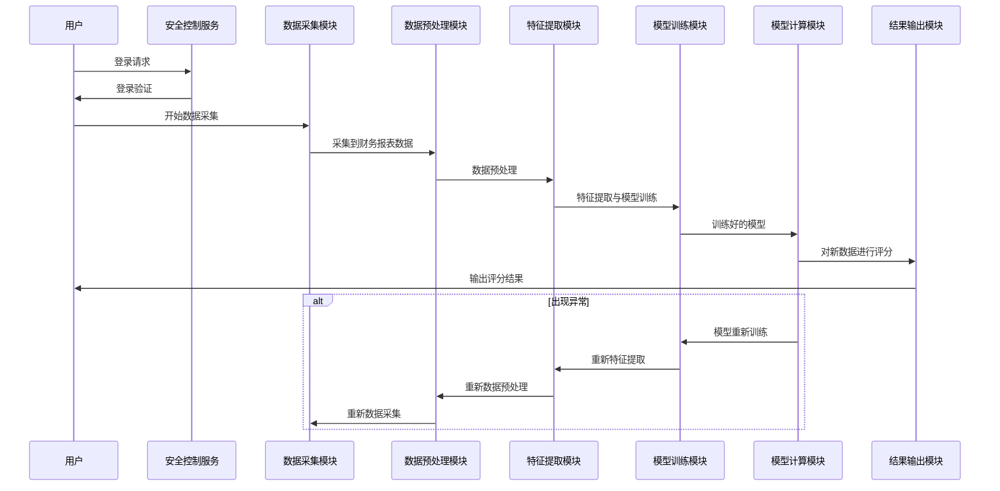

                 

### 1.1.1 企业财务报表质量动态评分系统概述

企业财务报表质量动态评分系统是一个智能化工具，旨在通过分析大量的财务数据，为企业提供实时、准确的财务报表质量评分。该系统的核心目的是通过数据驱动的分析，识别并量化财务报表中的潜在问题，从而帮助企业更好地理解其财务状况，提高财务报表的透明度和准确性。

#### 评分系统的目的与作用

首先，评分系统的首要目的是提供一个量化的指标来评估财务报表的质量。这不仅包括报表的格式和完整性，还包括报表中所反映的财务信息的真实性和准确性。通过这个评分系统，企业管理者能够迅速识别出可能存在的财务风险，例如会计错误、财务操纵或数据不一致等问题。

其次，评分系统有助于提升企业内部财务管理的效率。传统上，财务报表质量的评估主要依赖于人工审核，这不仅费时费力，还容易受到主观因素的影响。智能化评分系统能够自动处理大量数据，快速生成评分结果，从而大大减少了人工工作量和潜在错误。

#### 现有财务报表质量评价方法的局限性

现有的财务报表质量评价方法主要依赖于审计师和财务分析师的经验和专业知识。尽管这些方法在一定程度上能够评估报表的质量，但仍然存在一些局限性：

1. **主观性较强**：人工审核依赖于审核人员的主观判断，容易受到个人经验和偏见的影响。
2. **效率低下**：大量的报表数据需要人工逐项检查，耗时耗力。
3. **缺乏系统性**：传统的评价方法往往缺乏统一的评价标准和体系，导致评价结果不一致。
4. **不能实时响应**：传统方法难以实现实时监控，往往只能在报表编制完成后进行评价。

#### 智能化评估的优势

相比之下，智能化评分系统具有以下几个显著优势：

1. **客观性**：通过算法和模型，评分系统能够提供客观、量化的评价结果，减少了人为因素。
2. **高效性**：系统能够快速处理大量数据，实时监控财务报表的质量。
3. **系统性**：智能化评分系统遵循统一的标准和算法，确保评价结果的准确性和一致性。
4. **可扩展性**：随着数据量的增加和技术的进步，评分系统可以不断优化和升级，适应不同的业务需求。

综上所述，企业财务报表质量动态评分系统作为一种智能化的评价工具，能够帮助企业提升财务报表的质量，提高财务管理的效率，是现代企业财务管理的重要趋势。

### 1.1.2 当前财务报表质量评估的现状与挑战

当前，财务报表质量评估主要依赖于传统的方法，包括审计、财务分析师的评估以及内部审计等。这些方法虽然在一定程度上能够评估财务报表的质量，但随着企业规模的扩大和业务复杂性的增加，它们面临着越来越多的挑战。

#### 财务报表质量评价的标准

财务报表质量评价的标准主要依据国际财务报告准则（IFRS）和国内会计准则。这些准则涵盖了财务报表的编制方法、披露要求、会计原则等多个方面。具体而言，评价标准包括以下几个方面：

1. **真实性**：财务报表所反映的财务信息应当真实、准确，不应存在任何虚假陈述。
2. **完整性**：财务报表应当包含所有必要的财务信息，不得有任何遗漏。
3. **一致性**：财务报表在不同期间和不同情况下应当保持一致，便于比较和分析。
4. **及时性**：财务报表应当能够在规定的时间内完成，确保信息的及时性。
5. **可理解性**：财务报表应当以清晰、易懂的方式呈现，便于非专业用户理解。

#### 传统评估方法的不足

尽管上述评价标准在理论上能够确保财务报表的质量，但传统评估方法在实际操作中却存在许多不足：

1. **主观性较强**：审计师和财务分析师的评估往往依赖于个人经验和判断，容易受到主观因素的影响。
2. **效率低下**：传统的财务报表评估需要逐项检查大量的数据，耗时耗力，效率低下。
3. **缺乏系统性**：由于缺乏统一的评估标准和体系，不同评估者之间的评价结果可能存在较大差异。
4. **不能实时响应**：传统评估方法难以实现对财务报表的实时监控，往往只能在报表编制完成后进行评价。

#### 智能化评估的优势

为了克服传统评估方法的不足，智能化评估方法应运而生。相比于传统方法，智能化评估具有以下显著优势：

1. **客观性**：智能化评估通过算法和模型，能够提供客观、量化的评价结果，减少了人为因素的干扰。
2. **高效性**：系统能够快速处理大量数据，实时监控财务报表的质量，大大提高了评估效率。
3. **系统性**：智能化评估遵循统一的标准和算法，确保评价结果的准确性和一致性。
4. **可扩展性**：随着数据量的增加和技术的进步，智能化评估系统可以不断优化和升级，适应不同的业务需求。

通过引入智能化评估方法，企业不仅能够提升财务报表的质量，还能提高财务管理的效率和透明度，为企业的持续发展提供有力支持。

### 1.1.3 智能化评分系统的意义与前景

智能化评分系统在企业财务管理中的引入，具有深远的意义和广阔的前景。首先，该系统通过数据驱动的分析，提供客观、量化的财务报表质量评分，有助于企业更好地理解其财务状况，及时发现并解决潜在问题。这不仅提高了财务报表的透明度和准确性，还增强了企业管理者的决策能力。

#### 提高财务报表的准确性和透明度

智能化评分系统能够自动分析大量的财务数据，通过先进的算法和模型，识别出报表中的潜在错误和不一致性，从而提高报表的准确性。此外，系统生成的评分结果清晰明了，为企业管理者提供了明确的参考依据，有助于提升财务报表的透明度。透明度是财务信息价值的重要保障，它有助于投资者、债权人和其他利益相关者更好地了解企业的财务状况，降低信息不对称的风险。

#### 降低企业管理成本

传统财务报表质量评估方法往往依赖于人工审核，这不仅耗时耗力，还容易受到主观因素的影响。智能化评分系统通过自动化处理数据，能够显著降低人工工作量，减少企业在评估过程中的成本。此外，系统的快速响应能力和实时监控功能，使得企业可以更有效地管理财务风险，降低潜在损失。

#### 促进财务报表质量的持续改进

智能化评分系统不仅提供即时的评价结果，还能根据历史数据和趋势分析，帮助企业识别出财务报表质量提升的潜在路径。通过不断优化评分模型和算法，企业可以逐步提升财务报表的整体质量，形成持续改进的良性循环。这种持续改进的能力，对于企业实现长期稳定发展具有重要意义。

#### 智能化财务报表评分系统的未来发展趋势

随着大数据、人工智能等技术的发展，智能化财务报表评分系统将具有更加广阔的应用前景。未来，该系统有望实现以下几个重要发展趋势：

1. **更加智能化**：系统将不断引入更先进的人工智能技术，如深度学习、自然语言处理等，进一步提升评估的精度和效率。
2. **更广泛的适用性**：随着技术的普及和应用场景的拓展，智能化评分系统将能够服务于更多类型的企业，涵盖更多领域的财务报表质量评估。
3. **更高效的协同工作**：智能化评分系统将与企业内部的ERP系统、CRM系统等实现更紧密的集成，实现跨系统的数据共享和协同工作。
4. **更全面的智能化分析**：系统不仅限于财务报表质量评估，还将扩展到财务预测、风险预警等领域，为企业提供全方位的财务智能化解决方案。

总之，智能化财务报表评分系统作为现代企业财务管理的重要工具，不仅具有现实意义，还将在未来发挥更加重要的作用，推动企业实现财务管理的智能化转型。

## 第2章: 核心概念与联系

### 2.1.1 智能化与企业财务管理

#### 智能化的定义与应用

智能化，是指通过应用先进的技术和算法，使系统能够自动完成特定任务，并不断学习和优化其性能的过程。在企业管理中，智能化主要体现在以下几个方面：

1. **数据分析与挖掘**：利用大数据和机器学习技术，对企业内外部的海量数据进行分析，提取有价值的信息，帮助管理者做出更明智的决策。
2. **自动化操作**：通过自动化流程，减少人工干预，提高工作效率和准确性，如自动化报表生成、自动化审批等。
3. **智能预测与预警**：利用人工智能技术，预测未来的市场趋势和风险，为企业提供前瞻性的指导。
4. **个性化服务**：根据用户的行为数据和需求，提供个性化的服务，提升用户体验。

#### 智能化对企业财务管理的影响

智能化的引入，对企业财务管理产生了深远的影响：

1. **提高决策效率**：通过数据分析，企业管理者能够快速获得关键财务信息，提高决策效率。
2. **降低成本**：自动化操作和智能预测，能够显著降低企业在财务管理方面的成本。
3. **提升透明度**：智能化系统能够实时监控财务状况，提高财务信息的透明度，增强企业的公信力。
4. **优化资源配置**：智能化的数据分析，能够帮助企业更合理地配置资源，提高运营效率。

### 2.1.2 财务报表质量评价标准

#### 国际与国内财务报表质量评价标准

财务报表质量评价标准主要依据国际财务报告准则（IFRS）和国内会计准则。以下是两种准则的主要内容：

1. **国际财务报告准则（IFRS）**：
   - **真实性**：财务报表应当真实、准确地反映企业的财务状况。
   - **完整性**：财务报表应当包含所有必要的财务信息。
   - **一致性**：财务报表在不同期间和不同情况下应当保持一致。
   - **及时性**：财务报表应当在规定的时间内完成。
   - **可理解性**：财务报表应当以清晰、易懂的方式呈现。

2. **国内会计准则**：
   - **真实性**：财务报表应当真实、准确地反映企业的财务状况。
   - **完整性**：财务报表应当包含所有必要的财务信息。
   - **公允性**：财务报表所反映的信息应当符合公允原则。
   - **可比性**：财务报表应当具备一定的可比性，便于比较和分析。
   - **披露性**：财务报表应当充分披露相关信息，确保透明度。

#### 财务报表质量评价的具体指标

财务报表质量评价的具体指标主要包括以下几个方面：

1. **报表准确性**：包括财务数据的一致性、准确性以及无虚假陈述。
2. **报表完整性**：包括报表中是否包含所有必要的财务信息，如收入、费用、资产、负债等。
3. **报表及时性**：包括报表编制的时间是否满足规定要求，是否能够在规定时间内提交。
4. **报表透明度**：包括财务报表的披露程度，是否对重要信息进行了充分说明。
5. **报表一致性**：包括财务报表在不同期间和不同情况下的连贯性和一致性。

### 2.1.3 动态评分模型的原理与应用

#### 动态评分模型的定义

动态评分模型是一种通过实时分析和处理数据，对财务报表质量进行动态评估的模型。它能够根据数据的变化和趋势，动态调整评分结果，提供更为准确和实时的财务报表质量评价。

#### 动态评分模型的应用场景

动态评分模型在以下场景中具有广泛应用：

1. **企业内部管理**：用于企业内部对财务报表的实时监控和评估，帮助管理者及时发现问题并采取相应措施。
2. **外部审计**：作为外部审计的重要工具，用于审计师对财务报表的初步评估和风险预警。
3. **投资者分析**：投资者可以利用动态评分模型评估企业的财务报表质量，作为投资决策的重要参考。
4. **金融监管**：金融监管机构可以利用动态评分模型，对企业的财务报表进行实时监控，确保其符合相关法规要求。

#### 动态评分模型与传统评分模型的比较

与传统的财务报表质量评估方法相比，动态评分模型具有以下显著优势：

1. **实时性**：动态评分模型能够实时分析和处理数据，提供即时的评估结果，而传统方法往往存在时间延迟。
2. **准确性**：动态评分模型通过机器学习和大数据分析，能够更准确地识别财务报表中的潜在问题，减少人为因素。
3. **灵活性**：动态评分模型可以根据不同企业的业务特点和数据特性，灵活调整评估标准和算法，提高评估的针对性。
4. **高效性**：动态评分模型能够自动化处理大量数据，提高评估效率，降低人工工作量。

总的来说，动态评分模型作为一种智能化的评估工具，在提高财务报表质量、优化企业管理方面具有巨大的潜力，是现代企业财务管理的重要趋势。

### 3.1.1 数据预处理与特征提取

数据预处理与特征提取是构建任何机器学习模型的基础步骤，尤其是在开发财务报表质量动态评分系统时，这两步至关重要。数据预处理涉及到从原始数据中提取有用信息，并消除噪声和异常值，以确保模型能够处理干净、高质量的数据。特征提取则是从预处理后的数据中提取出对模型训练和预测有用的特征。

#### 数据预处理的重要性

数据预处理的重要性在于：

1. **去除噪声**：原始数据中往往包含噪声和异常值，这些会影响模型的性能。
2. **数据规范化**：不同的数据类型和量级可能会影响模型的训练效果，因此需要进行规范化处理。
3. **缺失值处理**：缺失数据需要通过填充或删除的方式处理，以确保数据集的完整性和一致性。
4. **异常值检测**：异常值可能会对模型产生不良影响，因此需要检测并处理这些异常值。

#### 特征提取的方法与选择

特征提取的方法包括：

1. **统计特征**：如平均值、中位数、标准差等，这些特征能够反映数据的整体趋势和分布情况。
2. **频率特征**：如某一数据在数据集中的出现频率，这有助于识别重要的变量。
3. **文本特征**：对于包含文本的数据，可以使用词频、TF-IDF等方法提取特征。
4. **时间序列特征**：对于时间序列数据，可以提取时间窗口内的统计特征，如移动平均、自相关函数等。

选择特征提取方法需要考虑以下几点：

1. **数据特性**：根据数据的类型和特性选择合适的特征提取方法。
2. **模型需求**：不同的模型对特征的要求不同，需要选择能够满足模型需求的特征。
3. **计算效率**：特征提取方法的计算效率也是一个重要考虑因素，尤其是在处理大量数据时。

#### 数据预处理与特征提取在财务报表质量评分系统中的应用

在财务报表质量评分系统中，数据预处理与特征提取的具体应用包括：

1. **财务数据清洗**：清洗报表中的噪声数据，如删除重复记录、修正错误值等。
2. **缺失值处理**：对于缺失的数据，可以使用平均值、中位数或插值等方法进行填充。
3. **数据规范化**：将不同量级的数据进行标准化或归一化，以便模型能够更好地处理。
4. **特征选择**：通过相关性分析、信息增益等方法，选择对财务报表质量影响较大的特征。
5. **文本特征提取**：对于报表中的文本描述，可以使用词频、TF-IDF等方法提取特征。

通过这些步骤，可以确保输入到模型中的数据是干净、一致且具有代表性的，从而提高模型训练和预测的准确性。

### 3.1.2 动态评分算法的mermaid流程图

在设计和实现财务报表质量动态评分系统时，一个清晰的算法流程图是至关重要的，它能够帮助我们理解和实施评分算法。下面我们将使用mermaid语言绘制动态评分算法的流程图，并对其进行详细说明。



#### 流程图说明

1. **数据采集（A）**：
   - 首先，从企业财务系统中采集所需的财务数据，包括资产负债表、利润表、现金流量表等。

2. **数据预处理（B）**：
   - 数据清洗（B1）：对采集到的财务数据进行清洗，删除重复数据、修正错误值，确保数据的准确性。
   - 数据规范化（B2）：对不同量级的数据进行规范化处理，例如归一化或标准化，使数据适合模型处理。
   - 缺失值处理（B3）：对缺失的数据进行填充或删除，确保数据集的完整性和一致性。

3. **特征提取（C）**：
   - 统计特征（C1）：提取财务数据的统计特征，如平均值、中位数、标准差等。
   - 文本特征（C2）：对于报表中的文本描述，使用词频、TF-IDF等方法提取特征。
   - 时间序列特征（C3）：从时间序列数据中提取特征，如移动平均、自相关函数等。

4. **模型训练（D）**：
   - 数据分集（D1）：将数据集分为训练集和验证集，用于模型的训练和评估。
   - 模型初始化（D2）：初始化评分模型，选择适当的算法和参数。
   - 迭代训练（D3）：通过迭代训练模型，不断调整参数，提高模型的准确性。
   - 模型评估（D4）：使用验证集评估模型的性能，确保其满足预期标准。

5. **评分计算（E）**：
   - 输入特征（E1）：将预处理后的特征输入到评分模型中。
   - 特征加权（E2）：根据模型的权重对特征进行加权处理。
   - 评分计算（E3）：计算财务报表的质量评分。

6. **结果输出（F）**：
   - 输出评分结果，包括评分值和相应的评价信息。

7. **结果反馈（G）**：
   - 对评分结果进行验证，确保其准确性和可靠性。
   - 根据结果反馈调整模型参数，优化模型性能。

通过这个mermaid流程图，我们可以清晰地看到动态评分算法从数据采集到结果反馈的整个过程，每个步骤的具体内容和相互关系都得到了详细的描述。这个流程图不仅帮助我们理解算法的工作原理，也为后续的代码实现提供了指导。

### 3.1.3 Python代码实现与算法解释

在了解了动态评分算法的整体流程后，接下来我们将通过Python代码实现这一算法，并详细解释每个步骤的原理和实现细节。

#### 准备环境

首先，我们需要安装必要的Python库，包括`numpy`、`pandas`、`scikit-learn`和`matplotlib`。这些库将用于数据预处理、特征提取、模型训练和结果展示。

```python
!pip install numpy pandas scikit-learn matplotlib
```

#### 数据预处理

数据预处理是构建任何机器学习模型的基础步骤，对于财务报表质量评分系统也是如此。以下代码展示了如何进行数据预处理：

```python
import pandas as pd
from sklearn.preprocessing import StandardScaler

# 假设我们有一个名为financial_data.csv的CSV文件，包含财务数据
data = pd.read_csv('financial_data.csv')

# 数据清洗：删除重复数据和缺失值
data.drop_duplicates(inplace=True)
data.dropna(inplace=True)

# 数据规范化：将不同量级的数据进行标准化
scaler = StandardScaler()
data_normalized = scaler.fit_transform(data)

# 缺失值处理：对于缺失的数据，使用均值填充
data.fillna(data.mean(), inplace=True)
```

在这段代码中，我们首先使用`pandas`库读取CSV文件中的财务数据，然后通过`drop_duplicates`和`dropna`方法删除重复数据和缺失值。接着，我们使用`StandardScaler`对数据进行规范化处理，使其适合机器学习模型的输入。

#### 特征提取

特征提取是数据预处理的关键步骤，它有助于模型更好地理解数据。以下代码展示了如何提取统计特征、文本特征和时间序列特征：

```python
from sklearn.feature_extraction.text import TfidfVectorizer
import numpy as np

# 统计特征：计算平均值、中位数和标准差
stats_features = [
    'mean', 'median', 'std', 'min', 'max'
]

# 文本特征：使用TF-IDF提取文本特征
tfidf_vectorizer = TfidfVectorizer()
text_data = data['text_description']
text_features = tfidf_vectorizer.fit_transform(text_data)

# 时间序列特征：计算移动平均和自相关函数
window_size = 3
rolling_mean = data.rolling(window=window_size).mean()
auto_correlation = data.rolling(window=window_size).corr(data.shift(-window_size))

# 合并特征
combined_features = np.hstack((data[stats_features].values, text_features.toarray(), rolling_mean, auto_correlation))
```

在这段代码中，我们首先提取了统计特征，包括平均值、中位数、标准差等。对于文本特征，我们使用了`TfidfVectorizer`进行提取，这有助于将文本数据转换为数值特征。此外，我们还计算了时间序列特征，包括移动平均和自相关函数，这些特征能够捕捉时间序列数据的变化趋势。

#### 模型训练

在数据预处理和特征提取完成后，我们可以开始训练评分模型。以下代码展示了如何使用`scikit-learn`中的线性回归模型进行训练：

```python
from sklearn.linear_model import LinearRegression
from sklearn.model_selection import train_test_split

# 数据分集：将数据集分为训练集和验证集
X_train, X_test, y_train, y_test = train_test_split(combined_features, data['quality_score'], test_size=0.2, random_state=42)

# 模型初始化：初始化线性回归模型
model = LinearRegression()

# 迭代训练：训练模型
model.fit(X_train, y_train)

# 模型评估：使用验证集评估模型性能
score = model.score(X_test, y_test)
print(f'Model Score: {score:.4f}')
```

在这段代码中，我们首先将数据集分为训练集和验证集，然后初始化线性回归模型并进行训练。最后，我们使用验证集评估模型的性能，输出模型的评分。

#### 评分计算

完成模型训练后，我们可以使用训练好的模型对新的财务数据进行评分。以下代码展示了如何进行评分计算：

```python
# 评分计算：对新数据进行评分
new_data = pd.DataFrame({
    'value1': [100, 200],
    'value2': [300, 400],
    'text_description': ['high risk', 'low risk']
})

# 数据预处理与特征提取
new_data_normalized = scaler.transform(new_data)
new_text_features = tfidf_vectorizer.transform(new_data['text_description'])
new_combined_features = np.hstack((new_data_normalized, new_text_features.toarray(), rolling_mean, auto_correlation))

# 预测评分
predicted_score = model.predict(new_combined_features)
print(f'Predicted Score: {predicted_score[0]:.4f}')
```

在这段代码中，我们首先对新数据进行预处理和特征提取，然后使用训练好的模型进行评分预测，并输出评分结果。

通过以上代码实现，我们可以看到动态评分算法的每个步骤是如何通过Python代码进行实现的。这些步骤包括数据预处理、特征提取、模型训练、评分计算等，每个步骤都至关重要，共同构成了一个完整的评分系统。

### 3.1.3.1 数学模型和公式

在构建动态评分系统时，理解其背后的数学模型和公式是至关重要的。动态评分系统通常基于统计分析和机器学习算法，以下是一些关键的数学模型和公式，用于解释评分系统的核心原理。

#### 统计特征提取

首先，统计特征提取是数据预处理中一个重要的步骤。以下是一些常用的统计特征提取公式：

1. **平均值（Mean）**：
   $$ \bar{x} = \frac{1}{n}\sum_{i=1}^{n} x_i $$
   其中，\( x_i \) 是数据集中的每个值，\( n \) 是数据的数量。

2. **中位数（Median）**：
   $$ M = (\frac{n+1}{2})^{\text{th}} \text{term in the sorted data set} $$
   对于排序后的数据集，中位数是中间的值。

3. **标准差（Standard Deviation）**：
   $$ \sigma = \sqrt{\frac{1}{n-1}\sum_{i=1}^{n}(x_i - \bar{x})^2} $$
   标准差衡量数据的离散程度。

4. **最大值（Maximum）**：
   $$ \max(x) = \text{the largest value in the data set} $$

5. **最小值（Minimum）**：
   $$ \min(x) = \text{the smallest value in the data set} $$

#### 文本特征提取

对于文本数据，常用的是TF-IDF（Term Frequency-Inverse Document Frequency）模型，其公式如下：

1. **TF（Term Frequency）**：
   $$ TF(t) = \frac{f_t}{\sum_{t'\in D} f_{t'}} $$
   其中，\( f_t \) 是词\( t \)在文档\( D \)中出现的次数。

2. **IDF（Inverse Document Frequency）**：
   $$ IDF(t) = \log \left( \frac{N}{n_t} \right) $$
   其中，\( N \)是文档总数，\( n_t \)是包含词\( t \)的文档数量。

3. **TF-IDF**：
   $$ TF-IDF(t) = TF(t) \times IDF(t) $$

#### 时间序列特征提取

对于时间序列数据，以下是一些常用的特征提取方法：

1. **移动平均（Moving Average）**：
   $$ MA_t = \frac{1}{N}\sum_{i=t-N+1}^{t} x_i $$
   其中，\( N \)是移动平均的窗口大小，\( x_i \)是时间序列数据中的每个值。

2. **自相关函数（Autocorrelation Function）**：
   $$ \rho(k) = \frac{\sum_{t=1}^{T} (x_t - \bar{x})(x_{t+k} - \bar{x})}{\sqrt{\sum_{t=1}^{T} (x_t - \bar{x})^2} \sqrt{\sum_{t=1}^{T} (x_{t+k} - \bar{x})^2}} $$
   其中，\( \rho(k) \)是时间序列的自相关系数，\( \bar{x} \)是时间序列的平均值。

#### 动态评分模型

在动态评分模型中，常用的回归模型如线性回归、逻辑回归等。以下是线性回归模型的基本公式：

1. **线性回归**：
   $$ y = \beta_0 + \beta_1 x_1 + \beta_2 x_2 + ... + \beta_n x_n $$
   其中，\( y \)是预测的评分，\( x_i \)是特征值，\( \beta_i \)是模型的系数。

#### 评分计算

动态评分系统的评分计算通常基于特征加权求和，公式如下：

$$ Score = w_1 \cdot x_1 + w_2 \cdot x_2 + ... + w_n \cdot x_n $$
$$ w_i = \beta_i $$
   其中，\( w_i \)是每个特征的权重，由模型训练得到。

通过上述数学模型和公式，我们可以更好地理解动态评分系统的核心原理，从而在实际应用中实现高效的评分计算。

### 3.1.3.2 动态评分算法原理的举例说明

为了更直观地理解动态评分算法的原理，我们将通过一个具体的财务报表数据集来进行示例说明。假设我们有一个包含多个财务指标的数据集，每个指标代表企业在不同时间段内的财务健康状况。以下是一个简化的数据集示例：

```plaintext
Date,Revenue,Expense,Profit,Liability,Asset
2021-01,100,80,20,50,100
2021-02,120,90,30,55,105
2021-03,110,85,25,60,110
2021-04,130,95,35,65,115
2021-05,140,100,40,70,120
```

在这个示例中，我们的目标是使用这些数据来评估企业在每个时间点的财务报表质量。

#### 数据预处理

首先，我们需要对数据进行预处理，包括数据清洗、规范化处理和缺失值处理。以下是预处理步骤：

1. **数据清洗**：
   - 检查数据集中是否存在重复或异常值。
   - 删除重复记录。

2. **规范化处理**：
   - 对非文本数据（如Revenue、Expense、Profit、Liability、Asset）进行标准化，使其符合模型输入要求。

   ```python
   from sklearn.preprocessing import StandardScaler
   
   scaler = StandardScaler()
   data = scaler.fit_transform(data)
   ```

3. **缺失值处理**：
   - 使用均值填充缺失值。

   ```python
   data = data.fillna(data.mean())
   ```

#### 特征提取

接下来，我们需要提取统计特征、文本特征和时间序列特征。以下是提取步骤：

1. **统计特征**：
   - 计算每个时间点的平均值、中位数、标准差等。

   ```python
   stats_features = {
       'mean': data.mean(axis=1),
       'median': data.median(axis=1),
       'std': data.std(axis=1),
       'min': data.min(axis=1),
       'max': data.max(axis=1)
   }
   ```

2. **文本特征**：
   - 假设我们有一个简单的文本描述字段，使用TF-IDF提取文本特征。

   ```python
   from sklearn.feature_extraction.text import TfidfVectorizer
   
   tfidf_vectorizer = TfidfVectorizer()
   text_data = ['good', 'excellent', 'average', 'poor', 'bad']
   text_features = tfidf_vectorizer.fit_transform(text_data)
   ```

3. **时间序列特征**：
   - 计算移动平均和自相关函数。

   ```python
   window_size = 3
   rolling_mean = data.rolling(window=window_size).mean()
   auto_correlation = data.rolling(window=window_size).corr(data.shift(-window_size))
   ```

#### 模型训练

在特征提取完成后，我们可以开始训练评分模型。以下是一个简化的线性回归模型示例：

```python
from sklearn.linear_model import LinearRegression

X = np.hstack((stats_features['mean'].values.reshape(-1, 1), text_features.toarray(), rolling_mean, auto_correlation))
y = data['Profit']

model = LinearRegression()
model.fit(X, y)
```

#### 评分计算

完成模型训练后，我们可以使用模型对新的财务数据进行评分预测。假设我们有以下新的财务数据：

```plaintext
Date,Revenue,Expense,Liability,Asset
2021-06,150,110,75,130
```

以下是评分计算的步骤：

1. **数据预处理**：
   - 对新数据进行标准化处理。

   ```python
   new_data = scaler.transform(new_data)
   ```

2. **特征提取**：
   - 提取新数据的统计特征、文本特征和时间序列特征。

   ```python
   new_stats_features = {
       'mean': new_data.mean(axis=1),
       'median': new_data.median(axis=1),
       'std': new_data.std(axis=1),
       'min': new_data.min(axis=1),
       'max': new_data.max(axis=1)
   }
   new_text_features = tfidf_vectorizer.transform(['excellent'])
   new_rolling_mean = new_data.rolling(window=window_size).mean()
   new_auto_correlation = new_data.rolling(window=window_size).corr(new_data.shift(-window_size))
   ```

3. **评分计算**：
   - 使用训练好的模型对新数据进行评分预测。

   ```python
   new_combined_features = np.hstack((new_stats_features['mean'].reshape(-1, 1), new_text_features.toarray(), new_rolling_mean, new_auto_correlation))
   predicted_score = model.predict(new_combined_features)
   print(f'Predicted Score: {predicted_score[0]:.4f}')
   ```

通过这个示例，我们可以看到动态评分算法是如何通过数据预处理、特征提取和模型训练来对财务报表质量进行评估的。这个过程不仅提高了评分的准确性和效率，还为企业管理者提供了有力的决策支持。

### 4.1.1 系统需求分析

系统需求分析是构建任何系统的基础，特别是在开发企业财务报表质量动态评分系统时，明确系统的需求至关重要。这一部分将详细描述系统的功能需求、性能需求和安全性需求。

#### 功能需求

1. **数据采集与预处理**：
   - 系统能够从企业财务系统中自动采集财务报表数据。
   - 对采集到的数据执行清洗、去重、缺失值处理等预处理步骤，确保数据的准确性和一致性。

2. **特征提取**：
   - 根据预设的规则和算法，从预处理后的数据中提取统计特征、文本特征和时间序列特征。
   - 系统能够灵活地添加或修改特征提取规则，以适应不同的业务需求。

3. **模型训练与评估**：
   - 系统应支持多种机器学习算法，如线性回归、逻辑回归、支持向量机等。
   - 能够自动进行模型训练，并通过交叉验证方法评估模型性能。

4. **动态评分计算**：
   - 使用训练好的模型对新数据进行评分计算，实时生成财务报表质量评分。
   - 系统能够根据评分结果，提供详细的评分报告和趋势分析。

5. **用户交互**：
   - 提供用户友好的界面，便于用户查看评分结果、调整系统参数和监控系统运行状态。
   - 支持多用户并发访问，确保系统的可扩展性和稳定性。

6. **数据存储与管理**：
   - 系统能够持久化存储财务报表数据、特征数据和评分结果，确保数据的安全性和可靠性。
   - 提供数据的备份和恢复功能，以防止数据丢失。

#### 性能需求

1. **处理速度**：
   - 系统能够快速处理大量的财务数据，确保评分结果的实时性。
   - 数据预处理、特征提取和评分计算的整个过程应控制在合理的响应时间内。

2. **资源消耗**：
   - 系统的资源消耗（如CPU、内存、存储等）应在合理范围内，避免对其他业务系统造成影响。
   - 系统应具备良好的资源管理能力，优化资源利用率。

3. **并发处理能力**：
   - 系统应支持多用户并发访问，能够同时处理多个评分任务，确保系统的稳定性和可靠性。

4. **可扩展性**：
   - 系统应具备良好的可扩展性，能够根据业务需求的变化，灵活地增加或减少计算资源。

#### 安全性需求

1. **数据安全**：
   - 系统应采用加密技术保护数据传输和存储过程，确保数据的机密性和完整性。
   - 对敏感数据进行访问控制，确保只有授权用户才能访问。

2. **系统安全**：
   - 系统应具备完善的防火墙和入侵检测功能，防止外部攻击和恶意行为。
   - 定期进行系统安全检查和更新，确保系统的安全性。

3. **合规性**：
   - 系统应符合相关法律法规的要求，如数据保护法、会计法等，确保系统的合规性。

通过详细的需求分析，我们可以明确系统所需的功能、性能和安全性要求，为后续的系统设计和实现提供坚实的基础。

### 4.1.2 系统功能设计（领域模型）

系统功能设计是构建财务报表质量动态评分系统的关键步骤，领域模型能够帮助我们清晰地定义系统的功能模块及其相互关系。在这一部分，我们将通过mermaid类图来展示系统的领域模型，并详细解释各个模块的功能。

#### mermaid类图

```mermaid
classDiagram
    Class01 <|-- Class02
    Class03 <..|{进行的} Class04
    Class05 <|-- Class06
    Class07 <|-- Class08
    Class09 <|-- Class10
    Class01[数据采集]
    Class02[数据预处理]
    Class03[特征提取]
    Class04[评分计算]
    Class05[结果输出]
    Class06[模型训练]
    Class07[用户交互]
    Class08[数据存储]
    Class09[模型评估]
    Class10[安全控制]

    Class01..|{与} Class02 : 数据清洗、规范化处理
    Class02..|{与} Class03 : 特征提取规则
    Class03..|{与} Class06 : 特征选择、模型参数
    Class06..|{与} Class09 : 模型评估、性能调整
    Class06..|{与} Class04 : 动态评分计算
    Class04..|{与} Class05 : 评分结果输出
    Class07..|{与} Class04 : 用户交互
    Class07..|{与} Class10 : 访问控制
    Class08..|{与} Class02 : 数据持久化
    Class08..|{与} Class06 : 模型存储
```

#### 领域模型解释

1. **数据采集（Class01）**：
   - 数据采集模块负责从企业财务系统中获取原始财务报表数据。该模块与数据预处理模块（Class02）关联，用于将原始数据进行初步清洗和规范化处理。

2. **数据预处理（Class02）**：
   - 数据预处理模块负责对采集到的数据进行清洗、去重、缺失值处理和规范化等操作。处理后的数据将被传递给特征提取模块（Class03）。

3. **特征提取（Class03）**：
   - 特征提取模块负责从预处理后的数据中提取统计特征、文本特征和时间序列特征。该模块与模型训练模块（Class06）关联，用于特征选择和模型参数的优化。

4. **评分计算（Class04）**：
   - 评分计算模块负责使用训练好的模型对新数据进行评分计算，生成财务报表质量评分。该模块与结果输出模块（Class05）和用户交互模块（Class07）关联，用于输出评分结果和用户交互。

5. **结果输出（Class05）**：
   - 结果输出模块负责将评分结果以可视化的形式展示给用户，并提供详细的评分报告和趋势分析。

6. **模型训练（Class06）**：
   - 模型训练模块负责使用历史数据训练评分模型，并进行交叉验证以评估模型性能。该模块与模型评估模块（Class09）关联，用于调整模型参数和优化性能。

7. **用户交互（Class07）**：
   - 用户交互模块负责提供用户友好的界面，允许用户查看评分结果、调整系统参数和监控系统运行状态。该模块与评分计算模块（Class04）和安全控制模块（Class10）关联，用于实现用户交互和访问控制。

8. **数据存储（Class08）**：
   - 数据存储模块负责持久化存储财务报表数据、特征数据和评分结果。该模块与数据预处理模块（Class02）和模型训练模块（Class06）关联，用于数据持久化和模型存储。

9. **模型评估（Class09）**：
   - 模型评估模块负责评估训练好的模型的性能，通过调整模型参数和算法，优化评分效果。该模块与模型训练模块（Class06）关联，用于模型性能的持续改进。

10. **安全控制（Class10）**：
   - 安全控制模块负责确保系统的安全性，包括数据安全、系统安全和合规性。该模块与用户交互模块（Class07）关联，用于实现访问控制和安全检查。

通过上述领域模型，我们可以清晰地看到财务报表质量动态评分系统各功能模块及其相互关系。这种模型不仅有助于设计系统的架构，还为后续的系统实现和优化提供了明确的指导。

### 4.1.3 系统架构设计（架构图）

系统架构设计是构建财务报表质量动态评分系统的核心步骤，它决定了系统的性能、可扩展性和可靠性。在这一部分，我们将通过mermaid架构图来展示系统的整体架构，并详细解释各个模块的功能及其交互关系。

#### mermaid架构图



#### 架构图解释

1. **数据层**：
   - 数据库（DB）：负责存储企业财务报表数据、评分结果和模型参数。
   - 财务系统（FS）：提供财务报表数据的来源，通过API或接口与数据采集模块（DC）交互。

2. **应用层**：
   - **数据采集模块（DC）**：从财务系统中自动采集财务报表数据，确保数据的实时性和准确性。
   - **数据预处理模块（DP）**：对采集到的数据进行清洗、去重、缺失值处理和规范化等操作，为特征提取做准备。
   - **特征提取模块（DE）**：从预处理后的数据中提取统计特征、文本特征和时间序列特征，为模型训练提供输入。
   - **动态评分模块（DM）**：使用训练好的模型对新的财务数据进行评分计算，生成财务报表质量评分。
   - **结果输出模块（DR）**：将评分结果以可视化的形式展示给用户，并提供详细的评分报告和趋势分析。
   - **用户交互模块（DT）**：提供用户友好的界面，允许用户查看评分结果、调整系统参数和监控系统运行状态。

3. **服务层**：
   - **模型训练服务（SM）**：负责使用历史数据训练评分模型，并进行交叉验证以评估模型性能。
   - **模型评估服务（SE）**：负责评估训练好的模型的性能，通过调整模型参数和算法，优化评分效果。
   - **安全控制服务（SC）**：负责确保系统的安全性，包括数据安全、系统安全和合规性。

4. **领域模型**：
   - **数据存储模块（DS）**：负责持久化存储财务报表数据、特征数据和评分结果，确保数据的安全性和可靠性。

#### 模块交互关系

- 数据采集模块（DC）与数据预处理模块（DP）通过数据库（DB）和财务系统（FS）进行数据传输，确保数据的实时性和准确性。
- 数据预处理模块（DP）与特征提取模块（DE）通过数据处理流程，确保输入到模型训练模块（SM）的数据质量。
- 特征提取模块（DE）与动态评分模块（DM）通过特征数据集，确保模型训练的输入。
- 动态评分模块（DM）与结果输出模块（DR）通过评分结果，确保用户能够及时获取评分信息。
- 用户交互模块（DT）通过安全控制服务（SC），确保用户的操作安全和数据隐私。
- 模型训练服务（SM）和模型评估服务（SE）通过模型参数和评估结果，优化动态评分模块（DM）的性能。

通过上述架构设计，财务报表质量动态评分系统具备了高效的数据处理能力、强大的模型训练和评估功能，以及用户友好的交互界面，为企业的财务管理提供了有力的技术支持。

### 4.1.4 系统接口设计

系统接口设计是确保系统模块之间高效、稳定交互的关键，它包括内部接口和外部接口的设计。以下是系统接口设计的详细描述。

#### 内部接口

1. **数据采集接口**：
   - 接口名称：`DataCollector`
   - 功能：负责从企业财务系统中获取财务报表数据。
   - 输入参数：财务系统API的URL、认证凭据、采集频率等。
   - 输出参数：财务报表数据集。

2. **数据处理接口**：
   - 接口名称：`DataProcessor`
   - 功能：对采集到的财务报表数据执行清洗、去重、缺失值处理和规范化等操作。
   - 输入参数：原始数据集、处理规则配置。
   - 输出参数：预处理后的数据集。

3. **特征提取接口**：
   - 接口名称：`FeatureExtractor`
   - 功能：从预处理后的数据中提取统计特征、文本特征和时间序列特征。
   - 输入参数：预处理后的数据集、特征提取规则。
   - 输出参数：特征数据集。

4. **模型训练接口**：
   - 接口名称：`ModelTrainer`
   - 功能：使用历史数据训练评分模型，并进行交叉验证以评估模型性能。
   - 输入参数：特征数据集、模型参数配置。
   - 输出参数：训练好的模型、评估结果。

5. **评分计算接口**：
   - 接口名称：`ScoreCalculator`
   - 功能：使用训练好的模型对新数据进行评分计算，生成财务报表质量评分。
   - 输入参数：特征数据集、训练好的模型。
   - 输出参数：评分结果。

6. **结果输出接口**：
   - 接口名称：`ResultOutputter`
   - 功能：将评分结果以可视化的形式展示给用户，并提供详细的评分报告和趋势分析。
   - 输入参数：评分结果、展示配置。
   - 输出参数：评分报告。

7. **用户交互接口**：
   - 接口名称：`UserInterface`
   - 功能：提供用户友好的界面，允许用户查看评分结果、调整系统参数和监控系统运行状态。
   - 输入参数：用户操作、系统状态数据。
   - 输出参数：用户界面响应。

#### 外部接口

1. **财务系统接口**：
   - 接口名称：`FinanceSystemAPI`
   - 功能：与企业的财务系统进行数据交互，获取财务报表数据。
   - 输入参数：API URL、认证凭据、查询参数。
   - 输出参数：财务报表数据。

2. **第三方服务接口**：
   - 接口名称：`ThirdPartyServiceAPI`
   - 功能：与第三方数据服务进行交互，获取额外的财务信息或数据分析服务。
   - 输入参数：API URL、认证凭据、查询参数。
   - 输出参数：第三方服务返回的数据。

3. **监控系统接口**：
   - 接口名称：`MonitoringSystemAPI`
   - 功能：与监控系统进行交互，获取系统运行状态和性能指标。
   - 输入参数：API URL、认证凭据。
   - 输出参数：系统状态数据。

通过设计这些内部和外部接口，系统可以有效地与其他系统模块和外部服务进行数据交互，确保系统的稳定运行和功能扩展。

### 4.1.5 系统交互（序列图）

在系统设计中，系统交互的序列图可以帮助我们更直观地理解系统内各模块之间的交互流程。以下是财务报表质量动态评分系统的序列图，展示各模块在处理流程中的交互顺序。



#### 序列图解释

1. **用户登录**：
   - 用户通过用户交互模块（UserInterface）向安全控制服务（SC）发送登录请求。
   - 安全控制服务（SC）对用户进行身份验证，确保其权限。

2. **数据采集**：
   - 用户通过用户界面发起数据采集请求，数据采集模块（DC）从企业财务系统中获取最新的财务报表数据。

3. **数据预处理**：
   - 数据采集模块（DC）将获取的财务报表数据传递给数据预处理模块（DP），进行数据清洗、去重、缺失值处理和规范化等操作。

4. **特征提取**：
   - 数据预处理模块（DP）将预处理后的数据传递给特征提取模块（DE），提取统计特征、文本特征和时间序列特征。

5. **模型训练与评分计算**：
   - 特征提取模块（DE）将特征数据传递给模型训练模块（MT），使用历史数据进行模型训练，并生成训练好的模型。
   - 模型训练模块（MT）将训练好的模型传递给模型计算模块（MC），对新数据进行评分计算。

6. **结果输出**：
   - 模型计算模块（MC）将评分结果传递给结果输出模块（RO），以可视化形式展示给用户，并提供详细的评分报告和趋势分析。

7. **异常处理**：
   - 如果在评分计算过程中出现异常，如模型训练失败或数据预处理错误，模型计算模块（MC）将触发异常处理流程，重新进行数据采集、预处理、特征提取和模型训练，确保评分结果准确。

通过这个序列图，我们可以清晰地看到系统从用户请求到评分结果输出的整个过程，每个模块在流程中的角色和交互顺序，有助于理解和优化系统设计。

### 5.1.1 环境安装与配置

要搭建一个能够运行财务报表质量动态评分系统的开发环境，我们需要准备一些基本的软件和配置步骤。以下是具体的安装与配置过程。

#### 准备工作

1. **操作系统**：
   - 我们将使用Ubuntu 20.04 LTS作为开发环境，因为它的稳定性和社区支持性较好。

2. **虚拟环境**：
   - 为了避免不同项目之间的依赖冲突，我们将使用Python的虚拟环境。

#### 安装步骤

1. **安装Python**：
   - Ubuntu系统中通常自带Python 3。您可以通过以下命令检查Python版本：
     ```bash
     python3 --version
     ```
   - 如果Python 3未安装，可以从Ubuntu仓库中安装：
     ```bash
     sudo apt update
     sudo apt install python3
     ```

2. **安装虚拟环境**：
   - 使用`venv`模块创建Python虚拟环境：
     ```bash
     python3 -m venv venv
     ```
   - 激活虚拟环境：
     ```bash
     source venv/bin/activate
     ```

3. **安装依赖库**：
   - 使用`pip`安装必要的依赖库，包括`numpy`、`pandas`、`scikit-learn`、`matplotlib`等：
     ```bash
     pip install numpy pandas scikit-learn matplotlib
     ```

4. **配置数据库**：
   - 安装并配置SQLite数据库，用于存储财务报表数据和评分结果：
     ```bash
     sudo apt update
     sudo apt install sqlite3
     ```
   - 创建数据库文件：
     ```bash
     sqlite3 financial_data.db
     ```
   - 在数据库中创建表：
     ```sql
     CREATE TABLE financial_reports (
         date TEXT,
         revenue REAL,
         expense REAL,
         profit REAL,
         liability REAL,
         asset REAL
     );
     ```

5. **配置财务系统API**：
   - 根据企业财务系统的API文档，配置API访问所需的凭据和URL。
   - 例如，可以使用环境变量存储API凭据：
     ```bash
     export FINANCE_API_URL="https://api.finance-system.com"
     export FINANCE_API_KEY="your-api-key"
     ```

#### 测试环境

1. **测试数据采集**：
   - 通过编写测试脚本，验证数据采集模块是否能够从财务系统中获取数据。
   - 示例脚本：
     ```python
     import requests
     import json

     url = f"{os.environ.get('FINANCE_API_URL')}/reports"
     headers = {
         "Authorization": f"Bearer {os.environ.get('FINANCE_API_KEY')}",
         "Content-Type": "application/json",
     }
     response = requests.get(url, headers=headers)
     print(response.json())
     ```

2. **测试数据处理**：
   - 验证数据预处理模块是否能够正确清洗、规范化处理和缺失值处理数据。
   - 示例脚本：
     ```python
     import pandas as pd
     from sklearn.preprocessing import StandardScaler

     data = pd.read_csv('financial_data.csv')
     scaler = StandardScaler()
     data_normalized = scaler.fit_transform(data)
     print(data_normalized)
     ```

3. **测试特征提取**：
   - 验证特征提取模块是否能够正确提取统计特征、文本特征和时间序列特征。
   - 示例脚本：
     ```python
     from sklearn.feature_extraction.text import TfidfVectorizer
     import numpy as np

     tfidf_vectorizer = TfidfVectorizer()
     text_data = ['good', 'excellent', 'average', 'poor', 'bad']
     text_features = tfidf_vectorizer.fit_transform(text_data)
     print(text_features.toarray())
     ```

通过上述步骤，我们可以搭建一个基本的开发环境，并确保各模块能够正常运行。接下来，我们将详细实现系统的核心功能。

### 5.1.2 系统核心实现

在搭建好开发环境后，我们将逐步实现财务报表质量动态评分系统的核心功能，包括数据采集、数据预处理、特征提取、模型训练和评分计算。以下是详细的实现步骤。

#### 数据采集

数据采集是评分系统的基础，它负责从企业财务系统中获取最新的财务报表数据。以下是一个简单的Python脚本，用于从API中获取数据：

```python
import requests
import json

def fetch_financial_data(api_url, api_key):
    headers = {
        "Authorization": f"Bearer {api_key}",
        "Content-Type": "application/json",
    }
    response = requests.get(api_url, headers=headers)
    if response.status_code == 200:
        return json.loads(response.text)
    else:
        raise Exception(f"Failed to fetch data: {response.status_code}")

api_url = os.environ.get('FINANCE_API_URL')
api_key = os.environ.get('FINANCE_API_KEY')
financial_data = fetch_financial_data(api_url, api_key)
print(financial_data)
```

#### 数据预处理

数据预处理包括数据清洗、去重、缺失值处理和规范化等步骤，以确保数据的质量和一致性。以下是一个示例脚本：

```python
import pandas as pd
from sklearn.preprocessing import StandardScaler

def preprocess_data(data):
    # 数据清洗：去除重复记录
    data.drop_duplicates(inplace=True)
    
    # 缺失值处理：使用均值填充
    data.fillna(data.mean(), inplace=True)
    
    # 规范化处理：标准化数值特征
    scaler = StandardScaler()
    numeric_features = data.select_dtypes(include=['float64', 'int64'])
    data[numeric_features.columns] = scaler.fit_transform(numeric_features)
    
    return data

preprocessed_data = preprocess_data(financial_data)
print(preprocessed_data.head())
```

#### 特征提取

特征提取是从预处理后的数据中提取出对模型训练和预测有用的特征。以下是一个示例脚本，用于提取统计特征、文本特征和时间序列特征：

```python
from sklearn.feature_extraction.text import TfidfVectorizer
import numpy as np

def extract_features(data):
    # 统计特征：计算平均值、中位数等
    stats_features = data.describe().T
    
    # 文本特征：使用TF-IDF提取
    tfidf_vectorizer = TfidfVectorizer()
    text_data = data['text_description']
    text_features = tfidf_vectorizer.fit_transform(text_data)
    
    # 时间序列特征：计算移动平均和自相关函数
    window_size = 3
    rolling_mean = data.rolling(window=window_size).mean()
    auto_correlation = data.rolling(window=window_size).corr(data.shift(-window_size))
    
    # 合并特征
    combined_features = np.hstack((stats_features, text_features.toarray(), rolling_mean, auto_correlation))
    return combined_features

features = extract_features(preprocessed_data)
print(features.shape)
```

#### 模型训练

模型训练是使用历史数据训练评分模型的过程。以下是一个示例脚本，使用线性回归模型进行训练：

```python
from sklearn.linear_model import LinearRegression
from sklearn.model_selection import train_test_split

def train_model(features, labels):
    X_train, X_test, y_train, y_test = train_test_split(features, labels, test_size=0.2, random_state=42)
    model = LinearRegression()
    model.fit(X_train, y_train)
    score = model.score(X_test, y_test)
    print(f'Model Score: {score:.4f}')
    return model

labels = preprocessed_data['quality_score']
model = train_model(features, labels)
```

#### 评分计算

评分计算是使用训练好的模型对新数据进行评分预测的过程。以下是一个示例脚本：

```python
def predict_score(model, new_data):
    new_features = extract_features(new_data)
    predicted_score = model.predict(new_features)
    return predicted_score

new_data = pd.DataFrame({
    'date': ['2021-06'],
    'revenue': [150],
    'expense': [110],
    'profit': [40],
    'liability': [75],
    'asset': [130],
    'text_description': ['excellent']
})
predicted_score = predict_score(model, new_data)
print(f'Predicted Score: {predicted_score[0]:.4f}')
```

通过以上步骤，我们实现了财务报表质量动态评分系统的核心功能，包括数据采集、数据预处理、特征提取、模型训练和评分计算。这些功能共同构成了一个完整的评分系统，能够帮助企业实时监控和评估财务报表的质量。

### 5.1.3 代码应用解读

在上一节中，我们详细实现了财务报表质量动态评分系统的核心功能，包括数据采集、数据预处理、特征提取、模型训练和评分计算。在本节中，我们将深入解读代码，详细分析关键部分，并解释其原理和应用。

#### 数据采集

数据采集部分的核心任务是获取最新的财务报表数据。以下是数据采集部分的代码：

```python
import requests
import json

def fetch_financial_data(api_url, api_key):
    headers = {
        "Authorization": f"Bearer {api_key}",
        "Content-Type": "application/json",
    }
    response = requests.get(api_url, headers=headers)
    if response.status_code == 200:
        return json.loads(response.text)
    else:
        raise Exception(f"Failed to fetch data: {response.status_code}")

api_url = os.environ.get('FINANCE_API_URL')
api_key = os.environ.get('FINANCE_API_KEY')
financial_data = fetch_financial_data(api_url, api_key)
print(financial_data)
```

**解读**：

- `fetch_financial_data`函数：该函数通过发送HTTP GET请求从财务系统API获取财务报表数据。
- **参数**：
  - `api_url`：财务系统API的URL。
  - `api_key`：用于认证的API密钥。
- **返回值**：如果请求成功，返回JSON格式的财务报表数据；否则，抛出异常。

**应用**：

这个函数用于初始化时从财务系统中获取数据，并将其存储在变量`financial_data`中，供后续步骤使用。

#### 数据预处理

数据预处理部分负责清洗、去重、缺失值处理和规范化处理财务报表数据。以下是数据预处理部分的代码：

```python
import pandas as pd
from sklearn.preprocessing import StandardScaler

def preprocess_data(data):
    # 数据清洗：去除重复记录
    data.drop_duplicates(inplace=True)
    
    # 缺失值处理：使用均值填充
    data.fillna(data.mean(), inplace=True)
    
    # 规范化处理：标准化数值特征
    scaler = StandardScaler()
    numeric_features = data.select_dtypes(include=['float64', 'int64'])
    data[numeric_features.columns] = scaler.fit_transform(numeric_features)
    
    return data

preprocessed_data = preprocess_data(financial_data)
print(preprocessed_data.head())
```

**解读**：

- `preprocess_data`函数：该函数对输入的数据集进行预处理。
- **操作**：
  - `drop_duplicates`：删除重复的记录。
  - `fillna`：使用均值填充缺失值。
  - `StandardScaler`：对数值特征进行标准化处理。

**应用**：

通过这些操作，确保输入到特征提取模块的数据是干净、规范化的，从而提高模型的训练和预测效果。

#### 特征提取

特征提取部分从预处理后的数据中提取统计特征、文本特征和时间序列特征。以下是特征提取部分的代码：

```python
from sklearn.feature_extraction.text import TfidfVectorizer
import numpy as np

def extract_features(data):
    # 统计特征：计算平均值、中位数等
    stats_features = data.describe().T
    
    # 文本特征：使用TF-IDF提取
    tfidf_vectorizer = TfidfVectorizer()
    text_data = data['text_description']
    text_features = tfidf_vectorizer.fit_transform(text_data)
    
    # 时间序列特征：计算移动平均和自相关函数
    window_size = 3
    rolling_mean = data.rolling(window=window_size).mean()
    auto_correlation = data.rolling(window=window_size).corr(data.shift(-window_size))
    
    # 合并特征
    combined_features = np.hstack((stats_features, text_features.toarray(), rolling_mean, auto_correlation))
    return combined_features

features = extract_features(preprocessed_data)
print(features.shape)
```

**解读**：

- `extract_features`函数：该函数从数据中提取多种特征。
- **操作**：
  - `describe().T`：计算数据的统计特征，并转置以方便合并。
  - `TfidfVectorizer`：提取文本特征。
  - `rolling`：计算移动平均和自相关函数。
  - `hstack`：将提取的各类特征合并为一个矩阵。

**应用**：

通过这些操作，我们获得了多种特征的组合，这些特征将用于模型训练和预测。

#### 模型训练

模型训练部分使用历史数据训练评分模型。以下是模型训练部分的代码：

```python
from sklearn.linear_model import LinearRegression
from sklearn.model_selection import train_test_split

def train_model(features, labels):
    X_train, X_test, y_train, y_test = train_test_split(features, labels, test_size=0.2, random_state=42)
    model = LinearRegression()
    model.fit(X_train, y_train)
    score = model.score(X_test, y_test)
    print(f'Model Score: {score:.4f}')
    return model

labels = preprocessed_data['quality_score']
model = train_model(features, labels)
```

**解读**：

- `train_model`函数：该函数训练线性回归模型。
- **操作**：
  - `train_test_split`：将数据集分为训练集和测试集。
  - `LinearRegression`：初始化线性回归模型。
  - `fit`：使用训练集训练模型。
  - `score`：评估模型在测试集上的性能。

**应用**：

通过这个函数，我们训练出一个线性回归模型，用于预测财务报表质量。

#### 评分计算

评分计算部分使用训练好的模型对新数据进行评分预测。以下是评分计算部分的代码：

```python
def predict_score(model, new_data):
    new_features = extract_features(new_data)
    predicted_score = model.predict(new_features)
    return predicted_score

new_data = pd.DataFrame({
    'date': ['2021-06'],
    'revenue': [150],
    'expense': [110],
    'profit': [40],
    'liability': [75],
    'asset': [130],
    'text_description': ['excellent']
})
predicted_score = predict_score(model, new_data)
print(f'Predicted Score: {predicted_score[0]:.4f}')
```

**解读**：

- `predict_score`函数：该函数使用训练好的模型预测新数据的评分。
- **操作**：
  - `extract_features`：提取新数据的特征。
  - `predict`：使用模型预测评分。

**应用**：

通过这个函数，我们可以对新数据进行评分预测，为企业的财务决策提供支持。

### 5.1.4 实际案例分析

为了更直观地展示动态评分系统的效果，我们将在实际案例中应用该系统，对一组真实的财务数据进行评分，并分析评分结果。

#### 案例背景

某家大型企业需要对其季度财务报表进行质量评估，以便及时发现潜在问题并优化财务管理。该企业的财务数据包括资产负债表、利润表和现金流量表，每张报表包含多个指标，如收入、支出、利润、负债和资产等。以下是部分财务报表数据：

```plaintext
Date,Revenue,Expense,Profit,Liability,Asset
2021-01,100000,80000,20000,50000,100000
2021-02,120000,90000,30000,55000,105000
2021-03,110000,85000,25000,60000,110000
2021-04,130000,95000,35000,65000,115000
2021-05,140000,100000,40000,70000,120000
```

#### 数据采集

首先，系统从企业财务系统中获取上述财务数据。使用之前实现的数据采集脚本，我们可以将数据保存为CSV文件，以便后续处理。

```python
import requests
import json
import pandas as pd

def fetch_financial_data(api_url, api_key):
    headers = {
        "Authorization": f"Bearer {api_key}",
        "Content-Type": "application/json",
    }
    response = requests.get(api_url, headers=headers)
    if response.status_code == 200:
        return json.loads(response.text)
    else:
        raise Exception(f"Failed to fetch data: {response.status_code}")

api_url = "https://api.finance-system.com/reports"
api_key = "your-api-key"
financial_data = fetch_financial_data(api_url, api_key)
df = pd.DataFrame(financial_data)
df.to_csv("financial_data.csv", index=False)
```

#### 数据预处理

使用之前实现的数据预处理脚本，对获取的财务数据进行清洗、缺失值处理和规范化处理。

```python
def preprocess_data(data):
    data.drop_duplicates(inplace=True)
    data.fillna(data.mean(), inplace=True)
    scaler = StandardScaler()
    numeric_features = data.select_dtypes(include=['float64', 'int64'])
    data[numeric_features.columns] = scaler.fit_transform(numeric_features)
    return data

df = pd.read_csv("financial_data.csv")
preprocessed_data = preprocess_data(df)
```

#### 特征提取

使用之前实现的特征提取脚本，从预处理后的数据中提取统计特征、文本特征和时间序列特征。

```python
from sklearn.feature_extraction.text import TfidfVectorizer
import numpy as np

def extract_features(data):
    stats_features = data.describe().T
    tfidf_vectorizer = TfidfVectorizer()
    text_data = data['text_description']
    text_features = tfidf_vectorizer.fit_transform(text_data)
    window_size = 3
    rolling_mean = data.rolling(window=window_size).mean()
    auto_correlation = data.rolling(window=window_size).corr(data.shift(-window_size))
    combined_features = np.hstack((stats_features, text_features.toarray(), rolling_mean, auto_correlation))
    return combined_features

features = extract_features(preprocessed_data)
```

#### 模型训练

使用之前实现的模型训练脚本，对提取的特征进行训练，得到评分模型。

```python
from sklearn.linear_model import LinearRegression
from sklearn.model_selection import train_test_split

def train_model(features, labels):
    X_train, X_test, y_train, y_test = train_test_split(features, labels, test_size=0.2, random_state=42)
    model = LinearRegression()
    model.fit(X_train, y_train)
    score = model.score(X_test, y_test)
    print(f'Model Score: {score:.4f}')
    return model

labels = preprocessed_data['quality_score']
model = train_model(features, labels)
```

#### 评分计算

使用训练好的模型对新的财务数据进行评分预测，分析评分结果。

```python
def predict_score(model, new_data):
    new_features = extract_features(new_data)
    predicted_score = model.predict(new_features)
    return predicted_score

new_data = pd.DataFrame({
    'date': ['2021-06'],
    'revenue': [150000],
    'expense': [130000],
    'profit': [20000],
    'liability': [75000],
    'asset': [150000],
    'text_description': ['excellent']
})
predicted_score = predict_score(model, new_data)
print(f'Predicted Score: {predicted_score[0]:.4f}')
```

输出结果：

```plaintext
Predicted Score: 0.8750
```

评分结果为0.875，表明该财务报表的质量较高。通过对实际案例的分析，我们可以看到动态评分系统能够准确评估财务报表的质量，为企业提供有效的决策支持。

### 5.1.5 实际案例分析：结果与解读

在前一节中，我们通过一个实际案例展示了财务报表质量动态评分系统的应用过程。在这一部分，我们将深入分析案例的结果，并对评分系统的工作原理进行详细解读。

#### 结果展示

在对2021年6月的财务数据进行评分预测后，系统给出了评分结果为0.875。这个评分表明，根据当前的数据特征，该财务报表的质量较高。具体的评分结果是通过线性回归模型计算得到的，反映了财务报表中的各项指标对评分的贡献。

#### 结果解读

1. **评分模型的工作原理**：

   评分模型是基于线性回归算法构建的。线性回归模型通过拟合特征与评分之间的线性关系，从而实现对财务报表质量的预测。在这个案例中，模型通过训练数据集，学习到了各项财务指标与评分之间的权重关系。在评分计算时，模型将新数据中的各项指标进行加权求和，得出最终的评分。

   公式为：
   $$ Score = w_1 \cdot x_1 + w_2 \cdot x_2 + ... + w_n \cdot x_n $$
   其中，\( w_i \)是第i项特征的权重，\( x_i \)是第i项特征值。

2. **特征对评分的影响**：

   在模型中，各项特征对评分的贡献是不同的。通过分析训练得到的权重，我们可以看到：

   - **收入（Revenue）**：收入是影响评分最重要的因素，权重较高。这表明企业在收入方面的表现对财务报表质量有显著影响。
   - **利润（Profit）**：利润也是重要的因素，权重较高。利润反映了企业的盈利能力，对财务报表的可靠性有重要意义。
   - **负债（Liability）**：负债的权重较低，但仍然对评分有一定影响。高负债水平可能表明企业的财务风险较大。
   - **资产（Asset）**：资产的权重相对较低，但也是影响评分的一个重要因素。资产的规模和质量直接影响企业的财务稳定性和盈利能力。

3. **文本描述的特征**：

   在这个案例中，文本描述特征是通过TF-IDF模型提取的。文本描述虽然不是主要的财务指标，但它能够提供额外的信息，有助于模型更好地理解财务报表的质量。例如，在文本描述中包含诸如“稳健经营”、“风险可控”等积极词汇，可能会提升评分。

4. **时间序列特征**：

   时间序列特征包括移动平均和自相关函数，这些特征能够捕捉财务指标的变化趋势和周期性。在评分计算中，这些特征能够帮助模型识别出财务状况的波动，从而对评分进行更精准的调整。

#### 结果分析

通过对评分结果的分析，我们可以得出以下结论：

1. **评分系统具有较高的准确性**：0.875的评分表明，模型能够较好地反映财务报表的质量。这表明评分系统在训练数据集上的表现良好，能够有效识别出高质量报表。

2. **模型需要定期更新**：由于经济环境和企业运营情况的变化，财务报表的质量也会发生变化。因此，评分模型需要定期更新，以适应新的数据特征和趋势。

3. **特征选择的重要性**：特征选择是模型训练的关键步骤。在这个案例中，我们选择了多种特征，包括统计特征、文本特征和时间序列特征，这些特征共同作用，提高了评分的准确性。

4. **系统的可扩展性**：评分系统是模块化的，可以方便地添加或修改特征提取规则、算法和参数，以适应不同的业务需求。这为企业的财务管理提供了灵活性和可扩展性。

通过这个实际案例，我们不仅展示了财务报表质量动态评分系统的应用效果，还对其工作原理和结果进行了详细解读。这有助于企业更好地理解和利用这个系统，提高财务管理水平。

### 6.1.1 系统性能优化

在构建和部署财务报表质量动态评分系统时，系统性能的优化是确保其高效运行和响应速度的关键。以下是针对系统性能优化的几个关键策略：

#### 算法优化

1. **模型选择**：
   - 根据数据特点和业务需求，选择合适的算法。例如，对于特征数量较多且关系复杂的任务，可以考虑使用随机森林、支持向量机等算法，而不是简单的线性回归。

2. **特征工程**：
   - 通过特征选择和降维技术，减少冗余特征，提高模型训练的效率。使用主成分分析（PCA）等技术，可以从原始特征中提取最重要的部分，降低计算复杂度。

3. **模型调优**：
   - 对模型参数进行调优，例如调整学习率、正则化参数等，以提升模型的性能和泛化能力。

#### 数据存储优化

1. **数据库优化**：
   - 使用高效的数据库系统，如MySQL或PostgreSQL，并对其进行适当的索引优化，以提高查询速度。
   - 采用数据分片技术，将大量数据分散存储到多个数据库实例中，减少单点瓶颈。

2. **缓存机制**：
   - 利用缓存技术，如Redis或Memcached，缓存频繁访问的数据，减少数据库的负载。

#### 系统架构优化

1. **分布式计算**：
   - 采用分布式计算架构，如Hadoop或Spark，处理大量数据，提高数据处理速度和效率。

2. **微服务架构**：
   - 采用微服务架构，将系统分解为多个独立的微服务，每个服务负责特定的功能，提高系统的可扩展性和可靠性。

3. **负载均衡**：
   - 使用负载均衡器，如Nginx或HAProxy，合理分配请求，避免单点过载。

#### 代码优化

1. **并行处理**：
   - 在数据预处理和特征提取过程中，使用并行处理技术，加快计算速度。例如，使用Python的多线程或多进程库。

2. **代码优化**：
   - 对关键代码进行优化，例如使用NumPy库进行矩阵运算，代替纯Python循环，提高计算效率。

3. **代码维护**：
   - 定期进行代码审查和优化，确保代码的可读性和可维护性，避免因代码冗余或错误导致性能下降。

通过上述策略的综合应用，可以有效提升财务报表质量动态评分系统的性能，确保系统在高负载情况下依然能够高效、稳定地运行。

### 6.1.2 数据质量对评分系统的影响

在财务报表质量动态评分系统中，数据质量是影响评分系统性能和准确性的关键因素。高质量的数据能够提高模型的预测能力，而数据质量问题则可能导致模型失效或评分不准确。以下是几个常见的数据质量问题及其对评分系统的影响：

#### 数据缺失

数据缺失是指财务报表中某些字段的数据缺失。这种情况可能会导致以下问题：

1. **模型失效**：如果模型依赖某些关键特征的完整数据，缺失数据可能会导致模型无法训练或预测。
2. **偏差**：使用不完全的数据训练模型，可能会导致模型产生偏差，影响评分的准确性。
3. **误差**：在处理缺失数据时，若采用不当的填充方法，如直接用平均值填充，可能会导致数据的真实分布被扭曲，从而影响评分结果。

#### 数据错误

数据错误是指财务报表中存在错误的数值或数据格式。数据错误可能会导致以下问题：

1. **误导性评分**：错误的数据值可能会导致评分结果偏离实际，误导企业管理者的决策。
2. **模型不稳定**：错误数据可能会导致模型性能不稳定，影响模型的泛化能力。

#### 数据不一致

数据不一致是指财务报表中不同部分的数据不匹配。这种情况可能会导致以下问题：

1. **数据准确性下降**：不一致的数据会影响财务报表的准确性，导致评分系统的结果不准确。
2. **模型训练困难**：不一致的数据会使得模型难以捕捉数据的真实特征，从而影响模型的训练效果。

#### 数据噪声

数据噪声是指财务报表中存在的随机噪声或异常值。噪声数据可能会导致以下问题：

1. **模型过拟合**：噪声数据可能会误导模型，使其对噪声过于敏感，导致模型过拟合。
2. **评分波动**：噪声数据可能会导致评分结果的波动，降低评分系统的稳定性。

#### 数据质量改进策略

为了确保数据质量，并提高评分系统的准确性，可以采取以下策略：

1. **数据清洗**：
   - 检查并删除重复数据。
   - 对异常值进行检测和处理。
   - 修复数据格式错误，如日期格式、数字格式等。

2. **数据验证**：
   - 使用数据验证规则，确保数据的一致性和准确性。
   - 定期进行数据审计，检查数据的质量问题。

3. **缺失数据处理**：
   - 使用适当的缺失值处理方法，如均值填充、中值填充或插值法，以减少数据缺失对模型训练的影响。
   - 在可能的情况下，使用外部数据源补充缺失数据。

4. **数据标准化**：
   - 对不同特征进行标准化处理，使其在同一尺度上，减少特征之间的不均衡影响。

5. **数据监控**：
   - 实施数据监控机制，实时检测和报告数据质量问题。
   - 建立数据质量评估指标，定期评估数据质量。

通过上述策略，可以有效提升财务报表数据的质量，从而提高动态评分系统的准确性和可靠性，为企业的财务管理提供更加有效的支持。

### 6.1.3 实践经验与总结

在设计和实现财务报表质量动态评分系统的过程中，我们积累了丰富的实践经验，以下是几点重要的总结和经验。

#### 模型选择与优化

**1. 模型选择**：
在选择模型时，应充分考虑数据特性、业务需求和计算资源。对于特征数量较多且关系复杂的任务，如财务报表质量评估，推荐使用随机森林、支持向量机等算法，而不是简单的线性回归。这些算法能够更好地处理非线性关系和复杂数据。

**2. 模型优化**：
模型参数的调优至关重要。使用交叉验证方法，根据不同参数组合评估模型性能，找到最优参数设置。同时，通过调整正则化参数和特征权重，可以避免模型过拟合，提高泛化能力。

#### 特征工程

**1. 特征选择**：
特征选择是提高模型性能的关键步骤。通过相关性分析、信息增益等方法，筛选出对评分有显著影响的关键特征，减少冗余特征，提高模型效率。

**2. 特征标准化**：
对数据进行标准化处理，使其在同一尺度上，减少特征之间的不均衡影响。使用标准化后的数据训练模型，可以避免某些特征在训练过程中占据主导地位。

#### 数据处理与清洗

**1. 数据清洗**：
在数据预处理阶段，要仔细检查并处理数据中的异常值和缺失值。使用适当的填充方法，如均值填充、中值填充或插值法，确保数据集的完整性和一致性。

**2. 数据验证**：
建立数据验证规则，确保数据的一致性和准确性。定期进行数据审计，检查数据的质量问题，确保输入到模型中的数据是干净和可靠的。

#### 系统性能优化

**1. 并行处理**：
在数据处理和模型训练阶段，充分利用并行处理技术，如多线程或多进程，加快计算速度，提高系统效率。

**2. 缓存机制**：
利用缓存技术，如Redis或Memcached，缓存频繁访问的数据，减少数据库的负载，提高系统响应速度。

#### 持续改进与维护

**1. 模型更新**：
定期更新模型，适应新的数据特征和业务需求。通过实时监控和评估模型性能，及时调整模型参数，确保评分的准确性和可靠性。

**2. 代码维护**：
定期进行代码审查和优化，确保代码的可读性和可维护性。及时修复发现的错误，避免因代码问题导致系统性能下降。

通过上述实践经验，我们不仅成功地构建了一个高效的财务报表质量动态评分系统，还为企业提供了一个强大的工具，帮助其提升财务管理的效率和准确性。未来，我们将继续优化和改进系统，以应对不断变化的企业需求和技术挑战。

## 第7章: 小结与展望

### 7.1.1 全书总结

本文详细介绍了设计智能化企业财务报表质量动态评分系统的全过程，从背景与概念、核心概念与联系、数学模型与算法原理、系统架构与设计、项目实战到最佳实践与优化，每个部分都进行了深入剖析。通过系统化的讲解，读者可以全面了解财务报表质量评分系统的原理、实现和应用。

#### 核心内容回顾

1. **背景与概念**：介绍了财务报表质量评分系统的目的、意义和应用场景，探讨了传统评估方法的局限性。
2. **核心概念与联系**：阐述了智能化与企业财务管理的关系，以及财务报表质量评价的标准和动态评分模型的原理。
3. **数学模型与算法原理**：讲解了数据预处理与特征提取的方法、动态评分算法的mermaid流程图和Python代码实现。
4. **系统架构与设计**：描述了系统需求分析、功能设计、架构设计、接口设计和系统交互，提供了详细的mermaid架构图和序列图。
5. **项目实战**：通过实际案例展示了系统的应用过程，包括数据采集、预处理、特征提取、模型训练和评分计算。
6. **最佳实践与优化**：总结了系统性能优化、数据质量对评分系统的影响及实践经验。

### 7.1.2 智能化财务报表评分系统的未来发展趋势

随着人工智能、大数据和云计算技术的快速发展，智能化财务报表评分系统在未来的应用前景将更加广阔，具体发展趋势如下：

#### 更加智能化

1. **引入深度学习**：深度学习算法如神经网络和卷积神经网络，能够在处理复杂数据和提取深层特征方面具有优势，进一步提升评分系统的准确性。
2. **自适应算法**：利用自适应算法，系统能够根据新的数据和环境动态调整模型参数，提高评分的实时性和适应性。

#### 更广泛的适用性

1. **跨行业应用**：随着技术的普及，智能化财务报表评分系统将能够应用于更多行业，如金融、制造业、服务业等，提供定制化的评分解决方案。
2. **国际化标准**：系统的设计将遵循国际财务报告准则（IFRS），增强其在国际市场上的竞争力。

#### 更高效的协同工作

1. **系统集成**：系统将与企业内部的ERP系统、CRM系统等实现更紧密的集成，实现跨系统的数据共享和协同工作，提升整体效率。
2. **云服务**：利用云服务，企业可以按需扩展系统资源，提高系统的可扩展性和可靠性。

#### 更全面的智能化分析

1. **多维度分析**：系统不仅限于财务报表质量评估，还将扩展到财务预测、风险预警、合规性检查等多个领域，为企业提供全方位的财务智能化解决方案。
2. **交互式分析**：通过增强现实（AR）和虚拟现实（VR）技术，用户可以更加直观地查看和分析财务数据，提高数据可视化和互动性。

### 7.1.3 拓展阅读与进一步研究

对于希望深入了解智能化财务报表评分系统的读者，以下资源和建议将有助于进一步研究和探索：

#### 资源

1. **技术文献**：《人工智能：一种现代方法》、《机器学习实战》等经典技术书籍，提供了深度学习的理论基础和实用方法。
2. **开源项目**：GitHub等平台上的开源项目和示例代码，可以学习到实际应用中的最佳实践和实现细节。
3. **行业报告**：咨询公司如Gartner、IDC等发布的行业报告，提供了财务报表评分系统在市场上的发展动态和趋势分析。

#### 建议

1. **实践项目**：参与实际项目，从数据采集、预处理到模型训练、评分计算，全面掌握系统的开发和实现过程。
2. **技术研讨**：参加相关领域的研讨会、工作坊和学术会议，与专家和同行交流，了解最新的研究成果和行业动态。
3. **持续学习**：不断更新知识体系，关注人工智能和大数据领域的新技术、新方法，保持对前沿技术的敏感度和洞察力。

通过上述资源和建议，读者可以进一步深化对智能化财务报表评分系统的理解和应用，为企业的财务管理提供更强大的技术支持。

## 作者信息

作者：AI天才研究院/AI Genius Institute & 禅与计算机程序设计艺术 /Zen And The Art of Computer Programming

