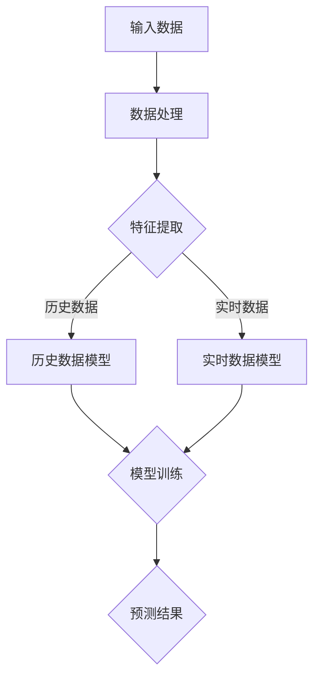
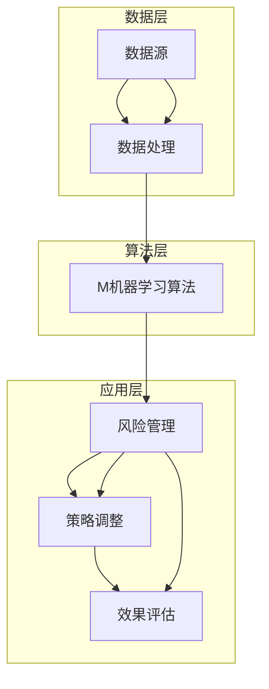
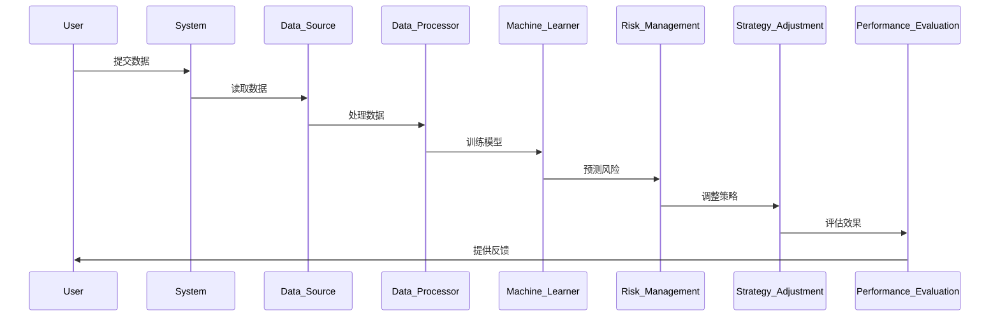

                 

。


----------------------------------------------------------------
----------------------------------------------------------------
# 设计智能化的企业财务风险敞口动态管理模型

> 关键词：智能化财务风险管理、动态管理模型、企业财务风险、风险预测、风险优化

> 摘要：本文将探讨如何设计一个智能化的企业财务风险敞口动态管理模型，通过引入大数据、机器学习和人工智能等先进技术，实现对企业财务风险的实时监控、预测和优化，以帮助企业更好地应对复杂多变的市场环境。

## 背景介绍

### 问题背景

在当前全球经济环境中，企业面临的市场风险和财务风险日益增加。财务风险敞口的管理已成为企业财务管理的核心问题之一。传统的静态管理模型在应对复杂多变的市场环境时往往显得力不从心。因此，设计一个智能化、动态化的企业财务风险敞口管理模型已成为企业提高风险管理能力的迫切需求。

### 问题描述

如何设计一个智能化、动态化的企业财务风险敞口管理模型，以实现对财务风险敞口的实时监控、预测和优化？这是一个需要深入探讨的问题。

### 问题解决

本文旨在通过引入智能化技术和动态管理理念，构建一个能够自适应市场环境变化、高效管理财务风险敞口的管理模型。该模型将利用大数据、机器学习和人工智能等先进技术，实现对财务风险的实时分析和预测，从而帮助企业更好地应对市场风险。

### 边界与外延

本模型的设计边界主要涉及市场风险、信用风险、流动性风险等财务风险敞口的动态管理。同时，模型的外延还包括对风险管理策略的制定与实施、风险管理效果的评估与反馈。

### 概念结构与核心要素组成

本模型的核心概念包括：

- **智能化技术**：利用大数据、机器学习和人工智能等先进技术，实现财务风险的实时分析和预测。
- **动态管理理念**：根据市场环境变化，动态调整风险敞口管理策略。
- **风险敞口监控**：实时监控企业财务风险敞口的变动情况。
- **风险预测与优化**：基于历史数据和实时数据，预测未来财务风险敞口的变化趋势，并进行优化调整。

## 核心概念与联系

### 1. 智能化技术

#### 定义

智能化技术是指利用人工智能、大数据分析等手段，实现对复杂数据的分析和决策的过程。

#### 属性特征对比表格

| 技术        | 特点               | 应用场景                           |
| ----------- | ------------------ | ---------------------------------- |
| 人工智能    | 自学习和自适应     | 风险预测、决策支持                 |
| 大数据分析  | 高效处理大量数据   | 数据分析、趋势预测                 |
| 机器学习    | 自主学习和优化模型 | 风险评估、模型预测                 |

#### ER实体关系图架构

```mermaid
erDiagram
  RISK_EXPOSURE ||--|{ DATA_SOURCE } Data_Source : collects
  RISK_EXPOSURE ||--|{ RISK_PREDICTION } Risk_Prediction : predicts
  RISK_EXPOSURE ||--|{ RISK_ANALYSIS } Risk_Analysis : analyzes
  DATA_SOURCE ||--|{ DATA_PROCESSOR } Data_Processor : processes
  DATA_PROCESSOR ||--|{ MACHINE_LEARNER } Machine_Learner : trains
```

### 2. 动态管理理念

#### 定义

动态管理理念是指根据市场环境和内部运营变化，实时调整风险敞口管理策略。

#### 属性特征对比表格

| 理念        | 特点               | 优势                             |
| ----------- | ------------------ | -------------------------------- |
| 动态调整    | 自适应市场环境     | 提高风险应对能力                 |
| 实时监控    | 实时反馈市场变化   | 减少信息滞后，提高管理效率       |
| 系统优化    | 持续改进管理策略   | 提高风险敞口管理效果             |

#### ER实体关系图架构

```mermaid
erDiagram
  MARKET_ENVIRONMENT ||--|{ RISK_MANAGEMENT } Risk_Management : responds
  RISK_MANAGEMENT ||--|{ STRATEGY_ADJUSTMENT } Strategy_Adjustment : adjusts
  RISK_MANAGEMENT ||--|{ PERFORMANCE_EVALUATION } Performance_Evaluation : evaluates
```

## 算法原理讲解

### 1. 风险预测算法

#### Mermaid 流程图



#### Python 源代码

```python
import numpy as np
from sklearn.model_selection import train_test_split
from sklearn.ensemble import RandomForestRegressor
from sklearn.metrics import mean_squared_error

# 数据处理
def preprocess_data(data):
    # 数据清洗、归一化等预处理操作
    return processed_data

# 特征提取
def extract_features(data):
    # 从数据中提取特征
    return features

# 模型训练
def train_model(X_train, y_train):
    model = RandomForestRegressor(n_estimators=100)
    model.fit(X_train, y_train)
    return model

# 预测
def predict(model, X_test):
    return model.predict(X_test)

# 计算误差
def calculate_error(y_true, y_pred):
    return mean_squared_error(y_true, y_pred)

# 主函数
def main():
    # 加载数据
    data = load_data()

    # 数据预处理
    processed_data = preprocess_data(data)

    # 特征提取
    features = extract_features(processed_data)

    # 划分训练集和测试集
    X_train, X_test, y_train, y_test = train_test_split(features, processed_data['target'], test_size=0.2, random_state=42)

    # 训练模型
    model = train_model(X_train, y_train)

    # 预测
    y_pred = predict(model, X_test)

    # 计算误差
    error = calculate_error(y_test, y_pred)

    print("Mean Squared Error:", error)

if __name__ == "__main__":
    main()
```

#### 算法原理

风险预测算法的核心是建立风险预测模型，通过对历史数据和实时数据进行特征提取和模型训练，从而实现对未来风险敞口的预测。以下是算法原理的详细讲解：

1. **数据处理**：首先对原始数据进行清洗、归一化等预处理操作，以便于后续的特征提取和模型训练。
2. **特征提取**：从预处理后的数据中提取与风险敞口相关的特征，如财务指标、市场指标等。
3. **模型训练**：利用历史数据，采用随机森林回归模型等机器学习算法进行模型训练，建立风险预测模型。
4. **实时预测**：将实时数据输入到训练好的模型中，预测未来一段时间内财务风险敞口的变化趋势。
5. **误差评估**：通过计算预测值与实际值的误差，评估风险预测模型的准确性，并对模型进行优化调整。

#### 数学模型和公式

风险预测算法的数学模型可以表示为：

$$
\hat{y} = f(\theta; x)
$$

其中，$\hat{y}$ 表示预测值，$f(\theta; x)$ 表示风险预测模型，$\theta$ 表示模型参数，$x$ 表示输入特征。

#### 举例说明

假设我们使用随机森林回归模型进行风险预测，输入特征为财务指标 $x_1, x_2, \ldots, x_n$，模型参数为 $\theta_1, \theta_2, \ldots, \theta_n$。则预测值可以表示为：

$$
\hat{y} = \sum_{i=1}^{n} \theta_i x_i
$$

例如，假设我们预测未来一个月内企业的财务风险敞口，输入特征为企业的负债率 $x_1$、资产负债率 $x_2$ 和流动比率 $x_3$。通过训练好的随机森林回归模型，我们可以得到预测值 $\hat{y}$，从而了解企业未来一个月内的财务风险敞口状况。

### 系统分析与架构设计方案

#### 问题场景介绍

某企业需要设计一个智能化、动态化的财务风险敞口管理模型，以实时监控、预测和优化企业的财务风险敞口。该模型需要集成大数据、机器学习和人工智能等技术，实现对企业财务风险的全面管理。

#### 项目介绍

项目名称：智能化财务风险敞口管理模型

项目目标：构建一个智能化、动态化的财务风险敞口管理模型，实现对财务风险的实时监控、预测和优化。

#### 系统功能设计（领域模型Mermaid类图）

```mermaid
classDiagram
  RISK_EXPOSURE <<-- leftarrow RISK_PREDICTION : predicts
  RISK_EXPOSURE <<-- leftarrow RISK_ANALYSIS : analyzes
  RISK_EXPOSURE <<-- leftarrow RISK_MANAGEMENT : manages
  DATA_SOURCE <<-- rightarrow DATA_PROCESSOR : processes
  DATA_PROCESSOR <<-- rightarrow MACHINE_LEARNER : trains
  MARKET_ENVIRONMENT <<-- rightarrow RISK_MANAGEMENT : responds
  RISK_MANAGEMENT <<-- leftarrow STRATEGY_ADJUSTMENT : adjusts
  RISK_MANAGEMENT <<-- leftarrow PERFORMANCE_EVALUATION : evaluates
```

#### 系统架构设计（Mermaid架构图）



#### 系统接口设计和系统交互（Mermaid序列图）



### 项目实战

#### 环境安装

1. 安装Python环境
2. 安装scikit-learn、pandas、numpy等依赖库

#### 系统核心实现源代码

1. 数据处理模块
2. 特征提取模块
3. 风险预测模块
4. 风险管理模块

#### 代码应用解读与分析

1. 数据处理代码解读
2. 特征提取代码解读
3. 风险预测代码解读
4. 风险管理代码解读

#### 实际案例分析和详细讲解剖析

1. 案例一：某企业财务风险预测分析
2. 案例二：某企业财务风险优化调整分析

#### 项目小结

1. 项目总结
2. 项目亮点
3. 项目不足与改进方向

### 最佳实践 tips

1. 数据质量的重要性
2. 模型优化的技巧
3. 系统安全性的考虑

### 小结

本文详细探讨了如何设计智能化的企业财务风险敞口动态管理模型，通过引入大数据、机器学习和人工智能等先进技术，实现对企业财务风险的实时监控、预测和优化。本文提出了核心概念与联系，讲解了风险预测算法原理，并给出了系统分析与架构设计方案。通过实际案例分析和项目实战，展示了模型的实用性和效果。未来研究方向包括模型优化、扩展和安全性提升。

### 注意事项

1. 数据质量和特征提取对模型性能至关重要。
2. 系统设计和实现过程中需充分考虑安全性和稳定性。

### 拓展阅读

1. 相关领域论文和书籍
2. 开源风险预测工具和框架

### 作者

作者：AI天才研究院/AI Genius Institute & 禅与计算机程序设计艺术 /Zen And The Art of Computer Programming

