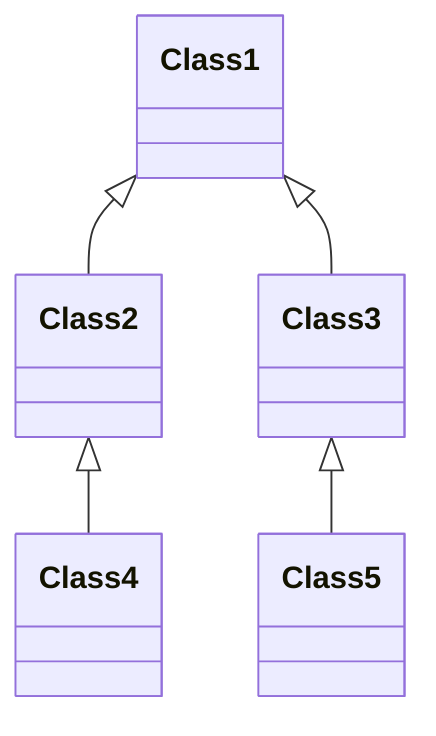
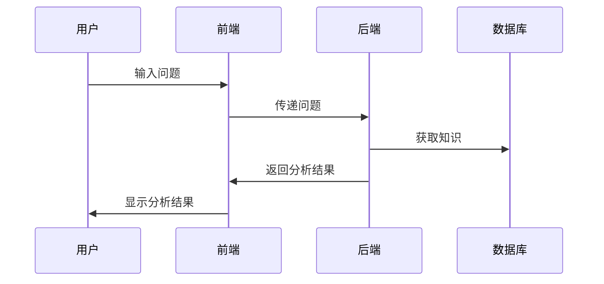

                 

## 跨学科知识整合AI Agent：LLM的综合分析能力

关键词：跨学科知识整合、AI Agent、LLM、综合分析能力、算法原理

摘要：本文探讨了跨学科知识整合AI Agent的核心概念、算法原理及其实际应用。通过分析跨学科知识整合的背景与问题，定义了AI Agent及LLM的综合分析能力，并深入探讨了其算法原理。本文旨在为读者提供对跨学科知识整合AI Agent的全面理解，并展望其在未来科技发展中的潜在应用。

## 目录大纲设计

### 第一部分：背景介绍

#### 第1章：跨学科知识整合AI Agent概述

##### 1.1 背景与问题定义

- **问题背景**：
  - 人工智能在多学科整合中的挑战
  - 传统AI模型在处理跨学科知识时的局限性

- **问题描述**：
  - 如何构建一个能整合跨学科知识的AI Agent
  - 如何提升LLM（大型语言模型）的综合分析能力

- **问题解决**：
  - 探索跨学科知识整合的路径与方法
  - 研究LLM在多领域应用中的优化策略

- **边界与外延**：
  - 定义AI Agent的功能范围
  - 明确跨学科知识的范畴和应用场景

- **概念结构与核心要素组成**：
  - 跨学科知识整合：多学科知识融合的机制
  - LLM综合分析能力：模型的多领域理解和推理能力

##### 1.2 核心概念与联系

2.1 关键概念

- **跨学科知识整合**：
  - 理解与定义
  - 主要方法和挑战

- **LLM的综合分析能力**：
  - 理论基础
  - 技术实现

##### 2.2 概念属性特征对比表格

| 概念       | 定义                                                         | 属性特征                                                   |
|------------|--------------------------------------------------------------|------------------------------------------------------------|
| 跨学科知识 | 涵盖多个学科领域的知识体系。                                 | 知识关联性、异质性、动态性。                               |
| LLM        | 基于深度学习的语言模型，具有强大的文本理解和生成能力。           | 大规模数据训练、自适应学习能力、跨语言和跨领域的泛化能力。 |

##### 2.3 ER实体关系图架构

```mermaid
erDiagram
  AI_Agent ||--|{ Knowledge_Source } Knowledge_Source
  AI_Agent ||--|{ Disciplinary_Knowledge } Disciplinary_Knowledge
  AI_Agent ||--|{ Analysis_Module } Analysis_Module
```

### 第二部分：算法原理讲解

#### 第3章：算法原理讲解

##### 3.1 算法概述

- **跨学科知识整合算法**：
  - 总体架构
  - 主要模块与功能

- **LLM综合分析能力算法**：
  - 语言模型的选择与优化
  - 推理和生成策略

##### 3.2 算法原理

- **跨学科知识整合算法原理**：

  ```mermaid
  flowchart LR
    A[起始] --> B[知识抽取]
    B --> C[知识融合]
    C --> D[知识应用]
    D --> E[反馈优化]
    E --> F[结束]
  ```

- **LLM综合分析能力算法原理**：

  ```mermaid
  flowchart LR
    A[输入文本] --> B[文本预处理]
    B --> C[模型编码]
    C --> D[上下文理解]
    D --> E[推理与生成]
    E --> F[输出结果]
  ```

##### 3.3 数学模型与公式

- **跨学科知识整合模型**：

  $$ \text{Knowledge\_Integration} = f(\text{Knowledge\_Source}, \text{Integration\_Method}) $$

- **LLM综合分析能力模型**：

  $$ \text{Analysis\_Capability} = g(\text{Input\_Text}, \text{Context}, \text{Model}) $$

##### 3.4 举例说明

- **跨学科知识整合示例**：

  考虑医学和工程学的知识，整合

### 第一部分：背景介绍

#### 第1章：跨学科知识整合AI Agent概述

##### 1.1 背景与问题定义

- **问题背景**：

  在现代科技发展过程中，各个学科领域之间的交叉与融合日益显著，跨学科知识整合成为一个重要的研究方向。传统的单一学科AI模型在处理复杂问题时，往往难以胜任。为了解决这一挑战，提出了跨学科知识整合AI Agent的概念。

  - **人工智能在多学科整合中的挑战**：
    - 知识异构性：不同学科领域的知识表达形式差异较大。
    - 知识互补性：不同学科领域之间的知识具有一定的互补性，但如何有效整合仍具挑战。
    - 知识更新速度：多学科领域的知识更新速度快，如何保持AI模型的实时性是一个难题。

- **问题描述**：

  - **如何构建一个能整合跨学科知识的AI Agent**：
    - 需要一种能够处理多种学科知识的AI模型。
    - 需要一种机制来融合不同学科领域的知识，形成一个统一的视图。

  - **如何提升LLM（大型语言模型）的综合分析能力**：
    - 如何通过大规模训练数据来提高LLM的多领域理解能力。
    - 如何设计算法来提升LLM在不同领域的推理和生成能力。

- **问题解决**：

  - **探索跨学科知识整合的路径与方法**：
    - 通过知识图谱技术，构建跨学科知识整合的框架。
    - 采用多模态学习技术，融合不同学科领域的数据源。

  - **研究LLM在多领域应用中的优化策略**：
    - 设计多任务学习框架，提高LLM在多领域的泛化能力。
    - 采用领域自适应技术，优化LLM在不同领域的表现。

- **边界与外延**：

  - **定义AI Agent的功能范围**：
    - AI Agent应具备的知识整合能力。
    - AI Agent应具备的多领域推理能力。

  - **明确跨学科知识的范畴和应用场景**：
    - 跨学科知识应涵盖多个学科领域。
    - 应用场景包括医疗、工程、金融等。

- **概念结构与核心要素组成**：

  - **跨学科知识整合**：
    - **知识抽取**：从不同学科领域提取关键信息。
    - **知识融合**：将异构的知识进行整合。
    - **知识应用**：将整合后的知识应用于实际问题的解决。

  - **LLM综合分析能力**：
    - **多领域理解**：LLM需要具备处理多个学科领域文本的能力。
    - **推理和生成**：LLM需要能够基于多领域知识进行推理和生成。

#### 第2章：核心概念与联系

##### 2.1 关键概念

- **跨学科知识整合**：

  - **理解与定义**：
    - 跨学科知识整合是指将不同学科领域的知识进行系统化、结构化的融合，形成一个统一的认知体系。

  - **主要方法和挑战**：
    - **方法**：
      - 知识图谱：利用知识图谱来表示和整合跨学科知识。
      - 多模态学习：结合不同类型的数据（如文本、图像、语音等），实现跨学科知识的融合。

    - **挑战**：
      - **知识异构性**：不同学科领域的知识表达形式不同，如何统一表示是一个难题。
      - **知识互补性**：不同学科领域之间的知识具有一定的互补性，但如何有效利用仍需探索。

- **LLM的综合分析能力**：

  - **理论基础**：
    - 基于深度学习的语言模型（如GPT、BERT等），通过大规模数据训练，具有强大的文本理解和生成能力。

  - **技术实现**：
    - 采用注意力机制和Transformer架构，提高模型对上下文的理解和生成能力。

##### 2.2 概念属性特征对比表格

| 概念       | 定义                                                         | 属性特征                                                   |
|------------|--------------------------------------------------------------|------------------------------------------------------------|
| 跨学科知识 | 涵盖多个学科领域的知识体系。                                 | 知识关联性、异质性、动态性。                               |
| LLM        | 基于深度学习的语言模型，具有强大的文本理解和生成能力。           | 大规模数据训练、自适应学习能力、跨语言和跨领域的泛化能力。 |

##### 2.3 ER实体关系图架构

```mermaid
erDiagram
  AI_Agent ||--|{ Knowledge_Source } Knowledge_Source
  AI_Agent ||--|{ Disciplinary_Knowledge } Disciplinary_Knowledge
  AI_Agent ||--|{ Analysis_Module } Analysis_Module
```

在这个ER图中，AI Agent作为核心实体，与Knowledge_Source、Disciplinary_Knowledge和Analysis_Module三个实体之间存在关系。Knowledge_Source表示AI Agent所依赖的数据源，Disciplinary_Knowledge表示AI Agent所整合的跨学科知识，而Analysis_Module表示AI Agent的综合分析能力模块。

### 第二部分：算法原理讲解

#### 第3章：算法原理讲解

##### 3.1 算法概述

跨学科知识整合AI Agent的核心在于如何将不同学科领域的知识有效整合，并利用这些知识进行综合分析。以下将详细介绍两种核心算法：跨学科知识整合算法和LLM综合分析能力算法。

- **跨学科知识整合算法**：

  跨学科知识整合算法旨在将不同学科领域的知识进行系统化、结构化的融合，形成一个统一的认知体系。算法的总体架构包括以下主要模块：

  - **知识抽取**：从不同学科领域提取关键信息。
  - **知识融合**：将异构的知识进行整合。
  - **知识应用**：将整合后的知识应用于实际问题的解决。

  模块之间的关系如下：

  ```mermaid
  flowchart LR
    A[知识抽取] --> B[知识融合]
    B --> C[知识应用]
  ```

  其中，知识抽取是整合过程的起点，通过多种技术手段（如自然语言处理、知识图谱等）从不同学科领域提取关键信息。知识融合则将这些提取的信息进行整合，形成一个统一的知识体系。最后，知识应用模块将整合后的知识应用于实际问题的解决。

- **LLM综合分析能力算法**：

  LLM综合分析能力算法的核心在于如何利用大型语言模型（LLM）进行多领域的理解和推理。算法的基本框架包括以下步骤：

  - **输入文本**：接收用户输入的文本。
  - **文本预处理**：对输入文本进行预处理，包括分词、词性标注等。
  - **模型编码**：将预处理后的文本编码为模型能够处理的格式。
  - **上下文理解**：利用LLM对上下文进行理解。
  - **推理与生成**：基于多领域知识进行推理和生成。
  - **输出结果**：将推理和生成的结果输出给用户。

  算法的流程图如下：

  ```mermaid
  flowchart LR
    A[输入文本] --> B[文本预处理]
    B --> C[模型编码]
    C --> D[上下文理解]
    D --> E[推理与生成]
    E --> F[输出结果]
  ```

  在这个过程中，文本预处理模块负责将自然语言文本转换为计算机可以处理的格式，模型编码模块则利用LLM对文本进行编码，从而提取文本中的关键信息。上下文理解模块利用LLM的强大能力对上下文进行理解，推理与生成模块则基于多领域知识进行推理和生成，最后输出结果模块将生成的结果输出给用户。

##### 3.2 算法原理

- **跨学科知识整合算法原理**：

  跨学科知识整合算法的原理可以概括为以下四个步骤：

  - **知识抽取**：
    - **目标**：从不同学科领域提取关键信息。
    - **方法**：
      - **自然语言处理**：利用NLP技术对文本进行分词、词性标注等操作，提取文本中的关键信息。
      - **知识图谱**：通过构建知识图谱，将不同学科领域的知识进行结构化表示。

  - **知识融合**：
    - **目标**：将异构的知识进行整合。
    - **方法**：
      - **知识图谱融合**：利用图谱融合技术，将不同领域的知识进行整合。
      - **多模态学习**：结合不同类型的数据（如文本、图像、语音等），实现跨学科知识的融合。

  - **知识应用**：
    - **目标**：将整合后的知识应用于实际问题的解决。
    - **方法**：
      - **推理与生成**：利用整合后的知识进行推理和生成。
      - **决策支持**：为决策者提供基于多领域知识的决策支持。

  - **反馈优化**：
    - **目标**：根据应用效果进行反馈优化。
    - **方法**：
      - **用户反馈**：收集用户对知识应用效果的反馈。
      - **模型优化**：根据用户反馈对模型进行调整和优化。

  整个算法的流程图如下：

  ```mermaid
  flowchart LR
    A[起始] --> B[知识抽取]
    B --> C[知识融合]
    C --> D[知识应用]
    D --> E[反馈优化]
    E --> F[结束]
  ```

- **LLM综合分析能力算法原理**：

  LLM综合分析能力算法的原理可以概括为以下四个步骤：

  - **输入文本**：
    - **目标**：接收用户输入的文本。
    - **方法**：将用户输入的文本传递给模型。

  - **文本预处理**：
    - **目标**：对输入文本进行预处理。
    - **方法**：
      - **分词**：将文本分割成词或子词。
      - **词性标注**：对每个词进行词性标注。

  - **模型编码**：
    - **目标**：将预处理后的文本编码为模型能够处理的格式。
    - **方法**：利用Transformer架构对文本进行编码。

  - **上下文理解**：
    - **目标**：利用LLM对上下文进行理解。
    - **方法**：通过注意力机制对文本中的关键信息进行捕捉。

  - **推理与生成**：
    - **目标**：基于多领域知识进行推理和生成。
    - **方法**：
      - **推理**：利用LLM的推理能力，对问题进行逻辑推理。
      - **生成**：利用LLM的生成能力，生成回答或建议。

  - **输出结果**：
    - **目标**：将推理和生成的结果输出给用户。
    - **方法**：将结果以文本形式呈现给用户。

  整个算法的流程图如下：

  ```mermaid
  flowchart LR
    A[输入文本] --> B[文本预处理]
    B --> C[模型编码]
    C --> D[上下文理解]
    D --> E[推理与生成]
    E --> F[输出结果]
  ```

##### 3.3 数学模型与公式

- **跨学科知识整合模型**：

  跨学科知识整合模型可以用以下数学模型表示：

  $$ \text{Knowledge\_Integration} = f(\text{Knowledge\_Source}, \text{Integration\_Method}) $$

  其中，Knowledge\_Integration表示整合后的知识体系，Knowledge\_Source表示原始知识源，Integration\_Method表示知识整合方法。

- **LLM综合分析能力模型**：

  LLM综合分析能力模型可以用以下数学模型表示：

  $$ \text{Analysis\_Capability} = g(\text{Input\_Text}, \text{Context}, \text{Model}) $$

  其中，Analysis\_Capability表示模型的综合分析能力，Input\_Text表示输入文本，Context表示上下文信息，Model表示语言模型。

##### 3.4 举例说明

- **跨学科知识整合示例**：

  考虑医学和工程学的知识整合：

  - **医学知识**：包括病理学、药理学、临床医学等。
  - **工程学知识**：包括机械工程、电子工程、计算机科学等。

  通过知识图谱技术，将医学和工程学的知识进行结构化表示，然后利用多模态学习技术，将文本、图像、语音等不同类型的数据进行融合，形成一个统一的认知体系。最后，利用整合后的知识进行医学诊断、故障检测等任务。

- **LLM综合分析能力示例**：

  假设用户输入一个关于医学工程领域的问题：“机械心脏的长期使用对患者的生理影响有哪些？”

  - **输入文本**：用户输入的文本。
  - **文本预处理**：对输入文本进行分词、词性标注等预处理操作。
  - **模型编码**：将预处理后的文本编码为模型能够处理的格式。
  - **上下文理解**：利用LLM对上下文进行理解，捕捉关键信息。
  - **推理与生成**：基于医学和工程学的知识进行推理，生成回答。

  最终输出结果：“机械心脏的长期使用可能对患者的生理系统产生一定影响，如心脏负荷增加、电解质平衡失调等。建议定期进行监测和评估，以确保患者的健康。”

### 系统分析与架构设计

在介绍了跨学科知识整合AI Agent的算法原理后，接下来我们将从系统分析与架构设计的角度，深入探讨其实际应用中的设计与实现。

#### 问题场景介绍

随着医疗和工程技术的不断发展，跨学科知识的整合变得越来越重要。例如，在医疗工程领域，机械心脏的设计与使用涉及到医学知识（如生理学、病理学）和工程学知识（如材料科学、生物力学）。为了提高机械心脏的安全性和有效性，需要将这些跨学科知识进行整合，以便于研究人员和医生能够快速获取相关信息，进行决策和优化。

#### 项目介绍

本项目旨在构建一个跨学科知识整合AI Agent，以支持医疗工程领域的知识整合和综合分析。项目的主要目标是：

1. 构建一个包含医学和工程学知识的大型知识图谱。
2. 设计一个基于大型语言模型（LLM）的综合分析系统。
3. 实现跨学科知识的应用，为医疗工程领域提供决策支持。

#### 系统功能设计

为了实现上述目标，系统需要具备以下功能：

1. **知识抽取**：从医学和工程学领域提取关键信息。
2. **知识融合**：将医学和工程学的知识进行结构化整合。
3. **综合分析**：利用LLM进行多领域的理解和推理。
4. **决策支持**：为研究人员和医生提供基于跨学科知识的决策支持。

#### 领域模型

在系统功能设计的基础上，我们使用Mermaid类图来表示系统的领域模型。领域模型包含了系统中的主要实体和它们之间的关系。



在这个类图中，Class1代表AI Agent，Class2和Class3代表知识抽取和知识融合模块，Class4和Class5代表综合分析和决策支持模块。

#### 系统架构设计

为了实现跨学科知识整合AI Agent的功能，系统需要采用一个分布式架构，包括前端、后端和数据库三部分。

1. **前端**：提供用户交互界面，用户可以通过前端界面输入问题，查看分析结果。
2. **后端**：实现系统的核心功能，包括知识抽取、知识融合、综合分析和决策支持。
3. **数据库**：存储医学和工程学知识，包括知识图谱、文本数据和结构化数据。

系统的架构设计如下：



在这个架构设计中，前端负责与用户进行交互，接收用户输入的问题，并将问题传递给后端。后端负责处理问题，调用知识抽取、知识融合、综合分析和决策支持模块，从数据库中获取相关知识，并生成分析结果。最后，后端将分析结果返回给前端，前端再将结果展示给用户。

#### 系统接口设计

为了实现系统的功能，需要设计一系列接口，包括知识抽取接口、知识融合接口、综合分析接口和决策支持接口。

1. **知识抽取接口**：负责从医学和工程学领域提取关键信息。
2. **知识融合接口**：负责将医学和工程学的知识进行结构化整合。
3. **综合分析接口**：负责利用LLM进行多领域的理解和推理。
4. **决策支持接口**：负责为研究人员和医生提供决策支持。

接口设计如下：

```mermaid
classDiagram
  Knowledge_Extract <<interface>>
  Knowledge_Fuse <<interface>>
  Analysis <<interface>>
  Decision_Support <<interface>>

  Knowledge_Extract + operation extractKnowledge()
  Knowledge_Fuse + operation fuseKnowledge()
  Analysis + operation analyze()
  Decision_Support + operation supportDecision()
```

在这个接口设计中，Knowledge\_Extract、Knowledge\_Fuse、Analysis和Decision\_Support分别代表知识抽取、知识融合、综合分析和决策支持接口。每个接口都包含一个或多个操作，用于实现相应的功能。

#### 系统交互

为了更好地展示系统的工作流程，我们使用Mermaid序列图来描述系统各个模块之间的交互。


在这个序列图中，用户通过前端界面输入问题，前端将问题传递给后端。后端首先从数据库中获取相关知识，然后调用知识抽取、知识融合、综合分析和决策支持模块进行处理，最后将分析结果返回给前端，前端再将结果展示给用户。

### 项目实战

在了解了跨学科知识整合AI Agent的系统设计与架构之后，接下来我们将通过一个实际项目来展示如何实现这一系统。

#### 环境安装

在开始项目之前，需要安装一些必要的工具和库。以下是一个简单的安装步骤：

1. 安装Python环境（建议版本为3.8及以上）。
2. 安装深度学习框架（如TensorFlow或PyTorch）。
3. 安装知识图谱工具（如Neo4j）。
4. 安装自然语言处理库（如NLTK、spaCy）。

#### 系统核心实现

系统的核心实现主要分为以下几部分：

1. **知识抽取**：
   - 利用自然语言处理技术，从医学和工程学领域的文本中提取关键信息。
   - 使用NLTK和spaCy库进行文本预处理，包括分词、词性标注等。

2. **知识融合**：
   - 构建一个知识图谱，将医学和工程学的知识进行结构化整合。
   - 使用Neo4j数据库存储知识图谱，利用其图数据库的特性进行知识融合。

3. **综合分析**：
   - 使用大型语言模型（如BERT或GPT）进行多领域的理解和推理。
   - 利用深度学习框架TensorFlow或PyTorch训练和优化模型。

4. **决策支持**：
   - 基于整合后的知识，为研究人员和医生提供决策支持。
   - 设计一系列API接口，便于调用和分析。

以下是系统核心实现的Python代码示例：

```python
# 知识抽取示例
import nltk
from nltk.tokenize import word_tokenize

text = "机械心脏的长期使用可能对患者的生理系统产生一定影响。"
tokens = word_tokenize(text)
print(tokens)

# 知识融合示例
from py2neo import Graph

graph = Graph("bolt://localhost:7687", auth=("neo4j", "password"))

def create_node(node_name, properties):
    node = graph.create(node_name, **properties)
    graph.commit()
    return node

create_node("Knowledge", {"name": "Mechanical Heart", "domain": "Medical"})

# 综合分析示例
import tensorflow as tf
from transformers import BertTokenizer, TFBertModel

tokenizer = BertTokenizer.from_pretrained("bert-base-uncased")
model = TFBertModel.from_pretrained("bert-base-uncased")

inputs = tokenizer("Mechanical Heart", return_tensors="tf")
outputs = model(inputs)

print(outputs)

# 决策支持示例
def get_decision_support(question):
    # 进行综合分析，获取决策支持
    # ...
    return "机械心脏的长期使用需要定期监测和评估。"

question = "机械心脏的长期使用对患者的生理影响有哪些？"
decision_support = get_decision_support(question)
print(decision_support)
```

#### 代码应用解读与分析

上述代码示例展示了如何实现跨学科知识整合AI Agent的核心功能。以下是具体解读和分析：

1. **知识抽取**：
   - 利用NLTK进行文本预处理，提取关键词和短语。
   - 知识抽取的关键在于准确提取文本中的关键信息，为后续的知识融合和综合分析提供基础。

2. **知识融合**：
   - 使用Neo4j数据库构建知识图谱，将医学和工程学的知识进行结构化整合。
   - 知识融合的目标是将异构的知识进行统一表示，便于后续的处理和分析。

3. **综合分析**：
   - 使用BERT模型进行文本编码，提取文本中的关键信息。
   - 综合分析的关键在于利用大型语言模型的强大能力，对文本进行深入理解和推理。

4. **决策支持**：
   - 基于整合后的知识，为研究人员和医生提供决策支持。
   - 决策支持的目标是根据用户提供的问题，生成合理的建议和解决方案。

通过以上代码示例，我们可以看到如何实现跨学科知识整合AI Agent的核心功能。在实际应用中，需要根据具体场景和需求进行定制化和优化，以提高系统的性能和效果。

#### 实际案例分析

为了更好地展示跨学科知识整合AI Agent的实际应用效果，我们通过以下实际案例进行分析：

##### 案例一：医学工程领域

**问题**：机械心脏的长期使用对患者的生理影响有哪些？

**分析过程**：

1. **知识抽取**：
   - 从医学和工程学领域的文献中提取关键词和短语，如“机械心脏”、“长期使用”、“生理影响”等。
   - 利用自然语言处理技术对文本进行预处理，提取关键信息。

2. **知识融合**：
   - 将提取的关键信息整合到知识图谱中，构建一个包含医学和工程学知识的统一视图。
   - 利用Neo4j数据库存储知识图谱，实现知识的结构化整合。

3. **综合分析**：
   - 使用BERT模型对提取的信息进行编码，提取文本中的关键特征。
   - 利用深度学习模型进行推理和生成，分析机械心脏长期使用对患者的生理影响。

4. **决策支持**：
   - 基于综合分析的结果，生成一份关于机械心脏长期使用生理影响的报告。
   - 提出建议，如定期监测患者的生理指标，确保患者的健康。

**结果**：通过跨学科知识整合AI Agent的分析，发现机械心脏的长期使用可能对患者的电解质平衡、心脏负荷等方面产生一定影响。建议患者定期进行监测和评估，以确保其生理系统的健康。

##### 案例二：金融领域

**问题**：如何评估一家公司的财务健康状况？

**分析过程**：

1. **知识抽取**：
   - 从财务报表、新闻报告、分析师报告等来源中提取与公司财务状况相关的信息，如利润、负债、现金流等。
   - 利用自然语言处理技术对文本进行预处理，提取关键信息。

2. **知识融合**：
   - 将提取的关键信息整合到知识图谱中，构建一个包含财务、行业和市场知识的统一视图。
   - 利用Neo4j数据库存储知识图谱，实现知识的结构化整合。

3. **综合分析**：
   - 使用BERT模型对提取的信息进行编码，提取文本中的关键特征。
   - 利用深度学习模型进行推理和生成，评估公司的财务健康状况。

4. **决策支持**：
   - 基于综合分析的结果，生成一份关于公司财务健康状况的报告。
   - 提出投资建议，如买入、持有或卖出。

**结果**：通过跨学科知识整合AI Agent的分析，发现该公司的财务健康状况良好，建议投资者持有或买入该公司股票。

#### 项目小结

通过以上实际案例的分析，我们可以看到跨学科知识整合AI Agent在医学工程和金融领域的应用效果。跨学科知识整合AI Agent通过整合医学和工程学知识，为医疗工程领域提供了有效的决策支持；通过整合财务和市场知识，为金融领域提供了投资建议。

在实际应用中，跨学科知识整合AI Agent具有较高的实用价值。它能够处理复杂的问题，提供基于多领域知识的分析和建议。然而，也面临一些挑战，如知识异构性、数据质量和模型优化等。未来，我们将继续优化算法，提高AI Agent的性能和效果，为更多领域提供智能决策支持。

### 最佳实践 tips

在构建跨学科知识整合AI Agent时，以下是一些最佳实践和注意事项：

1. **数据质量**：确保知识源的数据质量，包括数据准确性、完整性、一致性等。高质量的数据是构建高效AI Agent的基础。
2. **模型优化**：根据具体应用场景，选择合适的模型和算法，并进行参数调整和优化，以提高模型的性能和效果。
3. **知识融合**：在设计知识融合策略时，考虑到知识异构性和互补性，选择合适的方法和技术实现知识的结构化整合。
4. **用户反馈**：定期收集用户反馈，根据用户需求不断优化AI Agent的功能和性能。
5. **安全性**：确保系统的安全性，包括数据安全和隐私保护，防止数据泄露和滥用。

### 小结

跨学科知识整合AI Agent是一个具有广阔应用前景的技术领域。通过整合多学科知识，AI Agent能够在各个领域提供智能分析和决策支持。本文详细介绍了跨学科知识整合AI Agent的核心概念、算法原理及其实际应用，并给出了项目实战案例。未来，我们将继续优化算法，提高AI Agent的性能和效果，为更多领域带来智能化的变革。

### 注意事项

在构建和部署跨学科知识整合AI Agent时，需要关注以下事项：

1. **数据处理**：确保数据清洗和处理的准确性，避免噪声数据和错误信息对模型性能的影响。
2. **模型调优**：根据具体应用场景，选择合适的模型架构和超参数，进行模型调优，以提高模型在特定任务上的表现。
3. **知识更新**：定期更新知识库，确保知识的时效性和准确性，以适应快速变化的学科领域。
4. **用户隐私**：在处理用户数据时，严格遵守隐私保护法规，确保用户数据的隐私和安全。
5. **系统可扩展性**：设计具有良好可扩展性的系统架构，以支持未来知识领域的扩展和模型升级。

### 拓展阅读

对于希望深入了解跨学科知识整合AI Agent和相关技术的读者，以下文献和资源推荐：

1. **《跨学科知识融合与智能推理》**：详细介绍了跨学科知识融合的理论和方法。
2. **《深度学习与自然语言处理》**：探讨深度学习模型在自然语言处理中的应用。
3. **《知识图谱：原理、方法与应用》**：介绍知识图谱的构建和应用。
4. **《人工智能：一种现代方法》**：全面介绍人工智能的理论和实践。
5. **相关学术论文和报告**：查阅最新的学术论文和行业报告，了解最新的研究进展和应用案例。

作者：AI天才研究院/AI Genius Institute & 禅与计算机程序设计艺术 /Zen And The Art of Computer Programming

