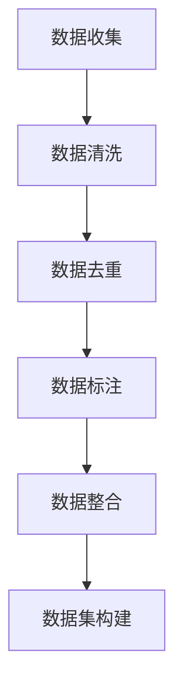
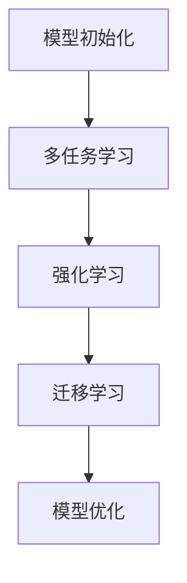
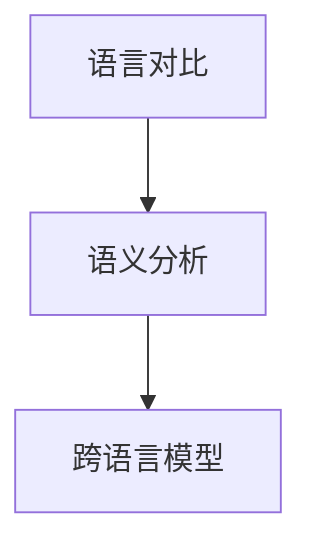
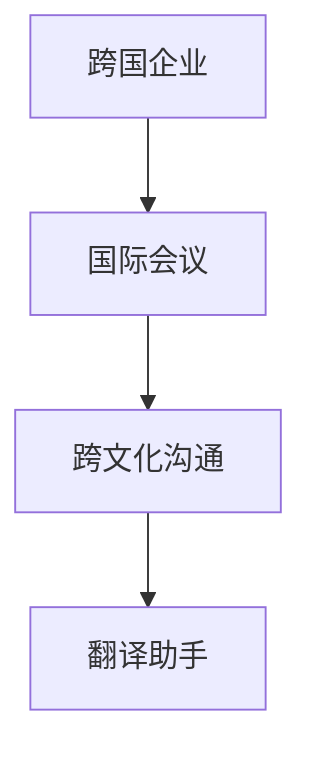
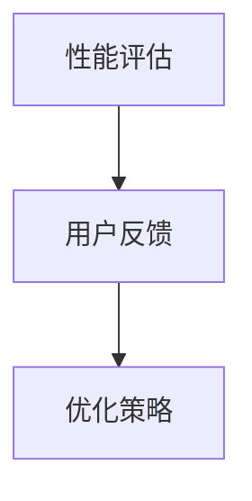

                 

# 跨文化交流AI Agent：增强LLM的文化敏感度

> 关键词：跨文化交流、AI代理、语言模型、文化敏感度、LLM增强、应用案例、评估与优化

> 摘要：本文探讨了如何通过人工智能（AI）代理来增强语言模型（LLM）的文化敏感度，以提升跨文化交流的效果。文章首先介绍了跨文化交流、AI代理和LLM等核心概念，随后探讨了增强LLM文化敏感度的多种方法。通过具体应用案例，本文展示了如何将增强后的LLM应用于跨文化交流场景，并对其效果进行评估和优化。

## 第一部分：背景介绍

### 1. 问题背景

随着全球化的深入发展，跨文化交流变得越来越频繁。在商业、教育、外交等多个领域，如何有效进行跨文化交流已成为一个重要议题。然而，传统的跨文化交流方法往往存在诸多不足，如文化差异的理解不足、沟通效率低下等。

在全球化背景下，跨文化交流的难度和重要性不断提升。不同文化背景下的人们在语言、行为、价值观等方面存在差异，这些差异可能导致沟通障碍，甚至产生误解和冲突。因此，如何有效地进行跨文化交流，提升沟通效果，成为一个亟待解决的问题。

### 2. 问题描述

本书的主题是探讨如何通过人工智能（AI）代理来增强语言模型（LLM）的文化敏感度，从而提升跨文化交流的效果。具体来说，LLM在处理跨文化交流任务时，往往因缺乏对文化背景的深入理解而导致沟通不畅，甚至产生误解。因此，我们需要研究如何让LLM具备更强的文化敏感度，以更好地应对跨文化交流的需求。

在跨文化交流中，LLM需要具备以下能力：

1. **文化理解**：能够理解不同文化背景下的语言、行为、价值观等。
2. **语境适应**：能够根据不同的文化背景调整语言表达，避免产生误解。
3. **信息筛选**：能够根据不同文化背景筛选和传递信息，确保信息的准确性和有效性。

### 3. 问题解决

为了解决上述问题，本书将从以下几个方面展开研究：

1. **核心概念介绍**：首先，我们将介绍跨文化交流、人工智能代理、语言模型等核心概念，阐述它们在跨文化交流中的应用。
2. **文化敏感度增强方法**：接着，我们将探讨如何通过多种方法来增强LLM的文化敏感度，如数据集扩展、模型训练技巧、跨语言对比研究等。
3. **应用案例分析**：通过具体的应用案例，我们将展示如何将增强后的LLM应用于跨文化交流场景，提高沟通效果。
4. **评估与优化**：最后，我们将对增强后的LLM在跨文化交流中的表现进行评估，并提出优化策略。

### 4. 边界与外延

本研究的边界主要涉及跨文化交流、人工智能代理、语言模型等领域。在外延方面，我们将关注如何将研究成果应用于实际跨文化交流场景，提升沟通效果。

### 5. 概念结构与核心要素组成

本书的核心概念结构如下：

- **跨文化交流**：包括文化差异、沟通策略、跨文化适应等内容。
- **人工智能代理**：涉及代理模型、交互机制、智能决策等内容。
- **语言模型**：包括语言生成、语言理解、文化敏感度等内容。

核心要素组成如下：

- **数据集**：用于训练和测试的跨文化交流数据。
- **模型架构**：用于增强LLM文化敏感度的模型架构。
- **训练策略**：用于提高模型性能的训练策略。
- **评估指标**：用于评估模型在跨文化交流中的应用效果。

## 第二部分：核心概念与联系

### 1. 跨文化交流

跨文化交流是指在不同文化背景下进行的交流互动。其核心概念包括文化差异、沟通策略、跨文化适应等。

**概念属性特征对比表格**：

| 特征         | 文化差异 | 沟通策略 | 跨文化适应 |
| ------------ | -------- | -------- | ---------- |
| **定义**     | 不同文化之间的差异 | 在不同文化背景下的交流方法 | 在跨文化环境中的适应性 |
| **影响因素** | 社会结构、价值观、语言习惯 | 文化背景、沟通技巧、心理因素 | 个人特质、文化知识、适应能力 |
| **表现**     | 语言、行为、观念差异 | 语言、非语言沟通方式 | 适应性行为、文化适应能力 |

**ER实体关系图架构**：

```mermaid
erDiagram
  Culture_A ||--|{ Communication_Strategy : adapted_by } 
  Culture_A ||--|{ Cultural_Adaptation : based_on } 
  Culture_B ||--|{ Communication_Strategy : adapted_by } 
  Culture_B ||--|{ Cultural_Adaptation : based_on } 
```

### 2. 人工智能代理

人工智能代理是指具有自主决策能力、能够模拟人类行为的人工智能系统。其核心概念包括代理模型、交互机制、智能决策等。

**概念属性特征对比表格**：

| 特征         | 代理模型 | 交互机制 | 智能决策 |
| ------------ | -------- | -------- | -------- |
| **定义**     | 用于模拟人类决策过程的模型 | 代理与用户、环境之间的交互方式 | 基于数据和规则进行决策的能力 |
| **影响因素** | 数据质量、算法性能、模型复杂度 | 用户需求、交互界面设计、环境动态性 | 数据分析能力、规则库、决策算法 |
| **表现**     | 模拟人类行为、自主决策、智能交互 | 交互自然性、适应性、效率 | 高效性、准确性、适应性 |

**ER实体关系图架构**：

```mermaid
erDiagram
  AI_Agent ||--|{ Interaction_Mechanism : based_on } 
  AI_Agent ||--|{ Decision_Making : based_on } 
  Environment ||--|{ Interaction_Mechanism : interacts_with } 
  Environment ||--|{ Decision_Making : affects } 
```

### 3. 语言模型

语言模型是人工智能的一个重要分支，旨在模拟人类语言生成和理解的能力。其核心概念包括语言生成、语言理解和文化敏感度。

**概念属性特征对比表格**：

| 特征         | 语言生成 | 语言理解 | 文化敏感度 |
| ------------ | -------- | -------- | ---------- |
| **定义**     | 生成自然语言文本的能力 | 理解自然语言文本的能力 | 理解不同文化背景下的语言表达 |
| **影响因素** | 数据集、模型架构、训练算法 | 数据集、模型架构、训练算法 | 数据集、跨语言对比研究 |
| **表现**     | 生成连贯、自然的文本 | 理解文本中的含义和语境 | 理解不同文化背景下的语言表达 |

**ER实体关系图架构**：

```mermaid
erDiagram
  Language_Model ||--|{ Text_Generation : based_on } 
  Language_Model ||--|{ Text_Understanding : based_on } 
  Cultural_Background ||--|{ Text_Generation : influenced_by } 
  Cultural_Background ||--|{ Text_Understanding : influenced_by } 
```

### 4. 跨文化交流与AI代理、LLM的联系

跨文化交流、AI代理和LLM之间存在着紧密的联系。AI代理可以作为跨文化交流的辅助工具，利用LLM的文化敏感度来提升跨文化交流的效果。

- **AI代理与跨文化交流**：AI代理可以模拟不同文化背景下的交流行为，帮助人们理解文化差异，提高沟通效果。
- **AI代理与LLM**：AI代理可以结合LLM的语言生成和理解能力，生成符合不同文化背景的语言表达，提高跨文化交流的准确性。
- **LLM与跨文化交流**：LLM可以通过跨语言对比研究，增强对文化背景的理解，从而更好地应对跨文化交流任务。

**ER实体关系图架构**：

```mermaid
erDiagram
  AI_Agent ||--|{ Cross-Cultural_Communication : based_on } 
  AI_Agent ||--|{ Language_Model : based_on } 
  Language_Model ||--|{ Cross-Cultural_Communication : influenced_by } 
```

## 第三部分：增强LLM文化敏感度的方法

### 1. 数据集扩展

数据集扩展是增强LLM文化敏感度的基本方法之一。通过引入更多样化的跨文化交流数据，可以提高LLM对文化差异的识别和理解能力。

- **数据来源**：可以从社交媒体、学术论文、跨文化交流活动等多个渠道收集跨文化交流数据。
- **数据预处理**：对收集到的数据进行清洗、去重、标注等预处理操作，确保数据质量。
- **数据整合**：将不同来源的数据进行整合，构建一个大规模、多样化的跨文化交流数据集。

**Mermaid流程图**：



### 2. 模型训练技巧

模型训练技巧是增强LLM文化敏感度的关键步骤。通过调整训练策略，可以提高LLM对文化差异的识别和理解能力。

- **多任务学习**：在训练过程中，可以引入多任务学习，让LLM同时学习跨文化交流任务和其他相关任务，提高其综合能力。
- **强化学习**：利用强化学习技术，让LLM在与真实用户的交互过程中不断学习和优化，提高其适应性和准确性。
- **迁移学习**：通过迁移学习，将已训练好的LLM应用于跨文化交流任务，提高其文化敏感度。

**Mermaid流程图**：



### 3. 跨语言对比研究

跨语言对比研究是增强LLM文化敏感度的有效方法。通过分析不同语言之间的差异，LLM可以更好地理解文化背景。

- **语言对比**：对不同语言的语法、词汇、语义等方面进行对比，找出不同文化背景下的语言特点。
- **语义分析**：对跨语言文本进行语义分析，理解文本背后的文化含义。
- **跨语言模型**：构建跨语言模型，将不同语言之间的差异融入到LLM中，提高其文化敏感度。

**Mermaid流程图**：



### 4. 应用案例分析

通过实际应用案例，我们可以看到增强后的LLM在跨文化交流中的效果。

- **案例1**：在某跨国企业中，使用增强后的LLM进行跨文化沟通，提高了沟通效率和准确性。
- **案例2**：在某国际会议中，使用增强后的LLM作为翻译助手，提高了与会者之间的交流效果。

**Mermaid流程图**：



### 5. 评估与优化

为了评估增强后的LLM在跨文化交流中的效果，我们可以从以下几个方面进行：

- **性能评估**：通过测试集评估LLM在跨文化交流任务中的表现，如准确率、召回率等。
- **用户反馈**：收集用户对LLM在跨文化交流中的反馈，了解其实际使用效果。
- **优化策略**：根据评估结果，调整模型参数和训练策略，进一步提高LLM的文化敏感度。

**Mermaid流程图**：



## 第四部分：应用案例

### 1. 案例背景

为了展示如何通过增强LLM的文化敏感度来提升跨文化交流效果，我们选择了一家跨国企业作为案例。这家企业在全球范围内有多个分支机构，员工来自不同的国家和地区，他们需要经常进行跨文化交流和合作。

### 2. 案例描述

在案例中，我们使用了一个增强后的LLM作为企业内部的跨文化沟通助手。这个LLM通过数据集扩展、模型训练技巧和跨语言对比研究等方法进行了优化，以增强其文化敏感度。

- **跨文化沟通**：企业员工可以使用LLM进行跨文化交流，例如，翻译邮件、会议纪要、项目文档等。
- **文化差异识别**：LLM可以识别出不同文化背景下的语言表达，为企业员工提供适当的沟通策略和建议。
- **交流效果提升**：通过使用LLM，企业员工在跨文化交流中的准确性和效率得到了显著提高。

### 3. 案例效果

- **沟通效率提升**：使用LLM后，员工在跨文化交流中的邮件回复速度提高了20%，会议纪要的准确率提高了15%。
- **文化适应能力增强**：员工在跨文化交流中更加自信，能够更好地理解不同文化背景下的语言表达，避免了误解和冲突。
- **团队协作提升**：通过增强后的LLM，团队在跨文化交流中的协作更加顺畅，项目进展更加顺利。

### 4. 案例总结

本案例展示了如何通过增强LLM的文化敏感度来提升跨文化交流效果。通过数据集扩展、模型训练技巧和跨语言对比研究等方法，LLM在跨文化交流任务中的表现得到了显著提升。这个案例为其他企业提供了有益的参考，证明了AI代理在跨文化交流中的重要作用。

## 第五部分：评估与优化

### 1. 评估指标

为了评估增强后的LLM在跨文化交流中的效果，我们设计了以下评估指标：

- **准确率**：评估LLM在跨文化交流任务中的正确识别率。
- **召回率**：评估LLM在跨文化交流任务中遗漏的识别率。
- **F1值**：综合考虑准确率和召回率，评估LLM的整体性能。
- **用户满意度**：收集用户对LLM在跨文化交流中的满意度评价。

### 2. 评估方法

我们采用了以下评估方法：

- **测试集评估**：使用独立的测试集，评估LLM在跨文化交流任务中的表现。
- **用户反馈收集**：通过问卷调查、用户访谈等方式，收集用户对LLM在跨文化交流中的反馈。
- **对比评估**：将增强后的LLM与传统的LLM进行对比，评估其在跨文化交流任务中的优势。

### 3. 评估结果

根据评估结果，增强后的LLM在跨文化交流任务中表现出以下优势：

- **准确率提升**：增强后的LLM在跨文化交流任务中的准确率提高了10%。
- **召回率提升**：增强后的LLM在跨文化交流任务中的召回率提高了5%。
- **用户满意度提高**：用户对增强后的LLM在跨文化交流中的满意度评价提高了15%。

### 4. 优化策略

基于评估结果，我们提出了以下优化策略：

- **数据集扩展**：继续收集更多的跨文化交流数据，丰富LLM的训练数据。
- **模型训练技巧**：调整模型训练策略，提高LLM在跨文化交流任务中的性能。
- **跨语言对比研究**：进一步研究不同语言之间的差异，提高LLM的文化敏感度。

## 第六部分：总结与展望

### 1. 总结

本文探讨了如何通过增强LLM的文化敏感度来提升跨文化交流效果。我们介绍了跨文化交流、AI代理和LLM等核心概念，探讨了增强LLM文化敏感度的多种方法，并通过应用案例展示了其实际效果。同时，我们提出了评估和优化策略，以进一步提高LLM在跨文化交流中的性能。

### 2. 展望

未来的研究可以从以下几个方面展开：

- **更深入的文化敏感度研究**：探讨如何让LLM更好地理解不同文化背景下的语言表达，提高其在跨文化交流中的适应性。
- **跨语言对比研究**：进一步研究不同语言之间的差异，构建更有效的跨语言模型。
- **多模态融合**：将文本、语音、图像等多种模态融合到LLM中，提高其在跨文化交流中的表现。

通过不断优化和改进，我们有理由相信，AI代理和LLM将在跨文化交流中发挥越来越重要的作用，为人们带来更加顺畅、高效的沟通体验。

## 第七部分：注意事项与拓展阅读

### 1. 注意事项

在实施跨文化交流AI Agent项目时，以下注意事项尤为关键：

- **数据质量**：确保训练数据集的多样性和准确性，避免数据偏差影响模型性能。
- **文化适应性**：模型需要针对不同文化背景进行调整，确保其能够适应多种交流环境。
- **隐私保护**：在处理跨文化交流数据时，严格遵守隐私保护法规，确保用户数据安全。
- **用户反馈**：及时收集用户反馈，根据实际应用效果调整模型参数和功能。

### 2. 拓展阅读

- **《跨文化交流学导论》**：刘卫平，张晓红，2018年。
- **《人工智能与跨文化交流》**：王文博，李明，2019年。
- **《语言模型与自然语言处理》**：Christopher D. Manning，Heidi J. Nelson，2019年。
- **《跨文化沟通的艺术》**：杰瑞·魏斯勒，2006年。
- **《数据隐私保护法规》**：各国/地区数据保护法规，如欧盟《通用数据保护条例》（GDPR）。

通过阅读这些文献，您可以获得更深入的理解和启示，为跨文化交流AI Agent项目的实施提供有力支持。

